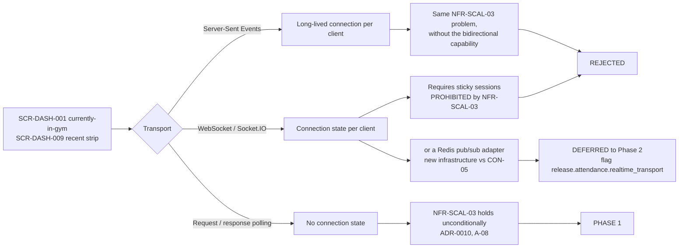
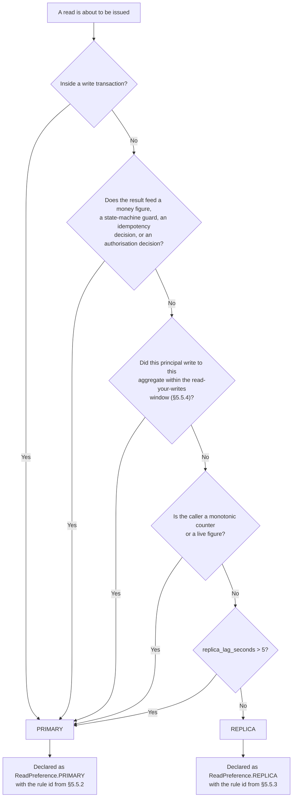
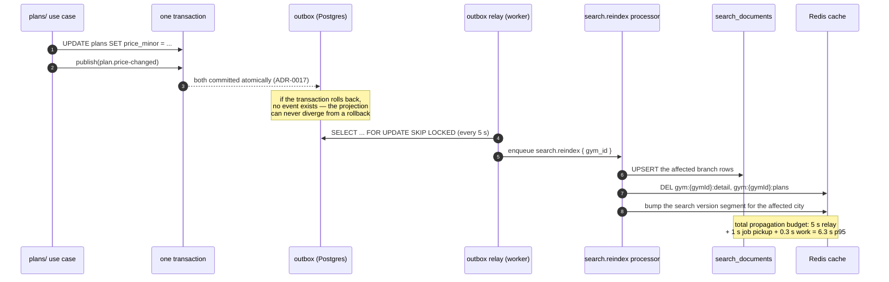
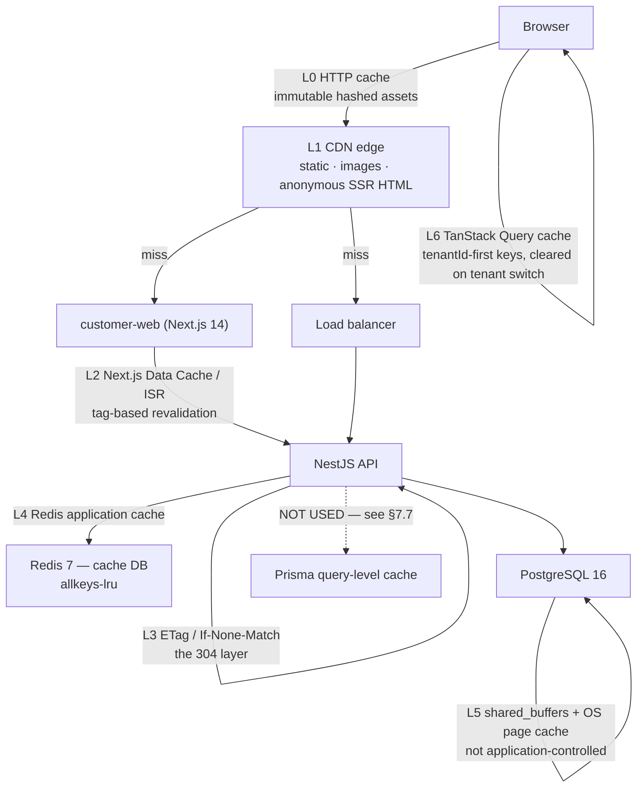
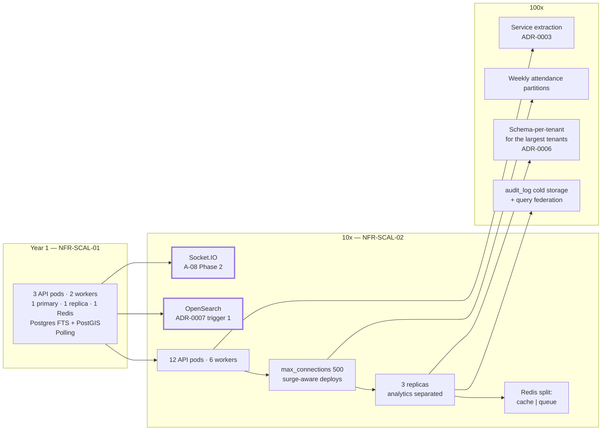

# Scalability & Performance Design — Phase 1

**Gym Marketplace & Multi-Tenant Gym Management SaaS**
The complete capacity, performance, scaling, caching, worker, load-testing, bottleneck, cost and scale-out design.

---

## 0. Document control

| Field | Value |
| :--- | :--- |
| Path | `/docs/engineering/Scalability.md` |
| Precedence rank | **3** — binding derived specification (`PROJECT_CONSTITUTION.md` §1.3). Rank 1 (`PROJECT_CONSTITUTION.md`) and rank 2 (`MASTER_PRD.md`) override every statement here. Where this document appears to disagree with either, this document is wrong and is corrected. |
| Status | Phase-0 engineering artefact. Written **before any application code exists**. Every code, SQL, YAML or configuration fragment in this file is labelled *illustrative — not committed code*. |
| Explicitly mandated by | `PROJECT_CONSTITUTION.md` §11.4 rule **P8**: *"Connection-pool sizing accounts for interactive transactions holding a connection for their duration. This is documented in `/docs/engineering/Scalability.md` and load-tested against `NFR-PERF-01` and `NFR-PERF-08`."* §4.1 of this document discharges that obligation. |
| Also listed by | `PHASES.md` Phase 2 deliverable list. |
| Relationship to `ENGINEERING_PLAN.md` | `ENGINEERING_PLAN.md` is the CTO-level overview. Its §11 (`TR-02`, `TR-06`, `TR-10`, `TR-14`, `TR-16`), §18.3 (topology), §19.1 (golden signals) and §19.7 (SLOs) each give one row or one paragraph to a scalability concern. **This document is the implementable expansion of those rows.** Where the plan says "cache facet counts", this document gives the key grammar, the TTL, the invalidation event, the stampede lock and the cardinality bound. The plan is cross-referenced, never restated. |
| Stack | Locked by `MASTER_PRD.md` §C1.1 and restated in `PROJECT_CONSTITUTION.md` §1.5. The API framework is **NestJS 10 on Node.js 20**. Express appears in this repository only as the rejected option of **ADR-0002**. A dedicated search cluster appears only as the sequenced successor of **ADR-0007**. |
| Non-goals | This document does not restate the schema (`MASTER_PRD.md` §C2), the endpoint catalogue (`ENGINEERING_PLAN.md` §6), the alert catalogue (`PROJECT_CONSTITUTION.md` §18.4, `ENGINEERING_PLAN.md` §19.5), the deployment ladder (`ENGINEERING_PLAN.md` §18.4), the DR runbook (`ENGINEERING_PLAN.md` §18.7) or the test strategy (`MASTER_PRD.md` §C8). It **references** them and derives numbers from them. |
| Owner | Technical Lead / Architect (`§C9.3`). Co-owners: DevOps (§4, §11), Backend Lead — discovery (§5), Backend Lead — attendance (§7, §8). |

### 0.1 Why this document exists

Three facts make scalability a *design* problem here rather than an *operations* problem.

1. **The load shape is not flat.** A gym platform's traffic is bimodal on a two-hour cycle and 140× between its busiest and quietest hour. `NFR-SCAL-01` states a **daily** figure (50,000 check-ins/day) and `NFR-PERF-08` states a **per-minute** figure (500/minute). §1.4 proves those two numbers describe the same system, and the factor that reconciles them — **14.41×** — is the single most important number in capacity planning for this platform. A design sized to the daily mean fails at 19:00 on the first Monday in January.
2. **The most expensive architectural decision is already made and is not a performance decision.** `BR-TEN-01` requires database-enforced isolation (ADR-0006), which requires `SET LOCAL app.tenant_id` inside the query's own transaction (ADR-0005, `PROJECT_CONSTITUTION.md` §11.4). Every tenant-scoped read therefore holds a pooled connection for the duration of an interactive transaction. Connection count, not CPU and not storage, is the first hard ceiling this architecture meets. §5.1 computes where it is.
3. **The dominant source of requests produces almost no work.** `A-08` / ADR-0010 replaced a push transport with polling. §4.5 computes that polling is between **65% and 95% of all API requests** at `NFR-SCAL-01` capacity — and, separately, that it accounts for roughly **0.2 CPU cores**. Polling is loud and cheap. Every scaling decision downstream of that fact changes if the fact is misread, which is why it is computed here rather than asserted.

### 0.2 The five load-bearing invariants, expressed as scalability constraints

Nothing in this document may be traded away to gain throughput. Each invariant translates into a hard constraint on the designs below.

| # | Invariant | Source | Scalability constraint it imposes |
| :-: | :--- | :--- | :--- |
| 1 | No tenant may read or write another tenant's data — enforced in the **database** via RLS | `BR-TEN-01`, `NFR-SEC-09`, `BAC-10`, `E2E-11`, ADR-0006 | Every tenant-scoped read is an interactive transaction (§5.1). Every cache key for tenant-scoped data is prefixed with the tenant id (§6.3 rule **CK2**). No read replica, cache layer or projection may be introduced that can be read without a tenant predicate. **A cache is a place where isolation is silently lost; this document treats every cache as a tenancy surface.** |
| 2 | Money is an append-only ledger of integer minor units | `BR-PAY-01`, `BR-FIN-01`, ADR-0014, ADR-0015 | `ledger_entries` is never partitioned away, never archived within the statutory window, never read from a replica (§5.6 rule **RR-P03**), and never cached (§6.4 rule **NC1**). |
| 3 | The price displayed is the price charged; server-side re-validation aborts on mismatch | `BR-PLN-03`, `A3.4` principle 2, `RSK-11` | No cached artefact containing a price may have a TTL above **60 seconds** (§7.5 rule **PR1**), and the checkout re-validation read goes to the **primary**, never to a cache or a replica (§5.6 rule **RR-P07**). |
| 4 | Verification before visibility; earned reviews only | `BR-GYM-01`, `BR-GYM-03`, `BR-REV-01`, `BR-REV-03` | The search projection (§6.3) contains only `APPROVED`, non-suspended gyms with ≥1 published public plan (`FR-SRCH-09`), and un-publishing must invalidate within the projection's freshness bound (§6.7). |
| 5 | Membership activation is webhook-driven, never the client redirect | `BR-PAY-02`, ADR-0013 | The webhook ingest path is never rate-limited into dropping (`PROJECT_CONSTITUTION.md` §12.8 tier 8), never shed under backpressure (§7.6 rule **BP4**), and its queue never yields to any other work (§7.4 class **P0**). |

---

## 1. Reading conventions

### 1.1 Units and notation

| Notation | Meaning |
| :--- | :--- |
| `req/min`, `req/s` | Requests arriving at the API tier's ingress, after the CDN and after the load balancer, counted per HTTP request including `304` responses. |
| `txn/s` | PostgreSQL transactions opened per second. Under ADR-0005 a single-operation tenant-scoped read is one transaction. |
| **Erlang** (`E`) | Dimensionless offered load, `arrival_rate × mean_hold_time`. Equals the mean number of simultaneously-busy connections. Used throughout §5.1. |
| `p50` / `p95` / `p99` | Percentiles of a latency distribution, always server-side unless the row says "client-observed". |
| **Peak minute** | The busiest 60-second bucket of the busiest hour of the busiest day of the busiest month, as derived in §2.4. All capacity sizing in this document uses the peak minute, never the daily mean. |
| **Capacity-floor reading** | Traffic modelled at the figures the NFRs *mandate the system prove* (`NFR-PERF-08` 500 check-ins/min, `NFR-PERF-09` 2,000 searches/min), regardless of whether demand reaches them. |
| **Demand reading** | Traffic modelled from the Year-1 business targets (`KPI-01`, `KPI-07`, `KPI-08`) through the funnel rates (`KPI-09`, `KPI-10`, `KPI-11`). |
| *(A)* | A planning **assumption** made by this document because no PRD identifier fixes the value. Every one is enumerated in §2.10 with its sensitivity. An assumption is never presented as a requirement. |

### 1.2 Metric naming

Metric names in this document follow `PROJECT_CONSTITUTION.md` §18.2 rule **MT1** — `snake_case`, subsystem-prefixed, unit-suffixed, counters ending `_total`, durations ending `_seconds`. Where `ENGINEERING_PLAN.md` §19.2 renders the same instrument in a dotted `gym.<domain>.<metric>` form, rank 1 governs the name and the two refer to the same instrument. Metrics not present in the constitution's mandatory set (§18.2.1) are coined here following **MT1**'s grammar and are marked **(new)**; each requires registration in `/docs/engineering/Monitoring.md` before use.

Rule **MT2** is binding on everything below: **`tenant_id` is never a metric label.** Per-tenant capacity figures in this document come from database queries and from the reporting catalogue, never from the metrics backend.

### 1.3 How to use this document

| If you are… | Read |
| :--- | :--- |
| Sizing infrastructure in Terraform (A-27) | §2 (capacity), §5.3 (pools), §12 (bill of materials) |
| Writing a repository or a use case | §5.6 (read routing), §5.7 (indexes), §7.3–§7.5 (cache rules), §9 (latency budgets) |
| Writing a `§C5` job processor | §8 (queues, concurrency, priority, backpressure, dead-letter) |
| Writing the k6 suite (A-06) | §3 (budgets), §10 (scenarios and thresholds) |
| Reviewing a PR that adds a query, a cache or a job | §5.7, §7.3, §8.4, and `PROJECT_CONSTITUTION.md` §2 Q3 |
| On call during a load incident | §11 (bottleneck order, symptom, remedy) |
| Planning the next 18 months | §13 (scale-out roadmap and the recorded triggers) |

---

## 2. Capacity targets and the demand model

### 2.1 The two capacity statements, restated exactly

| ID | Requirement (verbatim) |
| :--- | :--- |
| **NFR-SCAL-01** | Year-1 capacity: 2,000 tenants, 5,000 branches, 500,000 users, 100,000 concurrent-eligible memberships, 50,000 check-ins/day. |
| **NFR-SCAL-02** | Year-3 headroom without re-architecture: 10× the above. |

`PROJECT_CONSTITUTION.md` §19.1 rule **PB5** makes these the volumes against which every performance budget is measured: *"Budgets are measured against the deterministic seed (`C8.2`) at `NFR-SCAL-01` volumes … not against a developer's ten-row database."* Rule **PB6** adds the 10× variant to the pre-release run.

### 2.2 `NFR-SCAL-01` already contains four to seven times the Year-1 business target

The Year-1 **business** targets are in `MASTER_PRD.md` §A5. They are materially smaller than the Year-1 **capacity** target.

| Dimension | Year-1 business target | `NFR-SCAL-01` capacity | Capacity ÷ target |
| :--- | ---: | ---: | ---: |
| Verified active gyms / tenants | **500** (`KPI-01`) | 2,000 tenants | **4.0×** |
| Branches | ~700 *(A: 1.4 branches per verified gym)* | 5,000 | **7.1×** |
| Registered users | **100,000** (`KPI-07`) | 500,000 | **5.0×** |
| Active memberships | **25,000** (`KPI-08`) | 100,000 concurrent-eligible | **4.0×** |
| Check-ins/day | ~12,500 *(A: 25,000 memberships × 3.5 visits/week ÷ 7)* | 50,000 | **4.0×** |

**Three consequences follow, and all three are load-bearing.**

1. **The design target is 40–50× the first year's actual demand.** `NFR-SCAL-02` multiplies an already-conservative figure. Any statement in this document of the form "X breaks at 10×" means "X breaks at roughly 40–70× real Year-1 traffic".
2. **`OQ-18` cannot lower the design target.** `OQ-18` asks *"Year-1 gym and member targets for capacity planning?"* with the default *"`KPI-01` and `KPI-08` figures"*. Those figures are **smaller** than `NFR-SCAL-01`. `NFR-SCAL-01` is a Must-have NFR; a smaller answer to `OQ-18` does not relax it. `OQ-18`'s resolution can only raise the target, never lower it. This is recorded so the question is not mistaken for a descoping opportunity at the Sprint-0 gate.
3. **The ratios inside `NFR-SCAL-01` describe many small branches, not few large ones.** 100,000 memberships ÷ 5,000 branches = **20 concurrent-eligible members per branch**; 50,000 check-ins ÷ 5,000 branches = **10 check-ins per branch per day**. That is a *breadth-first* platform shape. It matters because per-branch **fixed** costs — chiefly an always-open check-in desk polling every 12 seconds (§4.5) — do not shrink with branch size. The smallest tenant on the platform generates nearly the same baseline load as the largest tenant's smallest branch.

### 2.3 The tenant, branch and membership distribution used throughout

`NFR-SCAL-01` fixes 2,000 tenants and 5,000 branches — a mean of 2.5 branches per tenant. The subscription tiers of `§A6.2` constrain how those branches can be distributed. The following mix reproduces **both** figures exactly and is used as the planning distribution in every section below *(A)*.

| Tier (`§A6.2`) | Branch cap | Tenants | Mean branches | Branches | Share of tenants | Share of branches |
| :--- | :--- | ---: | ---: | ---: | ---: | ---: |
| **Starter** | 1 | 1,100 | 1.0 | 1,100 | 55.0% | 22.0% |
| **Growth** | up to 3 | 600 | 2.5 | 1,500 | 30.0% | 30.0% |
| **Professional** | up to 10 | 260 | 6.0 | 1,560 | 13.0% | 31.2% |
| **Enterprise** | unlimited | 40 | 21.0 | 840 | 2.0% | 16.8% |
| **Total** | — | **2,000** | 2.5 | **5,000** | 100% | 100% |

Branch size distribution reproducing 100,000 concurrent-eligible memberships across 5,000 branches *(A)*:

| Branch cohort | Branches | Concurrent-eligible members each | Memberships | Check-ins/day each | Peak-hour check-ins each |
| :--- | ---: | ---: | ---: | ---: | ---: |
| Micro (studio, single trainer) | 2,500 | 8 | 20,000 | 4.0 | 0.6 |
| Small (neighbourhood gym) | 1,500 | 20 | 30,000 | 10.0 | 1.4 |
| Medium (multi-room gym) | 750 | 40 | 30,000 | 20.0 | 2.8 |
| Large (chain branch) | 225 | 80 | 18,000 | 40.0 | 5.6 |
| Flagship (Enterprise anchor) | 25 | 80 | 2,000 | 40.0 | 5.6 |
| **Total** | **5,000** | mean 20 | **100,000** | mean 10.0 | mean 1.4 |

> **Finding SC-F01 — the `TR-02` trigger (a) describes an outlier, not the average.**
> `ENGINEERING_PLAN.md` §11 `TR-02` and ADR-0010 record a revisit trigger at *"a tenant exceeding 200 check-ins per hour at a single branch"*. Under the distribution above, the busiest modelled branch peaks at **5.6 check-ins per hour**. Reaching 200/hour requires ≈1,429 check-ins/day at one branch, implying ≈2,858 concurrent-eligible members at that branch — **2.9% of the entire Year-1 platform in one room**. Trigger (a) therefore describes a specific Enterprise flagship arriving on the platform, not organic growth. Trigger (b) — the 5% poll share — is the one that fires, and §4.5 shows it fires immediately.

### 2.4 The gym day-shape, and the derivation of the peak multiplier

Gym attendance is the least flat consumer-traffic pattern in common commercial software. It is **bimodal** (pre-work and post-work), **class-synchronised** (arrivals cluster at `:00` and `:30`), **day-of-week skewed** (Monday is the busiest day) and **strongly seasonal** (January). Load models borrowed from flat SaaS traffic understate the peak by an order of magnitude.

`§C9.4` compounds this: launch is **city-by-city, not nationwide**, and `OQ-01` fixes a single launch country and city. **There is therefore no timezone smoothing at launch.** Every served gym peaks in the same two hours of the same clock. A platform serving twelve timezones would see a peak-to-mean ratio near 1.5; this platform sees 14.4.

Hour-of-day distribution of daily check-ins, one served timezone *(A — calibrated to a bimodal urban gym profile)*:

| Local hour | Share of daily check-ins | Profile | Check-ins/min at `NFR-SCAL-01` |
| :--- | ---: | :--- | ---: |
| 00:00 | 0.2% | · | 1.7 |
| 01:00 | 0.1% | · | 0.8 |
| 02:00 | 0.1% | · | 0.8 |
| 03:00 | 0.1% | · | 0.8 |
| 04:00 | 0.3% | · | 2.5 |
| 05:00 | 2.0% | `██` | 16.7 |
| 06:00 | 6.5% | `███████` | 54.2 |
| 07:00 | 8.5% | `█████████` | 70.8 |
| 08:00 | 6.0% | `██████` | 50.0 |
| 09:00 | 4.0% | `████` | 33.3 |
| 10:00 | 3.0% | `███` | 25.0 |
| 11:00 | 2.5% | `███` | 20.8 |
| 12:00 | 3.5% | `████` | 29.2 |
| 13:00 | 3.5% | `████` | 29.2 |
| 14:00 | 2.5% | `███` | 20.8 |
| 15:00 | 2.5% | `███` | 20.8 |
| 16:00 | 4.0% | `████` | 33.3 |
| 17:00 | 7.5% | `████████` | 62.5 |
| 18:00 | 12.0% | `████████████` | 100.0 |
| **19:00** | **14.0%** | `██████████████` | **116.7** |
| 20:00 | 9.5% | `██████████` | 79.2 |
| 21:00 | 5.0% | `█████` | 41.7 |
| 22:00 | 2.0% | `██` | 16.7 |
| 23:00 | 0.7% | `█` | 5.8 |
| **Total** | **100.0%** | | **34.7 mean** |

Derived shape figures:

| Figure | Value | Derivation |
| :--- | ---: | :--- |
| Daily mean | 34.72 check-ins/min | 50,000 ÷ 1,440 |
| Peak hour (19:00) | 116.7 check-ins/min | 50,000 × 14.0% ÷ 60 |
| Trough hour (01:00–03:00) | 0.83 check-ins/min | 50,000 × 0.1% ÷ 60 |
| **Peak hour ÷ trough hour** | **140×** | The reason maintenance windows must be computed per served timezone (`NFR-AVL-08`) |
| Morning secondary peak (07:00) | 70.8 check-ins/min | 60.7% of the evening peak |

### 2.5 Reconciling `NFR-SCAL-01` with `NFR-PERF-08` — the 14.41× multiplier

`NFR-SCAL-01` gives 50,000 check-ins/day; `NFR-PERF-08` requires **500 concurrent check-ins per minute platform-wide without degradation**. Read naively, 500/min sustained for 24 hours would be 720,000 check-ins/day — 14.4× the daily figure. The two numbers are not in conflict: `NFR-PERF-08` is the **peak-minute** figure and `NFR-SCAL-01` is the **daily** figure, and the following four multipliers connect them exactly.

| Factor | Symbol | Value | Basis |
| :--- | :-: | ---: | :--- |
| Hour-of-day concentration | `f_h` | **3.360×** | Peak hour share 14.0% ÷ flat hour share 4.1667% (§2.4) |
| Intra-hour burst (class starts at `:00`/`:30`, shift change) | `f_b` | **2.500×** | Busiest 60-second bucket versus peak-hour mean minute *(A)* |
| Day-of-week (Monday) | `f_d` | **1.200×** | Monday versus mean weekday *(A)* |
| Seasonal (first three weeks of January) | `f_s` | **1.430×** | New-year enrolment surge versus annual mean day *(A)* |
| **Composite peak multiplier** | `f_h·f_b·f_d·f_s` | **14.41×** | |

```
peak_minute = daily_total / 1440 × f_h × f_b × f_d × f_s
            = 50,000 / 1440 × 3.360 × 2.500 × 1.200 × 1.430
            = 34.72 × 14.41
            = 500.3 check-ins per minute
```

> **Finding SC-F02 — `NFR-PERF-08` is `NFR-SCAL-01` at peak, to within 0.1%.**
> The PRD's two independently-stated numbers are internally consistent under a standard gym demand shape. **500 check-ins/minute is therefore not an arbitrary robustness figure; it is the January-Monday-19:15 peak minute of a platform carrying 50,000 check-ins/day.** Any capacity plan that sizes the check-in path to the daily mean of 34.7/min is under-provisioned by 14.4×, and the failure will occur on the single most commercially visible day of the year. This finding is the justification for `LT-06` (§10.3), which reproduces the class-start burst rather than a smooth arrival rate.

Cross-check of internal consistency: 50,000 check-ins/day ÷ 100,000 concurrent-eligible memberships = **0.50 visits per member per day = 3.5 visits per week**, which is the canonical figure for an active gym member and is consistent with `KPI-06`'s ≥80% digital check-in adoption. `NFR-SCAL-01`'s five numbers are mutually consistent.

### 2.6 Marketplace search: a capacity floor, not a demand forecast

`NFR-PERF-09` requires **2,000 searches/minute sustained**. Two readings must be kept apart.

**Demand reading.** Working the funnel backwards from purchases:

| Step | Rate | Source | Value |
| :--- | :--- | :--- | ---: |
| Concurrent-eligible memberships | — | `NFR-SCAL-01` | 100,000 |
| Mean membership term | — | *(A: 4 months)* | 3.0 terms/year |
| Membership starts per year | — | derived | 300,000 |
| Membership starts per day | — | ÷ 365 | 822 |
| Marketplace-originated share | ≥30% | `KPI-17` | 247/day |
| Checkout completion | ≥65% | `KPI-11` | 380 checkouts/day |
| Detail-to-checkout | ≥8% | `KPI-10` | 4,750 detail views/day |
| Search-to-detail | ≥45% | `KPI-09` | **10,556 searches/day** |
| Searches per minute (daily mean) | — | ÷ 1,440 | **7.3/min** |
| Consumer-browse peak multiplier | `2.64 × 1.60 × 1.15 × 1.40` | *(A — see below)* | **6.80×** |
| **Searches per minute at peak** | — | derived | **49.8/min** |

The consumer-browse peak multiplier is deliberately lower than the check-in multiplier: marketplace browsing has a flatter hour-of-day curve (peak hour ≈11% of the day rather than 14%), no class-start synchronisation (intra-hour burst 1.60 rather than 2.50), a Sunday-evening rather than Monday peak (1.15), and the same January seasonality (1.40).

**Capacity-floor reading.** `NFR-PERF-09` states 2,000/min sustained and `PROJECT_CONSTITUTION.md` §19 makes it a pre-release soak gate. Treating 2,000/min as the peak minute implies a daily volume of `2,000 × 1,440 ÷ 6.80 = 423,529 searches/day`.

| Reading | Searches/day | Peak searches/min | Ratio to demand |
| :--- | ---: | ---: | ---: |
| Demand (`KPI-09`/`-10`/`-11`/`-17`) | 10,556 | 49.8 | 1× |
| Capacity floor (`NFR-PERF-09`) | 423,529 | 2,000 | **40×** |

> **Finding SC-F03 — `NFR-PERF-09` is a robustness floor with roughly 40× headroom over conversion-derived demand.**
> 423,529 searches/day across 100,000 registered users (`KPI-07`) would be 4.2 searches per user per day, which is not a credible figure for a low-frequency considered purchase. `NFR-PERF-09` is a **capacity to be demonstrated**, and `PROJECT_CONSTITUTION.md` §19 treats it exactly that way (*"k6 soak test, pre-release"*). **All sizing in this document uses the capacity-floor reading, because a Must-have NFR is not optional even where demand does not require it.** The 40× gap is quoted wherever it changes a conclusion — most importantly in §11, where it is the difference between a modest and a large CDN egress bill.

Search requests are also not one-per-intent. A single `SCR-WEB-002` session produces multiple `GET /search/gyms` calls: the initial query, one per filter change (`FR-SRCH-03` requires *"each filter shows a live result count"*), one per map "search this area" (`FR-SRCH-08`), and one per infinite-scroll page (`FR-SRCH-07`). Modelled at **4.0 search requests per search session** *(A)*, the demand reading's 10,556 requests/day represent ≈2,640 genuine search sessions per day.

### 2.7 The consolidated peak-minute request budget

The following is the platform's peak minute — 19:00–19:01 local, Monday, January — at `NFR-SCAL-01` capacity under the capacity-floor reading. It is the input to §5.3 (pools), §4.2 (replica count) and §12 (cost).

| # | Request class | Route family | req/min | req/s | Basis |
| :-: | :--- | :--- | ---: | ---: | :--- |
| 1 | **Live-counter polls** | `GET /tenant/attendance/live` | **15,000** | 250.0 | 5,000 branches × 60% desks open *(A)* × 5 polls/min at 12 s |
| 2 | Marketplace search | `GET /search/gyms` | 2,000 | 33.3 | `NFR-PERF-09` floor |
| 3 | Search suggest | `GET /search/suggest` | 2,000 | 33.3 | 1.0 per search *(A: 250 ms debounce)* |
| 4 | Gym detail, plans, reviews | `GET /gyms/:slug`, `/plans`, `/reviews` | 2,700 | 45.0 | 2,000 × `KPI-09` 45% = 900 detail views × 3 calls |
| 5 | Member account surfaces | `GET /me/*` | 2,000 | 33.3 | 500 concurrent member sessions *(A)* × 4 req/min |
| 6 | Owner/staff dashboard (non-poll) | `GET /tenant/*` | 2,400 | 40.0 | 400 concurrent dashboard sessions *(A)* × 6 req/min |
| 7 | Analytics event ingest | `POST /events` (`§C6`) | 2,000 | 33.3 | ≈1 event per interactive request *(A)* — see rule **SC-R01** below |
| 8 | QR token issuance | `POST /me/memberships/:id/qr` | 1,000 | 16.7 | 500 scans × 2 refreshes (60 s TTL, ADR-0012) |
| 9 | **Check-in scans** | `POST /checkin/scan` | **500** | 8.3 | `NFR-PERF-08` |
| 10 | Auth refresh and login | `POST /auth/refresh`, `/auth/login` | 427 | 7.1 | 4,900 active sessions ÷ 15 min TTL + 100 logins/min |
| 11 | Checkout and payment | `POST /orders`, `/payment-intent` | 23 | 0.4 | 3.9 orders/min × 6 calls |
| 12 | Provider webhooks | `POST /webhooks/payments/:provider` | 12 | 0.2 | 3.9 orders/min × 3 events |
| 13 | Health and readiness probes | `GET /healthz`, `/readyz` | 36 | 0.6 | 3 replicas × 2 probes × 6/min |
| | **Total** | | **30,098** | **501.6** | |
| | **Total excluding polls** | | **15,098** | **251.6** | |

> **Rule SC-R01 — analytics events do not share the transactional API's capacity.**
> `§C6` defines 40 analytics events across four families. At one event per interactive request, ingest is 2,000 req/min at peak — the fourth-largest request class, ahead of check-in by a factor of four, for data that has no transactional value. Analytics ingest must therefore be **batched client-side** (a beacon flushing every 5 seconds or every 20 events, whichever first) and **routed to a dedicated ingest path with its own rate-limit class and its own worker consumer**, never through a domain controller. Batching at 20 events per beacon reduces class 7 from 2,000 to **100 req/min**, a 95% reduction, and it is the single cheapest capacity saving available in this table. `NFR-AVL-03` already requires that loss of analytics must not prevent check-in, purchase or payment; a shared ingest path makes that guarantee harder to honour than a separate one.

### 2.8 Data growth model

| Table | Rows/day at Y1 | Rows/year at Y1 | Mean row + index bytes | Growth/year at Y1 | Growth/year at 10× | Partitioned |
| :--- | ---: | ---: | ---: | ---: | ---: | :-: |
| `attendance` | 50,000 | 18,250,000 | ~325 B | **5.9 GB** | 59 GB | **Monthly** (`NFR-SCAL-06`) |
| `notification_log` | 55,000 | 20,075,000 | ~400 B | **8.0 GB** | 80 GB | No — see **SC-R02** |
| `audit_log` | 5,000 | 1,825,000 | ~1,270 B | **2.3 GB** | 23 GB | **Monthly** (`NFR-SCAL-06`) |
| `outbox` (pre-prune) | 60,000 | — | ~600 B | 0.5 GB steady state | 5 GB | Pruned by `data.retention-sweep` |
| `invoices` | 822 | 300,000 | ~3,000 B | 0.90 GB | 9.0 GB | No |
| `payments` (incl. redacted `raw_payload`) | 822 | 300,000 | ~1,500 B | 0.45 GB | 4.5 GB | No |
| `orders` | 822 | 300,000 | ~800 B | 0.24 GB | 2.4 GB | No |
| `memberships` + `membership_events` | 822 + 2,466 | 1,200,000 | ~450 B | 0.54 GB | 5.4 GB | No |
| `ledger_entries` | 2,600 | 949,000 | ~150 B | 0.14 GB | 1.4 GB | No — invariant 2 |
| `payment_events` | 2,466 | 900,000 | ~900 B | 0.81 GB | 8.1 GB | No |
| `users` + `sessions` | — | 500,000 users | ~500 B | 0.25 GB (one-off) | 2.5 GB | No |
| `search_documents` (projection) | — | 5,000 | ~4,000 B | 0.02 GB | 0.2 GB | No |
| `reviews` + responses + reports | 55 | 20,000 | ~1,200 B | 0.02 GB | 0.2 GB | No |
| Reference data (`§C2.3`) | — | — | — | 0.05 GB | 0.05 GB | No |
| **Total logical size** | | | | **≈ 19.2 GB/year** | **≈ 190 GB/year** | |

> **Finding SC-F04 — this platform is not storage-bound at Year-1 or at 10×.**
> Nineteen gigabytes per year is inside the storage of the smallest production-grade managed Postgres instance. Even at 100× (§13.3) the primary carries ≈1.9 TB/year, which is large but not exotic. **Storage never appears in §11's bottleneck ordering.** The database limits that bind are connections (§4.1), peak write throughput (§10 item 9) and analytical query CPU (§10 item 3) — never disk.

> **Rule SC-R02 — an append-only table is its own audit record; the audit interceptor does not duplicate it.**
> `PROJECT_CONSTITUTION.md` §15.7 lists five append-only tables: `ledger_entries`, `audit_log`, `membership_events`, `payment_events`, `attendance`. Writing an `audit_log` row for an insert into one of the other four adds an immutable record of an immutable record. Applying the rule keeps `audit_log` at 5,000 rows/day. **Not** applying it adds the 50,000 daily `attendance` inserts plus the 2,466 daily `membership_events` and `payment_events`, taking `audit_log` to ≈57,500 rows/day — 21 million rows and **26 GB per year**, which at `NFR-PRV-04`'s **7-year audit retention** is **182 GB at Year-1 volumes and 1.8 TB at 10×**. The rule is worth 1.8 TB.
> **Two exceptions, both because they record an actor's decision rather than a system fact:** a staff **override** of a check-in denial (`BR-CHK-10`) is audited, and a **check-out correction** written under §15.7 rule **AP4**'s narrowly-scoped grant is audited. Both are enumerated in the audit annotation registry in `/docs/database/AuditStrategy.md`.

> **Rule SC-R03 — `notification_log` retention is by `category`, not by table.**
> `notification_log` is the **largest table in the system after `attendance`**, and its growth is dominated by one row: the in-app *"Check-in confirmation"* of `§B5.19`, at 50,000/day. `NFR-PRV-04` retains operational data for the account's life plus 12 months; it does not require an in-app toast to be kept for the life of a tenant. `data.retention-sweep` (§8.3 job 23) therefore applies **category-scoped retention**: `Transactional` rows (payment, refund, invoice, payout, KYC decision, subscription failure, gym closure) are retained per `NFR-PRV-04`; `Operational` rows (check-in confirmation, renewal reminder, review request, daily summary, new sale, new review, queue-threshold alerts) are retained **90 days**. This holds `notification_log` at ≈2.0 GB steady state instead of 8.0 GB/year and growing.

### 2.9 What 10× looks like (`NFR-SCAL-02`)

| Dimension | Year-1 (`NFR-SCAL-01`) | 10× (`NFR-SCAL-02`) | Peak-minute figure at 10× |
| :--- | ---: | ---: | ---: |
| Tenants | 2,000 | 20,000 | — |
| Branches (= published listings) | 5,000 | **50,000** | — |
| Users | 500,000 | 5,000,000 | — |
| Concurrent-eligible memberships | 100,000 | 1,000,000 | — |
| Check-ins/day | 50,000 | 500,000 | **5,005/min (83.4/s)** |
| Searches (capacity-floor) | 2,000/min peak | 20,000/min peak | **333/s** |
| Live-counter polls | 15,000/min peak | 150,000/min peak | **2,500/s** |
| Total API requests | 30,098/min peak | 300,980/min peak | **5,016/s** |
| Membership starts/day | 822 | 8,220 | 39/min |
| `attendance` rows/year | 18.25 M | 182.5 M | — |
| Total logical DB growth/year | 19.2 GB | 190 GB | — |

> **Finding SC-F05 — the 10× point is also the OpenSearch trigger, exactly.**
> `MASTER_PRD.md` §C1.1 sanctions OpenSearch *"when catalogue exceeds ~50k listings"*. `NFR-SCAL-02`'s 10× of 5,000 branches is **50,000 branches**. The two thresholds coincide. This is not a coincidence to be admired but a plan to be executed: **the single qualitative architecture change at 10× is the one the PRD has already authorised**, and ADR-0007 has already shaped the `search_documents` projection *"like a document so that, when the trigger fires, it becomes the source for the indexer with no domain change."* §13.2 sequences it. This is the strongest single piece of evidence that `NFR-SCAL-02`'s *"10× headroom without re-architecture"* is achievable: the only re-architecture required at 10× is pre-authorised and pre-designed.

### 2.10 Planning assumption register

Every value in this document marked *(A)* is listed here with its sensitivity. A PRD identifier would override any of them; none currently exists.

| ID | Assumption | Value | Where used | If wrong by 2×, what changes |
| :--- | :--- | ---: | :--- | :--- |
| **SC-A01** | Branches per verified gym | 1.4 | §2.2 | Only the Year-1 branch estimate; `NFR-SCAL-01`'s 5,000 remains the design target. Nothing downstream. |
| **SC-A02** | Tier mix producing 2.5 branches/tenant | §2.3 table | §2.3, §12.5 | Per-tenant cost allocation in §12.5 shifts; total capacity unchanged (both `NFR-SCAL-01` figures are fixed). |
| **SC-A03** | Branch size distribution | §2.3 table | §2.3, §11 item 1 | `SC-F01` weakens: a fatter tail brings `TR-02` trigger (a) closer. Detection is already in place (`checkin_total` by branch). |
| **SC-A04** | Hour-of-day check-in distribution | §2.4 table | §2.5, §8.7, §10.3 | Peak multiplier moves; the reconciliation with `NFR-PERF-08` (`SC-F02`) is the check. **This assumption is validated within 30 days of launch from real `attendance` data and the model is re-fitted.** |
| **SC-A05** | Intra-hour burst factor | 2.50× | §2.5 | Directly scales the peak minute. `LT-06`'s burst profile is the test that falsifies it. |
| **SC-A06** | Day-of-week factor (Monday) | 1.20× | §2.5 | Peak minute moves ±17%. Absorbed by the 2.4× headroom in the check-in budget (§9.2). |
| **SC-A07** | Seasonal factor (January) | 1.43× | §2.5 | Peak minute moves ±30%. This is the largest single uncertainty in the model and the reason §4.2 sets an autoscaler ceiling well above the modelled peak. |
| **SC-A08** | Mean membership term | 4 months | §2.6, §2.8 | Order, invoice, payment and `ledger_entries` volumes scale inversely. All are ≤1 GB/year; no design changes. |
| **SC-A09** | Desks open and visible during peak hour | 60% of branches | §2.7, §4.5 | Poll volume scales linearly. `SC-F06`'s conclusion is unchanged at any value above 5%. |
| **SC-A10** | Poll interval | 12 s (`A-08` range 10–15 s) | §2.7, §4.5, §4.6 | Poll volume scales inversely. The server-controlled `pollMs` field (ADR-0010) makes this a runtime lever, not a redeploy. |
| **SC-A11** | Search requests per search session | 4.0 | §2.6 | Only the demand reading. Sizing uses the capacity floor. |
| **SC-A12** | Analytics events per interactive request | 1.0 | §2.7 | Governed by rule **SC-R01**; batching removes the sensitivity. |
| **SC-A13** | Consumer-browse peak multiplier | 6.80× | §2.6 | Only the demand reading's peak. Sizing uses the capacity floor. |
| **SC-A14** | Concurrent member sessions at peak | 500 | §2.7 | Class 5 of the peak budget (6.6% of non-poll traffic). Linear. |
| **SC-A15** | Concurrent owner/staff dashboard sessions at peak | 400 | §2.7 | Class 6 of the peak budget (15.9% of non-poll traffic). Linear; this is the class most likely to be underestimated because `KPI-05` targets ≥60% of tenants with ≥3 sessions/week. |
| **SC-A16** | Mean `audit_log` row size including `before`/`after` JSONB | 1,270 B | §2.8 | `audit_log` 7-year footprint scales linearly: 16 GB at Y1 rates becomes 32 GB. Still not a constraint. |
| **SC-A17** | Mean image bytes served per gym-detail view | 8 images × 120 KB | §12.3 | **CDN egress is the most price-sensitive line in §12 and this is its driver.** A 2× error doubles the largest variable cost. Mitigated by rendition discipline (`FR-GYM-02`, A-17) and measured directly. |

---

## 3. Performance budgets — `NFR-PERF-01` … `NFR-PERF-10`

`PROJECT_CONSTITUTION.md` §19 makes each of these a **budget with a build-failure condition**, and rule **PB1** forbids raising a budget to make a build pass. `BAC-11` makes `NFR-PERF-01` … `NFR-PERF-05` a business acceptance criterion. This section gives, for each, the engineering design that achieves it, the measurement method, and the gate.

### 3.1 The budget table

| ID | Budget | Target | Engineering design that achieves it | Measurement | Gate |
| :--- | :--- | :--- | :--- | :--- | :--- |
| **NFR-PERF-01** | Marketplace search response | p95 ≤ 500 ms, p99 ≤ 1000 ms, server-side | Single-table read of the `search_documents` projection (§6.3) instead of a six-table join; GiST `ST_DWithin` on `geography` (§6.2); hard candidate cap of 500 rows before ranking (§6.4 rule **SR3**); ranking as a weighted SQL expression over the capped candidate set; facet counts as **one** query with `FILTER` clauses over a candidate CTE, not eleven aggregates (§6.5); Redis page + facet cache at 60 s with single-flight (§6.6); served from a **read replica** (§5.6) | `search_duration_seconds` histogram continuously; k6 `LT-01`/`LT-02`/`LT-03` against the `§C8.2` seed at `NFR-SCAL-01` volumes | **Nightly + pre-release.** p95 > 500 ms or p99 > 1000 ms fails. `TD-003` sets an early-warning alarm at **400 ms** (80% of budget). |
| **NFR-PERF-02** | Gym detail LCP | ≤ 2.5 s on 4G | Next.js 14 RSC server-render with the cover image as a priority-hinted `` at the exact rendition (`FP4`); CDN edge cache with `stale-while-revalidate` for anonymous requests (§7.2); ISR with on-demand tag revalidation on publish/price change; map library, chart library and `@zxing/browser` dynamically imported (`FP3`); explicit image dimensions to prevent layout shift | Lighthouse CI lab run on every PR at the simulated 4G profile; RUM field data continuously | **Per-PR.** Lab LCP > 2.5 s fails the PR (`PB2`). |
| **NFR-PERF-03** | Check-in scan → confirmation | p95 ≤ 2 s **client-observed** | Full hop budget in §9.2. Server component budgeted at **150 ms p95** of the 2,000 ms; Ed25519 verify (`A-11`) chosen over RSA for verification speed at 500/min; the ten validation steps collapse to **two** queries (§8.2); cooldown lookup served by `attendance (membership_id, checked_in_at DESC)` with an explicit 2-partition time predicate (§5.8); member photo delivered from the CDN by URL, never inlined; the scanner holds the camera stream open and returns to ready immediately (`FP6`) | Playwright timing assertion in `E2E-03`; `checkin_scan_duration_seconds` histogram; k6 `LT-05`/`LT-06` | **Per-PR** (`E2E-03` assertion) **and nightly** (k6). |
| **NFR-PERF-04** | Dashboard list views (≤50 rows) | p95 ≤ 800 ms | Cursor pagination (ADR-0023) — never `OFFSET`; every list query served by a `tenant_id`-leading composite index (§5.7); one interactive transaction per request, not one per row-set (ADR-0005 rule 1); counts returned as `has_more` from a `LIMIT n+1` probe rather than a `COUNT(*)`; virtualised client rendering (`FP5`); routed to the **read replica** except the six list views enumerated in §5.6 | `http_request_duration_seconds{route_template}` per list route; k6 `LT-10` against the seeded multi-branch tenant | **Nightly.** p95 > 800 ms fails. ADR-0005 revisit trigger 1 additionally fires if the Prisma transaction wrapper alone consumes >120 ms of the 800 ms. |
| **NFR-PERF-05** | Payment intent creation | p95 ≤ 1.5 s, excluding gateway | Internal budget set at **150 ms** (§9.3), leaving 1,350 ms of provider allowance; idempotency lookup on the `orders (idempotency_key)` unique index; `BR-PLN-03` re-validation reads the **primary** in the same transaction that writes the order figures; all eight `§A6.3` figures computed once in integer minor units and persisted, never recomputed; circuit breaker on the `PaymentProvider` port with 2 s connect / 5 s total (`TR-16`) so a slow provider cannot hold the request past budget | `payment_intent_duration_seconds{provider}`; k6 `LT-09` with a **stubbed** provider so gateway time is excluded by construction | **Nightly.** p95 > 1.5 s fails. |
| **NFR-PERF-06** | Report generation (≤12 months) | ≤ 5 s synchronous; beyond that asynchronous with notification | Each of the 16 tenant reports (`§B5.20`) and 11 platform reports has a declared query plan and a declared index; all read the **replica** except the six financial reports of §5.6; the ≤12-month bound maps to ≤13 `attendance`/`audit_log` partitions, so partition pruning is the primary defence; any report whose measured p95 exceeds 4 s (80% of budget) is **moved to the asynchronous path before launch, not after**; the asynchronous path is `export.generate` with a time-limited link (`FR-RPT-03`) | `report_generation_duration_seconds{report_key,mode}`; k6 `LT-11` runs **every** report key | **Nightly.** Any report over 5 s synchronously **without** an implemented async path fails; an async report missing its notification fails. |
| **NFR-PERF-07** | Invoice PDF generation | ≤ 3 s | Dedicated `pdf-renderer` image with Chromium pinned **by digest**, fonts baked in, `TZ=UTC`, fixed locale (`ENGINEERING_PLAN.md` §18.2, `TR-15`); a warm renderer pool so no request pays browser start-up; HTML assembled from the invoice's own `line_items`/`tax_breakdown`/`totals` JSONB snapshot with **zero** database joins at render time; renderer runs on the worker tier, never in the request path | Integration test with a timing assertion; `invoice_pdf_duration_seconds` | **Per-PR** (integration test) **and nightly**. >3 s fails; a **determinism** failure (non-byte-identical regeneration, `FR-INV-07`) also fails. |
| **NFR-PERF-08** | Concurrent check-ins | 500/min platform-wide without degradation | The whole of §9.2 plus: check-in reads and writes go to the **primary** (§5.6 rule **RR-P05**); the check-in path takes **zero** third-party calls, so `TR-16` cannot reach it; `RL-SCAN` rate-limit class is per branch, sized at 4× the busiest modelled branch; worker priority classes P3/P4 are throttled during served-timezone peak hours (§8.5) so background work cannot compete | k6 `LT-05` (steady 500/min) and `LT-06` (250 scans in 30 s at one branch); `checkin_rate_per_minute` gauge | **Pre-release release gate** (`PB4`). Throughput below 500/min, or p95 degrading beyond `NFR-PERF-03` under that load, or errors above the tolerated rate, fails. |
| **NFR-PERF-09** | Concurrent searches | 2,000/min sustained | Everything in `NFR-PERF-01` plus: search is served entirely from the replica and Redis, so it never contends with check-in writes (`NFR-SCAL-04`); facet cache hit ratio target ≥65% (§6.6); `RL-SEARCH` class is generous per §12.8 tier 7 with a separate crawler allowlist; the projection is refreshed by `search.reindex` on the **worker** tier, so indexing never contends with searching | k6 `LT-03` soak at 2,000/min for 4 hours; `search_requests_per_minute` gauge | **Pre-release release gate** (`PB4`). Throughput below 2,000/min sustained, or p95 breaching `NFR-PERF-01` under that load, fails. |
| **NFR-PERF-10** | Customer-site initial JS | ≤ 200 KB gzipped | Route-level code splitting on all three surfaces (`FP3`); map, QR scanner (`@zxing/browser`, A-10) and charting dynamically imported at point of use; `packages/ui` primitives tree-shakeable with no barrel re-export of the full set (`TR-18`); the Prisma client never reaches a browser bundle (ADR-0005); `size-limit` (A-29) configuration committed at `apps/customer-web/size-limit.json` | `size-limit` on **every** PR; `web_bundle_bytes{app}` gauge for the between-release trend | **Per-PR** (`PB2`). >200 KB gzipped fails the PR. This is deliberately not a nightly gate: *"bundle size regresses one import at a time"*. |

### 3.2 Budget governance restated as it applies here

`PROJECT_CONSTITUTION.md` §19.1 rules **PB1** … **PB10** govern. Three of them shape this document directly.

- **PB5** — every figure in §10's load plan runs against the `§C8.2` deterministic seed grown to `NFR-SCAL-01` volumes. §10.2 specifies how the seed is grown without abandoning its determinism.
- **PB6** — the pre-release run includes a **10× data-volume variant** on the search and dashboard paths (`LT-15`), and *"a super-linear degradation is a design defect recorded in `TECH_DEBT.md` even when the current budget passes."* §10.5 defines the linearity test that operationalises this.
- **PB8** — *"Degradation priority is fixed by `NFR-AVL-02`: check-in and payment degrade last. A performance mitigation that slows check-in to speed up reporting is rejected."* This is the rule that produces §8.5's peak-hour worker throttle and §8.6's backpressure ordering.

---

## 4. The scaling model

### 4.1 Stateless by construction (`NFR-SCAL-03`)

`NFR-SCAL-03` — *"Application tier is stateless and horizontally scalable; no session affinity"* — is a **Must-have** and `ENGINEERING_PLAN.md` §18.3 calls it *"a hard constraint"*. The following is the exhaustive list of state a request handler might be tempted to hold locally, and where it lives instead.

| State | Naive home | Actual home | Rule |
| :--- | :--- | :--- | :--- |
| Authenticated session | In-memory session store | **Stateless JWT access token** (15 min) + rotating refresh token in an httpOnly cookie, with the refresh-token family and revocation list in Redis (ADR-0011, ADR-0008) | No server-side session object exists to lose. |
| Tenant context | Request-scoped singleton, or worse a module-level variable | **`AsyncLocalStorage`**, established per request by `TenantContextMiddleware`, torn down with the request (`PROJECT_CONSTITUTION.md` §11.4 **P5**) | Never a parameter, never a global, never a header. |
| Rate-limit counters | Per-process counter | **Redis token bucket** via `rate-limiter-flexible` (A-13, ADR-0008) | A per-instance counter is trivially bypassed by spreading requests across replicas. |
| Permission version | Per-process cache | **Redis counter** (ADR-0008), so `FR-RBAC-04`'s 60-second propagation holds across replicas | |
| Resolved feature flags | Per-process cache | **Redis**, evaluated server-side (ADR-0026), with a short TTL so a flip propagates | |
| Idempotency records | Redis | **PostgreSQL `idempotency_keys`** (ADR-0016) — the record must commit in the same transaction as the effect it guards | Deliberately *not* Redis; ADR-0008 states this explicitly. |
| Uploaded file staging | Local disk | **Object storage** via a presigned URL; the API never writes outside `/tmp` and never reads back a file it wrote | |
| PDF rendering workspace | Local disk in the API container | **`pdf-renderer` service** on the worker tier (`ENGINEERING_PLAN.md` §18.2) | Keeps ~300 MB of Chromium and its attack surface out of the API image. |
| In-flight background work | `setTimeout` / `node-cron` in the API process | **BullMQ on the worker tier** (ADR-0009) — `node-cron` in-process was rejected because it violates `NFR-SCAL-05` and `NFR-SCAL-03` simultaneously | |
| Live-counter subscriptions | WebSocket connection state | **No connection state exists** — see §4.4 | |

### 4.2 Horizontal scaling triggers and limits

Scaling is driven by signals that lead the budget, never by CPU alone — a Node.js API tier saturates on event-loop lag and on database connection waits long before it saturates on CPU.

| Tier | Min replicas | Scale-out trigger (any) | Scale-in trigger (all, sustained 10 min) | Max replicas | What the max is bounded by |
| :--- | :-: | :--- | :--- | :-: | :--- |
| **API** (`server` image, `main.ts`) | **3** across ≥2 AZs (`ENGINEERING_PLAN.md` §18.1) | CPU > 60% for 3 min · event-loop lag p95 > 50 ms for 3 min · `db_pool_waiting` > 0 for 60 s · `http_request_duration_seconds` p95 on any `NFR-PERF` route above 80% of its budget for 5 min | CPU < 25% · event-loop lag p95 < 10 ms · `db_pool_waiting` = 0 | **12** at Y1 | `replicas × api_pool_size` must stay inside the primary's connection reservation (§4.5.1). At pool 8, 12 replicas = 96 primary connections. |
| **customer-web** (Next.js SSR) | **2** | CPU > 65% for 3 min · SSR render p95 > 400 ms | CPU < 25% | **8** | Downstream API capacity, not its own CPU. |
| **Worker** (`server` image, `worker.ts`) | **2** | Any queue depth above its declared envelope (§8.7) for 5 min · oldest-pending outbox age > 60 s · P0/P1 class semaphore saturated for 5 min | All queue depths at zero for 15 min **and** outside the 02:00–05:00 batch window | **6** at Y1 | `replicas × worker_pool_size` (§4.5.1) **and** the peak-hour throttle of §8.5 — the worker tier is deliberately **not** allowed to scale out during served-timezone gym peak hours except for P0 and P1 classes. |
| **spa-static** (nginx) | 2 | — | — | 2 | Served behind the CDN; effectively never the constraint. |
| **pdf-renderer** | 1 (2 for HA) | `invoice_pdf_duration_seconds` p95 > 2.4 s (80% of budget) · renderer pool queue depth > 5 | Queue empty 30 min | 4 | Memory: each warm Chromium holds ~250 MB. |

**Scale-out limits that are not replica counts.** Three ceilings bind before the replica maximum does, and each has its own section: primary connections (§5.3.1), primary write throughput (§11 item 9), and Redis memory (§11 item 2).

**Deployment interaction.** `ENGINEERING_PLAN.md` §18.4's progressive traffic shift (10% → 50% → 100%) means that during a deploy the tier temporarily runs `N + N` pods. Pool sizing in §5.3.1 reserves for `2 × N_max` during the shift window, because a deploy at 19:00 on the peak Monday is precisely when a connection ceiling would be discovered.

### 4.3 The readiness probe is a tenancy probe

`ENGINEERING_PLAN.md` §18.4 stage 2 requires that readiness *"checks DB connectivity, Redis, and an **RLS self-check** that asserts a cross-tenant read is refused."* Two scalability consequences:

1. **Readiness is not free.** At 3 probes/min/replica the self-check runs 36 times/minute at Y1 and 144 times/minute at 12 replicas. It must be a single prepared statement against two seeded probe tenants, budgeted at ≤5 ms, and it must **not** open a fresh Prisma extension transaction per probe — it uses a dedicated, pre-warmed connection outside the request pool.
2. **Liveness and readiness are distinct** (`ENGINEERING_PLAN.md` §18.4). A dependency outage must fail *readiness* (removing the pod from rotation) without failing *liveness* (restarting it). A restart storm during a Redis failover would turn a degraded platform into an unavailable one, which `NFR-AVL-02` forbids for the check-in and payment paths.

### 4.4 The `A-08` polling decision is what keeps the tier stateless — stated as a consequence, not an aside

This is the direct, explicit consequence the task requires be drawn.

`SCR-DASH-001` (currently-in-gym count) and `SCR-DASH-009` (recent check-ins strip) are the only two surfaces in the entire product that want a live figure. There are exactly three ways to serve them, and two of them put connection state on the application tier:



| Consequence | Statement |
| :--- | :--- |
| **C1 — the tier is stateless without qualification** | There is no sticky session, no connection state, no Redis pub/sub adapter and no session affinity in Phase 1 (ADR-0010). `NFR-SCAL-03` is satisfied by construction rather than by careful management. |
| **C2 — any replica may serve any request, always** | The autoscaler in §4.2 can add or remove a pod at any instant without draining subscriptions. The `ENGINEERING_PLAN.md` §18.4 traffic shift needs no session migration. A pod evicted by the orchestrator costs one dropped HTTP request, retried by TanStack Query, not a reconnect storm across every open desk. |
| **C3 — the disaster-recovery story is simpler** | `ENGINEERING_PLAN.md` §18.7 step 7 restores traffic on the same 10/50/100 ladder. With WebSockets, a region failover would produce a simultaneous reconnect of every open desk — a thundering herd against a cold tier. Polling with jittered intervals cannot produce one. |
| **C4 — the cost is request count, and only request count** | §4.5 quantifies it: polling is 50–95% of requests and ≈0.2 CPU cores. It buys `NFR-SCAL-03` for the price of edge-tier request volume. |
| **C5 — the upgrade path is one file** | `useLiveCounters()` is the only seam (`PROJECT_CONSTITUTION.md` §16.3, ADR-0010 consequence 1). Phase 2's Socket.IO swap touches that hook and adds the Redis adapter; no component, no screen and no screen test changes. |
| **C6 — `NFR-PERF-03` is untouched** | Check-in confirmation is `POST /checkin/scan` returning `200` with the member's name, photo, plan and remaining entitlement. It is request/response. **Polling is never on the confirmation path.** ADR-0010 records this explicitly because it is the confusion most likely to be introduced later. |

### 4.5 Quantifying the polling load

Using §2.7's peak-minute budget and §2.8's daily model, at `NFR-SCAL-01` capacity:

| Measure | Peak minute | Whole day | Basis |
| :--- | ---: | ---: | :--- |
| Poll requests | 15,000/min | 7,920,000/day | 3,000 open desks; 7 h at 5/min (12 s), 9 h at 1/min (60 s idle backoff), 8 h closed |
| Non-poll requests, capacity-floor reading | 15,098/min | 4,348,800/day | §2.7 class 2–13 divided by their composite peak factor |
| Non-poll requests, demand reading | ≈2,100/min | 389,503/day | §2.6 demand model + check-in + QR + dashboard + account + auth |
| **Poll share — capacity-floor reading** | **49.8%** | **64.5%** | |
| **Poll share — demand reading** | **87.7%** | **95.3%** | |
| Poll CPU cost | 250 req/s × 0.8 ms | ≈0.20 cores | 304 path: JWT verify 0.15 ms + rate-limit Redis 0.30 ms + ETag freshness read 0.30 ms + serialise 0.05 ms |
| Poll database cost | ≈0 | ≈0 | Reads the Redis-backed projection (`TR-02`); on a projection miss (~1%) it reads the **primary** (ADR-0010), never a replica |
| `304` share of poll responses | ≈67% | ≈95% | Poisson arrival at 1.4 check-ins/branch/peak-hour: P(≥1 arrival in 12 s) = 1 − e^−0.0047 ≈ 0.5% at the mean branch; 67% is the conservative figure for the *busiest* branches |

> **Finding SC-F06 — the 5% poll-share revisit trigger, measured in request count, is breached structurally rather than at some future scale.**
> Poll volume and non-poll volume both scale with branch count, so **poll share is approximately scale-invariant**. Per branch per day: 1,584 poll requests against 870 non-poll requests (capacity-floor) or 78 non-poll requests (demand). For poll share to sit at 5%, a desk would have to poll for **fewer than 46 requests per day** under the capacity-floor reading — about nine minutes of polling — and **fewer than 4 requests per day** under the demand reading. The trigger is not reachable while polling exists at any useful interval.
> This is not a contradiction of ADR-0010; it is the arithmetic behind ADR-0010's own recorded warning that polling *"becomes a substantial share of total API traffic — larger, potentially, than `NFR-PERF-09`'s 2,000 searches/minute"*, and behind `TR-02`'s *"potentially dwarfing real traffic"*. This document supplies the missing number: **it dwarfs real traffic by 1.8× to 20× depending on the reading.**

> **Finding SC-F07 — polling is loud and cheap, and the trigger measures the loud thing.**
> Against ≈0.20 CPU cores at Y1 peak, ≈2 cores at 10× and ≈20 cores at 100×, polling never forces an additional API replica at Year-1 volumes: the tier's floor of 3 replicas across 2 AZs (`NFR-AVL-01`) already exceeds what polling needs by two orders of magnitude. Its true cost lands on **per-request edge billing** — CDN/WAF request charges, load-balancer LCU-equivalents and rate-limiter Redis operations — not on compute and not on the database. §12.4 prices this.

> **Open item SC-OI-01 — proposed refinement to ADR-0010's revisit trigger (b).**
> This document **does not** re-open ADR-0010. Polling for Phase 1 is settled, and nothing here proposes changing it. What is proposed is a change to the *measurement* of one recorded revisit trigger, which per `PROJECT_CONSTITUTION.md` §1.4 and §24 and `MASTER_PRD.md` §C10 is a `DECISION_LOG.md` amendment and not a decision this document may take.
> **Observation:** trigger (b) — *"poll traffic exceeds 5% of total API requests"* — is breached by construction (`SC-F06`) and therefore cannot distinguish "polling is fine" from "polling is expensive".
> **Proposal, for the Technical Lead to accept or reject through the amendment procedure:** retain `live_counter_poll_requests_total` as a reported figure, and make the *trigger* one of the following, all of which move with the `pollMs` lever and all of which measure cost rather than volume — (i) poll share of **API CPU-seconds** above 25%; (ii) poll share of **non-`304`** responses above 20%; (iii) **polling alone requiring an API replica beyond the `NFR-AVL-01` floor of 3**. Option (iii) is recommended because it is denominated in money and is unambiguous.
> **Until amended, the recorded 5% trigger stands as written and is reported as breached**, with `TECH_DEBT.md` `TD-002` carrying the note. Reporting a breached trigger honestly is the correct behaviour; silently re-interpreting it is not.

### 4.6 Mitigations that make polling affordable, and their measured effect

Each is mandated by `TR-02`, ADR-0010 or `PROJECT_CONSTITUTION.md` §16.3, and each is quantified here so its removal is visibly expensive.

| # | Mitigation | Source | Effect at `NFR-SCAL-01` peak |
| :-: | :--- | :--- | :--- |
| 1 | **One endpoint, one hook.** All live figures come from `GET /tenant/attendance/live` through `useLiveCounters()`; no component sets its own `refetchInterval` | ADR-0010 C1; `PROJECT_CONSTITUTION.md` §16.3 | Prevents the 5-endpoint version: **−80% poll requests** versus one call per figure |
| 2 | **Strong `ETag` + `If-None-Match`** | ADR-0010; `TR-02` | 67% of polls return `304` with no body and no database work: **−67% response bytes, −67% serialisation CPU** |
| 3 | **Redis-backed projection, never the `attendance` table** | `TR-02` | Poll database cost ≈ **0 transactions**. On the ~1% projection miss the read goes to the **primary** (ADR-0010), never a replica, so a counter can never move backwards |
| 4 | **Polling paused when the tab is hidden** (`refetchIntervalInBackground: false`) | ADR-0010 hook rules | Removes background tabs entirely; the 60% desk-open assumption (`SC-A09`) is *visible* desks |
| 5 | **Idle backoff to 60 s** after a configurable period with no scan | ADR-0010 | 9 of 16 open hours at 1/min instead of 5/min: **−45% daily poll volume** |
| 6 | **Server-controlled `pollMs` in the response** | ADR-0010 | The pressure valve. Widening 12 s → 30 s is **−60% poll volume**, applied per tenant, per branch or globally, **without a client deployment** |
| 7 | **Jittered intervals** | `TR-02` | Removes the thundering herd at the top of each minute; converts a spiky arrival process into a smooth one, which is worth ≈30% of peak-instant capacity |
| 8 | **`RL-SCAN`-class limiting per branch** | `TR-02`; `PROJECT_CONSTITUTION.md` §12.8 tier 6 | Bounds a misbehaving or looping client to a known cost |
| 9 | **Invalidate on mutation** — a successful scan invalidates the counter key immediately | ADR-0010 | The operator sees their **own** action instantly; the 12-second window only ever applies to other people's activity |
| 10 | **Mandatory "last updated" indicator** rendering `generated_at` (server time) | ADR-0010 C2; `PROJECT_CONSTITUTION.md` §16.3 | Not a performance mitigation — an honesty requirement. *"A stale figure presented as live is a defect."* |

---

## 5. Database scalability

### 5.1 The connection model, and why connections are the first ceiling

`BR-TEN-01` is enforced in the database (ADR-0006). RLS reads `current_setting('app.tenant_id')`, and `SET LOCAL` scopes that setting to **the current transaction on the current connection** (`PROJECT_CONSTITUTION.md` §11.4.1). Therefore, under ADR-0005, **every tenant-scoped operation is an interactive transaction**:

```
BEGIN
  SELECT set_config('app.tenant_id', $1, true)     -- transaction-local, parameterised, never interpolated
  <the actual statement(s)>
COMMIT
```

That shape has a cost that is not latency but **connection-hold time**. A connection is occupied from `BEGIN` to `COMMIT`, including every network round trip in between, not merely for the duration of the statement. `PROJECT_CONSTITUTION.md` §11.4 rule **P8** requires that pool sizing account for exactly this, and directs the accounting to this document.

**The per-operation overhead.** Intra-AZ round-trip time to managed Postgres is ≈0.3–0.5 ms *(A)*. The wrapper adds three additional round trips (`BEGIN`, `set_config`, `COMMIT`) beyond the statement itself:

| Shape | Round trips | Wrapper overhead | Hold time for a 5 ms query | Overhead as % of hold |
| :--- | :-: | ---: | ---: | ---: |
| Unwrapped statement (forbidden — no tenant context) | 1 | 0 ms | 5.0 ms | — |
| **Single operation through the extension** | 4 | ≈1.5 ms | **6.5 ms** | **30%** |
| **Six operations in ONE explicit transaction** (ADR-0005 rule 1 — the checkout use case) | 9 | ≈1.5 ms | 31.5 ms | **5%** |
| Six operations each in its own extension transaction (**a defect**) | 24 | ≈9.0 ms | 39.0 ms | **30%** |

> **Rule SC-R04 — batching is a capacity control, not a style preference.**
> ADR-0005 rule 1 (*"a use case that performs more than one tenant-scoped operation opens ONE explicit interactive transaction"*) is written as a correctness rule. It is also the difference between 5% and 30% wrapper overhead, and at `NFR-PERF-04`'s 800 ms budget the difference is the 120 ms that ADR-0005 revisit trigger 1 watches for. A use case that issues six separate extension-wrapped operations does not merely offend the constitution; it consumes six times the connection-seconds of the correct implementation, and connection-seconds are the scarce resource identified in this section.

**Little's Law is the sizing tool.** Offered load in Erlangs is `E = arrival_rate × mean_hold_time`, and equals the mean number of simultaneously-busy connections. Applying it to §2.7's peak minute, with cache hit ratios from §7.4 and hold times from §9:

| # | Request class | req/min | DB txn per req | txn/min | Mean hold (ms) | conn-s/min | Target |
| :-: | :--- | ---: | ---: | ---: | ---: | ---: | :--- |
| 1a | Live polls returning `304` (67%) | 10,050 | 0 | 0 | — | 0.00 | Redis only |
| 1b | Live polls returning `200` (33%) | 4,950 | 0.01 (projection miss) | 50 | 8 | 0.40 | **Primary** (ADR-0010) |
| 2a | Search — cache hit (65%) | 1,300 | 0 | 0 | — | 0.00 | Redis only |
| 2b | Search — cache miss (35%) | 700 | 1 | 700 | 110 | 77.00 | Replica |
| 3a | Suggest — cache hit (80%) | 1,600 | 0 | 0 | — | 0.00 | Redis only |
| 3b | Suggest — cache miss (20%) | 400 | 1 | 400 | 15 | 6.00 | Replica |
| 4a | Detail/plans/reviews — cache hit (70%) | 1,890 | 0 | 0 | — | 0.00 | CDN + Redis |
| 4b | Detail/plans/reviews — cache miss (30%) | 810 | 1 | 810 | 20 | 16.20 | Replica |
| 5 | Member account surfaces | 2,000 | 1 | 2,000 | 25 | 50.00 | 30% primary / 70% replica |
| 6 | Owner/staff dashboard (non-poll) | 2,400 | 1.2 | 2,880 | 45 | 129.60 | 40% primary / 60% replica |
| 7 | Analytics ingest (batched, **SC-R01**) | 100 | 0.02 | 2 | 20 | 0.04 | Primary, via worker |
| 8 | QR token issuance | 1,000 | 1 | 1,000 | 10 | 10.00 | **Primary** |
| 9 | Check-in scans | 500 | 1 | 500 | 30 | 15.00 | **Primary** |
| 10 | Auth refresh and login | 427 | 1 | 427 | 12 | 5.10 | **Primary** |
| 11 | Checkout and payment intent | 23 | 1 | 23 | 60 | 1.40 | **Primary** |
| 12 | Provider webhooks | 12 | 1 | 12 | 40 | 0.50 | **Primary** |
| 13 | Readiness RLS self-check | 36 | 1 | 36 | 5 | 0.18 | Primary, **dedicated connection outside the pool** (§4.3) |
| | **Primary subtotal** | | | **4,120** | | **99.24** | **`E` = 1.65** |
| | **Replica subtotal** | | | **4,780** | | **212.00** | **`E` = 3.53** |

Worker-tier offered load at the same instant (peak gym hour, so only the continuous drains and the hourly jobs are running — the 02:00 money batch is not):

| Job class running at 19:00 | Concurrency | Connection duty cycle | conn-s/min | `E` |
| :--- | :-: | ---: | ---: | ---: |
| `notification.dispatch` (outbox relay + delivery) | 6 | 40% | 144 | 2.40 |
| `search.reindex` (event-driven increments) | 3 | 30% | 54 | 0.90 |
| `review.aggregate` (event-driven) | 3 | 10% | 18 | 0.30 |
| Hourly jobs in their run window (`membership.activate-pending`, `membership.expire`, `membership.unfreeze-scheduled`, `attendance.auto-checkout`, `attendance.sharing-scan`, `review.anomaly-scan`) | 4 (P1 + P3 semaphores) | 25% | 60 | 1.00 |
| 5-minute and 15-minute jobs (`order.expire`, `payment.reconcile`, `payment.duplicate-detect`) | 1 | 5% | 3 | 0.05 |
| **Worker total on primary** | | | **279** | **4.65** |

| Pool | Offered load `E` at peak |
| :--- | ---: |
| **Primary — API tier** | **1.65** |
| **Primary — worker tier** | **4.65** |
| **Primary — total** | **6.30** |
| **Replica — API tier** | **3.53** |
| **Replica — reporting/export worker** | **0.60** *(A)* |
| **Replica — total** | **4.13** |

> **Finding SC-F08 — the worker tier offers 2.8× the primary-connection load of the entire API tier at peak.**
> The API tier, serving 30,098 requests per minute including 500 check-ins, offers 1.65 Erlangs. The worker tier, running six drains and six hourly jobs, offers 4.65. This is the arithmetic behind `NFR-SCAL-05` (*"background work … cannot starve request handling"*) and behind ADR-0003's implementation note that *"the HTTP tier and the worker tier get separate connection pools sized independently"*. **A shared pool would let `notification.dispatch` alone consume more connections than every check-in on the platform.** §8.5's peak-hour class throttle exists because of this number.

### 5.2 The three database access providers and what each costs

ADR-0005 defines exactly three injectable providers. Their capacity characteristics differ, and choosing the wrong one is both a security defect and a capacity defect.

| Provider | Role | Tenant variable | Transaction wrapper | Cost per operation | Permitted callers | Capacity note |
| :--- | :--- | :--- | :--- | :--- | :--- | :--- |
| `TenantPrismaService` | `app_rw` | Always set from `AsyncLocalStorage`; **throws** if absent | **Yes** — 4 round trips minimum | 1.5 ms overhead + query | Any module's `infrastructure/` layer | The default. Every figure in §5.1 assumes this. |
| `PublicPrismaService` | `app_rw` | Not set | **No** | Query only | `discovery/` and `catalog/` public read paths **only** | **This is why marketplace search is cheap.** A public search touches the `search_documents` projection and `§C2.3` reference tables, neither of which is RLS-scoped, so it pays no wrapper cost at all. At `NFR-PERF-09`'s 2,000 searches/min this saves ≈3,000 round trips per minute. |
| `PlatformPrismaService` | `app_platform` (audited elevation, `§C1.4`) | Not set; RLS bypassed by role | **No** | Query only | `admin/`, `reporting/` platform scope, `settlements/` cross-tenant batch build, `audit/` — nothing else | Cheapest per operation and most dangerous. `TR-12` names reporting and exports as the highest-risk cross-tenant surface. Every injection site requires a second reviewer (`CODEOWNERS`). |

> **Rule SC-R05 — the public read path is a capacity asset and must not be quietly widened.**
> `PublicPrismaService` exists because the marketplace is anonymous and reads only non-tenant-scoped data. The moment a public read path needs a tenant-scoped table, it must move to `TenantPrismaService` and pay the wrapper — **it may not be "fixed" by adding a table to the RLS exemption list**, which `PROJECT_CONSTITUTION.md` §15.6 rule **RS4** makes a reviewed artefact requiring *"the same scrutiny as a new elevation"*. The projection design of §6.3 exists precisely so this never becomes tempting: everything the result card and filter rail need is in the projection, so the public path never needs `gyms`, `plans` or `reviews` directly.

### 5.3 Pool sizing

#### 5.3.1 The sizing formula

Square-root staffing, then explicit reservations. For a pool serving offered load `ρ` Erlangs across `N` pods, each pod holding an independent pool:

```
per_pod_pool = ceil( ρ/N  +  β·sqrt(ρ/N) )  +  R_long  +  R_head

β        = 2.0     → P(a request waits for a connection) ≈ 2%
R_long   = 2       → reserved for operations that legitimately hold a connection far above the mean:
                     NFR-PERF-06 reports (up to 5 s), export.generate streams, settlement batch build
R_head   = 2       → absorbs the arrival burstiness of SC-A05 (2.5x intra-hour) without queueing
```

`β = 2.0` is chosen rather than the textbook 1.0 because arrivals are **not** Poisson at this platform's peak: `SC-A05`'s class-start synchronisation produces correlated arrivals, for which square-root staffing under-provisions. Doubling `β` is cheaper than discovering that at 19:15.

| Pool | `ρ` | `N` pods | `ρ/N` | `ceil(ρ/N + 2√(ρ/N))` | `+R_long` | `+R_head` | **Pool size** |
| :--- | ---: | :-: | ---: | ---: | ---: | ---: | ---: |
| API → primary | 1.65 | 3 | 0.55 | 3 | 5 | 7 | **8** |
| API → replica | 3.53 | 3 | 1.18 | 4 | 6 | 8 | **10** |
| Worker → primary | 4.65 | 2 | 2.33 | 6 | 8 | 10 | **10** |
| Worker → replica (reporting, exports) | 0.60 | 2 | 0.30 | 2 | 4 | 4 | **4** |

#### 5.3.2 The primary connection reservation table

Every connection to the primary is accounted for. The "during deploy" column assumes `ENGINEERING_PLAN.md` §18.4's progressive traffic shift, during which old and new pods run simultaneously — a state that will one day coincide with the peak minute.

| Consumer | Per pod | Pods (Y1) | Steady | During deploy (2× pods) | Notes |
| :--- | ---: | ---: | ---: | ---: | :--- |
| API tier → primary | 8 | 3 | 24 | 48 | §5.3.1 |
| Worker tier → primary | 10 | 2 | 20 | 40 | §5.3.1 |
| Readiness RLS self-check | 1 | 5 | 5 | 10 | Dedicated, pre-warmed, **outside** the request pool (§4.3) |
| Prisma Migrate (A-07) runner | — | — | 2 | 2 | Expand step of `ENGINEERING_PLAN.md` §16.6 |
| Break-glass / DBA | — | — | 5 | 5 | Named, time-boxed, audited (`ENGINEERING_PLAN.md` §18.5) |
| Monitoring exporter | — | — | 3 | 3 | Low-cardinality scrape, `MT2` |
| Managed-service reserved (backup, replication slots, maintenance) | — | — | 10 | 10 | Provider-reserved; not ours to allocate |
| **Total** | | | **69** | **118** | |
| **`max_connections`** | | | **200** | **200** | |
| **Utilisation** | | | **34.5%** | **59.0%** | |

Replica connections, per replica:

| Consumer | Per pod | Pods | Steady | During deploy |
| :--- | ---: | ---: | ---: | ---: |
| API tier → replica | 10 | 3 | 30 | 60 |
| Worker (reporting, exports) → replica | 4 | 2 | 8 | 16 |
| Monitoring exporter | — | — | 3 | 3 |
| **Total** | | | **41** | **79** |
| **`max_connections`** | | | **200** | **200** |

#### 5.3.3 What breaks at 10×, and why a pooler does not save it

| Consumer | Y1 steady | 10× steady | 10× during deploy |
| :--- | ---: | ---: | ---: |
| API tier → primary (12 pods × 8) | 24 | 96 | 192 |
| Worker tier → primary (6 pods × 10) | 20 | 60 | 120 |
| Readiness self-check (18 pods) | 5 | 18 | 36 |
| Migration, break-glass, monitoring, provider-reserved | 20 | 20 | 20 |
| **Total** | **69** | **194** | **368** |
| **Against `max_connections` = 200** | 34.5% | **97.0%** | **184% — exceeded** |

> **Finding SC-F09 — at 10×, a rolling deploy exhausts a 200-connection primary. This is the first hard ceiling in the architecture.**
> Not CPU. Not storage. Not IOPS. The connection count during the overlap window of a `ENGINEERING_PLAN.md` §18.4 traffic shift. The failure mode is the worst kind: it appears only during a deploy, only at scale, and it manifests as `FATAL: sorry, too many clients already` on the pods that are trying to become ready — meaning the **new** version fails readiness while the **old** version keeps serving, which looks like a deploy that hangs rather than a capacity problem.

> **Finding SC-F10 — a session-mode connection pooler reduces connection *churn*, not connection *count*.**
> ADR-0005 makes session mode a hard infrastructure constraint: *"Any pooler between the application and Postgres must run in **session mode**. Transaction-mode pooling is a correctness hazard here, not a tuning choice."* In session mode a server connection is bound to a client connection for the client's whole session, and application pools hold their connections open indefinitely — so `server_connections ≈ Σ(pods × pool_size)` exactly as without a pooler. **Only transaction-mode multiplexing reduces the server-side count, and transaction mode is forbidden.** A pooler is still worth deploying for two other reasons — it absorbs reconnect storms during a managed-Postgres failover, and it gives a single place to enforce statement timeouts — but it must never appear in a capacity plan as a connection-reduction measure.

**The four remedies at 10×, in the order they should be applied:**

| # | Remedy | Effect on the 368 figure | Cost | Constraint it respects |
| :-: | :--- | ---: | :--- | :--- |
| 1 | Raise `max_connections` to **500** on a larger primary | 368 / 500 = 74% | ≈8 MB backend memory per connection before `work_mem`: 4 GB reserved. Requires an instance class with the RAM to spare | No architectural change; `NFR-SCAL-02` satisfied |
| 2 | **Fewer, larger API pods** — 6 pods × pool 14 instead of 12 × 8 | 84 instead of 96 (168 instead of 192 during deploy) | Coarser autoscaling granularity; larger blast radius per pod loss | Must keep ≥3 pods across ≥2 AZs (`ENGINEERING_PLAN.md` §18.1) |
| 3 | **Move more reads to replicas** per §5.6, and add a second replica | Shifts load off the primary, not off the total | A second replica is a real cost line (§12) | `NFR-SCAL-04`; `TR-10`'s lag rules still bind |
| 4 | **Surge-aware deploys** — cap the traffic-shift overlap to 25% of pods rather than 100%, and never deploy inside a served-timezone peak hour | 192 → 120 during deploy | Slower deploys | `NFR-AVL-06` zero-downtime; `NFR-AVL-08` peak-hour rule already requires the second half |
| — | *Not a remedy:* transaction-mode pooling | Would work, and is **forbidden** | — | ADR-0005 revisit trigger 4 is the only route, and it requires redesigning the tenant-variable strategy, not patching it |

### 5.4 RLS execution cost and the index-leading rule

ADR-0004 records the cost plainly: *"RLS imposes planner and execution overhead on every tenant-scoped query. Policies are evaluated per row-fetch … **Indexes must lead with `tenant_id`** … or the policy predicate turns index scans into filters."*

The mechanism: the policy `USING (tenant_id = current_setting('app.tenant_id')::uuid)` is an ordinary qualifier. `current_setting()` is `STABLE`, so the planner may treat it as a constant for the duration of the statement and **push it into an index condition** — but only if an index exists that can accept it. If the chosen index does not include `tenant_id` in a usable position, the predicate becomes a post-fetch **Filter**, and every row is read from the heap before being discarded.

| Situation | Plan node | Rows touched to return 50 | Verdict |
| :--- | :--- | ---: | :--- |
| Index leads with `tenant_id`, query filters on `(tenant_id, status, end_date)` | `Index Scan using memberships_tenant_status_end` with the policy as an **Index Cond** | ≈50 | Correct |
| Index omits `tenant_id`, query filters on `(status, end_date)` only | `Index Scan` + **Filter: (tenant_id = …)** | up to 50 × 2,000 tenants = 100,000 | **A 2,000× read amplification.** This is what `NFR-PERF-04`'s 800 ms budget dies of. |

> **Rule SC-R06 — the index-leading rule and its two exceptions.**
> **Every index on a tenant-owned table that serves a multi-row query leads with `tenant_id`.** Two exceptions, both because the leading column is already unique or near-unique across the whole table, so the RLS predicate is applied to a handful of rows and a leading `tenant_id` would only enlarge the index:
> 1. **Unique lookup keys** — `orders (idempotency_key)`, `payments (provider, provider_intent_id)`, `payment_events (provider_event_id)`, `idempotency_keys (key)`. These are looked up by exactly one value and return at most one row.
> 2. **Near-unique foreign keys on the hot path** — `attendance (membership_id, checked_in_at DESC)`, which `§C2.4` declares without a leading `tenant_id`. A membership belongs to exactly one tenant, so the predicate is applied to that member's own rows and never to another tenant's. `§C2.4` is correct as written; this rule records **why**, so that a future reviewer does not "fix" it and double the index size on the largest table in the system.
>
> Rule **BR3** of `PROJECT_CONSTITUTION.md` §11.5 remains in force alongside this: the repository never hand-writes `where: { tenantId }` — RLS supplies the predicate, and a hand-written one that disagrees with the policy is worse than none. This rule is about the **index**, not about the query.

**Measuring the RLS tax.** ADR-0006 revisit trigger 4 fires when *"RLS predicate evaluation is measured as more than 10% of query time on the `attendance` or `ledger_entries` hot paths after index tuning."* The measurement is a nightly job in the CI/staging environment, not in production: for each of the six hot-path queries below, run `EXPLAIN (ANALYZE, BUFFERS, SETTINGS)` twice against an identical restored dataset — once as `app_rw` with the policy in force, once as a role for which the policy is not applicable — and record the delta as `rls_overhead_ratio` **(new)**, gauge, labels `table`, `query_key`.

| Hot-path query measured | Table | Serves |
| :--- | :--- | :--- |
| Check-in cooldown lookup | `attendance` | `NFR-PERF-03`, `BR-CHK-06` |
| Attendance summary for a branch, one month | `attendance` | `NFR-PERF-06` |
| Peak-hours heatmap, one branch, 90 days | `attendance` | `NFR-PERF-06` |
| Balance derivation for one tenant, one cycle | `ledger_entries` | `BR-FIN-03`, `KPI-26` |
| Settlement batch line assembly | `ledger_entries` | `FR-SETL-01` |
| Membership expiry candidate scan for one timezone bucket | `memberships` | `§C5` `membership.expire` |

### 5.5 Read replicas: the routing rules

`NFR-SCAL-04` requires that *"read-heavy marketplace traffic is served from read replicas and cache; writes never contend with search."* `TR-10` records the risk: *"replication lag makes a just-published plan invisible, a just-completed payment look unpaid, or a financial report understate revenue."* `FR-RPT-02` fixes the boundary: *"Reports read from data no more than 15 minutes stale; **financial reports read from the ledger and are always current**."*

The routing decision is **explicit per query**, declared at the repository method, never inferred:



#### 5.5.1 The declaration mechanism

> **Rule SC-R07 — read preference is declared, defaulted to primary, and reviewed.**
> Every repository read method carries an explicit `@ReadPreference(PRIMARY | REPLICA, '<rule-id>')` decorator. **The default when the decorator is absent is `PRIMARY`**, because the failure mode of accidentally reading the primary is a cost, and the failure mode of accidentally reading a replica is `FR-RPT-02` violated or a member charged for a membership the system cannot see. A `dependency-cruiser` (A-23) rule fails the build on a repository read method with no decorator, in the same way `ENGINEERING_PLAN.md` §16.4 fails a new endpoint with no declared permission.

#### 5.5.2 Reads that may **never** go to a replica — exhaustive

| Rule id | Read | Why the primary is required | Anchor |
| :--- | :--- | :--- | :--- |
| **RR-P01** | Any read issued inside a transaction that also writes | Trivially: the write is not on the replica yet | — |
| **RR-P02** | Idempotency-key lookup before any money- or state-affecting write | A stale miss produces a **second** charge or a second membership | `BR-PAY-03`, ADR-0016 |
| **RR-P03** | Every read of `ledger_entries`, and every balance derived from it | Invariant 2. `FR-RPT-02`: *"financial reports read from the ledger and are always current"*. A lagging replica understates revenue, which `FR-RPT-02` forbids and `BR-FIN-03` makes a settlement failure | `BR-FIN-01`, `BR-FIN-03`, `FR-RPT-02` |
| **RR-P04** | Every read of `settlement_batches`, `settlement_lines`, `invoices`, `credit_notes`, `payments`, `payment_events`, `refunds`, `disputes` | Same reason as **RR-P03**; these are the tables the eight `§A6.3` figures live on | `BR-FIN-02`, `KPI-26` |
| **RR-P05** | The entire check-in validation path — `memberships`, `plans`, `plan_branches`, `branch_hours`, `branch_hour_exceptions`, and the `attendance` cooldown lookup | A stale replica admits an **expired, frozen, cancelled or refunded** member through the door, and misses a duplicate within the cooldown. `NFR-AVL-02` ranks check-in highest; `NFR-PERF-08` load must not be an excuse to relax it | `BR-CHK-01`…`BR-CHK-10`, `NFR-AVL-02` |
| **RR-P06** | Order state reads during checkout, including coupon `redemption_count`, `total_limit` and `per_user_limit` checks | A stale redemption count over-redeems a coupon past its limit and creates a discount the platform funds without authorisation | `BR-CPN-01`…`BR-CPN-05` |
| **RR-P07** | The `BR-PLN-03` server-side price re-validation read | Invariant 3. The **entire purpose** of the re-validation is to compare the displayed price against truth; reading a cache or a replica compares one stale copy against another | `BR-PLN-03`, `A3.4` principle 2 |
| **RR-P08** | Invoice number allocation and the gapless-sequence read | `FR-INV-02` requires a gapless sequence per tenant per financial year; `TR-03` is scored 12. A replica read cannot see a number allocated milliseconds earlier | `FR-INV-02`, `AC-INV-01.2` |
| **RR-P09** | Webhook processing: the `payments (provider, provider_intent_id)` and `payment_events (provider_event_id)` lookups | Invariant 5. Providers redeliver within milliseconds; a replica read misses the first delivery and activates twice | `BR-PAY-02`, `BR-PAY-05`, `TR-04` |
| **RR-P10** | Session, refresh-token family, permission-version and impersonation reads | `FR-AUTH-06` reuse detection and `FR-AUTH-09`/`FR-AUTH-10` bulk revocation are security decisions; a lagging replica keeps a revoked session alive | `FR-AUTH-06`, `FR-AUTH-09`, `FR-AUTH-10`, `FR-RBAC-04` |
| **RR-P11** | Any read consumed by a `§C4` state-machine transition guard | A guard that reads stale state permits an illegal transition, which no downstream check will catch | `§C4.1`…`§C4.7` |
| **RR-P12** | The live-counters endpoint's projection-miss fallback | ADR-0010: *"the counters query is explicitly routed to the primary to avoid non-monotonic counts from replica lag"*. **A counter that decreases is worse than a counter that is slightly expensive** | ADR-0010 |
| **RR-P13** | `settlement.build-batches` and `settlement.reconcile` source reads | Building a payout from a lagging replica pays the wrong amount; `KPI-26` has **no error budget** (`ENGINEERING_PLAN.md` §19.7 SLO-05) | `FR-SETL-01`, `FR-SETL-09`, `BR-FIN-07` |
| **RR-P14** | The readiness RLS self-check | It must prove the **primary's** policy is in force; a replica proving its own policy tells you nothing about where writes go | `ENGINEERING_PLAN.md` §18.4 |
| **RR-P15** | Any read where `replica_lag_seconds > 5` | The automatic fallback of §5.5.5 | `TR-10` |

#### 5.5.3 Reads that **may** go to a replica — exhaustive

| Rule id | Read | Staleness tolerance | Anchor |
| :--- | :--- | :--- | :--- |
| **RR-R01** | Marketplace search over `search_documents` | Bounded by `search.reindex`, not by replication (§6.7) | `FR-SRCH-01`…`FR-SRCH-15`, `NFR-SCAL-04` |
| **RR-R02** | Search suggest / autocomplete | Same | `FR-SRCH-02` |
| **RR-R03** | Gym detail, public plan catalogue **for display**, published reviews, similar-nearby | ≤60 s, enforced by the price rule **PR1** (§7.5) — **display only**; checkout re-reads under **RR-P07** | `FR-DETL-01`…`FR-DETL-10`, `FR-REV-06` |
| **RR-R04** | City and category landing pages | ISR revalidation window (§7.2) | `FR-SRCH-13` |
| **RR-R05** | Comparison set resolution | ≤60 s (**PR1** applies — it shows prices) | `FR-DETL-08` |
| **RR-R06** | Favourites and saved-search **listing** (not the write) | Seconds | `FR-FAV-01`…`FR-FAV-05` |
| **RR-R07** | The ten non-financial tenant reports — *New members*, *Renewals*, *Churn cohort*, *Attendance summary*, *Peak hours*, *Member activity*, *Expiring memberships*, *Staff activity*, *Review summary*, *Lead funnel* | ≤15 min, the explicit `FR-RPT-02` allowance | `FR-RPT-02`, `§B5.20` |
| **RR-R08** | The six financial tenant reports — *Revenue summary*, *Revenue by plan*, *Outstanding balances*, *Coupon performance*, *Settlement statement*, *Tax report* | **None — these go to the primary under RR-P03/RR-P04.** Listed here explicitly so the split within `§B5.20` is unambiguous | `FR-RPT-02` |
| **RR-R09** | The seven non-financial platform reports — *Tenant funnel*, *Tenant cohort retention*, *Marketplace funnel*, *City performance*, *Review integrity*, *Support load*, *Verification SLA* | ≤15 min | `§B5.20`, `SCR-ADM-014` |
| **RR-R10** | The four financial platform reports — *GMV and take rate*, *Payment health*, *Refunds and disputes*, *Reconciliation* | **None — primary, under RR-P03/RR-P04** | `FR-RPT-02`, `KPI-26` |
| **RR-R11** | Audit-log explorer reads (`SCR-ADM-015`) | Historical by nature; the newest row a reviewer needs is minutes old at worst | `FR-ADMN-09` |
| **RR-R12** | Attendance history lists and the heatmap — **not** the cooldown lookup | ≤15 min | `FR-CHK-11`, `FR-RPT-02` |
| **RR-R13** | CRM segment previews and at-risk member lists | ≤15 min; recomputed nightly by `crm.risk-flags` anyway | `FR-CRM-04`, `FR-CRM-07` |
| **RR-R14** | `export.generate` for non-financial entities (members, attendance, leads, reviews) | ≤15 min, and the export is asynchronous by construction | `FR-RPT-03` |
| **RR-R15** | Help-centre article reads and public reference data (`§C2.3`) | Minutes; these are `PublicPrismaService` reads with no RLS at all | `FR-SUP-06` |
| **RR-R16** | Dashboard **list** views that show no money and gate no decision — members list, staff list, branches list, leads list, reviews list, notification history | Seconds. Six of the twelve list views; the other six show money or drive an action and take the primary | `NFR-PERF-04` |

#### 5.5.4 Read-your-writes

`TR-10`'s mitigation requires *"a read-your-writes marker on the session for a short window after a write"*. Concretely:

| Element | Design |
| :--- | :--- |
| Marker | On every successful write transaction, the use case records `rw:{tenantId}:{principalId}` in Redis with a TTL of **10 seconds** *(A — set to 5× the p99 replication lag alarm threshold of 2 s)*, carrying the write's aggregate type |
| Effect | While the marker exists, **all** reads by that principal in that tenant route to the primary, regardless of their `@ReadPreference` declaration |
| Why principal-scoped and not global | A global marker would collapse every read onto the primary after any write anywhere, destroying `NFR-SCAL-04`'s benefit. A principal-scoped marker costs one Redis `GET` per read and solves the only case a human notices: *"I published it and it isn't there"* |
| Why not aggregate-scoped | Tried and rejected in design: a gym owner who edits a plan then opens the members list expects consistency across the whole session, not only on the aggregate they touched. Aggregate-scoping is a correct-but-surprising optimisation |
| Cost | One Redis `GET` (≈0.3 ms) on every replica-eligible read: at 4,780 replica transactions/min that is ≈24 connection-seconds/min of Redis, well inside budget |
| Interaction with `RR-P*` | None. `RR-P01`…`RR-P14` are unconditional; the marker only ever moves a read **towards** the primary, never away |

#### 5.5.5 Lag policy, alerting and automatic fallback

| Threshold | Action | Anchor |
| :--- | :--- | :--- |
| `replica_lag_seconds` **> 2 s for 5 min** | **P2 ticket** to DevOps. No routing change | `ENGINEERING_PLAN.md` §19.5; `TR-10` |
| `replica_lag_seconds` **> 5 s** (instantaneous) | **Automatic fallback: all replica-eligible reads route to the primary** until lag recovers below 2 s for 60 s | `TR-10` mitigation |
| `replica_lag_seconds` **> 900 s (15 min)** | `FR-RPT-02`'s freshness cap is breached. **P1 ticket.** Operational reports are served from the primary and the replica is drained of traffic; ADR-0004 revisit trigger 3 is evaluated | `FR-RPT-02`, ADR-0004 |
| Fallback engaged | `replica_fallback_active` **(new)**, gauge. **The fallback must be visible**, because it silently moves §5.1's 3.53 Erlangs onto the primary, taking it from 6.30 to 9.83 — a 56% increase in primary offered load. The pool reservation of §5.3.2 is sized to absorb this; the alert exists so nobody discovers it during an incident | — |

> **Rule SC-R08 — a replica is never used to increase capacity for something that must be correct.**
> The replica exists for `NFR-SCAL-04`'s stated purpose — keeping read-heavy marketplace traffic off the primary so *"writes never contend with search"*. It is not a general-purpose capacity multiplier. If a correctness-bearing read is slow, the remedy is an index (§5.6), a projection (§6.3) or a cache with an explicit invalidation event (§7.4) — never a replica.

#### 5.5.6 Replica count and sizing

| Scale | Replicas | Rationale |
| :--- | :-: | :--- |
| Development | 0 | `ENGINEERING_PLAN.md` §18.1. Read preference is still **declared** so the routing is exercised in code review, and a development-mode assertion logs any read that *would* have gone to a replica |
| Staging | **1** | `ENGINEERING_PLAN.md` §18.1. Must exist, or `RR-*` routing is never tested before production |
| Production Y1 | **1** | 4.13 Erlangs of replica load on a replica sized equal to the primary is 2% utilisation of a 200-connection instance. A second replica at Y1 buys availability, not capacity |
| Production Y1, if analytics load grows | **2** | ADR-0004's negative consequence: *"a bad analytical query saturates replica I/O and stales the reads that `FR-RPT-02` caps at 15 minutes"*. The second replica is dedicated to `reporting/` and `admin/` analytics; the first serves marketplace reads only. **Analytical and marketplace traffic must not share a replica once `SCR-ADM-014` runs against real volumes** |
| 10× | **3** | 41 Erlangs of replica load; one marketplace replica, one analytics replica, one warm standby that also serves overflow when the fallback of §5.5.5 is not desirable |

### 5.6 Index strategy

#### 5.6.1 The `§C2.4` fifteen, expanded

Each row gives the index, the exact query it serves, the requirement behind that query, the selectivity at `NFR-SCAL-01` volumes, and the estimated size. DDL is *illustrative — not committed code*; the authoritative definitions live in the Prisma migration history (A-07) and are catalogued in `/docs/database/Indexes.md`.

| # | Table | Index | Query it serves | Requirement | Rows examined at Y1 | Est. size at Y1 |
| :-: | :--- | :--- | :--- | :--- | ---: | ---: |
| 1 | `branches` | **GiST** on `location geography(Point,4326)` | `ST_DWithin(location, ST_MakePoint($lng,$lat)::geography, $metres)` — the radius filter of `FR-SRCH-01`, the *similar nearby* block of `FR-DETL-01`, the comparison resolver of `FR-DETL-08`, and `BR-GYM-08`'s address-to-geo tolerance check at onboarding. **One index, four features** (ADR-0007) | `FR-SRCH-01`, `FR-DETL-01`, `FR-DETL-08`, `BR-GYM-08` | ≈40 within 3 km in a dense city | ≈0.4 MB |
| 2 | `branches` | `(city, status)` | City landing pages: `SELECT … WHERE city = $1 AND status = 'ACTIVE'` | `FR-SRCH-13`, `§B4.1` | ≈250 per city | ≈0.2 MB |
| 3 | `gyms` | `(status, rating_avg DESC, freshness_score DESC)` | The ranking pre-sort for category and city directories where no radius is supplied | `FR-SRCH-10`, `FR-SRCH-13` | ≈2,000 | ≈0.2 MB |
| 4 | `plans` | `(gym_id, status, visibility)` | Public plan catalogue: `WHERE gym_id = $1 AND status = 'PUBLISHED' AND visibility = 'PUBLIC'` | `FR-PLAN-09`, `FR-DETL-03` | ≈6 per gym | ≈0.5 MB |
| 5 | `memberships` | `(tenant_id, status, end_date)` | `membership.expire` and `membership.renewal-reminders` candidate scans; the *Expiring memberships* report | `§C5`, `FR-RPT` *Expiring memberships*, `BR-MEM-03` | ≈50 per tenant per run | ≈6 MB |
| 6 | `memberships` | `(user_id, status)` | `SCR-WEB-008` account views; the member's own membership list | `FR-USER-02` | ≤4 per user | ≈7 MB |
| 7 | `attendance` | `(tenant_id, branch_id, checked_in_at)` | Attendance reports, the peak-hours heatmap, the daily branch summary. **Partition-local**; a ≤12-month report prunes to ≤13 partitions | `FR-RPT` *Attendance summary* / *Peak hours*, `NFR-PERF-06` | ≈300 per branch-month | ≈1.35 GB/yr |
| 8 | `attendance` | `(membership_id, checked_in_at DESC)` | **The `NFR-PERF-03` hot path.** Cooldown: `WHERE membership_id = $1 AND checked_in_at >= now() - $cooldown` (`OQ-08` default 60 min), and the member's visit history. Deliberately **not** tenant-leading — see **SC-R06** exception 2 | `BR-CHK-06`, `NFR-PERF-03`, `FR-CHK-11` | ≤3 | ≈0.93 GB/yr |
| 9 | `orders` | `(tenant_id, status, created_at)` | Sales list views, the *Revenue summary* report, `order.expire`'s candidate scan | `NFR-PERF-04`, `FR-RPT` *Revenue summary*, `§C5` | ≈150 per tenant-month | ≈22 MB/yr |
| 10 | `orders` | **UNIQUE** `(idempotency_key)` | The `BR-PAY-03` idempotency guard. **This is ADR-0009's trust layer 3** — the database constraint that makes a second execution a no-op | `BR-PAY-03`, `§C2.4` | 1 | ≈15 MB/yr |
| 11 | `payments` | **UNIQUE** `(provider, provider_intent_id)` | Webhook correlation: find the payment this provider event refers to. Deduplication at the payment level | `BR-PAY-05`, `TR-04` | 1 | ≈18 MB/yr |
| 12 | `payment_events` | **UNIQUE** `(provider_event_id)` | Replay protection: reject a redelivered provider event before it can act twice. Trust layer 3 for invariant 5 | `BR-PAY-05`, `BR-PAY-02` | 1 | ≈45 MB/yr |
| 13 | `ledger_entries` | `(tenant_id, occurred_at)` and `(settlement_batch_id)` | Balance derivation for a tenant-cycle; assembling a batch's contributing entries; the `settlement.reconcile` comparison | `BR-FIN-01`, `BR-FIN-03`, `FR-SETL-01`, `FR-SETL-09` | ≈500 per tenant-cycle | ≈95 MB/yr |
| 14 | `reviews` | `(gym_id, status, published_at DESC)` | The gym detail page's review block, paginated | `FR-DETL-05`, `FR-REV-06` | ≈20 per page | ≈2 MB |
| 15 | `audit_log` | `(entity_type, entity_id, occurred_at)` and `(actor_id, occurred_at)` | The `SCR-ADM-015` audit explorer's two primary filters. **Partition-local**; the explorer's date range prunes partitions | `FR-ADMN-09`, `NFR-SEC-13` | ≈50 per entity | ≈200 MB/yr combined |

#### 5.6.2 Indexes the arithmetic requires beyond `§C2.4`

`§C2.4` is titled *"Key indexes"* and is not exhaustive: `PROJECT_CONSTITUTION.md` §15.8 rule 6 independently mandates an index on **every** foreign key, and ADR-0007's implementation notes state that the projection's indexes *"extend, and do not replace, `§C2.4`'s declared indexes."* The following extend it for the same reason. **Each requires registration in `/docs/database/Indexes.md` with the query it serves before it is created.**

| Table | Index | Query it serves | Requirement | Why `§C2.4` alone is insufficient |
| :--- | :--- | :--- | :--- | :--- |
| `search_documents` (projection) | **GiST** on `location` | Radius filter without touching `branches` | ADR-0007 | The projection is a separate relation; index 1 above does not cover it |
| `search_documents` | **GIN** on `search_tsv` | `FR-SRCH-02` free-text across name, locality, city and amenity synonyms | `FR-SRCH-02`, ADR-0007 | Full-text is not in `§C2.4` at all |
| `search_documents` | **GIN** with `gin_trgm_ops` on `name` and on `locality` | `FR-SRCH-02` typo tolerance | `FR-SRCH-02`, ADR-0007 | Trigram is not in `§C2.4` |
| `search_documents` | **GIN** on `amenity_ids int[]` | `FR-SRCH-03` multi-select amenity filter, `@>` containment | `FR-SRCH-03` | A join to `gym_amenities` at query time cannot hold `NFR-PERF-01` |
| `search_documents` | B-tree `(city_id, status, featured_until DESC, rating_avg DESC)` | City landing pages served from the projection | `FR-SRCH-13`, `§B4.1` | ADR-0007 implementation note |
| `outbox` | **Partial** B-tree `(available_at, id)` `WHERE status = 'PENDING'` | The relay's `SELECT … FOR UPDATE SKIP LOCKED LIMIT n` | ADR-0017, `TR-08` | The relay runs every 5 s forever; a full-table scan here is the single most frequent query in the system |
| `outbox` | `(aggregate_type, aggregate_id, id)` | Per-aggregate ordering guarantee (ADR-0017: *"ordering is per-aggregate only"*) | ADR-0017 | — |
| `idempotency_keys` | **UNIQUE** `(key)` and B-tree `(expires_at)` | The 24-hour idempotency window and its sweep | `§C1.5`, ADR-0016 | Table exists in `§C2.2`; no index declared in `§C2.4` |
| `notification_log` | `(recipient_id, template_key, aggregate_id)` | ADR-0017's consumer-idempotency check *"before dispatching"* | ADR-0017, `FR-NOTF-04` | Without it, every notification dispatch full-scans the second-largest table |
| `notification_log` | `(category, sent_at)` | **SC-R03**'s category-scoped retention sweep | `NFR-PRV-04` | — |
| `coupon_redemptions` | `(coupon_id)` and **UNIQUE** `(coupon_id, user_id, order_id)` | `total_limit` and `per_user_limit` enforcement under concurrency | `BR-CPN-02`, `BR-CPN-03` | The uniqueness is trust layer 3 for coupon over-redemption |
| `reviews` | **UNIQUE** `(user_id, membership_id)` | `BR-REV-03` one review per membership term, enforced by constraint not by check | `BR-REV-03`, `RSK-02` | — |
| `sessions` / refresh-token family | `(user_id, family_id, status)` and `(expires_at)` | `FR-AUTH-06` reuse detection, `FR-AUTH-09` bulk revocation | `FR-AUTH-06`, `FR-AUTH-09` | — |
| `settlement_lines` | `(settlement_batch_id)` | Statement assembly; the `BR-FIN-03` sum-to-payout check | `BR-FIN-03`, `FR-SETL-05` | — |
| `membership_events` | `(membership_id, occurred_at)` | Membership timeline on `SCR-DASH-011`; the `C4.1` transition history | `FR-MEMB-02` | — |
| `gym_media` | `(gym_id, sort_order)` and `(moderation_status)` | Gallery ordering; the moderation queue | `FR-GYM-02`, `FR-ADMN-12` | — |
| `applications` | `(status, submitted_at)` | The verification queue and its SLA age metric | `FR-ADMN-11` | — |
| **All tenant-owned tables** | An index on **every** foreign-key column, `tenant_id`-leading where §5.4 rule **SC-R06** applies | Referential-integrity checks on delete/update, and every join | `PROJECT_CONSTITUTION.md` §15.8 rule 6, `NFR-DQ-01` | An unindexed FK turns every parent-row delete into a full scan of the child table |

#### 5.6.3 Index governance

| # | Rule |
| :-: | :--- |
| **IX1** | No index is created without a row in `/docs/database/Indexes.md` naming the query it serves and the `FR-`/`BR-`/`NFR-` identifier behind that query. An index with no named query is removed. |
| **IX2** | Index creation on a table above 1 million rows uses `CREATE INDEX CONCURRENTLY`, in its own migration, never in the same migration as a DDL change — `ENGINEERING_PLAN.md` §18.4 stage 1 requires *"no lock waits over 5 s"*. |
| **IX3** | Every PR that adds a query to a tenant-owned table attaches the `EXPLAIN (ANALYZE, BUFFERS)` output against the `§C8.2` seed grown to `NFR-SCAL-01` volumes. A `Seq Scan` on `attendance`, `audit_log`, `orders`, `memberships`, `ledger_entries` or `notification_log` fails review. |
| **IX4** | Trigram indexes are frequently **larger than the data they index** (ADR-0007). The three on `search_documents` are budgeted and measured; a fourth requires a size estimate in the PR. |
| **IX5** | Indexes on partitioned tables are declared on the **parent** so that every future partition inherits them; a partition created without its indexes is a `audit.partition-maintenance` defect and is detected by the nightly index-parity check. |
| **IX6** | Unused-index detection runs monthly from `pg_stat_user_indexes` in staging under a replayed production workload; an index with zero scans over a full month is proposed for removal with the same review as an addition. |

### 5.7 Partitioning (`NFR-SCAL-06`)

`NFR-SCAL-06`: *"Database growth is bounded by partitioning attendance and audit tables by time."* `§C2.2` fixes the grain: **monthly**, by `attendance.checked_in_at` and `audit_log.occurred_at`. `TR-14` requires it *"from the first migration, not retrofitted"*. ADR-0017 additionally partitions `outbox` by insertion time *"so pruning is a partition drop rather than a large delete"*.

#### 5.7.1 Grain justification

| Table | Grain | Rows/partition at Y1 | Size/partition at Y1 | Rows/partition at 10× | Size/partition at 10× | Why this grain |
| :--- | :--- | ---: | ---: | ---: | ---: | :--- |
| `attendance` | **Monthly** | 1.52 M | ≈530 MB | 15.2 M | ≈5.3 GB | `FR-RPT`'s date ranges are month-aligned; `NFR-PERF-06`'s ≤12-month bound prunes to ≤13 partitions. Weekly would give 56 partitions per year and a planning-time cost on every query; daily would give 365 |
| `audit_log` | **Monthly** | 152 k | ≈200 MB | 1.52 M | ≈2.0 GB | The `SCR-ADM-015` explorer filters by date range; 7-year retention (`NFR-PRV-04`) means 84 live partitions if none were archived, which is why §5.7.5 archives beyond 13 |
| `outbox` | **Daily** | 60 k | ≈36 MB | 600 k | ≈360 MB | Retention is days, not months. A daily grain makes pruning a `DROP TABLE` (ADR-0017) rather than a `DELETE` of 420,000 rows |

At 100× the `attendance` monthly partition reaches 53 GB, at which point the grain moves to **weekly**. That is recorded in §13.3, not done now.

#### 5.7.2 The composite-key consequence, and the `token_nonce` subtlety

PostgreSQL requires that **every unique constraint on a partitioned table include all partition-key columns**. Two consequences follow, and the second is subtle enough to be worth stating before anyone writes the migration.

```sql
-- illustrative — not committed code
CREATE TABLE attendance (
  id             uuid        NOT NULL DEFAULT gen_random_uuid(),
  tenant_id      uuid        NOT NULL,
  gym_id         uuid        NOT NULL,
  branch_id      uuid        NOT NULL,
  membership_id  uuid        NOT NULL,
  user_id        uuid        NOT NULL,
  checked_in_at  timestamptz NOT NULL,
  checked_out_at timestamptz,
  method         attendance_method NOT NULL,
  result         attendance_result NOT NULL,
  denial_reason  denial_reason,
  staff_id       uuid,
  override_reason text,
  token_nonce    text        NOT NULL,
  duration_minutes int,
  -- ... §C2.2 audit columns ...
  PRIMARY KEY (id, checked_in_at)          -- partition key MUST be in the PK
) PARTITION BY RANGE (checked_in_at)
  WITH (fillfactor = 85);                  -- §5.8.3: the AP4 check-out update needs HOT headroom

CREATE UNIQUE INDEX attendance_token_nonce_uq
  ON attendance (token_nonce, checked_in_at);   -- partition key MUST be included
```

1. **The primary key becomes `(id, checked_in_at)`.** Every foreign key *to* `attendance` — there are none in `§C2.2`, which is fortunate — would need both columns. Every application reference to an attendance row must carry the timestamp alongside the id, which means the check-in response payload and any correction workflow both carry it.
2. **`token_nonce` cannot be globally unique.** `§C2.2` describes it as *"unique within TTL for idempotency (`BR-CHK-06`)"*, so a global uniqueness constraint was never required — but the reason it is impossible must be recorded so nobody attempts it. The uniqueness that exists is `(token_nonce, checked_in_at)`, which does **not** prevent the same nonce appearing in two different partitions.

> **Finding SC-F11 — the partition boundary does not weaken `BR-CHK-06`, because the exactly-once guarantee does not live in `attendance`.**
> `ENGINEERING_PLAN.md` §6.10 makes the `Idempotency-Key` on `POST /checkin/scan` **required**, and its value is the `token_nonce`. Idempotency records live in `idempotency_keys` (`§C1.5`, `§C2.2`, ADR-0016), which is an **unpartitioned** table with a **global** unique index on `key`. A replay therefore returns the stored response before the attendance layer is reached at all, satisfying `AC-CHK-01.4` (*"replay of the same token within TTL returns the ORIGINAL attendance row"*).
> The partitioned `(token_nonce, checked_in_at)` index is **defence in depth**, and it is effective in every realistic case because the QR token TTL is 60 seconds (ADR-0012, `A-11`): a replay can only land in the same partition or in the immediately-adjacent one across a month boundary. For completeness, the replay lookup carries an explicit `checked_in_at >= now() - interval '5 minutes'` predicate, which prunes to at most two partitions and covers the boundary case of a scan at `23:59:59` on the last day of a month.

`audit_log` takes the same treatment: `PRIMARY KEY (id, occurred_at)`, `PARTITION BY RANGE (occurred_at)`.

#### 5.7.3 Partition lifecycle

```mermaid
stateDiagram-v2
  [*] --> Future: audit.partition-maintenance creates N+1..N+3
  Future --> Hot: month begins, inserts start
  Hot --> Closing: month ends
  Closing --> Frozen: VACUUM (FREEZE, ANALYZE) + REINDEX CONCURRENTLY<br/>after the auto-checkout settling window
  Frozen --> Frozen: read-only; autovacuum skips all-frozen pages
  Frozen --> Detached: beyond the hot window<br/>attendance 24 months, audit_log 13 months
  Detached --> Archived: exported to object storage as Parquet<br/>checksum verified, manifest recorded
  Archived --> Dropped: partition table dropped ONLY after checksum verification
  Dropped --> [*]: object retained for the statutory period<br/>NFR-PRV-04, CON-04, NFR-SEC-13
```

A **`DEFAULT` partition exists on both tables** as a safety net, and it must always be empty. A row landing in `DEFAULT` means a partition was missing — a silent correctness-adjacent failure that would otherwise surface only when a query returned nothing. `partition_default_rows` **(new)**, gauge, labels `table`, **must be zero**; any non-zero value is a **P1 ticket**, matching the posture `PROJECT_CONSTITUTION.md` §18.4 takes for other must-be-zero gauges.

#### 5.7.4 `audit.partition-maintenance`, expanded

`§C5` gives one line: *"Monthly. Create and archive partitions."* The implementable version has seven steps. It owns partitions for **all three** partitioned tables, not only `audit_log`, because a second maintenance job would duplicate the locking and the alerting for no benefit — and it lives in `audit/` per ADR-0009's *"a job never lives outside the module that owns its data"*, with `attendance/` and `common/` registering their partition specifications with it.

| Step | Action | Failure handling |
| :-: | :--- | :--- |
| 1 | For each registered partitioned table, ensure partitions exist for months **N+1, N+2, N+3** (and days D+1…D+7 for `outbox`). Idempotent: check `pg_class` before creating | A creation failure is **P1**, because it is silent until the month turns |
| 2 | Verify every child partition carries every index declared on the parent (rule **IX5**) | Index parity failure is **P2**; the index is created `CONCURRENTLY` |
| 3 | Assert `DEFAULT` partitions are empty; emit `partition_default_rows` | Non-zero is **P1**; the rows are relocated into the correct partition inside a transaction |
| 4 | `VACUUM (FREEZE, ANALYZE)` the partition that has closed to writes — month **N−1** for `audit_log` and `outbox`, month **N−2** for `attendance` (the extra month covers `attendance.auto-checkout` writing `checked_out_at` into the previous month's rows) | A freeze that exceeds its duration envelope is **P3**; it retries next month |
| 5 | `REINDEX CONCURRENTLY` the two `attendance` indexes on the newly-frozen partition (§5.8.3 explains why this one table needs it) | Non-fatal; retried |
| 6 | Detach partitions beyond the hot window with `ALTER TABLE … DETACH PARTITION CONCURRENTLY`; export to object storage as Parquet under a tenant-agnostic time-prefixed key; verify the export checksum; **only then** drop the detached table | A checksum mismatch **aborts before the drop** and raises **P1**. Data is never dropped on an unverified export |
| 7 | Record row counts, on-disk sizes, archive manifest checksums and durations; emit `partition_count` **(new)** and `partition_bytes` **(new)**, gauges, labels `table`, `state` | — |

Lock key per ADR-0009 and `PROJECT_CONSTITUTION.md` §8.10: `audit.partition-maintenance:platform:2026-08`.

#### 5.7.5 Retention and archival windows

| Table | Online (hot) window | Then | Total retention | Anchor |
| :--- | :--- | :--- | :--- | :--- |
| `attendance` | **24 months** | Detached, exported to Parquet, dropped from the primary. A report or data-subject request spanning archived months is served by the **asynchronous** path (`FR-RPT-03`) after a restore-to-scratch, which is a documented runbook step, not an ad-hoc action | Account active + 12 months (`NFR-PRV-04`), executed by `data.retention-sweep` | `NFR-PRV-04`, `NFR-SCAL-06` |
| `audit_log` | **13 months** | Detached, exported to object storage with **object-lock** enabled so application credentials cannot alter it (`NFR-SEC-13`) | **7 years** (`NFR-PRV-04`). Never deleted on a data-subject request (`CON-04`, `BR-TEN-04`) | `NFR-PRV-04`, `NFR-SEC-13`, `BR-DAT-01` |
| `outbox` | **7 days** for `PUBLISHED` rows | Partition dropped | `DEAD` rows are moved to a separate unpartitioned `outbox_dead` table and retained until explicitly resolved, appearing in `FR-ADMN-13`'s health view | ADR-0017 |

24 months for `attendance` is chosen, not 13, because `FR-RPT`'s *Churn cohort* report ("retention by joining month across subsequent months") and any year-on-year comparison need the prior year online. 13 months would make the second-most-requested report an asynchronous export in month 14 of operation.

### 5.8 Vacuum, freeze and bloat on append-only tables

Append-only tables are commonly assumed to need no vacuum. That assumption is wrong in three ways, and one of them (`attendance`) is wrong in a way that costs the `NFR-PERF-03` hot path.

#### 5.8.1 Why an insert-only table still needs vacuum

| Reason | Consequence if ignored | Setting |
| :--- | :--- | :--- |
| **Visibility map** | Without an up-to-date visibility map, an index-only scan degrades to a heap fetch per row. The cooldown query of index 8 is exactly an index-only-scan candidate; losing it turns a 3-row index probe into three random heap reads on a 530 MB partition | `autovacuum_vacuum_insert_threshold = 10000`, `autovacuum_vacuum_insert_scale_factor = 0.02` per partition |
| **Transaction-ID freezing** | Wraparound-prevention autovacuum will eventually run an **aggressive, non-skippable** scan of the whole partition, at a moment nobody chose. On a 5.3 GB partition at 10× that is an I/O event during whatever hour it lands in | Manual `VACUUM (FREEZE)` at partition close (§5.7.4 step 4) with `vacuum_freeze_min_age = 0` for that run. A frozen partition's pages are all-frozen and autovacuum skips them permanently |
| **Planner statistics** | A partition with stale statistics gets a plan built for an empty table | `ANALYZE` in the same step |

> **Rule SC-R09 — freeze once at partition close, then never again.**
> The classic failure mode of a time-partitioned append-only table is that autovacuum never touches it (no dead tuples, insert thresholds unset), then wraparound protection touches all of it at once. Freezing each partition exactly once, at the moment it stops receiving writes, converts an unbounded future liability into a bounded monthly two-minute job. This is why §5.7.4 step 4 exists and why it is not optional.

#### 5.8.2 The three tables that are *not* purely insert-only

| Table | The write that is not an insert | Source | Bloat consequence |
| :--- | :--- | :--- | :--- |
| `attendance` | `checked_out_at` and `duration_minutes`, written later as *"a later fact about the same visit"* under a narrowly-scoped grant | `PROJECT_CONSTITUTION.md` §15.7 rule **AP4**, `FR-CHK-09` | See §5.8.3 — the significant one |
| `outbox` | `published_at` and `status` updated once per row; rows then pruned | ADR-0017 | See §5.8.4 — the highest-churn table in the system |
| `ledger_entries` | `settlement_batch_id`, described by `§C2.2` as *"nullable until batched"* | `§C2.2` vs `PROJECT_CONSTITUTION.md` §15.7 | See **SC-OI-02** below |

#### 5.8.3 `attendance` check-out updates: HOT, `fillfactor` and the reindex

An `UPDATE` in PostgreSQL writes a new tuple version. If the new version fits on the **same page** and **no indexed column changed**, the update is HOT (heap-only tuple) and no index entry is created. Neither `checked_out_at` nor `duration_minutes` is indexed, so HOT is available — **if the page has free space**.

The arithmetic, at `NFR-SCAL-01` volumes:

| Quantity | Value |
| :--- | ---: |
| Mean `attendance` row (heap) | ≈200 B |
| Rows per 8 KB page at `fillfactor = 100` | ≈40 |
| Check-out rate *(A: 70% of visits are checked out, by scan or by `attendance.auto-checkout`)* | 35,000/day |
| New tuple versions created per day | 35,000 |
| Additional index entries per **non-HOT** update (indexes 7 and 8) | 2 |
| Non-HOT index entries per day if `fillfactor = 100` | **70,000** |
| Index entries from inserts per day | 100,000 |
| **Index write amplification** | **1.7×** |

Setting `fillfactor = 85` on the hot partition leaves ≈1.2 KB free per page, enough for ≈6 HOT updates against ≈34 rows per page — so a majority of the 70% check-out rate is absorbed, but not all of it. Pushing `fillfactor` low enough to absorb all of it (≈50) would nearly double the table's page count, which directly harms the sequential scans that the *Attendance summary* and *Peak hours* reports perform. **`fillfactor = 85` is the deliberate compromise**, and it is accompanied by two operational steps that make the residual bloat bounded rather than accumulating:

| # | Step | When | Effect |
| :-: | :--- | :--- | :--- |
| 1 | `VACUUM` (not `FULL`) the **current** `attendance` partition | Hourly, immediately after `attendance.auto-checkout` completes, as a post-step of that job | Reclaims the dead tuples the job just created and frees their index entries **before** they accumulate across a month |
| 2 | `REINDEX CONCURRENTLY` indexes 7 and 8 on the newly-closed partition | Monthly, `audit.partition-maintenance` step 5 | Restores a perfectly packed index. Cheap because the partition is ≈530 MB and closed to writes; invisible to live queries because a closed partition serves only reports |

> **Design note for `/docs/database/AuditStrategy.md`.** Rule **AP4** obliges that document to record the check-out column write. When it does, it should also record the alternative that was available: modelling check-out as a **second append-only row** (a `visit_closed` fact) rather than a column update, which would eliminate the update path entirely and take `attendance` to purely insert-only. This document does not propose that change — **AP4** is rank 1 and has ruled — but the option and its cost (a second row per visit, +18 M rows/year, against zero update bloat and no `fillfactor` compromise) belong in the record so the trade is visible.

#### 5.8.4 `outbox`: the highest-churn table

Every domain event is inserted, updated once (`published_at`, `status`), and later dropped with its partition. At ≈60,000 events/day *(A: 1.2 events per state change across check-ins, orders, payments, memberships, reviews and catalogue edits)* this table has more write churn than any other, and the relay queries it **every 5 seconds forever**.

| Setting | Value | Reason |
| :--- | :--- | :--- |
| `autovacuum_vacuum_scale_factor` | `0.02` | The default 0.2 would let a daily partition reach 20% dead tuples — 12,000 rows — before vacuuming, and the relay scans this table 17,280 times a day |
| `autovacuum_vacuum_cost_delay` | `2ms` | Faster than the default so vacuum keeps pace with the churn |
| `fillfactor` | `80` | The single `published_at` update per row is HOT-eligible: neither `published_at` nor `status` appears in the partial index's key, and `status` appears only in its `WHERE` predicate — which means a `PENDING → PUBLISHED` transition **does** change index membership and is therefore not HOT for that index. `fillfactor = 80` still avoids page splits for the heap tuple |
| Partial index | `(available_at, id) WHERE status = 'PENDING'` | Keeps the relay's scan proportional to the **pending backlog**, not to the day's volume. At a healthy backlog of a few hundred rows the index is a few pages, regardless of the 60,000 rows in the partition |
| Pruning | `DROP TABLE` of the day-7 partition | ADR-0017: *"pruning is a partition drop rather than a large delete"*. A `DELETE` of 60,000 rows every day would itself be the largest bloat source in the system |

#### 5.8.5 `ledger_entries` and the settlement link

> **Open item SC-OI-02 — a conflict between `MASTER_PRD.md` §C2.2 and `PROJECT_CONSTITUTION.md` §15.7, raised under the Halt Rule (§1.4) and not decided here.**
> **The two texts.** `§C2.2` describes `ledger_entries.settlement_batch_id` as *"nullable until batched"*, and `§C2.4` indexes it — which implies an `UPDATE` when a batch is built. `PROJECT_CONSTITUTION.md` §15.7 states that on `ledger_entries` the application role holds `INSERT` and `SELECT` and *"**no** `UPDATE` and **no** `DELETE` grant"*, and that this is *"a grant-level fact, not a convention"*. As written, `settlement.build-batches` cannot perform the write that `§C2.2` implies.
> **Precedence does not resolve it cleanly.** Rank 1 (§15.7) beats rank 2 (§C2.2) on matters of *construction*, but §1.3's corollary states that rank 1 never overrides a business rule, and the settlement link is closer to a data-model statement than to a construction rule. §15.7 rule **AP4** meanwhile establishes a precedent for exactly this shape — *"a controlled, single-transition column write permitted by a narrowly-scoped grant"* — which suggests the intended reading is that `settlement_batch_id` is an **AP4-style exception** rather than a prohibition.
> **The scalability input, which is this document's only contribution to the question.** The two candidate resolutions differ materially in write cost:
> | Resolution | Write cost at Y1 | Write cost at 10× | Bloat |
> | :--- | ---: | ---: | :--- |
> | (a) `UPDATE ledger_entries SET settlement_batch_id = …` for each batched entry, under an **AP4**-style column grant | ≈2,600 row updates/day, each non-HOT because `settlement_batch_id` is indexed → 2,600 new index entries/day plus 2,600 dead tuples | 26,000/day | Concentrated in the 02:00 batch window; requires a `VACUUM` post-step on `ledger_entries` after `settlement.build-batches` |
> | (b) Derive the link from `settlement_lines`, which `§C2.2` already defines as *"one row per contributing ledger entry"*, and leave `ledger_entries` strictly insert-only | **Zero** updates. The `(settlement_batch_id)` index of `§C2.4` moves to `settlement_lines`, where it is already needed | Zero | None |
> **Scalability preference: (b).** It costs nothing, removes the only `UPDATE` on the system's most sensitive table, and needs no new grant. It is not this document's decision to take. Per §1.4 the affected work item is `BLOCKED` until the conflict is recorded and resolved in `DECISION_LOG.md`; the resolution belongs to the Technical Lead with the Backend Lead (settlements), before the `settlements/` migration is written in Sprint 11.

#### 5.8.6 Autovacuum settings summary

*Illustrative — not committed code.* The authoritative values live in the Terraform (A-27) parameter group and in per-table `ALTER TABLE … SET (…)` migrations.

| Table | `autovacuum_vacuum_scale_factor` | `autovacuum_vacuum_insert_threshold` | `autovacuum_vacuum_insert_scale_factor` | `fillfactor` | Manual step |
| :--- | ---: | ---: | ---: | ---: | :--- |
| `attendance` (hot partition) | 0.05 | 10,000 | 0.02 | **85** | Hourly `VACUUM` after `attendance.auto-checkout` |
| `attendance` (closed partition) | — | — | — | 100 | `VACUUM (FREEZE, ANALYZE)` + `REINDEX CONCURRENTLY` once at close |
| `audit_log` (hot partition) | default | 10,000 | 0.02 | 100 | — |
| `audit_log` (closed partition) | — | — | — | 100 | `VACUUM (FREEZE, ANALYZE)` once at close |
| `outbox` (current day) | **0.02** | 5,000 | 0.05 | **80** | `DROP` at day 7 |
| `ledger_entries` | default | 10,000 | 0.05 | 100 | Depends on **SC-OI-02** |
| `membership_events`, `payment_events` | default | 10,000 | 0.05 | 100 | — |
| `notification_log` | 0.05 | 20,000 | 0.02 | 90 | Category-scoped delete sweep (**SC-R03**) — the delete makes this table bloat-prone despite looking append-only |
| `idempotency_keys` | **0.02** | — | — | 80 | 24-hour expiry sweep; very high churn for a small table |
| `sessions` / refresh tokens | **0.02** | — | — | 80 | Expiry sweep; same shape as `idempotency_keys` |

---

## 6. The search path at scale

### 6.1 What is cheap and what is expensive

ADR-0007 settled the technology and, more usefully, identified which part of the problem is actually hard. The ranking is repeated here because every design decision in this section follows from it.

| Sub-problem | Cost at 5,000 branches | Cost at 50,000 branches | Why |
| :--- | :--- | :--- | :--- |
| **Radius filter** — `ST_DWithin` over a GiST index | Single-digit ms | Single-digit ms | ADR-0007: *"the `ST_DWithin` filter is not the expensive part of the query at this size, and will not be at `NFR-SCAL-02`'s 10× either"*. A GiST index over 5,000 points is ≈0.4 MB and fits entirely in `shared_buffers` |
| **Attribute filters** — the ten dimensions of `FR-SRCH-03` | Low ms, from the projection | Low ms | Only because they are pre-computed onto one row per branch (§6.3). A live six-table join would not hold `NFR-PERF-01` |
| **Free-text with typo tolerance** — `FR-SRCH-02` | Low tens of ms | Tens of ms | GIN over `tsvector` plus `pg_trgm`. ADR-0007's negative consequence: *"trigram indexes are large, often larger than the data they index"* |
| **Ranking** — `FR-SRCH-10`'s six configurable factors | **Bounded by the candidate cap** | **The thing that breaks first** | ADR-0007: *"`ORDER BY` on a computed ranking expression cannot use an index, so the ranking is applied after filtering to a bounded candidate set… At 5,000 branches this is fine; at 50,000 it is the thing that breaks first, which is precisely why the PRD's threshold sits where it does"* |
| **Faceted counts** — ten live counts per `SCR-WEB-002` | **The real performance risk** | Worse | ADR-0007: *"Faceted counts are the real performance risk, not radius search."* Naively eleven aggregate queries per search. §6.5 reduces it to two |

### 6.2 PostGIS: `geography`, `ST_DWithin`, and the k-NN ordering trick

```sql
-- illustrative — not committed code
-- the candidate selection, index-ordered by true distance
SELECT sd.*,
       ST_Distance(sd.location, $centre) AS distance_m
FROM   search_documents sd
WHERE  sd.status = 'LISTABLE'
  AND  ST_DWithin(sd.location, $centre, $radius_m)      -- GiST index, true metres
  AND  ($amenity_ids  IS NULL OR sd.amenity_ids @> $amenity_ids)
  AND  ($min_rating   IS NULL OR sd.rating_avg >= $min_rating)
  AND  ($max_price    IS NULL OR sd.lowest_monthly_equiv_minor <= $max_price)
  AND  ($gender       IS NULL OR sd.gender_policy = ANY($gender))
  AND  ($needs_24h    IS FALSE OR sd.has_24h_access)
  AND  ($needs_trial  IS FALSE OR sd.trial_available)
  AND  ($needs_parking IS FALSE OR sd.has_parking)
  AND  ($open_at      IS NULL OR sd.hours_bitmap & $open_at_mask <> 0)
  AND  ($duration     IS NULL OR sd.plan_duration_units @> $duration)
  AND  ($q            IS NULL OR sd.search_tsv @@ websearch_to_tsquery('simple', $q)
                              OR sd.name % $q                       -- pg_trgm similarity
                              OR sd.locality % $q)
ORDER  BY sd.location <-> $centre                        -- GiST k-NN: INDEX-ORDERED, not a sort
LIMIT  500;                                              -- the candidate cap, rule SR3
```

| Decision | Reason |
| :--- | :--- |
| `geography(Point,4326)`, not `geometry` | ADR-0007: *"so that distances are true metres, not degrees — a classic and expensive mistake if `geometry` were used instead"* |
| `ST_DWithin($centre, $radius_m)` rather than `ST_Distance(...) < r` | `ST_DWithin` is index-assisted; a `ST_Distance` comparison in the `WHERE` clause is not, and forces a scan of every row |
| `ORDER BY location <-> $centre` for **candidate selection** | The `<->` k-NN operator is served **by the GiST index**, returning rows already in distance order without a sort node. This is what makes the candidate cap cheap: the 500 nearest matching branches are produced incrementally, and the query stops |
| The candidate cap of 500, **not** the ranking, drives the `LIMIT` | Ranking is applied afterwards over ≤500 rows (§6.4). The alternative — `ORDER BY <ranking expression> LIMIT 20` over the whole catalogue — is the un-indexable sort ADR-0007 warns about |
| One `hours_bitmap` integer instead of a join to `branch_hours` | ADR-0007: *"a live join against split-hours rows per weekday would not hold `NFR-PERF-01`"*. A 7×24 bitmap answers `open now` and `open at 06:00` (`AC-SRCH-01.1`) with a bitwise `AND` |

### 6.3 The `search_documents` projection

ADR-0007 makes the projection *"the key design element"*: `discovery/` never joins across `gyms`, `branches`, `plans`, `gym_amenities`, `branch_hours` and `reviews` at query time. One wide, indexed row per **branch**.

| Column group | Columns | Source | Refreshed by |
| :--- | :--- | :--- | :--- |
| Identity | `branch_id` (PK), `gym_id`, `tenant_id`, `gym_slug`, `city_slug`, `name`, `locality`, `city_id` | `gyms`, `branches`, `cities` | `search.reindex` on `gym.*` / `branch.*` events |
| Geospatial | `location geography(Point,4326)` | `branches.location` | `branch.location-changed` |
| Presentation | `cover_media_url`, `cover_renditions jsonb`, `top_amenity_ids int[3]` | `gym_media`, `gym_amenities` | `media.*`, `amenity.*` |
| Ranking inputs | `rating_avg numeric(2,1)`, `rating_count int`, `rating_bayes numeric(3,2)`, `freshness_score int`, `conversion_rate_bps int`, `featured_until timestamptz`, `completeness_pct int` | `gyms`, computed | `review.aggregate`, `gym.freshness-score`, nightly |
| Filter inputs | `amenity_ids int[]`, `gender_policy`, `has_24h_access bool`, `has_parking bool`, `trial_available bool`, `plan_duration_units text[]`, `hours_bitmap bit(168)` | `gym_amenities`, `plans`, `branch_hours`, `branch_hour_exceptions` | `plan.*`, `hours.*` |
| **Price** | `lowest_monthly_equiv_minor bigint`, `currency char(3)`, `promo_active bool` | `plans`, normalised to a monthly equivalent per `FR-SRCH-03` | **`plan.published`, `plan.price-changed`, `plan.promo-started`, `plan.promo-ended`, `plan.unpublished`, `plan.archived`** — the five events that carry invariant 3 |
| Text | `search_tsv tsvector` over name, locality, city and amenity **synonyms** | `gyms`, `localities`, `cities`, the synonym table | `search.reindex` |
| Visibility | `status` — `LISTABLE` only when the gym is `APPROVED`, non-suspended, and has ≥1 `PUBLISHED` `PUBLIC` plan | `gyms.status`, `plans` | `gym.approved`, `gym.suspended`, `plan.published`, `plan.unpublished` |

> **Rule SC-R10 — the projection encodes invariant 4, and its `status` column is the enforcement point.**
> `FR-SRCH-09` requires that *"only `APPROVED`, non-suspended gyms with ≥1 published public plan appear."* Rather than repeating that predicate in every query — where one omission leaks an unverified listing into search, breaching `BR-GYM-01` — it is computed **once**, into `search_documents.status`, and every discovery query filters `status = 'LISTABLE'`. A gym that loses any of the three conditions has its projection row's status changed by the corresponding event, and it disappears from search within the freshness bound of §6.7. **The projection row is not deleted on un-publish**, because the row must remain to receive the event that re-lists it; deletion happens only when the branch is deleted.

The projection is a **read model owned by `discovery/`**, populated exclusively through the outbox (ADR-0017). No other module writes to it, and `discovery/` does not read `gyms`, `plans` or `reviews` directly on the search path. This is what ADR-0003 means when it calls `discovery/` *"the module with the cleanest extraction seam"*, and it is what makes §13.2's OpenSearch migration a change of storage rather than a change of domain.

### 6.4 The ranking computation

`FR-SRCH-10`: *"Relevance ranking factors: distance, rating (Bayesian-adjusted for review count), listing freshness, conversion rate, featured status, and completeness of profile. **The ranking formula is configurable without deployment.**"*

```sql
-- illustrative — not committed code
-- applied to the <=500 candidates from §6.2, never to the whole catalogue
WITH candidates AS ( /* the §6.2 query */ )
SELECT c.*,
         $w_distance     * exp(-c.distance_m / $distance_decay_m)
       + $w_rating       * c.rating_bayes / 5.0
       + $w_freshness    * c.freshness_score / 100.0
       + $w_conversion   * least(c.conversion_rate_bps, $conv_cap) / $conv_cap::numeric
       + $w_completeness * c.completeness_pct / 100.0
       + $w_featured     * (CASE WHEN c.featured_until > now() THEN 1 ELSE 0 END)
       AS relevance_score
FROM   candidates c
ORDER  BY relevance_score DESC, c.distance_m ASC, c.branch_id ASC   -- deterministic tie-break
LIMIT  $page_size;
```

| Element | Design |
| :--- | :--- |
| **Where the weights live** | Platform configuration owned by `admin/` (`SCR-ADM-011`), read per request from the Redis config cache (§7.4 entry 22) with a 300 s TTL and a version-bump invalidation. Changing a weight is a configuration change with a preview of affected entities and an audit record (`SCR-ADM-011`'s guard), **not** a deployment — which is exactly what `FR-SRCH-10` requires |
| **What is *not* configurable** | The **factor set** is SQL, so adding a seventh factor is a deployment. `TD-003` records this honestly as the residual interest on the debt |
| **Bayesian adjustment** | `rating_bayes = (C·m + rating_avg·rating_count) / (C + rating_count)`, where `m` is the platform mean rating and `C` is the prior weight, both configuration. Pre-computed into the projection by `review.aggregate`, never at query time. `FR-REV-08` and `BR-REV-07` require that the **displayed** figure remain the plain mean with its count — the Bayesian figure is a ranking input and is never rendered |
| **Reviews excluded pending moderation** | `FR-REV-09`: anomalous reviews *"are excluded from ranking pending review"*. `review.anomaly-scan` sets a flag; `review.aggregate` recomputes `rating_bayes` excluding flagged reviews while `rating_avg` (displayed) follows `BR-REV-07`'s own rule |
| **Featured labelling** | `FR-SRCH-11` requires promoted placements be *"visually and textually labelled"*. `featured_until` travels in the result payload so the label is data-driven, not inferred from position |
| **Deterministic tie-break** | `relevance_score DESC, distance_m ASC, branch_id ASC`. Without the final `branch_id`, cursor pagination (ADR-0023) over ties produces duplicated and skipped rows — a correctness bug that appears only at scale, when ties become common |

> **Rule SR3 — the candidate cap.**
> Ranking is computed over **at most 500 candidates**, selected by the index-ordered k-NN query of §6.2. If fewer than `$page_size × 3` candidates survive the filters, the radius is expanded one step along the fixed ladder (1 → 3 → 5 → 10 → 25 km) and the query re-runs, up to two expansions — which is also the mechanism behind `FR-SRCH-12`'s *"radius expansion"* suggestion. The cap is what keeps `NFR-PERF-01` and `FR-SRCH-10` compatible; it is a hard limit, not a tuning parameter, and raising it requires re-running `LT-02` and `LT-15`.

### 6.5 Facet counts — eleven queries reduced to two

`SCR-WEB-002` requires *"each filter shows a live result count"* across the ten `FR-SRCH-03` dimensions, and `FR-SRCH-12` requires naming *"the most restrictive filter"* with a previewed count after relaxing it. ADR-0007 calls this *"the genuinely hard query"*.

```sql
-- illustrative — not committed code
-- ONE aggregate over the candidate CTE, not one query per facet
WITH candidates AS ( /* §6.2 with the FACETED dimensions removed from the WHERE clause */ )
SELECT count(*)                                                          AS total,
       count(*) FILTER (WHERE has_24h_access)                            AS f_24h,
       count(*) FILTER (WHERE trial_available)                           AS f_trial,
       count(*) FILTER (WHERE has_parking)                               AS f_parking,
       count(*) FILTER (WHERE rating_avg >= 4.0)                         AS f_rating_4,
       count(*) FILTER (WHERE rating_avg >= 4.5)                         AS f_rating_45,
       count(*) FILTER (WHERE gender_policy = 'WOMEN_ONLY')              AS f_women,
       count(*) FILTER (WHERE gender_policy = 'MEN_ONLY')                AS f_men,
       count(*) FILTER (WHERE gender_policy = 'MIXED')                   AS f_mixed,
       count(*) FILTER (WHERE hours_bitmap & $now_mask <> 0)             AS f_open_now,
       count(*) FILTER (WHERE lowest_monthly_equiv_minor <= $band1)      AS f_price_b1,
       count(*) FILTER (WHERE lowest_monthly_equiv_minor <= $band2)      AS f_price_b2,
       count(*) FILTER (WHERE lowest_monthly_equiv_minor <= $band3)      AS f_price_b3,
       count(*) FILTER (WHERE 'MONTHLY'   = ANY(plan_duration_units))    AS f_dur_month,
       count(*) FILTER (WHERE 'QUARTERLY' = ANY(plan_duration_units))    AS f_dur_quarter,
       count(*) FILTER (WHERE 'ANNUAL'    = ANY(plan_duration_units))    AS f_dur_annual
FROM   candidates;

-- plus ONE unnest for the multi-select amenity facet
SELECT a.amenity_id, count(*) AS n
FROM   candidates c, unnest(c.amenity_ids) AS a(amenity_id)
GROUP  BY a.amenity_id;
```

| Element | Design |
| :--- | :--- |
| **Two queries, not eleven** | `FILTER` aggregates share one scan of the candidate set. The amenity facet needs a second query because it is multi-valued |
| **`FR-SRCH-12` comes free** | The *"most restrictive filter"* is the active dimension whose removal raises `total` by the largest factor — computable from the same result set, with the previewed count already in hand. No hypothetical re-query is issued |
| **Counts are approximate for large result sets, and the UI says so** | ADR-0007: *"the counts shown are explicitly **approximate** for large result sets — the UI must not imply exactness it cannot afford."* Above a configurable threshold *(A: 200)* the facet count renders as `200+` |
| **Price bands, not a continuous distribution** | Three fixed bands rather than a histogram. A continuous price facet would need `width_bucket` over the candidate set and would double the aggregate cost for a control the design does not have |
| **Facets are computed over a candidate set with the faceted dimensions removed** | A count of "how many results if I also apply this filter" is meaningless if the filter is already applied. The candidate CTE for facets therefore drops the faceted predicates and keeps only radius, text and status |

### 6.6 Facet and result-page caching

ADR-0008's implementation note fixes the key shape: `prod:facets:search:{geohash5}:{filterhash}`. This section supplies the bounds that keep it from becoming ADR-0008's *"unbounded key pattern … the obvious candidate"* for memory exhaustion.

| Cache | Key | TTL | Cardinality bound at Y1 | At 10× |
| :--- | :--- | ---: | ---: | ---: |
| **Facet counts** | `{env}:v{n}:facets:search:{geohash5}:{radiusBand}:{filterhash}` | 60 s ±25% jitter | ≈300 cells × 5 bands × ≈30 popular filter sets ≈ **45,000 keys ≈ 90 MB** | ≈3,000 × 5 × 30 ≈ **450,000 keys ≈ 900 MB** |
| **Result page 1** | `{env}:v{n}:search:page:{geohash6}:{radiusBand}:{filterhash}:{sort}` | 60 s ±25% | LRU-bounded to a **512 MB** budget on the cache database | LRU-bounded to **2 GB** |
| **Zero-result negative cache** | `{env}:v{n}:search:zero:{geohash5}:{radiusBand}:{filterhash}` | 60 s | Small | Small |

| Rule | Statement |
| :--- | :--- |
| **FC1** | Facets are cached **only** when the request is page 1 **and** at most **three** filter dimensions are active. Everything else is computed live. This is the bound that makes the key count a product of small numbers rather than a combinatorial explosion over ten dimensions |
| **FC2** | **The facet cache key never contains a free-text query.** A search with `q` set has unbounded key cardinality by construction and therefore skips the facet cache entirely. Free-text searches are a minority of requests and are already the slowest, so this is where the cache is worth least and costs most |
| **FC3** | The radius is quantised to the fixed ladder `{1, 3, 5, 10, 25}` km before the key is built. An arbitrary radius from a map-bounds search rounds **up** to the next band, so the cached set is a superset and is filtered client-side of the cache — never a subset, which would silently hide results |
| **FC4** | `filterhash` is computed over a **canonicalised** filter set: dimensions sorted by name, multi-select values sorted, absent dimensions omitted rather than encoded as null. Two requests that mean the same thing must produce the same key, or the hit ratio collapses |
| **FC5** | The cache database runs `maxmemory-policy allkeys-lru` (ADR-0008). Eviction here is correct behaviour. The **queue and lock database is a separate logical database with `noeviction`** — evicting a BullMQ job or a distributed lock is data loss, not cache pressure |
| **FC6** | Target hit ratio **≥65%**, measured as `search_cache_hit_ratio` **(new)**, gauge. Below 60% for a week, `TR-06`'s early-warning signal has fired and the key design is reviewed before any thought is given to ADR-0007's revisit trigger |

### 6.7 Projection freshness and the price rule

The projection is a second copy of the truth. ADR-0007's negative consequence names the risk exactly: *"a bug in `search.reindex` shows a stale price, which `BR-PLN-03`'s server-side re-validation catches at checkout — but only after the customer has seen the wrong number, which `§A3.4` principle 2 calls a defect, not a UX inconvenience."*



| Rule | Statement | Anchor |
| :--- | :--- | :--- |
| **PF1** | The **freshness bound for any price-bearing projection field is 60 seconds at p99**, budgeted as 5 s relay interval + 1 s pickup + 0.3 s work, with 53 s of margin for a transient worker backlog | `A3.4` principle 2, `BR-PLN-03` |
| **PF2** | `search_reindex_lag_seconds` **(new)**, gauge — the age of the oldest unapplied price-affecting event. Alert **P2** at 60 s, **P1** at 300 s. A stale price is a trust defect (`RSK-11`, scored 3×4), not a cosmetic one | `RSK-11` |
| **PF3** | A **nightly full rebuild** of the projection runs regardless of event health, so a lost event self-heals within 24 hours rather than persisting indefinitely. `§C5` already schedules `search.reindex` as *"on change + nightly"* | `§C5` |
| **PF4** | A **divergence check** runs with the nightly rebuild: for every projection row, compare `lowest_monthly_equiv_minor`, `status` and `rating_avg` against the source. `search_projection_divergence_total` **(new)**, counter, **must be zero**; non-zero is a **P2 ticket** naming the event type that was missed | — |
| **PF5** | Un-publishing is treated as **more urgent than publishing**. `plan.unpublished`, `plan.archived`, `gym.suspended` and `gym.closed` events are enqueued at BullMQ priority 1 within the `discovery` queue, ahead of ordinary reindex work, because showing a listing that cannot be bought breaches invariant 4 while failing to show one that can is merely lost revenue | `BR-GYM-01`, `FR-SRCH-09` |

### 6.8 The OpenSearch trigger and the migration outline

**The trigger is `MASTER_PRD.md` §C1.1's own number and needs no further debate when it arrives** (ADR-0007 revisit trigger 1). It is reproduced verbatim, together with the three others.

| # | Trigger | Instrumented by | Where it sits relative to `NFR-SCAL-02` |
| :-: | :--- | :--- | :--- |
| 1 | **Published listings exceed 50,000** | `search_listable_documents` **(new)**, gauge, reported weekly | **Exactly at 10×** — see `SC-F05` |
| 2 | `NFR-PERF-01` missed — p95 > 500 ms or p99 > 1000 ms — for **two consecutive weeks** on production traffic, with indexes verified and the projection healthy | `search_duration_seconds`; `TD-003` sets an earlier warning alarm at **400 ms** | Could fire before 10× if the ranking factor set grows |
| 3 | **Facet-count queries exceed 25% of database CPU**, measured over a week, after cache tuning | `pg_stat_statements` attribution, weekly report | The `SC-F06`-adjacent risk: the facet query is the second-most expensive statement in the system |
| 4 | A product requirement Postgres cannot serve at all: per-user personalised ranking, vector similarity for the `A11` AI recommendations, or multi-language analysers when `NFR-USE-08`'s externalised strings become a real second locale | Product backlog | Independent of scale |

Migration outline, sequenced so that no step is irreversible until the previous one has been proven. Effort is `TD-003`'s recorded estimate: **XL, 20–30 engineer-days.**

| Step | Action | Proof before advancing | Rollback |
| :-: | :--- | :--- | :--- |
| 1 | Register the addition in `STACK_ADDITIONS.md` with an `A-NN` row and obtain approval (ADR-0030). **OpenSearch is not an approved dependency today**; the trigger firing authorises the proposal, not the deployment | Owner approval recorded | — |
| 2 | Provision the cluster in Terraform (A-27) with its own backup, version-pinning, network policy and secret scope. Add it to `NFR-AVL-03`'s degradation list and to the `NFR-PRV-06` sub-processor disclosure if managed | `terraform plan` reviewed; DR runbook section drafted | Destroy; nothing depends on it yet |
| 3 | Build the indexer as a **new outbox consumer**, reading the same events `search.reindex` already consumes. `search_documents` is already shaped as a document (ADR-0007), so the indexer's input is one projection row, not a join | Index document count matches `search_documents` row count exactly | Disable the consumer |
| 4 | **Dual-write and dual-read with comparison.** Every search executes against both, Postgres serves the response, and the two result sets are compared asynchronously | Relevance divergence report over ≥2 weeks of real traffic; `KPI-09` search-to-detail measured on the shadow ranking | Stop comparing |
| 5 | Migrate the analyser configuration: amenity synonyms move from the hand-maintained table to a synonym ring; stemming replaces `pg_trgm` similarity. **This is where relevance changes**, and `TD-003` records it as the payoff | Side-by-side relevance review by Product against a fixed query set | Revert the analyser, keep dual-run |
| 6 | Cut over reads behind a feature flag with per-city targeting (`FR-ADMN-08`), starting with the smallest city | `NFR-PERF-01` p95 and p99 held for 7 days per city; `KPI-09` not regressed | **Flip the flag.** Postgres path remains live and correct throughout |
| 7 | Retire the Postgres full-text and trigram indexes **only** after 30 days at 100% on the new path, reclaiming the trigram index storage ADR-0007 warned about | Storage reclaimed; nightly rebuild retired | Recreate the indexes from the migration history |
| 8 | Keep `search_documents` as the **projection and the indexer's source**. It is not deleted. It remains the system of record for the read model, the fallback when the cluster is unavailable (`NFR-AVL-03`), and the thing that makes step 6's rollback real | — | — |

> **What does *not* change.** `discovery/`'s ports, the ranking factor set, the facet contract, the cursor pagination shape and every consumer of the search API are untouched, because the projection was designed as a document from the start. That is the whole value of ADR-0007's *"shaped like a document"* decision, and it is why this is a storage migration rather than a re-architecture — which is what lets `NFR-SCAL-02`'s *"without re-architecture"* survive contact with 50,000 listings.

---

## 7. Caching architecture

### 7.1 The layers



| Layer | Technology | Scope | Who invalidates | Failure mode |
| :-: | :--- | :--- | :--- | :--- |
| **L0** | Browser HTTP cache | Hashed static assets, `immutable`, 1 year | Filename hash change | None — content-addressed |
| **L1** | CDN edge | Static assets, image renditions, anonymous SSR HTML for `/`, `/city/[citySlug]`, `/c/[categorySlug]`, `/gyms/[citySlug]/[gymSlug]`, `robots.txt`, `sitemap.xml` | Surrogate-key purge on publish events; `stale-while-revalidate` otherwise | Fails open to origin |
| **L2** | Next.js 14 Data Cache / ISR | RSC data fetches on the four server-rendered route families | `revalidateTag()` on publish, price-change, un-publish and review-aggregate events | Fails open to a live fetch |
| **L3** | HTTP conditional requests | `GET /tenant/attendance/live` (the highest-volume route in the system), gym detail, plan catalogue, reference data | Content hash change | Fails open to a `200` |
| **L4** | Redis 7 cache database | §7.4's twenty-two entries | Event-driven (§7.8) or TTL | Per-entry policy (§7.4 column *On Redis failure*) |
| **L5** | Postgres `shared_buffers` + OS page cache | Whole working set. At Y1 the entire 19 GB database fits in the page cache of a mid-size instance, so most reads are memory reads | The database | — |
| **L6** | TanStack Query client cache | All server state on all three surfaces (ADR-0021) | Mutation-driven invalidation; **cleared entirely on tenant switch** (ADR-0006 client-side corollary, `AC-AUTH-02.2`) | Fails open to a fetch |

### 7.2 CDN and ISR — the SEO surfaces

`FR-SRCH-13` and `FR-DETL-10` require server rendering for indexability, which makes the four SEO route families the only pages where an edge cache can serve a complete response.

| Route family | Edge policy | ISR `revalidate` | Tag-purged by | Contains a price |
| :--- | :--- | ---: | :--- | :-: |
| `/` and `/for-gyms` (`SCR-WEB-001`, `SCR-WEB-018`) | `s-maxage=300, stale-while-revalidate=600` | 300 s | Manual, on marketing content change | No |
| `/city/[citySlug]` | `s-maxage=60, stale-while-revalidate=300` | 60 s | `city:{citySlug}` on any listing change in that city | **Yes** — lowest price per card |
| `/c/[categorySlug]` | `s-maxage=60, stale-while-revalidate=300` | 60 s | `category:{categorySlug}` | **Yes** |
| `/gyms/[citySlug]/[gymSlug]` (`SCR-WEB-003`) | `s-maxage=60, stale-while-revalidate=300` | 60 s | `gym:{gymId}` on gym, plan, media or review change | **Yes** |
| `/search` (`SCR-WEB-002`) | **`private, no-store`** for the authenticated shell; the RSC data fetch uses L4 | — | — | Yes, but never edge-cached |
| Image renditions | `public, max-age=31536000, immutable` | — | New rendition = new URL | No |
| `/checkout/*`, `/account/*`, all dashboard routes | **`private, no-store`** | — | — | Yes — and never cached anywhere shared |

> **Rule SC-R11 — `stale-while-revalidate` is capped by the price rule, not by SEO convenience.**
> A 60-second `s-maxage` with a 300-second `stale-while-revalidate` can serve a price up to **360 seconds** old, which breaches **PR1**'s 60-second ceiling. The resolution is not to shorten `stale-while-revalidate` — it is what keeps `NFR-PERF-02`'s LCP budget achievable under a cold cache — but to make the purge **synchronous with the price event**: the outbox handler that updates `search_documents` also issues the surrogate-key purge (§6.7 step 6). `stale-while-revalidate` then only ever serves stale content for pages whose price did **not** change. `cdn_purge_lag_seconds` **(new)**, gauge, alerts **P2** above 30 s.

### 7.3 Key grammar

ADR-0008 fixes the namespace: `{env}:{concern}:{scope}:{id}`, and states that *"a key without a namespace is a review failure, because it cannot be reasoned about during an incident or expired in bulk"*, and that *"every key has a TTL. There are no immortal keys outside BullMQ's own structures."* This document adds one segment and three rules.

```
{env} : v{n} : {concern} : {scope} : {id} [ : {qualifier} ]

  env        production | staging | development
  v{n}       concern-scoped VERSION segment — bumping n invalidates the whole
             concern without SCAN. This is the addition.
  concern    search | facets | gym | city | ref | flags | perm | live | geo |
             ratelimit | notif | lock | rw | config
  scope      tenant | user | gym | branch | phone | provider | platform
  id         the identifier, or a hash where the natural key is unbounded
  qualifier  page | etag | detail | plans | reviews
```

| Rule | Statement |
| :--- | :--- |
| **CK1** | Every key carries `{env}` and a TTL. No exceptions outside BullMQ's own structures (ADR-0008). |
| **CK2** | **Every key holding tenant-scoped data has the tenant id in its `scope`/`id` segments, and no key derived from a tenant-scoped query may omit it.** This mirrors ADR-0006's client-side corollary (*"`tenantId` is the first element of every TanStack Query cache key"*) and ADR-0021. A cache key that omits the tenant id is a `BR-TEN-01` violation waiting for its first cache hit — and unlike a query, a cache has no RLS behind it. This is the single most important cache rule in the document. |
| **CK3** | **`KEYS` is forbidden in application code, and `SCAN` is forbidden on any unbounded pattern.** Invalidation is by exact key, by a bounded key set computed from the event, or by bumping `v{n}`. An incident-time bulk expiry uses the version bump, not a scan. |
| **CK4** | Where a natural key is unbounded — a free-text query, a filter set, an address — the key uses a **hash of a canonicalised form** (`filterhash`, `addresshash`, `prefixhash`), and the canonicalisation is a shared, tested function in `packages/utils`, not per-call-site string building. Two requests meaning the same thing must hash the same. |
| **CK5** | A new cache entry requires a row in §7.4 before it is written: concern, key, TTL, invalidation event, stampede policy, price-bearing flag, and Redis-failure behaviour. An entry with no row is removed at review. |

### 7.4 The Redis application cache catalogue

`P` = contains a price and is therefore bound by **PR1**'s 60-second ceiling (§7.5).

| # | Concern | Key | TTL | Invalidated by | Stampede | `P` | On Redis failure |
| :-: | :--- | :--- | ---: | :--- | :--- | :-: | :--- |
| 1 | Search result page 1 | `{env}:v{n}:search:page:{geohash6}:{band}:{filterhash}:{sort}` | 60 s ±25% | `plan.*`, `gym.*`, `branch.*` version bump for the city | Single-flight + stale-while-revalidate | **P** | **Open** → live query |
| 2 | Search facet counts | `{env}:v{n}:facets:search:{geohash5}:{band}:{filterhash}` | 60 s ±25% | Same | Single-flight | — | **Open** |
| 3 | Zero-result negative cache | `{env}:v{n}:search:zero:{geohash5}:{band}:{filterhash}` | 60 s | Same | — | — | **Open** |
| 4 | Suggest / autocomplete | `{env}:v{n}:suggest:{prefixhash}` | 300 s | Nightly `search.reindex` | Single-flight | — | **Open** |
| 5 | Gym detail payload | `{env}:v{n}:gym:{gymId}:detail` | 60 s | `gym.*`, `media.*`, `review.aggregated` | Single-flight + SWR | **P** | **Open** |
| 6 | Public plan catalogue | `{env}:v{n}:gym:{gymId}:plans` | 60 s | `plan.published`, `plan.price-changed`, `plan.promo-*`, `plan.unpublished`, `plan.archived` | Single-flight | **P** | **Open** |
| 7 | Published reviews, page 1 | `{env}:v{n}:gym:{gymId}:reviews:p1` | 300 s | `review.published`, `review.unpublished`, `review.responded` | — | — | **Open** |
| 8 | City landing payload | `{env}:v{n}:city:{citySlug}:landing` | 60 s | Any listing change in the city | Single-flight + SWR | **P** | **Open** |
| 9 | Category landing payload | `{env}:v{n}:category:{categorySlug}:landing` | 60 s | Any listing change in the category | Single-flight + SWR | **P** | **Open** |
| 10 | Platform reference data (`§C2.3`) | `{env}:v{n}:ref:{table}` | 3600 s | Version bump on any `admin/` taxonomy change (`FR-ADMN-07`) | Single-flight | — | **Open** |
| 11 | Resolved feature-flag set | `{env}:v{n}:flags:tenant:{tenantId}` | 30 s | Version bump on any flag change (ADR-0026, `FR-ADMN-08`) | — | — | **Closed to declared defaults** — a miss returns each flag's registered default from `FEATURE_FLAGS.md`, never "on" |
| 12 | Permission version counter | `{env}:v{n}:perm:user:{userId}` | 60 s | Incremented on any role or staff change (`FR-RBAC-04`) | — | — | **Closed** — deny, and force a token refresh. `FR-RBAC-04`'s 60-second propagation is a security guarantee |
| 13 | Refresh-token family / revocation | `{env}:v{n}:revoked:{familyId}` | Token TTL | Logout, password reset, bulk revoke (`FR-AUTH-09`, `FR-AUTH-10`) | — | — | **Closed** — reject the refresh |
| 14 | Rate-limit buckets, tiers 1–3, 8 | `{env}:ratelimit:{tier}:{scope}:{id}` | Window | — | — | — | **Closed → `503`** (ADR-0008: *"serving unlimited OTP requests would breach `NFR-SEC-06`"*) |
| 15 | Rate-limit buckets, tiers 4–7 | `{env}:ratelimit:{tier}:{scope}:{id}` | Window | — | — | — | **Open** (ADR-0008: *"a browse request is not worth an outage"*) |
| 16 | Live-counter projection | `{env}:v{n}:live:{tenantId}:{branchId}` | 20 s | `POST /checkin/scan`, `/checkin/manual`, offline sale, membership activation | — | see **PR6** | **Open → PRIMARY read** (never a replica — `RR-P12`) |
| 17 | Live-counter `ETag` | `{env}:v{n}:live:{tenantId}:{branchId}:etag` | 20 s | Same | — | — | **Open** → serve `200` instead of `304`. Costs bytes, never correctness |
| 18 | Third-party geocode responses | `{env}:v{n}:geo:{addresshash}` | 30 days | Manual purge | Single-flight | — | **Open** → provider call, inside the `CON-02` budget |
| 19 | Notification storm counters | `{env}:notif:{recipientId}:{category}` | Window | — | — | — | **Closed** — suppress rather than storm (`FR-NOTF-06`, `RSK-12`) |
| 20 | Distributed job locks | `{env}:lock:{jobName}:{scope}:{period}` | Job envelope | Released on completion | — | — | **Closed** — do not run without the lock (ADR-0009 layer 2). Lives on the **`noeviction`** database |
| 21 | Read-your-writes marker | `{env}:rw:{tenantId}:{principalId}` | 10 s | Expiry | — | — | **Closed → PRIMARY.** A Redis error must route reads to the primary, never to a replica (§5.5.4) |
| 22 | Ranking-weight configuration | `{env}:v{n}:config:ranking` | 300 s | Version bump on `SCR-ADM-011` change | Single-flight | — | **Open** → last-known value, then the compiled defaults |

**Not in Redis, deliberately:** `idempotency_keys` (Postgres — the record must commit in the same transaction as the effect it guards, ADR-0016 and ADR-0008); `outbox` (Postgres — ADR-0017's durability is the whole point); `ledger_entries` and every derived balance (rule **NC1** below).

> **Rule NC1 — money is never cached.**
> No balance, no ledger entry, no settlement figure, no invoice total and no payout amount is ever read from a cache. Invariant 2 makes the append-only ledger the only source of truth for money (`BR-FIN-01`), and `FR-RPT-02` requires financial reads to be current. A cached balance is indistinguishable from a correct one until a payout is wrong, at which point `KPI-26` — which has **no error budget** — has already failed.
> **The one adjacent figure that is cached is the live-counters "revenue today" of ADR-0010 (entry 16), and rule PR6 governs it.**

### 7.5 The price rule — invariant 3 expressed as cache policy

`A3.4` principle 2 and `BR-PLN-03` together forbid ever showing a price that cannot be bought. A cache is the only place in this architecture that can violate that rule, so the rule is expressed here as five constraints and one measurement.

| Rule | Statement | Anchor |
| :--- | :--- | :--- |
| **PR1** | **No cached artefact that contains a price may have a TTL above 60 seconds.** This binds L1 (`s-maxage`), L2 (`revalidate`), L4 (entries 1, 5, 6, 8, 9) and L6 (TanStack `staleTime`) identically. The 60 s figure is chosen because it is the same order as the projection freshness bound **PF1**, so no layer is the weakest link | `A3.4` principle 2 |
| **PR2** | Every price-affecting domain event — `plan.published`, `plan.price-changed`, `plan.promo-started`, `plan.promo-ended`, `plan.unpublished`, `plan.archived`, `gym.suspended`, `gym.closed` — invalidates its keys **and** issues the CDN surrogate-key purge **in the same outbox handler** that updates the projection. Invalidation is not a separate job that can be forgotten or fall behind independently | ADR-0017, `BR-PLN-03` |
| **PR3** | **The checkout path reads no cache for price.** `BR-PLN-03`'s re-validation reads the primary (`RR-P07`). Comparing one cached copy against another is not a re-validation | `BR-PLN-03`, `RR-P07` |
| **PR4** | When re-validation finds a mismatch, checkout **aborts** with `422 PLAN_PRICE_CHANGED`, shows the new price and requires explicit re-confirmation. The event increments `price_revalidation_mismatch_total` **(new)**, counter, labels `reason`. **A non-zero rate is a cache-invalidation defect, not normal operation**: target < 0.1% of checkouts, **P2 ticket** above 0.5% over a day | `BR-PLN-03`, `RSK-11`, `PROJECT_CONSTITUTION.md` §8.11 |
| **PR5** | Un-publish propagates **faster** than publish. `PF5` prioritises the projection update; **PR2**'s purge runs in the same handler; and the gym-detail and plans keys are deleted rather than allowed to expire. Showing a plan that cannot be bought breaches invariant 4 as well as invariant 3 | `FR-SRCH-09`, `BR-GYM-01` |
| **PR6** | The live-counters **"revenue today"** figure (entry 16, ADR-0010) is a **display aggregate over `orders`**, never over `ledger_entries`, is never used as a source for an invoice, a statement or a payout, and is always rendered beside its `generated_at` timestamp. It is the single cached figure denominated in money, and these three constraints are what keep it compatible with **NC1** and invariant 2 | ADR-0010, `BR-FIN-01` |

### 7.6 Stampede protection

ADR-0008 records the risk: *"A popular gym detail page (`SCR-WEB-003`) expiring under load sends every replica to the database simultaneously. Mitigated by request coalescing plus jittered TTLs; not eliminated."* The concrete mechanism:

```ts
// illustrative — not committed code
// packages/… : the ONE cache read-through helper. No repository implements this itself.
async function cachedReadThrough<T>(key: string, ttlMs: number, load: () => Promise<T>): Promise<T> {
  const fresh = await redis.get(key);
  if (fresh) return decode<T>(fresh);

  const lockKey = `${key}:lock`;
  const gotLock = await redis.set(lockKey, '1', { NX: true, PX: 5_000 });   // single-flight

  if (!gotLock) {
    const stale = await redis.get(`${key}:stale`);       // serve-stale-while-revalidate
    if (stale) return decode<T>(stale);
    await sleepJittered(50, 150);                        // brief wait, then re-read
    const retry = await redis.get(key);
    if (retry) return decode<T>(retry);
    return load();                                       // last resort: this one caller loads
  }

  try {
    const value = await load();
    const jitter = 0.75 + Math.random() * 0.5;           // TTL +/-25%
    await redis.multi()
      .set(key, encode(value), { PX: Math.round(ttlMs * jitter) })
      .set(`${key}:stale`, encode(value), { PX: ttlMs * 3 })   // stale copy outlives the fresh one
      .exec();
    return value;
  } finally {
    await redis.del(lockKey);
  }
}
```

| Mechanism | Effect | Applies to |
| :--- | :--- | :--- |
| **Single-flight lock** (`SET NX PX 5000`) | Exactly one replica recomputes a hot key; the rest wait briefly or serve stale. Converts an `N`-replica stampede into one query | Entries 1, 2, 4, 5, 6, 8, 9, 10, 18, 22 |
| **Serve-stale-while-revalidate** (companion key at 3× TTL) | A waiting caller returns a value up to 3× TTL old. **Bounded by PR1 for price-bearing entries: their stale copy lives 60 s, not 180 s** — the fresh TTL for those is therefore 20 s so that `3 × 20 = 60` | Entries 1, 5, 8, 9 |
| **Jittered TTL, ±25%** | Prevents synchronised expiry across keys written in the same burst — the classic failure after a deploy warms every key at once | All TTL'd entries |
| **Negative caching** (entry 3) | A zero-result search is expensive (it scanned everything and found nothing) and is often repeated by a user relaxing filters one at a time. Caching the zero for 60 s removes the repeat cost, and `FR-SRCH-12`'s relaxation suggestions come from the same cached facet payload | Entry 3 |
| **Warm-on-deploy** | The ten highest-traffic city and category landing keys are warmed during `ENGINEERING_PLAN.md` §18.4 stage 2, before traffic shifts. A cold cache at the 10% shift is survivable; a cold cache at the 100% shift during the peak hour is not | Entries 8, 9, 10 |
| **Lock lease shorter than the load** — deliberately not used | A 5-second lock lease with a 110 ms load means the lock never expires mid-load. If a load ever exceeds 5 s the lock expires and a second caller loads: correct, merely wasteful. **The lock is an optimisation, never a correctness mechanism** — the same posture ADR-0009 takes toward job locks | — |

### 7.7 Prisma query-level caching

> **Rule SC-R12 — no Prisma-native query cache is enabled, and the only permitted query-level caching is an explicit repository read-through over non-tenant-scoped data.**
>
> **Why not the Prisma-native one.** Prisma's `cacheStrategy` requires Prisma Accelerate, a hosted service. It is (i) not in `STACK_ADDITIONS.md` and therefore an unapproved dependency under ADR-0030, (ii) a new sub-processor requiring disclosure under `NFR-PRV-06`, (iii) a data-residency question under `NFR-PRV-05` and `OQ-16`, and (iv) a connection intermediary, which ADR-0005 constrains to **session mode** — a constraint a hosted proxy cannot be assumed to honour. It is rejected, and this is recorded so it is not proposed again as a quick fix when §11's bottleneck 3 arrives.
>
> **What is permitted.** An explicit, named, TTL'd read-through in a repository method, using the §7.6 helper, and **only** for:
> 1. `PublicPrismaService` reads of the `§C2.3` platform-global reference tables (entry 10) — these are RLS-exempt by design, change rarely, and are read on nearly every request.
> 2. `PublicPrismaService` reads of `search_documents` (entries 1–4) — a projection that is already a read model, already non-tenant-scoped for the public path, and already has a defined freshness bound (**PF1**).
> 3. `PublicPrismaService` reads of published gym, plan and review data for **display** (entries 5–9), bound by **PR1**.
>
> **What is forbidden.** Caching the result of any `TenantPrismaService` query. Not because it cannot be made correct — it can, with a `{tenantId}`-leading key per **CK2** and a declared invalidation event — but because the failure mode is a silent cross-tenant read with **no RLS behind the cache to catch it**, and `BR-TEN-01` is the one invariant with no second line of defence once the query has been bypassed. Where a tenant-scoped read is genuinely too slow, the remedies in priority order are: an index (§5.6), batching into one transaction (**SC-R04**), a projection with an explicit refresh job, or a replica read (§5.5) — in that order, and never a cache.
>
> The single exception is entry 16, the live-counter projection, which is tenant-scoped, is keyed `{tenantId}:{branchId}` per **CK2**, has a declared invalidation event, is bounded by a 20-second TTL, and exists because `TR-02` requires the poll to never touch the `attendance` table. It is exhaustively specified and is the only one.

### 7.8 The invalidation event map

Every cache entry's invalidation is driven by a domain event delivered through the outbox (ADR-0017), never by a timer alone and never by a direct call from the writing module into `discovery/` or into the cache.

| Domain event | Invalidates | Also purges at the CDN | Priority |
| :--- | :--- | :--- | :--- |
| `plan.published` | 1, 2, 3, 5, 6, 8, 9 + projection row | `gym:{gymId}`, `city:{citySlug}`, `category:{categorySlug}` | Normal |
| `plan.price-changed` | 1, 2, 3, 5, 6, 8, 9 + projection row | Same | **Elevated (PR2)** |
| `plan.promo-started` / `plan.promo-ended` | 1, 2, 3, 5, 6, 8, 9 + projection row | Same | **Elevated (PR2)** |
| `plan.unpublished` / `plan.archived` | 1, 2, 3, 5, 6, 8, 9 + projection `status` | Same | **Highest (PF5, PR5)** |
| `gym.approved` | 1, 2, 3, 5, 8, 9 + projection `status` → `LISTABLE` | `city:{citySlug}`, `category:{categorySlug}` | Normal |
| `gym.suspended` / `gym.closed` | 1, 2, 3, 5, 8, 9 + projection `status` → not `LISTABLE` | Same | **Highest (PF5)** |
| `gym.profile-updated` | 5, 8, 9 + projection presentation columns | `gym:{gymId}` | Normal |
| `media.approved` / `media.removed` | 5 + projection cover columns | `gym:{gymId}` | Normal |
| `branch.location-changed` | 1, 2, 3 + projection `location` | `city:{citySlug}` | Normal |
| `branch.hours-changed` | 1, 2 + projection `hours_bitmap` | — | Normal |
| `review.published` / `review.unpublished` / `review.responded` | 5, 7 | `gym:{gymId}` | Normal |
| `review.aggregated` (from `review.aggregate`) | 1, 5, 8, 9 + projection `rating_*` | `gym:{gymId}` | Normal |
| `gym.freshness-recomputed` (nightly) | Projection `freshness_score`; **version bump**, not per-key deletes, because it touches every row | Global soft purge | Low, off-peak |
| `taxonomy.changed` (`FR-ADMN-07`) | 10 via version bump | Global soft purge | Low |
| `flag.changed` (`FR-ADMN-08`) | 11 via version bump | — | Immediate |
| `role.changed` / `staff.changed` | 12 (increment) | — | Immediate (`FR-RBAC-04` 60 s) |
| `session.revoked` / `password.reset` | 13 | — | Immediate |
| `ranking-config.changed` (`SCR-ADM-011`) | 22 via version bump; **also 1 and 2**, because the cached pages were ranked with the old weights | — | Normal |
| `checkin.recorded` / `sale.recorded` / `membership.activated` | 16, 17 for the affected `{tenantId}:{branchId}` | — | Immediate (ADR-0010: the operator sees their own action at once) |

---

## 8. The worker tier (`NFR-SCAL-05`)

### 8.1 Topology

`NFR-SCAL-05`: *"Background work (notifications, reports, reconciliation, expiry) runs on a **separate worker tier that cannot starve request handling**."* `ENGINEERING_PLAN.md` §18.2 realises this as **one image, two entrypoints, two deployments**: `server` built once, run as `main.ts` for HTTP and `worker.ts` for BullMQ, scaled independently. Where ADRs refer to `apps/worker`, they mean this deployment.

Three mechanisms make "cannot starve" mechanical rather than aspirational, and all three are in this section:

| # | Mechanism | Section |
| :-: | :--- | :--- |
| 1 | **Separate connection pools, sized independently** (ADR-0003) — the worker's 4.65 Erlangs never draw on the API's pool | §5.3.2 |
| 2 | **Priority classes with a tier-wide semaphore** — each class has a reserved share of the worker pool and cannot exceed it | §8.4 |
| 3 | **A peak-hour throttle keyed to served-timezone gym hours** — the classes that can wait, do | §8.5 |

### 8.2 Queues

`PROJECT_CONSTITUTION.md` §8.10 fixes the grammar: **queue name = `<module>`**, job name = `<domain>.<verb-phrase>` exactly as `§C5` names it, job id = `<job-name>:<scope>:<period>`, dead-letter queue = `<queue>.dlq`, processor class = job name in `PascalCase` + `Processor`. ADR-0009 places processors in `<module>/application/jobs/` and states *"a job never lives outside the module that owns its data"*.

Applying the rule to `§C5`'s twenty-four jobs yields **fourteen queues**:

| Queue | Owning `§C1.3` module | Jobs |
| :--- | :--- | ---: |
| `memberships` | `memberships/` | 5 |
| `settlements` | `settlements/` | 3 |
| `payments` | `payments/` | 2 |
| `reviews` | `reviews/` | 2 |
| `attendance` | `attendance/` | 2 |
| `reporting` | `reporting/` | 2 |
| `notifications` | `notifications/` | 1 |
| `ordering` | `ordering/` | 1 |
| `catalog` | `catalog/` | 1 |
| `discovery` | `discovery/` | 1 |
| `crm` | `crm/` | 1 |
| `billing` | `billing/` | 1 |
| `admin` | `admin/` | 1 |
| `audit` | `audit/` | 1 |
| **Total** | | **24** |

Two placements deserve their reasoning recorded, because §8.10's *good examples* column does not enumerate them:

- **`search.reindex` → the `discovery` queue.** §8.10's rule is *"queue name: `<module>`"*, and ADR-0007 states that *"`discovery/` owns the projection table, the query builder and the ranking expression"*. §8.10's example list is illustrative of the grammar, not an exhaustive enumeration of queues, so `discovery` follows from the rule.
- **`data.retention-sweep` → the `admin` queue, with per-module fan-out.** Retention policy is `admin/` configuration (`NFR-PRV-04`, `FR-ADMN-07`), but the sweep touches data owned by many modules, and ADR-0009 forbids a job living outside the module that owns its data. The resolution is a **parent job in `admin` that fans out one child job per owning module**, each child running in its own module's queue under its own lock. The parent enforces the dry-run mode and assembles the report; the children do the deleting. This keeps ownership intact and makes a single module's retention failure independently visible.

### 8.3 The twenty-four `§C5` jobs

#### 8.3.1 Placement, scheduling and concurrency

`Class` is the priority class of §8.4. `Conc` is the per-job concurrency cap; the class semaphore is the tier-wide budget that binds them collectively. `TS` = the job runs inside a tenant context (ADR-0005's extension applies exactly as it does to a request); `PL` = the job uses `PlatformPrismaService` under an explicit, audited elevation (ADR-0005, ADR-0006).

| # | Job (`§C5`) | Queue | Class | Schedule (`§C5`) | Conc | Scope | Lock key (`§8.10` grammar) |
| :-: | :--- | :--- | :-: | :--- | :-: | :-: | :--- |
| 1 | `membership.activate-pending` | `memberships` | **P1** | Hourly, per gym timezone | 2 | TS | `membership.activate-pending:tz_{iana}:{localHour}` |
| 2 | `membership.expire` | `memberships` | **P1** | Hourly, per gym timezone | 2 | TS | `membership.expire:tz_{iana}:{localHour}` |
| 3 | `membership.unfreeze-scheduled` | `memberships` | **P1** | Hourly | 1 | TS | `membership.unfreeze-scheduled:tz_{iana}:{localHour}` |
| 4 | `membership.renewal-reminders` | `memberships` | **P2** | Daily 09:00 gym-time | 2 | TS | `membership.renewal-reminders:tz_{iana}:{localDate}` |
| 5 | `membership.auto-renew` | `memberships` | **P0** | Daily | 1 | TS | `membership.auto-renew:tenant_{id}:{period}` |
| 6 | `order.expire` | `ordering` | **P1** | Every 5 min | 1 | PL→TS | `order.expire:platform:{5minBucket}` |
| 7 | `payment.reconcile` | `payments` | **P0** | Every 15 min | 1 | PL | `payment.reconcile:platform:{15minBucket}` |
| 8 | `payment.duplicate-detect` | `payments` | **P0** | Every 15 min | 1 | PL | `payment.duplicate-detect:platform:{15minBucket}` |
| 9 | `settlement.build-batches` | `settlements` | **P0** | Daily 02:00 | 2 (tenant batches) | PL→TS | `settlement.build-batches:tenant_{id}:{periodStart}_{periodEnd}` |
| 10 | `settlement.reconcile` | `settlements` | **P0** | Daily 04:00 | 2 (tenant batches) | PL | `settlement.reconcile:tenant_{id}:{date}` |
| 11 | `reserve.release` | `settlements` | **P0** | Daily | 1 | TS | `reserve.release:tenant_{id}:{date}` |
| 12 | `review.aggregate` | `reviews` | **P2** | On change + nightly rebuild | 3 | TS | `review.aggregate:gym_{id}:{changeSeq}` / `:nightly:{date}` |
| 13 | `review.anomaly-scan` | `reviews` | **P3** | Hourly | 1 | PL | `review.anomaly-scan:platform:{hour}` |
| 14 | `gym.freshness-score` | `catalog` | **P3** | Nightly | 2 | PL→TS | `gym.freshness-score:platform:{date}` |
| 15 | `search.reindex` | `discovery` | **P2** | On change + nightly | 3 | PL | `search.reindex:gym_{id}:{changeSeq}` / `:nightly:{date}` |
| 16 | `attendance.auto-checkout` | `attendance` | **P3** | Hourly | 2 | TS | `attendance.auto-checkout:tz_{iana}:{localHour}` |
| 17 | `attendance.sharing-scan` | `attendance` | **P3** | Hourly | 1 | PL | `attendance.sharing-scan:platform:{hour}` |
| 18 | `crm.risk-flags` | `crm` | **P3** | Nightly | 2 | TS | `crm.risk-flags:tenant_{id}:{date}` |
| 19 | `notification.dispatch` | `notifications` | **P2** | Continuous (5 s relay) | 6 | PL→TS | `notification.dispatch:shard_{n}:{tick}` |
| 20 | `report.scheduled-delivery` | `reporting` | **P4** | Per configuration | 2 | TS | `report.scheduled-delivery:tenant_{id}:{reportKey}:{period}` |
| 21 | `export.generate` | `reporting` | **P4** | On demand | 2 | TS | `export.generate:tenant_{id}:{requestId}` |
| 22 | `subscription.charge` | `billing` | **P0** | Daily | 1 | TS | `subscription.charge:tenant_{id}:{period}` |
| 23 | `data.retention-sweep` | `admin` (+ per-module children) | **P4** | Weekly | 1 | PL→TS | `data.retention-sweep:platform:{isoWeek}` |
| 24 | `audit.partition-maintenance` | `audit` | **P4** | Monthly | 1 | PL | `audit.partition-maintenance:platform:{yearMonth}` |

**Timezone fanning.** Jobs 1, 2, 3, 4 and 16 are *"per gym timezone"*. ADR-0009 fixes the design: each runs **hourly** and, in that run, selects the tenants whose local time has just crossed the boundary, using `tenants.timezone`. The lock key includes the timezone and the **local** period bucket, which makes daylight-saving transitions safe — *"a duplicated or skipped local hour is absorbed by the bucket identity rather than by hoping the scheduler fires exactly once"*. ADR-0009 also warns that fanning *"must be batched by timezone rather than iterated per tenant, or it becomes a slow loop"*: at Y1, `OQ-01` fixes a single launch country, so the fan is **one or two timezone buckets**, not 2,000 tenant iterations.

**Trust layer 3 per job.** ADR-0009 trusts only the database constraint. The natural keys that make a second execution a no-op, per job family:

| Job family | Constraint that makes re-execution a no-op |
| :--- | :--- |
| 5, 22 | `orders (idempotency_key)` unique, with the key derived from `{membership_id}:{period}` / `{tenant_id}:{period}` |
| 7, 8 | `payment_events (provider_event_id)` unique |
| 9 | `settlement_batches (tenant_id, period_start, period_end)` unique |
| 10, 11 | The batch's own status transition guard (`§C4.7`) — a batch already `RECONCILED` is skipped |
| 1, 2, 3 | The `§C4.1` membership state machine's transition guard — `ACTIVE → ACTIVE` is not a transition |
| 4, 19 | `notification_log (recipient_id, template_key, aggregate_id)` — ADR-0017's consumer-idempotency check |
| 12, 14, 15, 18 | Recomputation from source, and upsert. ADR-0017: *"a projection handler is an upsert; an aggregation handler recomputes from source rather than incrementing"* |
| 16 | `attendance.checked_out_at IS NULL` guard; a closed visit is skipped |
| 24 | Catalogue check before `CREATE`; checksum verification before `DROP` |

#### 8.3.2 Duration envelopes, depth envelopes, and what happens if each falls behind

`§C5` requires that every job *"records start/end/outcome, emits metrics, and alerts on failure **or on exceeding its expected duration**"*. The envelopes below are those expected durations. `ENGINEERING_PLAN.md` §19.5 routes a breach as a **P2 ticket** to the owning backend lead.

| # | Job | Duration Y1 | Duration 10× | Depth envelope | **If it falls behind** | Sev |
| :-: | :--- | ---: | ---: | ---: | :--- | :-: |
| 1 | `membership.activate-pending` | 20 s | 3 min | 0 after 10 min | **A paid member is denied at the door at 06:00 opening** with `MEMBERSHIP_NOT_STARTED`. The worst non-money failure in the system: the member paid, the gym is open, the door says no. Human fallback is the staff override (`BR-CHK-10`), which is why `OQ-09`'s default permits overriding all denials. The job must complete before the earliest gym opening in any served timezone; alert at **5 min** | **P1** |
| 2 | `membership.expire` | 30 s | 5 min | 0 after 10 min | Expired members keep entering. Revenue leakage and a trust failure with the gym, which trusts the platform to enforce what it sold | **P2** |
| 3 | `membership.unfreeze-scheduled` | 5 s | 45 s | 0 after 10 min | A member whose freeze ended is still `FROZEN` and is denied. Same shape as job 1, lower volume | **P2** |
| 4 | `membership.renewal-reminders` | 60 s | 10 min | 0 after 60 min | `BR-MEM-11`'s T−15/−7/−3/−1 sequence collapses; a reminder sent late is worse than not sent, because `KPI-12`'s 55% renewal rate depends on the lead time. At 10× this is **11,000 notifications in one 09:00 burst** (§8.7) | **P2** |
| 5 | `membership.auto-renew` | 90 s | 15 min | 0 after 4 h | Mandates due today are not charged; memberships lapse that the member expected to continue. **Money job** — never retried blindly, always through the period idempotency key | **P1** |
| 6 | `order.expire` | 3 s | 25 s | ≤50 after 15 min | Stale `PENDING` orders hold coupon capacity against `total_limit` (`BR-CPN-02`), so a live coupon appears exhausted. Also blocks the member from re-purchasing the same plan | **P2** |
| 7 | `payment.reconcile` | 45 s | 7 min | ≤10 after 45 min | `BR-PAY-06`'s indeterminate payments age without resolution. `payment_indeterminate_age_seconds` climbs; a member has paid and has no membership | **P1** |
| 8 | `payment.duplicate-detect` | 20 s | 3 min | ≤10 after 45 min | `BR-PAY-07`'s duplicate charges are not auto-refunded, and the member discovers them on their statement before the platform does. `RSK-04`, scored 15 | **P1** |
| 9 | `settlement.build-batches` | 10 min (286 tenants × ≈2 s) | 100 min (2,860 tenants) | 0 by 06:00 | Payouts are late. `A6.4`'s T+7 cycle slips, the gym's cash flow is affected, and trust — the thing `RSK-06` is about — is the casualty. Must complete inside the 02:00–06:00 window; at 10× it consumes most of it, which is `SC-F14` | **P1** |
| 10 | `settlement.reconcile` | 8 min | 80 min | 0 by 08:00 | `KPI-26` cannot be evidenced for the day. `SLO-05` has **no error budget**; an unreconciled cycle blocks auto-payout for the affected tenants | **P1** |
| 11 | `reserve.release` | 15 s | 2 min | 0 by 06:00 | Matured reserve is withheld beyond the configured 30 days. A contractual failure toward the tenant, not merely a delay | **P2** |
| 12 | `review.aggregate` | 200 ms per gym; 6 min nightly | 60 min nightly | ≤100 after 5 min | `AC-REV-02.3` requires the rating to recalculate **within one minute** of a moderation decision. The ADR-0017 relay's 5 s interval leaves ample margin; losing it means a moderator publishes a review and the star rating does not move | **P2** |
| 13 | `review.anomaly-scan` | 30 s | 5 min | 0 after 2 h | `FR-REV-09` anomalies are not flagged, so suspect reviews stay in ranking. `RSK-02`, scored 16 | **P3** |
| 14 | `gym.freshness-score` | 10 s | 100 s | 0 after 6 h | Stale listings keep their freshness score and are not delisted at the staleness threshold. `RSK-11`'s mitigation stops working | **P3** |
| 15 | `search.reindex` | 50 ms incremental; 100 s nightly full | 17 min nightly full | ≤200 after 60 s | **A stale price is displayed.** `PF2` alerts at 60 s and escalates at 300 s. `A3.4` principle 2 calls this *"a defect, not a UX inconvenience"* | **P2** |
| 16 | `attendance.auto-checkout` | 10 s | 100 s | 0 after 2 h | Open visits accumulate, `duration_minutes` is never computed, and the *currently-in-gym* count of `SCR-DASH-001` drifts upward all day — a visibly wrong number on the tenant's home screen | **P3** |
| 17 | `attendance.sharing-scan` | 60 s | 10 min | 0 after 4 h | `RSK-03` credential sharing goes undetected for longer. Detection, not prevention, so the delay is tolerable | **P3** |
| 18 | `crm.risk-flags` | 50 s | 8 min | 0 after 12 h | At-risk member lists are a day stale. `FR-CRM-07`'s value degrades gracefully | **P3** |
| 19 | `notification.dispatch` | 200 ms per batch, continuous | 200 ms per batch, more batches | **oldest pending < 60 s**; **P2 page at 300 s** | `TR-08`. **Everything downstream of the outbox stops**: notifications, projections, aggregations, cache invalidation and the search freshness of **PF1**. This is the single highest-leverage job in the system and the reason it holds the largest class-P2 concurrency | **P2 page** |
| 20 | `report.scheduled-delivery` | ≤5 s per report | ≤5 s per report | ≤20 after 2 h | `FR-RPT-04`'s scheduled emails are late. Visible to the owner, harmless to the platform | **P3** |
| 21 | `export.generate` | ≤5 min | ≤30 min | ≤10 after 4 h | `FR-RPT-03`'s async exports queue. The time-limited download link is issued late. Sheddable under backpressure (**BP1**) | **P3** |
| 22 | `subscription.charge` | 60 s (67 tenants/day) | 10 min | 0 after 6 h | Tenant subscriptions are not charged; `BR-TEN-06`'s `PAST_DUE` transitions do not fire. **Money job.** Note `A6.2`: *"a failed subscription charge degrades the tenant but never blocks member check-ins already paid for"* — so this job falling behind must never touch the check-in path | **P2** |
| 23 | `data.retention-sweep` | 30 min | 4 h | 0 after 7 days | `NFR-PRV-04` retention is not applied on schedule. A compliance exposure that grows slowly; the weekly cadence has six days of slack. Always runs **dry-run first** with a report of what it would delete | **P3** |
| 24 | `audit.partition-maintenance` | 2 min | 20 min | 0 after 7 days | **Partitions for month N+1 are not created.** Rows land in the `DEFAULT` partition, which is a **P1** in its own right (§5.7.3), and if `DEFAULT` did not exist the insert would fail outright — which is why `DEFAULT` exists. Three months of look-ahead (§5.7.4 step 1) means two consecutive failures are survivable | **P2** |

### 8.4 Priority classes and the class semaphore

The worker pool is 10 connections per pod × 2 pods = **20 tier-wide** (§5.3.1). Concurrency is not configured per queue in isolation — the sum of per-job concurrency across all 24 jobs is 45, which would exhaust the pool the moment several schedules coincide. Instead, each priority class holds a **tier-wide semaphore** implemented as a Redis counter, and a processor acquires a class slot before it acquires a connection.

| Class | Name | Jobs | Semaphore (normal) | Semaphore (gym peak hours) | Rationale |
| :-: | :--- | :--- | :-: | :-: | :--- |
| **P0** | `MONEY_CRITICAL` | 5, 7, 8, 9, 10, 11, 22 | **4** | **4** | Double execution is a Severity-1 defect (ADR-0009). Never throttled, never shed, never delayed |
| **P1** | `MEMBER_STATE` | 1, 2, 3, 6 | **4** | **4** | These decide whether a paying member gets through the door. `NFR-AVL-02` ranks the check-in path highest, and a membership that should be `ACTIVE` but is not is a check-in failure with extra steps |
| **P2** | `MEMBER_VISIBLE` | 4, 12, 15, 19 | **8** | **6** | The outbox relay lives here, so this class is the largest. Reduced but never stopped at peak, because a stale price (**PF1**) and an unsent OTP are both member-visible |
| **P3** | `PROJECTION` | 13, 14, 16, 17, 18 | **3** | **1** | Recomputable, self-healing on the next run, invisible until tomorrow |
| **P4** | `BULK` | 20, 21, 23, 24 | **1** (elastic to 4 when P3 is idle) | **0** | Long-running, wholly deferrable. `PB8`: *"a performance mitigation that slows check-in to speed up reporting is rejected"* — the converse is that reporting yields to check-in without argument |
| | **Total reserved** | | **20** | **15** | Exactly the worker pool; the 5 released at peak are available to P0/P1 burst |

> **Rule SC-R13 — a processor acquires a class slot before a connection, never the reverse.**
> Acquiring the connection first and the class slot second produces a deadlock shape in which P4 jobs hold connections while waiting for a semaphore that P0 jobs are also waiting on. The `JobRunner` wrapper (ADR-0009) enforces the order, and no processor implements either acquisition itself.

### 8.5 The peak-hour throttle

`NFR-SCAL-05` and `PB8` require that background work cannot starve request handling. `NFR-AVL-08` independently requires that scheduled maintenance *"never [be] scheduled during peak gym hours **in any served timezone**"* — and `ENGINEERING_PLAN.md` §18.8 notes that this *"means the window is narrower than it looks and must be computed per served timezone, not per server region."*

| Element | Design |
| :--- | :--- |
| **Definition of a peak hour** | For each distinct value of `tenants.timezone` in use, the local windows **06:00–09:00** and **17:00–21:00** — the two bands carrying 21.0% and 43.0% of daily check-ins respectively (§2.4), 64% of the day's volume in 7 of its 24 hours |
| **Computation** | A `PeakWindowService` in `common/` resolves the union of active peak windows across all served timezones, refreshed every 5 minutes from `tenants.timezone`. At Y1 with `OQ-01`'s single launch country this is one window; the service exists so that the second country does not require a code change |
| **Effect** | P3 semaphore 3 → **1**; P4 semaphore 1 → **0**. In-flight P4 jobs are **not killed** — ADR-0009 requires jobs to be resumable, but killing a settlement export mid-write to satisfy a throttle would be gratuitous — they finish and no new one starts |
| **Not affected** | P0, P1 and (reduced) P2. A payout, a membership activation and an OTP do not wait for the gym to empty |
| **Scheduling interaction** | `§C5`'s fixed times already avoid the windows: 02:00 (`settlement.build-batches`), 04:00 (`settlement.reconcile`), nightly (jobs 12, 14, 15, 18). The one collision is **09:00 `membership.renewal-reminders`**, which sits at the boundary of the morning window — it is class P2 and therefore runs, at reduced concurrency, which is the intended behaviour |
| **Observability** | `worker_peak_throttle_active` **(new)**, gauge, labels `class`. Surfaced on the on-call dashboard, because "the export queue is not draining" has a boring explanation between 17:00 and 21:00 and an interesting one at 03:00 |

### 8.6 Backpressure

Backpressure is the answer to *"the queue is growing faster than the tier can drain it"*. The ordering is fixed and is the operational expression of `NFR-AVL-02`.

| Rule | Statement |
| :--- | :--- |
| **BP1** | **Shedding is by class, from P4 upward, and never reaches P0 or P1.** When total queue depth across the tier exceeds its envelope for 5 minutes: first pause P4 intake (`export.generate` and `report.scheduled-delivery` are queued, not dropped, and their requesters see a longer estimate); then reduce P3 to 0; then reduce P2 to its peak-hour value. P1 and P0 are never reduced |
| **BP2** | **Shedding pauses intake, never discards work.** BullMQ queues are durable and the outbox behind them is in Postgres (ADR-0017). A paused queue is a delay; a dropped job is a lost notification or a missing payout |
| **BP3** | **The producer side has its own bound.** `export.generate` is admission-controlled: a tenant may have at most **2** exports in flight and **10** queued; the eleventh returns `429` with a `Retry-After`, per `PROJECT_CONSTITUTION.md` §12.8 rule **RL2**. Without this, one tenant's bulk-export loop is a platform-wide denial of service — `TR-12` already flags exports as a data-egress risk, and this is the capacity face of the same concern |
| **BP4** | **Webhook ingest is never shed and never rate-limited into dropping.** Invariant 5 makes activation webhook-driven; `PROJECT_CONSTITUTION.md` §12.8 tier 8 states that *"a rate limit that drops a genuine capture webhook would break `BR-PAY-02`"*. The webhook endpoint writes the `payment_events` row and returns `2xx` immediately; all processing is asynchronous, so ingest capacity is decoupled from processing capacity. A provider retry storm is absorbed by the queue, not by the provider being told to go away |
| **BP5** | **The outbox relay is exempt from every form of backpressure.** It is the mechanism by which the queues are fed; throttling it does not reduce load, it merely converts queue depth into outbox depth and hides the problem in a place with worse observability (`TR-08`) |
| **BP6** | **Scaling out is attempted before shedding.** The autoscaler's worker trigger (§4.2) fires at 5 minutes of envelope breach; shedding begins at 5 minutes **after** the scale-out has had time to take effect, or immediately if the tier is already at its maximum replica count |
| **BP7** | Every shedding action emits `worker_backpressure_engaged` **(new)**, gauge, labels `class`, and creates a **P2 ticket**. Backpressure that engages routinely is a capacity plan that is wrong, not a feature that is working |

### 8.7 Queue depth envelopes and the two bursts

`NFR-MNT-06` requires alerting on queue depth, and `FR-ADMN-13` surfaces it in the read-only system health view (with Bull Board, A-30, behind RBAC). The envelopes are the `Depth envelope` column of §8.3.2. Two moments in the day produce a legitimate burst, and both must be inside the envelope rather than triggering it.

| Burst | When | Volume at Y1 | Volume at 10× | Design response |
| :--- | :--- | ---: | ---: | :--- |
| **The 09:00 notification burst** | `membership.renewal-reminders` (job 4) fires at 09:00 gym-time for every tenant in the timezone, and the *Daily summary* to every owner | 274 expiries/day × 4 reminder points = 1,096, plus 2,000 owner summaries = **≈3,100 notifications in one minute** | **≈31,000** | The job enqueues **outbox rows**, not sends. `notification.dispatch` (class P2, concurrency 6) drains them at ≈300/s, clearing 3,100 in ≈10 s and 31,000 in ≈100 s. The **per-recipient, per-category limiter** of `FR-NOTF-06` prevents any individual being stormed. `notifications` queue depth envelope is therefore set to **40,000**, not to a small number — a burst that the design expects must not page anyone |
| **The 02:00 settlement window** | `settlement.build-batches` (job 9) processes every tenant whose `A6.4` T+7 cycle is due | 2,000 tenants ÷ 7 = **286 tenant-batches** | **2,860** | Batched by tenant, each with its own lock, each checkpointing its last completed tenant, each independently failable — exactly `PROJECT_CONSTITUTION.md` §2 Q3's worked example. A variance raises a per-tenant alert and blocks auto-payout **for that tenant only** (`BR-FIN-07`), never failing the run |

> **Finding SC-F14 — at 10× the nightly money window is 60% consumed, and it is the only schedule with no slack.**
> `settlement.build-batches` at 02:00 (100 min at 10×) followed by `settlement.reconcile` at 04:00 (80 min at 10×) occupies 180 of the 240 minutes between 02:00 and 06:00, and 06:00 is when the first served-timezone gym opens and the P3/P4 throttle re-engages. Every other job has slack measured in hours; this pair has 60 minutes. **The remedy is not more concurrency** — `settlement.build-batches` is deliberately serialised per tenant (ADR-0009: *"concurrency 1 per tenant"*) — but more **tenant batches in parallel**, raising the P0 semaphore during the 02:00–05:00 window only, when no gym is open and the API tier is at its daily trough (§2.4: 0.1% of check-ins). This is the mirror image of §8.5's peak-hour throttle and is implemented by the same `PeakWindowService`: **P0 semaphore 4 → 8 during the served-timezone trough.**

### 8.8 Dead-letter handling

`PROJECT_CONSTITUTION.md` §8.10 fixes the naming: `<queue>.dlq`. ADR-0009 fixes the behaviour: *"a job exhausting its retries moves to a failed set, raises an alert, and appears in `FR-ADMN-13`'s health view. Failed money jobs additionally notify Finance."*

| Aspect | Design |
| :--- | :--- |
| **Retry policy** | Exponential backoff with jitter. **P0**: 5 attempts over ≈30 min. **P1**: 5 attempts over ≈15 min. **P2**: 8 attempts over ≈2 h (covers `FR-NOTF-04`'s *"queued, retried with backoff, every attempt logged"* and DEP-03/DEP-04's provider outages). **P3**: 3 attempts, then wait for the next scheduled run — a projection job that fails does not need a DLQ entry, it needs tomorrow. **P4**: 3 attempts |
| **What lands in a DLQ** | Any job exhausting its retries. The entry carries the full job payload, every attempt's error, the correlation id (`NFR-MNT-04`, propagated from the originating request), and the `JobRunner`'s `job_run` record id |
| **DLQ retention** | 30 days, then archived to object storage with the job payload redacted per `BR-DAT-06`. A **P0** DLQ entry is never auto-archived: it is retained until explicitly resolved, mirroring ADR-0017's treatment of `DEAD` outbox rows |
| **Alerting** | `job_outcomes_total{job_name, outcome="dead"}` increments. **P0 → P1 page to on-call + Finance.** **P1 → P1 page to on-call.** **P2 → P2 ticket** to the owning backend lead. **P3/P4 → P3 ticket.** Matches `ENGINEERING_PLAN.md` §19.5's routing discipline |
| **Replay** | Replay is a **named, audited admin action** (`FR-ADMN-13`, `admin/`), never an automatic retry loop and never a manual Redis command. Replaying a **P0** job requires a second approver, because ADR-0009's whole design is built on the premise that a job's second execution must be a no-op — and if the DLQ entry exists because that premise failed, replaying it blindly is how a gym is paid twice |
| **Poison-message protection** | ADR-0017 records the shape: `SKIP LOCKED` means *"a permanently-failing event can be retried forever without anyone noticing"*. Attempt counts are capped; the outbox row moves to `DEAD`; `outbox_dead_rows` **(new)**, gauge, is surfaced in `FR-ADMN-13` and alerts at any non-zero value sustained 15 minutes |
| **Bull Board (A-30)** | Reads queue and DLQ state from Redis. Admin-only, behind RBAC, access audited under `BR-DAT-01`. Payloads carry identifiers, never personal data (`BR-DAT-06`) — which is a constraint on **what a job payload may contain**, not only on who may look at it |

---

## 9. Hot-path analysis

### 9.1 The three paths, and the rule that protects them

`NFR-AVL-02`: *"Check-in and payment paths are the highest-priority services and degrade last."* `PROJECT_CONSTITUTION.md` §19.1 rule **PB8** turns that into a design veto: *"a performance mitigation that slows check-in to speed up reporting is rejected."* Search joins them because `NFR-PERF-01` and `NFR-PERF-09` are both business acceptance criteria (`BAC-11`) and because `KPI-23` restates the latency target commercially.

| Path | Budget | Measured | Nature of the risk |
| :--- | :--- | :--- | :--- |
| **Check-in scan** | 2,000 ms p95 **client-observed** (`NFR-PERF-03`) | Playwright in `E2E-03`; `checkin_scan_duration_seconds` | Latency, and the human standing at a desk. `KPI-24`, `SLO-03` |
| **Payment intent** | 1,500 ms p95 server-side, **excluding gateway** (`NFR-PERF-05`) | `payment_intent_duration_seconds`; k6 with a stubbed provider | Third-party latency leaking into the request, and `TR-16`'s pool exhaustion |
| **Search** | 500 ms p95 / 1,000 ms p99 server-side (`NFR-PERF-01`) | `search_duration_seconds`; k6 `LT-01`…`LT-04` | Query cost growing with catalogue size (`TR-06`) |

**Summation convention.** Each budget below sums the **p95 of every hop**, which is deliberately pessimistic: the true p95 of a sum is lower than the sum of p95s unless the hops are perfectly correlated. The headroom figures quoted are therefore **floors**, not estimates.

> **Rule SC-R14 — no database transaction is ever held open across a third-party call.**
> A `PaymentProvider` call, a maps or geocoding call, an SMS or email send, or an object-storage upload inside an open transaction converts a slow third party into connection-pool exhaustion, which converts a degraded peripheral into a check-in outage — precisely the cascade `TR-16` and `NFR-AVL-03` forbid. Every hot path below commits **before** the external call and records the result in a second, short transaction. This is why §9.3's provider hop sits outside the transaction and why `payments.provider_intent_id` is written by a follow-up write rather than by the same statement that creates the row.

### 9.2 Check-in scan → confirmation (`NFR-PERF-03`, `NFR-PERF-08`, `E2E-03`)

The ten validation steps are those of `ENGINEERING_PLAN.md` §8.4. The design collapses steps 3–8 and 10 into **one** query, because a membership, its plan, the plan's permitted branches, the branch's hours and its exceptions are all reachable from `membership_id` and are all needed on every scan.

| # | Hop | p50 (ms) | p95 (ms) | Design note |
| :-: | :--- | ---: | ---: | :--- |
| 1 | Camera capture and `@zxing/browser` decode (A-10) | 180 | 400 | Client. `FP6`: the stream stays open and the scanner returns to ready immediately after a scan — no re-initialisation cost per scan |
| 2 | Device → edge, in-gym Wi-Fi or 4G uplink | 60 | 150 | Not controllable. The dominant client-side term, and the reason `ASM-06` assumes adequate connectivity |
| 3 | WAF + load balancer | 3 | 8 | |
| 4 | TLS termination + HTTP parse in Node 20 | 1 | 3 | |
| 5 | Pino request logging + `AsyncLocalStorage` init (A-14) | 0.3 | 1 | Async transport; no blocking write on the request path |
| 6 | JWT verify — staff access token | 0.2 | 0.5 | Stateless; no store lookup (ADR-0011) |
| 7 | Rate limit, class `RL-SCAN` (A-13, Redis) | 0.4 | 1.5 | Per branch, sized at 4× the busiest modelled branch |
| 8 | Tenant context resolve from the principal | 0.1 | 0.3 | `AsyncLocalStorage`, never a header (`§C3.1`) |
| 9 | Zod body validation (A-02) | 0.3 | 1 | Schemas compiled at module load, never per request |
| 10 | `BEGIN` + `set_config('app.tenant_id', …, true)` | 1.0 | 2 | The ADR-0005 wrapper. One transaction for the whole scan — rule **SC-R04** |
| 11 | `idempotency_keys` lookup + insert on the global unique index | 2 | 5 | **The exactly-once guarantee** (`SC-F11`). Same transaction as the effect (ADR-0016) |
| 12 | Ed25519 signature verify + `kid` lookup from the cached key set (A-11) | 0.5 | 1.5 | Steps 1–2 of `ENGINEERING_PLAN.md` §8.4. Ed25519 chosen over RSA for verification speed at 500/min. **Server time only; the device clock is never trusted** |
| 13 | **One** query: membership + plan + `plan_branches` + `branch_hours` + `branch_hour_exceptions` + entitlement | 4 | 9 | Steps 3–8 and 10. Served by `memberships (user_id, status)` and FK indexes; ≤6 rows joined |
| 14 | Cooldown lookup, `attendance (membership_id, checked_in_at DESC)`, partition-pruned, index-only | 2 | 5 | Step 9. `OQ-08` default 60 min. The query carries an explicit `checked_in_at >= now() - $cooldown` predicate that prunes to one or two partitions (§5.7.2) |
| 15 | `INSERT` the attendance row | 2 | 5 | Immutable (`BR-CHK-09`). `fillfactor = 85` (§5.8.3) |
| 16 | Decrement session entitlement — `SESSION` plans only *(A: 20% of scans)* | 0.2 | 0.6 | Weighted |
| 17 | `INSERT` the outbox row (`CheckInRecorded`) | 1 | 3 | ADR-0017. Same transaction as the state change |
| 18 | `COMMIT` — WAL fsync | 4 | 10 | The single largest server-side term |
| 19 | Redis: invalidate the live-counter key (entries 16, 17) | 0.3 | 1 | ADR-0010: the acting operator sees their own action at once |
| 20 | Serialise the `200` payload — name, photo **URL**, plan, days/sessions remaining | 0.5 | 1.5 | The photo is a CDN URL, never inlined bytes |
| | **Server subtotal (hops 3–20)** | **22.8** | **58.9** | **Against a 150 ms internal budget: 2.5× headroom** |
| 21 | Edge → device downlink | 60 | 150 | |
| 22 | Client render, green confirmation, return to ready | 40 | 90 | `FP6` |
| | **End-to-end (client-observed)** | **≈303** | **≈849** | **Against `NFR-PERF-03`'s 2,000 ms: 2.4× headroom (a floor)** |

**Where the budget actually goes.** 640 of the 849 p95 milliseconds — **75%** — are camera decode and network, none of which the server controls. The server's 59 ms is 7% of the budget. This has two consequences worth recording: a server-side regression has to be **very** large before it threatens `NFR-PERF-03`, and conversely a client-side regression (a heavier scanner bundle, a re-initialised camera stream per scan) can breach the budget without any server metric moving. **`E2E-03`'s Playwright timing assertion is therefore the primary gate for this budget, not the k6 run** — which is exactly how `PROJECT_CONSTITUTION.md` §19 sequences it.

**What this path must never do:**

| # | Prohibition | Reason |
| :-: | :--- | :--- |
| 1 | **No third-party call, of any kind** | `TR-16`: *"a slow maps provider can consume the connection pool and take down check-in"*. The path takes zero external calls, so the cascade is structurally impossible rather than mitigated |
| 2 | **No replica read** (`RR-P05`) | A stale replica admits an expired, frozen, cancelled or refunded member |
| 3 | **No synchronous notification** | The check-in confirmation notification is an outbox row (hop 17), drained by `notification.dispatch` |
| 4 | **No synchronous analytics emit** | `checkin_recorded` (`§C6`) is batched client-side per **SC-R01** |
| 5 | **No cache read for the membership state** | The only cached artefact touched is the live-counter key, and only to invalidate it |
| 6 | **No `N+1`** | Hop 13 is one query. A per-branch or per-plan follow-up query is a review rejection |
| 7 | **A denial is a `200`, not a `4xx`** | `PROJECT_CONSTITUTION.md` §13.5 and §8.11. A denial is a successful evaluation with a negative result, and the scanner needs the full context to act. It costs the same as an allow and is measured in the same histogram, labelled `result` |

### 9.3 Payment intent creation (`NFR-PERF-05`, `BR-PLN-03`, invariant 3)

| # | Hop | p50 (ms) | p95 (ms) | Design note |
| :-: | :--- | ---: | ---: | :--- |
| 1 | WAF + load balancer | 3 | 8 | |
| 2 | TLS + HTTP parse | 1 | 3 | |
| 3 | Pino + `AsyncLocalStorage` | 0.3 | 1 | |
| 4 | JWT verify | 0.2 | 0.5 | |
| 5 | Rate limit, class `RL-PAY` (tier 3) | 0.4 | 1.5 | `PROJECT_CONSTITUTION.md` §12.8: *"combined with idempotency, a burst produces one payment"* |
| 6 | Tenant context resolve | 0.1 | 0.3 | |
| 7 | Zod validation | 0.3 | 1 | |
| 8 | `BEGIN` + `set_config` | 1.0 | 2 | **One** transaction for hops 9–17 — rule **SC-R04** and ADR-0005 rule 1 |
| 9 | `idempotency_keys` lookup + insert | 2 | 5 | `BR-PAY-03`. Primary only (`RR-P02`) |
| 10 | Load the order and its items | 2 | 5 | `orders (tenant_id, status, created_at)` |
| 11 | **`BR-PLN-03` re-validation** — reload the plan from the **primary**, recompute the monthly equivalent, compare against the displayed price | 3 | 7 | Invariant 3. `RR-P07`: no cache, no replica. A mismatch aborts with `422 PLAN_PRICE_CHANGED` (**PR4**) |
| 12 | Coupon re-validation — `redemption_count`, `total_limit`, `per_user_limit`, `applicable_plan_ids`, `valid_from`/`valid_to` | 2 | 5 | `RR-P06`. `coupon_redemptions` unique constraint is trust layer 3 |
| 13 | Tax computation from the `tax_profile` reference row | 0.5 | 1.5 | Reference data from cache entry 10; RLS-exempt (`§C2.3`) |
| 14 | The eight `§A6.3` figures, in integer minor units with one `round_half_even` step | 0.2 | 0.5 | `BR-FIN-02`: all eight persisted, never recomputed at display time |
| 15 | Persist the order's eight figures, `tax_snapshot`, `refund_policy_snapshot` | 2 | 5 | `BR-REF-02`, `BR-PAY-11` |
| 16 | Create the `payments` row at `CREATED` | 1.5 | 4 | |
| 17 | `INSERT` the outbox row | 1 | 3 | |
| 18 | `COMMIT` | 4 | 10 | **The transaction closes here — rule SC-R14** |
| — | *`PaymentProvider` port call* | *excluded* | *excluded* | **Outside the transaction.** `NFR-PERF-05` excludes gateway time by its own definition; the circuit breaker allows 2 s connect / 5 s total (`TR-16`) |
| 19 | Second short transaction: write `provider_intent_id`, advance to `AWAITING_PAYMENT` | 2 | 5 | Guarded by the `§C4.2` order state machine |
| 20 | Serialise the response | 0.5 | 1.5 | |
| | **Server total, excluding the provider** | **≈27** | **≈70** | **Against a 150 ms internal budget: 2.1× headroom** |
| | **Against `NFR-PERF-05`'s 1,500 ms** | | | **21× headroom — 1,430 ms is provider allowance** |

> **Finding SC-F12 — payment is a latency problem, never a throughput problem, at Y1 and at 10×.**
> At 3.9 orders per minute at peak (§2.7 class 11), payment intent creation is **0.4 requests per second** — the smallest of the thirteen request classes and 1,280× smaller than polling. At 10× it is 4 requests per second. **No amount of growth in this decade makes payment a capacity problem for this architecture.** What can break it is a single slow gateway call inside the request, which is why rule **SC-R14** and the `TR-16` circuit breaker are the load-bearing designs here, and why `LT-09` stubs the provider (so the internal budget is measured) *and* runs a variant with an artificially slow provider (so the breaker is measured).

### 9.4 Marketplace search (`NFR-PERF-01`, `NFR-PERF-09`)

Search runs on `PublicPrismaService` (§5.2) — **no tenant-context transaction wrapper**, because the projection and the `§C2.3` reference tables are not RLS-scoped. That saves 1.5 ms and, more importantly, one transaction's worth of connection-hold on every one of `NFR-PERF-09`'s 2,000 searches per minute.

| # | Hop | Hit p50 | Hit p95 | Miss p50 | Miss p95 | Design note |
| :-: | :--- | ---: | ---: | ---: | ---: | :--- |
| 1 | Load balancer | 3 | 8 | 3 | 8 | `/search/gyms` is `no-store` at the edge; the CDN serves the SSR **page**, not the API response |
| 2 | TLS + parse | 1 | 3 | 1 | 3 | |
| 3 | Pino + `AsyncLocalStorage` | 0.3 | 1 | 0.3 | 1 | |
| 4 | Rate limit, class `RL-SEARCH` (tier 7) | 0.4 | 1.5 | 0.4 | 1.5 | Generous, with a separate crawler allowlist |
| 5 | Zod validation of the ten filter parameters | 0.5 | 1.5 | 0.5 | 1.5 | |
| 6 | Geohash quantisation, filter canonicalisation, key build (**CK4**, **FC3**, **FC4**) | 0.2 | 0.5 | 0.2 | 0.5 | Pure function in `packages/utils` |
| 7 | Redis `GET` page + facets, pipelined | 0.8 | 2.5 | 0.8 | 2.5 | |
| 8 | Serialise the response | 2 | 5 | 2 | 5 | |
| | **Cache-hit total** | **8.2** | **23.0** | | | **22× inside `NFR-PERF-01`** |
| 9 | Acquire the single-flight lock (§7.6) | — | — | 0.4 | 1.5 | |
| 10 | Candidate query on the **replica**: GiST k-NN + ten filters + text, `LIMIT 500` | — | — | 28 | 70 | §6.2. Index-ordered by distance; no sort node |
| 11 | Ranking over ≤500 candidates | — | — | 6 | 14 | §6.4, rule **SR3** |
| 12 | Page slice + cursor construction (ADR-0023) | — | — | 0.5 | 1.5 | |
| 13 | Facet aggregate — **one** query with `FILTER` clauses | — | — | 22 | 55 | §6.5. The most expensive statement in the system |
| 14 | Amenity facet `unnest` + `GROUP BY` | — | — | 6 | 15 | §6.5 |
| 15 | Redis `SET` page + facets + stale copy, pipelined | — | — | 1 | 3 | |
| | **Cache-miss total** | | | **72.3** | **183.0** | **2.7× inside `NFR-PERF-01`** |
| | **Blended at a 65% hit ratio** | **30.6** | **≈183** | | | p95 falls in the miss distribution because misses are 35% |

**Where the budget goes on a miss.** The facet aggregate plus the amenity `unnest` is **70 of the 183 p95 milliseconds — 38%** — confirming ADR-0007's judgement that *"faceted counts are the real performance risk, not radius search"*. The radius filter is inside the 70 ms candidate query and is a small part of it. This is why ADR-0007's revisit trigger 3 is denominated in **facet-count CPU share**, and why rules **FC1** and **FC2** bound the facet cache rather than the page cache.

**What this path must never do:**

| # | Prohibition | Reason |
| :-: | :--- | :--- |
| 1 | **No join to `gyms`, `plans`, `branch_hours`, `gym_amenities` or `reviews`** | ADR-0007 rejected the no-projection option explicitly: a six-table join with ten optional filters *"will not hold `NFR-PERF-01`'s 500 ms p95 at 2,000 searches/minute"* |
| 2 | **No `ORDER BY <ranking expression>` over the whole catalogue** | Rule **SR3**. The ranking is not indexable; it runs over ≤500 rows |
| 3 | **No `OFFSET` pagination** | ADR-0023. `OFFSET 500` re-scans 500 rows on every deep page |
| 4 | **No `COUNT(*)` over the full match set for pagination** | `has_more` comes from a `LIMIT n+1` probe |
| 5 | **No primary read** | `NFR-SCAL-04`: *"writes never contend with search."* The only exception is the read-your-writes marker of §5.5.4, which a public anonymous search never has |
| 6 | **No maps or geocoding call** | `AC-SRCH-02.3` and `NFR-AVL-03`: when the maps provider is unavailable the list still renders fully. ADR-0007 calls this degradation *"free"*, and it is free only because the list is a SQL query and the map is a client-side tile layer |
| 7 | **No free-text query in a facet cache key** | Rule **FC2**. Unbounded cardinality is how Redis memory is exhausted (ADR-0008's *"obvious candidate"*) |

---

## 10. Load-testing plan

### 10.1 Tooling and cadence

`A-06` approves **k6** for load. `PROJECT_CONSTITUTION.md` §19 fixes what fails a build; `MASTER_PRD.md` §C8.1 fixes the cadence for the performance layer as *"before each major release"*; rule **PB4** makes the pre-release load and soak runs a **release gate**.

| Where | What runs | Gate |
| :--- | :--- | :--- |
| **Per PR** | `size-limit` (`NFR-PERF-10`), Lighthouse CI (`NFR-PERF-02`), the `E2E-03` Playwright timing assertion (`NFR-PERF-03`), the invoice-PDF timing integration test (`NFR-PERF-07`) | **PB2** — the PR does not merge |
| **Nightly** (`nightly.yml`) | `LT-01`, `LT-05`, `LT-09`, `LT-10`, `LT-11`, `LT-16` against the Y1 volume snapshot | **PB3** — a breach opens an S2; two consecutive breaches block the next release |
| **Pre-release** | Every scenario `LT-01` … `LT-18`, including the soak and the 10× variant | **PB4** — release gate |
| **Post-incident** | The scenario that reproduces the incident, added permanently to the nightly set | — |

### 10.2 Growing the `§C8.2` seed to `NFR-SCAL-01` volumes without losing determinism

Rule **PB5** requires budgets to be measured *"against the deterministic seed (`C8.2`) at `NFR-SCAL-01` volumes — 2,000 tenants, 5,000 branches, 500,000 users, 100,000 concurrent-eligible memberships, 50,000 check-ins/day — not against a developer's ten-row database."* The `§C8.2` seed as specified is a **functional** fixture of 3 tenants and 200 members. Both are needed, and they are not in conflict.

| Layer | Contents | Purpose | Determinism |
| :--- | :--- | :--- | :--- |
| **The `§C8.2` functional seed** | Exactly what `§C8.2` specifies: 3 tenants (single-branch, multi-branch, suspended), 12 plans across both types, 200 members in mixed states, 5,000 attendance records, orders in every status, one duplicate payment, one partial refund, one chargeback, reviews at every moderation state | Every `§C8.3` scenario runs against it *"without additional setup"* | Fixed identifiers, committed |
| **The volume overlay** | A generator that adds 1,997 tenants, 4,997 branches, 499,800 users, 100,000 memberships and 18.25 M attendance rows **around** the functional seed, preserving its three tenants and their exact identifiers | `PB5` and `PB6` | A **single committed PRNG seed**. Same seed → same row counts, same key distributions, same skew |

| Rule | Statement |
| :--- | :--- |
| **LD1** | The volume overlay uses the **real distributions** of this document: §2.3's tier and branch-size mix, §2.4's hour-of-day check-in curve, §2.6's funnel rates. A uniform distribution makes every index look better than it is and every cache hit ratio look higher than it will be — which is the classic way a load test passes and production does not |
| **LD2** | Generation uses `COPY` from generated files, partition by partition, never row-by-row `INSERT`. 18.25 M attendance rows across 12 monthly partitions completes in minutes rather than hours, which is the difference between a snapshot that is regenerated when the schema changes and one that quietly goes stale |
| **LD3** | The generated database is captured as a **restorable base backup**. A load run restores it in ≈5 minutes and starts from a byte-identical state, so two runs are comparable. Regenerating per run would introduce variance into exactly the measurement that must be stable |
| **LD4** | `ANALYZE` runs after generation and before any measurement. A load test against stale planner statistics measures the wrong plans |
| **LD5** | The **10× snapshot** (`PB6`) is the same generator with a multiplier and its own committed seed, producing 20,000 tenants, 50,000 branches and 182.5 M attendance rows. It is regenerated once per quarter, not per release, because generation and storage are its dominant costs |
| **LD6** | The snapshot contains **no production data**, anonymised or otherwise. `§C7` reserves anonymised production-shaped data for staging UAT; load-test data is synthetic by construction, which also keeps `NFR-PRV-01` and `BR-DAT-06` out of the load pipeline entirely |

### 10.3 The eighteen scenarios

| ID | Scenario | k6 executor | Load | Duration | Primary NFR | Also proves |
| :--- | :--- | :--- | :--- | :--- | :--- | :--- |
| **LT-01** | Search, steady | `constant-arrival-rate` | 2,000 req/min | 30 min | `NFR-PERF-01`, `NFR-PERF-09` | Facet cache hit ratio ≥65% (**FC6**) |
| **LT-02** | Search, peak | `ramping-arrival-rate` | 2,000 → 4,000 req/min over 10 min | 20 min | `NFR-PERF-01` at 2× the floor | Replica headroom; **SR3**'s candidate cap under pressure |
| **LT-03** | Search, soak | `constant-arrival-rate` | 2,000 req/min | **4 h** | `NFR-PERF-09` *sustained* | Redis memory drift, connection leak, cache-key cardinality growth (**FC1**, **FC2**) |
| **LT-04** | Search, spike | `ramping-arrival-rate` | 0 → 6,000 req/min in 60 s, hold 5 min | 10 min | `NFR-PERF-01` under a cold cache | **Stampede protection** (§7.6): single-flight, jitter, stale-while-revalidate |
| **LT-05** | Check-in, steady | `constant-arrival-rate` | **500 scans/min** platform-wide | 15 min | `NFR-PERF-08`, `NFR-PERF-03` | Cooldown index; `attendance` insert path; live-counter invalidation |
| **LT-06** | Check-in, **class-start burst** | `ramping-arrival-rate` | 250 scans in 30 s at **one** branch, repeated at `:00` and `:30` | 60 min | `SC-A05`'s 2.5× intra-hour factor | `RL-SCAN` per-branch limit; lock contention on one branch's live-counter key |
| **LT-07** | **Mixed peak** — the §2.7 budget reproduced | Multiple `constant-arrival-rate` scenarios in parallel | All thirteen request classes at their peak-minute rates simultaneously | 30 min | Every `NFR-PERF` budget concurrently | **The only scenario that reproduces reality.** All others test one path in isolation |
| **LT-08** | Polling baseline | `constant-vus` | 3,000 virtual desks at 12 s, 67% expected `304` | 30 min | `TR-02` | `SC-F06` and `SC-F07`: poll share of requests **and** poll share of CPU, measured rather than modelled |
| **LT-09** | Checkout and payment intent | `constant-arrival-rate` + a burst variant | 4/min steady; 100/min burst | 20 min | `NFR-PERF-05` | Two variants: **stubbed** provider (measures the internal budget) and **artificially slow** provider at 6 s (measures the `TR-16` breaker and rule **SC-R14**) |
| **LT-10** | Dashboard list views | `constant-arrival-rate` | 400 concurrent sessions across the 12 list screens at 50 rows | 20 min | `NFR-PERF-04` | Cursor pagination; the ADR-0005 wrapper overhead against revisit trigger 1's 120 ms |
| **LT-11** | Report generation | `per-vu-iterations` | Every one of the **16 tenant** and **11 platform** report keys, at 1, 3, 6 and 12 months | 40 min | `NFR-PERF-06` | Which reports must move to the async path **before launch** (§3.1) |
| **LT-12** | Invoice PDF concurrency | `constant-vus` | 20 concurrent renders | 10 min | `NFR-PERF-07` | Renderer pool saturation; **determinism** — two renders of the same invoice must be byte-identical (`FR-INV-07`, `TR-15`) |
| **LT-13** | Webhook retry storm | `constant-arrival-rate` | 5,000 events in 60 s, **30% deliberate duplicates**, 10% out-of-order | 15 min | `BP4`, invariant 5 | `payment_events (provider_event_id)` dedup; `TR-04` ordering; that ingest returns `2xx` without processing |
| **LT-14** | Export generation | `per-vu-iterations` | 400-row and 50,000-row CSV exports, 10 concurrent | 20 min | `FR-RPT-03`, `FR-ONB-15` | `papaparse` **stream** mode (A-20) — memory must stay flat, proving nothing buffers (`PROJECT_CONSTITUTION.md` §2 Q3 question 2); `BP3` admission control |
| **LT-15** | **10× data-volume variant** | Re-runs `LT-01` and `LT-10` | Same request rates, 10× the data | 30 min | **`PB6`** | The linearity test of §10.5 |
| **LT-16** | Worker drain | Job injection, not HTTP | All 24 `§C5` jobs at Y1 volumes across one compressed 24-hour cycle | 60 min | `§C5` duration envelopes, `NFR-SCAL-05` | §8.3.2's envelopes; the 09:00 and 02:00 bursts of §8.7; the class semaphores of §8.4 |
| **LT-17** | **Isolation under load** | Probe running inside `LT-07` | The `E2E-11` cross-tenant probe every 10 s throughout | 30 min | `BAC-10`, `NFR-SEC-09` | `tenant_isolation_violations_total` **must stay zero** and `tenancy_context_missing` **must stay zero** under connection pressure. `TR-01`'s failure mode is most likely to appear when the pool is exhausted, which is exactly when nobody is testing for it |
| **LT-18** | **Deploy under load** | `ENGINEERING_PLAN.md` §18.4 traffic shift executed during `LT-07` | 10% → 50% → 100% while the mixed peak runs | 45 min | `NFR-AVL-06`, **`SC-F09`** | The connection overlap of §5.3.2's *during deploy* column; zero dropped requests through the 60 s drain window |

### 10.4 The four load profiles

| Profile | Shape | k6 executor | Purpose | Which scenarios |
| :--- | :--- | :--- | :--- | :--- |
| **Steady** | Constant arrival rate at the target for 15–30 min | `constant-arrival-rate` | Establishes the p50/p95/p99 the budget is judged against. Arrival-rate executors, **not** `constant-vus`, because a VU-based test silently reduces throughput when the system slows — hiding the very regression the test exists to find | `LT-01`, `LT-05`, `LT-07`, `LT-09`, `LT-10` |
| **Peak** | Ramp to 2× the required rate and hold | `ramping-arrival-rate` | Proves headroom above the mandated floor, so that `SC-A07`'s ±30% seasonal uncertainty is covered by measurement rather than by hope | `LT-02`, `LT-06` |
| **Soak** | Target rate for 4 hours | `constant-arrival-rate` | Finds what only time finds: connection leaks, Redis memory drift, cache-key cardinality growth, autovacuum falling behind, unbounded in-memory maps | `LT-03`, and a 4-hour variant of `LT-16` |
| **Spike** | 0 → 3× in 60 s, hold, then drop | `ramping-arrival-rate` | Proves the cold-cache and thundering-herd behaviour: single-flight, jittered TTL, autoscaler reaction time, and that a spike does not become an outage | `LT-04`, `LT-13` |

### 10.5 Thresholds, and the `PB6` linearity test

```js
// illustrative — not committed code
// k6 thresholds encode the PRD budget directly; a threshold breach is a non-zero exit,
// which is what makes PB2/PB3/PB4 mechanical rather than a judgement call.
export const options = {
  thresholds: {
    'http_req_duration{scenario:LT01_search}':   ['p(95)<500',  'p(99)<1000'], // NFR-PERF-01
    'http_req_duration{scenario:LT05_checkin}':  ['p(95)<2000'],               // NFR-PERF-03
    'http_req_duration{scenario:LT10_lists}':    ['p(95)<800'],                // NFR-PERF-04
    'http_req_duration{scenario:LT09_intent}':   ['p(95)<1500'],               // NFR-PERF-05
    'http_req_duration{scenario:LT11_reports}':  ['p(95)<5000'],               // NFR-PERF-06
    'iteration_duration{scenario:LT12_pdf}':     ['p(95)<3000'],               // NFR-PERF-07
    'checks{check:checkin_throughput_500pm}':    ['rate>0.99'],                // NFR-PERF-08
    'checks{check:search_throughput_2000pm}':    ['rate>0.99'],                // NFR-PERF-09
    'http_req_failed':                           ['rate<0.001'],               // NFR-AVL-01
    // must-be-zero gauges scraped during the run, not measured by k6 itself
    'gauge{name:tenant_isolation_violations}':   ['value===0'],                // BAC-10
    'gauge{name:tenancy_context_missing}':       ['value===0'],                // TR-01
    'gauge{name:partition_default_rows}':        ['value===0'],                // §5.7.3
  },
};
```

| Category | Threshold | Fails |
| :--- | :--- | :--- |
| Latency budgets | Exactly the `NFR-PERF-01` … `NFR-PERF-07` figures. **No margin is added and none is subtracted** — rule **PB1** forbids raising a budget to pass a build, and lowering one silently would be the same offence in reverse | The run |
| Throughput floors | `NFR-PERF-08` 500 check-ins/min; `NFR-PERF-09` 2,000 searches/min, sustained | The run |
| Error rate | `http_req_failed` < 0.1%, consistent with `NFR-AVL-01`'s 99.9% | The run |
| Must-be-zero gauges | `tenant_isolation_violations_total`, `tenancy_context_missing`, `partition_default_rows`, `invoice_sequence_gap`, `settlement_reconciliation_variance_minor` | The run, **and** raises a P1 |
| Saturation ceilings | `db_pool_waiting` = 0; `replica_lag_seconds` < 2; Redis memory < 70% (ADR-0008 revisit trigger 1); worker queue depths inside §8.3.2's envelopes | The run |
| Cache health | `search_cache_hit_ratio` ≥ 0.65 (**FC6**); live-counter `304` ratio ≥ 0.60 | An S2, not the run — a hit-ratio miss is a tuning defect, not a budget breach |

**The `PB6` linearity test.** `PB6` requires that *"a super-linear degradation is a design defect recorded in `TECH_DEBT.md` **even when the current budget passes**."* Operationalised as a **degradation index**:

```
DI = log( metric_at_10x / metric_at_1x ) / log(10)

DI ≈ 0.0   the metric is constant in data volume        (indexed point lookup, cache hit)
DI ≈ 0.5   the metric grows with the square root        (typical for a well-indexed range scan)
DI ≈ 1.0   the metric grows linearly with data volume   (a scan)
DI  > 1.0  super-linear — a sort, a nested loop, or a missing index
```

| `DI` | Verdict | Action |
| :--- | :--- | :--- |
| ≤ 0.35 | **Pass** | None |
| 0.35 < `DI` ≤ 0.60 | **Pass with a recorded defect** | A `TECH_DEBT.md` entry naming the query, its `DI`, and the volume at which it breaches the budget by extrapolation |
| > 0.60 | **Fail the pre-release gate** | The design is wrong for `NFR-SCAL-02`, regardless of whether the Y1 budget passes |

`DI` is computed for: search p95 (`LT-01` vs `LT-15`), the facet aggregate specifically, dashboard list p95 (`LT-10` vs `LT-15`), the check-in cooldown lookup, and each of the 27 report keys. The facet aggregate is the one expected to be closest to the line, and it is the one ADR-0007's revisit trigger 3 watches.

### 10.6 What the load plan proves about each `NFR-SCAL` requirement

| Requirement | Proven by | Pass criterion |
| :--- | :--- | :--- |
| `NFR-SCAL-01` — Year-1 capacity | `LT-07` against the Y1 snapshot | Every `NFR-PERF` threshold held simultaneously, at the §2.7 peak-minute mix, for 30 minutes |
| `NFR-SCAL-02` — 10× headroom without re-architecture | `LT-15` plus the `DI` test | `DI` ≤ 0.60 on every measured path, and the only qualitative changes required at 10× are the two already authorised (§13.1) |
| `NFR-SCAL-03` — stateless, no session affinity | `LT-18` | Traffic shifts 10% → 50% → 100% during `LT-07` with **zero** dropped requests and no session-affinity configuration anywhere in the load balancer |
| `NFR-SCAL-04` — replicas serve read-heavy traffic; writes never contend with search | `LT-07` with per-target connection metrics | Search issues **zero** primary transactions; `search_duration_seconds` p95 does not move when `LT-05`'s 500 check-ins/min is added to the mix |
| `NFR-SCAL-05` — background work cannot starve request handling | `LT-16` overlapped with `LT-07` | `NFR-PERF-03` and `NFR-PERF-08` hold while all 24 jobs run; `db_pool_waiting` stays at 0 on the API pool |
| `NFR-SCAL-06` — growth bounded by partitioning | `LT-15` | Partition pruning confirmed in `EXPLAIN` for every `attendance` and `audit_log` query; `partition_default_rows` = 0 |

---

## 11. Bottleneck predictions

Where this architecture breaks first as load grows, in order. Each entry names the **observable symptom** — the thing an on-call engineer will actually see — and the **remedy**, with the recorded trigger it maps to. This ordering is a prediction and is revisited after the first 30 days of production data (`SC-A04`).

| # | Bottleneck | Fires at | Observable symptom | Remedy | Recorded trigger |
| :-: | :--- | :--- | :--- | :--- | :--- |
| **1** | **Poll share of API requests** | **Immediately** — at roughly 87 continuously-open desks under the demand reading (`SC-F06`), i.e. within Year 1 | `live_counter_poll_requests_total` as a share of `http_requests_total` sits at 65–95% on the on-call dashboard from the first week. Nothing else degrades | **None needed for capacity** (`SC-F07`: ≈0.2 cores). The action is to fix the *measurement* so the tripwire becomes meaningful — **SC-OI-01**. The operational lever if edge cost matters is the server-controlled `pollMs` (§4.6 mitigation 6): 12 s → 30 s is −60% | ADR-0010 trigger (b); `TR-02`; `TD-002` |
| **2** | **Redis memory, driven by facet-cache cardinality** | Between 3× and 10×, depending on how many cities are live | `used_memory` climbs past 70%; eviction rate rises on the cache database; `search_cache_hit_ratio` falls below 60% because useful keys are being evicted by long-tail ones | Enforce **FC1**/**FC2** (they are the bound); reduce facet geohash precision from 5 to 4; **split the cache and queue instances** (ADR-0008 revisit trigger 2 — *"which triggers splitting to separate instances, not a change of technology"*); then scale Redis memory | ADR-0008 revisit trigger 1 (70% for a week) and 2 |
| **3** | **Facet-count query CPU on the replica** | 3×–10× | `pg_stat_statements` shows the §6.5 aggregate as the top statement by total time; replica CPU sustained above 60%; `search_duration_seconds` p95 drifting toward 400 ms (`TD-003`'s early alarm) | Widen **FC1** to cache more filter combinations; add the **second replica with analytics separated** (§5.5.6); reduce the facet set shown by default in `SCR-WEB-002` behind a flag; then ADR-0007's trigger 3 | ADR-0007 revisit trigger 3 (**25% of database CPU**) |
| **4** | **Primary connections during a rolling deploy** | **10×** (`SC-F09`) | The deploy hangs: new pods fail readiness with `FATAL: sorry, too many clients already` while old pods keep serving. Looks like a broken deploy, is a capacity ceiling | The four remedies of §5.3.3 in order: `max_connections` → 500; fewer, larger pods; more reads to replicas; surge-aware deploys capped at 25% overlap. **Not** transaction-mode pooling | ADR-0005 revisit trigger 4; ADR-0004 revisit trigger 1 |
| **5** | **Ranking sort cost as the catalogue grows** | **≈50,000 listings — exactly 10×** (`SC-F05`) | Search p95 above 500 ms with the projection healthy, indexes verified and the cache hit ratio normal. The candidate query is fine; the ranking and the facets are not | **OpenSearch**, per §6.8's eight-step migration. Pre-authorised by `§C1.1` | ADR-0007 revisit triggers 1 and 2; `TD-003` |
| **6** | **`notification.dispatch` fan-out at the 09:00 burst** | 10× | `outbox_unpublished_age_seconds` spikes to 100+ s every day at 09:00 local; renewal reminders and OTPs are delayed together, because they share the queue | Shard the relay by `aggregate_id` hash (the lock key already carries `shard_{n}`); raise the P2 semaphore during the 09:00 window as §8.7 does for 02:00; if the burst still dominates, give `notification.dispatch` its own queue priority band inside P2 so OTP outranks a daily summary | `TR-08`; `ENGINEERING_PLAN.md` §19.5 outbox-lag alert at 300 s |
| **7** | **The nightly money window** | 10× (`SC-F14`) | `settlement.build-batches` and `settlement.reconcile` occupy 180 of the 240 minutes between 02:00 and 06:00; a single slow tenant pushes reconciliation past the first gym opening | Raise the **P0 semaphore from 4 to 8 during the served-timezone trough** (`SC-F14`), which is free because the API tier is at 0.1% of daily check-ins then; more tenant batches in parallel, never more concurrency per tenant | ADR-0004 revisit trigger 2; `SLO-05` |
| **8** | **`audit_log` explorer queries across many partitions** | 10×–30×, as retention accumulates | `SCR-ADM-015` queries filtered by `actor_id` with a wide date range scan every live partition; the audit explorer becomes the slowest screen in the admin console | Archive beyond 13 months (§5.7.5) so the live partition count is bounded at 13 regardless of the 7-year retention; default the explorer's date range to 30 days; serve archived ranges through the asynchronous export path | `NFR-PRV-04`; §5.7.5 |
| **9** | **Primary write throughput** | **100×** | WAL generation and `COMMIT` latency rise together; hop 18 of §9.2 (the fsync) grows from 10 ms to tens of milliseconds, and it is the largest server-side term on the check-in path | At ≈2,500 write transactions/second the single primary binds. The remedies are structural and are §13.2 and §13.4: shard by tenant (ADR-0006's schema-per-tenant path) or extract the write-heaviest module (ADR-0003) | ADR-0004 revisit trigger 1 and 2; ADR-0003 revisit trigger 1 |
| **10** | **Next.js SSR CPU under crawler load** | Unpredictable — a single aggressive crawler, at any scale | `customer-web` CPU spikes with no corresponding rise in `search_duration_seconds`; LCP field data degrades while lab data is fine | `PROJECT_CONSTITUTION.md` §12.8 tier 7's crawler allowlist with a separate, lower rate class; ISR with `stale-while-revalidate` so a crawler hit is almost always an edge hit (§7.2); `robots.txt` crawl-delay; sitemap-driven crawling so the crawler follows the intended 5,000 URLs rather than the filter-combination space of `/search` | `CON-02`; §7.2 |
| **11** | **CDN egress cost, not performance** | Scales with `KPI-09` success | The platform gets faster and the bill gets larger. No latency symptom at all — this bottleneck is invisible on the on-call dashboard and visible only on the invoice | §12.6's rendition and lazy-loading levers. Quantified in §12.3: it is the **largest variable cost line and the most uncertain** (`SC-A17`) | `CON-05` |
| **12** | **`attendance` index bloat from check-out updates** | 3×, and only if the §5.8.3 operations are skipped | The cooldown lookup — hop 14 of §9.2, on the `NFR-PERF-03` path — slows from 5 ms to tens of milliseconds. `TR-14`'s early-warning signal: *"cooldown-lookup latency rising; autovacuum falling behind"* | The two operations already specified: hourly `VACUUM` of the current partition after `attendance.auto-checkout`, and `REINDEX CONCURRENTLY` at partition close. **This bottleneck exists only if §5.8.3 is not implemented** | `TR-14` |

> **What is deliberately absent from this list.** **Storage** (`SC-F04`: 19 GB/year at Y1, 1.9 TB/year at 100× — never binding). **Payment throughput** (`SC-F12`: 0.4 req/s at Y1 — never binding this decade). **Check-in throughput as such** (§9.2: 59 ms of server work against a 2,000 ms budget; the check-in path breaks only through a shared resource — connections, item 4 — never through its own cost). Naming what will *not* break is as useful as naming what will, because it says where not to spend the optimisation budget.

---

## 12. Cost at scale (`CON-05`, `A6.5`)

### 12.1 What this section can and cannot say

`CON-05`: *"The platform must operate within the client's stated infrastructure budget; architecture decisions in Part C reflect this."* The budget figure is not in the PRD, `OQ-01` (launch country) and `OQ-03` (tier prices) are open, and the PRD is currency-neutral throughout. **This section therefore states resource quantities and cost ratios, never currency amounts.** Quantities are an engineering output; prices are the client's input, and inventing them would be a fabrication dressed as a plan.

Two derived units are used:
- **vCPU-month** — one virtual CPU of managed compute for one month. The unit in which the compute bill is denominated everywhere.
- **Relative cost index (RCI)** — total infrastructure cost at a given scale, expressed as a multiple of the Year-1 total. `RCI(Y1) = 1.00` by definition.

### 12.2 The resource bill of materials

| Component | Year-1 (`NFR-SCAL-01`) | 10× (`NFR-SCAL-02`) | 100× | Sizing driver |
| :--- | :--- | :--- | :--- | :--- |
| **API tier** | 3 pods × 2 vCPU / 4 GB = **6 vCPU** | 12 × 2 = **24 vCPU** | 60 × 4 = **240 vCPU** | Peak CPU 2.2 cores (§2.7: 0.2 polling + 2.0 everything else) at 45% utilisation; floor of 3 pods across 2 AZs (`NFR-AVL-01`) |
| **customer-web (SSR)** | 2 × 2 vCPU / 4 GB = **4 vCPU** | 6 × 2 = **12 vCPU** | 20 × 2 = **40 vCPU** | RSC render cost on the four SEO route families; heavily offset by ISR and the CDN |
| **Worker tier** | 2 × 2 vCPU / 4 GB = **4 vCPU** | 6 × 2 = **12 vCPU** | 30 × 2 = **60 vCPU** | §5.1's 4.65 Erlangs plus job CPU; the 02:00 window sizes it, not the peak hour |
| **pdf-renderer** | 1 × 1 vCPU / 2 GB (**2** for HA) = **2 vCPU** | 2 × 1 = **2 vCPU** | 4 × 1 = **4 vCPU** | 3.9 invoices/min at peak × 3 s = 0.2 renderer-seconds/s. Memory-bound (≈250 MB per warm Chromium), not CPU-bound |
| **spa-static (nginx)** | 2 × 0.25 vCPU = **0.5 vCPU** | **1 vCPU** | **2 vCPU** | Behind the CDN; effectively free |
| **Postgres primary** | 4 vCPU / 32 GB / 200 GB SSD | 16 vCPU / 128 GB / 2 TB | 64 vCPU / 512 GB / 20 TB | **RAM sized to hold the working set**: at Y1 the entire 19 GB database fits in 32 GB, so nearly every read is a memory read. This is the highest-leverage sizing decision in the table |
| **Postgres replicas** | 1 × 4 vCPU / 32 GB | 3 × 8 vCPU / 64 GB = **24 vCPU** | 5 × 16 = **80 vCPU** | §5.5.6. The second replica separates analytics from marketplace |
| **Redis** | 2 vCPU / 8 GB (cache 4 GB, queue 2 GB, headroom 2 GB) | 4 vCPU / 32 GB, **split into two instances** | Clustered, 16 vCPU / 128 GB | Facet cache ≈90 MB at Y1, ≈900 MB at 10× (§6.6); the split at 10× is ADR-0008 revisit trigger 2 |
| **Object storage** | ≈105 GB + 24 GB/yr invoices | ≈1.05 TB + 240 GB/yr | ≈10.5 TB + 2.4 TB/yr | Gym media 60 GB (5,000 branches × 12 photos × 5 renditions × 200 KB), KYC 20 GB, invoice PDFs 24 GB/yr, archived partitions |
| **CDN egress/month** | **0.14 TB** (demand) to **5.5 TB** (capacity-floor); **1.4 TB** with lazy loading applied to the capacity-floor case | 14 TB | 140 TB | `SC-A17`. §12.3 |
| **Log volume/day** | **12.3 GB** unsampled; **4.5 GB** with poll-`304` sampling | 45 GB sampled | 450 GB sampled | ≈1 KB per request × 12.3 M requests/day |
| **Trace spans/day** | **1.2 M** with the §19.4 policy; **0.4 M** excluding polls from the head sample | 4 M | 40 M | `ENGINEERING_PLAN.md` §19.4: 100% of errors and money/door paths, 10% head sample of the rest |
| **Total compute** | **≈25.5 vCPU** | **≈95 vCPU** | **≈500 vCPU** | |
| **Compute growth factor** | 1.0× | **3.7×** for 10× traffic | **19.6×** for 100× traffic | Sub-linear, because of the fixed floor (§12.4) |

> **Finding SC-F13 — compute grows at roughly the square root of traffic across this range.**
> 10× the traffic needs 3.7× the compute; 100× needs 19.6×. Two effects produce this: a large **fixed floor** (three API pods, two web pods, two worker pods and a replica exist for availability, not for load — 15.5 of the 25.5 Year-1 vCPU are floor), and **caching whose hit ratio improves with traffic** (a busier platform has warmer facet and page caches, so the marginal search costs less than the average one). The practical consequence for `CON-05` is that **the infrastructure bill is dominated by the floor at Year-1 volumes and by egress and database at 10×** — and that "we grew 10×, will the bill grow 10×?" has the answer "no, about 3.7× on compute, and it depends on images for everything else."

### 12.3 The variable cost drivers, ranked

| Rank | Driver | Y1 magnitude | Sensitivity | Why it ranks here |
| :-: | :--- | :--- | :--- | :--- |
| **1** | **CDN egress from gym imagery** | 0.14–5.5 TB/month — a **40× spread** between the demand and capacity-floor readings | `SC-A17`: a 2× error in bytes-per-detail-view doubles the largest variable line | Driven by `KPI-09` (search-to-detail ≥45%), which the business is actively trying to increase. **Success on the product's most important funnel metric is what makes this bill grow** |
| **2** | **Notification volume, dominated by SMS** | `RSK-12`, scored 9. `OQ-13`'s default is *"SMS for OTP and expiry, email for everything else"* | Per active member per month. The only cost line that scales with **member** count rather than with tenant or branch count | `A6.5` lists it explicitly as a deduction. `notification_cost_minor_total{channel}` exists precisely to make it visible |
| **3** | **Database instance size** | 4 vCPU / 32 GB at Y1 → 16/128 at 10× | Step-function, not continuous. Sized to hold the working set in RAM | The step from "working set fits in RAM" to "it does not" is the largest single performance-per-cost cliff in the system |
| **4** | **Log and trace volume** | 12.3 GB/day unsampled | Directly proportional to request count — and request count is 65% polling | The one line where `SC-F07`'s "polling is loud" translates straight into money. §12.6 lever 5 |
| **5** | **Per-request edge charges** (CDN requests, WAF evaluations, load-balancer units) | 12.3 M requests/day | Proportional to request count, indifferent to request cost | **Where polling actually costs money** (`SC-F07`). Not compute, not database — the edge |
| **6** | **Object storage** | ≈130 GB at Y1 | Grows with gyms (media), with sales (invoice PDFs) and with time (archived partitions) | Cheap per gigabyte; the growth is slow and predictable |
| **7** | **Backups and cross-region copies** | 35-day retention, cross-region (`ENGINEERING_PLAN.md` §18.6) | Proportional to database size | ≈19 GB/year makes this small. It becomes material only past 100× |

### 12.4 The per-tenant infrastructure cost model

```
monthly_infra_cost  =  F  +  Σ_tenants v(t)

F     the fixed platform floor: 3 API pods, 2 web pods, 2 worker pods, 1 pdf-renderer,
      1 primary, 1 replica, 1 Redis, the observability baseline, the CDN base.
      ≈15.5 of the 25.5 Year-1 vCPU plus all baseline storage and egress.
      F is a function of NFR-AVL-01's availability floor, NOT of tenant count.

v(t)  the marginal cost of tenant t:
        v(t) = k_branch  · branches(t)              -- polling, projection rows, media
             + k_member  · active_members(t)        -- notifications, membership rows, QR issuance
             + k_checkin · checkins_per_month(t)    -- attendance rows, indexes, backup, archive
             + k_sale    · sales_per_month(t)       -- orders, payments, invoice PDF, ledger, egress
             + k_media   · photos(t)                -- storage and CDN egress
```

| Scale | Tenants | `F` share per tenant | Observation |
| :--- | ---: | :--- | :--- |
| Pilot cohort (`§C9.4` city gate: ≥25 verified gyms) | 25 | `F / 25` | The floor is **80×** more expensive per tenant than at capacity |
| `KPI-01` Year-1 target | 500 | `F / 500` | **4×** the per-tenant floor cost at capacity |
| `NFR-SCAL-01` capacity | 2,000 | `F / 2,000` | Baseline |
| 10× | 20,000 | `F' / 20,000` where `F'` ≈ 2.5 `F` | The floor grows sub-linearly; per-tenant floor cost falls a further **4×** |

> **Finding SC-F15 — per-tenant infrastructure cost falls hyperbolically with tenant count, and is at its worst exactly when `A6.5`'s support cost per tenant is also at its worst.**
> At the `§C9.4` pilot gate of 25 gyms in one city, the availability floor — three API pods across two availability zones, a primary with a replica, a Redis, an observability stack — is divided across 25 tenants. `A6.5` simultaneously identifies support cost as *"the variable most likely to break these economics"*, and support cost per tenant is highest at launch when no self-service content exists yet (`OBJ-10`, `KPI-25`). **The two worst per-tenant cost lines peak together, at the moment revenue is smallest.** The engineering response is not to weaken the availability floor — `NFR-AVL-01`'s 99.9% is a Must-have and `NFR-AVL-02` ranks check-in and payment highest — but to make the floor as small as `NFR-AVL-01` permits and to reach the second city quickly. This belongs in the launch plan's economics, and it is recorded here because it is an infrastructure fact with a commercial consequence.

> **Finding SC-F16 — polling inverts the tier cost structure: `k_branch` is flat, and the Starter tier pays the least while consuming the same per-branch baseline as Enterprise.**
> A branch with an open desk generates ≈2,640 poll requests per day (§4.5) **regardless of whether it has 8 members or 2,858**. A Starter tenant (`§A6.2`: 1 branch, up to 150 members, lowest price, standard commission) therefore carries the same `k_branch` as one branch of an Enterprise tenant, while paying the smallest subscription and generating the smallest commission base. Every other cost coefficient — `k_member`, `k_checkin`, `k_sale`, `k_media` — scales with the tenant's own activity and therefore with its revenue contribution. **`k_branch` is the only coefficient decoupled from revenue, and polling is what makes it large relative to the others.**
> In absolute terms this is small at Year-1 volumes (`SC-F07`: 0.2 cores platform-wide) and it is not an argument to reopen ADR-0010. It is an argument for three things that are already available: the **server-controlled `pollMs`** can be set **per tenant** (ADR-0010's implementation note says exactly this — *"per tenant, per branch, or globally"*), so a Starter-tier default of 30 s and a Professional/Enterprise default of 12 s is a configuration change that aligns cost with price; the **idle backoff** already handles closed gyms; and `A6.5`'s per-tenant contribution model should carry `k_branch` as a named line rather than folding it into *"amortised infrastructure"*.

### 12.5 Where the `A6.5` lines are actually incurred

`A6.5`'s target contribution per tenant per month, mapped to the infrastructure that produces each line:

| `A6.5` line | Infrastructure driver | Metric that measures it | Controllable by engineering |
| :--- | :--- | :--- | :--- |
| Subscription revenue | — | — | No |
| Commission revenue | — | `KPI-16` take rate | No |
| Less: payment processing | Passed through; platform net zero (`A6.3`: `F` is gateway-reported) | `payment_attempts_total` | No |
| **Less: SMS/notification cost** | Driver 2 of §12.3 | `notification_cost_minor_total{channel}` | **Yes** — channel policy per template (`FR-NOTF-03`), per-recipient limiter (`FR-NOTF-06`), email-first defaults (`OQ-13`) |
| **Less: infrastructure (amortised per tenant)** | `F/n + v(t)` of §12.4 | The BOM of §12.2 | **Yes** — every lever in §12.6 |
| Less: support | Ticket volume | `KPI-25` | Indirectly — `OBJ-10` self-service |

`A6.5`'s *"Less: infrastructure — amortised per tenant"* is the line this document is responsible for. §12.4 replaces "amortised" with a model that distinguishes the floor from the margin, which is the difference between a number that can be managed and one that can only be observed.

### 12.6 The levers, ranked by effect per unit of effort

| # | Lever | Effect | Effort | Risk | Constraint it must respect |
| :-: | :--- | :--- | :--- | :--- | :--- |
| **1** | **Lazy-load below-the-fold gallery images** on `SCR-WEB-003` — 2 of 8 images above the fold | **−75% CDN egress**, the largest variable line. 5.5 TB/month → 1.4 TB | **S** | None. It also **improves** `NFR-PERF-02` LCP by removing six requests from the critical path | `FP4` explicit dimensions to prevent layout shift |
| **2** | **Rendition discipline** — serve the exact pixel size the layout needs, in AVIF with a WebP fallback | **−35%** on top of lever 1 | **S** — Sharp (A-17) already generates renditions; this is choosing the right one in the `` | None | `FR-GYM-02` |
| **3** | **Sample poll `304` access logs at 1%**, retain 100% of errors and 100% of non-`304` | **−63% log volume**: 12.3 → 4.5 GB/day | **S** | Reduced forensic detail on the least interesting requests in the system | `NFR-MNT-04` — the correlation id and the structured schema are unchanged; only the sampling rate of a single route's success case changes |
| **4** | **Exclude the live-counters route from the trace head sample** (0% rather than 10%), retaining 100% of its errors | **−66% trace spans**: 1.2 M → 0.4 M/day | **S** | None. `ENGINEERING_PLAN.md` §19.4 already reserves 100% sampling for errors and for money and door-opening paths; a `304` on a counter is neither | `NFR-MNT-05` |
| **5** | **Per-tier `pollMs` defaults** — Starter 30 s, Growth 20 s, Professional and Enterprise 12 s | **−45% poll requests**, which reduces edge charges (driver 5) and log volume (driver 4), and aligns `k_branch` with price (`SC-F16`) | **S** — the field already exists in the response (ADR-0010) | A Starter desk's counter is up to 30 s stale rather than 15 s. The **"last updated" indicator makes this honest** (ADR-0010 C2), which is precisely why that indicator is mandatory | ADR-0010; `SCR-DASH-001`; `SCR-DASH-009` |
| **6** | **Batch analytics events client-side** at 20 events per beacon (rule **SC-R01**) | **−95%** on request class 7: 2,000 → 100 req/min at peak | **S** | Up to 5 s of delay before an event is recorded, and event loss if the tab closes mid-batch — mitigated by `sendBeacon` on `visibilitychange` | `§C6`; `NFR-AVL-03` |
| **7** | **Hold the working set in RAM** — size the primary's memory above the database size for as long as that is affordable | Avoids the largest performance-per-cost cliff in the system (driver 3) | **S** — an instance-class choice in Terraform | Cost step | ADR-0004 revisit trigger 1 |
| **8** | **Category-scoped `notification_log` retention** (rule **SC-R03**) | −6 GB/year of database growth and the index churn that goes with it | **M** | None | `NFR-PRV-04` |
| **9** | **Archive `attendance` beyond 24 months and `audit_log` beyond 13** (§5.7.5) | Bounds the primary's size and the backup that copies it cross-region | **M** — the `audit.partition-maintenance` steps are already specified | An archived range becomes an asynchronous report | `NFR-PRV-04`, `CON-04`, `NFR-SEC-13` |
| **10** | **Worker peak-hour throttle** (§8.5) | Defers P3/P4 compute out of the peak, letting the API tier's autoscaler ceiling stay lower | **M** — already specified | None | `NFR-SCAL-05`, `PB8` |
| **11** | **Committed-use / reserved capacity** on the stable floor (`F`) | A commercial discount on 15.5 of 25.5 Year-1 vCPU | **S** — a Terraform and procurement decision | Commitment risk if the platform pivots | `NFR-MNT-08` — IaC-managed, no manual change |
| **12** | **Facet-cache geohash precision 5 → 4** if Redis memory binds | −90% facet key cardinality | **S** | Coarser cache locality; facet counts become more approximate — which ADR-0007 already permits | ADR-0007; **FC6**'s hit-ratio floor |

**Two things that are not levers**, recorded so they are not proposed as such:

- **Reducing the API replica count below 3.** `NFR-AVL-01`'s 99.9% and `ENGINEERING_PLAN.md` §18.1's *"≥3 API replicas across ≥2 availability zones"* fix the floor. Saving two pods to break the availability requirement is not a cost optimisation.
- **Removing the read replica at Year-1 volumes.** It carries only 4.13 Erlangs and looks idle. It is required by `NFR-SCAL-04`, it is the automatic-fallback destination of §5.5.5 in reverse, and — decisively — a replica that does not exist in production is a routing path (`RR-R01`…`RR-R16`) that has never been exercised. Discovering that at 10× is more expensive than the replica.

---

## 13. The scale-out roadmap



### 13.1 What changes at 10× (`NFR-SCAL-02`)

`NFR-SCAL-02` requires 10× headroom *"without re-architecture"*. The claim is defensible because **the only two qualitative changes at 10× are both already decided, already sequenced and already designed for.**

| Change | Quantitative or qualitative | Pre-authorised by | Section |
| :--- | :--- | :--- | :--- |
| API pods 3 → 12; worker pods 2 → 6; web pods 2 → 6 | Quantitative | §4.2's autoscaler ceilings | §4.2 |
| `max_connections` 200 → 500; fewer, larger pods; surge-aware deploys | Quantitative — but **it is a real ceiling and it is discovered during a deploy** | `SC-F09` | §5.3.3 |
| Read replicas 1 → 3, with analytics separated from marketplace | Quantitative | `NFR-SCAL-04`; ADR-0004 revisit trigger 3 | §5.5.6 |
| Redis split into separate cache and queue instances | Quantitative | **ADR-0008 revisit trigger 2** — *"which triggers splitting to separate instances, not a change of technology"* | §12.2 |
| P0 semaphore raised to 8 during the served-timezone trough | Quantitative | `SC-F14` | §8.7 |
| `audit_log` archival becomes mandatory rather than prudent | Quantitative | `NFR-PRV-04` | §5.7.5 |
| **OpenSearch replaces Postgres FTS for marketplace search** | **Qualitative** | **`MASTER_PRD.md` §C1.1** — *"OpenSearch when catalogue exceeds ~50k listings"*. ADR-0007 revisit trigger 1. The projection was shaped as a document for exactly this | §6.8 |
| **Socket.IO replaces polling for live dashboard figures** | **Qualitative** | **`A-08`** and ADR-0010 — deferred to Phase 2, flag `release.attendance.realtime_transport` registered from day one, `useLiveCounters()` is the single seam, `TD-002` carries the debt with its payoff estimate of 6–9 engineer-days | §4.4 C5 |

**What explicitly does *not* change at 10×:** the 23-module structure (`§C1.3`), the modular monolith (ADR-0003), shared-database shared-schema RLS (ADR-0006), the Prisma tenant-context extension (ADR-0005), the `PaymentProvider` port (ADR-0018), the outbox (ADR-0017), BullMQ (ADR-0009), the append-only ledger (ADR-0015), cursor pagination (ADR-0023), or any `BR-`, `FR-` or `NFR-` behaviour. **That is what *"without re-architecture"* means, and it is a testable claim: `LT-15`'s degradation index (§10.5) is the test.**

### 13.2 What changes at 100×

At 200,000 tenants, 500,000 branches, 50 M users, 10 M concurrent-eligible memberships and 5 M check-ins/day — a peak of **50,000 check-ins per minute (833/s)** and **≈5 M API requests per minute**:

| Change | Why it becomes necessary | Trigger |
| :--- | :--- | :--- |
| `attendance` partitions **monthly → weekly** | 53 GB per monthly partition; `VACUUM (FREEZE)`, `REINDEX CONCURRENTLY` and the archive export all become multi-hour operations at that size | §5.7.1 |
| `audit_log` moves to **cold storage with a query-federation layer** | Petabyte-class over 7 years. The `SCR-ADM-015` explorer queries a live index over archived objects rather than live partitions | §5.7.5, bottleneck 8 |
| **Primary write throughput binds** at ≈2,500 write transactions/second | 833 attendance inserts/s plus outbox, audit, membership events, orders and payments. Hop 18 of §9.2 — the `COMMIT` fsync — is the largest server-side term on the check-in path and is where it shows | ADR-0004 revisit triggers 1 and 2; bottleneck 9 |
| `settlement.reconcile` over 200,000 tenants | `PROJECT_CONSTITUTION.md` §2 Q3's worked example, verbatim: *"100,000 transactions in a nightly window, each acquiring a pooled connection. The pool is the bottleneck long before Postgres is."* **The design that survives is already specified** — batched by tenant, one BullMQ job per batch with its own lock, each checkpointing its last completed tenant, a variance blocking auto-payout for that tenant only | `§C5`; `BR-FIN-07` |
| **Service extraction** for at least one module | §13.4 | ADR-0003 revisit triggers 1 and 2 |
| **Schema-per-tenant** for the largest tenants only | §13.3 | ADR-0006 revisit trigger 2 |

### 13.3 What would force the ADR-0006 schema-per-tenant migration

ADR-0006's revisit triggers, verbatim, with what this document adds about each:

| # | Trigger (verbatim from ADR-0006) | What §1–§12 adds |
| :-: | :--- | :--- |
| **1** | *The isolation suite detects any cross-tenant read or write* — *"a Severity-1 defect under §C8.5, blocks release, and reopens both this ADR and ADR-0005 the same day"* | `LT-17` runs the probe **under load**, because `TR-01`'s failure mode is most likely to surface when the connection pool is exhausted — the one condition the CI isolation suite never reproduces |
| **2** | *A single tenant's share of a shared table crosses **20% of that table's rows**, or its query load crosses **20% of database CPU** — the trigger to execute the migration **for that tenant, not to change the model for everyone*** | §2.3's distribution says the largest modelled Year-1 branch holds 0.08% of `attendance`. A tenant at 20% of `attendance` would be an Enterprise chain with ≈3.65 M check-ins/year — plausible at 10×, not at Y1. **`tenant_row_share_pct` (new), gauge, computed monthly per tenant per hot table**, is the instrument; it is a **reported figure**, not a metric label, per rule **MT2** |
| **3** | *An **Enterprise-tier contract** (`A6.2`) requires data residency (`NFR-PRV-05`, `OQ-16`) or a dedicated encryption key that shared-schema cannot provide* | The most likely trigger in practice, and it is **commercial, not technical**. `§A6.2` lists *"data residency options"* as an Enterprise inclusion, so the first Enterprise contract may fire it. `OQ-20` (on-premise or private cloud) could fire it harder |
| **4** | *RLS predicate evaluation is measured as more than **10% of query time** on the `attendance` or `ledger_entries` hot paths after index tuning* | §5.4 specifies the measurement: six named hot-path queries, `EXPLAIN (ANALYZE, BUFFERS)` with and against the policy, nightly, emitting `rls_overhead_ratio` **(new)** |

The migration procedure is **fixed by ADR-0006** in six steps (create schema, resolve `search_path` from the same `AsyncLocalStorage` context, backfill in FK order, dual-write, cut over reads, stop dual-write) and is *"rehearsed against the `§C8.2` seed's multi-branch tenant before it is ever needed, because a migration path that has never been executed is, in the spirit of `NFR-AVL-05`, not a migration path."* This document adds one scalability note: **step 4's dual-write window doubles the write cost for that tenant**, so it must not be run during the served-timezone peak hours of §8.5, and its duration should be sized so that the 24-hour zero-divergence requirement completes inside one full daily cycle including the 02:00 settlement window.

### 13.4 What would force ADR-0003 service extraction, and which module goes first

ADR-0003's revisit triggers, verbatim, with what this document adds:

| # | Trigger (verbatim from ADR-0003) | What §1–§12 adds |
| :-: | :--- | :--- |
| **1** | *Sustained load reaches `NFR-SCAL-02`'s 10× figures — 20,000 tenants, 5,000,000 users, 500,000 check-ins/day — **and** horizontal scaling of the single API tier can no longer meet `NFR-PERF-01` and `NFR-PERF-03` simultaneously* | §13.1 shows 10× is met by scaling plus two pre-authorised changes, so this trigger should **not** fire at 10×. It fires between 10× and 100×, at bottleneck 4 (connections) and bottleneck 9 (write throughput) |
| **2** | *A single module's scaling profile diverges by more than **5×** from the rest, measured as CPU seconds per request over a sprint* | **This is the trigger that fires first, and `discovery/` is the module.** Search is CPU-bound on the ranking expression and the facet aggregate (§9.4: 70 of 183 ms); every other module is I/O-bound. `cpu_seconds_per_request{module}` **(new)**, histogram, is the instrument, and it should be in place from Sprint 4 so the divergence is a measured trend rather than a discovery |
| **3** | *The engineering organisation exceeds **three independent squads**, at which point deploy contention rather than compute becomes the binding constraint* | `§C9.3`'s team shape is one team. This is a Year-3 organisational trigger, not a load trigger |
| **4** | *`dependency-cruiser` reports a **cycle that cannot be broken** without merging two `§C1.3` modules — this signals the boundaries are wrong and both this ADR and ADR-0029 are reopened together* | Independent of scale |

**Which module extracts first, and why it is `discovery/`:**

| Candidate | Case for | Case against | Verdict |
| :--- | :--- | :--- | :--- |
| **`discovery/`** | Owns no money and holds no cross-module transaction — ADR-0003 and ADR-0007 both call it the cleanest seam. It already reads a **projection it owns** rather than other modules' tables, so extraction is a deployment change, not a data change. Its scaling profile is the one that diverges (trigger 2). It is entirely **read-only**, so no distributed transaction is created. Its failure is already required to be survivable: `NFR-AVL-03` says loss of search must not prevent check-in, purchase or payment | Loses the ability for the Next.js server to issue the search query directly (ADR-0019, `FR-SRCH-13`) — it becomes an HTTP hop | **First** |
| `attendance/` | Highest write volume by an order of magnitude; at 100× it is ≈90% of write transactions. Extracting it with its own primary is the single largest relief for bottleneck 9 | Sits on the `NFR-PERF-03` hot path, and extraction adds a network hop to the path `NFR-AVL-02` ranks highest. It writes to the shared outbox and reads `memberships` and `plan_branches`, so extraction creates a cross-service read on the door-opening path | **Second**, and only under bottleneck 9 |
| `reporting/` | Read-heavy and bursty; already isolated onto a replica | Its scaling profile does not diverge 5× because it is I/O-bound like everything else; a second replica (§5.5.6) solves it far more cheaply | Not extracted — solved by infrastructure |
| `payments/`, `billing/`, `ledger/`, `settlements/`, `refunds/` | — | **Never.** ADR-0003's chosen option states the reason: *"one transaction spans order → membership → invoice → ledger, which is what `BR-PAY-10`, `BR-FIN-01` and `BR-FIN-03` actually require."* Extracting any of them converts a database transaction into a distributed one and puts invariant 2 behind a network partition | **Never** |
| `tenancy/`, `iam/`, `common/` | — | The shared kernel. Extracting them is not a service boundary, it is a library | **Never** |

### 13.5 The trigger dashboard

Every trigger in §13 is a number that someone must be watching. They are collected here as the standing agenda item for the monthly architecture review, so that a threshold is crossed **noticed** rather than crossed **discovered**.

| Trigger | Instrument | Threshold | Owner | Section |
| :--- | :--- | :--- | :--- | :--- |
| OpenSearch — listing count | `search_listable_documents` **(new)** | 50,000 | Backend Lead (discovery) | §6.8 |
| OpenSearch — latency | `search_duration_seconds` p95 | 500 ms for 2 consecutive weeks (warning at 400 ms) | Backend Lead (discovery) | §6.8 |
| OpenSearch — facet CPU | `pg_stat_statements` weekly attribution | 25% of database CPU | Backend Lead (discovery) | §6.8 |
| Socket.IO — poll share | `live_counter_poll_requests_total` ÷ `http_requests_total` | 5% (recorded); see **SC-OI-01** | Technical Lead | §4.5 |
| Socket.IO — branch intensity | `checkin_total` by branch, weekly report | 200 check-ins/hour at one branch | Technical Lead | §2.3 |
| Redis split | Redis `used_memory` ratio | 70% for a week | DevOps | §12.2 |
| Primary instance size | Primary CPU or IOPS | 70% for a week at the largest affordable class | DevOps | ADR-0004 |
| Connection ceiling | `db_pool_waiting`, and peak connections ÷ `max_connections` | Any waiting; or >80% during a deploy | DevOps | §5.3.3 |
| Replica lag | `replica_lag_seconds` | 2 s (P2), 5 s (auto-fallback), 900 s (P1, `FR-RPT-02`) | DevOps | §5.5.5 |
| Schema-per-tenant — row share | `tenant_row_share_pct` **(new)**, monthly report | 20% of any hot table's rows, or 20% of database CPU | Technical Lead | §13.3 |
| Schema-per-tenant — RLS tax | `rls_overhead_ratio` **(new)**, nightly | 10% on `attendance` or `ledger_entries` | Backend Lead (attendance) | §5.4 |
| Service extraction — profile divergence | `cpu_seconds_per_request{module}` **(new)** | 5× divergence over a sprint | Technical Lead | §13.4 |
| Prisma extension overhead | Wrapper share of `NFR-PERF-04` p95 | 120 ms of the 800 ms | Technical Lead | ADR-0005 |
| `PB6` linearity | Degradation index `DI` | 0.35 (record), 0.60 (fail) | Technical Lead | §10.5 |

---

## 14. Traceability, registers and open items

### 14.1 Requirement coverage

| Requirement | Where discharged |
| :--- | :--- |
| `NFR-SCAL-01` | §2.1–§2.8 (converted to per-second and peak figures), §10.2 (seed at these volumes), §10.6 |
| `NFR-SCAL-02` | §2.9, §10.5 (`DI` test), §13.1 |
| `NFR-SCAL-03` | §4.1 (exhaustive state inventory), §4.4 (the `A-08` consequence), §10.6 (`LT-18`) |
| `NFR-SCAL-04` | §5.5 (routing rules **RR-P01**…**RR-P15**, **RR-R01**…**RR-R16**), §5.5.6, §9.4 prohibition 5 |
| `NFR-SCAL-05` | §8.1, §8.4 (class semaphores), §8.5 (peak throttle), §8.6 (backpressure), §5.1 (`SC-F08`) |
| `NFR-SCAL-06` | §5.7 (grain, DDL, lifecycle, maintenance, retention), §5.8 (vacuum and bloat) |
| `NFR-PERF-01` … `NFR-PERF-10` | §3.1 (design, measurement, gate for each), §9 (hop budgets for 01, 03, 05), §10.3, §10.5 |
| `NFR-AVL-02` (degrade last) | §8.4 class ordering, §8.5, §8.6 **BP1**, §9.1 |
| `NFR-AVL-03` (peripheral failure) | §7.4 fail-open/fail-closed column, §9.2 prohibition 1, §9.4 prohibition 6 |
| `NFR-PRV-04` (retention) | §2.8 **SC-R03**, §5.7.5 |
| `NFR-MNT-06` (alerting) | §5.5.5, §5.7.3, §6.7, §8.3.2, §8.8, §13.5 |
| `CON-02` (third-party rate limits cached and budgeted) | §7.4 entry 18, §9.4 prohibition 6 |
| `CON-05` (infrastructure budget) | §12 in full |
| `BR-TEN-01` (invariant 1) | §0.2, §5.1, §5.2 **SC-R05**, §5.4, §7.3 **CK2**, §7.7, §10.3 `LT-17` |
| `BR-FIN-01` (invariant 2) | §0.2, §5.5.2 **RR-P03**/**RR-P04**, §7.4 **NC1**, §5.8.5 **SC-OI-02** |
| `BR-PLN-03` (invariant 3) | §0.2, §5.5.2 **RR-P07**, §6.7, §7.5 **PR1**…**PR6**, §9.3 hop 11 |
| `BR-GYM-01`/`BR-REV-01` (invariant 4) | §0.2, §6.3 **SC-R10**, §6.7 **PF5** |
| `BR-PAY-02` (invariant 5) | §0.2, §5.5.2 **RR-P09**, §8.6 **BP4**, §10.3 `LT-13` |
| `PROJECT_CONSTITUTION.md` §11.4 **P8** | **§5.1 and §5.3** — the obligation this document was named to discharge |
| `PROJECT_CONSTITUTION.md` §19 **PB1**…**PB10** | §3.1, §3.2, §10.1, §10.5 |

### 14.2 Metrics coined by this document

All follow `PROJECT_CONSTITUTION.md` §18.2 rule **MT1** and respect rule **MT2** (`tenant_id` is never a label). Each requires registration in `/docs/engineering/Monitoring.md` before use.

| Metric | Type | Labels | Serves | Section |
| :--- | :--- | :--- | :--- | :--- |
| `rls_overhead_ratio` | gauge | `table`, `query_key` | ADR-0006 revisit trigger 4 | §5.4 |
| `replica_fallback_active` | gauge | — | The §5.5.5 automatic fallback, which silently moves 3.53 Erlangs onto the primary | §5.5.5 |
| `partition_default_rows` | gauge | `table` | **Must be zero.** A missing partition | §5.7.3 |
| `partition_count` | gauge | `table`, `state` | Partition lifecycle health | §5.7.4 |
| `partition_bytes` | gauge | `table`, `state` | Growth against the §2.8 model | §5.7.4 |
| `search_reindex_lag_seconds` | gauge | — | **PF2** — the age of the oldest unapplied price event | §6.7 |
| `search_projection_divergence_total` | counter | `field` | **PF4** — must be zero | §6.7 |
| `search_listable_documents` | gauge | — | ADR-0007 revisit trigger 1 (50,000 listings) | §6.8 |
| `search_cache_hit_ratio` | gauge | `cache` | **FC6** — floor 0.65 | §6.6 |
| `cdn_purge_lag_seconds` | gauge | — | **SC-R11** — `stale-while-revalidate` versus **PR1** | §7.2 |
| `price_revalidation_mismatch_total` | counter | `reason` | **PR4** — a cache-invalidation defect detector | §7.5 |
| `worker_peak_throttle_active` | gauge | `class` | §8.5 — explains a non-draining queue between 17:00 and 21:00 | §8.5 |
| `worker_backpressure_engaged` | gauge | `class` | **BP7** | §8.6 |
| `outbox_dead_rows` | gauge | — | ADR-0017's poison-message case | §8.8 |
| `tenant_row_share_pct` | **reported figure, not a metric** | — | ADR-0006 revisit trigger 2. Computed monthly from the database, **never** emitted as a labelled metric (**MT2**) | §13.3 |
| `cpu_seconds_per_request` | histogram | `module` | ADR-0003 revisit trigger 2 | §13.4 |

### 14.3 Rules index

| Rule | Statement in one line | Section |
| :--- | :--- | :--- |
| **SC-R01** | Analytics events are batched client-side and use a dedicated ingest path | §2.7 |
| **SC-R02** | An append-only table is its own audit record; the interceptor does not duplicate it | §2.8 |
| **SC-R03** | `notification_log` retention is by category, not by table | §2.8 |
| **SC-R04** | Batching operations into one transaction is a capacity control, not a style preference | §5.1 |
| **SC-R05** | The public read path is a capacity asset and must not be quietly widened | §5.2 |
| **SC-R06** | Indexes on tenant-owned tables lead with `tenant_id`, with two enumerated exceptions | §5.4 |
| **SC-R07** | Read preference is declared per method, defaults to primary, and is build-enforced | §5.5.1 |
| **SC-R08** | A replica is never used to increase capacity for something that must be correct | §5.5.5 |
| **SC-R09** | Freeze each partition once at close, then never again | §5.8.1 |
| **SC-R10** | `search_documents.status` is the single enforcement point for `FR-SRCH-09` | §6.3 |
| **SC-R11** | `stale-while-revalidate` is capped by the price rule, not by SEO convenience | §7.2 |
| **SC-R12** | No Prisma-native query cache; query-level caching only over non-tenant-scoped data | §7.7 |
| **SC-R13** | A processor acquires a class slot before a connection, never the reverse | §8.4 |
| **SC-R14** | No database transaction is ever held open across a third-party call | §9.1 |
| **SR3** | Ranking runs over at most 500 index-ordered candidates | §6.4 |
| **PF1**…**PF5** | Projection freshness bounds and un-publish priority | §6.7 |
| **FC1**…**FC6** | Facet-cache cardinality bounds and hit-ratio floor | §6.6 |
| **CK1**…**CK5** | Cache-key grammar, including **CK2** tenant prefixing and **CK3** no `KEYS`/`SCAN` | §7.3 |
| **NC1** | Money is never cached | §7.4 |
| **PR1**…**PR6** | The price rule across every cache layer | §7.5 |
| **BP1**…**BP7** | Backpressure ordering, with webhooks and the relay exempt | §8.6 |
| **RR-P01**…**RR-P15** | Reads that may never go to a replica | §5.5.2 |
| **RR-R01**…**RR-R16** | Reads that may go to a replica | §5.5.3 |
| **IX1**…**IX6** | Index governance | §5.6.3 |
| **LD1**…**LD6** | Load-test data generation | §10.2 |

### 14.4 Findings index

| Finding | One line | Section |
| :--- | :--- | :--- |
| **SC-F01** | `TR-02` trigger (a) describes an Enterprise flagship, not organic growth | §2.3 |
| **SC-F02** | `NFR-PERF-08`'s 500/min **is** `NFR-SCAL-01`'s 50,000/day at peak, to within 0.1% | §2.5 |
| **SC-F03** | `NFR-PERF-09` is a robustness floor with ≈40× headroom over demand | §2.6 |
| **SC-F04** | The platform is not storage-bound at Y1 or at 10× | §2.8 |
| **SC-F05** | The 10× point **is** the OpenSearch trigger, exactly | §2.9 |
| **SC-F06** | The 5% poll-share trigger is breached structurally, not at some future scale | §4.5 |
| **SC-F07** | Polling is loud and cheap; the trigger measures the loud thing | §4.5 |
| **SC-F08** | The worker tier offers 2.8× the primary-connection load of the whole API tier | §5.1 |
| **SC-F09** | At 10×, a rolling deploy exhausts a 200-connection primary — the first hard ceiling | §5.3.3 |
| **SC-F10** | A session-mode pooler reduces connection churn, not connection count | §5.3.3 |
| **SC-F11** | The partition boundary does not weaken `BR-CHK-06`; `idempotency_keys` carries the guarantee | §5.7.2 |
| **SC-F12** | Payment is a latency problem, never a throughput problem | §9.3 |
| **SC-F13** | Compute grows at roughly the square root of traffic across this range | §12.2 |
| **SC-F14** | At 10× the nightly money window is 60% consumed and has no slack | §8.7 |
| **SC-F15** | Per-tenant infrastructure cost is worst exactly when support cost is worst | §12.4 |
| **SC-F16** | Polling inverts the tier cost structure: `k_branch` is flat and revenue-decoupled | §12.4 |

### 14.5 Open items

| ID | Item | Status | Route | Owner | Needed by |
| :--- | :--- | :--- | :--- | :--- | :--- |
| **SC-OI-01** | ADR-0010's revisit trigger (b) — *"poll traffic exceeds 5% of total API requests"* — is breached by construction (`SC-F06`) and cannot discriminate. Three replacement formulations proposed, option (iii) recommended | **Open.** The recorded 5% trigger stands as written and is reported as breached | `DECISION_LOG.md` amendment to ADR-0010 under `PROJECT_CONSTITUTION.md` §24; **not** a decision this document may take | Technical Lead | Before the polling dashboard panel is built — Sprint 8 |
| **SC-OI-02** | `MASTER_PRD.md` §C2.2's *"`settlement_batch_id` nullable until batched"* against `PROJECT_CONSTITUTION.md` §15.7's *"no `UPDATE` grant"* on `ledger_entries`. Two candidate resolutions costed; (b) — derive the link from `settlement_lines` — preferred on scalability grounds | **Open.** The affected work item is `BLOCKED` per the Halt Rule (§1.4) | `DECISION_LOG.md` entry recording the conflict, options, decision and rationale | Technical Lead with Backend Lead (settlements) | Before the `settlements/` migration is written — Sprint 11 |
| **SC-OI-03** | `OQ-18` — *"Year-1 gym and member targets for capacity planning?"* — default is the `KPI-01`/`KPI-08` figures, which are **smaller** than `NFR-SCAL-01`. This document treats `NFR-SCAL-01` as binding regardless (§2.2) | Awaiting the `OQ-18` ruling | `MASTER_PRD.md` §C11 | Project Owner | Sprint 0 gate |
| **SC-OI-04** | `OQ-16` (data residency) and `OQ-20` (on-premise or private cloud) both bear directly on §13.3's schema-per-tenant trigger 3 and on the whole of §12's cost model | Awaiting rulings | `MASTER_PRD.md` §C11 | Project Owner | Sprint 0 gate |
| **SC-OI-05** | `SC-A04` (the hour-of-day check-in distribution) underpins the 14.41× peak multiplier and therefore every capacity figure in §2. It is a modelled assumption, not a measurement | **Scheduled validation:** re-fit from real `attendance` data within 30 days of the first city launch, and republish §2.4–§2.7 if the peak multiplier moves by more than 20% | This document, revised | Technical Lead | Launch + 30 days |
| **SC-A17** | Mean image bytes per gym-detail view — the driver of §12's largest and most uncertain variable cost line | Measured from CDN logs from the first week of production | §12.6 levers 1 and 2 applied and re-measured | DevOps + Frontend Lead (web) | Launch + 14 days |

---

*End of document. Every figure above is derived from a stated source or from a numbered assumption in §2.10; every rule cites the requirement it serves; every open item names its route to resolution. Where this document and `PROJECT_CONSTITUTION.md` or `MASTER_PRD.md` disagree, they win and this is corrected.*

