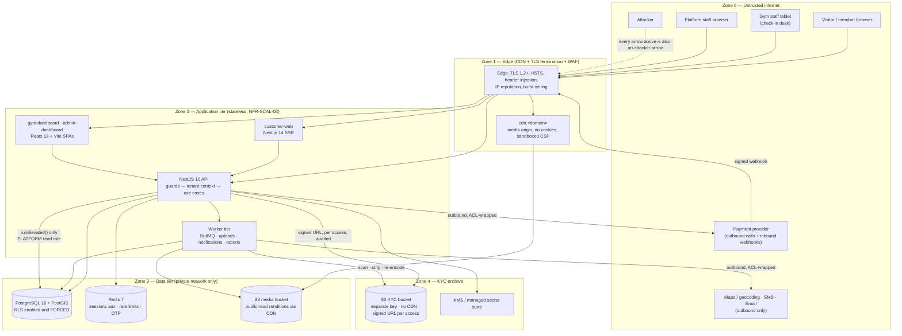
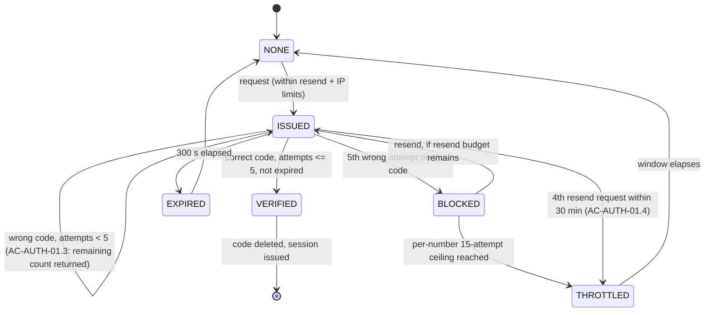
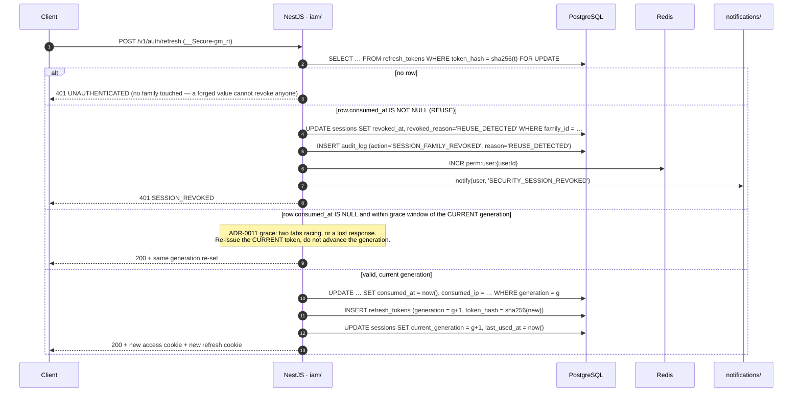
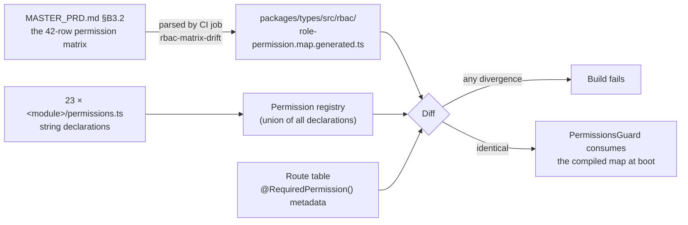
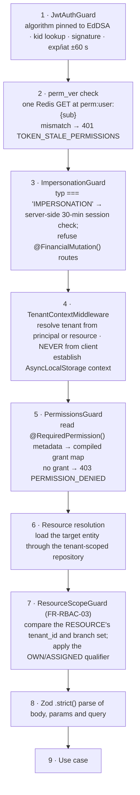
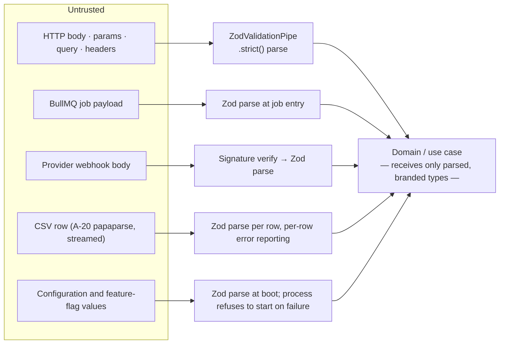
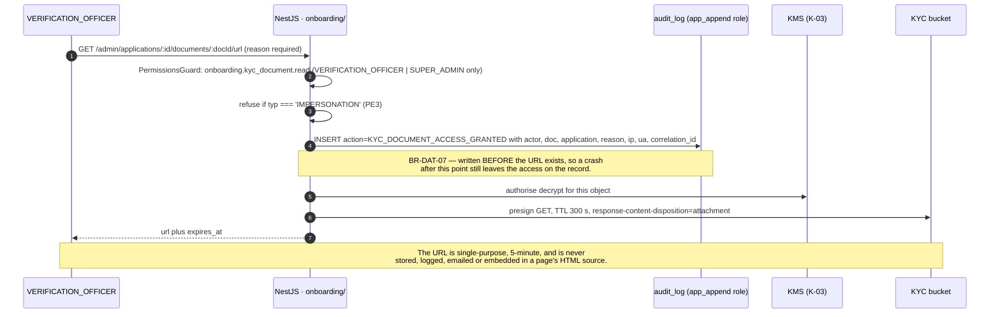
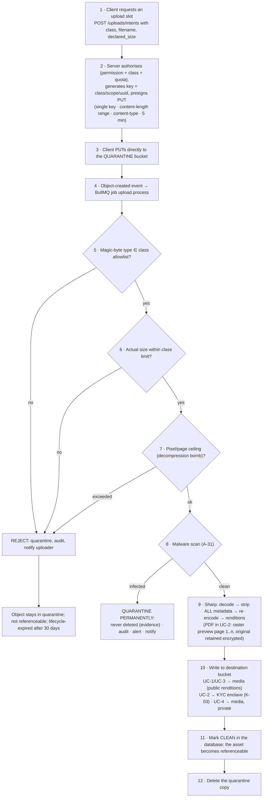
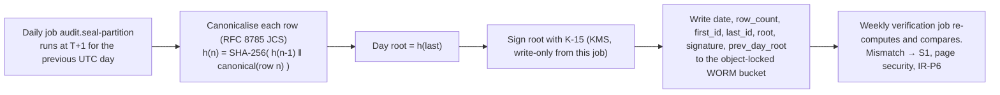
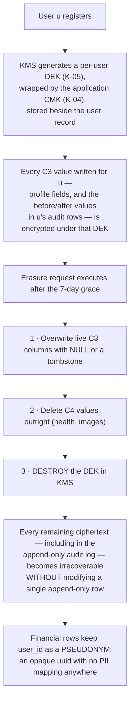

# Security — the complete security design

**Gym Marketplace & Multi-Tenant Gym Management SaaS**
The implementable security architecture for Phase 1, written before any application code exists.

---

## 0. Document control

| Field | Value |
| :--- | :--- |
| Path | `/docs/engineering/Security.md` |
| Precedence rank | **3** — binding derived specification (`PROJECT_CONSTITUTION.md` §1.3). Rank 1 (`PROJECT_CONSTITUTION.md`) and rank 2 (`MASTER_PRD.md`) override every statement in this file. Where this document appears to differ from either, this document is defective and is corrected by amendment. |
| Status | Phase-0 engineering artefact. **No application code exists.** Every code fragment here is labelled *illustrative — not committed code* and is a design statement, not an implementation. |
| Governing requirements | `NFR-SEC-01` … `NFR-SEC-13`, `NFR-PRV-01` … `NFR-PRV-07`, `BR-TEN-01` … `BR-TEN-06`, `BR-DAT-01` … `BR-DAT-07`, `BR-PAY-01` … `BR-PAY-11`, `BR-CHK-01` … `BR-CHK-10`, `BR-REV-01` … `BR-REV-07`, `FR-AUTH-01` … `FR-AUTH-14`, `FR-RBAC-01` … `FR-RBAC-07` |
| Governing law | `PROJECT_CONSTITUTION.md` §11 (Multi-Tenancy Law), §12 (Security Rules), §13 (Error Handling Law), §15.6–15.7 (RLS and append-only tables), §18 (Observability Law), §20.4–20.5 (PR template and review checklist) |
| Governing decisions | `ADR-0002` (NestJS, not Express) · `ADR-0005` (Prisma + tenant-context extension) · `ADR-0006` (RLS, shared schema) · `ADR-0008` (Redis) · `ADR-0011` (tokens) · `ADR-0012` (Ed25519 QR tokens) · `ADR-0013` (webhook-driven activation) · `ADR-0016` (idempotency) · `ADR-0022` (Zod) · `ADR-0024` (soft delete) · `ADR-0026` (server-side flags) · `ADR-0030` (stack-additions governance) |
| Stack | Locked by `MASTER_PRD.md` §C1.1 and restated in `PROJECT_CONSTITUTION.md` §1.5. The API framework is **NestJS 10 on Node.js 20**. Express appears in this repository only as the rejected option of `ADR-0002`. |

### 0.1 Relationship to `ENGINEERING_PLAN.md`

`/docs/engineering/phase-0/ENGINEERING_PLAN.md` is the CTO-level overview. It carries security as
rows inside other sections: §6.2 the eleven rate-limit classes, §16.3 jobs 8, 9, 13, 15, 16 and 17,
§16.4 the four non-negotiable merge gates, §17.4 the isolation-suite design, §18.5 the six secrets
rules, §19.5 alerts 8 and 15.

**This document is the implementable expansion of those rows.** Where the plan says *"scan-secrets —
Gitleaks over the full history of the PR range"*, this document gives the pre-commit hook, the CI
job, the scheduled full-history sweep, the rotation obligation that fires on a hit, and the incident
playbook for a secret that reached `main`. Where the plan gives one line for `RL-OTP`, this document
gives the OTP state machine, the Redis key shapes, the two independent counters, the enumeration-
resistant response contract, and the SMS-pumping controls.

**Non-goals.** This document does not restate: the endpoint catalogue (`ENGINEERING_PLAN.md` §6), the
module dependency matrix (§4.5), the schema (`MASTER_PRD.md` §C2), the state machines (§C4), the
error-code registry (`PROJECT_CONSTITUTION.md` §13.2), or the five-layer tenancy chain's rationale
(§11.2, `ADR-0006`). It **references** them. Duplicating a mechanism creates a second source of
truth, which `PROJECT_CONSTITUTION.md` §3.1 forbids.

### 0.2 How to read this document

| Section | Answers |
| :-- | :--- |
| §1 | What are we protecting, from whom, and how could it go wrong? |
| §2 | How do we know who is asking? |
| §3 | How do we decide whether they may? |
| §4 | How is tenant isolation a *security* control and not merely a data-access convention? |
| §5 | OWASP Top 10 2021, control by control, test by test |
| §6 | How does untrusted data enter and leave safely? |
| §7 | Where do secrets live and how do keys rotate? |
| §8 | Encryption, the KYC enclave, and why no card ever touches us |
| §9 | How is an uploaded file made safe? |
| §10 | Rate limiting and the four abuse economies this product creates |
| §11 | The exact response headers for each of the three surfaces |
| §12 | What an auditor can prove, and what they cannot |
| §13 | Subject rights, erasure versus retention, consent, residency |
| §14 | Vulnerability management, pentest, disclosure |
| §15 | The review checklist and the incident response plan |

### 0.3 Conflict register

`PROJECT_CONSTITUTION.md` §1.4 (the Halt Rule) requires that a conflict between artefacts is written
down and resolved by precedence rather than silently decided. Writing this document surfaced four.
Each is resolved below by §1.3 precedence; each requires a `DECISION_LOG.md` entry before the
affected code is written.

| # | Artefact A | Artefact B | The conflict | Resolution by precedence | Action |
| :-: | :--- | :--- | :--- | :--- | :--- |
| **CR-01** | `PROJECT_CONSTITUTION.md` §12.3 TK2: refresh cookie `SameSite=Strict`, path-scoped to `/v1/auth` | `ADR-0011`: both cookies `SameSite=Lax`; refresh `Path=/v1/auth/refresh` | Refresh-cookie `SameSite` value and path | **Rank 1 wins on `SameSite`.** The refresh cookie is `SameSite=Strict`. `Path=/v1/auth/refresh` is *narrower* than `/v1/auth` and therefore satisfies TK2 strictly; it is adopted. The **access** cookie is not covered by TK2 and takes `ADR-0011`'s `SameSite=Lax`, which is required for the Next.js server-rendered account pages of `B4.1` to authenticate on a top-level navigation. | `DECISION_LOG.md` entry recording that TK2 is honoured at its strictest reading; §2.6 of this document is the specification. |
| **CR-02** | `PROJECT_CONSTITUTION.md` §12.2.1 AZ1: `@RequiredPermission('<module>.<resource>.<action>')` | `ENGINEERING_PLAN.md` §6.3–§6.15: permission strings of the form `user:read.self`, `session:refresh`, `public:auth.login` | Permission-string grammar | **Rank 1 wins.** The grammar is `<module>.<resource>.<action>`, all lower snake within a segment. `ENGINEERING_PLAN.md`'s permission column is corrected to the constitutional grammar. §3.2 of this document is the normative grammar and §3.3 is the normative catalogue. | Correct the permission column of `ENGINEERING_PLAN.md` §6.3–§6.15 in the same pull request that first implements a controller. |
| **CR-03** | `PROJECT_CONSTITUTION.md` §12.2.1 AZ1: decorator named `@RequiredPermission` | `ENGINEERING_PLAN.md` §16.3 job 8 and §17.4: decorator named `@RequiresPermission` | Decorator identifier | **Rank 1 wins.** The decorator is `@RequiredPermission`. The CI job that reflects over the route table looks for that identifier. | Correct `ENGINEERING_PLAN.md` §16.3 and §17.4. |
| **CR-04** | `MASTER_PRD.md` §C3.1: *"Auth — `Authorization: Bearer <access_token>`"* | `MASTER_PRD.md` §C1.1 and `ADR-0011`: *"JWT access tokens + rotating refresh tokens, stored httpOnly"* | Two credential presentations named by the same rank-2 document | **Within-rank conflict → not resolvable by precedence.** Resolved as a *union*, because the two statements describe different clients rather than contradicting: browser surfaces present the credential as an `httpOnly` cookie; non-browser clients present it as a bearer header. The security consequence — CSRF applies to exactly one of them — is specified in §6.6 and is the reason the distinction must be explicit rather than incidental. | `DECISION_LOG.md` entry. If the owner rules that only one presentation is permitted, §6.6 changes and the OpenAPI security scheme changes with it. |

### 0.4 Stack additions this document requires

`STACK_ADDITIONS.md` standing rule: *"Any technology not listed in Part 1 (locked) or Part 2
(approved) is unapproved and may not appear in code, in a `package.json`, or in an infrastructure
definition."* Five security requirements in `MASTER_PRD.md` name an obligation but no mechanism, and
no approved `A-NN` row covers them. They are registered here as **PROPOSED** and **may not be used
until the project owner approves them** in `STACK_ADDITIONS.md`. Until then the affected requirement
is unimplementable and appears in `KNOWN_LIMITATIONS.md`.

| ID | Slot | PRD clause leaving it open | Proposal | Alternatives | Status |
| :--- | :--- | :--- | :--- | :--- | :--- |
| **A-31** | Malware scanning for uploads | `NFR-SEC-10`: *"virus-scanned"* — names no engine. `PROJECT_CONSTITUTION.md` §12.7 UP3. | **ClamAV** as a sidecar daemon in the worker tier, invoked by the upload pipeline (§9.3) | Cloud provider object-scanning service (adds a sub-processor under `NFR-PRV-06` and a residency question under `NFR-PRV-05`); commercial engine (cost against `CON-05`) | `PROPOSED` |
| **A-32** | Breached-password corpus | `FR-AUTH-04`: *"checked against a breached-password list"* — names no source. | **Self-hosted Bloom filter** of a public breach corpus, rebuilt quarterly, queried in-process | Third-party k-anonymity range API (new sub-processor, an outbound call on the registration hot path, and a dependency on `NFR-AVL-03`); no check at all (fails a Must-have) | `PROPOSED` |
| **A-33** | TOTP implementation | `FR-AUTH-07`, `NFR-SEC-11`: mandatory MFA — names no algorithm library. | **`otplib`** for RFC 6238 TOTP; enrolment QR rendered with `qrcode` (already approved as `A-10`) | Hand-rolled RFC 6238 over `node:crypto` (fewer dependencies, but a cryptographic primitive written in-house is a review liability); WebAuthn (Phase 2 — see §2.8 revisit trigger) | `PROPOSED` |
| **A-34** | HTML sanitisation | `FR-GYM-01` *"description (rich text, sanitised)"*, `PROJECT_CONSTITUTION.md` §12.6 IV4 — names no sanitiser. | **`sanitize-html`** server-side against a closed allowlist (§6.4) | `DOMPurify` + `jsdom` (heavier, brings a DOM implementation into the API tier); regex stripping (unsafe, rejected) | `PROPOSED` |
| **A-35** | Content screening | `FR-REV-03`, `FR-ONB-12`: profanity, contact-detail, URL and spam screening — names no mechanism. | **In-house rule engine** over platform-managed pattern lists stored as reference data, with `FR-REV-09` anomaly signals; no third party, no new sub-processor | A moderation API (new sub-processor, sends member free text off-platform, conflicts with `NFR-PRV-01` minimisation) | `PROPOSED` |

Two further mechanisms deliberately require **no** addition, and this is a design choice rather than
an omission:

| Mechanism | Why no dependency | Reference |
| :--- | :--- | :--- |
| Security headers and CSP | The three surfaces need three different policies and the customer site needs a per-response nonce (§11). A first-party NestJS middleware plus edge configuration is smaller than configuring a generic header library, and it is directly assertable in the contract suite. | §11 |
| CSRF double-submit token | HMAC over the session id using `node:crypto`, compared in constant time. A library would add a dependency to wrap fifteen lines. | §6.6 |

---

## 1. Security principles and the threat model

### 1.1 The principles this design is built on

These are not aspirations; each one is traceable to a rule that already exists, and each one is
falsifiable by a test.

| # | Principle | What it means here, concretely | Anchor |
| :-: | :--- | :--- | :--- |
| **P1** | **The database is the last line of defence, not the application.** | Tenant isolation is a PostgreSQL RLS policy, not a `WHERE` clause. Append-only is an absent `UPDATE` grant, not a code convention. A compromised or defective application tier still cannot cross a tenant boundary or rewrite the ledger. | `NFR-SEC-09`, `NFR-SEC-13`, `ADR-0006`, `PROJECT_CONSTITUTION.md` §15.6, §15.7 |
| **P2** | **Every control fails differently, so controls are layered.** | Five layers guard `BR-TEN-01` (§4). Three independent mechanisms guard membership activation (signature verification, provider event-id uniqueness, and the absence of any client-driven activation endpoint). A leak requires simultaneous failure of independent things. | `MASTER_PRD.md` §C1.4, `PROJECT_CONSTITUTION.md` §11.2 |
| **P3** | **Fail loudly, never silently.** | A missing tenant context is `TENANT_CONTEXT_MISSING` → HTTP 500 → alert 8 → S1. It is never a 403 and never an empty result set, because an empty result set is indistinguishable from a correct answer. | `PROJECT_CONSTITUTION.md` §11.5 BR2, §18.4 alert 8 |
| **P4** | **A capability that is not declared does not exist.** | Every endpoint declares `@RequiredPermission()` or `@Public()`; a route with neither fails CI job 8 and cannot merge. There is no default-allow and no default-deny-by-omission — there is no default. | `FR-RBAC-01`, `PROJECT_CONSTITUTION.md` §12.2.1 AZ1–AZ2 |
| **P5** | **Authority is granted per call, never held ambiently.** | Cross-tenant reads happen only inside `runElevated()`, which writes an audit row *before* the work and expires with the function call. There is no elevated session and no `BYPASSRLS` role. | `MASTER_PRD.md` §C1.4, `PROJECT_CONSTITUTION.md` §11.6 PE1–PE7 |
| **P6** | **Collect the minimum; where you must keep it, make it erasable.** | `NFR-PRV-01` field-level purpose documentation; per-user crypto-shredding keys so that `BR-DAT-04` erasure and `CON-04` retention can both hold (§13.4). | `NFR-PRV-01`, `BR-DAT-04`, `CON-04` |
| **P7** | **Anything that can be replayed must be idempotent; anything that must not be replayed must be nonce-bound.** | `Idempotency-Key` on money paths (`BR-PAY-03`); `provider_event_id` unique on webhooks (`BR-PAY-05`); a 128-bit nonce unique within TTL on QR tokens (`BR-CHK-06`). | `ADR-0016`, `ADR-0013`, `ADR-0012` |
| **P8** | **The client is a rendering surface, never a security boundary.** | Navigation filtering (`FR-NAV-03`) is usability. Every refusal is server-side (`FR-RBAC-02`, `AC-STAF-01.2`). Prices are recomputed server-side (`BR-PAY-04`). Membership activation ignores the client entirely (`BR-PAY-02`). | `FR-RBAC-02`, `BR-PAY-02`, `BR-PAY-04` |
| **P9** | **History is evidence and evidence is immutable.** | Five append-only tables with no `UPDATE`/`DELETE` grant, a daily hash-chain seal (§12.4), and no interface anywhere that edits an audit row (`AC-ADMN-02.3`). | `NFR-SEC-13`, `AC-ADMN-02.3`, `PROJECT_CONSTITUTION.md` §15.7 |
| **P10** | **Security work that is not in CI is not done.** | Nine of the twenty `pr.yml` jobs are security gates. The isolation suite generates itself from the route table so coverage cannot lapse. An incident produces a test before it produces a post-mortem paragraph. | `ENGINEERING_PLAN.md` §16.3, §16.4, §17.4 |

### 1.2 The asset register

Assets are scored on five axes, each 1–5. **Composite = Confidentiality × Irreversibility, weighted
by Records at risk and Regulatory exposure.** The ranking is derived, not asserted, so that a later
disagreement is a disagreement about a score rather than about a feeling.

| Rank | Asset | Where it lives | C | I | A | Records at risk | Reg. | Composite | Why it ranks here |
| :-: | :--- | :--- | :-: | :-: | :-: | :--- | :-: | :-: | :--- |
| **A1** | **Authentication credentials and cryptographic keys** — password hashes, refresh-token family state, TOTP secrets, recovery codes, the JWT Ed25519 key, the QR Ed25519 key, the KYC data key, webhook signing secrets, provider API keys | `users.password_hash`, `sessions`, `refresh_tokens`, managed secret store, KMS | 5 | 5 | 4 | All 500,000 users (`NFR-SCAL-01`) and every downstream asset | 5 | **25** | This is the *enabling* asset. Possession of the JWT signing key is possession of every session; possession of the QR key mints check-ins at every gym; possession of the KYC key is possession of every identity document. It ranks first not because it is the most sensitive data but because it converts into all the others. |
| **A2** | **Money and the ledger** — `ledger_entries`, `orders`, `payments`, `payment_events`, `invoices`, `settlement_lines`, `settlement_batches`, payout bank accounts | PostgreSQL, append-only tables | 4 | 5 | 5 | Every transaction of every tenant | 5 | **25** | `BR-FIN-01`: all balances are *derived* from an append-only ledger. An integrity failure here is not correctable by restoring a backup, because the ledger *is* the record. `BR-PAY-01` forbids float; `BR-FIN-03` requires statements to sum exactly. A payout-account substitution attack redirects real money to an attacker and is the single highest-value fraud in the product (`BR-GYM-06` suspends payouts on bank-account change for exactly this reason). |
| **A3** | **Tenant operational data** — members, memberships, attendance, plans, pricing, CRM notes, leads, reports, exports | PostgreSQL, RLS-protected | 5 | 4 | 4 | 2,000 tenants × up to 500,000 member records | 4 | **20** | `BR-TEN-01` is *"a legal obligation and the thing most likely to be violated by an ordinary coding mistake"* (§C1.4). `OBJ-07` makes isolation a commercial objective and *"a sales objection to pre-empt"*. A single cross-tenant leak is existential for a marketplace whose supply side is competitors of one another: gym A seeing gym B's member list, pricing and churn is direct competitive harm on top of a data-protection breach. `RSK-08` scores it 2×5. |
| **A4** | **KYC documents and identity images** | Separate S3 bucket, separate key, never on the CDN | 5 | 3 | 2 | ~2,000 tenants, ~4–8 documents each | 5 | **18** | Government identity documents, business registration, bank proofs. Low volume, extreme per-record harm — an exposed set is directly usable for identity fraud against the gym owner personally. `NFR-SEC-02` mandates a separate key; `BR-DAT-07` mandates per-access logging and restricts access to `VERIFICATION_OFFICER` and `SUPER_ADMIN` alone. |
| **A5** | **Member personal data** — name, mobile, email, date of birth, gender, city, photo, emergency contact, and the **sensitive** fitness/health category | `users`, `members`, `crm_notes` | 4 | 3 | 3 | Up to 500,000 individuals | 5 | **15** | Volume makes it the largest breach by headcount. `FR-USER-02`/`FR-USER-03` and `NFR-PRV-07` classify health and fitness information as a **sensitive category** with restricted access and **no marketing use** — a stricter obligation than the rest of the profile. `BR-DAT-06` keeps it out of logs entirely. |
| **A6** | **Platform trust signals** — gym approval status, review corpus, ratings, verified-member markers | `gyms.status`, `reviews`, `gyms.rating_avg` | 2 | 5 | 3 | Whole marketplace | 2 | **12** | Invariant 4 of the product (`README.md`): *verification before visibility, earned reviews only*. This asset has almost no confidentiality value and enormous integrity value. `RSK-01` (fake gyms) scores 20 and `RSK-02` (fake reviews) scores 16 — the two highest entries in the register. Corruption here does not leak anything; it destroys the reason the marketplace exists. |
| **A7** | **The audit log and non-repudiation record** | `audit_log`, partitioned monthly, 7-year retention | 3 | 5 | 2 | Every actor action platform-wide | 5 | **12** | `AC-ADMN-02.3`: *"no such capability exists"* to modify or delete an audit record. Its value is entirely in being unalterable; a mutable audit log is worse than none, because it launders an attacker's actions into apparent legitimacy. |
| **A8** | **Availability of check-in and payment** | Whole request path | 1 | 2 | 5 | Every member at every gym, every day | 2 | **10** | `NFR-AVL-02` ranks check-in and payment as the paths that *degrade last*. A denial-of-service against check-in is a security incident with an immediate, physical, visible consequence: a queue at the front desk. It is included as an asset because several controls in this document (fail-closed rate limiting, key rotation, lockout) trade availability for confidentiality and the trade must be made deliberately. |

**Not assets, and stated so they are not defended by accident:** card numbers, CVVs and bank
credentials. `BR-PAY-08` and `FR-PAY-09` place them permanently outside the system — they are never
stored, logged or transmitted through platform infrastructure. The control is architectural absence,
not protection (§8.4).

### 1.3 Data classification

Every column in the schema carries exactly one class. The class determines log redaction, audit
recording, export inclusion, encryption and erasure behaviour. A column with no class fails review.

| Class | Name | Examples | Logging (`BR-DAT-06`) | In `audit_log` before/after | Encryption beyond volume-level | Erasure on `BR-DAT-04` |
| :-: | :--- | :--- | :--- | :--- | :--- | :--- |
| **C0** | Public | `gyms.slug`, `gyms.name`, published `plans.price_minor`, `amenities` | Yes | Verbatim | No | Retained |
| **C1** | Internal | `orders.status`, `memberships.state`, `settlement_batches.id`, correlation ids | Yes | Verbatim | No | Retained |
| **C2** | Tenant-confidential | member counts, `crm_notes.body`, `plans` in `DRAFT`, tenant reports, `commission_rate_bps` overrides | Identifiers only | Verbatim | No | Retained (tenant-owned, not subject-owned) |
| **C3** | Personal | `users.name`, `email`, `phone`, `date_of_birth`, `gender`, `city`, `photo_key`, `emergency_contact*` | **Never** — log `user_id` instead | **Envelope-encrypted under the per-user erasure key** (§13.4) | Per-user DEK | Key destroyed → irrecoverable |
| **C4** | Sensitive personal | `fitness_goals`, `experience_level`, `health_notes`, KYC document content, identity images, member photographs | **Never**, and never in an analytics event (`NFR-PRV-07`) | **Never recorded** — the audit row states only that the field changed | Per-user DEK; KYC additionally under a separate bucket key (`NFR-SEC-02`) | Erased outright |
| **C5** | Secret | password hashes, TOTP secrets, recovery codes, refresh-token hashes, all signing and encryption keys, provider API keys | **Never**, at any level, including `debug` | **Never recorded** — only "credential changed", with the credential type | Secret store / KMS; hashes are one-way | Destroyed |

`PROJECT_CONSTITUTION.md` §12.10 PII2 already enumerates the Pino redaction list; that list is the
C3/C4/C5 columns of this table expressed as logger configuration, and the two are kept in step by CI
job `pii-redaction` (§6.7).

### 1.4 Trust boundaries



| Boundary | Crossing | What is checked at the crossing |
| :-: | :--- | :--- |
| **TB-1** | Zone 0 → Zone 1 | TLS 1.2+ (`NFR-SEC-01`), HSTS, IP-level burst ceiling, TLS-terminating proxy strips any client-supplied `X-Forwarded-*` and re-writes it |
| **TB-2** | Zone 1 → Zone 2 | CORS allowlist per surface, `Origin` validation on unsafe methods, rate-limit tier resolution (§10), request-size ceiling, `X-Tenant-Id` rejection with `TENANT_HEADER_NOT_ACCEPTED` (§4.2) |
| **TB-3** | Zone 2 request path | `JwtAuthGuard` → `perm_ver` check → tenant-context resolution → `PermissionsGuard` → resource-scope evaluation (`FR-RBAC-03`) → Zod `.strict()` parse |
| **TB-4** | Zone 2 → Zone 3 (Postgres) | Tenant-scoped Prisma extension opens one interactive transaction and executes `set_config('app.tenant_id', …, true)` before any statement; RLS policy evaluates per row; role grants bound what is even expressible |
| **TB-5** | Zone 2 → Zone 4 (KYC) | `onboarding.kyc_document.read` permission + role in {`VERIFICATION_OFFICER`, `SUPER_ADMIN`} + a stated reason + an `audit_log` row written **before** the signed URL is minted (`BR-DAT-07`) |
| **TB-6** | Zone 0 → Zone 2 (webhook) | HMAC/asymmetric signature verification against the provider secret, timestamp-window check, `provider_event_id` uniqueness (`BR-PAY-05`, `ADR-0013`) — an unverified webhook is logged and discarded, never processed |
| **TB-7** | Zone 2 → Zone 0 (outbound) | Anti-corruption layers only (`PROJECT_CONSTITUTION.md` §4.5). **No server-side fetch of a user-supplied URL anywhere** (§5, A10) |

### 1.5 Threat actors

| # | Actor | Motivation | Capability | Starting position | Highest-value target | Primary controls |
| :-: | :--- | :--- | :--- | :--- | :--- | :--- |
| **TA-1** | **External attacker (opportunistic)** | Credential resale, card testing, SMS pumping revenue, cryptomining on any compute they can reach | Automated scanners, credential-stuffing lists, commodity exploit kits | Zone 0, unauthenticated | A1 credentials; A8 availability | Rate limiting (§10), lockout (§2.8), breached-password check (§2.4), dependency scanning (§14), CSP (§11) |
| **TA-2** | **External attacker (targeted)** | The ledger, the payout accounts, or a mass PII set worth extorting | Manual, patient, reads the OpenAPI document, chains low-severity findings | Zone 0, may hold a legitimate `USER` account bought for the price of one membership | A2 money; A3 tenant data; A4 KYC | Five-layer isolation (§4), payout-change re-verification (`BR-GYM-06`), pentest (§14.4), audit reconstruction (§12) |
| **TA-3** | **Malicious tenant** — a gym owner with a real, approved tenant | Competitor intelligence: rival gyms' pricing, member lists, churn, attendance. Commission avoidance. | Full legitimate access to their own tenant; can probe every dashboard endpoint with valid credentials; can read the API contract from their own traffic | **Inside Zone 2, authenticated, with a valid tenant context** | A3 tenant data (another tenant's) | RLS (`ADR-0006`), `FR-RBAC-03` resource-tenant evaluation, the isolation suite (§4.6), IDOR-shaped 404s not 403s |
| **TA-4** | **Malicious member** | Free access (credential sharing, forged QR), discount abuse (coupon enumeration, referral self-dealing), reputational leverage (fake reviews), refund fraud | A legitimate account, a phone, and time | A6 trust signals; A8 access without payment | 60-second Ed25519 QR (`ADR-0012`), implausible-travel detection (`FR-CHK-12`), check-in-gated reviews (`BR-REV-01`), coupon anti-enumeration (§10.4), `BR-REF-06` usage-aware refunds |
| **TA-5** | **Compromised staff account** — a receptionist's or manager's session taken over by phishing or a shared password | Whatever the account can reach: cash-handling, member records, manual check-ins, overrides | Exactly the compromised principal's permissions, within their assigned branches | A3 tenant data; A5 member PII; small-value A2 (offline sales) | Branch scoping as refusal not filtering (`FR-STAF-03`, AZ8), staff activity log (`FR-STAF-05`), immediate revocation on removal (`FR-STAF-04` + `perm_ver`), no financial-config authority below `GYM_OWNER` |
| **TA-6** | **Malicious insider** — platform staff: a support agent, a verification officer, a finance analyst, or an engineer with production access | Data theft at scale, fraud (commission override, payout redirection), or covering another party's tracks | **Legitimate elevated access.** The most capable actor in the model, and the only one whose actions look normal in the request log | A4 KYC (verification officer); A2 money (finance); A3/A5 at platform scale (support); everything (engineer) | Impersonation constraints (§2.9), `runElevated()` audit-before-work (§4.5), append-only audit + daily seal (§12.4), dual approval on payouts (`BR-FIN-08`), MFA (`NFR-SEC-11`), least-privilege database roles (§12.2), no production data on laptops |
| **TA-7** | **Compromised dependency or build pipeline** | Anything, silently | Executes inside Zone 2 with application authority | Build time or `node_modules` | Everything | Frozen lockfile, `A-25` Dependabot + Trivy + Gitleaks, SBOM and image signing (`ENGINEERING_PLAN.md` §16.3 job 20), no unapproved dependency (`ADR-0030`), OIDC-federated short-lived CI credentials (§7.5) |
| **TA-8** | **A payment provider impersonator** | Free memberships by forging a capture webhook | Can `POST` to a documented, unauthenticated endpoint | Zone 0 | A2 money; membership entitlement | Signature verification, replay window, `provider_event_id` uniqueness, amount re-validation against the order (`BR-PAY-05`, `PAYMENT_AMOUNT_MISMATCH`) |

### 1.6 STRIDE analysis

One table per asset. Every row names the realisation **in this product** — not a generic category —
the control, and the artefact that proves the control works. Test identifiers follow the scheme
defined in §5.1.

#### A1 — Authentication credentials and cryptographic keys

| STRIDE | Threat, as it would actually occur | Actor | Control | Proof |
| :--- | :--- | :-- | :--- | :--- |
| **S** poofing | Credential stuffing against `/auth/login` using a breach corpus; OTP brute force against `/auth/otp/verify`; a forged JWT signed with `alg: none` or with a symmetric key confused for the public key | TA-1 | `RL-AUTH` 10/15 min per identifier plus lockout (`FR-AUTH-08`); `RL-OTP` two independent counters (§2.3); the verifier accepts **exactly one** algorithm (`EdDSA`) and rejects any token whose header names another, before any other processing | `SEC-A07-001` … `SEC-A07-006` |
| **T** ampering | A refresh token replayed after theft; a `perm_ver` claim edited to defeat revocation; a TOTP secret swapped during enrolment | TA-1, TA-2 | Refresh tokens are opaque and checked against server state; reuse revokes the family (§2.7); every claim is inside the signature; TOTP enrolment requires password re-authentication and is confirmed by a live code before it becomes effective | `SEC-A07-007`, `SEC-A02-004` |
| **R** epudiation | *"That login was not me"* after an account takeover | TA-4 | `sessions` records device, IP and `created_at`; `FR-USER-05` exposes the login history to the user; `audit_log` records every credential change with IP and user agent | `AC-USER-*`, `SEC-A09-002` |
| **I** nformation disclosure | A password hash dump becomes offline-crackable; the JWT private key is read from an environment variable printed by a crash handler; a signing key appears in a log line | TA-1, TA-6, TA-7 | Argon2id at calibrated cost (§2.4); keys never in environment variables that are dumped — read from the secret store at boot and held in memory only (§7.2); Pino redaction of `token`, `authorization`, `cookie`, `password`, `otp` (C5 class); Sentry `sendDefaultPii` disabled | `SEC-A02-001`, `pii-redaction` CI job |
| **D** enial of service | Argon2id memory exhaustion by concurrent login flood; lockout weaponised to lock a known account out; Redis unavailability blocking all authentication | TA-1 | Bounded concurrency semaphore on hashing (§2.4); lockout is per identifier **and** self-unlockable via a verified channel (§2.8); rate limiting fails **closed** on `/auth/*` per `ADR-0008` — a deliberate confidentiality-over-availability trade, documented in §10.2 | `SEC-A07-008`, k6 auth-flood profile |
| **E** levation of privilege | An access token minted by a retired `kid`; a `roles` claim edited; an impersonation token used to reach platform scope | TA-2, TA-6 | Retired `kid` values are removed from the verifier key set and rejected (`SEC-A02-003`); claims are signature-protected; **permissions are never read from the token** — the token carries identity and tenant context only (AZ6), so an edited `roles` claim buys nothing even if the signature were forged; impersonation never elevates (PE3) | `SEC-A01-009`, `SEC-A02-003` |

#### A2 — Money and the ledger

| STRIDE | Threat, as it would actually occur | Actor | Control | Proof |
| :--- | :--- | :-- | :--- | :--- |
| **S** poofing | A forged provider webhook activating a membership that was never paid for | TA-8 | Signature verification, timestamp window, `provider_event_id` unique, and the amount re-checked against the order before activation (`BR-PAY-05`, `ADR-0013`) | `SEC-A08-001` … `SEC-A08-004`, `E2E-02` |
| **T** ampering | A client-submitted `total_minor` accepted at checkout; a ledger row edited to hide a shortfall; a settlement line recomputed at display time to a different figure | TA-3, TA-4, TA-6 | `.strict()` Zod schemas reject unknown fields, so sending an amount is a `400` (`IV2`); the application role holds **no** `UPDATE`/`DELETE` grant on `ledger_entries` (§12.2); `BR-FIN-02` persists all eight figures and forbids recomputation | `SEC-A04-001`, `append-only-grants` CI check, `E2E-12` |
| **R** epudiation | A tenant disputes a commission charge; a finance analyst denies approving a payout | TA-3, TA-6 | Every settlement line persists the rate effective at the moment of sale (`BR-FIN-05`); dual approval above threshold (`BR-FIN-08`) with both approver identities on the audit row | `AC-ADMN-01.4`, `BAC-07` |
| **I** nformation disclosure | Tenant A reads tenant B's revenue through a settlement or report endpoint | TA-3 | RLS on `ledger_entries`, `settlement_lines`, `orders`; `IS5` explicitly names settlement statements and reports in the isolation suite | isolation suite, `E2E-11` |
| **D** enial of service | Reconciliation blocked, so payouts stop for every tenant | TA-1 | `BR-FIN-07` blocks auto-payout **per tenant** on variance, not globally; alert 6 never silenced (AL3) | `runbooks/reconciliation-variance.md` |
| **E** levation of privilege | A support agent, impersonating an owner, changes the payout bank account | TA-6 | `AC-AUTH-03.2` refuses financial mutations under `typ: 'IMPERSONATION'` by a guard on `@FinancialMutation()`; `BR-GYM-06` additionally suspends payouts until a bank change is re-verified | `SEC-A01-006`, `SEC-A01-007` |

#### A3 — Tenant operational data

| STRIDE | Threat, as it would actually occur | Actor | Control | Proof |
| :--- | :--- | :-- | :--- | :--- |
| **S** poofing | A dashboard request carrying `X-Tenant-Id: <rival>`; a token from a stale session used after tenant switch | TA-3 | The tenant is never read from the client (§4.2); the header is rejected with `TENANT_HEADER_NOT_ACCEPTED` and logged as a security event; a switch issues a **new** token (`FR-AUTH-11`) | `SEC-A01-003`, `SD`/`AC-AUTH-02.2` |
| **T** ampering | A write to another tenant's member record through an IDOR on a shared route | TA-3 | RLS `WITH CHECK` refuses the write regardless of application logic; the isolation suite asserts the target row is **byte-identical** after the attempt (`ENGINEERING_PLAN.md` §17.4 assertion 2) | isolation suite assertion 2 |
| **R** epudiation | A tenant claims a member record was altered by the platform | TA-3 | `BR-DAT-01` audit rows with actor, before and after, on every member mutation; tenant-scoped audit view (`FR-ADMN-09`, matrix row *View audit log* = ▪ for `GYM_OWNER`) | `AC-ADMN-02.1`, `BAC-13` |
| **I** nformation disclosure | The classic five: a report that forgets its scope, an export job running without tenant context, a search that joins across tenants, a notification delivery log, the audit explorer | TA-3, TA-6 | RLS is not bypassable by any of these because all of them use the same extension-provided transaction; `IS5` names search, reports, exports, the audit explorer, notification logs and settlement statements explicitly | isolation suite `IS5` cases, `E2E-11` |
| **D** enial of service | One tenant's 12-month report or 400-row import starving others (`ADR-0006` noisy neighbour) | TA-3 | Per-tenant rate limits (`RL-EXPORT` 5/h per tenant), asynchronous exports (`FR-RPT-03`), worker tier separated from request handling (`NFR-SCAL-05`) | k6 mixed-tenant profile |
| **E** levation of privilege | A tenant user reaching a platform-scope route; a receptionist reaching the plan editor by direct URL | TA-3, TA-5 | `@RequiredPermission()` on every route + `FR-RBAC-03` resource-tenant evaluation; `AC-STAF-01.2` is a named test | `SEC-A01-001`, `SEC-A01-002` |

#### A4 — KYC documents and identity images

| STRIDE | Threat, as it would actually occur | Actor | Control | Proof |
| :--- | :--- | :-- | :--- | :--- |
| **S** poofing | A forged identity document uploaded to obtain an approved listing (`RSK-01`, score 20) | TA-2 | `BR-GYM-03`: approval is a **human** decision, no automated path may set `APPROVED`; `FR-ONB-12` pre-checks (duplicate registration id, duplicate bank account, address-to-geo tolerance) surface to the reviewer | `GYM_APPROVAL_REQUIRES_HUMAN_ACTOR`, `E2E-01` |
| **T** ampering | A document swapped after review but before approval | TA-3 | `FR-ONB-08`: submission locks the version; the reviewer sees a fixed snapshot; `applications.snapshot jsonb` is the reviewed artefact | `AC-ONB-*` |
| **R** epudiation | *"I never opened that owner's passport"* | TA-6 | `BR-DAT-07`: every access is logged, **before** the signed URL is minted, with actor, reason, document id and application id (§8.3) | `SEC-A09-004` |
| **I** nformation disclosure | A misconfigured bucket; a durable public URL leaking through a support ticket; a CDN caching a document | TA-1, TA-6 | Separate bucket, separate key (`NFR-SEC-02`); **no CDN in front of it at all**; access only by a 5-minute signed URL minted per access; bucket policy denies all public access and denies any principal other than the KYC role | `SEC-A02-005`, Terraform plan review |
| **D** enial of service | Deleting documents to block a verification queue | TA-6 | Bucket versioning plus object-lock retention aligned to `NFR-PRV-04`; deletion is not a grant the application role holds | `SEC-A05-004` |
| **E** levation of privilege | A `SUPPORT_AGENT` viewing KYC | TA-6 | `onboarding.kyc_document.read` is granted only to `VERIFICATION_OFFICER` and `SUPER_ADMIN` (`B3.2` row *Review KYC documents*); the storage role is separate from the general media role, so even a permission bug does not yield a credential that can read the bucket | `SEC-A01-010` |

#### A5 — Member personal data (including the sensitive health category)

| STRIDE | Threat, as it would actually occur | Actor | Control | Proof |
| :--- | :--- | :-- | :--- | :--- |
| **S** poofing | Account takeover by SIM swap, then export of the victim's data through `FR-USER-06` | TA-2 | Data export is asynchronous, notified to **all** verified channels, rate-limited (`RL-EXPORT` 3/day per user), and appears in the account activity log (`FR-USER-05`); a phone change requires OTP on the **new** number and is retained in the audit trail (B5.1 edge case) | `SEC-A07-009` |
| **T** ampering | Health notes edited to embarrass a member; an emergency contact replaced | TA-5 | `BR-DAT-01` audit on member mutations; C4 fields record only "changed", never the value (§1.3), so the audit trail proves the change without becoming a second copy of the sensitive data | `SEC-A09-003` |
| **R** epudiation | A member denies consenting to marketing | TA-4 | `NFR-PRV-02`: consent is explicit, granular, **timestamped** and revocable; every change writes an audit row with source and consent-text version (§13.5) | `AC-USER-01.1` |
| **I** nformation disclosure | PII in a log line, a Sentry breadcrumb, an analytics event, or a CSV export opened in a spreadsheet | TA-1, TA-6 | `BR-DAT-06` enforced by allowlist-by-default Pino redaction, Sentry pre-transmission scrubbing, `C6`'s no-PII rule, and CSV formula-injection neutralisation (`IV6`) | `pii-redaction` CI job, `SEC-A03-006` |
| **D** enial of service | Mass deletion requests as harassment | TA-4 | `FR-USER-07` 7-day grace with self-service cancellation; deletion requires an authenticated session and is rate-limited | `AC-USER-02.2` |
| **E** levation of privilege | A trainer reading members not assigned to them; a gym reading a member's health notes before purchase | TA-5, TA-3 | `▪` scope qualifiers compile to resource predicates (§3.4); `FR-USER-02`: fitness context is shared with a gym **only after purchase** | `SEC-A01-004`, `SEC-A01-005` |

#### A6 — Platform trust signals · A7 — the audit log · A8 — availability

| Asset | STRIDE focus | Threat | Control | Proof |
| :--- | :--- | :--- | :--- | :--- |
| **A6** | **T** ampering | Review farming: an owner buys memberships for confederates, checks them in manually, and harvests 5-star reviews (`RSK-02`, score 16) | `BR-REV-01` check-in gate; `FR-REV-09` anomaly detection on velocity, account age and text clustering; **plus** the manual-check-in correlation signal of §10.5 — a reviewer whose only visit is a staff-recorded `MANUAL` check-in at the reviewed gym is held for moderation; staff of a tenant may never review that tenant's gyms | `SEC-ABUSE-003`, `AC-REV-02.2`, `E2E-09` |
| **A6** | **T** ampering | An owner deletes or edits an unfavourable review | Structural: no endpoint and no UI action exists (`AC-REV-01.2`); the gym may only respond once and report (`BR-REV-05`) | `SEC-A04-003` — asserts the absence of such an operation in the generated OpenAPI document |
| **A6** | **E** levation | An automated path sets `gyms.status = APPROVED` | `BR-GYM-03`; the transition requires a human actor id of a role holding `onboarding.application.decide`; a system actor is refused with `GYM_APPROVAL_REQUIRES_HUMAN_ACTOR` | `SEC-A04-002` |
| **A7** | **T** ampering | A DBA or a compromised application edits history | No `UPDATE`/`DELETE` grant (§12.2); daily hash-chain seal written to object-locked storage (§12.4) makes even a privileged edit **detectable** | `append-only-grants` CI check, `SEC-A09-001` |
| **A7** | **R** epudiation | An impersonation session that cannot be reconstructed | Every audit row written during impersonation carries `impersonated_by`; the event is visible to the impersonated user (`AC-AUTH-03.3`) | `SEC-A09-002`, `AC-ADMN-02.2` |
| **A8** | **D** enial of service | Check-in unavailable at 18:00 on a Monday | `NFR-AVL-02` priority; `RL-SCAN` sized at 600/min per branch against `NFR-PERF-08`'s 500/min platform-wide; QR key rotation staged with pre-flight verification (`ADR-0012`); rate limiting on `/checkin/*` fails **open** to a burst ceiling rather than closed (§10.2) | k6 check-in peak profile, `runbooks/checkin.md` |
| **A8** | **D** enial of service | An arbitrary-image-transform endpoint used as an amplifier | No such endpoint exists — renditions are a fixed server-side set (`UP8`) | `SEC-A05-005` |

### 1.7 What this model does not defend against, stated plainly

`KNOWN_LIMITATIONS.md` receives each of these as an entry. A threat model that claims completeness is
a threat model nobody has read carefully.

| # | Out of scope for Phase 1 | Why | Compensating position |
| :-: | :--- | :--- | :--- |
| **L-01** | A fully compromised production database **superuser** | Superuser can disable RLS, drop policies and rewrite append-only tables. No application-tier control survives it. | Detection rather than prevention: the daily audit hash-chain seal (§12.4) is written to storage the database role cannot reach, so tampering is provable after the fact. Superuser credentials are break-glass only, paged on use (`ENGINEERING_PLAN.md` §18.5). |
| **L-02** | A malicious commit by an engineer with merge rights, colluding with a reviewer | Two-party integrity is a process control, not a technical one. | `CODEOWNERS` routes money, tenancy and security paths to a second reviewer; protected branches; signed commits; the isolation suite and append-only grant checks run on `main` as well as on PRs. |
| **L-03** | A stolen, unlocked, signed-in staff tablet at a gym | Physical possession of an authenticated device. | Branch-scoped authority limits the blast radius; `FR-AUTH-09` lets the owner revoke that session; staff activity log (`FR-STAF-05`) attributes everything done with it. |
| **L-04** | Real-time detection of a slow, low-volume data exfiltration by a legitimate `SUPPORT_AGENT` | Their reads look like their job. | `runElevated()` produces an audit row per cross-tenant read, so the *evidence* exists; volumetric anomaly detection over `audit_log` is a Phase-2 item recorded in `TECH_DEBT.md`. |
| **L-05** | Denial of service beyond the edge's capacity | `CON-05` bounds infrastructure spend. | Edge burst ceilings, per-tier limits, and `NFR-AVL-02`'s degradation order — search and reports shed load before check-in and payment do. |
| **L-06** | Compromise of the payment provider itself | `CON-03`: payment behaviour is dictated by the gateway. | `DEP-01` mitigation is the `PaymentProvider` port with a second adapter ready; `BR-PAY-08` means no card data is ours to lose either way. |
| **L-07** | A member sharing their own login credentials (as opposed to a QR screenshot) | We cannot distinguish a shared password from a shared device. | `BR-CHK-07`/`FR-CHK-12` implausible-travel detection operates on *check-ins*, not sessions, so it catches the behaviour regardless of how the credential was shared; `BR-MEM-13` suspends pending review rather than cancelling. |

---

## 2. Authentication

`iam/` owns everything in this section (`MASTER_PRD.md` §C1.3). The design is fixed by `FR-AUTH-01`
… `FR-AUTH-14`, `NFR-SEC-11`, `ADR-0011` and `PROJECT_CONSTITUTION.md` §12.3.

> **The governing sentence** (`B5.1` purpose): *"One identity system serving three surfaces and
> twelve roles, with the property that a consumer never encounters enterprise-grade friction and an
> admin never encounters consumer-grade laxity."* Everything below is a consequence of taking both
> halves of that sentence seriously: the consumer path is phone + OTP with no password at all; the
> platform-staff path is password + mandatory TOTP + step-up re-authentication for privileged acts.

### 2.1 Identity model

| Concept | Rule | Anchor |
| :--- | :--- | :--- |
| One identity, many roles | A `users` row is the identity. Roles are held **per scope**: platform-scope roles on the user, tenant-scope roles through `staff` rows, member-scope implicitly through `memberships`. A person may be `MEMBER` at platform level and `GYM_OWNER` of two tenants simultaneously. | `B3.1`, `FR-AUTH-11`, `BR-TEN-02` |
| Identity is user-scoped, not tenant-scoped | `users`, `sessions` and `refresh_tokens` carry **no** `tenant_id` and are **not** under RLS; they are protected by authorisation, not isolation. `ADR-0006` calls out that conflating this is how `/me/memberships` accidentally returns nothing. | `ADR-0006`, `ADR-0011` implementation notes |
| Tenant context is a property of the *session*, not of the user | Established at login (or by `POST /auth/tenant-context`), carried as a signed claim, never accepted from the client. Switching mints a new access token and is audited. | `FR-AUTH-11`, `AC-AUTH-02.2`, §11.3 of the constitution |
| Verification gates commerce | A verified mobile is mandatory before any purchase; a verified email is mandatory before any invoice is issued. These are checked at the use case, not at login. | `FR-AUTH-02` |
| Deleted identities do not resurrect | A phone number previously used by a deleted account is treated as new. No prior data is restored. This constrains the erasure design (§13.4) — no recoverable mapping from a phone number to a deleted user may survive. | `B5.1` edge case, `BR-DAT-04` |

### 2.2 Registration and sign-in paths (`FR-AUTH-01`, `FR-AUTH-02`, `FR-AUTH-03`)

Four entry paths exist. No fifth may be added without an amendment, because each one is an
authentication surface with its own abuse economy.

| Path | Surfaces | Credential | First factor | Second factor | Notes |
| :--- | :--- | :--- | :--- | :--- | :--- |
| **AP-1 Mobile + OTP** | `web` | Phone (E.164) | 6-digit OTP (§2.3) | — | The default consumer path. Creates the account on first successful verification (`AC-AUTH-01.2`). No password is ever set. |
| **AP-2 Email + password + verification link** | `web`, `dash` | Email | Password (§2.4) | TOTP if enrolled | Email verification link is single-use, 24-hour expiry, and does **not** authenticate — it marks the address verified and nothing else. A link that logs you in is a phishing primitive. |
| **AP-3 Google sign-in** | `web` **only** | Google account | OIDC authorization-code flow with PKCE | — | `FR-AUTH-03` restricts this to the customer website. Not available on `dash` or `admin`, so no platform-staff or tenant-owner authority is ever reachable through a third-party identity. Account linking requires the Google email to be `email_verified` **and** to match a verified address already on the account, or the account is created fresh. |
| **AP-4 Staff invitation acceptance** | `dash`, `admin` | Invitation token | Token + set password (or existing session) | TOTP mandatory on `admin` | Single-use, 7-day expiry, **binds the invited email to the intended role and branches** (`FR-AUTH-13`, `FR-STAF-01`). Accepting with an existing account adds the role to that identity rather than creating a duplicate (`B5.1` edge case). |

**Enumeration resistance.** Every unauthenticated identity-bearing endpoint returns the same
response shape and the same latency envelope whether or not the identity exists:

| Endpoint | Response when the identity exists | Response when it does not | Mechanism |
| :--- | :--- | :--- | :--- |
| `POST /auth/otp/request` | `202` + `{ retry_after_seconds, attempts_remaining }` | Identical `202`, no SMS sent | The account is created lazily on successful verification, so "exists" is not a distinguishable state |
| `POST /auth/password/forgot` | `202`, email sent | Identical `202`, no email sent | Response is not conditional on lookup |
| `POST /auth/login` | `401 UNAUTHENTICATED` on wrong password | Identical `401 UNAUTHENTICATED` | A dummy Argon2id verification runs against a fixed decoy hash when the user is absent, so timing does not distinguish the two (§2.4) |
| `POST /auth/register` (email) | `202`, "check your email"; the email says *someone tried to register this address, which already has an account* | Identical `202`, verification email | Never reveals registration state to the requester |

### 2.3 OTP design (`FR-AUTH-05`)

> *"OTP: 6 digits, 5-minute validity, maximum 5 attempts, maximum 3 resends per 30 minutes per
> number, rate-limited per IP and per number."*

#### 2.3.1 Parameters

| Parameter | Value | Source / justification |
| :--- | :--- | :--- |
| Length | **6 digits**, uniform over `000000`–`999999` | `FR-AUTH-05`. Generated with `crypto.randomInt(0, 1_000_000)` — a rejection-sampling CSPRNG, never `Math.random()`, never a timestamp derivative |
| Validity | **300 seconds** from issue | `FR-AUTH-05` |
| Verify attempts | **5 per code** | `FR-AUTH-05`; `ENGINEERING_PLAN.md` §6.2 `RL-OTP` reads *"5 verify attempts per code"* |
| Independent per-number attempt ceiling | **15 verify attempts per 30-minute window per number** | Derived, and necessary: without it, resending would reset the per-code counter and manufacture unlimited attempts. 3 resends × 5 attempts = 15 is the exact ceiling the two stated limits imply when read together |
| Resends | **3 per 30 minutes per number**, sliding window | `FR-AUTH-05`, `AC-AUTH-01.4` |
| Resend cool-down | **30 seconds** between requests for the same number | Derived from `AC-AUTH-01.1` (*"delivered within 30 seconds"*) — a second request before the first can plausibly arrive is an accident or an attack |
| Per-IP ceiling | **20 OTP operations per hour** | `ENGINEERING_PLAN.md` §6.2 `RL-OTP` |
| Storage | HMAC-SHA-256 of the code under a server-held OTP key, in Redis. **The plaintext code is never persisted anywhere**, including logs and the notification payload record | C5 classification (§1.3), `BR-DAT-06`, `PII2` |
| Comparison | `crypto.timingSafeEqual` over the HMACs | Timing-attack resistance |
| Single use | The code is deleted on first successful verification, inside the same Redis transaction that issues the session | Prevents a race that mints two sessions from one code |

**Brute-force arithmetic, stated so the parameters can be argued with.** Within one 30-minute window
an attacker gets at most 15 guesses against a 10⁶ space: **P(success) ≈ 1.5 × 10⁻⁵**. Sustained over
24 hours (48 windows, ignoring the per-IP limit which bites first) the cumulative probability is
≈ 7.2 × 10⁻⁴. That is the residual risk the PRD's parameters accept, and it is recorded here so
nobody re-derives it under pressure during an incident.

#### 2.3.2 Redis key model

```
otp:code:{purpose}:{phone_hmac}        → { hmac, issued_at, attempts, generation }   TTL 300 s
otp:resend:{purpose}:{phone_hmac}      → sorted set of issue timestamps               TTL 1800 s
otp:attempts:{purpose}:{phone_hmac}    → counter                                      TTL 1800 s
otp:ip:{ip_hash}                       → counter                                      TTL 3600 s
otp:lock:{purpose}:{phone_hmac}        → 1                                            TTL until window end
```

`phone_hmac` is `HMAC-SHA-256(e164, otp_index_key)` — the raw number is never a Redis key, because a
Redis keyspace dump would otherwise be a phone-number list (C3 classification). `purpose` ∈
{`REGISTER`, `LOGIN`, `PHONE_CHANGE`, `UNLOCK`, `SENSITIVE_STEP_UP`}; a code minted for one purpose
**never** verifies for another, which is what stops an unlock code being replayed as a login.

#### 2.3.3 State machine



#### 2.3.4 Behaviour contract

| Situation | HTTP | Error code | Body carries | Requirement |
| :--- | :-: | :--- | :--- | :--- |
| Wrong code, attempts remain | `400` | `OTP_INVALID` | `attempts_remaining` | `AC-AUTH-01.3` — *"the OTP is not consumed by the failed attempt beyond the counter"* |
| 5th wrong attempt | `429` | `OTP_ATTEMPTS_EXCEEDED` | `retry_after_seconds` | `FR-AUTH-05`, registry row in §13.2.2 of the constitution |
| 4th resend in 30 min | `429` | `OTP_RESEND_LIMIT_REACHED` | `retry_after_seconds`, and **no SMS is sent** | `AC-AUTH-01.4` |
| Code expired | `400` | `OTP_EXPIRED` | — | `FR-AUTH-05` |
| Per-IP ceiling | `429` | `RATE_LIMITED` | `X-RateLimit-*`, `Retry-After` | `RL2` |
| SMS provider unavailable | `202` | — | `{ fallback: 'EMAIL', email_masked }` — **the user is offered email verification, not a generic failure** | `AC-AUTH-01.5`, `DEP-03` |

Every response above states what happened, why, and what to do next, per `NFR-USE-05`.

#### 2.3.5 Anti-abuse specific to OTP

Covered in full in §10.3; the two controls that belong to the OTP design itself are:

1. **Purpose binding** — a code is HMAC'd together with its purpose, so it is cryptographically
   unusable outside it.
2. **Generation counter** — a resend increments `generation`; verification carries no generation and
   is checked against the current one only, so an in-flight older code cannot be used after a
   resend. This closes the window in which a user who requests twice has two live codes, one of
   which may have been observed by a shoulder-surfer or an SMS-interception path.

### 2.4 Passwords and Argon2id (`FR-AUTH-04`, `A-12`)

> *"Passwords: minimum 10 characters, checked against a breached-password list, hashed with
> Argon2id."*

#### 2.4.1 Policy

| Rule | Value | Justification |
| :--- | :--- | :--- |
| Minimum length | **10 characters** | `FR-AUTH-04`, exactly |
| Maximum length | **128 characters** | An upper bound is required: Argon2id cost is independent of input length, but an unbounded body is a memory-pressure vector before it reaches the hasher. 128 accommodates any passphrase a human will type |
| Composition rules | **None** | Deliberately absent. `FR-AUTH-04` names length and a breach check, not character classes. Composition rules measurably push users toward `Password1!` patterns that the breach corpus already contains |
| Breach check | Rejected if present in the corpus (`A-32`, **PROPOSED**) | `FR-AUTH-04`. The check is on registration, on change, and on reset — never on login, because rejecting a login for a password that was fine yesterday locks a user out of their own account with no path forward |
| Normalisation | Unicode NFKC, no trimming of internal whitespace, leading/trailing whitespace preserved | A password is a byte string; silently trimming it makes the stored hash disagree with what the user typed elsewhere |
| Reuse | The previous 5 hashes are retained and refused on change | Not required by the PRD; cheap, and it prevents the reset-then-reset-back pattern after a suspected compromise. Retained hashes are destroyed on `BR-DAT-04` erasure |
| Change side effects | A password change or reset **invalidates all sessions** and increments `perm_ver` in the same transaction | `FR-AUTH-10`, `ADR-0011` implementation notes |
| Applicability | Paths AP-2 and AP-4 only. AP-1 consumers have no password to steal | `FR-AUTH-01` |

#### 2.4.2 Argon2id parameters

`A-12` states the obligation directly: *"Parameter tuning must be recorded."* This is that record.

| Parameter | Value | Justification |
| :--- | :--- | :--- |
| Variant | **Argon2id** | Mandated by `FR-AUTH-04`. `id` is the hybrid: Argon2i's side-channel resistance on the first pass, Argon2d's GPU resistance thereafter. Argon2d and Argon2i alone are non-compliant with the requirement as written |
| `memoryCost` | **65536 KiB (64 MiB)** | The dominant anti-GPU parameter. 64 MiB per hash means a GPU with 24 GiB of memory can hold ~384 concurrent hashes rather than the tens of thousands a low-memory KDF would allow. It is 3.4× the OWASP floor of 19 MiB and sits above the 46 MiB profile, chosen because our login volume is low (`RL-AUTH` caps at 10 attempts per identifier per 15 minutes and passwords exist only on the `dash`/`admin` paths, not on the 500,000-user consumer path) |
| `timeCost` | **3** iterations | With 64 MiB, `t=3` lands the hash in the target latency band on the production instance class. `t` is raised in preference to lowering `m` if the band is missed, because memory hardness is worth more than iteration count against the attacker's hardware |
| `parallelism` | **1** lane | Node runs the binding on the libuv thread pool. Lanes above 1 consume additional pool threads per hash without improving resistance at these settings, and they interact badly with the concurrency semaphore below |
| `hashLength` | **32 bytes** | 256-bit output; matching the security level of everything else in the system |
| `saltLength` | **16 bytes**, CSPRNG per hash | Standard; salts are stored in the PHC-format encoded hash, never separately |
| Encoded form | PHC string `$argon2id$v=19$m=65536,t=3,p=1$<salt>$<hash>` in `users.password_hash` | Self-describing: the parameters travel with the hash, which is what makes re-calibration possible without a flag day |
| Target verification latency | **250 ms ± 50 ms** on the production instance class, measured at p50 with the pool warm | Slow enough that offline cracking is expensive; fast enough that `dash` login stays inside a normal interaction budget. This is not an `NFR-PERF-*` path — no performance requirement covers login — so the budget is set here and owned here |
| Concurrency ceiling | **8 concurrent hash operations** per API instance, behind a semaphore; excess requests queue with a bounded wait, then `503 DEPENDENCY_UNAVAILABLE` | 8 × 64 MiB = 512 MiB of transient memory, which is the deliberate cap. Without this, a login flood is a memory-exhaustion denial of service **caused by the security control itself** (STRIDE A1/D, §1.6). The queue is bounded so that an attacker cannot convert it into unbounded latency |
| Re-calibration | Annually, and on any change of instance class or Node major version. The measured p50 and the resulting parameters are appended to a table in this section by amendment | `A-12` |
| Re-hash on login | If the stored PHC parameters are weaker than current policy, the password is re-hashed with current parameters inside the successful-login transaction | The only moment the plaintext is available; skipping it means the parameter upgrade never reaches existing accounts |

**Dummy verification.** When `POST /auth/login` receives an unknown identifier, the handler performs
an Argon2id verification against a fixed decoy hash generated at boot with identical parameters,
then returns `401`. Without it, the absence of a ~250 ms delay is a user-enumeration oracle that no
amount of response-body uniformity fixes.

**Pepper — considered, not adopted in Phase 1.** An HMAC-SHA-256 pre-hash under a secret-store key
would make a database-only dump non-crackable. It is **not** adopted because: (a) it requires a
`pepper_version` discriminator and a rehash-on-login migration path for rotation, which is new state
on the hottest credential path; (b) the threat it uniquely addresses — a database dump *without* a
compromise of the application tier that reads the secret store — is narrow given both live in Zone 2/3
behind the same perimeter; and (c) `FR-AUTH-04` does not require it. **Revisit trigger:** a
production database exposure of any kind, or the introduction of a read replica outside the primary
trust boundary. Recorded in `TECH_DEBT.md`.

**Recovery codes and invitation tokens** are hashed with the same Argon2id parameters. Refresh
tokens are **not** — they are 256-bit CSPRNG values with no entropy deficit, so they are stored as a
plain SHA-256 digest; running Argon2id on every refresh would add 250 ms to a path that runs on
every session, for no gain against a value that cannot be guessed.

### 2.5 Access token structure

`ADR-0011` fixes the mechanism; `PROJECT_CONSTITUTION.md` §12.3 TK1 fixes the constraints. The claim
set below is the union of both, with three additions marked, none of which contradicts either.

| Claim | Type | Present when | Meaning | Source |
| :--- | :--- | :--- | :--- | :--- |
| `iss` | string | always | `https://api.<domain>` | *addition* — required to bind a token to a deployment region (`NFR-PRV-05`) |
| `aud` | string | always | `gm-api` | *addition* — refuses a token minted for another audience |
| `sub` | uuid | always | The **acting subject**. Under impersonation this is the impersonated member, never the agent | TK1, `ADR-0011` |
| `sid` | uuid | always | Session (token-family) id. The handle `FR-AUTH-09`'s session list revokes | TK1 (`session_id`), `ADR-0011` |
| `jti` | uuid | always | Unique token id, for correlation and for the deny-list of §2.7 | TK1 |
| `typ` | enum | always | `ACCESS` \| `IMPERSONATION` | TK1 (`token_type`), TK6, `FR-AUTH-12` |
| `tenant_id` | uuid \| null | always (nullable) | The **active** tenant context. `null` for consumer and platform-scope sessions | TK1 (`tenant_context`), `FR-AUTH-11` |
| `roles` | string[] | always | Compact scope codes, e.g. `["OWNER@t:9f2…","MEMBER@self"]`. **Not a permission list** — permissions are resolved server-side per request (AZ6) | `ADR-0011` |
| `perm_ver` | int | always | Permission version counter; a mismatch against Redis forces a refresh (§3.9) | `ADR-0011`, `FR-RBAC-04` |
| `amr` | string[] | always | Methods satisfied: `pwd`, `otp`, `totp`, `oidc`, `recovery` | `ADR-0011`, `NFR-SEC-11` |
| `auth_time` | int | always | Unix seconds of the **last full authentication**, not of token issue. Drives step-up re-authentication (§2.8.3) | *addition* — the only way to express "MFA was satisfied *recently*" rather than "at some point in this 30-day family" |
| `act` | object | impersonation only | `{ sub: <agent user id>, reason_ref: <audit row id> }` | `ADR-0011`, `FR-AUTH-12` |
| `iat`, `exp` | int | always | Issue and expiry. `exp − iat = 900` for `ACCESS`; `≤ 1800` for `IMPERSONATION` | `FR-AUTH-06`, `FR-AUTH-12` |
| `kid` | string | header | Signing-key id for rotation (§7.3) | TK1, TK8 |

| Rule | Statement |
| :--- | :--- |
| **T1** | Algorithm is **EdDSA over Ed25519** (`ADR-0011`, matching `ADR-0012`'s discipline). The verifier is configured with a **single permitted algorithm** and rejects any token whose header names another **before parsing the payload**. `alg: none` and RS↔HS confusion are therefore not reachable states. |
| **T2** | The token carries **no personal data** (TK1). No name, email, phone, or tenant *name* — identifiers only. A decoded token in a browser devtools screenshot must be uninteresting. |
| **T3** | The token carries **no permission list** (AZ6). This is what makes `FR-RBAC-04`'s 60-second propagation possible and what makes a forged `roles` claim worthless. |
| **T4** | Clock skew tolerance on `exp`/`iat` is **60 seconds**, no more. Larger windows extend the life of a revoked token. |
| **T5** | Tokens are never placed in a URL, never in `localStorage`, never logged, never in an analytics event (TK7). The `Authorization` header and the `Cookie` header are on the Pino redaction list (C5). |

### 2.6 Cookies, and the CSRF consequence

Resolved per **CR-01**. All cookies are set by `api.<domain>` and are **host-only** — no `Domain`
attribute is ever set — which requires the three surfaces to share a registrable domain with the API
and makes subdomain cookie injection structurally harder.

| Cookie | Prefix | Contents | `HttpOnly` | `Secure` | `SameSite` | `Path` | Max-Age | Rationale |
| :--- | :--- | :--- | :-: | :-: | :--- | :--- | :--- | :--- |
| `__Host-gm_at` | `__Host-` | Access JWT | ✔ | ✔ | **Lax** | `/` | 900 s | `Lax` is required for the Next.js server-rendered account pages of `B4.1` to authenticate on a top-level navigation. `__Host-` forbids `Domain` and forces `Path=/`, which is exactly what we want |
| `__Secure-gm_rt` | `__Secure-` | Opaque 256-bit refresh token | ✔ | ✔ | **Strict** (CR-01, TK2) | `/v1/auth/refresh` | 30 d | `__Host-` is impossible here because it mandates `Path=/`; `__Secure-` permits the narrow path, which is worth more. A subdomain **can** overwrite a `__Secure-` cookie, but a forged value simply fails the server-side hash lookup — and, importantly, **fails without matching any family**, so it cannot be used to trigger a denial-of-service family revocation against a real user (§2.7) |
| `__Host-gm_csrf` | `__Host-` | `HMAC-SHA-256(sid ‖ issued_at, csrf_key)` ‖ `issued_at` | ✘ (readable by JS by design) | ✔ | **Strict** | `/` | 900 s | Signed double-submit. Because it is bound to `sid` by an HMAC the client cannot compute, an attacker who can *set* the cookie still cannot make it match the session |

`SameSite` is a defence in depth, never the defence: it is a browser behaviour, and the API must be
correct without it. The full CSRF posture is §6.6.

### 2.7 Refresh-token rotation, reuse detection and family revocation (`FR-AUTH-06`)

> `B5.1` edge case: *"A refresh token is presented twice (theft indicator): the entire token family
> is revoked and the user is notified."*

#### 2.7.1 Data model

`sessions` — one row per **family**, rooted at a login: `user_id`, `family_id`, `current_generation`,
`device_label`, `ip`, `user_agent_hash`, `created_at`, `last_used_at`, `revoked_at`,
`revoked_reason`, `amr`, `auth_time`.
`refresh_tokens` — one row per **generation**: `family_id`, `generation`, `token_hash` (SHA-256),
`issued_at`, `consumed_at`, `consumed_ip`.
Both are user-scoped, carry no `tenant_id`, and are **not** RLS-protected (`ADR-0011`, `ADR-0006`).

#### 2.7.2 Rotation and detection



| Rule | Statement | Anchor |
| :--- | :--- | :--- |
| **RT1** | Refresh tokens are **opaque** 256-bit CSPRNG values, not JWTs. *"It is checked against server state on every use anyway, so signing it buys nothing, and a self-contained 30-day credential is a strictly worse thing to leak."* | `ADR-0011` |
| **RT2** | Rotation is mandatory on every use; the presented token is marked `consumed_at` in the **same transaction** that issues the successor, under `FOR UPDATE`, so two concurrent refreshes cannot both succeed as new generations | TK3 |
| **RT3** | Presenting a **consumed** token revokes the **entire family** — every generation, and the session row. Not a warning; a revocation | TK4, `FR-AUTH-06` |
| **RT4** | A revoked family also increments `perm:user:{userId}`, so any access token already issued under it fails its next `perm_ver` check within one request round trip rather than living out its 15 minutes | `ADR-0011`, `FR-RBAC-04` |
| **RT5** | The user is **notified** through `FR-NOTF-01` channels, and an `audit_log` row is written under `BR-DAT-01` | `B5.1` edge case |
| **RT6** | A token hash that matches **no row** returns `401` and touches nothing. This is deliberate: if an unknown value revoked a family, an attacker who guessed a `family_id` — or who simply spammed random values — could log real users out at will | Derived from the DoS analysis in §1.6 A1/D |
| **RT7** | **Grace window:** the immediately-preceding generation is accepted **once**, within **10 seconds** of its consumption and **only from the same `user_agent_hash`**, and re-issues the *current* token rather than advancing the generation. `ADR-0011` accepts this as *"a deliberate, measured trade against locking real users out"* for two-tab races and lost responses. The counter `refresh_grace_used_total` is monitored; if it exceeds 0.5% of refreshes over a sprint, `ADR-0011`'s revisit trigger 1 fires | `ADR-0011` |
| **RT8** | `refresh_token_reuse_detected_total` increments feed alert 15 (*auth anomaly*), which **pages security** | `PROJECT_CONSTITUTION.md` §18.4 |
| **RT9** | Family lifetime is capped at the refresh TTL from the **root login**, not from the last rotation: 30 days after login the family expires regardless of activity. Otherwise a continuously-refreshed family is an unbounded credential | `FR-AUTH-06` read strictly |

### 2.8 Session management, MFA and lockout

#### 2.8.1 Sessions (`FR-AUTH-09`, `FR-AUTH-10`)

| Capability | Design |
| :--- | :--- |
| List active sessions | `GET /auth/sessions` returns one row per non-revoked family: device label (derived server-side from the user agent — the raw UA is stored only as a hash, C3-adjacent), truncated IP, city-level geo, `created_at`, `last_used_at`, and a *this device* marker |
| Revoke one | `DELETE /auth/sessions/:id` revokes that family and bumps `perm_ver` |
| Revoke all | Offered on the same screen and executed automatically by: password change or reset (`FR-AUTH-10`), staff removal (`FR-STAF-04`), reuse detection (RT3), and account deletion (`FR-USER-07`) |
| Idle expiry | An access token expires in 15 minutes; a family with no refresh for **14 days** is expired by the `iam.session-sweep` job. `admin` sessions idle-expire at **4 hours** — platform staff hold the highest authority in the system and should not carry a warm session overnight |
| Concurrency | Unlimited families per user by default. `admin` roles are capped at **3** concurrent families; a fourth login revokes the oldest and notifies |

#### 2.8.2 MFA (`FR-AUTH-07`, `NFR-SEC-11`)

> `NFR-SEC-11`: *"MFA is mandatory for all platform staff roles."* `FR-AUTH-07` adds: *"optional TOTP
> MFA for `GYM_OWNER`."*

| Aspect | Design | Anchor |
| :--- | :--- | :--- |
| Mechanism | RFC 6238 TOTP, 6 digits, 30-second step, SHA-1 HMAC (the interoperable profile every authenticator app supports), acceptance window **±1 step** | `A-33` (**PROPOSED**) |
| Mandatory for | `SUPER_ADMIN`, `VERIFICATION_OFFICER`, `SUPPORT_AGENT`, `FINANCE`, `MODERATOR` — all five platform roles | `NFR-SEC-11`, `B3.1` |
| Optional for | `GYM_OWNER`. Not offered to `GYM_MANAGER`, `RECEPTIONIST` or `TRAINER` in Phase 1 — recorded in `KNOWN_LIMITATIONS.md`, because a shared front-desk device makes per-staff TOTP an operational problem `NFR-USE-09` does not budget for | `FR-AUTH-07` |
| Enforcement point | A guard on the `admin` surface requires `amr ⊇ {totp}`. An account holding a platform role with no enrolment can reach **only** `/auth/mfa/enrol`; every other route returns `403 MFA_ENROLMENT_REQUIRED` with a code the client uses to start enrolment | `ADR-0011` |
| Secret | 160-bit CSPRNG, encrypted at rest under the application data key, never returned after enrolment. The enrolment QR is rendered client-side from a one-time response and is never persisted | C5 classification |
| Enrolment | Requires password re-authentication, then a live code to confirm before the secret becomes effective. Enrolling without confirmation is how people lock themselves out | — |
| Replay | The last accepted step counter is stored per user; a code from an already-accepted step is refused. Without this, a code observed over the shoulder is valid for up to 90 seconds | — |
| Recovery codes | 10 single-use codes, 128-bit each, displayed once, stored Argon2id-hashed. Using one is an `audit_log` event and notifies the user. Below 3 remaining, the user is prompted to regenerate | — |
| Rate limit | TOTP verification joins tier `RL-AUTH`; 5 failures in 15 minutes locks MFA verification for 15 minutes without locking the account | `FR-AUTH-08` analogue |
| Reset | Only `SUPER_ADMIN` may reset another user's MFA, with a stated reason, an audit row, and a notification to the affected user. A support agent cannot | `FR-ADMN-10`, `B3.2` |
| Revisit trigger | WebAuthn/passkeys as a second option once any platform-staff account is phished, or on the first Enterprise SSO contract (`A6.2`) | — |

#### 2.8.3 Step-up re-authentication

MFA at login is not sufficient for the highest-authority actions, because a 4-hour `admin` session
outlives the moment of authentication. The following actions require `auth_time` within **15
minutes** or they return `403 REAUTHENTICATION_REQUIRED`:

| Action | Endpoint | Why | Anchor |
| :--- | :--- | :--- | :--- |
| Start impersonation | `POST /auth/impersonate` | Highest-privilege support action; `ENGINEERING_PLAN.md` §6.3 already marks it *Support + MFA* | `FR-AUTH-12` |
| Approve a payout run | `POST /admin/settlements/payout-runs/:id/approve` | Money leaves the platform | `BR-FIN-08` |
| Change a payout bank account | `PATCH /tenant/payout-account` | The single highest-value fraud target (§1.2 A2) | `BR-GYM-06` |
| Override a commission rate | `PATCH /admin/tenants/:id/commission` | Direct revenue impact, `AC-ADMN-01.*` | `FR-ADMN-03` |
| Suspend or reinstate a tenant | `POST /admin/tenants/:id/suspend` | Removes a business from the market | `FR-ADMN-01`, `BR-TEN-05` |
| Reset another user's MFA | `POST /admin/users/:id/mfa/reset` | Otherwise MFA is only as strong as the weakest admin session | `FR-ADMN-10` |
| Manage platform staff | `POST /admin/platform-users` | Privilege creation | `FR-ADMN-10` |
| Toggle a feature flag in production | `PATCH /admin/feature-flags/:key` | Changes system behaviour without a deploy | `FR-ADMN-08`, `ADR-0026` |

Step-up re-authentication re-verifies the **second** factor (TOTP), not the password, and refreshes
`auth_time` on the existing session without minting a new family.

#### 2.8.4 Lockout (`FR-AUTH-08`)

> *"Account lockout after 10 failed attempts in 15 minutes, with self-service unlock via verified
> channel."*

| Aspect | Design | Justification |
| :--- | :--- | :--- |
| Counter | Failed password verifications per **account identifier**, sliding 15-minute window, in Redis at `auth:fail:{user_id}` | `FR-AUTH-08` |
| Threshold | **10** | `FR-AUTH-08`, exactly |
| Lock duration | **15 minutes**, or until self-service unlock, whichever is sooner | The requirement names the unlock path, so an indefinite lock would be non-compliant |
| Self-service unlock | OTP to a **verified** channel (`purpose = UNLOCK`, §2.3.2), then the counter resets. The unlock OTP is subject to the same OTP limits, so it is not a bypass | `FR-AUTH-08` |
| Escalation | Three lockouts for the same account within 24 hours escalates to a **24-hour** lock requiring support, and raises alert 15 | Repeated lockout is credential stuffing, not fat fingers |
| Successful login | Resets the counter. A *successful* login during a lock is impossible — the lock is checked before verification | — |
| **The weaponisation problem** | An attacker who knows a victim's email can lock them out with 10 wrong guesses. Mitigations, in order: (1) the self-service unlock path exists precisely for this and is one OTP away; (2) an **already-authenticated** session is not terminated by a lockout, so a locked-out user who is already signed in keeps working; (3) a parallel per-IP limit (`RL-AUTH` 60/h per IP) means an attacker cannot cheaply lock many accounts; (4) every lock writes an `audit_log` row and feeds alert 15, so a campaign is visible | Documented rather than solved. `FR-AUTH-08` mandates the lockout; this is the residual cost |
| Not locked | OTP-only accounts (AP-1) have no password to lock. Their equivalent control is the OTP throttle of §2.3 | — |

### 2.9 Impersonation (`FR-AUTH-12`, `BR-DAT-02`)

The most dangerous capability in the product, granted to the least-privileged platform role. Every
constraint below is a test, per `PROJECT_CONSTITUTION.md` §12.4.

| # | Constraint | Mechanism | Anchor |
| :-: | :--- | :--- | :--- |
| **IM-1** | Requires `iam.impersonation.start`, held by `SUPPORT_AGENT` and `SUPER_ADMIN` only | `B3.2` row *Impersonate user* | `B3.2` |
| **IM-2** | Requires MFA satisfied **and** `auth_time` within 15 minutes | §2.8.3 | `NFR-SEC-11` |
| **IM-3** | Requires a **stated reason**, minimum 20 characters, persisted on the audit row and **shown to the impersonated user** | `BR-DAT-02`, `AC-AUTH-03.3` | `BR-DAT-02` |
| **IM-4** | Issues a distinctly-typed token: `typ: 'IMPERSONATION'`, `sub` = the member, `act.sub` = the agent, `act.reason_ref` = the audit row id | TK6, `ADR-0011` | `FR-AUTH-12` |
| **IM-5** | Hard cap **30 minutes**, enforced by `exp` **and** by a server-side session check on every request — because a token cap alone is defeated by a clock, and a session check alone is defeated by a stolen token | `AC-AUTH-03.1` | `FR-AUTH-12` |
| **IM-6** | **Cannot perform financial mutations.** A global guard refuses `typ === 'IMPERSONATION'` on every route tagged `@FinancialMutation()` with `403 IMPERSONATION_FORBIDS_FINANCIAL_MUTATION`. The tag is on: payment intent creation, payment retry, refund request, refund approval, payout account change, payout approval, offline sale recording, coupon creation, and commission override | `AC-AUTH-03.2` | `FR-AUTH-12` |
| **IM-7** | **Never elevates.** The session carries the impersonated user's permissions, never the agent's, and `runElevated()` is unavailable for the duration (PE3) | `PROJECT_CONSTITUTION.md` §11.6 PE3 | `BR-DAT-02` |
| **IM-8** | **Never targets a privileged account.** A support agent may not impersonate any user holding a platform role, and may not impersonate a user who is themselves currently impersonating. Refused with `403 IMPERSONATION_TARGET_FORBIDDEN`. *Not stated in the PRD; derived from TA-6 — without it, impersonation is a privilege-escalation ladder from `SUPPORT_AGENT` to `SUPER_ADMIN`* | Derived — requires a `DECISION_LOG.md` entry | `NFR-SEC-11` intent |
| **IM-9** | **One at a time.** An agent may hold at most one active impersonation; starting a second ends the first | Derived — bounds the blast radius and keeps the audit trail linear | — |
| **IM-10** | Persistent banner throughout the impersonated session, on every screen, rendered from a directive in the token-issue response | `AC-AUTH-03.1` | `FR-AUTH-12` |
| **IM-11** | Every audit row written during the session carries `impersonated_by`; the audit explorer marks them | `AC-ADMN-02.2`, `C2.2` | `BR-DAT-01` |
| **IM-12** | Visible to the impersonated user in account activity, with agent name, timestamp, duration and reason | `AC-AUTH-03.3`, `FR-USER-05` | `BR-DAT-02` |
| **IM-13** | Ending is explicit (`POST /auth/impersonate/end`) or automatic at `exp`; both write a closing audit row with the duration | — | — |
| **IM-14** | The agent's own session is untouched — impersonation is a **separate** token, not a mutation of the agent's session, so ending it cannot strand the agent | `ADR-0011` | — |

### 2.10 Staff invitations (`FR-AUTH-13`, `FR-STAF-01`, `FR-RBAC-06`)

| Rule | Design |
| :--- | :--- |
| Token | 256-bit CSPRNG, stored Argon2id-hashed; the plaintext exists only in the invitation link |
| Single use | Consumed atomically; a second use returns `410 INVITATION_ALREADY_USED` |
| Expiry | **7 days** (`FR-AUTH-13`); expiry is checked server-side, never by the link's contents |
| Binding | The token binds **email, role and branch set** at issue (`FR-RBAC-06`). Accepting from a different email is refused. The invitee cannot choose their own role — the single most common invitation flaw |
| Existing account | The role is added to the existing identity; no duplicate is created (`B5.1` edge case) |
| Revocation | The inviter may revoke before acceptance; revocation is immediate and audited |
| Seat limits | Checked at issue **and** again at acceptance, because tier downgrades happen in between (`FR-STAF-06`, `STAFF_SEAT_LIMIT_REACHED`) |
| Rate limit | `RL-WRITE` per user plus a per-tenant ceiling of 20 invitations per hour — an invitation endpoint is an email-sending endpoint and therefore a spam vector |

### 2.11 Account merge (`FR-AUTH-14`)

`C` priority, and a security-sensitive operation: merging two identities moves memberships, orders
and reviews between accounts.

| Rule | Design |
| :--- | :--- |
| Who | `SUPPORT_AGENT` with a stated reason, plus **explicit confirmation from the user** on both identities via OTP to each verified channel (`FR-AUTH-14`) |
| Not under impersonation | Refused while `typ === 'IMPERSONATION'` — an agent must not be able to merge accounts while wearing a member's face |
| Financial records | Never rewritten. Orders, invoices and ledger entries keep their original `user_id`; the merge writes a link record, so `BR-FIN-01` and `BR-PAY-10` immutability hold |
| Audit | One audit row per moved entity type, plus a merge event on both identities, visible in both activity logs |
| Reversibility | Not reversible. The confirmation dialogue states this and enumerates what moves |

---

## 3. Authorisation

`B3.1` states the model in one sentence and it is the sentence this whole section serves:

> *"Permission evaluation is always `(role, scope, resource, action)` — **never role alone**."*

### 3.1 The four-tuple, defined

| Element | Domain | Where it comes from | Failure mode if omitted |
| :--- | :--- | :--- | :--- |
| **role** | The 12 roles of `B3.1` | Platform roles from `users`; tenant roles from `staff`; `MEMBER` derived from holding ≥1 active membership; `USER` from being authenticated; `VISITOR` from being unauthenticated | Nothing works |
| **scope** | `PLATFORM` \| `TENANT` \| `BRANCH` \| `SELF` \| `PUBLIC` | The role definition in `B3.1` fixes each role's scope | A branch-scoped receptionist acts tenant-wide |
| **resource** | The entity instance being acted on, **loaded before the decision** | The route's resource resolver | `FR-RBAC-03` is violated: authority is evaluated against the session's tenant rather than the resource's |
| **action** | `read` \| `write` \| a named verb (`publish`, `approve`, `moderate`, `suspend`, `impersonate`, `override`, `decide`) | The `@RequiredPermission()` string | CRUD-shaped permissions cannot express *"may create a plan but may not publish it"*, which `B3.2` requires |

**Two mistakes this model exists to prevent**, both of which are `A01 Broken access control` in
practice:

1. *Role-only checks.* `if (user.role === 'GYM_MANAGER')` says nothing about **which** tenant or
   **which** branch. `B3.2` gives `GYM_MANAGER` `▪` (own/assigned only) on *Edit gym profile* and
   *Invite / manage staff* — a role-only check grants the whole tenant.
2. *Session-tenant checks.* Comparing the resource to `token.tenant_id` without loading the resource
   is the same bug wearing a hat: it presumes the resource belongs to the session's tenant, which is
   precisely what needs proving (§3.6).

### 3.2 Permission-string grammar (normative — CR-02)

```
<module>.<resource>.<action>
```

| Segment | Rule |
| :--- | :--- |
| `module` | Exactly one of the 23 backend modules of `MASTER_PRD.md` §C1.3. The owning module declares the string in its own `permissions.ts` (`PROJECT_CONSTITUTION.md` §7.3.1, AZ3) |
| `resource` | Singular, `snake_case`, naming a domain concept — `plan`, `kyc_document`, `payout_run`. Never a table name, never a DTO name |
| `action` | `snake_case`. `read` and `write` for the general cases; a named verb where `B3.2` distinguishes an authority that CRUD cannot express |
| Case | Lower throughout. No wildcards, ever — a wildcard permission is a permission nobody can audit |
| Stability | A permission string is never renamed and never reused for a different meaning, exactly like an error code (`PROJECT_CONSTITUTION.md` §13.2.1). Retired strings stay in the registry marked `RETIRED` |

**Scope qualifiers** are *not* part of the string. They are the second column of the grant table,
and they are what the `B3.2` legend encodes:

| `B3.2` legend | Qualifier | Meaning in code | Example |
| :-: | :--- | :--- | :--- |
| ● | `FULL` | Every resource inside the actor's scope | `GYM_OWNER` on `crm.member.update` — every member of their tenant |
| ▪ | `OWN` or `ASSIGNED` | A resource-level predicate evaluated **after** the resource is loaded | `TRAINER` on `attendance.attendance.read` — only members assigned to them; `RECEPTIONIST` on `crm.member.update` — only members they created, at their branches |
| ○ | Read-only | A **distinct** `.read` permission is granted and the `.write` permission is not. Read-only is never expressed as a runtime flag on a write permission | `FINANCE` on `admin.commission_config.read` but not `.write` |
| — | Not granted | Absent from the grant table | — |

### 3.3 How `B3.2` becomes code

The permission matrix is not transcribed by hand into a `switch`. It is **compiled**.



| Rule | Statement |
| :--- | :--- |
| **RB1** | The grant table is **data**, not control flow: a frozen map from `(role, permission)` to a qualifier. There is no `if (role === …)` anywhere in the authorisation path. |
| **RB2** | CI job `rbac-matrix-drift` parses the `B3.2` table out of `MASTER_PRD.md`, projects it through the capability→permission mapping of §3.3.1, and **fails the build on any difference** from the compiled map. The PRD table is therefore the literal source of truth, and a permission cannot be widened by editing code. |
| **RB3** | Every permission string referenced by a `@RequiredPermission()` must exist in some module's `permissions.ts`; an unknown string fails CI. |
| **RB4** | Every permission string in the registry must be granted to at least one role **or** be explicitly listed as `UNGRANTED_BY_DESIGN` with a reason — otherwise dead permissions accumulate and reviewers stop reading the list. |
| **RB5** | `FR-RBAC-05` — a user's effective permissions are inspectable by `SUPER_ADMIN` — is served by the *same* compiled map plus the resource qualifiers, so the console cannot disagree with the guard. |

#### 3.3.1 Capability → permission mapping (all 42 rows of `B3.2`)

| # | `B3.2` capability | Permission string | Module | Scope | Resource-tenant rule (`FR-RBAC-03`) |
| :-: | :--- | :--- | :--- | :--- | :--- |
| 1 | Browse marketplace | `discovery.gym.search` | `discovery` | PUBLIC | Cross-tenant **by design**; public projection only, `APPROVED` and non-suspended (`FR-SRCH-09`, `ADR-0006`) |
| 2 | View plan prices | `discovery.plan.read_public` | `discovery` | PUBLIC | Public projection; staff-only plans never returned (`BR-PLN-05`) |
| 3 | Save favourites | `discovery.favourite.write_self` | `discovery` | SELF | `favourite.user_id == sub` |
| 4 | Compare gyms | `discovery.comparison.read` | `discovery` | PUBLIC | Public projection, max 4 |
| 5 | Purchase membership | `ordering.order.create_self` | `ordering` | SELF | Order is created for `sub`; tenant derived from the plan, never from the client |
| 6 | View own memberships | `memberships.membership.read_self` | `memberships` | SELF | `membership.user_id == sub`; **user-scoped, not tenant-scoped** (`ADR-0006`) |
| 7 | Generate own check-in QR | `attendance.qr_token.issue_self` | `attendance` | SELF | `membership.user_id == sub` **and** `membership.state == ACTIVE` (`ADR-0012`) |
| 8 | Submit review | `reviews.review.create_self` | `reviews` | SELF | `≥1 attendance` for `(sub, gym)` (`BR-REV-01`); refused with `REVIEW_REQUIRES_CHECK_IN` |
| 9 | Download own invoice | `billing.invoice.read_self` | `billing` | SELF | `invoice.order.user_id == sub` |
| 10 | Request refund | `refunds.refund_request.create_self` / `refunds.refund_request.create_any` | `refunds` | SELF / PLATFORM | Self variant: the requester owns the order. Platform variant for `SUPPORT_AGENT`, `FINANCE`, `SUPER_ADMIN` |
| 11 | Scan / record check-in | `attendance.checkin.create` | `attendance` | BRANCH | `branch_id ∈ staff.branches` — **refusal, not filtering** (AZ8) |
| 12 | Manual check-in override | `attendance.checkin.override` | `attendance` | BRANCH | As above, plus a reason from the `C4.8` override taxonomy (`FR-CHK-08`) |
| 13 | View branch attendance | `attendance.attendance.read` | `attendance` | BRANCH | `▪` for `RECEPTIONIST` (own branch) and `TRAINER` (assigned members) |
| 14 | Create member (walk-in) | `crm.member.create` | `crm` | BRANCH | Member is created in the actor's tenant; the tenant is never a parameter |
| 15 | Edit member record | `crm.member.update` | `crm` | BRANCH/TENANT | `▪` for `RECEPTIONIST`; `●` for `GYM_MANAGER`/`GYM_OWNER`; `○` for `SUPPORT_AGENT`/`SUPER_ADMIN` |
| 16 | Record offline payment | `ordering.offline_sale.create` | `ordering` | BRANCH | `BR-PAY-09` permits `BALANCE_DUE` here and nowhere else |
| 17 | Create / edit plan | `plans.plan.write` / `plans.plan.read` | `plans` | TENANT | `plan.tenant_id == resource tenant`; `GYM_MANAGER` gets `.read` only |
| 18 | Publish plan to marketplace | `plans.plan.publish` | `plans` | TENANT | Separate from `.write` because `B3.2` gives `GYM_MANAGER` neither and `GYM_OWNER` both |
| 19 | Edit gym profile | `catalog.gym.update` | `catalog` | TENANT | `▪` for `GYM_MANAGER` (assigned branches' gym only); material changes route to review (`BR-GYM-06`, `FR-GYM-11`) |
| 20 | Add / remove branch | `catalog.branch.write` | `catalog` | TENANT | Owner and `SUPER_ADMIN` only |
| 21 | Invite / manage staff | `staff.staff.write` | `staff` | TENANT | `▪` for `GYM_MANAGER` — may manage staff **at assigned branches only**; last-owner rule applies (§3.8) |
| 22 | Assign members to trainer | `staff.trainer_assignment.write` | `staff` | TENANT | `TRAINER` holds the `.read` variant only |
| 23 | Create workout plan | `staff.workout_plan.write` | `staff` | BRANCH | `▪` for `TRAINER` — assigned members only |
| 24 | Create coupon | `ordering.coupon.write` | `ordering` | TENANT | `funding_source` is immutable after first use (`BR-CPN-05`); a gym cannot create a platform-funded coupon |
| 25 | Respond to review | `reviews.response.create` | `reviews` | TENANT | One response per review (`BR-REV-05`); no edit, no delete of the member's review |
| 26 | Moderate / unpublish review | `reviews.review.moderate` | `reviews` | PLATFORM | `MODERATOR`, `SUPER_ADMIN` only |
| 27 | View tenant reports | `reporting.tenant_report.read` | `reporting` | TENANT | `▪` for branch roles — scoped to assigned branches; named explicitly in isolation-suite `IS5` |
| 28 | View settlement statements | `settlements.statement.read` | `settlements` | TENANT | `▪`/`○` per role; named explicitly in `IS5` |
| 29 | Change payout bank account | `settlements.payout_account.update` | `settlements` | TENANT | Owner and `SUPER_ADMIN`; step-up re-auth (§2.8.3); suspends payouts until re-verified (`BR-GYM-06`) |
| 30 | Export tenant data | `reporting.tenant_export.create` | `reporting` | TENANT | `BR-DAT-05`; `RL-EXPORT`; named explicitly in `IS5` |
| 31 | Review KYC documents | `onboarding.kyc_document.read` | `onboarding` | PLATFORM | `VERIFICATION_OFFICER`, `SUPER_ADMIN` **only** (`BR-DAT-07`); every access audited before the URL is minted |
| 32 | Approve / reject gym | `onboarding.application.decide` | `onboarding` | PLATFORM | Actor must be human (`BR-GYM-03`); structured reason codes (`BR-GYM-04`) |
| 33 | Suspend tenant | `admin.tenant.suspend` | `admin` | PLATFORM | `SUPER_ADMIN` only; step-up; `BR-TEN-05` semantics |
| 34 | Configure commission rate | `admin.commission_config.write` / `.read` | `admin` | PLATFORM | `FINANCE` gets `.read`; `SUPER_ADMIN` gets both; historic settlements never change (`BR-FIN-05`) |
| 35 | Approve payout run | `settlements.payout_run.approve` | `settlements` | PLATFORM | Dual approval above threshold (`BR-FIN-08`) — two distinct actor ids required |
| 36 | Approve out-of-policy refund | `refunds.refund_request.approve` | `refunds` | PLATFORM | `FINANCE` `○`, `SUPER_ADMIN` `●` (`BR-REF-03`) |
| 37 | Handle chargeback | `refunds.dispute.manage` | `refunds` | PLATFORM | `GYM_OWNER` holds `refunds.dispute.read` only |
| 38 | Impersonate user | `iam.impersonation.start` | `iam` | PLATFORM | §2.9, all fourteen constraints |
| 39 | Manage platform users | `admin.platform_user.write` | `admin` | PLATFORM | `SUPER_ADMIN` only; step-up |
| 40 | Toggle feature flags | `admin.feature_flag.write` | `admin` | PLATFORM | `SUPER_ADMIN` only; step-up; server-side evaluation (`ADR-0026`) |
| 41 | View audit log | `audit.audit_log.read_tenant` / `audit.audit_log.read_all` | `audit` | TENANT / PLATFORM | `GYM_OWNER` gets `read_tenant` (`▪`); platform roles get `read_all` (`○`); `SUPER_ADMIN` `●` |
| 42 | Manage taxonomy | `admin.taxonomy.write` | `admin` | PLATFORM | `MODERATOR`, `SUPER_ADMIN`; reference data is platform-managed (`NFR-DQ-06`, `FR-GYM-03`) |

#### 3.3.2 The compiled grant table

The same 42 rows with the same legend as `B3.2` (● full · ▪ own/assigned · ○ read only · — none).
This is what `role-permission.map.generated.ts` contains, and job `rbac-matrix-drift` asserts the two
are identical.

| Permission | VIS | USER | MEMB | RECP | TRNR | MGR | OWNR | SUPP | VERI | FIN | MOD | S.ADM |
| :--- | :-: | :-: | :-: | :-: | :-: | :-: | :-: | :-: | :-: | :-: | :-: | :-: |
| `discovery.gym.search` | ● | ● | ● | ● | ● | ● | ● | ● | ● | ● | ● | ● |
| `discovery.plan.read_public` | ● | ● | ● | ● | ● | ● | ● | ● | ● | ● | ● | ● |
| `discovery.favourite.write_self` | — | ● | ● | — | — | — | — | — | — | — | — | — |
| `discovery.comparison.read` | ● | ● | ● | — | — | — | — | — | — | — | — | — |
| `ordering.order.create_self` | — | ● | ● | — | — | — | — | — | — | — | — | — |
| `memberships.membership.read_self` | — | ○ | ● | — | — | — | — | — | — | — | — | — |
| `attendance.qr_token.issue_self` | — | — | ● | — | — | — | — | — | — | — | — | — |
| `reviews.review.create_self` | — | — | ▪ | — | — | — | — | — | — | — | — | — |
| `billing.invoice.read_self` | — | ● | ● | — | — | — | — | — | — | — | — | — |
| `refunds.refund_request.create_self` | — | ▪ | ▪ | — | — | — | — | — | — | — | — | — |
| `refunds.refund_request.create_any` | — | — | — | — | — | — | — | ● | — | ● | — | ● |
| `attendance.checkin.create` | — | — | — | ● | ● | ● | ● | — | — | — | — | — |
| `attendance.checkin.override` | — | — | — | ● | — | ● | ● | — | — | — | — | ● |
| `attendance.attendance.read` | — | — | — | ▪ | ▪ | ● | ● | ○ | — | — | — | ○ |
| `crm.member.create` | — | — | — | ● | — | ● | ● | — | — | — | — | — |
| `crm.member.update` | — | — | — | ▪ | — | ● | ● | ○ | — | — | — | ○ |
| `ordering.offline_sale.create` | — | — | — | ● | — | ● | ● | — | — | — | — | — |
| `plans.plan.write` | — | — | — | — | — | ○ | ● | ○ | — | ○ | — | ○ |
| `plans.plan.publish` | — | — | — | — | — | — | ● | — | — | — | — | ● |
| `catalog.gym.update` | — | — | — | — | — | ▪ | ● | ○ | ○ | — | — | ● |
| `catalog.branch.write` | — | — | — | — | — | — | ● | — | — | — | — | ● |
| `staff.staff.write` | — | — | — | — | — | ▪ | ● | — | — | — | — | ● |
| `staff.trainer_assignment.write` | — | — | — | — | ○ | ● | ● | — | — | — | — | — |
| `staff.workout_plan.write` | — | — | — | — | ▪ | ● | ● | — | — | — | — | — |
| `ordering.coupon.write` | — | — | — | — | — | ○ | ● | — | — | — | — | ● |
| `reviews.response.create` | — | — | — | — | — | ● | ● | — | — | — | ○ | ● |
| `reviews.review.moderate` | — | — | — | — | — | — | — | — | — | — | ● | ● |
| `reporting.tenant_report.read` | — | — | — | ▪ | ▪ | ▪ | ● | ○ | — | ○ | — | ○ |
| `settlements.statement.read` | — | — | — | — | — | — | ● | ○ | — | ● | — | ● |
| `settlements.payout_account.update` | — | — | — | — | — | — | ● | — | — | — | — | ● |
| `reporting.tenant_export.create` | — | — | — | — | — | — | ● | — | — | ● | — | ● |
| `onboarding.kyc_document.read` | — | — | — | — | — | — | — | — | ● | — | — | ● |
| `onboarding.application.decide` | — | — | — | — | — | — | — | — | ● | — | — | ● |
| `admin.tenant.suspend` | — | — | — | — | — | — | — | — | — | — | — | ● |
| `admin.commission_config.write` | — | — | — | — | — | — | — | — | — | ○ | — | ● |
| `settlements.payout_run.approve` | — | — | — | — | — | — | — | — | — | ● | — | ● |
| `refunds.refund_request.approve` | — | — | — | — | — | — | — | — | — | ○ | — | ● |
| `refunds.dispute.manage` | — | — | — | — | — | — | ○ | — | — | ● | — | ● |
| `iam.impersonation.start` | — | — | — | — | — | — | — | ● | — | — | — | ● |
| `admin.platform_user.write` | — | — | — | — | — | — | — | — | — | — | — | ● |
| `admin.feature_flag.write` | — | — | — | — | — | — | — | — | — | — | — | ● |
| `audit.audit_log.read_tenant` / `read_all` | — | — | — | — | — | — | ▪ | ○ | ○ | ○ | ○ | ● |
| `admin.taxonomy.write` | — | — | — | — | — | — | — | — | — | — | ● | ● |

### 3.4 The guard pipeline

Order is fixed by `ADR-0011` and is not a matter of taste — each stage assumes the previous one ran.



| Stage | Failure | Code | Status | Note |
| :-: | :--- | :--- | :-: | :--- |
| 1 | Bad/absent/expired token | `UNAUTHENTICATED` | 401 | Also the outcome for an unknown `kid` |
| 2 | Stale permissions | `TOKEN_STALE_PERMISSIONS` | 401 | Client refreshes transparently and retries (`ADR-0011`) |
| 3 | Financial mutation while impersonating | `IMPERSONATION_FORBIDS_FINANCIAL_MUTATION` | 403 | `AC-AUTH-03.2` |
| 4 | Client supplied a tenant | `TENANT_HEADER_NOT_ACCEPTED` | 400 | Logged as a security event (§11.3 of the constitution) |
| 4 | No context on a tenant-scoped route | `TENANT_CONTEXT_MISSING` | **500** | A **defect**, never a 403 — a user must not be able to cause it (BR2) |
| 5 | Role lacks the permission | `PERMISSION_DENIED` | 403 | |
| 7 | Resource belongs to another tenant | `NOT_FOUND` | **404** | **Not 403** — existence must not be disclosed across tenants (`ENGINEERING_PLAN.md` §17.4 assertion 1) |
| 7 | Resource is in a branch the actor is not assigned to | `PERMISSION_DENIED` | 403 | Within the same tenant, existence is not a secret; `AC-STAF-01.1` requires **refusal**, not an empty list |
| 8 | Unknown field, wrong type, failed constraint | `VALIDATION_FAILED` | 400 | `details[]` per field (`C3.1`) |

**Why 404 across tenants and 403 within one.** A cross-tenant 403 confirms that `order_ref
GM-2026-0041` exists — enough to enumerate a competitor's transaction volume by probing. Within a
tenant the actor is already entitled to know the resource exists; hiding it produces the confusing
*"the manager can see it and I cannot, but the app says it does not exist"* support ticket, and
`NFR-USE-05` requires an error that says what to do next.

### 3.5 The decorator and the CI check (`FR-RBAC-01`)

> *"Every API endpoint declares its required permission; an endpoint with no declared permission
> fails a CI check and cannot be merged."*

```ts
// illustrative — not committed code
// apps/server/src/plans/plans.controller.ts
@Controller('tenant/plans')
export class PlansController {
  @Post(':planId/publish')
  @RequiredPermission(PLAN_PERMISSIONS.PUBLISH)   // 'plans.plan.publish' — declared in plans/permissions.ts
  @TenantScoped()                                  // opts this route into the CI isolation suite
  @Idempotent()                                    // BR-PAY-03 class; see ADR-0016
  publish(@Param('planId', ParseUuidPipe) planId: PlanId): Promise<PlanView> { /* … */ }

  @Get('public/:slug')
  @Public({ compensatingControl: 'RL-PUBLIC + public projection only (BR-PLN-05)' })
  readPublic(@Param('slug') slug: string): Promise<PublicPlanView> { /* … */ }
}
```

| Rule | Statement | Anchor |
| :--- | :--- | :--- |
| **PD1** | Exactly one of `@RequiredPermission()` or `@Public()` on every controller method. **There is no third state and no default.** | AZ1 |
| **PD2** | CI job `permission-declared` (job 8 of `ENGINEERING_PLAN.md` §16.3) reflects over the compiled route table — not the source text — and fails on any route with neither, or with both. Reflecting over the compiled table is what makes a route registered dynamically impossible to miss. | AZ2 |
| **PD3** | `@Public()` **requires** a `compensatingControl` argument, and the CI job emits the full public-route inventory into `/docs/apis/README.md`. The permitted set is closed (AZ4): `API-DISC` discovery reads, the six unauthenticated `API-AUTH` endpoints, `POST /webhooks/payments/:provider` (signature-guarded instead), and the health endpoints. A `@Public()` outside that set fails the job. | AZ4 |
| **PD4** | The permission string must resolve to a constant exported from the owning module's `permissions.ts`; a string literal in a controller fails the ESLint rule `no-inline-permission-string`. | AZ3 |
| **PD5** | The inventory of `@Public()` routes and the inventory of `runElevated()` call sites (PE5) are both published by CI as **reviewed numbers that should shrink, not grow**. | AZ4, PE5 |
| **PD6** | `@TenantScoped()` drives isolation-suite generation (§4.6). A route that touches a tenant-owned table without the decorator is caught by job `isolation`, which cross-references the repositories the route reaches. | `ENGINEERING_PLAN.md` §17.4 |

### 3.6 `FR-RBAC-03` — the resource's tenant, never the session's

> *"Tenant-scoped roles are evaluated against the tenant on the resource, never against the tenant on
> the session alone."*

The distinction is subtle and it is the difference between an authorisation model and a comforting
belief.

| | **Wrong** | **Right** |
| :--- | :--- | :--- |
| Shape | `if (token.tenant_id === params.tenantId) allow` | Load the resource under tenant scope, then compare `resource.tenant_id` and the actor's grant for **that** tenant |
| Why it fails | The comparison is between two things the request supplied. It proves the client is self-consistent, not that the actor may touch the row | The resource is loaded through the tenant-scoped repository, so RLS has already refused a foreign row before the comparison happens; the comparison then applies the `OWN`/`ASSIGNED` qualifier |
| Multi-tenant owner | A user who owns tenants A and B has a valid session for A; a resource id from B passes a session-only check if the route reads the id from the path | The resource load returns nothing for B under an A-scoped context, so the route 404s |
| Branch scoping | Invisible: a session has no branch | `resource.branch_id ∈ actor.assignedBranches` is checked, and a mismatch is a **refusal** (AZ8) |

```ts
// illustrative — not committed code
// apps/server/src/common/guards/resource-scope.guard.ts
export interface ResourceScopeRule<R> {
  /** Loaded through the tenant-scoped repository — RLS has already filtered foreign tenants. */
  readonly load: (id: string) => Promise<R | null>;
  /** FR-RBAC-03: the decision reads the RESOURCE, never the session alone. */
  readonly tenantOf: (r: R) => TenantId;
  readonly branchOf?: (r: R) => BranchId | null;
  readonly ownerOf?: (r: R) => UserId | null;   // the ▪ qualifier
}
// Absent resource  → 404 NOT_FOUND        (cross-tenant existence is not disclosed)
// Branch mismatch  → 403 PERMISSION_DENIED (AC-STAF-01.1: refusal, not an empty list)
// OWN mismatch     → 403 PERMISSION_DENIED
```

**The isolation suite is the proof.** `ENGINEERING_PLAN.md` §17.4 assertion 2 requires that a write
attempt against tenant B leaves B's row **byte-identical, verified by a checksum before and after**
— because *"a 404 response with a completed side effect is the worst possible outcome"*, and that is
exactly what a session-only tenant check produces when the write happens before the comparison.

### 3.7 Branch scoping (`FR-STAF-03`, AZ8)

| Rule | Statement |
| :--- | :--- |
| **BS1** | Branch assignment is **authorisation**, not filtering. A `RECEPTIONIST` assigned to branch 1 who requests branch 2 receives `403`, not an empty list (`AC-STAF-01.1`). |
| **BS2** | List endpoints scope to the assigned branch set at the query level **and** refuse an explicit out-of-scope `branch_id` parameter. Both, because the first alone silently returns nothing and the second alone leaks through unfiltered lists. |
| **BS3** | Branch assignments are read from `staff_branches` per request, never from the token, so `FR-RBAC-04`'s 60-second propagation applies to branch changes too. |
| **BS4** | `TRAINER` carries a second predicate on top of branch scope: the assigned-member set (`FR-STAF-07`), applied as an `OWN`/`ASSIGNED` qualifier on `attendance.attendance.read`, `staff.workout_plan.write` and `crm.member.update`. |
| **BS5** | A plan restricted to named branches (`BR-TEN-03`, `FR-GYM-08`) is a *business* rule evaluated in `plans/`, not an authorisation rule. Conflating them puts pricing logic in a guard. |

### 3.8 Last-owner protection (`FR-RBAC-07`, `FR-STAF-09`)

> *"The last remaining `GYM_OWNER` of a tenant cannot be removed or demoted."*

| Rule | Statement |
| :--- | :--- |
| **LO1** | This is an **aggregate invariant in `staff/`**, not a UI check and not a guard (AZ7). It is enforced inside the same transaction as the mutation. |
| **LO2** | The check is `SELECT count(*) … WHERE tenant_id = … AND role = 'GYM_OWNER' AND status = 'ACTIVE' FOR UPDATE`, taken **before** the mutation, in the same transaction. Without `FOR UPDATE`, two concurrent demotions of the two remaining owners both see a count of 2 and both succeed, leaving a tenant with none — a lockout that requires `SUPER_ADMIN` intervention to repair. |
| **LO3** | Four distinct paths must all hit it: remove staff (`FR-STAF-04`), change role (`FR-STAF-02`), suspend staff, and accept a *transfer of ownership*. It is therefore a domain-service method the aggregate calls, not four copies of a condition. |
| **LO4** | Refused with `422 LAST_OWNER_CANNOT_BE_REMOVED` (registry row, `PROJECT_CONSTITUTION.md` §13.2.2), with a message naming the remedy: *invite or promote another owner first*. |
| **LO5** | `SUPER_ADMIN` is **not** exempt. A platform admin removing the last owner produces an ownerless tenant, which is `BR-TEN-04`'s soft-delete path, not a staff operation. |
| **LO6** | The negative case is a required test under `BAC-06` (`M`-priority rule → the negative case must be proven), plus a concurrency test that runs the two demotions in parallel against a real Postgres via Testcontainers. |

### 3.9 Propagation of authority changes (`FR-RBAC-04`)

> *"Role changes take effect within 60 seconds without requiring the affected user to
> re-authenticate."*

| Aspect | Design |
| :--- | :--- |
| Mechanism | `perm:user:{userId}` counter in Redis, compared against the token's `perm_ver` on every request (`ADR-0011`) |
| Cost | One Redis `GET` per request — negligible at `NFR-PERF-08`/`NFR-PERF-09` volumes |
| Latency | One request round trip, far inside 60 seconds |
| **The trigger list** — every event that must increment the counter | Role grant or revoke · staff status change including `REMOVED` (`FR-STAF-04`: *"revokes access immediately"*) · branch assignment change · tenant membership added or removed · tenant suspension or reinstatement (`BR-TEN-05`) · tenant subscription degradation to write-locked at 14 days (`BR-TEN-06`) · password change or reset (`FR-AUTH-10`) · session family revocation including reuse detection · MFA enrolment or reset · account deletion scheduled or cancelled · **any change to the compiled grant map deployed to production** (a global bump) |
| Honest limitation | `ADR-0011` states it plainly: *"instant global revocation is not a property of this design — it is bounded revocation with a well-defined trigger list, and that list must be maintained as new authorisation inputs appear."* The list above is that list. **Adding an authorisation input without adding it here is a defect**, and the review checklist (§15.1) asks for it explicitly |
| Fail mode | If Redis is unavailable, `/auth/*` fails **closed** (`ADR-0008`); the `perm_ver` check on other routes fails **open** with a logged warning and a metric, because failing every authenticated request closed on a cache outage would take down check-in, which `NFR-AVL-02` forbids. This is the one place authority is traded for availability, and it is bounded by the 15-minute token lifetime |

---

## 4. Tenant isolation as a security control

`PROJECT_CONSTITUTION.md` §11 is the law and `ADR-0006` is the decision; neither is restated here.
This section answers a different question: **why is isolation a security control rather than a
data-access convention, and what artefact proves it to an auditor, a pentester, or a prospective
Enterprise customer?**

`OBJ-07` makes it commercial: isolation is *"legal and reputational necessity; also a sales objection
to pre-empt."* An engineering property can be demonstrated. A promise cannot.

### 4.1 The chain, and what each layer contributes as *security*

| Layer | Control type | Adversary it stops | Adversary it does **not** stop | Cross-reference |
| :-: | :--- | :--- | :--- | :--- |
| **1 · Request** — `TenantContextMiddleware` | Preventive | TA-3 supplying `X-Tenant-Id`, a body field, or a query parameter | A correct context applied to the wrong query | §11.2, §11.3 |
| **2 · Session** — `set_config('app.tenant_id', …, true)` inside the transaction | Preventive | The database not knowing who is asking | A query on a different pooled connection — the `A-01` failure mode | §11.4 |
| **3 · Policy** — RLS enabled **and forced** | Preventive, **at the last line** | A forgotten `WHERE`, an ORM predicate mistake, a raw query, and **a SQL injection that reaches the planner** | A table shipped with no policy | §11.2, §15.6 |
| **4 · Repository** — `TenantScopedRepository` | Detective, fail-loud | A developer bypassing the guard in a service | A query written outside the base repository | §11.5 |
| **5 · Test** — the CI isolation suite | Assurance | Any of the above being wired up wrongly, and any new endpoint added without coverage | Nothing. It is the backstop, which is why `BAC-10` is a launch gate | §11.7, §4.6 |

**Layer 3 is the security layer.** Layers 1, 2, 4 and 5 are engineering discipline; they fail when
people do. A policy in the database is the only one of the five that holds when the application tier
is *compromised* rather than merely buggy — and that is the difference between a data-access
convention and a security control. `NFR-SEC-09` says exactly this: enforcement *"at the database
level, not solely in application code"*.

### 4.2 The tenant identifier is server-derived (`C1.4`, `C3.1`, §11.3)

Restated here only for the security consequences, which §11.3 does not enumerate:

| Behaviour | Security reason |
| :--- | :--- |
| `X-Tenant-Id` is **rejected** with `400 TENANT_HEADER_NOT_ACCEPTED` — not ignored | An ignored header is silently tolerated forever; a rejected one is a signal. The rejection is written to the security event stream and contributes to alert 15's anomaly signal |
| Request schemas are `.strict()`, so a `tenant_id` body field is a `400`, not a stripped field | `IV2`. A stripped field is an attacker learning nothing; a `400` is an attacker learning that the boundary is real, and an operator learning that someone tried |
| A subdomain is **not** a tenant source in Phase 1 | Introducing one creates a cookie-scoping problem (`Domain=.<domain>` cookies visible to every tenant subdomain) that the host-only cookie design of §2.6 exists to avoid. Requires an amendment |
| Tenant switching mints a **new** token | `BR-TEN-02`: *"no cross-tenant action occurs in a single request."* Two contexts are never live at once, so `AC-AUTH-02.3` is structural rather than per-endpoint |
| The client-side query cache is keyed by `tenantId` and cleared on switch (`ADR-0021`) | A warm browser cache rendering tenant A's data inside a tenant B session is a client-side isolation failure with the same optics as a server-side one |

### 4.3 The Prisma extension as a security control (`A-01`, §11.4)

`A-01`'s approval was **conditional** on this. The security framing that §11.4 leaves implicit:

| Property | Security consequence |
| :--- | :--- |
| The extension hooks `$allModels`/`$allOperations` (P6) | **A new table is protected the moment it exists.** The most common RLS failure in the industry is a table added six months in whose policy nobody remembered; here the *session variable* is unconditional, and the *policy* gap is caught by `IS6`'s `pg_policies` check |
| `MissingTenantContextError` on `ctx.kind === 'NONE'` | Converts the catastrophic silent case (a full-table read) into a loud 500 that pages (alert 8). `P3` in action |
| `set_config(…, true)` — the `is_local` flag (P3) | A session-level `SET` on a pooled connection **leaks the previous request's tenant to the next request**. This is the single highest-severity implementation mistake available in this codebase, and the flag is the whole defence |
| `no-raw-prisma-client` architecture rule (P2, `A-23`) | Makes the extension unbypassable by construction rather than by convention. Reviewers cannot be relied on to notice an `import { PrismaClient }` in a 400-line diff; `dependency-cruiser` can |
| Raw SQL confined to the owning repository, through the extension's transaction client (P7) | PostGIS radius queries, full-text ranking and the reconciliation aggregate are the three legitimate raw-SQL sites. Each carries a comment naming the reason **and the RLS policy that still applies** — because the policy does still apply, which is why raw SQL here is far less dangerous than raw SQL usually is |

### 4.4 The RLS policies, in full

Two policies per tenant-owned table: one for the application role, one for the platform read role.
**No role in the system has `BYPASSRLS`** — cross-tenant reads are expressed as a policy that admits
a specific role, not as an exemption from policy evaluation. This is what makes `PE1` implementable
without a superuser-adjacent capability.

```sql
-- illustrative — not committed code
-- Applied identically to every tenant-owned table. Generated by the migration template,
-- never hand-written per table, so a table cannot receive a subtly different policy.

ALTER TABLE memberships ENABLE ROW LEVEL SECURITY;
ALTER TABLE memberships FORCE  ROW LEVEL SECURITY;   -- the table owner is NOT exempt (ADR-0006)

-- 1. The application role. Read and write, scoped to the transaction-local tenant.
CREATE POLICY rls_memberships__tenant_isolation
  ON memberships
  FOR ALL
  TO app_rw
  USING      (tenant_id = current_setting('app.tenant_id')::uuid)
  WITH CHECK (tenant_id = current_setting('app.tenant_id')::uuid);

-- 2. The platform read role. SELECT only, every tenant, used exclusively by runElevated().
CREATE POLICY rls_memberships__platform_read
  ON memberships
  FOR SELECT
  TO app_platform_ro
  USING (true);
```

| Element | Why it is exactly this |
| :--- | :--- |
| `FORCE ROW LEVEL SECURITY` | Without it the table **owner** bypasses the policy. The migration role owns the tables; `FORCE` means even a mistaken connection as that role is still policed |
| `current_setting('app.tenant_id')` with **no** `missing_ok` argument | An unset variable **raises** (SQLSTATE `42704`) rather than yielding `NULL`. A `NULL` comparison silently matches nothing, which is `P3`'s silent-failure trap. `ADR-0006` states this requirement explicitly |
| `WITH CHECK` | Mandatory. `USING` filters what is *read*; without `WITH CHECK` a tenant can `INSERT` or `UPDATE` a row carrying another tenant's `tenant_id`. `ADR-0006`: *"without it a tenant could `INSERT` a row carrying another tenant's `tenant_id`"* |
| `FOR ALL` on the app policy | One policy covering `SELECT`, `INSERT`, `UPDATE`, `DELETE` (`RS2`). Four separate policies is four opportunities to write one of them wrongly |
| A **separate policy per role** rather than `BYPASSRLS` | `PE1`: the elevated role gets `SELECT` and nothing else, and its authority is visible in `pg_policies` — auditable SQL rather than an invisible role attribute |
| Policy naming `rls_<table>__tenant_isolation` | `PROJECT_CONSTITUTION.md` §15.6 RS1. The `pg_policies` CI check greps for exactly this shape |

**The append-only tables carry a third constraint** — not a policy but an absent grant (§12.2), because
a policy governs *which rows*, and append-only is about *which verbs*.

**The exemption list is closed.** `MASTER_PRD.md` §C2.3's eleven platform-global reference tables are
the only tables without RLS: `countries`, `cities`, `localities`, `amenities`, `gym_categories`,
`subscription_tiers`, `tax_profiles`, `kyc_checklists`, `reason_codes`, `feature_flags`,
`notification_templates`. They are reached through `ReferenceDataRepository` so the exemption is
greppable (`BR4`), and adding to the list *"requires the same scrutiny as a new elevation"* (`RS4`).

**User-owned, cross-tenant data** — a user's profile, favourites across gyms, and orders at several
tenants — is scoped by `user_id`, **not** by `tenant_id`, and is protected by authorisation rather
than RLS (`ADR-0006`). Confusing the two is how `/me/memberships` becomes tenant-scoped and returns
an empty list to a member who has memberships at three gyms.

### 4.5 Platform elevation as an audited capability

```sql
-- illustrative — not committed code
-- Role grants. Least privilege expressed as SQL, asserted by CI (§12.2).
CREATE ROLE app_rw            NOLOGIN;  -- request path; NO BYPASSRLS
CREATE ROLE app_platform_ro   NOLOGIN;  -- runElevated() only; SELECT grants only; NO BYPASSRLS
CREATE ROLE app_append        NOLOGIN;  -- audit + ledger writer; INSERT and SELECT only
CREATE ROLE app_migrator      NOLOGIN;  -- DDL; used by CI only, never by a running application

GRANT SELECT                        ON ALL TABLES IN SCHEMA public TO app_platform_ro;
GRANT SELECT, INSERT, UPDATE, DELETE ON <tenant tables>             TO app_rw;
GRANT SELECT, INSERT                 ON audit_log, ledger_entries,
                                        membership_events, payment_events, attendance TO app_append;
-- Deliberately absent, and asserted absent by CI:
--   UPDATE / DELETE on any append-only table, for any application role
--   BYPASSRLS on any role
```

| Rule | Security statement | Anchor |
| :--- | :--- | :--- |
| **EL1** | Elevation is a **named function call with a value object**, never an ambient capability or a session mode. `runElevated({ actorId, permission, reason, scope }, fn)` | `C1.4`, PE1 |
| **EL2** | The `audit_log` row is written **before** the work begins, so an elevation that crashes mid-way is still on the record. An audit row written after the fact records only the elevations that succeeded | PE2 |
| **EL3** | `READ_ALL_TENANTS` has `SELECT` only. There is no cross-tenant **write** capability anywhere in the system; a platform write targets one tenant and runs under `app_rw` with that tenant's context set | PE1 |
| **EL4** | Never available to `SUPPORT_AGENT` for financial mutation, and **never during impersonation** | PE3, `AC-AUTH-03.2` |
| **EL5** | Time-bounded to the single function call. **There is no elevated session** | PE4 |
| **EL6** | Cross-tenant *reporting* reads a pre-aggregated platform projection built by an elevated **job**, not by elevating a request-path query. A user request never fans out across tenants synchronously — which is a performance rule (`NFR-PERF-06`) and a security rule (a single request cannot be made to sweep 2,000 tenants) | PE6 |
| **EL7** | Every elevated function has an isolation test proving the **non**-elevated path cannot reach the same data | PE7 |
| **EL8** | The call-site inventory is published by CI and is a **reviewed number that should shrink** | PE5 |
| **EL9** | The legitimate elevation set is closed and enumerated: the approval queue (`SCR-ADM-002`), tenant administration (`FR-ADMN-01`), platform user search (`SCR-ADM-005`), all-orders and all-payments finance views (`SCR-ADM-006`), settlement runs (`SCR-ADM-007`), daily reconciliation (`FR-SETL-09`), moderation queues (`FR-ADMN-12`), the audit explorer (`FR-ADMN-09`), and platform analytics (`SCR-ADM-014`). A tenth requires a `DECISION_LOG.md` entry | §11.6 |

### 4.6 The isolation suite as a security assurance artefact

`BAC-10` is a **business** acceptance criterion, not an engineering one: *"An automated isolation
test suite proves that a user of tenant A cannot read or write any record of tenant B through any
exposed endpoint."* That wording makes the suite a deliverable to the client, and it is the artefact
handed to a pentester as a starting point and to an Enterprise prospect as evidence for `OBJ-07`.

`ENGINEERING_PLAN.md` §17.4 gives its design; the **security properties** that make it assurance
rather than testing:

| # | Property | Why it matters as assurance |
| :-: | :--- | :--- |
| **1** | **Generated from the route table, not authored.** A tenant-scoped route with no generated case fails the build | Coverage cannot silently lapse. A hand-written suite measures the diligence of whoever last wrote a test; a generated one measures the system |
| **2** | **Enumerated from the OpenAPI document** (`IS1`, `A-16`, `NFR-MNT-03`) | The same artefact the client, the pentester and the suite read. A route absent from the spec fails job 10 (`openapi-drift`) before it can hide from the suite |
| **3** | **Runs against a real PostgreSQL with RLS enabled**, via Testcontainers (`IS4`) | *"Mocked repositories cannot prove RLS."* A suite that passes against a mock proves nothing about the control that actually protects the data |
| **4** | **Positive control** (assertion 4): the same request as tenant A against A's own resource must return a **non-empty** result | Without it, a broken tenant variable that returns nothing everywhere makes the whole suite pass — the exact failure mode `A-01` warns about |
| **5** | **Negative control** (assertion 7): a run with the RLS policy deliberately dropped on a scratch database must **fail** | Proves the suite exercises RLS rather than application-level filtering. This is the assertion that makes the other six credible |
| **6** | **Byte-identity check** on write attempts (assertion 2): checksum B's row before and after | *"A 404 response with a completed side effect is the worst possible outcome"* — and it is what a session-only tenant check produces |
| **7** | **Session-variable assertion** (assertion 6): `app.tenant_id` is set **inside the same transaction** as the query | Directly targets the `A-01`/`TR-01` pooling failure, which no black-box request test can see |
| **8** | **Coverage beyond CRUD** (`IS5`): search, reports, exports, audit explorer, notification delivery logs, settlement statements — the exact list `AC-AUTH-02.3` names | These are where leakage is easiest and least noticed, because none of them looks like a resource read |
| **9** | **Inverted suite for `/admin/*`**: platform routes must **succeed** across tenants **and** write an `audit_log` row with actor and reason for every cross-tenant read | `IS7`'s *negative of the negative* — a policy tightened into uselessness is caught too |
| **10** | **`pg_policies` migration check** (`IS6`): a migration creating a table with a `tenant_id` column but no policy fails a dedicated job | The one gap layer 3 has |
| **11** | **Production canary**: a synthetic cross-tenant probe runs continuously against production and is a rollback trigger (`ENGINEERING_PLAN.md` §16.7, §17.4) | Assurance that survives deployment, not just merge |
| **12** | **Failures are S1** (`IS8`, `C8.5`: *"data crosses tenants"*), block release unconditionally, and reopen `ADR-0006` and `ADR-0005` the same day (`ADR-0006` revisit trigger 1) | The suite has teeth or it is theatre |

**The three-tenant seed** (`C8.2`) is part of the artefact: a single-branch tenant, a multi-branch
tenant, and a **suspended** tenant. The suspended one exists because `BR-TEN-05` creates a state in
which marketplace visibility is gone but check-in still works — two different code paths that must
be isolated independently (`TL2`).

### 4.7 What the chain does not cover, and what covers it instead

| Gap | Why the five layers miss it | Compensating control |
| :--- | :--- | :--- |
| Public marketplace reads span tenants **by design** (`FR-SRCH-09`) | A search result set legitimately contains many tenants' gyms | `PublicPrismaService` reads a **projection restricted to publishable fields** (`ADR-0006`). This is a different concern from isolation and *"must not be confused with it."* The projection's field list is a reviewed artefact: adding a field to it is how a private figure becomes public |
| A user's own data spans tenants (`/me/*`) | Scoped by `user_id`, not `tenant_id`; RLS does not apply | Authorisation with the `SELF` scope qualifier; isolation-suite cases assert that `/me/memberships` returns memberships from **all** the user's tenants and none from anyone else's |
| Reference data is exempt (`C2.3`) | Platform-global by definition | Closed exemption list, separate repository base class, and the same scrutiny as an elevation to extend it (`RS4`) |
| Cross-tenant *joins* | RLS filters rows; it does not forbid a join that mixes scopes | `RS6`: **no cross-tenant joins exist in tenant-scope code paths** — checked in review on every query touching more than one table, and it is also what keeps the schema-per-tenant migration path open (`TL5`) |
| The elevated role itself | Its blast radius is total, by construction | `ADR-0006` says so plainly: *"all process and tooling, none of it a compiler guarantee."* Path allowlists, mandatory second review via `CODEOWNERS`, the `PlatformElevation` value object, audit logging, and the shrinking call-site inventory |
| Backups and restores | A restore is a data operation against a shared database | `BR-TEN-04` retention rules; per-tenant restore is an export, not a file restore — stated to any Enterprise prospect who asks (`ADR-0006` consequences) |

---

## 5. OWASP Top 10 2021, mapped to this codebase

`NFR-SEC-04`: *"OWASP Top 10 controls verified by automated scanning in CI and by an independent
penetration test before launch and annually thereafter."* `PROJECT_CONSTITUTION.md` §12.1 gives the
one-row-per-category mapping. This section is the implementable expansion: for each category, the
concrete manifestations **in this product**, the controls, and the **named test** that proves each
control, with its CI job.

### 5.1 Test identifier scheme

| Element | Rule |
| :--- | :--- |
| Id | `SEC-<Annn>-<nnn>` for OWASP-mapped cases; `SEC-ABUSE-<nnn>` for the §10 abuse cases; `SEC-PRIV-<nnn>` for §13 |
| Location | `apps/server/test/security/<category>/<case>.spec.ts`; browser-level cases in `e2e/security/` |
| Naming | `PROJECT_CONSTITUTION.md` §8.12 test naming; every case name states the requirement id it proves |
| Gate | Security cases run in CI jobs 12 (`integration`), 13 (`isolation`), 14 (`contract`) and 17 (`scan-sast`). A failing security case is **S1** under `C8.5` |
| Traceability | Every `NFR-SEC-*` and every `M`-priority `BR-` in `A8.10` maps to ≥1 case; the `BAC-06` traceability report fails the build on an unmapped `M`-priority rule |

### 5.2 A01 — Broken access control

| Manifestation in this product | Control | Test | Job |
| :--- | :--- | :--- | :-: |
| A `RECEPTIONIST` opens the plan editor by direct URL | `@RequiredPermission('plans.plan.write')` + `PermissionsGuard`; UI hiding is presentation only (`FR-RBAC-02`) | `SEC-A01-001` — `AC-STAF-01.2`: direct API call returns `403 PERMISSION_DENIED` | 14 |
| A `RECEPTIONIST` at branch 1 requests branch 2's attendance | Branch scoping as **refusal**, not filtering (AZ8, `BS1`) | `SEC-A01-002` — `AC-STAF-01.1`: `403`, not an empty list | 14 |
| Tenant A reads tenant B's members, orders, reports, exports | Five-layer chain (§4); RLS is the last line | `SEC-A01-003` = the whole isolation suite; `E2E-11` | 13 |
| A `TRAINER` reads a member not assigned to them | `ASSIGNED` qualifier evaluated on the loaded resource | `SEC-A01-004` | 14 |
| A gym reads a member's health notes before purchase | `FR-USER-02`: fitness context shared with a gym **only after purchase** | `SEC-A01-005` | 12 |
| A support agent initiates a payment while impersonating | `@FinancialMutation()` + `typ` guard | `SEC-A01-006` — `AC-AUTH-03.2` | 14 |
| A support agent changes a payout bank account while impersonating | Same guard, plus step-up requirement | `SEC-A01-007` | 14 |
| A user reviews a gym they never attended | `BR-REV-01` eligibility computed server-side | `SEC-A01-008` — `AC-REV-02.1`: `403 REVIEW_REQUIRES_CHECK_IN` | 12 |
| An edited `roles` claim | Permissions are **not** read from the token (AZ6, `T3`) | `SEC-A01-009` — a token with an injected role grants nothing | 12 |
| A `SUPPORT_AGENT` opens a KYC document | Permission granted to two roles only; separate storage credential | `SEC-A01-010` | 14 |
| IDOR on any `:id` path parameter | `FR-RBAC-03` resource-tenant evaluation; cross-tenant → **404** | Generated per route by the isolation suite | 13 |
| Endpoint with no permission declared | CI job 8 (`permission-declared`) | Build gate, not a runtime test | 8 |

### 5.3 A02 — Cryptographic failures

| Manifestation | Control | Test | Job |
| :--- | :--- | :--- | :-: |
| Password hashes crackable offline after a dump | Argon2id `m=65536,t=3,p=1` (§2.4.2) | `SEC-A02-001` — asserts the PHC parameters of a freshly created hash meet policy, and that a hash with weaker parameters is re-hashed on next login | 12 |
| A QR token forged | Ed25519 detached signature, server-side only (`ADR-0012`, `A-11`) | `SEC-A02-002` — a payload with a valid shape and an invalid signature is denied; the denial is **recorded** with its reason (`BR-CHK-10`) | 12 |
| A token signed by a **retired** key still accepted | Retired `kid` removed from the verifier key set after the overlap window (§7.3) | `SEC-A02-003` — a token bearing a retired `kid` is rejected | 12 |
| A TOTP secret swapped during enrolment | Enrolment requires password re-auth and a confirming live code | `SEC-A02-004` | 12 |
| KYC readable from a misconfigured bucket | Separate bucket, separate key, no CDN, no public access, signed URL per access (§8.3) | `SEC-A02-005` — an unsigned request to the KYC object URL returns `403` from the storage provider; the Terraform plan asserts `block_public_access = true` | 12 + Terraform plan review |
| Refresh token replayable | Opaque, hashed at rest, rotated, reuse revokes the family (§2.7) | `SEC-A02-006` — a consumed token revokes the whole family and notifies | 12 |
| TLS downgrade | TLS 1.2 minimum at the edge, HSTS with `preload` (§11.2) | `SEC-A02-007` — smoke assertion on the negotiated protocol and the HSTS header | 14 |
| Weak randomness anywhere in a security value | Every OTP, nonce, token, salt and recovery code from `node:crypto` CSPRNG | `SEC-A02-008` + ESLint rule banning `Math.random()` outside test fixtures and non-security code | 3, 12 |

### 5.4 A03 — Injection

| Manifestation | Control | Test | Job |
| :--- | :--- | :--- | :-: |
| SQL injection through a search filter, a sort parameter, or a cursor | Prisma parameterisation is the **sole** data path (§4.3, `P2`); raw SQL confined to three named sites, all parameterised (§6.3); `?sort=` is validated against a closed enum, never interpolated | `SEC-A03-001` — an injection corpus against every filter, sort, cursor and free-text parameter | 12 |
| SQL injection reaching the planner despite the above | **RLS still applies.** An injected predicate cannot read another tenant's rows because the policy is evaluated regardless of the query text | `SEC-A03-002` — an injected `OR 1=1` in a raw-SQL test harness returns only the current tenant's rows | 12 |
| Stored XSS in the gym description (`FR-GYM-01`, *"rich text, sanitised"*) | Allowlist sanitisation **on ingest** and contextual encoding **on output** — both, not either (`IV4`, §6.4) | `SEC-A03-003` — a payload corpus stored and rendered on `SCR-WEB-003`; asserts neither storage nor rendering executes | 12 + `e2e` |
| Stored XSS in a review body, a gym response, or an internal CRM note | Same pipeline; all four rich-text surfaces share one sanitiser configuration | `SEC-A03-004` | 12 |
| Reflected XSS in an error message echoing input | Errors carry a registry `code` and an i18n message key, **never** the raw input (`PROJECT_CONSTITUTION.md` §13); `details[]` carries field **names**, not values | `SEC-A03-005` | 14 |
| CSV formula injection in an export opened in a spreadsheet | Leading `=`, `+`, `-`, `@`, tab and CR neutralised in **every** export path (`IV6`) | `SEC-A03-006` — member, attendance, invoice, settlement and every report export | 12 |
| Log injection — a newline in a field forging a log entry | Pino emits JSON; values are encoded, never concatenated. A CI check bans string-concatenated log messages | `SEC-A03-007` | 3, 12 |
| Header injection via a redirect target | No user-supplied redirect target exists; post-authentication return-to is an **allowlisted internal path**, validated against a route table, never a URL | `SEC-A03-008` — `FR-NAV-02` return-to accepts `/account/orders` and rejects `//evil.example` and `https://evil.example` | 14 |
| Template injection in the invoice PDF | The PDF template is a rendering context with its own encoding (`IV5`); values are bound, never interpolated | `SEC-A03-009` — an injection payload in a gym name renders as text and the PDF remains byte-identical across regenerations (`FR-INV-07`) | 12 |
| NoSQL/command injection | No document store; no shell invocation anywhere in the API tier. Headless Chromium is driven by a library API, never a shell string | `SEC-A03-010` — a CI check for `child_process` usage outside the build tooling | 5 |

### 5.5 A04 — Insecure design

| Manifestation | Control | Test | Job |
| :--- | :--- | :--- | :-: |
| Commission or price computed client-side | `BR-PAY-04`: amounts computed server-side; `.strict()` schemas make a client amount a `400` (`IV2`) | `SEC-A04-001` — posting `total_minor` returns `400 VALIDATION_FAILED` | 14 |
| An automated path approves a gym | `BR-GYM-03`: approval is a human decision | `SEC-A04-002` — a system actor is refused with `GYM_APPROVAL_REQUIRES_HUMAN_ACTOR` | 12 |
| A gym deletes an unfavourable review | Structural absence: no endpoint, no UI action (`AC-REV-01.2`) | `SEC-A04-003` — asserts no such operation exists in the generated OpenAPI document | 10, 14 |
| Membership activated by a client redirect | `BR-PAY-02`: webhook-driven only (`ADR-0013`) | `SEC-A04-004` — asserts **no endpoint exists** that activates a membership from a client signal; plus `AC-PAY-02.1` | 10, 14 |
| Displayed price ≠ charged price | `BR-PLN-03`: server-side re-validation aborts with `PLAN_PRICE_CHANGED` | `SEC-A04-005` — `AC-PLAN-02.2` | 12 |
| Coupon stacking or a negative payable | `BR-CPN-02` one coupon per order; `BR-CPN-04` discount never reduces below zero | `SEC-A04-006` | 12 |
| A refund issued to a different instrument | `BR-REF-04`: original instrument only | `SEC-A04-007` | 12 |
| Business logic bypassed by ordering requests differently | State machines (`C4`) reject illegal transitions; `memberships/` has full transition-table coverage **including illegal transitions** (`ENGINEERING_PLAN.md` §17.5) | `SEC-A04-008` | 7 |

### 5.6 A05 — Security misconfiguration

| Manifestation | Control | Test | Job |
| :--- | :--- | :--- | :-: |
| A table shipped without an RLS policy | `pg_policies` CI check against every table carrying `tenant_id` (`IS6`) | Build gate | 11, 13 |
| An append-only table shipped with an `UPDATE` grant | `information_schema.role_table_grants` assertion (`AP1`) | `append-only-grants` | 11 |
| A permissive CORS origin | Explicit allowlist per surface, no wildcard, no reflected `Origin`; credentials enabled only for the three known origins | `SEC-A05-001` — an unlisted `Origin` receives no `Access-Control-Allow-Origin` | 14 |
| A missing or weakened security header | Header assertions in the smoke suite for **all three surfaces plus the API and the media origin** (§11) | `SEC-A05-002` | 14 |
| A debug or introspection endpoint in production | Swagger UI is served only where `NODE_ENV !== 'production'`; Bull Board (`A-30`) is admin-only behind RBAC; a CI check enumerates routes present in the production build and diffs against an allowlist | `SEC-A05-003` | 10, 14 |
| Verbose errors leaking a stack trace or SQL | `PROJECT_CONSTITUTION.md` §13.6 *never swallow, never leak*: the envelope carries `code`, message key and `correlationId` — never an internal message | `SEC-A05-006` — asserts no 5xx body contains a stack frame, a table name, or a SQL fragment | 14 |
| Object storage permitting deletion or public listing | Bucket policies deny public access and deny `DeleteObject` to application principals; versioning and object-lock on the KYC and audit-seal buckets | `SEC-A05-004` + Terraform plan review | Terraform |
| An arbitrary-image-transform endpoint | Renditions are a fixed server-side set (`UP8`) | `SEC-A05-005` — an unknown rendition name is `400`, never generated | 14 |
| Manual production change | `NFR-MNT-08`: IaC only; drift detection on the Terraform state | Scheduled `terraform plan` drift job | CI (scheduled) |
| Default or development credentials in a deployed environment | `SC7`: development credentials are structurally incapable of matching a production format; a boot-time check refuses them outside `local` | `SEC-A05-007` | 12 |

### 5.7 A06 — Vulnerable and outdated components

| Manifestation | Control | Test | Job |
| :--- | :--- | :--- | :-: |
| A transitive dependency with a critical CVE | Dependabot + Trivy (`A-25`); **critical vulnerabilities block release** (`NFR-SEC-08`) | `scan-deps` | 15 |
| A vulnerable OS package in a container layer | Trivy on image layers; SBOM generated; images signed | `build-images` | 20 |
| An unapproved dependency added quietly | `ADR-0030` standing rule: no `A-NN` row, no dependency. `setup` fails on a dependency without an approved row | `setup` | 1 |
| A dependency that is fine today and unmaintained in nine months | `PROJECT_CONSTITUTION.md` §22.4 version discipline; quarterly review of the `A-NN` register | Process | — |
| A vulnerability disclosed **after** the last build | Daily scheduled re-scan of the deployed image digests, not only PR-time scanning | `scan-deployed` (scheduled) | CI |

### 5.8 A07 — Identification and authentication failures

| Manifestation | Control | Test | Job |
| :--- | :--- | :--- | :-: |
| OTP brute force | §2.3: 6 digits, 300 s, 5 per code, 15 per number per 30 min, 20/h per IP | `SEC-A07-001` — the 6th attempt on a code returns `429 OTP_ATTEMPTS_EXCEEDED` | 12 |
| OTP attempt-limit reset by resending | Per-number counter is **not** reset by a resend (§2.3.1) | `SEC-A07-002` | 12 |
| OTP resend flooding | 3 per 30 min per number, 30 s cool-down, **no SMS sent** when refused | `SEC-A07-003` — `AC-AUTH-01.4`; asserts the SMS port received **zero** calls | 12 |
| An OTP minted for `UNLOCK` replayed as a `LOGIN` | Purpose binding inside the HMAC (§2.3.5) | `SEC-A07-004` | 12 |
| Credential stuffing | `RL-AUTH` 10/15 min per identifier + 60/h per IP; lockout (§2.8.4); breached-password check | `SEC-A07-005` | 12 |
| User enumeration through response or timing | Uniform responses; dummy Argon2id verification for unknown identifiers (§2.2) | `SEC-A07-006` — asserts equal status, equal body shape, and p95 latency within 10% between known and unknown identifiers | 12 |
| Refresh-token theft | Rotation + reuse detection + family revocation + notification (§2.7) | `SEC-A07-007` | 12 |
| Argon2id memory-exhaustion DoS | Concurrency semaphore of 8, bounded queue, then `503` | `SEC-A07-008` — a 200-concurrent login burst does not exceed the memory ceiling and does not affect an unrelated endpoint's latency | k6 |
| Account takeover followed by data export | Export notified on all verified channels, rate-limited, logged in account activity | `SEC-A07-009` | 12 |
| Session fixation | The session is created **after** authentication succeeds; no pre-authentication session identifier is ever honoured | `SEC-A07-010` | 12 |
| MFA not enforced for a platform role | Guard requires `amr ⊇ {totp}` for `admin`; unenrolled staff can reach only the enrolment route | `SEC-A07-011` — `NFR-SEC-11` | 14 |
| Step-up bypassed on a privileged action | `auth_time` freshness check (§2.8.3) | `SEC-A07-012` | 14 |

### 5.9 A08 — Software and data integrity failures

| Manifestation | Control | Test | Job |
| :--- | :--- | :--- | :-: |
| A forged webhook activating a membership | Signature verification before any processing (`BR-PAY-05`, `WEBHOOK_SIGNATURE_INVALID`) | `SEC-A08-001` | 12 |
| A replayed genuine webhook creating a second activation | `payment_events.provider_event_id` unique (`C2.4`) + timestamp window | `SEC-A08-002` | 12 |
| A genuine webhook for a different amount | Amount re-validated against the order; `PAYMENT_AMOUNT_MISMATCH`, **no membership created** | `SEC-A08-003` | 12 |
| A webhook accepted from an unexpected source | Signature is the primary control; source-range checks are secondary and never sufficient alone | `SEC-A08-004` | 12 |
| A tampered invoice PDF | Invoices immutable once issued (`BR-PAY-10`); corrections are credit notes; deterministic regeneration is byte-identical (`FR-INV-07`) | `SEC-A08-005` | 12 |
| A modified audit row | No `UPDATE`/`DELETE` grant + daily hash-chain seal (§12.4) | `SEC-A08-006` — an attempted `UPDATE` under the application role raises a privilege error; a tampered row breaks the day's chain | 11, 12 |
| A compromised build inserting code | Frozen lockfile, SBOM, signed images, OIDC-federated short-lived CI credentials, protected branches | `build-images` + branch protection | 20 |
| Unsafe deserialisation | No deserialisation of untrusted binary formats anywhere; every inbound payload is JSON parsed then Zod-validated | `SEC-A08-007` | 12 |

### 5.10 A09 — Security logging and monitoring failures

| Manifestation | Control | Test | Job |
| :--- | :--- | :--- | :-: |
| An impersonation session nobody can reconstruct | `impersonated_by` on every audit row written during it; visible to the impersonated user | `SEC-A09-002` — `AC-ADMN-02.2`, `AC-AUTH-03.3` | 12 |
| A KYC access nobody can attribute | Audit row written **before** the signed URL is minted (`BR-DAT-07`) | `SEC-A09-004` | 12 |
| A state change with no audit row | Declarative interceptor on annotated entities (`AU5`); `BAC-13` requires audit for every rule in `A8.10` | `SEC-A09-001` — for each audited entity type, a mutation produces exactly one audit row with before and after | 12 |
| An audit row containing personal data that later cannot be erased | C3 values envelope-encrypted under the per-user erasure key; C4/C5 never recorded (§1.3, §13.4) | `SEC-A09-003` | 12 |
| An authentication anomaly nobody notices | Alert 15: `auth_failures_total` spike or **any** `refresh_token_reuse_detected_total` increment → pages security | Alert-catalogue review + a synthetic trigger in staging | Ops |
| An isolation violation nobody notices | Alert 8: `tenant_isolation_violations_total > 0` **or** any `TENANT_CONTEXT_MISSING` → S1, never silenced (`AL3`) | Synthetic trigger in staging | Ops |
| PII leaking into logs, traces or events | Allowlist-by-default redaction; `pii-redaction` CI check; Sentry scrubbing before transmission | `SEC-A09-005` | 3, 12 |
| Logs that cannot be correlated across a request and its jobs | `NFR-MNT-04`: correlation id propagated into BullMQ jobs and the outbox dispatcher | `SEC-A09-006` | 12 |

### 5.11 A10 — Server-side request forgery

| Manifestation | Control | Test | Job |
| :--- | :--- | :--- | :-: |
| A gym profile *website* URL (`FR-GYM-01`) fetched server-side for a link preview | **No server-side fetch of a user-supplied URL exists.** The URL is stored, validated for scheme and shape, and rendered client-side with `rel="nofollow noopener noreferrer"` and no preview | `SEC-A10-001` — a CI check asserting there is **no outbound-fetch helper in `common/`** and no HTTP client construction outside the named anti-corruption layers | 5 |
| A media URL fetched for processing | Media is **uploaded**, never fetched by URL (`PROJECT_CONSTITUTION.md` §12.1 A10) | `SEC-A10-002` — no endpoint accepts a URL as an image source | 10 |
| An import job fetching a CSV from a URL | `FR-ONB-15` imports an **uploaded** file; no URL source exists | `SEC-A10-003` | 10 |
| A webhook URL configured by a tenant | Not a Phase-1 feature. Introducing outbound tenant webhooks requires an amendment, an allowlist, DNS-rebinding protection and egress controls | — | — |
| Egress from the application tier to arbitrary hosts | Network egress is restricted to the enumerated third parties of `A9.3` (`DEP-01` … `DEP-08`) at the infrastructure layer, so even a defect cannot reach an internal metadata endpoint | Terraform plan review + `SEC-A10-004` (an outbound connection to an unlisted host fails) | Terraform, 12 |

---

## 6. Input validation and output encoding

`NFR-SEC-05`: *"All input is validated server-side against a schema; output encoding prevents
injection in every rendering context."* `PROJECT_CONSTITUTION.md` §12.6 gives rules `IV1`–`IV8`;
this section is how each is built.

### 6.1 The Zod boundary (`A-02`, `ADR-0022`)



| Rule | Statement | Anchor |
| :--- | :--- | :--- |
| **Z1** | **Every** controller input, job payload, webhook body, CSV row and configuration value is parsed by a Zod schema before it reaches a use case. There is no unparsed path | `IV1` |
| **Z2** | Request schemas are `.strict()`. Unknown fields are **rejected**, not stripped — so an attempt to send `total_minor` is a `400`, which is `BR-PAY-04` made observable | `IV2` |
| **Z3** | Validation of **shape** at the boundary; validation of **business meaning** in the domain. A Zod schema never encodes *"the coupon must not be exhausted"* — that is `BR-CPN-03`, evaluated at apply time and again at payment initiation | `IV3` |
| **Z4** | Schemas live in `packages/types` and are shared with the three frontends, so a client-side check and a server-side check cannot disagree. The client check is convenience; the server check is the control | `A-02`, `ADR-0022` |
| **Z5** | Every identifier is a **branded type** parsed from a validated `uuid` (`PROJECT_CONSTITUTION.md` §9.5). A `TenantId` cannot be passed where a `UserId` is expected, which removes a class of authorisation bug at compile time |`§9.5` |
| **Z6** | Money is never parsed from a client at all (`BR-PAY-04`). Where an amount appears in a response it is `{ amountMinor: bigint, currency }`; a schema that accepts an inbound amount outside the offline-sale path fails review | `§10.2` |
| **Z7** | Numeric bounds are explicit on every numeric field, string maxima on every string field, and array maxima on every array field. An unbounded array is a memory-pressure vector; `FR-REV-02`'s 20–2,000 character review body and `FR-ONB-04`'s min 3 / max 30 photographs are examples of bounds the PRD already fixes | Derived |
| **Z8** | Request body size ceiling of **1 MiB** at the edge for JSON endpoints; uploads use a separate multipart path with its own per-class ceiling (§9.2) | Derived |
| **Z9** | Validation failures return `400 VALIDATION_FAILED` with `details[]` carrying **field names and machine-readable reasons, never the submitted values** — echoing the value back is how a validation error becomes a reflected-XSS vector and a PII-in-logs vector at once | `C3.1`, `BR-DAT-06` |

### 6.2 SQL injection prevention

| Layer | Control |
| :--- | :--- |
| **1 · The only data path** | Prisma through the tenant-context extension (§4.3). Prisma emits parameterised statements; values never enter the SQL text |
| **2 · No raw client** | `no-raw-prisma-client` (`A-23`, `P2`) fails the build on any `PrismaClient` construction or import outside `tenancy/prisma/` |
| **3 · Closed enums for structural parameters** | `?sort=field:asc\|desc` (`C3.1`) is validated against a per-endpoint enum of sortable fields. A column name can never be interpolated, because the only permitted values are compile-time constants |
| **4 · Cursors are opaque and signed** | `ADR-0023` cursor pagination: the cursor is a base64 payload the server minted; it is validated and rejected if tampered, so it is never a source of SQL fragments |
| **5 · Search is parameterised** | `IV8`: user strings are bound into `plainto_tsquery`/`websearch_to_tsquery` and trigram comparisons as **parameters**. No user string is concatenated into SQL, and no user string is compiled into a `tsquery` operator expression |
| **6 · RLS survives injection** | Even a successful injection cannot cross a tenant, because the policy predicate is evaluated by the planner regardless of the query text (§5.4, `SEC-A03-002`) |

**The rare raw query.** `P7` permits it in exactly three situations. The rules:

| # | Rule |
| :-: | :--- |
| **RQ1** | Permitted only for: **PostGIS radius search** (`branches.location`, GiST), **full-text and trigram ranking** (`gyms`, GIN), and the **reconciliation aggregate** (`FR-SETL-09`). A fourth site requires a `DECISION_LOG.md` entry |
| **RQ2** | It lives **inside the owning module's repository**, never in a service, a use case or a controller |
| **RQ3** | It uses the transaction client provided by the tenant-context extension, so `app.tenant_id` is set and RLS applies |
| **RQ4** | It is written with `Prisma.sql` tagged-template parameter interpolation (`${value}` binds a parameter). `$queryRawUnsafe` is **banned outright** by an ESLint rule with no escape hatch |
| **RQ5** | Identifiers (table, column, index names) are never dynamic. If a query needs a dynamic column, the design is wrong |
| **RQ6** | It carries a comment naming **the reason it is raw** and **the RLS policy that still applies** (`P7`) |
| **RQ7** | It has an integration test against a real Postgres asserting both the result and the tenant scoping (`RS7`) |
| **RQ8** | Every raw-SQL site appears in a CI-generated inventory published alongside the `@Public()` and `runElevated()` inventories — three short lists a reviewer can read in a minute |

### 6.3 Output encoding by context (`IV5`)

| Context | Encoding | Where it applies |
| :--- | :--- | :--- |
| JSON API response | `JSON.stringify` semantics; `Content-Type: application/json; charset=utf-8`; `X-Content-Type-Options: nosniff` so a browser never sniffs a JSON body as HTML | Every API response |
| HTML text node | React's default escaping. `dangerouslySetInnerHTML` is **banned by ESLint** except in the single sanitised-rich-text component (§6.4) | All three surfaces |
| HTML attribute | React attribute binding; never string-built attributes | All three surfaces |
| URL / query | `encodeURIComponent` on every interpolated segment; `href` values validated against an `https:`/`mailto:`/relative allowlist — `javascript:` and `data:` are refused | Gym website links, share links, unsubscribe links |
| CSS | No user-controlled CSS anywhere. Design tokens only (`A-03`) | All three surfaces |
| JavaScript | No user data is ever emitted into a script context. Next.js server-to-client data passes through JSON serialisation with `<` escaped | `customer-web` SSR |
| **PDF template** | The invoice template is a rendering context (`IV5`); values are bound into the template, never interpolated, and HTML-escaped before binding | `FR-INV-07` headless-Chromium PDF |
| **CSV** | Formula-injection neutralisation: a cell beginning `=`, `+`, `-`, `@`, tab or CR is prefixed with `'`; the field is quoted and internal quotes are doubled (`IV6`) | Member, attendance, invoice, settlement and every report export |
| **SMS / email** | Template variables are escaped for the channel; an email template renders HTML-escaped values and a plaintext alternative; no user content is placed in a header (subject-line CRLF injection) | `notifications/` adapters |
| **Log line** | Structured JSON only; values are fields, never concatenated into a message (`SEC-A03-007`) | Pino (`A-14`) |

### 6.4 Rich-text sanitisation (`FR-GYM-01`, `IV4`)

Four surfaces accept rich text: the **gym description** (`FR-GYM-01`), **review bodies**
(`FR-REV-02`), **gym responses to reviews** (`FR-REV-05`) and **internal CRM notes**. All four share
one sanitiser configuration, because two configurations become three, and the third is the one with
the hole.

| Rule | Statement |
| :--- | :--- |
| **RT-1** | Sanitised **on ingest** against a closed allowlist, stored sanitised, **and** encoded on output. `IV4` requires both: ingest sanitisation protects every future consumer including the PDF and the CSV export; output encoding protects against a sanitiser bypass discovered later |
| **RT-2** | Allowed elements, exhaustively: `p`, `br`, `strong`, `em`, `u`, `ul`, `ol`, `li`, `h3`, `h4`, `blockquote`, `a`. Nothing else. No `img` (photos are a separate, scanned upload path — §9), no `iframe`, no `svg`, no `style`, no `script`, no `form`, no `table` |
| **RT-3** | Allowed attributes, exhaustively: `href` on `a`, and nothing anywhere else. No `class`, no `style`, no `id`, no `data-*`, no event handlers |
| **RT-4** | `href` schemes: `https:` and `mailto:` only. `http:`, `javascript:`, `data:`, `vbscript:` and protocol-relative `//` are stripped. Every surviving link is rendered with `rel="nofollow noopener noreferrer"` and `target="_blank"` — `nofollow` also removes the SEO incentive to spam the description, which is a `FR-REV-03`/`FR-ONB-12` screening concern as much as a security one |
| **RT-5** | Comments, CDATA, processing instructions and doctypes are stripped. Unclosed and mis-nested tags are normalised by parsing and re-serialising, never by regex |
| **RT-6** | The sanitised output is stored; the **original is not retained**. Retaining the original creates a second copy that some future code path renders unsanitised |
| **RT-7** | Length is bounded before sanitisation (`FR-REV-02`: 20–2,000 characters for a review body), so the sanitiser is never handed a megabyte of nested markup |
| **RT-8** | Sanitisation runs **server-side**. A client-side sanitiser is a formatting convenience, never a control (`P8`) |
| **RT-9** | Rendering uses the single `<SanitisedRichText>` component in `packages/ui`; it is the **only** place `dangerouslySetInnerHTML` appears, and the ESLint rule allowlists exactly that file |
| **RT-10** | Content screening (`FR-REV-03`, `FR-ONB-12` — profanity, contact details, URLs, competitor solicitation, spam patterns) runs **after** sanitisation and is a separate concern with a separate outcome: screening failures **queue for moderation** rather than rejecting (`FR-REV-03`), whereas sanitisation silently removes markup |
| **RT-11** | CSP is the third layer: even a sanitiser bypass yields no execution on `customer-web`, because `script-src` admits only nonce-carrying scripts the server emitted (§11.3) |

### 6.5 Other untrusted inputs

| Input | Risk | Control |
| :--- | :--- | :--- |
| CSV import (`FR-ONB-15`, `A-20`) | Formula injection on re-export; memory exhaustion; header smuggling | Streamed with `papaparse`; per-row Zod parse with per-row error reporting; row-count and byte ceilings; dry-run mode; idempotent re-run; imported values are treated exactly like typed input, including sanitisation |
| Filenames | Path traversal; XSS on display | Never used as a storage key (`UP7`); stored as data and encoded on display; the storage key is a generated identifier |
| Search query strings | Injection; ReDoS; expensive queries | Parameterised (`IV8`); length-bounded; no user-supplied regular expressions anywhere in the product |
| Geo coordinates | Out-of-range values crashing PostGIS; a pin dragged into the sea | Range-validated; `BR-GYM-08` address-to-geo tolerance blocks approval beyond the configured distance |
| Idempotency keys | Cache poisoning across users | Scoped by `(user, endpoint, request fingerprint)`; a repeat with the same key and a **different** fingerprint returns `409 IDEMPOTENCY_KEY_MISMATCH` (`C1.5`, `ADR-0016`) |
| Feature-flag values | A malformed flag changing behaviour unexpectedly | Zod-parsed at read; evaluated server-side (`ADR-0026`); the client receives only the resolved set |
| Provider webhook bodies | Everything in A08 | Signature first, then Zod, then business processing — in that order, always |
| Phone numbers | Premium-rate abuse; SMS pumping | E.164 parsed and validated; per-country allowlist; premium and paid ranges blocked (§10.3) |

### 6.6 CSRF posture (resolves **CR-04**)

The system has **two credential presentations**, and CSRF applies to exactly one of them.

| Presentation | Used by | CSRF exposure | Requirement |
| :--- | :--- | :--- | :--- |
| **Cookie** (`__Host-gm_at`) | `customer-web`, `gym-dashboard`, `admin-dashboard` — every browser surface | **Yes.** A browser attaches cookies automatically to cross-site requests within `SameSite` limits | Unsafe methods **must** carry a valid `X-CSRF-Token` |
| **`Authorization: Bearer`** (`C3.1`) | Non-browser clients: integration tests, the future Phase-2 mobile client (`A4.2`), any server-to-server consumer | **No.** A cross-site attacker cannot set an `Authorization` header on a request the browser makes on their behalf; attempting to do so triggers a CORS preflight that our allowlist refuses | No CSRF token required |

**The rule:** the guard records **how** the credential arrived. If it arrived in a cookie and the
method is unsafe (`POST`, `PUT`, `PATCH`, `DELETE`), the CSRF check is mandatory. If it arrived in
the `Authorization` header, it is skipped. **A request presenting both is rejected** with `400
AMBIGUOUS_CREDENTIAL` — accepting both is how a bearer path becomes a CSRF bypass for the cookie
path.

| Layer | Control |
| :--- | :--- |
| **1 · `SameSite`** | Access cookie `Lax`, refresh cookie `Strict` (§2.6). Blocks the classic cross-site form post. A browser behaviour, so never the only layer |
| **2 · Signed double-submit** | `__Host-gm_csrf` contains `issued_at ‖ HMAC-SHA-256(sid ‖ issued_at, csrf_key)`. The client echoes it in `X-CSRF-Token`. The server recomputes the HMAC from the **session id in the access token** and compares in constant time. Because the value is bound to `sid` by a key the client does not hold, an attacker who can *write* a cookie (via a compromised sibling subdomain) still cannot produce one that matches the victim's session |
| **3 · `Origin` validation** | Every unsafe method validates the `Origin` header against the three-origin allowlist. Absent `Origin` on an unsafe method from a cookie-authenticated request is refused |
| **4 · CORS** | Explicit allowlist of the three surface origins, `credentials: true`, no wildcard, no reflected `Origin`, `Access-Control-Allow-Headers` enumerating `Content-Type`, `Authorization`, `Idempotency-Key`, `X-CSRF-Token` and nothing else. Preflight is cached for 600 s |
| **5 · Content type** | `POST` bodies must be `application/json` (or `multipart/form-data` on upload routes). `application/x-www-form-urlencoded` and `text/plain` are refused, which removes the simple-request form-post vector entirely |
| **Exemptions** | `POST /webhooks/payments/:provider` — unauthenticated and signature-guarded (`ADR-0011`, `ADR-0013`). It carries no cookie and therefore has no CSRF surface |
| **Rotation** | The CSRF cookie is re-issued on every access-token refresh, so its lifetime matches the access token's 15 minutes |
| **Login CSRF** | Sign-in endpoints also carry a pre-session CSRF token, so an attacker cannot silently sign a victim into an attacker-controlled account and then observe what they do with it |
| **Tests** | `SEC-CSRF-001` cookie-authenticated unsafe method without the header → `403`; `-002` with a token bound to a different session → `403`; `-003` bearer-authenticated unsafe method without a token → `200`; `-004` both presentations → `400`; `-005` cross-origin preflight from an unlisted origin → no `Access-Control-Allow-Origin` |

### 6.7 The PII-in-logs control (`BR-DAT-06`, `PII1`–`PII9`)

Output encoding's least glamorous context is the log line, and it is the one that leaks at scale.

| Rule | Implementation |
| :--- | :--- |
| Allowlist by default | Pino (`A-14`) is configured so that a fixed set of safe fields is logged and everything else must be explicitly opted in by a reviewer (`PII1`). The safe set is the C0/C1 columns of §1.3 |
| Identifiers, not people | `user_id`, `membership_id`, `tenant_id`, `order_ref` — never the person (`PII3`). A support agent joins those to the record through the **audited** admin console; a log aggregator is not an audited surface |
| Sentry | Same redaction applied **before transmission**, `sendDefaultPii` disabled (`PII4`) |
| Analytics | No personal data as a property; location precision-reduced in `search_performed` (`PII5`, `C6`) |
| Payment payloads | `payments.raw_payload` stored **redacted** — the redaction happens in the adapter before persistence, not at read time (`PII6`) |
| Health data | Never logged, never in an event, never a segmentation input (`PII7`, `NFR-PRV-07`) |
| CI enforcement | `pii-redaction` greps for logger calls interpolating any field name on the C3/C4/C5 list and fails the build (`PII8`); reviewers additionally check every new log line (§15.1) |
| Notification adapters | The only components handling a phone number or email for delivery; they log a `notification_log` row keyed by `recipient_id`, **never** by the address (`PII9`) |
| Test output | `BR-DAT-06` applies to test output and CI logs as much as to production (`ENGINEERING_PLAN.md` §17.6); the seed uses generated identities |

---

## 7. Secrets management and key rotation

`NFR-SEC-07`: *"Secrets are held in a managed secret store, never in source control, environment
files in repositories, or logs."* `PROJECT_CONSTITUTION.md` §12.5 gives `SC1`–`SC7`.

### 7.1 The secret inventory

Every secret in the system, its purpose, and its blast radius if leaked. A secret not on this list
does not exist; adding one requires a row here and a rotation runbook.

| # | Secret | Purpose | Store | Blast radius if leaked | Rotation |
| :-: | :--- | :--- | :--- | :--- | :--- |
| **K-01** | **JWT signing key** (Ed25519 private) | Signs access tokens | Managed secret store; loaded at boot; never on disk | **Total authentication compromise** — mint any session for any user in any tenant | 90 days, `kid`-selected (§7.3) |
| **K-02** | **QR signing key** (Ed25519 private) | Signs 60-second check-in tokens (`ADR-0012`, `A-11`) | Managed secret store | Free check-in at every gym on the platform; `RSK-03` realised systematically | **30 days**, 90-minute overlap (`ENGINEERING_PLAN.md` §18.5) — floor of 5 minutes from `ADR-0012` |
| **K-03** | **KYC bucket data key** (KMS CMK) | Envelope-encrypts KYC objects (`NFR-SEC-02`) | KMS, never exported | Every identity document of every tenant owner | Annual CMK rotation; per-object DEKs are per-object |
| **K-04** | **Application data key** (KMS CMK) | Envelope-encrypts C3/C4 columns and the per-user erasure DEKs (§13.4) | KMS | All personal data at rest beyond volume encryption | Annual |
| **K-05** | **Per-user erasure DEK** | Crypto-shredding for `BR-DAT-04` (§13.4) | KMS-wrapped, stored beside the user record | One user's encrypted-at-column data | Never rotated; **destroyed** on erasure |
| **K-06** | **Database credentials** | `app_rw`, `app_platform_ro`, `app_append`, `app_migrator` | Managed secret store | Scoped by role: `app_rw` = one tenant at a time; `app_platform_ro` = every tenant, read-only | **90 days** (`ENGINEERING_PLAN.md` §18.5) |
| **K-07** | **Redis credentials + TLS** | Cache, rate limits, OTP hashes, `perm_ver` | Managed secret store | OTP HMACs (not codes), rate-limit state, session auxiliary state | 90 days |
| **K-08** | **Object storage credentials — media** | Renditions, review photos, support attachments | Managed secret store | Public media; low | 90 days |
| **K-09** | **Object storage credentials — KYC** | **Separate principal** from K-08 (`SC5`) | Managed secret store | The KYC enclave. Separate precisely so a media-path defect cannot reach it | 90 days |
| **K-10** | **Payment provider API keys** | `PaymentProvider` adapter | Managed secret store | Charges, refunds, payouts on our provider account | Per provider policy; dual-key overlap |
| **K-11** | **Webhook verification secrets** (per provider) | `BR-PAY-05` signature verification | Managed secret store | Forged capture webhooks → free memberships | Per provider policy; **two active secrets** during rotation so no event is dropped |
| **K-12** | **Notification vendor credentials** | SMS, email, push (`A-19`, blocked on `OQ-01`) | Managed secret store | Outbound messaging as us; phishing our members; SMS spend | 90 days |
| **K-13** | **OTP index key + OTP HMAC key** | Hashes phone numbers into Redis keys; hashes OTP codes (§2.3.2) | Managed secret store | Offline correlation of a Redis dump to phone numbers | 180 days |
| **K-14** | **CSRF HMAC key** | Signed double-submit (§6.6) | Managed secret store | CSRF forgery against cookie sessions | 180 days |
| **K-15** | **Audit-seal signing key** | Signs the daily audit hash-chain root (§12.4) | KMS, **write-only from the sealing job** | Ability to forge a seal, i.e. to make tampering undetectable | Annual |
| **K-16** | **Maps / geocoding key** | `DEP-02` | Managed secret store | Quota theft; a cost incident under `CON-02`, not a data incident | 180 days; referrer/IP-restricted at the provider |
| **K-17** | **Sentry DSN + auth token** (`A-15`) | Error tracking | Managed secret store | Read access to error reports — which contain **no** PII by `PII4` | 180 days |
| **K-18** | **CI → cloud federation** | Deployment | **No secret exists**: GitHub OIDC federation to short-lived credentials (`ENGINEERING_PLAN.md` §18.5) | n/a — this row exists to record that the most commonly leaked credential in the industry is structurally absent here | n/a |

### 7.2 Handling rules

| Rule | Statement | Anchor |
| :--- | :--- | :--- |
| **S-1** | Secrets live in a managed secret store. Never in source control, never in a committed `.env`, never baked into a container image, never in logs | `SC1`, `NFR-SEC-07` |
| **S-2** | Applications read secrets **at startup and on a rotation signal**, never from disk at request time | `ENGINEERING_PLAN.md` §18.5 |
| **S-3** | Gitleaks (`A-25`) runs **pre-commit** (Husky, `A-24`) **and** in CI over the full PR range, plus a weekly full-history sweep. A detected secret fails the build **and triggers rotation** — removing it from the diff is not remediation, because it was in a push, and a push is public to anyone with read access | `SC2` |
| **S-4** | `.env.example` is committed with **keys only** and placeholder values that are obviously not real | `SC3` |
| **S-5** | Terraform reads secrets by reference; values never appear in state readable outside the state backend's access control | `SC4` |
| **S-6** | **Separate keys per purpose and per environment** — the inventory above is per environment, so `local`, `dev`, `staging` and `production` share nothing | `SC5` |
| **S-7** | Local development uses Docker Compose (`A-28`) with development-only credentials **structurally incapable of matching a production format**; a boot-time length/prefix check refuses them outside `local` | `SC7` |
| **S-8** | Secrets are never passed as command-line arguments (visible in `ps`) and never as build arguments (visible in image history) | Derived |
| **S-9** | An in-memory secret is never serialised: the config object's `toJSON` returns redacted values, so an accidental `logger.info({ config })` prints nothing useful | Derived from `SC1` |
| **S-10** | Every secret has a **named owner** and a rotation runbook (`SC6`), and the runbook has been executed at least once in staging before production depends on it — the same principle as `NFR-AVL-05`'s untested restore | `SC6`, `NFR-AVL-05` |

### 7.3 Key rotation

#### 7.3.1 The general model

```mermaid
sequenceDiagram
    autonumber
    participant OP as Operator (runbook)
    participant KMS as Secret store / KMS
    participant APP as API + worker instances
    participant VER as Verifier key set

    OP->>KMS: 1. Generate new key, assign kid = scheme-yyyy-mm
    OP->>KMS: 2. Publish as NEXT (not yet signing)
    APP->>KMS: 3. Refresh on rotation signal → verifier holds {CURRENT, NEXT}
    OP->>APP: 4. Pre-flight: sign a probe with NEXT, verify with the deployed set
    Note over OP,APP: A failed pre-flight aborts. ADR-0012: a botched rotation<br/>denies every check-in simultaneously.
    OP->>KMS: 5. Promote NEXT → CURRENT; former CURRENT → PREVIOUS
    Note over VER: Overlap window — CURRENT and PREVIOUS both verify.<br/>New signatures use CURRENT only.
    OP->>KMS: 6. After the overlap, retire PREVIOUS and remove it from the verifier
    OP->>APP: 7. Assert a token bearing the retired kid is now rejected (SEC-A02-003)
```

| Rule | Statement |
| :--- | :--- |
| **KR1** | Every signing key embeds a `kid`; verification selects by `kid` from a set, never by trying keys in turn |
| **KR2** | The overlap window is **at least the lifetime of the longest artefact the key signs**, plus clock skew |
| **KR3** | Rotation is **staged and monitored**, with a pre-flight verification before the old key is retired (`ADR-0012`) |
| **KR4** | Rotation is a runbook, executed in staging first, with a documented rollback: promote `PREVIOUS` back to `CURRENT` |
| **KR5** | A **compromise** rotation is different from a scheduled one: the overlap is **zero**, every artefact signed by the compromised key is invalidated immediately, and the consequences (mass logout, every open QR screen failing once) are accepted deliberately (§15.3 playbook IR-P3) |
| **KR6** | Every rotation writes an `audit_log` row with actor, key id, reason and outcome |

#### 7.3.2 Per-key rotation specifics

| Key | Period | Overlap | Selection | What breaks if botched | Recovery |
| :--- | :--- | :--- | :--- | :--- | :--- |
| **K-01 JWT** | 90 days | **≥ 16 minutes** (access TTL 15 min + 60 s skew) | `kid` in the JWT header | Every authenticated request fails; the API is effectively down | Restore `PREVIOUS` as `CURRENT`; users re-authenticate at worst once |
| **K-02 QR** | **30 days** | **90 minutes** (`ENGINEERING_PLAN.md` §18.5); `ADR-0012` floor is 5 minutes; 90 gives room for a staged rollout across instances | `kid` in the **payload** (`ADR-0012`) | **Every check-in on the platform is denied simultaneously** — `NFR-AVL-02` says this path degrades last | Pre-flight makes it near-impossible; if it happens, restore the previous key and fall back to `FR-CHK-07` manual check-in, which exists for exactly this |
| **K-03 KYC data key** | Annual CMK rotation | n/a — envelope encryption | Key version recorded per object | Nothing at rotation; old versions still decrypt | Re-wrap job exists for the **compromise** case: decrypt with old, re-encrypt with new, object by object, audited |
| **K-04 / K-05 data keys** | K-04 annual; K-05 never | n/a | Version per encrypted value | Nothing; old versions decrypt | Re-wrap job |
| **K-11 webhook secrets** | Per provider | **Both secrets accepted simultaneously** | Try current, then previous | A dropped capture webhook would break `BR-PAY-02` — the worst possible outcome, which is why both are accepted | Provider replay of missed events; the payment status poller (`FR-PAY-05`) catches the rest |
| **K-06 database** | 90 days | Both credentials valid during the swap | Connection string | Connection storms and a partial outage | Managed-service dual-credential rotation, drained per instance |
| **K-13 / K-14** | 180 days | K-13: OTP TTL (5 min); K-14: access TTL (15 min) | Version prefix on the stored value | Live OTPs and CSRF tokens fail once | Users retry; low impact, which is why the overlap can be short |

---

## 8. Data protection

### 8.1 Encryption in transit (`NFR-SEC-01`)

| Path | Requirement | Implementation |
| :--- | :--- | :--- |
| Browser → edge | **TLS 1.2 minimum**, TLS 1.3 preferred | Modern cipher suites only; no TLS 1.0/1.1; no RC4, 3DES or CBC-mode suites without AEAD; HSTS `max-age=63072000; includeSubDomains; preload` (§11.2) |
| Edge → application | TLS | Terminated at the edge and **re-established** to the application tier; the private network is not treated as trusted |
| Application → PostgreSQL | TLS with certificate verification | `sslmode=verify-full` — `require` alone accepts any certificate and therefore any man in the middle |
| Application → Redis | TLS | Managed Redis with in-transit encryption; `K-07` credentials |
| Application → object storage | HTTPS only | Bucket policy denies `aws:SecureTransport = false` |
| Application → third parties | HTTPS with certificate verification; no verification disabling, ever | Anti-corruption layers (`PROJECT_CONSTITUTION.md` §4.5) |
| Provider → us (webhooks) | HTTPS + signature (`BR-PAY-05`) | Transport security is not authentication; the signature is |
| Backups in transit | TLS | Managed backup pipeline |

### 8.2 Encryption at rest (`NFR-SEC-01`)

| Store | Encryption | Key |
| :--- | :--- | :--- |
| PostgreSQL volumes and snapshots | **AES-256** | Managed service key |
| Backups (WAL archive + daily full, 35-day retention, cross-region copy) | **AES-256** | Managed service key; the cross-region copy must remain **inside the residency boundary** (§13.6) |
| Redis | AES-256 at rest | Managed service key |
| Object storage — media | AES-256, SSE | `K-08` principal; media renditions are public-read through the CDN by design |
| **Object storage — KYC** | AES-256, SSE-KMS with a **separate CMK** | `K-03`. `NFR-SEC-02` requires *"a separate key"*, and this is that requirement made literal |
| Column-level — C3/C4 fields | Envelope encryption under the per-user DEK (`K-05`), wrapped by `K-04` | Enables crypto-shredding (§13.4) |
| Audit-seal bucket | AES-256 + **object lock** (WORM) | Write-once; the application role cannot delete or overwrite |

### 8.3 The KYC enclave (`NFR-SEC-02`, `BR-DAT-07`, `UP6`)

`BR-DAT-07`: *"KYC documents are stored encrypted, are accessible only to Verification and Super
Admin roles, and every access is logged."* Four separations make that enforceable rather than
aspirational.

| Separation | What it means | Why |
| :--- | :--- | :--- |
| **Separate bucket** | KYC objects never share a bucket with media | A bucket-policy mistake on the media bucket cannot expose a passport |
| **Separate key** (`K-03`) | A separate KMS CMK, with a key policy naming only the KYC principal | `NFR-SEC-02`. Even with the object, an attacker without the CMK grant has ciphertext |
| **Separate storage credential** (`K-09`) | A different principal from the media credential | A compromised media-path credential cannot read the enclave |
| **No CDN** | The KYC bucket has no distribution in front of it, ever | A CDN caches; a cached identity document is a document with an unbounded, unaudited second copy |

**Access flow — the audit row precedes the URL.**



| Rule | Statement |
| :--- | :--- |
| **KY1** | Access is by **short-lived signed URL issued per access, never a durable public URL** (`UP6`) |
| **KY2** | TTL **300 seconds**; the reviewer's UI requests a fresh URL per document view rather than pre-fetching a page's worth |
| **KY3** | `Content-Disposition: attachment` and `X-Content-Type-Options: nosniff` on the presigned response |
| **KY4** | **No PDF is ever rendered in a browser context.** A PDF document is converted server-side by the upload pipeline (§9.3) into a raster rendition inside the same enclave; the reviewer's preview (`FR-ONB-03`) shows the rendition. A PDF viewer is a scripting host, and `admin` is the highest-authority surface in the product |
| **KY5** | The `admin` CSP therefore admits the enclave's signed-URL host in `img-src` only, and keeps `frame-src 'none'` and `object-src 'none'` (§11.5) |
| **KY6** | Every access — grant, download failure, and expiry — is an `audit_log` row; the audit explorer (`FR-ADMN-09`) can answer *"who looked at this owner's passport, when, and why"* |
| **KY7** | Retention follows `NFR-PRV-04`: KYC documents for the statutory period **after tenant closure**, on a bucket lifecycle separate from media (`ENGINEERING_PLAN.md` §18.6) |
| **KY8** | Deletion is not a grant the application holds; lifecycle rules perform expiry, and object versioning plus lock prevent a malicious insider from destroying evidence (§1.6 A4/D) |
| **KY9** | `storage_key` for a KYC document is on the log-redaction list (`PII2`) |

### 8.4 PCI scope minimisation to SAQ-A (`NFR-SEC-03`, `BR-PAY-08`, `FR-PAY-09`)

> **`BR-PAY-08`: *"Card and bank credentials are never stored, logged, or transmitted through platform
> infrastructure. Only gateway tokens are retained."*
> `FR-PAY-09`: *"No card, CVV, bank credential or full instrument identifier is ever stored, logged
> or transmitted through platform systems."*
> `NFR-SEC-03`: *"No cardholder data touches platform infrastructure; the integration is designed to
> minimise PCI DSS scope to SAQ-A."***

This is a statement about **architecture**, not about care. The controls below are what make it true
by construction.

| # | Control | Consequence |
| :-: | :--- | :--- |
| **PCI-1** | **The payment page is served entirely by the provider.** `SCR-WEB-006` is either a full redirect to a provider-hosted page or a provider-hosted iframe **into which our page injects no script and from which we read no field**. This is the binding constraint that keeps us at SAQ-A rather than SAQ-A-EP; a "nicer" custom card form built on provider elements that our JavaScript touches would move us to SAQ-A-EP and expand scope by roughly an order of magnitude | Our origin never receives a PAN or CVV |
| **PCI-2** | **No card field exists in any schema.** There is no column, no DTO, no Zod schema and no event property anywhere in the system that can hold a PAN, CVV, expiry or full bank credential. `payments` holds provider tokens and identifiers only (`C2.2`) | There is nowhere for card data to land even by mistake |
| **PCI-3** | **`payments.raw_payload` is stored redacted**, and the redaction happens **in the adapter before persistence** (`PII6`), not at read time | A provider that starts returning a `last4` and a BIN does not silently create a storage problem |
| **PCI-4** | **A PAN-shaped-string detector** runs over log output, error payloads and support-ticket attachments: 13–19 digits passing Luhn, allowing spaces and hyphens. A hit is redacted, an alert fires, and the source is treated as a defect | Catches the case nobody predicted — a member pasting their card number into a support ticket |
| **PCI-5** | **Refunds go to the original instrument only** (`BR-REF-04`) via a provider token, so no instrument details are ever collected for a refund | Removes the second-most-common place card data is requested |
| **PCI-6** | **Payout bank details** are collected for tenants (`FR-ONB-06`) and verified **through the gateway's account-name verification**. Where the provider tokenises them, only the token is retained. Where a provider requires the platform to hold them, they are C4-classified, envelope-encrypted, access-restricted to `FINANCE`/`SUPER_ADMIN`, and every access is audited exactly as KYC is — and the fact that this path exists at all is recorded in `KNOWN_LIMITATIONS.md`, because it is the only place `BR-PAY-08`'s spirit is under pressure | Bank credentials are treated as KYC-grade, not as ordinary tenant data |
| **PCI-7** | **Compliance artefacts:** the provider's Attestation of Compliance is collected annually and filed with the sub-processor register (`NFR-PRV-06`); our own SAQ-A is completed annually; both are inputs to the pentest scope review (§14.4) | The claim is evidenced, not asserted |
| **PCI-8** | **A change to the payment page's integration model is a security-reviewed change**, because it is the single decision that determines SAQ level. It requires a `DECISION_LOG.md` entry and is called out in the PR template's security section | Scope cannot expand by accident during a UI redesign |

---

## 9. File upload security (`NFR-SEC-10`, `PROJECT_CONSTITUTION.md` §12.7)

> *"Uploaded files are type-validated by content inspection, size-limited, virus-scanned, stripped of
> metadata, and served from a separate origin."*

### 9.1 The four upload classes

`§12.7` names them: gym and branch photos (`FR-GYM-02`), KYC documents (`FR-ONB-03`), review photos
(`FR-REV-02`) and support-ticket attachments (`FR-SUP-01`). There is no fifth, and adding one
requires a row in this table.

| Class | Who uploads | Accepted types (magic-byte verified) | Max size | Max count | Destination | Served from | Renditions |
| :--- | :--- | :--- | :--- | :--- | :--- | :--- | :--- |
| **UC-1 Gym / branch photos** | `GYM_OWNER`, `GYM_MANAGER` | JPEG, PNG, WebP | **10 MiB** each | 30 per gym (`FR-ONB-04`: min 3, max 30) | Media bucket | `cdn.<domain>`, public | `thumb 320`, `card 640`, `hero 1280`, `full 1920` — WebP + JPEG fallback |
| **UC-2 KYC documents** | `GYM_OWNER` during onboarding | JPEG, PNG, **PDF** | **20 MiB** each | Per the country checklist (`FR-ADMN-06`) | **KYC bucket** (`K-03`/`K-09`) | Signed URL only, **no CDN** | Raster preview only (`KY4`); the original is retained encrypted |
| **UC-3 Review photos** | `MEMBER` | JPEG, PNG, WebP | **5 MiB** each | 5 per review | Media bucket | `cdn.<domain>`, public **after moderation** | `thumb 320`, `card 640` |
| **UC-4 Support attachments** | Any authenticated user | JPEG, PNG, WebP, PDF, TXT, CSV | **10 MiB** each | 5 per ticket | Media bucket, **private** | Signed URL, 5-minute TTL | None |

**Rejected outright, in every class:** SVG (an executable document), HTML, any archive (ZIP, TAR,
GZ, RAR, 7z), any office document with a macro capability, any executable or script, and any file
whose declared and detected types disagree. SVG deserves the explicit mention: it is an image to a
user and a scripting host to a browser, and there is no configuration in which serving user-supplied
SVG from any origin of ours is worth the risk.

### 9.2 Rules (`UP1`–`UP9`)

| Rule | Statement | Anchor |
| :--- | :--- | :--- |
| **U1** | File type is validated by **content inspection (magic bytes)**, never by extension and never by the client-supplied MIME type. The stored `Content-Type` is the one **we** determined, never the one the client sent | `UP1` |
| **U2** | Size limits are **configuration per class**, not constants (`§2 Q6`), and are enforced at the edge, at the presign step, and again after upload against the actual object size — a presigned PUT can exceed a client-side limit | `UP2` |
| **U3** | Every upload is **virus-scanned before it becomes retrievable** (`A-31`, **PROPOSED**) | `UP3` |
| **U4** | **Metadata is stripped.** `FR-GYM-02` mandates EXIF stripping, and `STACK_ADDITIONS.md` records this as *"a privacy requirement, not an optimisation"* — a gym photo carrying GPS coordinates and a device serial is a privacy incident. Sharp (`A-17`) performs the strip and the rendition resize | `UP4`, `FR-GYM-02` |
| **U5** | Uploads are served from a **separate origin** with a restrictive `Content-Disposition` and `X-Content-Type-Options: nosniff` | `UP5` |
| **U6** | KYC goes to the enclave: separate bucket, separate key, two roles, every access logged, signed URL per access (§8.3) | `UP6`, `BR-DAT-07`, `NFR-SEC-02` |
| **U7** | **Filenames are never storage keys.** The key is `<class>/<tenant_or_user>/<uuid>/<rendition>.<ext>`; the original filename is stored as data (`kyc_documents.original_filename`) and is **encoded on display** | `UP7` |
| **U8** | Renditions are a **fixed server-side set**. The client never requests an arbitrary transform, because an arbitrary-transform endpoint is a denial-of-service amplifier | `UP8` |
| **U9** | Upload endpoints are rate-limited in the strictest write tier **plus a bytes-per-window budget**, and are permission-declared like every other endpoint | `UP9`, §10.1 |
| **U10** | **Decompression-bomb defence:** a pixel-count ceiling (`Sharp` `limitInputPixels`, 100 MP) and a metadata pre-read before decode. A 4 KB PNG that decodes to 60,000 × 60,000 pixels is a worker-tier outage | Derived |
| **U11** | **Polyglot defence:** every accepted image is **re-encoded**, not merely inspected. A GIFAR or a JPEG with an appended ZIP does not survive a decode-and-re-encode cycle, and re-encoding is happening anyway for renditions | Derived |
| **U12** | Uploads land in a **quarantine bucket** with no public access and no serving path. The object becomes retrievable only when the pipeline marks it `CLEAN`. There is no window in which an unscanned object is reachable | Derived from `UP3` |
| **U13** | The **presigned PUT** is scoped: one object key, one content-length range, one content-type, 5-minute expiry, single use. A presign is a capability and is treated as one | Derived |
| **U14** | Scan failure is not silent: the object is quarantined and never deleted (evidence), the uploader is told the file was rejected, an `audit_log` row is written, and repeated hits from one actor raise an alert | Derived |

### 9.3 The pipeline



| Step | Security note |
| :--- | :--- |
| 2 | The presign is the authorisation decision. Everything after it is verification of what actually arrived, because a presigned PUT is not a promise about content |
| 3 | Direct-to-storage upload keeps large bodies out of the API tier — an availability control as much as anything else |
| 5 | Content inspection reads the first bytes; it does **not** trust `filename` or the `Content-Type` the client set on the PUT |
| 8 | Scanning happens in the worker tier (`NFR-SCAL-05`), so a scan queue backlog degrades uploads and nothing else |
| 9 | Re-encoding is the polyglot and EXIF control in one operation (`U4`, `U11`). For `UC-2` the original **must** be retained (it is evidence for a KYC decision), so it is retained **encrypted in the enclave** and only the raster preview is ever rendered (`KY4`) |
| 11 | The database transition to `CLEAN` is the only thing that makes an asset referenceable; a reference to a non-`CLEAN` asset is a `404` |
| 12 | The clean copy exists in exactly one place afterwards |

### 9.4 The serving model

| Aspect | Media (`UC-1`, `UC-3`) | Private (`UC-4`) | KYC (`UC-2`) |
| :--- | :--- | :--- | :--- |
| Origin | `cdn.<domain>` — **separate origin** from all three application surfaces (`UP5`) | `cdn.<domain>`, private path | No public origin at all |
| Access | Public, immutable, long-cached, content-addressed by the rendition key | Signed URL, 5-minute TTL | Signed URL, 5-minute TTL, per access, **audited before issue** |
| Headers | `X-Content-Type-Options: nosniff`, `Content-Security-Policy: default-src 'none'; sandbox`, `Cross-Origin-Resource-Policy: cross-origin`, `Cache-Control: public, max-age=31536000, immutable` | As media plus `Content-Disposition: attachment` and `Cache-Control: private, no-store` | As private, plus no CDN, plus `Cross-Origin-Resource-Policy: same-origin` |
| Cookies | **Never.** The media origin is cookie-free by construction, which is the point of a separate origin: a stored-content vulnerability there cannot read a session | Same | Same |
| Why a separate origin | Even a sanitiser failure that lands active content in storage cannot execute against an application origin's DOM or cookies. `UP5` requires it; this is the reason | | |

---

## 10. Rate limiting and abuse prevention

`NFR-SEC-06`: *"Rate limiting per IP, per user and per endpoint class, with stricter limits on auth,
OTP and payment endpoints."* `C1.5` fixes the mechanism — a **Redis token bucket** — and `A-13`
selects `rate-limiter-flexible`.

### 10.1 The tier table

This reconciles `PROJECT_CONSTITUTION.md` §12.8's eight tiers with `ENGINEERING_PLAN.md` §6.2's
eleven named classes; the classes are the implementation of the tiers, and every route resolves to
exactly one class (CI job 9, `ratelimit-declared`).

| Tier | Class | Endpoints | Keyed by | Budget | Fail mode when Redis is down | Anchor |
| :-: | :--- | :--- | :--- | :--- | :--- | :--- |
| **1** | `RL-OTP` | `/auth/otp/request`, `/auth/otp/verify`, `/me/phone/change` | **Phone number and IP** | 3 sends / 30 min per number · 5 verify attempts per code · **15 verify attempts / 30 min per number** (§2.3.1) · 20 / h per IP | **Closed** | `FR-AUTH-05` |
| **2** | `RL-AUTH` | `/auth/login`, `/auth/register`, `/auth/password/*`, `/auth/refresh`, `/auth/mfa/*`, `/me/email/change` | IP, account identifier | 10 / 15 min per identifier then lockout · 60 / h per IP | **Closed** (`ADR-0008`) | `FR-AUTH-08`, `NFR-SEC-06` |
| **3** | `RL-PAY` | `/orders/:ref/payment-intent`, `/payments/:id/retry`, refund request | User, order, tenant | 10 / min per user · 60 / min per tenant | **Closed** | `NFR-SEC-06` |
| **4** | `RL-WRITE` | All other authenticated `POST`/`PUT`/`PATCH`/`DELETE` | User, tenant | 60 / min per user | Open, with a global burst ceiling | `NFR-SEC-06` |
| **5** | `RL-UPLOAD` (upload subset of tier 5 in §12.8) | `/uploads/intents` and the upload completion callback | User, tenant | 20 / min per user **plus a bytes-per-hour budget per tenant** | Open, byte budget enforced at the presign | `UP9` |
| **6** | `RL-READ` | Authenticated reads | User | 300 / min per user | **Open** | `NFR-SEC-06` |
| **6a** | `RL-SCAN` | `/checkin/*` | Branch, staff device | 600 / min per branch · 60 / min per staff device | **Open** — `NFR-AVL-02` makes check-in the last thing to degrade | `NFR-PERF-08` |
| **7** | `RL-SEARCH` | `/search/*`, `/compare` | Session, IP | 60 / min per session · 600 / min per IP | Open | `NFR-PERF-09` (2,000/min sustained) |
| **7a** | `RL-PUBLIC` | Unauthenticated gym, city, category and amenity reads | IP, with a separate **crawler allowlist** | 120 / min per IP | Open | `CON-02`, `FR-NAV-05` (SEO requires crawlability) |
| **8** | `RL-WEBHOOK` | `/webhooks/payments/:provider` | Provider, **counted only after signature verification** | 3,000 / min per provider | **Open to the burst ceiling** — *"a rate limit that drops a genuine capture webhook would break `BR-PAY-02`"* | `BR-PAY-05` |
| — | `RL-EXPORT` | Async exports and bulk imports | Tenant, user | 5 / h per tenant · 3 / day per user | Closed | `FR-RPT-03`, `NFR-PERF-06` |
| — | `RL-ADMIN` | `/admin/*` | Staff user | 300 / min per staff user | Closed | `NFR-SEC-06` |

### 10.2 Rules

| Rule | Statement | Anchor |
| :--- | :--- | :--- |
| **RL-1** | Limits are **configuration per tier, changeable without deployment** | `RL1`, `§2 Q6` |
| **RL-2** | Every limited response is `429` with `X-RateLimit-Limit`, `X-RateLimit-Remaining`, `X-RateLimit-Reset` and `Retry-After`, and a message stating **when** the caller may retry | `RL2`, `C3.1`, `NFR-USE-05`, `AC-AUTH-01.4` |
| **RL-3** | **Fail-closed vs fail-open is a deliberate, per-tier decision.** Tiers 1, 2, 3, `RL-EXPORT` and `RL-ADMIN` fail **closed** on a Redis outage: an unlimited authentication endpoint is worse than an unavailable one. Tiers 4, 6, 6a, 7, 7a and 8 fail **open** to a global burst ceiling, because `NFR-AVL-02` and `NFR-AVL-03` say a cache outage must not stop check-in or payment. This trade is recorded here so it is never made incidentally in a config file | `ADR-0008`, `NFR-AVL-02` |
| **RL-4** | Keys are **hashed** identifiers (`HMAC(ip)`, `HMAC(e164)`) — a Redis keyspace listing must not be a phone book (§2.3.2) | `BR-DAT-06` |
| **RL-5** | The client IP is taken from the edge's rewritten forwarded header; any client-supplied `X-Forwarded-For` is stripped at TB-1. Otherwise per-IP limiting is opt-out | Derived |
| **RL-6** | Authenticated limits key on `user_id`, not IP: NAT and corporate egress would otherwise punish a whole gym for one member | Derived |
| **RL-7** | Notification sending has its **own** per-recipient, per-category limiter (`FR-NOTF-06`) — a separate concern from HTTP rate limiting | `RL3` |
| **RL-8** | Third-party quotas (maps, geocoding, SMS — `CON-02`) are budgeted **in the adapter**, not by the HTTP limiter | `RL4` |
| **RL-9** | Tier 6 must accommodate the `A-08` dashboard poll at 10–15 s without tripping. With `useLiveCounters()` polling two figures every 10 s, a dashboard user spends ~12 requests/min of a 300/min budget — comfortable, and the number is recorded so a future poll interval change is checked against it | `§12.8` tier 6, `A-08` |
| **RL-10** | `429` responses are metered per class; a sustained rise is an abuse signal, not merely a capacity signal, and feeds alert 15 | `NFR-MNT-06` |

### 10.3 Anti-abuse — OTP flooding

The abuse economy: SMS costs money (`RSK-12`, `CON-02`), and **SMS pumping** — driving traffic to
premium-rate ranges the fraudster shares revenue on — turns our OTP endpoint into their income.

| # | Control | Detail |
| :-: | :--- | :--- |
| **OA-1** | Per-number resend cap | 3 / 30 min sliding, 30 s cool-down (§2.3.1) |
| **OA-2** | Per-IP cap | 20 OTP operations / hour |
| **OA-3** | **Country allowlist** | Only countries the platform has launched in (`OQ-01`) can receive an OTP. A request for an out-of-scope country is refused **before** the SMS adapter is called. This single control removes most SMS-pumping value |
| **OA-4** | **Premium and paid-range blocklist** | Number ranges that attract termination revenue are blocked per country, from a maintained reference list (platform-managed reference data, `NFR-DQ-06`) |
| **OA-5** | **Per-number lifetime ceiling** | A number that has received 10 OTPs in 24 hours without a single successful verification is refused for 24 hours. Legitimate users verify; harvesters do not |
| **OA-6** | **Prefix velocity** | An anomalous rate of first-time requests sharing a country/operator prefix trips a circuit breaker on that prefix and alerts, rather than throttling the whole endpoint |
| **OA-7** | **Spend budget** | A per-day SMS spend ceiling per country in the adapter (`RL-8`); at 80% an alert fires, at 100% the channel degrades to email fallback (`AC-AUTH-01.5`, `DEP-03`) |
| **OA-8** | **Email fallback is not an escape hatch** | The email OTP path carries its own limits; it is a fallback for a provider outage, not a second budget |
| **OA-9** | **No SMS on a refused request** | `AC-AUTH-01.4` requires that a refused resend sends nothing. Asserted by `SEC-A07-003`, which checks the SMS port received **zero** calls |
| **OA-10** | **Verification-success ratio monitoring** | Platform-wide OTP send:verify ratio is a metric; a fall below threshold is the earliest signal of pumping and pages under alert 15 |

### 10.4 Anti-abuse — coupon brute force

The abuse economy: a valid platform-funded coupon code is money (`BR-CPN-01`, `A6.3` commission
base), and codes are short, human-typed strings.

| # | Control | Detail |
| :-: | :--- | :--- |
| **CA-1** | **Entropy floor** | Generated codes are ≥ 10 characters from a 32-symbol unambiguous alphabet (no `0`/`O`, `1`/`I`/`l`) = ~50 bits. Human-chosen vanity codes are permitted only for **gym-funded**, per-tenant, usage-capped coupons — never for platform-funded ones, because a platform-funded vanity code is a guessable claim on platform revenue |
| **CA-2** | **Authentication required** | Coupon application requires an authenticated session, so every attempt is attributable |
| **CA-3** | **Failure-rate limits** | 10 failed applications / hour per user, 30 / hour per IP, independent of `RL-WRITE`. Successful applications are not counted, so a legitimate shopper is never affected |
| **CA-4** | **Uniform failure for unknown codes** | An unknown code returns a single `COUPON_NOT_APPLICABLE`. `COUPON_EXPIRED`, `COUPON_EXHAUSTED` and `COUPON_FIRST_PURCHASE_ONLY` are returned **only for codes the user was legitimately given** — that is, when the code exists **and** its `funding_source` tenant matches the order's tenant. Otherwise the differentiated errors are an oracle that distinguishes "exists" from "does not exist" |
| **CA-5** | **Timing uniformity** | The unknown-code path performs the same lookup work as the known-code path |
| **CA-6** | **Server-side re-validation at payment initiation** | `BR-CPN-03`. A code discovered by any means still cannot exceed its total or per-user usage limits, its validity window, or its plan/branch applicability |
| **CA-7** | **No stacking, no negative** | `BR-CPN-02` one coupon per order; `BR-CPN-04` discount never reduces the payable below zero and any excess is discarded, not credited |
| **CA-8** | **Immutable funding source** | `BR-CPN-05`: `funding_source` is immutable after first use, so a gym-funded coupon can never be re-pointed at platform revenue |
| **CA-9** | **Redemption anomaly detection** | A spike in redemptions of one code, or redemptions clustered on newly-created accounts, alerts and can auto-pause the coupon pending review |
| **CA-10** | **Referral self-dealing** | `BR-RFL-01` credits a referral reward only **after** the referred user's first membership passes the tenant's refund window — which makes buy-refund-repeat self-referral unprofitable by construction |

### 10.5 Anti-abuse — review manipulation

`RSK-02` scores 4×4. The product's answer is structural: `BR-REV-01` makes a review cost a
membership and a physical visit.

| # | Control | Detail | Anchor |
| :-: | :--- | :--- | :--- |
| **RA-1** | **Check-in gate** | ≥1 recorded check-in at that gym. Eligibility is computed server-side and the compose UI is unreachable otherwise; a direct API call returns `403 REVIEW_REQUIRES_CHECK_IN` | `BR-REV-01`, `FR-REV-01`, `AC-REV-02.1` |
| **RA-2** | **One per member per gym per membership term**, editable 7 days, edit history retained | Caps the volume any one purchased identity can produce | `BR-REV-02`, `FR-REV-04` |
| **RA-3** | **No unverified review type exists** | Every published review carries the *Verified member* marker; there is nothing else to publish | `BR-REV-03` |
| **RA-4** | **Automated screening** on submission — profanity, contact details, URLs, competitor solicitation, spam patterns — failures **queue for moderation** rather than rejecting | `FR-REV-03`, `A-35` (**PROPOSED**) |
| **RA-5** | **Anomaly detection**: rating velocity, reviewer account age, clustering of similar text. Anomalies queue for moderation **and are excluded from ranking pending review** | `FR-REV-09`, `AC-REV-02.2` |
| **RA-6** | **Manual-check-in correlation** *(derived, and specific to this product)*: a reviewer whose only attendance at the reviewed gym is a staff-recorded `MANUAL` or `OVERRIDE` check-in is held for moderation. `BR-CHK-08` marks those records and makes them separately reportable **precisely so this correlation is computable** — without it, a gym can manufacture eligibility at the front desk without anyone ever walking in | `BR-CHK-08`, `FR-CHK-10` |
| **RA-7** | **Staff cannot review their own tenant** *(derived)*: a user with any `staff` row for the tenant — current or historical — cannot review that tenant's gyms | Derived from `BR-REV-01` intent |
| **RA-8** | **The gym can never edit or delete a review**; it may respond once and report. A reported review **stays published** while under moderation unless it contains content requiring immediate removal | `BR-REV-05`, `BR-REV-06`, `AC-REV-01.2` |
| **RA-9** | **Rating suppressed below 3 reviews** — removes the value of a single planted review | `BR-REV-07`, `OQ-10` |
| **RA-10** | **Bayesian adjustment in ranking**, plain mean in display — a burst of new 5-stars moves the displayed figure but not the ranking, which blunts the incentive | `FR-REV-08` |
| **RA-11** | **Economic floor** | The cheapest fake review costs one membership plus one physical visit, both of which appear in the ledger and the attendance log — so review fraud is also *financially traceable*, which is unusual and worth stating to the client |

### 10.6 Anti-abuse — credential sharing (`BR-CHK-07`, `BR-MEM-13`, `FR-CHK-12`)

`RSK-03` scores 4×3, and `ADR-0012`'s entire security argument is aimed at it.

| # | Control | Detail | Anchor |
| :-: | :--- | :--- | :--- |
| **CS-1** | **60-second rotating signed token** | *"Screenshots are therefore of no lasting value."* A shared screenshot is dead in under a minute | `BR-CHK-02`, `ADR-0012` |
| **CS-2** | **Server time only** | The scanning device's clock is never trusted | `B5.13` edge case |
| **CS-3** | **Tenant and branch binding** | A token is valid only at the gym and branch the membership grants access to (`tid` in the payload) | `BR-CHK-03`, `FR-CHK-04` steps 5–6 |
| **CS-4** | **Nonce idempotency** | A replay inside the TTL yields the **original** attendance record, not a second one — so a relayed token cannot inflate usage or be used to test detection | `BR-CHK-06`, `FR-CHK-04` |
| **CS-5** | **Implausible-travel detection** | Two check-ins for the same membership at branches separated by more than a configurable distance within a configurable interval flag the membership. Implemented as: flag when `distance_km(branch_a, branch_b) / interval_hours > max_plausible_speed_kmh` (configurable, default 80), **or** when two check-ins at different branches fall within the same 60-second window regardless of distance. Distances come from PostGIS on `branches.location` | `BR-CHK-07`, `FR-CHK-12` |
| **CS-6** | **Suspension, not cancellation** | A flagged membership is **suspended pending review**, never cancelled — the member may be a victim rather than the perpetrator | `BR-MEM-13` |
| **CS-7** | **Human check at the desk** | A successful check-in displays the member's **name, photo, plan and remaining balance**, held on screen for a configurable duration. The photo is the control that a rotating token cannot provide | `FR-CHK-05` |
| **CS-8** | **Cooldown** | A repeat within the configurable cooldown (default 60 min, `OQ-08`) is recorded as a duplicate and **does not decrement entitlement** — so a second person using the same membership within the hour gains nothing and leaves a record | `BR-CHK-04` |
| **CS-9** | **Every denial is recorded with its reason** | Fifteen `denial_reason` codes (`C4.8`); disputes and access problems become analysable, and the denial log is the primary sharing-investigation dataset | `BR-CHK-10`, `FR-CHK-06` |
| **CS-10** | **Multi-membership token issuance from one device** *(derived signal)* | One browser session requesting QR tokens for memberships belonging to different users is a strong sharing indicator and is logged for review. Not an automatic suspension — families legitimately share a tablet | Derived from `RSK-03` |
| **CS-11** | **Overrides are reportable** | Staff overrides require a reason from a fixed taxonomy and are reported weekly to the owner (`OQ-09` default), so a receptionist waving people through is visible to the gym owner | `FR-CHK-08`, `BR-CHK-08` |

---

## 11. Security headers (`NFR-SEC-12`)

> *"Security headers: HSTS, CSP, `X-Content-Type-Options`, `Referrer-Policy`, `Permissions-Policy`."*

### 11.1 Where headers are set

| Layer | Sets | Why |
| :--- | :--- | :--- |
| Edge / CDN | HSTS, `X-Content-Type-Options`, `Referrer-Policy`, `Permissions-Policy`, COOP/CORP — the static ones | Applied even to responses the application never sees (static assets, error pages, redirects) |
| Application middleware | **CSP** (per surface, nonce-bearing on `customer-web`), `Cache-Control` on authenticated responses, `Content-Disposition` on downloads | The nonce must be generated per response and injected into the document, which only the application can do |
| Assertion | The contract suite asserts the **full expected header set on every surface**, including the media origin and the API (`SEC-A05-002`) | A header silently dropped by an edge configuration change is otherwise invisible |

### 11.2 Headers common to all surfaces

| Header | Value | Note |
| :--- | :--- | :--- |
| `Strict-Transport-Security` | `max-age=63072000; includeSubDomains; preload` | Two years, subdomains included, preload-eligible. `includeSubDomains` is safe here because every subdomain (`api`, `dash`, `admin`, `cdn`) is HTTPS-only by design |
| `X-Content-Type-Options` | `nosniff` | Stops a JSON or text response being sniffed as HTML — the cheapest control in this document |
| `Referrer-Policy` | `strict-origin-when-cross-origin` on `customer-web`; **`no-referrer`** on `dash`, `admin`, the API and the media origin | The customer site needs origin-level referrer for outbound analytics and partner links; a dashboard URL can contain identifiers and must never leak |
| `Cross-Origin-Opener-Policy` | `same-origin` | Isolates the browsing context group |
| `Cross-Origin-Resource-Policy` | `same-origin` on application surfaces and the KYC enclave; `cross-origin` on the public media origin | The media origin must be embeddable by the customer site; nothing else must |
| `X-Frame-Options` | `DENY` on `dash`, `admin`, API | Legacy companion to `frame-ancestors 'none'` for older browsers |
| `Cache-Control` | `no-store` on every authenticated response and every API response | Prevents a shared-device cache from retaining a member list or an invoice |
| `Permissions-Policy` | Per surface, §11.3–§11.5 | |

`Cross-Origin-Embedder-Policy` is deliberately **not** set: it would break the map tile embed on
`customer-web` (`DEP-02`) for no benefit at Phase-1 scope. Recorded so it is not "fixed" later
without understanding why it is absent.

### 11.3 `customer-web` — `https://<domain>` (Next.js 14 App Router, SSR)

```
Content-Security-Policy:
  default-src 'none';
  base-uri 'none';
  form-action 'self';
  frame-ancestors 'none';
  script-src 'self' 'nonce-{PER_RESPONSE_NONCE}' 'strict-dynamic';
  style-src 'self' 'nonce-{PER_RESPONSE_NONCE}';
  img-src 'self' https://cdn.<domain> https://tiles.<maps-host> data:;
  font-src 'self';
  connect-src 'self' https://api.<domain> https://tiles.<maps-host> https://<sentry-ingest-host>;
  frame-src https://<payment-provider-host>;
  media-src 'none';
  object-src 'none';
  worker-src 'self';
  manifest-src 'self';
  upgrade-insecure-requests;
  report-to csp-endpoint

Permissions-Policy:
  accelerometer=(), ambient-light-sensor=(), autoplay=(), battery=(), camera=(),
  display-capture=(), document-domain=(), encrypted-media=(), fullscreen=(self),
  geolocation=(self), gyroscope=(), magnetometer=(), microphone=(), midi=(),
  payment=(), publickey-credentials-get=(), screen-wake-lock=(), usb=(), xr-spatial-tracking=()
```

| Directive | Why exactly this |
| :--- | :--- |
| `default-src 'none'` | Deny-by-default; every capability is then granted explicitly. A `default-src 'self'` policy silently permits every fetch type nobody thought about |
| `script-src` nonce + `strict-dynamic` | Next.js App Router emits inline hydration scripts; a nonce is the only way to allow them without `'unsafe-inline'`. `'strict-dynamic'` lets a nonce'd loader load its chunks and makes host allowlists irrelevant for scripts, which is the modern, stronger form |
| `style-src` nonce | Tailwind (`A-03`) compiles to a static stylesheet, so `'unsafe-inline'` for styles is **not** needed. Nonce covers the small amount of framework-injected critical CSS |
| `img-src` includes the CDN, the map tile host, and `data:` | `data:` is required for inline SVG icons emitted by the component library. It is safe for images and is **not** granted to `script-src` or `object-src` |
| `connect-src` | The API, the map/geocoding host (`DEP-02`), the Sentry ingest host (`A-15`). Nothing else — an exfiltration attempt to an arbitrary host is blocked even after a successful script injection |
| `frame-src` the provider payment host | Only present if `SCR-WEB-006` uses the provider-hosted **iframe** model rather than a full redirect. Under the redirect model this directive is removed entirely. Either way, **`PCI-1` holds: we inject no script into it** (§8.4) |
| `geolocation=(self)` | The *"near me"* search of `SCR-WEB-001`/`SCR-WEB-002` needs it. Everything else is off |
| `camera=()` | The customer site never uses a camera. The QR is **displayed** here, not scanned |
| `payment=()` | The Payment Request API is not used; the provider page handles payment |
| No `report-uri` | Superseded by `report-to`; a `Report-To`/`Reporting-Endpoints` header names a first-party collection endpoint |

### 11.4 `gym-dashboard` — `https://dash.<domain>` (React 18 + Vite SPA)

```
Content-Security-Policy:
  default-src 'none';
  base-uri 'none';
  form-action 'self';
  frame-ancestors 'none';
  script-src 'self';
  style-src 'self';
  img-src 'self' https://cdn.<domain> data: blob:;
  font-src 'self';
  connect-src 'self' https://api.<domain> https://<sentry-ingest-host>;
  media-src 'self' blob:;
  frame-src 'none';
  object-src 'none';
  worker-src 'self' blob:;
  manifest-src 'self';
  upgrade-insecure-requests;
  report-to csp-endpoint

Permissions-Policy:
  accelerometer=(), ambient-light-sensor=(), autoplay=(), battery=(), camera=(self),
  display-capture=(), document-domain=(), encrypted-media=(), fullscreen=(self),
  geolocation=(), gyroscope=(), magnetometer=(), microphone=(), midi=(),
  payment=(), publickey-credentials-get=(), screen-wake-lock=(self), usb=(),
  xr-spatial-tracking=()
```

| Directive | Why exactly this |
| :--- | :--- |
| `script-src 'self'` — **no nonce, no `unsafe-inline`** | A Vite production build emits only external, hashed script files. The dashboard is therefore stricter than the customer site at no cost, and that asymmetry is deliberate: the surface with more authority gets the tighter policy |
| `camera=(self)` | Required for `SCR-DASH-009`'s `@zxing/browser` scanner (`A-10`, `FR-CHK-03`). It is the **only** surface with a camera grant |
| `media-src` / `img-src` `blob:` | The scanner draws camera frames to a canvas and reads them back as blobs |
| `worker-src 'self' blob:` | `@zxing/browser` decodes in a worker created from a blob URL |
| `screen-wake-lock=(self)` | `NFR-USE-09`: the check-in desk is a persistent full-screen surface that must not sleep mid-queue |
| `geolocation=()` | The dashboard never needs the browser's location; branch coordinates come from the server |
| `frame-src 'none'` | Nothing is embedded |

### 11.5 `admin-dashboard` — `https://admin.<domain>` (React 18 + Vite SPA)

```
Content-Security-Policy:
  default-src 'none';
  base-uri 'none';
  form-action 'self';
  frame-ancestors 'none';
  script-src 'self';
  style-src 'self';
  img-src 'self' data: https://<kyc-signed-url-host>;
  font-src 'self';
  connect-src 'self' https://api.<domain> https://<sentry-ingest-host>;
  media-src 'none';
  frame-src 'none';
  object-src 'none';
  worker-src 'self';
  manifest-src 'self';
  upgrade-insecure-requests;
  report-to csp-endpoint

Permissions-Policy:
  accelerometer=(), ambient-light-sensor=(), autoplay=(), battery=(), camera=(),
  display-capture=(), document-domain=(), encrypted-media=(), fullscreen=(self),
  geolocation=(), gyroscope=(), magnetometer=(), microphone=(), midi=(),
  payment=(), publickey-credentials-get=(), screen-wake-lock=(), usb=(),
  xr-spatial-tracking=()
```

| Directive | Why exactly this |
| :--- | :--- |
| The tightest policy of the three | This surface holds `SUPER_ADMIN`. Every capability not needed is off |
| `img-src` includes the KYC signed-URL host | `SCR-ADM-003` must display document previews (`FR-ONB-03`). They are **raster renditions only** (`KY4`) |
| `object-src 'none'` and `frame-src 'none'` | **No PDF is ever rendered here.** A PDF viewer is a scripting host, and this is the wrong surface for one (`KY4`) |
| `camera=()` | The admin console never scans anything |
| No `blob:` anywhere | Nothing in the admin console constructs object URLs |

### 11.6 API and media origin

| Surface | Headers |
| :--- | :--- |
| `api.<domain>` | `Content-Security-Policy: default-src 'none'; frame-ancestors 'none'; base-uri 'none'; sandbox` · `X-Content-Type-Options: nosniff` · `X-Frame-Options: DENY` · `Cache-Control: no-store` · `Referrer-Policy: no-referrer` · CORS allowlist (§6.6). A CSP on a JSON API is not decoration: it neutralises the case where a response is somehow rendered as a document |
| `cdn.<domain>` | `Content-Security-Policy: default-src 'none'; sandbox; frame-ancestors 'none'` · `X-Content-Type-Options: nosniff` · `Cross-Origin-Resource-Policy: cross-origin` · `Cache-Control: public, max-age=31536000, immutable` on renditions · `Content-Disposition: attachment` on private downloads · **no `Set-Cookie`, ever** |
| KYC signed URLs | `Content-Disposition: attachment` (previews are fetched as images by the admin console) · `Cache-Control: private, no-store` · `X-Content-Type-Options: nosniff` |

### 11.7 CSP rollout and monitoring

| Step | Action |
| :--- | :--- |
| 1 | Ship `Content-Security-Policy-Report-Only` on all three surfaces in staging for one full sprint |
| 2 | Review reports; every violation is either a policy fix or a code fix, never a directive relaxation without a `DECISION_LOG.md` entry |
| 3 | Enforce in staging for one sprint |
| 4 | Enforce in production behind flag `release.security.csp_enforce`, ramped per `ADR-0026` |
| 5 | Violation reports are collected at a first-party endpoint, rate-limited (they are an unauthenticated write), sampled, and **never** parsed into anything that trusts their contents |
| 6 | A **spike in violations** on a surface is an alert: it means either a broken deploy or an injection attempt, and both need looking at |
| 7 | The policy strings live in configuration, are asserted verbatim by `SEC-A05-002`, and are reviewed whenever a new third-party host is proposed — which requires an `A-NN` row anyway (`ADR-0030`) |

---

## 12. Audit and non-repudiation

`NFR-SEC-13`: *"Audit logs are append-only and stored where application credentials cannot alter
them."* `AC-ADMN-02.3`: *"Given I attempt to modify or delete an audit record through any interface,
then no such capability exists."*

### 12.1 What is audited

`BR-DAT-01`: *"Every create, update and delete on a member, membership, payment, plan, gym, staff or
configuration record is written to an append-only audit log capturing actor, timestamp, IP, entity,
before-state and after-state."*

| Category | Entities | Trigger |
| :--- | :--- | :--- |
| Named by `BR-DAT-01` | `members`, `memberships`, `payments`, `plans`, `gyms`, `branches`, `staff`, all configuration | Every create, update, delete |
| Money | `orders`, `invoices`, `credit_notes`, `refunds`, `disputes`, `settlement_batches`, `settlement_lines`, payout account, commission overrides | Every mutation, plus every approval decision with both approvers where dual approval applies (`BR-FIN-08`) |
| Identity and authority | login success and failure, lockout, unlock, MFA enrol/reset/use, password change, session revocation, **refresh-token reuse detection**, role grant/revoke, branch assignment, staff status change, invitation issue/accept/revoke, account merge | Every event |
| Tenancy | tenant creation, suspension, reinstatement, **tenant-context switch** (`AC-AUTH-02.2`), subscription state change | Every event |
| Elevation and impersonation | every `runElevated()` call (**before** the work, `PE2`), impersonation start/end and every action within it | Every event |
| Sensitive access | **every KYC document access** (`BR-DAT-07`), every data export (tenant and subject), every audit-log export | Every event |
| Trust | application decisions (approve/reject/info-requested) with reason codes, review moderation actions, taxonomy changes, feature-flag changes | Every event |
| Privacy | consent changes, deletion request/cancel/execute, subject access request fulfilment | Every event |

### 12.2 The append-only guarantee, expressed as grants

`PROJECT_CONSTITUTION.md` §15.7 names five append-only tables: `ledger_entries`, `audit_log`,
`membership_events`, `payment_events`, `attendance`. Append-only here is a **grant-level fact, not a
convention** — an application defect cannot rewrite history.

```sql
-- illustrative — not committed code
-- The audit writer's entire authority.
GRANT INSERT, SELECT ON audit_log TO app_append;
-- Deliberately never granted, and asserted absent by CI (AP1):
--   GRANT UPDATE ON audit_log TO <any application role>;
--   GRANT DELETE ON audit_log TO <any application role>;
--   GRANT TRUNCATE ON audit_log TO <any application role>;
REVOKE UPDATE, DELETE, TRUNCATE ON audit_log FROM app_rw, app_platform_ro, app_append;
```

| Rule | Statement | Anchor |
| :--- | :--- | :--- |
| **AU-1** | The application role has `INSERT` and `SELECT`; it has **no** `UPDATE` and **no** `DELETE` grant | `AU1`, `NFR-SEC-13` |
| **AU-2** | Audit writes go through a **separate connection under a separate role** (`app_append`) that cannot modify existing rows in **any** table — so a SQL injection in the audit path cannot become a write elsewhere either | `AU2`, `C1.5` |
| **AU-3** | **No endpoint, no admin action, no job and no migration updates an audit row.** A migration that would is refused by job 11 (`migration-safety`) | `AU3`, `AC-ADMN-02.3` |
| **AU-4** | No Prisma model for an append-only table exposes `update`, `updateMany`, `delete`, `deleteMany` or `upsert`; the repository interface offers `append` and query methods only | `AP2` |
| **AU-5** | CI asserts the absence of the grants by querying `information_schema.role_table_grants` | `AP1` |
| **AU-6** | The audit interceptor is **declarative** — entities are annotated — so adding an audited entity is a declaration, not a scattering of calls | `AU5` |
| **AU-7** | `audit_log` and `attendance` are partitioned **monthly** with a maintenance job. Partition **archival** is permitted; row deletion within the 7-year retention is not | `AU6`, `AP3`, `NFR-PRV-04`, `NFR-SCAL-06` |
| **AU-8** | The one nuance: `attendance.checked_out_at` and `duration_minutes` are a **later fact about the same visit** (`FR-CHK-09`), modelled as a single-transition column write under a narrowly-scoped grant, with a test asserting **no other column of a written attendance row can change** | `AP4` |

### 12.3 The audit row

`C2.2` fixes the columns: `actor_id`, `actor_type`, `impersonated_by`, `tenant_id`, `entity_type`,
`entity_id`, `action`, `before jsonb`, `after jsonb`, `ip`, `user_agent`, `correlation_id`, `reason`,
`occurred_at`.

| Field | Rule |
| :--- | :--- |
| `actor_id` / `actor_type` | `USER`, `SYSTEM` (a job), or `PROVIDER` (a webhook). A `SYSTEM` actor names the job. **`BR-GYM-03` forbids a `SYSTEM` actor on an approval** |
| `impersonated_by` | The agent's id when `typ === 'IMPERSONATION'`; `null` otherwise. Present on **every** row written during the session (`AC-ADMN-02.2`) |
| `reason` | **Mandatory** for every administrative action (`FR-ADMN-02`), every elevation (`PE2`), every impersonation, every override (`FR-CHK-08`), every KYC access, and every out-of-policy approval. A blank reason fails validation |
| `before` / `after` | Field-level diff, **classified** (§1.3): C0/C1/C2 verbatim; **C3 envelope-encrypted under the per-user erasure key**; C4/C5 recorded as a change marker only, never a value. This is what lets the log survive 7 years (`NFR-PRV-04`) and still satisfy erasure (`BR-DAT-04`) — see §13.4 |
| `ip` / `user_agent` | Taken from the edge-rewritten forwarded header; `user_agent` truncated |
| `correlation_id` | Ties the row to logs, traces and the outbox event of the same request (`NFR-MNT-04`) |
| `occurred_at` | UTC, server-generated. Never client-supplied |
| Indexes | `(entity_type, entity_id, occurred_at)` and `(actor_id, occurred_at)` — the two questions `AC-ADMN-02.1` asks (`C2.4`) |

### 12.4 Making the log tamper-**evident**, not merely tamper-resistant

`L-01` states the limit honestly: a database superuser can rewrite anything. Grants stop the
application; they do not stop the platform. The seal closes that gap by making tampering
**detectable**.



| Rule | Statement |
| :--- | :--- |
| **SL-1** | The seal bucket has **object lock** and is written by a principal that has `PutObject` and nothing else — no overwrite, no delete, not even for the platform team without a separate break-glass |
| **SL-2** | Each day's record carries the **previous day's root**, so the chain covers the whole history and a single-day substitution is visible |
| **SL-3** | The signing key `K-15` is usable **only** by the sealing job's role |
| **SL-4** | A verification failure is **S1** and triggers incident playbook IR-P6, because the only innocent explanation is a canonicalisation bug — and that must be proven, not assumed |
| **SL-5** | The same seal covers `ledger_entries`, because `BR-FIN-01` makes the ledger the source of truth for money and it deserves the same evidential standing |
| **SL-6** | The seal proves **integrity**, not completeness: it cannot show that a row was never written. Completeness comes from the audit interceptor being declarative (`AU-6`) and from `BAC-13` requiring audit for every rule in `A8.10`. Both statements belong in the same sentence whenever this control is described |

### 12.5 What an auditor can reconstruct

`AC-ADMN-02.1`: *"Given any entity id, when I query the audit log, then I see every change in
chronological order with actor, timestamp, IP, before-state and after-state."* Four worked
reconstructions, because a capability nobody has walked through is a capability nobody has.

| Question | Sources joined | Answer produced |
| :--- | :--- | :--- |
| **"Who approved this gym, on what evidence, and why?"** | `applications.snapshot` (the locked reviewed version, `FR-ONB-08`) + `precheck_results` (`FR-ONB-12`) + audit rows for `KYC_DOCUMENT_ACCESS_GRANTED` + the `APPLICATION_DECIDED` row with actor, reason codes and notes | The reviewer's identity, the exact artefact they saw, which documents they opened and when, the automated pre-check results at the time, and the structured reason (`BR-GYM-04`). `BR-GYM-03` guarantees a human actor |
| **"Why is this tenant's payout £412 lower than they expected?"** | `settlement_lines` (all eight persisted figures, `BR-FIN-02`) + `ledger_entries` + `commission_rate_bps` **effective at the moment of sale** (`BR-FIN-05`) + refund and chargeback rows + reserve lines | A statement whose lines sum exactly to the payout (`BR-FIN-03`), with each figure as persisted rather than recomputed, and the applicable historical rate — `AC-ADMN-01.4` |
| **"What did the support agent do while impersonating this member on 3 March?"** | `audit_log` filtered on `impersonated_by = <agent>` within the session window + the `IMPERSONATION_STARTED`/`_ENDED` rows carrying reason and duration | Every action, attributed to **both** identities, with the stated reason — and the same view is visible to the member in their account activity (`AC-AUTH-03.3`, `FR-USER-05`) |
| **"Did anyone read this gym owner's identity documents, and why?"** | `audit_log` rows `KYC_DOCUMENT_ACCESS_GRANTED` for the document id | Actor, timestamp, IP, application context and reason for every access, written **before** the URL existed (`BR-DAT-07`, §8.3) |

**What an auditor cannot reconstruct**, stated so the log is not over-claimed:

| Limit | Why | Mitigation |
| :--- | :--- | :--- |
| The **values** of C4 fields before a change | Health notes and KYC content are never written to the audit log (§1.3) | The row proves *that* the field changed, by whom and when. `NFR-PRV-07`'s restriction outweighs the forensic value of a second copy |
| The values of C3 fields **after** that user is erased | Crypto-shredding destroys the key (§13.4) | Intended: `BR-DAT-04` requires it. The row, actor, timestamp and the fact of the change survive |
| **Reads** of ordinary records | Only KYC access and elevated cross-tenant reads are logged | Logging every read of every member record would be a second copy of the database. `L-04` records this gap |
| Actions by a database superuser | `L-01` | The daily seal makes tampering detectable even here |

### 12.6 Access to the audit log

| Actor | Access | Anchor |
| :--- | :--- | :--- |
| `GYM_OWNER` | `audit.audit_log.read_tenant` — their own tenant's rows only (`▪`), through RLS like any other tenant-owned table | `B3.2` |
| `SUPPORT_AGENT`, `VERIFICATION_OFFICER`, `FINANCE`, `MODERATOR` | `audit.audit_log.read_all` read-only (`○`), through `runElevated()` — **so reading the audit log is itself audited** | `B3.2`, `PE2` |
| `SUPER_ADMIN` | Full read (`●`) plus export (`FR-ADMN-09`); export is audited and rate-limited | `FR-ADMN-09` |
| Everyone | **No write, no update, no delete.** There is no interface | `AC-ADMN-02.3` |

---

## 13. Privacy and compliance

### 13.1 Requirements in force

`NFR-PRV-01` … `NFR-PRV-07`, `BR-DAT-03` … `BR-DAT-07`, `FR-USER-05` … `FR-USER-08`, `CON-04`.

### 13.2 Data minimisation and purpose (`NFR-PRV-01`)

> *"Data collection is minimised to what a stated purpose requires; **every field in the schema has a
> documented purpose**."*

| Rule | Implementation |
| :--- | :--- |
| **PR-1** | Every column in `/docs/database/Schema.md` carries a **purpose** and a **classification** (§1.3). A column with neither fails review (`PROJECT_CONSTITUTION.md` §15.1: *no table without documentation*) |
| **PR-2** | Optional-by-design fields are optional in the schema **and** in the UI: date of birth, gender (with *prefer not to say*), emergency contact, and the entire fitness context (`FR-USER-01`, `FR-USER-02`) |
| **PR-3** | Health information is optional, **clearly labelled as sensitive**, and never used in marketing segmentation (`FR-USER-03`, `NFR-PRV-07`) |
| **PR-4** | Fitness context is shared with a gym **only after purchase** (`FR-USER-02`) — a purpose limitation enforced in code, not in a policy document |
| **PR-5** | Analytics events carry **no** personal data as a property, and location is precision-reduced in `search_performed` (`C6`, `PII5`) |
| **PR-6** | Free-text is avoided where a controlled vocabulary works: amenities, categories and cities are platform-managed with stable identifiers (`NFR-DQ-06`, `FR-GYM-03`) — a data-quality rule that is also a minimisation rule, because free text collects what nobody asked for |

### 13.3 Subject rights (`BR-DAT-03`, `BR-DAT-04`, `NFR-PRV-03`)

| Right | Endpoint | Design | Anchor |
| :--- | :--- | :--- | :--- |
| **Access / export** | `POST /me/export` | Asynchronous; machine-readable archive (JSON + CSV); delivered by a signed, single-use, 24-hour link; notified on all verified channels; the request and the fulfilment are both audited; `RL-EXPORT` 3/day | `BR-DAT-03`, `FR-USER-06`, `NFR-PRV-03` |
| **Correction** | `PATCH /me`, `POST /me/phone/change`, `POST /me/email/change` | Contact changes require verification of the **new** value before it becomes effective; both old and new are retained in the audit trail | `FR-USER-08`, `B5.1` edge case |
| **Deletion** | `POST /me/delete-request` | 7-day grace, self-service cancellation, and a **specific** disclosure of what is erased and what is retained, with the retention period stated | `BR-DAT-04`, `FR-USER-07`, `AC-USER-02.1` |
| **Objection / restriction (marketing)** | `PUT /me/preferences`, plus a no-login unsubscribe link | Granular per channel × category; transactional cannot be disabled; suppression is applied **at send time**, not merely at list build | `FR-USER-04`, `AC-USER-01.1`, `AC-USER-01.3` |
| **Activity transparency** | `GET /me/activity` | Logins, devices, **impersonations**, data exports | `FR-USER-05`, `AC-AUTH-03.3` |
| **Tenant data portability** | `POST /tenant/exports` | A tenant may export members, memberships, payments and attendance **without contacting support** | `BR-DAT-05`, `BAC-12` |

**Identity verification for a subject request.** A request is honoured only from an authenticated
session; a request arriving by email or support ticket is redirected into the authenticated flow. A
data-export endpoint that accepts an email address as proof of identity is a data-breach endpoint.

### 13.4 The deletion-versus-retention tension (`CON-04`) and crypto-shredding

Two Must-have requirements pull in opposite directions, and this is the most consequential privacy
decision in the document.

| Pulling toward erasure | Pulling toward retention |
| :--- | :--- |
| `BR-DAT-04`: *"the account and personal identifiers are **erased or irreversibly pseudonymised**"* | `CON-04`: *"Financial and invoice records are subject to statutory retention and **cannot be deleted** on user request"* |
| `AC-USER-02.3`: *"personal identifiers are **irrecoverable** and financial records reference a **pseudonymous identifier only**"* | `NFR-PRV-04`: financial records for the statutory period; **audit logs 7 years** |
| `B5.1` edge case: a reused phone number is *"treated as new; **no prior data is resurrected**"* | `NFR-SEC-13` + `AC-ADMN-02.3`: the audit log is append-only and **cannot** be rewritten |

The conflict is real: an append-only 7-year audit log that recorded personal values would be an
un-erasable copy of exactly the data `BR-DAT-04` requires to be destroyed. **Crypto-shredding
resolves it**, and it is the reason C3 fields are envelope-encrypted at column level (§1.3, §8.2).



| Rule | Statement |
| :--- | :--- |
| **CS-1** | `users.id` **survives** erasure as the pseudonym. Once every C3/C4 value mapping to it is destroyed, the uuid is not personal data on its own, which is what `AC-USER-02.3`'s *"financial records reference a pseudonymous identifier only"* describes |
| **CS-2** | **No resurrection mapping survives.** No hash, HMAC or encrypted copy of the phone number or email remains linked to the erased user id — otherwise re-registration with the same number could be re-associated, which `B5.1`'s edge case forbids |
| **CS-3** | The **one** deliberate exception: the notifications module retains a salted HMAC of a suppressed address in a **suppression list that is not linked to any user id**. This honours an unsubscribe after deletion without permitting resurrection. It is documented here because it is the only surviving derivative of a deleted contact detail |
| **CS-4** | Deletion is **asynchronous, ordered and audited**: grace period → live-column overwrite → C4 deletion → object-storage deletion (profile photo, review photos) → DEK destruction → a final audit row recording *that* the erasure completed, carrying no personal data |
| **CS-5** | An **active membership** blocks nothing but is disclosed: the member is warned it will be forfeited and must confirm explicitly (`AC-USER-02.4`) |
| **CS-6** | **What is retained, and disclosed to the user before they confirm** (`AC-USER-02.1`): invoices and credit notes (`BR-PAY-10` immutability + `CON-04`), ledger entries (`BR-FIN-01`), settlement lines, attendance **counts** de-identified for the gym's operational reporting, audit rows with values shredded, and the pseudonymous user id joining them |
| **CS-7** | Soft delete remains the default for business entities (`NFR-DQ-04`, `ADR-0024`); hard deletion happens **only** through this documented subject process |
| **CS-8** | Tenant deletion is a **soft delete**; financial, invoice and audit records are retained regardless (`BR-TEN-04`, `TL1`) |
| **CS-9** | Backups: a restore from a backup predating an erasure would resurrect ciphertext — but **not** plaintext, because the DEK is destroyed in KMS and KMS is not restored from the database backup. This is the property that makes crypto-shredding work across backups, and it is why the design is worth its complexity |
| **CS-10** | `data.retention-sweep` runs weekly with a **dry-run mode and a report of what it would delete before it deletes anything** (`ENGINEERING_PLAN.md` §18.6) |

### 13.5 Consent (`NFR-PRV-02`)

> *"Consent for marketing is explicit, granular, timestamped and revocable."*

| Property | Implementation |
| :--- | :--- |
| **Explicit** | Opt-in, unticked by default, separate from terms acceptance. Registration does not bundle marketing consent |
| **Granular** | Per **channel** (email, SMS, push) × per **category** (transactional, reminders, marketing) — `FR-USER-04` |
| **Timestamped** | Every change writes an audit row with actor, timestamp, IP, **source** (in-product, unsubscribe link, support-assisted) and the **version of the consent text** shown |
| **Revocable** | In-product, and by a no-login unsubscribe link (`AC-USER-01.3`) |
| **Enforced at send time** | `AC-USER-01.1`: *"verified by suppression at send time and not merely at list build time"* — the send path re-reads preferences immediately before dispatch |
| **Transactional is not consent-gated** | `AC-USER-01.2`: a renewal reminder still arrives with all optional channels off, because it is transactional (`FR-USER-04`) |
| **The unsubscribe token** | HMAC over `(recipient_id, category, preference_version)`, single-purpose, **capability-reducing only** — it can turn a preference **off** and can never turn one on, and it is **not** a session credential. Rate-limited, and its use is audited |
| **Health data** | Never a segmentation input, with or without consent (`FR-USER-03`, `NFR-PRV-07`) — consent does not unlock it, because the prohibition is categorical |

### 13.6 Data residency (`NFR-PRV-05`, `OQ-16`)

> *"Data residency is configurable per deployment region."* `OQ-16`'s default: *"Provider default
> region for the launch country."*

| Rule | Statement |
| :--- | :--- |
| **DR-1** | A deployment is **region-pinned**: application tier, PostgreSQL, Redis, both object-storage buckets, the audit-seal bucket and backups all live in the configured region. Region is Terraform configuration (`A-27`), never code |
| **DR-2** | The token's `iss` claim binds a session to a region (§2.5), so a token minted in one region is not valid in another |
| **DR-3** | **Cross-region backup copies must remain inside the residency boundary.** `ENGINEERING_PLAN.md` §18.6 specifies cross-region copying for durability; where residency is constrained, the second region must be within the same jurisdiction, or the copy is disabled and the resulting durability reduction is recorded in `KNOWN_LIMITATIONS.md`. **This is a live tension and is flagged here rather than discovered during a compliance review** |
| **DR-4** | Sub-processors are selected **per region** (`NFR-PRV-06`); a vendor without a compliant region cannot be used there. This is one reason `A-19` (notification vendors) is blocked on `OQ-01` |
| **DR-5** | Error tracking (`A-15`) and log aggregation are region-pinned too, and they carry no personal data anyway (`PII4`, `BR-DAT-06`) — belt and braces, since a log pipeline is the most commonly overlooked residency leak |
| **DR-6** | Multi-region is **not** multi-tenant-per-region routing in Phase 1: one deployment serves one region. `ADR-0006`'s database-per-tenant discussion notes residency as the natural driver toward per-tenant isolation for Enterprise accounts (`A6.2`) |

### 13.7 Sub-processors and retention

| Item | Position |
| :--- | :--- |
| **Sub-processor register** (`NFR-PRV-06`) | One row per third party: purpose, data categories, region, contract reference, security attestation, and the `DEP-NN` id from `A9.3`. Published in the privacy policy. A new sub-processor requires an `A-NN` row (`ADR-0030`) **and** a register entry — two gates, because a dependency that receives personal data is not merely a dependency |
| **Retention** (`NFR-PRV-04`) | Operational data: account lifetime + 12 months · Financial records: statutory period · **Audit logs: 7 years** · KYC: statutory period after tenant closure. Enforced by object-storage lifecycle rules and `data.retention-sweep`, with the sweep's dry-run report reviewed before each live run |
| **Breach notification** | §15.3 IR-P0; statutory windows are jurisdiction-specific and are recorded in the incident runbook per launch country (`OQ-01`) |

---

## 14. Vulnerability management

### 14.1 Dependency and secret scanning

| Control | Tool | Cadence | Gate |
| :--- | :--- | :--- | :--- |
| Dependency advisories | Dependabot (`A-25`) | Continuous; grouped weekly PRs for minor/patch | Critical → blocks release (`NFR-SEC-08`) |
| Dependency graph scan | Trivy (`A-25`) | Every PR (job 15) | Any **critical** fails the build |
| Container image layers | Trivy | Every image build (job 20) | Any critical in a layer fails the build |
| **Deployed** image re-scan | Trivy against deployed digests | **Daily, scheduled** | A newly-disclosed critical in production opens an S1-tracked ticket immediately; PR-time scanning cannot catch a CVE disclosed after the merge |
| Secrets | Gitleaks (`A-25`) | Pre-commit (Husky, `A-24`) + every PR over the full range + **weekly full-history sweep** | Any hit fails the build **and triggers rotation** (`SC2`) |
| SAST | ESLint security rules + a SAST pass over the diff (job 17) | Every PR | Any high-severity finding fails |
| Architecture invariants | `dependency-cruiser` (`A-23`, job 5) | Every PR | `no-raw-prisma-client`, no deep imports, no cycles |
| SBOM | Generated at image build; images signed | Every build | Unsigned image fails |
| DAST | Automated scan against staging | Per release candidate | High findings block the release |
| Licence compliance | Dependency licence check | Every PR | A copyleft licence incompatible with the product fails |

### 14.2 Remediation SLAs

| Severity | Definition | Fix in production | Escalation |
| :--- | :--- | :--- | :--- |
| **Critical** | Remote code execution, authentication bypass, cross-tenant data access, money integrity, or a KYC/PII exposure | **Blocks release; hotfix within 24 hours** (`NFR-SEC-08`, `C8.5` S1) | Technical Lead paged; `PROJECT_CONSTITUTION.md` §20.9 hotfix path |
| **High** | Exploitable with preconditions; privilege escalation within a tenant; sensitive information disclosure | **7 days** | Sprint-interrupting; tracked on the release checklist |
| **Medium** | Requires unusual conditions or user interaction | **30 days** | Next sprint |
| **Low** | Defence-in-depth, hardening, informational | **90 days** | Backlog with an owner |
| **Exception** | A fix is unavailable or would break a locked requirement | Written exception with a compensating control, an expiry date and the Technical Lead's approval, recorded in `KNOWN_LIMITATIONS.md`. **An exception without an expiry date is not an exception** | Reviewed monthly |

### 14.3 Patch and upgrade discipline

| Rule | Statement |
| :--- | :--- |
| **VM-1** | The lockfile is frozen in CI; a dependency without an approved `A-NN` row fails job 1 (`ADR-0030`) |
| **VM-2** | Node.js 20 and PostgreSQL 16 are **locked by `C1.1`**. Patch releases within those majors are routine; a major change is a PRD change under §C10, not an upgrade |
| **VM-3** | Base images are minimal, digest-pinned, and rebuilt weekly so OS patches land even with no code change |
| **VM-4** | An unmaintained dependency (no release and no security response for 12 months) is a `TECH_DEBT.md` entry with a replacement plan |
| **VM-5** | Quarterly review of the whole `A-NN` register: still used, still maintained, still the right choice |

### 14.4 Penetration testing (`NFR-SEC-04`)

> *"OWASP Top 10 controls verified by automated scanning in CI **and by an independent penetration
> test before launch and annually thereafter**."*

| Aspect | Definition |
| :--- | :--- |
| **Cadence** | Before launch (gate **M6** — *performance, accessibility and security sign-off*, Sprint 16), then **annually**. Additionally after: any change to the authentication or tenancy model, any change to the payment integration model (`PCI-8`), and any S1 security incident |
| **Independence** | An external firm not involved in delivery. The same firm no more than twice consecutively — a second pair of eyes stops being second after the third engagement |
| **Model** | **Grey box.** The tester receives: this document, the OpenAPI specification, the `B3.2` matrix, the threat model (§1), credentials for **two separate tenants** plus one member, one receptionist, one manager, one support agent and one super admin, and a staging environment seeded with the deterministic `C8.2` fixture. Black-box testing of a multi-tenant system wastes most of the engagement rediscovering the shape of the product |
| **In scope** | The three surfaces; the API including every `@Public()` route; the webhook endpoint; the media origin; the KYC signed-URL flow; **cross-tenant isolation with two real tenant accounts** (the headline objective, `BAC-10`, `OBJ-07`); authentication, OTP, lockout, MFA and step-up; impersonation constraints (`FR-AUTH-12`); RBAC including branch scoping and the `▪`/`○` qualifiers; the payment flow in **sandbox** (`FR-PAY-12`); file upload; rate limiting and the four abuse economies of §10; CSP and header effectiveness; the check-in token (forge, replay, relay) |
| **Out of scope** | Physical security; social engineering of client staff; denial-of-service load testing (`L-05`; k6 covers capacity separately); the payment provider's own systems (`L-06`); third-party services under `A9.3` |
| **Rules of engagement** | Staging only, never production; no destructive tests against seeded financial data without notice; a named platform contact reachable throughout; findings reported as discovered where **critical**, not held for the report |
| **Deliverables** | An executive summary, findings with CVSS and reproduction steps, a **specific statement on cross-tenant isolation** for `BAC-10`/`OBJ-07`, and a **retest report** after remediation |
| **Remediation** | §14.2 SLAs. **Every** finding produces a regression test in `apps/server/test/security/`, so the same class of defect fails CI thereafter. A finding closed without a test is not closed |
| **Launch gate** | **M6 cannot be signed off with an open critical or high finding.** `BAC-14` requires no open S1/S2 defects, and a security finding of that severity is an S1 by `C8.5`'s definition (*"or a security defect"*) |

### 14.5 Responsible disclosure

| Element | Position |
| :--- | :--- |
| **`/.well-known/security.txt`** | Published on all three surfaces: contact address, a PGP key, the policy URL, the preferred language, and an expiry date kept current |
| **Contact** | A monitored security address, distinct from support, with a **72-hour acknowledgement** commitment |
| **Safe harbour** | Good-faith research on the published scope will not be pursued legally, provided the researcher does not access, modify or exfiltrate other people's data, does not degrade service, and does not disclose before coordination |
| **Scope** | The three surfaces, the API, the media origin. Excluded: the payment provider, third-party services, denial-of-service, social engineering, physical attacks, self-XSS, missing headers with no demonstrated impact, and reports generated solely by an automated scanner with no proof of exploitability |
| **Coordinated disclosure** | 90 days from acknowledgement, or sooner by agreement. Where a fix requires a client decision under §C10, the researcher is told the timeline and why |
| **Reward** | No monetary bounty in Phase 1 (`CON-05`). Acknowledgement in a public hall of fame with the researcher's consent. Revisited post-launch |
| **Internal handling** | A report enters the same triage as an internal finding: severity per §14.2, an incident if it indicates active exploitation (§15.3), a regression test, and a `CHANGELOG.md` entry on the fix |
| **Customer notification** | Where a vulnerability was exploited, §15.3 IR-P0's notification path applies. Where it was not, disclosure is at the coordinated date |

---

## 15. Code review and incident response

### 15.1 The security code-review checklist

`PROJECT_CONSTITUTION.md` §20.4 carries four security lines in the PR template and §20.5's item 20
sets the standard: *"the reviewer would be willing to be paged for this change at 03:00."* This is
the expansion. A reviewer approving a PR that touches any security-relevant path asserts **every
applicable line**.

**A. Authentication and session** *(applies to any change in `iam/`)*

- [ ] No new authentication path was added outside the four of §2.2, or one was added **with** an amendment
- [ ] No credential, token, OTP or key is logged, returned in an error, or placed in a URL (`TK7`, `PII2`)
- [ ] Any new token claim is signature-protected and carries no personal data (`T2`)
- [ ] Any new session-affecting event is on the `perm_ver` trigger list of §3.9 — **this is the most commonly missed line in the checklist**
- [ ] Argon2id parameters unchanged, or re-calibrated and recorded in §2.4.2
- [ ] New sensitive actions are on the step-up list (§2.8.3) if they warrant it

**B. Authorisation**

- [ ] Every new endpoint declares `@RequiredPermission()` or a justified `@Public()` with its compensating control (`FR-RBAC-01`, `PD3`)
- [ ] The permission string exists in the owning module's `permissions.ts` and in the compiled grant map (`RB3`)
- [ ] Any change to who may do what is reflected in `MASTER_PRD.md` §B3.2 **first** — the matrix is the source of truth (`RB2`)
- [ ] The decision reads the **resource's** tenant, not the session's (`FR-RBAC-03`, §3.6)
- [ ] Branch scoping refuses rather than filters (`AZ8`)
- [ ] Cross-tenant → `404`; within-tenant permission failure → `403` (§3.4)
- [ ] No aggregate invariant (last owner, seat limits) is enforced only in the UI (`AZ7`, `LO1`)

**C. Tenancy**

- [ ] Tenant id is never read from a client header, body, query, cookie or URL segment (`C1.4`, §4.2)
- [ ] No repository calls the raw Prisma client (`A-01`, `P2`)
- [ ] Any new table with a `tenant_id` has RLS **enabled and forced**, with both policies (§4.4)
- [ ] Any new tenant-scoped endpoint has isolation coverage (`BAC-10`, and it is one of the four unwaivable gates)
- [ ] Any new `runElevated()` call site is justified, audited, `SELECT`-only, and added to the inventory (`PE2`, `PE5`)
- [ ] No cross-tenant join in a tenant-scope code path (`RS6`)

**D. Input and output**

- [ ] Every input is Zod-parsed and every request schema is `.strict()` (`IV1`, `IV2`)
- [ ] No business rule leaked into a Zod schema (`IV3`)
- [ ] Any new raw SQL satisfies all eight rules of §6.2 `RQ1`–`RQ8`
- [ ] Any new rich-text surface uses the shared sanitiser configuration (§6.4) and the `<SanitisedRichText>` component
- [ ] Any new export path neutralises formula injection (`IV6`)
- [ ] Any new rendering context has a defined encoding (`IV5`)
- [ ] No user-supplied URL is fetched server-side (§5.11)

**E. Data protection and privacy**

- [ ] Every new column has a purpose and a classification (§1.3, `NFR-PRV-01`)
- [ ] No C3/C4/C5 value reaches a log, a trace, a Sentry event or an analytics property (`BR-DAT-06`)
- [ ] New C3 values are encrypted under the per-user erasure key; new C4 values are excluded from the audit diff (§13.4)
- [ ] Any new personal data is covered by the export (`BR-DAT-03`) **and** the erasure (`BR-DAT-04`) paths
- [ ] No new sub-processor without an `A-NN` row **and** a register entry (`NFR-PRV-06`)
- [ ] No card, CVV or bank credential field exists anywhere (`BR-PAY-08`, `PCI-2`)

**F. Secrets and configuration**

- [ ] Secrets come from the managed store only; nothing in the diff, nothing in a `.env`, nothing in an image (`NFR-SEC-07`)
- [ ] A new secret has an inventory row (§7.1), an owner and a rotation runbook (`SC6`, `S-10`)
- [ ] New configuration is Zod-parsed at boot and refuses to start on failure (`Z1`)
- [ ] No new third-party host without a CSP change **and** an `A-NN` row (§11.7)

**G. Audit, money and abuse**

- [ ] Every new state change on an `A8.10` entity writes an audit row with actor, reason, before and after (`BR-DAT-01`)
- [ ] No `UPDATE`/`DELETE` path was introduced on an append-only table (`AP1`, `AP2`)
- [ ] Money is integer minor units; no float; the eight figures are persisted, not recomputed (`BR-PAY-01`, `BR-FIN-02`)
- [ ] Idempotency is applied to the correct endpoint class (`§14.2.1`, `ADR-0016`)
- [ ] Any new endpoint resolves to a rate-limit class, with its fail-open/fail-closed decision made deliberately (§10.2 `RL-3`)
- [ ] A new abuse surface (anything that sends a message, creates a discount, grants access or affects a rating) is analysed against §10

**H. Second-reviewer paths** — `CODEOWNERS` routes these to a second reviewer, and the second review
is not a formality: `payments/`, `settlements/`, `ledger/`, `refunds/`, `billing/`, `memberships/`,
`tenancy/`, `iam/`, `audit/`, every RLS migration, every CSP or header change, every change to the
grant table, and every change to this document.

### 15.2 Incident response — structure

| Element | Definition |
| :--- | :--- |
| **What is a security incident** | Any confirmed or credibly suspected: cross-tenant data access; unauthorised access to A1–A5; ledger or audit tampering; credential or key exposure; malware in an artefact or an upload; exploitation of a vulnerability; or an availability attack on check-in or payment |
| **Severity** | `C8.5` already covers it: **S1** = *"money is wrong, data crosses tenants, check-in or payment is down, or a security defect"*. Every confirmed security incident is at least S1 until downgraded by evidence |
| **Roles** | **Incident Commander** (decides, delegates, owns the timeline — never also debugging) · **Technical Lead** (containment and eradication) · **Communications Lead** (client, tenants, members, regulator) · **Scribe** (a timestamped log of every action, decision and observation from minute zero) |
| **Declaration** | Anyone may declare. Declaring an incident that turns out to be nothing is free; not declaring one that turns out to be something is not |
| **Channel** | A dedicated incident channel per incident, plus a bridge. All decisions recorded in the channel by the Scribe |
| **Escalation** | S1 pages the Technical Lead immediately (alerts 6, 8, 15 already do this and are never silenced, `AL3`) |

### 15.3 The first hour

| Minute | Action | Note |
| :--- | :--- | :--- |
| 0–5 | **Declare.** Assign IC and Scribe. Open the channel | Do not investigate before declaring; the first twenty minutes are the ones nobody remembers afterwards |
| 5–15 | **Preserve evidence.** Snapshot the database; export the relevant `audit_log` window; capture logs, traces and the current audit seal; snapshot affected containers. **Delete nothing.** Do not restart the affected service unless containment requires it — a restart destroys memory state and rotates logs | The audit log is append-only, so it is already evidence-grade (§12.4) |
| 15–30 | **Contain.** Choose from the containment menu below. Containment beats diagnosis | An incident that is still spreading is not being handled, it is being watched |
| 30–45 | **Scope.** Which asset (§1.2)? How many tenants, how many subjects, which data classes? Use `audit_log`, elevation records and KYC access rows | The notification obligation depends entirely on this answer |
| 45–60 | **Communicate internally.** Brief the client sponsor. Start the regulatory clock if personal data is implicated. Decide the external timeline | `NFR-PRV-06` sub-processors may need notifying too |

**Containment menu**

| Action | Mechanism | Cost |
| :--- | :--- | :--- |
| Revoke one user's sessions | Revoke families + bump `perm_ver` | One user re-authenticates |
| **Revoke every session platform-wide** | Global `perm_ver` bump + revoke all families | Everyone re-authenticates. Check-in is unaffected mid-scan but the desk must sign in again |
| Rotate a key immediately | §7.3.2 with **zero overlap** (`KR5`) | K-01: mass logout. K-02: every open QR screen fails once and refreshes; manual check-in (`FR-CHK-07`) is the fallback |
| Disable a compromised tenant | `admin.tenant.suspend` — marketplace visibility goes immediately; **check-in for existing members continues** (`BR-TEN-05`) | Deliberate: the members did nothing wrong |
| Disable a feature | Feature flag (`FR-ADMN-08`, `ADR-0026`) — no deploy required | The fastest containment available; this is why `NFR-MNT-07` requires flags on all significant functionality |
| Block an IP range or actor | Edge rule | Blunt; watch for collateral |
| Take the media origin private | CDN policy | Images degrade to placeholders (`DEP-05` mitigation) |
| Roll back | `ENGINEERING_PLAN.md` §16.7 triggers; the production cross-tenant canary is already one of them | Fast, and the isolation canary failing is itself a rollback trigger |
| Halt payouts | `BR-FIN-07`-style block per tenant, or globally | Prevents money leaving while scope is unknown |

### 15.4 Playbooks

| Id | Scenario | Detect | Contain | Eradicate | Recover | Notify |
| :--- | :--- | :--- | :--- | :--- | :--- | :--- |
| **IR-P0** | **Personal-data breach (any asset)** | Any of the below confirms exposure | Per the specific playbook | Fix and verify | Restore service; monitor | Regulator within the statutory window for the deployment region (`OQ-01`, `NFR-PRV-05`); affected subjects with what happened, what data, what we did, what they should do; the client sponsor; affected tenants; sub-processors where implicated |
| **IR-P1** | **Cross-tenant data access** (`RSK-08`, alert 8, canary, or a report) | Alert 8; isolation canary; pentest or researcher report | Disable the implicated endpoint by flag; if systemic, suspend writes on the affected path | Reproduce in staging; identify which of the five layers failed and **why the other four did not catch it**; fix; add the isolation case that would have caught it | Verify with the isolation suite plus a targeted case | IR-P0. **Both** tenants are notified — the one whose data was exposed and, where relevant, the one whose account was used |
| **IR-P2** | **Refresh-token reuse spike** (alert 15) | `refresh_token_reuse_detected_total` above baseline | Affected families are already revoked automatically (RT3); consider a global `perm_ver` bump if the pattern is broad | Distinguish theft from a grace-window mistuning (`ADR-0011` revisit trigger 1); if theft, look for the XSS or the leaked log that supplied the tokens | Restore normal refresh; monitor the counter | Affected users are already notified by RT5; client sponsor if broad |
| **IR-P3** | **Signing key compromise (K-01 or K-02)** | Secret scanner hit, insider report, or anomalous token validity | **Rotate with zero overlap immediately** (`KR5`) | Determine exposure window; audit every action attributable to tokens signed by that key in the window | K-01: everyone re-authenticates. K-02: QR screens refresh; manual check-in covers the gap | Client sponsor; subjects only if the audit shows actions were taken with forged tokens |
| **IR-P4** | **KYC bucket exposure** | Bucket policy drift, scanner, or report | Revoke the storage credential (K-09); disable the CMK grant (K-03); the enclave becomes unreadable **including to us** | Determine which objects were reachable and whether any were fetched (storage access logs + `audit_log`) | Re-issue credentials; re-verify the policy in Terraform; add a drift alert | IR-P0, and each affected tenant owner **individually** — these are their identity documents |
| **IR-P5** | **Forged or replayed payment webhook** | `WEBHOOK_SIGNATURE_INVALID` spike; a membership active with no ledger entry; reconciliation variance (alert 6) | Rotate K-11; pause automatic activation and queue events for manual review | Reconcile every activation in the window against provider records (`FR-PAY-05` poller, `BR-FIN-07`) | Reverse fraudulent activations with compensating ledger entries — **never by editing rows** (`BR-FIN-01`) | Client sponsor; Finance; affected tenants; the provider |
| **IR-P6** | **Audit-seal verification failure** (§12.4) | Weekly verification job | Freeze the affected partition from archival; snapshot | Determine whether the cause is a canonicalisation defect or actual tampering. **Assume tampering until proven otherwise** | Fix; re-seal forward; the affected day is permanently marked unverifiable | Client sponsor immediately — the integrity of the record is a contractual matter (`BAC-13`) |
| **IR-P7** | **Secret committed to the repository** | Gitleaks pre-commit, CI, or the weekly sweep | **Rotate the secret first**, before anything else. Removing the commit is not remediation (`SC2`) | History rewrite where feasible; assume exposure regardless — the push already happened | Verify the new secret everywhere; confirm the old one is refused | Depends on the secret; a leaked K-01/K-02/K-03 is IR-P3/IR-P4 |
| **IR-P8** | **Compromised staff or platform account** (TA-5, TA-6) | Anomalous access pattern; user report; alert 15 | Revoke all sessions; suspend the account; reset MFA; bump `perm_ver` | Reconstruct every action from `audit_log`, including anything done under impersonation (`impersonated_by`) and every elevation (`PE2`) | Reinstate with a new credential and a fresh MFA enrolment | Affected tenants and subjects per what the reconstruction shows; internal HR/legal path for an insider |
| **IR-P9** | **Malicious dependency or build compromise** (TA-7) | Trivy, Dependabot, SBOM diff, or an unexpected image digest | Freeze deploys; roll back to the last known-good signed digest | Identify the package and version; audit what it could reach; rotate every secret the build could observe | Rebuild from a clean lockfile; verify the SBOM | Client sponsor; subjects if data egress is evidenced |
| **IR-P10** | **Availability attack on check-in or payment** (A8) | Alerts 1, 2, 9; error-rate and latency breaches | Edge rate limiting and IP blocks; shed search and report load first, per `NFR-AVL-02`'s degradation order | Identify the pattern; tune the tier; consider a temporary fail-closed on the abused tier | Restore budgets | Affected tenants; the client sponsor if it exceeded the availability SLO (`NFR-AVL-01`) |

### 15.5 After the incident

| Step | Requirement |
| :--- | :--- |
| **Blameless review within 5 business days** | Attended by everyone involved. Output: timeline, contributing causes, what worked, what did not, and actions with owners and dates |
| **Every incident produces a test** | A regression test in `apps/server/test/security/` that fails against the pre-fix code. An incident closed without one will happen again — this is the single most important line in this section |
| **Every incident updates a document** | `DECISION_LOG.md` where a decision was taken · `TECH_DEBT.md` where a shortcut was taken to contain it · `KNOWN_LIMITATIONS.md` where a gap remains · this document where the threat model or a control changed · the relevant `runbooks/*.md` |
| **Alert review** | Did an alert fire? Was it actionable? Was the runbook right? An alert that fired and was ignored, or a runbook that was wrong, is itself an action item (`AL1`, `AL4`) |
| **Threat-model review** | Does §1.5 need a new actor, or §1.6 a new row? An incident is empirical evidence about the threat model, and it is the only kind we get for free |
| **Client communication** | A written summary to the client sponsor for every S1, whether or not personal data was implicated |

---

## Appendix A — Requirement traceability

| Requirement | Where it is met |
| :--- | :--- |
| `NFR-SEC-01` TLS 1.2+ / AES-256 | §8.1, §8.2 |
| `NFR-SEC-02` KYC separate key + access logging | §8.3, §1.3, §9.1 |
| `NFR-SEC-03` PCI SAQ-A | §8.4 |
| `NFR-SEC-04` OWASP verified in CI + annual pentest | §5, §14.1, §14.4 |
| `NFR-SEC-05` Server-side schema validation + output encoding | §6.1, §6.3, §6.4 |
| `NFR-SEC-06` Rate limiting per IP/user/endpoint class | §10.1, §10.2 |
| `NFR-SEC-07` Managed secret store | §7.1, §7.2 |
| `NFR-SEC-08` Dependency scanning; critical blocks release | §14.1, §14.2 |
| `NFR-SEC-09` DB-level tenant isolation + CI isolation suite | §4 |
| `NFR-SEC-10` Upload security | §9 |
| `NFR-SEC-11` MFA for platform staff | §2.8.2, §2.8.3 |
| `NFR-SEC-12` Security headers | §11 |
| `NFR-SEC-13` Append-only audit | §12.2, §12.4 |
| `NFR-PRV-01` … `NFR-PRV-07` | §13.2, §13.3, §13.4, §13.5, §13.6, §13.7, §1.3 |
| `BR-TEN-01` … `BR-TEN-06` | §4, §3.9 |
| `BR-DAT-01` … `BR-DAT-07` | §12, §13, §8.3, §6.7 |
| `BR-PAY-01`…`-08`, `BR-FIN-01` | §1.6 A2, §5.5, §8.4, §12.2 |
| `BR-CHK-01` … `BR-CHK-10` | §10.6, §1.6 A8 |
| `BR-REV-01` … `BR-REV-07` | §10.5 |
| `FR-AUTH-01` … `FR-AUTH-14` | §2 |
| `FR-RBAC-01` … `FR-RBAC-07` | §3 |
| `FR-GYM-01` rich text sanitised | §6.4 |
| `FR-ONB-03` KYC upload | §8.3, §9 |
| `BAC-10`, `E2E-11`, `RSK-08` | §4.6 |
| `OBJ-07` | §4.6, §14.4 |
| `CON-04` vs `BR-DAT-04` | §13.4 |

## Appendix B — Open items this document depends on

| Item | Blocks | Default if undecided |
| :--- | :--- | :--- |
| **`A-31` … `A-35`** (§0.4) | Virus scanning (`NFR-SEC-10`), breached-password check (`FR-AUTH-04`), TOTP (`NFR-SEC-11`), HTML sanitisation (`FR-GYM-01`), content screening (`FR-REV-03`) | **None.** Each is a Must-have requirement with no approved mechanism. Owner approval is required before the affected sprint |
| **`OQ-01`** launch country | `A-19` notification vendors; the OTP country allowlist (`OA-3`); the premium-range blocklist (`OA-4`); statutory breach-notification windows (IR-P0); the KYC checklist | PRD default applies at Sprint 0 |
| **`OQ-16`** data residency | §13.6 `DR-3` cross-region backup boundary | Provider default region for the launch country |
| **`OQ-20`** on-premise or private cloud | The whole infrastructure trust model of §1.4 | Managed cloud |
| **CR-01 … CR-04** (§0.3) | Cookie attributes, permission grammar, decorator name, credential presentation | Resolved by precedence in §0.3; each needs a `DECISION_LOG.md` entry before the affected code is written |
| **`OQ-05`** platform minimum refund policy | Refund-abuse thresholds referenced in §1.5 TA-4 | Tenant-defined with a 7-day cooling-off minimum |

---

**Document end.**
