# Sequence Diagrams — Every Significant Flow, End to End

> **Artefact rank 3** (`PROJECT_CONSTITUTION.md` §1.3): a binding derived specification, subordinate
> to `PROJECT_CONSTITUTION.md` (rank 1) and `MASTER_PRD.md` (rank 2), overriding the backlog, the
> roadmap and the code.
>
> **Status:** Phase-0 baseline · **Date:** 2026-08-06 · **Launch market:** India
> (`LAUNCH_MARKET_INDIA.md`) · **Owner:** Technical Lead / Architect
>
> **Scope:** twenty flows, each with preconditions, a participant-accurate `sequenceDiagram`,
> postconditions, an exhaustive failure-branch table, its idempotency mechanism named explicitly,
> and — for every flow that touches money — the `ledger_entries` written at each step with
> `entry_type` and `direction`.

---

## 0. How to read this document

### 0.1 What this document is, and what it is not

| | |
| :--- | :--- |
| **This document is** | The *temporal* view of the system. `Architecture.md` says what the components are and how they may depend on each other; `API_Catalog.md` says what each endpoint accepts and returns; `BusinessRules.md` says what must always be true. This document says **in what order things happen, and what happens when they do not**. |
| **This document is not** | A restatement of the request pipeline. `Architecture.md` §5.2 enumerates all twenty-eight constructs a tenant-scoped HTTP request passes through. **That chain is assumed in every diagram below and is never redrawn.** Where a diagram shows `API`, read "constructs 1–14 of `Architecture.md` §5.2, in that order". |
| **This document is not** | A screen specification. `MASTER_PRD.md` §B6–B8 owns the screens; a diagram here names the screen (`SCR-WEB-006`) rather than describing it. |
| **Relationship to `ENGINEERING_PLAN.md`** | The plan is the CTO-level overview and sketches four flows. This is the detailed version of that slice: twenty flows, each with the failure branches the overview does not have room for. Where the two differ, this document records the correction and its authority. |

### 0.2 Canonical participants

These are the infrastructure-level participants; every diagram draws its infrastructure from this
list and no other. In addition, each diagram names the **specific use case and ports** it exercises
(`UCS`, `UCR`, `PLN`, `TAX`, `ATT`, …), because "a use case" is not a useful participant when the
point of the diagram is which one.

| Alias | Participant | Where it lives | Notes |
| :--- | :--- | :--- | :--- |
| `BR` | Browser — `customer-web` (Next.js), `gym-dashboard` (Vite SPA) or `admin-console` (Vite SPA) | Client | Three surfaces, one alias; each diagram names which |
| `EDGE` | CDN edge + WAF | Infrastructure | L1 cache, surrogate-key purge target (`Architecture.md` §9.1) |
| `NX` | Next.js 14 App Router — RSC render + Data Cache | `apps/customer-web` | Only appears in SEO flows (4, 5) |
| `API` | NestJS 10 HTTP pipeline — middleware → guards → interceptors → `ZodValidationPipe` | `apps/server` (HTTP role) | `Architecture.md` §5.2 constructs 1–14 |
| `UC*` | Use case (named per diagram) | `<module>/application/*.use-case.ts` | Owns the `UnitOfWork`. Exactly one per handler (`Architecture.md` RL-7). Controllers are elided: they map DTO to command and call one use case, nothing else |
| `DOM` | Domain entity / state machine | `<module>/domain/` | Depends on nothing. Repositories are elided into `PX` below |
| `PX` | Prisma tenant-context client extension | `tenancy/prisma/` | Opens the interactive transaction and runs `set_config('app.tenant_id', …, true)` **on that connection** (A-01, ADR-0005) |
| `PG` | PostgreSQL 16 + PostGIS + RLS | Managed, Mumbai | Application role has **no** `BYPASSRLS` |
| `RD` | Redis 7 | Managed, Mumbai | Cache, rate limits, distributed locks, live counters |
| `OBX` | `outbox` table | Postgres | Written **inside** the business transaction (ADR-0017) |
| `RLY` | Outbox relay | `apps/server` (worker role) | `SELECT … FOR UPDATE SKIP LOCKED`, 5 s interval; enqueues to a BullMQ queue per event-type family |
| `WRK` | BullMQ worker | `apps/server` (worker role) | Same pipeline as HTTP with three substitutions (`Architecture.md` §5.4) |
| `RZP` | Razorpay Route, behind the `PaymentProvider` port | External (`DEP-01`) | India split-settlement adapter (`LAUNCH_MARKET_INDIA.md` §7, conflict 1) |
| `S3` | S3-compatible object storage + CDN | Managed, Mumbai | KYC documents, media renditions, invoice and statement PDFs |
| `SMS` | SMS channel adapter — DLT-registered template | External (`DEP-04`, A-19) | Every template carries a `dlt_template_id` (`LAUNCH_MARKET_INDIA.md` §8) |
| `MAIL` | Email channel adapter | External (`DEP-03`, A-19) | |
| `CHR` | Headless Chromium PDF renderer | `apps/server` (worker role) | Deterministic, byte-reproducible (`FR-INV-07`) |
| `FIN` | Finance analyst (Vikram, `B2.5`) — human actor at `admin-console` | Human | Appears only where a human decision is *required* |
| `VO` | Verification officer (Anita, `B2.4`) — human actor at `admin-console` | Human | `BR-GYM-03`: approval is a human decision |
| `STF` | Front-desk staff (Sameer, `B2.3`) — human actor at `gym-dashboard` | Human | |

### 0.3 Notation

`X->>Y` synchronous call · `X-->>Y` return · `X-)Y` fire-and-forget · `alt`/`else` mutually exclusive
branches, both specified · `Note over` an invariant, rule id or timing budget the arrows cannot carry
· **`⟦…⟧` one database transaction — everything inside commits together or not at all.**

### 0.4 The five idempotency mechanisms

Every flow below uses exactly one of these per mutating step, and each flow names which. There is no
sixth mechanism, and "the handler is probably safe to run twice" is not one of them
(`Architecture.md` §8.5).

| # | Mechanism | Store | Arbiter | Used by |
| :-: | :--- | :--- | :--- | :--- |
| **IM-1** | `Idempotency-Key` header + request fingerprint | `idempotency_keys` (Postgres, 24 h) | Same key + same fingerprint → stored response; same key + different fingerprint → `409 IDEMPOTENCY_KEY_MISMATCH` | Every mutating HTTP endpoint (`BR-PAY-03`, `C1.5`, ADR-0016) |
| **IM-2** | Provider event id, unique | `payment_events.provider_event_id` | The second delivery of the same webhook inserts nothing and returns `200` | All gateway webhooks (`BR-PAY-05`, `FR-PAY-04`) |
| **IM-3** | Ledger natural key, unique | `ledger_entries (reference_type, reference_id, entry_type)` | `23505` on the second attempt → the entry already exists → no-op | Every ledger write (`BR-FIN-01`, ADR-0015) |
| **IM-4** | Token nonce, unique within TTL | `attendance.token_nonce` | `23505` → re-read and return the original attendance row | Check-in (`BR-CHK-06`, ADR-0012) |
| **IM-5** | Distributed lock + natural-key upsert / recompute-from-source | Redis `…:lock:{job}:{scope}:{period}` (the `noeviction` database) + the handler's own key | Second worker cannot acquire the lock; if it somehow runs, the write is an upsert or a recompute | All twenty-four `§C5` jobs, all outbox consumers |

> **Why `idempotency_keys` is in Postgres and not Redis.** The stored response must commit in the
> **same transaction** as the effect it guards. A Redis record and a Postgres effect cannot commit
> together, so a crash between them produces a key that claims work that never happened — which is
> worse than no idempotency at all (`Architecture.md` §9.3, "not in Redis, deliberately").

### 0.5 Ledger conventions used in every money table below

`ledger_entries` is append-only. **No `UPDATE` or `DELETE` grant exists on it for the application
role** (`§C2.2`, `BR-FIN-01`, ADR-0015). A correction is a new compensating entry, never an edit.

| Convention | Statement |
| :--- | :--- |
| **Perspective** | Direction is stated **from the tenant's perspective**. `CREDIT` increases what the platform owes the tenant; `DEBIT` decreases it. The tenant's balance is `Σ CREDIT − Σ DEBIT`, derived, never stored (`BR-FIN-01`; no table in the ERD has a `balance_minor` column). |
| **Unit** | Integer **paise**, `bigint`, with an explicit `currency = 'INR'` on every row (`BR-PAY-01`, `LAUNCH_MARKET_INDIA.md` §2). Floating point is prohibited system-wide. |
| **Natural key** | `(reference_type, reference_id, entry_type)` is unique. This is IM-3 and it is what makes at-least-once event delivery safe in the money subsystem. |
| **Who may write** | Only `ledger/`. `reporting/`, `settlements/` and `billing/` **read** persisted figures; they never recompute them (`BR-FIN-02`, `Architecture.md` §11.2). |
| **Never cached** | Rule `NC1`. No balance, ledger entry, settlement figure, invoice total or payout amount is ever read from a cache. The single exception is `PR6`'s display-only "revenue today". |
| **The nine figures** | `G` gross · `D` discount · `N` net · `T` tax · `B` commission base · `C` commission · `F` gateway fee · `P` payable · `C_tax` commission GST. Figures 1–4 persist at order creation; 5–9 at capture, because `F` is unknowable earlier and `BR-FIN-06` forbids settling on an estimate. |

**The India worked example used throughout.** Plan ₹5,000.00 · coupon `NEW20` −₹1,000.00
(gym-funded) · GST 18% exclusive, intra-state · commission 10% (Starter, `OQ-02`) · gateway fee 2% ·
`round_half_even` (`A6.3`, `Architecture.md` §11.4):

| Symbol | Line | Paise | Displayed |
| :-: | :--- | ---: | ---: |
| `G` | Plan price (gross) | 500000 | ₹5,000.00 |
| `D` | Coupon `NEW20`, gym-funded | −100000 | −₹1,000.00 |
| `N` | Net sale | 400000 | ₹4,000.00 |
| — | CGST @ 9% | 36000 | ₹360.00 |
| — | SGST @ 9% | 36000 | ₹360.00 |
| `T` | **Tax total** | **72000** | **₹720.00** |
| — | **Customer pays** `N + T` | **472000** | **₹4,720.00** |
| `B` | Commission base (= `N`, excludes tax — `BR-FIN-04`) | 400000 | ₹4,000.00 |
| `C` | Platform commission @ 10% | 40000 | ₹400.00 |
| `C_tax` | **GST on commission @ 18% of `C`** — *treatment pending* | **7200** | **₹72.00** |
| `F` | Gateway fee @ 2% of 472000, **as reported** | 9440 | ₹94.40 |
| `P` | Payable to gym — **treatment (a)** | **415360** | ₹4,153.60 |
| `P` | Payable to gym — **treatment (b)**, `A6.3` as written | **422560** | ₹4,225.60 |

### 0.6 The commission-GST question, stated once and referenced thereafter

`LAUNCH_MARKET_INDIA.md` §11 **conflict 2, severity High**: two taxable supplies exist and `A6.3`
models one. The membership sale (gym → member, tax `T`) is modelled. **The commission (platform →
gym) is a service the platform supplies to the tenant and attracts 18% GST on `C`** — and `A6.3`
computes `P = (N + T) − C − F` with no tax on `C`.

| | Treatment (a) — deducted at settlement | Treatment (b) — invoiced separately |
| :--- | :--- | :--- |
| Formula | `P = (N + T) − C − C_tax − F` | `P = (N + T) − C − F` (unchanged) |
| Ledger at capture | `COMMISSION_TAX` **DEBIT** 7200, balance-affecting | `COMMISSION_TAX` **DEBIT** 7200 recorded as a **memo** entry, excluded from the derived balance |
| Reversal on refund | `COMMISSION_TAX_REVERSAL` **CREDIT**, proportional | Same entry type, also memo |
| Statement | Gains a visible line; `BR-FIN-03` re-asserted with the new term | Unchanged; a separate platform→tenant GST invoice is issued by `billing/` |
| Who decides | Project owner, on qualified Indian tax advice — **before Sprint 11** | Same |

**Every money diagram below writes the `COMMISSION_TAX` entry and marks it `[treatment pending]`.**
The figure is modelled now because adding a nullable `bigint` today costs nothing and adding it after
go-live costs a settlement-statement redesign and a restatement conversation with every tenant
(`ERD.md` §12.4). Its *treatment* is tax-profile configuration, not code (`OBJ-09`, ADR-0028).

**Not modelled anywhere in this document, deliberately:** GST TCS and income-tax TDS for e-commerce
operators (`LAUNCH_MARKET_INDIA.md` §11 conflict 3, §13 items 1–2). That is a liability
determination for a qualified Indian tax advisor, and the Halt Rule applies until it is made.
Engineering must not invent it.

### 0.7 The five invariants, referenced by number throughout

**I1** tenant isolation enforced in the **database** by RLS · **I2** money is an append-only ledger of
integer minor units · **I3** price displayed = price charged · **I4** verification before visibility,
earned reviews only · **I5** activation is webhook-driven, never the client redirect.

§21.2 maps all twenty flows against all five. §21.1 maps every `entry_type` to the one flow that
writes it.

---

## 1. Owner signup through KYC to submission

**Surface:** `gym-dashboard` · `SCR-DASH-002` (six-step resumable wizard) ·
**Modules:** `iam/` → `tenancy/` → `onboarding/` → `catalog/` → `plans/` → `payments/`

### 1.1 Preconditions

| # | Condition | Source |
| :-: | :--- | :--- |
| P1 | The owner holds a `users` row with a **verified mobile number**; email verification is pending or done | `FR-AUTH-01`, `FR-AUTH-02` |
| P2 | No tenant exists for this identity yet, **or** the identity already owns tenants and is creating another (`BR-TEN-02` permits both) | `BR-TEN-02` |
| P3 | `config/kyc` holds the **India** checklist — PAN, GSTIN (conditional), business registration proof, Shop & Establishment registration, bank account proof, owner identity, premises address proof, trade licence (conditional), fire NOC (conditional), music licence (advisory) | `FR-ADMN-06`, `LAUNCH_MARKET_INDIA.md` §6 |
| P4 | The India **tax profile** exists: GST 18% exclusive, CGST 9% + SGST 9% intra-state, FY start month = **April**, rounding `round_half_even` | `FR-INV-05`, `LAUNCH_MARKET_INDIA.md` §4–5 |

### 1.2 Diagram

```mermaid
sequenceDiagram
    autonumber
    actor OWN as Gym owner (Rohan, B2.1)
    participant BR as gym-dashboard SCR-DASH-002
    participant API as NestJS pipeline
    participant UC as Onboarding use cases
    participant PX as Prisma tenant extension
    participant PG as PostgreSQL 16 + RLS
    participant S3 as S3 + CDN (Mumbai)
    participant RZP as Razorpay Route
    participant OBX as outbox
    participant RLY as Outbox relay
    participant WRK as BullMQ worker

    OWN->>BR: Start "List your gym" (SCR-WEB-018)
    BR->>API: POST /v1/tenants  (Idempotency-Key)
    API->>UC: CreateTenantUseCase
    UC->>PX: create tenant
    PX->>PG: BEGIN; set_config('app.tenant_id', new_id, true); INSERT tenants
    Note over PG: country_code=IN · currency=INR · timezone=Asia/Kolkata<br/>tax_profile=IN-GST-18 · status=DRAFT · settlement_cycle_days=7 · reserve_bps=500
    PG-->>UC: tenant DRAFT
    UC->>PG: INSERT applications (version_no=1, status=DRAFT)
    UC-->>BR: 201 tenant + application

    loop Steps 1 to 5, each independently resumable (FR-ONB-01)
        OWN->>BR: Complete a step
        BR->>API: PATCH /v1/tenant/applications  (step payload, Zod .strict())
        API->>UC: SaveApplicationStepUseCase
        UC->>PX: upsert draft_payload JSONB at step key
        PX->>PG: UPDATE applications SET draft_payload = jsonb_set(...)
        UC-->>BR: 200 progress + outstanding checklist (AC-ONB-01.1)
    end

    rect rgb(240,244,250)
        Note over OWN,S3: Step 2 — KYC (FR-ONB-03, BR-DAT-07)
        BR->>API: POST /v1/tenant/kyc-documents (doc_type, mime, size, sha256)
        API->>UC: RequestKycUploadUseCase
        UC->>PG: INSERT kyc_documents (status=AWAITING_UPLOAD, data_key_id)
        UC-->>BR: 201 + presigned PUT URL (300 s, single object key)
        BR->>S3: PUT bytes directly (never through the API)
        S3-->>BR: 200 ETag
        BR->>API: POST /v1/tenant/kyc-documents/:id/confirm
        UC->>S3: HEAD object · verify size and sha256 match the declared values
        UC->>PG: UPDATE kyc_documents SET status=UPLOADED
        UC->>PG: INSERT audit_log (KYC_DOCUMENT_UPLOADED) on append-only role
    end

    rect rgb(240,250,244)
        Note over OWN,RZP: Step 5 — Payout account (FR-ONB-06)
        BR->>API: PUT /v1/tenant/payout-account (IFSC, account no, holder name)
        API->>UC: VerifyPayoutAccountUseCase
        UC->>RZP: PaymentProvider.createConnectedAccount + name verification
        RZP-->>UC: account_id + name_match = EXACT | PARTIAL | MISMATCH
        UC->>PG: store provider account id + name_match (never the raw credential, BR-PAY-08)
    end

    OWN->>BR: Step 6 — review and submit (FR-ONB-07)
    BR->>API: POST /v1/tenant/applications  (Idempotency-Key, terms_accepted)
    API->>UC: SubmitApplicationUseCase
    UC->>UC: assert BR-GYM-02 completeness gate
    UC->>PG: ⟦ snapshot draft_payload -> submitted_snapshot (immutable, FR-ONB-08) ⟧
    UC->>PG: ⟦ applications.status = SUBMITTED, submitted_at = now() ⟧
    UC->>OBX: ⟦ INSERT outbox application.submitted ⟧
    PG-->>UC: COMMIT
    UC-->>BR: 202 SUBMITTED + expected review SLA

    RLY->>OBX: SELECT unpublished FOR UPDATE SKIP LOCKED (5 s tick)
    RLY->>WRK: enqueue onboarding.prechecks
    WRK->>WRK: FR-ONB-12 pre-checks (six, all recorded, none blocking)
    WRK->>PG: INSERT application_prechecks rows (PASS | FAIL + detail)
    WRK->>OBX: INSERT outbox application.precheck-completed
```

### 1.3 The six automated pre-checks (`FR-ONB-12`)

They **inform** the reviewer; none of them approves or rejects anything (`BR-GYM-03`).

| Check | Mechanism | Failure surfaces as | Rule |
| :--- | :--- | :--- | :--- |
| Address-to-geo distance | Geocode the registered address (cached 30 days at `…:geo:{addresshash}`), compare to the map pin with PostGIS `ST_Distance` on `geography` | `GEO_ADDRESS_MISMATCH` — approval then requires an explicit override with reason | `BR-GYM-08`, `AC-ONB-02.3` |
| Duplicate address | Normalised-address hash lookup against `APPROVED` gyms | `DUPLICATE_LISTING` — link to the existing gym, override with reason | `BR-GYM-09`, `AC-ONB-02.4` |
| Duplicate registration identifier | Unique index on `tenants.registration_number` per country; PAN format `AAAAA9999A` and GSTIN 15-char state-code + PAN checksum validated at entry | `SUSPECTED_FRAUD` or a soft flag | `LAUNCH_MARKET_INDIA.md` §6 |
| Duplicate bank account | Hash of `(IFSC, account_number)` compared across tenants | Soft flag to the reviewer | `FR-ONB-12` |
| Image quality + duplicate image | Sharp (A-17) computes dimensions, blur score and a perceptual hash; EXIF is stripped on ingest as a **privacy** requirement | `PHOTO_QUALITY`, `PHOTO_NOT_OF_PREMISES`, `INSUFFICIENT_PHOTOS` | `FR-GYM-02`, `BR-DAT-06` |
| Profanity screening on free text | Same screener as `FR-REV-03`, one implementation | `PROHIBITED_CONTENT` | `BR-GYM-07` |

### 1.4 Failure branches

| # | Trigger | Response | Recovery |
| :-: | :--- | :--- | :--- |
| F1 | Mobile number not verified at `POST /v1/tenants` | `403 PHONE_VERIFICATION_REQUIRED` | Owner completes OTP (`FR-AUTH-05`) and retries |
| F2 | KYC upload declares an unsupported MIME or exceeds the size cap | `422 KYC_DOCUMENT_INVALID` with `details[]` naming the field | Re-upload; no row is left in `AWAITING_UPLOAD` beyond the presign TTL, swept by `data.retention-sweep` |
| F3 | Uploaded bytes' `sha256` differs from the declared value at confirm | `409 KYC_DOCUMENT_CHECKSUM_MISMATCH`, object deleted, **security event logged** | Re-upload. A mismatch is a tamper indicator, not a UX problem |
| F4 | S3 unreachable during presign | `503 STORAGE_UNAVAILABLE`, circuit breaker opens | Wizard state is intact (`FR-ONB-01`); the owner resumes. Nothing else degrades — `Architecture.md` §10.1 |
| F5 | Razorpay name verification returns `MISMATCH` | Step 5 **saves** with `name_match=MISMATCH`; submission is still permitted | Pre-check raises `BANK_VERIFICATION_FAILED` for the reviewer. Blocking here would strand a legitimate proprietor whose bank holds a trading name |
| F6 | Submit with fewer than 3 photos, no published plan, unresolvable geo, or missing operating hours | `422 APPLICATION_INCOMPLETE` with one `details` entry per unmet `BR-GYM-02` clause | The response is the checklist. `AC-ONB-01.1` requires the owner never to guess |
| F7 | Submit called twice from two tabs | IM-1: same key + same fingerprint → the stored `202`. One `SUBMITTED` transition, one outbox row | — |
| F8 | Owner abandons at step 3 and returns six weeks later | State intact. Any document past its own validity is flagged for re-upload | `B5.3` edge case |
| F9 | Owner edits a step **after** submission | Permitted on non-material fields; the reviewer continues to see the fixed `submitted_snapshot` | `FR-ONB-08` |

### 1.5 Postconditions

`tenants.status = DRAFT` (the *tenant* is not approved by submitting) · `applications.status =
SUBMITTED` with an immutable `submitted_snapshot` and `version_no = 1` · KYC objects encrypted at
rest with per-tenant data keys, readable only by Verification and Super Admin roles, every access
logged (`BR-DAT-07`) · one `application.submitted` outbox row · pre-check rows written · the gym is
**not** in `search_documents` and cannot be found by any public API (`BR-GYM-01`, invariant I4).

### 1.6 Idempotency, ledger, identifiers

| | |
| :--- | :--- |
| **Idempotency** | IM-1 on `POST /v1/tenants` and `POST /v1/tenant/applications`. Wizard `PATCH` steps are last-write-wins per step key and carry no key. KYC document rows are unique on `(tenant_id, doc_type, sha256)`, so re-uploading identical bytes replaces rather than duplicates. |
| **Ledger entries** | **None.** Onboarding moves no money. The subscription charge is a separate flow driven by `subscription.charge` (`§C5`) and is independent of settlement (`A6.2`). |
| **Satisfies** | `FR-ONB-01`…`FR-ONB-08`, `FR-ONB-12` · `BR-GYM-02`, `BR-DAT-07`, `BR-DAT-01`, `BR-PAY-08`, `BR-TEN-01`, `BR-TEN-02` · `AC-ONB-01.1` · `NFR-SEC-05` · `LAUNCH_MARKET_INDIA.md` §6 |

---

## 2. Verification officer review to approval, listing live within 60 s

**Surface:** `admin-console` · `SCR-ADM-003` · **Modules:** `admin/` → `onboarding/` → `catalog/` →
`discovery/` → `notifications/`

**`FR-ONB-13` / `AC-ONB-02.5`: the listing is live within 60 seconds of approval.** That number is
the reason this flow is drawn with a timing column.

### 2.1 Preconditions

| # | Condition | Source |
| :-: | :--- | :--- |
| P1 | `applications.status ∈ {SUBMITTED, UNDER_REVIEW, INFO_REQUESTED}` | `C4.4` |
| P2 | The officer holds `VERIFICATION_OFFICER`, has completed **mandatory MFA**, and holds `admin.application.approve` | `FR-AUTH-07`, `FR-RBAC-01` |
| P3 | Pre-check rows exist; failing checks render at the top, passing checks collapsed | `AC-ONB-02.2` |
| P4 | KYC documents render in an inline viewer — **no download** | `AC-ONB-02.1`, `BR-DAT-07` |

### 2.2 Diagram

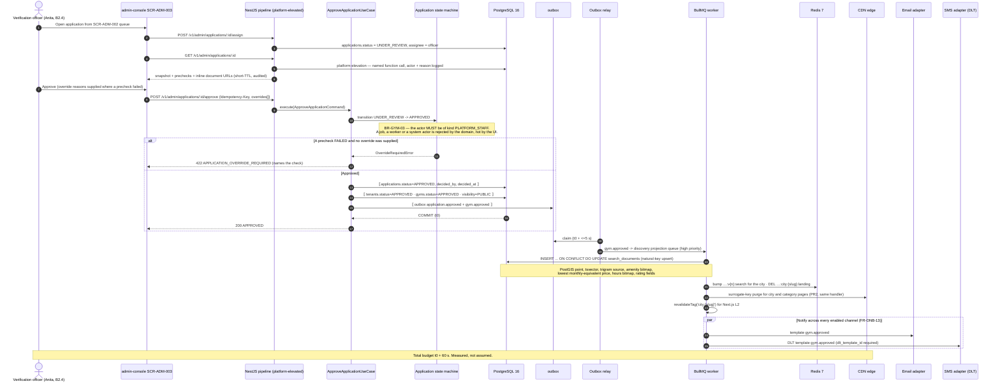

### 2.3 The 60-second budget, itemised

| Segment | Budget | Mechanism | Alarm |
| :--- | ---: | :--- | :--- |
| Decision transaction commit | ≤ 300 ms | One transaction, six row writes | p99 > 1 s |
| Outbox relay claim | ≤ 5 s | 5 s tick, `FOR UPDATE SKIP LOCKED` | **outbox drain lag p95 > 5 s is ADR-0017's first revisit trigger** |
| Projection upsert | ≤ 1 s | Single `INSERT … ON CONFLICT` into `search_documents` | Queue depth |
| Redis version bump + key deletes | ≤ 100 ms | `v{n}` bump, never `SCAN` (CK3) | — |
| CDN surrogate purge | ≤ 10 s | Same handler as the projection (PR2), never a separate job | Purge API error rate |
| Next.js `revalidateTag` | ≤ 5 s | L2 Data Cache | — |
| **Headroom** | **≈ 38 s** | — | — |

> **Why the purge is in the same handler as the projection.** If invalidation were a separate job it
> could fall behind independently, and the marketplace would serve a page that omits a gym the
> database says is live. That is `PR2`, and it is the same rule that keeps a price change from being
> visible in one layer and not another.

### 2.4 Failure branches

| # | Trigger | Response | Recovery |
| :-: | :--- | :--- | :--- |
| F1 | Approve called twice (double-click, retry) | IM-1 returns the stored `200`. If the key differs, the state machine rejects `APPROVED → APPROVED` with `409 INVALID_STATE_TRANSITION` | — |
| F2 | Geo mismatch beyond tolerance, no override | `422 APPLICATION_OVERRIDE_REQUIRED`, `details.check = GEO_ADDRESS_MISMATCH` | Officer supplies a reason; the reason is audited (`AC-ONB-02.3`) |
| F3 | Another `APPROVED` gym at the same address | Same `422`, `details.check = DUPLICATE_LISTING`, plus a link to the existing gym | Override with reason; both retained with a linkage marker (`AC-ONB-02.4`, `B5.3` edge case) |
| F4 | Projection worker crashes mid-batch | Row stays `PENDING`; redelivered. The upsert is a natural-key upsert (IM-5), so a redelivery is a no-op | Listing is late, never wrong |
| F5 | CDN purge API errors | Handler retries with backoff; on exhaustion the event goes `DEAD` and alerts. The L1 `s-maxage` ceiling of 60 s (`PR1`) bounds the damage to one minute | `FR-ADMN-13` health view |
| F6 | Redis unavailable at bump time | Cache reads fail **open** to Postgres; the listing is live immediately, at a latency cost | `Architecture.md` §9.5 |
| F7 | SMS template not yet DLT-approved | Email and in-app send; SMS is **held**, not silently dropped, and the previously approved version sends if one exists | `LAUNCH_MARKET_INDIA.md` §8, conflict 5 |
| F8 | Officer lacks `admin.application.approve` | `403 PERMISSION_DENIED` before validation runs (`Architecture.md` RL-4) | — |

### 2.5 Postconditions and identifiers

`tenants.status = APPROVED` · `gyms.status = APPROVED`, `visibility = PUBLIC` · one
`search_documents` row, discoverable by `GET /v1/search/gyms` · audit row carrying the officer's
identity, timestamp, IP and every override reason (`AC-ONB-02.5`, `BR-DAT-01`) · owner notified on
every enabled channel.

| | |
| :--- | :--- |
| **Idempotency** | IM-1 at the HTTP boundary; IM-5 natural-key upsert in the projection handler; IM-5 prior-effect check in `notifications/` against `notification_log (recipient, template_key, aggregate_id)` |
| **Ledger entries** | **None.** Approval moves no money. The first commission is computed at the first capture (§7). |
| **Satisfies** | `FR-ONB-09`, `FR-ONB-13` · `BR-GYM-01`, `BR-GYM-02`, `BR-GYM-03`, `BR-GYM-08`, `BR-GYM-09`, `BR-DAT-01`, `BR-DAT-07` · `AC-ONB-02.1`…`AC-ONB-02.5` · ADR-0017 · invariant **I4** |

---

## 3. Application rejection with structured reasons, then resubmission with diff

**Surface:** `admin-console` `SCR-ADM-003` → `gym-dashboard` `SCR-DASH-002` ·
**Modules:** `admin/` → `onboarding/` → `notifications/`

### 3.1 Preconditions

Application in `UNDER_REVIEW`. Officer holds `admin.application.reject`. The sixteen-value
`§C4.8` **application rejection** taxonomy is loaded as platform reference data:
`KYC_DOCUMENT_MISSING`, `KYC_DOCUMENT_ILLEGIBLE`, `KYC_DOCUMENT_EXPIRED`, `KYC_NAME_MISMATCH`,
`ADDRESS_UNVERIFIABLE`, `GEO_ADDRESS_MISMATCH`, `DUPLICATE_LISTING`, `INSUFFICIENT_PHOTOS`,
`PHOTO_QUALITY`, `PHOTO_NOT_OF_PREMISES`, `INCOMPLETE_PROFILE`, `NO_PUBLISHED_PLAN`,
`BANK_VERIFICATION_FAILED`, `PROHIBITED_CONTENT`, `SUSPECTED_FRAUD`, `OTHER`.

### 3.2 Diagram

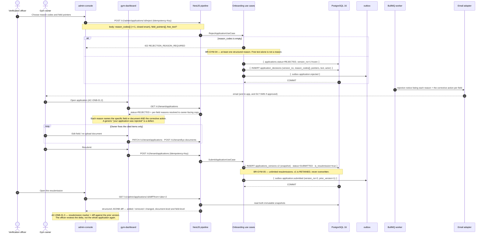

### 3.3 What "diff" means concretely

Both `submitted_snapshot` values are immutable JSONB. The diff is computed **at read time** from the
two snapshots and never stored, because a stored diff can disagree with the snapshots it describes.
Scalar changes show old and new (`legal_name: "Iron Works" → "Iron Works Fitness LLP"`); a replaced
document renders side by side with the old marked superseded and retained for the statutory period
(`BR-TEN-04`); photo-set changes show added and removed thumbnails with perceptual-hash collisions
flagged (`FR-ONB-12`); a plan added purely to clear `NO_PUBLISHED_PLAN` is visible as such; unchanged
sections collapse by default, which is what the officer's three-minute target (`US-ONB-02`) needs.

### 3.4 Failure branches

| # | Trigger | Response | Recovery |
| :-: | :--- | :--- | :--- |
| F1 | Reject with zero reason codes | `422 REJECTION_REASON_REQUIRED` | `BR-GYM-04` |
| F2 | A reason code outside the sixteen-value taxonomy | `400` from `ZodValidationPipe` — the enum is closed | Taxonomy changes are `admin/` configuration (`FR-ADMN-08`), not a client concern |
| F3 | Reject an application already `APPROVED` | `409 INVALID_STATE_TRANSITION` | `C4.4` permits no such edge |
| F4 | Owner resubmits without changing anything | Accepted. `v2` is created and the diff renders **empty**, which is itself the reviewer's answer | `BR-GYM-05` is unconditional; rate limiting, not refusal, handles abuse |
| F5 | Officer requests information instead of rejecting | `POST /v1/admin/applications/:id/request-info` → `INFO_REQUESTED` with a targeted checklist. **Progress is preserved** | `FR-ONB-10`; the `B5.3` edge case for an unreadable scan requires exactly this |
| F6 | Two officers act on one application concurrently | Optimistic concurrency on `applications.version` → `409 CONCURRENT_MODIFICATION` for the loser | Assignment (`/assign`) makes this rare, not impossible |

### 3.5 Postconditions and identifiers

`applications.status = REJECTED` then `SUBMITTED` at `version_no = 2` · `v1` retained in full ·
`application_decisions` append-only, one row per decision · owner sees both structured codes and free
text (`BR-GYM-04`) · the gym is still absent from `search_documents` throughout (I4).

| | |
| :--- | :--- |
| **Idempotency** | IM-1 on reject and on resubmit. Version numbering is guarded by a unique index on `(application_id, version_no)`, so a concurrent double-resubmit produces one `v2`, not two. |
| **Ledger entries** | **None.** |
| **Satisfies** | `FR-ONB-09`, `FR-ONB-10`, `FR-ONB-11` · `BR-GYM-04`, `BR-GYM-05`, `BR-DAT-01` · `AC-ONB-01.2`, `AC-ONB-01.3` · `§C4.4`, `§C4.8` |

---

## 4. Marketplace search — filters, PostGIS radius, ranking, cache

**Surface:** `customer-web` `SCR-WEB-002` · **Module:** `discovery/` (platform-scope read model) ·
**Endpoint:** `GET /v1/search/gyms`, unauthenticated, `RL-SEARCH`, `CDN-60`

### 4.1 Preconditions

| # | Condition | Source |
| :-: | :--- | :--- |
| P1 | `search_documents` is current — maintained by outbox handlers on `gym.*`, `plan.*`, `branch.*`, `media.*`, `review.aggregated`, plus the nightly `search.reindex` rebuild | `§C5`, `Architecture.md` §8.3 |
| P2 | Ranking weights are loaded from `…:config:ranking` (300 s TTL), **configurable without deployment** | `FR-SRCH-10`, ADR-0026 |
| P3 | The user's location came from browser geolocation with explicit consent, a manual city/locality, or a pincode; last location remembered | `FR-SRCH-01` |
| P4 | **No tenant context exists.** This read model is platform-scope and sits outside tenant RLS **by design** — a fact asserted in the isolation suite, never assumed | `Architecture.md` §6.4, `API_Catalog.md` §3.3 |

### 4.2 Diagram

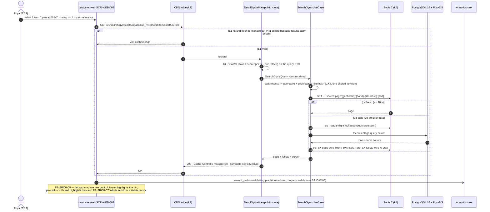

### 4.3 The four-stage query

Stage order is not cosmetic: the cheapest, most selective predicate runs first so the index does the
work.

| Stage | Predicate | Index | Rule |
| :-: | :--- | :--- | :--- |
| **1 · Visibility** | `status = 'APPROVED' AND NOT suspended AND has_public_published_plan` | Partial index on the read model | **Invariant I4, applied before anything else.** `FR-SRCH-09`, `BR-GYM-01`, `BR-PLN-05`, `BR-TEN-05` |
| **2 · Radius** | `ST_DWithin(location::geography, ST_MakePoint(lng,lat)::geography, radius_m)` | **GiST on `geography`** | `geography`, not `geometry` — India spans 3,000 km and a planar approximation is wrong at the edges. ADR-0007 |
| **3 · Filters** | Price band on the precomputed lowest **monthly-equivalent**, amenity bitmap `@>`, rating threshold, open-now against the hours bitmap for the current weekday in `Asia/Kolkata`, 24-hour access, gender policy, duration availability, trial, parking | Composite + GIN on the amenity array | `FR-SRCH-03`. "Open at 06:00" resolves in the **gym's** timezone, which for Phase 1 is always `Asia/Kolkata` (+05:30, no DST) but is never hard-coded |
| **4 · Text + rank** | `websearch_to_tsquery` over the `tsvector` **OR** `pg_trgm` similarity above threshold for typo tolerance; then the ranking expression | GIN on `tsvector`, GiST on trigram | `FR-SRCH-02`. **No OpenSearch in Phase 1** — ADR-0007 and `C1.1` gate it at ~50k listings |

**Ranking (`FR-SRCH-10`), weights from configuration:**

```text
# illustrative — not committed code
score =  w_distance   * distance_decay(metres)
       + w_rating     * bayesian(rating_avg, rating_count, prior_mean, prior_weight)
       + w_freshness  * freshness_score          -- nightly gym.freshness-score job
       + w_conversion * conversion_rate
       + w_complete   * profile_completeness
       + w_featured   * is_featured
```

Bayesian adjustment is used **for ranking only**; the displayed figure is the plain mean with the
count, and nothing is displayed below three published reviews (`FR-REV-08`, `BR-REV-07`). Featured
placements are visually and textually labelled as promoted (`FR-SRCH-11`) — the ranking boost is
disclosed, never hidden.

### 4.4 Cache entries touched

| Entry | Key | TTL | Price-bearing |
| :--- | :--- | ---: | :-: |
| Result page 1 | `…:search:page:{geohash6}:{band}:{filterhash}:{sort}` | 20 s fresh / 60 s stale | **Yes — `PR1` caps it at 60 s** |
| Facet counts | `…:facets:search:{geohash5}:{band}:{filterhash}` | 60 s ±25% jitter | No |
| Zero-result negative cache | `…:search:zero:{geohash5}:{band}:{filterhash}` | 60 s | No |
| L1 edge | Surrogate key `city:{slug}` | `s-maxage=60` | Yes |

All four are invalidated by a `plan.*` / `gym.*` / `branch.*` version bump for the city, issued by
the same outbox handler that updates the projection (`PR2`).

> **`CK2` does not apply here, deliberately.** These keys carry **no tenant id** because the data is
> platform-scope, cross-tenant by definition, and already public. Every *other* cache key in the
> system carries the tenant id, because a cache has no RLS behind it.

### 4.5 Failure branches

| # | Trigger | Response | Rule |
| :-: | :--- | :--- | :--- |
| F1 | Zero results | `200` with `results: []`, the **most restrictive filter identified**, a single-tap relaxation with the resulting count previewed, radius-expansion and nearby-city suggestions | `FR-SRCH-12`, `AC-SRCH-01.2`. Never a bare empty state |
| F2 | User denies geolocation | City selector, never an empty state | `B5.6` edge case |
| F3 | User outside any served city | Nearest served city with an explicit explanation; the location is captured as an expansion demand signal | `B5.6` edge case |
| F4 | All gyms in radius suspended | Treated as zero results with radius expansion. **A suspended gym is never shown** | `BR-TEN-05` |
| F5 | Redis unavailable | Fails **open** to Postgres behind a concurrency cap; latency degrades, correctness does not | `Architecture.md` §9.5 |
| F6 | Maps provider unavailable | The list renders fully; the map area shows a graceful notice | `AC-SRCH-02.3` |
| F7 | `radius_m` beyond the configured maximum | Clamped to the maximum and the clamp is disclosed in the response — not a `400` | Denial-of-service protection that does not punish a curious user |
| F8 | Extremely dense area | Map pins clustered with counts, expanded on zoom; the list is cursor-paginated regardless | `B5.6` edge case, ADR-0023 |
| F9 | Client sends `X-Tenant-Id` | `400 TENANT_HEADER_NOT_ACCEPTED` + **security event** | `Architecture.md` §5.2 step 4 |

### 4.6 Postconditions and identifiers

No state changes. One `search_performed` analytics event with precision-reduced coordinates and no
personal data. Filters and location are encoded in the URL so that sharing or reloading restores them
(`AC-SRCH-01.3`).

| | |
| :--- | :--- |
| **Idempotency** | Not applicable — `GET` is safe and cacheable. The analytics emission is fire-and-forget and deliberately not guaranteed. |
| **Ledger entries** | **None.** |
| **Satisfies** | `FR-SRCH-01`…`FR-SRCH-07`, `FR-SRCH-09`…`FR-SRCH-13`, `FR-SRCH-15` · `BR-GYM-01`, `BR-PLN-05`, `BR-TEN-05` · `AC-SRCH-01.1`…`AC-SRCH-01.3`, `AC-SRCH-02.1`…`AC-SRCH-02.3` · ADR-0007, ADR-0023, ADR-0026 · invariant **I4** |

---

## 5. Gym detail page server-side render for SEO

**Surface:** `customer-web` `SCR-WEB-003`, route `/gyms/[citySlug]/[gymSlug]` ·
**Modules:** `discovery/`, `catalog/`, `plans/`, `reviews/`

`OBJ-04` and `FR-SRCH-13` make organic discovery a product requirement, which is why this surface is
Next.js 14 SSR and the two dashboards are Vite SPAs (ADR-0019). Nothing here is client-rendered that
a crawler needs.

### 5.1 Diagram

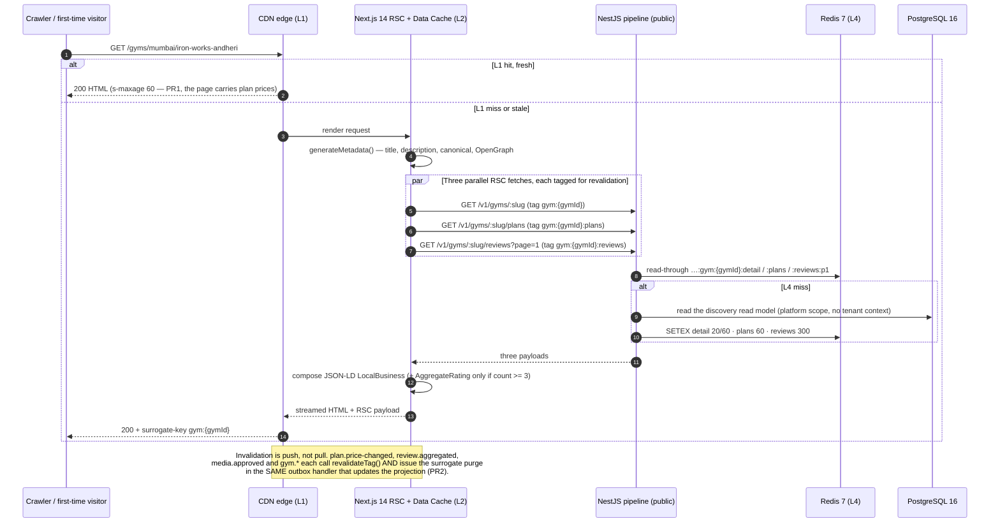

### 5.2 The rules this page must not break

| Rule | Statement | Source |
| :--- | :--- | :--- |
| **R1** | The page carries plan prices, so **every** layer holding it is capped at 60 s: L1 `s-maxage=60`, L2 `revalidate: 60`, L4 20 s fresh / 60 s stale, L6 `staleTime` 60 s | `PR1`, `BR-PLN-03` |
| **R2** | Below **three published reviews**, no numeric rating renders **and** the JSON-LD omits `aggregateRating`. A structured-data assertion the page does not make is a lie to a crawler | `BR-REV-07`, `AC-DETL-02.1`, `FR-DETL-10` |
| **R3** | Every rendered review carries "Verified member". There is no unverified review type to render | `BR-REV-03`, `AC-DETL-02.2` |
| **R4** | A staff-only plan is never in the payload. The filter is in the **read model**, not the template — a template-level filter leaks through the API | `BR-PLN-05` |
| **R5** | A gym previously live, now suspended or closed → **`200` informational page**, not `404`. Never approved → `404` | `FR-DETL-11` |
| **R6** | R2 is enforced in the read model too, so `GET /v1/gyms/:slug` cannot return a rating the page refuses to show | `BR-REV-07` |

### 5.3 Failure branches

| # | Trigger | Response | Rule |
| :-: | :--- | :--- | :--- |
| F1 | API `5xx` during RSC fetch | L2 serves the stale entry (fails **open**); if none exists, a degraded shell renders with the gym's name, address and a retry affordance — never a blank error page | `Architecture.md` §9.1 |
| F2 | Reviews fetch fails but detail succeeds | The page renders without the reviews section rather than failing whole. Reviews are the least load-bearing of the three | `NFR-AVL-02` graceful degradation ordering |
| F3 | Gym suspended between cache write and request | Un-publish propagates **faster** than publish: keys are deleted, not expired, and the purge is prioritised, because showing a gym that cannot be bought breaches I4 as well as I3 | `PR5` |
| F4 | Slug changed (rename) | Old slug `301`s to the canonical URL; `FR-DETL-07`'s canonical URL is the redirect target | `FR-DETL-07` |
| F5 | Crawler requests a paginated review page beyond the indexable depth | `noindex, follow` on deep pages; page 1 remains canonical | `FR-DETL-10` |

### 5.4 Postconditions and identifiers

| | |
| :--- | :--- |
| **Idempotency** | Not applicable — read-only. |
| **Ledger entries** | **None.** |
| **Satisfies** | `FR-DETL-01`…`FR-DETL-05`, `FR-DETL-07`, `FR-DETL-10`, `FR-DETL-11` · `FR-SRCH-13` · `BR-REV-03`, `BR-REV-07`, `BR-PLN-03`, `BR-PLN-05`, `BR-GYM-01` · `AC-DETL-02.1`…`AC-DETL-02.3` · ADR-0019 · invariants **I3**, **I4** |

---

## 6. Checkout — order creation with server-side pricing and coupon validation

**Surface:** `customer-web` `SCR-WEB-005` · **Modules:** `ordering/` ← `plans/`, `catalog/`,
`billing/` (tax), `memberships/` (eligibility) · **Endpoints:** `POST /v1/orders`,
`POST /v1/orders/:orderRef/coupon`, `POST /v1/orders/:orderRef/validate`

> **This is where invariant I3 is born.** Every figure the customer sees from here to the payment
> page is computed once, server-side, and persisted. The client submits **no amounts**, and a request
> body containing one is a `400` — not a silent drop — because every schema is `.strict()`
> (`ADR-0022`, `API_Catalog.md` §1.2.3).

### 6.1 Preconditions

| # | Condition | Source |
| :-: | :--- | :--- |
| P1 | The user is authenticated **and** holds a verified mobile number. Email is not yet required; it becomes required before the invoice issues | `FR-AUTH-02` |
| P2 | The plan is `PUBLISHED`, publicly sellable, and belongs to an `APPROVED`, non-suspended gym | `BR-PLN-05`, `BR-GYM-01` |
| P3 | The gym's refund policy exists and will be **stored on the order**, not referenced | `BR-REF-01`, `BR-REF-02` |
| P4 | The tenant's tax profile resolves to India GST 18% exclusive, intra-state CGST 9% + SGST 9%, place of supply = the **branch** location | `FR-INV-05`, `LAUNCH_MARKET_INDIA.md` §4 |

### 6.2 Diagram

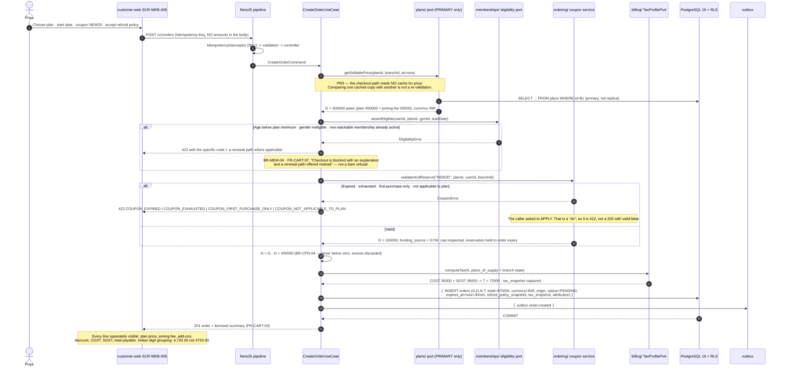

### 6.3 Attribution — which decides whether commission exists at all

`origin` is stamped at order creation and never recomputed. **`MARKETPLACE`** — reached checkout
through search, category, comparison, favourites, a platform campaign link, or a gym detail page
arrived at from search → commission at the standard rate (10%, `OQ-02`), first renewal at standard,
second onward at 5%. **`DIRECT`** — created by gym staff in the dashboard, or arrived via the gym's
own referral link with its tracking parameter → **no commission**, but payment processing cost is
still passed through. The **30-day attribution window** is recorded server-side at the first
authenticated view of the gym from a platform surface, so a marketplace-sourced lead redirected to
"pay at the counter" is still attributed; disputes are resolved by the recorded event log, visible to
both parties (`A6.3`).

### 6.4 Ledger entries written by this flow

**None — and the absence is the point.** An order is an *intent*, not a financial fact. `BR-FIN-01`
makes the ledger the source of every balance; writing a ledger row for an unpaid order would put an
uncollected amount into a tenant's balance and, seven days later, into a payout.

| Figure | Persisted here? | Where |
| :-: | :---: | :--- |
| `G`, `D`, `N`, `T` | **Yes** | `orders.gross_minor`, `discount_minor`, `net_minor`, `tax_minor` + `tax_snapshot` |
| `B`, `C`, `C_tax`, `F`, `P` | **No** | Computed by `ledger/` at **capture** (§7). `F` is unknowable before then and `BR-FIN-06` forbids settling on an estimate |

### 6.5 Failure branches

| # | Trigger | Response | Rule |
| :-: | :--- | :--- | :--- |
| F1 | Body contains `amount_minor`, `total`, or any monetary field | `400` from the `.strict()` schema, one `details` entry naming the field | `BR-PAY-04`, `FR-CART-04`, invariant I2 |
| F2 | Plan archived or unpublished between page load and `POST` | `422 PLAN_NOT_AVAILABLE` | `BR-PLN-04`, `PR5` |
| F3 | Non-stackable membership already active at this gym | `422 MEMBERSHIP_CONFLICT` + a renewal path | `BR-MEM-04`, `B5.9` edge case |
| F4 | Coupon valid at page load, exhausted at `POST` | `422 COUPON_EXHAUSTED`. If it expires *after* order creation, payment is halted, the discount removed, the new total shown, and re-confirmation required | `BR-CPN-03`, `B5.9` edge case |
| F5 | Start date beyond the configurable horizon | `422 START_DATE_OUT_OF_RANGE` | `FR-CART-02` |
| F6 | Same order submitted from two tabs | IM-1: **one** order, one coupon reservation, one response | `B5.9` edge case, `AC-PAY-01.1` |
| F7 | Order not paid within 30 minutes | `order.expire` (every 5 min) → `EXPIRED`, coupon reservation released, `order.expired` emitted | `FR-CART-05` |
| F8 | Discount would exceed the payable | Discount is clamped so the payable is never below zero; the excess is **discarded, not credited** | `BR-CPN-04` |
| F9 | Two coupons submitted | `422` — coupons do not stack, one per order | `BR-CPN-02` |
| F10 | Online marketplace purchase requests partial payment | The option is not offered and the field is rejected. `BALANCE_DUE` exists only for staff-recorded offline sales | `BR-PAY-09`, `AC-CART-02.4` |

### 6.6 Postconditions and identifiers

`orders.status = PENDING` with `expires_at = now + 30 min` · `G`, `D`, `N`, `T`, `tax_snapshot`,
`refund_policy_snapshot`, `origin` and the attribution reference all persisted · coupon reservation
held · `order.created` in the outbox · **no membership, no payment, no ledger entry, no invoice.**

| | |
| :--- | :--- |
| **Idempotency** | IM-1. The coupon reservation is inside the same transaction as the order, so a rolled-back order never holds a coupon. |
| **Satisfies** | `FR-CART-01`…`FR-CART-08`, `FR-CART-11` · `BR-PAY-03`, `BR-PAY-04`, `BR-PAY-09`, `BR-PLN-03`, `BR-PLN-05`, `BR-MEM-04`, `BR-CPN-01`…`BR-CPN-05`, `BR-REF-01`, `BR-REF-02`, `BR-FIN-04` · `AC-CART-01.1`, `AC-CART-02.4` · ADR-0022 · invariant **I3** |

---

## 7. Payment intent to webhook-driven activation — happy path

**Surface:** `customer-web` `SCR-WEB-006` → `SCR-WEB-007` · **Modules:** `payments/` → `ordering/`,
`memberships/`, `billing/`, `ledger/`, `notifications/` · **Provider:** Razorpay Route

> **Invariant I5.** *Membership activation is driven by the gateway webhook, not by the client's
> redirect. A client-side success signal never activates a membership* (`BR-PAY-02`, `FR-PAY-03`,
> ADR-0013). **No endpoint exists that activates a membership from a client signal**, and its absence
> from the generated OpenAPI document is itself a tested control.

### 7.1 Preconditions

Order `PENDING`, unexpired, priced per §6 · the tenant has a verified Razorpay Route linked account ·
the platform's Razorpay webhook secret is loaded from the managed secret store · `payment_events` has
a unique index on `provider_event_id`.

### 7.2 Diagram

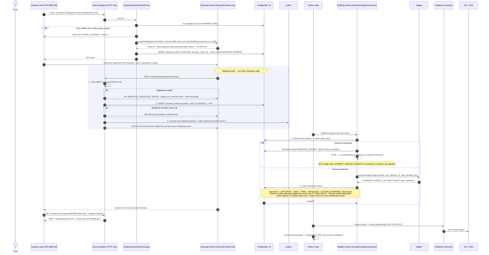

### 7.3 The five ledger entries written at capture

All five are appended in step 5, **inside the single activation transaction**. Direction is from the
tenant's perspective; the tenant's balance is derived, never stored.

| # | `entry_type` | `direction` | Amount (paise) | `reference_type` / `reference_id` | Why |
| :-: | :--- | :---: | ---: | :--- | :--- |
| 1 | `SALE` | **CREDIT** | 400000 (`N`) | `ORDER` / `order_id` | The net sale earned by the gym |
| 2 | `TAX` | **CREDIT** | 72000 (`T`) | `ORDER` / `order_id` | GST collected on the gym's supply, flowing to the gym who remits it. **CGST 36000 + SGST 36000** are carried in the entry's `tax_components` detail and shown as two lines on the invoice — `FR-INV-04` for India means breakdown by *component*, not by rate |
| 3 | `COMMISSION` | **DEBIT** | 40000 (`C`) | `ORDER` / `order_id` | `B × rate_bps` at the rate **effective at the moment of sale** (`BR-FIN-05`), with `B = N`, never on tax (`BR-FIN-04`) |
| 4 | `COMMISSION_TAX` | **DEBIT** | 7200 (`C_tax`) | `ORDER` / `order_id` | **18% GST on the platform's own commission supply.** `[treatment pending]` — balance-affecting under treatment (a), memo-only under treatment (b). See §0.6 |
| 5 | `GATEWAY_FEE` | **DEBIT** | 9440 (`F`) | `ORDER` / `order_id` | **As reported by Razorpay**, never estimated (`BR-FIN-06`). If the provider has not yet reported it, the entry is not written and the order is held out of settlement rather than settled on a guess |

**Derived balance delta for this order:** `+400000 +72000 −40000 −7200 −9440 = 415360` paise
(treatment a) or `422560` paise (treatment b, `C_tax` excluded as memo). This equals `P` by
construction — `P` is not a separate entry, it is what the entries sum to. Writing `P` as a sixth
entry would double-count.

**No `RESERVE_HOLD` is written here.** The rolling reserve (default 500 bps, released after 30 days)
is applied at **batch build**, not at capture — see §18.

### 7.4 Invoice numbering inside the same transaction

| Element | Implementation |
| :--- | :--- |
| Sequence store | `invoice_sequences (tenant_id, financial_year, next_value)` — a **row**, not a Postgres `SEQUENCE`, because a `SEQUENCE` is non-transactional and **gaps on rollback**, which `AC-INV-01.1` forbids |
| Allocation | `SELECT … FOR UPDATE` on that row inside the activation transaction, then increment. Concurrency serialises on one row per tenant per FY — the correct granularity |
| Financial year | **1 April – 31 March** (`LAUNCH_MARKET_INDIA.md` §5, conflict 4). FY start month is **tax-profile configuration**, not a constant, because `OBJ-09` requires country-agnosticism (`AC-INV-01.3`) |
| Rollback / burned number | A failed transaction releases the number with everything else — no gap. If a number is allocated and the render later fails, `AC-INV-01.2` requires reuse by the retry or a **documented void record**. A silently skipped number is a defect |
| Immutability | Issued invoices are immutable; corrections are credit notes in their **own** sequence (`FR-INV-03`, `FR-INV-09`) |

### 7.5 Failure branches

| # | Trigger | Response | Rule |
| :-: | :--- | :--- | :--- |
| F1 | Unsigned or wrongly-signed webhook | `401 WEBHOOK_SIGNATURE_INVALID`, logged, body discarded **before it is read** | `BR-PAY-05` |
| F2 | Webhook redelivered (the provider **will** redeliver) | IM-2: unique `provider_event_id` → `200`, no work | `FR-PAY-04` |
| F3 | Webhook arrives **before** the client redirect | Activation completes; the redirect finds an already-active membership | `B5.10` edge case |
| F4 | Amount differs from `orders.total_minor` | Activation blocked, case escalated, **nothing created** | `B5.10` edge case, `PAYMENT_AMOUNT_MISMATCH` |
| F5 | Invoice-number allocation deadlocks | The whole transaction rolls back — including the outbox rows, so no notification is sent for work that did not happen. BullMQ retries with backoff | ADR-0017, `Architecture.md` §11.5 |
| F6 | Ledger insert collides on the natural key (the activation ran twice) | IM-3: `23505` → the entry exists → the handler treats it as already-applied and completes | ADR-0015 |
| F7 | Payment fails at the gateway | `payment.failed` → order `FAILED`; the customer sees the reason **in customer language** with a retry that creates a fresh intent against the same unexpired order | `FR-PAY-06`, `AC-PAY-02.3` |
| F8 | Start date is in the future | Membership is created `PENDING`, not `ACTIVE`; `membership.activate-pending` promotes it at 00:00 **gym time** — which is 18:30 UTC the previous day at +05:30 | `AC-CART-01.1`, `BR-MEM-03`, ADR-0025 |
| F9 | Gateway fee not present on the capture event | Entries 1–4 are written; `GATEWAY_FEE` is written when the fee is reported, and the order is held out of settlement until then | `BR-FIN-06` |
| F10 | Razorpay unreachable at intent creation | `503` with a retry affordance; circuit breaker opens; the order stays `PENDING` and unexpired | `Architecture.md` §10.3 |

### 7.6 Postconditions and identifiers

`payments.status = CAPTURED` · `orders.status = PAID` with figures 5–9 written **once** (write-once
handler on `commission.computed`) · membership `ACTIVE` or `PENDING` · one immutable invoice with a
gapless FY number and a deterministic PDF in S3 · five ledger entries · outbox rows for
`payment.captured`, `commission.computed`, `invoice.issued`, `membership.activated`.

| | |
| :--- | :--- |
| **Idempotency** | IM-1 on the intent endpoint · IM-2 on the webhook · IM-3 on every ledger row · IM-5 on the worker. Four independent mechanisms, because this is the one path where a duplicate is a financial error rather than a cosmetic one. |
| **Satisfies** | `FR-PAY-01`…`FR-PAY-10`, `FR-INV-01`…`FR-INV-07` · `BR-PAY-01`…`BR-PAY-08`, `BR-PAY-10`, `BR-PAY-11`, `BR-FIN-01`, `BR-FIN-02`, `BR-FIN-04`, `BR-FIN-05`, `BR-FIN-06`, `BR-MEM-02`, `BR-MEM-03` · `AC-INV-01.1`, `AC-INV-01.2`, `AC-INV-01.3`, `AC-CART-01.1` · ADR-0013, ADR-0014, ADR-0015, ADR-0016, ADR-0018 · invariants **I2**, **I5** |

---

## 8. Browser closes before redirect (`AC-PAY-02.1`)

> *"Given payment succeeded at the gateway but my browser closed before redirect, when I reopen the
> site, then my membership is active because activation is webhook-driven."*

This flow exists as a separate section because it is the **proof** of invariant I5, not a variation
of §7. Nothing in the activation path involves the browser, so removing the browser changes nothing.

### 8.1 Diagram

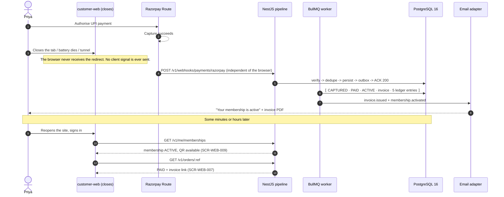

### 8.2 The intermediate state, and the words used for it

`AC-PAY-02.2`: *"…it shows 'confirming payment' with an explicit expectation, never 'failed'."*

| Server state | `GET /v1/orders/:ref` returns | `SCR-WEB-007` renders |
| :--- | :--- | :--- |
| `AWAITING_PAYMENT`, payment `CREATED`/`PENDING`/`AUTHORISED`, within the reconcile threshold | `payment_state: CONFIRMING`, `expected_by` | *"Confirming your payment — this usually takes under a minute."* Never "failed", never a bare spinner |
| Past the threshold, poller still indeterminate | `payment_state: UNDER_REVIEW` + support reference | *"We are checking with your bank."* A human path is offered |
| `payment.failed` received | `status: FAILED` + reason | Customer-language reason and a retry (`AC-PAY-02.3`) |

The screen polls `GET /v1/orders/:ref` at 3 s for 30 s, then 10 s, then stops and offers manual
refresh — **bounded polling**, and a *read*, never an assertion. Same posture as the dashboard live
counters (A-08), including the "last updated" indicator.

### 8.3 Failure branches

| # | Trigger | Response | Rule |
| :-: | :--- | :--- | :--- |
| F1 | Webhook arrives while the browser is still open, before the redirect | The redirect lands on an already-active membership. No special case in the code | `B5.10` edge case |
| F2 | Browser closed **and** webhook delayed | The order sits in `CONFIRMING`; `payment.reconcile` resolves it (§9) | `FR-PAY-05` |
| F3 | Client sends a "payment succeeded" call | **There is no such endpoint.** Its absence is asserted against the generated OpenAPI document in CI | `PROJECT_CONSTITUTION.md` §12.1 A04, `API_Catalog.md` §9.4 |
| F4 | Customer retries the payment from a new tab while the first is still confirming | The intent endpoint is IM-1 and the order is `AWAITING_PAYMENT`; a second capture becomes a duplicate and is handled by §10 | `BR-PAY-07` |

### 8.4 Ledger entries and identifiers

**Identical to §7.3, written by the same worker running the same `ActivateOnCaptureUseCase`.** There
is exactly one implementation of activation in the codebase — a second one, however small, would be a
`PROJECT_CONSTITUTION.md` §2 Q1 violation. **Zero ledger entries are attributable to any client
action in this flow**, which is the shortest possible statement of invariant I5.

| | |
| :--- | :--- |
| **Idempotency** | IM-2 and IM-3 do all the work. The client contributes nothing to idempotency because it contributes nothing at all. |
| **Satisfies** | `FR-PAY-03`, `FR-PAY-04` · `BR-PAY-02`, `BR-PAY-05` · `AC-PAY-02.1`, `AC-PAY-02.2`, `AC-PAY-02.3` · ADR-0013 · invariant **I5** |

---

## 9. Webhook never arrives — poller reconciliation and Finance escalation

**Job:** `payment.reconcile`, every 15 minutes (`§C5`) · **Modules:** `payments/` → `ledger/`,
`memberships/`, `billing/`, `support/`, `notifications/`

> `BR-PAY-06`: *"A payment in an indeterminate state after the gateway's settlement window is
> reconciled automatically; if still indeterminate, it is escalated to Finance and **never
> auto-activates a membership**."*

### 9.1 Diagram

```mermaid
sequenceDiagram
    autonumber
    participant SCH as BullMQ repeatable scheduler
    participant RD as Redis 7 (noeviction db)
    participant WRK as payment.reconcile worker
    participant PG as PostgreSQL 16
    participant RZP as Razorpay Route
    participant UCA as ActivateOnCaptureUseCase (the SAME one as flow 7)
    participant LED as ledger/
    participant FINQ as Finance escalation queue (SCR-ADM-006)
    participant MAIL as Email adapter

    SCH->>WRK: tick (every 15 min)
    WRK->>RD: SET …:lock:payment.reconcile:platform:{period} NX PX=envelope
    alt Lock not acquired
        WRK-->>SCH: exit — another instance owns this tick (IM-5)
    end
    WRK->>PG: SELECT payments WHERE status IN (PENDING, AUTHORISED)<br/>AND created_at < now() - reconcile_threshold  FOR UPDATE SKIP LOCKED  LIMIT n

    loop For each indeterminate payment
        WRK->>RZP: PaymentProvider.fetchStatus(provider_intent_id)
        alt Provider reports CAPTURED
            WRK->>LED: computeCaptureFigures(...)
            WRK->>UCA: activate(paymentId, providerEvent-equivalent)
            UCA->>PG: ⟦ CAPTURED · PAID · ACTIVE · invoice · 5 ledger entries ⟧
            Note over UCA,PG: Exactly the flow-7 transaction. One implementation of activation exists.<br/>If the webhook arrives late, IM-2 and IM-3 make it a no-op.
        else Provider reports FAILED or CANCELLED
            WRK->>PG: payments -> FAILED · orders -> FAILED (retry offered while unexpired)
            WRK->>MAIL: payment.failed notice with a customer-language reason
        else Still indeterminate AND within the escalation window
            WRK->>PG: increment reconcile_attempts, record the probe
            Note over WRK: Do nothing else. Late is acceptable. Wrong is not.
        else Still indeterminate AND past the escalation window
            WRK->>PG: payments.status = REQUIRES_REVIEW
            WRK->>FINQ: open a Finance case (payment ref, order ref, tenant, amount, probe history)
            WRK->>MAIL: notify Finance; notify the customer that it is being checked
            Note over WRK,FINQ: BR-PAY-06 — NEVER auto-activates. A human closes this.
        end
    end
    WRK->>RD: release lock · emit job metrics (start, end, outcome, duration)
```

### 9.2 The two windows

**Reconcile threshold** (default 10 min from intent creation) — how long a webhook may be merely
late; on expiry the poller starts probing. **Escalation window** — the gateway's settlement window
(Razorpay T+1 for most instruments; UPI is near-real-time but reversals are not); on expiry a Finance
case opens, the payment becomes `REQUIRES_REVIEW`, and nothing activates. Both are configuration, not
constants: the second is provider-dependent, and the `PaymentProvider` port exists precisely so a
second provider can carry a different value without touching domain code.

### 9.3 The webhook-versus-poller race

They **will** collide, and the collision is designed for rather than avoided.

| Race | Arbiter | Outcome |
| :--- | :--- | :--- |
| Webhook lands while the poller is mid-probe | IM-3 — the ledger natural key `(ORDER, order_id, entry_type)` | Whichever transaction commits second gets `23505`, treats the entry as already-applied, and completes without error. **One activation, five entries, one invoice** |
| Webhook lands after the poller already activated | IM-2 — unique `provider_event_id` | The event is recorded for audit; no work is done |
| Two poller instances on the same payment | IM-5 distributed lock + `FOR UPDATE SKIP LOCKED` on the claim | Only one instance holds the row |
| Poller activates, then the provider later reports the capture as reversed | Not this flow — that is a refund or a chargeback (§16, §17), and it is a **new compensating entry**, never an edit of the original | `BR-FIN-01` |

### 9.4 Ledger entries

| Situation | Entries written | Note |
| :--- | :--- | :--- |
| Poller resolves to `CAPTURED` | **The same five as §7.3** — `SALE` CREDIT 400000, `TAX` CREDIT 72000, `COMMISSION` DEBIT 40000, `COMMISSION_TAX` DEBIT 7200 `[treatment pending]`, `GATEWAY_FEE` DEBIT 9440 | Written by the same use case; the provenance differs (`payment_events.source = POLLER`) but the money does not |
| Poller resolves to `FAILED` | **None.** No money moved | An order that failed is not a financial fact |
| Still indeterminate, escalated | **None.** | This is the rule that matters: `BR-PAY-06` forbids inventing a ledger entry to make a report balance. An unknown is recorded as unknown |

### 9.5 Failure branches

| # | Trigger | Response |
| :-: | :--- | :--- |
| F1 | Razorpay `fetchStatus` unavailable | Circuit breaker opens; the tick exits cleanly; the payment stays indeterminate and is retried next tick. **Never** interpreted as failure |
| F2 | Job exceeds its expected duration | Alert on the job-duration metric; the lock envelope prevents the next tick from overlapping |
| F3 | Lock evicted from Redis | Cannot happen — locks live on the `noeviction` database, not `allkeys-lru`, precisely because an evicted lock means two workers run the same job (`Architecture.md` §9.3) |
| F4 | The same payment escalates repeatedly | The Finance case is unique on `payment_id`; a second escalation appends a probe record rather than opening a second case |
| F5 | Customer contacts support meanwhile | The support console shows `CONFIRMING` / `UNDER_REVIEW` and the probe history. Support has **no** ability to activate a membership — impersonation cannot perform financial mutations (`FR-AUTH-12`, `AC-AUTH-03.2`) |

| | |
| :--- | :--- |
| **Idempotency** | IM-5 (lock) → IM-3 (ledger) → IM-2 (late webhook). Three layers because the poller and the webhook are two independent producers of the same effect. |
| **Satisfies** | `FR-PAY-05` · `BR-PAY-02`, `BR-PAY-06`, `BR-FIN-01`, `BR-FIN-06` · `AC-PAY-02.2` · `§C4.3` reconciliation clause · `§C5` `payment.reconcile` · invariants **I2**, **I5** |

---

## 10. Duplicate payment detection and auto-refund

**Job:** `payment.duplicate-detect`, every 15 minutes (`§C5`) · **Modules:** `payments/` →
`refunds/`, `ledger/`, `notifications/`

> `BR-PAY-07`: *"Duplicate payment for the same order is detected and automatically refunded within
> one business day, with notification to the payer."* `FR-PAY-08` tightens detection to **one hour**.

### 10.1 How a duplicate happens at all

Two tabs, a double-tap on a slow UPI screen, or a retry after a timeout that had actually succeeded.
IM-1 stops a duplicate **HTTP request**; it cannot stop a customer authorising twice at the gateway
on two separate intents. That is the gap this flow closes.

### 10.2 Diagram

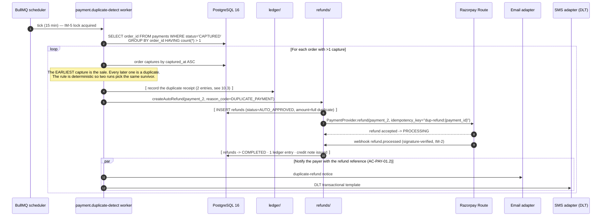

### 10.3 Ledger entries — and the natural-key problem this flow exposes

The capture entries of §7.3 are keyed `(ORDER, order_id, entry_type)`. **That key admits exactly one
`SALE` per order** — which is correct, and it means a duplicate capture *cannot* be written as a
second sale. Real money nonetheless arrived, and the ledger must say so.

| Step | `entry_type` | `direction` | Amount | `reference_type` / `reference_id` | Why |
| :--- | :--- | :---: | ---: | :--- | :--- |
| Duplicate received | `ADJUSTMENT` | **CREDIT** | 472000 | `PAYMENT` / `payment_2_id` | Money the platform holds and does not own. Not a `SALE`: the sale is already recorded once, and a second `SALE` would inflate GMV, commission base and the gym's revenue report |
| Duplicate received | `GATEWAY_FEE` | **DEBIT** | 9440 | `PAYMENT` / `payment_2_id` | Razorpay charged its fee on the duplicate too. Recorded as reported (`BR-FIN-06`) |
| Refund executed | `REFUND` | **DEBIT** | 472000 | `REFUND` / `refund_id` | The money returned to the payer, on the original instrument only (`BR-REF-04`) |

**No `COMMISSION`, no `COMMISSION_TAX` is computed on a duplicate.** `BR-FIN-04` bases commission on
the sale, and the sale was commissioned once. Inventing a second commission and immediately reversing
it would be two lies that happen to cancel.

**Net balance effect: −9440 paise** — the non-reversed gateway fee. `AC-PAY-01.3` requires *"the
duplicate and its reversal both appear and net to zero"* on the settlement statement, and they do:
the `ADJUSTMENT` and the `REFUND` net to zero, and the residual fee line is shown **explicitly**
beside them, which is exactly what `BR-REF-05` requires for a fee the gateway does not reverse.

> **Open — requires a project-owner ruling.** `BR-REF-05` says a non-reversed gateway fee *"is borne
> per the tenant agreement and shown explicitly on the statement"*. A duplicate payment is not the
> gym's doing, so charging the gym ₹94.40 for the platform's checkout allowing a double authorisation
> is defensible only if the tenant agreement says so. The mechanism supports either party bearing it
> — bearing it on the platform side is one additional `ADJUSTMENT` **CREDIT** of 9440 against the
> tenant. Engineering will not choose. Flagged alongside `LAUNCH_MARKET_INDIA.md` §11 for the same
> pre-Sprint-11 decision session.

### 10.4 Failure branches

| # | Trigger | Response | Rule |
| :-: | :--- | :--- | :--- |
| F1 | Detector runs twice on the same duplicate | Refund rows are unique on `(order_id, source_payment_id, reason_code)`; ledger rows are IM-3. One refund, one set of entries | `BR-REF-09` |
| F2 | Gateway refund call times out but succeeded | The provider idempotency key `dup-refund:{payment_id}` makes the retry return the original refund | `FR-PAY-01` |
| F3 | Gateway refund rejected (instrument closed) | Refund → `FAILED`; Finance case opened; **the money is never re-routed to a different instrument** | `BR-REF-04` |
| F4 | Three captures on one order | Earliest survives; **both** later captures are refunded, each with its own `PAYMENT`-keyed entries | Deterministic survivor rule |
| F5 | Duplicate detected after the original was already settled and paid out | The refund is recovered from the reserve and the next cycle; the balance may go negative and carries forward | `A6.4`, `FR-SETL-10`, `B5.10` edge case |
| F6 | Two captures with **different** amounts | Not a duplicate — it is an amount mismatch. Routed to Finance review (`PAYMENT_AMOUNT_MISMATCH`), never auto-refunded | `B5.10` edge case |

| | |
| :--- | :--- |
| **Idempotency** | IM-5 (job lock) → unique refund key → IM-3 (ledger) → provider idempotency key → IM-2 (refund webhook). |
| **Satisfies** | `FR-PAY-08` · `BR-PAY-07`, `BR-REF-04`, `BR-REF-05`, `BR-REF-09`, `BR-FIN-01`, `BR-FIN-04`, `BR-FIN-06` · `AC-PAY-01.1`, `AC-PAY-01.2`, `AC-PAY-01.3` · `§C5` `payment.duplicate-detect` · invariant **I2** |

---

## 11. Price changed between page load and payment — the abort path

> `BR-PLN-03`: *"The price displayed on the marketplace must equal the price charged at checkout for
> the same plan at the same moment. Server-side re-validation at checkout is mandatory; a mismatch
> **aborts** checkout with an explicit message rather than silently charging either figure."*

This is invariant **I3**. There is no configuration that makes the platform charge the other number.

### 11.1 Diagram

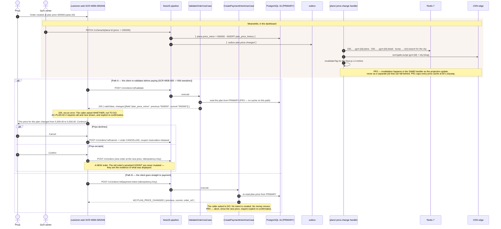

### 11.2 Why the two endpoints return different status codes

This is `API_Catalog.md` §2.5's "evaluate versus do" rule, and it is decidable from the verb.

| Endpoint | Verb class | Negative result | Status |
| :--- | :--- | :--- | :-: |
| `POST /v1/orders/:orderRef/validate` | **Evaluate** | `{ valid: false, changes: [...] }` | **200** |
| `POST /v1/orders/:orderRef/payment-intent` | **Do** | Error envelope, `code: PLAN_PRICE_CHANGED` | **422** |

A `422` from `validate` would make the endpoint useless — its entire purpose is to evaluate. A `200`
from `payment-intent` would be a lie: nothing was created.

### 11.3 Ledger entries

**None. That is the whole point of I3.** No intent, no capture, no invoice, no ledger row. The most
important property of this flow is the list of things it does *not* write.

`BR-PLN-02` covers the mirror case: a price change **never** affects an already-purchased membership.
Existing memberships retain their purchased terms until expiry, which is why `plan_price_history` is
append-only and why an order's `G` is persisted rather than joined at read time.

### 11.4 Failure branches and the metric that watches this path

| # | Trigger | Response | Rule |
| :-: | :--- | :--- | :--- |
| F1 | Price changed **downward** | Same abort. The platform does not silently charge less either — `BR-PLN-03` says *"rather than silently charging either figure"* | `BR-PLN-03` |
| F2 | A promotion started or ended between load and pay | Same path: `plan.promo-started` / `plan.promo-ended` are price-affecting events with elevated invalidation priority | `Architecture.md` §8.3 |
| F3 | Coupon expired rather than the price changing | Payment halted, discount removed, new total shown, re-confirmation required | `BR-CPN-03`, `B5.9` edge case |
| F4 | Order expired while the payment page was open | The attempt fails cleanly and a new order is offered **with prices re-validated** | `B5.9` edge case |
| F5 | Cache served a stale price to the marketplace | The abort still fires, because `PR3` reads the primary. The *user experience* degraded; the *charge* did not | `PR3`, `PR4` |
| F6 | Mismatch rate rises | `price_revalidation_mismatch_total` **above 0.5% of checkouts over a day is a P2 ticket**. A non-zero steady rate is a cache-invalidation defect, not normal operation | `PR4` |

| | |
| :--- | :--- |
| **Idempotency** | IM-1 on both endpoints. A replayed `payment-intent` with the same key returns the stored `422`, not a fresh re-price — a stored failure is still the stored response (`Architecture.md` RL-3). |
| **Satisfies** | `FR-CART-04`, `FR-PAY-01` · `BR-PLN-02`, `BR-PLN-03`, `BR-PAY-04`, `BR-CPN-03` · `AC-PLAN-02.2` · `PR1`…`PR5` · invariant **I3** |

---

## 12. QR token issuance and a successful check-in scan

**Surfaces:** `customer-web` `SCR-WEB-009` (member) and `gym-dashboard` `SCR-DASH-009` (desk) ·
**Module:** `attendance/` · **Budget:** `NFR-PERF-03` p95 ≤ 2 s scan → confirmation;
`NFR-PERF-08` 500 verifications/minute

### 12.1 The token (ADR-0012, A-11)

```jsonc
// illustrative — not committed code
{ "kid": "chk-2026-08",   // key id — verification selects by kid, never by trying keys in turn
  "mid": "<membership_id>", "uid": "<member_id>", "tid": "<tenant_id>",
  "iat": 1786000000, "exp": 1786000060,   // 60 s TTL — BR-CHK-02
  "n":   "<128-bit nonce>" }              // BR-CHK-06 idempotency, unique within TTL
```

EdDSA over Ed25519, detached signature, key rotated every 30 days with a 90-minute overlap. **No
personal data in the payload** (`FR-CHK-02`, `BR-DAT-06`). A screenshot is worthless in under a
minute, which is the structural mitigation for credential sharing (`RSK-03`).

### 12.2 Diagram

```mermaid
sequenceDiagram
    autonumber
    actor M as Member
    actor STF as Front desk (Sameer, B2.3)
    participant MBR as customer-web SCR-WEB-009
    participant DBR as gym-dashboard SCR-DASH-009
    participant API as NestJS pipeline
    participant UCT as IssueCheckInTokenUseCase
    participant UCS as ScanCheckInUseCase
    participant KMS as Managed secret store (K-02)
    participant PG as PostgreSQL 16 + RLS
    participant RD as Redis 7
    participant OBX as outbox

    loop Every ~50 s while the screen is visible
        MBR->>API: POST /v1/me/memberships/:id/qr  (RL-tiered: a member cannot mint hundreds)
        API->>UCT: execute
        UCT->>PG: membership must be ACTIVE and belong to this member
        UCT->>KMS: current Ed25519 private key + kid
        UCT-->>MBR: { token, exp } — 60 s
        MBR->>MBR: render with `qrcode` (A-10) + visible countdown + auto-refresh
    end

    M->>STF: Presents the QR
    STF->>DBR: Camera scan via @zxing/browser (A-10), full-screen desk mode
    DBR->>API: POST /v1/checkin/scan { token, branch_id }  (Idempotency-Key)
    API->>UCS: execute
    Note over UCS: FR-CHK-04 — ten steps IN ORDER, first failure returned. Server time only;<br/>the scanning device clock is never trusted.
    UCS->>UCS: 1 signature valid (kid in the active set) -> 2 not expired (server clock)
    UCS->>PG: 3 membership exists -> 4 ACTIVE -> 5 tenant matches -> 6 branch permitted
    UCS->>PG: 7 gym open (or plan grants 24h) -> 8 within plan access window
    UCS->>PG: 9 not within duplicate cooldown -> 10 entitlement remaining
    UCS->>PG: ⟦ INSERT attendance (result=ALLOWED, method=SCAN, token_nonce UNIQUE) ⟧
    UCS->>PG: ⟦ decrement entitlement for session-based plans (BR-PLN-06) ⟧
    UCS->>OBX: ⟦ outbox checkin.recorded ⟧
    PG-->>UCS: COMMIT
    UCS-->>DBR: 200 { result: ALLOWED, member, plan, days_remaining, sessions_remaining }
    DBR->>STF: Name, photo, plan, remaining — held for a configurable duration (FR-CHK-05)
    Note over DBR: Scanner is immediately ready for the next person (AC-CHK-01.1)
    OBX->>RD: checkin.recorded handler — DEL …:live:{tenantId}:{branchId} and its :etag
    Note over DBR,RD: The desk's currently-in-gym count refreshes by TanStack Query polling<br/>at 10-15 s via useLiveCounters(), with a MANDATORY "last updated" indicator (A-08).<br/>Socket.IO is Phase 2. The app tier stays stateless (NFR-SCAL-03).
```

### 12.3 Why the ten steps are ordered as they are

| Steps | Cost | Rationale |
| :--- | :--- | :--- |
| 1–2 signature, expiry | **Local**, no DB round trip | The cheapest checks reject the largest class of bad input — screenshots and forgeries — before any I/O. This is what makes the `NFR-PERF-03` budget achievable |
| 3–5 existence, status, tenant | One indexed read | Step 5 is also an isolation control: a token minted in tenant A presented at tenant B is `TOKEN_INVALID` **and** a security event |
| 6–8 branch, hours, access window | Same read, joined | `BR-CHK-03`, `BR-CHK-05`. A declared closure denies with `GYM_CLOSED_EXCEPTION`, not `OUTSIDE_OPERATING_HOURS` — the desk needs the true reason |
| 9–10 cooldown, entitlement | Indexed lookups | `BR-CHK-04` (repeat within 60 min does **not** decrement entitlement) and `BR-PLN-06` (session plans expire on the earlier of exhaustion or end date) |

### 12.4 Failure branches (all `200`, all recorded)

`API_Catalog.md` §2.4: **a denial is `200`, not `4xx`** — the evaluation ran to completion and
produced an answer, the scanner needs the full payload, and `BR-CHK-10` requires the denial to be
**written**. A `4xx` that nonetheless commits a row is a lie about what happened.

| Denial reason (`§C4.8`) | Cause | Desk sees |
| :--- | :--- | :--- |
| `TOKEN_EXPIRED` | Screenshot of an old QR, or a slow queue | "Ask the member to refresh their code" (`AC-CHK-01.3`) |
| `TOKEN_INVALID` | Bad signature, **retired `kid`**, or tenant mismatch | Generic to the desk; a security event internally (`SEC-A02-002`, `SEC-A02-003`) |
| `MEMBERSHIP_EXPIRED` | End date passed | "Membership expired on 31 July 2026" + **Renew now**, which opens the sale flow pre-filled (`AC-CHK-01.2`) |
| `MEMBERSHIP_FROZEN` | Freeze active | "Frozen until \<date\>" (`BR-MEM-06`, `AC-MEMB-01.2`) |
| `MEMBERSHIP_PENDING_START` | Future start date | "Membership begins on \<date\>" (`AC-CART-01.2`) |
| `MEMBERSHIP_CANCELLED` · `MEMBERSHIP_REFUNDED` | Terminal states | QR no longer generates for `REFUNDED` (`AC-RFND-01.3`) |
| `WRONG_BRANCH` | Plan restricted to named branches | Names the permitted branches (`BR-TEN-03`, `BR-CHK-03`) |
| `OUTSIDE_OPERATING_HOURS` · `GYM_CLOSED_EXCEPTION` | Hours or a declared closure | Two distinct reasons, deliberately |
| `OUTSIDE_PLAN_ACCESS_WINDOW` | Off-peak plan at peak time | Names the window |
| `NO_SESSIONS_REMAINING` | Session plan exhausted | Top-up path offered |
| `DUPLICATE_WITHIN_COOLDOWN` | Repeat within 60 min | Recorded; entitlement untouched |
| `MEMBERSHIP_UNDER_REVIEW` | Sharing flag raised | `BR-MEM-13` suspends pending review, never cancels |
| `TENANT_SUSPENDED` | Tenant suspended for cause | **Note:** subscription arrears alone never block check-in (`BR-TEN-06`) |

**Non-denial failures:** member's phone has no battery → manual check-in by phone lookup
(`FR-CHK-07`). Member holds two active memberships at the gym → the scanner asks which to consume,
defaulting to the one expiring soonest (`B5.13` edge case). QR key K-02 lost → **every check-in on
the platform is denied simultaneously**; the fallback is `FR-CHK-07` manual check-in, which exists
for exactly this (`Security.md` §K-02).

| | |
| :--- | :--- |
| **Ledger entries** | **None.** A check-in moves no money. Entitlement is not currency and is never modelled in `ledger_entries`. |
| **Idempotency** | IM-4 (`attendance.token_nonce` unique) with IM-1 in front of it — see §14 for why both are needed. |
| **Satisfies** | `FR-CHK-01`…`FR-CHK-05`, `FR-CHK-10`, `FR-CHK-11` · `BR-CHK-01`…`BR-CHK-06`, `BR-CHK-10`, `BR-MEM-06`, `BR-PLN-06`, `BR-DAT-06` · `AC-CHK-01.1`, `AC-CHK-01.2`, `AC-CHK-01.3` · `NFR-PERF-03`, `NFR-PERF-08`, `NFR-SCAL-03` · ADR-0012, A-08, A-10, A-11 |

---

## 13. Check-in denial with staff override, including the audit trail

**Surface:** `gym-dashboard` `SCR-DASH-009` · **Module:** `attendance/` + `audit/` ·
**Endpoint:** `POST /v1/checkin/override`

### 13.1 Diagram

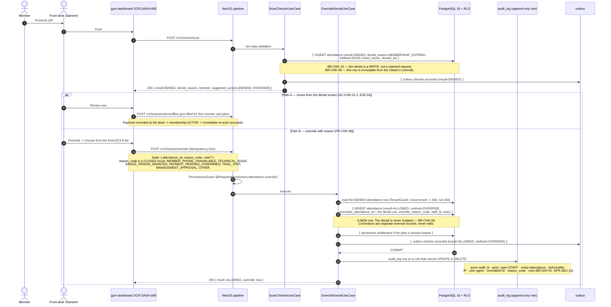

### 13.2 What the audit trail must contain, and why each field

| Field | Why it is not optional |
| :--- | :--- |
| `actor_id`, `actor_type` | An override admits someone the system refused. The person who decided must be nameable |
| `reason_code` (closed enum) | `FR-CHK-08` requires overrides to be **reportable**, and a report over free text is not a report |
| `note` (optional) | The reason code carries the class; the note carries the case |
| `overrides_attendance_id` | Links allow-row to deny-row, so the denial's immutability is visibly preserved |
| `before` / `after` | `BR-DAT-01`. Here "before" is the denial, "after" is the new allow row |
| IP + user agent + correlation id | An override from an unexpected network is a fraud signal; the correlation id ties the row to the scan request, the outbox row and the OTel trace |
| Append-only role | `NFR-SEC-13` — grants exclude `UPDATE` and `DELETE`, so application credentials cannot alter it |

### 13.3 Reporting consequence

Because the denial and the override are two rows, `FR-CHK-10`'s log shows **both** — one denial and
one override, not one silently-successful visit — and `AC-CHK-02.3`'s CSV export carries both.
Reviewing overrides per staff member per month is the intended use.

### 13.4 Failure branches

| # | Trigger | Response | Rule |
| :-: | :--- | :--- | :--- |
| F1 | `reason_code` outside the seven-value taxonomy | `400` from the `.strict()` closed enum | `§C4.8` |
| F2 | Staff lacks `attendance.override` | `403 PERMISSION_DENIED`, before validation | `FR-RBAC-01`, `Architecture.md` RL-4 |
| F3 | Override targets an attendance row of another tenant | **`404`, not `403`** — existence is not disclosed | `API_Catalog.md` §2.3, invariant I1 |
| F4 | Override targets a row that is already `ALLOWED` | `422 NOTHING_TO_OVERRIDE` | Nothing was denied |
| F5 | Override submitted twice | IM-1 returns the stored `200`; a second key hits the unique index on `overrides_attendance_id` | One override per denial |
| F6 | Override attempted on `TENANT_SUSPENDED` | Refused. Staff cannot override a platform-level suspension | `BR-TEN-05` |
| F7 | Denial write itself fails | The scan returns `503`; **no denial and no allow is recorded**. A denial that is not recorded is a `BR-CHK-10` failure, so the write is not best-effort | `BR-CHK-10` |

| | |
| :--- | :--- |
| **Ledger entries** | **None.** An override admits a person; it does not move money. `PAYMENT_PENDING_CONFIRMED` is the reason code that most tempts an engineer to write one — it must not, because the payment is *pending*, and §7/§9 own its resolution. |
| **Satisfies** | `FR-CHK-06`, `FR-CHK-07`, `FR-CHK-08`, `FR-CHK-10` · `BR-CHK-08`, `BR-CHK-09`, `BR-CHK-10`, `BR-DAT-01` · `AC-CHK-01.2` · `NFR-SEC-13` · `§C4.8` override taxonomy · invariant **I1** |

---

## 14. Check-in idempotency — same token scanned twice within TTL

> `BR-CHK-06`: *"Check-in is idempotent on the token; a token replayed within its TTL yields the
> original attendance record, not a second one."*
> `AC-CHK-01.4`, `AC-CHK-01.5`.

### 14.1 The two collisions, which are not the same collision

| | Case A — HTTP retry | Case B — physical re-scan |
| :--- | :--- | :--- |
| What happened | The **same request** was sent twice: network drop, client retry, tab duplication | The **same QR** was scanned twice within 60 s: a jumpy camera, a second staff member scanning the same phone |
| `Idempotency-Key` | **Identical** | **Different** — it is a new request |
| Token nonce | Identical | Identical |
| Arbiter | **IM-1** — `idempotency_keys` returns the stored `200` without re-entering the use case | **IM-4** — `attendance.token_nonce` unique index raises `23505`; the use case catches it, re-reads and returns the original row |
| Result | One attendance record | One attendance record |

Both mechanisms are required. IM-1 alone cannot see case B; IM-4 alone would re-run the ten-step
validation on every retry, which is wasted work and — if the membership state changed in between —
could produce a different answer for the same token.

### 14.2 Diagram

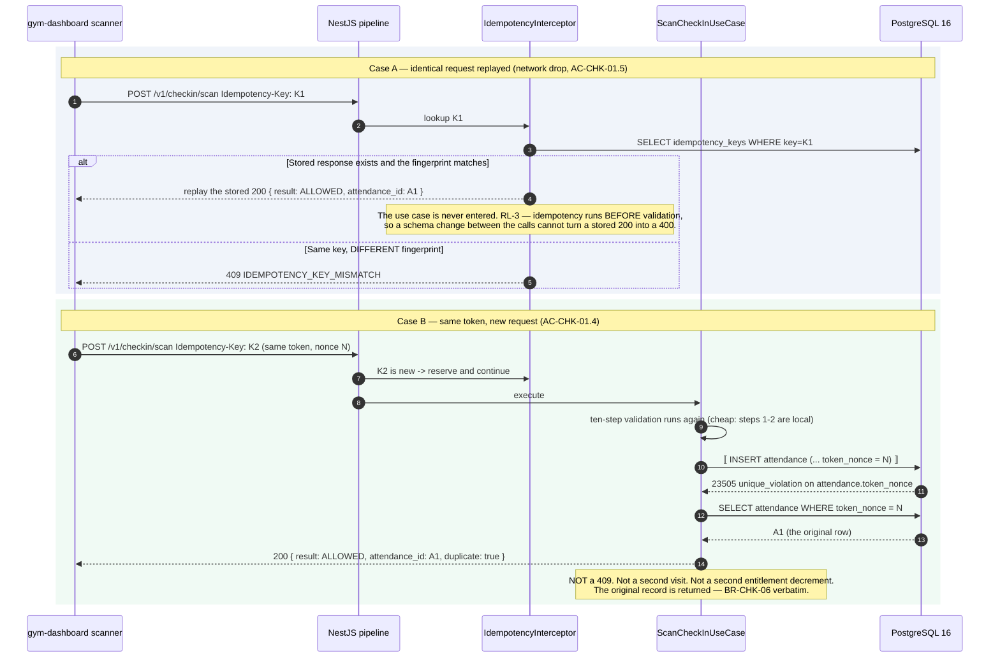

### 14.3 `BR-CHK-06` versus `BR-CHK-04` — the distinction that gets confused

These are two different rules about two different situations and they produce two different outcomes.
Conflating them is the most likely defect in this module.

| | `BR-CHK-06` — token replay | `BR-CHK-04` — cooldown duplicate |
| :--- | :--- | :--- |
| Trigger | The **same token** (same nonce) within its 60 s TTL | A **different, valid token** at the same branch within the cooldown, default 60 minutes |
| Detection | Unique index on `attendance.token_nonce` | Time-window query over recent attendance for the membership and branch |
| Result field | `ALLOWED` — it returns the original record | **`DENIED`**, `denial_reason = DUPLICATE_WITHIN_COOLDOWN` |
| Rows written | **Zero new rows** | **One new row**, recorded as a duplicate (`BR-CHK-10`) |
| Entitlement | Not decremented (it was decremented once, on the original) | **Not decremented** — `BR-CHK-04` is explicit |
| What the desk sees | The same success card as the first scan | A denial card explaining the cooldown |
| Validation step | Not a step — it is the write's arbiter | **Step 9** of the `FR-CHK-04` sequence |

### 14.4 Why the nonce lives in Postgres and not Redis

A Redis `SETNX` on the nonce is faster and is the obvious first idea. It is rejected because the
application cache database is `allkeys-lru`, so an **evicted nonce permits a replay** — a
`BR-CHK-06` violation caused by memory pressure, which is the worst kind because it is load-dependent
and first appears at peak hour. Beyond that: the nonce reservation and the attendance row must commit
**together**, which Redis and Postgres cannot do; `BR-CHK-09` makes attendance permanently retained,
and the nonce is part of that record's provenance; and the unique-index write lands on the same page
as the insert, so there is no measurable saving to buy with the risk. This mirrors the
`idempotency_keys` decision in §0.4 and rule `NC1` in §0.5: **anything whose loss changes what
happened lives in Postgres.**

### 14.5 Failure branches

| # | Trigger | Response | Rule |
| :-: | :--- | :--- | :--- |
| F1 | Network drops mid-scan, connectivity returns, client retries | *"The operation either completed exactly once or not at all — never twice"* | `AC-CHK-01.5` |
| F2 | Two scanners on the same desk scan one phone simultaneously | One `INSERT` wins; the other gets `23505` and returns the same `attendance_id` | `BR-CHK-06` |
| F3 | Same nonce presented **after** the TTL | Step 2 denies with `TOKEN_EXPIRED` before the nonce is ever consulted | `BR-CHK-02` |
| F4 | Nonce collision across two different memberships | Cryptographically implausible at 128 bits from the `node:crypto` CSPRNG. If it occurred, the second scan returns the first membership's record, which would be a **defect**; the unique index is therefore on the nonce **and** asserted against `membership_id` in the re-read | `Security.md` weak-randomness control |
| F5 | Idempotency record expires (24 h) and the same request is replayed | The nonce index still holds — attendance rows are permanent, so IM-4 outlives IM-1 by design | TD-019 |

| | |
| :--- | :--- |
| **Ledger entries** | **None.** |
| **Satisfies** | `FR-CHK-04` · `BR-CHK-04`, `BR-CHK-06`, `BR-CHK-09`, `BR-CHK-10`, `BR-PAY-03` · `AC-CHK-01.4`, `AC-CHK-01.5` · ADR-0012, ADR-0016 · `Architecture.md` RL-3, §8.5 |

---

## 15. Membership freeze and early unfreeze with end-date recalculation

**Surfaces:** `customer-web` `SCR-WEB-009` and `gym-dashboard` `SCR-DASH-008` · **Module:**
`memberships/` · **Endpoints:** `POST /v1/me/memberships/:id/freeze` · `/unfreeze`

### 15.1 Diagram

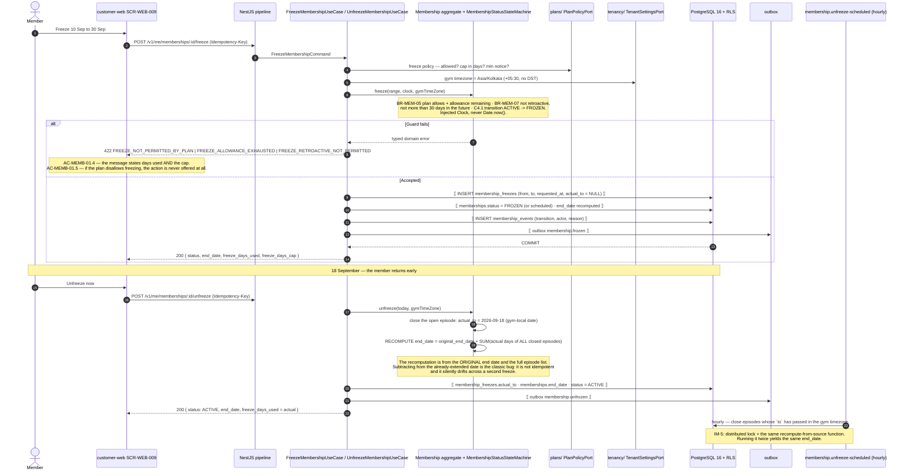

### 15.2 The recalculation, stated arithmetically

```text
# illustrative — not committed code
end_date = original_end_date
         + Σ over episodes e of  days_inclusive( e.from , coalesce(e.actual_to, e.to) )

freeze_days_used = same sum        # the allowance is consumed by ACTUAL days, not planned days
```

| Property | Why it matters |
| :--- | :--- |
| **Recompute, never increment** | `Architecture.md` §8.5 recompute-from-source. `end_date += n` run twice by a redelivered event corrupts the membership silently |
| **`original_end_date` is immutable** | Persisted at activation, never written again. It is the anchor the recomputation needs |
| **Inclusive days, gym timezone** | `BR-MEM-03`: validity is `[start_date, end_date]` **inclusive** in the gym's timezone. At +05:30, midnight gym-time is **18:30 UTC the previous day** — a naive UTC date subtraction is off by one for a third of the day |
| **Early unfreeze reduces the extension** | `FR-MEMB-05`, `AC-MEMB-01.3`: recalculated to the **actual** frozen duration; unused allowance returns to the member |
| **Expiry during a freeze** | The extension applies first, so the expiry date already accounts for it; `membership.expire` fires at the extended date (`B5.12`) |

### 15.3 Failure branches

| # | Trigger | Response | Rule |
| :-: | :--- | :--- | :--- |
| F1 | Plan does not permit freezing | `422 FREEZE_NOT_PERMITTED_BY_PLAN`; the UI never offered the action | `BR-MEM-05`, `AC-MEMB-01.5` |
| F2 | Allowance exhausted | `422 FREEZE_ALLOWANCE_EXHAUSTED` with `used` and `cap` in `details` | `AC-MEMB-01.4` |
| F3 | Retroactive `from`, or `from` more than 30 days ahead | `422 FREEZE_RETROACTIVE_NOT_PERMITTED` / `FREEZE_TOO_FAR_IN_FUTURE` | `BR-MEM-07` |
| F4 | Check-in attempted while frozen | `200 DENIED`, `MEMBERSHIP_FROZEN`, *"frozen until \<date\>"* | `BR-MEM-06`, `AC-MEMB-01.2` |
| F5 | Overlapping freeze requested | `422 FREEZE_OVERLAP`; an exclusion constraint on `(membership_id, daterange)` is the arbiter, not application code | Database-level correctness |
| F6 | Unfreeze called when not frozen | `409 INVALID_STATE_TRANSITION` | `§C4.1` |
| F7 | Membership expires while frozen | `FROZEN → EXPIRED` at the extended end date, by the expiry job | `§C4.1` |
| F8 | Freeze request replayed | IM-1; and the exclusion constraint prevents a second episode for the same range | — |

### 15.4 Ledger entries

**None.** A freeze moves no money and creates no credit. This is stated explicitly because it is the
single most tempting place in the membership lifecycle to invent a pro-rata adjustment: the member is
not using the service, so it *feels* like value should move. `BR-MEM-09` confines pro-rata cash
treatment to **upgrade** (charged on the unused remainder) and states that **downgrade never
generates a cash refund**. Freeze extends time; it does not exchange money.

| | |
| :--- | :--- |
| **Idempotency** | IM-1 at the boundary · a `daterange` exclusion constraint on episodes · IM-5 recompute-from-source in the scheduled job. |
| **Satisfies** | `FR-MEMB-01`, `FR-MEMB-02`, `FR-MEMB-04`, `FR-MEMB-05`, `FR-MEMB-09` · `BR-MEM-01`, `BR-MEM-03`, `BR-MEM-05`, `BR-MEM-06`, `BR-MEM-07`, `BR-MEM-09` · `AC-MEMB-01.1`…`AC-MEMB-01.5` · `§C4.1` · ADR-0025 · `LAUNCH_MARKET_INDIA.md` §3 |

---

## 16. Refund within policy — auto-approval → gateway → credit note → ledger reversal

**Surfaces:** `customer-web` `SCR-WEB-008` / `SCR-DASH-015` / `SCR-ADM-008` · **Modules:**
`refunds/` → `payments/`, `ledger/`, `billing/`, `memberships/`, `settlements/`

### 16.1 Preconditions

Order `PAID`, membership `ACTIVE`. **The applicable policy is the one stored on the order**, not the
tenant's current policy (`BR-REF-02`) — which is why §6 snapshots `refund_policy_snapshot` at order
creation.

### 16.2 Diagram

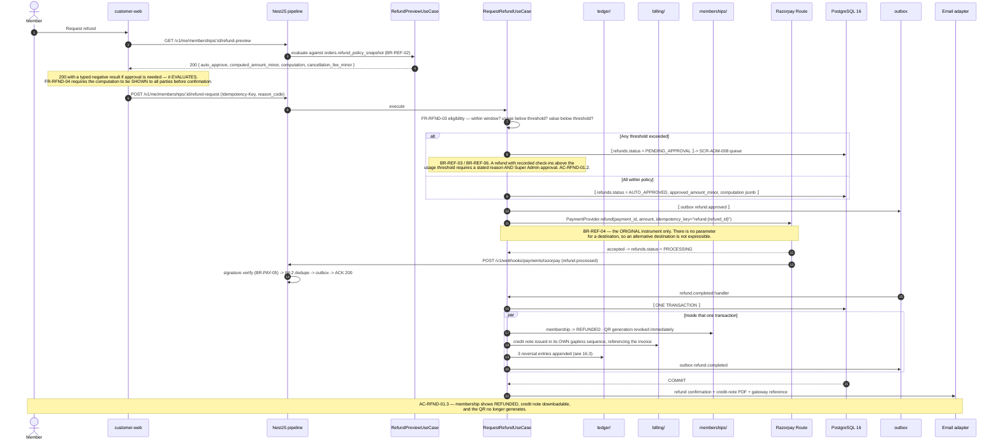

### 16.3 Ledger entries — full refund of the worked example

The original capture credited the tenant `415360` paise net (treatment a). A full refund does **not**
simply reverse that, because the gateway does not return its fee.

| # | `entry_type` | `direction` | Amount (paise) | Reference | Rule |
| :-: | :--- | :---: | ---: | :--- | :--- |
| 1 | `REFUND` | **DEBIT** | 472000 (`N + T`) | `REFUND` / `refund_id` | The full amount returned to the customer, on the original instrument |
| 2 | `COMMISSION_REVERSAL` | **CREDIT** | 40000 (`C`) | `REFUND` / `refund_id` | `BR-REF-05` — commission reverses **proportionally**; a full refund reverses it fully |
| 3 | `COMMISSION_TAX_REVERSAL` | **CREDIT** | 7200 (`C_tax`) | `REFUND` / `refund_id` | `[treatment pending]` — written under treatment (a); memo-only under treatment (b) |
| — | `GATEWAY_FEE` reversal | — | **not written** | — | `BR-REF-05` — *"gateway fees are reversed only to the extent the gateway reverses them"*. Razorpay does not return the MDR on a refund, so **no entry exists**. Inventing one would fabricate money |

**Net effect on the tenant's derived balance: `−472000 + 40000 + 7200 = −424800` paise.** The tenant
was credited `+415360` at sale, so the round trip leaves them `−9440` — exactly the non-reversed
gateway fee. That residual is **shown explicitly on the settlement statement** as `BR-REF-05`
requires, borne per the tenant agreement.

### 16.4 Partial and pro-rata refunds

`FR-RFND-04`: full, or pro-rata on unconsumed duration or sessions, less any stated cancellation fee.

```text
# illustrative — not committed code
consumed_ratio     = days_used / total_days           (or sessions_used / total_sessions)
refundable_net     = round_half_even( N * (1 - consumed_ratio) ) - cancellation_fee_minor
refundable_tax     = round_half_even( T * refundable_net / N )
reversal_ratio     = refundable_net / N
commission_reversal     = round_half_even( C     * reversal_ratio )
commission_tax_reversal = round_half_even( C_tax * reversal_ratio )
```

| Rule | Statement |
| :--- | :--- |
| **Rounding residue** | Successive partial reversals must sum to **exactly** `C`. The reversal that brings cumulative refunded net to `N` takes the residue, so `Σ COMMISSION_REVERSAL ≡ C`. Independent per-reversal rounding drifts, and `BR-FIN-03`'s exact-sum requirement then fails at settlement |
| **Tax on the refund** | Refunded tax splits back into **CGST and SGST** on the credit note, mirroring the invoice — `FR-INV-04` applies to credit notes too |
| **Never below zero** | A cancellation fee larger than the refundable net yields a refund of zero, not a charge |
| **Membership state** | Full → `REFUNDED`, QR revoked. Partial → membership **adjusted** (shortened term or reduced entitlement), not `REFUNDED` (`FR-RFND-06`) |

### 16.5 Failure branches

| # | Trigger | Response | Rule |
| :-: | :--- | :--- | :--- |
| F1 | Refund requested on an already-refunded order | Idempotent no-op returning the original refund | `BR-REF-09` |
| F2 | Gateway refund fails (instrument closed, insufficient provider balance) | `refunds.status = FAILED` with the reason; retried per `§C4.5`; Finance alerted. **Never re-routed to a different instrument** | `BR-REF-04`, `§C4.5` |
| F3 | Refund exceeds the tenant's current balance | Balance goes **negative** and carries forward, recovered from subsequent batches and the reserve. Persistent negative balance beyond a threshold triggers tenant review | `A6.4`, `FR-SETL-10` |
| F4 | The original sale was already settled and paid out | Recovered from the **reserve** (default 500 bps, 30-day release) and the next cycle | `A6.4`, `B5.10` edge case |
| F5 | Refund with recorded check-ins above the usage threshold | Routes to Super Admin with a **stated reason required** | `BR-REF-06`, `AC-RFND-01.2` |
| F6 | Gym closed or suspended for cause | Unconsumed pro-rata value refunded to affected members, recovered from the tenant's balance and reserve; members notified within 24 h | `BR-REF-07`, `BR-MEM-14` |
| F7 | Credit-note number allocated but the PDF render fails | Same discipline as invoices: either the retry uses the number or a documented void record occupies it | `AC-INV-01.2`, `FR-INV-09` |
| F8 | Refund webhook redelivered | IM-2 on `provider_event_id`; IM-3 on the three reversal entries | — |
| F9 | Two refund requests race | Unique partial index: at most one refund per order in a non-terminal state | `BR-REF-09` |

| | |
| :--- | :--- |
| **Idempotency** | IM-1 → provider idempotency key `refund:{refund_id}` → IM-2 → IM-3. |
| **Satisfies** | `FR-RFND-01`…`FR-RFND-07`, `FR-RFND-11`, `FR-INV-03`, `FR-INV-09` · `BR-REF-01`…`BR-REF-07`, `BR-REF-09`, `BR-FIN-01`, `BR-FIN-02`, `BR-FIN-03`, `BR-PAY-10` · `AC-RFND-01.1`, `AC-RFND-01.2`, `AC-RFND-01.3` · `§C4.5` · invariant **I2** |

---

## 17. Chargeback intake → evidence pack → resolution

**Surfaces:** `SCR-ADM-009` (Finance) and `SCR-DASH-015` (tenant) · **Modules:** `refunds/` →
`ledger/`, `settlements/`, `attendance/`, `billing/`, `notifications/`

### 17.1 Diagram

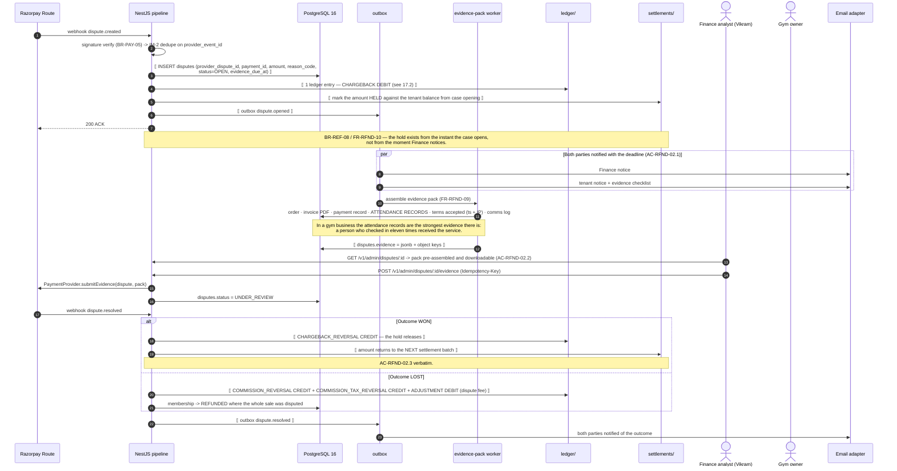

### 17.2 Ledger entries at each step

| Step | `entry_type` | `direction` | Amount (paise) | Reference | Rule |
| :--- | :--- | :---: | ---: | :--- | :--- |
| **Case opened** | `CHARGEBACK` | **DEBIT** | 472000 | `DISPUTE` / `dispute_id` | `BR-REF-08` — the disputed amount is held against the tenant balance from case opening |
| **Resolved — WON** | `CHARGEBACK_REVERSAL` | **CREDIT** | 472000 | `DISPUTE` / `dispute_id` | The hold releases and the amount returns to the next settlement (`AC-RFND-02.3`) |
| **Resolved — LOST** | `COMMISSION_REVERSAL` | **CREDIT** | 40000 | `DISPUTE` / `dispute_id` | See the ruling note below |
| **Resolved — LOST** | `COMMISSION_TAX_REVERSAL` | **CREDIT** | 7200 | `DISPUTE` / `dispute_id` | `[treatment pending]` |
| **Resolved — LOST** | `ADJUSTMENT` | **DEBIT** | provider dispute fee, as reported | `DISPUTE` / `dispute_id` | `BR-FIN-06` — as reported, never estimated |
| **Resolved — LOST** | *(no reversal of `CHARGEBACK`)* | — | — | — | The debit stands. That is what losing means |

**Net effect if lost:** `−472000 + 40000 + 7200 − fee` — the tenant bears the sale, keeps the
commission back, and bears the dispute fee. The `GATEWAY_FEE` from the original capture is **not**
reversed, for the same reason as §16.3.

> **Adopted reading, flagged for confirmation.** `BR-REF-05` mandates proportional commission
> reversal *"on refund"* and does not name chargebacks. A lost chargeback is economically identical
> to a refund the tenant did not choose, so reversing commission is the defensible reading and is
> adopted here. The alternative — the platform keeps its commission on a sale the tenant was forced
> to return — is arguable but must be a **commercial decision**, not an engineering default. Recorded
> for the same pre-Sprint-11 session as `LAUNCH_MARKET_INDIA.md` §11 conflict 2.

### 17.3 Failure branches

| # | Trigger | Response | Rule |
| :-: | :--- | :--- | :--- |
| F1 | Dispute webhook redelivered | IM-2 on `provider_event_id`; IM-3 on `(DISPUTE, dispute_id, CHARGEBACK)` — one hold, not two | — |
| F2 | Evidence deadline passes with nothing submitted | Case auto-forfeits at the provider. The platform escalates at T−48 h and T−24 h; the tenant is notified at each | `FR-RFND-08` |
| F3 | Hold exceeds the tenant's balance | Balance goes negative and carries forward; the reserve absorbs what it can | `A6.4`, `FR-SETL-10` |
| F4 | A refund is requested for an order already under dispute | Blocked — refunding a disputed payment double-pays. The refund waits on the dispute outcome | `BR-REF-08` |
| F5 | Dispute on a payment whose batch is already `PAID` | Recovered from the reserve and subsequent cycles | `A6.4` |
| F6 | Attendance evidence contradicts the tenant | The pack is assembled from facts, not from the tenant's account of them. `BR-CHK-09` immutability is what makes it evidence at all | `BR-CHK-09` |
| F7 | Second dispute on the same payment | Unique on `provider_dispute_id`; a re-opened case updates the existing one rather than creating a second hold | — |

| | |
| :--- | :--- |
| **Idempotency** | IM-2 on both webhooks · IM-3 on every entry · IM-1 on evidence submission · IM-5 on the pack worker. |
| **Satisfies** | `FR-RFND-08`, `FR-RFND-09`, `FR-RFND-10`, `FR-RFND-11` · `BR-REF-05`, `BR-REF-08`, `BR-FIN-01`, `BR-FIN-06`, `BR-CHK-09` · `AC-RFND-02.1`, `AC-RFND-02.2`, `AC-RFND-02.3` · `A6.4` reserve · invariant **I2** |

---

## 18. Settlement batch build → Finance approval → payout → statement

**Job:** `settlement.build-batches`, daily **02:00 Asia/Kolkata** · **Modules:** `settlements/` →
`ledger/`, `payments/`, `billing/`, `notifications/` · **Surfaces:** `SCR-ADM-007`, `SCR-DASH-014`

### 18.1 Diagram

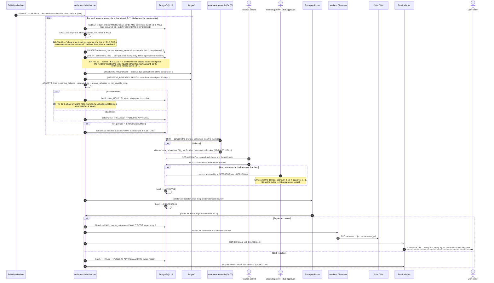

### 18.2 Ledger entries written by this flow

| Step | `entry_type` | `direction` | Amount | Reference | Rule |
| :--- | :--- | :---: | :--- | :--- | :--- |
| Batch build | `RESERVE_HOLD` | **DEBIT** | `reserve_bps` × period net (default 5%) | `ADJUSTMENT` / `batch_id` | `A6.4` rolling reserve, covering refunds and chargebacks against already-settled sales |
| Batch build | `RESERVE_RELEASE` | **CREDIT** | matured reserve, 30 days | `ADJUSTMENT` / `batch_id` | Released on schedule as a **separate visible line** (`FR-SETL-04`, `AC-SETL-01.3`) |
| Payout confirmed | `PAYOUT` | **DEBIT** | `net_payable_minor` | `PAYOUT` / `batch_id` | Written **only** on the payout webhook, never on approval. Approving is an intention; the money left when the provider says it left |

Existing `SALE`, `TAX`, `COMMISSION`, `COMMISSION_TAX`, `GATEWAY_FEE`, `REFUND`,
`COMMISSION_REVERSAL`, `COMMISSION_TAX_REVERSAL`, `CHARGEBACK` and `CHARGEBACK_REVERSAL` entries are
**claimed**, not created: the batch stamps `settlement_batch_id` on them. That stamp is the only
write the batch makes to a pre-existing entry, and it is the sole permitted mutation on an otherwise
append-only table — modelled as a nullable FK that transitions `NULL → batch_id` exactly once.

### 18.3 A worked statement for one order (the §0.5 example)

| Statement line | Symbol | Paise | Sign |
| :--- | :-: | ---: | :-: |
| Opening balance carried forward | — | 0 | |
| Gross | `G` | 500000 | + |
| Discount (`NEW20`, gym-funded) | `D` | 100000 | − |
| Net sale | `N` | 400000 | |
| CGST 9% | — | 36000 | + |
| SGST 9% | — | 36000 | + |
| Tax total | `T` | 72000 | + |
| Commission base | `B` | 400000 | |
| Platform commission @ 10% | `C` | 40000 | − |
| **GST on commission @ 18%** `[treatment pending]` | `C_tax` | 7200 | − |
| Gateway fee (as reported) | `F` | 9440 | − |
| Reserve held @ 500 bps of net payable | — | 20768 | − |
| Reserve released (matured) | — | 0 | + |
| **Net payable this cycle** | `P −` reserve | **394592** | |

`BR-FIN-03` requires these to sum **exactly** to the payout, including opening balance, reserve and
refund lines — asserted in code before the batch may leave `CLOSED`, not checked by eye
(`AC-SETL-01.1`). Under treatment (b), the `C_tax` line is absent from the statement and a separate
platform→tenant GST invoice is issued by `billing/`; the net payable is then `401792` paise.

### 18.4 Failure branches

| # | Trigger | Response | Rule |
| :-: | :--- | :--- | :--- |
| F1 | Reconciliation variance for a tenant | Batch `ON_HOLD`, alert raised, **auto-payout blocked for that tenant until resolved**. `KPI-26` has no error budget | `BR-FIN-07`, `FR-SETL-09` |
| F2 | Gateway fee not yet reported on some orders | Those lines are held out; the rest settle. Never estimated | `BR-FIN-06` |
| F3 | Net payable below the minimum floor | Rolls forward with the reason **shown to the tenant** | `FR-SETL-05` |
| F4 | Balance negative (refunds exceeded sales) | Carried forward as an explicit **opening balance line** on the next statement; persistent negativity beyond a threshold triggers tenant review | `FR-SETL-10`, `AC-SETL-01.4` |
| F5 | Bank rejection | `FAILED → PENDING_APPROVAL` with the reason; both tenant and Finance notified | `FR-SETL-08` |
| F6 | Bank account changed since the last payout | Payouts are **suspended** until re-verification, while the listing stays live | `BR-GYM-06` |
| F7 | Payout webhook redelivered | IM-2, plus IM-3 on `(PAYOUT, batch_id, PAYOUT)` | — |
| F8 | Job runs twice | IM-5 lock; and `settlement_batch_id IS NULL` in the claim means a re-run finds nothing left to claim | `§C5` |
| F9 | Batch approved by the same person twice to satisfy dual approval | Domain rejects `approver_2_id = approver_1_id` with `422 DUAL_APPROVAL_REQUIRES_DISTINCT_APPROVERS` | `BR-FIN-08` |
| F10 | Statement PDF regenerated later | **Byte-identical** — deterministic rendering is a requirement, not an optimisation, because a statement that differs on regeneration cannot be evidence | `FR-INV-07` |

| | |
| :--- | :--- |
| **Idempotency** | IM-5 (lock + claim-once) → IM-1 (approval) → provider idempotency key = `batch_id` → IM-2 (payout webhook) → IM-3 (`PAYOUT` entry). |
| **Satisfies** | `FR-SETL-01`…`FR-SETL-10`, `FR-INV-07` · `BR-FIN-01`…`BR-FIN-08`, `BR-REF-05`, `BR-GYM-06` · `AC-SETL-01.1`…`AC-SETL-01.4` · `A6.3`, `A6.4` · `§C4.7` · `KPI-26` · invariant **I2** |

---

## 19. Review submission → screening → publication → rating recompute

**Surfaces:** `customer-web` `SCR-WEB-013`, `SCR-DASH-019`, `SCR-ADM-012` · **Modules:** `reviews/`
→ `attendance/`, `discovery/`, `notifications/`

> Invariant **I4**, second half: **earned reviews only**. `BR-REV-01` — only a user with at least one
> recorded check-in at the gym may review it. `BR-REV-03` — every published review carries a
> "Verified member" marker; **there is no unverified review type**.

### 19.1 Diagram

```mermaid
sequenceDiagram
    autonumber
    actor M as Member
    participant BR as customer-web SCR-WEB-013
    participant API as NestJS pipeline
    participant UCE as ReviewEligibilityUseCase
    participant UCS as SubmitReviewUseCase
    participant ATT as attendance/ AttendanceQueryPort
    participant SCR as Screening service
    participant PG as PostgreSQL 16
    participant OBX as outbox
    participant AGG as review.aggregate job
    participant RD as Redis 7
    participant EDGE as CDN edge
    actor MOD as Platform moderator

    BR->>API: GET /v1/gyms/:slug/reviews/eligibility
    API->>UCE: evaluate
    UCE->>ATT: hasCheckIn(userId, gymId)?
    UCE-->>BR: 200 { eligible: false, reason: "NO_CHECK_IN_RECORDED" }
    Note over BR: 200 with a typed negative result — the caller asked WHETHER.<br/>The compose UI is unreachable, and SCR-WEB-013 explains why.

    M->>BR: (after checking in) writes a review — 1-5 stars, sub-ratings, 20-2000 chars, photos
    BR->>API: POST /v1/gyms/:slug/reviews (Idempotency-Key)
    API->>UCS: execute
    UCS->>ATT: re-check eligibility SERVER-SIDE
    alt No recorded check-in
        UCS-->>BR: 403 REVIEW_REQUIRES_CHECK_IN
        Note over UCS: AC-REV-02.1 — refused even by direct API call. The UI gate is not the control.
    end
    UCS->>PG: unique (member_id, gym_id, membership_term_id) — BR-REV-02
    UCS->>SCR: screen(text, photos) — profanity, contact details, URLs, competitor solicitation, spam
    alt Screening clean
        UCS->>PG: ⟦ reviews.status = PUBLISHED, is_verified_member = true ⟧
        UCS->>OBX: ⟦ outbox review.published ⟧
    else Screening flagged
        UCS->>PG: ⟦ reviews.status = HELD ⟧ -> SCR-ADM-012 moderation queue
        Note over UCS: FR-REV-03 — flagged content QUEUES for moderation; it is never rejected outright.
    end
    UCS-->>BR: 201 { status }

    OBX->>AGG: review.published
    AGG->>PG: RECOMPUTE FROM SOURCE — mean and count over PUBLISHED reviews only
    Note over AGG,PG: Recompute, never increment. An incremented counter plus at-least-once<br/>delivery is how a rating silently drifts (Architecture 8.5).
    AGG->>PG: UPDATE the discovery projection: rating_avg, rating_count, bayesian_score
    AGG->>RD: DEL …:gym:{id}:detail · DEL …:gym:{id}:reviews:p1
    AGG->>EDGE: surrogate purge gym:{id}
    AGG->>AGG: revalidateTag('gym:{id}') for Next.js L2
    Note over AGG,EDGE: AC-REV-02.3 — the aggregate recalculates WITHIN ONE MINUTE.<br/>Same budget shape as FR-ONB-13; the 5 s relay tick leaves ample headroom.

    MOD->>API: unpublish / remove with reason (SCR-ADM-012)
    API->>OBX: outbox review.unpublished
    OBX->>AGG: recompute WITHOUT it, same path, same one-minute budget
```

### 19.2 The rules that shape this flow

| Rule | Enforcement point |
| :--- | :--- |
| `BR-REV-01` ≥1 recorded check-in | Server-side in the use case; the UI gate is convenience, the `403` is the control |
| `BR-REV-02` one per member per gym **per membership term**, editable 7 days | Unique index on `(member_id, gym_id, membership_term_id)`; `review_versions` append-only |
| `BR-REV-03` "Verified member" on every published review | A boolean always `true` — no code path sets it `false`, because there is no unverified review type |
| `BR-REV-05` gym responds **once**, never edits or deletes | `AC-REV-01.2`: no such endpoint exists, asserted against the generated OpenAPI document |
| `BR-REV-06` a reported review **stays published** unless it holds personal data or threats | Two moderation paths, deliberately asymmetric |
| `BR-REV-07` plain mean with count; **nothing below 3 reviews** | Enforced in the read model, so the API cannot leak it and the JSON-LD cannot assert it (§5.2 R2, R6) |
| `FR-REV-08` Bayesian adjustment is **ranking only** | Two separate projection fields; the display field is never the ranking field |
| `FR-REV-09` anomaly detection on velocity, account age, text clustering | `review.anomaly-scan` hourly; anomalies **excluded from ranking pending review** (`AC-REV-02.2`) |
| `FR-REV-10` prompt after the third check-in, again at day 45 | Driven by `checkin.recorded`, subject to notification preferences |

### 19.3 Failure branches

| # | Trigger | Response | Rule |
| :-: | :--- | :--- | :--- |
| F1 | Direct API call with no check-in | `403 REVIEW_REQUIRES_CHECK_IN` | `AC-REV-02.1` |
| F2 | Second review in the same membership term | `409 REVIEW_ALREADY_EXISTS` with a link to edit if within 7 days | `BR-REV-02` |
| F3 | Edit attempted on day 8 | `422 REVIEW_EDIT_WINDOW_CLOSED` | `BR-REV-02` |
| F4 | Burst of 5-star reviews from same-period accounts | Held for moderation and **excluded from the aggregate until cleared** | `AC-REV-02.2` |
| F5 | Gym reports a review | Case opens; the review **stays published**; the gym is notified of the outcome | `AC-REV-01.3`, `BR-REV-06` |
| F6 | Review contains personal data or a threat | Hidden pending review — the one case where reporting removes visibility | `BR-REV-06` |
| F7 | Member deletes their own review | Permitted; the aggregate updates; the deletion is retained in audit | `FR-REV-11`, `BR-DAT-01` |
| F8 | Screening service unavailable | Review is written `HELD`, not `PUBLISHED`. **Fail closed** — publishing unscreened content is worse than a delay | `Architecture.md` §10.1 |
| F9 | Aggregate handler redelivered | Recompute-from-source is naturally idempotent (IM-5) | `Architecture.md` §8.5 |
| F10 | Gym crosses from 2 to 3 published reviews | The numeric rating appears for the first time — in the API, the page **and** the JSON-LD, in the same recompute | `BR-REV-07` |

| | |
| :--- | :--- |
| **Ledger entries** | **None.** |
| **Idempotency** | IM-1 at the boundary · unique index on the term key · IM-5 recompute-from-source in the aggregator. |
| **Satisfies** | `FR-REV-01`…`FR-REV-11`, `FR-DETL-04`, `FR-DETL-05` · `BR-REV-01`…`BR-REV-07`, `BR-DAT-01` · `AC-REV-01.1`…`AC-REV-01.3`, `AC-REV-02.1`…`AC-REV-02.3`, `AC-DETL-02.1`, `AC-DETL-02.2` · invariant **I4** |

---

## 20. Tenant switch with audit

**Surface:** `gym-dashboard` · **Modules:** `iam/`, `tenancy/`, `audit/` ·
**Endpoint:** `POST /v1/auth/tenant-context`

> `AC-AUTH-02.2`: *"Given I am working in tenant A, when I switch to tenant B, then all in-flight
> views reload scoped to tenant B and the switch is written to the audit log."*
> `BR-TEN-02`: *"Tenant switching is explicit and audited; **no cross-tenant action occurs in a
> single request**."*

### 20.1 Diagram

```mermaid
sequenceDiagram
    autonumber
    actor OWN as Owner of two tenants
    participant BR as gym-dashboard (React + Vite SPA)
    participant TQ as TanStack Query cache (L6)
    participant API as NestJS pipeline
    participant UC as SwitchTenantContextUseCase
    participant IAM as iam/ role resolver
    participant PG as PostgreSQL 16
    participant AUD as audit_log (append-only role)
    participant RD as Redis 7

    Note over OWN,BR: Signed in, active tenant = A. Every request so far carried an access token<br/>whose tenant_id claim is A. FR-AUTH-11 — the context is explicit in every session.

    OWN->>BR: Tenant switcher -> choose tenant B
    BR->>API: POST /v1/auth/tenant-context { tenant_id: B }  (Idempotency-Key)
    Note over BR,API: This is the ONLY endpoint in the system that takes a tenant id from the client,<br/>and it takes it as the SUBJECT of the operation, not as the scope of a query.<br/>Every business endpoint rejects X-Tenant-Id with 400 TENANT_HEADER_NOT_ACCEPTED.
    API->>UC: execute
    UC->>IAM: does this identity hold a role in tenant B?
    IAM->>PG: SELECT roles WHERE user_id=$1 AND tenant_id=B
    alt No role in B
        UC-->>BR: 404
        Note over UC: 404, not 403 — a 403 would confirm that tenant B exists.<br/>API_Catalog 2.3, invariant I1.
    else Role found
        UC->>PG: read tenant B status (BR-TEN-06 write-lock stage if PAST_DUE >= 14 days)
        UC->>PG: ⟦ mint a NEW access token with tenant_id = B · rotate the refresh family ⟧
        UC->>RD: register the previous access token's jti in the revocation set for its residual TTL
        UC->>AUD: ⟦ audit_log: TENANT_CONTEXT_SWITCHED, from=A, to=B, actor, IP, UA, correlation id ⟧
        PG-->>UC: COMMIT
        UC-->>BR: 200 { active_tenant: B, permissions_version } + httpOnly Set-Cookie (rotated refresh)
    end

    BR->>TQ: queryClient.clear()  — the ENTIRE cache, not selective invalidation
    Note over TQ: Architecture 9.1 L6 — "cleared entirely on tenant switch".<br/>A surviving tenant-A entry rendered under tenant B is a BR-TEN-01 breach<br/>that RLS cannot catch, because the data never leaves the browser.
    BR->>BR: remount all routes; every in-flight view refetches (AC-AUTH-02.2)
    BR->>API: GET /v1/tenant/... with the new token
    API->>API: TenantContextMiddleware resolves tenant B FROM THE VERIFIED TOKEN CLAIM
    API->>PG: BEGIN; set_config('app.tenant_id', B, true); SELECT ...
    Note over API,PG: RLS policy USING (tenant_id = current_setting('app.tenant_id')::uuid).<br/>The application role has no BYPASSRLS. AC-AUTH-02.3 holds by construction.
```

### 20.2 The five places the tenant identity must change together

A switch that changes four of these is a defect that surfaces as the wrong gym's members on screen.

| # | Location | If it does not change |
| :-: | :--- | :--- |
| 1 | **Access token** `tenant_id` claim, re-minted for B | The middleware keeps resolving A and every subsequent write goes to the wrong tenant |
| 2 | `AsyncLocalStorage` `TenantContext`, derived per request | — it is derived, so 1 fixes it |
| 3 | `SET LOCAL app.tenant_id`, set per transaction | RLS returns tenant A's rows, or none |
| 4 | **L6 TanStack Query cache — cleared entirely** | Tenant A's member list renders under tenant B's header. RLS cannot help; the data is already in the browser |
| 5 | Every **Redis key** the session touches (they carry the tenant id, `CK2`) | A tenant-agnostic cache key is a `BR-TEN-01` violation waiting for its first hit. **A cache has no RLS behind it** |

### 20.3 The in-flight request question, answered explicitly

A request issued under tenant A that is still in flight when the switch commits **continues to be
scoped to tenant A**, because its token claim says A and RLS enforces that claim. That is correct
behaviour, not a leak: the request was authorised in tenant A's context and returns tenant A's data
to a session that was, at issue time, tenant A's session.

`BR-TEN-02`'s *"no cross-tenant action occurs in a single request"* is satisfied because **no single
request ever spans two tenants** — one request, one token, one claim, one `app.tenant_id`, one RLS
scope. The client discards the late response after `queryClient.clear()`, so nothing from tenant A is
ever rendered under tenant B.

### 20.4 Failure branches

| # | Trigger | Response | Rule |
| :-: | :--- | :--- | :--- |
| F1 | Target tenant not held by this identity | **`404`**, not `403` | `API_Catalog.md` §2.3 |
| F2 | Target tenant `SUSPENDED` | Switch permitted **read-only**; writes refused. Existing members' check-ins continue regardless | `BR-TEN-05` |
| F3 | Target tenant `PAST_DUE` ≥ 14 days | Switch permitted; dashboard **write access** is locked. **Check-in is never blocked by subscription arrears** | `BR-TEN-06` |
| F4 | Client sends `X-Tenant-Id` on any business endpoint | `400 TENANT_HEADER_NOT_ACCEPTED` + a **security event** | `Architecture.md` §5.2 step 4, §11.3 |
| F5 | Client sends `tenant_id` in a business request body | `400` — schemas are `.strict()`, so unknown fields are **rejected**, not stripped | ADR-0022 |
| F6 | Two switches race from two tabs | IM-1 on the endpoint; the refresh family rotates once. Reuse of a superseded refresh token revokes the **entire family** and notifies the user | `FR-AUTH-06`, ADR-0011 |
| F7 | A support agent impersonating a user attempts a switch | Impersonation never elevates and cannot perform financial mutations; the impersonation banner persists throughout | `FR-AUTH-12`, `AC-AUTH-03.2` |
| F8 | Permission set differs between tenants | `permissions_version` is returned with the switch; the client refetches the resolved grant map. Propagation is bounded at 60 s | `FR-RBAC-04` |

| | |
| :--- | :--- |
| **Ledger entries** | **None.** |
| **Idempotency** | IM-1. Switching to the tenant already active is a no-op returning `200`, not an error. |
| **Satisfies** | `FR-AUTH-06`, `FR-AUTH-09`, `FR-AUTH-11`, `FR-AUTH-12` · `BR-TEN-01`, `BR-TEN-02`, `BR-TEN-05`, `BR-TEN-06`, `BR-DAT-01`, `BR-DAT-02` · `AC-AUTH-02.1`, `AC-AUTH-02.2`, `AC-AUTH-02.3` · `NFR-SEC-09`, `BAC-10`, `E2E-11` · ADR-0006, ADR-0011 · invariant **I1** |

---

# 21. Cross-flow traceability

## 21.1 Ledger entry types — where each one is written

Every `entry_type` in the `§C2.2` enum, and the exactly-one flow that creates it. An entry type with
no writer is a modelling error; an entry type with two writers is a second implementation and a
`PROJECT_CONSTITUTION.md` §2 Q1 violation.

| `entry_type` | Direction | Written by | Section | Reference |
| :--- | :---: | :--- | :-: | :--- |
| `SALE` | CREDIT | Capture transaction | §7, §9 | `ORDER` |
| `TAX` | CREDIT | Capture transaction (CGST + SGST components) | §7, §9 | `ORDER` |
| `COMMISSION` | DEBIT | Capture transaction | §7, §9 | `ORDER` |
| `COMMISSION_TAX` | DEBIT | Capture transaction `[treatment pending]` | §7, §9 | `ORDER` |
| `GATEWAY_FEE` | DEBIT | Capture transaction; duplicate detection | §7, §9, §10 | `ORDER`, `PAYMENT` |
| `REFUND` | DEBIT | Refund completion; duplicate auto-refund | §16, §10 | `REFUND` |
| `COMMISSION_REVERSAL` | CREDIT | Refund completion; lost chargeback | §16, §17 | `REFUND`, `DISPUTE` |
| `COMMISSION_TAX_REVERSAL` | CREDIT | Refund completion; lost chargeback `[treatment pending]` | §16, §17 | `REFUND`, `DISPUTE` |
| `CHARGEBACK` | DEBIT | Dispute opened | §17 | `DISPUTE` |
| `CHARGEBACK_REVERSAL` | CREDIT | Dispute won | §17 | `DISPUTE` |
| `RESERVE_HOLD` | DEBIT | Batch build | §18 | `ADJUSTMENT` |
| `RESERVE_RELEASE` | CREDIT | Batch build / `reserve.release` | §18 | `ADJUSTMENT` |
| `PAYOUT` | DEBIT | Payout webhook confirmed | §18 | `PAYOUT` |
| `ADJUSTMENT` | either | Duplicate receipt; dispute fee; manual correction (dual-approved) | §10, §17 | `PAYMENT`, `DISPUTE`, `ADJUSTMENT` |

**Flows that write no ledger entry, stated so no one later assumes an omission:** §1, §2, §3, §4,
§5, §6, §11, §12, §13, §14, §15, §19, §20. Thirteen of twenty. Most of what the platform does is not
money, and pretending otherwise is how a ledger stops being trustworthy.

## 21.2 The five invariants across the twenty flows

| Flow | I1 tenant | I2 ledger | I3 price | I4 visibility | I5 webhook |
| :-- | :-: | :-: | :-: | :-: | :-: |
| 1 signup → KYC → submit | ✅ | — | — | ✅ | — |
| 2 approval → live in 60 s | ✅ | — | — | **✅ primary** | — |
| 3 rejection → resubmission | ✅ | — | — | ✅ | — |
| 4 search | ✅ | — | ✅ | **✅ primary** | — |
| 5 detail SSR | — | — | ✅ | ✅ | — |
| 6 checkout | ✅ | ✅ | **✅ primary** | ✅ | — |
| 7 intent → activation | ✅ | **✅ primary** | ✅ | — | **✅ primary** |
| 8 browser closes | — | ✅ | — | — | **✅ primary** |
| 9 webhook never arrives | ✅ | ✅ | — | — | **✅ primary** |
| 10 duplicate payment | ✅ | **✅ primary** | — | — | ✅ |
| 11 price changed | — | ✅ | **✅ primary** | — | — |
| 12 QR issue + scan | **✅ primary** | — | — | — | — |
| 13 denial + override | **✅ primary** | — | — | — | — |
| 14 check-in idempotency | ✅ | — | — | — | — |
| 15 freeze / unfreeze | ✅ | ✅ | — | — | — |
| 16 refund | ✅ | **✅ primary** | — | — | ✅ |
| 17 chargeback | ✅ | **✅ primary** | — | — | ✅ |
| 18 settlement → payout | ✅ | **✅ primary** | — | — | ✅ |
| 19 review → publication | ✅ | — | — | **✅ primary** | — |
| 20 tenant switch | **✅ primary** | — | — | — | — |

## 21.3 India-specific obligations, and the flows that carry them

| Obligation | Source | Flows |
| :--- | :--- | :--- |
| GST 18% exclusive, **CGST 9% + SGST 9% as two invoice lines** | `LAUNCH_MARKET_INDIA.md` §4, `FR-INV-04` | §6, §7, §16, §18 |
| Place of supply = the **branch** location (performance-based service) | `LAUNCH_MARKET_INDIA.md` §4 | §6, §7 |
| **GST on platform commission** — the ninth figure, treatment (a) or (b) | §11 **conflict 2** | §7, §9, §16, §17, §18 |
| Financial year **1 April – 31 March** for gapless invoice numbering | §5 **conflict 4**, `FR-INV-02`, `AC-INV-01.3` | §7 |
| **Razorpay Route** behind the `PaymentProvider` port; Stripe is not viable domestically | §7 **conflict 1**, `ASM-03` | §7, §9, §10, §16, §17, §18 |
| RBI: platform never holds funds in its own name; **card tokenisation only** | §7, `A4.3`, `BR-PAY-08` | §7, §18 |
| **TRAI DLT** pre-approval on every SMS template; edited templates keep sending the prior approved version | §8 **conflict 5**, `FR-NOTF-03` | §2, §10, §12, §16, §18 |
| **Data residency India, mandatory** — Mumbai primary, second Indian region for DR | §9 **conflict 6**, `OQ-16` | All |
| Timezone `Asia/Kolkata` **+05:30, no DST** — midnight gym-time is 18:30 UTC the previous day | §3, `BR-MEM-03`, `FR-MEMB-09` | §4, §7, §12, §15, §18 |
| **INR / paise**, Indian digit grouping — `₹2,50,000`, never `₹250,000` | §2 | §6, §7, §16, §18 |
| KYC checklist: PAN, GSTIN, Shop & Establishment, bank proof, owner ID, address proof | §6 | §1, §2 |
| **Aadhaar avoided by default** — PAN plus a non-Aadhaar identity document | §6 | §1 |
| Commission **10% standard / 5% renewal**, first renewal at standard, 0 bps floor implemented | §10, `OQ-02` | §7, §18 |
| **GST TCS / income-tax TDS: not modelled.** Requires a qualified Indian tax advisor; the Halt Rule applies | §11 **conflict 3**, §13 | — deliberately absent from every flow |

## 21.4 Open items this document surfaces and does not resolve

Engineering can specify a mechanism. It cannot decide a commercial or tax liability.

| # | Question | Raised in | Needed by |
| :-: | :--- | :-: | :--- |
| 1 | **Commission GST treatment (a) or (b)** — deducted at settlement, or invoiced separately | §0.6, §7, §18 | Before **Sprint 11**, per `LAUNCH_MARKET_INDIA.md` §11 conflict 2 |
| 2 | **Who bears the non-reversed gateway fee on a platform-caused duplicate payment** — the tenant per `BR-REF-05`, or the platform | §10.3 | Same session as item 1 |
| 3 | **Does commission reverse on a *lost chargeback***, as it does on a refund? Adopted reading: yes | §17.2 | Same session |
| 4 | Whether **tier deltas apply to the renewal rate** as well as the standard rate. Adopted reading: standard only; renewal is flat 5% | `LAUNCH_MARKET_INDIA.md` §10 | Before Sprint 11 |
| 5 | **GST TCS / TDS** applicability, rates and filing obligations | §21.3 | Qualified Indian tax advisor, before the settlement design is finalised |
| 6 | Confirmation of the **SAC code** and the 18% rate for gym services | `LAUNCH_MARKET_INDIA.md` §13 | Tax advisor |
| 7 | Current **RBI e-mandate thresholds** and pre-debit notification timing for UPI AutoPay — affects `BR-MEM-10`, `FR-PAY-11` | `LAUNCH_MARKET_INDIA.md` §7 | Before auto-renewal ships |

## 21.5 What each flow contributes to the test suites

**`E2E-11` / `BAC-10` isolation:** §12, §13, §14, §20, plus the standing rule that *every*
tenant-scoped endpoint in §1–§20 appears in the isolation inventory. **`E2E-04` check-in:** §12 → §13.
**`E2E-07` refund:** §7 → §16. **Financial invariant suite:** §7, §9, §10, §16, §17, §18 — each
asserts `BR-FIN-03`'s exact sum. **Contract suite (Supertest, A-06):** the status-code claims in
§11.2 and §12.4. **Load (k6):** §4 at `NFR-PERF` budgets, §12 at `NFR-PERF-08`'s 500/min.
**OpenAPI absence assertions:** §8 F3 (no client-activation endpoint) and §19 (`BR-REV-05` — no
gym-edit or gym-delete endpoint for reviews).

---

## 22. Document control

Artefact rank 3, a binding derived specification (`PROJECT_CONSTITUTION.md` §1.3). It supersedes
nothing and contradicts nothing: it is the detailed expansion of `ENGINEERING_PLAN.md`'s flow
sketches, and where a peer document owns a subject — `Architecture.md` (structure),
`FolderStructure.md` (where code lives), `ModuleDependency.md` (what may import what), `ERD.md`
(schema), `API_Catalog.md` (endpoints), `BusinessRules.md` (rules), `Security.md` (controls),
`Scalability.md` (budgets) — this document **cites** it rather than restating it.

**Change rule.** A new flow, or a change to a failure branch or a ledger entry in an existing flow,
amends this file **in the same pull request** as the code or specification that causes it. Amendment
authority is the Technical Lead / Architect; anything touching a `BR-FIN-*`, `BR-PAY-*` or
`BR-TEN-*` obligation additionally requires the `§C10` change-control process.

*End of SequenceDiagrams.md.*
