# Sprint Planning — Gym Marketplace & Multi-Tenant Gym Management SaaS

**Document type:** Engineering delivery plan (Phase 0 artefact) · **Status:** Baseline for Sprint 0
**Owner:** Delivery Manager (`C9.3`) · **Co-owner:** Technical Lead · **Approver:** Client Sponsor (`C10`)
**Written:** 2026-08-06 · **Applies from:** Sprint 0, 2026-09-07

---

## 0. What this document is, and what it is not

`MASTER_PRD.md` §C9.1 gives nineteen sprints and one exit condition each. `ENGINEERING_PLAN.md` §9
expands each into a goal, an epic list, a demo script and a risk paragraph. **This document is the
next layer down: the plan a Delivery Manager runs a standup from.** For every sprint 0–18 it gives a
task-level breakdown in engineer-days split across backend, frontend, QA and DevOps; the exit
condition rewritten as a checklist a person can tick; the demo script as an ordered runbook; the
dependency edges in and out; and an explicit capacity verdict — required versus available — with
over-commitment flagged rather than absorbed.

| This document decides | This document defers to |
| :--- | :--- |
| Per-sprint task breakdown, engineer-day estimates, capacity verdicts | `MASTER_PRD.md` §C9.1 sprint focus and exit conditions — **restated, never changed** |
| Sprint-level dependency ordering and the parallelisation ruling | `PROJECT_CONSTITUTION.md` §23 Definition of Ready / Definition of Done — **cited, never restated as a variant** |
| The pre-agreed descope order and the buffer policy | `MASTER_PRD.md` §C10 change control, including the 10% contingency |
| Where the India workstream lands in the calendar | `LAUNCH_MARKET_INDIA.md` for what the India workstream *is* |
| Demo runbooks | `ENGINEERING_PLAN.md` §9 for the one-paragraph version of each |
| — | `TestingStrategy.md` for how a test is written; `Security.md`, `Scalability.md`, `Architecture.md`, `ERD.md`, `API_Catalog.md`, `BusinessRules.md`, `ModuleDependency.md`, `SequenceDiagrams.md`, `StateMachines.md`, `FolderStructure.md` for the thing being built |

**Precedence.** Where this document and `MASTER_PRD.md` disagree, the PRD wins and this document is
wrong. Where this document and `PROJECT_CONSTITUTION.md` disagree, the constitution wins. No sprint
in this plan may be "made to fit" by relaxing a Definition of Done item; the only permitted response
to a capacity shortfall is the descope order in §24 or a `§C10` re-baselining.

### 0.1 The five invariants, as a standing standup question

Every sprint below is planned so that none of these can be traded for schedule. The Delivery Manager
asks all five at every sprint review; a "no" is an S1 defect, not a discussion.

| # | Invariant | Sources | Sprint it becomes structurally true |
| :-: | :--- | :--- | :-: |
| 1 | No tenant reads or writes another tenant's data, enforced in the **database** by RLS | `BR-TEN-01`, `NFR-SEC-09`, `BAC-10`, `E2E-11` | **0** |
| 2 | Money is an append-only ledger of integer minor units | `BR-PAY-01`, `BR-FIN-01`, ADR-0014, ADR-0015 | **0** (`Money` type) → **11** (ledger) |
| 3 | Price displayed = price charged; server re-validation aborts on mismatch | `BR-PLN-03`, `AC-PLAN-02.2` | **5** |
| 4 | Verification before visibility; earned reviews only | `BR-GYM-01`, `BR-GYM-03`, `BR-REV-01`, `BR-REV-03` | **2** (visibility) → **10** (reviews) |
| 5 | Activation is webhook-driven, never the client redirect | `BR-PAY-02`, ADR-0013 | **6** |

---

## 1. Planning ground rules

| Rule | Value | Source |
| :--- | :--- | :--- |
| Sprint length | **2 weeks = 10 working days**, Monday start, Friday finish | `C9.1` |
| Estimating unit | **Engineer-day (ed)** = one person, one working day, on one discipline | This document |
| Story-point bridge | 1 point ≈ 0.5 ed, Fibonacci, per `ENGINEERING_PLAN.md` §2 and §13 | `ENGINEERING_PLAN.md` §13 |
| Focus factor | **70%** — ceremony, review, interruption, support, context switching | `ENGINEERING_PLAN.md` §13.3 |
| Estimate content | Implementation **+ unit/integration tests + review + module docs**. QA and DevOps effort is estimated separately, never folded into a dev estimate | `§23.2` DoD items 13–21, 22–28 |
| Branch life | ≤ 2 days (`§20.1 G2`); any task estimated above 3 ed is split before the sprint starts | `PROJECT_CONSTITUTION.md` §23.1 item 15 |
| Sprint commitment | Items must be **Ready** (`§23.1`, all 16 boxes) at sprint planning. A not-Ready item cannot be committed | `PROJECT_CONSTITUTION.md` §23.1 |
| Carry-over policy | An unfinished item returns to the backlog and is **re-estimated**, never "80% carried" | This document |
| Definition of a demo | Run on `staging` against the deterministic seed (`C8.2`), by the engineer who built it, with the client present | `C7`, `C8.2` |

### 1.1 Ceremony calendar per sprint

| Ceremony | When | Duration | Attendees | Output |
| :--- | :--- | :--- | :--- | :--- |
| Backlog refinement | Wed of week 1 | 90 min | PM, Tech Lead, 1 BE, 1 FE, 1 QA | Next sprint's items pass `§23.1` |
| Sprint planning | Mon week 1, 09:30 IST | 120 min | Whole team | Committed scope + capacity verdict recorded in this document's format |
| Daily standup | 09:45 IST, 15 min | 15 min | Whole team | Blockers named with an owner and a date |
| Money/tenancy pairing block | Tue + Thu afternoons, sprints 5–6, 11, 12 | 3 h | 2 BE | `RSK-14` pair coverage made structural |
| Sprint review / demo | Fri week 2, 14:00 IST | 60 min | Team + Client Sponsor | Exit checklist ticked or explicitly failed |
| Retrospective | Fri week 2, 15:30 IST | 45 min | Team | One action with an owner, carried into the next sprint |
| Contingency review | Fri week 2, 16:30 IST | 15 min | PM, DM, Tech Lead | Contingency drawn-down figure updated (§23) |

**Time zone.** All ceremonies are in **Asia/Kolkata (UTC+05:30, no DST)** per `LAUNCH_MARKET_INDIA.md`
§3. Every date in this document is an Asia/Kolkata calendar date.

---

## 2. Team shape and capacity model

### 2.1 The `C9.3` team, converted to engineer-days per sprint

| Role | Count | Engagement (`C9.3`) | Nominal ed/sprint | Focus factor | **Effective ed/sprint** | Pool |
| :--- | :-: | :--- | :-: | :-: | :-: | :--- |
| Product manager | 1 | Full | 10 | — | — | Not a build pool |
| Technical lead / architect | 1 | Full, ~50% build | 5 | 70% | **3.5** | Backend |
| Backend engineer | 3 | Full | 30 | 70% | **21.0** | Backend |
| Frontend engineer (customer site) | 1 | Full | 10 | 70% | **7.0** | Frontend |
| Frontend engineer (dashboards) | 2 | Full | 20 | 70% | **14.0** | Frontend |
| Product designer | 1 | Full to sprint 12, then part | 10 → 5 | 70% | **7.0 → 3.5** | Design |
| QA engineer | 2 | **From sprint 2** | 20 | 70% | **14.0** (0 in sprints 0–1) | QA |
| DevOps engineer | 1 | Part (0.5 FTE) | 5 | 70% | **3.5** | DevOps |
| Delivery manager | 1 | Part | 5 | — | — | Not a build pool |

**Pool capacity per sprint (steady state, sprint 2 onward):**

| Pool | Effective ed / sprint | Over 19 sprints |
| :--- | :-: | :-: |
| **Backend** (3 BE + 0.5 TL) | **24.5** | 465.5 |
| **Frontend** (1 web + 2 dashboard) | **21.0** | 399.0 |
| **Dev total (BE + FE)** | **45.5** | **864.5** |
| QA (2, from sprint 2) | 14.0 | 238.0 (17 sprints) |
| DevOps (0.5 FTE) | 3.5 | 66.5 |
| Design | 7.0 → 3.5 | 112.0 |

> The dev-pool figure of **864.5 effective engineer-days** reconciles exactly with
> `ENGINEERING_PLAN.md` §13.3, which computes "~865 effective engineer-days" from the same team
> shape and the same 70% focus factor. This document does not invent a different capacity base.

### 2.2 Holiday deductions — the Asia/Kolkata calendar is not free

Six sprints in this plan contain Indian public or festival holidays. A plan that ignores them is not
a plan. The Delivery Manager **must** confirm the applicable state holiday list (holidays vary by
state in India) at refinement for each affected sprint and deduct capacity before committing scope.

| Sprint | Dates | Holiday exposure | Capacity deduction applied below |
| :-: | :--- | :--- | :-: |
| **4** | 2026-11-02 → 11-13 | **Diwali / Deepavali**, approximately 8 November 2026, typically a 2–3 day effective absence | **−10%** (dev pool 45.5 → **41.0**) |
| **7** | 2026-12-14 → 12-25 | Christmas Day, 25 December (gazetted) | **−10%** (→ **41.0**) |
| **8** | 2026-12-28 → 2027-01-08 | New Year's Day, 1 January (restricted in several states) | **−10%** (→ **41.0**) |
| **10** | 2027-01-25 → 02-05 | **Republic Day**, 26 January (gazetted) | **−5%** (→ **43.2**) |
| **14** | 2027-03-22 → 04-02 | Holi (approximately 22–23 March 2027) and Good Friday | **−10%** (→ **41.0**) |
| **15** | 2027-04-05 → 04-16 | Ambedkar Jayanti, 14 April (gazetted in most states) | **−5%** (→ **43.2**) |

**Sprint 14 also contains 1 April 2027 — the start of the Indian financial year.** That is a delivery
*opportunity*, not a hazard: see §26.4.

### 2.3 Sprint calendar

| Sprint | Start (Mon) | End (Fri) | Milestone landing in this sprint |
| :-: | :--- | :--- | :--- |
| 0 | 2026-09-07 | 2026-09-18 | **M0** — baseline frozen |
| 1 | 2026-09-21 | 2026-10-02 | — |
| 2 | 2026-10-05 | 2026-10-16 | **M1** — design system + 55 screens approved |
| 3 | 2026-10-19 | 2026-10-30 | — |
| 4 | 2026-11-02 | 2026-11-13 | **M2** — onboarding to listing demonstrable |
| 5 | 2026-11-16 | 2026-11-27 | — |
| 6 | 2026-11-30 | 2026-12-11 | **M3** — first online purchase in staging |
| 7 | 2026-12-14 | 2026-12-25 | — |
| 8 | 2026-12-28 | 2027-01-08 | **M4** — first QR check-in in staging |
| 9 | 2027-01-11 | 2027-01-22 | — |
| 10 | 2027-01-25 | 2027-02-05 | — |
| 11 | 2027-02-08 | 2027-02-19 | — |
| 12 | 2027-02-22 | 2027-03-05 | — |
| 13 | 2027-03-08 | 2027-03-19 | — |
| 14 | 2027-03-22 | 2027-04-02 | — |
| 15 | 2027-04-05 | 2027-04-16 | **M5** — feature complete in staging |
| 16 | 2027-04-19 | 2027-04-30 | **M6** — performance, a11y, security sign-off |
| 17 | 2027-05-03 | 2027-05-14 | **M7** — UAT sign-off |
| 18 | 2027-05-17 | 2027-05-28 | **M8** — production launch (declared 2027-06-14 per `ENGINEERING_PLAN.md` §14.1 after the launch-window buffer in §23.3) |

### 2.4 How to read each sprint block

Each of the nineteen blocks below has eight fixed parts, always in this order: **Goal · Scope ·
Task breakdown · Exit checklist · Demo script · Dependencies · Risks · Capacity verdict.** The
capacity verdict uses three words and only three: **CLEAR** (demand ≤ 95% of pool), **TIGHT**
(95–105%), **OVER** (> 105%, requires a named mitigation before commitment).

> **A note on sprints 1–2, 3–4 and 5–6.** `C9.1` states one exit condition per *pair*. This document
> splits each pair into two sprints with an **interim gate** on the first and the verbatim `C9.1`
> gate on the second. That is a decomposition, not a change: the `C9.1` condition still falls where
> the PRD puts it.

---

# PART A — THE NINETEEN SPRINTS

## Sprint 0 — Foundations, tenancy and the isolation suite

**2026-09-07 → 2026-09-18 · Milestone M0**

**Goal.** Stand up the repository, pipeline, environments and shared kernel, and make `BR-TEN-01`
structurally true in the database before a single feature exists.

### Scope

| Epic | Features | Requirements delivered |
| :--- | :--- | :--- |
| **EP-01** (all 20 features) | F-01.1 … F-01.20 | `BR-TEN-01`, `BR-TEN-02`, `BR-PAY-01`, `BR-PAY-03`, `BR-DAT-01`, `BR-DAT-06`, `NFR-SEC-06`, `NFR-SEC-09`, `NFR-SEC-13`, `NFR-DQ-02`, `NFR-DQ-03`, `NFR-MNT-02`, `NFR-MNT-03`, `NFR-MNT-04`, `NFR-MNT-05`, `NFR-MNT-06`, `NFR-MNT-07`, `NFR-MNT-08`, `FR-ADMN-08`, `§C1.3`, `§C1.4`, `§C1.5`, `§C5` job harness |
| **EP-02** (scaffold only) | F-02.1 scaffold, F-02.5 scaffold, F-02.13 CI check | `FR-AUTH-01` (skeleton), `FR-AUTH-06` (skeleton), `FR-RBAC-01` (the CI gate, not the matrix) |
| **EP-17** (ports only) | F-17.1 port definitions | `FR-NOTF-01` — four channel adapter **interfaces**; vendors deferred (A-19) |

### Task breakdown

| # | Task | Disc. | ed | Notes |
| :-- | :--- | :--- | :-: | :--- |
| 0.1 | `git init`, trunk protection, `CODEOWNERS`, Husky + commitlint (A-24) | DevOps | 1.5 | Closes `BLK-01`; see §26.5 |
| 0.2 | pnpm workspaces + Turborepo build graph, `packages/config` (A-05, F-01.1) | BE | 2.0 | |
| 0.3 | `Money` value type + ESLint rule banning `number` on amount-named fields (F-01.2, ADR-0014) | BE | 2.0 | Invariant 2, first half |
| 0.4 | Tenant-context middleware — principal/resource derived, never a header (F-01.3) | BE | 2.0 | |
| 0.5 | **Prisma tenant-context client extension** with `SET LOCAL app.tenant_id` in an interactive transaction (F-01.4, A-01 condition) | BE | 3.0 | **TR-01**, the single highest-consequence task in the programme |
| 0.6 | RLS policy generator + migration convention; app role without `BYPASSRLS` (F-01.5, ADR-0006) | BE | 2.5 | |
| 0.7 | `TenantScopedRepository` base that refuses a context-free query (F-01.6) | BE | 1.5 | Loud failure, never a silent full-table read |
| 0.8 | Cross-tenant isolation suite + the CI rule that fails a new tenant-scoped endpoint with no spec (F-01.7) | BE | 3.0 | `BAC-10`, `E2E-11` |
| 0.9 | Platform-scope elevation as a named, audited function on a distinct DB role (F-01.8) | BE | 1.5 | |
| 0.10 | Idempotency middleware + store: key, fingerprint, response, 24 h, 409 on mismatch (F-01.9, ADR-0016) | BE | 2.0 | Must exist **before** the first payment path (sprint 5) |
| 0.11 | Transactional outbox + `SKIP LOCKED` dispatcher (F-01.10, ADR-0017) | BE | 2.5 | **TR-08** |
| 0.12 | Error taxonomy, correlation id, standard envelope (F-01.11) | BE | 1.5 | |
| 0.13 | Pino logging with the reviewed redaction list (F-01.12, A-14) | BE | 1.0 | `BR-DAT-06` |
| 0.14 | OpenTelemetry traces + metrics, span naming convention (F-01.13) | BE | 1.5 | |
| 0.15 | Redis token-bucket rate limiting by endpoint class (F-01.14, A-13) | BE | 1.0 | |
| 0.16 | Feature-flag service, server-side evaluation, tenant/role/percentage targeting (F-01.15, ADR-0026) | BE | 2.0 | |
| 0.17 | Audit interceptor + append-only writer on a role with no `UPDATE`/`DELETE` grant (F-01.16) | BE | 2.0 | |
| 0.18 | BullMQ harness: queues, distributed locks, duration alerts (F-01.17, A-09/ADR-0009) | BE | 2.0 | All 24 `§C5` jobs use this |
| 0.19 | Time discipline: UTC storage, explicit IANA timezone arguments, lint rule on bare `new Date()` (F-01.18) | BE | 1.5 | **TR-07** prevention, `Asia/Kolkata` +05:30 |
| 0.20 | `@nestjs/swagger` OpenAPI generation + CI drift gate (F-01.19, A-16, ADR-0027) | BE | 1.5 | |
| 0.21 | Auth scaffolding: JWT access + rotating refresh skeleton, permission-declaration CI check (F-02.1/.5/.13) | BE | 2.0 | |
| 0.22 | Notification channel **ports** (email, SMS, in-app, web push) with a Mailpit local adapter (F-17.1) | BE | 1.0 | Vendors deferred to A-19 |
| 0.23 | `GET /v1/tenant/ping` — the trivial tenant-scoped endpoint the exit condition names | BE | 0.5 | |
| 0.24 | Design tokens: colour, type, spacing, radius, elevation, motion, as CSS custom properties (A-03) | FE | 2.0 | |
| 0.25 | `packages/ui` skeleton with shadcn/ui primitives, tree-shakeable exports, no barrel re-export (A-04) | FE | 3.0 | **TR-18** prevention |
| 0.26 | Three app shells: `customer-web` (Next.js 14 App Router), `gym-dashboard`, `admin-dashboard` (Vite) | FE | 3.0 | ADR-0019 |
| 0.27 | TanStack Query provider, error boundary, auth-token plumbing (ADR-0021) | FE | 2.0 | |
| 0.28 | Docker Compose local env: Postgres 16 + PostGIS, Redis 7, MinIO, Mailpit (F-01.20, A-28) | DevOps | 2.0 | |
| 0.29 | Terraform for `development`: VPC, managed Postgres, Redis, S3-compatible bucket, **Mumbai region** (A-27) | DevOps | 3.0 | `OQ-16` India residency is mandatory, not a preference |
| 0.30 | GitHub Actions `pr.yml` with all 15 gates from `ENGINEERING_PLAN.md` §16.3 (A-26) | DevOps | 2.5 | |
| 0.31 | Deterministic seed v1: 3 tenants, 12 plans, 200 members, 5,000 attendance rows (`C8.2`) | BE | 2.0 | Three timezones represented per **TR-07** |
| **Backend subtotal** | | **BE** | **38.0** | includes 0.31 |
| **Frontend subtotal** | | **FE** | **10.0** | |
| **QA subtotal** | | **QA** | **0.0** | QA joins sprint 2 (`C9.3`); test authorship is inside the BE/FE estimates |
| **DevOps subtotal** | | **DevOps** | **9.0** | |
| **Design subtotal** | Token system, component inventory, 3 surface style directions | Design | **8.0** | |

### Exit checklist — `C9.1`: *"A trivial tenant-scoped endpoint exists and the isolation suite proves it"*

- [ ] **E0.1** `GET /v1/tenant/ping` exists, declares a permission (`FR-RBAC-01`) and appears in the generated OpenAPI document.
- [ ] **E0.2** Called with tenant A's token it returns tenant A's row.
- [ ] **E0.3** Called with tenant B's token for tenant A's resource it returns **404, not 403** — existence is not disclosed (`ENGINEERING_PLAN.md` §12 `RSK-08`).
- [ ] **E0.4** The isolation suite runs in `pr.yml` and is **red** on a scratch branch with the RLS policy dropped — proving the test tests something.
- [ ] **E0.5** The isolation suite asserts the **positive** case returns a non-empty result, so a false pass from "returned nothing" is impossible (**TR-01**).
- [ ] **E0.6** A Testcontainers integration test asserts `current_setting('app.tenant_id')` is set **inside the same transaction** as the query.
- [ ] **E0.7** `dependency-cruiser` (A-23) fails the build on any import of `PrismaClient` outside `common/prisma`.
- [ ] **E0.8** The application DB role has no `BYPASSRLS`, verified by an automated assertion, in local, CI and `development`.
- [ ] **E0.9** `docker compose up` yields Postgres+PostGIS, Redis, MinIO and Mailpit, and the seed loads without manual steps.
- [ ] **E0.10** `terraform plan` is clean for `development` in the **India (Mumbai)** region.
- [ ] **E0.11** All 15 `pr.yml` gates run and a deliberate violation of each one fails the build.
- [ ] **E0.12** **M0** evidence complete: PRD approval matrix signed; `OQ-01`, `OQ-16`, `OQ-18`, `OQ-20` recorded as answered (they are — `LAUNCH_MARKET_INDIA.md`).

### Demo script

1. Open the repository; show trunk protection and `CODEOWNERS` requiring two reviewers on `payments/`, `settlements/`, `ledger/`, `refunds/`, `billing/`, `tenancy/`.
2. Push a trivial PR; watch all 15 gates run and go green in CI.
3. `docker compose up`; show the four containers healthy; run the seed; show 3 tenants and 200 members.
4. `GET /v1/tenant/ping` with tenant A's token → 200 with tenant A's row.
5. Same call, tenant B's token → **404**. Show the response body has no tenant A identifiers in it.
6. On a scratch branch, `DROP POLICY` on the ping table; push; watch the isolation suite go **red** in CI and block the merge.
7. Show the Testcontainers test proving `SET LOCAL app.tenant_id` executes in the same transaction as the query.
8. Add a new tenant-scoped endpoint with no isolation spec; push; watch CI refuse it.
9. `terraform plan` for `development`, Mumbai region; show zero diff.
10. Open Storybook on `packages/ui`; show tokens driving all three surface themes from one source.

### Dependencies

| Direction | Detail |
| :--- | :--- |
| **Depends on** | Pre-Sprint-0 gate (`ENGINEERING_PLAN.md` §14.2): Phases 0–7 + G `DONE`; Phase 8 unlock signed; `BLK-01` closed by task 0.1; `OQ-01`/`OQ-16`/`OQ-18`/`OQ-20` answered — **all four are answered** in `LAUNCH_MARKET_INDIA.md`. |
| **Unblocks** | **Every other sprint.** Nothing in sprints 1–18 may start before EP-01 lands, because every feature module inherits the tenant extension, the idempotency store, the outbox, the audit writer and the job harness. |

### Risks

| Risk | Mitigation | Owner |
| :--- | :--- | :--- |
| **TR-01** Prisma pooling defeats RLS (score 15) | Tasks 0.5–0.8 in one workstream, pair-programmed by Tech Lead + one BE; the positive-and-negative assertion in E0.5; `dependency-cruiser` rule in E0.7 | Technical Lead |
| DevOps pool is 3.5 ed but sprint-0 demand is 9.0 ed | **Named mitigation:** DevOps moves to 1.0 FTE for sprint 0 only (+3.5 ed) and the Tech Lead absorbs 2.0 ed of Terraform. Requires a `§C10` **Minor** change approval at planning | Delivery Manager |
| No QA on the team until sprint 2 (`C9.3`) — the isolation suite is written by the people it polices | Tech Lead reviews every isolation spec personally; sprint 2's first QA task is a full audit of the sprint-0 suite (task 2.19) | Technical Lead |
| Foundation over-engineering consumes the sprint | Timebox: any EP-01 feature not delivering an `NFR-` or `BR-` cited above is cut to sprint 1. F-01.15 flags and F-01.13 tracing are the two permitted spillovers | Product Manager |
| `BLK-01` re-opens — repository still declined at sprint start | Sprint 0 **cannot start**. This is a hard gate, not a risk to manage. Escalate to the project owner at the pre-Sprint-0 gate | Project Owner |

### Capacity verdict

| Pool | Required | Available | Ratio | Verdict |
| :--- | :-: | :-: | :-: | :--- |
| Backend | 38.0 | 24.5 | 155% | **OVER** |
| Frontend | 10.0 | 21.0 | 48% | CLEAR |
| Dev total | 48.0 | 45.5 | 105% | **TIGHT** |
| QA | 0.0 | 0.0 | — | n/a |
| DevOps | 9.0 | 3.5 | 257% | **OVER** |
| Design | 8.0 | 7.0 | 114% | **OVER** |

**Verdict: OVER, with three named mitigations.** (1) Frontend has 11 ed of slack; the two dashboard
engineers take tasks 0.16 flag-client, 0.20 OpenAPI client generation and 0.31 seed-fixture authoring
— 5.0 ed moves from BE to FE, bringing backend to 33.0/24.5. (2) DevOps to 1.0 FTE for this sprint
only. (3) Backend still lands at 135%; the residual is closed by **deferring F-01.13 tracing detail
and F-01.15 percentage targeting to sprint 1** (4.5 ed), leaving 28.5/24.5 = 116%, absorbed by the
Tech Lead running at 70% build rather than 50% for this sprint only. **Recorded as the first
drawdown against contingency: 4.0 ed of 86.4.**

---

## Sprint 1 — Identity, sessions and RBAC

**2026-09-21 → 2026-10-02**

**Goal.** Deliver one identity across three surfaces and twelve roles, with server-side permission
enforcement that a UI-first implementation cannot subvert.

### Scope

| Epic | Features | Requirements delivered |
| :--- | :--- | :--- |
| **EP-02** (bulk) | F-02.1 … F-02.18, F-02.25, F-02.26 | `FR-AUTH-01` … `FR-AUTH-14`, `FR-RBAC-01` … `FR-RBAC-07`, `FR-NAV-01`, `FR-NAV-02`, `FR-NAV-03`, `FR-NAV-06`, `BR-TEN-02`, `BR-DAT-02`, `NFR-SEC-11` |
| **EP-02** (profile) | F-02.19 … F-02.24 | `FR-USER-01` … `FR-USER-08`, `BR-DAT-03`, `BR-DAT-04`, `NFR-PRV-07` |
| **EP-03** (start) | F-03.1, F-03.2 | `FR-ONB-01`, `FR-ONB-02`, `SCR-DASH-002` steps 1 |

### Task breakdown

| # | Task | Disc. | ed |
| :-- | :--- | :--- | :-: |
| 1.1 | Phone-OTP registration and login; email fallback for OTP (`AC-AUTH-01.5`) | BE | 2.0 |
| 1.2 | Email + password with Argon2id (A-12), verification link, breached-password check | BE | 2.0 |
| 1.3 | Google social login, customer website only (`FR-AUTH-03`) | BE | 1.5 |
| 1.4 | Access + rotating refresh tokens, reuse detection, **family revocation** (`FR-AUTH-06`, ADR-0011) | BE | 3.0 |
| 1.5 | TOTP MFA: mandatory for platform staff, optional for `GYM_OWNER` (`FR-AUTH-07`, `NFR-SEC-11`) | BE | 2.0 |
| 1.6 | Lockout, self-service unlock, password reset invalidating all sessions (`FR-AUTH-08`, `FR-AUTH-10`) | BE | 1.5 |
| 1.7 | Session list with individual and bulk revocation (`FR-AUTH-09`) | BE | 1.0 |
| 1.8 | Multi-tenant identity + **audited** tenant switching (`FR-AUTH-11`, `BR-TEN-02`) | BE | 2.0 |
| 1.9 | Impersonation: typed token, 30-minute cap, no financial mutations (`FR-AUTH-12`, `BR-DAT-02`) | BE | 2.0 |
| 1.10 | Staff invitation tokens: single-use, 7-day, role- and branch-bound (`FR-AUTH-13`, `FR-RBAC-06`) | BE | 1.5 |
| 1.11 | Duplicate-account merge with user confirmation (`FR-AUTH-14`) | BE | 1.5 |
| 1.12 | Permission matrix for 12 roles; `(role, scope, resource, action)` evaluation, never role alone (`B3.2`, `FR-RBAC-02`, `FR-RBAC-03`) | BE | 3.0 |
| 1.13 | Role-change propagation ≤ 60 s without re-authentication (`FR-RBAC-04`) | BE | 1.5 |
| 1.14 | Effective-permission inspector for Super Admin (`FR-RBAC-05`) | BE | 1.0 |
| 1.15 | Last-owner protection at the service layer (`FR-RBAC-07`, `FR-STAF-09`) | BE | 0.5 |
| 1.16 | Profile, fitness context, sensitive-health handling (`FR-USER-01/02/03`, `NFR-PRV-07`) | BE | 1.5 |
| 1.17 | Notification preference matrix (channel × category); transactional non-disableable (`FR-USER-04`) | BE | 1.5 |
| 1.18 | Account activity log; self-service export; deletion request with 7-day grace (`FR-USER-05/06/07`) | BE | 2.0 |
| 1.19 | Onboarding wizard shell with resumable partial state (`FR-ONB-01`) + step 1 business identity (`FR-ONB-02`) | BE | 1.5 |
| 1.20 | Auth screens, all states (`SCR-WEB-016`): OTP, password, social, MFA challenge, lockout, reset | FE-web | 4.0 |
| 1.21 | Auth-gate placement + post-auth return to the exact point of interruption (`FR-NAV-01`, `FR-NAV-02`) | FE-web | 2.5 |
| 1.22 | Profile & preferences screen (`SCR-WEB-014`) incl. the preference matrix UI | FE-web | 2.5 |
| 1.23 | Dashboard shell, permission-filtered navigation, deep-link resolution (`FR-NAV-03`, `FR-NAV-06`) | FE-dash | 3.0 |
| 1.24 | Tenant switcher with **full TanStack Query cache invalidation** on switch | FE-dash | 2.0 |
| 1.25 | Admin console shell + platform staff administration screen (`SCR-ADM-005`) | FE-dash | 2.5 |
| 1.26 | Impersonation persistent banner across all three surfaces | FE-dash | 1.5 |
| 1.27 | Onboarding wizard shell + step 1 UI (`SCR-DASH-002`) | FE-dash | 2.0 |
| 1.28 | Staging environment Terraform + first deploy; secret store wiring | DevOps | 4.0 |
| **Subtotals** | | BE **28.0** · FE **20.0** · QA **0.0** · DevOps **4.0** · Design **10.0** | |

### Exit checklist — interim gate (the `C9.1` pair condition lands in sprint 2)

- [ ] **E1.1** A user registers by phone OTP, logs in, and receives an access token plus an httpOnly rotating refresh token.
- [ ] **E1.2** Replaying a used refresh token revokes the **entire family** and forces re-authentication (`FR-AUTH-06`).
- [ ] **E1.3** A platform staff account cannot complete login without TOTP (`NFR-SEC-11`).
- [ ] **E1.4** Every endpoint shipped this sprint declares a permission; the CI check fails a deliberately undeclared one (`FR-RBAC-01`).
- [ ] **E1.5** A receptionist-role token calling a plan-editor endpoint by direct API call receives a **server-side 403** (`FR-RBAC-02`).
- [ ] **E1.6** Permission is evaluated against the **resource** tenant, not the session tenant alone (`FR-RBAC-03`) — proven by a cross-tenant resource id.
- [ ] **E1.7** A role change propagates to a live session within 60 seconds without re-login (`FR-RBAC-04`).
- [ ] **E1.8** An impersonation session cannot execute any financial mutation, and the banner is present on every screen (`BR-DAT-02`).
- [ ] **E1.9** Tenant switch writes an audit record and invalidates every cached query from the previous tenant.
- [ ] **E1.10** Isolation specs exist for all 100% of tenant-scoped endpoints added this sprint.

### Demo script

1. Register by phone OTP on the customer site; show the SMS arriving in the local Mailpit/stub and the email fallback path.
2. Log in; open developer tools; show the refresh token is httpOnly and absent from JS-readable storage.
3. Steal the refresh token from the CI fixture and replay it; show the whole family revoked and both devices logged out.
4. Log in as a platform admin; show TOTP demanded and login refused without it.
5. As a `RECEPTIONIST`, `curl` the plan-editor endpoint directly; show a 403 with the standard error envelope and a stable code.
6. Change that user's role to `MANAGER` in another tab; without re-login, show the plan editor becoming reachable within 60 seconds.
7. Start a support impersonation; show the persistent banner, attempt a refund, show the refusal, then show the audit record with reason and duration.
8. Sign in as a user who belongs to two tenants; switch tenants; show the audit entry and show that the previous tenant's member list is not served from cache.
9. Open the effective-permission inspector for that user and read the resolved permission set with its source.

### Dependencies

| Direction | Detail |
| :--- | :--- |
| **Depends on** | Sprint 0 — tenant middleware (F-01.3), tenant-scoped repository (F-01.6), audit writer (F-01.16), error envelope (F-01.11), isolation-suite harness (F-01.7) |
| **Unblocks** | Sprint 2 (onboarding needs an authenticated owner), sprint 9 (staff invitations reuse F-02.11), every dashboard screen (permission-filtered navigation), sprint 15 (`FR-ADMN-10` platform staff administration) |

### Risks

| Risk | Mitigation | Owner |
| :--- | :--- | :--- |
| Twelve roles × three surfaces is the largest single matrix in the product; a missed cell is a security defect | The `B3.2` matrix is encoded as **data**, not conditionals, and a generated test asserts every cell; the effective-permission inspector (task 1.14) is built this sprint precisely so the matrix is inspectable, not inferred | Technical Lead |
| `FR-RBAC-02` violated by a UI-first implementation — "the menu is hidden, so it is safe" | Every FE task in this sprint has a paired negative API test in its DoD; E1.5 is demoed by `curl`, never by clicking | QA Lead (from sprint 2, retro-audited) |
| No QA capacity this sprint; auth is the wrong place to have none | Tech Lead reviews all auth tests; sprint 2 task 2.19 is a QA audit of sprints 0–1 test quality, budgeted at 3.0 ed | Delivery Manager |
| Designer must deliver M1 (all 55 screens) by end of sprint 2 while also supporting sprint-1 build | Designer runs one sprint **ahead** from here: sprint 1 designs sprint 3 screens. Sprint-1 build uses the Phase-0 `/docs/ui/` specifications already written | Product Designer |

### Capacity verdict

| Pool | Required | Available | Ratio | Verdict |
| :--- | :-: | :-: | :-: | :--- |
| Backend | 28.0 | 24.5 | 114% | **OVER** |
| Frontend | 20.0 | 21.0 | 95% | CLEAR |
| Dev total | 48.0 | 45.5 | 105% | **TIGHT** |
| QA | 0.0 | 0.0 | — | n/a |
| DevOps | 4.0 | 3.5 | 114% | **OVER** (absorbed: 0.5 ed) |
| Design | 10.0 | 7.0 | 143% | **OVER** |

**Mitigation.** Tasks 1.11 (duplicate-account merge, `FR-AUTH-14`) and 1.14 (permission inspector,
`FR-RBAC-05`) move to sprint 2, which has frontend-weighted scope and backend room — recovering
2.5 ed and bringing backend to 25.5/24.5 = 104%, **TIGHT**. Design over-commitment is structural
until M1 and is addressed by the one-sprint-ahead rule plus 3.0 ed of contract design support,
approved as a `§C10` **Minor** change. **Contingency drawdown this sprint: 3.0 ed. Cumulative 7.0
of 86.4.**

---

## Sprint 2 — Onboarding, KYC, the approval queue, gym and branch management

**2026-10-05 → 2026-10-16 · Milestone M1 · QA joins the team**

**Goal.** Take an owner from signup to a live marketplace listing through a human verification
decision that no automated path can bypass.

### Scope

| Epic | Features | Requirements delivered |
| :--- | :--- | :--- |
| **EP-03** | F-03.3 … F-03.16 | `FR-ONB-03` … `FR-ONB-14`, `FR-ADMN-11`, `BR-GYM-03` … `BR-GYM-09`, `BR-DAT-07`, `NFR-SEC-02`, `SCR-DASH-002`, `SCR-ADM-002`, `SCR-ADM-003` |
| **EP-04** | F-04.1 … F-04.12 | `FR-GYM-01` … `FR-GYM-12`, `FR-NAV-04`, `FR-NAV-05`, `BR-TEN-03`, `BR-MEM-14`, `NFR-SEC-10`, `NFR-DQ-06`, `SCR-DASH-003`, `SCR-DASH-004` |
| **EP-02** (carry-in) | F-02.12, F-02.17 | `FR-AUTH-14`, `FR-RBAC-05` — deferred from sprint 1 |

### Task breakdown

| # | Task | Disc. | ed |
| :-- | :--- | :--- | :-: |
| 2.1 | Wizard steps 2–6: KYC upload, gym profile with map pin, at-least-one-plan gate, payout account, review & submit (`FR-ONB-03` … `FR-ONB-07`) | BE | 4.0 |
| 2.2 | **India KYC checklist as configuration** — 10 documents per `LAUNCH_MARKET_INDIA.md` §6, PAN format `AAAAA9999A`, GSTIN 15-char, no Aadhaar by default (`FR-ONB-03`, `FR-ADMN-06`) | BE | 2.0 |
| 2.3 | KYC storage: separate bucket, separate key, per-access logging (`BR-DAT-07`, `NFR-SEC-02`) | BE | 2.5 |
| 2.4 | Submission snapshot locking permitting non-material edits (`FR-ONB-08`); seven-state application machine (`C4.4`) | BE | 2.5 |
| 2.5 | Six automated pre-checks: geo distance, duplicate address, duplicate registration id, duplicate bank account, image quality/duplication, profanity (`FR-ONB-12`, `BR-GYM-08`, `BR-GYM-09`) | BE | 3.0 |
| 2.6 | `INFO_REQUESTED` checklist + structured rejection reason codes mapped to fields (`FR-ONB-10`, `FR-ONB-11`, `C4.8`) | BE | 1.5 |
| 2.7 | Approval publishes the listing within 60 s via the outbox projection (`FR-ONB-13`, `BAC-02`); activation checklist (`FR-ONB-14`) | BE | 2.0 |
| 2.8 | Gym profile, sanitised rich text, canonical slug (`FR-GYM-01`, `FR-NAV-05`); amenity taxonomy, no free text (`FR-GYM-03`) | BE | 2.0 |
| 2.9 | Media pipeline: Sharp renditions, **EXIF stripping as a privacy requirement**, CDN keys (`FR-GYM-02`, `NFR-SEC-10`, A-17) | BE | 2.5 |
| 2.10 | Operating hours, multiple windows per weekday, dated exceptions (`FR-GYM-04`); gender policy with scheduled hours (`FR-GYM-05`) | BE | 2.0 |
| 2.11 | Branch CRUD, per-branch address/hours/photos/capacity (`FR-GYM-07`, `BR-TEN-03`); branch-level plan access (`FR-GYM-08`) | BE | 2.0 |
| 2.12 | Temporary closure with member notification (`FR-GYM-10`); material-change routing (`FR-GYM-11`, `BR-GYM-06/07`); freshness score job (`FR-GYM-12`) | BE | 2.0 |
| 2.13 | Carry-in: `FR-AUTH-14` merge, `FR-RBAC-05` inspector | BE | 2.5 |
| 2.14 | Wizard steps 2–6 UI, resumable, per-step validated, React Hook Form + Zod (A-09, A-02) | FE-dash | 5.0 |
| 2.15 | Gym profile + branches screens (`SCR-DASH-003`, `SCR-DASH-004`) incl. drag-order gallery and hours editor | FE-dash | 5.0 |
| 2.16 | Reviewer console: split document viewer with zoom/rotate and **no download**, structured checklist, version diff, override-with-reason (`SCR-ADM-002`, `SCR-ADM-003`) | FE-dash | 6.0 |
| 2.17 | Activation checklist component (`FR-NAV-04`) + `SCR-DASH-001` skeleton | FE-dash | 2.0 |
| 2.18 | "For Gyms" acquisition landing page, server-rendered (`SCR-WEB-018`) | FE-web | 3.0 |
| 2.19 | **QA audit of sprints 0–1 test quality**: assertion density, isolation-suite completeness, false-pass hunt | QA | 3.0 |
| 2.20 | Test plan + automation for `E2E-01`; Playwright harness against the deterministic seed | QA | 6.0 |
| 2.21 | Isolation specs for all EP-03 and EP-04 endpoints | QA | 3.0 |
| 2.22 | Object storage buckets (KYC segregated, media public-read via CDN), KMS keys, access logging | DevOps | 3.0 |
| **Subtotals** | | BE **26.0** · FE **21.0** · QA **12.0** · DevOps **3.0** · Design **10.0** | |

### Exit checklist — `C9.1`: ***`E2E-01` passes***

- [ ] **E2.1** Owner signs up by phone OTP, verifies email, completes all six wizard steps, submits — in **one session, unaided** (`BAC-01`).
- [ ] **E2.2** The wizard resumes from any step after a browser close, with partial state intact (`FR-ONB-01`).
- [ ] **E2.3** All ten India KYC document types are offered, validated for format and size, and previewable (`LAUNCH_MARKET_INDIA.md` §6).
- [ ] **E2.4** All six pre-checks run at submission and their results are **persisted on the application** (`AC-ONB-02.3`).
- [ ] **E2.5** A deliberate geo mismatch is flagged; approval with a failed pre-check **forces a recorded override with a reason**.
- [ ] **E2.6** `→ APPROVED` is unreachable from any automated code path; the guard requires an authenticated `VERIFICATION_OFFICER` or `SUPER_ADMIN` (`BR-GYM-03`, `RSK-01`) — proven by a negative test.
- [ ] **E2.7** Approval makes the listing visible in the search projection within **60 seconds** (`BAC-02`).
- [ ] **E2.8** A rejection carries two structured reason codes mapped to specific fields, and the owner sees field-level corrections (`FR-ONB-11`).
- [ ] **E2.9** A second application for the same normalised physical address is refused by a partial unique index (`BR-GYM-09`).
- [ ] **E2.10** Uploaded photos have EXIF stripped, verified by reading the stored object.
- [ ] **E2.11** **M1**: design system plus high-fidelity screens for all 55 `SCR-` identifiers approved and linked from `PHASES.md`.
- [ ] **E2.12** `E2E-01` runs green in CI against the deterministic seed.

### Demo script

1. Sign up as a new owner; complete steps 1–3; close the browser mid-step-3; reopen and resume exactly where you were.
2. Upload a PAN with a malformed number; show the format rejection. Upload a valid one. Show the GSTIN conditional appearing above the threshold.
3. Drag the map pin 4 km from the typed address; submit; show the geo-distance pre-check flagged.
4. As a verification officer, open the split-view reviewer; read the document inline; confirm no download control exists; see the pre-check panel with the geo mismatch.
5. Attempt approval; show the forced override modal demanding a reason; supply one; approve.
6. Start a stopwatch; refresh the marketplace; show the listing live in **under 60 seconds**.
7. Reject a second application with two reason codes; switch to the owner's dashboard and show the field-level correction list.
8. Submit a third application at the same street address; show the duplicate refusal.
9. Show the activation checklist on the owner dashboard, server-computed and non-dismissible.

### Dependencies

| Direction | Detail |
| :--- | :--- |
| **Depends on** | Sprint 1 (authenticated owner, RBAC, invitations); sprint 0 (outbox for the 60-second projection, audit writer for override records) |
| **Unblocks** | Sprint 3 (plans need a gym), sprint 4 (search needs approved listings), sprint 9 (branch scoping needs branches), **M2** in sprint 4 |

### Risks

| Risk | Mitigation | Owner |
| :--- | :--- | :--- |
| `RSK-01` fake gyms (score 20) — the entire defence is this sprint | E2.6 negative test; persisted pre-check results; partial unique index on normalised address; `FR-DETL-06` report route stubbed to the moderation queue in sprint 10 | Backend Lead (onboarding) |
| KYC handling is where `NFR-SEC-02` and `BR-DAT-07` first bite; getting it wrong is expensive to retrofit | Task 2.3 is done **before** task 2.1 completes: no upload endpoint ships until the segregated bucket, separate key and access log exist | Technical Lead |
| A false duplicate-address positive blocks a legitimate gym | Pre-checks **flag**, never auto-reject; every flag is overridable with a reason; tune the address normaliser against 200 real Indian addresses including flat/floor variants | Backend Lead (onboarding) |
| Reviewer throughput (Anita, 30–60 applications/day) is unvalidated until `UAT-04` | Instrument time-per-application from day one; the `FR-ADMN-11` SLA view ships this sprint so the assumption is measured, not assumed | Product Manager |

### Capacity verdict

| Pool | Required | Available | Ratio | Verdict |
| :--- | :-: | :-: | :-: | :--- |
| Backend | 26.0 | 24.5 | 106% | **OVER** (marginal) |
| Frontend | 21.0 | 21.0 | 100% | **TIGHT** |
| Dev total | 47.0 | 45.5 | 103% | **TIGHT** |
| QA | 12.0 | 14.0 | 86% | CLEAR |
| DevOps | 3.0 | 3.5 | 86% | CLEAR |
| Design | 10.0 | 7.0 | 143% | **OVER** — M1 crunch |

**Mitigation.** `FR-GYM-12` freshness-score job (task 2.12, 1.0 ed of the 2.0) moves to sprint 4
where the ranking formula that consumes it is built — a dependency improvement, not just a
deferral. QA's 2.0 ed of slack takes over authoring the EP-04 isolation specs. Design remains the
binding constraint; M1 is the one milestone this plan judges at genuine risk on capacity grounds.
**Contingency drawdown: 2.0 ed. Cumulative 9.0 of 86.4.**

---

## Sprint 3 — Plans, pricing authority, and the discovery read model

**2026-10-19 → 2026-10-30**

**Goal.** Establish a single price authority that makes `BR-PLN-03` true at every surface, and build
the PostGIS + FTS read model that marketplace search will be measured against.

### Scope

| Epic | Features | Requirements delivered |
| :--- | :--- | :--- |
| **EP-05** (all) | F-05.1 … F-05.10 | `FR-PLAN-01` … `FR-PLAN-09`, `BR-PLN-01` … `BR-PLN-07`, `SCR-DASH-005`, `SCR-DASH-006` |
| **EP-06** (first half) | F-06.1 … F-06.12 | `FR-SRCH-01` … `FR-SRCH-12`, `BR-GYM-01`, `BR-TEN-05`, `SCR-WEB-002` |

### Task breakdown

| # | Task | Disc. | ed |
| :-- | :--- | :--- | :-: |
| 3.1 | Plan attribute model, `DURATION` and `SESSION` types, `INR`/paise money fields (`FR-PLAN-01`, `BR-PLN-01`, `BR-PLN-06`) | BE | 2.5 |
| 3.2 | Access windows read at check-in (`FR-PLAN-02`); archive semantics (`FR-PLAN-05`, `BR-PLN-04`); duplicate-to-draft (`FR-PLAN-06`) | BE | 2.0 |
| 3.3 | Promotional pricing with automatic reversion, one active promotion per plan, no overlaps (`FR-PLAN-03`, `BR-PLN-07`) | BE | 2.0 |
| 3.4 | Price-change confirmation stating existing memberships unaffected (`FR-PLAN-08`, `BR-PLN-02`); add-ons (`FR-PLAN-09`) | BE | 1.5 |
| 3.5 | `STAFF_ONLY` visibility never returned by any public API (`BR-PLN-05`) — contract test asserting absence | BE | 1.0 |
| 3.6 | `search_documents` denormalised read model + `search.reindex` job; GiST index on `branches.location` | BE | 3.0 |
| 3.7 | Free-text search: Postgres FTS + trigram typo tolerance across name, locality, city, amenity synonyms (`FR-SRCH-02`) | BE | 2.5 |
| 3.8 | Filter set — distance, price, amenities, rating, open-now, 24-hour, gender, durations, trial, parking (`FR-SRCH-03`) + facet counts | BE | 3.0 |
| 3.9 | Sorts (`FR-SRCH-04`); visibility gate: `APPROVED` + non-suspended + ≥1 published public plan (`FR-SRCH-09`, `BR-GYM-01`, `BR-TEN-05`) | BE | 1.5 |
| 3.10 | Zero-result recovery naming the most restrictive filter with a previewed relaxation count (`FR-SRCH-12`) | BE | 1.5 |
| 3.11 | Redis result-page and facet cache, 60 s TTL, jittered | BE | 1.5 |
| 3.12 | Plan catalogue + plan editor with live marketplace preview (`SCR-DASH-005`, `SCR-DASH-006`, `FR-PLAN-04`, `FR-PLAN-07`) | FE-dash | 6.0 |
| 3.13 | Search results screen: synchronised list + map, bidirectional hover/click, viewport-scoped pins (`SCR-WEB-002`, `FR-SRCH-05`) | FE-web | 6.0 |
| 3.14 | Location determination: geolocation consent, city/locality, pincode, remembered (`FR-SRCH-01`) | FE-web | 2.0 |
| 3.15 | Infinite scroll with "load more" fallback (`FR-SRCH-07`); "Search this area" on pan, **never auto-updating** (`FR-SRCH-08`) | FE-web | 2.5 |
| 3.16 | Home screen (`SCR-WEB-001`) | FE-web | 2.0 |
| 3.17 | Indian digit-grouping money formatter in `packages/utils` (**₹2,50,000 not ₹250,000**) + its test matrix | FE-web | 1.5 |
| 3.18 | k6 search profile authored to 2,000 requests/min; baseline captured (`NFR-PERF-09`) | QA | 4.0 |
| 3.19 | Plan pricing and promotion test matrix incl. reversion boundaries; `BR-PLN-05` absence test | QA | 5.0 |
| 3.20 | Isolation specs for EP-05 and the tenant-facing half of EP-06 | QA | 4.0 |
| 3.21 | Read-replica provisioning and routing configuration (`NFR-SCAL-04`) | DevOps | 3.0 |
| **Subtotals** | | BE **22.0** · FE **26.0** · QA **13.0** · DevOps **3.0** · Design **7.0** | |

### Exit checklist — interim gate (the `C9.1` `NFR-PERF-01` gate lands in sprint 4)

- [ ] **E3.1** A plan of each type (`DURATION`, `SESSION` with count 1 for the `OQ-14` day-pass default) can be created, published, archived and duplicated.
- [ ] **E3.2** Archiving removes a plan from sale, retains existing memberships, and blocks it in new orders (`BR-PLN-04`).
- [ ] **E3.3** A promotion reverts automatically at its end instant; a second overlapping promotion is refused (`BR-PLN-07`).
- [ ] **E3.4** A `STAFF_ONLY` plan is absent from every public API response, proven by a contract test asserting absence, not by inspection (`BR-PLN-05`).
- [ ] **E3.5** Search returns only gyms that are `APPROVED`, non-suspended and have ≥1 published public plan (`FR-SRCH-09`) — invariant 4.
- [ ] **E3.6** All ten filters and all five sorts function, with facet counts consistent with the result set.
- [ ] **E3.7** A zero-result search names the single most restrictive filter and previews the count if relaxed.
- [ ] **E3.8** Search p95 is **recorded** against the 2,000 gym seed — the number is measured this sprint and *met* in sprint 4.
- [ ] **E3.9** All money on every surface renders with Indian digit grouping.

### Demo script

1. Create a `DURATION` plan and a `SESSION` plan with count 1; publish both; show them on the marketplace within one projection refresh.
2. Set a promotional price with an end date one minute out; watch it revert automatically; attempt an overlapping promotion and show the refusal.
3. Create a `STAFF_ONLY` plan; `curl` the public gym detail API; show it absent from the payload.
4. Search "gym near Andheri"; misspell it "Andehri"; show trigram typo tolerance returning the same results.
5. Apply six filters together; show live facet counts; hover a result card and watch the corresponding map pin highlight.
6. Pan the map; show results **not** auto-updating and the "Search this area" control appearing.
7. Force a zero-result state; show the named most-restrictive filter and the relaxation preview.
8. Show the k6 baseline dashboard with the current p95 against the 500 ms target.
9. Display a ₹2,50,000 annual corporate plan and confirm the digit grouping.

### Dependencies

| Direction | Detail |
| :--- | :--- |
| **Depends on** | Sprint 2 (approved gyms, branches with coordinates, amenity taxonomy, media renditions) |
| **Unblocks** | Sprint 4 (detail, comparison, favourites, SEO, ranking), sprint 5 (checkout needs the price authority), sprint 8 (check-in reads plan access windows) |

### Risks

| Risk | Mitigation | Owner |
| :--- | :--- | :--- |
| **TR-06** PostGIS search misses `NFR-PERF-01` (score 12); the tempting fix — a search cluster — is a **rejected substitution** (`C1.1`, ADR-0007) | Denormalised `search_documents` read model built this sprint, not retrofitted in sprint 4; composite indexes per `C2.4`; Redis page + facet cache; read replicas provisioned by task 3.21; OpenSearch only past ~50k listings, as a `TECH_DEBT.md` trigger | Backend Lead (discovery) |
| The price authority is trusted by ordering, invoicing, settlement and refunds; a defect here surfaces four sprints later as a money defect | `plans/` exposes one `resolvePrice(planId, at, context)` function; a `dependency-cruiser` rule forbids any other module computing a price | Technical Lead |
| Frontend is the binding pool this sprint (26.0 vs 21.0) and the map/list screen is the largest single FE item in the plan | Task 3.16 (home) moves to sprint 4; the customer-web engineer pairs with one dashboard engineer on 3.13 for the first three days | Frontend Lead (web) |
| `OQ-12` featured listings and `OQ-14` trial plans are due this sprint | Both defaults are already recorded: featured = manually-sold placement with an automated slot; trial = `SESSION` plan with count 1. Task 3.1 implements the `SESSION`-count-1 shape; featured lands in sprint 4 with ranking | Product Manager |

### Capacity verdict

| Pool | Required | Available | Ratio | Verdict |
| :--- | :-: | :-: | :-: | :--- |
| Backend | 22.0 | 24.5 | 90% | CLEAR |
| Frontend | 26.0 | 21.0 | 124% | **OVER** |
| Dev total | 48.0 | 45.5 | 105% | **TIGHT** |
| QA | 13.0 | 14.0 | 93% | CLEAR |
| DevOps | 3.0 | 3.5 | 86% | CLEAR |
| Design | 7.0 | 7.0 | 100% | **TIGHT** |

**Mitigation.** Move task 3.16 (home screen, 2.0 ed) to sprint 4 and task 3.17 (money formatter,
1.5 ed) to the backend pool where the `Money` type already lives — frontend lands at 22.5/21.0 =
107%. Backend's 2.5 ed of slack absorbs the formatter. Residual 1.5 ed drawn from contingency.
**Cumulative drawdown 10.5 of 86.4.**

---

## Sprint 4 — Detail, comparison, favourites, SEO and the performance gate

**2026-11-02 → 2026-11-13 · Milestone M2 · Diwali sprint, capacity −10%**

**Goal.** Complete the discovery surface and prove marketplace search meets `NFR-PERF-01` on seeded
data at the sanctioned Postgres-only architecture.

### Scope

| Epic | Features | Requirements delivered |
| :--- | :--- | :--- |
| **EP-06** (second half) | F-06.13 … F-06.29 | `FR-SRCH-10`, `FR-SRCH-11`, `FR-SRCH-13`, `FR-SRCH-14`, `FR-SRCH-15`, `FR-DETL-01` … `FR-DETL-11`, `FR-FAV-01` … `FR-FAV-05`, `BR-REV-07`, `SCR-WEB-001`, `SCR-WEB-003`, `SCR-WEB-004`, `SCR-WEB-012` |
| **EP-04** (carry-in) | F-04.12 | `FR-GYM-12` freshness score feeding ranking |

### Task breakdown

| # | Task | Disc. | ed |
| :-- | :--- | :--- | :-: |
| 4.1 | Ranking formula — distance, Bayesian rating, freshness, conversion, featured, completeness — **configurable without deployment** (`FR-SRCH-10`) | BE | 3.0 |
| 4.2 | Featured placement slots, labelled as promoted (`FR-SRCH-11`, `OQ-12` default) | BE | 1.5 |
| 4.3 | `gym.freshness-score` nightly job with search demotion and owner prompt (`FR-GYM-12`, `RSK-11`) | BE | 1.5 |
| 4.4 | Gym detail composition, 12 regions, single query plan (`FR-DETL-01`) | BE | 2.5 |
| 4.5 | Monthly-equivalent pricing (`FR-DETL-03`); rating summary with `OQ-10` minimum-count suppression at 3 (`FR-DETL-04`, `BR-REV-07`) | BE | 1.5 |
| 4.6 | Four-gym comparison with presence matrix; persistence across login and reload (`FR-DETL-08`, `FR-DETL-09`) | BE | 2.0 |
| 4.7 | Favourites + deferred favourite completed after login without context loss (`FR-FAV-01` … `FR-FAV-04`) | BE | 2.0 |
| 4.8 | Saved searches with new-match alerts (`FR-SRCH-14`, `FR-FAV-05`) | BE | 1.5 |
| 4.9 | Discovery analytics events, all `§C6` Discovery names emitted server-side (`FR-SRCH-15`) | BE | 1.5 |
| 4.10 | "Report this gym" with structured reasons, queued to moderation (`FR-DETL-06`) | BE | 1.0 |
| 4.11 | Informational page contract for previously-live, now-unavailable gyms (`FR-DETL-11`) | BE | 1.0 |
| 4.12 | Server-rendered city and category landing pages with ISR (`FR-SRCH-13`) | FE-web | 4.0 |
| 4.13 | Gym detail screen, all 12 regions, LCP ≤ 2.5 s on 4G (`SCR-WEB-003`, `NFR-PERF-02`) | FE-web | 5.0 |
| 4.14 | Comparison screen with difference emphasis (`SCR-WEB-004`) | FE-web | 3.0 |
| 4.15 | Favourites screen with price-change indication (`SCR-WEB-012`) | FE-web | 2.0 |
| 4.16 | Home screen (carry-in from sprint 3) | FE-web | 2.0 |
| 4.17 | Structured data: `LocalBusiness` + `AggregateRating`; share affordance with link-preview metadata (`FR-DETL-10`, `FR-DETL-07`) | FE-web | 2.0 |
| 4.18 | Ranking-weight admin form with preview against a live query (`SCR-ADM-011` partial) | FE-dash | 3.0 |
| 4.19 | `size-limit` budgets wired per entry with a blocking gate (A-29, `NFR-PERF-10`) | FE-dash | 1.5 |
| 4.20 | **k6 search gate at 2,000 req/min against a 2,000-gym / 5-city seed**; p95 and p99 evidence captured | QA | 5.0 |
| 4.21 | Discovery functional matrix: 10 filters × 5 sorts × zero-result × map-disabled fallback | QA | 5.0 |
| 4.22 | axe-core baseline on `SCR-WEB-001` … `SCR-WEB-004`; keyboard pass on search and detail | QA | 4.0 |
| 4.23 | CDN configuration, cache keys, image rendition delivery; RUM collection for `NFR-PERF-02` | DevOps | 4.0 |
| **Subtotals** | | BE **19.0** · FE **22.5** · QA **14.0** · DevOps **4.0** · Design **6.0** | |

### Exit checklist — `C9.1`: ***"Search meets `NFR-PERF-01` on seeded data"***

- [ ] **E4.1** k6 at **2,000 searches/minute sustained** (`NFR-PERF-09`) yields **p95 ≤ 500 ms and p99 ≤ 1,000 ms** server-side, on a 2,000-gym seed across 5 cities (`NFR-PERF-01`).
- [ ] **E4.2** `EXPLAIN` shows index usage on `branches.location` (GiST) with no sequential scan on the hot path.
- [ ] **E4.3** Redis cache hit ratio on result pages ≥ 60% under the k6 profile.
- [ ] **E4.4** No search cluster has been introduced — `package.json` and Terraform contain no OpenSearch (ADR-0007, `STACK_ADDITIONS.md` Part 3).
- [ ] **E4.5** Ranking weights change through configuration and take effect **without a deployment**.
- [ ] **E4.6** Featured listings render with a visible "promoted" label.
- [ ] **E4.7** Gym detail LCP ≤ 2.5 s on a throttled 4G profile (`NFR-PERF-02`).
- [ ] **E4.8** With the maps provider disabled, the list view renders fully and search still works (`NFR-AVL-03`).
- [ ] **E4.9** A rating with fewer than 3 reviews displays no numeric figure (`OQ-10` default, `BR-REV-07`).
- [ ] **E4.10** `size-limit` proves customer-web initial JS ≤ 200 KB gzipped (`NFR-PERF-10`).
- [ ] **E4.11** axe-core is clean on all four customer discovery screens.
- [ ] **E4.12** **M2**: gym onboarding through to a live, browsable, comparable listing is demonstrable end to end.

### Demo script

1. Run the k6 search profile at 2,000 req/min for 10 minutes; show the p95 and p99 on the dashboard against the 500/1,000 ms lines.
2. Show `EXPLAIN` output for the hot query; point at the GiST index scan.
3. Change a ranking weight in the admin form; re-run the same search; show the order change with no deploy.
4. Open a gym detail page; walk all 12 regions; show the monthly-equivalent price and the rating suppressed at 2 reviews.
5. Add four gyms to comparison; show the presence matrix and difference emphasis; log out, log in, show it persisted.
6. Favourite a gym while logged out; complete login; show the favourite applied and the user returned to the same scroll position.
7. Disable the maps provider by feature flag; show the list rendering fully with cached geocodes.
8. Run Lighthouse on the detail page over a 4G throttle; show LCP under 2.5 s and the `size-limit` gate green.
9. View the page source; show `LocalBusiness` and `AggregateRating` structured data.

### Dependencies

| Direction | Detail |
| :--- | :--- |
| **Depends on** | Sprint 3 (read model, filters, plans, price authority); sprint 2 (approved listings with media and amenities) |
| **Unblocks** | Sprint 5 (checkout is entered from the detail page and must restore the exact plan across the auth gate); sprint 10 (review display regions already built); marketing SEO work |

### Risks

| Risk | Mitigation | Owner |
| :--- | :--- | :--- |
| **Diwali** falls inside this sprint (≈ 8 November 2026); effective dev capacity drops to ~41.0 ed | Scope committed against 41.0, not 45.5. Tasks 4.8 (saved searches) and 4.11 (unavailable-gym page) are pre-designated as the first carry-outs | Delivery Manager |
| E4.1 fails and the reflex is to add OpenSearch | That is a **rejected substitution** (ADR-0007). The sanctioned responses, in order: materialised read-model columns, composite index tuning per `C2.4`, cache TTL extension, replica routing, ranking-formula simplification. Escalate to `§C10` before any cluster discussion | Technical Lead |
| **TR-18** the shared UI library breaches the 200 KB budget once three surfaces consume it | Task 4.19 makes `size-limit` blocking this sprint, before the bundle grows; dependency-graph check fails when `customer-web` imports a `dashboard-only` primitive | Frontend Lead (web) |
| `EP-06` is **not on the critical path** — pressure will be applied to move people off it | It can slip one sprint without moving launch (`ENGINEERING_PLAN.md` §14.4). But `E4.1` must still be met before sprint 16, and deferring it into hardening is the worst available option | Product Manager |

### Capacity verdict

| Pool | Required | Available (Diwali-adjusted) | Ratio | Verdict |
| :--- | :-: | :-: | :-: | :--- |
| Backend | 19.0 | 22.1 | 86% | CLEAR |
| Frontend | 22.5 | 18.9 | 119% | **OVER** |
| Dev total | 41.5 | 41.0 | 101% | **TIGHT** |
| QA | 14.0 | 12.6 | 111% | **OVER** |
| DevOps | 4.0 | 3.2 | 125% | **OVER** |
| Design | 6.0 | 6.3 | 95% | CLEAR |

**Mitigation.** Backend's 3.1 ed of slack takes tasks 4.17 (structured data, server-rendered) and
half of 4.12. QA's overflow (1.4 ed) is covered by the two dashboard engineers running the axe-core
pass (4.22) — accessibility is a build-time responsibility from sprint 0, not a QA hand-off.
DevOps overflow of 0.8 ed drawn from contingency. **Cumulative drawdown 11.3 of 86.4.**

---

## Sprint 5 — Orders, checkout, coupons and the payment port

**2026-11-16 → 2026-11-27 · Money enters the system**

**Goal.** Build the order and coupon domain, the `PaymentProvider` port and the **Razorpay Route**
India adapter, so that price displayed is provably price charged.

> **This is the first of the two highest-consequence sprints in the plan.** Pair programming on all
> money paths is mandatory (`RSK-14`), and `CODEOWNERS` requires two approvals on `ordering/` and
> `payments/`.

### Scope

| Epic | Features | Requirements delivered |
| :--- | :--- | :--- |
| **EP-07** | F-07.1 … F-07.11, F-07.20 | `FR-CART-01` … `FR-CART-11`, `BR-PAY-04`, `BR-PAY-09`, `BR-PLN-03`, `BR-MEM-04`, `BR-CPN-02`, `BR-CPN-04`, `SCR-WEB-005` |
| **EP-08** (first half) | F-08.1, F-08.2, F-08.3, F-08.13, F-08.14 | `FR-PAY-01`, `FR-PAY-02`, `FR-PAY-12`, `§C1.1` port, `B5.10` edge cases |
| **India** | Razorpay Route adapter (`BLK-03` conflict 1) | `LAUNCH_MARKET_INDIA.md` §7 |

### Task breakdown

| # | Task | Disc. | ed |
| :-- | :--- | :--- | :-: |
| 5.1 | Order aggregate + `C4.2` state machine; `PENDING` with 30-minute expiry and coupon-hold release (`FR-CART-05`) | BE | 3.0 |
| 5.2 | **Server-side amount computation; the client submits no amounts** (`FR-CART-04`, `BR-PAY-04`) | BE | 2.0 |
| 5.3 | `BR-PLN-03` re-validation as a **state-machine guard** on `PENDING → AWAITING_PAYMENT`, returning `422 PLAN_PRICE_CHANGED` with both figures (`AC-PLAN-02.2`) | BE | 2.0 |
| 5.4 | Eligibility validation: age, gender policy, concurrency, plan availability (`FR-CART-07`, `BR-MEM-04`) | BE | 2.0 |
| 5.5 | Idempotency key per checkout attempt through payment initiation (`FR-CART-06`, `BR-PAY-03`) | BE | 1.5 |
| 5.6 | Coupon model incl. `funding_source`; double validation at apply time **and** payment initiation (`FR-CPN-01`, `FR-CPN-03`, `BR-CPN-01`, `BR-CPN-03`, `BR-CPN-05`) | BE | 3.0 |
| 5.7 | No-stacking and non-negative-payable enforcement (`BR-CPN-02`, `BR-CPN-04`); first-purchase-only evaluated platform-wide (`FR-CPN-06`) | BE | 1.5 |
| 5.8 | Staff-initiated orders with offline methods and `BALANCE_DUE` (`FR-CART-09`, `BR-PAY-09`) | BE | 2.0 |
| 5.9 | Guest-to-registered conversion without state loss (`FR-CART-08`); two-sided order history (`FR-CART-11`) | BE | 1.5 |
| 5.10 | Abandoned-checkout recovery reminder via the outbox (`FR-CART-10`) | BE | 1.0 |
| 5.11 | `attributed_at` written **server-side** at first authenticated view from a discovery surface, immutable (`RSK-07`) | BE | 1.5 |
| 5.12 | `PaymentProvider` port: intent, capture, refund, status, verify-webhook, connected account, payout (`FR-PAY-01`) | BE | 2.5 |
| 5.13 | **Razorpay Route adapter** — order create, UPI/card/netbanking/wallet instruments, connected accounts, transfers | BE | 4.0 |
| 5.14 | Stripe Connect adapter retained as the **reference implementation for the port's contract tests** (`C1.1`, ADR-0018) | BE | 2.0 |
| 5.15 | Sandbox mode with deterministic success / failure / timeout / duplicate outcomes (`FR-PAY-12`) | BE | 1.5 |
| 5.16 | Amount-mismatch block: gateway amount ≠ order amount creates **no membership** (`B5.10`) | BE | 1.0 |
| 5.17 | Checkout screen (`SCR-WEB-005`): itemised breakdown, start date, add-ons, coupon, refund-policy acceptance (`FR-CART-02`, `FR-CART-03`, `BR-REF-01`) | FE-web | 5.0 |
| 5.18 | Blocking price re-confirmation modal on `422 PLAN_PRICE_CHANGED` — shows previous and current, charges neither silently | FE-web | 2.0 |
| 5.19 | Payment screen with provider-driven instrument rendering, UPI-first ordering for India (`SCR-WEB-006`, `FR-PAY-02`) | FE-web | 3.0 |
| 5.20 | Record-offline-sale screen with partial payment and balance due (`SCR-DASH-012`) | FE-dash | 4.0 |
| 5.21 | Coupons screen (`SCR-DASH-016`) | FE-dash | 3.0 |
| 5.22 | Sales & orders list (`SCR-DASH-011`) | FE-dash | 3.0 |
| 5.23 | Money-path test suite: property tests on discount allocation, `round_half_even`, non-negative payable | QA | 6.0 |
| 5.24 | Coupon matrix: platform-funded vs gym-funded × first-purchase × per-user cap × expiry × pause | QA | 5.0 |
| 5.25 | Contract tests for the `PaymentProvider` port, run against **both** adapters | QA | 4.0 |
| 5.26 | Razorpay sandbox credentials, webhook endpoint exposure, secret rotation | DevOps | 4.0 |
| **Subtotals** | | BE **34.0** · FE **20.0** · QA **15.0** · DevOps **4.0** · Design **5.0** | |

### Exit checklist — interim gate (the `C9.1` `E2E-02` gate lands in sprint 6)

- [ ] **E5.1** An order cannot be created with a client-supplied amount; the field does not exist in the request schema (`BR-PAY-04`).
- [ ] **E5.2** Changing a plan price between page load and submit produces `422 PLAN_PRICE_CHANGED` with both figures, and **no charge occurs at either price** — invariant 3.
- [ ] **E5.3** The re-validation is a state-machine guard, not a callable step — proven by a test that attempts the transition without it and is refused.
- [ ] **E5.4** A duplicate `Idempotency-Key` with an identical fingerprint returns the stored response; with a different fingerprint returns **409** (`BR-PAY-03`).
- [ ] **E5.5** Two coupons cannot be stacked; a coupon cannot drive payable below zero (`BR-CPN-02`, `BR-CPN-04`).
- [ ] **E5.6** A `PENDING` order expires at 30 minutes and releases its coupon hold.
- [ ] **E5.7** The `PaymentProvider` contract test suite passes identically against the Razorpay Route adapter and the Stripe reference adapter.
- [ ] **E5.8** No domain code outside `payments/infrastructure/` names a provider — enforced by `dependency-cruiser`.
- [ ] **E5.9** A gateway amount differing from the order amount creates no membership and raises an alert.
- [ ] **E5.10** `attributed_at` cannot be set, altered or cleared by any client-supplied value (`RSK-07`).
- [ ] **E5.11** 50 concurrent checkouts for one tenant produce 50 distinct orders and zero double-applied coupons.

### Demo script

1. Open a plan; start checkout; show the itemised breakdown with CGST 9% and SGST 9% as two separate lines.
2. In a second tab, change the plan price; return to tab one and submit; show the blocking modal with both figures and no charge.
3. Apply a platform-funded coupon; show the discount and the recorded `funding_source`; attempt a second coupon and show the refusal.
4. Submit the same checkout twice with the same idempotency key; show one order. Change one field and resubmit with the same key; show **409**.
5. Pay by UPI in the Razorpay sandbox; show the instrument list rendered from the provider, not hard-coded.
6. Run the port contract suite twice — once against Razorpay, once against Stripe — and show identical results.
7. Force the sandbox to return a mismatched amount; show no membership created and the alert raised.
8. Record an offline sale at the desk with half payment; show `BALANCE_DUE` on the member record.
9. Leave a checkout for 31 minutes; show the order expired and the coupon released.

### Dependencies

| Direction | Detail |
| :--- | :--- |
| **Depends on** | Sprint 3 (price authority), sprint 4 (detail page as the checkout entry point), sprint 0 (idempotency store, `Money`, outbox), sprint 1 (auth gate and return-to-point-of-interruption) |
| **Unblocks** | Sprint 6 (webhooks, invoicing, activation), sprint 11 (settlement needs real orders — `C9.1` deliberately sequences it after this), sprint 12 (refunds need payments) |
| **`BLK-03` gate** | Conflicts 1, 2 and 3 in `LAUNCH_MARKET_INDIA.md` §11 **must be resolved before this sprint starts.** Conflict 1 is resolved by task 5.13. Conflicts 2 and 3 are settlement-shaped and must be decided now because they change persisted figures |

### Risks

| Risk | Mitigation | Owner |
| :--- | :--- | :--- |
| `BR-PAY-02` shortcut under schedule pressure — activating from the client redirect | There is **no client activation path to disable**: the activation command is only reachable from the webhook handler, and a contract test asserts the absence of any other route. Sprint 6 proves it by closing the browser | Backend Lead (payments) |
| `BR-PAY-03` idempotency retrofitted rather than built in | Task 5.5 has a hard ordering constraint: no payment-initiation endpoint merges until the idempotency middleware from sprint 0 is applied to it and E5.4 passes | Technical Lead |
| **`BLK-03` conflict 2** — GST on platform commission is unmodelled by `A6.3`; a ninth persisted figure `commission_tax_minor` is required | Decide **this sprint**, implement in sprint 11. The order-time commission snapshot written here must already carry the field, or sprint 11 backfills historical orders | Client Sponsor + Backend Lead (settlements) |
| Backend demand 34.0 vs 24.5 — the largest single over-commitment in the plan | See the capacity verdict: this is genuinely over and is resolved by moving scope out, not by working harder | Delivery Manager |

### Capacity verdict

| Pool | Required | Available | Ratio | Verdict |
| :--- | :-: | :-: | :-: | :--- |
| Backend | 34.0 | 24.5 | 139% | **OVER — the worst in the plan** |
| Frontend | 20.0 | 21.0 | 95% | CLEAR |
| Dev total | 54.0 | 45.5 | 119% | **OVER** |
| QA | 15.0 | 14.0 | 107% | **OVER** |
| DevOps | 4.0 | 3.5 | 114% | **OVER** |
| Design | 5.0 | 7.0 | 71% | CLEAR |

**Mitigation — this one is structural, not cosmetic.** (1) Task 5.14 (Stripe reference adapter,
2.0 ed) moves to sprint 6: the contract tests can run against a stub until the second real adapter
exists. (2) Tasks 5.10 (abandoned-checkout reminder, 1.0 ed) and 5.9 (order history, 1.5 ed) move
to sprint 9 with CRM. (3) `FR-CPN-05` bulk codes and `FR-CPN-08` coupon report were already
scheduled for sprint 10. (4) The Tech Lead runs at 100% build for sprints 5–6, adding 3.5 ed — a
`§C10` **Minor** change. Backend lands at 29.5/28.0 = 105%, **TIGHT**. The residual 1.5 ed and QA's
1.0 ed come from contingency. **Cumulative drawdown 13.8 of 86.4.**

---

## Sprint 6 — Webhooks, activation, invoicing and GST

**2026-11-30 → 2026-12-11 · Milestone M3**

**Goal.** Make membership activation webhook-driven and produce a gapless, immutable, GST-correct
Indian tax invoice for every payment.

### Scope

| Epic | Features | Requirements delivered |
| :--- | :--- | :--- |
| **EP-08** (second half) | F-08.4 … F-08.12, F-08.2 carry-in | `FR-PAY-03` … `FR-PAY-11`, `BR-PAY-02`, `BR-PAY-05` … `BR-PAY-08`, `BR-MEM-10`, `NFR-SEC-03` |
| **EP-09** (all) | F-09.1 … F-09.11 | `FR-INV-01` … `FR-INV-11`, `BR-PAY-10`, `BR-PAY-11`, `BR-TEN-06`, `AC-INV-01.1`, `AC-INV-01.2`, `AC-INV-01.3` |
| **EP-10** (activation only) | F-10.1 partial, F-10.3 | `FR-MEMB-01`, `FR-MEMB-03`, `BR-MEM-01` — the `→ ACTIVE` transition only |

### Task breakdown

| # | Task | Disc. | ed |
| :-- | :--- | :--- | :-: |
| 6.1 | Webhook receiver: signature verification, `provider_event_id` uniqueness, replay protection, 2xx only after durable storage (`FR-PAY-04`, `BR-PAY-05`) | BE | 3.0 |
| 6.2 | **Webhook-exclusive activation**; the `C4.1 → ACTIVE` command has no other caller (`FR-PAY-03`, `BR-PAY-02`) — invariant 5 | BE | 2.5 |
| 6.3 | Order-independent, idempotent handlers; illegal `C4.3` transitions rejected rather than forced (**TR-04**) | BE | 2.5 |
| 6.4 | `payment.reconcile` poller at 15 min with escalation; indeterminate cases **never auto-activate** (`FR-PAY-05`, `BR-PAY-06`) | BE | 2.0 |
| 6.5 | Retry against the same unexpired order with a fresh intent (`FR-PAY-06`); payment event log with redacted payloads (`FR-PAY-07`) | BE | 1.5 |
| 6.6 | `payment.duplicate-detect` within one hour + automatic refund with notification (`FR-PAY-08`, `BR-PAY-07`) | BE | 2.0 |
| 6.7 | Zero instrument data on platform infrastructure; RBI network-token compliance (`FR-PAY-09`, `BR-PAY-08`, `NFR-SEC-03`) | BE | 1.0 |
| 6.8 | Split settlement to Razorpay Route connected accounts (`FR-PAY-10`) | BE | 2.0 |
| 6.9 | Auto-renewal mandate with **pre-debit notification** — UPI AutoPay is the practical rail (`FR-PAY-11`, `BR-MEM-10`, RBI e-mandate) | BE | 2.5 |
| 6.10 | Stripe reference adapter (carry-in from sprint 5) | BE | 2.0 |
| 6.11 | Automatic invoice on every successful payment (`FR-INV-01`, `BR-PAY-10`) | BE | 1.5 |
| 6.12 | **Gapless per-tenant per-financial-year numbering** with a per-tenant-per-FY advisory lock and documented **void records**; FY starts **1 April** (`FR-INV-02`, `AC-INV-01.1/.2/.3`, **TR-03**) | BE | 3.0 |
| 6.13 | **India GST tax profile**: 18% exclusive, intra-state split **CGST 9% + SGST 9%**, IGST 18% inter-state, place of supply = branch location, SAC 9997xx, `round_half_even` (`FR-INV-05`, `FR-ADMN-05`) | BE | 2.5 |
| 6.14 | Tax treatment frozen on the invoice (`FR-INV-06`, `BR-PAY-11`); immutability with credit notes as the only correction (`FR-INV-03`, `FR-INV-09`) | BE | 1.5 |
| 6.15 | Deterministic headless-Chromium PDF: pinned image digest, bundled fonts, `TZ=UTC`, timestamps from `issued_at` (`FR-INV-07`, **TR-15**) | BE | 2.5 |
| 6.16 | Invoice download by member/tenant/Finance, emailed on issue; bulk export; tier-gated branding (`FR-INV-08`, `FR-INV-10`, `FR-INV-11`) | BE | 1.5 |
| 6.17 | Subscription charging, `PAST_DUE`, staged degradation (`BR-TEN-06`, `§C5 subscription.charge`) | BE | 2.0 |
| 6.18 | Order confirmation screen with the "we are activating your membership" pending state (`SCR-WEB-007`) | FE-web | 3.0 |
| 6.19 | Membership detail with QR placeholder (`SCR-WEB-009` partial), orders & invoices list (`SCR-WEB-011`) | FE-web | 4.0 |
| 6.20 | Invoices screen (`SCR-DASH-013`), Finance orders & payments (`SCR-ADM-006`) | FE-dash | 5.0 |
| 6.21 | Dashboard home v1 with real sales figures (`SCR-DASH-001`) | FE-dash | 4.0 |
| 6.22 | Invoice PDF template: GST-compliant Indian tax invoice layout, both tax lines, SAC code, HSN-equivalent | FE-dash | 3.0 |
| 6.23 | **Concurrency test: 50 simultaneous invoices for one tenant, asserting zero gaps** (`AC-INV-01.1`) | QA | 4.0 |
| 6.24 | Webhook chaos suite: out-of-order, duplicated, delayed, missing, replayed, wrong-signature | QA | 6.0 |
| 6.25 | Byte-identical PDF regeneration checksum test in CI (**TR-15**) | QA | 2.0 |
| 6.26 | `E2E-02` automation end to end | QA | 4.0 |
| 6.27 | Chromium render container: pinned digest, bundled fonts, fixed locale | DevOps | 5.0 |
| **Subtotals** | | BE **32.0** · FE **19.0** · QA **16.0** · DevOps **5.0** · Design **4.0** | |

### Exit checklist — `C9.1`: ***`E2E-02` passes***

- [ ] **E6.1** A visitor searches, filters, compares, views detail, registers at the auth gate, **returns to the exact plan**, buys, and the membership is `ACTIVE` with an invoice issued (`E2E-02`, `BAC-03`, `BAC-04`).
- [ ] **E6.2** **The browser is closed before the redirect and the membership is nonetheless `ACTIVE`** — invariant 5 (`AC-PAY-02.1`).
- [ ] **E6.3** A webhook with an invalid signature is rejected; a replayed `provider_event_id` is a no-op; an out-of-order refund-before-capture does not corrupt state (**TR-04**).
- [ ] **E6.4** An indeterminate payment escalates to Finance and **never auto-activates** (`BR-PAY-06`).
- [ ] **E6.5** A duplicate capture is detected and auto-refunded **within one hour**, with notification (`BR-PAY-07`).
- [ ] **E6.6** 50 concurrent invoice issuances for one tenant produce 50 contiguous numbers with zero gaps; a post-allocation failure leaves a **void record**, not a hole (`AC-INV-01.2`).
- [ ] **E6.7** The invoice shows **CGST 9% and SGST 9% as two separate lines** summing to 18%, with the SAC code and place of supply (`LAUNCH_MARKET_INDIA.md` §4).
- [ ] **E6.8** The numbering series is per tenant **per financial year starting 1 April** (`AC-INV-01.3`, `LAUNCH_MARKET_INDIA.md` §5).
- [ ] **E6.9** The same invoice regenerated twice produces **byte-identical** files (`FR-INV-07`).
- [ ] **E6.10** Invoice PDF generation p95 ≤ 3 s (`NFR-PERF-07`); payment intent creation p95 ≤ 1.5 s (`NFR-PERF-05`).
- [ ] **E6.11** No card number, CVV or full instrument detail exists anywhere in the platform's storage or logs (`NFR-SEC-03`).
- [ ] **E6.12** **M3**: the first real online membership purchase is completed in staging.

### Demo script

1. Complete a full purchase from search to confirmation in the Razorpay sandbox; show the membership `ACTIVE`.
2. Repeat, but **kill the browser immediately after authorising**; reopen the site and show the membership already `ACTIVE` and the invoice already emailed.
3. Replay the capture webhook three times; show one membership, one invoice, one ledger effect.
4. Send a refund webhook **before** its capture webhook; show the state machine refusing the illegal transition and the reconciler resolving it 15 minutes later.
5. Force a sandbox timeout; show the payment `PENDING`, the escalation to Finance, and that no membership exists.
6. Submit a duplicate capture; show the second auto-refunded inside the hour with both notifications.
7. Fire 50 concurrent invoice issuances; run the contiguity check; show zero gaps. Force one to fail post-allocation and show the void record.
8. Open the invoice PDF: CGST 9%, SGST 9%, SAC code, place of supply, refund policy in force. Regenerate; show identical checksums.
9. Set the clock to 1 April in staging and issue an invoice; show the sequence restart.

### Dependencies

| Direction | Detail |
| :--- | :--- |
| **Depends on** | Sprint 5 (orders, coupons, port, adapter, idempotency); sprint 0 (outbox, audit, job harness) |
| **Unblocks** | Sprint 7 (memberships need activation), sprint 11 (settlement needs invoices and real transaction data), sprint 12 (refunds need credit notes), sprint 13 (financial reports read the ledger) |

### Risks

| Risk | Mitigation | Owner |
| :--- | :--- | :--- |
| **TR-04** webhook ordering and loss (score 20 — the highest technical risk in the plan) | Uniqueness on `provider_event_id`; order-independent handlers; state machine rejects rather than forces; `payment.reconcile` every 15 min; 2xx only after durable storage so the provider retries; task 6.24 is a six-scenario chaos suite, not a happy-path test | Backend Lead (payments) |
| **TR-03** invoice gaps under concurrency | Per-tenant-per-FY advisory lock held only for the numbering transaction; number allocated in the same transaction as the row; void records for post-allocation failure; nightly contiguity job; E6.6 as a hard gate | Backend Lead (billing) |
| **TR-15** deterministic PDF is not deterministic | Pinned Chromium **digest** not tag; fonts in the image; `TZ=UTC`; metadata timestamps from `issued_at`; CI checksum test on every PR touching `billing/` or the render image | Backend Lead (billing) + DevOps |
| RBI e-mandate thresholds and pre-debit timing for UPI AutoPay are unverified (`BLK-04` item 5) | Thresholds are **configuration**, not constants; task 6.9 ships with the values behind `config/payments/emandate`; a wrong value is a data change | Client Sponsor |
| Backend at 32.0 vs 24.5 again; two consecutive over-committed money sprints is how money defects are made | Tech Lead at 100% build continues; task 6.17 (subscription billing, 2.0 ed) moves to sprint 15 with admin tier configuration, where `FR-ADMN-04` defines the tiers it charges | Delivery Manager |

### Capacity verdict

| Pool | Required | Available | Ratio | Verdict |
| :--- | :-: | :-: | :-: | :--- |
| Backend | 32.0 | 28.0 (TL at 100%) | 114% | **OVER** |
| Frontend | 19.0 | 21.0 | 90% | CLEAR |
| Dev total | 51.0 | 49.0 | 104% | **TIGHT** |
| QA | 16.0 | 14.0 | 114% | **OVER** |
| DevOps | 5.0 | 3.5 | 143% | **OVER** |
| Design | 4.0 | 7.0 | 57% | CLEAR |

**Mitigation.** Task 6.17 (2.0 ed) to sprint 15; task 6.16 bulk export (0.5 ed) to sprint 13 with
the export harness. Backend lands at 29.5/28.0 = 105%. Frontend's 2.0 ed of slack takes task 6.22
(the PDF template is HTML/CSS, not backend work) — already counted. QA overflow of 2.0 ed: the
PDF checksum test (6.25) is authored by the billing engineer as part of DoD item 19. DevOps
overflow 1.5 ed from contingency. **Cumulative drawdown 15.3 of 86.4.**

---

## Sprint 7 — Membership lifecycle

**2026-12-14 → 2026-12-25 · Christmas sprint, capacity −10%**

**Goal.** Make membership state unambiguous to the member, the gym, the door and the ledger
simultaneously, in the **gym's** timezone.

### Scope

| Epic | Features | Requirements delivered |
| :--- | :--- | :--- |
| **EP-10** (all) | F-10.1 … F-10.15 | `FR-MEMB-01` … `FR-MEMB-12`, `BR-MEM-01`, `BR-MEM-03` … `BR-MEM-14`, `C4.1`, `SCR-WEB-009`, `SCR-WEB-010` |

### Task breakdown

| # | Task | Disc. | ed |
| :-- | :--- | :--- | :-: |
| 7.1 | Full `C4.1` state machine; **no ad-hoc status updates anywhere** (`FR-MEMB-01`, `BR-MEM-01`) | BE | 3.0 |
| 7.2 | Transition journal: actor, timestamp, reason, financial reference (`FR-MEMB-02`) | BE | 1.5 |
| 7.3 | Freeze: request, plan-gated approval, end-date extension, allowance accounting (`FR-MEMB-04`, `BR-MEM-05`, `BR-MEM-07`) | BE | 3.0 |
| 7.4 | Early unfreeze with extension recalculated to **actual** frozen days (`FR-MEMB-05`) | BE | 2.0 |
| 7.5 | One-action renewal with gapless term start (`FR-MEMB-06`); pro-rata upgrade, downgrade at next term (`FR-MEMB-07`, `BR-MEM-09`) | BE | 3.0 |
| 7.6 | Auto-renewal toggle, pre-debit notice, self-service cancellation (`FR-MEMB-08`, `OQ-07` default: opt-in, off) | BE | 1.5 |
| 7.7 | **`membership.expire` job in the gym's timezone** — hourly, filtered by gym-local midnight, never a global UTC fire (`FR-MEMB-09`, `BR-MEM-03`, **TR-07**) | BE | 2.5 |
| 7.8 | Reminder ladder T−15/−7/−3/−1 and expiry, tenant-overridable (`FR-MEMB-10`, `BR-MEM-11`) | BE | 2.0 |
| 7.9 | Transfer with gym approval and dual-party audit (`FR-MEMB-11`, `BR-MEM-08`) — **descope candidate D-05** | BE | 2.0 |
| 7.10 | Concurrency rule for same-gym memberships and stackable plans (`BR-MEM-04`); indefinite historical visibility (`BR-MEM-12`) | BE | 1.5 |
| 7.11 | Sharing-suspension pending review as a denial reason, **not a state change** (`BR-MEM-13`) | BE | 1.0 |
| 7.12 | Single shared status concept across member and gym views (`FR-MEMB-12`) | BE | 1.0 |
| 7.13 | Membership detail screen: status, entitlement, freeze control, renew action (`SCR-WEB-009`) | FE-web | 4.0 |
| 7.14 | Visit-history screen shell (`SCR-WEB-010`); account home (`SCR-WEB-008`) | FE-web | 3.0 |
| 7.15 | Member 360 membership region + freeze/renew controls on the dashboard side | FE-dash | 4.0 |
| 7.16 | Renewal and freeze confirmation flows with the end-date arithmetic shown **before** confirming | FE-dash | 3.0 |
| 7.17 | Timezone property tests: validity across `Asia/Kolkata` (+05:30, no DST) and two DST-observing zones from the seed | QA | 5.0 |
| 7.18 | Freeze arithmetic matrix: freeze/unfreeze/re-freeze/allowance-exhausted/freeze-then-expire | QA | 4.0 |
| 7.19 | `E2E-05` automation | QA | 4.0 |
| 7.20 | Scheduled-job monitoring: duration alerts, missed-run detection for `membership.expire` | DevOps | 3.0 |
| **Subtotals** | | BE **24.0** · FE **14.0** · QA **13.0** · DevOps **3.0** · Design **4.0** | |

### Exit checklist — `C9.1`: ***`E2E-05` passes***

- [ ] **E7.1** Freezing for 14 days extends the end date by **exactly 14 days**, computed in the gym's timezone.
- [ ] **E7.2** A frozen membership is denied at check-in with the return date shown (verified against the sprint-8 stub, re-verified in sprint 8).
- [ ] **E7.3** Unfreezing on day 6 recalculates the extension to **+6, not +14** (`FR-MEMB-05`).
- [ ] **E7.4** Exhausting the freeze allowance shows the cap message with days used (`BR-MEM-07`).
- [ ] **E7.5** The expiry job fires at **midnight gym-time**; for `Asia/Kolkata` that is 18:30 UTC the previous day, and a test asserts exactly that offset.
- [ ] **E7.6** No membership status is ever written outside the `C4.1` machine — proven by a repository-level guard test.
- [ ] **E7.7** The T−15/−7/−3/−1 reminder ladder fires on the seeded cohort, once each, with no duplicates.
- [ ] **E7.8** A renewal starts the next term with **no gap** and no overlap.
- [ ] **E7.9** A pro-rata upgrade charges the difference; a downgrade takes effect at the next term (`BR-MEM-09`).
- [ ] **E7.10** A sharing-flagged membership is **suspended pending review, not cancelled** (`BR-MEM-13`).
- [ ] **E7.11** `E2E-05` runs green in CI.

### Demo script

1. Freeze a membership for 14 days; show the end date move by exactly 14; show the frozen denial with the return date.
2. Unfreeze on day 6; show the end date recalculated to +6 and the allowance debited by 6, not 14.
3. Exhaust the allowance; show the cap message stating days used and days remaining.
4. Run the expiry job against a `Asia/Kolkata` gym and against a DST-observing seed gym; show both expiring at their own local midnight.
5. Attempt a direct status write through a repository call in a test; show it refused.
6. Show the reminder ladder firing across the seeded cohort with a per-membership send log.
7. Renew a membership one day before expiry; show the new term starting the day after the old one ends.
8. Upgrade mid-term; show the pro-rata figure before confirmation and the resulting order.

### Dependencies

| Direction | Detail |
| :--- | :--- |
| **Depends on** | Sprint 6 (activation creates the memberships this sprint manages), sprint 3 (plan freeze allowance and access windows), sprint 0 (job harness, timezone discipline) |
| **Unblocks** | Sprint 8 (check-in validates membership state), sprint 12 (refunds transition memberships to `REFUNDED`), sprint 13 (retention reporting) |

### Risks

| Risk | Mitigation | Owner |
| :--- | :--- | :--- |
| **TR-07** timezone errors (score 16). `Asia/Kolkata` is **+05:30** — a half-hour offset. A naive hourly UTC cron fires at 30 minutes past local midnight for every Indian tenant | Every validity function takes an explicit IANA argument, no default; lint rule bans bare `new Date()` in domain code; the job runs hourly and filters by gym-local midnight rather than firing once globally; E7.5 asserts the 18:30 UTC boundary explicitly | Backend Lead (memberships) |
| India has no DST, which tempts the team to assume no offset arithmetic is needed | The seed includes DST-observing tenants precisely so the code cannot depend on India's simplicity (`OBJ-09`, `A11`) | Technical Lead |
| Freeze-then-expire interaction is an unlisted `B5.12` edge case | Property test in task 7.18 covering freeze spanning the natural end date | QA Lead |
| Christmas sprint: 25 December is a gazetted holiday; effective capacity ~41.0 ed | Task 7.9 (transfer, `FR-MEMB-11`, MoSCoW **C**) is the pre-designated carry-out and is also descope item **D-05** | Delivery Manager |

### Capacity verdict

| Pool | Required | Available (holiday-adjusted) | Ratio | Verdict |
| :--- | :-: | :-: | :-: | :--- |
| Backend | 24.0 | 22.1 | 109% | **OVER** |
| Frontend | 14.0 | 18.9 | 74% | CLEAR |
| Dev total | 38.0 | 41.0 | 93% | CLEAR |
| QA | 13.0 | 12.6 | 103% | **TIGHT** |
| DevOps | 3.0 | 3.2 | 94% | CLEAR |
| Design | 4.0 | 6.3 | 63% | CLEAR |

**Verdict: the first genuinely comfortable sprint in the plan.** Drop task 7.9 (2.0 ed, MoSCoW `C`)
and backend lands at 22.0/22.1 = 100%. Frontend's 4.9 ed of slack is deliberately **not** filled:
it is the first repayment of the sprint 5–6 contingency drawdown, and is used to close accessibility
and empty-state debt on `SCR-WEB-005` … `SCR-WEB-011`. **Contingency drawdown: 0. Cumulative 15.3
of 86.4.**

---

## Sprint 8 — QR check-in and attendance

**2026-12-28 → 2027-01-08 · Milestone M4 · New Year sprint, capacity −10%**

**Goal.** Deliver a rotating-token check-in that a receptionist can run one-handed on a tablet at
peak hour, inside a 2-second client-observed budget.

### Scope

| Epic | Features | Requirements delivered |
| :--- | :--- | :--- |
| **EP-11** (all) | F-11.1 … F-11.17 | `FR-CHK-01` … `FR-CHK-14`, `BR-CHK-01` … `BR-CHK-10`, `BR-DAT-06`, `NFR-PERF-03`, `NFR-PERF-08`, `NFR-USE-09`, `SCR-DASH-009`, `SCR-DASH-010` |

### Task breakdown

| # | Task | Disc. | ed |
| :-- | :--- | :--- | :-: |
| 8.1 | **Ed25519 (A-11) detached-signature token**, rotating key with `kid`, 60 s TTL, key material in the managed secret store (`FR-CHK-01`, `BR-CHK-02`, **TR-09**) | BE | 3.0 |
| 8.2 | Token payload contract — ids, `iat`, `exp`, nonce, `kid`, **no personal data** (`FR-CHK-02`, `BR-DAT-06`) | BE | 1.0 |
| 8.3 | **Ten-step ordered validation returning the first failure** (`FR-CHK-04`, `BR-CHK-01/03/04/05`), reading plan access windows and branch hours cheaply | BE | 3.5 |
| 8.4 | Token idempotency on nonce: replay within TTL returns the **original** attendance record (`BR-CHK-06`, `AC-CHK-01.4`) | BE | 1.5 |
| 8.5 | Denial reasons from the `C4.8` taxonomy with staff-language text and suggested action, recorded (`FR-CHK-06`, `BR-CHK-10`) | BE | 1.5 |
| 8.6 | Staff override, fixed reason list, fully audited and weekly-reportable (`FR-CHK-08`, `OQ-09` default: all denials overridable) | BE | 1.5 |
| 8.7 | Manual check-in by member search, marked `MANUAL` with staff and reason (`FR-CHK-07`, `BR-CHK-08`) | BE | 1.0 |
| 8.8 | Cooldown at **60 minutes** (`OQ-08` default); optional check-out with duration and configurable auto-checkout (`FR-CHK-09`) | BE | 1.5 |
| 8.9 | Attendance immutability with reversal records (`BR-CHK-09`); **monthly range partitioning from the first migration** (`NFR-SCAL-06`, **TR-14**) | BE | 2.0 |
| 8.10 | `attendance.sharing-scan` implausible-travel detection flagging the membership (`FR-CHK-12`, `BR-CHK-07`, `RSK-03`) | BE | 2.0 |
| 8.11 | Attendance log with six filter dimensions (`FR-CHK-10`); member visit history with streak and monthly count (`FR-CHK-11`) | BE | 1.5 |
| 8.12 | Weekday-by-hour peak heatmap (`FR-CHK-13`); optional daily attendance digest (`FR-CHK-14`) | BE | 1.5 |
| 8.13 | **Redis-backed live-counter projection** behind `/tenant/attendance/live`, ETag/`304`, never reading the attendance table (**TR-02**) | BE | 2.0 |
| 8.14 | Member QR screen: rotating render, visible countdown, auto-refresh, background pause (`qrcode`, A-10) | FE-web | 3.5 |
| 8.15 | **Check-in desk** full-screen persistent mode with `@zxing/browser` camera scanner, one-handed tablet ergonomics (`SCR-DASH-009`, `FR-CHK-03`, `NFR-USE-09`) | FE-dash | 6.0 |
| 8.16 | Success display with member photo, plan and remaining entitlement; denial display with reason and action (`FR-CHK-05`, `FR-CHK-06`) | FE-dash | 3.0 |
| 8.17 | **`useLiveCounters()` — one hook, 10–15 s poll, jittered, paused when hidden, with a mandatory "last updated" indicator** (A-08, ADR-0010) | FE-dash | 2.5 |
| 8.18 | Attendance log screen (`SCR-DASH-010`) + heatmap widget | FE-dash | 3.0 |
| 8.19 | Renew-from-denial-screen flow (the `E2E-04` path) | FE-dash | 2.0 |
| 8.20 | Visit history screen completion (`SCR-WEB-010`) | FE-web | 1.5 |
| 8.21 | **k6 check-in profile at 500 scans/minute** (`NFR-PERF-08`) + client-observed `NFR-PERF-03` measurement including camera decode | QA | 5.0 |
| 8.22 | `E2E-03` and `E2E-04` automation | QA | 5.0 |
| 8.23 | Token security suite: forgery, replay, expired screenshot, clock-skew, key rotation with overlap | QA | 4.0 |
| 8.24 | Ed25519 key storage, rotation runbook, overlap-window procedure | DevOps | 3.0 |
| **Subtotals** | | BE **23.5** · FE **21.5** · QA **14.0** · DevOps **3.0** · Design **5.0** | |

### Exit checklist — `C9.1`: ***`E2E-03` and `E2E-04` pass; `NFR-PERF-03` met***

- [ ] **E8.1** Scan-to-confirmation **p95 ≤ 2 s, client-observed**, including camera decode and network (`NFR-PERF-03`).
- [ ] **E8.2** 500 scans/minute platform-wide with no degradation (`NFR-PERF-08`).
- [ ] **E8.3** A screenshot of a 90-second-old QR fails as expired, validated against **server** time only — device clock skew is ignored (`AC-CHK-01.3`).
- [ ] **E8.4** Scanning the same live token twice produces **one** attendance row and returns the original record (`BR-CHK-06`).
- [ ] **E8.5** A network interruption mid-scan leaves the operation completed **exactly once or not at all**.
- [ ] **E8.6** Expired, wrong-branch, frozen and outside-access-window denials each return the correct `C4.8` reason with staff-language text.
- [ ] **E8.7** A denial is overridable with a reason, and the override appears in the weekly owner report (`OQ-09`).
- [ ] **E8.8** Renewing from the denial screen makes an immediate re-scan succeed (`E2E-04`).
- [ ] **E8.9** The visit appears in **both** the member's history and the gym's attendance log immediately (`BAC-05`).
- [ ] **E8.10** The token payload contains **no personal data** — asserted by decoding a live token in a test (`BR-DAT-06`).
- [ ] **E8.11** The live-counter surfaces display a **"last updated" indicator**; a stale figure presented as live fails this gate (ADR-0010).
- [ ] **E8.12** `attendance` is monthly-partitioned from its first migration (`NFR-SCAL-06`).
- [ ] **E8.13** **M4**: the first QR check-in completes in staging.

### Demo script

1. Run a simulated peak hour on a tablet: 20 scans including an expired membership, a wrong-branch attempt and a frozen membership.
2. Show the p95 counter on screen throughout; confirm it stays under 2 s including decode.
3. Present a screenshot of a QR taken 90 seconds ago; show the expiry failure with the correct reason.
4. Scan a live token twice within its TTL; show one attendance row and the same record returned.
5. Pull the network cable mid-scan; reconnect; show exactly one record, or none, never two.
6. On the expired-membership denial, renew from the denial screen and immediately re-scan successfully.
7. Trigger the sharing scan with two check-ins 400 km apart within 20 minutes; show the membership flagged **under review, not cancelled**.
8. Run the k6 profile at 500 scans/minute; show no degradation.
9. Point at the "last updated" indicator on the currently-in-gym counter; wait for the poll and watch it refresh.

### Dependencies

| Direction | Detail |
| :--- | :--- |
| **Depends on** | Sprint 7 (membership states to validate), sprint 3 (plan access windows), sprint 2 (branch operating hours with exceptions), sprint 0 (Redis, job harness) |
| **Unblocks** | Sprint 9 (member 360 shows attendance), sprint 10 (**review eligibility is computed from attendance** — invariant 4), sprint 12 (refund eligibility counts check-ins), sprint 13 (attendance reporting) |

### Risks

| Risk | Mitigation | Owner |
| :--- | :--- | :--- |
| **TR-09** token forgery or replay (score 10, impact 5 — this token opens a door) | Ed25519 with rotating key and `kid`; key in the managed secret store, never an env file; server-time-only validation; unique `token_nonce` within TTL; no personal data in payload; rotation rehearsed with both keys valid during overlap; implausible-travel as a second line | Technical Lead |
| `NFR-PERF-03` is **client-observed**, so the budget includes camera decode and network — a fast server does not pass this gate | Measure end to end from the tablet, not from server logs; `@zxing/browser` decode budget tracked separately; Ed25519 chosen precisely for verification speed at 500/min | Frontend Lead (dashboards) |
| **TR-02** polling load — A-08 replaces push with a 10–15 s poll; at 5,000 branches this is 20,000–30,000 requests/minute of pure polling | One dedicated endpoint over a Redis projection; ETag/`304`; `RL-SCAN` limiting per branch; paused when hidden; jittered; **one** `useLiveCounters()` hook so the Phase-2 Socket.IO swap touches one file. Revisit triggers recorded in `TECH_DEBT.md` | Technical Lead |
| **TR-14** attendance growth — ~18M rows/year at `NFR-SCAL-01` | Monthly partitioning in the **first** migration, not retrofitted; indexes `(tenant_id, branch_id, checked_in_at)` and `(membership_id, checked_in_at desc)` sized for the cooldown lookup on the `NFR-PERF-03` path | DevOps |

### Capacity verdict

| Pool | Required | Available (holiday-adjusted) | Ratio | Verdict |
| :--- | :-: | :-: | :-: | :--- |
| Backend | 23.5 | 22.1 | 106% | **OVER** (marginal) |
| Frontend | 21.5 | 18.9 | 114% | **OVER** |
| Dev total | 45.0 | 41.0 | 110% | **OVER** |
| QA | 14.0 | 12.6 | 111% | **OVER** |
| DevOps | 3.0 | 3.2 | 94% | CLEAR |
| Design | 5.0 | 6.3 | 79% | CLEAR |

**Mitigation.** Task 8.12 (heatmap `FR-CHK-13` and digest `FR-CHK-14`, 1.5 ed BE + 1.0 ed of 8.18
FE) moves to sprint 13 with reporting — descope item **D-09** if it slips again. Task 8.10
(sharing-scan) stays: it is `RSK-03`'s only defence. Backend 22.0/22.1, frontend 20.5/18.9 = 108%,
closed by the customer-web engineer taking 8.16 for two days. QA overflow 1.4 ed from contingency.
**Cumulative drawdown 16.7 of 86.4.**

---

## Sprint 9 — CRM, staff, branch scoping, offline sales and leads

**2027-01-11 → 2027-01-22**

**Goal.** Turn the record-keeper into a management tool, and prove that a receptionist can take
money without being able to change prices.

### Scope

| Epic | Features | Requirements delivered |
| :--- | :--- | :--- |
| **EP-12** (all) | F-12.1 … F-12.11 | `FR-CRM-01` … `FR-CRM-10`, `BR-DAT-05`, `SCR-DASH-007`, `SCR-DASH-008`, `SCR-DASH-017` |
| **EP-13** (all) | F-13.1 … F-13.9 | `FR-STAF-01` … `FR-STAF-09`, `FR-RBAC-06`, `SCR-DASH-018` |
| **EP-03** (carry) | F-03.15 | `FR-ONB-15` CSV bulk member import |
| **EP-07** (carry) | F-07.9 completion, F-07.11 | `FR-CART-09`, `FR-CART-10`, `FR-CART-11` |

### Task breakdown

| # | Task | Disc. | ed |
| :-- | :--- | :--- | :-: |
| 9.1 | Member list with search and nine filter dimensions (`FR-CRM-01`); saved segments as presets (`FR-CRM-02`) | BE | 2.5 |
| 9.2 | Member 360 aggregation, seven regions, one query plan (`FR-CRM-03`) | BE | 2.5 |
| 9.3 | Walk-in member creation with a minimal required set (`FR-CRM-04`); human-readable member code unique per tenant (`FR-CRM-10`) | BE | 1.5 |
| 9.4 | Internal notes, timestamped, attributed, **never member-visible** (`FR-CRM-05`) | BE | 1.0 |
| 9.5 | At-risk flag from a **per-member** attendance baseline, auto-clearing on check-in (`FR-CRM-06`) | BE | 2.0 |
| 9.6 | Bulk actions honouring notification preferences with a **suppression report** (`FR-CRM-07`) | BE | 1.5 |
| 9.7 | Member CSV export of all tenant-owned fields (`FR-CRM-08`, `BR-DAT-05`, `BAC-12`) | BE | 1.5 |
| 9.8 | Duplicate member merge with field-level resolution (`FR-CRM-09`) — **descope candidate D-04** | BE | 2.0 |
| 9.9 | Lead pipeline: source, assignee, follow-up, conversion (`SCR-DASH-017`) | BE | 2.0 |
| 9.10 | Staff invitation by email or phone, role and branch **fixed at invitation** (`FR-STAF-01`, `FR-RBAC-06`) | BE | 1.5 |
| 9.11 | **Branch scoping of every list and mutation, filtered on `staff_branches` server-side, never on a client-sent branch id** (`FR-STAF-03`, `FR-RBAC-02`) | BE | 3.0 |
| 9.12 | Status lifecycle with immediate revocation and preserved historical attribution (`FR-STAF-04`) | BE | 1.5 |
| 9.13 | Staff activity log: check-ins, collections, member creations, overrides (`FR-STAF-05`) | BE | 1.0 |
| 9.14 | Seat limits per subscription tier with an upgrade path (`FR-STAF-06`) | BE | 1.0 |
| 9.15 | Trainer assignment and workout-plan assignment only; **sessions deferred** (`FR-STAF-07`, `OQ-15` default) | BE | 1.0 |
| 9.16 | Shift/duty roster with staff attendance (`FR-STAF-08`) — **descope candidate D-03** | BE | 1.5 |
| 9.17 | CSV bulk import: mapping, dry run, per-row errors, idempotent re-run, **streamed** at 400+ rows (`FR-ONB-15`, A-20) | BE | 3.0 |
| 9.18 | Balance collection completing an offline sale into one consolidated invoice (`FR-CART-09`, `E2E-10`) | BE | 2.0 |
| 9.19 | Abandoned-checkout reminder + two-sided order history (carry-in from sprint 5) | BE | 2.5 |
| 9.20 | Member list screen with virtualised dense table (`SCR-DASH-007`) | FE-dash | 4.0 |
| 9.21 | Member 360 screen, seven regions (`SCR-DASH-008`) | FE-dash | 5.0 |
| 9.22 | Staff screen with invitation, role, branch scope (`SCR-DASH-018`) | FE-dash | 3.0 |
| 9.23 | Leads board (`SCR-DASH-017`) | FE-dash | 3.0 |
| 9.24 | CSV import wizard with dry-run preview and per-row error table | FE-dash | 4.0 |
| 9.25 | Support screen on the customer site (`SCR-WEB-017`) shell | FE-web | 2.0 |
| 9.26 | **Branch-scoping negative suite: every branch-scoped endpoint attacked with another branch's id** | QA | 6.0 |
| 9.27 | `E2E-10` automation; CSV import idempotency at 400 rows | QA | 5.0 |
| 9.28 | Isolation specs for EP-12 and EP-13 | QA | 3.0 |
| 9.29 | Worker-tier scaling for import jobs (`NFR-SCAL-05`) | DevOps | 3.0 |
| **Subtotals** | | BE **31.5** · FE **21.0** · QA **14.0** · DevOps **3.0** · Design **5.0** | |

### Exit checklist — `C9.1`: ***`E2E-10` passes***

- [ ] **E9.1** A receptionist invited to branch 1 sees **only** branch-1 data in every list, report and export.
- [ ] **E9.2** That receptionist opening the plan editor by direct URL receives a **server-side 403**, not a hidden menu (`FR-RBAC-02`).
- [ ] **E9.3** Sending another branch's id in a request body does not widen scope — the server filters on `staff_branches` (`FR-STAF-03`).
- [ ] **E9.4** An offline sale with partial payment shows `BALANCE_DUE`; collecting the balance produces **one consolidated invoice carrying both payments** (`E2E-10`).
- [ ] **E9.5** 400 members import from CSV with a dry run, per-row errors, and an **idempotent re-run producing no duplicates** (`FR-ONB-15`).
- [ ] **E9.6** The import streams; memory does not scale with file size (A-20 stream mode).
- [ ] **E9.7** Removing a staff member revokes access immediately while preserving their historical attribution on past check-ins and collections.
- [ ] **E9.8** The last remaining owner cannot be removed or demoted (`FR-RBAC-07`, `FR-STAF-09`).
- [ ] **E9.9** A bulk message honours per-recipient preferences and produces an accurate suppression report.
- [ ] **E9.10** A tenant exports members, memberships, payments and attendance **without support involvement** (`BAC-12`).

### Demo script

1. Invite a receptionist scoped to branch 1; accept the invitation; sign in as them.
2. Show branch-1-only visibility in members, attendance and sales. Open the branch filter; show branch 2 absent.
3. `curl` the plan-editor endpoint with their token; show the 403. Then `curl` the member list with branch 2's id in the body; show branch-1 rows returned regardless.
4. Record an offline sale with half payment; show `BALANCE_DUE` on the member record.
5. Collect the balance; open the invoice; show **one** invoice carrying both payments.
6. Import 400 members from CSV: run the dry run, show 7 deliberate per-row errors with row numbers, fix two, run for real.
7. Re-run the identical file; show zero duplicates created.
8. Remove the receptionist; show their access gone and their name still on yesterday's check-ins.
9. Attempt to remove the last owner; show the refusal at the service layer, demonstrated by API call.

### Dependencies

| Direction | Detail |
| :--- | :--- |
| **Depends on** | Sprint 1 (RBAC, invitation tokens), sprint 2 (branches), sprint 5–6 (orders and invoices for offline sales), sprint 8 (attendance for the at-risk baseline and member 360) |
| **Unblocks** | Sprint 10 (moderation needs staff roles), sprint 13 (CRM reports), sprint 14 (bulk notification sends), `UAT-02` receptionist script |

### Risks

| Risk | Mitigation | Owner |
| :--- | :--- | :--- |
| `FR-RBAC-02` is the rule most likely to be violated by a UI-first implementation | Task 9.26 is a 6.0 ed **negative** suite run against every branch-scoped endpoint; E9.3 is demoed by `curl`, never by clicking | QA Lead |
| CSV import at 400+ rows buffered rather than streamed exhausts worker memory | A-20 papaparse **stream mode** is mandatory; task 9.17 DoD includes a memory-ceiling assertion at 5,000 rows | Backend Lead (crm) |
| Backend at 31.5 vs 24.5 — two MoSCoW `C` items are inside it | Descope items **D-03** (roster, 1.5 ed) and **D-04** (merge, 2.0 ed) are the designated relief. Taking both brings backend to 28.0 | Delivery Manager |
| Offline sales are a money path with no gateway; the temptation is to skip idempotency | `BR-PAY-09` offline payments use the same order and ledger paths; the same `Idempotency-Key` requirement applies and is tested | Backend Lead (ordering) |

### Capacity verdict

| Pool | Required | Available | Ratio | Verdict |
| :--- | :-: | :-: | :-: | :--- |
| Backend | 31.5 | 24.5 | 129% | **OVER** |
| Frontend | 21.0 | 21.0 | 100% | **TIGHT** |
| Dev total | 52.5 | 45.5 | 115% | **OVER** |
| QA | 14.0 | 14.0 | 100% | **TIGHT** |
| DevOps | 3.0 | 3.5 | 86% | CLEAR |
| Design | 5.0 | 7.0 | 71% | CLEAR |

**Mitigation.** Take **D-03** (task 9.16, roster) and **D-04** (task 9.8, merge) now — 3.5 ed, both
MoSCoW `C`, both pre-agreed in §24. Move task 9.19 (carry-in from sprint 5, 2.5 ed) to sprint 10.
Backend lands at 25.5/24.5 = 104%, **TIGHT**. This is the first sprint where the descope order is
actually exercised, and it is recorded as such: **D-03 and D-04 taken at sprint 9.**
**Cumulative drawdown 17.7 of 86.4; descope taken 3.5 ed of the 90 ed pool.**

---

## Sprint 10 — Reviews, moderation, aggregation and coupons

**2027-01-25 → 2027-02-05 · Republic Day sprint, capacity −5%**

**Goal.** Make fake reviews structurally difficult and ratings that carry signal, and complete the
coupon surface.

### Scope

| Epic | Features | Requirements delivered |
| :--- | :--- | :--- |
| **EP-14** (all) | F-14.1 … F-14.12 | `FR-REV-01` … `FR-REV-11`, `BR-REV-01` … `BR-REV-07`, `AC-REV-02.1`, `AC-REV-02.3`, `SCR-WEB-013`, `SCR-DASH-019`, `SCR-ADM-012` |
| **EP-07** (remainder) | F-07.13, F-07.15 … F-07.19 | `FR-CPN-02`, `FR-CPN-04`, `FR-CPN-05`, `FR-CPN-07`, `FR-CPN-08` |
| **EP-07** (carry) | F-07.10, F-07.11 | `FR-CART-10`, `FR-CART-11` from sprint 9 |

### Task breakdown

| # | Task | Disc. | ed |
| :-- | :--- | :--- | :-: |
| 10.1 | **Server-computed eligibility gated on ≥1 recorded check-in**; DB constraint on `(user_id, gym_id, membership_id)` (`FR-REV-01`, `BR-REV-01`, `BR-REV-02`) | BE | 2.5 |
| 10.2 | Review content model with sub-ratings and photos; 7-day edit window with history (`FR-REV-02`, `FR-REV-04`) | BE | 2.0 |
| 10.3 | Automated screening — profanity, contact details, URLs, solicitation, spam — that **queues rather than rejects** (`FR-REV-03`, `BR-REV-04`) | BE | 2.5 |
| 10.4 | One gym response per review, identically screened (`FR-REV-05`); report flow that **never removes the review** (`FR-REV-06`, `BR-REV-06`) | BE | 2.0 |
| 10.5 | Moderation queue: publish, unpublish, request-edit, remove (`FR-REV-07`) | BE | 2.0 |
| 10.6 | Bayesian ranking adjustment with plain mean displayed and count, suppressed below `OQ-10`'s 3 (`FR-REV-08`, `BR-REV-07`) | BE | 1.5 |
| 10.7 | `review.anomaly-scan` hourly on velocity, account age and text clustering; suspects **held and excluded from the aggregate** (`FR-REV-09`, `RSK-02`) | BE | 3.0 |
| 10.8 | `review.aggregate` recomputation **within one minute** of any moderation action (`AC-REV-02.3`) | BE | 1.5 |
| 10.9 | Review prompts at third check-in and day 45 (`FR-REV-10`); member self-deletion with aggregate update and audit retention (`FR-REV-11`) | BE | 1.5 |
| 10.10 | Coupon remainder: platform/tenant scoping, usage tracking, bulk single-use codes, pause/resume, performance report (`FR-CPN-02/04/05/07/08`) | BE | 4.0 |
| 10.11 | Carry-in from sprint 9: abandoned-checkout reminder, two-sided order history | BE | 2.5 |
| 10.12 | Write/edit review screen with eligibility gate (`SCR-WEB-013`); review list on detail with tenure band (`FR-DETL-05`) | FE-web | 4.0 |
| 10.13 | Gym reviews screen with one-response affordance and **no edit/delete control anywhere** (`SCR-DASH-019`) | FE-dash | 3.5 |
| 10.14 | Moderation queue screen (`SCR-ADM-012`) | FE-dash | 4.0 |
| 10.15 | Coupon management completion (`SCR-DASH-016`) + coupon performance report view | FE-dash | 4.0 |
| 10.16 | Customer favourites/price-change notification surfaces (`FR-FAV-04`) | FE-web | 1.5 |
| 10.17 | **`RSK-02` fraud suite**: burst injection, same-period account clustering, aggregate exclusion verification | QA | 5.0 |
| 10.18 | `E2E-09` automation; contract test asserting the **absence** of any gym review edit/delete route | QA | 5.0 |
| 10.19 | Coupon regression: funding source × scope × stacking × first-purchase × pause × bulk-code uniqueness | QA | 4.0 |
| 10.20 | Anomaly-scan job scheduling, threshold configuration in `FEATURE_FLAGS.md` | DevOps | 3.0 |
| **Subtotals** | | BE **25.0** · FE **17.0** · QA **14.0** · DevOps **3.0** · Design **4.0** | |

### Exit checklist — `C9.1`: ***`E2E-09` passes***

- [ ] **E10.1** A direct API review submission from an account with no recorded check-in returns **403** — invariant 4 (`AC-REV-02.1`, `BAC-09`).
- [ ] **E10.2** After a check-in, the same account publishes successfully; a second review for the same term is refused by a **database constraint** (`BR-REV-02`).
- [ ] **E10.3** The gym can respond once and has **no edit or delete affordance in the UI or the API** — proven by a route-absence contract test (`BR-REV-05`, `BR-REV-06`).
- [ ] **E10.4** A gym report leaves the review published; only a moderator can unpublish.
- [ ] **E10.5** The rating recomputes **within one minute** of a moderation action (`AC-REV-02.3`).
- [ ] **E10.6** A burst of 5-star reviews from same-period accounts is **held and excluded from the aggregate** pending review (`FR-REV-09`).
- [ ] **E10.7** A genuine post-campaign burst in the seeded distribution is **not** suppressed — thresholds recorded in `FEATURE_FLAGS.md`.
- [ ] **E10.8** Screening queues rather than rejects; no legitimate review is silently lost (`BR-REV-04`).
- [ ] **E10.9** Bulk-generated single-use codes are unique, single-redemption and revocable.

### Demo script

1. From an account with no check-in, `curl` the review endpoint; show the 403 and the stable error code.
2. Check in with that account; write the review; watch it publish after screening.
3. As the gym, respond once; try to respond again — refused. Search the entire dashboard for an edit or delete control; show none exists; then show the route-absence test.
4. Report the review as the gym; show it still published and a moderation task created.
5. As a moderator, unpublish it; start a stopwatch; show the gym's aggregate rating recalculated inside 60 seconds.
6. Inject 12 five-star reviews from accounts created in the same hour; show them held, excluded from the aggregate, and queued.
7. Replay a genuine 20-review burst from the seed; show it passing.
8. Generate 500 single-use coupon codes; redeem one twice; show the second refused.

### Dependencies

| Direction | Detail |
| :--- | :--- |
| **Depends on** | Sprint 8 (attendance is the eligibility source), sprint 4 (detail page review regions), sprint 5 (coupon core), sprint 9 (moderation roles) |
| **Unblocks** | Sprint 13 (review and coupon reporting), sprint 15 (moderation queues in the admin console), `UAT-03` and `UAT-06` |

### Risks

| Risk | Mitigation | Owner |
| :--- | :--- | :--- |
| `RSK-02` (score 16) — the entire defence against fake reviews lives in this one sprint | Eligibility is server-computed from `attendance/`, never a client claim; uniqueness is a DB constraint; the gym has no mutation route at all; anomaly scan holds and excludes rather than deletes | Backend Lead (reviews) |
| The anomaly detector is tuned so aggressively that genuine bursts are suppressed, damaging `KPI-13` | Tune against the seeded distribution, not intuition; thresholds live in `FEATURE_FLAGS.md` and are changeable without deployment; E10.7 is a **false-positive** gate, not only a false-negative one | Product Manager |
| Aggregate recomputation under moderation churn misses the one-minute `AC-REV-02.3` window | Recompute is an outbox-driven job keyed on gym id with debounce, not a synchronous write; job duration alert at 30 s | Backend Lead (reviews) |

### Capacity verdict

| Pool | Required | Available (holiday-adjusted) | Ratio | Verdict |
| :--- | :-: | :-: | :-: | :--- |
| Backend | 25.0 | 23.3 | 107% | **OVER** |
| Frontend | 17.0 | 20.0 | 85% | CLEAR |
| Dev total | 42.0 | 43.2 | 97% | CLEAR |
| QA | 14.0 | 13.3 | 105% | **TIGHT** |
| DevOps | 3.0 | 3.3 | 91% | CLEAR |
| Design | 4.0 | 6.7 | 60% | CLEAR |

**Mitigation.** Frontend has 3.0 ed of slack; the customer-web engineer takes the coupon
performance report view (part of 10.15). Backend's 1.7 ed overflow closes by moving `FR-CPN-08`
(coupon performance report, 1.0 ed) to sprint 13 with the report harness — a dependency
improvement. **CLEAR after mitigation. Cumulative drawdown 17.7 of 86.4.**

---

## Sprint 11 — Ledger, settlements, statements, payouts, reconciliation

**2027-02-08 → 2027-02-19 · The second-highest-consequence sprint**

**Goal.** Produce a settlement statement that Finance reconciles to **zero variance** against the
gateway report.

> Pair coverage is **mandatory** on every task in this sprint (`RSK-14`). `CODEOWNERS` requires two
> approvals on `ledger/` and `settlements/`.

### Scope

| Epic | Features | Requirements delivered |
| :--- | :--- | :--- |
| **EP-15** (all) | F-15.1 … F-15.15 | `FR-SETL-01` … `FR-SETL-10`, `BR-FIN-01` … `BR-FIN-08`, `A6.3`, `A6.4`, `C4.7`, `BAC-07`, `KPI-26`, `SCR-DASH-014`, `SCR-ADM-007`, `SCR-ADM-010` |
| **India** | `commission_tax_minor` + `COMMISSION_TAX` entry type (`BLK-03` conflict 2) | `LAUNCH_MARKET_INDIA.md` §11 |

### Task breakdown

| # | Task | Disc. | ed |
| :-- | :--- | :--- | :-: |
| 11.1 | **Append-only ledger**, twelve entry types, no `UPDATE`/`DELETE` grant in any environment (`BR-FIN-01`, ADR-0015) — invariant 2 | BE | 3.0 |
| 11.2 | Commission computation per `A6.3` with `round_half_even`; **10% standard / 5% renewal from the second renewal** (`OQ-02`); tier deltas on the standard rate only; **0 bps floor** (`KL-006`) | BE | 3.0 |
| 11.3 | **`commission_tax_minor` — the ninth persisted figure — plus a `COMMISSION_TAX` ledger entry type at GST 18% on the commission** (`BLK-03` conflict 2) | BE | 2.5 |
| 11.4 | Rate-at-moment-of-sale capture; historical rate preserved when an override changes later (`BR-FIN-05`, `AC-ADMN-01.4`) | BE | 1.5 |
| 11.5 | Batch assembly per tenant per cycle, `C4.7` six statuses; **T+7 cycle** (`OQ-04` default) | BE | 3.0 |
| 11.6 | Negative lines for refunds and chargebacks in the recognising batch (`FR-SETL-03`) | BE | 1.5 |
| 11.7 | **Reserve** withholding and scheduled release as visible lines — 5%, released at 30 days (`FR-SETL-04`, `OQ-04`); new-tenant 14-day hold (`A6.4`) | BE | 2.5 |
| 11.8 | Minimum-payout roll-forward with the reason shown (`FR-SETL-05`); negative-balance carry-forward and review trigger (`FR-SETL-10`) | BE | 2.0 |
| 11.9 | Finance approval, auto-payout threshold, dual approval above a threshold (`FR-SETL-06`, `BR-FIN-08`) | BE | 2.0 |
| 11.10 | Payout execution via Razorpay Route; failure returns the batch to `PENDING` with notification (`FR-SETL-08`) | BE | 2.0 |
| 11.11 | `settlement.reconcile` daily against the gateway report; **variance alert blocks auto-payout for that tenant only** (`FR-SETL-09`, `BR-FIN-07`, `KPI-26`) | BE | 3.0 |
| 11.12 | **`BR-FIN-03` statement invariant: lines sum exactly to the payout** — enforced as a persisted assertion, not a view calculation (`AC-SETL-01.1`) | BE | 2.0 |
| 11.13 | Gateway fees recorded **as reported, never estimated**; unreported lines held out of the batch (`BR-FIN-06`) | BE | 1.5 |
| 11.14 | Statement view with line-by-line arithmetic and downloadable PDF/CSV (`SCR-DASH-014`, `FR-SETL-07`) | FE-dash | 5.0 |
| 11.15 | Finance settlements + reconciliation screens (`SCR-ADM-007`, `SCR-ADM-010`) with the variance blocker surfaced | FE-dash | 6.0 |
| 11.16 | Money-arithmetic property suite: allocation across N lines re-sums exactly; rounding parity across commission, tax, proration and reversal (**TR-05**) | QA | 6.0 |
| 11.17 | `E2E-12` automation: mixed online + offline + gym-funded coupon + platform-funded coupon + refund + reserve, at **zero variance** | QA | 6.0 |
| 11.18 | Ledger grant assertion in every environment; negative-balance and empty-reserve paths | QA | 4.0 |
| 11.19 | Payout credential handling, reconciliation report ingestion, alert routing to Finance | DevOps | 4.0 |
| **Subtotals** | | BE **29.5** · FE **11.0** · QA **16.0** · DevOps **4.0** · Design **3.0** | |

### Exit checklist — `C9.1`: ***`E2E-12` passes with zero variance***

- [ ] **E11.1** A settlement cycle over a period with online sales, offline sales, a gym-funded coupon, a platform-funded coupon, one refund and one reserve hold produces a statement whose **lines sum exactly to the payout** (`BR-FIN-03`, `BAC-07`).
- [ ] **E11.2** Daily reconciliation against the gateway sandbox report shows **zero variance** (`KPI-26` = 100%).
- [ ] **E11.3** A deliberately corrupted fee figure raises a variance alert and blocks auto-payout **for that tenant only**.
- [ ] **E11.4** No `UPDATE` or `DELETE` grant exists on `ledger_entries` in local, CI, development, staging or production — asserted automatically in each.
- [ ] **E11.5** Commission is computed on the base **net of discount, excluding tax** (`BR-FIN-04`), at 10% standard and 5% from the **second** renewal (`OQ-02`, `A6.3`).
- [ ] **E11.6** **GST at 18% on the platform commission is persisted as `commission_tax_minor` and appears as a `COMMISSION_TAX` statement line** (`BLK-03` conflict 2).
- [ ] **E11.7** The opening-balance line recovers a prior negative balance and is visible on the statement.
- [ ] **E11.8** A gateway fee that has not been reported is **held out of the batch, never estimated** (`BR-FIN-06`).
- [ ] **E11.9** A tier delta cannot drive an effective commission rate below **0 bps** (`KL-006`).
- [ ] **E11.10** Changing a tenant commission override does not alter any historical statement.

### Demo script

1. Run a settlement cycle over the seeded period; open the statement; read every line aloud from gross to payout and show the arithmetic tie.
2. Point at the `COMMISSION_TAX` line and confirm 18% GST on the commission — the figure `A6.3` does not model.
3. Show the opening-balance line recovering the previous cycle's negative balance.
4. Run daily reconciliation against the gateway sandbox report; show zero variance.
5. Corrupt one fee figure in a copy; re-run; show the variance alert, the blocked auto-payout, and that other tenants still pay out.
6. Attempt `DELETE FROM ledger_entries` as the application role; show permission denied.
7. Show a first renewal charged at 10% and a second renewal at 5%.
8. Change a tenant's commission override; reopen last month's statement; show the historical rate unchanged.

### Dependencies

| Direction | Detail |
| :--- | :--- |
| **Depends on** | Sprints 5–6 for **a full sprint of real transaction data** — `C9.1` sequences settlement here deliberately so reconciliation is tested against realistic ledger shapes, not synthetic ones. Also sprint 9 (offline sales) and sprint 10 (both coupon funding sources) |
| **Unblocks** | Sprint 12 (refunds reverse ledger entries and draw on the reserve), sprint 13 (financial reports read the ledger live), sprint 18 (`C9.4` financial-readiness gate) |
| **`BLK-03` gate** | Conflict 2 **must be decided before this sprint starts**. Conflict 3 (GST TCS / income-tax TDS) must be answered by `BLK-04` or the batch shape may change after launch |

### Risks

| Risk | Mitigation | Owner |
| :--- | :--- | :--- |
| **TR-05** money rounding divergence (score 15) — statements stop tying out, which is a launch blocker through `BAC-07` | One `round_half_even` in `packages/utils/money`; lint rule banning `Math.round`, `toFixed` and float arithmetic on money; property tests that allocation re-sums exactly; all nine figures persisted at sale time and never recomputed at display | Backend Lead (settlements) |
| `BR-FIN-03` and `BR-FIN-06` are the two rules most likely to be softened under delivery pressure | Both are launch-blocking through `BAC-07`; E11.1 and E11.8 are hard gates; "estimate the fee and reconcile later" is explicitly refused in the sprint contract | Technical Lead |
| **`BLK-03` conflict 3** — GST TCS / TDS for e-commerce operators is entirely unmodelled and may add ledger entry types, settlement lines and a filing report | This is a **liability question for a qualified Indian tax advisor**, not an engineering judgement (`BLK-04`). If the answer arrives after sprint 11, it lands as a `§C10` **Major** change with a re-baselining conversation, not a quiet absorption | Client Sponsor |
| Frontend has 10 ed of slack while backend is at 120% — the shapes do not match | FE slack is spent on sprint-12 refund screens built ahead, and on repaying the `SCR-WEB-*` accessibility debt deferred from sprint 8 | Delivery Manager |

### Capacity verdict

| Pool | Required | Available | Ratio | Verdict |
| :--- | :-: | :-: | :-: | :--- |
| Backend | 29.5 | 24.5 | 120% | **OVER** |
| Frontend | 11.0 | 21.0 | 52% | CLEAR |
| Dev total | 40.5 | 45.5 | 89% | CLEAR |
| QA | 16.0 | 14.0 | 114% | **OVER** |
| DevOps | 4.0 | 3.5 | 114% | **OVER** |
| Design | 3.0 | 7.0 | 43% | CLEAR |

**Mitigation.** The pools are mismatched, not short. (1) Tech Lead to 100% build for this sprint
(+3.5 ed) — the third and final such request, and the same `§C10` **Minor** approval as sprints
5–6. (2) One dashboard frontend engineer with Postgres experience takes task 11.12's persisted
assertion and task 11.18's grant checks — 2.0 ed crosses from FE to BE. Backend lands at
27.5/28.0 = 98%, **CLEAR**. QA's 2.0 ed overflow and DevOps' 0.5 ed come from contingency.
**Cumulative drawdown 20.2 of 86.4.**

---

## Sprint 12 — Refunds, disputes and evidence packs

**2027-02-22 → 2027-03-05**

**Goal.** Money back within the stated window without an argument, and a chargeback that is never a
surprise.

### Scope

| Epic | Features | Requirements delivered |
| :--- | :--- | :--- |
| **EP-16** (all) | F-16.1 … F-16.13 | `FR-RFND-01` … `FR-RFND-11`, `BR-REF-01` … `BR-REF-09`, `AC-RFND-02.3`, `BAC-08`, `SCR-DASH-015`, `SCR-ADM-008`, `SCR-ADM-009` |

### Task breakdown

| # | Task | Disc. | ed |
| :-- | :--- | :--- | :-: |
| 12.1 | Three-origin refund request — member, gym staff, platform staff (`FR-RFND-01`); order-snapshot policy display (`FR-RFND-02`, `BR-REF-02`) | BE | 2.5 |
| 12.2 | Auto-approve / route evaluation on window **and** recorded check-in count **and** value; `OQ-05` default is a platform-mandated 7-day no-visit cooling-off (`FR-RFND-03`, `BR-REF-03`, `BR-REF-06`) | BE | 3.0 |
| 12.3 | Amount computation — full, pro-rata days, pro-rata sessions, less cancellation fee — shown identically to all parties (`FR-RFND-04`) | BE | 2.5 |
| 12.4 | Original-instrument-only execution with gateway reference; idempotent, never twice on one order (`FR-RFND-05`, `BR-REF-04`, `BR-REF-09`) | BE | 2.0 |
| 12.5 | Membership `REFUNDED`/adjusted with **immediate QR revocation** (`FR-RFND-06`) | BE | 1.5 |
| 12.6 | Credit note + ledger reversal including **proportional commission reversal using the original rounding** (`FR-RFND-07`, `BR-REF-05`, **TR-05**) | BE | 3.0 |
| 12.7 | Refund of an already-paid-out sale draws on **balance then reserve**, with the negative-balance path tested against an empty reserve (`A6.4`) | BE | 2.5 |
| 12.8 | Chargeback intake from webhook with evidence deadline and checklist (`FR-RFND-08`, `BR-REF-08`) | BE | 2.0 |
| 12.9 | **Automatic evidence-pack assembly** the moment a dispute opens: order, invoice, payment record, attendance records, accepted terms, communication log (`FR-RFND-09`) | BE | 2.5 |
| 12.10 | Balance hold from case opening, released on favourable resolution (`FR-RFND-10`, `AC-RFND-02.3`) | BE | 1.5 |
| 12.11 | Gym-closure pro-rata refund recovered from balance and reserve (`BR-REF-07`, `RSK-06`) | BE | 1.5 |
| 12.12 | Refund history on member, order and tenant financial views (`FR-RFND-11`) | BE | 1.0 |
| 12.13 | Refunds screen (`SCR-DASH-015`) with the pro-rata computation shown **before** confirmation | FE-dash | 4.0 |
| 12.14 | Finance refund approval + disputes screens (`SCR-ADM-008`, `SCR-ADM-009`) with the evidence-pack viewer | FE-dash | 6.0 |
| 12.15 | Member-side refund request flow with the order-snapshot policy displayed | FE-web | 3.0 |
| 12.16 | `E2E-07` and `E2E-08` automation | QA | 6.0 |
| 12.17 | Refund arithmetic parity suite: commission reversal rounding matched to the original to the paise | QA | 5.0 |
| 12.18 | Chargeback lifecycle: open, hold, evidence, win, lose, hold-release | QA | 4.0 |
| 12.19 | Dispute webhook routing and Finance alerting | DevOps | 3.0 |
| **Subtotals** | | BE **25.5** · FE **13.0** · QA **15.0** · DevOps **3.0** · Design **3.0** | |

### Exit checklist — `C9.1`: ***`E2E-07` and `E2E-08` pass***

- [ ] **E12.1** A refund inside the window with no check-ins **auto-approves and executes**; the credit note, commission reversal, revoked QR and reduced next payout are all visible (`E2E-07`, `BAC-08`).
- [ ] **E12.2** A refund after 8 of 30 days used shows the pro-rata figure **before confirmation** and routes to platform review.
- [ ] **E12.3** Proportional commission reversal uses the **same rounding** as the original commission; the statement still ties out (`BR-REF-05`).
- [ ] **E12.4** A duplicate payment produces **one** membership, the duplicate auto-refunded within the hour, and both lines **netting to zero** on the statement (`E2E-08`).
- [ ] **E12.5** A refund of an already-paid-out sale draws on the reserve; with an empty reserve it produces a negative balance carried forward, not a failure.
- [ ] **E12.6** A refund is never executed twice on one order (`BR-REF-09`) — proven by replaying the request.
- [ ] **E12.7** A chargeback webhook opens a case, holds the balance and produces a **pre-assembled** evidence pack.
- [ ] **E12.8** A favourable resolution releases the hold (`AC-RFND-02.3`).
- [ ] **E12.9** Refunds execute to the **original instrument only** (`BR-REF-04`).

### Demo script

1. Request a refund inside the window with no check-ins; watch it auto-approve and execute in the sandbox.
2. Request a second after 8 of 30 days used; show the pro-rata figure before confirmation and the routing to platform review; approve it.
3. Open the credit note, the commission reversal entry, the revoked QR, and next cycle's reduced payout — four artefacts from one action.
4. Submit a duplicate payment; show one membership, the auto-refund inside the hour, and both statement lines netting to zero.
5. Empty the reserve; refund an already-paid-out sale; show the negative balance carried forward with the review trigger.
6. Replay the refund request; show idempotent refusal.
7. Fire a chargeback webhook; show the case, the balance hold and the evidence pack already assembled.
8. Resolve the case favourably; show the hold released.

### Dependencies

| Direction | Detail |
| :--- | :--- |
| **Depends on** | Sprint 11 (ledger, reserve, statements), sprint 6 (payments, credit notes), sprint 8 (attendance count drives eligibility), sprint 7 (membership `REFUNDED` transition) |
| **Unblocks** | Sprint 13 (refund reporting), sprint 17 (`UAT-05` finance script), sprint 18 (`BAC-08`) |

### Risks

| Risk | Mitigation | Owner |
| :--- | :--- | :--- |
| `BR-REF-05` reversal rounding drifts from the original and statements stop tying out | Reversal calls the **same** `A6.3` function with the original persisted figures as input; task 12.17 asserts parity to the paise; `BR-FIN-03` re-verified after every refund in `E2E-12` | Backend Lead (refunds) |
| Refund of a paid-out sale with an empty reserve is the untested path in most implementations | E12.5 makes it a gate; the seed includes a tenant with an exhausted reserve | QA Lead |
| `RSK-05` refund and chargeback abuse | Policy is a snapshot on the order so neither side can rewrite it; eligibility evaluates window, usage and value; rolling reserve is a first-class ledger construct; evidence assembles automatically | Finance |

### Capacity verdict

| Pool | Required | Available | Ratio | Verdict |
| :--- | :-: | :-: | :-: | :--- |
| Backend | 25.5 | 24.5 | 104% | **TIGHT** |
| Frontend | 13.0 | 21.0 | 62% | CLEAR |
| Dev total | 38.5 | 45.5 | 85% | CLEAR |
| QA | 15.0 | 14.0 | 107% | **OVER** |
| DevOps | 3.0 | 3.5 | 86% | CLEAR |
| Design | 3.0 | 7.0 | 43% | CLEAR |

**Mitigation.** Frontend slack of 8.0 ed is committed to building sprint-13 report screens ahead
and closing the remaining `SCR-DASH-*` empty and error states. QA's 1.0 ed overflow is covered by
the backend pair authoring the chargeback lifecycle fixtures. **CLEAR. Cumulative drawdown 20.2 of
86.4.**

---

## Sprint 13 — Reports, analytics and exports

**2027-03-08 → 2027-03-19**

**Goal.** Deliver twenty-six reports that a person will act on, with drill-down from every total to
its constituent records.

### Scope

| Epic | Features | Requirements delivered |
| :--- | :--- | :--- |
| **EP-18** (all) | F-18.1 … F-18.9 | `FR-RPT-01` … `FR-RPT-05`, `BR-DAT-05`, `BAC-12`, `§C6` all four event groups, `SCR-DASH-020`, `SCR-ADM-014` |
| **Carry-in** | `FR-CHK-13`, `FR-CHK-14`, `FR-CPN-08`, `FR-INV-10` | From sprints 8, 10 and 6 |

### Task breakdown

| # | Task | Disc. | ed |
| :-- | :--- | :--- | :-: |
| 13.1 | Report harness: date range, branch filter, on-screen render, CSV export, chart (`FR-RPT-01`) | BE | 3.0 |
| 13.2 | **Freshness contract: ≤15 min staleness on operational reports; financial reports read the ledger live from the primary** (`FR-RPT-02`, **TR-10**) | BE | 2.5 |
| 13.3 | Async generation above a size threshold with a time-limited link and notification (`FR-RPT-03`, `NFR-PERF-06`) | BE | 2.5 |
| 13.4 | **Drill-down from any total to its constituent records** (`FR-RPT-05`) | BE | 3.0 |
| 13.5 | The 16-report tenant catalogue (`B5.20`) | BE | 5.0 |
| 13.6 | The 10-report platform catalogue (`B5.20`), including the **City performance** report encoding the five `C9.4` launch gates | BE | 4.0 |
| 13.7 | Tenant full-dataset export without support involvement; every export **audited and rate-limited** under `RL-EXPORT` (`FR-18.8`, `BAC-12`, **TR-12**) | BE | 2.0 |
| 13.8 | Scheduled email delivery, daily/weekly/monthly (`FR-RPT-04`) — **descope candidate D-10** | BE | 1.5 |
| 13.9 | Analytics event emission for all four `§C6` groups and both derived funnels (`FR-18.9`) | BE | 2.0 |
| 13.10 | Carry-ins: attendance heatmap, daily digest, coupon performance report, invoice bulk export | BE | 2.5 |
| 13.11 | Tenant reports screen with chart, table, drill-through and export (`SCR-DASH-020`) | FE-dash | 6.0 |
| 13.12 | Platform analytics screen (`SCR-ADM-014`) incl. the city-gate view | FE-dash | 5.0 |
| 13.13 | Async export UX: queued state, notification, time-limited download | FE-dash | 3.0 |
| 13.14 | Member-side visit history and orders polish (`SCR-WEB-010`, `SCR-WEB-011`) | FE-web | 2.0 |
| 13.15 | Report accuracy suite: every total reconciles to its drill-through row set | QA | 6.0 |
| 13.16 | **Export leakage suite** — every report key and every export attempted cross-tenant (`TR-12`, `E2E-11`) | QA | 5.0 |
| 13.17 | `NFR-PERF-06` timing: 12-month ranges synchronous ≤5 s or asynchronous | QA | 3.0 |
| 13.18 | **Read-replica routing verification**: financial reports asserted to read the primary (`TR-10`) | DevOps | 5.0 |
| **Subtotals** | | BE **28.0** · FE **16.0** · QA **14.0** · DevOps **5.0** · Design **3.0** | |

### Exit checklist — `C9.1`: ***"Report catalogue complete"***

- [ ] **E13.1** All **16 tenant reports** and all **10 platform reports** render, filter by date range and branch, chart, and export to CSV.
- [ ] **E13.2** Every total drills through to the exact records that compose it, and the row set re-sums to the total (`FR-RPT-05`).
- [ ] **E13.3** Financial reports read the **primary**, asserted by test; operational reports carry a ≤15-minute freshness stamp (`FR-RPT-02`).
- [ ] **E13.4** A 12-month export goes asynchronous with a notification and a time-limited link (`NFR-PERF-06`).
- [ ] **E13.5** CSV exports carry human-readable headers, money as a plain number, and a **separate currency column**.
- [ ] **E13.6** Every export is audited with actor, tenant and row count, and is rate-limited under `RL-EXPORT`.
- [ ] **E13.7** Cross-tenant attempts on **every** report key and export endpoint are refused (`E2E-11`, `TR-12`).
- [ ] **E13.8** A tenant exports members, memberships, payments and attendance unaided (`BAC-12`).
- [ ] **E13.9** The **City performance** platform report exposes all five `C9.4` gates as columns.

### Demo script

1. Open revenue-by-plan; click a net figure; drill through to the constituent orders; sum them on screen and match.
2. Export that report to CSV; open it; show human-readable headers, plain-number money and a separate currency column.
3. Request a 12-month export; show it go asynchronous, the notification arrive, and the link expire.
4. Show a financial report reading the ledger live beside an operational report displaying its freshness stamp.
5. Attempt every report key with tenant B's token against tenant A's data; show all refused; show the audit rows.
6. Open the City performance report; walk the five `C9.4` gate columns for the pilot city.

### Dependencies

| Direction | Detail |
| :--- | :--- |
| **Depends on** | Every prior sprint — reporting is the last consumer of every domain. Read replicas from sprint 3 task 3.21 must be live |
| **Unblocks** | Sprint 18 (`C9.4` gates read from data, not assertion), post-launch KPI baselining, `UAT-05` |

### Risks

| Risk | Mitigation | Owner |
| :--- | :--- | :--- |
| **TR-12** cross-tenant leakage through reporting and exports (score 15) — `E2E-11` names these explicitly as attack surface | Reporting has **no write path** and reads only through tenant-scoped query interfaces; platform reads require the named audited elevation; task 13.16 covers every report key; export row counts asserted against a tenant-scoped count | Technical Lead |
| **TR-10** read-replica staleness misread as truth | Explicit read-preference per query; primary for financial reads and read-your-writes; lag alert at 2 s, automatic fallback to primary above 5 s; task 13.18 asserts the routing | DevOps |
| `FR-RPT-05` drill-down is what makes reports trustworthy and also what makes them slow | Drill-through queries are cursor-paginated (ADR-0023) and indexed per `C2.4`; 12-month ranges are the sizing case in task 13.17 | Backend Lead (reporting) |

### Capacity verdict

| Pool | Required | Available | Ratio | Verdict |
| :--- | :-: | :-: | :-: | :--- |
| Backend | 28.0 | 24.5 | 114% | **OVER** |
| Frontend | 16.0 | 21.0 | 76% | CLEAR |
| Dev total | 44.0 | 45.5 | 97% | CLEAR |
| QA | 14.0 | 14.0 | 100% | **TIGHT** |
| DevOps | 5.0 | 3.5 | 143% | **OVER** |
| Design | 3.0 | 3.5 | 86% | CLEAR (designer now part-time) |

**Mitigation.** Take **D-10** (task 13.8, scheduled report email, 1.5 ed, MoSCoW `S`) — the report
still exports on demand. Frontend takes task 13.13 fully plus 2.0 ed of chart components counted
against 13.5. Backend lands at 24.5/24.5 = 100%. DevOps overflow of 1.5 ed drawn from
contingency — replica routing is not deferrable. **Cumulative drawdown 21.7 of 86.4; descope
taken 5.0 ed.**

---

## Sprint 14 — Notifications, templates, preferences, support and referrals

**2027-03-22 → 2027-04-02 · Holi + Good Friday, capacity −10% · contains the 1 April FY rollover**

**Goal.** Reach the right person on the right channel without breaking unit economics — and, in
India, without breaking TRAI DLT rules.

### Scope

| Epic | Features | Requirements delivered |
| :--- | :--- | :--- |
| **EP-17** (all) | F-17.1 … F-17.9 | `FR-NOTF-01` … `FR-NOTF-08`, `FR-USER-04`, `B5.19` 24-event catalogue, `SCR-DASH-021` |
| **EP-20** (all) | F-20.1 … F-20.14 | `FR-SUP-01` … `FR-SUP-07`, `FR-REFR-01` … `FR-REFR-07`, `BR-RFL-01`, `BR-WAL-01`, `SCR-WEB-015`, `SCR-WEB-017`, `SCR-ADM-013` |

### Task breakdown

| # | Task | Disc. | ed |
| :-- | :--- | :--- | :-: |
| 14.1 | Concrete adapters behind the sprint-0 ports: email, **India SMS (MSG91 / Gupshup / Kaleyra / Airtel IQ — A-19)**, in-app, web push (`FR-NOTF-01`) | BE | 3.0 |
| 14.2 | **DLT approval-state machine on SMS templates**: `dlt_template_id` + approval state; editing moves to `PENDING_DLT_APPROVAL` and **the previous approved version keeps sending** (`LAUNCH_MARKET_INDIA.md` §8, `BLK-03` conflict 5) | BE | 2.5 |
| 14.3 | Three categories with **transactional non-opt-out** (`FR-NOTF-02`); versioned, previewable templates editable without deployment for email and in-app (`FR-NOTF-03`) | BE | 2.5 |
| 14.4 | Queued delivery with backoff and per-attempt provider logging (`FR-NOTF-04`); **suppression at send time, not list-build time** (`AC-USER-01.1`) | BE | 2.5 |
| 14.5 | Quiet hours in the **recipient's** timezone for non-transactional messages (`FR-NOTF-05`); per-recipient per-category rate limiting (`FR-NOTF-06`) | BE | 2.0 |
| 14.6 | In-app notification centre with read state on all three surfaces (`FR-NOTF-07`) | BE | 1.5 |
| 14.7 | Per-channel cost report for Finance with real recorded cost, not estimate (`FR-NOTF-08`, `RSK-12`) | BE | 1.5 |
| 14.8 | Wire all **24 baseline events** to real triggers through the outbox (`B5.19`) | BE | 3.0 |
| 14.9 | Support tickets: creation with attachments, contextual creation from order/membership/payment/check-in, five-state lifecycle, SLA timers with breach alerting (`FR-SUP-01` … `FR-SUP-05`) | BE | 3.5 |
| 14.10 | Help centre with articles for the ten most common issues; satisfaction rating (`FR-SUP-06`, `FR-SUP-07`) | BE | 1.5 |
| 14.11 | Referrals: code and link, attribution window, reward configuration, **reward credited only after the refund window clears**, self- and circular-referral prevention (`FR-REFR-01` … `FR-REFR-05`, `FR-REFR-07`, `BR-RFL-01`) — **descope candidate D-02** | BE | 3.0 |
| 14.12 | Wallet as **ledger entries**, not a mutable balance; applied at checkout before the gateway charge (`FR-REFR-06`, `BR-WAL-01`) — **descope candidate D-02** | BE | 2.0 |
| 14.13 | Notification preference matrix UI on all three surfaces; notification centre component | FE-web | 3.5 |
| 14.14 | Template editor with preview and version history; **DLT approval state visible on SMS templates** | FE-dash | 4.0 |
| 14.15 | Notifications screen (`SCR-DASH-021`); agent console (`SCR-ADM-013`) | FE-dash | 5.0 |
| 14.16 | Support screen and help centre (`SCR-WEB-017`); referrals screen (`SCR-WEB-015`) | FE-web | 4.0 |
| 14.17 | Notification matrix: 24 events × 4 channels × 3 categories × preference states × quiet hours | QA | 6.0 |
| 14.18 | **FY-rollover test executed live on 1 April 2027 in staging** — invoice sequence restart (`AC-INV-01.3`) | QA | 2.0 |
| 14.19 | Support SLA timer suite across restarts and timezones; referral fraud cases | QA | 5.0 |
| 14.20 | SMS/email vendor credentials, DLT header registration evidence, cost attribution wiring | DevOps | 4.0 |
| **Subtotals** | | BE **28.5** · FE **16.5** · QA **13.0** · DevOps **4.0** · Design **3.0** | |

### Exit checklist — `C9.1`: ***"Notification catalogue delivered"***

- [ ] **E14.1** All **24 baseline events** fire on real triggers across all four channels (`B5.19`).
- [ ] **E14.2** Disabling marketing email and running a campaign suppresses **at send time**, not at list build (`AC-USER-01.1`).
- [ ] **E14.3** With every optional channel disabled, the T−3 renewal reminder still arrives because it is transactional (`FR-NOTF-02`).
- [ ] **E14.4** Quiet hours defer a non-transactional message in the **recipient's** timezone.
- [ ] **E14.5** Unsubscribe from an email link works **without logging in**.
- [ ] **E14.6** **Every India SMS template carries a `dlt_template_id` and an approval state**; editing one moves it to `PENDING_DLT_APPROVAL` while the previous approved version continues to send (`BLK-03` conflict 5).
- [ ] **E14.7** No SMS is dispatched on an unapproved template — proven by a negative test.
- [ ] **E14.8** The per-channel cost report shows **recorded** cost per send, not an estimate (`RSK-12`).
- [ ] **E14.9** A ticket opened from an order carries the auto-attached references; SLA timers survive a worker restart.
- [ ] **E14.10** A referral reward credits **only after** the refund window closes (`BR-RFL-01`); self-referral and circular referral are refused.
- [ ] **E14.11** The invoice sequence restarts on **1 April 2027** in staging (`AC-INV-01.3`).

### Demo script

1. Disable marketing email for a member; run a campaign; show the suppression happening at send time with the suppression report.
2. Disable every optional channel; trigger the T−3 renewal reminder; show it delivered anyway as transactional.
3. Open an SMS template; edit it; show the state move to `PENDING_DLT_APPROVAL` and the **previous approved version still sending**.
4. Attempt a send on a never-approved template; show the refusal.
5. Set quiet hours; trigger a non-transactional message at 23:00 IST; show it deferred to the morning.
6. Unsubscribe from an email footer link in a logged-out browser.
7. Open the per-channel cost report; show SMS versus email unit cost against `RSK-12`.
8. Open a support ticket from an order; show the auto-attached order, invoice and payment references and the SLA timer running.
9. Show the staging invoice sequence restarting at 1 April.

### Dependencies

| Direction | Detail |
| :--- | :--- |
| **Depends on** | Sprint 0 (ports and outbox), sprint 1 (preference matrix), sprints 6–12 (the events that trigger notifications), **A-19 vendor selection — decision deadline sprint 12** (**TR-13**) |
| **Unblocks** | Sprint 17 (`UAT-03` needs real delivery), sprint 18 (`BAC-04` invoice email, hypercare alerting) |
| **External lead time** | **TRAI DLT header and template registration must start no later than Sprint 8** — see §26.3. It is the only dependency in this plan with an external regulator in the loop |

### Risks

| Risk | Mitigation | Owner |
| :--- | :--- | :--- |
| **TR-13** vendor undecided at integration time (score 12). A-19 is the only open Tier-2 slot | `OQ-01` is answered — the launch country is India — so the blocker on A-19 is **removed**. A vendor must be contracted by sprint 12. Ports are exercised against Mailpit and a CI stub from sprint 0; the adapter surface is deliberately small (send, status callback, cost record) | Product Manager |
| **DLT template pre-approval has external lead time measured in weeks and is outside the team's control** | Draft all SMS template copy by **sprint 8** and submit for DLT approval then, four sprints before it is needed. Approval is a data dependency, not a code dependency, so early submission costs nothing and late submission cannot be recovered | Product Manager |
| `FR-NOTF-03` "editable without deployment" is **not achievable for India SMS** and the requirement will be reported as met if nobody checks | The honest degradation is E14.6: approval-state machine, previous version keeps sending, email and in-app unaffected. Recorded in `KNOWN_LIMITATIONS.md` as a requirement partially unmet by law, not by design | Technical Lead |
| Holi and Good Friday in a sprint that also carries EP-17 and EP-20 together | EP-20 is the **only `S`-priority epic in the plan** and is descope item **D-01/D-02**. If capacity fails, referrals and wallet go first | Delivery Manager |

### Capacity verdict

| Pool | Required | Available (holiday-adjusted) | Ratio | Verdict |
| :--- | :-: | :-: | :-: | :--- |
| Backend | 28.5 | 22.1 | 129% | **OVER** |
| Frontend | 16.5 | 18.9 | 87% | CLEAR |
| Dev total | 45.0 | 41.0 | 110% | **OVER** |
| QA | 13.0 | 12.6 | 103% | **TIGHT** |
| DevOps | 4.0 | 3.2 | 125% | **OVER** |
| Design | 3.0 | 3.2 | 94% | CLEAR |

**Mitigation — the descope order does real work here.** Take **D-02**: tasks 14.11 and 14.12
(referrals and wallet, 5.0 ed, MoSCoW `S`/`C`) move to post-launch. Backend lands at 23.5/22.1 =
106%; the residual 1.4 ed plus DevOps' 0.8 ed come from contingency. **Cumulative drawdown 23.9 of
86.4; descope taken 10.0 ed of the 90 ed pool.**

---

## Sprint 15 — Admin configuration, feature flags, taxonomy and the audit explorer

**2027-04-05 → 2027-04-16 · Milestone M5 · Ambedkar Jayanti, capacity −5%**

**Goal.** Make configuration a production capability rather than a deployment, and make every
change reconstructable.

### Scope

| Epic | Features | Requirements delivered |
| :--- | :--- | :--- |
| **EP-19** (all) | F-19.1 … F-19.13 | `FR-ADMN-01` … `FR-ADMN-13`, `BR-TEN-05`, `BR-DAT-01`, `AC-ADMN-01.2`, `AC-ADMN-01.4`, `AC-ADMN-02.1`, `AC-ADMN-02.3`, `SCR-ADM-001`, `SCR-ADM-004`, `SCR-ADM-011`, `SCR-ADM-015` |
| **Carry-in** | F-09.11 | `BR-TEN-06` subscription charging from sprint 6 |

### Task breakdown

| # | Task | Disc. | ed |
| :-- | :--- | :--- | :-: |
| 15.1 | Tenant administration: search, suspend, reinstate, tier change, commission override, cycle adjustment, forced re-verification (`FR-ADMN-01`, `BR-TEN-05`) | BE | 3.0 |
| 15.2 | Reason-required, audited administrative actions with an impact preview counting affected entities (`FR-ADMN-02`) | BE | 2.0 |
| 15.3 | **One commission resolver — global < tier < tenant — used by both display and settlement** (`FR-ADMN-03`, `AC-ADMN-01.2`) | BE | 2.5 |
| 15.4 | Subscription tier configuration: limits, features, prices (`FR-ADMN-04`); subscription charging carry-in (`BR-TEN-06`) | BE | 3.0 |
| 15.5 | **Tax profile configuration per country** with FY start month as a field, not a constant (`FR-ADMN-05`, `BLK-03` conflict 4) | BE | 2.0 |
| 15.6 | KYC checklist configuration per country (`FR-ADMN-06`) | BE | 1.0 |
| 15.7 | Taxonomy management including **all five `C4.8` reason-code families** (`FR-ADMN-07`) | BE | 2.0 |
| 15.8 | Feature flags with tenant, role and percentage targeting, extended to **city** for `RSK-10` (`FR-ADMN-08`) | BE | 2.0 |
| 15.9 | Audit explorer with before/after diff and export; **no modification capability exists** (`FR-ADMN-09`, `AC-ADMN-02.1`, `AC-ADMN-02.3`) | BE | 3.0 |
| 15.10 | Platform staff administration with MFA enforcement and session revocation (`FR-ADMN-10`) | BE | 1.0 |
| 15.11 | Verification queue management: assignment, SLA, workload (`FR-ADMN-11`); moderation queues for reviews, media and user reports (`FR-ADMN-12`) | BE | 2.0 |
| 15.12 | Read-only system health: queue depths, webhook failures, reconciliation status, job failures; Bull Board behind RBAC (`FR-ADMN-13`, A-30) | BE | 1.5 |
| 15.13 | Platform dashboard (`SCR-ADM-001`), tenant list/detail (`SCR-ADM-004`) | FE-dash | 5.0 |
| 15.14 | Configuration screens (`SCR-ADM-011`) with the reason-required guard and impact preview | FE-dash | 6.0 |
| 15.15 | Audit log explorer with field-level diff viewer (`SCR-ADM-015`) | FE-dash | 5.0 |
| 15.16 | Settings screen on the gym dashboard (`SCR-DASH-022`) | FE-dash | 3.0 |
| 15.17 | Configuration-without-deployment suite: every configurable value changed at runtime and verified | QA | 5.0 |
| 15.18 | Commission precedence suite: display and settlement asserted to use the same resolver | QA | 4.0 |
| 15.19 | Audit immutability: attempt modification through every interface and prove no capability exists | QA | 4.0 |
| 15.20 | Flag rollout mechanics, kill-switch verification, config change audit routing | DevOps | 3.0 |
| **Subtotals** | | BE **23.0** · FE **19.0** · QA **13.0** · DevOps **3.0** · Design **3.0** | |

### Exit checklist — `C9.1`: ***"Admin console complete" — `SCR-ADM-001` … `SCR-ADM-015`***

- [ ] **E15.1** All 15 admin screens exist and are permission-gated server-side.
- [ ] **E15.2** A tenant-level commission override with a reason and an end date takes effect; the **effective rate displays with its source string**; no other tenant on the tier changes (`AC-ADMN-01.2`).
- [ ] **E15.3** When the end date passes, the rate reverts automatically with notification.
- [ ] **E15.4** A historical statement still carries the rate that applied at the time (`AC-ADMN-01.4`).
- [ ] **E15.5** Display and settlement call the **same** commission resolver — proven by a test that mocks one and observes both.
- [ ] **E15.6** Every configurable value — tax profile, KYC checklist, taxonomy, tiers, flags, ranking weights, thresholds — changes **without a deployment** (`FR-ADMN-08`, `NFR-MNT-07`).
- [ ] **E15.7** The **FY start month is configuration**; setting it to April produces the Indian behaviour (`BLK-03` conflict 4).
- [ ] **E15.8** A support impersonation is fully reconstructable from the audit explorer: reason, duration, and every action marked as impersonated.
- [ ] **E15.9** **No interface anywhere can modify an audit record** (`AC-ADMN-02.3`) — the capability does not exist, verified by route-absence tests.
- [ ] **E15.10** **M5**: feature-complete build in staging; every `M`-priority `FR-` is delivered or explicitly descoped with a recorded `§C10` decision.

### Demo script

1. Set a tenant commission override with a reason and a 7-day end date; show the effective rate with its source ("tenant override, set by <actor>, expires <date>").
2. Show another tenant on the same tier unchanged. Advance the clock past the end date; show automatic reversion and the notification.
3. Open last month's statement for the overridden tenant; show the historical rate intact.
4. Change the ranking weights, a denial reason code, a KYC document requirement and the GST rate — all without a deploy.
5. Set the FY start month to January, then back to April; show the invoice sequence behaviour follow.
6. Reconstruct a support impersonation in the audit explorer: reason, duration, every action, all flagged impersonated.
7. Attempt to edit an audit row through the UI, the API and a direct grant check; show no capability exists in any of the three.
8. Open the system health view; show queue depths, webhook failures and reconciliation status.

### Dependencies

| Direction | Detail |
| :--- | :--- |
| **Depends on** | Every prior sprint — admin configures all of them. Sprint 11 especially (the commission resolver must be shared with settlement) |
| **Unblocks** | Sprint 16 (flags gate hardening rollouts), sprint 18 (**city-level flags gate consumer surfaces per `C9.4`**), `UAT-06` |

### Risks

| Risk | Mitigation | Owner |
| :--- | :--- | :--- |
| Configuration without deployment makes configuration a **production-change surface** | Every change is reason-required, previewed against a count of affected entities, and audited (`SCR-ADM-011` guard); config changes route to the same alert channel as deploys | Technical Lead |
| Commission precedence resolved in two places means the displayed rate and the charged rate diverge | E15.5 asserts a single resolver; `dependency-cruiser` forbids `settlements/` computing precedence itself | Backend Lead (admin) |
| **M5 is declared here.** Anything not delivered by this sprint enters hardening as debt, and sprint 16 has no feature capacity | The descope register in §24 is reviewed at sprint-15 planning and again at review; anything unfinished is descoped explicitly, never carried silently into 16 | Product Manager |

### Capacity verdict

| Pool | Required | Available (holiday-adjusted) | Ratio | Verdict |
| :--- | :-: | :-: | :-: | :--- |
| Backend | 23.0 | 23.3 | 99% | CLEAR |
| Frontend | 19.0 | 20.0 | 95% | CLEAR |
| Dev total | 42.0 | 43.2 | 97% | CLEAR |
| QA | 13.0 | 13.3 | 98% | CLEAR |
| DevOps | 3.0 | 3.3 | 91% | CLEAR |
| Design | 3.0 | 3.3 | 91% | CLEAR |

**Verdict: CLEAR across every pool — the only sprint in the plan for which that is true.** This is
not luck: sprint 15 is where the accumulated carry-ins land, and it is deliberately planned at 97%
so that M5 is declared on a build that is actually finished. **Contingency drawdown: 0. Cumulative
23.9 of 86.4.**

---

## Sprint 16 — Hardening: performance, accessibility, security

**2027-04-19 → 2027-04-30 · Milestone M6 · No new features**

**Goal.** Meet every NFR target and close every critical and high penetration-test finding.

### Scope

| Area | Requirements |
| :--- | :--- |
| Performance | `NFR-PERF-01` … `NFR-PERF-10`, `NFR-SCAL-01` … `NFR-SCAL-06`, `BAC-11` |
| Accessibility | `NFR-USE-01` … `NFR-USE-09` |
| Security | `NFR-SEC-01` … `NFR-SEC-13`, penetration-test remediation |
| Resilience | `NFR-AVL-01` … `NFR-AVL-07`, chaos suite per dependency |

### Task breakdown

| # | Task | Disc. | ed |
| :-- | :--- | :--- | :-: |
| 16.1 | Penetration-test remediation — **every critical and high finding closed** | BE | 6.0 |
| 16.2 | Query and index tuning against the k6 soak profile; connection-pool sizing | BE | 4.0 |
| 16.3 | Circuit breakers and fallbacks on all eight `DEP-` dependencies: maps → cached geocodes, SMS → email OTP, email → queue + in-app, storage → placeholder + queued upload, error tracking → local logs (`NFR-AVL-03`, `NFR-AVL-07`, **TR-16**) | BE | 4.0 |
| 16.4 | Mutation testing on `payments/`, `settlements/`, `ledger/`, `refunds/`, `memberships/`, `tenancy/` with a minimum score gate (**TR-17**) | BE | 3.0 |
| 16.5 | Bundle reduction to hold `NFR-PERF-10` ≤ 200 KB gzipped; route-level code splitting | FE | 5.0 |
| 16.6 | Accessibility remediation from the manual passes; focus management, live regions, contrast | FE | 6.0 |
| 16.7 | LCP tuning on `SCR-WEB-003` against `NFR-PERF-02` on 4G RUM | FE | 3.0 |
| 16.8 | **4-hour k6 soak at the `NFR-SCAL-01` year-1 profile** — no memory growth, no p95 regression | QA | 5.0 |
| 16.9 | Manual keyboard-only pass: full checkout, and a peak-hour check-in sequence on the desk | QA | 4.0 |
| 16.10 | Screen-reader pass on `SCR-WEB-003` and `SCR-DASH-009` | QA | 3.0 |
| 16.11 | Full isolation-suite re-run across **every** endpoint in the product (`BAC-10`, `E2E-11`) | QA | 4.0 |
| 16.12 | Chaos suite: disable each dependency in turn, assert check-in and payment still work | QA | 4.0 |
| 16.13 | DAST run; dependency and secret scan review; Trivy critical clearance | DevOps | 4.0 |
| 16.14 | **Production restore drill** against `NFR-AVL-04` RPO ≤ 15 min / RTO ≤ 4 h, **Indian regions only** | DevOps | 4.0 |
| **Subtotals** | | BE **17.0** · FE **14.0** · QA **20.0** · DevOps **8.0** · Design **4.0** | |

### Exit checklist — `C9.1`: ***"All NFR targets met"***

- [ ] **E16.1** `NFR-PERF-01` … `NFR-PERF-10` all met and evidenced (`BAC-11`).
- [ ] **E16.2** 4-hour soak at the year-1 profile: no memory growth, no p95 regression.
- [ ] **E16.3** axe-core clean on the customer site and the check-in desk; keyboard-only checkout and check-in complete; screen-reader passes signed off (`NFR-USE-01` … `NFR-USE-09`).
- [ ] **E16.4** `size-limit` proves ≤ 200 KB gzipped initial JS (`NFR-PERF-10`).
- [ ] **E16.5** The **independent penetration-test report** exists and every critical and high finding is closed.
- [ ] **E16.6** `NFR-SEC-01` … `NFR-SEC-13` verified, including no `BYPASSRLS` and zero instrument data.
- [ ] **E16.7** The isolation suite passes across **100% of tenant-scoped endpoints** (`BAC-10`).
- [ ] **E16.8** Mutation score above the gate on all six critical modules (**TR-17**).
- [ ] **E16.9** Each of the eight external dependencies can be disabled without preventing check-in or payment (`NFR-AVL-03`).
- [ ] **E16.10** A restore drill meets RPO ≤ 15 min and RTO ≤ 4 h **using Indian regions only** (`NFR-AVL-04`, `LAUNCH_MARKET_INDIA.md` §9).
- [ ] **E16.11** **M6** signed off.

### Demo script

1. Run the 4-hour soak live from the start of the review; return at the end and show memory flat and p95 stable.
2. Run axe-core across the customer site and the desk; show zero violations.
3. Complete a full checkout using only the keyboard, then a five-scan check-in sequence using only the keyboard.
4. Read the penetration-test report finding by finding, with the closing commit linked for each.
5. Disable the maps provider, then SMS, then object storage, one at a time; complete a check-in and a payment after each.
6. Show the `size-limit` output and the mutation-score report for the six money and tenancy modules.
7. Execute a restore drill from a Mumbai-region backup; show the clock against RTO 4 h.

### Dependencies

| Direction | Detail |
| :--- | :--- |
| **Depends on** | **M5 feature-complete in sprint 15.** Hardening a moving target is not hardening. Also the independent penetration test, which must be **booked by sprint 12** to run in the first week of sprint 16 |
| **Unblocks** | Sprint 17 UAT — UAT on an unhardened build produces performance defects that mask functional ones |

### Risks

| Risk | Mitigation | Owner |
| :--- | :--- | :--- |
| **Penetration-test remediation has no schedule buffer after it.** A critical finding here directly threatens M6 and therefore M7 and M8 | Book the test to start day 1 of sprint 16, not mid-sprint; reserve 6.0 ed of backend explicitly (task 16.1) rather than hoping; a critical finding in `payments/` or `tenancy/` triggers the §23.3 launch-window buffer immediately, not at sprint end | Technical Lead |
| Accessibility discovered in sprint 16 is expensive | It is not discovered here: axe-core has been a blocking CI gate since sprint 0 and every screen shipped clean. Sprint 16 is **manual passes only** — keyboard, screen reader, focus order | Frontend Lead (web) |
| QA demand 20.0 against a 14.0 pool — the largest QA over-commitment in the plan | Backend and frontend have 7.5 and 7.0 ed of slack respectively and take tasks 16.11 and 16.12; this is the correct direction, since the isolation suite and chaos suite are code | Delivery Manager |

### Capacity verdict

| Pool | Required | Available | Ratio | Verdict |
| :--- | :-: | :-: | :-: | :--- |
| Backend | 17.0 | 24.5 | 69% | CLEAR |
| Frontend | 14.0 | 21.0 | 67% | CLEAR |
| Dev total | 31.0 | 45.5 | 68% | CLEAR |
| QA | 20.0 | 14.0 | 143% | **OVER** |
| DevOps | 8.0 | 3.5 | 229% | **OVER** |
| Design | 4.0 | 3.5 | 114% | **OVER** |

**Mitigation.** Dev slack of 14.5 ed absorbs QA's 6.0 ed overflow (tasks 16.11, 16.12 and half of
16.8). DevOps moves to **1.0 FTE for sprints 16 and 18** — the second and third such request, both
foreseen, both `§C10` **Minor**; that gives 7.0 ed, and the residual 1.0 ed comes from the backend
pool. **CLEAR after mitigation, with 8.5 ed of genuine slack deliberately held as pen-test
remediation reserve. Cumulative drawdown 23.9 of 86.4.**

---

## Sprint 17 — UAT and defect resolution

**2027-05-03 → 2027-05-14 · Milestone M7 · Change freeze in force**

**Goal.** Run the six scripted persona sessions with the client's own people and close every S1 and
S2 defect.

### Scope

| Area | Detail |
| :--- | :--- |
| UAT scripts | `UAT-01` owner 90 min · `UAT-02` receptionist peak hour 60 min · `UAT-03` member lifecycle 90 min · `UAT-04` verification officer 60 min · `UAT-05` finance settlement cycle 120 min · `UAT-06` super admin 60 min |
| Work | Defect burn-down only. **From the start of UAT only S1 and S2 fixes are accepted** (`C10` Freeze) |

### Task breakdown

| # | Task | Disc. | ed |
| :-- | :--- | :--- | :-: |
| 17.1 | UAT environment: staging refreshed with anonymised production-shaped data, sandbox payments, client accounts in every role | DevOps | 4.0 |
| 17.2 | UAT facilitation across the six scripts; defect capture with severity triage at capture time | QA | 10.0 |
| 17.3 | Regression suite maintenance and re-run after each fix batch | QA | 6.0 |
| 17.4 | Exploratory testing outside the scripts, focused on hand-offs between personas | QA | 6.0 |
| 17.5 | S1/S2 backend defect fixes, each with a regression test proven to fail before the fix (`§23.2` item 19) | BE | 14.0 |
| 17.6 | S1/S2 frontend defect fixes, same standard | FE | 12.0 |
| 17.7 | S3 triage and disposition recording; `KNOWN_LIMITATIONS.md` updates | BE | 2.0 |
| 17.8 | Release-branch policy rejecting any PR without an S1/S2 defect id after the freeze date | DevOps | 1.0 |
| **Subtotals** | | BE **16.0** · FE **12.0** · QA **22.0** · DevOps **5.0** · Design **2.0** | |

### Exit checklist — `C9.1`: ***"UAT exit criteria met"***

- [ ] **E17.1** All six scripts `UAT-01` … `UAT-06` completed by the client's own people in each role.
- [ ] **E17.2** **Zero S1 and zero S2 defects open** (`C8.4`, `BAC-14`).
- [ ] **E17.3** Every S3 defect triaged with an **agreed disposition** recorded.
- [ ] **E17.4** Every fix carries a regression test that failed before the fix.
- [ ] **E17.5** Sign-off recorded per the PRD approval matrix (`BAC-15`).
- [ ] **E17.6** No non-defect change was merged after the freeze date — provable from the release branch history.
- [ ] **E17.7** `ASM-05` client-supplied brand assets, legal copy, terms, privacy and refund policy are all in place (without them `UAT-03` cannot complete).
- [ ] **E17.8** **M7** signed off.

### Demo script

1. `UAT-01`: the client's own gym owner signs up and reaches a first sale, unaided, in 90 minutes.
2. `UAT-02`: the client's receptionist runs a simulated peak hour — 20 check-ins including 3 denials, 2 walk-in sales, 1 balance collection.
3. `UAT-03`: a member discovers, buys, checks in, freezes, renews, reviews and refunds.
4. `UAT-04`: a verification officer processes 10 applications including 3 rejections and 2 information requests.
5. `UAT-05`: Finance runs a full settlement cycle with a refund and a dispute, and reconciles it.
6. `UAT-06`: Super Admin suspends a tenant, overrides a commission, moderates a review and reconstructs an audit trail.
7. Walk the defect board: every S1 and S2 closed with its regression test; every S3 with its recorded disposition.

### Dependencies

| Direction | Detail |
| :--- | :--- |
| **Depends on** | Sprint 16 M6 sign-off; `ASM-05` client assets — **required by end of sprint 14**, escalated weekly from sprint 12 |
| **Unblocks** | Sprint 18 launch. `BAC-15` is a launch acceptance criterion |

### Risks

| Risk | Mitigation | Owner |
| :--- | :--- | :--- |
| `RSK-15` scope creep during UAT — "while you are in there" | `C10` Freeze is enforced **mechanically** by task 17.8: the release branch rejects any PR without an S1/S2 defect id. A request is a `§C10` change request or it does not exist | Delivery Manager |
| `ASM-05` client assets late; `UAT-03` cannot complete without legal copy and refund policy | Escalate weekly from sprint 12; a placeholder-copy build is **not** an acceptable UAT-03 substitute because the refund policy is displayed at checkout and is contractual | Product Manager |
| Defect volume exceeds the 26 ed of fix capacity | The three-week launch-window buffer (§23.3) is the designated relief; consuming it is reported, not absorbed. Beyond that, launch date moves — the freeze does not | Delivery Manager |

### Capacity verdict

| Pool | Required | Available | Ratio | Verdict |
| :--- | :-: | :-: | :-: | :--- |
| Backend | 16.0 | 24.5 | 65% | CLEAR (deliberate defect headroom) |
| Frontend | 12.0 | 21.0 | 57% | CLEAR (deliberate defect headroom) |
| Dev total | 28.0 | 45.5 | 62% | CLEAR |
| QA | 22.0 | 14.0 | 157% | **OVER** |
| DevOps | 5.0 | 3.5 | 143% | **OVER** |
| Design | 2.0 | 3.5 | 57% | CLEAR |

**Mitigation.** The 17.5 ed of dev slack is **not** slack: it is the defect-fix reserve, sized from
the assumption that UAT surfaces 25–35 defects of which 10–14 are S1/S2. QA's 8.0 ed overflow is
covered by the PM and Delivery Manager facilitating two of the six scripts (`UAT-01`, `UAT-06` are
walkthrough-shaped), and by two developers pairing as script observers — which also shortens the
fix loop. DevOps overflow 1.5 ed from contingency. **Cumulative drawdown 25.4 of 86.4.**

---

## Sprint 18 — Launch: cutover, pilot cohort, monitoring, hypercare

**2027-05-17 → 2027-05-28 · Milestone M8**

**Goal.** Put the platform into production in the India region and satisfy `BAC-01` … `BAC-15` with
a pilot cohort in one city.

### Scope

| Area | Detail |
| :--- | :--- |
| Cutover | Production deploy, backward-compatible migration, progressive traffic shift, automatic rollback armed |
| Pilot | One city, gated by the five `C9.4` conditions, city-level feature flags controlling consumer surfaces |
| Operations | On-call rota, finance and product dashboards, alert routing, runbooks, hypercare |

### Task breakdown

| # | Task | Disc. | ed |
| :-- | :--- | :--- | :-: |
| 18.1 | Production Terraform apply: **Mumbai primary + second Indian region for DR** (`OQ-16`, RBI localisation) | DevOps | 4.0 |
| 18.2 | Cutover runbook, dry run on staging, rollback rehearsal | DevOps | 3.0 |
| 18.3 | Progressive traffic shift 10% → 50% → 100% with automatic rollback on error-rate or latency regression | DevOps | 2.0 |
| 18.4 | Alert routing: on-call, finance and product dashboards live; escalation paths tested | DevOps | 3.0 |
| 18.5 | Production smoke suite; first real sale and first real check-in verified with the pilot gym | BE | 3.0 |
| 18.6 | Production settlement cycle executed and reconciled at zero variance | BE | 3.0 |
| 18.7 | Hypercare S1/S2 response within the hotfix SLA | BE | 4.0 |
| 18.8 | City-gate instrumentation verified live: the **City performance** report reading real data | FE | 3.0 |
| 18.9 | Launch-day UI polish and copy corrections against `ASM-05` assets | FE | 5.0 |
| 18.10 | Production smoke and monitoring verification; `BAC-01` … `BAC-15` evidence pack assembly | QA | 12.0 |
| **Subtotals** | | BE **10.0** · FE **8.0** · QA **12.0** · DevOps **12.0** · Design **1.0** | |

### Exit checklist — `C9.1`: ***`BAC-01` … `BAC-15` satisfied***

- [ ] **E18.1** Production deploy completes with a backward-compatible migration and **zero downtime** (`NFR-AVL-06`).
- [ ] **E18.2** Progressive traffic shift 10% → 50% → 100% with automatic rollback armed and rehearsed.
- [ ] **E18.3** Smoke suite green in production.
- [ ] **E18.4** `BAC-01` … `BAC-05`: a pilot gym signs up, is approved, lists, sells and records a check-in — all in production.
- [ ] **E18.5** `BAC-06`: every `A8` rule has a passing test; every `M`-priority rule has a negative-case test.
- [ ] **E18.6** `BAC-07`: **one full production settlement cycle reconciles to zero variance.**
- [ ] **E18.7** `BAC-08` … `BAC-13`: refund flow, review gating, isolation suite, `NFR-PERF` under load, tenant export, audit coverage — all evidenced.
- [ ] **E18.8** `BAC-14`: all `M`-priority `FR-` delivered; zero S1/S2 open.
- [ ] **E18.9** `BAC-15`: UAT sign-off recorded.
- [ ] **E18.10** The five `C9.4` city gates are read **from the City performance report**, not asserted: ≥25 verified activated gyms · ≥5 localities · ≥90% complete profiles · verification SLA met 2 consecutive weeks · one settlement cycle at zero variance.
- [ ] **E18.11** Consumer marketing surfaces remain flag-gated off until E18.10 passes.
- [ ] **E18.12** On-call, finance and product dashboards live with alerts routed and tested.
- [ ] **E18.13** **M8** declared.

### Demo script

1. Execute the production deploy live; show the migration applied before traffic and the previous image still healthy.
2. Shift traffic 10% → 50% → 100%; show the automatic rollback trigger armed and its thresholds.
3. Run the production smoke suite green.
4. With the pilot gym: complete a real sale and a real check-in in production.
5. Run the production settlement cycle; reconcile against the real gateway report; show zero variance.
6. Open the City performance report; walk the five `C9.4` gates for the pilot city and state which are met.
7. Show consumer marketing surfaces still flag-gated off for any city below the gates.
8. Trigger a synthetic alert; show it reaching the on-call phone.
9. Walk the `BAC-01` … `BAC-15` evidence pack row by row.

### Dependencies

| Direction | Detail |
| :--- | :--- |
| **Depends on** | Sprint 17 M7 sign-off; production Razorpay Route credentials and merchant onboarding; pilot-cohort gyms recruited and verified — **recruitment must start by sprint 12** to reach 25 verified gyms |
| **Unblocks** | Post-launch months +1 to +3 (`ENGINEERING_PLAN.md` §14.3) |

### Risks

| Risk | Mitigation | Owner |
| :--- | :--- | :--- |
| `RSK-10` supply–demand imbalance (score 16) — a technically successful launch that fails commercially | Launch is **city-by-city**. Consumer marketing does not open below the five `C9.4` gates, and the gates are read from the City performance report rather than asserted in a meeting. City-level feature flags enforce it in code | Commercial + Product |
| Pilot gyms not recruited in time; 25 verified gyms is a supply operation, not an engineering one | Recruitment starts sprint 12; verification throughput measured from sprint 2 (`FR-ADMN-11` SLA view) so the queue capacity is known, not guessed | Product Manager |
| First production settlement cycle differs from staging because real gateway fee reporting differs from sandbox | `BR-FIN-06` already forbids estimating an unreported fee; unreported lines are held out of the batch rather than guessed. The first cycle is run with Finance present | Finance |
| DevOps demand 12.0 against a 3.5 pool | DevOps at 1.0 FTE for this sprint (7.0 ed) plus the Technical Lead taking 3.0 ed of cutover work; the residual 2.0 ed from contingency. Foreseen since sprint 0 | Delivery Manager |

### Capacity verdict

| Pool | Required | Available | Ratio | Verdict |
| :--- | :-: | :-: | :-: | :--- |
| Backend | 10.0 | 24.5 | 41% | CLEAR (hypercare reserve) |
| Frontend | 8.0 | 21.0 | 38% | CLEAR (hypercare reserve) |
| Dev total | 18.0 | 45.5 | 40% | CLEAR |
| QA | 12.0 | 14.0 | 86% | CLEAR |
| DevOps | 12.0 | 7.0 (1.0 FTE) | 171% | **OVER** |
| Design | 1.0 | 3.5 | 29% | CLEAR |

**Mitigation.** Technical Lead takes 3.0 ed of cutover and monitoring work; 2.0 ed from
contingency. The 27.5 ed of dev headroom is the **hypercare reserve** and is deliberately unfilled:
a launch sprint planned to capacity has no capacity to respond to a launch. **Final cumulative
drawdown 27.4 of 86.4 — 32% of contingency consumed.**

---

# PART B — THE PLAN ABOUT THE PLAN

## 20. Sprint dependency graph

```mermaid
flowchart LR
  classDef crit fill:#7f1d1d,stroke:#dc2626,stroke-width:3px,color:#fff
  classDef off fill:#1e3a5f,stroke:#3b82f6,color:#fff
  classDef gate fill:#78350f,stroke:#f59e0b,color:#fff

  S0["S0 Foundations<br/>EP-01 · RLS · CI"]:::crit
  S1["S1 IAM + RBAC<br/>EP-02"]:::crit
  S2["S2 Onboarding + Catalogue<br/>EP-03 EP-04 · E2E-01"]:::crit
  S3["S3 Plans + Search core<br/>EP-05 EP-06a"]:::crit
  S4["S4 Detail + Perf gate<br/>EP-06b · NFR-PERF-01"]:::off
  S5["S5 Orders + Port + Razorpay<br/>EP-07 EP-08a"]:::crit
  S6["S6 Webhooks + GST invoice<br/>EP-08b EP-09 · E2E-02"]:::crit
  S7["S7 Membership lifecycle<br/>EP-10 · E2E-05"]:::crit
  S8["S8 QR check-in<br/>EP-11 · E2E-03 E2E-04"]:::crit
  S9["S9 CRM + Staff + Offline<br/>EP-12 EP-13 · E2E-10"]:::off
  S10["S10 Reviews + Coupons<br/>EP-14 · E2E-09"]:::off
  S11["S11 Ledger + Settlement<br/>EP-15 · E2E-12"]:::crit
  S12["S12 Refunds + Disputes<br/>EP-16 · E2E-07 E2E-08"]:::crit
  S13["S13 Reports + Exports<br/>EP-18"]:::off
  S14["S14 Notifications + Support<br/>EP-17 EP-20"]:::off
  S15["S15 Admin + Audit<br/>EP-19 · M5"]:::gate
  S16["S16 Hardening<br/>M6"]:::crit
  S17["S17 UAT<br/>M7"]:::crit
  S18["S18 Launch<br/>M8 · BAC-01..15"]:::crit

  S0 --> S1 --> S2 --> S3 --> S5 --> S6 --> S7 --> S8
  S2 --> S4
  S3 --> S4
  S8 --> S10
  S8 --> S9
  S6 -.->|"full sprint of real<br/>transaction data (C9.1)"| S11
  S9 --> S11
  S10 --> S11
  S11 --> S12
  S12 --> S13
  S8 --> S13
  S13 --> S14
  S1 --> S14
  S12 --> S15
  S14 --> S15
  S4 --> S15
  S15 -->|M5 feature complete| S16 --> S17 --> S18
```

**Reading the graph.** Red nodes are the critical path. Blue nodes can slip one sprint without
moving M8, provided they land before S15. The amber node is a **milestone gate**: EP-19 is not on
the dependency critical path, but M5 is, because sprint 16 cannot harden a build that is still
changing.

## 21. The critical path, and where slippage hurts most

**Critical path** (`ENGINEERING_PLAN.md` §14.4, expressed in sprints):

`S0` → `S1` → `S2` → `S3` → `S5` → `S6` → `S7` → `S8` → `S11` → `S12` → `S16` → `S17` → `S18`

Thirteen of the nineteen sprints. `S4`, `S9`, `S10`, `S13` and `S14` carry float; `S15` carries none
in practice because it declares M5.

### The three sprints where slippage is most damaging

| Rank | Sprint | Why a one-sprint slip costs more than one sprint | Recovery available |
| :-: | :--- | :--- | :--- |
| **1** | **Sprint 0 — Foundations** | Every one of the other eighteen sprints inherits the tenant extension, the idempotency store, the outbox, the audit writer, the `Money` type and the job harness. A slip here is **1:1 to launch and cannot be parallelised away**: tasks 0.4–0.8 are one coherent design that does not decompose across more people. Worse, a *partial* sprint 0 — shipping the endpoint without the isolation suite — creates a false green from which `BR-TEN-01` is retrofitted, which is the failure mode ADR-0006 and **TR-01** exist to prevent | **None.** The only lever is reducing sprint-0 scope to the exit condition and pushing F-01.13/F-01.15 into sprint 1, which this plan already does |
| **2** | **Sprint 6 — Webhooks, activation, invoicing** | It carries **two of the five invariants** (webhook-driven activation, and the money trail that starts at the invoice) and milestone M3. It gates S7, S8, S11 and S12 — four downstream sprints. And `C9.1` deliberately places settlement a **full sprint of real transaction data** after it, so slipping S6 either slips S11 too, or forces S11 to reconcile against synthetic ledger shapes, which is precisely the `BAC-07` failure mode | Partial. S7 lifecycle work can start on stubbed activation for about three days. Beyond that, the slip propagates |
| **3** | **Sprint 11 — Ledger and settlements** | `BAC-07` is launch-blocking and `KPI-26` requires 100% reconciliation. S11 **cannot be pulled earlier** — the sequencing is a PRD decision, not a scheduling convenience. It is immediately followed by S12, which reverses its ledger entries and draws on its reserve, so a slip compresses the two hardest money sprints into one window with the same two engineers. `TR-05` rounding divergence is most likely under exactly that compression | Very little. The only real lever is descoping S12's `BR-REF-07` gym-closure path and `FR-RFND-09` evidence automation, neither of which is comfortable |

**Runner-up: Sprint 16.** It is not third because it is less important — it is not third because a
slip there is *visible immediately*. It is the sprint with **the least recovery time after it**:
penetration-test remediation has no buffer, and a critical finding in `payments/` or `tenancy/`
consumes the launch-window buffer in §23.3 directly. Rank it fourth on probability, first on
consequence-per-day-late.

## 22. Capacity heatmap — role × sprint

Cells are **demand ÷ available**, using each sprint's holiday-adjusted pool and the "available"
figure stated in that sprint's capacity verdict. Read before mitigation; every cell above 105% has a
named mitigation in its sprint block.

Legend: `··` ≤ 80% · `─` 81–95% · `▲` 96–105% · `██` 106–130% · `███` > 130%

| Role | S0 | S1 | S2 | S3 | S4 | S5 | S6 | S7 | S8 | S9 | S10 | S11 | S12 | S13 | S14 | S15 | S16 | S17 | S18 |
| :--- | :-: | :-: | :-: | :-: | :-: | :-: | :-: | :-: | :-: | :-: | :-: | :-: | :-: | :-: | :-: | :-: | :-: | :-: | :-: |
| **Backend** (3 BE + TL) | ███ 155 | ██ 114 | ██ 106 | ─ 90 | ─ 86 | ███ 139 | ██ 114 | ██ 109 | ██ 106 | ██ 129 | ██ 107 | ██ 120 | ▲ 104 | ██ 114 | ██ 129 | ▲ 99 | ·· 69 | ·· 65 | ·· 41 |
| **Frontend** (1 web + 2 dash) | ·· 48 | ▲ 95 | ▲ 100 | ██ 124 | ██ 119 | ▲ 95 | ─ 90 | ·· 74 | ██ 114 | ▲ 100 | ─ 85 | ·· 52 | ·· 62 | ·· 76 | ─ 87 | ▲ 95 | ·· 67 | ·· 57 | ·· 38 |
| **QA** (2, from S2) | — | — | ─ 86 | ─ 93 | ██ 111 | ██ 107 | ██ 114 | ▲ 103 | ██ 111 | ▲ 100 | ██ 105 | ██ 114 | ██ 107 | ▲ 100 | ▲ 103 | ▲ 98 | ███ 143 | ███ 157 | ─ 86 |
| **DevOps** (0.5 FTE) | ███ 257 | ██ 114 | ─ 86 | ─ 86 | ██ 125 | ██ 114 | ███ 143 | ─ 94 | ─ 94 | ─ 86 | ─ 91 | ██ 114 | ─ 86 | ███ 143 | ██ 125 | ─ 91 | ███ 229 | ███ 143 | ███ 171 |
| **Design** (1, part from S13) | ██ 114 | ███ 143 | ███ 143 | ▲ 100 | ▲ 95 | ·· 71 | ·· 57 | ·· 63 | ─ 79 | ·· 71 | ·· 60 | ·· 43 | ·· 43 | ─ 86 | ─ 94 | ─ 91 | ██ 114 | ·· 57 | ·· 29 |

### What the heatmap says

| Finding | Evidence | Consequence |
| :--- | :--- | :--- |
| **The programme is not short of people. It is short of *backend* people.** | Backend demand across 19 sprints is **480.5 ed** against a holiday-adjusted **~453 ed** pool (106%). Frontend demand is **321.5 ed** against **~388 ed** (83%) | The plan's primary lever is **cross-pool transfer**, used in twelve of the nineteen sprints, plus the descope order in §24. A fourth backend engineer would relieve more schedule risk than any other single addition |
| **DevOps at 0.5 FTE is under-provisioned at four specific points, all foreseeable** | S0 (257%), S13 (143%), S16 (229%), S18 (171%) — IaC, read replicas, hardening, cutover | Move DevOps to **1.0 FTE in sprints 0, 13, 16 and 18** — four sprints, +14 ed, a `§C10` **Minor** change. This is a recommendation, not an assumption; the sprint blocks show the plan working without it, at contingency cost |
| **QA is over from S16 by design, and over in S4–S12 by arithmetic** | Programme QA demand **250 ed** against **238 ed** available over 17 sprints | Two structural answers: developers own automation (`§23.2` items 13–21 make it a DoD obligation, not a hand-off), and QA joining at **sprint 1 instead of sprint 2** would add 14 ed exactly where the sprint-0/1 test-quality debt is created. The latter requires a `§C10` assessment |
| **Design is a hard constraint before M1 and comfortable after** | S1 and S2 at 143%; S5–S12 mostly below 75% | M1 is the milestone this plan judges most at risk on capacity grounds. Mitigations: the designer runs one sprint ahead from S1, the Phase-0 `/docs/ui/` specifications carry sprint-1 build, and 3.0 ed of contract design support is approved for S1–S2 |
| **Sprints 16–18 look empty on the dev rows and are not** | 69/65/41% backend, 67/57/38% frontend | That headroom is the **pen-test remediation reserve (S16)**, the **defect-fix reserve (S17)** and the **hypercare reserve (S18)**. Filling it with features is the single most common way a launch sprint fails |

## 23. Buffer and contingency policy

### 23.1 The `C10` mechanism, applied

`MASTER_PRD.md` §C10 holds **10% of the estimate** for clarifications and minor changes, and requires
that **exhaustion is reported, not silently absorbed**. This plan operationalises that as follows.

| Aspect | Rule |
| :--- | :--- |
| Contingency base | The **864.5 ed** dev-capacity baseline reconciled with `ENGINEERING_PLAN.md` §13.3 |
| Contingency pool | **86.4 engineer-days**, held by the Delivery Manager, not distributed into sprints |
| Classification (`C10`) | **Clarification** — no scope change, absorbed silently. **Minor** — ≤ 2 person-days, absorbed at the delivery team's discretion, logged. **Major** — > 2 person-days or any schedule impact, requires written client approval and re-baselining |
| Drawdown authority | Delivery Manager for Minor; Client Sponsor in writing for Major |
| Reporting | The drawdown figure is read aloud at the Friday contingency review and recorded in the sprint block. Every sprint block in Part A carries its cumulative figure |
| Replenishment | **None.** Contingency does not regenerate from an under-spent sprint. Under-spend is banked as schedule, not as budget |
| Exhaustion trigger | At **70% consumed (60.5 ed)** the Delivery Manager raises a formal `§C10` notice to the Client Sponsor with the projected shortfall and the descope order's next three items |

**Honest caveat.** 86.4 ed is 10% of the *dev* baseline. Measured against the full programme
estimate of **1,230 ed** — 480.5 backend, 321.5 frontend, 250 QA, 88 DevOps, 90 design — the same
pool is only **7.0%**, below what `C10` intends. This plan does not paper over the difference: the
gap is closed by the descope order in §24, which is why that order is agreed **now** rather than
negotiated under pressure in sprint 14.

### 23.2 Drawdown ledger

| Sprint | Drawn (ed) | Reason | Cumulative | % of 86.4 |
| :-: | :-: | :--- | :-: | :-: |
| 0 | 4.0 | DevOps IaC overflow, tracing/flag deferral | 4.0 | 5% |
| 1 | 3.0 | Design contract support for M1 | 7.0 | 8% |
| 2 | 2.0 | Design M1 crunch | 9.0 | 10% |
| 3 | 1.5 | Frontend map/list residual | 10.5 | 12% |
| 4 | 0.8 | DevOps CDN and RUM | 11.3 | 13% |
| 5 | 2.5 | Backend and QA residual on the money sprint | 13.8 | 16% |
| 6 | 1.5 | DevOps render container | 15.3 | 18% |
| 7 | 0.0 | — | 15.3 | 18% |
| 8 | 1.4 | QA token-security suite | 16.7 | 19% |
| 9 | 1.0 | Backend residual after D-03/D-04 | 17.7 | 20% |
| 10 | 0.0 | — | 17.7 | 20% |
| 11 | 2.5 | QA money-property suite, DevOps payout | 20.2 | 23% |
| 12 | 0.0 | — | 20.2 | 23% |
| 13 | 1.5 | DevOps replica routing | 21.7 | 25% |
| 14 | 2.2 | Backend and DevOps residual after D-02 | 23.9 | 28% |
| 15 | 0.0 | — | 23.9 | 28% |
| 16 | 0.0 | Covered by cross-pool transfer | 23.9 | 28% |
| 17 | 1.5 | DevOps UAT environment | 25.4 | 29% |
| 18 | 2.0 | DevOps cutover | 27.4 | **32%** |

**Planned consumption is 32%.** The remaining 59.0 ed is the reserve against the P50→P90 range in
`ENGINEERING_PLAN.md` §13.3. In the P90 scenario the estimate rises by ~256 ed, which contingency
cannot cover and the descope order only partly can — that case is a `§C10` re-baselining, and the
plan says so rather than pretending otherwise.

### 23.3 Schedule buffers, distinct from effort contingency

| Buffer | Size | Where | Rule |
| :--- | :--- | :--- | :--- |
| **Launch-window buffer** | **~2.5 weeks** — sprint 18 ends 2027-05-28; M8 is declared 2027-06-14 per `ENGINEERING_PLAN.md` §14.1 | Between S18 and M8 | Consumed only by S1/S2 defects found in production ramp or by a failed `C9.4` city gate. Not available for feature work |
| **Sprint-7 slack** | 4.9 ed frontend | Sprint 7 | The only in-plan repayment window. Reserved for accessibility and empty-state debt from S5–S6 |
| **Sprints 16–18 reserves** | 8.5 / 17.5 / 27.5 ed | S16, S17, S18 | Pen-test remediation, defect fixes, hypercare respectively. Filling these with features is forbidden |
| **Holiday deductions** | 22.75 ed | S4, S7, S8, S10, S14, S15 | Already applied to capacity, not held as buffer. Do not double-count |

## 24. Pre-agreed descope order

Agreed **now**, before the first line of code, so that a capacity failure in sprint 14 is a decision
already taken rather than an argument under pressure. Items are taken **strictly in order**. Taking
an item requires the Delivery Manager to record it in `PHASES.md` and `KNOWN_LIMITATIONS.md`; taking
any item below `D-12` requires a `§C10` **Major** change.

| # | Item | `FR-` / epic | MoSCoW | ed recovered | Sprint | What is actually lost | Status |
| :-: | :--- | :--- | :-: | :-: | :-: | :--- | :--- |
| **D-01** | Help-centre article set beyond the ten most common issues; satisfaction rating | `FR-SUP-06` (partial), `FR-SUP-07` | **S** | 1.5 | 14 | Self-service depth. `OBJ-10` still met by the ten articles | Available |
| **D-02** | **Referrals and wallet in full** | `FR-REFR-01` … `FR-REFR-07`, `BR-RFL-01`, `BR-WAL-01`, `SCR-WEB-015` | **S / C** | 5.0 | 14 | A growth loop, not a launch capability. Wallet-at-checkout is the only entanglement and it is additive | **TAKEN at S14** |
| **D-03** | Shift / duty roster with staff attendance | `FR-STAF-08` | **C** | 1.5 | 9 | Rostering. Staff roles, scoping and activity logs are unaffected | **TAKEN at S9** |
| **D-04** | Duplicate member merge with field-level resolution | `FR-CRM-09` | **C** | 2.0 | 9 | Data hygiene tooling. Duplicates remain visible and manually resolvable | **TAKEN at S9** |
| **D-05** | Membership transfer between members | `FR-MEMB-11`, `BR-MEM-08` | **C** | 2.0 | 7 | A rare operation, handled by refund-and-repurchase | **TAKEN at S7** |
| **D-06** | Capacity declaration and crowd indicator | `FR-GYM-09` | **C** | 1.5 | 2 | A discovery nicety. No check-in or membership dependency | Available |
| **D-07** | Plan add-ons with independent pricing | `FR-PLAN-09` | **C** | 2.0 | 3 | Upsell at checkout. **Caution:** the order line model must still support add-ons or this becomes expensive to reinstate | Available |
| **D-08** | Saved searches with new-match alerts | `FR-SRCH-14`, `FR-FAV-05` | **S** | 2.5 | 4 | A retention loop on the consumer side. Favourites themselves remain | Available |
| **D-09** | Attendance peak heatmap and daily digest | `FR-CHK-13`, `FR-CHK-14` | **S** | 2.5 | 8 → 13 | Owner insight. Raw attendance log and exports are unaffected | Deferred to S13 |
| **D-10** | Scheduled email delivery of reports | `FR-RPT-04` | **S** | 1.5 | 13 | Push reporting. Every report still exports on demand | **TAKEN at S13** |
| **D-11** | Bulk auto-generated single-use coupon codes and the coupon performance report | `FR-CPN-05`, `FR-CPN-08` | **S** | 3.0 | 10 | Campaign tooling. Single-code coupons are unaffected | Available |
| **D-12** | Tier-gated tenant invoice branding | `FR-INV-11` | **S** | 1.5 | 6 | A tier differentiator. Invoice compliance is unaffected | Available |
| | **Total available pool** | | | **~26.5 remaining of 90.0** | | (`ENGINEERING_PLAN.md` §13.3 sizes the full pre-agreed pool at ~180 points / 90 ed) | |

### 24.1 What may never be descoped

No amount of schedule pressure justifies taking any of these. Each is either a load-bearing
invariant, a `BAC-` acceptance criterion, or a rule whose absence would make the platform unsafe to
operate.

| Never descope | Because |
| :--- | :--- |
| RLS, the tenant extension, the isolation suite | Invariant 1; `BR-TEN-01`, `BAC-10`, `E2E-11`, `NFR-SEC-09` |
| Append-only ledger, integer minor units, the nine persisted `A6.3` figures | Invariant 2; `BR-PAY-01`, `BR-FIN-01`, `BR-FIN-02` |
| Server-side price re-validation as a state-machine guard | Invariant 3; `BR-PLN-03`, `AC-PLAN-02.2` |
| Human-only gym approval; check-in-gated reviews | Invariant 4; `BR-GYM-03`, `BR-REV-01`, `BAC-09`, `RSK-01`, `RSK-02` |
| Webhook-driven activation | Invariant 5; `BR-PAY-02` |
| Idempotency on every money-affecting endpoint | `BR-PAY-03`, `RSK-04` |
| Gapless per-tenant per-FY invoice numbering | `FR-INV-02`, `AC-INV-01.1/.2/.3` — a statutory obligation in India |
| GST correctness: CGST/SGST split, `commission_tax_minor` | Indian tax law, not a feature |
| Reconciliation at zero variance | `BAC-07`, `KPI-26` |
| Refund execution to the original instrument | `BR-REF-04` |
| Any negative-case test for an `M`-priority rule | `BAC-06` |
| Accessibility gates | `NFR-USE-01` … `NFR-USE-09`, `BAC-11` |
| Audit immutability | `BR-DAT-01`, `AC-ADMN-02.3`, `BAC-13` |

## 25. Definition of Ready and Definition of Done

**This plan does not define either.** `PROJECT_CONSTITUTION.md` **§23.1** (16 Ready criteria) and
**§23.2** (38 Done criteria across Code, Tests, Documentation, Operability and Process) are the sole
authority, and they are immutable in ordinary work (§24.1). A sprint item that fails any box is not
Ready, or is not Done — there is no partial state and no sprint-specific variant.

What this plan adds is only the **sprint-level wrapper** around those item-level definitions:

| Level | Ready when | Done when |
| :--- | :--- | :--- |
| **Work item** | All 16 boxes of `§23.1` are ticked at refinement, the Wednesday of the preceding sprint | All 38 boxes of `§23.2` are ticked |
| **Sprint** | Every committed item is Ready; the capacity verdict is recorded; the demo script is written **before** the sprint starts, not reverse-engineered from what got built | Every exit-checklist item in the sprint block is ticked or **explicitly failed with an owner and a date**; the demo ran on `staging` against the deterministic seed; no item is "carried at 80%" — unfinished items return to the backlog and are re-estimated |
| **Milestone** | Its entry criteria in `ENGINEERING_PLAN.md` §10 are met | Every evidence artefact exists and is linked from `PHASES.md` |

Three consequences worth naming at standup:

1. **`§23.1` item 15** caps a branch at two days. Any task in Part A estimated above 3.0 ed is split at refinement. The estimates in Part A are *task* estimates, not branch estimates.
2. **`§23.2` items 16 and 17** — isolation tests for every new tenant-scoped endpoint, and a negative-case test for every `M`-priority rule touched — are the two the pipeline enforces mechanically. They are also the two most often quoted as "the reason we slipped". They are not negotiable and the estimates in Part A already include them.
3. **`§23.1` item 10** forbids hardcoding an unanswered `OQ-` default. Sixteen `OQ-` items remain on documented defaults (`BLK-02`); every one of them must be **configuration** so that a late answer is a data change (§26.6).

## 26. Where the India work lands

`LAUNCH_MARKET_INDIA.md` is the specification; this section is only the calendar.

### 26.1 India work by sprint

| Sprint | India work | Source |
| :-: | :--- | :--- |
| **0** | Terraform pinned to the **Mumbai region**; DR region selected in India. Residency is a compliance requirement under RBI payment-data localisation, not a preference (`OQ-16`) | §9 |
| **0** | `Money` typed to **INR / paise**, `bigint` + explicit currency column | §2 |
| **0** | Timezone discipline: `Asia/Kolkata`, **+05:30, no DST**, explicit IANA arguments everywhere | §3 |
| **2** | **India KYC checklist** as configuration: 10 documents, PAN mandatory, GSTIN conditional, Shop & Establishment (state-specific), **no Aadhaar by default** pending legal review | §6 |
| **3** | **Indian digit grouping** in one shared formatter — ₹2,50,000, never ₹250,000 | §2 |
| **5** | **Razorpay Route adapter** behind the existing `PaymentProvider` port; UPI-first instrument ordering; Stripe retained as the port's contract-test reference | §7, `BLK-03` #1 |
| **6** | **GST tax profile**: 18% exclusive, intra-state **CGST 9% + SGST 9%** as two invoice lines, IGST 18% inter-state, place of supply = branch location, SAC 9997xx | §4 |
| **6** | **Financial year 1 April** as the invoice-numbering boundary | §5, `BLK-03` #4 |
| **6** | RBI card tokenisation (network tokens only); UPI AutoPay e-mandate with **pre-debit notification**, thresholds held as configuration | §7 |
| **8** | **DLT template copy drafted and submitted for TRAI approval** — see §26.3 | §8 |
| **11** | **10% standard / 5% renewal from the second renewal** (`OQ-02`); tier deltas on the standard rate only; **0 bps floor** implemented even though unreachable at these values (`KL-006`) | §10 |
| **11** | **`commission_tax_minor` + `COMMISSION_TAX` ledger entry** — 18% GST on the platform's own commission service | §4, `BLK-03` #2 |
| **14** | India SMS vendor adapter (A-19) with the **DLT approval-state machine** | §8, `BLK-03` #5 |
| **15** | FY start month, GST rates, KYC checklist and commission rates all exposed as **tax-profile and admin configuration**, not constants | §4, §5, §6 |
| **16** | Restore drill within RPO 15 min / RTO 4 h **using Indian regions only** | §9 |
| **18** | Production in Mumbai + a second Indian region; DPDP-aligned consent, notice and subject-rights paths live | §9 |

### 26.2 The `BLK-03` conflicts, with a resolution deadline each

| # | Conflict | Severity | Must be resolved by | Owner | If unresolved |
| :-: | :--- | :--- | :--- | :--- | :--- |
| **1** | Stripe Connect is not a viable India split-settlement adapter | **High** | **Sprint 5 planning** | Client Sponsor | Sprint 5 cannot ship a working payment path. Hard stop |
| **2** | GST on platform commission unmodelled by `A6.3`; needs `commission_tax_minor` as a ninth persisted figure | **High** | **Decide by Sprint 5, implement Sprint 11** | Client Sponsor + tax advisor | Sprint 11 backfills historical orders — expensive, and the settlement statement shape changes after Finance has seen it |
| **3** | GST TCS / income-tax TDS for e-commerce operators entirely unmodelled | **High** | **Sprint 5 for the answer; Sprint 11 for any implementation** | **Qualified Indian tax advisor** (`BLK-04`) | If it applies and arrives late it adds ledger entry types, settlement lines and a filing report — a `§C10` **Major** change, not an absorption |
| **4** | Financial year is April–March, not calendar | Medium | **Sprint 6** | Engineering | Cheap now, painful in April. FY start becomes tax-profile configuration in Sprint 15 |
| **5** | DLT pre-approval breaks `FR-NOTF-03` "editable without deployment" for SMS | Medium | **Sprint 14** | Engineering | The approval-state machine is the honest degradation; recorded in `KNOWN_LIMITATIONS.md` |
| **6** | Data residency is mandatory, not configurable | Medium | **Sprint 0** | DevOps | Terraform is already pinned to Mumbai; configurability is retained in the architecture for later markets |

**`BLK-04`** carries seven items that require a qualified Indian tax advisor and legal counsel rather
than engineering judgement: TCS applicability and rate · TDS applicability and rate · the correct SAC
code and confirmation of 18% · multi-state GST registration · current RBI e-mandate thresholds and
pre-debit timing · Aadhaar handling confirmation · DPDP significant-data-fiduciary status at the
`NFR-SCAL-01` 500,000-user volume. **Every one is held as configuration**, so resolution is a data
task. The Delivery Manager tracks all seven on the risk board from sprint 0 and escalates any still
open at **sprint 9**.

### 26.3 DLT approval — the one dependency with an external regulator in it

**This is the item most likely to be discovered late.** TRAI DLT registration requires the sender
header **and every individual SMS template** to be registered and approved before a single message
can send. Approval is granted by an external body on its own timetable, and no amount of engineering
capacity shortens it.

| Step | Owner | Sprint | Why then |
| :--- | :--- | :-: | :--- |
| Select the SMS vendor (MSG91 / Gupshup / Kaleyra / Airtel IQ), closing A-19 | Product Manager | **12 at the latest** (**TR-13** decision deadline) | The vendor performs the DLT registration on the brand's behalf |
| Register the sender header (one-time, per brand) | Product Manager | **8** | Header registration precedes template registration |
| **Draft every SMS template's final copy** — OTP, expiry ladder T−15/−7/−3/−1, payment confirmation, refund confirmation, check-in denial follow-up, closure notice | Product Manager + Designer | **8** | Copy must be final before submission; an edit restarts approval |
| **Submit all templates for DLT approval** | Product Manager | **8** | Four sprints of lead time before sprint 14 needs them. Early submission costs nothing; late submission cannot be recovered |
| Integrate `dlt_template_id` and the approval-state machine | Backend | **14** | Where the notification catalogue is built |
| Verify no send occurs on an unapproved template | QA | **14** | Exit item E14.7 |

**Classification note.** `BR-MEM-11` renewal reminders are **service/transactional** messages tied to
an existing customer relationship, so they may reach DND-registered numbers — but only while the
wording stays transactional. A copy edit that makes a reminder read promotionally breaks the routing
classification and the message stops being deliverable. That is a **content** risk owned by the
Product Manager, and it is the reason template copy is frozen at sprint 8 rather than at sprint 14.

### 26.4 The 1 April 2027 gift

Sprint 14 spans **2027-03-22 → 2027-04-02** and therefore contains the Indian financial-year
rollover. `AC-INV-01.3` requires the invoice sequence to restart when a financial year rolls over,
and this is the only point in the calendar where staging crosses that boundary before launch. Task
14.18 executes the rollover test **live on the day** rather than by clock manipulation. It costs
2.0 ed and buys evidence that no simulated test can.

### 26.5 `BLK-01` — the repository

`BLK-01` is currently **deferred** at the project owner's instruction, and `LAUNCH_MARKET_INDIA.md`
§12 records the consequence honestly: the branch strategy, the CI gates and the commit grammar are
written but unenforceable until a repository exists. It becomes **blocking at Phase 8**, which is
sprint 0. Task 0.1 closes it. If it is not closed, **sprint 0 does not start** — this is a gate, not
a risk, and no mitigation in this document applies to it.

### 26.6 The sixteen remaining open questions

`BLK-02` is partially resolved: `OQ-01`, `OQ-02`, `OQ-16` and `OQ-20` are answered. Sixteen remain on
documented defaults. Each is due in a specific sprint per `C11`, and this plan already implements its
default as configuration so a late answer is a data change (`§23.1` item 10).

| Sprint due | Open questions |
| :-: | :--- |
| 3 | `OQ-12` featured listings · `OQ-14` trial / day-pass plans |
| 5 | `OQ-03` subscription tier prices |
| 7 | `OQ-06` freeze at launch · `OQ-07` auto-renewal at launch |
| 8 | `OQ-08` check-in cooldown · `OQ-09` override scope |
| 9 | `OQ-15` trainer module scope |
| 10 | `OQ-10` minimum reviews for a numeric rating · `OQ-11` coupon funding sources |
| 11 | `OQ-04` settlement cycle and reserve |
| 12 | `OQ-05` platform minimum refund policy |
| 14 | `OQ-13` SMS mandatory or email-only · `OQ-17` brand and legal copy owner · `OQ-19` support hours |
| 0 (answered) | `OQ-18` year-1 capacity targets — `KPI-01` and `KPI-08` figures adopted |

---

## 27. Standing agenda for the Friday review

The Delivery Manager runs this list in order, every sprint, without exception.

1. Read the sprint goal aloud. Did we do that thing?
2. Walk the exit checklist. Tick, or fail with an owner and a date. No third option.
3. Run the demo script from step 1, on `staging`, against the deterministic seed, by the engineer who built it.
4. Ask the five invariant questions (§0.1). Any "no" is an S1.
5. State the capacity verdict actual versus planned, per pool.
6. State the contingency drawdown and the cumulative percentage.
7. State whether any descope item was taken, and record it.
8. Name the next sprint's three largest risks and who owns each.
9. Confirm the next sprint's items are Ready per `§23.1` — all 16 boxes, no exceptions.
10. Confirm any `OQ-` or `BLK-` item due next sprint is answered, or that its default is explicitly adopted and recorded.

---

*End of SprintPlanning.md.*
