# StateMachines.md — the nine lifecycle machines, in full

**Status:** Phase-0 engineering specification · **Owner:** Principal Architect · **Created:** 2026-08-06
**Authority:** `MASTER_PRD.md` §C4 (the seven machines) · `FR-STAF-04` (staff) · `FR-RFND-08` /
`BR-REF-08` (dispute) · `PROJECT_CONSTITUTION.md` §4.4 (invariant catalogue) · `DECISION_LOG.md`
(ADR-0001 … ADR-0030) · `LAUNCH_MARKET_INDIA.md` (India launch parameters)

---

## 1. What this document is, and what it is not

`ENGINEERING_PLAN.md` §7 states the seven `§C4` machines at CTO altitude: a diagram, a guard table,
an invariant paragraph. That is the map. **This document is the terrain.** For each of nine
machines it specifies, exhaustively:

| # | Deliverable | Why an implementer cannot proceed without it |
| :-: | :--- | :--- |
| 1 | A `stateDiagram-v2` rendering | The shape must be readable before the table is trusted |
| 2 | A transition table with **from · to · trigger · actor · guards** | A transition without a named actor is a transition anyone can perform |
| 3 | A companion table with **side effects · events emitted · audit record · notification** | These are the parts that get forgotten and then discovered in production as a missing SMS or a missing ledger row |
| 4 | Invariants that hold **in every state** | The properties a fuzz or property test asserts after any transition sequence |
| 5 | Illegal transitions, enumerated, and the exact failure behaviour | `BAC-06` requires a negative test per **M** rule; you cannot write one against "everything else is illegal" |
| 6 | Terminal states, and the reason each is terminal | `INV-MEM-5` exists because someone will otherwise "just reactivate" an expired membership |
| 7 | Concurrency: the race, and the lock or conditional update that resolves it | Two webhooks, two staff members and one cron job all touch these rows |
| 8 | Recovery: how a stuck entity is diagnosed and moved | A machine with no recovery path becomes a support ticket that ends in `psql` |
| 9 | The `§C5` job that drives every time-based edge | Time is an actor. It must be named like one |
| 10 | A test identifier per transition | So `BAC-06` coverage is mechanically reportable |

**What this document does not do.** It does not restate business rules (`BusinessRules.md` owns the
95 `BR-` entries and their enforcement layers), does not define tables or columns (`ERD.md`), does
not define endpoints or error-code semantics (`API_Catalog.md`), does not define module boundaries
(`ModuleDependency.md`), and does not re-litigate any settled ADR. Where this document names a
guard, the *rule* behind that guard lives in `BusinessRules.md`; where it names an error code, the
*registry row* lives in `API_Catalog.md` §6.

**Precedence.** `PROJECT_CONSTITUTION.md` > `MASTER_PRD.md` > `DECISION_LOG.md` > this document.
Where this document extends a `§C4` diagram, the extension is marked **EXT** and carries an `SM-OQ-`
identifier for owner confirmation (§17.2). Nothing here contradicts a settled decision.

### 1.1 The nine machines and their owners

| # | Machine | PRD | Owning module (`§C1.3`) | Persisted on | Journal table |
| :-: | :--- | :--- | :--- | :--- | :--- |
| 1 | **Membership** | `C4.1` | `memberships/` | `memberships.status` | `membership_events` |
| 2 | **Order** | `C4.2` | `ordering/` | `orders.status` | `audit_log` + `outbox` |
| 3 | **Payment** | `C4.3` | `payments/` | `payments.status` | `payment_events` |
| 4 | **Tenant / application** | `C4.4` | `onboarding/` (application) + `tenancy/` (tenant) + `catalog/` (gym) | `applications.status`, `tenants.status`, `gyms.status` | `audit_log` |
| 5 | **Refund** | `C4.5` | `refunds/` | `refunds.status` | `audit_log` + `ledger_entries` |
| 6 | **Review** | `C4.6` | `reviews/` | `reviews.status` | `audit_log` |
| 7 | **Settlement batch** | `C4.7` | `settlements/` | `settlement_batches.status` | `audit_log` + `ledger_entries` |
| 8 | **Staff status** | `FR-STAF-04` | `staff/` | `staff.status` | `audit_log` |
| 9 | **Dispute status** | `FR-RFND-08`, `BR-REF-08` | `refunds/` | `disputes.status` | `audit_log` + `ledger_entries` |

Machines 1 and 3 have a **dedicated append-only journal** because their transition history is
evidence in a money dispute (`ERD.md` R-FIN retention class, `INV-MEM-4`). The other seven journal
through `audit_log`, which `INV-DAT-1` already mandates and `INV-DAT-2` already makes immutable.

### 1.2 Where each machine's code lives

Per `FolderStructure.md` §7.3.1 and `ENGINEERING_PLAN.md` §7, a machine is expressed **once**, in
its module's `domain/`, and nowhere else:

```text
apps/server/src/memberships/domain/membership-status.state-machine.ts     C4.1
apps/server/src/ordering/domain/order-status.state-machine.ts             C4.2
apps/server/src/payments/domain/payment-status.state-machine.ts           C4.3
apps/server/src/onboarding/domain/application-status.state-machine.ts     C4.4 (application)
apps/server/src/tenancy/domain/tenant-status.state-machine.ts             C4.4 (tenant)
apps/server/src/catalog/domain/gym-status.state-machine.ts                C4.4 (gym listing)
apps/server/src/refunds/domain/refund-status.state-machine.ts             C4.5
apps/server/src/reviews/domain/review-status.state-machine.ts             C4.6
apps/server/src/settlements/domain/settlement-batch-status.state-machine.ts  C4.7
apps/server/src/staff/domain/staff-status.state-machine.ts                FR-STAF-04
apps/server/src/refunds/domain/dispute-status.state-machine.ts            FR-RFND-08
apps/server/src/notifications/domain/sms-template-approval.state-machine.ts  DLT (FolderStructure §139)
```

The twelfth file is the TRAI DLT template-approval machine (`LAUNCH_MARKET_INDIA.md` §8, conflict 5).
It is **out of scope for this document** — it governs notification templates, not a domain entity —
and is listed only so the file inventory is complete.

---

## 2. Notation and conventions

### 2.1 Transition and test identifiers

| Element | Form | Example |
| :--- | :--- | :--- |
| Transition id | `SM-<MACHINE>-T<nn>` | `SM-MEM-T06` — `ACTIVE → FROZEN` |
| Positive test | `SM-<MACHINE>-T<nn>-P<n>` | `SM-MEM-T06-P1` |
| Negative test | `SM-<MACHINE>-T<nn>-N<n>` | `SM-MEM-T06-N1` |
| Illegal-edge test | `SM-<MACHINE>-X<nn>` | `SM-MEM-X03` — `EXPIRED → ACTIVE` refused |
| Concurrency test | `SM-<MACHINE>-C<nn>` | `SM-PAY-C01` — duplicate capture webhook |
| Recovery test | `SM-<MACHINE>-R<nn>` | `SM-ORD-R01` — stuck `AWAITING_PAYMENT` |

Machine codes: `MEM` · `ORD` · `PAY` · `APP` (application) · `TEN` (tenant) · `GYM` · `REF` · `REV` ·
`SET` · `STF` · `DSP`.

These identifiers **sit alongside**, and do not replace, the `BR-<FAM>-<nn>-P/N<n>` scheme of
`BusinessRules.md` §3. A single Jest case may carry both — `it('SM-MEM-T06-P1 · BR-MEM-05-P1 · …')` —
because a transition test frequently *is* the rule test. `PROJECT_CONSTITUTION.md` §8.12 governs the
sentence form of the `it()` string; this section governs only the identifier.

### 2.2 The actor taxonomy

Every transition names exactly one actor kind. `actor_type` on `membership_events` and `audit_log`
takes these values and no others:

| `actor_type` | Meaning | Carries `actor_id`? | Example |
| :--- | :--- | :--- | :--- |
| `MEMBER` | The end customer, authenticated on the Next.js customer site | Yes — `users.id` | Requests a freeze |
| `TENANT_STAFF` | Any tenant-scoped role: `GYM_OWNER`, `GYM_MANAGER`, `RECEPTIONIST`, `TRAINER` (`FR-STAF-02`) | Yes — `staff.id` | Records an offline payment |
| `PLATFORM_STAFF` | `SUPER_ADMIN`, `VERIFICATION_OFFICER`, `FINANCE`, `MODERATOR`, `SUPPORT` | Yes — `users.id` | Approves a gym |
| `SYSTEM_JOB` | A `§C5` BullMQ processor under a distributed lock (ADR-0009) | No — carries `job_name` + `job_run_id` | `membership.expire` |
| `PROVIDER_WEBHOOK` | A signature-verified, deduplicated gateway event (ADR-0018, `BR-PAY-05`) | No — carries `provider` + `provider_event_id` | Razorpay `payment.captured` |
| `OUTBOX_HANDLER` | An in-process handler reacting to a domain event (ADR-0017) | No — carries `source_event_id` | `payment.captured` → activate membership |

**`SYSTEM_JOB` is never a substitute for a human decision.** `INV-TRU-2` and `BR-GYM-03` make
`→ APPROVED` unreachable from any actor kind other than `PLATFORM_STAFF`; the state machine asserts
the actor kind, not merely the permission (§8.4).

**Impersonation.** `INV-DAT-5` forbids a financial mutation under impersonation. Every transition
whose side effects include a `ledger_entries` write is annotated **`⨂ no-impersonation`** and the
`ImpersonationRestrictionGuard` (`FolderStructure.md` §7.2, `common/guards/`) rejects it with
`IMPERSONATION_FORBIDS_FINANCIAL_MUTATION`. `impersonated_by` is nonetheless written on every audit
row so the negative case is provable.

### 2.3 Time and the India launch market

Every date-bounded guard in this document is evaluated in the **gym's** timezone (`BR-MEM-03`,
ADR-0025), which for Phase 1 is `Asia/Kolkata`, **UTC+05:30, no DST** (`LAUNCH_MARKET_INDIA.md` §3).
Two consequences bind every time-based transition here:

1. **Midnight gym-time is 18:30 UTC the previous day.** A job on a naive hourly UTC cron transitions
   memberships on the wrong local day. Scheduling is computed by
   `common/queue/timezone-schedule.ts` (`FolderStructure.md` §135); no processor computes a local
   midnight itself.
2. **The absence of DST is not a licence to store offsets.** `NFR-PRV-05` and `A11` anticipate other
   markets; every guard takes an IANA identifier, never a fixed offset.

The financial year for any FY-bounded behaviour (invoice sequences touched by the settlement machine)
runs **1 April – 31 March** (`LAUNCH_MARKET_INDIA.md` §5, conflict 4).

### 2.4 How to read the two tables per machine

Each machine carries **Table A** (`id · from · to · trigger · actor · guards`) and **Table B**
(`id · side effects · events emitted · audit record · notification`). They are keyed on the same
`SM-…-T<nn>` id and must be read together: Table A is what makes a transition *legal*, Table B is
what makes it *complete*. A transition that satisfies Table A but omits a Table B side effect is a
defect of exactly the same severity as an illegal transition, because the downstream figures —
settlement lines, at-risk flags, rating aggregates — are all derived.

Notification rows name the **catalogue entry** from `MASTER_PRD.md` §B5.19 and its category
(Transactional / Operational / Marketing per `FR-NOTF-02`). An SMS channel on any row implies a
**DLT-approved template** exists (`LAUNCH_MARKET_INDIA.md` §8); a transition whose SMS template is in
`PENDING_DLT_APPROVAL` sends the previously approved version and never blocks the transition.

---

## 3. The nine universal laws

These hold for **all nine machines**. They are stated once here and are not repeated per machine.
Each is a CI-enforceable or test-enforceable property, not an aspiration.

| # | Law | Enforcement | Identifier |
| :-: | :--- | :--- | :--- |
| **L1** | **A status column is written only by its machine.** No use case, repository, job, migration data-fix or admin tool assigns a status directly. | ESLint rule banning assignment to a field named `status` outside `*.state-machine.ts` and its aggregate (`ENGINEERING_PLAN.md` §7); `dependency-cruiser` structural rule | `BR-MEM-01`, `L12-CI` |
| **L2** | **A transition is a pure function of (from, to, guards, actor).** The decision is computed in `domain/`, which has no `@nestjs/*`, no `@prisma/client`, no `Date.now()` (`FolderStructure.md` §9.7, constitution D3). | Unit test with a fake `Clock`; `dependency-cruiser` forbids infrastructure imports from `domain/` | `L5-DOM` |
| **L3** | **The state change, its journal row, its audit row, its idempotency response and its outbox row commit in one transaction, or none do.** One `UnitOfWork`, one interactive transaction, no nesting (`Architecture.md` P4, step 22). | Integration test asserting rollback leaves zero rows in all five tables | ADR-0017, `Architecture.md` E2 |
| **L4** | **Event publication is inside the transaction; event dispatch is outside it.** The use case holds no queue client and physically cannot publish early. | `Architecture.md` RL-5; structure test that no `application/` file imports a BullMQ client | ADR-0017 |
| **L5** | **Every transition is idempotent on its trigger identity.** Provider events dedupe on `payment_events.provider_event_id`; HTTP commands dedupe on `Idempotency-Key`; jobs dedupe on `(job_name, entity_id, logical_period)`. | `BR-PAY-03`, ADR-0016; replay tests per machine | `INV-CHK-3` pattern |
| **L6** | **An illegal edge throws a typed domain error and writes nothing** — not even an audit row for the attempt on the entity; the *refusal* is logged as a security-relevant event with the correlation id, separately from the entity's history. | `L6` negative tests per machine; `DomainExceptionFilter` maps to the `§6` registry code | `Architecture.md` step 26 |
| **L7** | **Tenant context is established before the row is read.** RLS (`L2-RLS`, ADR-0006) makes a cross-tenant transition impossible even from a bug; the machine never receives a row from another tenant to transition. | `E2E-11`, the isolation suite, `BAC-10` | `BR-TEN-01`, `NFR-SEC-09` |
| **L8** | **Terminal means terminal.** No machine has an edge out of a terminal state. Business continuation is modelled as a **new aggregate**, never as a resurrection. | Table-driven `X` tests per machine; a `CHECK` where the DB can express it | `INV-MEM-5` |
| **L9** | **A guard reads freshly, inside the transaction, under the appropriate lock.** No guard evaluates against state read before the transaction opened. | `L6-UC` in `BusinessRules.md`; `SELECT … FOR UPDATE` or a conditional `UPDATE … WHERE status = <from>` per §16 | `BusinessRules.md` §4 `L6-UC` |

### 3.1 The one concurrency primitive, stated once

Every machine in this document uses the same primitive, chosen because no `lock_version` column
exists in `ERD.md` and none needs to: **the `status` column is itself the concurrency token.**

`illustrative — not committed code`

```sql
-- The only shape by which any status column is ever written.
UPDATE memberships
   SET status = 'FROZEN', updated_at = now()
 WHERE id = $1
   AND status = 'ACTIVE'        -- the expected `from` state, asserted by the database
RETURNING id;
```

Zero rows returned means another transaction won the race. The use case then **re-reads and
re-evaluates** exactly once; if the entity is now in a state from which the requested transition is
still legal, it retries, and otherwise it raises `RESOURCE_VERSION_CONFLICT` (409, `API_Catalog.md`
§6.3) — or, where the observed state already *is* the target state, it returns success, because
`L5` makes the operation idempotent.

Three escalations exist, and each machine's Concurrency subsection names which it uses:

| Level | Primitive | Used when | Cost |
| :-: | :--- | :--- | :--- |
| **C-1** | Conditional `UPDATE … WHERE status = <from>` | A single row's status is the whole contested resource | Free; no lock held |
| **C-2** | `SELECT … FOR UPDATE` on the aggregate root, inside the `UnitOfWork` | The guard reads sibling rows whose consistency matters (freeze allowance, session entitlement, batch lines) | A row lock for the transaction's duration; `Architecture.md` P8 budgets it |
| **C-3** | Postgres **advisory lock** keyed on `(machine, entity_id)` or `(job_name, tenant_id, period)` | A job must not run twice, or a cross-row invariant spans tables (settlement batch assembly, invoice sequence) | Serialises a whole workflow; used sparingly and always with a timeout |

`ADR-0009` already requires a distributed lock on every `§C5` job; C-3 is that requirement expressed
at row granularity where the job operates per tenant or per entity.

---

## 4. Machine 1 — Membership (`C4.1`)

**Owner** `memberships/` · **Column** `memberships.status` (Postgres enum, exactly six labels) ·
**Journal** `membership_events` (append-only, `INV-MEM-4`) · **Retention class** R-FIN ·
**Governing rules** `BR-MEM-01` … `BR-MEM-14`, `BR-PAY-02`, `BR-PLN-06`, `BR-REF-09`

This is the product. Every check-in resolves to it, every refund reverses it, every renewal renews
it, and every settlement line traces back to the order that created it. It is also the machine with
the most actors: the member, the gym's staff, three background jobs, one webhook chain and one
refund workflow all write to the same six-label column.

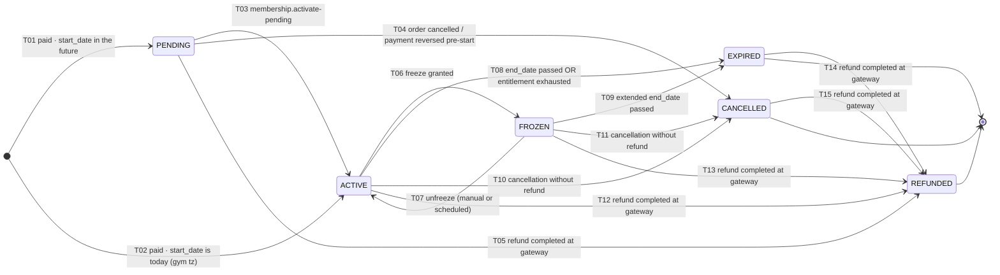

### 4.1 Table A — legality

| Id | From | To | Trigger | Actor | Guards |
| :--- | :--- | :--- | :--- | :--- | :--- |
| `SM-MEM-T01` | — | `PENDING` | `payment.captured` outbox event, or staff offline sale marked paid in full | `OUTBOX_HANDLER` / `TENANT_STAFF` | Order `status = PAID` (`BR-PAY-02`); `start_date > today(gym_tz)`; `start_date` within the configured purchase horizon (`FR-CART-02`, else `START_DATE_OUT_OF_HORIZON`); no non-stackable concurrent membership at the same gym (`BR-MEM-04`, else `MEMBERSHIP_NOT_STACKABLE`); tenant not `CLOSED` |
| `SM-MEM-T02` | — | `ACTIVE` | Same as T01 with `start_date = today(gym_tz)` | `OUTBOX_HANDLER` / `TENANT_STAFF` | All T01 guards, plus `BR-MEM-02`: capture confirmed **or** an explicit staff-recorded offline payment. A client redirect never satisfies this (`INV-MEM-6`, ADR-0013) |
| `SM-MEM-T03` | `PENDING` | `ACTIVE` | `membership.activate-pending` at 00:00 gym-time on `start_date` | `SYSTEM_JOB` | `today(gym_tz) ≥ start_date`; status still `PENDING`; tenant not `CLOSED`; gym not permanently closed (a `SUSPENDED` tenant does **not** block — `BR-TEN-05`, `INV-TEN-4`) |
| `SM-MEM-T04` | `PENDING` | `CANCELLED` | Order cancelled, or a captured payment reversed before start | `MEMBER` / `TENANT_STAFF` / `PLATFORM_STAFF` / `OUTBOX_HANDLER` | Reason code required (`BR-GYM-04` pattern; `ADMIN_ACTION_REASON_REQUIRED` if absent); no cash movement in this edge — money moves only via `refunds/` |
| `SM-MEM-T05` | `PENDING` | `REFUNDED` | `refund.completed` | `OUTBOX_HANDLER` | Gateway refund executed (`FR-RFND-05`); refund is `COMPLETED`, never merely approved |
| `SM-MEM-T06` | `ACTIVE` | `FROZEN` | Freeze request reaching its start date, or an immediate freeze | `MEMBER` / `TENANT_STAFF` | `plan.freeze_allowed` (`FREEZE_NOT_PERMITTED_BY_PLAN`); `freeze_days_used + requested ≤ plan.freeze_max_days` (`FREEZE_ALLOWANCE_EXHAUSTED`, `BR-MEM-05`); start not retroactive (`FREEZE_RETROACTIVE_NOT_PERMITTED`) and ≤ 30 days ahead (`FREEZE_START_TOO_FAR_AHEAD`, `BR-MEM-07`); not already frozen (`MEMBERSHIP_ALREADY_FROZEN`) |
| `SM-MEM-T07` | `FROZEN` | `ACTIVE` | Member/staff unfreezes early, or `membership.unfreeze-scheduled` reaches the freeze end | `MEMBER` / `TENANT_STAFF` / `SYSTEM_JOB` | `end_date` recalculates on **actual** frozen days, not requested (`FR-MEMB-05`); recomputed `end_date ≥ today(gym_tz)`, otherwise the machine routes to T09 instead |
| `SM-MEM-T08` | `ACTIVE` | `EXPIRED` | `membership.expire`, or the check-in that consumes the last session | `SYSTEM_JOB` / `OUTBOX_HANDLER` | The earlier of `today(gym_tz) > end_date` **or** `sessions_used = sessions_total` for `SESSION` plans (`BR-PLN-06`) |
| `SM-MEM-T09` | `FROZEN` | `EXPIRED` | `membership.expire` against the extended `end_date` | `SYSTEM_JOB` | `today(gym_tz) > end_date` where `end_date` already includes the freeze extension (`BR-MEM-05`) |
| `SM-MEM-T10` | `ACTIVE` | `CANCELLED` | Member or gym cancels; or an upgrade supersedes this membership | `MEMBER` / `TENANT_STAFF` / `PLATFORM_STAFF` | Reason required; **no cash movement** — a cancellation that owes money is a refund and must go through `C4.5` (`BR-REF-09` idempotency then applies) |
| `SM-MEM-T11` | `FROZEN` | `CANCELLED` | As T10, while frozen | `MEMBER` / `TENANT_STAFF` / `PLATFORM_STAFF` | As T10; the open freeze is closed with its actual days and the allowance is **not** refunded to the member |
| `SM-MEM-T12` | `ACTIVE` | `REFUNDED` | `refund.completed` (full refund) | `OUTBOX_HANDLER` | Gateway refund `COMPLETED`; full-value refund only — a **partial** refund leaves the membership `ACTIVE` with an adjusted `end_date` or session count (`FR-RFND-06`) |
| `SM-MEM-T13` | `FROZEN` | `REFUNDED` | `refund.completed` (full refund) | `OUTBOX_HANDLER` | As T12 |
| `SM-MEM-T14` | `EXPIRED` | `REFUNDED` | `refund.completed` (full refund) | `OUTBOX_HANDLER` | As T12. Reachable because `BR-REF-07` (gym closure) and `BR-MEM-14` can require refunding value after natural expiry |
| `SM-MEM-T15` | `CANCELLED` | `REFUNDED` | `refund.completed` (full refund) | `OUTBOX_HANDLER` | As T12. A cancellation followed by an approved refund is the normal member-initiated path |

### 4.2 Table B — completeness

| Id | Side effects (same transaction) | Events emitted | Audit / journal record | Notification (`§B5.19`) |
| :--- | :--- | :--- | :--- | :--- |
| `SM-MEM-T01` | `memberships` row created with `purchased_price_minor`, `purchased_terms` snapshot (`BR-PLN-02`); `membership_code` allocated; entitlement initialised from the plan snapshot; QR credential **not** yet issuable | `membership.created` | `membership_events(from=NULL, to=PENDING, reason=ORDER_PAID)`; `audit_log(action=membership_created)` | *Order confirmation + invoice* (Transactional, Email + In-app) |
| `SM-MEM-T02` | As T01, plus QR credential becomes issuable (`FR-CHK-01`); `crm/` projection seeded | `membership.created`, `membership.activated` | Two `membership_events` rows are **not** written — one row with `from=NULL, to=ACTIVE` (`INV-MEM-4`: exactly one per transition) | *Membership activated* (Transactional, Email + SMS + In-app) |
| `SM-MEM-T03` | QR credential becomes issuable; `crm/` projection updated; renewal reminder schedule armed at T−15/−7/−3/−1 (`BR-MEM-11`) | `membership.activated` | `membership_events(PENDING→ACTIVE, reason=START_DATE_REACHED, actor_type=SYSTEM_JOB, job_run_id)` | *Membership starts today* (Transactional, SMS + In-app) |
| `SM-MEM-T04` | Reminder schedule disarmed; `crm/` projection updated; **no** ledger entry | `membership.cancelled` | `membership_events(PENDING→CANCELLED, reason=<code>)`; `audit_log(action=membership_cancelled, before, after, reason)` | *Membership cancelled* (Transactional, Email + In-app) |
| `SM-MEM-T05` | QR revoked; entitlement zeroed; reminder schedule disarmed | `membership.refunded` | `membership_events(PENDING→REFUNDED, reason=<refund reason code>, metadata={refund_id})` | *Refund completed* (Transactional, Email + In-app) |
| `SM-MEM-T06` ⨂ | `freezes` row opened; `end_date` extended by exactly the frozen days (`BR-MEM-05`, `INV-MEM-7`); `freeze_days_used` incremented; check-in denial reason for this membership becomes `MEMBERSHIP_FROZEN` (`BR-MEM-06`) | `membership.frozen` | `membership_events(ACTIVE→FROZEN, reason=MEMBER_REQUEST\|STAFF_REQUEST, metadata={freeze_id, days})` | *Freeze started* (Transactional, Email + In-app) |
| `SM-MEM-T07` | `freezes` row closed with actual end; `end_date` **recalculated** from actual days; `freeze_days_used` corrected downward if the freeze ended early | `membership.unfrozen` | `membership_events(FROZEN→ACTIVE, reason=MEMBER_REQUEST\|SCHEDULED_END, metadata={actual_days})` | *Freeze ended* (Transactional, Email + In-app) |
| `SM-MEM-T08` | QR ceases to issue; `crm/` at-risk projection updated; the membership stays fully visible to member and gym forever (`BR-MEM-12`) | `membership.expired` | `membership_events(ACTIVE→EXPIRED, reason=END_DATE_PASSED\|ENTITLEMENT_EXHAUSTED)` | *Membership expired* (Transactional, Email + SMS + In-app) + *Expiring members this week* digest to the owner |
| `SM-MEM-T09` | As T08 | `membership.expired` | `membership_events(FROZEN→EXPIRED, reason=END_DATE_PASSED)` | As T08 |
| `SM-MEM-T10` | QR revoked; reminder schedule disarmed; if the reason is `UPGRADE_SUPERSEDED`, the new membership id is written into `metadata` so the chain is traceable | `membership.cancelled` | `membership_events(ACTIVE→CANCELLED, reason=<code>)`; `audit_log(action=membership_cancelled)` | *Membership cancelled* (Transactional, Email + In-app) |
| `SM-MEM-T11` | As T10, plus the open `freezes` row is closed | `membership.cancelled` | `membership_events(FROZEN→CANCELLED, reason=<code>)` | As T10 |
| `SM-MEM-T12` ⨂ | QR revoked **in the same transaction** (`FR-RFND-06`); entitlement zeroed; credit note already issued by `billing/`; `REFUND` + `COMMISSION_REVERSAL` ledger entries already appended by `ledger/` | `membership.refunded` | `membership_events(ACTIVE→REFUNDED, reason=<refund reason code>, metadata={refund_id, credit_note_id})` | *Refund completed* (Transactional, Email + In-app) |
| `SM-MEM-T13` ⨂ | As T12, plus the open `freezes` row is closed | `membership.refunded` | `membership_events(FROZEN→REFUNDED, …)` | As T12 |
| `SM-MEM-T14` ⨂ | As T12; nothing to revoke, so the QR revocation is a no-op that still records | `membership.refunded` | `membership_events(EXPIRED→REFUNDED, …)` | As T12; for `BR-REF-07` closures, also *Gym closure notice* (Transactional, SMS + Email + In-app) within 24 h (`BR-MEM-14`) |
| `SM-MEM-T15` ⨂ | As T12 | `membership.refunded` | `membership_events(CANCELLED→REFUNDED, …)` | As T12 |

### 4.3 Invariants holding in every state

| # | Invariant | Source | Asserted by |
| :-: | :--- | :--- | :--- |
| 1 | Exactly one of six labels; no seventh state exists | `INV-MEM-1`, `BR-MEM-01` | Postgres enum with six labels |
| 2 | `status = 'ACTIVE'` ⟹ `start_date ≤ today(gym_tz) ≤ end_date` | `INV-MEM-2` | Property test after any transition sequence; the `membership.expire` job closes the window hourly |
| 3 | `end_date IS NOT NULL` in every state, including `PENDING` | `INV-MEM-3` | `NOT NULL` constraint |
| 4 | Exactly one `membership_events` row per transition — never zero, never two | `INV-MEM-4` | `AFTER UPDATE` trigger plus a test that counts rows across a 12-transition sequence |
| 5 | `sessions_used ≤ sessions_total` for `SESSION` plans, in every state | `BR-PLN-06` | `CHECK` constraint |
| 6 | `freeze_days_used ≤ plan_snapshot.freeze_max_days`, in every state | `INV-MEM-7` | `CHECK` against the `purchased_terms` snapshot, not the live plan |
| 7 | `purchased_price_minor`, `currency` and `purchased_terms` never change after creation | `BR-PLN-02` | `ERD.md`: `purchased_*` columns immutable from creation |
| 8 | Member view and gym view read the **same** column; there is no gym-side status concept | `FR-MEMB-12` | Contract test on both API surfaces |
| 9 | A membership is visible to member and gym in every state, forever, including terminal ones | `BR-MEM-12` | Query test after expiry and after refund |
| 10 | Only `ACTIVE` permits check-in — in all five other states the check-in machine denies with a reason from the §15.1 taxonomy | `INV-CHK-1`, `BR-CHK-01` | `E2E-04` |

**The sharing-review clarification.** `BR-MEM-13` says detected credential sharing *"suspends the
membership pending review rather than cancelling it"*. There is **no `SUSPENDED` membership state** —
`INV-MEM-1` fixes six labels. Sharing review is a **boolean flag plus a case record** on the
aggregate (`sharing_review_open`), not a seventh state. The membership stays `ACTIVE`; the check-in
machine reads the flag and denies with `MEMBERSHIP_UNDER_REVIEW` (§15.1). This is deliberate: making
it a state would have required six new edges and would have made `INV-MEM-2` untrue while the case
was open. Any implementation that adds a `SUSPENDED` label is a constitution violation.

### 4.4 Illegal transitions, enumerated

Fifteen legal edges exist out of 6 × 6 = 36 ordered state pairs, minus 6 self-pairs = 30 possible,
of which 13 are legal between named states (T03–T15) and 17 are illegal. Every one is a test case.

| Id | Illegal edge | Why | Attempt behaviour |
| :--- | :--- | :--- | :--- |
| `SM-MEM-X01` | `PENDING → FROZEN` | You cannot freeze what has not started; use a later `start_date` | `422 MEMBERSHIP_NOT_ACTIVE` |
| `SM-MEM-X02` | `PENDING → EXPIRED` | A membership that never started has no consumed value; it is cancelled or refunded | `422 INVALID_MEMBERSHIP_TRANSITION` |
| `SM-MEM-X03` | `EXPIRED → ACTIVE` | **The single most attempted illegal edge.** `INV-MEM-5`: renewal creates a new membership | `422 INVALID_MEMBERSHIP_TRANSITION`, message names the renewal endpoint |
| `SM-MEM-X04` | `EXPIRED → PENDING` | Same reason as X03 | `422 INVALID_MEMBERSHIP_TRANSITION` |
| `SM-MEM-X05` | `EXPIRED → FROZEN` | Freezing an expired membership is a covert extension of a purchased term | `422 MEMBERSHIP_NOT_ACTIVE` |
| `SM-MEM-X06` | `EXPIRED → CANCELLED` | Cancelling a completed term rewrites history; there is nothing to cancel | `422 INVALID_MEMBERSHIP_TRANSITION` |
| `SM-MEM-X07` | `CANCELLED → ACTIVE` | Reinstatement is a new sale, not a state change | `422 INVALID_MEMBERSHIP_TRANSITION` |
| `SM-MEM-X08` | `CANCELLED → PENDING` / `→ FROZEN` / `→ EXPIRED` | Three edges; all resurrect a closed membership | `422 INVALID_MEMBERSHIP_TRANSITION` |
| `SM-MEM-X09` | `REFUNDED → *` (five edges) | Money has been returned. `BR-REF-09` makes re-refunding a no-op; anything else is fraud-shaped | `422 INVALID_MEMBERSHIP_TRANSITION`; a `REFUNDED → REFUNDED` request returns the **original** result (`INV-FIN-13`) |
| `SM-MEM-X10` | `FROZEN → FROZEN` | Self-edge; a second freeze while frozen | `409 MEMBERSHIP_ALREADY_FROZEN` |
| `SM-MEM-X11` | `ACTIVE → ACTIVE` via unfreeze | Self-edge; unfreezing what is not frozen | `409 MEMBERSHIP_NOT_FROZEN` |
| `SM-MEM-X12` | Any edge performed by `SYSTEM_JOB` that requires a reason code (T04, T10, T11) | A job cannot supply a human reason for a discretionary cancellation | `500` + alert; the job is defective |

**What happens on an attempt.** Per **L6**: `assertTransition(from, to)` throws
`IllegalMembershipTransitionError`; the `UnitOfWork` rolls back; **zero** rows are written to
`memberships`, `membership_events`, `audit_log`, `outbox` and `idempotency_keys`; the
`DomainExceptionFilter` returns `{ error: { code, message, details, correlation_id } }` per `§C3.1`;
and the refusal is logged at `warn` with the correlation id, the actor, the attempted edge and the
entity id — a burst of these from one actor is a `Security.md` detection signal, not merely a bug.

> **Registry gap — `SM-OQ-03`.** `INVALID_MEMBERSHIP_TRANSITION` is named in `BusinessRules.md`
> (`BR-MEM-01-N1`) but does **not** appear in the `API_Catalog.md` §6 error registry, which gate
> **PG-5** requires. §17.2 lists the eleven transition-error codes — one per machine — that must be
> added to `packages/types/src/errors/registry.ts` before the first controller ships.

### 4.5 Terminal states, and why

| State | Terminal? | Why |
| :--- | :---: | :--- |
| `EXPIRED` | **Yes** (except T14 to `REFUNDED`) | `INV-MEM-5`. Reactivation would silently change what the member paid for: the purchased term, price and plan snapshot are frozen at purchase (`BR-PLN-02`), so extending an expired term would sell a new period at an old price and break `BR-FIN-05` at settlement. Renewal creates a new row, a new order, a new invoice and a new commission line at the **renewal** rate (5%, `LAUNCH_MARKET_INDIA.md` §10) |
| `CANCELLED` | **Yes** (except T15) | The commercial relationship for this term ended without consumption. Reinstating it would resurrect an entitlement whose payment may since have been reversed |
| `REFUNDED` | **Yes, absolutely** | Money has left the platform. `INV-FIN-13` makes a second refund a no-op. No state exists after money is returned |

`EXPIRED`, `CANCELLED` and `REFUNDED` all retain **full historical visibility** to both member and
gym indefinitely (`BR-MEM-12`). Terminal means "no further transitions", never "hidden" and never
"deleted" — deletion is governed by `BR-DAT-04` and `INV-TEN-6`, and financial records survive it.

### 4.6 Concurrency

| Race | What collides | Resolution |
| :--- | :--- | :--- |
| `SM-MEM-C01` | `membership.expire` (job) vs. a member's freeze request, both at 00:00 gym-time on `end_date` | **C-2.** The freeze use case takes `SELECT … FOR UPDATE` on the membership because it also reads `freezes` and the plan snapshot. Whichever commits first wins; the loser re-reads. If the job won, the freeze fails with `MEMBERSHIP_NOT_ACTIVE`, which is correct: the term ended |
| `SM-MEM-C02` | Two staff members submitting a freeze for the same membership | **C-1** on `status = 'ACTIVE'` plus **C-2** on the allowance read. The second `UPDATE` matches zero rows → `409 MEMBERSHIP_ALREADY_FROZEN`. Without C-2 the allowance check would double-spend `freeze_max_days` |
| `SM-MEM-C03` | `payment.captured` webhook delivered twice (providers do this) | **L5.** `payment_events.provider_event_id` is unique; the second delivery finds the event and returns the stored outcome. The membership is created once. `SM-MEM-C03` asserts exactly one `membership_events` row |
| `SM-MEM-C04` | Two concurrent check-ins consuming the last session of a `SESSION` plan | **C-2** on the membership row inside the attendance transaction. One decrements to `sessions_total`, transitions T08 and allows entry; the other reads `sessions_used = sessions_total` and denies with `NO_SESSIONS_REMAINING` (§15.1). `INV-CHK-6` guarantees a cooldown duplicate never decrements at all |
| `SM-MEM-C05` | `refund.completed` (T12) racing `membership.expire` (T08) | Both are legal from `ACTIVE`, and T14 exists precisely so the order does not matter. If expiry wins, the refund lands as T14 `EXPIRED → REFUNDED`. **The refund handler therefore never asserts a specific `from` state** — it asserts membership of the set `{PENDING, ACTIVE, FROZEN, EXPIRED, CANCELLED}` |
| `SM-MEM-C06` | `membership.activate-pending` running twice for the same membership across two workers | **C-3.** ADR-0009 distributed lock on `(membership.activate-pending, tenant_id, logical_date)`, plus **C-1** so a lock failure still cannot double-transition |

**Retry policy.** A conditional `UPDATE` matching zero rows is retried exactly **once** after a fresh
read. A Postgres serialisation failure (`40001`) is retried up to **three** times with jittered
backoff at the use-case boundary (`Architecture.md` step 22), then surfaces as `503` with the
correlation id.

### 4.7 Recovery — diagnosing and moving a stuck membership

| Symptom | Diagnosis query / signal | Move |
| :--- | :--- | :--- |
| `PENDING` past its `start_date` | `memberships WHERE status='PENDING' AND start_date < today(gym_tz)` — exposed as the **stuck-membership** metric; alerts above zero for more than two job cycles | Re-run `membership.activate-pending` for the tenant. If it still refuses, the tenant is `CLOSED` or the gym is gone: the correct move is T04 with reason `TENANT_CLOSED`, then a `BR-REF-07` refund |
| `ACTIVE` past its `end_date` | `memberships WHERE status='ACTIVE' AND end_date < today(gym_tz)` — violates `INV-MEM-2`; **paging severity**, because the member can still check in | Run `membership.expire` for the tenant. If the job is failing, Bull Board shows the failed job and its error; the underlying cause is almost always a missing or invalid gym timezone |
| `FROZEN` with a closed `freezes` row | Join `memberships` to `freezes` where no open row exists | T07 with `reason=RECOVERY_UNFREEZE`, actor `PLATFORM_STAFF`, reason text mandatory |
| Membership `REFUNDED` but QR still issuing | Contract test `SM-MEM-R04`; in production, a `qr_generated` analytics event for a refunded membership | Defect, not data: the revocation was outside the transaction, violating **L3**. Fix the code; then re-run the revocation idempotently |
| Wrong transition applied by staff | `membership_events` shows the erroneous edge | **Never edit.** `ERD.md` §1529 is explicit: apply a **new** transition with a correcting actor and reason. The erroneous event row stays, forever |

**The universal recovery rule.** There is no admin "set status" tool, and building one would violate
**L1**. Recovery is always (a) re-run the job, (b) apply a legal transition with a recorded human
actor and reason, or (c) fix the defect and let the machine converge. A support engineer who needs
`psql` has found a missing legal transition, and that is a design escalation.

### 4.8 Time-based transitions and their `§C5` jobs

| Transition | Job | Schedule | Idempotency key |
| :--- | :--- | :--- | :--- |
| `SM-MEM-T03` | `membership.activate-pending` | Hourly, per gym timezone | `(membership_id, start_date)` |
| `SM-MEM-T08`, `SM-MEM-T09` | `membership.expire` | Hourly, per gym timezone | `(membership_id, end_date)` |
| `SM-MEM-T07` (scheduled arm) | `membership.unfreeze-scheduled` | Hourly | `(freeze_id, scheduled_end)` |
| *(no transition — notification only)* | `membership.renewal-reminders` | Daily 09:00 gym-time | `(membership_id, offset_days)` |
| *(creates a **new** membership)* | `membership.auto-renew` | Daily | `(membership_id, renewal_period)` — `BR-MEM-10` |
| *(sets the sharing flag, not a state)* | `attendance.sharing-scan` | Hourly | `(membership_id, window_start)` |

Under `Asia/Kolkata` the hourly cadence means a membership activates within at most 60 minutes of
local midnight, which `FR-MEMB-09` permits. The member-facing consequence — a 00:00–01:00 window in
which a same-day-start membership may not yet scan — is covered by the staff override path
(`GRACE_PERIOD_GRANTED`, §15.5) and is a known, accepted limitation.

### 4.9 Test identifiers

| Coverage | Ids |
| :--- | :--- |
| Positive, one per transition | `SM-MEM-T01-P1` … `SM-MEM-T15-P1` (15) |
| Negative guards | `SM-MEM-T03-N1` (tenant `CLOSED`), `SM-MEM-T06-N1` … `-N4` (plan forbids · allowance exhausted · retroactive · > 30 days), `SM-MEM-T08-N1` (session plan not yet exhausted), `SM-MEM-T12-N1` (refund merely approved, not completed) |
| Illegal edges | `SM-MEM-X01` … `SM-MEM-X12`, table-driven across all 17 illegal pairs |
| Concurrency | `SM-MEM-C01` … `SM-MEM-C06` (Testcontainers, two real connections) |
| Recovery | `SM-MEM-R01` … `SM-MEM-R05` |
| Invariant property test | `SM-MEM-INV` — random legal transition sequences of length ≤ 12; asserts all ten §4.3 invariants after each step |
| Related suites | `BR-MEM-01-P1/N1`, `BR-MEM-05-P1/N1`, `E2E-04`, `E2E-05`, `E2E-07` |

Coverage gate: `memberships/` is a `≥95%` module under `§C7`. The state-machine file itself is held
at **100% branch coverage** — it is a table plus an assertion, so anything less means a table row
is unreachable.

---

## 5. Machine 2 — Order (`C4.2`)

**Owner** `ordering/` · **Column** `orders.status` (eight labels) · **Journal** `audit_log` + `outbox`
**Governing rules** `BR-PAY-03`, `BR-PAY-04`, `BR-PAY-09`, `BR-PLN-03`, `BR-CPN-03`, `BR-REF-09`,
`BR-FIN-02`, `BR-FIN-04`

The order is the **priced commercial record**. It carries all nine `A6.3` money figures, the refund
policy snapshot (`BR-REF-02`) and the tax snapshot (`BR-PAY-11`). Its state machine exists to make
one thing impossible: a price displayed that is not the price charged (`INV-TRU-7`, `BR-PLN-03`).

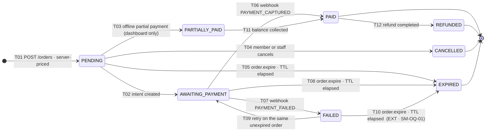

### 5.1 Table A — legality

| Id | From | To | Trigger | Actor | Guards |
| :--- | :--- | :--- | :--- | :--- | :--- |
| `SM-ORD-T01` | — | `PENDING` | `POST /v1/orders` | `MEMBER` / `TENANT_STAFF` | All nine money figures computed **server-side** from server-held plan, coupon and tax data; client-submitted amounts ignored (`BR-PAY-04`, `L8-PIPE` rejects unknown fields); plan `PUBLISHED` and available at the branch; eligibility — age, gender, concurrency (`FR-CART-07`); `Idempotency-Key` present (`IDEMPOTENCY_KEY_REQUIRED`) |
| `SM-ORD-T02` | `PENDING` | `AWAITING_PAYMENT` | `POST /v1/orders/:ref/payment-intent` | `MEMBER` / `TENANT_STAFF` | **Price re-validated against the live plan** — mismatch aborts with `PLAN_PRICE_CHANGED` and never silently charges either figure (`BR-PLN-03`, `INV-TRU-7`); coupon re-validated (`BR-CPN-03` → `COUPON_EXPIRED` / `COUPON_EXHAUSTED` / `COUPON_PER_USER_LIMIT_REACHED`); eligibility re-checked; `expires_at` not passed (`ORDER_EXPIRED`, 410) |
| `SM-ORD-T03` | `PENDING` | `PARTIALLY_PAID` | Staff records a part payment at the desk | `TENANT_STAFF` | `channel = DASHBOARD` **only** — a database `CHECK` makes this unreachable from the web channel (`BR-PAY-09`, `PARTIAL_PAYMENT_NOT_PERMITTED_ONLINE`); method ∈ `CASH`, `CARD`, `BANK_TRANSFER`; `collected_by_staff_id` recorded for attribution |
| `SM-ORD-T04` | `PENDING` | `CANCELLED` | Member abandons explicitly, or staff voids | `MEMBER` / `TENANT_STAFF` | No payment captured against this order (`ORDER_ALREADY_PAID` otherwise); coupon reservation released |
| `SM-ORD-T05` | `PENDING` | `EXPIRED` | `order.expire` | `SYSTEM_JOB` | `expires_at < now()`; no payment in a non-terminal state at the provider — a `PENDING` payment blocks expiry and defers to `payment.reconcile` |
| `SM-ORD-T06` | `AWAITING_PAYMENT` | `PAID` | `payment.captured` from a verified webhook | `PROVIDER_WEBHOOK` | Signature valid (`BR-PAY-05`, `WEBHOOK_SIGNATURE_INVALID`); `provider_event_id` unseen; **gateway amount equals `orders.total_minor` exactly** — a mismatch raises `PAYMENT_AMOUNT_MISMATCH`, creates no membership, and escalates to Finance |
| `SM-ORD-T07` | `AWAITING_PAYMENT` | `FAILED` | `payment.failed` webhook | `PROVIDER_WEBHOOK` | Provider failure code recorded verbatim in `payments.failure_code`; never inferred from a timeout |
| `SM-ORD-T08` | `AWAITING_PAYMENT` | `EXPIRED` | `order.expire` | `SYSTEM_JOB` | `expires_at < now()` **and** no payment left `PENDING`/`AUTHORISED` at the provider; otherwise `payment.reconcile` owns the resolution (`BR-PAY-06`) |
| `SM-ORD-T09` | `FAILED` | `AWAITING_PAYMENT` | Customer retries payment on the same order | `MEMBER` / `TENANT_STAFF` | `expires_at` not passed; failure code is retryable (`PAYMENT_NOT_RETRYABLE` for hard declines); **T02's full guard set re-runs** — price and coupon are re-validated on every retry, not cached from the first attempt |
| `SM-ORD-T10` **EXT** | `FAILED` | `EXPIRED` | `order.expire` | `SYSTEM_JOB` | `expires_at < now()`. **Extension beyond the `C4.2` diagram**, required so a failed order does not sit in `FAILED` forever holding a coupon reservation (§17.2, `SM-OQ-01`) |
| `SM-ORD-T11` | `PARTIALLY_PAID` | `PAID` | Balance collected at the desk | `TENANT_STAFF` | Sum of captured offline payments equals `total_minor` exactly; a **single consolidated invoice** is issued at this point, not one per instalment (`E2E-10`, `AC-CART-02.2`) |
| `SM-ORD-T12` | `PAID` | `REFUNDED` | `refund.completed` for the full order value | `OUTBOX_HANDLER` | Idempotent on the order (`BR-REF-09`, `INV-FIN-13`); a **partial** refund leaves the order `PAID` and is represented entirely in the ledger and the credit note, never as an order state |

### 5.2 Table B — completeness

| Id | Side effects | Events emitted | Audit record | Notification |
| :--- | :--- | :--- | :--- | :--- |
| `SM-ORD-T01` | Nine `A6.3` figures persisted; `refund_policy_snapshot` and `tax_snapshot` frozen; coupon **reserved** (not redeemed); `expires_at` set from tenant configuration | `order.created` | `audit_log(action=order_created, after={figures})` | — (the checkout UI shows the summary; no message yet) |
| `SM-ORD-T02` | Provider intent created through the `PaymentProvider` port (ADR-0018, Razorpay Route in India); `payments` row created in `CREATED` | `order.payment-initiated` | `audit_log(action=order_payment_initiated)` | — |
| `SM-ORD-T03` ⨂ | `payments` row with `is_offline = true`, `collected_by_staff_id`; balance-due computed, never stored (`BR-FIN-01`) | `order.partially-paid` | `audit_log(action=offline_payment_recorded, reason=<method>)` | *New sale* to the owner (Operational, In-app + Email digest) |
| `SM-ORD-T04` | Coupon reservation released; no membership created | `order.cancelled` | `audit_log(action=order_cancelled, reason)` | — |
| `SM-ORD-T05` | Coupon reservation released (`FR-CART-05`); analytics `checkout_abandoned` | `order.expired` | `audit_log(action=order_expired, actor_type=SYSTEM_JOB)` | — |
| `SM-ORD-T06` ⨂ | Invoice issued with a **gapless FY sequence** (`BR-PAY-10`, FY = April–March); `SALE`, `TAX`, `COMMISSION`, `GATEWAY_FEE` ledger entries appended; coupon redemption committed; membership created (T01/T02 of `C4.1`) | `order.paid`, `payment.captured` | `audit_log(action=order_paid)`; `payment_events` row | *Order confirmation + invoice* (Transactional, Email + In-app); *New sale* to owner |
| `SM-ORD-T07` | Coupon reservation retained until `expires_at` so a retry keeps the discount | `order.payment-failed` | `audit_log(action=order_payment_failed, reason=<provider code>)` | *Payment failed* (Transactional, Email + SMS + In-app), with the retry link |
| `SM-ORD-T08` | As T05 | `order.expired` | `audit_log(action=order_expired)` | — |
| `SM-ORD-T09` | New provider intent; **new** `payments` row — the failed one is never mutated | `order.payment-initiated` (`attempt_number` incremented) | `audit_log(action=order_payment_retried)` | — |
| `SM-ORD-T10` | As T05 | `order.expired` | `audit_log(action=order_expired)` | — |
| `SM-ORD-T11` ⨂ | One consolidated invoice for the full `total_minor`; ledger entries appended once, at this point, not per instalment | `order.paid` | `audit_log(action=balance_collected)` | *Order confirmation + invoice* (Transactional) |
| `SM-ORD-T12` ⨂ | `REFUND` and `COMMISSION_REVERSAL` ledger entries; credit note issued in its own sequence (`FR-INV-09`) | `order.refunded` | `audit_log(action=order_refunded, reason=<refund code>)` | *Refund completed* (Transactional, Email + In-app) |

### 5.3 Invariants holding in every state

1. `gross_minor − discount_minor = net_minor`; `net_minor + tax_minor = total_minor`;
   `commission_base_minor = net_minor` and never includes tax or gateway fees (`INV-FIN-3`,
   `INV-FIN-4`, `BR-FIN-04`).
2. All nine figures are **persisted**, never recomputed at display time (`BR-FIN-02`) — and in India
   the ninth is `commission_tax_minor`, the 18% GST the platform owes on its own commission
   (`LAUNCH_MARKET_INDIA.md` conflict 2).
3. `discount_minor` never drives `total_minor` below zero; excess discount is discarded, never
   credited (`INV-FIN-11`, `BR-CPN-04`).
4. Exactly one coupon per order (`BR-CPN-02`); `coupon_id` is nullable, never an array.
5. `idempotency_key` is unique across `orders` (`BR-PAY-03`).
6. `status = 'PARTIALLY_PAID'` ⟹ `channel = 'DASHBOARD'` — a `CHECK` constraint, not a convention.
7. An order has **at most one non-void invoice**, and money figures are immutable from `PAID`
   (`ERD.md`: "money figures immutable once `PAID`").
8. `refund_policy_snapshot` and `tax_snapshot` never change after T01 (`BR-REF-02`, `BR-PAY-11`).

### 5.4 Illegal transitions

| Id | Illegal edge | Why | Attempt behaviour |
| :--- | :--- | :--- | :--- |
| `SM-ORD-X01` | `PENDING → PAID` | Skips the payment machine entirely; there would be no `payments` row to reconcile | `422 INVALID_ORDER_TRANSITION` |
| `SM-ORD-X02` | `AWAITING_PAYMENT → CANCELLED` | An intent is live at the provider; cancel the **payment** first, then the order expires or the customer retries | `409 ORDER_NOT_CANCELLABLE` |
| `SM-ORD-X03` | `PAID → CANCELLED` | Money moved. The only exit from `PAID` is `REFUNDED` | `409 ORDER_ALREADY_PAID` |
| `SM-ORD-X04` | `PAID → AWAITING_PAYMENT` | Would permit a second charge against a settled order | `409 ORDER_ALREADY_PAID` |
| `SM-ORD-X05` | `EXPIRED → *` (all) | The coupon is released, the price is stale, the tax snapshot may be obsolete. Start a new order | `410 ORDER_EXPIRED` |
| `SM-ORD-X06` | `CANCELLED → *` (all) | Terminal | `422 INVALID_ORDER_TRANSITION` |
| `SM-ORD-X07` | `REFUNDED → *` (all) | Terminal; `INV-FIN-13` | `422 REFUND_ALREADY_PROCESSED` on a re-refund |
| `SM-ORD-X08` | `PARTIALLY_PAID → CANCELLED` | Money has been collected at the desk. Return it through `C4.5` so a credit note and a ledger reversal exist | `422 REFUND_ON_UNPAID_ORDER` is **not** the code here — it is `409 ORDER_ALREADY_PAID`, because part of it is |
| `SM-ORD-X09` | `PARTIALLY_PAID → AWAITING_PAYMENT` | Mixing an online intent into an offline sale would produce two invoices for one order | `422 INVALID_ORDER_TRANSITION` |
| `SM-ORD-X10` | `FAILED → PAID` | Capture must arrive on a live intent; a webhook claiming capture on a failed order is a signal, not a state change | `422 INVALID_ORDER_TRANSITION` + **security alert**, because it implies a forged or misrouted webhook |

`SM-ORD-X10` deserves emphasis. Per **L6** nothing is written to the order, but the *event* is
persisted in `payment_events` (it is provider truth) and Finance is alerted. This is the
`BR-PAY-06` posture: record what the provider said, refuse to act on it, escalate.

### 5.5 Terminal states

`PAID` is terminal **except** for T12 — it is the successful commercial outcome, and the only thing
that can follow success is reversal. `REFUNDED`, `CANCELLED` and `EXPIRED` are absolutely terminal.
`EXPIRED` is terminal rather than retryable because the guard that made the order valid — price,
coupon, eligibility, tax profile — was evaluated at T01 and is stale by definition once `expires_at`
passes; permitting revival would reopen exactly the `BR-PLN-03` hole the machine exists to close.

### 5.6 Concurrency

| Race | Resolution |
| :--- | :--- |
| `SM-ORD-C01` — capture webhook arrives while `order.expire` is expiring the order | **C-1** on `status = 'AWAITING_PAYMENT'`. If expiry commits first, the capture handler finds `EXPIRED`, refuses T06, and routes to `payment.duplicate-detect` for an automatic refund (`BR-PAY-07`) — money that arrived for an expired order is returned, never kept. This is why T05/T08 carry the "no live payment at the provider" guard: it makes the race rare, and the refund path makes it safe when it happens |
| `SM-ORD-C02` — two browser tabs both `POST /orders` with the same cart | **L5.** Same `Idempotency-Key` → the stored response is returned. Different keys → two orders, one of which expires. `orders` has a unique index on `idempotency_key` |
| `SM-ORD-C03` — capture webhook delivered twice | `payment_events.provider_event_id` unique; second delivery is a no-op returning 200 so the provider stops retrying |
| `SM-ORD-C04` — two staff collecting the balance simultaneously | **C-2** on the order row; the second reads `PAID` and returns the existing invoice rather than issuing a second one (invariant 7) |
| `SM-ORD-C05` — coupon exhausted between T01 reservation and T02 validation | Reservation is a row in `coupon_redemptions` with a `RESERVED` marker taken under **C-2** on the coupon; `redemption_count` is derived from committed rows. The last reserver wins the last seat, and T02 re-validates so an expired-in-between coupon still aborts with `COUPON_EXPIRED` |

### 5.7 Recovery

| Symptom | Diagnosis | Move |
| :--- | :--- | :--- |
| `AWAITING_PAYMENT` older than the order TTL with a live provider intent | `orders JOIN payments WHERE orders.status='AWAITING_PAYMENT' AND payments.status IN ('PENDING','AUTHORISED') AND orders.expires_at < now()` | `payment.reconcile` polls the provider. Terminal provider state → apply T06/T07 idempotently. Still indeterminate → escalate to Finance; **never** auto-activate (`BR-PAY-06`) |
| `PENDING` with a coupon reservation and no `expires_at` | Data defect | Set `expires_at` by migration, then let `order.expire` do its job. The status is still never written by hand |
| Money captured, order `EXPIRED` | `payments.status='CAPTURED'` with `orders.status='EXPIRED'` — a **paging** alert, since a customer has paid for nothing | `payment.duplicate-detect` auto-refunds within one business day (`BR-PAY-07`); the member is notified. Finance reviews the batch to confirm each case |
| Invoice missing on a `PAID` order | `orders LEFT JOIN invoices` where null | Re-run invoice issuance — it is idempotent on `order_id` and draws the next FY sequence number under **C-3** advisory lock so the sequence stays gapless (`INV-FIN-10`) |

### 5.8 `§C5` jobs

| Transition | Job | Schedule |
| :--- | :--- | :--- |
| `SM-ORD-T05`, `T08`, `T10` | `order.expire` | Every 5 minutes |
| Resolves stuck `AWAITING_PAYMENT` | `payment.reconcile` | Every 15 minutes |
| Refunds money captured against a dead order | `payment.duplicate-detect` | Every 15 minutes |

### 5.9 Test identifiers

`SM-ORD-T01-P1` … `SM-ORD-T12-P1` · negatives `SM-ORD-T02-N1` (price changed → `PLAN_PRICE_CHANGED`,
no charge), `-N2` (coupon exhausted), `SM-ORD-T03-N1` (web channel → `PARTIAL_PAYMENT_NOT_PERMITTED_ONLINE`),
`SM-ORD-T06-N1` (**amount mismatch → no membership, Finance escalation**), `SM-ORD-T09-N1` (retry
after `expires_at` → `410`) · illegal `SM-ORD-X01` … `X10` · concurrency `SM-ORD-C01` … `C05` ·
recovery `SM-ORD-R01` … `R04` · related `E2E-02`, `E2E-06`, `E2E-08`, `E2E-10`, `BR-PLN-03-P1/N1`.

---

## 6. Machine 3 — Payment (`C4.3`)

**Owner** `payments/` · **Column** `payments.status` (eight labels) · **Journal** `payment_events`
(append-only, `provider_event_id` unique) · **Governing rules** `BR-PAY-02`, `BR-PAY-03`,
`BR-PAY-05` … `BR-PAY-08`, ADR-0013, ADR-0018

This machine is a **mirror of provider truth**, not a decision-maker. Almost every edge is driven by
a signature-verified webhook or by the reconciliation poller. The platform never *decides* that a
payment captured; it *learns* that it did, and the anti-corruption layer of
`PROJECT_CONSTITUTION.md` §4.5.1 translates the provider's vocabulary into these eight labels.

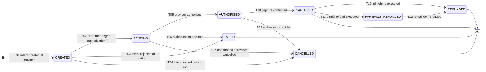

### 6.1 Table A — legality

| Id | From | To | Trigger | Actor | Guards |
| :--- | :--- | :--- | :--- | :--- | :--- |
| `SM-PAY-T01` | — | `CREATED` | `PaymentProvider.createIntent()` returns | `MEMBER` / `TENANT_STAFF` (via `ordering/`) | Order in `AWAITING_PAYMENT`; amount equals `orders.total_minor`; `(provider, provider_intent_id)` unique. For an **offline** payment the row is created directly in `CAPTURED` with `is_offline = true` — the only edge that skips the provider path (`BR-PAY-09`) |
| `SM-PAY-T02` | `CREATED` | `PENDING` | Provider event: authorisation started (UPI collect sent, 3-DS challenge issued) | `PROVIDER_WEBHOOK` | Signature verified, timestamp within tolerance (`WEBHOOK_TIMESTAMP_OUT_OF_TOLERANCE`), `provider_event_id` unseen (`BR-PAY-05`) |
| `SM-PAY-T03` | `CREATED` | `FAILED` | Provider rejected the intent | `PROVIDER_WEBHOOK` / synchronous port error | Provider failure code stored verbatim; never inferred from an HTTP timeout — a timeout leaves the payment `CREATED` for the poller |
| `SM-PAY-T04` | `CREATED` | `CANCELLED` | Intent voided before any customer action | `SYSTEM_JOB` / `PROVIDER_WEBHOOK` | Order expired or cancelled; no authorisation exists |
| `SM-PAY-T05` | `PENDING` | `AUTHORISED` | Provider authorised | `PROVIDER_WEBHOOK` | As T02. **Catch-up rule:** if the provider reports `captured` while local state is `PENDING` (common on UPI, where authorise and capture are one act), the machine applies T05 **and** T08 in the same transaction and writes **two** `payment_events` rows — the intermediate state is never skipped in the journal |
| `SM-PAY-T06` | `PENDING` | `FAILED` | Authorisation declined | `PROVIDER_WEBHOOK` | Failure code recorded; drives `SM-ORD-T07` and the *Payment failed* notification |
| `SM-PAY-T07` | `PENDING` | `CANCELLED` | Customer abandoned; provider cancelled the intent | `PROVIDER_WEBHOOK` / `SYSTEM_JOB` | No authorisation at the provider, confirmed by a poll — not assumed from silence |
| `SM-PAY-T08` | `AUTHORISED` | `CAPTURED` | Capture confirmed | `PROVIDER_WEBHOOK` | **The single most consequential edge in the platform.** Amount equals `orders.total_minor` exactly (`PAYMENT_AMOUNT_MISMATCH` otherwise); currency is `INR`; `provider_charge_id` recorded; `BR-PAY-02` — a client redirect can never trigger this (`INV-MEM-6`, ADR-0013) |
| `SM-PAY-T09` | `AUTHORISED` | `CANCELLED` | Authorisation voided before capture | `PROVIDER_WEBHOOK` | Provider confirms the void; no funds moved |
| `SM-PAY-T10` | `CAPTURED` | `REFUNDED` | Full refund executed at the gateway | `PROVIDER_WEBHOOK` | Refund amount equals `amount_minor`; **original instrument only** (`BR-REF-04`, `INV-FIN-12`) |
| `SM-PAY-T11` | `CAPTURED` | `PARTIALLY_REFUNDED` | Partial refund executed | `PROVIDER_WEBHOOK` | Cumulative refunded < `amount_minor` (`REFUND_EXCEEDS_PAID_AMOUNT` otherwise) |
| `SM-PAY-T12` | `PARTIALLY_REFUNDED` | `REFUNDED` | Remainder refunded | `PROVIDER_WEBHOOK` | Cumulative refunded now equals `amount_minor` exactly |

### 6.2 Table B — completeness

| Id | Side effects | Events emitted | Journal / audit | Notification |
| :--- | :--- | :--- | :--- | :--- |
| `SM-PAY-T01` | `payments` row; `raw_payload` stored **redacted** — no PAN, no CVV, no bank credential ever (`INV-DAT-4`, `BR-PAY-08`) | `payment.created` | `payment_events(→CREATED)` | — |
| `SM-PAY-T02` | — | — | `payment_events(CREATED→PENDING, provider_event_id)` | — |
| `SM-PAY-T03` | Order → `FAILED` via `SM-ORD-T07` | `payment.failed` | `payment_events(→FAILED, failure_code)` | *Payment failed* (Transactional, Email + SMS + In-app) |
| `SM-PAY-T04` | Coupon reservation released with the order | `payment.cancelled` | `payment_events(→CANCELLED)` | — |
| `SM-PAY-T05` | — | `payment.authorised` | `payment_events(PENDING→AUTHORISED)` | — |
| `SM-PAY-T06` | Order → `FAILED`; retry link armed | `payment.failed` | `payment_events(→FAILED, failure_code)` | *Payment failed* (Transactional) |
| `SM-PAY-T07` | Order left to expire | `payment.cancelled` | `payment_events(→CANCELLED)` | — |
| `SM-PAY-T08` ⨂ | Order → `PAID`; invoice issued; `SALE` + `TAX` + `COMMISSION` + `COMMISSION_TAX` + `GATEWAY_FEE` ledger entries appended (gateway fee **only if reported** — `BR-FIN-06`, else the line is held out of settlement); membership created/activated | `payment.captured` | `payment_events(AUTHORISED→CAPTURED, provider_charge_id, fee_reported)` | *Membership activated* (Transactional, Email + SMS + In-app); *New sale* to owner |
| `SM-PAY-T09` | Order left to expire or retry | `payment.cancelled` | `payment_events(→CANCELLED)` | — |
| `SM-PAY-T10` ⨂ | `REFUND` + `COMMISSION_REVERSAL` ledger entries; credit note; membership → `REFUNDED` | `payment.refunded` | `payment_events(→REFUNDED, provider_refund_id)` | *Refund completed* (Transactional) |
| `SM-PAY-T11` ⨂ | Proportional `COMMISSION_REVERSAL` (`BR-REF-05`); credit note for the partial value; membership adjusted, **not** refunded (`FR-RFND-06`) | `payment.partially-refunded` | `payment_events(→PARTIALLY_REFUNDED, amount)` | *Refund completed* (Transactional), stating the partial amount |
| `SM-PAY-T12` ⨂ | Remaining reversal entries; membership → `REFUNDED` | `payment.refunded` | `payment_events(→REFUNDED)` | *Refund completed* (Transactional) |

### 6.3 Invariants holding in every state

1. No card number, CVV, bank credential or full instrument identifier is stored, logged or
   transmitted anywhere — only provider tokens (`INV-DAT-4`, `BR-PAY-08`, `NFR-SEC-03`). The
   redaction deny-list in `common/logging/redaction.ts` is the enforcement point.
2. `(provider, provider_intent_id)` is unique; `payment_events.provider_event_id` is unique
   (`ERD.md` C2.4). These two indexes are the whole of replay protection.
3. `amount_minor` is a `bigint` of paise with an explicit `currency` — never a float, never implicit
   (`INV-FIN-1`, `INV-FIN-2`).
4. Cumulative refunded amount ≤ `amount_minor`, in every state.
5. `is_offline = true` ⟹ `collected_by_staff_id IS NOT NULL` — cash is always attributable
   (`FR-STAF-05`, and the reason `A4.2` gives for the whole feature).
6. A payment is attached to exactly one order; an order may have several payments (retries,
   instalments, duplicates).
7. No transition is ever triggered by a client-side signal. The redirect updates the UI and reads
   server state; it asserts nothing (`Architecture.md` I5, ADR-0013).

### 6.4 Illegal transitions

| Id | Illegal edge | Why | Attempt behaviour |
| :--- | :--- | :--- | :--- |
| `SM-PAY-X01` | `CREATED → CAPTURED` | Skips authorisation entirely. Except via the T05+T08 catch-up rule, which writes both journal rows | `422 INVALID_PAYMENT_TRANSITION` |
| `SM-PAY-X02` | `FAILED → *` (all) | Terminal. A retry is a **new** payment row on the same order (`SM-ORD-T09`) | `422 PAYMENT_NOT_RETRYABLE` |
| `SM-PAY-X03` | `CANCELLED → *` (all) | Terminal for the same reason | `422 INVALID_PAYMENT_TRANSITION` |
| `SM-PAY-X04` | `CAPTURED → AUTHORISED` / `→ PENDING` / `→ FAILED` / `→ CANCELLED` | Four edges that would un-capture money. If the provider genuinely reverses a capture it is a **refund** or a **chargeback**, both of which have their own machines | `422 PAYMENT_ALREADY_CAPTURED` + Finance alert |
| `SM-PAY-X05` | `REFUNDED → CAPTURED` | Money returned cannot un-return | `422 REFUND_ALREADY_PROCESSED` |
| `SM-PAY-X06` | `PARTIALLY_REFUNDED → CAPTURED` | Same | `422 REFUND_ALREADY_PROCESSED` |
| `SM-PAY-X07` | `AUTHORISED → REFUNDED` | You cannot refund what was never captured; you **void** it (T09) | `422 INVALID_PAYMENT_TRANSITION` |
| `SM-PAY-X08` | Any edge whose actor is not `PROVIDER_WEBHOOK`, `SYSTEM_JOB` or the offline-sale use case | A human cannot declare a payment captured | `403 PERMISSION_DENIED` + security alert |

**What happens on an unexpected provider event.** This is the `TR-04` risk in `ENGINEERING_PLAN.md`
§— webhooks arrive out of order, twice, or not at all. The rule is: **store the event, refuse the
transition, never force it.** The `payment_events` row is written (it is provider truth and it is
evidence), the payment row is untouched, an "unexpected predecessor state" counter increments, and
`payment.reconcile` polls the provider on its next pass to establish the real state. Forcing the
state to match a late webhook is how a refund webhook arriving before its capture webhook produces
a membership that was never paid for.

### 6.5 Terminal states

`CAPTURED` is terminal **except** for refunds (T10, T11). `REFUNDED`, `FAILED` and `CANCELLED` are
absolutely terminal. `FAILED` is terminal rather than retryable because a retry needs a **new**
provider intent with a new `provider_intent_id`; reusing the row would break the uniqueness index
that makes replay protection work, and would destroy the per-attempt failure history that
`payment_failed` analytics (`attempt_number`) depends on.

### 6.6 Concurrency

| Race | Resolution |
| :--- | :--- |
| `SM-PAY-C01` — the same capture webhook delivered twice, concurrently | `provider_event_id` unique index; the second insert raises a unique violation, which the handler translates into "already processed" and returns 200. **The uniqueness constraint, not application logic, is the deduplicator** |
| `SM-PAY-C02` — capture webhook and `payment.reconcile` both applying `CAPTURED` | **C-1** on `status = 'AUTHORISED'`. One wins; the other observes `CAPTURED`, which **is** the target state, so it returns success (`L5`) rather than an error |
| `SM-PAY-C03` — webhooks arriving out of order (`refunded` before `captured`) | The refund edge asserts `from = CAPTURED`; on `AUTHORISED` it refuses, stores the event and lets the poller resolve. When capture is then learned, the refund event is **re-driven from `payment_events`** by the reconciliation pass — this is why the events table is append-only and complete, not a log |
| `SM-PAY-C04` — two captures on one order (genuine double payment) | Both succeed as separate `payments` rows; **`payment.duplicate-detect` refunds the second within one hour** (`BR-PAY-07`, `FR-PAY-08`) and notifies the payer. `E2E-08` asserts one membership and a net-zero settlement effect |
| `SM-PAY-C05` — webhook arriving while the order transaction is still open | The webhook handler takes **C-2** on the order row; it therefore blocks until the order transaction commits, then reads committed state. It never reads mid-transaction |

### 6.7 Recovery

| Symptom | Diagnosis | Move |
| :--- | :--- | :--- |
| `PENDING` or `AUTHORISED` beyond the provider's settlement window | The **indeterminate-payments** gauge, alerting above a threshold (`BR-PAY-06`) | `payment.reconcile` polls; a terminal provider state is applied idempotently. Still indeterminate past the escalation threshold → Finance queue, manual resolution with a recorded human actor and reason. **It never auto-activates a membership** |
| Capture recorded, no membership | `payments.status='CAPTURED'` with no membership for the order — a paging alert | The `payment.captured` outbox event failed to drain. Bull Board shows the dead-letter row; re-drive it. The handler is idempotent, so re-driving is always safe |
| `payment_events` rows with an unexpected predecessor | The out-of-order counter (`TR-04` detection signal) | Reconcile the payment; the correct sequence is re-derived from provider truth. If the provider itself is inconsistent, the case escalates to Finance with the full event list attached |
| Gateway fee never reported | `payments.status='CAPTURED'` with `fee_reported = false` older than the provider's reporting SLA | The settlement line is **held out of the batch** rather than estimated (`BR-FIN-06`, `INV-FIN-8`, `GATEWAY_FEE_NOT_REPORTED`). Finance chases the provider; the line joins a later batch |

### 6.8 `§C5` jobs

| Purpose | Job | Schedule |
| :--- | :--- | :--- |
| Resolve indeterminate `PENDING` / `AUTHORISED` | `payment.reconcile` | Every 15 minutes |
| Detect and auto-refund duplicates | `payment.duplicate-detect` | Every 15 minutes |
| Daily gateway-report vs ledger comparison | `settlement.reconcile` | Daily 04:00 |
| Charge tenant subscriptions and drive `PAST_DUE` | `subscription.charge` | Daily |

### 6.9 Test identifiers

`SM-PAY-T01-P1` … `SM-PAY-T12-P1` · `SM-PAY-T05-P2` (UPI catch-up writes **two** journal rows) ·
negatives `SM-PAY-T08-N1` (amount mismatch), `-N2` (invalid signature → discarded and logged,
`BR-PAY-05`), `-N3` (client redirect attempts activation → refused, `INV-MEM-6`) ·
illegal `SM-PAY-X01` … `X08` · concurrency `SM-PAY-C01` … `C05` · recovery `SM-PAY-R01` … `R04` ·
adapter fixtures for success, failure, timeout and duplicate against recorded Razorpay payloads
(`FR-PAY-12`) · related `E2E-02`, `E2E-08`, `BR-PAY-02-P1/N1`, `BR-PAY-06-P1/N1`.

---

## 7. Machine 4 — Tenant / application (`C4.4`)

**Owners** `onboarding/` (application version), `tenancy/` (tenant), `catalog/` (gym listing) ·
**Journal** `audit_log` · **Governing rules** `BR-GYM-01` … `BR-GYM-09`, `BR-TEN-04` … `BR-TEN-06`,
`INV-TRU-1`, `INV-TRU-2`

`C4.4` draws one diagram over what are, in the schema, **three columns in three tables**:
`applications.status` (per submitted version), `tenants.status` (the business), and `gyms.status`
(the listing). The composite diagram below is the `C4.4` machine as the PRD states it; §7.2
decomposes it onto the columns without changing a single edge. Both views are normative; the
decomposition is how it is built.

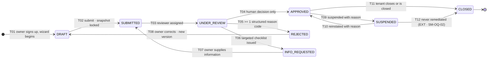

### 7.1 Table A — legality

| Id | From | To | Trigger | Actor | Guards |
| :--- | :--- | :--- | :--- | :--- | :--- |
| `SM-APP-T01` | — | `DRAFT` | Owner completes signup | `MEMBER` (becomes `GYM_OWNER`) | Email **and** phone verification initiated; a `tenants` row exists in `PENDING` |
| `SM-APP-T02` | `DRAFT` | `SUBMITTED` | `FR-ONB-07` submit | `TENANT_STAFF` (`GYM_OWNER`) | Completeness gate: verified owner email and phone, complete **India** KYC set — PAN, business registration, Shop & Establishment, bank proof, owner identity, premises address proof (`LAUNCH_MARKET_INDIA.md` §6) — ≥ 1 published plan, ≥ 3 photographs, resolvable geo-location, stated operating hours (`BR-GYM-02`, else `APPLICATION_INCOMPLETE`); `snapshot jsonb` frozen; `precheck_results` persisted (`FR-ONB-12`) |
| `SM-APP-T03` | `SUBMITTED` | `UNDER_REVIEW` | Reviewer assignment (manual or round-robin) | `PLATFORM_STAFF` (`VERIFICATION_OFFICER`) | `assigned_to` set; the SLA clock starts |
| `SM-APP-T04` | `UNDER_REVIEW` | `APPROVED` | Officer approves | **`PLATFORM_STAFF` only** | `BR-GYM-03`: **no automated path exists** — the machine asserts `actor_type = PLATFORM_STAFF` and a non-null `decided_by`, and rejects `SYSTEM_JOB` with `GYM_APPROVAL_REQUIRES_HUMAN_ACTOR` (`INV-TRU-2`). A failed pre-check requires an explicit recorded override (`APPLICATION_PRECHECK_OVERRIDE_REQUIRED`, `AC-ONB-02.3`). Geo within tolerance of the geocoded address (`GEO_ADDRESS_MISMATCH`, `BR-GYM-08`); no other `APPROVED` gym at the normalised address (`DUPLICATE_APPROVED_ADDRESS`, `BR-GYM-09`) |
| `SM-APP-T05` | `UNDER_REVIEW` | `REJECTED` | Officer rejects | `PLATFORM_STAFF` | ≥ 1 code from the **16-value** rejection taxonomy (§15.2) plus optional free text; both shown to the owner (`BR-GYM-04`, else `REJECTION_REASON_REQUIRED`) |
| `SM-APP-T06` | `UNDER_REVIEW` | `INFO_REQUESTED` | Officer issues a targeted checklist | `PLATFORM_STAFF` | ≥ 1 named missing item; the SLA clock pauses |
| `SM-APP-T07` | `INFO_REQUESTED` | `SUBMITTED` | Owner supplies the information | `TENANT_STAFF` | The requested items are present; the snapshot is re-frozen; the SLA clock resumes |
| `SM-APP-T08` | `REJECTED` | `DRAFT` | Owner corrects and resubmits | `TENANT_STAFF` | Unlimited resubmissions (`BR-GYM-05`); a **new `applications` row** with `version + 1`; the prior version is retained with a field-level diff (`AC-ONB-01.3`) |
| `SM-TEN-T09` | `APPROVED` | `SUSPENDED` | Super Admin suspends | `PLATFORM_STAFF` (`SUPER_ADMIN`) | Reason mandatory (`ADMIN_ACTION_REASON_REQUIRED`); `TENANT_ALREADY_SUSPENDED` if repeated |
| `SM-TEN-T10` | `SUSPENDED` | `APPROVED` | Reinstated | `PLATFORM_STAFF` (`SUPER_ADMIN`) | Reason mandatory; the listing returns to search within 60 s (`BAC-02`) |
| `SM-TEN-T11` | `APPROVED` | `CLOSED` | Owner closes, or the platform closes for cause | `TENANT_STAFF` / `PLATFORM_STAFF` | Soft delete only (`BR-TEN-04`); affected members notified within 24 h and unconsumed prepaid value made refund-eligible (`BR-MEM-14`, `BR-REF-07`) |
| `SM-TEN-T12` **EXT** | `SUSPENDED` | `CLOSED` | Suspension never remediated | `PLATFORM_STAFF` | As T11. **Extension beyond the `C4.4` diagram**, which shows closure only from `APPROVED`; without it a suspended tenant has no terminal state (§17.2, `SM-OQ-02`) |

### 7.2 The three-column decomposition

| Composite state | `applications.status` | `tenants.status` | `gyms.status` | Marketplace visible? |
| :--- | :--- | :--- | :--- | :---: |
| `DRAFT` | `DRAFT` | `PENDING` | `DRAFT` | No |
| `SUBMITTED` | `SUBMITTED` | `PENDING` | `PENDING_REVIEW` | No |
| `UNDER_REVIEW` | `UNDER_REVIEW` | `PENDING` | `PENDING_REVIEW` | No |
| `INFO_REQUESTED` | `INFO_REQUESTED` | `PENDING` | `PENDING_REVIEW` | No |
| `REJECTED` | `REJECTED` | `PENDING` | `REJECTED` | No |
| `APPROVED` | `APPROVED` (frozen) | `APPROVED` | `APPROVED` | **Yes**, if ≥ 1 published public plan |
| `SUSPENDED` | `APPROVED` (unchanged) | `SUSPENDED` | `APPROVED` (unchanged) | No |
| `CLOSED` | `APPROVED` (unchanged) | `CLOSED` | `CLOSED` | No |

Two consequences fall out of this table and matter enormously:

1. **Suspension does not un-approve anything.** `tenants.status` changes; the application version and
   the gym record do not. `INV-TEN-4`: a suspended tenant vanishes from search *and* its existing
   `ACTIVE` memberships continue to permit check-in until natural expiry (`BR-TEN-05`). The check-in
   machine reads the tenant status only to deny **new** purchases, never to deny entry.
2. **Visibility is a derived function, never a stored flag.**
   `visible = (tenants.status = APPROVED) ∧ (gyms.status = APPROVED) ∧ (published public plans ≥ 1)`
   (`INV-TRU-1`, `FR-SRCH-09`). `discovery/` maintains a projection of it, updated by the
   `gym.approved` / `gym.suspended` outbox handlers within 60 seconds (`BAC-02`).

### 7.3 The material-change sub-machine (`BR-GYM-06`)

An approved gym that edits a **material** field does not leave `APPROVED`. Instead, those fields
enter a field-scoped review while the listing stays live:

| Change | Effect | Listing | Payouts |
| :--- | :--- | :---: | :---: |
| Legal name · address · geo-location · ownership | Those fields → `PENDING_REVIEW`; previous values keep rendering | Live | Unaffected |
| **Bank account** | Field → `PENDING_REVIEW` **and payouts suspend until re-verified** | Live | **Suspended** (`PAYOUT_ACCOUNT_UNVERIFIED`) |
| Photos · description · amenities · timings · plan pricing | Publishes immediately, subject to automated content screening (`BR-GYM-07`) | Live | Unaffected |

This is deliberately **not** a state on the gym. Making it one would take an approved, trading gym
off the marketplace for a typo in its description, which is the exact behaviour `BR-GYM-06` was
written to prevent.

### 7.4 Invariants, illegal transitions, terminals

**Invariants.** (i) `INV-TRU-2` — every `APPROVED` carries a human `decided_by`; a null one is a
constraint violation, not a warning. (ii) Every `REJECTED` carries ≥ 1 reason code
(`reason_codes[]` non-empty `CHECK`). (iii) Application versions are append-only: a resubmission
creates a row, never updates one (`BR-GYM-05`). (iv) At most one `APPROVED` gym per normalised
physical address, enforced by a **partial unique index** (`BR-GYM-09`). (v) A `CLOSED` tenant retains
every financial, invoice and audit record (`INV-TEN-6`, `BR-TEN-04`). (vi) `applications.snapshot` is
immutable once submitted.

| Id | Illegal edge | Why | Behaviour |
| :--- | :--- | :--- | :--- |
| `SM-APP-X01` | `DRAFT → APPROVED` | Skips human review; `RSK-01` (fake gyms) is the top-scoring risk in the register | `403 GYM_APPROVAL_REQUIRES_HUMAN_ACTOR` |
| `SM-APP-X02` | `SUBMITTED → APPROVED` | Skips assignment, so no officer is accountable | `422 INVALID_APPLICATION_TRANSITION` |
| `SM-APP-X03` | `→ APPROVED` by `SYSTEM_JOB` or `OUTBOX_HANDLER` | `BR-GYM-03`, `INV-TRU-2` | `403` + **security alert** — an automated approval attempt is an incident |
| `SM-APP-X04` | `REJECTED → APPROVED` | Approval must review the corrected version, not the rejected one | `422 INVALID_APPLICATION_TRANSITION` |
| `SM-APP-X05` | `APPROVED → UNDER_REVIEW` (whole application) | Re-review is field-scoped (§7.3); returning the whole listing to review would delist a trading gym | `422 INVALID_APPLICATION_TRANSITION` |
| `SM-TEN-X06` | `CLOSED → *` (all) | Terminal | `422 INVALID_TENANT_TRANSITION` |
| `SM-TEN-X07` | `SUSPENDED → SUSPENDED` | Self-edge | `409 TENANT_ALREADY_SUSPENDED` |
| `SM-APP-X08` | `INFO_REQUESTED → APPROVED` | The requested information was never supplied | `422 APPLICATION_INCOMPLETE` |

**Terminal states.** `CLOSED` is the only terminal state, and it is terminal because reopening a
closed tenant would re-attach a settled financial history, a released reserve and an archived
invoice sequence to a live business; a returning owner signs up again and is a new tenant.
`REJECTED` and `APPROVED` are terminal **for that application version** — the version is an
immutable record of one decision — while the tenant continues.

### 7.5 Concurrency, recovery, jobs, tests

| Race | Resolution |
| :--- | :--- |
| `SM-APP-C01` — two officers approving the same application | **C-1** on `status = 'UNDER_REVIEW'`; the second sees `APPROVED` and is shown the decision and its author rather than an error |
| `SM-APP-C02` — owner resubmits while an officer is deciding | **C-2** on the application row for the decision transaction. The officer's decision lands on the version they reviewed; the resubmission creates `version + 1` and re-enters the queue. Reviewing a stale version is impossible because the snapshot is frozen at T02 |
| `SM-APP-C03` — two applications approving at the same physical address | The partial unique index rejects the second at commit; the officer sees `DUPLICATE_APPROVED_ADDRESS` and the possible-duplicate panel (`BR-GYM-09`) |
| `SM-TEN-C04` — suspension racing a member purchase | **C-2** on the tenant row in the order transaction. Suspension wins → `TENANT_SUSPENDED` at checkout. Purchase wins → the membership exists and, per `INV-TEN-4`, keeps working |

| Symptom | Move |
| :--- | :--- |
| `SUBMITTED` beyond the review SLA | The *Application awaiting review > SLA* notification already fires to the Verification Officer (Operational). Escalate by reassigning `assigned_to` |
| `APPROVED` but invisible in search | The `gym.approved` outbox handler did not drain, or no published **public** plan exists (`INV-TRU-1`). Check the outbox dead-letter, then the plan visibility — `STAFF_ONLY` plans never make a gym visible (`BR-PLN-05`, `INV-TRU-8`) |
| Suspended tenant's members cannot check in | **A defect against `INV-TEN-4`/`BR-TEN-05`** and a paging alert; the check-in machine must not read tenant status for entry |
| Approval recorded with a null `decided_by` | An `INV-TRU-2` breach. Freeze the listing, audit the code path, and treat as a security incident |

**`§C5` jobs.** None drives an application edge — approval is human by law (`BR-GYM-03`). Two jobs
touch this machine's neighbourhood: `subscription.charge` (daily) applies the `BR-TEN-06` `PAST_DUE`
ladder — visibility lost at 7 days, dashboard writes lost at 14 days, **check-in never blocked**
(`INV-TEN-5`) — and `gym.freshness-score` (nightly) recomputes listing freshness for ranking.

**Tests.** `SM-APP-T01-P1` … `SM-APP-T08-P1`, `SM-TEN-T09-P1` … `SM-TEN-T12-P1` · negatives
`SM-APP-T02-N1` (incomplete KYC), `SM-APP-T04-N1` (**automated approval refused**), `-N2` (geo
mismatch), `-N3` (duplicate address), `SM-APP-T05-N1` (no reason code) · illegal `SM-APP-X01` …
`X08` · concurrency `SM-APP-C01` … `C04` · related `E2E-01`, `BAC-01`, `BAC-02`, `BR-GYM-03-N1/N2`,
`BR-TEN-05-P1/N1`.

---

## 8. Machine 5 — Refund (`C4.5`)

**Owner** `refunds/` · **Column** `refunds.status` · **Governing rules** `BR-REF-01` … `BR-REF-09`,
`BR-FIN-01`, `BR-FIN-05`, `INV-FIN-12`, `INV-FIN-13`

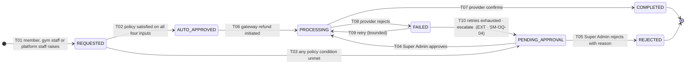

> **Interpretation note.** `ENGINEERING_PLAN.md` §7.5 draws `PENDING_APPROVAL → AUTO_APPROVED`, which
> would label a human decision "auto". The `C4.5` diagram in the PRD joins `PENDING_APPROVAL` into
> the `PROCESSING` arrow, and that is what is built (T04). `AUTO_APPROVED` is reserved for the
> policy-driven path so that **approval mode stays legible on the record** — a `refunds` row shows at
> a glance whether a human approved it, which is exactly what `BR-REF-03` and the `BR-FIN-08`
> dual-approval posture need. `approver_id` is null on the T02 path and non-null on the T04 path.

### 8.1 Table A — legality

| Id | From | To | Trigger | Actor | Guards |
| :--- | :--- | :--- | :--- | :--- | :--- |
| `SM-REF-T01` | — | `REQUESTED` | Refund raised (`FR-RFND-01`) | `MEMBER` / `TENANT_STAFF` / `PLATFORM_STAFF` | Order is `PAID` or `PARTIALLY_PAID` (`REFUND_ON_UNPAID_ORDER` otherwise); order not already refunded (`REFUND_ALREADY_PROCESSED`, `BR-REF-09`); reason code from the **10-value** taxonomy (§15.3, `REFUND_REASON_REQUIRED`); amount ≤ paid (`REFUND_EXCEEDS_PAID_AMOUNT`); **the policy read is the order's snapshot, never the tenant's current policy** (`BR-REF-02`) |
| `SM-REF-T02` | `REQUESTED` | `AUTO_APPROVED` | `RefundApprovalPolicy` returns auto | `SYSTEM_JOB` (policy evaluation inside the request) | **All four** must hold (`BR-REF-03`, `BR-REF-06`): within the snapshot's no-questions window; requested amount below the value threshold; recorded check-ins below the usage threshold; reason code not in the manual-review set (`FRAUD`, `PRICING_ERROR`) |
| `SM-REF-T03` | `REQUESTED` | `PENDING_APPROVAL` | Any of the four fails | `SYSTEM_JOB` | The failing condition is recorded in `computation jsonb` and shown to all parties (`FR-RFND-04`) |
| `SM-REF-T04` | `PENDING_APPROVAL` | `PROCESSING` | Super Admin approves | `PLATFORM_STAFF` (`SUPER_ADMIN`) ⨂ | `@RequiredPermission('refunds.refund.approve')`; `approver_id` non-null; `approved_amount_minor` set (may differ from requested, with the difference explained); a `CHECK` enforces `status <> 'PROCESSING' OR approver_id IS NOT NULL OR auto_approved` |
| `SM-REF-T05` | `PENDING_APPROVAL` | `REJECTED` | Super Admin rejects | `PLATFORM_STAFF` | Reason mandatory and shown to the requester |
| `SM-REF-T06` | `AUTO_APPROVED` | `PROCESSING` | Gateway refund initiated | `SYSTEM_JOB` | **Original instrument only** (`BR-REF-04`, `INV-FIN-12`, else `REFUND_INSTRUMENT_UNAVAILABLE`); provider refund call carries an idempotency key derived from `refund_id` |
| `SM-REF-T07` | `PROCESSING` | `COMPLETED` | Provider confirms | `PROVIDER_WEBHOOK` | `provider_refund_id` recorded; **all side effects land in one transaction** (Table B) |
| `SM-REF-T08` | `PROCESSING` | `FAILED` | Provider rejects | `PROVIDER_WEBHOOK` | Failure code stored verbatim; no ledger entry is written on failure |
| `SM-REF-T09` | `FAILED` | `PROCESSING` | Bounded retry | `SYSTEM_JOB` | Failure code retryable; attempt count below the cap |
| `SM-REF-T10` **EXT** | `FAILED` | `PENDING_APPROVAL` | Retries exhausted | `SYSTEM_JOB` | Escalation so a failed refund never sits unattended. Mirrors `SM-SET-T10` in the settlement machine (§17.2, `SM-OQ-04`) |

### 8.2 Table B — completeness

| Id | Side effects | Events emitted | Audit record | Notification |
| :--- | :--- | :--- | :--- | :--- |
| `SM-REF-T01` | `refunds` row with `computation jsonb` showing the pro-rata arithmetic in paise (`FR-RFND-04`) | `refund.requested` | `audit_log(action=refund_requested, reason_code)` | *Refund initiated* (Transactional) to the member |
| `SM-REF-T02` | — | `refund.approved` | `audit_log(action=refund_auto_approved, before=computation)` | — |
| `SM-REF-T03` | Queued to the Super Admin console | `refund.pending-approval` | `audit_log(action=refund_routed_for_approval, reason=<failing condition>)` | *Refund awaiting approval* (Operational, In-app + Email) to Finance |
| `SM-REF-T04` ⨂ | — | `refund.approved` | `audit_log(action=refund_approved, actor_id=approver)` | — |
| `SM-REF-T05` | — | `refund.rejected` | `audit_log(action=refund_rejected, reason)` | *Refund rejected* (Transactional) with the reason |
| `SM-REF-T06` ⨂ | Gateway refund call through the `PaymentProvider` port | `refund.processing` | `audit_log(action=refund_initiated)` | — |
| `SM-REF-T07` ⨂ | **Six effects, one transaction:** (1) credit note issued in its own sequence (`FR-INV-09`, `INV-FIN-9`); (2) `REFUND` ledger entry; (3) proportional `COMMISSION_REVERSAL` (`BR-REF-05`); (4) gateway fee reversed **only** to the extent the provider reverses it, the non-reversed remainder shown explicitly on the statement (`BR-REF-05`, `INV-FIN-8`); (5) membership → `REFUNDED` (full) or adjusted (partial), QR revoked (`FR-RFND-06`); (6) payment → `REFUNDED` / `PARTIALLY_REFUNDED` | `refund.completed` (payload carries `commission_reversal_minor`) | `audit_log(action=refund_completed)`; `membership_events`; `payment_events`; `ledger_entries` | *Refund completed* (Transactional, Email + In-app) with the credit note |
| `SM-REF-T08` | None — **no partial ledger writes ever exist**; the transaction either lands whole or not at all | `refund.failed` | `audit_log(action=refund_failed, reason=<provider code>)` | *Refund failed* (Transactional) to member and Finance |
| `SM-REF-T09` | New provider call, same idempotency key | `refund.processing` | `audit_log(action=refund_retried, attempt)` | — |
| `SM-REF-T10` | Returned to the Finance queue | `refund.pending-approval` | `audit_log(action=refund_escalated)` | *Refund awaiting approval* (Operational) to Finance |

### 8.3 Invariants, illegal transitions, terminals

**Invariants.** (i) Refunding an already-refunded order is a **no-op returning the original result**
(`INV-FIN-13`, `BR-REF-09`) — idempotent on the *order*, not merely on the refund. (ii) The refund is
issued to the original instrument only (`INV-FIN-12`). (iii) `approved_amount_minor ≤` paid amount.
(iv) No edge exists from `REQUESTED` straight to `PROCESSING` — every refund passes through an
approval state, automatic or human (`BusinessRules.md` `BR-REF-03`). (v) Commission reversal is
**proportional** to the refunded value and uses the rate effective at the moment of sale, never the
current rate (`BR-FIN-05`, `INV-FIN-5`). (vi) The policy applied is always the order's snapshot.

| Id | Illegal edge | Why | Behaviour |
| :--- | :--- | :--- | :--- |
| `SM-REF-X01` | `REQUESTED → PROCESSING` | Bypasses approval — the whole point of the machine | `422 REFUND_REQUIRES_APPROVAL` |
| `SM-REF-X02` | `REQUESTED → COMPLETED` | Would write ledger reversals with no gateway movement, breaking `INV-FIN-7` | `422 INVALID_REFUND_TRANSITION` |
| `SM-REF-X03` | `REJECTED → *` (all) | Terminal. A rejected refund that should be paid is a **new** request with a new reason | `422 INVALID_REFUND_TRANSITION` |
| `SM-REF-X04` | `COMPLETED → *` (all) | Terminal; money returned | `422 REFUND_ALREADY_PROCESSED` |
| `SM-REF-X05` | `AUTO_APPROVED → REJECTED` | Policy already approved it; reversing that decision undermines `BR-REF-03`'s promise to the member | `422 INVALID_REFUND_TRANSITION` |
| `SM-REF-X06` | `PENDING_APPROVAL → PROCESSING` where `approver_id IS NULL` | A `CHECK` constraint refuses it at the database | `409 RESOURCE_VERSION_CONFLICT` at the app tier; the constraint is authoritative |
| `SM-REF-X07` | Approval by `TENANT_STAFF` | Approval is Super Admin only (`BR-REF-03`) — the gym cannot approve refunds against its own balance | `403 PERMISSION_DENIED` |
| `SM-REF-X08` | Any money-moving edge under impersonation | `INV-DAT-5` | `403 IMPERSONATION_FORBIDS_FINANCIAL_MUTATION` |

**Terminal states.** `COMPLETED` — the money is at the provider and the reversal is in the ledger;
`ledger_entries` has **no `UPDATE` or `DELETE` grant** for the application role, so there is
literally no state after it. `REJECTED` — the decision and its reason are the permanent record; a
changed mind is a new request, which keeps the decision history intact for `KPI-21` analysis.

### 8.4 Concurrency, recovery, jobs, tests

| Race | Resolution |
| :--- | :--- |
| `SM-REF-C01` — member and gym staff both raise a refund on one order | **C-2** on the order row in T01. The second request finds an open refund and returns it rather than creating a duplicate; if the first already completed, `REFUND_ALREADY_PROCESSED` |
| `SM-REF-C02` — two Super Admins approving the same refund | **C-1** on `status = 'PENDING_APPROVAL'`; the second sees `PROCESSING` and the first approver's identity |
| `SM-REF-C03` — refund completion racing membership expiry | Resolved by the `C4.1` design: T14 `EXPIRED → REFUNDED` exists, so order does not matter (§4.6 `SM-MEM-C05`) |
| `SM-REF-C04` — refund completion racing settlement batch close | **C-3** advisory lock on `(settlement, tenant_id, period)`. Either the reversal lands inside the batch, or the batch closes and the reversal appears as a **negative line in the next batch** (`FR-SETL-03`). Both outcomes satisfy `INV-FIN-6`; what is forbidden is a half-included reversal |
| `SM-REF-C05` — duplicate refund webhook | `provider_refund_id` unique; the second is a no-op |

| Symptom | Move |
| :--- | :--- |
| `PROCESSING` beyond the provider window | Poll the provider through the port; apply the terminal state idempotently. Still indeterminate → Finance, with the payment and refund event lists attached |
| `PENDING_APPROVAL` past the approval SLA | The *Refund awaiting approval* notification repeats on the Finance digest; the console sorts by age |
| `COMPLETED` with no credit note or no ledger reversal | An **L3 violation** — the six effects were not in one transaction. Paging severity: the tenant's balance is now wrong. Fix the code; the missing rows are then appended by a one-off reconciliation job that is itself idempotent |
| Refund completed but membership still `ACTIVE` | The `refund.completed` outbox event did not drain. Re-drive it from Bull Board; the handler is idempotent |

**`§C5` jobs.** `payment.duplicate-detect` (every 15 min) originates automatic duplicate refunds
(`BR-PAY-07`) and drives T01→T02→T06 without a human. `settlement.reconcile` (daily 04:00) surfaces
any refund whose ledger effect does not tie out. `reserve.release` (daily) releases matured reserve
that exists precisely to cover these reversals (`A6.4`, default 5% released after 30 days).

**Tests.** `SM-REF-T01-P1` … `SM-REF-T10-P1` · negatives `SM-REF-T02-N1` (usage above threshold →
routes to `PENDING_APPROVAL`), `-N2` (outside the snapshot window), `SM-REF-T06-N1` (**alternate
instrument refused**), `SM-REF-T07-N1` (partial transaction failure leaves **zero** rows) · illegal
`SM-REF-X01` … `X08` · concurrency `SM-REF-C01` … `C05` · related `E2E-07`, `E2E-08`, `BAC-08`,
`BR-REF-03-P1/N1`, `BR-REF-09-P1/N1`.

---

## 9. Machine 6 — Review (`C4.6`)

**Owner** `reviews/` · **Column** `reviews.status` · **Governing rules** `BR-REV-01` … `BR-REV-07`,
`INV-TRU-3` … `INV-TRU-6`

> **Naming reconciliation — `SM-OQ-05`.** `C4.6` names the entry state `SUBMITTED`; the `C2.2`
> `reviews.status` enum lists `PENDING`. They are the same state. **`SUBMITTED` is adopted** as the
> enum label in `packages/types/src/enums/review-status.ts`, the Postgres enum and the wire format,
> because `C4.6` is the state-machine authority and `FolderStructure.md` §11 requires the TypeScript
> enum to match the PRD string verbatim. `C2.2`'s `PENDING` is recorded as the earlier name.

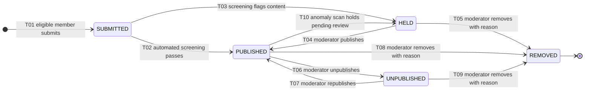

### 9.1 Table A — legality

| Id | From | To | Trigger | Actor | Guards |
| :--- | :--- | :--- | :--- | :--- | :--- |
| `SM-REV-T01` | — | `SUBMITTED` | `POST /v1/gyms/:id/reviews` | `MEMBER` | **≥ 1 recorded attendance** at that gym, computed server-side against `attendance/` synchronously (`BR-REV-01`, `INV-TRU-3`, else `403 REVIEW_REQUIRES_CHECK_IN`); one review per member per gym **per membership term** (`REVIEW_ALREADY_SUBMITTED_FOR_TERM`, `BR-REV-02`); rating 1–5; body passes length and sanitiser limits |
| `SM-REV-T02` | `SUBMITTED` | `PUBLISHED` | Automated screening passes | `SYSTEM_JOB` | Clean on profanity, contact details, URLs and competitor solicitation (`FR-REV-03`); **no edge exists from `SUBMITTED` straight to `PUBLISHED` that bypasses screening** (`BR-REV-04`) |
| `SM-REV-T03` | `SUBMITTED` | `HELD` | Screening flags | `SYSTEM_JOB` | `screening_result jsonb` retained for appeal; the review is excluded from the aggregate while held |
| `SM-REV-T04` | `HELD` | `PUBLISHED` | Moderator publishes | `PLATFORM_STAFF` (`MODERATOR`) | Decision reason recorded (`MODERATION_DECISION_REASON_REQUIRED`) |
| `SM-REV-T05` | `HELD` | `REMOVED` | Moderator removes | `PLATFORM_STAFF` | ≥ 1 code from the **9-value** moderation taxonomy (§15.4) |
| `SM-REV-T06` | `PUBLISHED` | `UNPUBLISHED` | Moderator unpublishes | `PLATFORM_STAFF` | Reason required. Also the automatic path for content requiring immediate hiding — personal data or threats (`BR-REV-06`) |
| `SM-REV-T07` | `UNPUBLISHED` | `PUBLISHED` | Moderator republishes | `PLATFORM_STAFF` | Reason required |
| `SM-REV-T08` | `PUBLISHED` | `REMOVED` | Moderator removes | `PLATFORM_STAFF` | ≥ 1 moderation reason code |
| `SM-REV-T09` | `UNPUBLISHED` | `REMOVED` | Moderator removes | `PLATFORM_STAFF` | As T08 |
| `SM-REV-T10` | `PUBLISHED` | `HELD` | `review.anomaly-scan` detects velocity, account-age or text-clustering anomaly | `SYSTEM_JOB` | The review is excluded from the aggregate until cleared (`FR-REV-09`, `AC-REV-02.2`) |

### 9.2 Table B — completeness

| Id | Side effects | Events emitted | Audit record | Notification |
| :--- | :--- | :--- | :--- | :--- |
| `SM-REV-T01` | `reviews` row with `membership_id` fixing the term; analytics `review_submitted` | `review.submitted` | `audit_log(action=review_submitted)` | — |
| `SM-REV-T02` | Gym rating aggregate recomputed within 60 s (`AC-REV-02.3`); "Verified member" marker attached (`INV-TRU-5`); search projection refreshed | `review.published`, `gym.rating-recomputed` | `audit_log(action=review_published, actor_type=SYSTEM_JOB)` | *New review received* (Operational, In-app + Email) to the owner |
| `SM-REV-T03` | Queued to moderation; excluded from the aggregate | `review.held` | `audit_log(action=review_held, screening_result)` | *Moderation queue over threshold* (Operational) to Moderator when the queue crosses its threshold |
| `SM-REV-T04` | Aggregate recomputed; marker attached | `review.published`, `gym.rating-recomputed` | `audit_log(action=review_published, actor_id, reason)` | *New review received* to the owner |
| `SM-REV-T05` | Aggregate recomputed **excluding** it | `review.removed`, `gym.rating-recomputed` | `audit_log(action=review_removed, reason_codes)` | Removal notice to the author (Transactional) |
| `SM-REV-T06` | Aggregate recomputed excluding it; the gym's response, if any, is hidden with it | `review.unpublished`, `gym.rating-recomputed` | `audit_log(action=review_unpublished, reason)` | Notice to the author |
| `SM-REV-T07` | Aggregate recomputed including it | `review.published`, `gym.rating-recomputed` | `audit_log(action=review_republished, reason)` | Notice to the author |
| `SM-REV-T08` / `T09` | As T05 | `review.removed`, `gym.rating-recomputed` | `audit_log(action=review_removed, reason_codes)` | Notice to the author |
| `SM-REV-T10` | Excluded from the aggregate pending review | `review.held` | `audit_log(action=review_held_by_anomaly_scan, signals)` | *Moderation queue over threshold* (Operational) |

### 9.3 Invariants, illegal transitions, terminals

**Invariants.** (i) A review exists only where ≥ 1 attendance record exists for that user at that
gym (`INV-TRU-3`) — checked at T01 and never re-checked, because attendance is append-only and
cannot be un-recorded (`INV-CHK-4`). (ii) Every `PUBLISHED` review carries the "Verified member"
marker; there is no unverified review type (`INV-TRU-5`, `BR-REV-03`). (iii) The displayed rating is
the plain mean with the count and is **suppressed entirely below three reviews** (`INV-TRU-6`,
`BR-REV-07`); ranking may use a Bayesian adjustment, the displayed figure never does (`FR-REV-08`).
(iv) **No API or interface exists by which a gym can edit or delete a member's review**
(`INV-TRU-4`) — the gym may respond once (`BR-REV-05`) and report (`FR-REV-06`), and reporting never
changes state. (v) Member edits are permitted for 7 days and **append** to `edit_history`, never
overwrite (`BR-REV-02`, `REVIEW_EDIT_WINDOW_CLOSED` after). (vi) Only `PUBLISHED` reviews contribute
to the aggregate.

| Id | Illegal edge | Why | Behaviour |
| :--- | :--- | :--- | :--- |
| `SM-REV-X01` | `SUBMITTED → PUBLISHED` bypassing screening | `BR-REV-04`; the screening call is inside the transition, not beside it | `422 INVALID_REVIEW_TRANSITION` |
| `SM-REV-X02` | `REMOVED → *` (all) | Terminal | `422 INVALID_REVIEW_TRANSITION` |
| `SM-REV-X03` | Any transition with actor `TENANT_STAFF` | `INV-TRU-4` — the defining trust property of the marketplace | `403 PERMISSION_DENIED` + **audited as an attempted trust breach** |
| `SM-REV-X04` | `SUBMITTED → UNPUBLISHED` | Nothing was published; the correct state is `HELD` | `422 INVALID_REVIEW_TRANSITION` |
| `SM-REV-X05` | `HELD → UNPUBLISHED` | Same reason | `422 INVALID_REVIEW_TRANSITION` |
| `SM-REV-X06` | A second review for the same membership term | `BR-REV-02` unique constraint on `(user_id, gym_id, membership_id)` | `409 REVIEW_ALREADY_SUBMITTED_FOR_TERM` |
| `SM-REV-X07` | Editing a `HELD` or `REMOVED` review | Content under moderation must not move beneath the moderator | `409 REVIEW_UNDER_MODERATION` |
| `SM-REV-X08` | Deleting a review by any actor | No delete path exists in the API surface at all | `404` — the route does not exist, which is the strongest possible statement |

**Terminal state.** `REMOVED` only, and it is terminal because removal is a moderation judgement on
record. A wrongly removed review is restored by asking the author to resubmit, which creates a new
row with a new timestamp — the aggregate then reflects a genuine, current opinion rather than a
resurrected one. `PUBLISHED` and `UNPUBLISHED` are deliberately **mutually reversible** (T06/T07),
because moderation reversibility is what makes `BR-REV-06`'s "stays published while under
moderation" safe to promise.

### 9.4 Concurrency, recovery, jobs, tests

| Race | Resolution |
| :--- | :--- |
| `SM-REV-C01` — moderator publishing while the anomaly scan holds (T04 vs T10) | **C-1**. If the scan wins, the moderator sees `HELD` with the new signals and decides again with better information. If the moderator wins, the scan finds `PUBLISHED` and applies T10 — a moderator decision does **not** immunise a review against a later signal |
| `SM-REV-C02` — two moderators acting on one review | **C-1**; the second sees the first's decision and its author |
| `SM-REV-C03` — many status changes to one gym's reviews at once | The aggregate is recomputed by the `review.aggregate` job (on change **plus** a nightly full rebuild), not inline. Concurrent recomputes are made safe by an advisory lock on `(review.aggregate, gym_id)` — **C-3** — and the nightly rebuild is the self-healing backstop |
| `SM-REV-C04` — member editing while a moderator holds | **C-2** on the review row; the edit fails with `REVIEW_UNDER_MODERATION` |

| Symptom | Move |
| :--- | :--- |
| Review `SUBMITTED` for longer than a screening cycle | The screening call failed. Its BullMQ job is visible in Bull Board; re-drive. Screening is deterministic, so a re-run is safe |
| Rating not matching published reviews | Run `review.aggregate` for the gym; the nightly rebuild would fix it anyway, which is why the nightly rebuild exists |
| Rating displayed with fewer than three reviews | An `INV-TRU-6` breach and a **trust defect**; the suppression is a rendering-layer guard **and** an API-layer guard, so a breach means both failed |
| Review present with no attendance | An `INV-TRU-3` breach — investigate as a possible eligibility bypass; the review is held, not deleted, pending investigation |

**`§C5` jobs.** `review.aggregate` (on change + nightly rebuild) recomputes the gym rating;
`review.anomaly-scan` (hourly) drives T10. Neither may publish — publication is either automated
screening (T02) or a moderator (T04).

**Tests.** `SM-REV-T01-P1` … `SM-REV-T10-P1` · negatives `SM-REV-T01-N1` (**no check-in → 403**),
`-N2` (second review in one term), `SM-REV-T02-N1` (profanity routes to `HELD`) · illegal
`SM-REV-X01` … `X08`, with `X03` and `X08` asserted against **every** review endpoint · concurrency
`SM-REV-C01` … `C04` · related `E2E-09`, `BAC-09`, `BR-REV-01-P1/N1`, `BR-REV-05-N1`.

---

## 10. Machine 7 — Settlement batch (`C4.7`)

**Owner** `settlements/` · **Column** `settlement_batches.status` · **Governing rules**
`BR-FIN-01` … `BR-FIN-08`, `BR-REF-08`, `A6.3`, `A6.4`

```mermaid
stateDiagram-v2
  direction LR
  [*] --> OPEN : T01 first eligible ledger entry of the cycle
  OPEN --> CLOSED   : T02 settlement.build-batches at cycle end
  OPEN --> ON_HOLD  : T03 variance or dispute hold
  CLOSED --> PENDING_APPROVAL : T04 statement generated
  CLOSED --> ON_HOLD          : T05 variance detected at close
  ON_HOLD --> PENDING_APPROVAL: T06 variance resolved
  PENDING_APPROVAL --> APPROVED : T07 finance approves (dual above threshold)
  PENDING_APPROVAL --> APPROVED : T08 auto-approved below tenant threshold
  APPROVED --> PROCESSING : T09 payout instruction sent
  PROCESSING --> PAID     : T10 provider confirms payout
  PROCESSING --> FAILED   : T11 bank rejection
  FAILED --> PENDING_APPROVAL : T12 corrected and requeued
  PAID --> [*]
```

### 10.1 Table A — legality

| Id | From | To | Trigger | Actor | Guards |
| :--- | :--- | :--- | :--- | :--- | :--- |
| `SM-SET-T01` | — | `OPEN` | First eligible ledger entry of the tenant's cycle | `SYSTEM_JOB` | Entry not already batched; `occurred_at` within the cycle; **gateway fee reported** (`BR-FIN-06`, else the line waits, `GATEWAY_FEE_NOT_REPORTED`) |
| `SM-SET-T02` | `OPEN` | `CLOSED` | `settlement.build-batches` at cycle end | `SYSTEM_JOB` | Not within the new-tenant 14-day hold (`A6.4`); `net_payable_minor ≥` the tenant's minimum payout — **below the minimum the batch stays `OPEN`** and rolls forward with the reason shown (`FR-SETL-05`, `BATCH_BELOW_MINIMUM_PAYOUT`); all eight `A6.3` figures persisted per line (`BR-FIN-02`) |
| `SM-SET-T03` | `OPEN` | `ON_HOLD` | Reconciliation variance, or a dispute opens | `SYSTEM_JOB` | `BR-FIN-07` blocks auto-payout for the affected tenant until resolved; `BR-REF-08` holds the disputed amount |
| `SM-SET-T04` | `CLOSED` | `PENDING_APPROVAL` | Statement generated (deterministic PDF, `FR-INV-07`) | `SYSTEM_JOB` | `INV-FIN-6` holds **exactly**: opening balance + gross − commission − fees − refunds − reserve held + reserve released = `net_payable_minor`, in paise, with no rounding slack |
| `SM-SET-T05` | `CLOSED` | `ON_HOLD` | Variance detected at close | `SYSTEM_JOB` | As T03 (`SETTLEMENT_BLOCKED_BY_VARIANCE`) |
| `SM-SET-T06` | `ON_HOLD` | `PENDING_APPROVAL` | Variance resolved | `PLATFORM_STAFF` (`FINANCE`) | Resolution recorded with a reason; the statement is regenerated |
| `SM-SET-T07` | `PENDING_APPROVAL` | `APPROVED` | Finance approves | `PLATFORM_STAFF` ⨂ | Above the configurable threshold, **two distinct approvers** — a `CHECK` enforces `approver_1_id <> approver_2_id` (`BR-FIN-08`, `PAYOUT_REQUIRES_DUAL_APPROVAL`); the second approval is a separate authenticated action with MFA (`NFR-SEC-11`); payout account verified (`PAYOUT_ACCOUNT_UNVERIFIED`) |
| `SM-SET-T08` | `PENDING_APPROVAL` | `APPROVED` | Auto-approval | `SYSTEM_JOB` | Auto-payout enabled **and** below the tenant threshold (`FR-SETL-06`); never above it, and never while any hold is open |
| `SM-SET-T09` | `APPROVED` | `PROCESSING` | Payout instruction sent to the provider | `SYSTEM_JOB` ⨂ | Idempotency key derived from `batch_id`; the instruction is sent once |
| `SM-SET-T10` | `PROCESSING` | `PAID` | Provider confirms payout | `PROVIDER_WEBHOOK` ⨂ | `payout_reference` recorded; `PAYOUT` ledger entry appended |
| `SM-SET-T11` | `PROCESSING` | `FAILED` | Bank rejection | `PROVIDER_WEBHOOK` | Rejection reason stored verbatim |
| `SM-SET-T12` | `FAILED` | `PENDING_APPROVAL` | Corrected and requeued | `PLATFORM_STAFF` | The correction (usually bank details) is recorded; approval is required again — a corrected payout is a new decision (`FR-SETL-08`) |

### 10.2 Table B, invariants, illegal transitions, terminals

| Id | Side effects | Events | Audit | Notification |
| :--- | :--- | :--- | :--- | :--- |
| `SM-SET-T01` | Batch row; `settlement_lines` accumulate with all eight figures denormalised | `settlement.opened` | `audit_log(action=batch_opened)` | — |
| `SM-SET-T02` | Figures frozen (`ERD.md`: immutable from lock); lines' `settlement_batch_id` set | `settlement.closed` | `audit_log(action=batch_closed)` | — |
| `SM-SET-T03` / `T05` | Auto-payout blocked for the tenant | `settlement.held` | `audit_log(action=batch_held, reason)` | *Reconciliation variance* (Operational, Email + Alert) to Finance |
| `SM-SET-T04` | Statement PDF rendered deterministically and stored | `settlement.pending-approval` | `audit_log(action=statement_generated)` | — |
| `SM-SET-T06` | Statement regenerated | `settlement.hold-released` | `audit_log(action=hold_released, reason)` | — |
| `SM-SET-T07` ⨂ | Both approver identities recorded on the audit row **and printed on the statement** | `settlement.approved` | `audit_log(action=batch_approved, approver_1, approver_2)` | — |
| `SM-SET-T08` | — | `settlement.approved` | `audit_log(action=batch_auto_approved)` | — |
| `SM-SET-T09` ⨂ | Provider payout instruction | `settlement.processing` | `audit_log(action=payout_instructed)` | — |
| `SM-SET-T10` ⨂ | `PAYOUT` ledger entry; balance carried forward | `settlement.paid` | `audit_log(action=payout_confirmed, payout_reference)` | *Payout initiated + statement* (Transactional, Email + In-app) to the owner |
| `SM-SET-T11` | No ledger entry — money did not move | `settlement.failed` | `audit_log(action=payout_failed, reason)` | Failure notice to **both** tenant and Finance (`FR-SETL-08`) |
| `SM-SET-T12` | Correction recorded | `settlement.pending-approval` | `audit_log(action=batch_requeued, correction)` | — |

**Invariants.** (i) `INV-FIN-6` — the statement's lines plus opening balance plus reserve lines plus
refund lines sum **exactly** to the payout, in paise. (ii) `INV-FIN-7` — every figure derives from
`ledger_entries`; no balance is stored mutably. (iii) `INV-FIN-5` — each line's commission rate is
the rate effective at the moment of that sale (10% standard, 5% from the second renewal per
`LAUNCH_MARKET_INDIA.md` §10), never the current rate. (iv) `INV-FIN-8` — an unreported gateway fee
holds the line out of the batch rather than estimating it. (v) A negative balance **carries forward**
and is recovered from subsequent batches (`FR-SETL-10`); it never becomes a debt collection event.
(vi) Refunds and chargebacks appear as **negative lines in the batch in which they are recognised**
(`FR-SETL-03`), never retro-applied to a closed batch.

| Id | Illegal edge | Why | Behaviour |
| :--- | :--- | :--- | :--- |
| `SM-SET-X01` | `OPEN → APPROVED` / `→ PROCESSING` | No statement exists, so `INV-FIN-6` is unverified | `422 BATCH_NOT_IN_APPROVABLE_STATE` |
| `SM-SET-X02` | `PENDING_APPROVAL → PROCESSING` | Approval is a distinct, audited act | `422 BATCH_NOT_IN_APPROVABLE_STATE` |
| `SM-SET-X03` | `PENDING_APPROVAL → APPROVED` above threshold with one approver | `BR-FIN-08`; a `CHECK` refuses it | `403 PAYOUT_REQUIRES_DUAL_APPROVAL` |
| `SM-SET-X04` | `→ APPROVED` where `approver_1_id = approver_2_id` | Self-dual-approval defeats the control | Database `CHECK` violation → `409` |
| `SM-SET-X05` | `PAID → *` (all) | Terminal; money has left the platform | `422 INVALID_SETTLEMENT_TRANSITION` |
| `SM-SET-X06` | `ON_HOLD → APPROVED` | Holds are released before approval, never through it | `422 SETTLEMENT_BLOCKED_BY_VARIANCE` |
| `SM-SET-X07` | Mutating a line in a `CLOSED` or later batch | Figures are immutable from lock; a correction is an **adjustment line in a later batch** | `422 LEDGER_ENTRY_IMMUTABLE` |
| `SM-SET-X08` | `FAILED → PROCESSING` | Retrying a payout without re-approval bypasses `BR-FIN-08` | `422 BATCH_NOT_IN_APPROVABLE_STATE` |

**Terminal state.** `PAID` only. It is terminal because a confirmed payout is an external fact:
funds are in the tenant's bank account and no platform state can undo them. Everything after a
payout — a refund, a chargeback, a correction — appears as a **new ledger entry in a later batch**,
which is precisely why `BR-FIN-01` makes the ledger append-only and why `ledger_entries` carries no
`UPDATE`/`DELETE` grant for the application role.

### 10.3 Concurrency, recovery, jobs, tests

| Race | Resolution |
| :--- | :--- |
| `SM-SET-C01` — a sale committing while the batch closes | **C-3** advisory lock on `(settlement, tenant_id, period)` for the whole assembly. A ledger entry committing after the lock is taken simply belongs to the next cycle — its `settlement_batch_id` is still null, and null is the queue |
| `SM-SET-C02` — a refund completing during close | §8.4 `SM-REF-C04`. Either inside the batch, or a negative line in the next one. Never half |
| `SM-SET-C03` — two Finance users approving concurrently | **C-1** for the first approval. The second approval is a **separate transition attempt** that must observe `approver_1_id` already set and different from itself; the `CHECK` is the final arbiter |
| `SM-SET-C04` — duplicate payout webhook | `payout_reference` unique; second delivery is a no-op |
| `SM-SET-C05` — `settlement.build-batches` running twice | ADR-0009 distributed lock **plus** the C-3 per-tenant advisory lock. Double payout is the single most expensive failure in the system and is therefore locked twice |

| Symptom | Move |
| :--- | :--- |
| `ON_HOLD` beyond one cycle | Finance console shows the variance and its source; `settlement.reconcile` output names the differing figures. Resolve, then T06 |
| `PROCESSING` with no provider confirmation | Poll the provider through the port. **Never re-instruct** — re-instruction risks a double payout; an unconfirmed instruction is investigated, not repeated |
| Statement that does not sum | An `INV-FIN-6` breach and a **release blocker**. The batch stays `PENDING_APPROVAL`; approval is impossible because the guard fails. `BAC-07` and `E2E-12` exist to catch this before production |
| Batch perpetually below the minimum | The roll-forward reason is shown to the tenant (`FR-SETL-05`); Finance may lower the minimum or pay out manually with a recorded reason |

**`§C5` jobs.** `settlement.build-batches` (daily 02:00) drives T01/T02; `settlement.reconcile`
(daily 04:00) compares the gateway report to the ledger and drives T03/T05; `reserve.release`
(daily) releases matured reserve, appearing as a positive line.

**Tests.** `SM-SET-T01-P1` … `SM-SET-T12-P1` · negatives `SM-SET-T02-N1` (unreported fee holds the
line out), `-N2` (below minimum rolls forward, stays `OPEN`), `SM-SET-T07-N1` (**single approver
above threshold refused**), `-N2` (same approver twice refused) · illegal `SM-SET-X01` … `X08` ·
concurrency `SM-SET-C01` … `C05` · related `E2E-12` (**zero variance**), `BAC-07`, `BR-FIN-03-P1`,
`BR-FIN-08-P1/N1`.

---

## 11. Machine 8 — Staff status (`FR-STAF-04`)

**Owner** `staff/` · **Column** `staff.status` (four labels) · **Governing rules** `FR-STAF-01` …
`FR-STAF-09`, `FR-RBAC-04`, `FR-RBAC-06`, `FR-RBAC-07`, `BR-DAT-01`

Not a `§C4` machine, but it governs **who may drive the other eight** and it holds one of the
platform's few genuinely irreversible operational guarantees: removal revokes access immediately
while preserving every historical attribution.

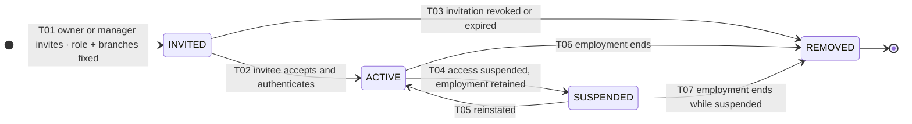

| Id | From | To | Trigger · Actor | Guards | Side effects · events · audit · notification |
| :--- | :--- | :--- | :--- | :--- | :--- |
| `SM-STF-T01` | — | `INVITED` | Invite · `TENANT_STAFF` (`GYM_OWNER`/`GYM_MANAGER`) | **Role and branch scope fixed at invitation** and immutable thereafter (`FR-RBAC-06`); seat limit for the subscription tier not exceeded (`STAFF_SEAT_LIMIT_REACHED`, `FR-STAF-06`); ≥ 1 branch assigned (`BRANCH_ASSIGNMENT_REQUIRED`) | `staff_branches` rows written; `staff.invited` event; `audit_log(action=staff_invited, after={role, branches})`; invitation email/SMS (Transactional) |
| `SM-STF-T02` | `INVITED` | `ACTIVE` | Acceptance · `TENANT_STAFF` (invitee) | Invitation not expired (`STAFF_INVITATION_EXPIRED`); not already accepted (`STAFF_INVITATION_ALREADY_ACCEPTED`); identity verified; MFA enrolled where the role requires it | `joined_at` set; permissions effective **within 60 s without re-authentication** (`FR-RBAC-04`); `staff.activated`; `audit_log(action=staff_activated)`; welcome notice |
| `SM-STF-T03` | `INVITED` | `REMOVED` | Revoke, or expiry sweep · `TENANT_STAFF` / `SYSTEM_JOB` | Reason recorded (`INVITATION_REVOKED` or `INVITATION_EXPIRED`) | Invitation token invalidated; `staff.removed`; `audit_log(action=staff_invitation_revoked, reason)`; no notification on expiry, revocation notice on revoke |
| `SM-STF-T04` | `ACTIVE` | `SUSPENDED` | Suspend · `TENANT_STAFF` (`GYM_OWNER`) / `PLATFORM_STAFF` | Not the **last `GYM_OWNER`** (`LAST_OWNER_CANNOT_BE_REMOVED`, `FR-RBAC-07`, `FR-STAF-09`); reason mandatory | **All sessions revoked within 60 s** (`FR-RBAC-04`); historical attribution untouched; `staff.suspended`; `audit_log(action=staff_suspended, reason)`; notice to the staff member |
| `SM-STF-T05` | `SUSPENDED` | `ACTIVE` | Reinstate · `TENANT_STAFF` / `PLATFORM_STAFF` | Seat limit re-checked — a seat may have been taken while suspended; reason recorded | Permissions restored within 60 s; `staff.activated`; `audit_log(action=staff_reinstated, reason)`; notice |
| `SM-STF-T06` | `ACTIVE` | `REMOVED` | Employment ends · `TENANT_STAFF` / `PLATFORM_STAFF` | Not the last `GYM_OWNER`; reason recorded | **Access revoked immediately**; `removed_at` set; **every historical attribution — check-ins performed, payments collected, members created, overrides used — remains attributed to them** (`FR-STAF-04`, `FR-STAF-05`, `AC-STAF-01.4`); `staff.removed`; `audit_log(action=staff_removed, reason)`; notice |
| `SM-STF-T07` | `SUSPENDED` | `REMOVED` | As T06, while suspended | As T06 | As T06 |

**Invariants.** (i) A tenant always has ≥ 1 `ACTIVE` `GYM_OWNER`; the last one can be neither
removed nor demoted (`FR-RBAC-07`) — enforced as a **use-case guard reading under `SELECT … FOR
UPDATE` on the tenant's owner set**, because a `CHECK` cannot express a cross-row cardinality.
(ii) `removed_at IS NOT NULL ⟺ status = 'REMOVED'`. (iii) Role and branch scope are immutable from
invitation; a change of either is a **new invitation**, never an edit (`FR-RBAC-06`). (iv) Staff
attributions are never anonymised or reassigned by a status change — `collected_by_staff_id` on a
two-year-old cash payment still resolves to the person who took the money. (v) Permission changes
take effect within 60 seconds without forcing re-authentication (`FR-RBAC-04`), which means the
permission cache TTL is a hard 60 s ceiling, not a tuning parameter.

| Id | Illegal edge | Why | Behaviour |
| :--- | :--- | :--- | :--- |
| `SM-STF-X01` | `REMOVED → *` (all) | Terminal. Re-hiring is a **new invitation** and a new `staff` row, so the two employments are separately auditable | `422 INVALID_STAFF_TRANSITION` |
| `SM-STF-X02` | `INVITED → SUSPENDED` | There is no access to suspend; revoke the invitation instead | `422 INVALID_STAFF_TRANSITION` |
| `SM-STF-X03` | `SUSPENDED → SUSPENDED` / `ACTIVE → ACTIVE` | Self-edges | `409 RESOURCE_VERSION_CONFLICT` |
| `SM-STF-X04` | Removing or demoting the last `GYM_OWNER` | `FR-RBAC-07` | `422 LAST_OWNER_CANNOT_BE_REMOVED` |
| `SM-STF-X05` | Any transition by a staff member on **themselves** to a higher privilege | Privilege escalation | `403 PERMISSION_DENIED` + security alert |
| `SM-STF-X06` | Editing `role` or branch scope in place | `FR-RBAC-06` | `422 INVALID_STAFF_TRANSITION` — the API exposes no such field on update |

**Terminal state.** `REMOVED`, because access revocation must be a one-way door: reinstating a
removed account would resurrect its sessions, its branch scope and its permission set atomically,
and `AC-STAF-01.4` promises that the next request after removal is refused. A returning employee is
invited again, which produces a second employment record — better history, not worse.

**Concurrency.** `SM-STF-C01`: two owners removing each other simultaneously — resolved by **C-2**
on the tenant's owner set inside each transaction, so exactly one succeeds and the other gets
`LAST_OWNER_CANNOT_BE_REMOVED`; without the lock, both could succeed and orphan the tenant.
`SM-STF-C02`: accepting an invitation twice — **C-1** on `status = 'INVITED'` →
`STAFF_INVITATION_ALREADY_ACCEPTED`. `SM-STF-C03`: seat limit racing two acceptances — **C-2** on
the tenant subscription row; the second gets `STAFF_SEAT_LIMIT_REACHED`.

**Recovery.** A staff member who cannot sign in but shows `ACTIVE` → the session revocation cache is
stale; the 60-second TTL resolves it, and a longer outage is a defect against `FR-RBAC-04`. A
removed staff member still able to act → **paging security incident**; revoke at the session store
directly, then audit. An orphaned tenant with zero `ACTIVE` owners → `FR-RBAC-07` was bypassed;
`PLATFORM_STAFF` promotes an existing manager with a recorded reason, and the bypass is treated as a
defect. **`§C5` job:** the invitation-expiry sweep runs inside `data.retention-sweep` (weekly) and
drives T03.

**Tests.** `SM-STF-T01-P1` … `SM-STF-T07-P1` · negatives `SM-STF-T01-N1` (seat limit),
`SM-STF-T04-N1` / `T06-N1` (**last owner refused**), `SM-STF-T02-N1` (expired invitation) · illegal
`SM-STF-X01` … `X06` · concurrency `SM-STF-C01` … `C03` · related `AC-STAF-01.2` (server-side
refusal, not UI hiding), `AC-STAF-01.4`, `E2E-10`.

---

## 12. Machine 9 — Dispute status (`FR-RFND-08`, `BR-REF-08`)

**Owner** `refunds/` · **Column** `disputes.status` · **Outcome** `disputes.outcome` (immutable once
set, `ERD.md`) · **Governing rules** `BR-REF-08`, `FR-RFND-08` … `FR-RFND-11`, `CON-03`, `KPI-21`

The PRD names the `disputes` table and its behaviour but does not enumerate its states. The five
below are derived strictly from `FR-RFND-08` (intake with an evidence deadline), `FR-RFND-09`
(evidence pack), `BR-REF-08` (hold from case opening), `AC-RFND-02.3` (favourable resolution
releases the hold) and the `CHARGEBACK_WON` / `CHARGEBACK_LOST` provider events already named in
`ENGINEERING_PLAN.md` §8. **`CON-03` governs the whole machine:** dispute windows and outcomes are
dictated by the gateway and the card networks, not by this platform, so every edge except T02 and
T03 is provider-driven.

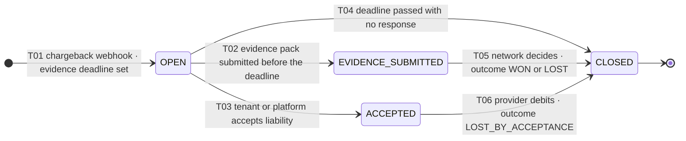

| Id | From → To | Trigger · Actor | Guards | Side effects · events · audit · notification |
| :--- | :--- | :--- | :--- | :--- |
| `SM-DSP-T01` | — → `OPEN` | Chargeback webhook · `PROVIDER_WEBHOOK` | Signature verified; `provider_dispute_id` unseen; the payment is `CAPTURED`; `disputes` is **1:N** from `payments` — a payment may be disputed more than once across its life (`ERD.md` §477) | **`BR-REF-08`: the disputed amount is held against the tenant balance immediately** — a `RESERVE_HOLD`-class entry referencing the dispute; `evidence_due_at` taken from the provider, never guessed (`CON-03`); evidence pack pre-assembled: order, invoice, payment record, **attendance records**, terms accepted, communication log (`FR-RFND-09`); `dispute.opened`; `audit_log(action=dispute_opened)`; notice to **both** Finance and the tenant, carrying the deadline (`AC-RFND-02.1`) |
| `SM-DSP-T02` | `OPEN` → `EVIDENCE_SUBMITTED` | Submit evidence · `PLATFORM_STAFF` / `TENANT_STAFF` | `now() < evidence_due_at` (`DISPUTE_EVIDENCE_DEADLINE_PASSED`); the checklist is complete (`DISPUTE_EVIDENCE_INCOMPLETE`); each artefact is **immutable once submitted** (`ERD.md` `dispute_evidence`) | Evidence transmitted through the `PaymentProvider` port; `dispute.evidence-submitted`; `audit_log(action=dispute_evidence_submitted, artefact_ids)`; confirmation to the tenant |
| `SM-DSP-T03` | `OPEN` → `ACCEPTED` | Accept liability · `PLATFORM_STAFF` / `TENANT_STAFF` | Reason mandatory; explicit confirmation that the hold becomes a permanent debit | `dispute.accepted`; `audit_log(action=dispute_liability_accepted, reason)`; notice to the tenant stating the settlement impact |
| `SM-DSP-T04` | `OPEN` → `CLOSED` | Deadline passes with no response · `SYSTEM_JOB` | `now() > evidence_due_at` and no evidence submitted | `outcome = LOST_NO_RESPONSE`; the hold converts to a `CHARGEBACK` ledger entry; `dispute.resolved`; `audit_log(action=dispute_closed_no_response)`; notice to tenant and Finance |
| `SM-DSP-T05` | `EVIDENCE_SUBMITTED` → `CLOSED` | Network decision · `PROVIDER_WEBHOOK` | Provider states `WON` or `LOST`; the outcome is **whatever the network says** and is not appealable in this system (`CON-03`) | **WON:** hold released, amount returns to the next settlement (`AC-RFND-02.3`), `CHARGEBACK_REVERSAL` entry. **LOST:** hold converts to a `CHARGEBACK` debit. Either way `dispute.resolved`; `audit_log(action=dispute_resolved, outcome)`; notice to tenant and Finance |
| `SM-DSP-T06` | `ACCEPTED` → `CLOSED` | Provider debits · `PROVIDER_WEBHOOK` | — | `outcome = LOST_BY_ACCEPTANCE`; `CHARGEBACK` ledger entry; `dispute.resolved`; audit; notice |

**Invariants.** (i) From T01 until closure the disputed amount is **held against the tenant balance**
and is excluded from any payout (`BR-REF-08`, `FR-RFND-10`) — a settlement batch containing an open
dispute cannot leave `ON_HOLD` for the disputed portion. (ii) `outcome` is set exactly once and is
immutable (`ERD.md`). (iii) `evidence_due_at` is provider-supplied, never computed by the platform.
(iv) Submitted evidence is immutable. (v) Dispute history is visible on the member record, the order
and the tenant's financial views (`FR-RFND-11`). (vi) The dispute rate feeds `KPI-21` (target
≤ 0.5%), so no dispute is ever deleted or closed without an outcome.

| Id | Illegal edge | Why | Behaviour |
| :--- | :--- | :--- | :--- |
| `SM-DSP-X01` | `CLOSED → *` (all) | Terminal; the network decided | `422 DISPUTE_ALREADY_RESOLVED` |
| `SM-DSP-X02` | `EVIDENCE_SUBMITTED → OPEN` | Evidence cannot be withdrawn | `422 INVALID_DISPUTE_TRANSITION` |
| `SM-DSP-X03` | `EVIDENCE_SUBMITTED → ACCEPTED` | Contesting and accepting are mutually exclusive positions | `422 INVALID_DISPUTE_TRANSITION` |
| `SM-DSP-X04` | Submitting evidence after `evidence_due_at` | `CON-03` | `422 DISPUTE_EVIDENCE_DEADLINE_PASSED` |
| `SM-DSP-X05` | `ACCEPTED → EVIDENCE_SUBMITTED` | Liability was accepted | `422 INVALID_DISPUTE_TRANSITION` |
| `SM-DSP-X06` | Releasing the hold before closure | `BR-REF-08` | `422 RESERVE_NOT_RELEASABLE_YET` |

**Terminal state.** `CLOSED` only, carrying one of four immutable outcomes — `WON`, `LOST`,
`LOST_NO_RESPONSE`, `LOST_BY_ACCEPTANCE`. It is terminal because the decision belongs to the card
network. A further reversal by the network arrives as a **new dispute row** on the same payment,
which is exactly why the relationship is 1:N.

**Concurrency.** `SM-DSP-C01`: resolution webhook racing the deadline job — **C-1** on
`status = 'EVIDENCE_SUBMITTED'` and `status = 'OPEN'` respectively, so only one closure lands; the
deadline job additionally re-reads and skips any dispute already `EVIDENCE_SUBMITTED`.
`SM-DSP-C02`: two operators submitting evidence — **C-1**; the second sees `EVIDENCE_SUBMITTED`.
`SM-DSP-C03`: dispute opening while a settlement batch closes — **C-3** on the settlement lock; the
hold either makes this batch or the next, never half (§8.4 `SM-REF-C04`).

**Recovery.** `OPEN` past `evidence_due_at` with the job not having run → run
`settlement.reconcile`'s dispute sweep; a dispute silently unclosed corrupts the tenant's held
balance. Hold present with the dispute `CLOSED WON` → the release did not drain; re-drive the
`dispute.resolved` handler, which is idempotent. Dispute with no evidence pack → `FR-RFND-09`
assembly failed; re-run it, and if attendance records are missing the pack is submitted without them
with the gap explicitly noted rather than silently.

**`§C5` jobs.** `settlement.reconcile` (daily 04:00) sweeps deadlines and drives T04, and blocks
payouts for tenants with open disputes (`BR-FIN-07`); `reserve.release` (daily) never releases
reserve covering an open dispute.

**Tests.** `SM-DSP-T01-P1` … `SM-DSP-T06-P1` · negatives `SM-DSP-T02-N1` (**after deadline**), `-N2`
(incomplete checklist), `SM-DSP-T01-N1` (hold not applied → the test asserts the tenant balance is
reduced immediately) · illegal `SM-DSP-X01` … `X06` · concurrency `SM-DSP-C01` … `C03` · related
`AC-RFND-02.1` … `AC-RFND-02.3`, `UAT-05`, `KPI-21`.

---

## 13. The implementation pattern for this codebase

### 13.1 The shared abstraction, and where it lives

Nine machines share **one** abstraction. It is a **pure, dependency-free transition table plus an
assertion function** — deliberately not a library, not XState, not a class hierarchy.

| Artefact | Location | Contents |
| :--- | :--- | :--- |
| The generic type | `packages/types/src/state-machine.ts` | `TransitionTable<S extends string>` = `Readonly<Record<S, readonly S[]>>`; `Transition<S>` = `{ from: S; to: S; id: string }` |
| The status enums | `packages/types/src/enums/*.ts` | One enum per machine, `SCREAMING_SNAKE_CASE`, matching the PRD string **verbatim** (`FolderStructure.md` §11) |
| The assertion helper | `packages/utils/src/state-machine/assert-transition.ts` | Zero runtime dependencies; throws a caller-supplied error factory |
| Each machine | `apps/server/src/<module>/domain/<name>-status.state-machine.ts` | The table, the guard functions, the terminal set, the transition ids |
| Each machine's spec | the same folder, `*.state-machine.spec.ts` | **Mandatory** per `FolderStructure.md` §778; held at 100% branch coverage |

**Why not a state-machine library.** Three reasons, and each is a rejection recorded here so it is
not re-litigated. (1) The tables are 6–12 edges; a library adds a dependency, a DSL and a debugging
layer to solve a problem an object literal already solves. (2) `ADR-0030` governs stack additions,
and no addition in `STACK_ADDITIONS.md` covers state charts — introducing one would need an ADR.
(3) The guards are **not pure predicates over the machine's own state**; they read plan snapshots,
gym timezones, ledger facts and provider truth, so they must be injected use-case-side anyway,
which is exactly the part a library would not help with.

`illustrative — not committed code`

```ts
// packages/utils/src/state-machine/assert-transition.ts — the whole abstraction.
export type TransitionTable<S extends string> = Readonly<Record<S, readonly S[]>>;

export function canTransition<S extends string>(t: TransitionTable<S>, from: S, to: S): boolean {
  return t[from].includes(to);
}

export function assertTransition<S extends string>(
  table: TransitionTable<S>, from: S, to: S, onIllegal: (from: S, to: S) => Error,
): void {
  if (!canTransition(table, from, to)) throw onIllegal(from, to);
}

export function terminalStates<S extends string>(t: TransitionTable<S>): readonly S[] {
  return (Object.keys(t) as S[]).filter((s) => t[s].length === 0);
}
```

### 13.2 How a transition is declared

A machine file declares four things and nothing else: the table, the terminal set, the transition
ids (so tests and audit rows can name an edge), and the guard **signatures** — never the guard
implementations that need I/O.

`illustrative — not committed code`

```ts
// memberships/domain/membership-status.state-machine.ts — §C4.1 expressed ONCE.
import type { MembershipStatus } from '@gymmap/types';

const TRANSITIONS: TransitionTable<MembershipStatus> = {
  PENDING:   ['ACTIVE', 'CANCELLED', 'REFUNDED'],
  ACTIVE:    ['FROZEN', 'EXPIRED', 'CANCELLED', 'REFUNDED'],
  FROZEN:    ['ACTIVE', 'EXPIRED', 'CANCELLED', 'REFUNDED'],
  EXPIRED:   ['REFUNDED'],     // INV-MEM-5 · renewal creates a NEW membership
  CANCELLED: ['REFUNDED'],
  REFUNDED:  [],               // terminal · INV-FIN-13
} as const;

/** SM-MEM-T01 … T15 — the id is written onto every membership_events row. */
export const TRANSITION_IDS = { 'ACTIVE→FROZEN': 'SM-MEM-T06' /* … */ } as const;

export function assertMembershipTransition(from: MembershipStatus, to: MembershipStatus): void {
  assertTransition(TRANSITIONS, from, to, (f, t) => new IllegalMembershipTransitionError(f, t));
}
```

The aggregate is the **only** caller, and it is immutable — a transition returns a new instance plus
the event to journal (`FolderStructure.md` §9.7):

`illustrative — not committed code`

```ts
// memberships/domain/membership.entity.ts
freeze(input: FreezeInput): { membership: Membership; event: MembershipFrozen } {
  assertMembershipTransition(this.status, 'FROZEN');                 // BR-MEM-01 · L1
  FreezeWindowPolicy.assertValid(input.requested, input.now, input.timezone);  // BR-MEM-07
  input.allowance.assertCovers(input.requested.days);                // BR-MEM-05
  const validity = this.validity.extendBy(input.requested.days);     // INV-MEM-7 · exact
  return { membership: this.with({ status: 'FROZEN', validity }), event: MembershipFrozen.of(…) };
}
```

### 13.3 How guards are injected

Guards divide into three kinds, and the kind determines where the guard lives. Getting this wrong is
the most common way a domain layer acquires an infrastructure dependency.

| Kind | Example | Lives in | Injected how |
| :--- | :--- | :--- | :--- |
| **Structural** — depends only on `(from, to)` | `EXPIRED → ACTIVE` is undefined | `domain/*.state-machine.ts` | Not injected; it is the table |
| **Invariant** — depends on the aggregate and value objects it already holds | Freeze allowance, session entitlement, validity window | `domain/` policies and value objects | Passed as **plain data** on the input object; the domain never fetches |
| **Contextual** — depends on another aggregate, the clock, a provider or configuration | Plan `freeze_allowed`, gym timezone, "payment is `CAPTURED`", commission rate at sale | `application/` use case, read through a **port** | Constructor-injected port + the `Clock` port. `domain/` never calls `Date.now()` (constitution D3) |

The rule that makes this checkable: **`domain/` receives facts, `application/` fetches them.** A
`dependency-cruiser` rule forbids `domain/` from importing `@nestjs/*`, `@prisma/client` or any
`infrastructure/` path, so a contextual guard cannot accidentally be written in the wrong layer.

`illustrative — not committed code`

```ts
// memberships/application/freeze-membership.use-case.ts — guards resolved, then decided.
async execute(cmd: FreezeMembershipCommand): Promise<void> {
  await this.uow.run(async (tx) => {                       // ONE interactive transaction (P4)
    const m    = await this.memberships.lockById(cmd.membershipId, tx);   // C-2 · FOR UPDATE
    const plan = await this.planPolicy.forMembership(m.id);               // contextual guard
    const tz   = await this.tenantSettings.gymTimezone(m.gymId);          // Asia/Kolkata
    const { membership, event } = m.freeze({                              // pure decision
      requested: cmd.window, now: this.clock.now(), timezone: tz,
      allowance: plan.freezeAllowance(m.freezeDaysUsed),
    });
    await this.memberships.save(membership, { expectedStatus: 'ACTIVE' }, tx);  // C-1
    await this.events.append(event, tx);                   // membership_events · INV-MEM-4
    await this.audit.record(event.toAuditRow(), tx);       // audit_log · INV-DAT-1
    await this.outbox.publish(event.toIntegrationEvent(), tx);            // ADR-0017 · L4
  });
}
```

### 13.4 How the journal row is written atomically with the transition

`INV-MEM-4` — *exactly one `membership_events` row per transition* — and its payment equivalent are
enforced **twice**, at two layers, because a single enforcement point here has been the source of
silent data loss on every project that tried it.

| Layer | Mechanism | Catches |
| :--- | :--- | :--- |
| **`L5-DOM` / `L6-UC`** | The aggregate returns `{ newState, event }` as **one value**. A use case that persists the state has the event in hand and cannot forget it; there is no code path that produces one without the other | A developer writing a new use case |
| **`L1-DB`** | An `AFTER UPDATE OF status` trigger on `memberships` that raises an exception if no matching `membership_events` row was inserted in the same transaction (checked against a transaction-local marker) | A migration data-fix, a manual `psql` session, a future job that bypasses the aggregate |
| **`L3-GRANT`** | `REVOKE UPDATE, DELETE` on `membership_events`, `payment_events`, `ledger_entries`, `audit_log` for the application role | A bug or a compromised process rewriting history |

The transaction boundary is the `UnitOfWork` port (`common/persistence/unit-of-work.port.ts`), which
opens **one** interactive Prisma transaction, executes `SELECT set_config('app.tenant_id', …, true)`
on that same connection (`tenancy/prisma/`, ADR-0005, ADR-0006), and hands the transaction client to
every repository. Nested `$transaction` is forbidden (`Architecture.md` P4). Five writes commit
together or none do:

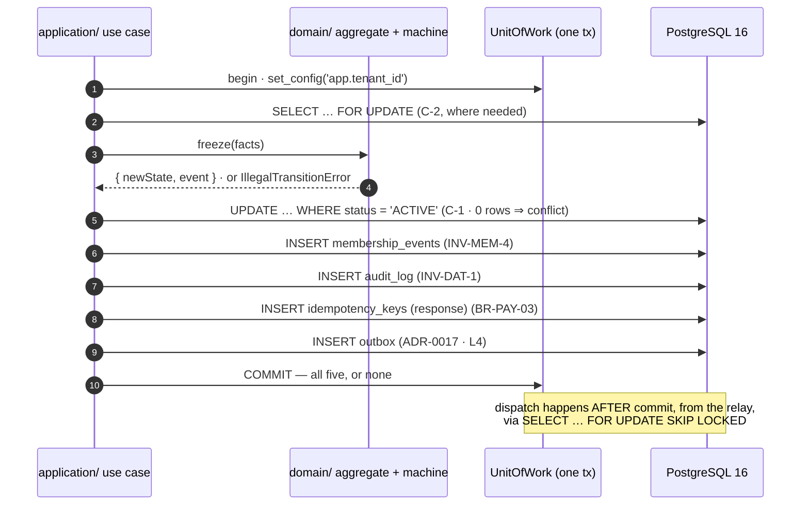

**The five-row rule, stated as a test.** `SM-<M>-ATOMIC` for each machine: force a failure at each
of the five inserts in turn and assert that **zero** rows exist in all five tables afterwards, and
that no outbox event was dispatched. This is the single most valuable integration test in the
codebase, because every other guarantee in this document assumes it.

### 13.5 The eleven transition-error codes

Per **L6**, each machine throws one typed error whose registry code names the machine. These must be
added to `packages/types/src/errors/registry.ts` and to `API_Catalog.md` §6 before gate **PG-5** can
pass — see `SM-OQ-03`.

| Code | HTTP | Machine | Retry |
| :--- | :-: | :--- | :--- |
| `INVALID_MEMBERSHIP_TRANSITION` | 422 | `C4.1` | No |
| `INVALID_ORDER_TRANSITION` | 422 | `C4.2` | No |
| `INVALID_PAYMENT_TRANSITION` | 422 | `C4.3` | No |
| `INVALID_APPLICATION_TRANSITION` | 422 | `C4.4` (application) | No |
| `INVALID_TENANT_TRANSITION` | 422 | `C4.4` (tenant) | No |
| `INVALID_GYM_TRANSITION` | 422 | `C4.4` (gym listing) | No |
| `INVALID_REFUND_TRANSITION` | 422 | `C4.5` | No |
| `INVALID_REVIEW_TRANSITION` | 422 | `C4.6` | No |
| `INVALID_SETTLEMENT_TRANSITION` | 422 | `C4.7` | No |
| `INVALID_STAFF_TRANSITION` | 422 | `FR-STAF-04` | No |
| `INVALID_DISPUTE_TRANSITION` | 422 | `FR-RFND-08` | No |

All are `422` (business-rule violation per `§C3.1`), all are `Retry: No`, and none is ever shown to
an end user in raw form — the `DomainExceptionFilter` resolves a human message naming the current
state and the legal next steps, because "invalid transition" tells a gym owner nothing.

---

## 14. Cross-machine interaction map

One customer purchase drives four machines and produces a settlement line. This is `E2E-02` joined
to `E2E-06` and `E2E-12`, drawn as the transitions rather than the endpoints. Module names are the
`§C1.3` names, so every arrow is checkable against the `ModuleDependency.md` allowed-dependency
matrix.

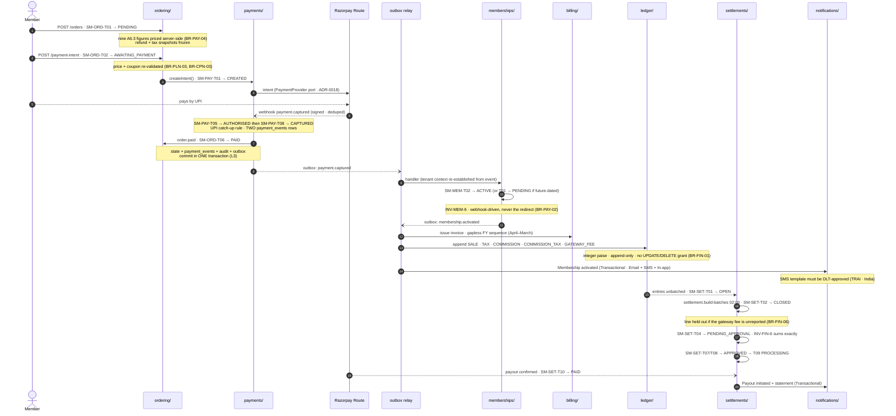

**Five properties this diagram is drawn to make visible.**

| # | Property | Where it shows |
| :-: | :--- | :--- |
| 1 | **The member's browser is not on the critical path after payment.** Every arrow from the webhook onward completes whether or not the redirect ever lands (`AC-PAY-02.1`, ADR-0013) | `GW --) PAY` and everything below it |
| 2 | **Each machine's transition commits with its own journal, audit and outbox rows** — never across machines | The `L3` notes on the payment and membership steps |
| 3 | **Cross-machine causation is always an outbox event, never a direct call into another module's state.** `refunds/` is the sole exception, calling `MEMBERSHIP_COMMAND_PORT` synchronously because it owns the decision (`ModuleDependency.md` §517) | Every `OB ->>` arrow |
| 4 | **The ledger is written once, by `ledger/`, from an event** — four money modules, one writer per fact (`BR-FIN-01`) | `OB ->> LED` |
| 5 | **Settlement is a derived aggregate over ledger facts**, not a parallel accounting system | `LED -->> SET` |

**The refund path is the same diagram in reverse**, and reversal is *append*, never edit:
`SM-REF-T07` → credit note (`billing/`) + `REFUND` and `COMMISSION_REVERSAL` entries (`ledger/`) +
`SM-MEM-T12` → `REFUNDED` + `SM-PAY-T10` → `REFUNDED` + a **negative line** in the batch in which it
is recognised (`SM-SET`, `FR-SETL-03`). Four modules, four owners, one event — and `E2E-07` walks
exactly this chain.

---

## 15. The five reason-code taxonomies (`C4.8`), in full

**These are data, not error codes.** `API_Catalog.md` §6.1 is explicit: the denial, rejection,
refund, moderation and override taxonomies are returned inside **`200` responses** and written into
audit rows. They live in the platform-global `reason_codes` reference table (typed by taxonomy,
RLS-exempt, `C2.3`) and as TypeScript enums in `packages/types/src/enums/`. A code is **never
renamed** — historical audit rows and analytics funnels reference it forever — and a retired code
stays in the table marked retired.

Every "what the user sees" string below is **guidance, not the final copy**: all five taxonomies are
i18n-resolved at render time, and the Hindi and English strings for the India launch are owned by
the content catalogue, not by code.

### 15.1 Check-in denial — 15 codes · `attendance/` · returned in a `200` from the scan endpoint

Written to `attendance.denial_reason` on a `result = DENIED` record (`BR-CHK-10`, `INV-CHK-5`), so
every denial is analysable. The desk screen shows the staff-facing line; the member's app shows a
softer variant of the same fact.

| Code | When it is used | What the user sees |
| :--- | :--- | :--- |
| `MEMBERSHIP_EXPIRED` | Membership is `EXPIRED` (`C4.1` T08/T09) | "Membership ended on 12 Aug." Desk shows a **Renew now** action — `E2E-04` requires renewal from the denial screen |
| `MEMBERSHIP_FROZEN` | Membership is `FROZEN` (`BR-MEM-06`) | "Membership is frozen until 20 Aug." Desk offers **Unfreeze** where the staff role permits |
| `MEMBERSHIP_PENDING_START` | Membership is `PENDING`; `start_date` is in the future | "Membership starts on 15 Aug." Desk may grant `GRACE_PERIOD_GRANTED` (§15.5) |
| `MEMBERSHIP_CANCELLED` | Membership is `CANCELLED` | "This membership was cancelled." No self-service path; directs to the desk |
| `MEMBERSHIP_REFUNDED` | Membership is `REFUNDED`; QR revoked at `SM-MEM-T12` | "This membership was refunded." Desk shows the credit-note reference |
| `WRONG_BRANCH` | Valid membership, but the plan does not grant this branch (`BR-CHK-03`) | "Not valid at this branch." Desk lists the branches the plan **does** cover |
| `OUTSIDE_OPERATING_HOURS` | Outside the branch's hours and the plan lacks 24-hour access (`BR-CHK-05`) | "The gym is closed right now. Opens 05:30." |
| `OUTSIDE_PLAN_ACCESS_WINDOW` | Inside opening hours but outside the plan's `access_window` — the off-peak plan case | "Your plan allows entry 10:00–17:00." Desk may offer an upgrade |
| `GYM_CLOSED_EXCEPTION` | A dated closure exception — public holiday, maintenance | "Closed today: Independence Day." |
| `NO_SESSIONS_REMAINING` | `SESSION` plan with `sessions_used = sessions_total` (`BR-PLN-06`) | "All 10 sessions used." Desk shows a top-up or renewal action |
| `DUPLICATE_WITHIN_COOLDOWN` | Repeat scan within the cooldown, default 60 min (`BR-CHK-04`) | "Already checked in at 07:12." **Entitlement is not decremented** (`INV-CHK-6`); this is informational, not a refusal of entry |
| `TOKEN_EXPIRED` | QR older than its 60-second TTL (`BR-CHK-02`, `INV-CHK-2`) | "Code expired — ask the member to refresh." The single most common denial; the screen makes refreshing obvious |
| `TOKEN_INVALID` | Signature verification failed, or the token was not issued by this platform | "Code not recognised." **Logged as a security signal**; a burst from one desk is investigated |
| `MEMBERSHIP_UNDER_REVIEW` | Sharing-review flag open (`BR-MEM-13`, `BR-CHK-07`) — a **flag**, not a state (§4.3) | "This membership is under review. Please see the front desk." Never accuses the member of sharing |
| `TENANT_SUSPENDED` | Reserved for a tenant whose operations have genuinely ceased | "This gym is not currently operating." **Must not fire for an ordinary suspension** — `INV-TEN-4`/`BR-TEN-05` keep existing members checking in until natural expiry |

### 15.2 Application rejection — 16 codes · `onboarding/` · `applications.reason_codes[]`

At least one is mandatory on `SM-APP-T05` (`BR-GYM-04`, `REJECTION_REASON_REQUIRED`). The owner sees
**every** code plus the free text, and each maps to a specific fix in the resubmission wizard.

| Code | When it is used | What the owner sees |
| :--- | :--- | :--- |
| `KYC_DOCUMENT_MISSING` | A mandatory India checklist item is absent — PAN, business registration, Shop & Establishment, bank proof, owner identity, premises address proof | "Missing document: PAN card." Deep-links to that upload slot |
| `KYC_DOCUMENT_ILLEGIBLE` | Present but unreadable — blur, glare, cropped edges | "We can't read your Shop & Establishment certificate. Please re-upload a clear photo." |
| `KYC_DOCUMENT_EXPIRED` | Past its validity date | "Your trade licence expired on 31 Mar 2026." |
| `KYC_NAME_MISMATCH` | Name differs across PAN, bank proof and registration | "The name on your bank proof doesn't match your PAN." Shows both values, never a guess at which is right |
| `ADDRESS_UNVERIFIABLE` | The premises address cannot be confirmed from the documents supplied | "We couldn't verify your address. A utility bill or rent agreement will help." |
| `GEO_ADDRESS_MISMATCH` | Map pin outside the tolerance around the geocoded postal address (`BR-GYM-08`) | "Your map pin is 2.4 km from your stated address." Opens the map to correct it |
| `DUPLICATE_LISTING` | Another `APPROVED` gym exists at the normalised address (`BR-GYM-09`) | "A gym is already listed at this address." Directs to the ownership-claim path, not a resubmission |
| `INSUFFICIENT_PHOTOS` | Fewer than three photographs (`BR-GYM-02`) | "Add at least 3 photos of your gym." |
| `PHOTO_QUALITY` | Too dark, too small, watermarked, or a stock image | "These photos are too low-resolution to publish." |
| `PHOTO_NOT_OF_PREMISES` | Photographs are not of the stated premises | "These photos don't appear to show your gym." |
| `INCOMPLETE_PROFILE` | Description, amenities or operating hours missing or placeholder | "Your operating hours are missing." Names each gap |
| `NO_PUBLISHED_PLAN` | No `PUBLISHED`, publicly visible plan (`BR-GYM-02`, `INV-TRU-8`) | "Publish at least one plan customers can buy." A `STAFF_ONLY` plan never satisfies this |
| `BANK_VERIFICATION_FAILED` | Penny-drop or account-name verification failed | "We couldn't verify your bank account." No payout can be configured until it clears |
| `PROHIBITED_CONTENT` | Content breaching platform policy | "Some content doesn't meet our listing policy." Names the field |
| `SUSPECTED_FRAUD` | Reviewer suspects a non-existent or misrepresented business (`RSK-01`) | **Deliberately generic:** "We can't approve this listing at present. Contact support." Never states the suspicion — an accurate message would coach the next attempt |
| `OTHER` | Anything not covered above | Free text is **mandatory** when `OTHER` is used; a bare `OTHER` fails validation |

### 15.3 Refund reason — 10 codes · `refunds/` · `refunds.reason_code`

Mandatory at `SM-REF-T01` (`REFUND_REASON_REQUIRED`). Two codes — `FRAUD` and `PRICING_ERROR` —
force `PENDING_APPROVAL` regardless of the policy window (§8.1 T02).

| Code | When it is used | What the member sees · effect |
| :--- | :--- | :--- |
| `WITHIN_COOLING_OFF` | Inside the order snapshot's no-questions window (`BR-REF-02`) | "Refund approved." Auto-approves if the value and usage thresholds also pass |
| `SERVICE_NOT_AS_DESCRIBED` | Facilities materially differ from the listing | "We're reviewing your request." Routes to Super Admin; the listing is also flagged for review |
| `GYM_CLOSED` | Gym closed or suspended for cause (`BR-REF-07`, `BR-MEM-14`) | "Refund for the unused part of your membership." Unconsumed pro-rata value, recovered from the tenant's balance and reserve |
| `MEDICAL` | Medical inability to attend | "We're reviewing your request." Usually outside the window, so it routes to approval; documentation is requested but never stored beyond the decision |
| `RELOCATION` | The member has moved away | As `MEDICAL` |
| `DUPLICATE_PAYMENT` | Second capture on one order (`BR-PAY-07`) | "We've refunded a duplicate payment." **Machine-originated** by `payment.duplicate-detect`, within one business day, with no member action |
| `PRICING_ERROR` | The wrong price was charged — a `BR-PLN-03` failure | "We charged the wrong amount and are correcting it." **Always** Super Admin, and always raises an `INV-TRU-7` investigation |
| `GOODWILL` | Discretionary, outside policy | "Your gym has approved a refund." Requires an explicit approver and a reason; visible on the tenant's statement |
| `FRAUD` | Payment or membership obtained fraudulently | "We're reviewing this transaction." **Never** auto-approves; may pause the tenant's payouts |
| `OTHER` | Anything else | Free text mandatory; always routes to approval |

### 15.4 Moderation — 9 codes · `reviews/` · review removals and report resolutions

Used on `SM-REV-T05`, `T08`, `T09` (`MODERATION_DECISION_REASON_REQUIRED`) and on `review_reports`.
A gym that reports a review chooses from the same list — which is why the list is written from the
content's perspective, not the reporter's.

| Code | When it is used | What the author sees · what the gym sees |
| :--- | :--- | :--- |
| `ABUSIVE_LANGUAGE` | Slurs, harassment, targeted abuse | Author: "Your review breached our language policy." Gym: the review is gone; no further detail |
| `PERSONAL_INFORMATION` | Names a private individual, a phone number, an address | Author: "Your review contained personal information." **Hidden immediately pending review** under `BR-REV-06` rather than left published |
| `SPAM` | Repetitive, automated, or bulk-submitted | Author: "Your review was identified as spam." Frequently paired with an anomaly hold (`SM-REV-T10`) |
| `IRRELEVANT` | Not about this gym, or not about the experience | Author: "Your review wasn't about this gym." |
| `CONFLICT_OF_INTEREST` | Author is staff, an owner, or a competitor | Author: "Reviews from people connected to the business aren't published." Also feeds anomaly detection (`RSK-02`) |
| `SUSPECTED_FAKE` | Rating-velocity, account-age or text-clustering signals (`FR-REV-09`) | Author: "We couldn't verify this review." Held first, removed only after human review — an automated removal would let a false positive silence a genuine member |
| `PROMOTIONAL` | Advertising another business or a referral link | Author: "Your review contained promotional content." |
| `THREAT` | Threats of violence or intimidation | Author: "Your review breached our safety policy." **Hidden immediately** (`BR-REV-06`) and escalated to Trust & Safety |
| `OTHER` | Anything else | Free text mandatory; shown to the author verbatim |

Two properties hold for every code: the gym **never** gains the ability to remove a review by
reporting it (`INV-TRU-4`), and removal recomputes the rating aggregate within 60 seconds
(`AC-REV-02.3`).

### 15.5 Check-in override — 7 codes · `attendance/` · `attendance.method = OVERRIDE`

A staff override records a check-in that the rules would have denied. It is always attributed
(`BR-CHK-08`), always carries a code (`OVERRIDE_REASON_NOT_IN_TAXONOMY` otherwise), and is
**reportable separately from scanned check-ins** — override rate per staff member is a shrinkage
signal (`A4.2`, `FR-STAF-05`).

| Code | When it is used | What is recorded · what the member sees |
| :--- | :--- | :--- |
| `MEMBER_PHONE_UNAVAILABLE` | Phone flat, forgotten or lost; identity confirmed at the desk | Staff id + member id + timestamp. Member sees a normal check-in in their history, marked *recorded by staff* |
| `TECHNICAL_ISSUE` | Scanner, network or platform failure at the desk | As above, plus the correlation id, so a cluster ties to an incident |
| `GRACE_PERIOD_GRANTED` | Membership expired or not yet started, and the gym chooses to admit — including the 00:00–01:00 activation window (§4.8) | As above. **Does not transition the membership**; an expired membership stays `EXPIRED` |
| `PAYMENT_PENDING_CONFIRMED` | Payment taken but not yet reflected — an indeterminate payment under `BR-PAY-06` | As above. Explicitly **not** an activation: `INV-MEM-6` still holds, and the membership activates only on capture |
| `TRIAL_VISIT` | A trial or guest visit with no membership | Attendance recorded against the branch with no membership id; excluded from membership utilisation reporting |
| `MANAGEMENT_APPROVAL` | Manager authorises an exception outside the other codes | As above, with the authorising manager's id **in addition to** the recording staff id |
| `OTHER` | Anything else | Free text mandatory |

**The property that makes overrides safe:** an override records an *attendance fact*, never a
*membership state change*. No code in this taxonomy touches `C4.1`. That is what allows the desk to
be pragmatic at 06:00 without anyone acquiring the ability to extend a membership by hand.

---

## 16. `§C5` job → transition index

Every time-based edge in this document, in one place. Each job runs under a distributed lock,
records start/end/outcome, emits metrics, and alerts on failure or on exceeding its expected
duration (`§C5`, ADR-0009).

| `§C5` job | Schedule | Transitions it drives | Idempotency key |
| :--- | :--- | :--- | :--- |
| `membership.activate-pending` | Hourly, gym tz | `SM-MEM-T03` | `(membership_id, start_date)` |
| `membership.expire` | Hourly, gym tz | `SM-MEM-T08`, `SM-MEM-T09` | `(membership_id, end_date)` |
| `membership.unfreeze-scheduled` | Hourly | `SM-MEM-T07` | `(freeze_id, scheduled_end)` |
| `membership.auto-renew` | Daily | Creates a **new** membership (`SM-MEM-T01`/`T02`) | `(membership_id, renewal_period)` |
| `order.expire` | Every 5 min | `SM-ORD-T05`, `T08`, `T10`; `SM-PAY-T04` | `(order_id, expires_at)` |
| `payment.reconcile` | Every 15 min | `SM-PAY-T05` … `T08` from polled provider truth | `(payment_id, poll_cycle)` |
| `payment.duplicate-detect` | Every 15 min | `SM-REF-T01` → `T02` → `T06` for the duplicate | `(order_id, duplicate_payment_id)` |
| `settlement.build-batches` | Daily 02:00 | `SM-SET-T01`, `T02`, `T04`, `T08` | `(tenant_id, period)` |
| `settlement.reconcile` | Daily 04:00 | `SM-SET-T03`, `T05`; `SM-DSP-T04` | `(tenant_id, report_date)` |
| `reserve.release` | Daily | Positive reserve line into the open batch | `(tenant_id, reserve_lot_id)` |
| `review.aggregate` | On change + nightly | No transition — recomputes the rating | `(gym_id, revision)` |
| `review.anomaly-scan` | Hourly | `SM-REV-T10` | `(review_id, window_start)` |
| `attendance.sharing-scan` | Hourly | Sets the sharing flag; **no `C4.1` transition** (§4.3) | `(membership_id, window_start)` |
| `subscription.charge` | Daily | `BR-TEN-06` `PAST_DUE` ladder; never blocks check-in (`INV-TEN-5`) | `(tenant_id, billing_period)` |
| `data.retention-sweep` | Weekly | `SM-STF-T03` on expired invitations | `(sweep_date, entity_class)` |

Two jobs deliberately drive **no** transition and must never be extended to: `membership.renewal-reminders`
(notifications only) and `gym.freshness-score` (ranking only). And no job of any kind may reach
`SM-APP-T04` — approval is human by law (`BR-GYM-03`, `INV-TRU-2`).

## 17. Reconciliations and open items

### 17.1 Reconciliations made in this document

| # | Tension | Resolution adopted |
| :-: | :--- | :--- |
| 1 | `C4.6` names the entry state `SUBMITTED`; `C2.2` lists `PENDING` | `SUBMITTED` adopted everywhere — enum, database, wire (§9) |
| 2 | `ENGINEERING_PLAN.md` §7.5 draws `PENDING_APPROVAL → AUTO_APPROVED` | Human approval lands in `PROCESSING` with a non-null `approver_id`; `AUTO_APPROVED` stays the policy path (§8) |
| 3 | `BR-MEM-13` "suspends the membership" vs. `INV-MEM-1`'s six states | Sharing review is a **flag plus a case**, never a seventh state (§4.3) |
| 4 | `C4.4` is one diagram over three columns | Faithfully decomposed onto `applications` / `tenants` / `gyms` with no edge changed (§7.2) |
| 5 | `C4.5`'s ASCII appears to draw `REQUESTED → FAILED` | Read as `PROCESSING → FAILED`, matching `ENGINEERING_PLAN.md` §7.5 (§8) |

### 17.2 Open items requiring an owner ruling

| Id | Item | Proposal | Needed by |
| :--- | :--- | :--- | :--- |
| `SM-OQ-01` | `C4.2` has no exit from `FAILED` other than retry, so a failed order holds a coupon reservation forever | Add `SM-ORD-T10` `FAILED → EXPIRED`, driven by `order.expire` | Sprint 5 |
| `SM-OQ-02` | `C4.4` shows closure only from `APPROVED`, leaving `SUSPENDED` with no terminal | Add `SM-TEN-T12` `SUSPENDED → CLOSED` | Sprint 3 |
| `SM-OQ-03` | The eleven `INVALID_*_TRANSITION` codes are absent from the `API_Catalog.md` §6 registry, which gate **PG-5** requires | Add all eleven (§13.5) to `packages/types/src/errors/registry.ts` | Before the first controller |
| `SM-OQ-04` | A refund can retry indefinitely with no escalation | Add `SM-REF-T10` `FAILED → PENDING_APPROVAL` after a bounded retry count | Sprint 12 |
| `SM-OQ-05` | `reviews.status` label (§17.1 row 1) | Confirm `SUBMITTED`; update `ERD.md` C2.2 | Sprint 10 |
| `SM-OQ-06` | India `COMMISSION_TAX` (18% GST on commission, `LAUNCH_MARKET_INDIA.md` conflict 2) adds a ninth persisted figure and a ledger entry type, which changes the settlement statement | Confirm with a qualified Indian tax advisor, then amend `SM-SET-T01`'s line composition | **Before Sprint 11** |

### 17.3 Downstream documents that must agree

`ERD.md` — every status enum, `CHECK`, trigger and partial unique index named here · `API_Catalog.md`
§6 — the eleven transition codes and every guard error code cited · `BusinessRules.md` — the `BR-`
enforcement layers behind each guard · `ModuleDependency.md` — every event name in Table B and every
arrow in §14 · `Security.md` — the actor taxonomy, `⨂ no-impersonation` rows and the refusal-logging
posture · `TestingStrategy.md` (not yet written) — the `SM-…-T/N/X/C/R` identifiers, which must
appear in the `BAC-06` coverage report alongside the `BR-…-P/N` ids.

**Change trigger for this document:** any amendment to a `§C4` diagram, any new `§C5` job, any new
status label on any of the eleven columns in §1.1, any resolution of `SM-OQ-01` … `SM-OQ-06`, and
any owner ruling recorded in `DECISION_LOG.md`.

*End of StateMachines.md.*

