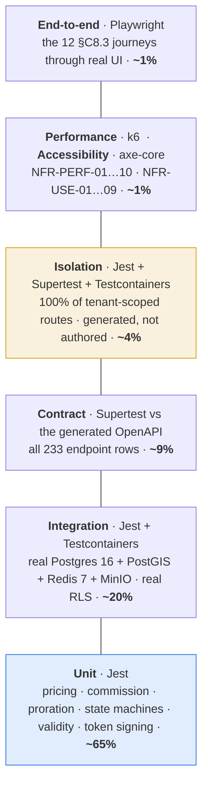
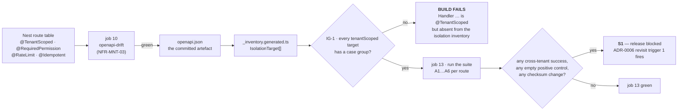
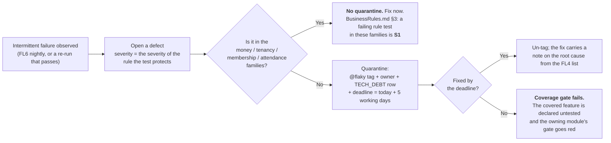
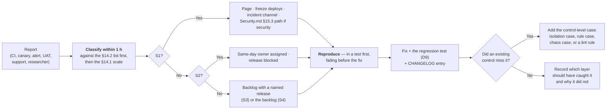

# Testing Strategy — The Complete Test Plan

**Document:** `/docs/engineering/TestingStrategy.md` · **Phase:** 2 (Engineering Documentation)
**Status:** Draft for Phase-2 acceptance gate · **Date:** 2026-08-06
**Source of truth:** `MASTER_PRD.md` §C8 (test strategy), §C7 (pipeline and gates), §A8 (the 95 rules),
§A12 (`BAC-01`…`BAC-15`), §B9 (NFRs) · **Governing law:** `PROJECT_CONSTITUTION.md` §17 (Testing Law),
§8.12 (test names), §10 (money), §11 (multi-tenancy), §19 (performance budgets)
**Market:** India (`LAUNCH_MARKET_INDIA.md`) · **Tooling:** `STACK_ADDITIONS.md` `A-06`, `A-25`, `A-26`

---

## 0. What this document is, and its authority

| | |
| :--- | :--- |
| **This document is** | The detailed test plan for the Phase-1 platform. It fixes, for every one of the eight `§C8.1` layers plus the two additional layers `ENGINEERING_PLAN.md` §17.1 adds: the scope, the approved tool, the absolute path tests live at, the naming grammar, the run cadence, and the pass gate. It designs the isolation suite in full, specifies the `§C8.2` deterministic seed row by row, expands the twelve `§C8.3` journeys into executable Playwright steps, expands the six `§C8.4` UAT scripts into step-by-step scripts with expected results, and enumerates what is deliberately **not** tested automatically together with the manual control that compensates. |
| **This document is not** | The rule-to-enforcement map — that is `/docs/engineering/BusinessRules.md`, which owns the 95 `BR-` entries and their `-P<n>`/`-N<n>` test identifiers. It is not the load-test design — that is `/docs/engineering/Scalability.md` §10, which owns the eighteen `LT-` scenarios, the four load profiles and the k6 thresholds. It is not the security control catalogue — that is `/docs/engineering/Security.md`, which owns `SEC-*` case identifiers, the DAST configuration and the penetration-test scope. **This document references all three and duplicates none of them.** |
| **Relationship to `ENGINEERING_PLAN.md` §17** | `ENGINEERING_PLAN.md` §17 is the CTO-level overview: eight layers in a table, a seed summary, twelve journey titles, seven isolation assertions, a coverage table, six UAT rows. This is the detailed version of that slice. Where §17 names a thing, this document specifies it. **This document adds no layer, removes no layer and changes no gate.** Any correction is recorded in §16 with its authority. |
| **Precedence** | `PROJECT_CONSTITUTION.md` §1.3 governs. Where this document and the constitution differ, the constitution wins and this document is wrong. Where this document and `MASTER_PRD.md` differ, the PRD wins. Nothing here re-litigates a settled ADR. |

**No application code exists and none is written here.** Every code block is labelled
**illustrative — not committed code** and exists to fix a shape, not to be copied.

### 0.1 The five load-bearing invariants, restated as test obligations

Every section of this document exists to make one of these five falsifiable. A test suite that
cannot fail when one of them is broken is theatre.

| # | Invariant | The test that would catch its violation | Layer | Section |
| :-: | :--- | :--- | :--- | :--- |
| **I1** | No tenant reads or writes another tenant's data (`BR-TEN-01`, `NFR-SEC-09`, `BAC-10`, `E2E-11`) | The isolation suite, generated from the route table, run against real Postgres with RLS enabled, with a dropped-policy negative control | Isolation | §5 |
| **I2** | Money is an append-only ledger of integer minor units (`BR-PAY-01`, `BR-FIN-01`) | Property-based tests on `Money`, the `A6.3` worked-example fixture, the nine-figure identity, ledger-derivation equivalence, settlement reconciliation to zero variance | Unit + Integration | §8 |
| **I3** | Price displayed = price charged; server re-validation aborts on mismatch (`BR-PLN-03`) | `BR-PLN-03-N1` — price changed between page load and payment returns `422 PLAN_PRICE_CHANGED` and **no** payment intent is created | Integration + E2E | §7.4 |
| **I4** | Verification before visibility; earned reviews only (`BR-GYM-01`, `BR-GYM-03`, `BR-REV-01`, `BR-REV-03`) | A `PENDING_REVIEW` gym never appears in any discovery response; a direct `POST` review from a user with no check-in returns `403 REVIEW_REQUIRES_CHECK_IN` | Contract + E2E | §7.4, §10 |
| **I5** | Activation is webhook-driven, never the client redirect (`BR-PAY-02`) | The absence of an activation endpoint from the generated OpenAPI document is itself asserted; a client-side success signal activates nothing | Contract | §4.3 |

---

## 1. Test philosophy

### 1.1 The three sentences the strategy reduces to

1. **A test exists to make a specific rule falsifiable.** Not to raise a number. `BAC-06` is the
   product's own statement of this: *"Every rule in A8 has at least one passing automated test, and
   every M-priority rule has a test that also proves the negative case."* A test that cannot fail
   when the rule is deleted is not a test of that rule.
2. **The lowest layer that can prove a property is the layer that proves it.** `BR-FIN-04`
   (commission never on tax) is provable by a pure function over integers, so it is a unit test and
   costs 3 ms. `BR-TEN-01` is **not** provable without a real PostgreSQL enforcing a real policy, so
   it is an integration-class test and costs a container. Pushing a property upward buys slowness
   and flake; pushing it downward buys a false pass.
3. **The pyramid is a consequence, not a target.** `PROJECT_CONSTITUTION.md` §17.1 sets the shape at
   ~65/20/9/4/1/1. That shape falls out of applying sentence 2 honestly to this domain. It is
   reported and policed (§1.4) because drift away from it is a *symptom* worth investigating, not
   because the ratio has value in itself.

### 1.2 The pyramid



Two layers sit outside the triangle because they are continuous rather than proportional:
**Security** (SAST, dependency scan, secret scan, DAST, annual penetration test) and the two layers
`ENGINEERING_PLAN.md` §17.1 adds against named technical risks — **Mutation** (`TR-17`) and **Chaos**
(`TR-16`). They are specified in §4.7, §4.9 and §4.10.

### 1.3 What each layer is FOR, and what it must never be used for

This table is the most-cited table in the document. A pull-request reviewer who thinks a test is at
the wrong layer cites a row from it.

| Layer | It exists to prove | It must **never** be used to prove | Why the misuse is harmful |
| :--- | :--- | :--- | :--- |
| **Unit** | Pure logic with no I/O: `Money` arithmetic, `round_half_even`, `allocate()`, commission and proration formulae, the seven `§C4` state machines' legal and illegal transitions, validity-window computation in a named timezone, Ed25519 token signing and TTL evaluation, coupon discount capping, denial-reason selection order | That a **query** returns the right rows; that RLS works; that a route is wired; that a transaction commits; that two modules integrate | A mocked repository will return whatever the test author believed the repository returns. That belief is the bug. `IS4` states it for tenancy: *"Mocked repositories cannot prove RLS."* |
| **Integration** | Repository behaviour against real Postgres 16 + PostGIS: RLS admitting and refusing rows, `UNIQUE` and `CHECK` constraints firing, the append-only grant refusing `UPDATE`/`DELETE` on `ledger_entries` and `audit_log`, `SET LOCAL` sharing a connection with its query, PostGIS `ST_DWithin` results, partition pruning, BullMQ job idempotency under a distributed lock, outbox write-and-dispatch atomicity | Business arithmetic that a unit test proves in 3 ms; UI behaviour; whole user journeys | An integration test costs ~40× a unit test. Using it for arithmetic makes the suite slow, which makes engineers run it less, which is how coverage decays |
| **Contract** | That every one of the 233 `API_Catalog.md` rows matches the `@nestjs/swagger`-generated OpenAPI document: status codes, response envelope, error `code` strings from the registry, pagination shape, required headers, `Deprecation`/`Sunset` headers, and the **absence** of endpoints that must not exist (invariant I5) | Business rules; database behaviour; performance | A contract test that asserts business outcomes duplicates the integration layer and then drifts from it. Contract tests assert *shape*, integration tests assert *truth* |
| **Isolation** | Exactly one thing: `BR-TEN-01`. For every tenant-scoped route, tenant A cannot read or write tenant B, and — the assertion people forget — tenant A **can** read tenant A | Anything else. Not permissions, not validation, not business rules | The suite's value is that its failure has one meaning: *tenant data crossed*. Every additional concern added to it dilutes that signal and slows a suite that already runs unfiltered on every PR |
| **End-to-end** | The twelve `§C8.3` journeys as a *user* experiences them, across surface boundaries the lower layers cannot cross: browser → Next.js SSR → API → webhook → worker → dashboard | Edge cases; error-branch coverage; permutations of a rule; anything provable one layer down | E2E is the slowest and flakiest layer by construction. `PROJECT_CONSTITUTION.md` §17.1: *"A suite that becomes 40% end-to-end is a slow, flaky suite that nobody trusts."* A rule with eight branches gets eight unit tests and zero extra E2E scenarios |
| **Performance** | The ten `NFR-PERF-*` budgets and the six `NFR-SCAL-*` properties under the `Scalability.md` §2.7 peak-minute mix, at `NFR-SCAL-01` volumes | Correctness. A k6 run asserting a business outcome is a correctness test wearing a stopwatch | A load test that fails for a correctness reason produces an unactionable red build at 03:00 |
| **Security** | The `SEC-*` cases of `Security.md` §5 and §10: OWASP Top-10 manifestations, the four abuse economies, dependency and secret hygiene, DAST findings against staging | Tenant isolation (that is the isolation suite's job, and it is a *design* artefact handed to the pentester per `Security.md` §4.6) | Two suites owning one property means neither owns it |
| **Accessibility** | `NFR-USE-01`…`NFR-USE-09`: WCAG 2.1 AA on the customer site and check-in desk, Level A minimum elsewhere, automated axe-core plus the scripted manual keyboard and screen-reader passes of §4.8.3 | That the product is usable. axe-core detects roughly a third of WCAG failures; the manual pass exists precisely because the automated pass is not sufficient | Declaring AA on an axe-core pass alone is a false compliance claim, and `NFR-USE-01` is a contractual acceptance criterion |
| **Mutation** | That the tests in the money and tenancy modules would actually **fail** if the code were subtly wrong — the `TR-17` mitigation | General code quality; anything outside the seven high-coverage modules | Mutation testing is expensive. Run everywhere it becomes a nightly that nobody waits for |
| **Chaos** | `NFR-AVL-03`: loss of maps, search indexing, notifications or analytics must not prevent check-in, purchase or payment. Each of `DEP-01`…`DEP-08` disabled in turn — the `TR-16` mitigation | Latency budgets; correctness under normal operation | — |

### 1.4 The enforced ratios

`PROJECT_CONSTITUTION.md` §17.1 makes the ratios *"guidance with teeth"*. This is the mechanism.

| Element | Specification |
| :--- | :--- |
| **What is measured** | Test **count** per layer, derived from the Jest/Playwright reporter output, keyed by the file-suffix registry of `FolderStructure.md` §17.1: `*.spec.ts` → Unit, `*.int-spec.ts` + `apps/server/test/integration/**` → Integration, `apps/server/test/contract/**` → Contract, `apps/server/test/isolation/**` → Isolation, `**/e2e/*.e2e-spec.ts` → E2E |
| **Where it is reported** | A `test-distribution` step in `pr.yml` writes a job summary table: layer, count, share, delta versus the trunk baseline |
| **The trigger** | A PR that moves any layer's share by **more than five percentage points** in either direction is labelled `test-distribution-shift` and requires an explicit reviewer acknowledgement in the PR body |
| **What it is not** | Not a build failure. A legitimate large shift exists — Sprint 8's check-in work adds many unit tests at once. The gate is a **conversation**, and the acknowledgement is the record that the conversation happened |
| **The two failure shapes it catches** | (a) A feature delivered with only E2E coverage, because the author found unit-testing the domain awkward — which usually means the domain object is wrong. (b) A feature delivered with only unit coverage against mocks, which is the shape of a module that has never touched a database |

### 1.5 The Definition of Done, testing clauses

Reproduced from `PROJECT_CONSTITUTION.md` §23.2 so that this document is self-contained at the point
of use. A story is not Done until every applicable row is true.

| # | Clause | Verified by |
| :-: | :--- | :--- |
| D1 | Every new endpoint has a contract test, an isolation test, a permission-denied test, a validation-failure test and a happy-path test | `pr.yml` jobs 13, 14; §5.6 gate `IG-1` |
| D2 | Every new **M**-priority rule implementation has a positive test **and** a `NEGATIVE:`-labelled test carrying its `BR-…-N<n>` identifier | §7.5 `BAC-06` traceability report |
| D3 | Every new state-machine transition has a legal-transition test and an illegal-transition refusal test | `memberships/domain/*.state-machine.spec.ts` and the six siblings |
| D4 | Every new money computation carries the `§A6.3` fixture plus the six boundary cases of §8.4 | Coverage gate on the 95% zone plus the mutation gate |
| D5 | Every new migration has an apply-against-seed test, and an RLS assertion where the table is tenant-owned | `pr.yml` job 11 plus §5.7 `pg_policies` check |
| D6 | Every new BullMQ job has an idempotency test, a distributed-lock test and a failure-alerting test | §4.2.4 |
| D7 | Every new notification has a preference-suppression test, a transactional-cannot-be-disabled test and a quiet-hours test | §4.2.5 |
| D8 | Every new screen has loading, empty, error and permission-denied state tests plus an axe-core pass | `pr.yml` job 18 |
| D9 | Every bug fix has a regression test that **fails before the fix and passes after** | Review; the commit must show the test added in the same commit range |

---

## 2. Test topology — where every test lives and what it is called

### 2.1 The file map

Absolute paths, rooted at `c:/Users/Mehdi/Desktop/GymMap`. This tree is the operational form of
`FolderStructure.md` §7 and §17.1; it adds no directory that document does not sanction.

```text
apps/server/
├── src/<module>/                          ── tests sit BESIDE their subject (constitution §8.1)
│   ├── controllers/<r>.controller.spec.ts       Unit — route wiring, @RequiredPermission present, DTO shape
│   ├── application/<verb>-<noun>.use-case.spec.ts   Unit — orchestration, ports mocked
│   ├── application/handlers/<event>.handler.spec.ts Unit — event idempotency
│   ├── domain/<aggregate>.entity.spec.ts        Unit — invariants, no I/O
│   ├── domain/<name>.state-machine.spec.ts      Unit — legal AND illegal transitions
│   ├── domain/<name>.policy.spec.ts             Unit — named for the BR- it enforces
│   ├── infrastructure/<agg>.prisma-repository.int-spec.ts   Integration — Testcontainers + MANDATORY RLS assertion
│   └── jobs/<job-name>.processor.spec.ts        Unit — lock key, no business logic
│
└── test/                                  ── suites that are not "beside a subject"
    ├── harness/
    │   ├── containers.ts                  Testcontainers bootstrap: Postgres 16+PostGIS, Redis 7, MinIO
    │   ├── seed.ts                        applies the §C8.2 deterministic seed (§6)
    │   ├── clock.ts                       FixedClock / OffsetClock control (§9.1)
    │   ├── auth.ts                        mints tokens for the seeded principals (§6.6)
    │   └── tx.ts                          per-test transactional rollback (§11.4)
    ├── rules/<family>/<BR-id>.spec.ts     the BAC-06 rule suite — 95 files (§7.3)
    ├── integration/                       cross-repository and cross-module integration
    ├── contract/<module>.contract-spec.ts Supertest vs the generated OpenAPI (§4.3)
    ├── isolation/
    │   ├── _inventory.generated.ts        emitted from the route table — never hand-edited (§5.3)
    │   ├── _assertions.ts                 the seven per-route assertions (§5.4)
    │   ├── <module>.isolation-spec.ts     one file per module, one case per route
    │   ├── rls-policy.sql-spec.ts         RLS exercised in raw SQL, no application tier (§5.8)
    │   ├── prisma-extension.int-spec.ts   the A-01 pooling failure mode (§5.9)
    │   ├── platform-elevation.int-spec.ts the inverted suite for /admin/* (§5.10)
    │   └── dropped-policy.negative-spec.ts the negative control (§5.11)
    ├── security/<SEC-id>.spec.ts          regression tests for pentest and DAST findings (Security.md §14.4)
    ├── money/                             property-based suites (§8.3)
    ├── load/                              k6 — the eighteen LT- scenarios (Scalability.md §10.3)
    └── fixtures/                          recorded provider payloads: razorpay/ stripe/ maps/ sms/
apps/customer-web/e2e/                     Playwright — E2E-02, E2E-03(member half), E2E-09(member half)
apps/gym-dashboard/e2e/                    Playwright — E2E-04, E2E-05, E2E-10, E2E-12(statement view)
apps/admin-dashboard/e2e/                  Playwright — E2E-01(approval half), E2E-09(moderation half)
e2e/                                       ROOT Playwright project for cross-surface journeys:
    └── e2e-<nn>-<slug>.e2e-spec.ts        E2E-01, E2E-06, E2E-07, E2E-08, E2E-11, E2E-12
packages/utils/src/money/*.spec.ts         100% line and branch, property-based (§8.3)
packages/ui/src/<Primitive>/<Name>.test.tsx  per primitive with behaviour
```

**Two rules govern placement, and they resolve every case.**

| Rule | Statement |
| :--- | :--- |
| **TP1** | If the test's subject is **one file**, the test sits beside it and carries `.spec.ts` (or `.int-spec.ts` for a repository). `FolderStructure.md` §17.1 makes this a structure-test failure if violated, and `__tests__/` directories are forbidden outright. |
| **TP2** | If the test's subject is **the system** — a route inventory, a journey, a rule spanning layers, a policy in SQL — it lives under `apps/server/test/` or an app-level `e2e/`, in the sub-directory named for its layer. A system-level test hiding beside a source file is invisible to the layer accounting of §1.4. |

### 2.2 Naming grammar

Restated from `PROJECT_CONSTITUTION.md` §8.12 and §17.6 with the concrete patterns each layer uses.
`BAC-06` compliance is generated by grepping these strings, so they are a machine contract.

| Layer | `describe` | Nested `describe` | `it` | Worked example |
| :--- | :--- | :--- | :--- | :--- |
| Unit | The unit under test | The rule identifier and its text | A sentence stating behaviour and outcome | `describe('CommissionCalculator')` › `describe('BR-FIN-04 — commission is charged on the base only')` › `it('excludes tax from the commission base')` |
| Unit, negative | — | — | Prefixed `NEGATIVE:` and carrying the `BR-…-N<n>` id | `it('BR-FIN-04-N1 · NEGATIVE: refuses a CommissionBase constructed from net + tax')` |
| Integration | The repository or module seam | The rule or constraint | Names the database object that enforces it | `describe('PrismaMembershipRepository')` › `it('refuses to query with no tenant context, throwing MissingTenantContextError')` |
| Contract | The endpoint group | The method + path template | The status and shape | `describe('API-MEMB')` › `describe('POST /v1/tenant/memberships/:id/freeze')` › `it('returns 422 FREEZE_ALLOWANCE_EXHAUSTED with the ProblemDetails envelope')` |
| Isolation | The module | The method + path template | Names **both** tenants and the route | `it('BR-TEN-01-N · NEGATIVE: tenant A cannot read tenant B memberships via GET /v1/tenant/memberships/:id')` |
| E2E | The journey id and title | The step group | The user-observable outcome | File `e2e-06-coupon-to-settlement.e2e-spec.ts`; `describe('E2E-06 — coupon applied → settlement ties out')` |
| Performance | — | — | Carries the NFR id | `NFR-PERF-01 search p95 under 500ms` (a k6 scenario tag, per `Scalability.md` §10.5) |
| Accessibility | The screen id | — | The WCAG criterion | `describe('SCR-DASH-009 — Check-in Desk')` › `it('has no axe-core violations at WCAG 2.1 AA')` |

**The single-grep property.** `PROJECT_CONSTITUTION.md` §17.6 requires that grepping `BR-FIN-04`
finds four things: the rule in `MASTER_PRD.md` §A8, its enforcement in the code, its row in
`/docs/engineering/BusinessRules.md`, and its tests. §7.5 specifies the CI report that proves the
fourth leg exists for all 95 rules.

### 2.3 The run matrix — what runs where, and when

Job numbers are `ENGINEERING_PLAN.md` §16.3's `pr.yml` numbering. Nothing here reorders them.

| Layer | Pre-commit (Husky) | Pre-push | `pr.yml` | `main.yml` | `nightly.yml` | `release.yml` | Turborepo cache |
| :--- | :-: | :-: | :--- | :--- | :--- | :--- | :-: |
| Unit | on staged files via lint-staged | — | job 7, affected graph | full | full ×10 (flake sweep, `FL6`) | — | ✅ |
| Integration | — | — | job 12, affected graph | full | full | — | ❌ containers |
| Contract | — | — | job 14 | full | full | — | ❌ |
| **Isolation** | — | — | **job 13, always full, never affected-filtered** | full | full | smoke subset post-deploy | ❌ |
| E2E | — | — | smoke subset (`E2E-02`, `E2E-03`, `E2E-11`) | all 12 on `development`, then `staging` | all 12 ×3 browsers | 3 smoke journeys after traffic shift | ❌ |
| Performance (k6) | — | — | — | — | `LT-01`, `LT-05`, `LT-09`, `LT-10`, `LT-11`, `LT-16` | pre-release: `LT-01`…`LT-18` | ❌ |
| Security | Gitleaks | — | jobs 15, 16, 17 | same | DAST on staging; Trivy on the deployed digest | — | ❌ |
| Accessibility | — | — | job 18 (axe-core) | same | full route sweep | manual pass per release (§4.8.3) | ❌ |
| Mutation | — | — | — | — | money + tenancy modules | — | ❌ |
| Chaos | — | — | — | — | `DEP-01`…`DEP-08` disabled in turn | — | ❌ |
| Architecture fitness | — | ✅ `turbo run architecture` | job 5, always full | full | full | — | ✅ |

**Why three suites are never Turborepo-cached or affected-graph-filtered** (`ENGINEERING_PLAN.md`
§16.2, `API_Catalog.md` §9.5):

| Suite | Reason |
| :--- | :--- |
| Isolation | An apparently unrelated change can widen an RLS policy, add a route through a shared decorator, or alter the Prisma extension. The blast radius of a tenancy regression is the whole platform, so the suite's cost is paid on every PR unconditionally |
| OpenAPI drift | The generated document is a function of the entire application graph; a cached "unaffected" verdict would be computed from an incomplete graph |
| `dependency-cruiser` architecture test | A cycle is a property of the graph, not of a file |

---

## 3. Coverage policy (`NFR-MNT-01`)

> `NFR-MNT-01`: *"Unit test coverage ≥ 80% overall and ≥ 95% on payment, settlement, membership state
> and tenancy isolation code."* `§C7` restates it as a **non-negotiable merge gate**.

### 3.1 The floors

`PROJECT_CONSTITUTION.md` §17.2 fixes the scopes; `ENGINEERING_PLAN.md` §17.5 adds the branch
column and the per-scope additional gate. Both are reproduced here because this table is the one CI
is configured from.

| # | Scope | Line | Branch | Additional gate | Authority |
| :-: | :--- | :-: | :-: | :--- | :--- |
| 1 | **Overall** (all workspaces) | **≥ 80%** | ≥ 75% | — | `NFR-MNT-01`, `§C7` |
| 2 | `apps/server/src/payments/**` | **≥ 95%** | ≥ 90% | Mutation score ≥ 75%; two reviewers via `CODEOWNERS` | `NFR-MNT-01` |
| 3 | `apps/server/src/settlements/**` | **≥ 95%** | ≥ 90% | Mutation score ≥ 75%; two reviewers | `NFR-MNT-01` |
| 4 | `apps/server/src/ledger/**` | **≥ 95%** | ≥ 90% | Mutation score ≥ 75%; property tests on `allocate()` and rounding | `NFR-MNT-01` |
| 5 | `apps/server/src/refunds/**` | **≥ 95%** | ≥ 90% | Mutation score ≥ 75%; two reviewers | `PROJECT_CONSTITUTION.md` §17.2 |
| 6 | `apps/server/src/billing/**` | **≥ 95%** | ≥ 90% | Byte-identity determinism test on PDF regeneration (`FR-INV-07`, `TD-009`) | `PROJECT_CONSTITUTION.md` §17.2 |
| 7 | `apps/server/src/memberships/**` | **≥ 95%** | ≥ 90% | Full `§C4.1` transition-table coverage **including every illegal transition** | `NFR-MNT-01` |
| 8 | `apps/server/src/tenancy/**` | **≥ 95%** | **≥ 95%** | Isolation suite green **and** the dropped-policy negative control red-when-dropped (§5.11) | `NFR-MNT-01`, `NFR-SEC-09` |
| 9 | `apps/server/src/attendance/**` | **≥ 95%** | ≥ 90% | Full denial-reason taxonomy coverage — all 15 `§C4.8` codes | `PROJECT_CONSTITUTION.md` §17.2 (`BR-CHK-01`…`BR-CHK-10` are all **M**) |
| 10 | `packages/utils/src/money/**` | **100%** | **100%** | Property-based; **no exemptions** | `ENGINEERING_PLAN.md` §17.5 |
| 11 | `apps/server/src/**/domain/**` | ≥ 95% | ≥ 90% | Pure code with no I/O — there is no excuse below this | `ENGINEERING_PLAN.md` §17.5 |

### 3.2 The exact globs constituting the 95% zone

This is the literal `coverageThreshold` content. Path globs are relative to the repository root and
are the *only* thing the gate reads — a module renamed without updating this list silently leaves
the zone, which is why §3.4 rule `CG5` exists.

```ts
// illustrative — not committed code
// packages/config/jest/coverage-thresholds.ts — consumed by apps/server/jest.config.ts
export const coverageThreshold = {
  // ── 1. The global floor (NFR-MNT-01, §C7) ────────────────────────────────
  global: { lines: 80, statements: 80, branches: 75, functions: 80 },

  // ── 2. The 95% zone — seven modules named by NFR-MNT-01 + two added by
  //      PROJECT_CONSTITUTION.md §17.2 (refunds/billing/attendance) ─────────
  'apps/server/src/payments/**/*.ts':     { lines: 95, statements: 95, branches: 90, functions: 95 },
  'apps/server/src/settlements/**/*.ts':  { lines: 95, statements: 95, branches: 90, functions: 95 },
  'apps/server/src/ledger/**/*.ts':       { lines: 95, statements: 95, branches: 90, functions: 95 },
  'apps/server/src/refunds/**/*.ts':      { lines: 95, statements: 95, branches: 90, functions: 95 },
  'apps/server/src/billing/**/*.ts':      { lines: 95, statements: 95, branches: 90, functions: 95 },
  'apps/server/src/memberships/**/*.ts':  { lines: 95, statements: 95, branches: 90, functions: 95 },
  'apps/server/src/tenancy/**/*.ts':      { lines: 95, statements: 95, branches: 95, functions: 95 },
  'apps/server/src/attendance/**/*.ts':   { lines: 95, statements: 95, branches: 90, functions: 95 },

  // ── 3. The shared money kernel — no exemptions ───────────────────────────
  'packages/utils/src/money/**/*.ts':     { lines: 100, statements: 100, branches: 100, functions: 100 },
  'packages/types/src/money.ts':          { lines: 100, statements: 100, branches: 100, functions: 100 },

  // ── 4. Every domain layer, in all 23 modules ─────────────────────────────
  'apps/server/src/**/domain/**/*.ts':    { lines: 95, statements: 95, branches: 90, functions: 95 },
};

// ── 5. The denominator. CV4: nothing else is excluded. ─────────────────────
export const coveragePathIgnorePatterns = [
  '\\.module\\.ts$',        // Nest composition, no branches
  '\\.dto\\.ts$',           // request/response type files
  '\\.openapi\\.ts$',       // decoration only
  '\\.types\\.ts$',         // type declarations
  '\\.tokens\\.ts$',        // DI symbols
  '/index\\.ts$',           // barrel re-exports
  '/prisma/generated/',     // generated client
  '\\.e2e-spec\\.ts$', '\\.int-spec\\.ts$', '\\.isolation-spec\\.ts$', '\\.contract-spec\\.ts$', '\\.spec\\.ts$',
];
```

**Cross-check against the four money modules.** `FolderStructure.md` invariant 2 requires
`ledger/`, `settlements/`, `refunds/` and `billing/` to remain **four directories, never one**
(ADR-0029). The glob list mirrors that: four separate entries, so a merge of two modules would show
up here as a deleted threshold line and fail review.

### 3.3 Which layers contribute to the number

`NFR-MNT-01` says *"unit test coverage"*. Read literally that would let a 95% figure be reached with
mocks and prove nothing about RLS — the exact failure `CV3` warns of. The binding interpretation:

| Contributes to the coverage number | Does not contribute |
| :--- | :--- |
| Unit (`*.spec.ts`) | End-to-end (Playwright) — a different process, and coverage-instrumenting a browser journey rewards journey sprawl |
| Integration (`*.int-spec.ts`, `test/integration/**`) — instrumented in the same Jest process | Performance (k6) |
| Contract (`test/contract/**`) | Security scanners |
| Isolation (`test/isolation/**`) | Accessibility |
| The `BAC-06` rule suite (`test/rules/**`) | Chaos |

The four contributing layers all run under Jest in one coverage context, merged by
`jest --coverage --coverageReporters=json-summary,lcov,text-summary` across the `unit`,
`integration`, `contract` and `isolation` projects.

### 3.4 CI enforcement

| Rule | Statement | Where |
| :--- | :--- | :--- |
| **CG1** | Coverage is measured on **branches**, not only lines (`CV1`). A branch-uncovered `if` in a commission calculation is exactly the case that matters | `pr.yml` job 7 |
| **CG2** | **Coverage never decreases** (`CV2`). The trunk baseline `coverage-summary.json` is stored as a workflow artefact keyed by commit; the PR run diffs against the merge-base baseline and fails on any *actual* value dropping, even where the threshold is still met | `pr.yml` job 7, step `coverage-ratchet` |
| **CG3** | Lowering a threshold **in the config file** requires the `CODEOWNERS` review of `packages/config/**` — two reviewers — and a `TECH_DEBT.md` row. Threshold changes are never bundled with feature work | `CODEOWNERS`, review |
| **CG4** | Coverage is a **floor, not a goal** (`CV3`). 95% on `ledger/` with no `NEGATIVE:` tests is a failing suite that passes CI, and the reviewer says so. §7.5's `BAC-06` report is the structural backstop | Review + §7.5 |
| **CG5** | A `coverageThreshold` glob matching **zero files** fails the build. This is what catches a module renamed out of the 95% zone — otherwise the gate would silently pass against nothing | `pr.yml` job 7, step `assert-globs-nonempty` |
| **CG6** | `coveragePathIgnorePatterns` is a closed list (`CV4`). Adding a pattern is a `packages/config/**` change and therefore a two-reviewer change | `CODEOWNERS` |
| **CG7** | The mutation gate (§4.9) applies to the seven `NFR-MNT-01`-named directories. A high coverage figure with a low mutation score is the `TR-17` failure and is reported as an S3 defect against the owning module | `nightly.yml` |
| **CG8** | Frontend coverage counts in the global 80% only for files carrying logic. `packages/ui` primitives with behaviour require a `<Name>.test.tsx`; presentational components with no conditional rendering are covered incidentally by the axe-core and E2E passes and are not separately gated | `pr.yml` job 7 |

**Why `attendance/` is in the 95% zone although `NFR-MNT-01` does not name it.**
`PROJECT_CONSTITUTION.md` §17.2 adds it, with the reason stated: `BR-CHK-01`…`BR-CHK-10` are all
**M**-priority, and a denial defect is a queue at the front desk during peak hour. This document
does not re-argue it; it implements it as glob row 8 above.

---

## 4. The ten layers, specified

Eight are `§C8.1`'s. Two — Mutation and Chaos — are added by `ENGINEERING_PLAN.md` §17.1 against
named technical risks and are specified here for completeness, not introduced here.

### 4.1 Unit — Jest (`A-06`)

| Attribute | Specification |
| :--- | :--- |
| **Scope** | Pure logic with zero I/O: `Money` arithmetic and `round_half_even`; commission, tax, proration and reserve formulae; the seven `§C4` state machines; `ValidityWindow` computation in a named IANA zone; `Entitlement` decrement; Ed25519 QR token signing and TTL evaluation (`A-11`, `BR-CHK-02`); coupon discount capping (`BR-CPN-04`); the ten-step check-in validation order (`FR-CHK-04`) as a pure decision function; denial-reason precedence; invoice-number sequence arithmetic against a configurable financial-year start; use-case orchestration with every port mocked; controller wiring (that `@RequiredPermission` and `@RateLimit` are present, and the response DTO shape) |
| **Tool** | Jest, `ts-jest`, `--runInBand=false`, no database, no network, no filesystem outside `os.tmpdir()` |
| **Where** | Beside the subject: `apps/server/src/<module>/<layer>/<file>.spec.ts`; `packages/utils/src/<area>/*.spec.ts`; `packages/ui/src/<Primitive>/<Name>.test.tsx` |
| **Naming** | `describe(<unit>)` › `describe('<BR-id> — <rule text>')` › `it('<sentence>')`; negatives prefixed `NEGATIVE:` and carrying `BR-…-N<n>` |
| **Cadence** | Pre-commit on staged files; `pr.yml` job 7 on the affected graph; full on `main.yml`; **ten consecutive full runs** on `nightly.yml` for the `FL6` flake sweep |
| **Pass gate** | Every test green; §3 thresholds met; `CG2` ratchet not tripped; zero `it.only`/`describe.only`/`.skip` (lint rule `FL5`) |
| **Never used for** | Anything requiring a real query planner, a real policy, a real clock or a real queue |
| **Hard rules** | Mocks are of **ports**, never of concrete classes — `ModuleDependency.md`'s dependency-inversion boundary makes every dependency an interface, so there is nothing to `jest.mock()` a module path for. `jest.mock()` of an internal module path fails review. Time comes from an injected `Clock` (§9.1); ids from an injected `IdGenerator` |

### 4.2 Integration — Jest + Testcontainers (`A-06`)

| Attribute | Specification |
| :--- | :--- |
| **Scope** | Everything that only a real database can prove. Enumerated in §4.2.1 |
| **Tool** | Jest + Testcontainers: **PostgreSQL 16 with PostGIS**, **Redis 7**, **MinIO** (S3-compatible, per `A-28`'s local parity), and a **Mailpit** container where a notification adapter is under test |
| **Where** | `apps/server/src/<module>/infrastructure/<agg>.prisma-repository.int-spec.ts` (mandatory sibling per `FolderStructure.md` §7.3.1 row 20) and `apps/server/test/integration/**` for cross-repository seams |
| **Naming** | `describe(<repository or seam>)` › `it('<database object> refuses …')` |
| **Cadence** | `pr.yml` job 12 on the affected graph; full on `main.yml` and `nightly.yml` |
| **Pass gate** | All green; **every repository spec contains at least one RLS assertion** — a structure check greps each `*.prisma-repository.int-spec.ts` for the RLS assertion helper and fails on absence; no repository test passes without an active tenant context |
| **Isolation between tests** | One container **per Jest worker**, never shared across workers (`ENGINEERING_PLAN.md` §17.6). Within a worker, each test runs inside a transaction that is rolled back (§11.4) |

#### 4.2.1 What the integration layer must cover, enumerated

| # | Property | Why only a real database proves it |
| :-: | :--- | :--- |
| 1 | RLS admits tenant A's rows and refuses tenant B's on every tenant-owned table | `L2-RLS` in `BusinessRules.md` §2 — a mocked repository has no policy |
| 2 | `SET LOCAL app.tenant_id` and the subsequent query execute on the **same pooled connection** | The `A-01` / `TD-010` / `TR-01` failure mode. §5.9 owns this test |
| 3 | The base repository throws `MissingTenantContextError` rather than reading the full table | `§C1.4` layer 4 — *"a loud failure rather than a silent full-table read"* |
| 4 | `ledger_entries` and `audit_log` reject `UPDATE` and `DELETE` at the **grant** level | `L3-GRANT`; `§C2.2`: *"No `UPDATE` or `DELETE` grant exists on this table for the application role"* |
| 5 | `orders (idempotency_key)`, `payments (provider, provider_intent_id)`, `payment_events (provider_event_id)` and `attendance (token_nonce)` unique indexes fire under **concurrent** inserts | `BR-PAY-03`, `BR-PAY-05`, `BR-CHK-06`. A race is not observable single-threaded |
| 6 | PostGIS `ST_DWithin` on the `branches` GiST index returns the expected set at the expected radius, and the plan uses the index | `NFR-PERF-01`, ADR-0007 |
| 7 | Postgres FTS + trigram ranking returns the expected order for the seeded catalogue | ADR-0007 |
| 8 | Partition pruning occurs for `attendance` and `audit_log` time-bounded queries; `partition_default_rows` stays 0 | `NFR-SCAL-06` |
| 9 | The transactional outbox row and the state change commit **atomically**, and a rolled-back transaction leaves no outbox row | `§C1.5`, ADR-0017 — *"a notification is never sent for a transaction that rolled back"* |
| 10 | Invoice numbering is gapless and sequential per tenant per financial year under concurrency, with the FY boundary at **1 April** (`LAUNCH_MARKET_INDIA.md` §5) | `FR-INV-02`, `AC-INV-01.3`, `TD-020` |
| 11 | A BullMQ job under its distributed lock runs **once** when two workers claim it | `§C5`: *"runs with a distributed lock to prevent double execution"* |
| 12 | Prisma migrations apply cleanly to the seeded database, forward and backward | `pr.yml` job 11, `NFR-AVL-06` |
| 13 | Every table carrying a `tenant_id` column has a policy in `pg_policies` | `IS6`; §5.7 owns this check |

#### 4.2.2 The container harness

```ts
// illustrative — not committed code
// apps/server/test/harness/containers.ts
// One stack per Jest worker. JEST_WORKER_ID keys the container names so parallel
// workers never share a database — ENGINEERING_PLAN.md §17.6 "no ordering dependencies".
export async function startStack(): Promise<Stack> {
  const pg = await new PostgreSqlContainer('postgis/postgis:16-3.4')
    .withDatabase('gymmap_test')
    .withCommand(['postgres', '-c', 'fsync=off', '-c', 'full_page_writes=off'])  // speed, not durability
    .start();
  const redis = await new GenericContainer('redis:7-alpine').withExposedPorts(6379).start();
  const minio = await new GenericContainer('minio/minio').withCommand(['server', '/data']).start();

  await runPrismaMigrateDeploy(pg.getConnectionUri());   // A-07 — the real migrations, never db push
  await applyRlsPolicies(pg.getConnectionUri());         // prisma/rls/*.sql, applied FROM a migration
  await applyRoleGrants(pg.getConnectionUri());          // prisma/grants/ — app role has NO BYPASSRLS
  await applyDeterministicSeed(pg.getConnectionUri());   // §6 — the same seed as local and development
  return { pg, redis, minio };
}
```

| Rule | Statement |
| :--- | :--- |
| **CN1** | The container runs the **real Prisma migrations** (`prisma migrate deploy`), never `prisma db push`. A schema created by `db push` has no migration history and would let a broken migration pass CI |
| **CN2** | RLS policies and role grants are applied **from migrations**, exactly as production applies them (`FolderStructure.md` §7: *"applied FROM a migration — never applied out of band"*). A harness that applied policies with its own SQL would prove the harness works, not the product |
| **CN3** | The application connects as the **unprivileged `app_rw` role**, never as the database owner. A test connecting as owner silently bypasses RLS and every isolation assertion becomes meaningless |
| **CN4** | `fsync=off` is permitted for speed because durability is not under test. Nothing else about the Postgres configuration diverges from production; in particular `default_transaction_isolation` matches |
| **CN5** | Container images are pinned by digest and cached in CI. An unpinned `postgis:16` tag makes a green build a statement about whatever was on Docker Hub that morning |

#### 4.2.3 The mandatory per-repository RLS assertion

Every `*.prisma-repository.int-spec.ts` contains at least the two cases below. `FolderStructure.md`
§9.9 names this the mandatory RLS assertion; this is its content.

```ts
// illustrative — not committed code
// apps/server/src/memberships/infrastructure/membership.prisma-repository.int-spec.ts
describe('PrismaMembershipRepository', () => {
  it('BR-TEN-01 · returns only the active tenant’s rows, with no hand-written tenant predicate', async () => {
    await withTenant(TENANT_A, async () => {
      const rows = await repo.listActive();
      expect(rows).toHaveLength(SEED.tenantA.activeMembershipCount);   // positive control
      expect(rows.every((r) => r.tenantId === TENANT_A)).toBe(true);
    });
  });

  it('BR-TEN-01-N · NEGATIVE: cannot read a known tenant-B membership by primary key', async () => {
    await withTenant(TENANT_A, async () => {
      await expect(repo.findById(SEED.tenantB.membershipId)).resolves.toBeNull();  // RLS filters the row
    });
  });

  it('§C1.4 layer 4 · throws MissingTenantContextError rather than reading the full table', async () => {
    await withNoTenantContext(async () => {
      await expect(repo.listActive()).rejects.toBeInstanceOf(MissingTenantContextError);
    });
  });
});
```

The third case is the one that matters most, and it is the one most often omitted: without it, a
regression that removes the tenant guard produces a *passing* suite in which every repository
happily reads everything.

#### 4.2.4 Background-job tests (`D6`)

Every one of the 24 `§C5` jobs carries three integration cases, because `§C5` states *"Every job:
runs with a distributed lock to prevent double execution, records start/end/outcome, emits metrics,
and alerts on failure"*.

| Case | Assertion |
| :--- | :--- |
| **Idempotency** | Running the job twice over the same window produces **one** effect. For `membership.expire`: two runs produce one `EXPIRED` transition and one `membership_events` row. For `payment.duplicate-detect`: two runs produce one refund |
| **Distributed lock** | Two workers claiming the same job key concurrently: one executes, one observes the lock and exits without error. Asserted against real Redis, not a mock |
| **Failure alerting** | An injected adapter failure produces a recorded `FAILED` outcome, a metric increment and the `NFR-MNT-06` alert condition being satisfied — asserted on the emitted metric, not on a log string |

For the six jobs described as running *"per gym timezone"* a fourth case applies, specified in §9.5.

#### 4.2.5 Notification tests (`D7`)

| Case | Assertion | Source |
| :--- | :--- | :--- |
| Preference suppression | A member who has disabled the channel for an **Operational** category receives nothing on that channel | `AC-USER-01.1` |
| Transactional cannot be disabled | A member who has disabled everything still receives the **Transactional** message | `AC-USER-01.2` |
| Quiet hours | A message due inside quiet hours is deferred, evaluated in the **recipient's** timezone (`TM11`) | `FR-NOTF-05` |
| **India — DLT state machine** | An SMS template in `PENDING_DLT_APPROVAL` does **not** send; the **previous approved version** sends instead. A template with no `dlt_template_id` at all is refused before dispatch | `LAUNCH_MARKET_INDIA.md` §8, `FR-NOTF-03` conflict 5 |
| Outbox atomicity | A rolled-back business transaction dispatches nothing | ADR-0017 |

### 4.3 Contract — Supertest against the generated OpenAPI (`A-06`, `A-16`)

| Attribute | Specification |
| :--- | :--- |
| **Scope** | All **233** endpoint rows of `API_Catalog.md` §3. For each: HTTP status set, the `{code,message,details,correlation_id}` envelope (`§C1.5`, `§C3.1`), error `code` strings resolving against the `common/errors/error-code.registry.ts` registry, cursor-pagination shape (ADR-0023), required and forbidden request headers, `Cache-Control` token, `Deprecation`/`Sunset` headers where in a deprecation window, and the **absence** of endpoints that must not exist |
| **Tool** | Supertest against a booted Nest application, with the `@nestjs/swagger`-generated document as the oracle. The provider port is stubbed; the database is the Testcontainers stack seeded per §6 |
| **Where** | `apps/server/test/contract/<module>.contract-spec.ts` |
| **Naming** | `describe('<API-GROUP>')` › `describe('<METHOD> <path template>')` › `it('returns <status> <CODE> with the ProblemDetails envelope')` |
| **Cadence** | `pr.yml` job 14; full on `main.yml` and `nightly.yml`; never Turborepo-cached |
| **Pass gate** | Zero deviations from the contract; **job 10 `openapi-drift` must already be green** — a contract suite run against a drifted document tests the wrong thing |

**The four assertions every endpoint row gets.**

| # | Assertion | Anchor |
| :-: | :--- | :--- |
| 1 | The happy path returns the documented status and a body validating against the documented schema | `NFR-MNT-03` |
| 2 | An unauthenticated call returns `401 UNAUTHENTICATED`; a call with a valid token but the wrong permission returns `403` — never `404`, and never a leak of whether the resource exists **within** the tenant | `FR-RBAC-01`, `API_Catalog.md` §5.1 |
| 3 | A schema-invalid body returns `400 VALIDATION_FAILED` with a `details` array naming the field; an **unknown** field is rejected rather than ignored, because every request schema is `.strict()` (`Z7`, ADR-0022) | `NFR-SEC-05`, `BR-PAY-04` |
| 4 | An endpoint in the `REQ` idempotency class returns `400 IDEMPOTENCY_KEY_REQUIRED` without the header, the stored response on a same-fingerprint replay, and `409` on a same-key different-fingerprint replay | `BR-PAY-03`, `API_Catalog.md` §1.6, ADR-0016 |

**Contract tests for endpoints that must not exist.** Invariant **I5** is a statement about absence,
and absence is testable:

```ts
// illustrative — not committed code
// apps/server/test/contract/memberships.contract-spec.ts
describe('BR-PAY-02 / ADR-0013 — activation is webhook-driven, never the client redirect', () => {
  it('NEGATIVE: the OpenAPI document exposes no route that activates a membership from a client signal', () => {
    const activating = allPaths(openapiDocument).filter(
      (p) => /membership/i.test(p.path) && /activate|confirm|success/i.test(p.path) && p.method !== 'get',
    );
    expect(activating).toEqual([]);      // API_Catalog.md §9.4; PROJECT_CONSTITUTION.md §12.1 A04
  });
});
```

The same technique guards three further absences: no endpoint accepts a refund destination
instrument (`BR-REF-04`, `BR-REF-04-N1`); no endpoint lets a gym edit or delete a member review
(`BR-REV-05`, `AC-REV-01.2`); no endpoint accepts a client-supplied monetary amount (`BR-PAY-04`).

### 4.4 End-to-end — Playwright (`A-06`)

| Attribute | Specification |
| :--- | :--- |
| **Scope** | Exactly the twelve `§C8.3` journeys. §10 expands each into steps. No thirteenth journey is added without a `§C10` change request, because the journey list is a PRD artefact |
| **Tool** | Playwright, three browser projects (Chromium, WebKit, Firefox), plus a **tablet viewport project** for the check-in desk (`NFR-USE-09`: operable one-handed on a tablet at arm's length) |
| **Where** | Cross-surface journeys in `/e2e/e2e-<nn>-<slug>.e2e-spec.ts` at the repository root; single-surface journeys in the owning app's `e2e/` directory (§2.1) |
| **Naming** | The file name carries the journey id (`§8.12`): `e2e-06-coupon-to-settlement.e2e-spec.ts` |
| **Cadence** | Smoke subset `E2E-02`, `E2E-03`, `E2E-11` on `pr.yml`; all twelve on `main.yml` against `development` then `staging`; all twelve × three browsers on `nightly.yml`; three smoke journeys after the production traffic shift in `release.yml` |
| **Pass gate** | All twelve green on `main.yml` before promotion to staging. A red journey blocks the release — each is a `PROJECT_CONSTITUTION.md` §17.8 release gate |
| **Retries** | **One** retry, network-level flake only, every retry reported (`FL3`). Unit, integration, contract and isolation layers retry **zero** times |
| **Determinism rules** | No `waitForTimeout`; only `expect(locator).toBeVisible()`-class conditions and `waitForResponse` on named routes. Selectors are `data-testid` or accessible roles, never CSS structure. The clock is controlled through the API test hook of §9.1, never `page.clock` alone, because the *server's* clock is what drives expiry |

**Webhook journeys.** `E2E-02`, `E2E-06`, `E2E-07` and `E2E-08` all depend on `BR-PAY-02`: activation
happens on the gateway webhook, not the browser redirect. The Playwright fixture therefore drives a
**recorded Razorpay webhook payload** from `apps/server/test/fixtures/razorpay/` through the real
`POST /v1/webhooks/razorpay` endpoint with a valid signature, and the browser side asserts only what
a user would see. A journey that activates a membership by calling an internal helper is not testing
`BR-PAY-02` — it is bypassing it.

### 4.5 Isolation — Jest + Supertest + Testcontainers

The single most important test asset in the system. Summarised here for symmetry; **specified in
full in §5**.

| Attribute | Specification |
| :--- | :--- |
| **Scope** | 100% of tenant-scoped routes. `API_Catalog.md` §3 counts **101** rows requiring idempotency and **79** carrying a check-in/tenant audience; the binding number is whatever the generated inventory reports at build time, not a number written in a document (§5.3) |
| **Tool** | Jest + Supertest + Testcontainers against real Postgres 16 with RLS enabled and the application connected as `app_rw` |
| **Where** | `apps/server/test/isolation/` |
| **Cadence** | `pr.yml` job 13 — **always full, never affected-graph-filtered, never cached** |
| **Pass gate** | Every tenant-scoped route covered (`IS3`); zero cross-tenant successes; every positive control non-empty; the dropped-policy control fails when the policy is dropped. A failure is **S1** (`IS8`) and blocks release unconditionally |

### 4.6 Performance — k6 (`A-06`)

`/docs/engineering/Scalability.md` §10 owns this layer: the eighteen `LT-01`…`LT-18` scenarios, the
four load profiles, the threshold block, the `PB6` degradation index and the volume overlay that
grows the `§C8.2` seed to `NFR-SCAL-01` volumes. **This document does not restate them.** What
belongs here is the testing-side contract.

| Attribute | Specification |
| :--- | :--- |
| **Scope** | `NFR-PERF-01`…`NFR-PERF-10` and `NFR-SCAL-01`…`NFR-SCAL-06`, measured against the volume-overlaid seed |
| **Tool** | k6, arrival-rate executors (never `constant-vus` for throughput scenarios — a VU-based test silently reduces load when the system slows, hiding the regression) |
| **Where** | `apps/server/test/load/lt-<nn>-<slug>.js` |
| **Naming** | Scenario tags carry the NFR id: `NFR-PERF-01 search p95 under 500ms` (`§8.12`) |
| **Cadence** | Per-PR: only the four cheap budgets — `size-limit` (`NFR-PERF-10`), Lighthouse CI (`NFR-PERF-02`), the `E2E-03` Playwright timing assertion (`NFR-PERF-03`) and the invoice-PDF timing integration test (`NFR-PERF-07`). Nightly: `LT-01`, `LT-05`, `LT-09`, `LT-10`, `LT-11`, `LT-16`. Pre-release: all eighteen |
| **Pass gate** | `PB2` per-PR, `PB3` nightly (a breach opens an S2; two consecutive breaches block the next release), `PB4` pre-release release gate. Thresholds carry **no margin** in either direction (`PB1`) |
| **The must-be-zero gauges** | `tenant_isolation_violations_total`, `tenancy_context_missing`, `partition_default_rows`, `invoice_sequence_gap`, `settlement_reconciliation_variance_minor`. A non-zero value fails the run **and** raises a P1 — these are correctness signals scraped during a load run, and they are the one exception to "performance tests never assert correctness", because they assert that correctness **survived** the load |
| **`LT-17` — isolation under load** | The `E2E-11` cross-tenant probe runs every 10 s throughout the `LT-07` mixed-peak scenario. `TR-01`'s pooling failure is most likely when the pool is exhausted, which is exactly when nobody normally tests for it |

### 4.7 Security — SAST, dependency scan, DAST, annual penetration test

`/docs/engineering/Security.md` owns the control catalogue, the `SEC-<Annn>-<nnn>` case identifiers,
the DAST configuration and the pentest scope. The testing-side contract:

| Sub-layer | Tool | Where | Cadence | Pass gate |
| :--- | :--- | :--- | :--- | :--- |
| **SAST** | ESLint security rules + a SAST pass over the diff | `pr.yml` job 17 | Every PR | Any **high**-severity finding fails |
| **Dependency scan** | Trivy + Dependabot (`A-25`) | `pr.yml` job 15; `dependency-review.yml` | Every PR | Any **critical** vulnerability fails (`NFR-SEC-08`). A new dependency with no approved `A-NN` row in `STACK_ADDITIONS.md` also fails |
| **Container scan** | Trivy on image layers, SBOM generated, images signed | `pr.yml` job 20 | Every image build | Critical in a layer fails |
| **Deployed-image re-scan** | Trivy against deployed digests | Scheduled | **Daily** | A newly-disclosed critical in production opens an S1-tracked ticket. PR-time scanning cannot catch a CVE disclosed after the merge |
| **Secret scan** | Gitleaks (`A-25`) | Husky pre-commit; `pr.yml` job 16 over the full PR range; weekly full-history sweep | Continuous | Any hit fails the build **and triggers rotation** — removing the secret from the diff is not remediation (`SC2`) |
| **DAST** | Automated scan against **staging** | `nightly.yml` | Per release candidate | High findings block the release |
| **Penetration test** | Independent external firm, **grey box**, two real tenant accounts | Staging only | Before launch (gate `M6`, Sprint 16) then **annually**, plus after any auth/tenancy model change, any payment-integration change, and any S1 security incident | `M6` cannot be signed off with an open critical or high finding |
| **Regression** | Jest | `apps/server/test/security/<SEC-id>.spec.ts` | Every PR | **Every pentest and DAST finding produces a regression test.** A finding closed without a test is not closed (`Security.md` §14.4) |

**The isolation suite is handed to the pentester as a starting artefact** (`Security.md` §4.6), which
is a deliberate inversion: the tester is told exactly what is already proven, so the engagement is
spent on what is not.

### 4.8 Accessibility — axe-core (`A-06`) plus manual passes

| Attribute | Specification |
| :--- | :--- |
| **Scope** | `NFR-USE-01`…`NFR-USE-09`. **WCAG 2.1 Level AA** on the customer website (18 `SCR-WEB-*` screens) and the check-in desk (`SCR-DASH-009`); Level A minimum elsewhere with AA as the target |
| **Tool** | `axe-core` driven from Playwright, plus `eslint-plugin-jsx-a11y` at lint time, plus the scripted manual passes of §4.8.3 |
| **Where** | `apps/customer-web/e2e/a11y/<screen-id>.a11y-spec.ts` and the equivalents in the two dashboards |
| **Cadence** | `pr.yml` job 18 on the affected route set; full route sweep nightly; the manual passes once per release and as a Sprint-16 hardening activity |
| **Pass gate** | Any WCAG 2.1 AA violation on `web` or the check-in desk fails the build; any Level A violation anywhere fails |

#### 4.8.1 The automated pass, per screen

Each of the 18 `SCR-WEB-*`, 22 `SCR-DASH-*` and 15 `SCR-ADM-*` screens gets one spec asserting:

| # | Assertion | NFR |
| :-: | :--- | :--- |
| 1 | Zero axe-core violations at the applicable conformance level, run in **all four** of the `§16.9` states — loading, empty, error, permission-denied — not only the populated state | `NFR-USE-01` |
| 2 | Every interactive element reachable and operable by keyboard alone, with a visible focus ring | `NFR-USE-02` |
| 3 | Touch targets ≥ 44×44 px on the tablet viewport project | `NFR-USE-03` |
| 4 | Text contrast ≥ 4.5:1, interactive contrast ≥ 3:1 — asserted by axe-core's colour-contrast rule against the design tokens, in **both** themes | `NFR-USE-04` |
| 5 | No horizontal scrolling between 320 px and 2560 px | `NFR-USE-07` |
| 6 | Every user-facing string resolves through the i18n catalogue — a literal string in a component fails lint, not the a11y suite, but the a11y suite asserts no missing-key placeholder renders | `NFR-USE-08` |

#### 4.8.2 What axe-core cannot see, and why it is listed here

axe-core detects a minority of WCAG failures. Recording the gap honestly is the point of §15.

| Not detectable automatically | Compensating control |
| :--- | :--- |
| Whether an `aria-label` is *meaningful* rather than merely present | Manual screen-reader pass §4.8.3 |
| Whether focus order is *logical* rather than merely complete | Manual keyboard pass §4.8.3 |
| Whether an error message states what happened, why, and what to do next (`NFR-USE-05`) | Copy review checklist; UAT scripts §13 |
| Whether a destructive-action confirmation states its consequence **specifically** — *"this will archive a plan held by 34 active members"* (`NFR-USE-06`) | Review checklist; asserted as a **string-shape** test where the count is interpolated |
| Whether the check-in desk is genuinely operable one-handed at arm's length (`NFR-USE-09`) | `UAT-02`, run on a real tablet at a real counter height |

#### 4.8.3 The manual passes

| Pass | Who | What | When | Recorded as |
| :--- | :--- | :--- | :--- | :--- |
| **Keyboard** | A team member using keyboard only, no mouse, for a full run of `E2E-02` (buy) and `E2E-03` (check in) | Tab order, focus visibility, focus trapping in dialogues, `Esc` behaviour, skip links | Per release; Sprint 16 hardening | A signed checklist per screen group, filed with the release |
| **Screen reader** | NVDA on Windows and VoiceOver on macOS/iOS, across the customer site's purchase path and the check-in desk | Announcement of live regions (the `useLiveCounters()` "last updated" indicator), form errors, table semantics on `SCR-DASH-007`, the QR screen's alternative text | Per release; Sprint 16 | Same |
| **Zoom / reflow** | 200% and 400% browser zoom on the purchase path | No content loss, no horizontal scroll | Per release | Same |

### 4.9 Mutation — the `TR-17` mitigation

| Attribute | Specification |
| :--- | :--- |
| **Why it exists** | `TR-17` is the risk that **coverage percentage is not correctness**. A 95% figure obtained by executing lines without asserting on them is the classic money-module failure. Mutation testing measures whether the tests would *notice* |
| **Scope** | Only the seven directories the coverage gate names: `payments/`, `settlements/`, `ledger/`, `refunds/`, `billing/`, `memberships/`, `tenancy/`. Plus `packages/utils/src/money/` |
| **Tool** | A Stryker-class mutation runner over the Jest unit projects for those paths |
| **Where** | Configuration in `packages/config/stryker/`; no test files of its own |
| **Cadence** | `nightly.yml` only. It is too slow for a PR gate and making it one would push engineers to disable it |
| **Pass gate** | Mutation score **≥ 75%** on each of the eight paths. Below that opens an **S3** defect against the owning module with the surviving mutants attached; two consecutive nightly failures escalate to S2 |
| **Mutants that matter most here** | Boundary flips in `round_half_even` at the exact midpoint; comparison-operator swaps in freeze-allowance and cooldown checks; arithmetic-operator swaps in `P = (N + T) − C − F`; removal of the `assertSameCurrency` guard; negation of the RLS-context presence check |

### 4.10 Chaos — the `TR-16` mitigation

| Attribute | Specification |
| :--- | :--- |
| **Why it exists** | `NFR-AVL-03`: *"Loss of maps, search indexing, notifications or analytics must not prevent check-in, purchase or payment."* `NFR-AVL-07` requires a circuit breaker on every third-party call with **defined** fallback behaviour. A defined fallback that has never been exercised is a hope |
| **Scope** | Each of `DEP-01`…`DEP-08` disabled in turn, at the **adapter** seam — the anti-corruption layers of `PROJECT_CONSTITUTION.md` §4.5 — not by firewall rules, so the test is deterministic |
| **Tool** | Adapter-level fault injection: a test double that fails, hangs past the breaker timeout, or returns malformed payloads |
| **Where** | `apps/server/test/integration/chaos/dep-<nn>-<slug>.int-spec.ts` |
| **Cadence** | `nightly.yml` |
| **Pass gate** | For every dependency: check-in and payment complete; the documented fallback occurs; the breaker opens and later closes; an alert fires; no request hangs past its budget |

| Dependency | Injected failure | Required behaviour | Anchor |
| :--- | :--- | :--- | :--- |
| `DEP-01` payment gateway | Timeout, 5xx, malformed webhook | Checkout surfaces a retryable error; **offline sale recording continues**; no membership activates | `DEP-01`, `BR-PAY-06` |
| `DEP-02` maps / geocoding | Timeout | Map view degrades to list view; cached geocodes still serve existing listings; search still returns | `DEP-02`, `NFR-AVL-03` |
| `DEP-03` SMS / OTP | Provider rejects | Fall back to email OTP; queue and retry; **no** login path becomes impossible | `DEP-03` |
| `DEP-04` transactional email | Provider down | Queue and retry; the in-app notification centre carries the message meanwhile | `DEP-04` |
| `DEP-05` object storage / CDN | 5xx on `PUT` | Images degrade to placeholders; uploads queue; **check-in still works** | `DEP-05` |
| `DEP-06` push | Down | Email substitution | `DEP-06` |
| `DEP-07` error tracking / APM | Down | Local logging retained; the application does not block on the exporter | `DEP-07` |
| `DEP-08` KYC vendor | Down | Manual review path only; no application is auto-approved — `BR-GYM-03` forbids an automated `APPROVED` under any circumstance | `DEP-08`, `BR-GYM-03` |

---

## 5. The isolation suite — full design

> `BAC-10`: *"An automated isolation test suite proves that a user of tenant A cannot read or write
> any record of tenant B through any exposed endpoint."*
> `NFR-SEC-09`: *"Tenant isolation is enforced at the database level by row-level security, not
> solely in application code, and is proven by an automated isolation test suite in CI."*
> `§C1.4` layer 5: *"A new endpoint without isolation coverage fails the build."*

`BAC-10` is a **business** acceptance criterion. That makes this suite a deliverable to the client,
the artefact handed to the penetration tester (`Security.md` §4.6), and the evidence for `OBJ-07`
in an Enterprise sales conversation. It is not an internal quality measure.

### 5.1 What the suite is, in one paragraph

A **generated** Jest + Supertest suite that reads the `@nestjs/swagger`-produced OpenAPI document,
derives an inventory of every route with its tenant scope and audience, and emits one case group per
tenant-scoped route. Each group authenticates as a **tenant-A principal** against the `§C8.2`
three-tenant seed and attempts a read and a write of a **known tenant-B resource**, asserting
refusal without side effect, and then asserts the equivalent tenant-A operation **succeeds
non-empty**. It runs against a real PostgreSQL 16 with RLS enabled, with the application connected
as the unprivileged `app_rw` role. It additionally proves three things the per-route cases cannot:
that the Prisma tenant-context extension puts `SET LOCAL` and the query on one connection, that the
RLS policies themselves refuse in raw SQL with no application tier present, and that the platform
elevation path succeeds where the tenant path fails — and audits itself when it does.

### 5.2 Why generation and not authorship

| | Hand-authored suite | Generated suite |
| :--- | :--- | :--- |
| What it measures | The diligence of whoever last added a test | The system |
| New endpoint added Friday afternoon | Silently uncovered | **Build fails** |
| Endpoint renamed | Test still green against a dead path | Inventory diff, build fails |
| Endpoint removed from the OpenAPI document but still routable | Undetectable | Caught by job 10 `openapi-drift` before this suite runs |
| Coverage claim to the client | "We wrote tests" | "Every route in the published specification has a case, and the specification is generated from the code" |

`Security.md` §4.6 property 1 states the same conclusion. This is the settled position and it is
not revisited here.

### 5.3 Inventory generation

```ts
// illustrative — not committed code
// apps/server/test/isolation/_inventory.ts  →  emits _inventory.generated.ts
//
// Source of truth precedence:
//   1. The @nestjs/swagger document (IS1) — the same artefact the client and the pentester read.
//   2. The Nest route table via DiscoveryService — used only to CROSS-CHECK (1). A route present in
//      the router but absent from the document is a job-10 openapi-drift failure, not our problem
//      to work around.
export interface IsolationTarget {
  readonly method: 'GET' | 'POST' | 'PATCH' | 'PUT' | 'DELETE';
  readonly pathTemplate: string;              // '/v1/tenant/memberships/{id}'
  readonly audience: 'public' | 'me' | 'tenant' | 'admin' | 'webhooks';  // API_Catalog.md §1.2 R7
  readonly tenantScoped: boolean;             // from @TenantScoped() metadata
  readonly requiredPermission: string;        // from @RequiredPermission(), '<module>.<resource>.<action>'
  readonly kind: 'ITEM' | 'COLLECTION' | 'SEARCH' | 'REPORT' | 'EXPORT' | 'ACTION';
  readonly seedParams: Record<string, string>;// resolved from the §C8.2 seed's fixed ids
  readonly expectedRefusal: 404 | 403 | 'EMPTY_SET';   // per API_Catalog.md §2.3
}
```

| Rule | Statement |
| :--- | :--- |
| **IG-A** | Classification into the five audiences uses the **path prefix**, which `API_Catalog.md` §1.2 rule R7 fixes as a closed set of five: none (public), `/me`, `/tenant`, `/admin`, `/webhooks`. There is no sixth, so classification cannot be ambiguous |
| **IG-B** | `tenantScoped` comes from the `@TenantScoped()` decorator, not from the prefix, because `/me/*` routes touch tenant-owned rows through an ownership join and need their own treatment (§5.5) |
| **IG-C** | `seedParams` are resolved from the `§C8.2` seed's **fixed identifiers** (§6.3). A generated case that had to create its own tenant-B resource would be testing its own setup |
| **IG-D** | `expectedRefusal` follows `API_Catalog.md` §2.3: a cross-tenant read of an item is **`404`, never `403`** — existence must not be disclosed across tenants. Collections and searches return an **empty set**, not an error. Only where the route's documented behaviour is `403` does the case expect `403` |
| **IG-E** | The generated file is written to disk and **committed**, so a diff is visible in review. A regeneration that silently drops routes shows up as deleted lines with the `CODEOWNERS` reviewers attached |
| **IG-F** | The generator is **never** hand-edited. A lint rule fails on any manual change to `_inventory.generated.ts`; an exclusion is expressed in the generator's declared exception list (§5.5) with a reason string, which is itself reviewed |

### 5.4 The seven per-route assertions

For each `IsolationTarget` with `tenantScoped === true`, using tenant A's access token and tenant
B's seeded resource id. These are `ENGINEERING_PLAN.md` §17.4's seven assertions, specified.

| # | Assertion | Concretely | Catches |
| :-: | :--- | :--- | :--- |
| **A1** | **Read refused** | `GET /v1/tenant/memberships/{B.membershipId}` as A → `404`, body is the standard `ProblemDetails` envelope with code `RESOURCE_NOT_FOUND`, and the body contains **no** field derived from B's row | Existence disclosure; a `403` that confirms the resource exists |
| **A2** | **Write refused with byte-identity** | `PATCH`/`POST`/`DELETE` against B's resource as A → `404`; and a **checksum of B's row taken before and after is identical**, computed by a platform-elevated read that hashes every column | *"A 404 response with a completed side effect is the worst possible outcome"* — the shape produced by a session-only tenant check that filters the response but not the write |
| **A3** | **Collections filtered, not merely per-row checked** | `GET /v1/tenant/memberships` as A returns exactly `SEED.tenantA.membershipCount` rows, asserted by **count** against a direct tenant-scoped query, and every row's `tenant_id` is A | A per-row guard that leaks the count, the facets, or the pagination total |
| **A4** | **Positive control non-empty** | The same route against A's **own** seeded resource returns `200` with a non-empty body | The catastrophic false pass: a broken tenant variable that returns nothing for everyone makes A1–A3 pass trivially. This is `Security.md` §4.6 property 4 and it is why the seed must contain data for tenant A on every route |
| **A5** | **The leaky six are covered by name** | Search (`GET /v1/search/gyms` filtered to a tenant context), reports (`GET /v1/tenant/reports/{reportKey}`), exports (`POST /v1/tenant/exports`), the audit explorer, notification delivery logs, and settlement statements | `IS5` and `AC-AUTH-02.3` name exactly these. None of them *looks* like a resource read, which is why they leak |
| **A6** | **Session variable set inside the transaction** | During the A4 positive call, a `pg_stat_activity` probe plus a `current_setting('app.tenant_id')` assertion inside the same transaction confirm the variable is set **local** and on the **same connection** as the query | `TR-01` / `TD-010`. No black-box request test can see this |
| **A7** | **Dropped-policy negative control** | A separate run on a scratch database with `ALTER TABLE … DISABLE ROW LEVEL SECURITY` applied to the target table must make A1–A3 **fail** | Proves the suite exercises RLS rather than application-level filtering. §5.11 owns it. Without A7, the other six are unfalsifiable |

**A2's checksum, concretely.**

```ts
// illustrative — not committed code
// apps/server/test/isolation/_assertions.ts
async function assertWriteRefusedWithoutSideEffect(t: IsolationTarget) {
  const before = await platformChecksum(t.table, t.seedParams.id);   // elevated read, hashes all columns
  const res    = await request(app)[t.method.toLowerCase()](resolve(t.pathTemplate, t.seedParams))
                       .set('Authorization', `Bearer ${tokens.tenantA}`)
                       .set('Idempotency-Key', freshKey())           // REQ-class routes need one
                       .send(minimalValidBodyFor(t));
  expect(res.status).toBe(404);
  const after  = await platformChecksum(t.table, t.seedParams.id);
  expect(after).toBe(before);          // BR-TEN-01: not merely "the response was refused"
}
```

The elevated read used by `platformChecksum` runs through the **real** `PlatformElevation.runElevated`
API with a synthetic actor and the reason string `"isolation-suite byte-identity check"`, so it is
itself audited — and §5.10 asserts that those audit rows appear.

### 5.5 Routes that are not tenant-scoped, and how each is handled

An isolation suite that only skipped non-tenant routes would be a suite with a hole shaped exactly
like the places leakage actually happens. Each non-tenant audience gets its own treatment.

| Audience | Count context | Treatment | Rule |
| :--- | :--- | :--- | :--- |
| **Public** (no prefix) | 22 of the 233 rows are `Auth: none` | Not isolation-tested for cross-tenant refusal, because a marketplace search legitimately spans tenants (`FR-SRCH-09`). Instead: a **projection test** asserts every field returned appears on the reviewed publishable-field allow-list of `ADR-0006`'s `search_documents` projection, and that no `PENDING_REVIEW`, `SUSPENDED` or `CLOSED` gym appears (`BR-GYM-01`, invariant **I4**) | `Security.md` §4.7 row 1 |
| **`/me`** | User-scope | Scoped by `user_id`, not `tenant_id`; RLS does not apply. Cases assert that `/me/memberships` returns memberships from **all** the user's tenants and **none** from anyone else's — the seed provides a member holding memberships at two of the three tenants precisely for this | `Security.md` §4.7 row 2 |
| **`/admin`** | 57 rows, 58 platform-scoped | **Inverted suite** — §5.10 |
| **`/webhooks`** | Signature-guarded, 1 row | Not tenant-authenticated. Covered by the signature, replay and duplicate cases of `BR-PAY-05` and by `LT-13`. The isolation-specific case: a webhook whose payload references tenant B's payment must not be processable into tenant A's ledger — the tenant is derived from the **stored payment intent**, never from the payload | `BR-PAY-05` |
| **Reference-data reads** (`§C2.3`) | `countries`, `cities`, `localities`, `amenities`, `gym_categories`, `subscription_tiers`, `tax_profiles`, `kyc_checklists`, `reason_codes`, `feature_flags`, `notification_templates` | RLS-exempt **by design**. The suite asserts the exemption list is exactly these eleven tables by querying `pg_class`/`pg_policies` and diffing against a committed list. Extending the list is a reviewed change, treated with the same scrutiny as an elevation (`RS4`) | `BR4`, `Security.md` §4.7 row 3 |
| **Health** | `/healthz`, `/readyz`, unversioned | Asserted to expose **no internal detail** — no tenant counts, no version of an internal dependency | `API_Catalog.md` §1.2 |

**The declared exception list.** A route may be excluded from the tenant-scoped case set only by
appearing in `apps/server/test/isolation/_exceptions.ts` with (a) the route, (b) a reason, (c) the
alternative control that covers it, and (d) an owner. The file is under `CODEOWNERS` for
`apps/server/src/tenancy/**` — two reviewers. Its length is reported in the CI job summary and is a
number that should shrink.

### 5.6 The build-failure gate — `IS3`

> `IS3`: *"A new endpoint without isolation coverage fails the build. The suite compares its case
> list against the OpenAPI path list and fails on any uncovered tenant-scoped path."*
> `API_Catalog.md` §5.5 gate **PG-4**: *"Every `@TenantScoped()` handler appears in the isolation
> suite's endpoint inventory."*



| Gate | Statement | Failure message |
| :--- | :--- | :--- |
| **IG-1** | Every `tenantScoped` target in the generated inventory has a case group in a `*.isolation-spec.ts` | `Handler <METHOD> <path> is @TenantScoped but absent from the isolation inventory` |
| **IG-2** | Every case group in a `*.isolation-spec.ts` corresponds to a live target. A case for a deleted route fails, so dead cases cannot accumulate and inflate the apparent coverage | `Isolation case <id> targets no live route` |
| **IG-3** | Every target of kind `ITEM` or `ACTION` has a resolvable tenant-B `seedParams.id`. A target the seed cannot supply is a **seed** defect, and it fails here rather than being quietly skipped | `No seeded tenant-B resource for <path>; extend the §C8.2 seed` |
| **IG-4** | Every target of kind `COLLECTION`, `SEARCH`, `REPORT` or `EXPORT` has a non-zero expected count for tenant A (assertion A4's precondition) | `Positive control for <path> would be empty; the seed cannot prove A4` |
| **IG-5** | The suite runs **unfiltered and uncached** — asserted by the workflow, which fails if `TURBO_FORCE` is not set for job 13 | — |
| **IG-6** | An `@TenantScoped()` handler with no `@RequiredPermission()` fails job 8 before reaching here, so the inventory never contains an unauthorised route | — |

### 5.7 The `pg_policies` migration check — `IS6`

The one gap RLS itself has: a migration that creates a tenant-owned table and forgets the policy.
The table would then be readable across tenants by every layer above it, and every existing test
would still pass.

```sql
-- illustrative — not committed code
-- apps/server/test/isolation/rls-coverage.sql
-- Every table with a tenant_id column must have RLS enabled AND at least one policy,
-- unless it appears on the committed reference-data exemption list.
SELECT c.relname AS unprotected_table
FROM   pg_class c
JOIN   pg_namespace n  ON n.oid = c.relnamespace
JOIN   information_schema.columns col
       ON col.table_name = c.relname AND col.column_name = 'tenant_id'
WHERE  n.nspname = 'public'
  AND  c.relkind = 'r'
  AND  (c.relrowsecurity IS FALSE
        OR NOT EXISTS (SELECT 1 FROM pg_policies p WHERE p.tablename = c.relname))
  AND  c.relname <> ALL ($1::text[]);   -- the eleven §C2.3 reference tables, committed
```

| Rule | Statement |
| :--- | :--- |
| **PC1** | A non-empty result **fails the build**, naming each table |
| **PC2** | The check also asserts the **converse**: a table on the exemption list that *has* a `tenant_id` column is a contradiction and fails, because it means someone added tenancy to a table declared platform-global |
| **PC3** | It asserts `relforcerowsecurity` where the table owner might otherwise bypass, and asserts the `app_rw` role has **no** `BYPASSRLS` by querying `pg_roles.rolbypassrls` |
| **PC4** | It asserts every policy has **both** a `USING` and a `WITH CHECK` clause on write-capable tables. A `USING`-only policy filters reads and permits a cross-tenant **insert** — a hole that reads exactly like a working policy |
| **PC5** | Runs in `pr.yml` job 11 (`migration-safety`) against the migrated container, and again in job 13 as a precondition |

### 5.8 Testing the RLS policies directly, in SQL

The per-route suite proves the *system* refuses. This suite proves the *policy* refuses, with no
NestJS, no Prisma and no application code in the picture. If the application tier were entirely
deleted, these tests would still pass — which is the whole meaning of `NFR-SEC-09`'s *"at the
database level, not solely in application code"*.

**File:** `apps/server/test/isolation/rls-policy.sql-spec.ts` — a Jest wrapper around a raw `pg`
client connected as `app_rw`.

| Case | SQL | Expected |
| :--- | :--- | :--- |
| **RS-1** Read admitted | `SET LOCAL app.tenant_id = '<A>'; SELECT count(*) FROM memberships;` | Equals tenant A's seeded count exactly |
| **RS-2** Read refused | Same, then `SELECT * FROM memberships WHERE id = '<B.membershipId>';` | **Zero rows.** Not an error — RLS filters, it does not raise |
| **RS-3** Insert refused | `SET LOCAL app.tenant_id = '<A>'; INSERT INTO memberships (tenant_id, …) VALUES ('<B>', …);` | Raises `new row violates row-level security policy` — this is the `WITH CHECK` clause of `PC4` |
| **RS-4** Update refused | `UPDATE memberships SET status = 'CANCELLED' WHERE id = '<B.membershipId>';` | **0 rows affected**, and a subsequent elevated read confirms B's row unchanged. A silent 0-row update is the correct behaviour and is exactly why A2's checksum exists at the API layer |
| **RS-5** Delete refused | `DELETE FROM memberships WHERE id = '<B.membershipId>';` | 0 rows affected |
| **RS-6** Tenant switch within a session | `SET LOCAL app.tenant_id = '<A>'` … commit … `SET LOCAL app.tenant_id = '<B>'` in a new transaction on the **same connection** | Each transaction sees only its own tenant. Proves `is_local = true` is doing its job (`P3`) |
| **RS-7** No context | `RESET app.tenant_id; SELECT count(*) FROM memberships;` | **Zero rows**, never all rows. The policy must be written so that an unset variable matches nothing. A policy that raises here is also acceptable; a policy that returns everything is the catastrophic case |
| **RS-8** Malformed context | `SET LOCAL app.tenant_id = 'not-a-uuid'; SELECT …;` | Raises on the `::uuid` cast, or returns zero rows. Never returns another tenant's rows |
| **RS-9** Append-only grant | As `app_rw`: `UPDATE ledger_entries SET amount_minor = 1;` and `DELETE FROM audit_log;` | Both raise `permission denied` at the **grant** level, before any policy is consulted (`BR-FIN-01`, `NFR-SEC-13`, `L3-GRANT`) |
| **RS-10** Role has no bypass | `SELECT rolbypassrls FROM pg_roles WHERE rolname = 'app_rw';` | `false` |
| **RS-11** Every tenant-owned table | RS-2 and RS-3 are **parameterised over every table** returned by the §5.7 query, not only `memberships` | A policy correct on the tables someone thought of, and absent on the rest, is the default outcome without this |
| **RS-12** Cross-tenant join | `SELECT … FROM orders o JOIN memberships m ON …` under tenant A with a seeded pairing that spans A and B | Returns only fully-A rows. RLS filters rows, it does **not** forbid a join that mixes scopes (`RS6`), so this proves the policies compose correctly |

### 5.9 Testing the Prisma tenant-context extension (`A-01`, `TD-010`, `TR-01`)

The approval condition on `A-01` (`STACK_ADDITIONS.md` Part 4; `PROJECT_CONSTITUTION.md` §11.4) is
that **all tenant-scoped access goes through a client extension that wraps every operation in an
interactive transaction which sets the tenant variable first**. The failure mode is invisible to a
black-box test: a pooled connection mismatch either returns zero rows (looks like "no data") or the
wrong tenant's rows (catastrophic). These cases target it directly.

**File:** `apps/server/src/tenancy/prisma/tenant-scoped-client.int-spec.ts` plus
`apps/server/test/isolation/prisma-extension.int-spec.ts`.

| Case | What it does | Expected |
| :--- | :--- | :--- |
| **PX-1** Same connection | Runs a tenant-scoped `findMany` while capturing `pg_backend_pid()` inside the same interactive transaction as the `set_config` call | The pid of the `set_config` statement and the pid of the query are **identical** |
| **PX-2** `is_local` is true | After the transaction commits, on the same physical connection, reads `current_setting('app.tenant_id', true)` | **Unset.** A session-level `SET` would leak the tenant to the next request that borrows the connection — `P3`'s exact prohibition |
| **PX-3** Pool starvation | Sets the pool to 2 connections and issues 20 concurrent tenant-scoped operations across **both** tenants, interleaved | Every result set belongs to its own caller's tenant. Zero cross-contamination. This is the scenario `LT-17` reproduces under real load |
| **PX-4** No context throws | Calls a repository with `AsyncLocalStorage` empty | `MissingTenantContextError` → HTTP `500 TENANT_CONTEXT_MISSING`, logged at `error`, alert condition satisfied. **Never** a silent full-table read; **never** a user-facing `403`, because a user must not be able to cause it (`BR2`) |
| **PX-5** `$allModels` really means all | Introspects the Prisma DMMF for the full model list and asserts the extension intercepts an operation on **every** model, including one added in the same PR | `P6` — a new table is protected the moment it exists; the extension is not a per-model opt-in |
| **PX-6** Nested transaction refused | A use case attempting `$transaction` inside an extension-opened transaction | Throws. `P4` requires exactly one interactive transaction per unit of work, opened by the `UnitOfWork` port |
| **PX-7** Raw client unreachable | A static assertion, run as part of the architecture fitness test rather than at runtime: `PrismaClient` is constructed in exactly one directory and imported nowhere else | `dependency-cruiser` rule `no-raw-prisma-client` (`A-23`, `P1`, `P2`) |
| **PX-8** Raw SQL still scoped | The three sanctioned `$queryRaw` sites — PostGIS radius search in `discovery/`, FTS ranking in `discovery/`, the reconciliation aggregate in `settlements/` — each execute through the extension-provided transaction client | `P7`. A raw query that opened its own connection would bypass everything |
| **PX-9** Platform client is separate | `PublicPrismaService` (the un-wrapped client used for public marketplace reads) can reach **only** the `search_documents` projection and the eleven `§C2.3` reference tables | `Scalability.md` §5.2; a widening of its grant is the fastest path to a leak |

### 5.10 The inverted suite — platform elevation

`§C1.4`: *"Super-admin and reporting operations that legitimately cross tenants use a distinct
database role with an explicit, audited elevation. The elevation is a named function call, not an
ambient capability, and every use is logged with actor and reason."* `IS7` requires the **negative
of the negative**: a policy tightened into uselessness must also be caught.

**File:** `apps/server/test/isolation/platform-elevation.int-spec.ts`. For each of the 57 `/admin/*`
rows and every `PlatformElevation.runElevated` call site:

| # | Assertion | Rule |
| :-: | :--- | :--- |
| **PE-T1** | The elevated call **succeeds** across tenants and returns rows from more than one tenant where the use case is a cross-tenant read (approval queue, all-orders finance view, settlement run, daily reconciliation, moderation queue, audit explorer, platform analytics) | `IS7` |
| **PE-T2** | An `audit_log` row is written **before** the work, carrying actor, permission, reason, scope, correlation id and IP | `PE2`, `BR-DAT-01`, `FR-ADMN-02` |
| **PE-T3** | The **same** request without elevation — a plain tenant-scoped principal hitting the equivalent tenant route — is refused. Every elevated function has this paired case | `PE7` |
| **PE-T4** | `READ_ALL_TENANTS` scope runs under a role with `SELECT` only. An attempted `INSERT`/`UPDATE`/`DELETE` under that scope raises `permission denied` at the grant level | `PE1` |
| **PE-T5** | Elevation is **not** available to `SUPPORT_AGENT` for financial mutation, and is **never** available during impersonation. Both are asserted as refusals with their error codes | `PE3`, `FR-AUTH-12`, `AC-AUTH-03.2` |
| **PE-T6** | Elevation is bounded to the single function call: after `runElevated` returns, the next query on the same request context is tenant-scoped again. There is no elevated session | `PE4` |
| **PE-T7** | The generated **elevation inventory** — every call site, its permission and its scope — is emitted by CI and diffed against the committed copy. Growth requires review | `PE5` |
| **PE-T8** | Cross-tenant **aggregate** reporting (`SCR-ADM-014`, `KPI-14`…`KPI-21`) reads a pre-aggregated platform projection built by an elevated **job**, and no request-path query fans out across tenants synchronously | `PE6` |
| **PE-T9** | A missing `reason` string is refused at the type level and, defensively, at runtime — an unexplained cross-tenant read is indistinguishable from an attack in the audit log | `FR-ADMN-02` |

### 5.11 The negative control — proving the suite tests RLS

Assertion **A7**. Without it, every other assertion could be satisfied by application-level filtering
and nobody would know until the application-level filter was refactored away.

| Element | Specification |
| :--- | :--- |
| **File** | `apps/server/test/isolation/dropped-policy.negative-spec.ts` |
| **Mechanism** | A **scratch** container — never the shared per-worker one — is started, migrated and seeded. `ALTER TABLE memberships DISABLE ROW LEVEL SECURITY` is applied. A representative subset of the per-route cases is re-run |
| **Expected outcome** | Those cases **FAIL**. The spec asserts the failure: `expect(runSubset()).rejects` / `expect(results.failed).toBeGreaterThan(0)` |
| **What a green result here means** | If the subset **passes** with RLS disabled, the suite is proving application-level filtering, not RLS, and the spec fails the build with the message `Isolation suite passes with RLS disabled — it is not exercising the database policy` |
| **Scope** | Three representative tables from three modules — `memberships`, `orders`, `ledger_entries` — rather than all of them, because the point is falsifiability, not exhaustiveness, and the run costs a container start |
| **Cadence** | Every `pr.yml` job 13 run. It is fast: one table drop, five requests |

### 5.12 The production canary

Assurance that survives deployment, not merely merge (`Security.md` §4.6 property 11;
`ENGINEERING_PLAN.md` §16.7).

| Element | Specification |
| :--- | :--- |
| **What** | A synthetic cross-tenant probe: two dedicated canary tenants exist in production with synthetic data and no real members. A scheduled job authenticates as canary-A and attempts a read and a write of canary-B on a fixed subset of six routes — one item read, one collection, one search, one report, one export, one write |
| **Frequency** | Every 60 seconds |
| **Metric** | `tenant_isolation_violations_total` — a counter that must be **zero**. It is one of the five must-be-zero gauges of §4.6 and a `Scalability.md` §10.5 threshold |
| **On non-zero** | Immediate **rollback trigger**; page; `IR-P1` incident path in `Security.md` §15.3; both affected tenants notified |
| **Data hygiene** | Canary tenants carry no personal data, are excluded from every report and KPI, and are flagged so that `KPI-14`…`KPI-21` are not polluted |

### 5.13 What the isolation suite deliberately does not cover

Recorded so that the boundary is a decision rather than an oversight. Each gap is
`Security.md` §4.7's, with the control that covers it instead.

| Gap | Why the suite cannot cover it | Compensating control |
| :--- | :--- | :--- |
| Public marketplace reads span tenants **by design** | A search result legitimately contains many tenants' gyms | The publishable-field projection test of §5.5, plus review of the projection's field list — adding a field to it is how a private figure becomes public |
| Cross-tenant **joins** | RLS filters rows; it does not forbid a join mixing scopes | `RS6` review rule on every query touching more than one table, plus case **RS-12** |
| The elevated role's own blast radius | Total by construction | `CODEOWNERS` two-reviewer rule on `apps/server/src/tenancy/**`, the shrinking call-site inventory (`PE-T7`), and audit logging |
| Backups and restores | A restore is a data operation against a shared database | Per-tenant restore is an **export**, not a file restore. Stated plainly to any Enterprise prospect who asks (ADR-0006 consequences) |
| A compromised application credential | The suite tests the application's behaviour, not its integrity | `Security.md` §7.5 OIDC-federated short-lived CI credentials; secret rotation; `TA-7` controls |

---

## 6. The deterministic seed (`§C8.2`)

> `§C8.2`: *"A deterministic seed produces: 3 tenants (one single-branch, one multi-branch, one
> suspended), 12 plans across both plan types, 200 members in mixed states (active, expiring in 3
> days, frozen, expired, refunded), 5,000 attendance records spanning peak and off-peak patterns,
> orders in every status, one duplicate payment, one partial refund, one chargeback, and reviews at
> every moderation state. **Every scenario in C8.3 runs against this seed without additional
> setup.**"*

That last clause is the hard requirement. `PROJECT_CONSTITUTION.md` §17.5 states the consequence
plainly: *"a test that seeds its own data is a test that will pass while production is broken."*

**Location:** `apps/server/prisma/seed/` · **Entry point:** `apps/server/prisma/seed/index.ts` ·
**Applied by:** `apps/server/test/harness/seed.ts` in CI, `pnpm db:seed` locally,
`ENGINEERING_PLAN.md` §16.5's development-environment reset weekly.

### 6.1 The three tenants

| | **T1 — single-branch** | **T2 — multi-branch** | **T3 — suspended** |
| :--- | :--- | :--- | :--- |
| Slug | `iron-house` | `pulse-fitness` | `apex-strength` |
| Status | `APPROVED` | `APPROVED` | `SUSPENDED` |
| Branches | 1 | **3** | 1 |
| Timezone | **`Asia/Kolkata` · +05:30 · no DST** | **`Australia/Adelaide` · +09:30 / +10:30 · half-hour offset *with* DST** | **`America/Los_Angeles` · −08:00 / −07:00 · whole-hour DST, opposite hemisphere** |
| Currency | `INR` (paise) | `AUD` (cents) | `USD` (cents) |
| Financial-year start | **1 April** (India) | 1 July | 1 January |
| Tax profile | GST 18% exclusive, **CGST 9% + SGST 9%** intra-state | Single-component 10% exclusive | Two-component 8.25% exclusive |
| Subscription tier | Starter (commission 1000 bps) | Professional (−4pp → **600 bps**) | Growth (−2pp → 800 bps) |
| Payout state | Verified | Verified | Payouts held (suspension) |
| Exists to prove | The launch market end to end: `LAUNCH_MARKET_INDIA.md` §2–§10, the half-hour offset, the CGST/SGST two-line invoice, the 1-April FY rollover | `BR-TEN-03` branch sharing and `BR-CHK-03` branch restriction; **the hardest time case in the system** — a half-hour offset that also shifts twice a year; a non-April FY proving `TM10` configurability | `BR-TEN-05` — removed from search immediately while existing `ACTIVE` memberships still permit check-in. Two different code paths, two different tests (`TL2`) |

**Why three currencies when Phase 1 sells only in INR.** `TD-013` records that Phase 1 has no
multi-currency retail; storage is currency-agnostic and the seed must prove it. A single-currency
seed cannot catch a hard-coded `'INR'` literal, cannot exercise `CurrencyMismatchError` (`MO2`), and
cannot prove that `Money` refuses cross-currency arithmetic. No single order, invoice, ledger entry
or settlement batch in the seed mixes currencies — the isolation is per tenant, which is exactly the
production constraint.

**Why three timezones.** `SE4` requires it, and §9.3's matrix depends on it. The specific choices
are not arbitrary: `Asia/Kolkata` is the launch market's half-hour, no-DST case;
`Australia/Adelaide` is a half-hour offset that *also* transitions, which is the combination most
likely to break naive arithmetic; `America/Los_Angeles` transitions in the opposite direction at the
opposite time of year, so a bug that assumes northern-hemisphere ordering is caught.

### 6.2 Contents, enumerated

| Entity | Count | Composition |
| :--- | :-: | :--- |
| **Tenants** | 3 | §6.1 |
| **Gyms** | 3 | One per tenant |
| **Branches** | 5 | T1 ×1, T2 ×3 (two in one city, one in another, for `BR-CHK-03` and the multi-city search facet), T3 ×1 |
| **Plans** | **12** | T1: 4 (`DURATION` monthly, `DURATION` annual, `SESSION` 10-pack, `SESSION` 30-pack). T2: 6 (two `DURATION` shared across all branches; one `DURATION` restricted to a single branch per `BR-TEN-03`; one `SESSION`; one **staff-only** per `BR-PLN-05`; one archived-with-active-memberships per `BR-PLN-04`). T3: 2. Across the twelve: two allow freeze, two forbid it, one is stackable, one has a 24-hour access window, one has a restricted access window, one carries a joining fee, one has a minimum age, one is gender-restricted |
| **Users** | 214 | 200 members + 3 owners + 6 staff (2 receptionists, 2 managers, 2 trainers) + 1 verification officer + 1 finance analyst + 1 super admin + 1 support agent. One member deliberately holds memberships at **two** tenants (`BR-MEM-04`, and the `/me` isolation case of §5.5) |
| **Memberships** | 200 | §6.4 |
| **Attendance** | **5,000** | §6.5 |
| **Orders** | 24 | Three per `§C4.2` status × the 8 statuses: `PENDING`, `AWAITING_PAYMENT`, `PAID`, `PARTIALLY_PAID`, `FAILED`, `EXPIRED`, `CANCELLED`, `REFUNDED` |
| **Payments** | 26 | One per paid/refunded order, plus **one duplicate payment** against order `ORD-DUP-001` (`BR-PAY-07`, `E2E-08`) and one payment stuck in `AUTHORISED` past the settlement window (`BR-PAY-06`) |
| **Refunds** | 3 | One full auto-approved, **one partial** (`BR-REF-05` proportional commission reversal), one pending Super Admin approval (`BR-REF-03`) |
| **Disputes** | 1 | **One chargeback** on a `PAID` order of T1, in `EVIDENCE_REQUIRED` with a future `evidence_due_at` (`BR-REF-08`) |
| **Reviews** | 10 | Two in each of the five `§C4.6` states: `PENDING`, `PUBLISHED`, `HELD`, `UNPUBLISHED`, `REMOVED`. One published review carries a gym response (`BR-REV-05`); one published review carries an open report (`BR-REV-06`); the gym with only 2 published reviews proves `BR-REV-07`'s "no rating below 3 reviews" |
| **Coupons** | 4 | One **gym-funded** and one **platform-funded** (the `BR-CPN-05` commission-base divergence — the highest-value coupon test), one exhausted (`total_limit` reached), one expired |
| **Ledger entries** | derived | Five per `PAID` order (`SALE`, `TAX`, `COMMISSION`, `COMMISSION_TAX`, `GATEWAY_FEE`), three per completed refund (`REFUND`, `COMMISSION_REVERSAL`, `COMMISSION_TAX_REVERSAL`), plus `RESERVE_HOLD` rows. `commission_tax_minor` is `NULL` until change request **O-1** is agreed (`ERD.md` §12.4) |
| **Settlement batches** | 3 | One `PAID` (historic, for statement rendering), one `OPEN` (the current cycle, which `E2E-12` closes), one `ON_HOLD` (T3, suspended) |
| **KYC documents** | 10 for T1 | The India checklist of `LAUNCH_MARKET_INDIA.md` §6: PAN, GSTIN, business registration, Shop & Establishment, bank proof, owner identity, premises address proof, trade licence, fire NOC, and one **rejected** document for the `INFO_REQUESTED` path |
| **Applications** | 4 | T1 `APPROVED`, T2 `APPROVED` (with a prior rejected version retained per `BR-GYM-05`), T3 `APPROVED`-then-suspended, plus one `SUBMITTED` awaiting review for `UAT-04` and `E2E-01` |
| **Notification templates** | 14 | The `§B5.19` baseline catalogue. The SMS templates carry a `dlt_template_id`; **one** is in `PENDING_DLT_APPROVAL` with a previous approved version, for the India case of §4.2.5 |

### 6.3 Determinism — how it is guaranteed

Three mechanisms, each closing a different hole. `SE1`: *"identical output for a given seed value,
including ids, timestamps relative to a fixed reference instant, and generated codes."*

#### 6.3.1 Fixed identifiers

```ts
// illustrative — not committed code
// apps/server/prisma/seed/ids.ts
// Every id in the seed is a UUIDv5 derived from a fixed namespace and a stable name.
// Deterministic, human-traceable, and collision-free across entity types.
const NS = '6f2b7c1e-0000-5000-a000-000000000000';   // the GYM MAP seed namespace, never changed

export const id = (kind: string, key: string) => uuidv5(`${kind}:${key}`, NS);

export const SEED_IDS = {
  tenantA:   id('tenant', 'iron-house'),        // T1  — the launch-market tenant
  tenantB:   id('tenant', 'pulse-fitness'),     // T2  — the isolation suite's "other" tenant
  tenantC:   id('tenant', 'apex-strength'),     // T3  — suspended
  memberships: (n: number) => id('membership', `m-${String(n).padStart(3, '0')}`),
  orderByStatus: (s: OrderStatus, n: 1 | 2 | 3) => id('order', `${s}-${n}`),
  duplicatePaymentOrder: id('order', 'DUP-001'),
} as const;
```

| Rule | Statement |
| :--- | :--- |
| **DT1** | No `randomUUID()`, no auto-increment surrogate exposed in an assertion, no `cuid`. Every id the tests reference is derived by `id(kind, key)` |
| **DT2** | The namespace constant is **never** changed. Changing it invalidates every snapshot, every isolation `seedParams` binding and every committed expectation in one commit |
| **DT3** | Human-readable business codes — invoice numbers, order references, coupon codes, settlement batch references — are generated from a fixed counter per tenant per financial year, not from a random source, so `FR-INV-02` gaplessness is assertable |
| **DT4** | The isolation suite's `seedParams` (§5.3 `IG-C`) resolve through `SEED_IDS`, so a route's tenant-B resource is the same row on every run and on every developer's machine |

#### 6.3.2 A fixed clock

```ts
// illustrative — not committed code
// apps/server/prisma/seed/epoch.ts
// SE2: "Timestamps are relative to a fixed reference instant injected through the Clock port,
// so 'expiring in 3 days' is true on every run in every timezone."
export const SEED_EPOCH = '2026-06-15T06:30:00.000Z';   // = 12:00 on Monday 15 June 2026 in Asia/Kolkata

// Every seeded timestamp is SEED_EPOCH ± an offset expressed in whole units and a named timezone.
// Nothing in the seed calls Date.now(), and the seeder itself receives the Clock port.
```

| Rule | Statement |
| :--- | :--- |
| **DT5** | `SEED_EPOCH` is chosen deliberately: **12:00 local on a Monday** in `Asia/Kolkata`, which is 06:30 UTC. The half-hour offset is therefore visible in every raw timestamp, so a test that accidentally compares a UTC instant to a local date fails loudly instead of passing by coincidence |
| **DT6** | It sits in **mid-June**, between the two hemispheres' DST transitions, so both T2's and T3's next transition are in the future and reachable by an offset-clock test (§9.4) |
| **DT7** | Tests that depend on "now" advance the injected clock; they never wait. `FL4` names real time as a structural flake cause |
| **DT8** | The database's own `now()` is never relied on for a seeded value. Where a column has a `DEFAULT now()`, the seed supplies an explicit value |

#### 6.3.3 A seeded pseudo-random generator

Some seed content is legitimately distributional — 5,000 attendance rows must *look* like real
attendance, with a peak-hour shape, not 5,000 identical timestamps.

| Rule | Statement |
| :--- | :--- |
| **DT9** | One PRNG, one committed seed value, one instance, consumed **in a fixed order**. Reordering the generation code changes the output, so the seeder's call order is part of its contract and a reorder is a version bump (§6.7) |
| **DT10** | The PRNG is an explicit implementation (a counter-based generator), never `Math.random()`, which is not seedable |
| **DT11** | The distributions are the **real** ones from `Scalability.md` §2.4's hour-of-day check-in curve, not uniform. `LD1` states why: *"A uniform distribution makes every index look better than it is and every cache hit ratio look higher than it will be"* |
| **DT12** | Every PRNG-derived value that a test asserts on is additionally pinned in the manifest of §6.7, so a silent distributional change is caught even if no assertion happens to touch it |

#### 6.3.4 The determinism test

A test of the seed itself, in `apps/server/prisma/seed/seed.int-spec.ts`:

| Case | Assertion |
| :--- | :--- |
| **SD-1** | Running the seeder twice into two fresh databases produces **identical** content: a stable checksum over every table, computed as an ordered hash of all columns except `created_at`/`updated_at` where those are `now()`-defaulted (they are not — `DT8`) |
| **SD-2** | The checksum matches the value committed in `seed.manifest.json` (§6.7). A drift fails with a diff of the first divergent table |
| **SD-3** | Row counts match the §6.2 table exactly. `200` means 200 |
| **SD-4** | Every `§C4.2` order status, every `§C4.1` membership status, and every `§C4.6` review status has at least one row — asserted by a `GROUP BY status` against the enum, so adding a status to an enum without seeding it fails |
| **SD-5** | The seed applies in under 20 seconds against a cold container, because it is applied per Jest worker and a slow seed multiplies |

### 6.4 The 200 members, by state

`§C8.2` names five states. This is the split, chosen so that every list, ladder and segment the
product renders has non-trivial content without any test adding a row.

| State | Count | Detail | Proves |
| :--- | :-: | :--- | :--- |
| `ACTIVE`, not near expiry | 96 | Spread across T1 (40), T2 (48), T3 (8) | The baseline. Also A4's positive control for the member-list routes |
| `ACTIVE`, **expiring in 3 days** | 18 | End date = `SEED_EPOCH + 3 days` in the **gym's** timezone | `BR-MEM-11` reminder ladder at T−3; the "expiring this week" dashboard list; `BR-MEM-03`'s gym-timezone computation |
| `ACTIVE`, expiring in 15 / 7 / 1 days | 12 / 10 / 6 | Same construction | The other three rungs of the `BR-MEM-11` ladder — a seed with only T−3 cannot prove the ladder |
| `FROZEN` | 14 | 8 with a scheduled unfreeze date, 6 indefinite; 2 have exhausted their freeze allowance | `BR-MEM-05`, `BR-MEM-06` (check-in denied), `BR-MEM-07`, `E2E-05` |
| `EXPIRED` | 26 | 10 expired within 30 days (the renewal-target segment), 16 older | `BR-MEM-12` indefinite visibility; `E2E-04`'s denial-then-renew journey |
| `CANCELLED` | 8 | 4 cancelled before start (`PENDING → CANCELLED`), 4 cancelled while active | `§C4.1` transitions |
| `REFUNDED` | 6 | 1 partial-refund case, 1 chargeback case, 4 full | `BR-REF-09` idempotence; `E2E-07` |
| `PENDING` (future start) | 10 | Start date = `SEED_EPOCH + 2 days` | `membership.activate-pending`; `AC-CART-01.1` |
| **Session-based** (subset) | 20 of the above | 6 with entitlement exhausted, 6 with 1 session remaining, 8 mid-way | `BR-PLN-06` — expiry on the **earlier** of exhaustion or end date |
| **Multi-tenant member** | 1 | Holds an `ACTIVE` membership at T1 **and** T2 | `BR-MEM-04`; the `/me` isolation case (§5.5) |
| **Same-gym duplicate attempt** | 1 | Holds an `ACTIVE` non-stackable membership at T1, so a second purchase must be refused | `BR-MEM-04` negative |

### 6.5 The 5,000 attendance records

| Property | Specification |
| :--- | :--- |
| **Distribution** | The `Scalability.md` §2.4 hour-of-day curve — a bimodal weekday shape with a 06:00–09:00 morning peak and an 18:00–21:00 evening peak, a flatter weekend shape, and a 140× ratio between the busiest and quietest hour. `DT11` forbids a uniform distribution |
| **Span** | 90 days ending at `SEED_EPOCH`, so a 12-week attendance heatmap (`FR-CHK-13`) and a 30/60/90-day at-risk baseline (`FR-CRM-06`) both render |
| **Timezone correctness** | Each row's `checked_in_at` is a UTC instant whose **local** hour in the owning tenant's timezone falls where the curve says. For T1 this means the 19:00 IST peak is stored at 13:30 UTC — a seed that stored 19:00 UTC would make every India-local report wrong while looking plausible |
| **Method mix** | 92% `SCANNED`, 6% `MANUAL` with a staff identity and a `§C4.8` override reason (`BR-CHK-08`), 2% reversal records (`BR-CHK-09`) |
| **Denials** | 180 **denied** check-in rows spanning **all fifteen** `§C4.8` denial reason codes, so `BR-CHK-10`'s analysability is testable and the denial-reason report has content for every code |
| **Duplicates within cooldown** | 12 pairs at the same branch inside the 60-minute default cooldown, marked duplicate and **not** decrementing entitlement (`BR-CHK-04`) |
| **Implausible travel** | 1 pair at T2's two different-city branches 8 minutes apart, so `BR-CHK-07`'s sharing scan has a positive case (`attendance.sharing-scan`) |
| **Open visits** | 6 with no checkout past the auto-checkout threshold, for `attendance.auto-checkout` |
| **Generation** | Bulk `COPY`, partition by partition, never row-by-row `INSERT` (`LD2`) |

### 6.6 Seeded principals and their tokens

`apps/server/test/harness/auth.ts` mints a valid access token for each. No test performs a login
unless login itself is the subject — a test that logs in to get to its actual subject is slower and
couples to the auth module.

| Handle | Role | Tenant | Used by |
| :--- | :--- | :--- | :--- |
| `owner.t1` | `GYM_OWNER` | T1 | `UAT-01`, `E2E-01`, dashboard contract tests |
| `owner.t2` | `GYM_OWNER` | T2 | **The isolation suite's tenant-B principal** |
| `manager.t2.branch1` | `GYM_MANAGER`, branch-scoped | T2 | `FR-RBAC-03` branch scoping; the branch-restriction isolation cases |
| `reception.t1` | `RECEPTIONIST` | T1 | `UAT-02`, `E2E-04`, `E2E-10` |
| `member.solo` | `MEMBER` | — | `E2E-02`, `E2E-03` |
| `member.dual` | `MEMBER` | holds memberships at T1 and T2 | The `/me` cross-tenant case |
| `member.nocheckin` | `MEMBER` | T1 membership, **zero** attendance | `BR-REV-01-N1` / `BAC-09` — the review negative case |
| `verifier` | `VERIFICATION_OFFICER` | platform | `UAT-04`, `E2E-01` |
| `finance` | `FINANCE_ANALYST` | platform | `UAT-05`, `E2E-12` |
| `superadmin` | `SUPER_ADMIN` | platform | `UAT-06`, the §5.10 inverted suite |
| `support` | `SUPPORT_AGENT` | platform | `PE-T5` — must be refused financial mutation |

### 6.7 Versioning the seed

A seed that changes without ceremony breaks every snapshot and every isolation binding, and the
breakage surfaces as unrelated red tests in someone else's pull request.

| Element | Specification |
| :--- | :--- |
| **Version** | `apps/server/prisma/seed/seed.manifest.json` carries `{ "version": <integer>, "epoch": "<ISO instant>", "prngSeed": "<hex>", "namespace": "<uuid>", "checksums": { "<table>": "<sha256>" }, "counts": { "<table>": <n> } }` |
| **Bump rule** | **Any** change to seed output — a new row, a changed count, a reordered PRNG consumption, a new column with a non-null seeded value — increments `version` and updates `checksums` **in the same commit** |
| **Enforcement** | `SD-2` fails the build when the computed checksum differs from the manifest, so a seed change that forgets the manifest cannot merge. A manifest change with no seed change also fails, because the checksum would then match the old output |
| **Migration coupling** | A migration that adds a column to a seeded table requires a seed change in the **same** pull request, or `SD-3`/`SD-4` fails. `migration-safety` (job 11) additionally applies the migration to the seeded database, so a migration incompatible with the seed fails at job 11 rather than at job 12 |
| **Review** | `apps/server/prisma/seed/**` is not under the two-reviewer `CODEOWNERS` paths, but a manifest `version` bump is surfaced in the PR job summary with the count and checksum diff, so the change is visible rather than buried in a 400-line data file |
| **Environment parity** | `SE5`: the seed is **identical** in `local`, `CI` and `development`. `staging` uses anonymised production-shaped data (`§C7`), and **the anonymisation job itself is tested** — a de-anonymisation defect would put real member data in a UAT environment |
| **Relationship to the volume overlay** | `Scalability.md` §10.2's overlay adds 1,997 tenants, 4,997 branches, 499,800 users and 18.25 M attendance rows **around** this seed, preserving these three tenants and their exact identifiers. The functional seed and the volume snapshot are two layers of one artefact, not two artefacts |

---

## 7. The negative-case rule (`BAC-06`)

> `BAC-06`: *"Every rule in A8 has at least one passing automated test, and every M-priority rule has
> a test that also proves the negative case."*

### 7.1 What counts as a negative test

`PROJECT_CONSTITUTION.md` §17.4 gives the definition: *"A negative-case test proves the rule
**refuses** the thing it exists to refuse. It is the test that would catch the rule being
accidentally deleted."*

| A negative test **is** | A negative test **is not** |
| :--- | :--- |
| An attempt to do the prohibited thing, asserting the specific refusal **and** the absence of side effect | An assertion that a happy path returns the right value |
| Written at the rule's **authoritative layer** (`BusinessRules.md` §2). If the authority is `L1-DB` or `L2-RLS`, the test hits a real database (Testcontainers), not a mocked repository | A unit test with a mocked repository, where the rule's authority is a database constraint. That tests the mock |
| Asserting the exact error **code** from `common/errors/error-code.registry.ts` — `PLAN_PRICE_CHANGED`, `REVIEW_REQUIRES_CHECK_IN`, `FREEZE_ALLOWANCE_EXHAUSTED` | Asserting merely "not 2xx". A `500` would satisfy that and a `500` is a different defect |
| Asserting **state after** the refusal: no row written, no ledger entry, no outbox row, no notification queued, no counter incremented | Asserting only the response |
| Labelled `NEGATIVE:` and carrying its `BR-<FAM>-<nn>-N<n>` identifier so the §7.5 report can find it | An unlabelled test that happens to assert a failure |

### 7.2 The pattern

Four parts, in order. Deviating from the order is how a negative test ends up proving nothing.

```ts
// illustrative — not committed code
// The negative-case pattern. Four parts:
//   (1) ARRANGE the prohibited precondition from the §C8.2 seed — never create it inline.
//   (2) CAPTURE the state that must not change.
//   (3) ACT, asserting the exact refusal code at the authoritative layer.
//   (4) ASSERT the absence of every side effect the successful path would have produced.
describe('<BR-ID> — <verbatim rule text from MASTER_PRD.md §A8>', () => {
  it('<BR-ID>-N1 · NEGATIVE: <what is refused>, with <ERROR_CODE>', async () => {
    // (1) ARRANGE — from the seed
    const subject = SEED.<the row that makes the prohibition applicable>;

    // (2) CAPTURE
    const before = await snapshotSideEffects({ table: '<t>', id: subject.id, outbox: true, ledger: true });

    // (3) ACT + assert the refusal
    const res = await attemptTheProhibitedThing(subject);
    expect(res.status).toBe(<422 | 409 | 403 | 400 | 410>);
    expect(res.body.code).toBe('<ERROR_CODE>');            // the exact registry string
    expect(res.body.correlation_id).toBeDefined();          // §C1.5 envelope

    // (4) ASSERT the absence of side effects
    const after = await snapshotSideEffects({ table: '<t>', id: subject.id, outbox: true, ledger: true });
    expect(after).toEqual(before);                          // no row, no outbox event, no ledger entry
  });
});
```

**Status-code discipline.** `BusinessRules.md` §3 fixes the mapping and the negative test asserts it:
`422` business-rule violation, `409` state or idempotency conflict, `403` authorisation, `400`
validation, `410` expired order, **`404` cross-tenant** (never `403`), and — the exception that
catches people — a **check-in denial is `200`, not 4xx** (`PROJECT_CONSTITUTION.md` §13.5), because
a denial is a successful evaluation with a negative outcome and the desk needs the reason rendered.

### 7.3 Where the rule suite lives

| Element | Specification |
| :--- | :--- |
| **Path** | `apps/server/test/rules/<family>/<rule-id>.spec.ts` for integration-level cases — 95 files across 13 family directories (`ten`, `gym`, `pln`, `mem`, `pay`, `ref`, `chk`, `rev`, `cpn`, `rfl`, `wal`, `fin`, `dat`) |
| **Unit-level cases** | Live beside the domain object, per `TP1`. `BR-FIN-04`'s arithmetic case is in `apps/server/src/ledger/domain/commission.spec.ts`, not in `test/rules/fin/` |
| **Isolation cases** | `apps/server/test/isolation/` — `BR-TEN-01`'s negative is the whole of §5 |
| **Journey cases** | `e2e/e2e-<nn>-*.e2e-spec.ts` — a rule whose negative is only observable across surfaces |
| **Count** | 95 rules (`BusinessRules.md` §1.1 — **not** the PRD attestation's 78; the discrepancy is `KL-004` and the binding number is 95). Of the 95, the **M**-priority subset each require at least one `-N<n>` case |
| **Ownership** | The rule file is created in the same pull request that implements the rule. `D2` in §1.5 |

### 7.4 Three worked examples, from three families

#### 7.4.1 `BR-PLN-03` — price displayed = price charged (family `PLN`, invariant **I3**, authority `L6-UC`)

> *"The price displayed on the marketplace must equal the price charged at checkout for the same plan
> at the same moment. Server-side re-validation at checkout is mandatory; a mismatch aborts checkout
> with an explicit message rather than silently charging either figure."*

**Why the negative is the whole rule.** The positive — "the displayed price equals the charged
price" — is true by accident most of the time. The rule exists for the moment when it is *not* true,
and the prohibited behaviour is named in the rule text itself: *"silently charging either figure"*.
A suite with only the positive case would pass against an implementation that silently charges the
new price.

**Layer.** The authoritative layer is `L6-UC`: re-pricing inside the same transaction that creates
the payment intent, comparing the client-echoed `price_fingerprint`. So the test is
integration-level, against a real database, with a real transaction — not a unit test of a
comparison function.

| Case | Type | Assertion |
| :--- | :--- | :--- |
| `BR-PLN-03-P1` | Positive | The displayed price equals the charged price across list, detail, comparison, checkout summary and invoice for the same plan at the same moment (`AC-PLAN-02.1`) |
| **`BR-PLN-03-N1`** | **Negative** | The price is changed between page load and payment initiation → `422 PLAN_PRICE_CHANGED`, **no payment intent is created**, the response carries both the old and the new figure (`AC-PLAN-02.2`) |
| **`BR-PLN-03-N2`** | **Negative** | The plan is archived mid-flow → `422 PLAN_UNAVAILABLE` (`AC-PLAN-02.3`) |

```ts
// illustrative — not committed code
// apps/server/test/rules/pln/BR-PLN-03.spec.ts
describe('BR-PLN-03 — the price displayed must equal the price charged', () => {
  it('BR-PLN-03-N1 · NEGATIVE: aborts with 422 PLAN_PRICE_CHANGED and creates no payment intent', async () => {
    // (1) ARRANGE — a quote taken at the seeded price, then the owner raises the price.
    const quote = await api.as(member.solo).post('/v1/orders')
      .send({ plan_id: SEED.t1.monthlyPlanId, branch_id: SEED.t1.branchId });
    expect(quote.body.total_minor).toBe('590000');            // ₹5,000 + 18% GST, in paise

    await api.as(owner.t1).patch(`/v1/tenant/plans/${SEED.t1.monthlyPlanId}`)
      .send({ price_minor: '550000' });                        // BR-PLN-02: existing memberships unaffected

    // (2) CAPTURE
    const before = await snapshot({ payments: true, paymentIntents: true, outbox: true });

    // (3) ACT — payment initiation re-prices server-side inside the intent transaction.
    const res = await api.as(member.solo)
      .post(`/v1/orders/${quote.body.order_ref}/payment-intent`)
      .set('Idempotency-Key', freshKey())
      .send({ price_fingerprint: quote.body.price_fingerprint });

    expect(res.status).toBe(422);
    expect(res.body.code).toBe('PLAN_PRICE_CHANGED');
    expect(res.body.details).toEqual(expect.arrayContaining([
      expect.objectContaining({ field: 'plan_price_minor', previous: '500000', current: '550000' }),
    ]));                                                       // AC-PLAN-02.2: show old AND new

    // (4) ASSERT no side effect — this is the half that proves "never silently charging either figure"
    expect(await snapshot({ payments: true, paymentIntents: true, outbox: true })).toEqual(before);
    expect(await providerStub.createIntentCalls()).toHaveLength(0);   // the gateway was never asked
  });
});
```

The `providerStub.createIntentCalls()` assertion is the one that would survive a refactor: it proves
the abort happened **before** the external call, which is what makes the rule commercially safe.

#### 7.4.2 `BR-CHK-06` — check-in is idempotent on the token (family `CHK`, authority `L1-DB`)

> *"Check-in is idempotent on the token; a token replayed within its TTL yields the original
> attendance record, not a second one."*

**Why the negative must be concurrent.** The realistic failure is not an attacker; it is a flaky
front-desk network: the request times out, the tablet retries, and the member is counted twice —
decrementing two sessions from a `SESSION` plan and doubling the visit count. A sequential
"call it twice" test passes against a check-then-insert implementation that a real race defeats.
The authoritative layer is `L1-DB` — `UNIQUE (token_nonce)` on `attendance` — *because only the
database can make this race-safe*, so the test must run two genuinely concurrent requests against
a real Postgres.

| Case | Type | Assertion |
| :--- | :--- | :--- |
| `BR-CHK-06-P1` | Positive | The same token scanned twice within its TTL returns the identical attendance record id and exactly one row exists (`AC-CHK-01.4`) |
| **`BR-CHK-06-N1`** | **Negative** | A mid-scan network drop followed by retry produces exactly **one** attendance row and **one** entitlement decrement (`AC-CHK-01.5`) |
| **`BR-CHK-06-N2`** | **Negative** | Two **concurrent** scans of the same token produce one row |

```ts
// illustrative — not committed code
// apps/server/test/rules/chk/BR-CHK-06.spec.ts
describe('BR-CHK-06 — check-in is idempotent on the token', () => {
  it('BR-CHK-06-N2 · NEGATIVE: two concurrent scans of one token create one attendance row', async () => {
    // (1) ARRANGE — a SESSION-plan member so the entitlement decrement is observable.
    const m = SEED.t1.sessionMembershipWithTenRemaining;
    const token = await api.as(member.solo).post(`/v1/memberships/${m.id}/checkin-token`);

    // (2) CAPTURE
    const entitlementBefore = await readEntitlement(m.id);   // 10

    // (3) ACT — genuinely concurrent, same token, same branch.
    const [a, b] = await Promise.all([
      api.as(reception.t1).post('/v1/checkin/scan').send({ token: token.body.token }),
      api.as(reception.t1).post('/v1/checkin/scan').send({ token: token.body.token }),
    ]);

    // A check-in denial or a duplicate is 200 with an outcome — PROJECT_CONSTITUTION.md §13.5.
    expect([a.status, b.status]).toEqual([200, 200]);
    expect(a.body.attendance_id).toBe(b.body.attendance_id);   // the SAME record, not two

    // (4) ASSERT the absence of the second effect
    expect(await countAttendance({ tokenNonce: token.body.nonce })).toBe(1);
    expect(await readEntitlement(m.id)).toBe(entitlementBefore - 1);   // ONE decrement, not two
  });
});
```

`BR-CHK-06-N1` runs the same shape but aborts the first request's socket after the server has begun
the transaction, then retries — which distinguishes "idempotent response" from "idempotent effect".

#### 7.4.3 `BR-FIN-04` — commission on the base only (family `FIN`, invariant **I2**, authority `L5-DOM`)

> *"Commission is charged on the commission base only, never on tax and never on gateway fees."*

**Why the negative is a type, not only a case.** The authoritative layer is `L5-DOM`:
`CommissionCalculator.compute(base: CommissionBase, rate: BasisPoints)` takes a **branded**
`CommissionBase` that only `CommissionBaseResolver` can construct, from `N` — or from `N + D` where
the coupon is platform-funded (`BR-CPN-05`). A caller physically cannot pass `N + T`. The negative
test therefore has two halves: a **compile-time** assertion that the branded type cannot be forged,
and a **runtime** assertion that a real order carrying tax produces a base that excludes it.

**The commercial stake, quoted because it is why this rule is `M`:** charging 10% commission on an
18% GST component is a **1.8% overcharge on every marketplace sale** — invisible unless a gym
recomputes it by hand, and indefensible when one does.

| Case | Type | Assertion |
| :--- | :--- | :--- |
| `BR-FIN-04-P1` | Positive | The `§A6.3` worked example reproduces exactly, in paise, with `round_half_even`: G 500000, D 100000, N 400000, T 72000, B 400000, C 40000, F 9440, P 422560 |
| **`BR-FIN-04-N1`** | **Negative** | No code path passes `N + T` or `N + F` as the base — asserted by type **and** by a case computing commission for a taxed order and asserting the base excludes tax |

```ts
// illustrative — not committed code
// apps/server/src/ledger/domain/commission.spec.ts   (unit — the authority is L5-DOM, pure)
describe('BR-FIN-04 — commission is charged on the base only, never on tax or fees', () => {
  it('BR-FIN-04-P1 · reproduces the §A6.3 worked example to the paise', () => {
    const q = resolveCommissionBase({ gross: inr(500_000n), discount: inr(100_000n),
                                      tax: inr(72_000n), couponFunding: 'GYM' });
    expect(q.value).toEqual(inr(400_000n));                                   // B = N, tax excluded
    expect(CommissionCalculator.compute(q, bps(1000), 'HALF_EVEN'))
      .toEqual(inr(40_000n));                                                 // C = 40,000 paise = ₹400
  });

  it('BR-FIN-04-N1 · NEGATIVE: a CommissionBase cannot be constructed from net + tax', () => {
    // @ts-expect-error — the brand is unforgeable; this line failing to error IS the test failing.
    const forged: CommissionBase = inr(472_000n);
    expect(() => CommissionCalculator.compute(forged, bps(1000), 'HALF_EVEN')).toThrow(InvalidCommissionBaseError);
  });

  it('BR-FIN-04-N1b · NEGATIVE: a taxed order never yields a base that includes the tax', () => {
    const q = resolveCommissionBase({ gross: inr(500_000n), discount: inr(0n),
                                      tax: inr(90_000n), couponFunding: 'NONE' });
    expect(q.value).toEqual(inr(500_000n));
    expect(q.value).not.toEqual(inr(590_000n));      // the exact wrong answer, named
  });

  it('BR-CPN-05 · a platform-funded coupon moves the base to the PRE-discount net', () => {
    const q = resolveCommissionBase({ gross: inr(500_000n), discount: inr(100_000n),
                                      tax: inr(72_000n), couponFunding: 'PLATFORM' });
    expect(q.value).toEqual(inr(500_000n));          // the platform absorbs the discount
    expect(CommissionCalculator.compute(q, bps(1000), 'HALF_EVEN')).toEqual(inr(50_000n));
  });
});
```

`@ts-expect-error` is used deliberately: if the brand is ever weakened so that a plain `Money` is
assignable to `CommissionBase`, the directive itself becomes an error and the build fails. The type
system is the assertion.

#### 7.4.4 The invariant-**I4** case, in brief — `BR-REV-01` (family `REV`)

> *"Only a user with at least one recorded check-in at the gym may review it."*

`BAC-09` makes this an acceptance criterion in its own right: *"Only a member with a recorded
check-in can publish a review, **verified by attempting the negative case**."* The seed provides
`member.nocheckin` precisely so the negative needs no setup.
**`BR-REV-01-N1`:** a direct `POST /v1/gyms/:slug/reviews` from `member.nocheckin` — bypassing the
UI, which would not render the control — returns `403 REVIEW_REQUIRES_CHECK_IN`, writes no
`reviews` row, and does not move the gym's `rating_avg`. `E2E-09` covers the positive path across
surfaces; the negative is an API-level case because the whole point is that it holds without a UI.

### 7.5 The `BAC-06` traceability report

Coverage percentage cannot express `BAC-06`, which is why `TR-17` exists and why this report is a
separate gate.

| Element | Specification |
| :--- | :--- |
| **What it does** | Parses every test title in the repository for `BR-<FAM>-<nn>` and `BR-<FAM>-<nn>-N<n>` identifiers, joins them against the 95-rule inventory extracted from `/docs/engineering/BusinessRules.md`, and emits a table: rule id, priority, owning module, test ids found, layer of each test |
| **Fail condition 1** | **Any** rule with zero referencing tests |
| **Fail condition 2** | **Any M-priority rule** with no `NEGATIVE:`-labelled, `-N<n>`-identified test |
| **Fail condition 3** | Any rule whose authoritative layer is `L1-DB` or `L2-RLS` but whose only tests are unit-level with mocked repositories (`BusinessRules.md` §3: such a rule *"must have at least one test that exercises the database directly"*) |
| **Fail condition 4** | Any test referencing a `BR-` identifier that does not exist in the inventory — a typo'd identifier is worse than none, because it makes the report claim coverage that is not there |
| **Where** | `pr.yml`, after job 7 and job 12, as `bac-06-traceability` |
| **Output** | A job-summary table plus a committed `docs/engineering/generated/bac-06-report.md` artefact, which is also the evidence produced at the `BAC-06` acceptance review |
| **Known limitation** | `TD-027` records that traceability is currently maintained by hand across documents; this report mechanises the test half of it. The `FR-`/`AC-` half remains manual until `TD-027` is repaid |

---

## 8. Money testing (invariant **I2**)

`C8.5` defines **S1** as, first of all, *"money is wrong"*. `KPI-26` targets **100%** settlement
accuracy. This section is how that is made falsifiable.

### 8.1 The nine figures under test

`§A6.3` fixes eight; `LAUNCH_MARKET_INDIA.md` §11 conflict 2 adds a ninth for the launch market
because the platform's commission is itself a taxable supply. `ERD.md` §12.4 and `Architecture.md`
§11.3 carry the design; **change request O-1 is not yet agreed**, so the column exists nullable and
the tests treat it as conditional.

| Sym | Figure | Column | Definition | Test obligation |
| :-: | :--- | :--- | :--- | :--- |
| **G** | Gross | `orders.gross_minor` | Plan price + joining fee + add-ons, before discount | Composition test: G equals the sum of its named components, never a client figure |
| **D** | Discount | `orders.discount_minor` | Coupon or promotional reduction | `BR-CPN-04`: never takes the payable below zero; excess discarded, **never credited** |
| **N** | Net sale | `orders.net_minor` | `G − D` | Identity test |
| **T** | Tax | `orders.tax_minor` | `tax_profile(N)` at the **moment of sale**, snapshotted | India: `T = CGST + SGST` as **two components** summing to T (`LAUNCH_MARKET_INDIA.md` §4) |
| **B** | Commission base | `orders.commission_base_minor` | `N` excluding tax; pre-discount `N` where the coupon is platform-funded (`BR-CPN-05`) | §7.4.3 |
| **C** | Commission | `orders.commission_minor` | `round_half_even(B × bps / 10000)` | §8.3, §8.4 |
| **F** | Gateway fee | `orders.gateway_fee_minor` | **As reported by the provider, never estimated** | `BR-FIN-06`: where unreported, the line is **held out of settlement**, not estimated. A negative test asserts that an unreported fee produces a held line, not a zero |
| **P** | Payable to gym | `orders.payable_to_gym_minor` | `(N + T) − C − F` | §8.5 |
| **Cₜ** | *(India, proposed)* commission tax | `orders.commission_tax_minor` | 18% GST on `C` | Conditional suite §8.6 |

### 8.2 The two mechanical prohibitions, tested rather than assumed

`PROJECT_CONSTITUTION.md` §10.3 makes floating point a **build failure**. Lint rules are the primary
control; these tests are the backstop for the cases lint cannot see.

| Case | Assertion | Layer |
| :--- | :--- | :--- |
| **MT-1** | A schema scan of `information_schema.columns` finds **no** column whose name ends `_minor` with a type other than `bigint`, and **no** column of type `numeric`, `decimal`, `real`, `double precision` or `money` anywhere in the schema | Integration |
| **MT-2** | Serialising any `Money` produces `{ "<name>_minor": "<integer as string>", "currency": "<ISO-4217>" }` — a **string**, because `JSON.parse` in a browser would otherwise produce an IEEE-754 double (`MO5`). A round-trip through `JSON.stringify`/`JSON.parse` preserves the exact `bigint` | Unit |
| **MT-3** | Every response body in the contract suite is scanned for a JSON **number** in any field matching `/(amount\|price\|fee\|total\|gross\|net\|tax\|commission\|discount\|payable\|balance\|reserve\|minor)/i`. A hit fails | Contract |
| **MT-4** | `Money.add`, `subtract` and `compare` throw `CurrencyMismatchError` across the three seeded currencies. There is no implicit conversion anywhere (`MO2`) | Unit |
| **MT-5** | The client computes **no** monetary figure. A frontend unit test asserts `PriceBreakdown.tsx` renders server-supplied strings and performs no arithmetic — not even a subtotal (`FR-CART-04`, §10.5.1) | Unit (frontend) |

### 8.3 Property-based tests

**Location:** `packages/utils/src/money/*.spec.ts` (100% line and branch, no exemptions) and
`apps/server/test/money/`. Properties are asserted over generated inputs, with a **fixed generator
seed** so a failure is reproducible — a property test with an unseeded generator is a flaky test
with extra steps (`FL4`).

| # | Property | Statement | Why it is the right shape |
| :-: | :--- | :--- | :--- |
| **PB-1** | Additive associativity and commutativity | For all `a, b, c` of one currency: `(a+b)+c = a+(b+c)` and `a+b = b+a` | Integer arithmetic makes these trivially true — and that is the point: the moment someone reintroduces a float, they stop being true |
| **PB-2** | `allocate()` conserves the total | For all `m` and all weight vectors `w` with `|w| ≥ 1`: `sum(m.allocate(w)) === m`, **exactly** | `MO3`. A naive per-part rounding loses minor units and breaks `BR-FIN-03`. This is the single highest-value property in the codebase |
| **PB-3** | `allocate()` is order-stable and fair | The largest-remainder distribution is deterministic and the difference between any two parts' rounding error is ≤ 1 minor unit | Two runs of the same partial-refund computation must produce the same split |
| **PB-4** | `applyRate` is monotonic | For all `b₁ ≤ b₂` and a fixed rate: `applyRate(b₁) ≤ applyRate(b₂)` | Catches a rounding implementation that inverts near a midpoint |
| **PB-5** | `applyRate` rounds **once** | For all `b` and `r`: the result equals `round(b × r / 10000)` computed in exact integer arithmetic, not the composition of two rounded steps | `R2`. Double rounding is the classic settlement-drift source |
| **PB-6** | Commission never exceeds the base | For all `b` and all `r ≤ 10000` bps: `0 ≤ C ≤ b` | A rate misread as a fraction rather than basis points is caught immediately |
| **PB-7** | The rate floor holds | For all tier deltas: the resolved rate is clamped at **0 bps** and never negative | `KL-006`. At the launch values (10% standard, −4pp Professional) it is unreachable — but the values are configuration (`A6.2`), and a future 3% standard with a −4pp delta would go negative |
| **PB-8** | Discount never over-reduces | For all `G` and all coupon configurations: `0 ≤ D ≤ G`, and the payable never goes below zero; excess is **discarded, not credited** | `BR-CPN-04` |
| **PB-9** | The nine-figure identity | For all generated orders: `N = G − D` **and** `P = (N + T) − C − F` (or `− C − F − Cₜ` once **O-1** is agreed) | §8.5 |
| **PB-10** | Reversal symmetry | For all full refunds: applying the refund's ledger entries to the sale's ledger entries sums to zero for the tenant, per entry-type pair | `BR-REF-05`, `E2E-07` |
| **PB-11** | Partial reversal proportionality | For all partial refunds of fraction `f`: the commission reversal is `allocate`-derived from `C` by `f`, and the sum of all partial reversals over the life of an order never exceeds `C` | `BR-REF-05`. The "never exceeds" half is what stops a sequence of partial refunds refunding more commission than was charged |
| **PB-12** | Ledger derivation equals stored figures | For all orders: recomputing the tenant balance from the append-only ledger equals the balance the settlement batch used | §8.7 |

### 8.4 `round_half_even`, exhaustively

`§A6.3` names `round_half_even` for commission; `MO4` requires the rounding mode to be **explicit at
every call site** — there is no default. Banker's rounding is chosen because, over a settlement
batch of thousands of lines, half-up introduces a systematic bias in the platform's favour, which is
the kind of thing a gym's accountant eventually notices.

| # | Case | Input | Expected | Why |
| :-: | :--- | :--- | :--- | :--- |
| RE-1 | Exact | `B = 400000`, 1000 bps | `40000` | No rounding needed; the `§A6.3` example |
| RE-2 | Below midpoint | remainder `< 0.5` minor unit | Rounds down | — |
| RE-3 | Above midpoint | remainder `> 0.5` | Rounds up | — |
| RE-4 | **Midpoint, even neighbour** | result `…2.5` | `…2` — rounds **down** to even | The half-even case people get wrong |
| RE-5 | **Midpoint, odd neighbour** | result `…3.5` | `…4` — rounds **up** to even | The complementary case |
| RE-6 | Zero base | `B = 0` | `0`, not an error | A free plan with a joining fee of zero exists in the seed |
| RE-7 | One minor unit | `B = 1` paisa, 1000 bps | `0` — rounds to zero, and the ledger records a zero-value `COMMISSION` entry rather than skipping the entry | Skipping produces a settlement line count that disagrees with the order count |
| RE-8 | Zero rate | `B = 400000`, 0 bps | `0` — a `DIRECT`-origin sale (`§A6.3` attribution) | `DIRECT` sales incur no commission but **do** incur the passed-through gateway fee |
| RE-9 | Maximum rate | 10000 bps | `C = B` exactly, no overflow | — |
| RE-10 | Large value | `B` near `2^53` paise | Exact — `bigint`, so no precision loss where a `number` would silently lose it | `MO6`; this is the case a `number`-typed implementation passes at small values and fails at large |
| RE-11 | Discount exceeding gross | `D > G` | `N = 0`, `D` clamped, excess discarded | `BR-CPN-04`, `D4` |
| RE-12 | Currency mismatch | `add(INR, AUD)` | `CurrencyMismatchError` | `MO2`, `D4` |

Cases RE-1, RE-4, RE-5, RE-6, RE-7, RE-11 and RE-12 are the six boundary cases `D4` in §1.5 requires
of **every** new money computation, plus the two midpoints.

### 8.5 The figure identities

Asserted three times, at three layers, because each layer can be wrong independently.

| Layer | Assertion | File |
| :--- | :--- | :--- |
| **Unit** | `PB-9` over generated orders | `apps/server/test/money/figure-identity.spec.ts` |
| **Integration** | A database `CHECK`-equivalent assertion over every seeded `PAID` order: `net_minor = gross_minor − discount_minor` and `payable_to_gym_minor = (net_minor + tax_minor) − commission_minor − gateway_fee_minor`. Run as SQL, so it also catches a figure written correctly by the domain and then mangled by a mapper | `apps/server/test/integration/order-figures.int-spec.ts` |
| **Contract** | Every response carrying money figures satisfies the identity, so a serialiser that recomputes is caught | `apps/server/test/contract/ordering.contract-spec.ts` |

**The no-recomputation rule, tested.** `§10.5.1`: *"None of `G`, `D`, `N`, `T`, `B`, `C`, `F`, `P` is
ever recomputed at display time."*

| Case | Assertion |
| :--- | :--- |
| **NR-1** | A `dependency-cruiser` rule forbids `reporting/` and the statement renderer from importing `CommissionCalculator`, the tax resolver or the proration policy. A violation fails job 5 |
| **NR-2** | After the commission rate is changed on the tenant, a **historical** settlement statement renders **unchanged** figures (`BR-FIN-05`, `AC-ADMN-01.4`). This is the negative test for the whole no-recomputation family |
| **NR-3** | After the tax profile is changed, an **issued** invoice renders unchanged (`BR-PAY-11`, `FR-INV-06`) |
| **NR-4** | Two renders of the same invoice PDF are **byte-identical** (`FR-INV-07`, `TD-009`, `LT-12`) |

### 8.6 India — the two market-specific money suites

| Suite | Content |
| :--- | :--- |
| **GST two-component** | For every T1 order: `tax_minor = cgst_minor + sgst_minor` exactly; `cgst_minor = sgst_minor` for an intra-state supply at 9% + 9%; the invoice template renders **two lines**, not one combined 18% (`FR-INV-04`, `LAUNCH_MARKET_INDIA.md` §4); an inter-state supply produces a single `IGST` line at 18%. Rounding is applied to each component and the two components sum to the persisted `tax_minor` — a per-component rounding that does not reconcile is the defect this suite exists to catch |
| **Financial-year rollover** | Invoice numbering restarts at 1 on **1 April** for T1, **1 July** for T2 and **1 January** for T3 (`FR-INV-02`, `AC-INV-01.3`, `TM10`). The test advances the injected clock across each boundary and asserts gaplessness on both sides. A single hard-coded January boundary passes for T3 and fails for T1 — which is precisely the `LAUNCH_MARKET_INDIA.md` §5 conflict, made falsifiable |
| **Indian digit grouping** | `formatMoney(inr(25000000n), 'en-IN')` renders **`₹2,50,000.00`**, not `₹250,000.00`. Asserted in `packages/utils` and in a frontend snapshot. `LAUNCH_MARKET_INDIA.md` §2 is explicit that this is a requirement, not a nicety |
| **The ninth figure (conditional)** | While **O-1** is unagreed, `commission_tax_minor` is `NULL` on every row and `P = (N + T) − C − F`. A test asserts *both* that the column exists and that it is uniformly `NULL`, so the schema is ready and the behaviour is unchanged. A second, `describe.skip`-free **feature-flagged** suite — enabled by `release.finance.commission_gst`, default off — asserts `P = (N + T) − C − F − Cₜ`, a `COMMISSION_TAX` `DEBIT` per sale, a `COMMISSION_TAX_REVERSAL` per refund, and that the statement still sums exactly (`BR-FIN-03`). It runs in CI with the flag on, so the day **O-1** is agreed the suite is already green |

### 8.7 Ledger balance derivation

> `BR-FIN-01`: *"All balances are derived from the append-only ledger. No balance is ever stored as
> a directly-mutable figure."*

| Case | Assertion | Layer |
| :--- | :--- | :--- |
| **LB-1** | For each seeded tenant, `SUM(CASE direction WHEN 'CREDIT' THEN amount_minor ELSE -amount_minor END)` over `ledger_entries` equals the balance every surface reports — dashboard, settlement batch `opening_balance_minor`, and the statement | Integration |
| **LB-2** | **No mutable balance column exists.** A schema scan asserts no table has a column named `balance*` outside `ledger_entries`-derived views and `settlement_batches`' snapshot fields, which are period-scoped facts rather than a running balance | Integration |
| **LB-3** | `UPDATE` and `DELETE` on `ledger_entries` raise `permission denied` for `app_rw` (case **RS-9**) | Integration |
| **LB-4** | Recomputing the balance after replaying every entry in `occurred_at` order equals recomputing it in reverse order — the ledger is order-independent for balance purposes, which is what makes a late-arriving gateway fee safe | Unit + Integration |
| **LB-5** | A negative balance is representable and correct: refunds exceeding a cycle's sales produce a negative `net_payable_minor` recovered from the next cycle (`A6.4`) | Integration |
| **LB-6** | Reserve arithmetic: `RESERVE_HOLD` at 500 bps (default 5%) and `RESERVE_RELEASE` after 30 days net to zero over the life of an order | Integration |
| **LB-7** | Every entry has a `reference_type`/`reference_id`, and every `PAID` order has exactly the expected entry-type set — five today (`SALE`, `TAX`, `COMMISSION`, `COMMISSION_TAX`, `GATEWAY_FEE`), with `COMMISSION_TAX` at zero until **O-1** | Integration |

### 8.8 Settlement reconciliation to zero variance

> `BAC-07`: *"A settlement run produces, for a period with mixed online sales, offline sales,
> coupons and one refund, a statement that Finance reconciles to zero variance against the gateway
> report."* `KPI-26` requires **zero unexplained variance**. `BR-FIN-07` blocks auto-payout for a
> tenant with an open variance.

| Case | Assertion |
| :--- | :--- |
| **SR-1** | `BR-FIN-03`: the statement's line items sum **exactly** to the payout amount, including opening balance, reserve and refund lines. A statement that does not sum is **rejected before issue** — the negative test forces a one-paisa discrepancy and asserts the batch refuses to move from `CLOSED` to `PENDING_APPROVAL` |
| **SR-2** | The `E2E-12` mix — online sales, offline sales, one coupon, one refund, one reserve hold — reconciles to **zero** variance against a recorded provider settlement report fixture |
| **SR-3** | A **deliberately injected** variance of one minor unit in the provider fixture raises the reconciliation alert, blocks auto-payout for that tenant, and does **not** silently absorb the difference. This is the negative of `BR-FIN-07` and the more important half |
| **SR-4** | `BR-FIN-06`: a transaction whose gateway fee the provider has not yet reported is **held out of the batch**, not estimated at zero and not estimated at an average. The held line appears on the next cycle with the reported fee |
| **SR-5** | `E2E-08`'s duplicate payment and its automatic refund both appear on the statement and **net to zero**, so the gym sees the event rather than a silent correction |
| **SR-6** | `BR-FIN-05`: a commission-rate change between the sale and the settlement run does not alter the settled figure |
| **SR-7** | `BR-FIN-08`: a payout above the configured threshold requires **dual approval**; a single approval leaves the batch in `PENDING_APPROVAL` |
| **SR-8** | The metric `settlement_reconciliation_variance_minor` is **zero** throughout the `LT-07` load run (`Scalability.md` §10.5's must-be-zero gauges) |

---

## 9. Time testing

> `TM5`: *"`new Date()`, `Date.now()` and `Temporal.Now` are forbidden in layers 1 and 2. Time comes
> from the injected `Clock` port."*
> `BR-MEM-03`: *"A membership's validity is `[start_date, end_date]` inclusive, computed in the
> **gym's** timezone, not the member's."*
> `LAUNCH_MARKET_INDIA.md` §3: *"A **+05:30** offset means midnight gym-time is **18:30 UTC the
> previous day**. Any job scheduled on a naive hourly UTC cron will fire at the wrong local moment."*

### 9.1 The controllable `Clock` port

**Location:** `apps/server/src/common/clock/` — the port; `apps/server/test/harness/clock.ts` — the
test implementations.

```ts
// illustrative — not committed code
// apps/server/src/common/clock/clock.port.ts
export interface Clock {
  nowUtc(): UtcInstant;
  nowInZone(tz: IanaTimeZone): ZonedDateTime;      // there is no zero-argument today()
}

// apps/server/test/harness/clock.ts — three implementations, and only three.
export class FixedClock   implements Clock { constructor(readonly at: UtcInstant) {} }
export class OffsetClock  implements Clock { constructor(base: Clock, private delta: Duration) {}
                                             advance(d: Duration): void { /* … */ } }
export class ScriptedClock implements Clock { /* a queue of instants, one per call — used to
                                                 reproduce a race across a second boundary */ }
```

| Rule | Statement |
| :--- | :--- |
| **CL1** | Server processes run with `TZ=UTC` and **the code must not care** (`TM4`). A test that only passes with a particular `TZ` set is a defect in the code, not in the test — and CI additionally runs the unit project once nightly with `TZ=Asia/Kolkata` to prove it |
| **CL2** | An `IanaTimeZone` argument is **required** at every instant↔business-date conversion. There is no `today()`, no `startOfDay(date)` and no reliance on `process.env.TZ` |
| **CL3** | Tests **advance** the clock; they never `sleep`. `FL4` names real time as a structural flake cause. `OffsetClock.advance()` is the only permitted way to make time pass |
| **CL4** | Playwright journeys control the **server's** clock through an authenticated, non-production test hook exposed only when `NODE_ENV !== 'production'` and additionally gated by a boot-time assertion that fails the process if the hook is registered in a production build. `page.clock` alone controls the browser and is insufficient: expiry is a server decision |
| **CL5** | `Clock` is injected into the seeder as well (`DT7`), so `SEED_EPOCH` and test-time are the same axis |
| **CL6** | An ESLint rule forbids `Date.now()`, `new Date()` with no arguments and `Temporal.Now` in `apps/server/src/**/domain/**` and `**/application/**`. Interface- and infrastructure-layer usage is permitted only for logging timestamps |

### 9.2 The three timezones in play, and which one is authoritative for what

The commonest time defect in a multi-tenant fitness product is using the wrong one of these three.
Each row is a test obligation.

| Timezone | Authoritative for | **Never** used for | Source |
| :--- | :--- | :--- | :--- |
| **The gym's** (`tenants.timezone`, IANA) | Membership validity `[start_date, end_date]`; the expiry, activation and unfreeze jobs; renewal reminders at 09:00 local; operating-hours evaluation at check-in; settlement period boundaries; financial-year boundaries via the country profile | Notification quiet hours | `BR-MEM-03`, `TM3`, `TM7`, `TM8`, `TM10` |
| **The member's** | Presentation only — and the UI **states** the timezone whenever a validity date is shown; notification quiet hours (`TM11`) | **Any** validity computation | `TM6`, `TM11` |
| **The server's** (UTC) | Storage of every instant; QR token TTL and clock-skew evaluation, which use server time **exclusively** — the scanning device's clock is never trusted | Any business-date computation | `TM1`, `TM9` |

| Case | Assertion |
| :--- | :--- |
| **TZ-1** | A member in `America/Los_Angeles` holding a T1 (`Asia/Kolkata`) membership whose `end_date` is today: the membership is `ACTIVE` while it is still that date **in Kolkata**, regardless of the member's local date — which differs by up to 13.5 hours |
| **TZ-2** | The same member's account UI renders the end date **with the gym's timezone stated** (`TM6`) |
| **TZ-3** | A renewal reminder for that member is deferred out of the member's quiet hours, evaluated in `America/Los_Angeles` (`TM11`) — the one place the member's zone wins |
| **TZ-4** | A QR token minted at `SEED_EPOCH` and presented 61 seconds later is denied `TOKEN_EXPIRED` even if the scanning tablet's clock is set 10 minutes slow (`TM9`, `AC-CHK-01.3`) |

### 9.3 The timezone matrix

Run as a parameterised suite over the three seeded tenants × the operations whose result depends on
a timezone. A matrix entry is not "a test that passes" but "a stated expected local moment".

| Operation | T1 `Asia/Kolkata` +05:30 no DST | T2 `Australia/Adelaide` +09:30 / +10:30 | T3 `America/Los_Angeles` −08:00 / −07:00 |
| :--- | :--- | :--- | :--- |
| Local midnight, in UTC | **18:30 previous day** | 14:30 previous day (std) / 13:30 (DST) | 08:00 same day (std) / 07:00 (DST) |
| `membership.activate-pending` fires for a start date of *D* | at `D−1 18:30Z` | at `D−1 14:30Z` or `13:30Z` | at `D 08:00Z` or `07:00Z` |
| `membership.expire` fires for an end date of *D* | at `D 18:30Z` (end of *D* local) | at `D 14:30Z` / `13:30Z` | at `D+1 08:00Z` / `07:00Z` |
| `membership.renewal-reminders` at 09:00 local | `03:30Z` | `23:30Z` previous day (std) / `22:30Z` | `17:00Z` / `16:00Z` |
| `settlement.build-batches` at 02:00 local | `20:30Z` previous day | `16:30Z` / `15:30Z` previous day | `10:00Z` / `09:00Z` |
| Financial-year boundary | **1 April** local → `31 Mar 18:30Z` | 1 July local | 1 January local |
| Operating-hours evaluation at check-in | Branch-local, from `branch_hours` then `branch_hour_exceptions` | Same, per branch — T2's three branches share a zone but not necessarily their hours | Same |

**The three assertions that make the matrix worth running.**

| # | Assertion |
| :-: | :--- |
| **TM-A** | For every cell, the job's computed firing instant equals the stated UTC instant **exactly**. An implementation that runs an hourly UTC sweep and compares dates produces an off-by-one for T1 in a 30-minute window every day — a defect that is invisible for 23.5 hours out of 24 |
| **TM-B** | For every cell, running the job at the **wrong** hour produces **no** transition. This is the negative: a job that fires early must not expire anybody |
| **TM-C** | Running the job twice at the correct instant produces one transition (`§C5` idempotency), asserted per tenant so that a per-tenant lock key bug shows up as a cross-tenant double-run |

### 9.4 The `Asia/Kolkata` half-hour cases

These are launch-market cases and they are the ones most likely to be got wrong, because a
half-hour offset breaks the widespread implicit assumption that timezone arithmetic operates on
whole hours.

| # | Case | Expected | Why it breaks naive code |
| :-: | :--- | :--- | :--- |
| **IK-1** | A membership `end_date` of `2026-06-30`. At `2026-06-30T18:29:59Z` it is still `ACTIVE`; at `18:30:00Z` it is `EXPIRED` | Exact boundary at 18:30Z | An hourly UTC cron at `18:00Z` expires it 30 minutes early; one at `19:00Z` expires it 30 minutes late. Both look "roughly right" in a log |
| **IK-2** | A check-in at `2026-06-30T18:25:00Z` — 23:55 IST on the last valid day | **Allowed** | A date comparison in UTC would already have rolled to 1 July |
| **IK-3** | A check-in at `2026-06-30T18:35:00Z` — 00:05 IST on 1 July | **Denied** `MEMBERSHIP_EXPIRED` | Same, in the other direction |
| **IK-4** | A branch open 06:00–22:00 IST. A scan at `16:35Z` is 22:05 IST | Denied `OUTSIDE_OPERATING_HOURS` | A UTC-hour comparison admits it |
| **IK-5** | Renewal reminders due 09:00 IST on the T−3 day | Sent once, at `03:30Z` | An hourly cron with a `>= 09:00` local comparison sends at 09:00 **and** 09:30 without a per-day idempotency key |
| **IK-6** | Financial-year rollover: the last invoice of FY 2025-26 is numbered at `2026-03-31T18:29Z`; the next at `18:31Z` is number **1** of FY 2026-27 | Sequence restarts at the local 1 April boundary | A `getFullYear()`-based FY derivation restarts on 1 January and produces a gapless-but-wrong sequence — gapless enough to pass a naive test |
| **IK-7** | A settlement period `[1 June, 30 June]` in IST converts to `[2026-05-31T18:30Z, 2026-06-30T18:29:59.999Z]` — **one** conversion, at the query boundary, never per row | Ledger rows at `18:29Z` on 30 June are in the batch; rows at `18:31Z` are not | Per-row conversion is both slow and, under a DST tenant, wrong |
| **IK-8** | An attendance heat-map bucket for "19:00" contains rows stored at `13:30Z` | Local-hour bucketing | A UTC-hour bucketing shifts the entire peak by 5.5 hours and shows a gym busiest at lunchtime |

**Why the DST tenants exist even though India has none.** `LAUNCH_MARKET_INDIA.md` §3 is explicit:
*"The absence of DST is a genuine simplification — but the design must not depend on it, because
`NFR-PRV-05` and `A11` both anticipate other markets."* T2 and T3 make that non-dependence testable
today, at the cost of two extra seeded tenants. The six `§10.6.1` DST cases run against them:

| Case | Tenant | Expected | Source |
| :--- | :--- | :--- | :--- |
| Start date whose local midnight **does not exist** (spring-forward) | T3 | Activation at the **first valid local instant** of that date | `AC-CART-01.1` |
| End date whose local midnight occurs **twice** (fall-back) | T3 | Expiry at the end of the **second** occurrence — the member is never short-changed | `BR-MEM-03`, `INV-MEM-2` |
| A freeze spanning a transition | T2 | Extension in **whole calendar days** in the gym's timezone, not 24-hour periods | `BR-MEM-05` |
| A check-in in the repeated hour, within cooldown of the previous | T2 | Cooldown evaluated on **UTC instants**, so the duplicate is detected | `BR-CHK-04` |
| A 09:00 reminder on a transition day | T2 | Sent **once**, at the local 09:00 | `§C5` |
| A settlement boundary on a transition day | T2 | `period_start`/`period_end` are dates in the tenant zone; the query converts to UTC **once** | `FR-SETL-01` |

T2 carries the hardest of these because its offset is **+09:30 / +10:30** — a half-hour offset that
also shifts. Code correct for whole-hour DST and code correct for a static half-hour both fail here.

### 9.5 The expiry-job correctness proof

`membership.expire` is the job with the widest blast radius: run early and a paying member is denied
at the door; run late and an expired member trains free. `§C5` schedules it **hourly, per gym
timezone**, and `TM7` explains why a single UTC sweep is wrong.

**File:** `apps/server/test/rules/mem/BR-MEM-03.expiry.spec.ts` plus
`apps/server/src/memberships/jobs/membership-expire.processor.spec.ts`.

The proof is a **complete partition** of the membership population at a given firing instant. For
each tenant, at each of the 24 hourly firings across a simulated 72-hour window spanning the
tenant's local midnight, the job is run and the following must hold:

| # | Obligation | Assertion |
| :-: | :--- | :--- |
| **EX-1** | **Soundness** — nothing is expired early | For every membership transitioned to `EXPIRED`, its `end_date` had already passed in the **gym's** timezone at the firing instant. Zero exceptions |
| **EX-2** | **Completeness** — nothing is missed | For every membership whose `end_date` had passed in the gym's timezone at the firing instant and whose status was `ACTIVE` or `FROZEN`, it is now `EXPIRED`. The assertion is a set difference against a SQL query, not a spot check |
| **EX-3** | **Frozen memberships use the extended date** | A `FROZEN` membership expires on its **extended** `end_date`, per the `§C4.1` `FROZEN → EXPIRED` transition, never on the original |
| **EX-4** | **Session exhaustion is the other terminator** | A `SESSION` membership with zero entitlement expires on exhaustion even where `end_date` is future — `BR-PLN-06`'s *"earlier of"* |
| **EX-5** | **Idempotence** | Running the job twice at the same instant produces one transition and one `membership_events` row per membership |
| **EX-6** | **Per-tenant isolation of the lock** | T1's run does not consume T2's lock; the three tenants' runs at their own local midnights do not interfere. The lock key includes the tenant |
| **EX-7** | **No transition writes a mutable balance or a notification for a rolled-back transaction** | The `membership.expired` event lands in the **outbox** inside the same transaction as the status change (ADR-0017); a forced rollback leaves neither |
| **EX-8** | **Terminality** | An `EXPIRED` membership is **never** reactivated. A renewal creates a **new** membership (`§C4.1`). The negative test attempts the `EXPIRED → ACTIVE` transition directly against the state machine and asserts refusal |
| **EX-9** | **Check-in agrees with the job** | At every firing instant, a scan for each membership returns exactly the outcome the job's classification implies — allowed for `ACTIVE`, `MEMBERSHIP_EXPIRED` for expired. This is the assertion that catches the case where the job is right and the check-in path computes validity differently |
| **EX-10** | **Reminders precede expiry** | The T−15/−7/−3/−1 reminders were each sent exactly once, at 09:00 gym-local, before the expiry fired (`BR-MEM-11`) |

**EX-9 is the one that matters most in production.** A defect in which the expiry job and the
check-in validator disagree by 30 minutes produces a member who is `ACTIVE` in the database and
denied at the door, or the reverse. `Scalability.md` §5.6 rule **RR-P05** already routes the entire
check-in validation path to the **primary** rather than a replica for a related reason; EX-9 is the
test that would catch the logical version of the same failure.

---

## 10. The twelve `§C8.3` journeys, as Playwright scenarios

Each is a release gate (`PROJECT_CONSTITUTION.md` §17.8). Each runs against the `§C8.2` seed
**without additional setup** — a journey needing bespoke fixtures is a defect in the seed (§6). Steps
below are the specification the `.e2e-spec.ts` implements; each numbered step is one Playwright step
with the stated assertion.

**Conventions for all twelve.** Selectors are `data-testid` or accessible roles. No
`waitForTimeout`. Gateway interactions use recorded Razorpay fixtures from
`apps/server/test/fixtures/razorpay/` driven through the real signed webhook endpoint (§4.4). Server
time is advanced through the `CL4` hook, never by waiting. Every journey ends by asserting the
`audit_log` rows its actions require under `BR-DAT-01`.

### `E2E-01` — owner signup → KYC → gym → plan → payout → submit → approve → live
**File** `/e2e/e2e-01-onboarding-to-listing.e2e-spec.ts` · **Surfaces** `gym-dashboard` + `admin-dashboard` · **Gates** `BAC-01`, `BAC-02`, `M2`

| # | Actor | Action | Assertion |
| :-: | :--- | :--- | :--- |
| 1 | New owner | Sign up, verify email and phone OTP | Both verifications recorded; the wizard opens at step 1 of 6 |
| 2 | Owner | Complete the 6-step resumable wizard (`SCR-DASH-002`), **closing the browser after step 3** | On reopening, the wizard resumes at step 4 with steps 1–3 intact (`FR-ONB-01`) |
| 3 | Owner | Upload the ten India KYC documents (`LAUNCH_MARKET_INDIA.md` §6) | PAN format `AAAAA9999A` validated client- and server-side; GSTIN 15 chars; each upload content-inspected, size-limited, EXIF-stripped, virus-scanned (`NFR-SEC-10`) |
| 4 | Owner | Create the gym: legal name, address, geo-pin, hours, 3 photographs, amenities from the platform taxonomy | Geo-pin within tolerance of the geocoded address, else blocked (`BR-GYM-08`) |
| 5 | Owner | Publish one plan | Plan appears in the catalogue as `PUBLISHED` but the **gym is not searchable** |
| 6 | Owner | Enter payout bank details | Stored; payouts marked pending verification |
| 7 | Owner | Submit for review | Status `SUBMITTED`; the submission is a versioned snapshot (`BR-GYM-05`) |
| 8 | **Visitor** | Search for the gym | **Not found.** Invariant **I4** — `BR-GYM-01`, verification before visibility |
| 9 | Verifier | Open the approval queue, run the precheck panel, **reject** with `INSUFFICIENT_PHOTOS` + free text | Owner sees both the structured code and the text (`BR-GYM-04`) |
| 10 | Owner | Add photographs, resubmit | A **new** reviewable version; the prior version retained (`BR-GYM-05`) |
| 11 | Verifier | Approve | Status `APPROVED`; `BR-GYM-03` — the audit row shows a **human** actor |
| 12 | Visitor | Search again | Gym visible **within 60 seconds** (`BAC-02`), with real plans and prices |
| 13 | — | Attempt approval by a background job / API call with a service principal | **Refused** — no automated path may set `APPROVED` (`BR-GYM-03-N1`) |

### `E2E-02` — search → compare → register → buy → active → invoice
**File** `/e2e/e2e-02-discover-to-membership.e2e-spec.ts` · **Surfaces** `customer-web` · **Gates** `BAC-03`, `BAC-04`, `M3` · **Also runs on every PR** (smoke)

| # | Actor | Action | Assertion |
| :-: | :--- | :--- | :--- |
| 1 | Visitor | Search by locality, filter by amenity and price band, sort | Results are T1/T2 only — T3 is suspended and absent (`BR-TEN-05`); server timing recorded against `NFR-PERF-01` |
| 2 | Visitor | Compare three gyms | Comparison renders real prices; the staff-only plan of T2 appears **nowhere** (`BR-PLN-05`) |
| 3 | Visitor | Open gym detail | LCP recorded against `NFR-PERF-02`; rating hidden for the gym with 2 published reviews (`BR-REV-07`) |
| 4 | Visitor | Select a plan, register during checkout | Account created; the discovery event that attributes the sale as `MARKETPLACE` is recorded server-side (`A6.3` attribution) |
| 5 | Member | Review the checkout summary | `PriceBreakdown` shows G, D, N, T (as **CGST 9% + SGST 9%**) and total — all server-supplied, no client arithmetic (`MT-5`) |
| 6 | Member | Pay | Payment intent created; `NFR-PERF-05` timing recorded excluding gateway |
| 7 | — | **Close the browser before the redirect returns** | The membership is **still not active** |
| 8 | Gateway | Signed `payment.captured` webhook delivered | Membership becomes `ACTIVE`; **this is `BR-PAY-02` / invariant I5** |
| 9 | Member | Reopen the account page | Membership `ACTIVE`; QR credential provisioned; invoice issued with a gapless FY-2026-27 number |
| 10 | Member | Download the invoice PDF | Two tax lines (CGST, SGST); regenerating it is **byte-identical** (`NR-4`) |
| 11 | — | Replay the same webhook | No second membership, no second invoice (`BR-PAY-03`) |

### `E2E-03` — QR generated → scanned → recorded → visible both sides
**File** `apps/customer-web/e2e/` + `apps/gym-dashboard/e2e/`, orchestrated from `/e2e/e2e-03-checkin.e2e-spec.ts` · **Gates** `BAC-05`, `NFR-PERF-03`, `M4` · **PR smoke**

| # | Actor | Action | Assertion |
| :-: | :--- | :--- | :--- |
| 1 | Member | Open `SCR-WEB-009`, generate the QR | Token is Ed25519-signed, carries a `kid`, TTL 60 s (`A-11`, `BR-CHK-02`) |
| 2 | Receptionist | Scan at the check-in desk (tablet viewport) | Attendance recorded; **scan→confirmation p95 ≤ 2 s asserted client-side** — this is the primary `NFR-PERF-03` gate, not the k6 run |
| 3 | Receptionist | Observe the desk | Camera stream stays open and the desk returns to ready immediately (`FP6`); member photo rendered from the CDN |
| 4 | Member | Open visit history | The visit appears **immediately** |
| 5 | Owner | Open the attendance log and the dashboard home | The visit appears; the currently-in-gym counter increments within one poll interval and shows a **"last updated"** indicator (`A-08`, ADR-0010 — a stale figure presented as live is a defect) |
| 6 | Receptionist | Rescan the **same** token | The original record returned, not a second (`BR-CHK-06`) |
| 7 | — | Advance the server clock 61 s, rescan | Denied `TOKEN_EXPIRED`, and the denial is **`200`** with a reason, not a 4xx (`§13.5`) |

### `E2E-04` — expired scan → denial → renew from the denial screen → immediate re-scan
**File** `apps/gym-dashboard/e2e/e2e-04-denial-to-renewal.e2e-spec.ts`

| # | Actor | Action | Assertion |
| :-: | :--- | :--- | :--- |
| 1 | Expired member (from seed) | Present QR | Denied `200` with reason `MEMBERSHIP_EXPIRED`, rendered as plain language plus the code; the denial row is written (`BR-CHK-10`) |
| 2 | Receptionist | Use the "renew" affordance **on the denial screen** | Renewal checkout opens pre-filled; the plan's current price is re-validated server-side |
| 3 | Receptionist | Record payment (offline, full) | A **new** membership is created — the expired one is **not** reactivated (`§C4.1` terminality, `EX-8`) |
| 4 | Member | Re-scan immediately | **Allowed.** No job run, no cache wait — the new membership is active at capture |
| 5 | — | Check commission | The renewal is `DIRECT` origin (staff-created) → **no commission**, but the gateway fee is still passed through (`A6.3`) |

### `E2E-05` — freeze → denied → early unfreeze → end date recalculated → allowed
**File** `apps/gym-dashboard/e2e/e2e-05-freeze-cycle.e2e-spec.ts`

| # | Actor | Action | Assertion |
| :-: | :--- | :--- | :--- |
| 1 | Member | Request a 14-day freeze on a freeze-allowing plan | Accepted; status `FROZEN`; `end_date` provisionally extended |
| 2 | Member | Attempt a freeze on the **non**-freeze plan | Refused `422 FREEZE_NOT_PERMITTED_BY_PLAN` (`BR-MEM-05` negative) |
| 3 | Member | Present QR while frozen | Denied `MEMBERSHIP_FROZEN` (`BR-MEM-06`) |
| 4 | Member | Unfreeze on day 5 | `end_date` extended by exactly **5** whole calendar days in the **gym's** timezone, not 14, not 5×24 h (`BR-MEM-05`) |
| 5 | Member | Present QR | Allowed |
| 6 | Member | Attempt a retroactive freeze, then one starting 45 days out | Both refused (`BR-MEM-07`) |
| 7 | — | Exhaust the plan's freeze allowance, attempt one more | Refused `422 FREEZE_ALLOWANCE_EXHAUSTED` |

### `E2E-06` — coupon → re-validation → payment → correct commission base → statement ties out
**File** `/e2e/e2e-06-coupon-to-settlement.e2e-spec.ts` · **Gates** `BR-CPN-05`, `BR-FIN-04`

| # | Actor | Action | Assertion |
| :-: | :--- | :--- | :--- |
| 1 | Member | Apply the **gym-funded** coupon at checkout | `D` applied; `B = N` post-discount |
| 2 | Member | Attempt to apply a second coupon | Refused — coupons do not stack (`BR-CPN-02`) |
| 3 | — | Owner raises the plan price mid-flow; member pays | `422 PLAN_PRICE_CHANGED`, no intent created (`BR-PLN-03-N1`, §7.4.1) |
| 4 | Member | Reload, re-confirm at the new price, pay | Captured via webhook; the five ledger entries written |
| 5 | Member | Repeat with the **platform-funded** coupon | `B` is the **pre-discount** net; commission is higher and the platform absorbs the discount (`BR-CPN-05`) |
| 6 | Member | Apply a coupon exceeding the payable | Payable floors at **zero**; excess discarded, **not** credited (`BR-CPN-04`) |
| 7 | Finance | Close the settlement batch, open the statement | The two sales show different commission bases for the same headline discount; the statement **sums exactly** to the payout (`BR-FIN-03`) |

### `E2E-07` — refund within window → auto-approve → gateway → credit note → QR revoked → balance reduced
**File** `/e2e/e2e-07-refund.e2e-spec.ts` · **Gates** `BAC-08`

| # | Actor | Action | Assertion |
| :-: | :--- | :--- | :--- |
| 1 | Member | Request a refund inside the tenant's stated window, below the value threshold | **Auto-approved** (`BR-REF-03`); the policy applied is the one **stored on the order**, not the tenant's current one (`BR-REF-02`) |
| 2 | — | Gateway refund executes | Refund `COMPLETED`; issued to the **original instrument only** — no endpoint accepts a destination (`BR-REF-04-N1`) |
| 3 | — | Billing | A **credit note** is issued; the original invoice remains immutable (`BR-PAY-10`) |
| 4 | — | Membership | Status `REFUNDED`; the QR credential is **revoked** — a previously issued, still-in-TTL token is denied `MEMBERSHIP_REFUNDED` |
| 5 | — | Ledger | `REFUND` + `COMMISSION_REVERSAL` (+ `COMMISSION_TAX_REVERSAL` once **O-1**); commission reversed **proportionally** (`BR-REF-05`) |
| 6 | Owner | Open the next settlement statement | Balance reduced by exactly the refund and its reversals; any non-reversed gateway fee shown **explicitly** (`BR-REF-05`) |
| 7 | Member | Request the refund **again** | No-op returning the original (`BR-REF-09`) |
| 8 | Member | Request a refund on a membership with recorded check-ins above the usage threshold | Routed to Super Admin approval with a stated reason required (`BR-REF-06`) |

### `E2E-08` — duplicate payment → one membership → auto-refund → nets to zero
**File** `/e2e/e2e-08-duplicate-payment.e2e-spec.ts`

| # | Actor | Action | Assertion |
| :-: | :--- | :--- | :--- |
| 1 | Member | Submit payment twice for one order (double-tap, then a retried intent) | **One** membership created |
| 2 | — | Run `payment.duplicate-detect` | The duplicate is detected and **auto-refunded within one business day** (`BR-PAY-07`); the payer is notified |
| 3 | Owner | Open the settlement statement | **Both** the duplicate charge and its refund appear as lines, **netting to zero** — visible, not silently corrected (`SR-5`) |
| 4 | — | Re-run the job | Idempotent: no second refund |

### `E2E-09` — earned review → published → response → cannot delete → reported → unpublished → rating recalculated
**File** `/e2e/e2e-09-review-lifecycle.e2e-spec.ts` · **Gates** `BAC-09`

| # | Actor | Action | Assertion |
| :-: | :--- | :--- | :--- |
| 1 | `member.nocheckin` | `POST` a review by **direct API call** | `403 REVIEW_REQUIRES_CHECK_IN`; no row written (`BR-REV-01-N1`, invariant **I4**) |
| 2 | Member with a check-in | Write a review | Screened, then `PUBLISHED` with a **"Verified member"** marker — there is no unverified review type (`BR-REV-03`) |
| 3 | Member | Attempt a second review in the same term | Refused (`BR-REV-02`); editing within 7 days is allowed and the edit history retained |
| 4 | Gym | Respond once; attempt a second response; attempt to edit and delete the review | One response accepted; the rest refused — and **no endpoint exists** for gym edit or delete (`BR-REV-05`, `AC-REV-01.2`) |
| 5 | Gym | Report the review | Stays **published** while under moderation (`BR-REV-06`) |
| 6 | Moderator | Unpublish | Removed from the detail page; `review.aggregate` recomputes `rating_avg` and `rating_count` |
| 7 | — | Nightly rebuild | The rebuilt aggregate equals the incremental one (`TD-004`, `TD-015`) |

### `E2E-10` — offline sale with partial payment → balance due → collected → one consolidated invoice
**File** `apps/gym-dashboard/e2e/e2e-10-offline-sale.e2e-spec.ts`

| # | Actor | Action | Assertion |
| :-: | :--- | :--- | :--- |
| 1 | Receptionist | Record a walk-in sale, collect 40% cash | Order `PARTIALLY_PAID`; membership **`ACTIVE`** on the staff-recorded payment (`BR-MEM-02`) |
| 2 | Member (online) | Attempt a partial payment on a marketplace purchase | **Refused** — online purchases must be paid in full (`BR-PAY-09`) |
| 3 | Owner | View the member 360 | `BALANCE_DUE` shown with the amount |
| 4 | Receptionist | Collect the balance | Order `PAID` |
| 5 | — | Invoicing | **One consolidated invoice**, not two; gapless in the T1 FY-2026-27 sequence |
| 6 | — | Commission | Origin `DIRECT` → no commission; the sale still appears on the settlement statement |

### `E2E-11` — cross-tenant access refused on every surface
**File** `/e2e/e2e-11-tenant-isolation.e2e-spec.ts` · **Gates** `BAC-10`, `NFR-SEC-09` · **Runs on every PR**

This journey is the **user-visible face** of the generated suite of §5; the exhaustive per-route
proof is job 13. Here, `owner.t1` attempts, by direct API call with a valid token:

| # | Target | Expected |
| :-: | :--- | :--- |
| 1 | `GET /v1/tenant/members/{T2 member id}` | `404`, no field of B's row in the body |
| 2 | `GET /v1/tenant/orders/{T2 order id}` | `404` |
| 3 | `GET /v1/tenant/reports/revenue?…` | Returns **T1's** figures only; totals equal a direct tenant-scoped query |
| 4 | `POST /v1/tenant/exports` then download | The export contains zero T2 rows; the file is checksummed and scanned |
| 5 | `PATCH /v1/tenant/members/{T2 member id}` | `404` **and** B's row byte-identical afterwards (`A2`) |
| 6 | `GET /v1/tenant/settlements/{T2 batch id}/statement` | `404` |
| 7 | `GET /v1/tenant/notifications/log` | T1 deliveries only |
| 8 | Tenant switch to a tenant the account does not own | Refused; the attempt is audited (`BR-TEN-02`, `AC-AUTH-02.2`) |
| 9 | Every request above with an `X-Tenant-Id: <T2>` header added | `400 TENANT_HEADER_NOT_ACCEPTED`, logged as a security event (`§11.3`) |
| 10 | The **positive control**: the same nine requests against T1's own resources | All succeed, **non-empty** |

### `E2E-12` — full settlement cycle reconciles to zero variance
**File** `/e2e/e2e-12-settlement-cycle.e2e-spec.ts` · **Gates** `BAC-07`, `KPI-26`

| # | Actor | Action | Assertion |
| :-: | :--- | :--- | :--- |
| 1 | — | Seed a cycle with online sales, offline sales, one coupon, one refund and a reserve hold | The `OPEN` batch accrues lines |
| 2 | — | Run `settlement.build-batches` at **02:00 gym-local** | Fires at `20:30Z` for T1 (§9.3); the batch closes with all nine figures per line denormalised |
| 3 | — | A transaction whose gateway fee the provider has not reported | **Held out** of the batch, not estimated (`BR-FIN-06`, `SR-4`) |
| 4 | — | Run `settlement.reconcile` against the recorded provider report | **Zero variance** |
| 5 | Finance | Open the statement | Line items sum **exactly** to the payout including opening balance, reserve and refund lines (`BR-FIN-03`) |
| 6 | — | Inject a one-paisa variance into the provider fixture and re-run | Alert raised; auto-payout **blocked** for that tenant; the difference is **not** absorbed (`BR-FIN-07`, `SR-3`) |
| 7 | Finance | Approve a payout above the dual-approval threshold with one approval | Batch stays `PENDING_APPROVAL` (`BR-FIN-08`) |
| 8 | — | Change the commission rate, re-render the statement | Figures **unchanged** (`BR-FIN-05`, `NR-2`) |

---

## 11. Test data management

### 11.1 The three kinds of test data, and when each is legitimate

| Kind | What it is | When it may be used | When it may not |
| :--- | :--- | :--- | :--- |
| **The `§C8.2` seed** (§6) | The shared, deterministic, committed fixture | **Always the default.** Every `§C8.3` journey, every isolation case, every rule case whose precondition the seed already contains | — |
| **Factories** | Pure in-memory builders producing valid domain objects with sensible defaults and named overrides | Unit tests only, where no persistence is involved | **Never** to write to the database in an integration test that could have used the seed. `§C8.2`'s "without additional setup" is the rule |
| **Scenario extensions** | A small, named, additive delta applied inside a rolled-back transaction | Only where the precondition is *inherently* per-test — a race, a boundary the seed cannot hold in two states at once, a not-yet-agreed change request | To work around a seed the author did not read. Gate `IG-3`/`IG-4` turn "the seed cannot supply this" into a **seed defect**, filed as such |

### 11.2 Factories

```ts
// illustrative — not committed code
// apps/server/test/harness/factories/membership.factory.ts
// A factory returns a DOMAIN object, never a Prisma row and never a plain literal.
// Defaults are valid; every field is overridable; nothing is random.
export const aMembership = (over: Partial<MembershipProps> = {}): Membership =>
  Membership.rehydrate({
    id: SEED_IDS.memberships(1),
    tenantId: SEED_IDS.tenantA,
    status: 'ACTIVE',
    validity: ValidityWindow.of('2026-06-01', '2026-06-30', 'Asia/Kolkata'),  // explicit tz, always
    entitlement: Entitlement.unlimited(),
    ...over,
  });
```

| Rule | Statement |
| :--- | :--- |
| **FA1** | A factory returns a **domain object**, constructed through the aggregate's own factory, so an invalid state cannot be manufactured. A test that needs an invalid state to exist proves the aggregate is not enforcing its invariant, and that is the test to write instead |
| **FA2** | Defaults are **valid and boring**. A factory whose default is an edge case makes every test that uses it accidentally an edge-case test |
| **FA3** | **No randomness.** No `faker` without a fixed seed, no `Math.random()`, no `Date.now()`. `FL4` |
| **FA4** | Factories never touch the database. A "persisting factory" is a scenario extension and is subject to §11.3 |
| **FA5** | Every override is a named field, never a positional argument. A three-boolean signature is unreadable in a diff six months later |

### 11.3 Fixtures for external systems

| Fixture set | Path | Content | Rule |
| :--- | :--- | :--- | :--- |
| Razorpay Route | `apps/server/test/fixtures/razorpay/` | Recorded intent, capture, failure, timeout, duplicate, refund, chargeback and settlement-report payloads, each with a **valid signature** computed from a test secret | The India adapter's fixtures are the primary set (`LAUNCH_MARKET_INDIA.md` §7) |
| Stripe Connect | `apps/server/test/fixtures/stripe/` | The same event set | Stripe remains the **reference implementation the port's contract tests run against** (ADR-0018), so both adapters are proven to satisfy one port |
| Maps / geocoding | `apps/server/test/fixtures/maps/` | Geocode responses for every seeded address, plus a beyond-tolerance mismatch for `BR-GYM-08` | — |
| SMS | `apps/server/test/fixtures/sms/` | Provider accept, reject, DND-block and **DLT-template-not-approved** responses | India-specific (`LAUNCH_MARKET_INDIA.md` §8) |

| Rule | Statement |
| :--- | :--- |
| **FX1** | Fixtures are **recorded**, not hand-authored. `TD-028` records that hand-authored fixtures are current tech debt with a hard deadline of **Sprint 6 exit — no production payment traffic before it is repaid** |
| **FX2** | A nightly job replays the fixture set against the provider **sandbox** and fails on divergence, so a provider's contract change is detected before it reaches production (`TD-028`'s repayment) |
| **FX3** | Every payment test names the deterministic sandbox outcome it exercises — success, failure, timeout, duplicate (`FR-PAY-12`) |
| **FX4** | No fixture contains a real PAN, real bank details or real personal data. `BR-DAT-06` applies to test data and CI logs as much as to production |

### 11.4 The prohibition on shared mutable state

> `SE6`: *"A test that mutates seeded data restores it or runs in a transaction that rolls back.
> **Test order never matters.**"*

| Rule | Mechanism |
| :--- | :--- |
| **SM1** | **Transactional rollback is the default.** Each integration, contract, isolation and rule test runs inside a transaction opened by the harness and rolled back in `afterEach`. Nothing is restored by hand, because hand-written cleanup is the thing that gets forgotten |
| **SM2** | Where a test genuinely cannot roll back — one that must observe a **committed** state, such as a distributed-lock or concurrency case — it declares `@requiresCommit` and the harness gives it a **dedicated database** created from a template, dropped afterwards. Template creation is cheap; correctness is not negotiable |
| **SM3** | **One Testcontainers stack per Jest worker**, keyed by `JEST_WORKER_ID`. No database is shared across workers, so no ordering dependency can develop even in principle |
| **SM4** | No module-level mutable variable is shared between tests. A `let` at file scope holding a created entity fails review; the value comes from the seed or from `beforeEach` |
| **SM5** | Jest runs with `randomize: true` in CI so that an accidental ordering dependency fails immediately rather than on the day someone adds a test above it |
| **SM6** | Redis keys are namespaced per worker and flushed in `afterEach`. A leaked rate-limit bucket makes the next test's 200 into a 429 — a classic cross-test failure that looks like a product bug |
| **SM7** | The injected `Clock` is reset in `afterEach`. An advanced clock leaking into the next test is the second-classic one |
| **SM8** | No test writes to the repository working tree. Generated artefacts go to `os.tmpdir()` under a worker-scoped directory |

### 11.5 Personal data in tests

| Rule | Statement |
| :--- | :--- |
| **PD1** | Test identities are **generated**, never real, in every environment including `staging` |
| **PD2** | `staging` uses anonymised production-shaped data (`§C7`), refreshed on a schedule, and **the anonymisation job itself has tests** — a de-anonymisation defect puts real member data in front of UAT participants |
| **PD3** | `BR-DAT-06` applies to CI output: a `pii-redaction` job scans log fixtures and test output for patterns matching phone numbers, email addresses, PAN, GSTIN and **Aadhaar**, and fails on a hit |
| **PD4** | The load-test snapshot contains **no** production data, anonymised or otherwise (`LD6`), which keeps `NFR-PRV-01` and `BR-DAT-06` out of the load pipeline entirely |
| **PD5** | Aadhaar is not collected by the product's default position (`LAUNCH_MARKET_INDIA.md` §6). No fixture contains an Aadhaar-shaped value except the **negative** case that asserts the redaction deny-list catches one |

---

## 12. Flake policy — zero tolerance

> `FL1`: *"A flaky test is a **defect**, tracked with the same severity as a product defect. It is
> not retried, not `.skip`ped and not quarantined indefinitely."*

### 12.1 The rules

| # | Rule |
| :-: | :--- |
| **FL1** | A flaky test is a defect, tracked in the same tracker with the same severity scale as a product defect |
| **FL2** | Quarantine lasts a **maximum of five working days**, with a **named owner** and a `TECH_DEBT.md` row. After that it is fixed, or the feature it covers is treated as **untested** and the coverage gate fails |
| **FL3** | Automatic retries are **zero** for unit, integration, contract and isolation. Playwright may retry **once**, network-level flake only, and every retry is reported in the run summary |
| **FL4** | The common causes are removed **structurally**: real time → the `Clock` port; real randomness → `IdGenerator` and the seeded PRNG; shared mutable state → transactional rollback; ordering assumptions → assert on **sets** where order is unspecified; arbitrary waits → explicit conditions |
| **FL5** | `it.skip`, `describe.skip`, `it.only`, `describe.only` **fail lint**. A skipped test in trunk is a lie about coverage |
| **FL6** | The nightly run executes the full suite **ten times**; any test failing intermittently is reported as flaky and a defect is opened **automatically** |

### 12.2 The quarantine process



| Element | Specification |
| :--- | :--- |
| **Mechanism** | A `@flaky(defectId, owner, deadlineISO)` tag, **not** `.skip`. The test still runs; its result is reported separately and does not fail the build |
| **Why not `.skip`** | A skipped test disappears. A quarantined test that still runs keeps producing evidence about *when* it fails, which is usually the fastest route to the cause |
| **Visibility** | The quarantine list is printed in every CI job summary with owner and days remaining. It is reviewed at every sprint planning; a list longer than **three** entries blocks new quarantines until it shrinks |
| **The five-day clock** | Working days, from the day the defect is opened, not from the day someone notices it again |
| **No exemption** | There is no "known flaky, always been like that" category. `FL2`'s alternative — declare the feature untested — is deliberately unpleasant so that it is not chosen by default |
| **Root-cause tagging** | Every fix records which of the six `FL4` causes it was. The distribution is reviewed quarterly; a cluster on one cause means a harness gap, not a run of bad luck |

---

## 13. User Acceptance Testing (`§C8.4`)

> *"UAT runs on staging with the client's own people in each role, scripted by **persona** rather
> than by module, because that is how defects in hand-offs surface."*

**Environment:** `staging` — anonymised production-shaped data (`§C7`), provider **sandbox**
payments, team + client access. **Sprint:** 17 (`ENGINEERING_PLAN.md` §9), gate **M7**.
**Participants:** the client's own people in each role, unaided by the delivery team except as
observers. An observer may record but may not prompt; a script step the participant cannot complete
unaided is a **finding**, not a coaching opportunity.

### 13.1 `UAT-01` — Gym owner: signup to first sale · 90 min · `BAC-01`

| # | Step | Expected result |
| :-: | :--- | :--- |
| 1 | Sign up; verify email and phone by OTP | Both complete inside the session; the OTP arrives within 60 s on an Indian mobile number |
| 2 | Complete the 6-step onboarding wizard, deliberately abandoning after step 3 and returning later | Resumes at step 4 with prior steps intact |
| 3 | Upload the India KYC set — PAN, GSTIN, business registration, Shop & Establishment, bank proof, owner ID, premises address proof | Each accepted with a clear per-document status; a deliberately illegible upload is flagged with a **specific** reason, not "invalid" |
| 4 | Create the gym: name, address, geo-pin, hours, 3 photographs, amenities | The geo-pin/address tolerance check gives an understandable message when the pin is dragged too far |
| 5 | Create two plans — one monthly `DURATION`, one 10-session `SESSION` — with a joining fee and a freeze allowance | Prices entered in rupees display as `₹2,50,000`-style grouping throughout |
| 6 | Enter payout bank details | Clear statement that payouts are held pending verification |
| 7 | Submit for review | Confirmation states what happens next and the expected timeframe |
| 8 | *(after `UAT-04` approves it)* Record a walk-in sale with full cash payment | Membership active immediately; invoice available with **CGST and SGST as two lines** |
| 9 | Find the sale in Sales & Orders and open the invoice PDF | Downloads within 3 s; numbers legible and correct |
| **Sign-off** | Completed **unaided** within 90 minutes; the owner can state, without help, what commission they will pay on a marketplace sale and when they will be paid |

### 13.2 `UAT-02` — Receptionist: a simulated peak hour · 60 min · `BAC-05`, `NFR-USE-09`

Run **on a real tablet at a real counter height**, with a queue of role-playing members.

| # | Step | Expected result |
| :-: | :--- | :--- |
| 1 | 20 check-ins including **3 denials** — one expired, one frozen, one wrong branch | Each scan confirms in ≤ 2 s felt time; the camera stays open between scans; the desk returns to ready without a tap |
| 2 | Each denial | Reason shown in plain language with the member's photo and name, so the receptionist can act without asking the member to explain |
| 3 | Renew the expired member **from the denial screen** | Renewal completes and the immediate re-scan succeeds |
| 4 | 2 walk-in sales, one with a coupon | Price shown before payment equals price charged |
| 5 | 1 balance collection against an existing `BALANCE_DUE` | A **single consolidated invoice** results, not two |
| 6 | Perform one manual check-in for a member whose phone battery is dead | Requires a reason code; recorded as `MANUAL` with the receptionist's identity |
| 7 | Observe the in-gym counter | Updates within 15 s and shows a **"last updated"** time |
| 8 | Operate the entire hour **one-handed** | Every action reachable; no two-handed gesture required |
| **Sign-off** | The hour completes within 60 minutes with no queue forming; the receptionist reports no step where they did not know what to do next |

### 13.3 `UAT-03` — Member: discover → buy → check in → freeze → renew → review → refund · 90 min · `BAC-03`

| # | Step | Expected result |
| :-: | :--- | :--- |
| 1 | Search by locality on a phone; filter and sort | Results relevant; prices real; no suspended gym appears |
| 2 | Compare three gyms, then open one | Comparison is legible on a 360 px viewport with no horizontal scroll |
| 3 | Buy a membership, registering during checkout | The price shown at every step is the price charged; tax shown as CGST + SGST |
| 4 | Close the browser before the payment redirect returns, then reopen the account | Membership shows as active once the gateway confirms; the member is never left uncertain |
| 5 | Generate the QR and check in | Works first time; the visit appears in history immediately |
| 6 | Freeze for 14 days, then unfreeze on day 5 | The new end date is stated explicitly, with the gym's timezone named |
| 7 | Attempt to check in while frozen | Denied with a clear reason and a route to unfreeze |
| 8 | Write a review | Possible only because a check-in exists; the "Verified member" marker is visible |
| 9 | Request a refund inside the window | Auto-approved; the credit note arrives; the QR stops working |
| 10 | Renew after expiry | A new membership; the history of the old one is still visible |
| **Sign-off** | Completed on a phone, unaided; the member can state what they bought, until when, and what the refund policy was **before** they paid |

### 13.4 `UAT-04` — Verification officer: 10 applications · 60 min · `BAC-02`

| # | Step | Expected result |
| :-: | :--- | :--- |
| 1 | Work the approval queue of 10 seeded applications | Queue ordering and assignment are clear; each application opens with the precheck panel populated |
| 2 | Approve 5 | Each becomes searchable **within 60 seconds** |
| 3 | Reject 3 with structured reason codes plus free text | The owner receives both; a resubmission arrives as a **new version** with the prior one retained |
| 4 | Request information on 2 | Application moves to `INFO_REQUESTED`; the owner sees exactly what is needed |
| 5 | Open the one with a geo/address mismatch | The mismatch is flagged with the distance, and approval is blocked |
| 6 | Open the one whose address duplicates an approved gym | Surfaced as a **possible duplicate** with a link to the existing listing |
| 7 | Attempt to approve an application missing a mandatory KYC document | Blocked, naming the document |
| 8 | Open a KYC document | Access is logged; the document is served from the encrypted store |
| **Sign-off** | All 10 dispositioned within 60 minutes; the officer can explain every rejection from the record alone |

### 13.5 `UAT-05` — Finance: a full settlement cycle with refund and dispute · 120 min · `BAC-07`, `BAC-08`

| # | Step | Expected result |
| :-: | :--- | :--- |
| 1 | Open the settlement period containing online sales, offline sales, a coupon and a refund | Every line shows all persisted figures; nothing is recomputed on screen |
| 2 | Trace one marketplace sale from order to ledger to statement line | G, D, N, T, B, C, F, P reconcile by hand on paper |
| 3 | Verify the coupon cases | The gym-funded and platform-funded coupons produce **different commission bases**, and the statement says which is which |
| 4 | Close the batch and reconcile against the provider report | **Zero variance** |
| 5 | Process the refund | Commission reverses proportionally; any non-reversed gateway fee is shown explicitly |
| 6 | Open the chargeback | The disputed amount is on hold against the tenant balance; the evidence pack is pre-assembled with a deadline |
| 7 | Approve a payout above the dual-approval threshold with one approver | Blocked until a second approves |
| 8 | Attempt to alter an issued invoice | Impossible; a credit note is the only route |
| 9 | Export the statement | Figures match the screen exactly |
| **Sign-off** | Finance reconciles the cycle to **zero variance** independently, and signs that they could defend every figure to a gym owner |

### 13.6 `UAT-06` — Super admin: suspension, commission override, moderation, audit · 60 min · `BAC-13`

| # | Step | Expected result |
| :-: | :--- | :--- |
| 1 | Suspend a tenant with active members | Removed from search **immediately**; existing members still check in (`BR-TEN-05`) |
| 2 | Apply a commission override with a reason | Takes effect for **future** sales only; historical settlements unchanged |
| 3 | Open the moderation queue and unpublish a reported review | Rating recalculates; the reporter and the gym both see the outcome |
| 4 | Reconstruct a member's history in the audit explorer from a single order id | Actor, timestamp, IP, before- and after-state for every change |
| 5 | Impersonate a user with a stated reason | Time-boxed; visible to the impersonated user in their account activity; every action attributed to the impersonator |
| 6 | Attempt a financial mutation while impersonating | **Refused** (`FR-AUTH-12`) |
| 7 | Change a platform configuration value | Audited with old and new value; effective without a deployment |
| **Sign-off** | All seven complete; the admin can answer "who changed this, when, and why" for every action taken during the script |

### 13.7 Exit criteria and sign-off

| Criterion | Source |
| :--- | :--- |
| **Every** script completed | `§C8.4` |
| **Zero** Severity-1 and **zero** Severity-2 defects open | `§C8.4`, `BAC-14` |
| **All** Severity-3 defects triaged with an agreed disposition — fixed, deferred to a named release, or accepted with a `KNOWN_LIMITATIONS.md` entry | `§C8.4` |
| Sign-off recorded from the **client sponsor** per the approval matrix | `BAC-15` |
| The `BAC-06` traceability report attached, showing all 95 rules covered and every M-priority rule carrying a negative case | `BAC-06`, §7.5 |
| The isolation-suite result attached, with the endpoint count and the dropped-policy control's outcome | `BAC-10`, §5 |
| The penetration test's **specific statement on cross-tenant isolation** attached | `Security.md` §14.4, `OBJ-07` |

**A UAT finding is not automatically a defect.** Each is triaged (§14.2) into: defect, change
request under `§C10`, training gap, or accepted behaviour. Recording which of the four it was is
part of the sign-off, because a change request logged as a defect distorts both the defect metrics
and the schedule.

---

## 14. Defect severity (`§C8.5`) and triage

### 14.1 The scale

| Sev | Definition | Response | Pipeline consequence |
| :-: | :--- | :--- | :--- |
| **S1** | **Money is wrong, data crosses tenants, check-in or payment is down, or a security defect** | Immediate | Blocks release; hotfix path; **deploys frozen** until resolved |
| **S2** | A core journey is blocked with no workaround | Same day | Blocks release |
| **S3** | Functionality impaired with a workaround | Next release | Tracked; does not block |
| **S4** | Cosmetic or minor | Backlog | Tracked |

### 14.2 What is automatically S1

Severity is argued about under schedule pressure, so these are pre-classified and not negotiable at
triage:

| Trigger | Why |
| :--- | :--- |
| Any isolation-suite failure | `IS8`; `§C8.5` *"data crosses tenants"*. Additionally reopens ADR-0006 and ADR-0005 the same day (ADR-0006 revisit trigger 1) |
| `tenant_isolation_violations_total > 0` in production (the §5.12 canary) | Same, in production. Immediate rollback |
| Any settlement variance that is not explained and closed | `KPI-26` targets zero unexplained variance; `BR-FIN-07` blocks auto-payout |
| Any failing rule test in the **money, tenancy, membership or attendance** families | `BusinessRules.md` §3 |
| A duplicate charge reaching a member | `BR-PAY-03`; *"a double charge is not recoverable by an apology"* |
| A membership activated by anything other than a gateway webhook | `BR-PAY-02`, invariant **I5** |
| A gym reaching `APPROVED` without a human actor in the audit row | `BR-GYM-03`, invariant **I4** |
| Any pentest or DAST finding at critical or high | `§C8.5` — *"or a security defect"*; blocks `M6` |
| A float appearing in a money path, or a `numeric`/`double precision` money column reaching a migration | `BR-PAY-01`; the defect is latent and unreproducible from a single line |
| Personal data found in a log line, error trace or analytics event | `BR-DAT-06`, `NFR-PRV-07` |

### 14.3 The triage process



| Step | Rule |
| :--- | :--- |
| **Classification** | Within one hour of report. Against the §14.2 pre-classified list **first** — the scale is only consulted for defects not already fixed by that list |
| **Ownership** | Every defect has a single named owner from the moment it is classified. The `CODEOWNERS` path determines the default owner for money and tenancy defects |
| **Reproduction** | The defect is reproduced **as a test** before it is fixed. `D9`: the test fails before the fix and passes after. A fix without one is not merged |
| **Control review** | Every S1 and S2 asks: which of the layers in §1.3 should have caught this, and why did it not? The answer produces either a new case at that layer or a recorded gap in §15 |
| **The five-layer question for tenancy defects** | For any isolation defect, `Security.md` §15.3 `IR-P1` requires identifying which of the five enforcement layers failed **and why the other four did not catch it**. One layer failing is a bug; four failing silently is a design problem |
| **Escalation** | An S1 open past 24 hours, or an S2 past 3 working days, escalates to the Technical Lead and appears in the weekly report |
| **Closure** | Regression test merged, `CHANGELOG.md` entry written, and — for S1 — a short written note of the control that will catch the next one |

---

## 15. What is **not** tested automatically, and what compensates

A test plan that does not enumerate its gaps is claiming a coverage it does not have. Each row below
is a deliberate decision with a named compensating control and a named owner. Nothing here is an
oversight; anything discovered later that belongs here is added by amendment.

### 15.1 Cannot be automated — the tool or the environment does not exist

| # | Not automated | Why | Compensating control | Owner |
| :-: | :--- | :--- | :--- | :--- |
| **NA-1** | Whether an `aria-label` is *meaningful*, whether focus order is *logical*, whether a screen reader's announcement makes sense | axe-core detects a minority of WCAG failures; semantic quality is a judgement | The manual keyboard, screen-reader and zoom passes of §4.8.3, once per release and in Sprint 16, recorded on a signed checklist | Frontend Lead |
| **NA-2** | Whether an error message states **what happened, why, and what to do next** (`NFR-USE-05`) | Machine-checkable only as a shape, not as sense | Copy review against the error-code registry — every registry row carries its user-facing message and is reviewed; UAT scripts §13 exercise the messages with real users | Product Manager |
| **NA-3** | Whether a destructive-action confirmation states its consequence **specifically** (`NFR-USE-06`) | The interpolated count is testable; the wording is not | A string-shape test asserts the count is interpolated; the wording is reviewed | Product Manager |
| **NA-4** | Whether the check-in desk is genuinely operable one-handed at arm's length (`NFR-USE-09`) | Ergonomics | `UAT-02` run on a real tablet at real counter height | Product Manager |
| **NA-5** | Real camera QR decoding across device models, lighting and screen brightness | Playwright injects a decoded payload; it does not hold a phone up to a tablet | A scripted device-matrix pass in Sprint 8 and again in Sprint 16 across a named set of Android and iOS devices; `ASM-01` records the assumption | Frontend Lead |
| **NA-6** | Real SMS and OTP delivery on Indian carriers, DND routing, and DLT template approval | A third party approves the template; delivery depends on carriers | Sandbox tests cover the adapter; a **pre-launch live-delivery check** on real numbers across the major carriers; the `dlt-template-rejected.md` runbook covers rejection | DevOps Engineer |
| **NA-7** | Real gateway behaviour — settlement timing, dispute windows, e-mandate AFA, UPI AutoPay pre-debit notification | `CON-03`: dictated by the gateway and card networks, not by this platform | Recorded fixtures plus the `FX2` nightly sandbox replay; a pre-launch live low-value transaction set; `TD-028` is the tracked debt with a Sprint-6 deadline | Backend Lead, payments |
| **NA-8** | Whether an approved gym physically exists and is what it claims | `RSK-01` scores 20 — the highest in the register — and no software test can resolve it | Mandatory **human** KYC review (`BR-GYM-03`), address-to-geo tolerance (`BR-GYM-08`), duplicate-address detection, bank verification, post-launch spot audits, and a member "report this gym" flow | Operations |
| **NA-9** | Whether a review is honest | `RSK-02`; automated screening catches abuse, contact details and spam, not sincerity | Check-in-gated reviews (`BR-REV-01`), one per term (`BR-REV-02`), anomaly detection on rating velocity, human moderation queue | Operations |
| **NA-10** | Tax **liability** — whether the platform is an e-commerce operator for GST TCS, whether TDS applies, the correct SAC code | `LAUNCH_MARKET_INDIA.md` §13: *"I can specify mechanisms. I cannot determine liability."* | A qualified Indian tax advisor before the settlement design is finalised. The **mechanism** is tested (§8.6); the **rates and applicability** are configuration verified by a human | Project Owner, Finance |

### 15.2 Could be automated but deliberately is not, in Phase 1

| # | Not automated | Why not | Compensating control | Revisit |
| :-: | :--- | :--- | :--- | :--- |
| **ND-1** | Visual regression (screenshot diffing) across all 55 screens | High maintenance cost against a design system still stabilising; a noisy visual suite is ignored, and an ignored suite is worse than none | Design-token-level tests, the axe-core contrast checks, and design review at each milestone | After the design system is frozen post-`M1` |
| **ND-2** | Cross-browser E2E on **every** PR | Wall-clock. `pr.yml` targets under 15 minutes, which is what keeps trunk-based development honest | Chromium-only smoke on PR; the full three-browser matrix nightly and on `main` | If a browser-specific defect reaches staging twice |
| **ND-3** | Mutation testing outside the money and tenancy modules | Runtime cost | Coverage plus review elsewhere; `TR-17` is scoped to where a subtle wrong answer is expensive | If a non-money module produces two defects that coverage claimed to cover |
| **ND-4** | Contract tests against the **live** provider sandbox on every PR | Third-party availability would make the build non-deterministic, and `CON-02` rate limits bound it | Recorded fixtures on PR; the `FX2` nightly sandbox replay detects divergence | — |
| **ND-5** | Chaos testing in production | No blast-radius controls exist in Phase 1 | Adapter-level chaos in CI (§4.10); circuit breakers with defined fallbacks; the `NFR-AVL-05` monthly restore drill | Post-launch, once error budgets are established |
| **ND-6** | Load testing on every PR | A meaningful run needs the volume snapshot and 30+ minutes | Nightly and pre-release per `Scalability.md` §10.1; the four cheap per-PR budgets of §4.6 | — |
| **ND-7** | Automated testing of the **anonymisation** job's output for re-identifiability | Statistical disclosure control is a specialism | The job's field-level rules are unit-tested (`PD2`); output is reviewed before each staging refresh | Before the first Enterprise contract |
| **ND-8** | Testing the Socket.IO transport | Deferred to product Phase 2 (`A-08`, ADR-0010). Phase 1 polls at 10–15 s through `useLiveCounters()` | The polling path is tested, including the mandatory "last updated" indicator; `LT-08` measures poll load | Phase 2, behind `release.attendance.realtime_transport` |

### 15.3 Structurally unprovable by testing, and honestly recorded

| # | Gap | Why testing cannot close it | What does |
| :-: | :--- | :--- | :--- |
| **NU-1** | The elevated database role's blast radius | It is total by construction. A test can prove elevation is audited; it cannot prove elevation is not misused by someone entitled to use it | ADR-0006 states it plainly: *"all process and tooling, none of it a compiler guarantee."* Path allowlists, two-reviewer `CODEOWNERS`, the `PlatformElevation` value object, audit logging, and the shrinking call-site inventory (`PE-T7`) |
| **NU-2** | A compromised build pipeline or dependency (`TA-7`) | The suite runs *inside* the thing that would be compromised | Frozen lockfile, Trivy + Dependabot + Gitleaks, SBOM and image signing, no unapproved dependency (ADR-0030), OIDC-federated short-lived CI credentials |
| **NU-3** | Per-tenant restore from a shared-database backup | A restore is a data operation against one physical database | Per-tenant restore is an **export**, not a file restore. Stated to any Enterprise prospect who asks. `NFR-AVL-05`'s monthly restore drill proves the whole-database path |
| **NU-4** | That the seed reflects production reality | It is synthetic by construction | `SC-A04`: the attendance distribution is **validated within 30 days of launch** against real data and the model re-fitted. Until then it is a stated assumption, not a fact |
| **NU-5** | That `BAC-06` coverage of the 95 rules is coverage of the *product* | 95 rules are what `A8` enumerates; the product has behaviour outside them | The 12 journeys, UAT by persona, and `TD-027`'s tracked debt on hand-maintained traceability |
| **NU-6** | Anything at all, until a Git repository exists | `BLK-01` is deliberately deferred. CI gates, branch rules and the commit-grammar job are **written but unenforceable** without one | Re-raised before **Phase 8**, where the first commit needs somewhere to go. Recorded here because a test plan whose gates cannot run is a plan, not a control |

---

## 16. Traceability and corrections

### 16.1 PRD and constitution coverage

| Requirement | Discharged by |
| :--- | :--- |
| `§C8.1` eight layers | §4.1–§4.8, with §4.9 and §4.10 as `ENGINEERING_PLAN.md` §17.1's two additions |
| `§C8.2` deterministic seed | §6 in full, including determinism (§6.3) and versioning (§6.7) |
| `§C8.3` twelve journeys | §10, expanded into steps |
| `§C8.4` UAT | §13, six scripts step by step, with exit criteria |
| `§C8.5` defect severity | §14 |
| `§C7` non-negotiable gates | §2.3 run matrix, §3.4 coverage enforcement, §5.6 isolation gate |
| `NFR-MNT-01` coverage floors | §3.1, §3.2 globs, §3.4 |
| `NFR-SEC-09`, `BAC-10`, `E2E-11`, `§C1.4` layer 5 | §5 in full |
| `BAC-06` negative cases | §7, with the CI report at §7.5 |
| `BAC-07`, `BAC-08`, `KPI-26` | §8.8 |
| `BAC-09` | §7.4.4, `E2E-09` |
| `BAC-11` | §4.6, delegated to `Scalability.md` §10 |
| `BAC-14`, `BAC-15` | §13.7, §14 |
| `PROJECT_CONSTITUTION.md` §17.1–§17.9 | §1.2, §1.4, §3, §5–§7, §6, §2.2, §12, §10, §14 respectively |
| `PROJECT_CONSTITUTION.md` §10.5, §10.6 | §8, §9 |
| `PROJECT_CONSTITUTION.md` §11.4–§11.7 | §5.9, §5.10, §5.6, §5.11 |
| `LAUNCH_MARKET_INDIA.md` §2–§8 | §6.1, §8.6, §9.4, §4.2.5 |

### 16.2 Corrections recorded against the overview

Per §0, a difference from `ENGINEERING_PLAN.md` §17 is recorded rather than silently applied.

| # | Overview text | This document | Authority |
| :-: | :--- | :--- | :--- |
| 1 | §17.6: *"quarantined within 24 hours … not fixed within one sprint is deleted"* | Quarantine is capped at **five working days** with an owner and a `TECH_DEBT.md` row, and the test is **tagged, not deleted or skipped** | `PROJECT_CONSTITUTION.md` §17.7 `FL2`, `FL5` — the constitution outranks the plan (§1.3) |
| 2 | §17.5 lists nine coverage scopes | Ten, adding `attendance/` at 95% | `PROJECT_CONSTITUTION.md` §17.2 row 9 |
| 3 | §17.2 says the seed's three tenants sit in three IANA zones, *"one with DST"* | **Two** with DST, one of which (`Australia/Adelaide`) is a half-hour offset **that also transitions** | Strengthening, not contradiction: `LAUNCH_MARKET_INDIA.md` §3 requires the design not to depend on India's absence of DST, and the half-hour-plus-DST case is the one that fails both naive implementations |
| 4 | §17.4 gives seven per-route assertions | The same seven, plus four suites the seven cannot express: RLS in raw SQL (§5.8), the Prisma extension (§5.9), platform elevation (§5.10), the dropped-policy control (§5.11) | `IS4`, `IS6`, `IS7`, `PE7`, `Security.md` §4.6 properties 5, 7, 9, 10 |

### 16.3 Open items this plan depends on

| # | Item | Blocks | Owner | Needed by |
| :-: | :--- | :--- | :--- | :--- |
| 1 | **`O-1`** — `commission_tax_minor` as the ninth persisted figure, amending `P = (N + T) − C − F` | The §8.6 conditional suite is written and flag-gated; it cannot become the default until `O-1` is agreed under `§C10` | Project Owner, Finance | **Before Sprint 11** |
| 2 | **`A-19`** — email, SMS and push vendors | The §4.2.5 India DLT cases are written against the port; the concrete adapter fixtures cannot be recorded until a vendor exists | Technical Lead | Sprint 0 (`TD-023`, currently **BLOCKED**) |
| 3 | **`TD-028`** — provider-sandbox contract tests; fixtures currently hand-authored | `FX1`, `FX2`. **No production payment traffic before this is repaid** | QA Lead | Sprint 6 exit |
| 4 | **`BLK-01`** — no Git repository exists | Every CI gate in §2.3, §3.4, §5.6 and §7.5 is written but unenforceable | Project Owner | Phase 8 |
| 5 | Whether tier deltas apply to the **renewal** commission rate as well as the standard rate | The `PB-7` rate-floor property and the `E2E-06` renewal cases assume deltas apply to the standard rate only | Project Owner | Before Sprint 11 |

---

**End of `TestingStrategy.md`.** 10 test layers · 95 rules under `BAC-06` · 233 endpoints under
contract and isolation · 12 `§C8.3` journeys · 6 `§C8.4` UAT scripts · 1 deterministic seed ·
3 tenants · 3 timezones · 0 tolerated flakes.
