# Phase-0 Engineering Plan

**Gym Marketplace & Multi-Tenant Gym Management SaaS**

| Field | Value |
| :--- | :--- |
| Document | `/docs/engineering/phase-0/ENGINEERING_PLAN.md` |
| Phase | 0 — Project Constitution & Engineering Plan |
| Version | 1.0 |
| Date | 2026-08-06 |
| Status | Issued for owner review |
| Audience | CTO, Technical Lead, Delivery Manager, Product Manager, QA Lead, DevOps |
| Baseline | `/docs/MASTER_PRD.md` v2.0 (04 Aug 2026) — authoritative |
| Stack authority | `/docs/MASTER_PRD.md` §C1.1 (locked) + `/docs/engineering/STACK_ADDITIONS.md` (29 approved, 2 deferred) |
| Law | `/docs/PROJECT_CONSTITUTION.md` — authoritative on *how* we build; §20 of this document defers to it |

> **Scope of this document.** This is what a CTO reads to understand the whole build before detailed
> design begins. It consolidates twenty planning concerns into one artefact. It contains **no
> application code**. Every fenced block that resembles code is a folder tree, a configuration
> illustration or a diagram, and is labelled **`illustrative — not committed code`** where it could
> be mistaken for a source file.

> **Stack statement, restated so it cannot be misread.** The API framework is
> **NestJS 10 on Node.js 20 (TypeScript)**. The architecture is a **modular monolith**. Express was
> raised as an option during an early draft and was **rejected** — substituting a technology the PRD
> names is a change, not an addition, and no such change was approved. Microservices, MongoDB, a
> search cluster at launch and schema-per-tenant on day one were rejected on the same grounds
> (`STACK_ADDITIONS.md` Part 3).

---

## Table of Contents

| § | Section |
| :-: | :--- |
| 1 | [Complete Folder Structure](#1-complete-folder-structure) |
| 2 | [Epic Breakdown](#2-epic-breakdown) |
| 3 | [Feature Breakdown](#3-feature-breakdown) |
| 4 | [Module Dependency Graph](#4-module-dependency-graph) |
| 5 | [Database ERD](#5-database-erd) |
| 6 | [API Catalogue](#6-api-catalogue) |
| 7 | [State Machines](#7-state-machines) |
| 8 | [Sequence Diagrams](#8-sequence-diagrams) |
| 9 | [Sprint Planning](#9-sprint-planning) |
| 10 | [Milestones](#10-milestones) |
| 11 | [Technical Risks](#11-technical-risks) |
| 12 | [Business Risks](#12-business-risks) |
| 13 | [Estimated Complexity](#13-estimated-complexity) |
| 14 | [Development Roadmap](#14-development-roadmap) |
| 15 | [Git Branch Strategy](#15-git-branch-strategy) |
| 16 | [CI/CD Strategy](#16-cicd-strategy) |
| 17 | [Testing Strategy](#17-testing-strategy) |
| 18 | [Deployment Strategy](#18-deployment-strategy) |
| 19 | [Monitoring Strategy](#19-monitoring-strategy) |
| 20 | [Coding Standards](#20-coding-standards) |

---

## 1. Complete Folder Structure

### 1.1 Design rules the tree obeys

| Rule | Source | Consequence in the tree |
| :--- | :--- | :--- |
| One repository, one deployable API | `§C1.3` modular monolith | `apps/server` is a single NestJS application with two entrypoints (`main.ts` HTTP, `worker.ts` BullMQ) built from one image |
| Three surfaces, one API | `B1.1` | `apps/customer-web`, `apps/gym-dashboard`, `apps/admin-dashboard` — no surface has a private back door |
| Shared component library + design tokens as the single styling source | `§C1.1` | `packages/ui` is the only place a visual primitive is defined; the three surfaces may not define their own |
| Server-side schema validation | `NFR-SEC-05` | Zod schemas live in `packages/types` and are consumed by both the NestJS validation pipe (A-02) and React Hook Form resolvers (A-09) |
| Worker tier cannot starve request handling | `NFR-SCAL-05` | `worker.ts` is a separate process/deployment from `main.ts` even though it shares the codebase |
| No module reaches into another module's repositories | `§C1.3` | Every module exposes exactly one `index.ts`; `dependency-cruiser` (A-23) forbids deep imports |
| Every module has a runbook | `NFR-MNT-09` | `RUNBOOK.md` is a mandated file inside every backend module folder |
| Infrastructure as code, no manual production changes | `NFR-MNT-08` | `infra/terraform` is the only path to a production resource |

### 1.2 Monorepo tree (annotated)

`illustrative — not committed code`

```text
GYM MAP/
├─ apps/
│  ├─ customer-web/                 # `web` — Next.js 14 App Router · React 18 · TS · SSR for SEO (FR-SRCH-13, FR-NAV-05, FR-DETL-10)
│  │  ├─ app/
│  │  │  ├─ (marketing)/            # SCR-WEB-001 home, SCR-WEB-018 /for-gyms
│  │  │  ├─ search/                 # SCR-WEB-002 — server component shell + client filter island
│  │  │  ├─ gyms/[citySlug]/[gymSlug]/    # SCR-WEB-003 detail · /reviews · /plans
│  │  │  ├─ compare/                # SCR-WEB-004
│  │  │  ├─ c/[categorySlug]/       # SEO category landing (FR-SRCH-13)
│  │  │  ├─ city/[citySlug]/        # SEO city landing (FR-SRCH-13)
│  │  │  ├─ checkout/[orderRef]/    # SCR-WEB-005 · /payment SCR-WEB-006 · /confirmation SCR-WEB-007
│  │  │  ├─ account/                # SCR-WEB-008..015, 017
│  │  │  ├─ auth/                   # SCR-WEB-016 login · register · verify · forgot · reset
│  │  │  └─ legal/                  # terms · privacy · refunds
│  │  ├─ src/
│  │  │  ├─ features/               # vertical slices: search, gym-detail, checkout, membership, reviews, favourites, referrals, support
│  │  │  ├─ lib/                    # api client (generated from OpenAPI), TanStack Query config, analytics emitter (C6)
│  │  │  └─ server/                 # RSC data loaders, cache tags, structured-data builders
│  │  ├─ public/
│  │  ├─ next.config.mjs            # CSP + security headers (NFR-SEC-12), image renditions
│  │  ├─ size-limit.json            # NFR-PERF-10 ≤200 KB gzipped initial JS (A-29)
│  │  └─ package.json
│  │
│  ├─ gym-dashboard/                # `dash` — React 18 + Vite + TS (SPA)
│  │  ├─ src/
│  │  │  ├─ routes/                 # SCR-DASH-001..022, route-level code splitting
│  │  │  ├─ features/               # onboarding-wizard, gym-profile, branches, plans, members, checkin-desk,
│  │  │  │                          # attendance, sales, invoices, settlements, refunds, coupons, leads,
│  │  │  │                          # staff, reviews, reports, notifications, settings
│  │  │  ├─ hooks/useLiveCounters.ts   # A-08 SINGLE seam for live figures — polling now, Socket.IO in Phase 2
│  │  │  ├─ lib/tenant-context.ts   # explicit tenant switch (FR-AUTH-11, AC-AUTH-02.2)
│  │  │  └─ lib/permissions.ts      # presentation-only filtering (FR-NAV-03); never a security control (FR-RBAC-02)
│  │  └─ vite.config.ts
│  │
│  ├─ admin-dashboard/              # `admin` — React 18 + Vite + TS (SPA, MFA-gated NFR-SEC-11)
│  │  ├─ src/
│  │  │  ├─ routes/                 # SCR-ADM-001..015
│  │  │  ├─ features/               # approvals, tenants, users, finance(orders|settlements|refunds|disputes|reconcile),
│  │  │  │                          # config(commission|subscription|tax|kyc|taxonomy|flags|templates),
│  │  │  │                          # moderation, support, analytics, audit, platform-staff
│  │  │  └─ lib/queue-board-link.ts # A-30 Bull Board entry, RBAC-gated (FR-ADMN-13)
│  │  └─ vite.config.ts
│  │
│  └─ server/                       # NestJS 10 modular monolith — see §1.3
│
├─ packages/
│  ├─ ui/                           # A-03 Tailwind + A-04 shadcn/ui primitives copied in (not a runtime dep)
│  │  ├─ src/tokens/                # design tokens → CSS custom properties: colour, space, type, radius, elevation, motion
│  │  ├─ src/primitives/            # Button, Input, Select, Dialog, Sheet, Tabs, Table, Toast, Tooltip, Popover,
│  │  │                             # Checkbox, RadioGroup, Switch, Calendar, Command, Skeleton, Badge, Avatar
│  │  ├─ src/patterns/              # MoneyDisplay, PriceBreakdown, StatusPill, EmptyState, ErrorState,
│  │  │                             # PermissionDeniedState, LastUpdatedIndicator (A-08 mandated), QrPanel,
│  │  │                             # RatingStars, DataTable, FilterRail, DateRangePicker, ConfirmDestructive (NFR-USE-06)
│  │  ├─ src/a11y/                  # focus ring, skip links, live-region helpers (NFR-USE-01, NFR-USE-02)
│  │  └─ tailwind-preset.ts
│  ├─ types/                        # A-02 — the single schema source shared by API and all three surfaces
│  │  ├─ src/schemas/               # Zod schemas per bounded context, mirroring API contracts
│  │  ├─ src/enums/                 # membership status, order status, payment status, denial reasons (C4.8), roles (B3.1)
│  │  ├─ src/money.ts               # Money value type contract { amountMinor: bigint, currency: string } (§C1.5)
│  │  └─ src/api/                   # generated OpenAPI client types (NFR-MNT-03)
│  ├─ utils/                        # pure, dependency-free, 100%-unit-tested helpers
│  │  ├─ src/money/                 # minor-unit arithmetic, round_half_even (A6.3), allocation/proration
│  │  ├─ src/time/                  # gym-timezone validity windows (BR-MEM-03), operating-hour evaluation
│  │  ├─ src/slug/ · src/geo/ · src/csv/ · src/redact/    # BR-DAT-06 log redaction helpers
│  │  └─ src/result/                # Result<T,E> type — no throwing across module boundaries
│  └─ config/                       # A-21/A-22/A-23 shared configuration, versioned as one package
│     ├─ eslint/ · prettier/ · tsconfig/ · dependency-cruiser/ · jest/ · playwright/ · commitlint/
│
├─ docs/                            # Phases 0–7 + governance; see /docs/PHASES.md
│  ├─ MASTER_PRD.md · MASTER_PRD_CHECKLIST.md · PROJECT_CONSTITUTION.md · PHASES.md
│  ├─ DECISION_LOG.md · CHANGELOG.md · KNOWN_LIMITATIONS.md · TECH_DEBT.md · FEATURE_FLAGS.md
│  ├─ adr/ · engineering/ · backlog/ · database/ · apis/ · ui/ · roadmap/ · features/
│
├─ infra/                           # A-27 Terraform + A-28 Docker Compose
│  ├─ terraform/
│  │  ├─ modules/{network,orchestrator,postgres,redis,object-storage,cdn,secrets,observability,waf}/
│  │  └─ envs/{development,staging,production}/
│  ├─ docker/
│  │  ├─ server.Dockerfile · web.Dockerfile · spa.Dockerfile
│  │  └─ compose.yaml               # Postgres+PostGIS · Redis 7 · MinIO · Mailpit
│  ├─ k8s/                          # manifests/helm values per environment (managed orchestrator)
│  └─ runbooks/                     # DR, restore drill, incident, payout-failure, reconciliation-variance
│
├─ .github/
│  ├─ workflows/                    # A-26 — see §16
│  │  ├─ pr.yml · main.yml · release.yml · nightly.yml · scheduled-restore-drill.yml · dependency-review.yml
│  ├─ CODEOWNERS                    # money and tenancy paths require two reviewers (RSK-14 pair coverage)
│  ├─ pull_request_template.md      # PRD id · permission declared · isolation test · rollback plan
│  └─ ISSUE_TEMPLATE/
│
├─ .husky/                          # A-24 pre-commit lint-staged, commit-msg commitlint
├─ pnpm-workspace.yaml · turbo.json # A-05
├─ package.json · tsconfig.base.json · .gitleaks.toml · .trivyignore · renovate-free (Dependabot in .github)
└─ README.md
```

### 1.3 `apps/server` — the NestJS 10 tree

The 23 folders below are **exactly** those named in PRD §C1.3 and supersede any 14-module list from
earlier briefs. The separation of `ledger/`, `settlements/`, `refunds/` and `billing/` is deliberate:
collapsing money code into a single `payments` module is an unacceptable boundary under `BR-FIN-01`
(all balances derived from an append-only ledger) and `BR-FIN-02` (eight figures persisted per line).

`illustrative — not committed code`

```text
apps/server/
├─ src/
│  ├─ main.ts                       # HTTP entrypoint — NestJS factory, Pino logger (A-14), OTel init, Zod pipe (A-02)
│  ├─ worker.ts                     # BullMQ entrypoint — job processors only (NFR-SCAL-05); no HTTP listener
│  ├─ app.module.ts                 # imports the 23 modules; declares nothing of its own
│  ├─ instrumentation.ts            # OpenTelemetry SDK bootstrap (NFR-MNT-05), Sentry init (A-15)
│  │
│  ├─ common/                       # shared kernel — depended on by all, depends on nothing
│  │  ├─ config/                    # typed env schema (Zod), feature-flag client, secret resolution
│  │  ├─ logging/                   # Pino + nestjs-pino + AsyncLocalStorage correlation id (NFR-MNT-04)
│  │  ├─ tracing/                   # OTel span helpers, span-name conventions (§19.4)
│  │  ├─ errors/                    # error taxonomy, ProblemDetails mapper → { code, message, details, correlation_id }
│  │  ├─ guards/                    # JwtAuthGuard · PermissionsGuard · MfaGuard · ImpersonationGuard
│  │  ├─ decorators/                # @RequiresPermission() · @TenantScoped() · @Idempotent() · @Audited() · @RateLimit()
│  │  ├─ money/                     # Money value type; arithmetic only via its methods (§C1.5, BR-PAY-01)
│  │  ├─ pagination/                # cursor codec (§C3.1)
│  │  ├─ idempotency/               # Idempotency-Key store, fingerprint, 24 h TTL, 409 on mismatch (BR-PAY-03)
│  │  ├─ outbox/                    # transactional outbox writer + dispatcher contract (§C1.5 Events)
│  │  ├─ ratelimit/                 # rate-limiter-flexible on Redis (A-13, NFR-SEC-06)
│  │  ├─ prisma/                    # PrismaService + MANDATORY tenant-context client extension (A-01) — see §11 TR-01
│  │  ├─ queue/                     # BullMQ queue registry, distributed lock helper (§C5)
│  │  ├─ storage/                   # S3 port + AWS SDK v3 adapter (A-18), Sharp rendition pipeline (A-17)
│  │  ├─ pdf/                       # headless-Chromium deterministic renderer port (FR-INV-07)
│  │  └─ RUNBOOK.md
│  │
│  ├─ tenancy/                      # tenant context resolution · SET LOCAL app.tenant_id · tenant guard (§C1.4)
│  ├─ iam/                          # auth, sessions, users, roles, permissions, impersonation
│  ├─ onboarding/                   # applications, KYC documents, verification workflow
│  ├─ catalog/                      # gyms, branches, amenities, hours, media
│  ├─ plans/                        # plans, promotions, add-ons
│  ├─ discovery/                    # search, ranking, comparison, favourites, SEO surfaces
│  ├─ ordering/                     # carts, orders, eligibility, coupons, referrals
│  ├─ payments/                     # provider port, adapters, intents, webhooks, reconciliation
│  ├─ billing/                      # invoices, credit notes, tax profiles, subscription billing
│  ├─ memberships/                  # lifecycle state machine, freeze, renewal, upgrade, expiry jobs
│  ├─ attendance/                   # tokens, check-in validation, attendance records, analytics
│  ├─ crm/                          # members, segments, notes, leads
│  ├─ staff/                        # staff, invitations, branch assignment
│  ├─ reviews/                      # reviews, responses, moderation, aggregation, anomaly detection
│  ├─ ledger/                       # append-only financial ledger, balances, wallet
│  ├─ settlements/                  # batches, statements, payouts, reserve
│  ├─ refunds/                      # refund requests, policy evaluation, disputes
│  ├─ notifications/                # templates, channels, preferences, delivery log
│  ├─ reporting/                    # report definitions, query layer, exports
│  ├─ support/                      # tickets, help centre
│  ├─ admin/                        # configuration, feature flags, taxonomy, audit explorer
│  └─ audit/                        # append-only audit log writer and reader
│
├─ prisma/
│  ├─ schema.prisma                 # A-01/A-07 — one schema, RLS policies applied by migration SQL
│  ├─ migrations/                   # A-07 Prisma Migrate; every migration backward-compatible (NFR-AVL-06)
│  ├─ rls/                          # hand-written policy SQL per tenant-owned table, applied in migrations
│  └─ seed/                         # C8.2 deterministic seed (3 tenants, 12 plans, 200 members, 5,000 attendance rows)
├─ test/
│  ├─ integration/                  # Testcontainers Postgres+PostGIS (A-06)
│  ├─ contract/                     # Supertest vs generated OpenAPI (A-06, NFR-MNT-03)
│  ├─ isolation/                    # the BAC-10 / E2E-11 suite — one spec per tenant-scoped endpoint
│  └─ load/                         # k6 scripts: search 2,000/min, check-in 500/min (NFR-PERF-08/09)
├─ nest-cli.json · tsconfig.json · jest.config.ts · .dependency-cruiser.cjs
└─ Dockerfile → infra/docker/server.Dockerfile
```

### 1.4 Canonical module tree — every mandated file

Every one of the 23 backend folders has the shape below. Files marked **required** are enforced by
`dependency-cruiser` (A-23) and a repository structure test in CI; a module missing one fails the
build.

`illustrative — not committed code`

```text
src/<module>/
├─ <module>.module.ts               # required — the NestJS module; declares providers, imports, exports
├─ index.ts                         # required — the ONLY import surface other modules may use
├─ <module>.tokens.ts               # required — DI tokens for every port this module publishes/consumes
├─ RUNBOOK.md                       # required — NFR-MNT-09: top three failure modes, signals, first actions
├─ README.md                        # required — bounded-context statement, owned tables, published events
│
├─ api/                             # transport layer — thin; no business logic (constitution rule)
│  ├─ <resource>.controller.ts      # @RequiresPermission on every route (FR-RBAC-01)
│  ├─ dto/
│  │  ├─ <operation>.request.ts     # re-export of the Zod schema from packages/types
│  │  └─ <operation>.response.ts
│  └─ <resource>.swagger.ts         # @nestjs/swagger decorators (A-16) — drift fails CI (NFR-MNT-03)
│
├─ application/                     # use cases — one class, one public execute(), no God services
│  ├─ use-cases/<verb>-<noun>.use-case.ts
│  ├─ ports/<capability>.port.ts    # outbound interfaces this module owns (DIP)
│  ├─ event-handlers/<event>.handler.ts
│  ├─ mappers/<entity>.mapper.ts
│  └─ queries/<name>.query.ts       # read models; may bypass the aggregate, never the tenant context
│
├─ domain/                          # pure — zero framework imports, zero I/O, 100% unit-testable
│  ├─ entities/<aggregate>.ts
│  ├─ value-objects/<vo>.ts
│  ├─ state-machines/<name>.machine.ts     # C4 transitions expressed once, here
│  ├─ policies/<rule>.policy.ts     # named after the BR- it enforces
│  ├─ events/<past-tense-event>.ts
│  └─ errors/<name>.error.ts
│
├─ infrastructure/
│  ├─ repositories/<aggregate>.prisma.repository.ts   # extends TenantScopedRepository; never touches raw client
│  ├─ adapters/<vendor>.<port>.adapter.ts
│  └─ persistence/<name>.row.ts
│
├─ jobs/<job-key>.processor.ts      # BullMQ processor; distributed lock; idempotent (§C5)
│
└─ __tests__/
   ├─ unit/                         # domain + application
   ├─ integration/                  # repository + RLS behaviour against Testcontainers
   └─ isolation/                    # cross-tenant attempts for every endpoint this module exposes
```

**The one non-negotiable data-access rule (A-01 approval condition).** No repository may call the raw
Prisma client. All tenant-scoped access goes through the Prisma client extension in
`common/prisma/`, which wraps every operation in an interactive transaction that first executes
`SET LOCAL app.tenant_id`. This exists because Prisma's connection pooling can otherwise hand a query
a *different* pooled connection than the one the tenant variable was set on, silently breaking
`BR-TEN-01`. Enforcement: `dependency-cruiser` forbids importing `PrismaClient` outside
`common/prisma/`, and the CI isolation suite (`BAC-10`, `E2E-11`) proves the behaviour end to end.

### 1.5 The 24 PRD functional modules mapped onto the 23 backend folders

| # | PRD module | Code | Primary folder | Collaborating folders | Mapping rationale |
| :-: | :--- | :--- | :--- | :--- | :--- |
| 1 | Authentication & Identity | `AUTH` | `iam/` | `tenancy/`, `audit/`, `notifications/` | §C1.3 assigns "auth, sessions, users, roles, permissions, impersonation" to `iam/`. Tenant switching (`FR-AUTH-11`) is issued by `iam/` but resolved by `tenancy/`; impersonation (`FR-AUTH-12`) writes through `audit/` (`BR-DAT-02`). |
| 2 | User Profile & Account | `USER` | `iam/` | `notifications/`, `reporting/`, `audit/` | The user aggregate lives in `iam/`. Preference matrix (`FR-USER-04`) is owned by `notifications/`; self-service export (`FR-USER-06`) is an async job in `reporting/`. |
| 3 | Tenant Onboarding & KYC | `ONB` | `onboarding/` | `catalog/`, `plans/`, `admin/`, `settlements/` | §C1.3 `onboarding/` = "applications, KYC documents, verification workflow". Steps 3–5 of the wizard (`FR-ONB-04/05/06`) write into `catalog/`, `plans/` and the payout account owned by `settlements/`. |
| 4 | Gym & Branch Management | `GYM` | `catalog/` | `onboarding/`, `discovery/`, `admin/` | `catalog/` = "gyms, branches, amenities, hours, media". Material-change re-review (`FR-GYM-11`, `BR-GYM-06`) raises an event consumed by `onboarding/`. |
| 5 | Membership Plan Catalogue | `PLAN` | `plans/` | `catalog/`, `discovery/`, `ordering/` | `plans/` = "plans, promotions, add-ons". Price authority for `BR-PLN-03` re-validation lives here and nowhere else. |
| 6 | Marketplace Search & Discovery | `SRCH` | `discovery/` | `catalog/`, `plans/`, `reviews/` | `discovery/` = "search, ranking, comparison, favourites, SEO surfaces". Reads `catalog/`+`plans/`+`reviews/` read models; never their repositories. |
| 7 | Gym Detail & Comparison | `DETL` | `discovery/` | `catalog/`, `plans/`, `reviews/` | Same bounded context as `SRCH`; `FR-DETL-08` comparison is explicitly named in the `discovery/` charter. |
| 8 | Favourites & Saved Searches | `FAV` | `discovery/` | `iam/`, `notifications/` | Named in the `discovery/` charter. Price-change alerts (`FR-FAV-04`) emit to `notifications/`. |
| 9 | Checkout & Orders | `CART` | `ordering/` | `plans/`, `memberships/`, `payments/`, `billing/` | `ordering/` = "carts, orders, eligibility, coupons". Server-side pricing (`BR-PAY-04`) is computed here from `plans/` data. |
| 10 | Payments & Gateway | `PAY` | `payments/` | `ordering/`, `ledger/`, `billing/`, `memberships/` | `payments/` = "provider port, adapters, intents, webhooks, reconciliation". Webhook-driven activation (`BR-PAY-02`) emits an event; it never writes a membership directly. |
| 11 | Invoicing & Tax | `INV` | `billing/` | `ordering/`, `payments/`, `refunds/` | `billing/` = "invoices, credit notes, tax profiles, subscription billing". Gapless numbering (`FR-INV-02`) is a `billing/` invariant. |
| 12 | Membership Lifecycle | `MEMB` | `memberships/` | `plans/`, `ordering/`, `attendance/`, `notifications/` | `memberships/` = "lifecycle state machine, freeze, renewal, upgrade, expiry jobs" — `C4.1` is implemented once, here. |
| 13 | QR Check-in & Attendance | `CHK` | `attendance/` | `memberships/`, `catalog/`, `plans/`, `staff/` | `attendance/` = "tokens, check-in validation, attendance records, analytics". The `FR-CHK-04` ten-step validation sequence is an `attendance/` domain policy. |
| 14 | Member CRM | `CRM` | `crm/` | `memberships/`, `attendance/`, `notifications/` | `crm/` = "members, segments, notes, leads". At-risk flags (`FR-CRM-06`) read attendance projections, not `attendance/` tables. |
| 15 | Staff, Roles & Permissions | `STAF` | `staff/` | `iam/`, `audit/` | `staff/` = "staff, invitations, branch assignment". Role definitions and permission evaluation stay in `iam/`; branch scoping is a `staff/` concern (`FR-STAF-03`). |
| 16 | Reviews & Ratings | `REV` | `reviews/` | `attendance/`, `catalog/`, `admin/` | `reviews/` = "reviews, responses, moderation, aggregation, anomaly detection". Eligibility (`BR-REV-01`) asks `attendance/` a question; it does not query its tables. |
| 17 | Coupons & Promotions | `CPN` | `ordering/` | `plans/`, `admin/`, `settlements/` | §C1.3 places "coupons" inside `ordering/`. `funding_source` (`BR-CPN-05`) is read by `settlements/` to choose the commission base. |
| 18 | Referrals & Wallet | `REFR` | `ordering/` | `ledger/`, `iam/`, `notifications/` | Referral qualification (`BR-RFL-01`) fires when an order's refund window closes — an ordering-lifecycle event. Wallet credit is **money**, so balances are `ledger/` entries (`BR-FIN-01`), never a mutable column. |
| 19 | Notifications | `NOTF` | `notifications/` | `common/outbox`, every emitting module | `notifications/` = "templates, channels, preferences, delivery log". A-19 vendors are deferred; the ports are designed now (`FR-NOTF-01`). |
| 20 | Reports & Analytics | `RPT` | `reporting/` | `ledger/`, `attendance/`, `ordering/`, `crm/` | `reporting/` = "report definitions, query layer, exports". Financial reports read the ledger directly and are always current (`FR-RPT-02`). |
| 21 | Settlements & Payouts | `SETL` | `settlements/` | `ledger/`, `payments/`, `refunds/`, `billing/` | `settlements/` = "batches, statements, payouts, reserve". Eight persisted figures per line (`BR-FIN-02`) are written here. |
| 22 | Refunds & Disputes | `RFND` | `refunds/` | `payments/`, `ledger/`, `billing/`, `memberships/` | `refunds/` = "refund requests, policy evaluation, disputes". Policy comes from the order snapshot (`BR-REF-02`), never from current tenant settings. |
| 23 | Support & Ticketing | `SUP` | `support/` | `iam/`, `ordering/`, `memberships/` | `support/` = "tickets, help centre". Contextual attachment (`FR-SUP-02`) stores references, not copies. |
| 24 | Platform Administration & Audit | `ADMN` | `admin/` | `audit/`, every configurable module | `admin/` = "configuration, feature flags, taxonomy, audit explorer"; `audit/` is the append-only writer/reader it reads through. |

**Reverse map — the four folders with no single PRD module, and why they exist.**

| Folder | Owns | Why it is a folder rather than a library |
| :--- | :--- | :--- |
| `common/` | Shared kernel: `Money`, idempotency, outbox, errors, guards, Prisma tenant extension, rate limiting, logging | §C1.5 lists these as cross-cutting *mechanisms*. They are DI providers, so they must be a NestJS module, not a loose package. |
| `tenancy/` | Tenant resolution, `SET LOCAL app.tenant_id`, tenant guard, platform-scope elevation | §C1.4 makes this a five-layer enforcement chain, not a utility. `OBJ-07` and `BR-TEN-01` depend on it exclusively. |
| `ledger/` | Append-only `ledger_entries`, derived balances, wallet | `BR-FIN-01`. Named as a distinct concern in `E2E-12` ("SETL, LEDGER"). It has no PRD B5 module because it is invisible to users and load-bearing for all of them. |
| `audit/` | Append-only `audit_log` writer/reader on a role that cannot `UPDATE`/`DELETE` | `BR-DAT-01`, `NFR-SEC-13`, `AC-ADMN-02.3`. Separated from `admin/` so that the *writer* is not reachable from the *administration UI*. |

---

## 2. Epic Breakdown

Twenty epics cover **100%** of the PRD: all 24 B5 modules, all 261 `FR-` identifiers, the seven `C4`
state machines, the 24 `C5` background jobs, the 55 `SCR-` screens, and the cross-cutting concerns of
`§C1.4` and `§C1.5`.

Sizing is a T-shirt plus a story-point band. Points are Fibonacci, calibrated so that **1 point ≈ half
an engineer-day** for the team shape in `§C9.3` (3 backend, 3 frontend, 2 QA from sprint 2).

| Epic | Name | Business goal | PRD modules | Priority | Size | Points |
| :--- | :--- | :--- | :--- | :-: | :-: | :-: |
| **EP-01** | Platform Foundation, Tenancy & Isolation | Make `BR-TEN-01` structurally true before any feature exists, so that `OBJ-07` is a property of the system rather than a promise. Establish the shared kernel every other epic depends on. | — (cross-cutting: `§C1.3`, `§C1.4`, `§C1.5`) | **M** | XL | 89 |
| **EP-02** | Identity, Sessions & RBAC | One identity across three surfaces and twelve roles, with consumer-grade ease and admin-grade rigour (`B5.1`). | `AUTH`, `USER` | **M** | L | 55 |
| **EP-03** | Tenant Onboarding & Verification | Convert an interested owner into a verified, listed tenant and stop everyone else — the operational core of `OBJ-03` and `RSK-01`. | `ONB`, part of `ADMN` | **M** | L | 55 |
| **EP-04** | Gym, Branch & Media Catalogue | The tenant's public identity and physical footprint, accurate enough for a stranger to act on (`OBJ-01`, `KPI-03`). | `GYM` | **M** | L | 55 |
| **EP-05** | Plan Catalogue & Pricing Authority | A single price authority so that `BR-PLN-03` ("never show a price that cannot be bought") holds at every surface. | `PLAN` | **M** | M | 34 |
| **EP-06** | Marketplace Discovery, Detail & SEO | Get a stranger from "I should join a gym" to a specific detail page in under a minute (`OBJ-02`, `KPI-09`, `NFR-PERF-01`). | `SRCH`, `DETL`, `FAV` | **M** | XL | 89 |
| **EP-07** | Checkout, Orders & Coupons | Convert intent to a paid membership with the minimum number of ways to fail (`KPI-11` ≥65%). | `CART`, `CPN` | **M** | L | 55 |
| **EP-08** | Payments, Webhooks & Reconciliation | Move money correctly, once, and prove it later (`OBJ-04`, `KPI-19`, `RSK-04`). | `PAY` | **M** | XL | 89 |
| **EP-09** | Invoicing, Tax & Subscription Billing | A gapless, immutable, reproducible invoice series that survives an audit (`FR-INV-02`, `FR-INV-07`). | `INV` | **M** | M | 34 |
| **EP-10** | Membership Lifecycle | Make membership state unambiguous to the member, the gym, the door and the ledger simultaneously (`OBJ-05`). | `MEMB` | **M** | L | 55 |
| **EP-11** | QR Check-in & Attendance | The daily habit that makes the platform indispensable, and the primary defence against credential sharing (`KPI-06`, `KPI-24`, `RSK-03`). | `CHK` | **M** | L | 55 |
| **EP-12** | Member CRM, Segments & Leads | Turn the record-keeper into a management tool — find people who stopped coming before they stop paying (`OBJ-06`, `KPI-12`). | `CRM` | **M** | M | 34 |
| **EP-13** | Staff, Roles & Branch Scoping | Delegation without exposure: a receptionist who can take money but cannot change prices (`FR-RBAC-01..07`). | `STAF` | **M** | M | 34 |
| **EP-14** | Reviews, Ratings & Moderation | Make fake reviews structurally difficult; ratings that carry signal (`OBJ-03`, `RSK-02`, `KPI-13`). | `REV` | **M** | L | 55 |
| **EP-15** | Ledger, Settlements & Payouts | A settlement statement Finance reconciles to zero variance against the gateway report (`KPI-26` = 100%, `BAC-07`). | `SETL` | **M** | XL | 89 |
| **EP-16** | Refunds, Disputes & Evidence | Money back within the stated window without an argument; a chargeback that is never a surprise (`KPI-20`, `KPI-21`, `RSK-05`). | `RFND` | **M** | L | 55 |
| **EP-17** | Notifications, Preferences & Templates | Reach the right person on the right channel without breaking unit economics (`RSK-12`, `FR-USER-04`). | `NOTF` | **M** | L | 55 |
| **EP-18** | Reporting, Analytics & Exports | Decision-grade analytics for the owner and the platform; data portability as a right (`OBJ-06`, `BR-DAT-05`). | `RPT` | **M** | L | 55 |
| **EP-19** | Platform Administration, Config, Flags & Audit | Configuration without deployment, and a reconstructable history of every change (`OBJ-10`, `BR-DAT-01`). | `ADMN` | **M** | L | 55 |
| **EP-20** | Support, Help Centre, Referrals & Wallet | Resolve the ten most common issues without engineering (`OBJ-10`, `KPI-25`); grow through members (`FR-REFR-01..07`). | `SUP`, `REFR` | **S** | M | 34 |

**Roll-up.** 20 epics · **1,130 story points** · 19 `M`-priority, 1 `S`-priority.
No PRD module is unassigned. No epic covers a module already owned by another epic, except by
explicit collaboration recorded in §1.5.

---

## 3. Feature Breakdown

Every `FR-` identifier in the PRD appears exactly once as a **primary** assignment below. Where a
requirement is satisfied jointly, the secondary epic is named in the Notes column of §2's mapping
rather than duplicated here.

### EP-01 — Platform Foundation, Tenancy & Isolation

| Feature | Satisfies | Notes |
| :--- | :--- | :--- |
| F-01.1 Monorepo, workspace and build graph | — (`§C1.3`, A-05) | pnpm workspaces + Turborepo; `packages/config` as the single lint/format/test configuration source |
| F-01.2 Shared kernel: `Money` value type | `NFR-DQ-02`, `BR-PAY-01` | Integer minor units + ISO-4217; lint rule forbids `number` on amount-named fields |
| F-01.3 Tenant context resolution middleware | `BR-TEN-01`, `BR-TEN-02`, `§C1.4` step 1 | Tenant from principal or resource — **never** from a client header or body |
| F-01.4 `SET LOCAL app.tenant_id` transaction wrapper (Prisma extension) | `§C1.4` step 2, A-01 condition | Mandatory; no repository may call the raw client |
| F-01.5 RLS policy generator and migration convention | `§C1.4` step 3, `NFR-SEC-09` | `USING (tenant_id = current_setting('app.tenant_id')::uuid)`; app role has no `BYPASSRLS` |
| F-01.6 `TenantScopedRepository` base class | `§C1.4` step 4 | Refuses to build a query with no active context — loud failure, never a silent full-table read |
| F-01.7 Automated cross-tenant isolation suite | `§C1.4` step 5, `BAC-10`, `E2E-11` | One spec per tenant-scoped endpoint; a new endpoint without coverage fails the build |
| F-01.8 Platform-scope elevation (named, audited function) | `§C1.4` platform-scope | Distinct DB role; elevation is a call, not an ambient capability |
| F-01.9 Idempotency middleware and store | `BR-PAY-03`, `§C1.5` | Key + fingerprint + response, 24 h; same key/different fingerprint → 409 |
| F-01.10 Transactional outbox and dispatcher | `§C1.5` Events | Guarantees no notification for a rolled-back transaction and none lost for a committed one |
| F-01.11 Error taxonomy and correlation id | `§C1.5` Error model, `NFR-USE-05` | Stable `code`, human `message`, `details[]`, `correlation_id` |
| F-01.12 Structured logging with redaction | `NFR-MNT-04`, `BR-DAT-06` | Pino + AsyncLocalStorage; redaction list is a reviewed artefact |
| F-01.13 OpenTelemetry tracing and metrics | `NFR-MNT-05`, `NFR-MNT-06` | Span naming convention in §19.4 |
| F-01.14 Redis token-bucket rate limiting by endpoint class | `NFR-SEC-06`, `§C1.5` | Classes in §6.2 |
| F-01.15 Feature-flag service with tenant/role/percentage targeting | `FR-ADMN-08`, `NFR-MNT-07` | Server-side evaluation; client receives the resolved set |
| F-01.16 Audit interceptor and append-only writer | `BR-DAT-01`, `NFR-SEC-13` | Separate role with no `UPDATE`/`DELETE` grant |
| F-01.17 Job runner: BullMQ queues, distributed locks, duration alerts | `§C5` | Every one of the 24 jobs uses this harness |
| F-01.18 Time discipline: UTC storage, explicit timezone arguments | `NFR-DQ-03`, `BR-MEM-03` | No implicit "server timezone" anywhere |
| F-01.19 API versioning and OpenAPI generation with drift gate | `NFR-MNT-02`, `NFR-MNT-03`, A-16 | Drift fails CI |
| F-01.20 Local environment (Docker Compose) and deterministic seed | `§C7` Local, `§C8.2`, A-28 | Postgres+PostGIS, Redis, MinIO, Mailpit |

### EP-02 — Identity, Sessions & RBAC

| Feature | Satisfies |
| :--- | :--- |
| F-02.1 Phone-OTP registration and login | `FR-AUTH-01`, `FR-AUTH-05` |
| F-02.2 Email + password registration, verification link, Argon2id hashing, breached-password check | `FR-AUTH-01`, `FR-AUTH-04` |
| F-02.3 Google social login (customer website only) | `FR-AUTH-03` |
| F-02.4 Purchase and invoice preconditions (verified mobile, verified email) | `FR-AUTH-02` |
| F-02.5 Access + rotating refresh tokens with reuse detection and family revocation | `FR-AUTH-06` |
| F-02.6 MFA: mandatory TOTP for platform staff, optional for `GYM_OWNER` | `FR-AUTH-07`, `NFR-SEC-11` |
| F-02.7 Lockout, self-service unlock, password reset invalidating all sessions | `FR-AUTH-08`, `FR-AUTH-10` |
| F-02.8 Active session list with individual and bulk revocation | `FR-AUTH-09` |
| F-02.9 Multi-tenant identity and audited tenant switching | `FR-AUTH-11`, `BR-TEN-02` |
| F-02.10 Support impersonation: typed token, 30-min cap, no financial mutations, persistent banner | `FR-AUTH-12`, `BR-DAT-02` |
| F-02.11 Staff invitation tokens: single-use, 7-day expiry, role- and branch-bound | `FR-AUTH-13`, `FR-RBAC-06` |
| F-02.12 Duplicate-account merge with user confirmation | `FR-AUTH-14` |
| F-02.13 Permission declaration on every endpoint + CI check | `FR-RBAC-01` |
| F-02.14 Server-side permission enforcement; UI hiding is presentation only | `FR-RBAC-02` |
| F-02.15 Resource-tenant evaluation (never session-tenant alone) | `FR-RBAC-03` |
| F-02.16 Role-change propagation within 60 s without re-authentication | `FR-RBAC-04` |
| F-02.17 Effective-permission inspector for Super Admin | `FR-RBAC-05` |
| F-02.18 Last-owner protection | `FR-RBAC-07`, `FR-STAF-09` |
| F-02.19 Profile fields, fitness context, sensitive-health handling | `FR-USER-01`, `FR-USER-02`, `FR-USER-03`, `NFR-PRV-07` |
| F-02.20 Notification preference matrix (channel × category), transactional non-disableable | `FR-USER-04` |
| F-02.21 Account activity log (logins, devices, impersonations, exports) | `FR-USER-05` |
| F-02.22 Self-service data export | `FR-USER-06`, `BR-DAT-03` |
| F-02.23 Deletion request with 7-day grace and retention disclosure | `FR-USER-07`, `BR-DAT-04` |
| F-02.24 Verified change of mobile or email | `FR-USER-08` |
| F-02.25 Auth-gate placement and post-auth return to the exact point of interruption | `FR-NAV-01`, `FR-NAV-02` |
| F-02.26 Permission-filtered navigation and deep-link resolution | `FR-NAV-03`, `FR-NAV-06` |

### EP-03 — Tenant Onboarding & Verification

| Feature | Satisfies |
| :--- | :--- |
| F-03.1 Resumable six-step wizard with persistent partial state | `FR-ONB-01`, `SCR-DASH-002` |
| F-03.2 Step 1 Business identity capture | `FR-ONB-02` |
| F-03.3 Step 2 KYC upload against a country checklist, typed with format/size validation and preview | `FR-ONB-03`, `BR-DAT-07`, `NFR-SEC-02` |
| F-03.4 Step 3 Gym profile capture with map pin drag-to-adjust | `FR-ONB-04` |
| F-03.5 Step 4 at-least-one-plan gate | `FR-ONB-05` |
| F-03.6 Step 5 payout account with gateway name verification and refund-policy confirmation | `FR-ONB-06` |
| F-03.7 Step 6 read-only review, terms acceptance, submission | `FR-ONB-07` |
| F-03.8 Submission snapshot locking with continued non-material editing | `FR-ONB-08` |
| F-03.9 Application status surface across seven states | `FR-ONB-09` |
| F-03.10 `INFO_REQUESTED` with a targeted checklist | `FR-ONB-10` |
| F-03.11 Structured rejection reason codes mapped to fields/documents | `FR-ONB-11`, `BR-GYM-04`, `C4.8` |
| F-03.12 Automated pre-checks: geo distance, duplicate address, duplicate registration id, duplicate bank account, image quality and duplicate-image detection, profanity screening | `FR-ONB-12`, `BR-GYM-08`, `BR-GYM-09` |
| F-03.13 Approval publishes the listing within 60 s and notifies across enabled channels | `FR-ONB-13`, `BAC-02` |
| F-03.14 Persistent activation checklist until approved + plan + staff + member + check-in | `FR-ONB-14`, `FR-NAV-04` |
| F-03.15 CSV bulk member import: mapping, dry run, per-row errors, idempotent re-run | `FR-ONB-15`, A-20 |
| F-03.16 Reviewer console: split document viewer, structured checklist, version diff, override-with-reason | `SCR-ADM-002`, `SCR-ADM-003`, `BR-GYM-03`, `BR-GYM-05` |

### EP-04 — Gym, Branch & Media Catalogue

| Feature | Satisfies |
| :--- | :--- |
| F-04.1 Gym profile with sanitised rich text and canonical slug | `FR-GYM-01`, `FR-NAV-05` |
| F-04.2 Photo gallery: drag-ordering, cover, captions, renditions, EXIF stripping | `FR-GYM-02`, `NFR-SEC-10`, A-17 |
| F-04.3 Amenity selection from platform taxonomy (no free text) | `FR-GYM-03`, `NFR-DQ-06` |
| F-04.4 Operating hours with multiple windows per weekday and dated exceptions | `FR-GYM-04`, `BR-CHK-05` |
| F-04.5 Gender policy including scheduled hours | `FR-GYM-05` |
| F-04.6 Location, geo-coordinates, pin adjustment, landmark, parking | `FR-GYM-06`, `BR-GYM-08` |
| F-04.7 Branch CRUD with per-branch address, hours, photos, staff, capacity | `FR-GYM-07`, `BR-TEN-03` |
| F-04.8 Branch-level plan access control | `FR-GYM-08`, `BR-CHK-03` |
| F-04.9 Capacity declaration for crowd indicators | `FR-GYM-09` |
| F-04.10 Temporary closure with reason, range and automatic member notification | `FR-GYM-10`, `BR-MEM-14` |
| F-04.11 Material-change routing to review with pre-save disclosure | `FR-GYM-11`, `BR-GYM-06`, `BR-GYM-07` |
| F-04.12 Listing freshness score with search demotion and owner prompt | `FR-GYM-12`, `RSK-11` |

### EP-05 — Plan Catalogue & Pricing Authority

| Feature | Satisfies |
| :--- | :--- |
| F-05.1 Full plan attribute model (`DURATION` and `SESSION`) | `FR-PLAN-01`, `BR-PLN-01`, `BR-PLN-06` |
| F-05.2 Access windows enforced at check-in | `FR-PLAN-02` |
| F-05.3 Promotional pricing with automatic reversion, one active promotion per plan | `FR-PLAN-03`, `BR-PLN-07` |
| F-05.4 Owner-controlled catalogue ordering | `FR-PLAN-04` |
| F-05.5 Archive semantics: removed from sale, memberships retained, blocked in new orders | `FR-PLAN-05`, `BR-PLN-04` |
| F-05.6 Duplicate a plan into an editable draft | `FR-PLAN-06` |
| F-05.7 Live marketplace preview in the editor | `FR-PLAN-07`, `SCR-DASH-006` |
| F-05.8 Price-change confirmation stating existing memberships are unaffected | `FR-PLAN-08`, `BR-PLN-02` |
| F-05.9 Add-ons with independent pricing | `FR-PLAN-09` |
| F-05.10 Staff-only visibility never returned by any public API | `BR-PLN-05` |

### EP-06 — Marketplace Discovery, Detail & SEO

| Feature | Satisfies |
| :--- | :--- |
| F-06.1 Location determination: geolocation consent, city/locality entry, pincode, remembered | `FR-SRCH-01` |
| F-06.2 Free-text search with typo tolerance across name, locality, city, amenity synonyms | `FR-SRCH-02` |
| F-06.3 Filter set: distance, price, amenities, rating, open-now, 24-hour, gender policy, durations, trial, parking | `FR-SRCH-03` |
| F-06.4 Sort: relevance, distance, price, rating, newest | `FR-SRCH-04` |
| F-06.5 Synchronised list + map with bidirectional hover/click | `FR-SRCH-05`, `SCR-WEB-002` |
| F-06.6 Result card contract | `FR-SRCH-06` |
| F-06.7 Infinite scroll with "load more" fallback and viewport-scoped map | `FR-SRCH-07` |
| F-06.8 "Search this area" on pan | `FR-SRCH-08` |
| F-06.9 Visibility gate: `APPROVED`, non-suspended, ≥1 published public plan | `FR-SRCH-09`, `BR-GYM-01`, `BR-TEN-05` |
| F-06.10 Configurable ranking formula (distance, Bayesian rating, freshness, conversion, featured, completeness) | `FR-SRCH-10` |
| F-06.11 Featured placements labelled as promoted | `FR-SRCH-11` |
| F-06.12 Zero-result recovery naming the most restrictive filter | `FR-SRCH-12` |
| F-06.13 Server-rendered city and category landing pages | `FR-SRCH-13` |
| F-06.14 Saved searches with new-match alerts | `FR-SRCH-14`, `FR-FAV-05` |
| F-06.15 Discovery analytics events | `FR-SRCH-15`, `§C6` Discovery |
| F-06.16 Gym detail page composition (12 regions) | `FR-DETL-01`, `SCR-WEB-003` |
| F-06.17 Plan cards with monthly-equivalent pricing | `FR-DETL-02`, `FR-DETL-03` |
| F-06.18 Rating summary with distribution and minimum-count suppression | `FR-DETL-04`, `BR-REV-07` |
| F-06.19 Review list: pagination, sorting, filtering, tenure band, gym response | `FR-DETL-05` |
| F-06.20 "Report this gym" with structured reasons | `FR-DETL-06` |
| F-06.21 Share affordance with link-preview metadata | `FR-DETL-07` |
| F-06.22 Four-gym comparison with presence matrix and difference emphasis | `FR-DETL-08` |
| F-06.23 Comparison persistence across login and reload | `FR-DETL-09` |
| F-06.24 Structured data for local business and aggregate rating | `FR-DETL-10` |
| F-06.25 Informational page for previously-live but now unavailable gyms | `FR-DETL-11` |
| F-06.26 Favourite/unfavourite from results, detail and comparison | `FR-FAV-01` |
| F-06.27 Favourites list with price-change indication | `FR-FAV-02` |
| F-06.28 Deferred favourite completed after login without context loss | `FR-FAV-03` |
| F-06.29 Favourite promotion/price-change notification | `FR-FAV-04` |

### EP-07 — Checkout, Orders & Coupons

| Feature | Satisfies |
| :--- | :--- |
| F-07.1 Single-plan checkout (no multi-gym basket) | `FR-CART-01` |
| F-07.2 Start date, add-ons, coupon, refund-policy acceptance | `FR-CART-02`, `BR-REF-01` |
| F-07.3 Itemised order summary | `FR-CART-03`, `SCR-WEB-005` |
| F-07.4 Server-side amount computation; client submits no amounts | `FR-CART-04`, `BR-PAY-04` |
| F-07.5 `PENDING` orders with 30-minute expiry and coupon-hold release | `FR-CART-05` |
| F-07.6 Idempotency key per checkout attempt through payment initiation | `FR-CART-06`, `BR-PAY-03` |
| F-07.7 Eligibility validation: age, gender, concurrency, plan availability | `FR-CART-07`, `BR-MEM-04` |
| F-07.8 Guest-to-registered conversion without state loss | `FR-CART-08` |
| F-07.9 Staff-initiated orders with offline methods and `BALANCE_DUE` | `FR-CART-09`, `BR-PAY-09` |
| F-07.10 Abandoned-checkout recovery reminder | `FR-CART-10` |
| F-07.11 Two-sided order history | `FR-CART-11` |
| F-07.12 Coupon attribute model including `funding_source` | `FR-CPN-01`, `BR-CPN-01`, `BR-CPN-05` |
| F-07.13 Platform-wide and tenant-scoped coupon creation | `FR-CPN-02` |
| F-07.14 Double validation (apply time and payment initiation) | `FR-CPN-03`, `BR-CPN-03` |
| F-07.15 Usage tracking: total, per user, value discounted, attributable revenue | `FR-CPN-04` |
| F-07.16 Bulk auto-generated single-use codes | `FR-CPN-05` |
| F-07.17 First-purchase-only evaluated platform-wide | `FR-CPN-06` |
| F-07.18 Pause/resume without deletion | `FR-CPN-07` |
| F-07.19 Coupon performance report | `FR-CPN-08` |
| F-07.20 No-stacking and non-negative-payable enforcement | `BR-CPN-02`, `BR-CPN-04` |

### EP-08 — Payments, Webhooks & Reconciliation

| Feature | Satisfies |
| :--- | :--- |
| F-08.1 `PaymentProvider` port (intent, capture, refund, status, verify webhook, connected account, payout) | `FR-PAY-01`, `§C1.1` |
| F-08.2 Stripe Connect reference adapter | `§C1.1`, `DEP-01` |
| F-08.3 Provider-driven instrument rendering | `FR-PAY-02` |
| F-08.4 Webhook-exclusive membership activation | `FR-PAY-03`, `BR-PAY-02` |
| F-08.5 Signature verification, event-id deduplication, idempotent processing, replay protection | `FR-PAY-04`, `BR-PAY-05` |
| F-08.6 Indeterminate-payment poller with escalation | `FR-PAY-05`, `BR-PAY-06` |
| F-08.7 Retry against the same unexpired order with a fresh intent | `FR-PAY-06` |
| F-08.8 Payment event log with provider identifiers and redacted payloads | `FR-PAY-07` |
| F-08.9 Duplicate detection within one hour and automatic refund with notification | `FR-PAY-08`, `BR-PAY-07` |
| F-08.10 Zero instrument data on platform infrastructure | `FR-PAY-09`, `BR-PAY-08`, `NFR-SEC-03` |
| F-08.11 Split settlement to connected accounts, or scheduled platform payout where unsupported | `FR-PAY-10` |
| F-08.12 Tokenised auto-renewal mandates with pre-debit notification | `FR-PAY-11`, `BR-MEM-10` |
| F-08.13 Sandbox mode with deterministic success/failure/timeout/duplicate outcomes | `FR-PAY-12`, `§C7` |
| F-08.14 Amount-mismatch block: no membership is created when gateway amount ≠ order amount | `B5.10` edge cases |

### EP-09 — Invoicing, Tax & Subscription Billing

| Feature | Satisfies |
| :--- | :--- |
| F-09.1 Automatic invoice on every successful payment | `FR-INV-01`, `BR-PAY-10` |
| F-09.2 Gapless sequential numbering per tenant per financial year with void records | `FR-INV-02`, `AC-INV-01.1`, `AC-INV-01.2` |
| F-09.3 Immutability; corrections as credit notes | `FR-INV-03`, `FR-INV-09` |
| F-09.4 Full invoice content contract including applicable refund policy | `FR-INV-04` |
| F-09.5 Country tax profiles: rate table, inclusive/exclusive, place of supply, rounding | `FR-INV-05`, `OBJ-09` |
| F-09.6 Tax treatment frozen on the invoice | `FR-INV-06`, `BR-PAY-11` |
| F-09.7 Deterministic, byte-identical PDF regeneration | `FR-INV-07`, `NFR-PERF-07` |
| F-09.8 Download by member, tenant and Finance; emailed on issue | `FR-INV-08` |
| F-09.9 Bulk export by date range in PDF and CSV | `FR-INV-10` |
| F-09.10 Tier-gated tenant branding | `FR-INV-11` |
| F-09.11 Subscription charging, `PAST_DUE` transitions and staged degradation | `BR-TEN-06`, `§C5 subscription.charge` |

### EP-10 — Membership Lifecycle

| Feature | Satisfies |
| :--- | :--- |
| F-10.1 State machine implementation of `C4.1` (no ad-hoc updates) | `FR-MEMB-01`, `BR-MEM-01` |
| F-10.2 Transition journal with actor, timestamp, reason and financial reference | `FR-MEMB-02` |
| F-10.3 Membership detail contract | `FR-MEMB-03`, `SCR-WEB-009` |
| F-10.4 Freeze: request, plan-gated approval, end-date extension, allowance accounting | `FR-MEMB-04`, `BR-MEM-05`, `BR-MEM-07` |
| F-10.5 Early unfreeze with recalculated extension | `FR-MEMB-05` |
| F-10.6 One-action renewal with gapless term start | `FR-MEMB-06` |
| F-10.7 Pro-rata upgrade; downgrade at next term | `FR-MEMB-07`, `BR-MEM-09` |
| F-10.8 Auto-renewal toggle with pre-debit notice and self-service cancellation | `FR-MEMB-08`, `BR-MEM-10` |
| F-10.9 Expiry job in the gym's timezone | `FR-MEMB-09`, `BR-MEM-03` |
| F-10.10 Reminder schedule T−15/−7/−3/−1 and expiry with tenant override | `FR-MEMB-10`, `BR-MEM-11` |
| F-10.11 Transfer with gym approval and dual-party audit | `FR-MEMB-11`, `BR-MEM-08` |
| F-10.12 Single shared status concept across member and gym views | `FR-MEMB-12` |
| F-10.13 Concurrency rule for same-gym memberships and stackable plans | `BR-MEM-04` |
| F-10.14 Indefinite historical visibility of expired memberships | `BR-MEM-12` |
| F-10.15 Sharing-suspension pending review (not cancellation) | `BR-MEM-13` |

### EP-11 — QR Check-in & Attendance

| Feature | Satisfies |
| :--- | :--- |
| F-11.1 Rotating signed QR with 60 s TTL, visible countdown, auto-refresh, background pause | `FR-CHK-01`, `BR-CHK-02`, A-10, A-11 |
| F-11.2 Token payload contract (ids, iat, exp, nonce, `kid`) with no personal data | `FR-CHK-02`, `BR-DAT-06` |
| F-11.3 Browser camera scanner with persistent full-screen desk mode | `FR-CHK-03`, `SCR-DASH-009`, A-10 |
| F-11.4 Ten-step ordered validation returning the first failure | `FR-CHK-04`, `BR-CHK-01/03/04/05` |
| F-11.5 Success display with photo, plan and remaining entitlement | `FR-CHK-05` |
| F-11.6 Denial display with staff-language reason and suggested action, recorded | `FR-CHK-06`, `BR-CHK-10`, `C4.8` |
| F-11.7 Manual check-in by member search, marked `MANUAL` with staff and reason | `FR-CHK-07`, `BR-CHK-08` |
| F-11.8 Staff override with fixed reason list, fully audited and reportable | `FR-CHK-08`, `C4.8` |
| F-11.9 Optional check-out with duration and configurable auto-checkout | `FR-CHK-09` |
| F-11.10 Attendance log with six filter dimensions | `FR-CHK-10` |
| F-11.11 Member visit history with streak and monthly count | `FR-CHK-11` |
| F-11.12 Implausible-travel detection flagging the membership | `FR-CHK-12`, `BR-CHK-07`, `RSK-03` |
| F-11.13 Weekday-by-hour peak heatmap | `FR-CHK-13` |
| F-11.14 Optional daily attendance digest | `FR-CHK-14` |
| F-11.15 Token idempotency: replay within TTL returns the original record | `BR-CHK-06`, `AC-CHK-01.4` |
| F-11.16 Attendance immutability with reversal records | `BR-CHK-09` |
| F-11.17 `useLiveCounters()` polling hook + "last updated" indicator | A-08, `SCR-DASH-001`, `SCR-DASH-009` |

### EP-12 — Member CRM, Segments & Leads

| Feature | Satisfies |
| :--- | :--- |
| F-12.1 Member list with search and nine filter dimensions | `FR-CRM-01` |
| F-12.2 Saved segments as list presets | `FR-CRM-02` |
| F-12.3 Member 360 view (seven regions) | `FR-CRM-03`, `SCR-DASH-008` |
| F-12.4 Walk-in member creation with a minimal required set | `FR-CRM-04` |
| F-12.5 Internal notes, timestamped, attributed, never member-visible | `FR-CRM-05` |
| F-12.6 Attendance-baseline at-risk flag with auto-clear on check-in | `FR-CRM-06` |
| F-12.7 Bulk actions honouring notification preferences with a suppression report | `FR-CRM-07` |
| F-12.8 Member CSV export of all tenant-owned fields | `FR-CRM-08`, `BR-DAT-05` |
| F-12.9 Duplicate member merge with field-level resolution | `FR-CRM-09` |
| F-12.10 Human-readable member code, unique per tenant | `FR-CRM-10` |
| F-12.11 Lead pipeline board with source, assignee, follow-up and conversion | `SCR-DASH-017` |

### EP-13 — Staff, Roles & Branch Scoping

| Feature | Satisfies |
| :--- | :--- |
| F-13.1 Invitation by email or phone with role and branch fixed at invitation | `FR-STAF-01`, `FR-RBAC-06` |
| F-13.2 Tenant-assignable roles: manager, receptionist, trainer, additional owner | `FR-STAF-02` |
| F-13.3 Branch scoping of visibility and action | `FR-STAF-03` |
| F-13.4 Status lifecycle with immediate revocation and preserved attribution | `FR-STAF-04` |
| F-13.5 Staff activity log: check-ins, collections, member creations, overrides | `FR-STAF-05` |
| F-13.6 Seat limits per subscription tier with upgrade path | `FR-STAF-06` |
| F-13.7 Trainer assignment, session scheduling stub, workout plan assignment | `FR-STAF-07` |
| F-13.8 Shift/duty roster with staff attendance | `FR-STAF-08` |
| F-13.9 Last-owner protection at the service layer | `FR-STAF-09` |

### EP-14 — Reviews, Ratings & Moderation

| Feature | Satisfies |
| :--- | :--- |
| F-14.1 Server-computed eligibility gated on ≥1 recorded check-in | `FR-REV-01`, `BR-REV-01`, `AC-REV-02.1` |
| F-14.2 Review content model with sub-ratings and photos | `FR-REV-02` |
| F-14.3 Automated screening (profanity, contact details, URLs, solicitation, spam) queueing rather than rejecting | `FR-REV-03`, `BR-REV-04` |
| F-14.4 One review per member per gym per term; 7-day edit window with history | `FR-REV-04`, `BR-REV-02` |
| F-14.5 One gym response per review, identically screened | `FR-REV-05`, `BR-REV-05` |
| F-14.6 Gym report flow that never removes the review | `FR-REV-06`, `BR-REV-06` |
| F-14.7 Moderation queue with publish/unpublish/request-edit/remove | `FR-REV-07`, `SCR-ADM-012` |
| F-14.8 Bayesian ranking adjustment; plain mean displayed with count | `FR-REV-08`, `BR-REV-07` |
| F-14.9 Anomaly detection on velocity, account age and text clustering, excluded from ranking pending review | `FR-REV-09`, `RSK-02` |
| F-14.10 Review prompts at third check-in and day 45 | `FR-REV-10`, `KPI-13` |
| F-14.11 Member self-deletion with aggregate update and audit retention | `FR-REV-11` |
| F-14.12 Rating recomputation within one minute of a moderation action | `AC-REV-02.3`, `§C5 review.aggregate` |

### EP-15 — Ledger, Settlements & Payouts

| Feature | Satisfies |
| :--- | :--- |
| F-15.1 Append-only ledger with the twelve entry types and no `UPDATE`/`DELETE` grant | `BR-FIN-01`, `§C2.2 ledger_entries` |
| F-15.2 Commission computation per A6.3 with `round_half_even` and eight persisted figures | `BR-FIN-02`, `BR-FIN-04`, `FR-SETL-02` |
| F-15.3 Rate-at-moment-of-sale capture | `BR-FIN-05`, `AC-ADMN-01.4` |
| F-15.4 Batch assembly per tenant per cycle | `FR-SETL-01` |
| F-15.5 Negative lines for refunds and chargebacks in the recognising batch | `FR-SETL-03` |
| F-15.6 Reserve withholding and scheduled release as visible lines | `FR-SETL-04`, `A6.4` |
| F-15.7 Minimum-payout roll-forward with reason shown | `FR-SETL-05` |
| F-15.8 Finance approval, auto-payout threshold and dual approval above a threshold | `FR-SETL-06`, `BR-FIN-08` |
| F-15.9 Tenant-visible batches, lines, six statuses and downloadable statements | `FR-SETL-07`, `SCR-DASH-014` |
| F-15.10 Payout failure returning the batch to `PENDING` with notification | `FR-SETL-08` |
| F-15.11 Daily reconciliation with variance alert and auto-payout block | `FR-SETL-09`, `BR-FIN-07`, `KPI-26` |
| F-15.12 Negative balance carry-forward and tenant review trigger | `FR-SETL-10` |
| F-15.13 Gateway fees recorded as reported, never estimated; unreported lines held out | `BR-FIN-06` |
| F-15.14 Statement arithmetic invariant: lines sum exactly to the payout | `BR-FIN-03`, `AC-SETL-01.1` |
| F-15.15 New-tenant 14-day hold period | `A6.4` |

### EP-16 — Refunds, Disputes & Evidence

| Feature | Satisfies |
| :--- | :--- |
| F-16.1 Three-origin refund request (member, gym staff, platform staff) | `FR-RFND-01` |
| F-16.2 Order-snapshot policy display | `FR-RFND-02`, `BR-REF-02` |
| F-16.3 Auto-approve/route evaluation on window, usage and value | `FR-RFND-03`, `BR-REF-03`, `BR-REF-06` |
| F-16.4 Amount computation (full, pro-rata days or sessions, less cancellation fee) shown to all parties | `FR-RFND-04` |
| F-16.5 Original-instrument-only execution with gateway reference | `FR-RFND-05`, `BR-REF-04` |
| F-16.6 Membership `REFUNDED`/adjusted with immediate QR revocation | `FR-RFND-06` |
| F-16.7 Credit note plus ledger reversal including proportional commission reversal | `FR-RFND-07`, `BR-REF-05` |
| F-16.8 Chargeback intake from webhook with evidence deadline and checklist | `FR-RFND-08`, `BR-REF-08` |
| F-16.9 Automatic evidence pack assembly | `FR-RFND-09` |
| F-16.10 Balance hold from case opening, released on favourable resolution | `FR-RFND-10`, `AC-RFND-02.3` |
| F-16.11 Refund and dispute history on member, order and tenant financial views | `FR-RFND-11` |
| F-16.12 Idempotent refunds; never twice on one order | `BR-REF-09` |
| F-16.13 Gym-closure pro-rata refund recovered from balance and reserve | `BR-REF-07`, `RSK-06` |

### EP-17 — Notifications, Preferences & Templates

| Feature | Satisfies |
| :--- | :--- |
| F-17.1 Four channel adapters behind one interface (email, SMS, in-app, web push) | `FR-NOTF-01`, A-19 ports now / vendors deferred |
| F-17.2 Three categories with transactional non-opt-out | `FR-NOTF-02` |
| F-17.3 Versioned, previewable templates editable without deployment; tenant overrides by tier | `FR-NOTF-03` |
| F-17.4 Queued delivery with backoff and per-attempt provider logging | `FR-NOTF-04`, `DEP-03`, `DEP-04` |
| F-17.5 Quiet hours in the recipient's timezone for non-transactional messages | `FR-NOTF-05` |
| F-17.6 Per-recipient per-category rate limiting | `FR-NOTF-06` |
| F-17.7 In-app notification centre with read state on all three surfaces | `FR-NOTF-07` |
| F-17.8 Per-channel cost report for Finance | `FR-NOTF-08`, `RSK-12` |
| F-17.9 The 24-event baseline catalogue wired to real triggers | `B5.19` catalogue |

### EP-18 — Reporting, Analytics & Exports

| Feature | Satisfies |
| :--- | :--- |
| F-18.1 Report harness: date range, branch filter, on-screen render, CSV export, chart | `FR-RPT-01` |
| F-18.2 Freshness contract: ≤15 min staleness; financial reports read the ledger live | `FR-RPT-02` |
| F-18.3 Async generation above a size threshold with a time-limited link | `FR-RPT-03`, `NFR-PERF-06` |
| F-18.4 Scheduled email delivery (daily, weekly, monthly) | `FR-RPT-04` |
| F-18.5 Drill-down from any total to its constituent records | `FR-RPT-05` |
| F-18.6 The 16-report tenant catalogue | `B5.20` tenant table |
| F-18.7 The 10-report platform catalogue | `B5.20` platform table |
| F-18.8 Tenant full-dataset export without support involvement | `BR-DAT-05`, `BAC-12` |
| F-18.9 Analytics event emission for all four `§C6` groups and the two derived funnels | `§C6` |

### EP-19 — Platform Administration, Config, Flags & Audit

| Feature | Satisfies |
| :--- | :--- |
| F-19.1 Tenant administration: search, suspend, reinstate, tier change, commission override, cycle adjustment, forced re-verification | `FR-ADMN-01`, `BR-TEN-05` |
| F-19.2 Reason-required, audited administrative actions | `FR-ADMN-02` |
| F-19.3 Three-level commission precedence with effective-rate resolver and source display | `FR-ADMN-03`, `AC-ADMN-01.2` |
| F-19.4 Subscription tier configuration (limits, features, prices) | `FR-ADMN-04` |
| F-19.5 Tax profile configuration per country | `FR-ADMN-05` |
| F-19.6 KYC checklist configuration per country | `FR-ADMN-06` |
| F-19.7 Taxonomy management including all five reason-code families | `FR-ADMN-07`, `C4.8` |
| F-19.8 Feature flags with tenant, role and percentage targeting | `FR-ADMN-08` |
| F-19.9 Audit explorer with before/after diff and export | `FR-ADMN-09`, `AC-ADMN-02.1` |
| F-19.10 Platform staff administration with MFA enforcement and session revocation | `FR-ADMN-10` |
| F-19.11 Verification queue management: assignment, SLA, workload | `FR-ADMN-11` |
| F-19.12 Content moderation queues for reviews, media and user reports | `FR-ADMN-12` |
| F-19.13 Read-only system health view (queue depths, webhook failures, reconciliation status, job failures) | `FR-ADMN-13`, A-30 |

### EP-20 — Support, Help Centre, Referrals & Wallet

| Feature | Satisfies |
| :--- | :--- |
| F-20.1 Ticket creation by members and tenants with attachments | `FR-SUP-01` |
| F-20.2 Contextual ticket creation from order, membership, payment or check-in | `FR-SUP-02` |
| F-20.3 Agent console: queue, assignment, priority, notes, canned responses, full context | `FR-SUP-03`, `SCR-ADM-013` |
| F-20.4 Five-state ticket lifecycle | `FR-SUP-04` |
| F-20.5 SLA timers with breach alerting | `FR-SUP-05`, `KPI-25` |
| F-20.6 Help centre with articles for the ten most common issues | `FR-SUP-06`, `OBJ-10` |
| F-20.7 Satisfaction rating on resolution | `FR-SUP-07` |
| F-20.8 Referral code and shareable link per member | `FR-REFR-01` |
| F-20.9 Attribution at registration or first purchase within a window | `FR-REFR-02` |
| F-20.10 Reward configuration (value, form, funder) | `FR-REFR-03` |
| F-20.11 Reward credited only after the refund window clears | `FR-REFR-04`, `BR-RFL-01` |
| F-20.12 Member referral dashboard | `FR-REFR-05`, `SCR-WEB-015` |
| F-20.13 Wallet balance, history, expiry, checkout application before gateway charge | `FR-REFR-06`, `BR-WAL-01` |
| F-20.14 Self-referral and circular-referral prevention | `FR-REFR-07` |

**Coverage attestation.** 261 `FR-` identifiers, 261 primary assignments. The `FR-RBAC-*` (7) and
`FR-NAV-*` (6) families sit in EP-02 because they are identity and navigation contracts; the
remaining 248 sit in the epic that owns their B5 module.

---
## 4. Module Dependency Graph

### 4.1 The rule the graph encodes

> Modules communicate through **exported service interfaces** or **domain events**, never by reaching
> into another module's repositories. A lint rule and an architecture test fail the build on
> violation. — PRD `§C1.3`

Two mechanisms therefore exist, and only two:

| Mechanism | Direction | When it is used | Enforcement |
| :--- | :--- | :--- | :--- |
| **Synchronous port call** | Downward only (a higher layer calls a lower layer's `index.ts`) | The caller needs an answer *now* to complete its own transaction — e.g. `ordering/` asking `plans/` for the authoritative price (`BR-PLN-03`) | `dependency-cruiser` allow-list derived from §4.4 |
| **Domain event via outbox** | Upward or sideways | The caller does not need an answer, and the receiver must not be able to abort the caller's transaction — e.g. `payments/` emitting `PaymentCaptured` consumed by `memberships/`, `billing/` and `ledger/` | Outbox row written in the same transaction as the state change (`§C1.5`) |

An **upward synchronous call is forbidden**. That single rule is what makes the graph acyclic.

### 4.2 Mermaid graph

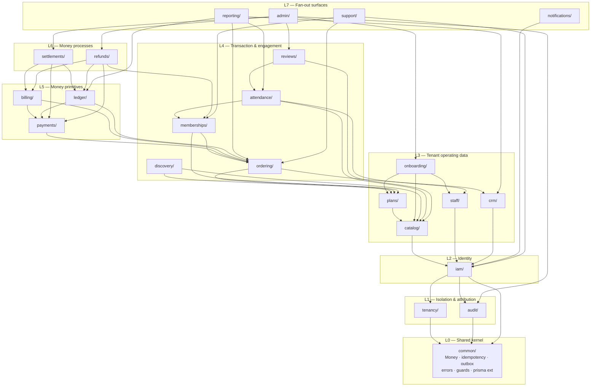
```mermaid
graph TD
  subgraph L0["L0 — Shared kernel"]
    COMMON["common/<br/>Money · idempotency · outbox<br/>errors · guards · prisma ext"]
  end

  subgraph L1["L1 — Isolation & attribution"]
    TENANCY["tenancy/"]
    AUDIT["audit/"]
  end

  subgraph L2["L2 — Identity"]
    IAM["iam/"]
  end

  subgraph L3["L3 — Tenant operating data"]
    CATALOG["catalog/"]
    PLANS["plans/"]
    STAFF["staff/"]
    CRM["crm/"]
    ONBOARDING["onboarding/"]
  end

  subgraph L4["L4 — Transaction & engagement"]
    ORDERING["ordering/"]
    MEMBERSHIPS["memberships/"]
    ATTENDANCE["attendance/"]
    REVIEWS["reviews/"]
    DISCOVERY["discovery/"]
  end

  subgraph L5["L5 — Money primitives"]
    PAYMENTS["payments/"]
    BILLING["billing/"]
    LEDGER["ledger/"]
  end

  subgraph L6["L6 — Money processes"]
    SETTLEMENTS["settlements/"]
    REFUNDS["refunds/"]
  end

  subgraph L7["L7 — Fan-out surfaces"]
    NOTIFICATIONS["notifications/"]
    REPORTING["reporting/"]
    SUPPORT["support/"]
    ADMIN["admin/"]
  end

  TENANCY --> COMMON
  AUDIT --> COMMON
  IAM --> COMMON
  IAM --> TENANCY
  IAM --> AUDIT

  CATALOG --> IAM
  PLANS --> CATALOG
  STAFF --> IAM
  CRM --> IAM
  ONBOARDING --> CATALOG
  ONBOARDING --> PLANS
  ONBOARDING --> STAFF

  DISCOVERY --> CATALOG
  DISCOVERY --> PLANS
  ORDERING --> PLANS
  ORDERING --> CRM
  MEMBERSHIPS --> PLANS
  MEMBERSHIPS --> ORDERING
  ATTENDANCE --> MEMBERSHIPS
  ATTENDANCE --> CATALOG
  ATTENDANCE --> STAFF
  REVIEWS --> ATTENDANCE
  REVIEWS --> CATALOG

  PAYMENTS --> ORDERING
  BILLING --> ORDERING
  BILLING --> PAYMENTS
  LEDGER --> ORDERING
  LEDGER --> PAYMENTS

  SETTLEMENTS --> LEDGER
  SETTLEMENTS --> PAYMENTS
  SETTLEMENTS --> BILLING
  REFUNDS --> LEDGER
  REFUNDS --> PAYMENTS
  REFUNDS --> BILLING
  REFUNDS --> MEMBERSHIPS

  NOTIFICATIONS --> IAM
  REPORTING --> LEDGER
  REPORTING --> ATTENDANCE
  REPORTING --> ORDERING
  REPORTING --> CRM
  SUPPORT --> IAM
  SUPPORT --> ORDERING
  SUPPORT --> MEMBERSHIPS
  ADMIN --> AUDIT
  ADMIN --> SETTLEMENTS
  ADMIN --> REFUNDS
  ADMIN --> REVIEWS
  ADMIN --> ONBOARDING
```

Event flow, which the graph deliberately does **not** draw as edges (because it would create visual
cycles that are not code cycles):

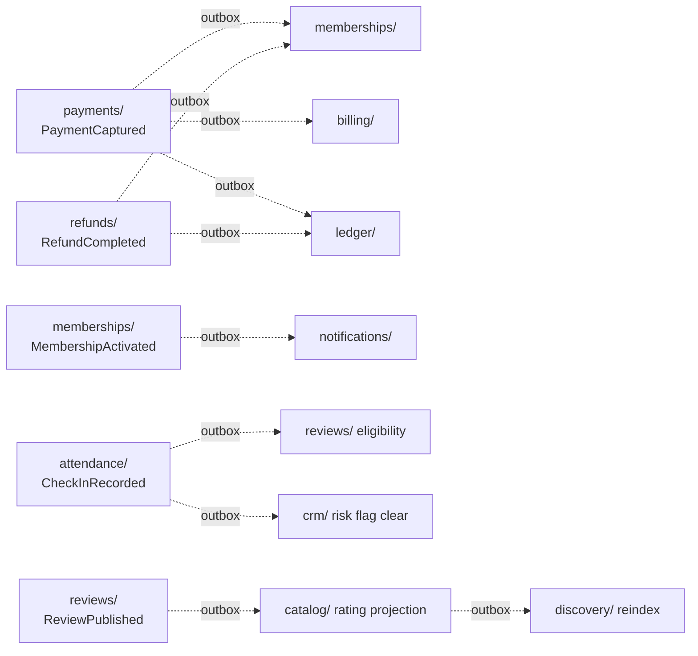
```mermaid
graph LR
  P["payments/<br/>PaymentCaptured"] -.->|outbox| M["memberships/"]
  P -.->|outbox| B["billing/"]
  P -.->|outbox| L["ledger/"]
  M2["memberships/<br/>MembershipActivated"] -.->|outbox| N["notifications/"]
  A["attendance/<br/>CheckInRecorded"] -.->|outbox| R["reviews/ eligibility"]
  A -.->|outbox| C["crm/ risk flag clear"]
  RF["refunds/<br/>RefundCompleted"] -.->|outbox| L
  RF -.->|outbox| M
  RV["reviews/<br/>ReviewPublished"] -.->|outbox| CA["catalog/ rating projection"]
  CA -.->|outbox| D["discovery/ reindex"]
```

### 4.3 Adjacency table

| Module | Layer | Depends on (synchronous, via `index.ts`) | Publishes events consumed by | Owns tables |
| :--- | :-: | :--- | :--- | :--- |
| `common/` | 0 | — | — | `idempotency_keys`, `outbox` |
| `tenancy/` | 1 | `common/` | — | — (owns the session variable, not a table) |
| `audit/` | 1 | `common/` | — | `audit_log` |
| `iam/` | 2 | `common/`, `tenancy/`, `audit/` | `notifications/`, `audit/` | `users`, `user_roles`, `roles`, `sessions`, `refresh_tokens`, `impersonations` |
| `catalog/` | 3 | `common/`, `tenancy/`, `iam/`, `audit/` | `discovery/`, `onboarding/`, `notifications/` | `gyms`, `branches`, `branch_hours`, `branch_hour_exceptions`, `gym_amenities`, `gym_media` |
| `plans/` | 3 | `common/`, `tenancy/`, `catalog/` | `discovery/`, `notifications/` | `plans`, `plan_branches`, `add_ons` |
| `staff/` | 3 | `common/`, `tenancy/`, `iam/`, `audit/` | `notifications/`, `audit/` | `staff`, `staff_branches`, `staff_invitations` |
| `crm/` | 3 | `common/`, `tenancy/`, `iam/` | `notifications/` | `members`, `member_notes`, `segments`, `leads` |
| `onboarding/` | 3 | `common/`, `tenancy/`, `catalog/`, `plans/`, `staff/`, `audit/` | `catalog/`, `notifications/`, `admin/` | `applications`, `kyc_documents` |
| `discovery/` | 4 | `common/`, `catalog/`, `plans/` (read models only) | — | `favourites`, `saved_searches`, `search_documents` |
| `ordering/` | 4 | `common/`, `tenancy/`, `plans/`, `crm/` | `payments/`, `billing/`, `ledger/`, `memberships/`, `notifications/` | `orders`, `order_items`, `coupons`, `coupon_redemptions`, `referrals` |
| `memberships/` | 4 | `common/`, `tenancy/`, `plans/`, `ordering/` | `attendance/`, `notifications/`, `crm/` | `memberships`, `membership_events`, `freezes` |
| `attendance/` | 4 | `common/`, `tenancy/`, `memberships/`, `catalog/`, `staff/` | `reviews/`, `crm/`, `reporting/`, `notifications/` | `attendance`, `checkin_tokens_revoked` |
| `reviews/` | 4 | `common/`, `tenancy/`, `attendance/`, `catalog/` | `catalog/` (rating projection), `admin/` | `reviews`, `review_responses`, `review_reports` |
| `payments/` | 5 | `common/`, `tenancy/`, `ordering/` | `memberships/`, `billing/`, `ledger/`, `refunds/`, `notifications/` | `payments`, `payment_events`, `provider_accounts` |
| `billing/` | 5 | `common/`, `tenancy/`, `ordering/`, `payments/` | `notifications/`, `settlements/` | `invoices`, `credit_notes`, `tax_profiles` (read), `subscription_invoices` |
| `ledger/` | 5 | `common/`, `tenancy/`, `ordering/`, `payments/` | `settlements/`, `reporting/` | `ledger_entries`, `wallet_entries` |
| `settlements/` | 6 | `common/`, `tenancy/`, `ledger/`, `payments/`, `billing/` | `notifications/`, `admin/` | `settlement_batches`, `settlement_lines`, `payout_accounts`, `reserves` |
| `refunds/` | 6 | `common/`, `tenancy/`, `ledger/`, `payments/`, `billing/`, `memberships/` | `ledger/`, `memberships/`, `notifications/`, `settlements/` | `refunds`, `disputes`, `dispute_evidence` |
| `notifications/` | 7 | `common/`, `iam/` | — | `notification_log`, `notification_templates` (read), `notification_preferences` |
| `reporting/` | 7 | `common/`, `tenancy/`, `ledger/`, `attendance/`, `ordering/`, `crm/` | `notifications/` | `report_definitions`, `export_jobs` |
| `support/` | 7 | `common/`, `iam/`, `ordering/`, `memberships/` | `notifications/` | `support_tickets`, `ticket_messages`, `help_articles` |
| `admin/` | 7 | `common/`, `audit/`, `onboarding/`, `settlements/`, `refunds/`, `reviews/` | all configurable modules (config-changed events) | `feature_flags`, `commission_rules`, `subscription_tiers`, `kyc_checklists`, `reason_codes`, `taxonomy` |

### 4.4 Acyclicity statement

**Claim.** The synchronous dependency graph over the 23 backend modules is a directed acyclic graph.

**Proof sketch.** Assign each module the integer layer `L(m)` from §4.3. Every synchronous edge
`a → b` in the adjacency table satisfies `L(a) > L(b)`, except within-layer edges, of which there are
exactly four: `plans/ → catalog/` (L3→L3), `onboarding/ → {catalog/, plans/, staff/}` (L3→L3),
`memberships/ → ordering/` (L4→L4), `attendance/ → memberships/` (L4→L4), and
`reviews/ → attendance/` (L4→L4). Within each layer a secondary total order is imposed and recorded
in the `dependency-cruiser` rule set:

- **L3 order:** `catalog/ < plans/ < staff/ < crm/ < onboarding/`
- **L4 order:** `discovery/ < ordering/ < memberships/ < attendance/ < reviews/`
- **L5 order:** `payments/ < billing/ < ledger/` — note `ledger/` depends on `payments/`, and
  `billing/` depends on `payments/`; neither depends on `ledger/`.

Since every edge strictly decreases the lexicographic pair `(layer, within-layer rank)`, no cycle can
exist. Any pull request that adds an edge violating the pair ordering fails the
`dependency-cruiser` job (A-23) with the rule name `no-upward-or-lateral-backedge`.

**What about the apparent cycles?** `payments/ → ordering/` and `ordering/`-consumes-`PaymentCaptured`
looks circular. It is not: the second direction is an outbox event handled in a *different*
transaction by an `ordering/` event-handler that imports nothing from `payments/` — it receives a
serialised payload typed in `packages/types`. The architecture test asserts that no event handler
imports the publishing module.

### 4.5 Allowed-dependency matrix

Rows import columns. **●** = permitted synchronous import · **▲** = permitted via domain event only ·
**—** = forbidden, build fails.

| ↓ imports → | common | tenancy | audit | iam | catalog | plans | staff | crm | onboard | discovery | ordering | membership | attendance | reviews | payments | billing | ledger | settlements | refunds | notif | reporting | support | admin |
| :--- | :-: | :-: | :-: | :-: | :-: | :-: | :-: | :-: | :-: | :-: | :-: | :-: | :-: | :-: | :-: | :-: | :-: | :-: | :-: | :-: | :-: | :-: | :-: |
| **common** | — | — | — | — | — | — | — | — | — | — | — | — | — | — | — | — | — | — | — | — | — | — | — |
| **tenancy** | ● | — | — | — | — | — | — | — | — | — | — | — | — | — | — | — | — | — | — | — | — | — | — |
| **audit** | ● | — | — | — | — | — | — | — | — | — | — | — | — | — | — | — | — | — | — | — | — | — | — |
| **iam** | ● | ● | ● | — | — | — | — | — | — | — | — | — | — | — | — | — | — | — | — | ▲ | — | — | — |
| **catalog** | ● | ● | ● | ● | — | — | — | — | ▲ | — | — | — | — | ▲ | — | — | — | — | — | ▲ | — | — | — |
| **plans** | ● | ● | ● | ● | ● | — | — | — | — | — | — | — | — | — | — | — | — | — | — | ▲ | — | — | — |
| **staff** | ● | ● | ● | ● | ● | — | — | — | — | — | — | — | — | — | — | — | — | — | — | ▲ | — | — | — |
| **crm** | ● | ● | ● | ● | — | — | ● | — | — | — | ▲ | ▲ | ▲ | — | — | — | — | — | — | ▲ | — | — | — |
| **onboarding** | ● | ● | ● | ● | ● | ● | ● | — | — | — | — | — | — | — | — | — | — | ● | — | ▲ | — | — | ▲ |
| **discovery** | ● | ● | — | — | ● | ● | — | — | — | — | — | — | — | ● | — | — | — | — | — | ▲ | — | — | — |
| **ordering** | ● | ● | ● | ● | ● | ● | ● | ● | — | — | — | ▲ | — | — | ▲ | ▲ | ▲ | — | ▲ | ▲ | — | — | — |
| **memberships** | ● | ● | ● | ● | ● | ● | — | ● | — | — | ● | — | ▲ | — | ▲ | — | — | — | ▲ | ▲ | — | — | — |
| **attendance** | ● | ● | ● | ● | ● | ● | ● | ▲ | — | — | — | ● | — | ▲ | — | — | — | — | — | ▲ | ▲ | — | — |
| **reviews** | ● | ● | ● | ● | ● | — | ● | — | — | — | — | — | ● | — | — | — | — | — | — | ▲ | — | — | ▲ |
| **payments** | ● | ● | ● | ● | — | — | — | — | — | — | ● | ▲ | — | — | — | ▲ | ▲ | — | ▲ | ▲ | — | — | — |
| **billing** | ● | ● | ● | ● | ● | ● | — | ● | — | — | ● | — | — | — | ● | — | — | ▲ | — | ▲ | — | — | — |
| **ledger** | ● | ● | ● | — | — | — | — | — | — | — | ● | ● | — | — | — | — | — | ▲ | — | — | ▲ | — | — |
| **settlements** | ● | ● | ● | ● | — | — | — | — | — | — | ● | — | — | — | ● | ● | ● | — | ● | ▲ | — | — | ▲ |
| **refunds** | ● | ● | ● | ● | — | — | — | — | — | — | ● | ● | ● | — | ● | ● | ● | ▲ | — | ▲ | — | — | ▲ |
| **notifications** | ● | ● | ● | ● | — | — | — | — | — | — | — | — | — | — | — | — | — | — | — | — | — | — | — |
| **reporting** | ● | ● | ● | ● | ● | ● | ● | ● | — | — | ● | ● | ● | ● | ● | ● | ● | ● | ● | ● | — | ● | — |
| **support** | ● | ● | ● | ● | — | — | — | ● | — | — | ● | ● | ● | — | ● | ● | — | — | ● | ▲ | — | — | — |
| **admin** | ● | ● | ● | ● | ● | ● | ● | ● | ● | ● | ● | ● | ● | ● | ● | ● | ● | ● | ● | ● | ● | ● | — |

Two rows deserve comment.

- **`reporting/`** may read almost everything, because `FR-RPT-05` requires drill-down from any total
  to its constituent records. It reads through published **query interfaces** (`application/queries/`),
  never repositories, and it has **no write path at all** — a `dependency-cruiser` rule forbids
  `reporting/` from importing any repository or use-case whose name begins with a mutating verb.
- **`admin/`** may reach everywhere for the same reason (`FR-ADMN-01` … `FR-ADMN-13` configure every
  module), but every one of its writes is a reason-required, audited command (`FR-ADMN-02`), and it
  may not import a domain entity — only a module's public command interface.

### 4.6 Shared kernel contents

The shared kernel is `common/` plus `packages/types` and `packages/utils`. Nothing enters it without
satisfying all three tests: (1) at least three modules need it, (2) it encodes a PRD-level rule
rather than a module-level one, (3) it has no dependency on any module.

| Kernel item | Location | PRD anchor | Why it is kernel and not module-local |
| :--- | :--- | :--- | :--- |
| `Money` value type `{ amountMinor: bigint, currency: string }` | `common/money`, contract in `packages/types` | `BR-PAY-01`, `NFR-DQ-02`, `§C1.5` | Nine modules move money; a second implementation is a defect class, not a duplication |
| `round_half_even` and proportional allocation | `packages/utils/money` | `A6.3`, `BR-REF-05` | Commission and refund reversal must round identically or statements stop tying out (`BR-FIN-03`) |
| `TenantId` branded type and `TenantContext` | `common/`, `tenancy/` | `BR-TEN-01` | A plain `string` tenant id is how isolation bugs get written |
| Prisma tenant-context client extension | `common/prisma` | A-01 approval condition, `§C1.4` step 2 | It is the *only* legitimate route to the database |
| `TenantScopedRepository` base class | `common/prisma` | `§C1.4` step 4 | Refuses to build a query without a context |
| Idempotency store and fingerprint | `common/idempotency` | `BR-PAY-03`, `§C1.5` | Used by orders, payments, refunds, check-in, imports |
| Outbox writer and dispatcher | `common/outbox` | `§C1.5` Events | The transactional guarantee is global, not per module |
| Error taxonomy + `ProblemDetails` mapper | `common/errors`, codes in `packages/types` | `§C1.5`, `NFR-USE-05` | Error codes are an API contract, versioned with the API |
| Correlation-id propagation (AsyncLocalStorage) | `common/logging` | `NFR-MNT-04` | Must cross HTTP → queue → job boundaries |
| Redaction list | `common/logging` | `BR-DAT-06`, `NFR-PRV-07` | Privacy is not per module |
| Cursor pagination codec | `common/pagination` | `§C3.1` | Cursor opacity is an API-wide contract |
| Rate-limit class registry | `common/ratelimit` | `NFR-SEC-06` | Classes are declared once and applied by decorator |
| Timezone-aware validity helpers | `packages/utils/time` | `BR-MEM-03`, `NFR-DQ-03` | Membership, attendance, reporting and jobs all need the *same* interpretation |
| Zod schemas and enums | `packages/types` | `NFR-SEC-05`, A-02 | Shared with three frontends — the reason Zod was chosen over class-validator |
| `Result<T, E>` | `packages/utils/result` | Constitution | Prevents exception-driven control flow across module boundaries |

**Why Zod and not class-validator, stated explicitly.** NestJS conventionally validates with
`class-validator` decorators on DTO classes. That approach is idiomatic and would work server-side.
It was **not** chosen because the decorators live on server classes and cannot be consumed by
`apps/customer-web`, `apps/gym-dashboard` or `apps/admin-dashboard`. `NFR-SEC-05` requires
server-side schema validation; `FR-CART-04` requires the client to render exactly what the server
computed; `SCR-DASH-002` requires per-step validation of a resumable wizard. A single Zod schema in
`packages/types` satisfies all three with one definition, feeds the NestJS `ZodValidationPipe`
(A-02), and feeds React Hook Form through its Zod resolver (A-09). The bridge is one custom pipe;
the alternative is maintaining two parallel validation definitions and reconciling them by review.
`class-validator` remains available and is not banned — it is simply not the default, and any use of
it must state why the schema cannot be shared.

---

## 5. Database ERD

### 5.1 Entity relationship diagram

All entities below are drawn from PRD `§C2.1` and `§C2.2`. Every table additionally carries
`id uuid pk`, `created_at`, `updated_at`, `created_by`, `updated_by` (`NFR-DQ-05`) and `deleted_at`
where soft deletion applies (`NFR-DQ-04`); these are omitted from the diagram for legibility.


```mermaid
erDiagram
  TENANTS ||--o{ GYMS : owns
  TENANTS ||--o{ KYC_DOCUMENTS : submits
  TENANTS ||--o{ APPLICATIONS : versions
  TENANTS ||--o{ STAFF : employs
  TENANTS ||--o{ COUPONS : issues
  TENANTS ||--o{ PAYOUT_ACCOUNTS : banks_with
  TENANTS ||--o{ SETTLEMENT_BATCHES : settles
  TENANTS ||--o{ LEDGER_ENTRIES : accrues
  TENANTS }o--|| SUBSCRIPTION_TIERS : subscribes
  TENANTS }o--|| TAX_PROFILES : taxed_by

  GYMS ||--o{ BRANCHES : has
  GYMS ||--o{ PLANS : sells
  GYMS ||--o{ GYM_AMENITIES : declares
  GYMS ||--o{ GYM_MEDIA : displays
  GYMS ||--o{ REVIEWS : receives
  GYMS ||--o{ FAVOURITES : saved_as
  GYMS }o--|| GYM_CATEGORIES : classified_as

  BRANCHES ||--o{ BRANCH_HOURS : opens
  BRANCHES ||--o{ BRANCH_HOUR_EXCEPTIONS : closes
  BRANCHES ||--o{ PLAN_BRANCHES : permits
  BRANCHES ||--o{ STAFF_BRANCHES : staffed_by
  BRANCHES ||--o{ ATTENDANCE : records

  PLANS ||--o{ PLAN_BRANCHES : restricted_to
  PLANS ||--o{ MEMBERSHIPS : purchased_as
  PLANS ||--o{ ORDERS : ordered_as
  PLANS ||--o{ ADD_ONS : offers

  USERS ||--o{ USER_ROLES : holds
  USERS ||--o{ MEMBERSHIPS : holds
  USERS ||--o{ ORDERS : places
  USERS ||--o{ REVIEWS : writes
  USERS ||--o{ FAVOURITES : keeps
  USERS ||--o{ REFERRALS : refers
  USERS ||--o{ SUPPORT_TICKETS : raises
  USERS ||--o{ STAFF : employed_as
  USERS ||--o{ NOTIFICATION_PREFERENCES : configures
  USER_ROLES }o--|| ROLES : of_type

  ORDERS ||--o{ ORDER_ITEMS : itemises
  ORDERS ||--o{ PAYMENTS : paid_by
  ORDERS ||--o| INVOICES : invoiced_by
  ORDERS ||--o{ REFUNDS : refunded_by
  ORDERS ||--o| MEMBERSHIPS : creates
  ORDERS ||--o{ COUPON_REDEMPTIONS : redeems
  ORDERS }o--o| COUPONS : discounted_by

  PAYMENTS ||--o{ PAYMENT_EVENTS : logs
  PAYMENTS ||--o{ DISPUTES : disputed_by
  PAYMENTS ||--o{ REFUNDS : reversed_by

  INVOICES ||--o{ CREDIT_NOTES : corrected_by
  REFUNDS ||--o| CREDIT_NOTES : issues

  MEMBERSHIPS ||--o{ ATTENDANCE : generates
  MEMBERSHIPS ||--o{ MEMBERSHIP_EVENTS : journals
  MEMBERSHIPS ||--o{ REVIEWS : entitles
  MEMBERSHIPS ||--o{ FREEZES : suspended_by

  LEDGER_ENTRIES }o--o| SETTLEMENT_BATCHES : batched_into
  SETTLEMENT_BATCHES ||--o{ SETTLEMENT_LINES : itemises
  SETTLEMENT_LINES }o--|| LEDGER_ENTRIES : derived_from

  REVIEWS ||--o| REVIEW_RESPONSES : answered_by
  REVIEWS ||--o{ REVIEW_REPORTS : flagged_by

  STAFF ||--o{ STAFF_BRANCHES : assigned_to
  STAFF ||--o{ ATTENDANCE : performs
  STAFF ||--o{ PAYMENTS : collects

  CRM_MEMBERS ||--o{ MEMBER_NOTES : annotated_by
  CRM_MEMBERS ||--o| USERS : identified_by
  LEADS }o--|| BRANCHES : enquires_at

  SUPPORT_TICKETS ||--o{ TICKET_MESSAGES : threads
  OUTBOX ||--o{ NOTIFICATION_LOG : triggers
  AUDIT_LOG }o--o| USERS : actor
```

### 5.2 Cardinality notes and the rules they encode

| Relationship | Cardinality | Rule it encodes |
| :--- | :--- | :--- |
| `users` ↔ `tenants` | many-to-many through `staff` + `user_roles` | One owner account may own multiple tenants (`BR-TEN-02`). Tenant context is explicit per session, never inferred (`FR-AUTH-11`). |
| `tenants` → `gyms` | 1 : N | A tenant may operate multiple gyms; the tenant is the unit of isolation, the gym is the unit of listing. |
| `gyms` → `branches` | 1 : N, exactly one `is_primary` | `BR-TEN-03`. A gym always has at least one branch; the primary carries the canonical address for `BR-GYM-08` geo tolerance. |
| `plans` ↔ `branches` | 0 : N through `plan_branches` | **Absence of rows means all branches** (`§C2.2`). This is a deliberate open-world encoding so that adding a branch does not silently un-sell existing plans; `FR-GYM-08` and `BR-CHK-03` read it at check-in. |
| `users` → `memberships` | 1 : N | A member may hold concurrent memberships at *different* gyms; at the *same* gym only when plans are stackable (`BR-MEM-04`). Enforced by a partial unique index on `(user_id, gym_id)` where `status IN ('PENDING','ACTIVE','FROZEN')` and the plan is non-stackable. |
| `orders` → `memberships` | 1 : 0..1 | An order creates at most one membership. `PENDING` orders that expire create none (`FR-CART-05`). |
| `orders` → `payments` | 1 : N | Retries (`FR-PAY-06`) and duplicates (`BR-PAY-07`) both produce additional payment rows; exactly one may reach `CAPTURED` without triggering the duplicate detector. |
| `payments` → `payment_events` | 1 : N, `provider_event_id` globally unique | `BR-PAY-05` replay protection and `FR-PAY-04` deduplication. |
| `orders` → `invoices` | 1 : 0..1 | One invoice per order (`BR-PAY-10`); a partial-payment order gets its single consolidated invoice at full payment (`AC-CART-02.3`). |
| `invoices` → `credit_notes` | 1 : N | Corrections are never edits (`FR-INV-03`); a partially-refunded order can accumulate several credit notes. |
| `memberships` → `attendance` | 1 : N, partitioned monthly | `NFR-SCAL-06`. `token_nonce` unique within TTL gives `BR-CHK-06` idempotency. |
| `memberships` → `reviews` | 1 : 0..1 | One review per member per gym **per membership term** (`BR-REV-02`) — the term is why the FK is to `membership_id`, not `user_id` + `gym_id`. |
| `reviews` → `review_responses` | 1 : 0..1 | `BR-REV-05`: one response, and no delete path for the gym. |
| `ledger_entries` → `settlement_batches` | N : 0..1 | An entry is unbatched until a batch claims it; `BR-FIN-06` holds fee-less lines out of settlement by leaving `settlement_batch_id` null. |
| `settlement_batches` → `settlement_lines` | 1 : N | Lines sum exactly to the payout including opening balance, reserve and refund lines (`BR-FIN-03`). |
| `payments` → `disputes` | 1 : N | A payment can be disputed more than once across its life; each opens its own case with its own deadline (`BR-REF-08`). |
| `tenants` → `applications` | 1 : N versioned | Unlimited resubmission with prior versions retained (`BR-GYM-05`); the reviewer sees a fixed snapshot (`FR-ONB-08`). |
| `audit_log` → everything | polymorphic `(entity_type, entity_id)` | No FKs, because audit must survive the deletion of what it describes (`CON-04`, `NFR-PRV-04`). |

### 5.3 Tenant-owned (RLS) versus platform-global

**Rule.** Every table in the left column has `tenant_id NOT NULL`, RLS enabled, and the policy
`USING (tenant_id = current_setting('app.tenant_id')::uuid)`. The application role has **no
`BYPASSRLS`** (`§C1.4` step 3, `NFR-SEC-09`). Every table in the right column is exempt and is
managed only by `admin/` with an audited, reason-required write path.

| Tenant-owned — RLS enforced | Platform-global — RLS exempt |
| :--- | :--- |
| `gyms`, `branches`, `branch_hours`, `branch_hour_exceptions`, `gym_amenities`, `gym_media` | `countries`, `cities`, `localities` |
| `plans`, `plan_branches`, `add_ons` | `amenities`, `gym_categories` |
| `memberships`, `membership_events`, `freezes` | `subscription_tiers` |
| `orders`, `order_items`, `coupon_redemptions` | `tax_profiles` |
| `coupons` **where `scope = 'TENANT'`** | `coupons` **where `scope = 'PLATFORM'`** |
| `payments`, `payment_events` | `kyc_checklists` |
| `invoices`, `credit_notes`, `subscription_invoices` | `reason_codes` (rejection, denial, refund, moderation, override) |
| `attendance` (partitioned monthly) | `feature_flags` |
| `crm_members`, `member_notes`, `segments`, `leads` | `notification_templates` |
| `staff`, `staff_branches`, `staff_invitations` | `roles`, `permissions` |
| `reviews`, `review_responses`, `review_reports` | `help_articles` |
| `ledger_entries`, `wallet_entries` | `commission_rules` (global and tier rows) |
| `settlement_batches`, `settlement_lines`, `payout_accounts`, `reserves` | — |
| `refunds`, `disputes`, `dispute_evidence` | — |
| `applications`, `kyc_documents` | — |
| `notification_log` (tenant-addressed messages) | — |
| `outbox` (tenant-scoped aggregates) | — |
| `export_jobs`, `report_definitions` (tenant-defined) | — |

**Three tables need a special ruling.**

| Table | Ruling | Reason |
| :--- | :--- | :--- |
| `users` | **Platform-global identity, tenant-scoped exposure.** No `tenant_id` column. A user is visible to a tenant only through a `memberships`, `crm_members`, `staff` or `orders` row that *is* tenant-scoped. | A single identity may hold roles across multiple tenants (`FR-AUTH-11`). Putting `tenant_id` on `users` would either duplicate people or leak them. |
| `audit_log` | **Has `tenant_id` and RLS, plus a platform-scope read policy.** Append-only; the application role has no `UPDATE`/`DELETE`. | `BR-DAT-01` requires tenant-scoped audit for the owner's own log (`B3.2` "View audit log ▪"), while `FR-ADMN-09` requires a platform-wide explorer — served through the named, audited elevation of `§C1.4`. |
| `coupons` | **Split policy on `scope`.** RLS policy is `scope = 'PLATFORM' OR tenant_id = current_setting(...)`. | `FR-CPN-02` requires platform-wide coupons usable at any tenant alongside tenant-only coupons. |

**Migration path to schema-per-tenant.** Because no tenant-scope code path contains a cross-tenant
join, and because every query already carries the tenant variable, a large tenant can be moved to a
dedicated schema by changing the connection's `search_path` — with no application code change
(`§C1.4`, Baseline Decisions "Tenancy isolation").

---

## 6. API Catalogue

### 6.1 Conventions in force

Reproduced from `§C3.1` and binding on every row below.

| Aspect | Value |
| :--- | :--- |
| Base | `https://api.<domain>/v1` |
| Format | JSON, `snake_case` |
| Auth header | `Authorization: Bearer <access_token>` (access token 15 min, `FR-AUTH-06`) |
| Tenant | Derived from token or resource. **Never accepted from the client** (`§C1.4` step 1) |
| Idempotency | `Idempotency-Key` **required** on any `POST`/`PUT`/`PATCH`/`DELETE` affecting money or membership state (`BR-PAY-03`) |
| Pagination | Cursor: `?limit=&cursor=`, response `next_cursor` |
| Errors | `{ error: { code, message, details[], correlation_id } }` |
| Permission | Every endpoint declares one; an endpoint without a declared permission fails CI (`FR-RBAC-01`) |

### 6.2 Rate-limit classes

| Class | Budget | Applied to | PRD anchor |
| :--- | :--- | :--- | :--- |
| `RL-OTP` | 3 sends / 30 min per number · 5 verify attempts per code · 20 / h per IP | OTP request and verify | `FR-AUTH-05` |
| `RL-AUTH` | 10 / 15 min per identifier, then lockout · 60 / h per IP | login, register, password reset, MFA | `FR-AUTH-08`, `NFR-SEC-06` |
| `RL-PAY` | 10 / min per user · 60 / min per tenant | intent creation, retry, refund request | `NFR-SEC-06` |
| `RL-SCAN` | 600 / min per branch · 60 / min per staff device | `/checkin/*` | `NFR-PERF-08` (500/min platform-wide headroom) |
| `RL-SEARCH` | 60 / min per session · 600 / min per IP | `/search/*`, `/compare` | `NFR-PERF-09` (2,000/min sustained) |
| `RL-PUBLIC` | 120 / min per IP | unauthenticated reads of gym, city, category, amenity data | `CON-02` third-party budget |
| `RL-WRITE` | 60 / min per user | authenticated tenant and member mutations | `NFR-SEC-06` |
| `RL-READ` | 300 / min per user | authenticated reads | `NFR-SEC-06` |
| `RL-EXPORT` | 5 / h per tenant · 3 / day per user | async exports and bulk imports | `FR-RPT-03`, `NFR-PERF-06` |
| `RL-ADMIN` | 300 / min per staff user | `/admin/*` | `NFR-SEC-06` |
| `RL-WEBHOOK` | 3,000 / min per provider, signature-gated before counting | `/webhooks/*` | `BR-PAY-05` |

Idempotency column values: **REQ** = `Idempotency-Key` required, 409 on fingerprint mismatch ·
**OPT** = accepted and honoured if supplied · **N/A** = safe method, no key.

### 6.3 `API-AUTH` — Authentication

| Method | Path | Auth | Permission | Idem | Rate class |
| :--- | :--- | :--- | :--- | :-: | :--- |
| POST | `/auth/otp/request` | — | `public:auth.otp.request` | OPT | `RL-OTP` |
| POST | `/auth/otp/verify` | — | `public:auth.otp.verify` | OPT | `RL-OTP` |
| POST | `/auth/register` | — | `public:auth.register` | REQ | `RL-AUTH` |
| POST | `/auth/login` | — | `public:auth.login` | N/A | `RL-AUTH` |
| POST | `/auth/refresh` | Refresh cookie | `session:refresh` | REQ | `RL-AUTH` |
| POST | `/auth/logout` | Yes | `session:revoke.self` | OPT | `RL-WRITE` |
| POST | `/auth/password/forgot` | — | `public:auth.password.forgot` | OPT | `RL-AUTH` |
| POST | `/auth/password/reset` | Reset token | `public:auth.password.reset` | REQ | `RL-AUTH` |
| GET | `/auth/sessions` | Yes | `session:list.self` | N/A | `RL-READ` |
| DELETE | `/auth/sessions/:id` | Yes | `session:revoke.self` | REQ | `RL-WRITE` |
| POST | `/auth/mfa/enrol` | Yes | `mfa:enrol.self` | REQ | `RL-AUTH` |
| POST | `/auth/mfa/verify` | Yes | `mfa:verify.self` | OPT | `RL-AUTH` |
| POST | `/auth/impersonate` | Support + MFA | `user:impersonate` | REQ | `RL-ADMIN` |
| POST | `/auth/impersonate/end` | Impersonation token | `user:impersonate.end` | REQ | `RL-ADMIN` |
| POST | `/auth/tenant-context` | Yes | `tenant:context.switch` | REQ | `RL-WRITE` |

`/auth/impersonate` additionally refuses every financial mutation for the issued token (`FR-AUTH-12`,
`AC-AUTH-03.2`) and writes an `audit_log` row visible to the impersonated user (`BR-DAT-02`).

### 6.4 `API-USER` — Users

| Method | Path | Auth | Permission | Idem | Rate class |
| :--- | :--- | :--- | :--- | :-: | :--- |
| GET | `/me` | Yes | `user:read.self` | N/A | `RL-READ` |
| PATCH | `/me` | Yes | `user:update.self` | REQ | `RL-WRITE` |
| GET | `/me/preferences` | Yes | `preference:read.self` | N/A | `RL-READ` |
| PUT | `/me/preferences` | Yes | `preference:update.self` | REQ | `RL-WRITE` |
| GET | `/me/activity` | Yes | `activity:read.self` | N/A | `RL-READ` |
| POST | `/me/export` | Yes | `user:export.self` | REQ | `RL-EXPORT` |
| POST | `/me/delete-request` | Yes | `user:delete.self` | REQ | `RL-WRITE` |
| DELETE | `/me/delete-request` | Yes | `user:delete.cancel.self` | REQ | `RL-WRITE` |
| POST | `/me/phone/change` | Yes | `user:contact.change.self` | REQ | `RL-OTP` |
| POST | `/me/email/change` | Yes | `user:contact.change.self` | REQ | `RL-AUTH` |
| GET | `/me/notifications` | Yes | `notification:read.self` | N/A | `RL-READ` |
| POST | `/me/notifications/:id/read` | Yes | `notification:update.self` | OPT | `RL-WRITE` |

### 6.5 `API-DISC` — Discovery (public)

| Method | Path | Auth | Permission | Idem | Rate class |
| :--- | :--- | :--- | :--- | :-: | :--- |
| GET | `/search/gyms` | Optional | `public:gym.search` | N/A | `RL-SEARCH` |
| GET | `/search/suggest` | Optional | `public:gym.suggest` | N/A | `RL-SEARCH` |
| GET | `/gyms/:slug` | Optional | `public:gym.read` | N/A | `RL-PUBLIC` |
| GET | `/gyms/:slug/plans` | Optional | `public:plan.list` | N/A | `RL-PUBLIC` |
| GET | `/gyms/:slug/reviews` | Optional | `public:review.list` | N/A | `RL-PUBLIC` |
| GET | `/gyms/:slug/similar` | Optional | `public:gym.similar` | N/A | `RL-PUBLIC` |
| POST | `/compare` | Optional | `public:gym.compare` | N/A | `RL-SEARCH` |
| GET | `/cities` | Optional | `public:city.list` | N/A | `RL-PUBLIC` |
| GET | `/cities/:slug` | Optional | `public:city.read` | N/A | `RL-PUBLIC` |
| GET | `/categories` | Optional | `public:category.list` | N/A | `RL-PUBLIC` |
| GET | `/categories/:slug` | Optional | `public:category.read` | N/A | `RL-PUBLIC` |
| GET | `/amenities` | Optional | `public:amenity.list` | N/A | `RL-PUBLIC` |

Every endpoint in this group filters on `APPROVED`, non-suspended, `visibility = PUBLIC`
(`FR-SRCH-09`, `BR-GYM-01`, `BR-PLN-05`, `BR-TEN-05`) and is exempt from tenant RLS by design: it
reads the platform-scope search read model, not tenant tables.

### 6.6 `API-FAV` — Favourites and saved searches

| Method | Path | Auth | Permission | Idem | Rate class |
| :--- | :--- | :--- | :--- | :-: | :--- |
| GET | `/me/favourites` | Yes | `favourite:list.self` | N/A | `RL-READ` |
| POST | `/me/favourites` | Yes | `favourite:create.self` | OPT | `RL-WRITE` |
| DELETE | `/me/favourites/:gymId` | Yes | `favourite:delete.self` | OPT | `RL-WRITE` |
| GET | `/me/saved-searches` | Yes | `saved_search:list.self` | N/A | `RL-READ` |
| POST | `/me/saved-searches` | Yes | `saved_search:create.self` | OPT | `RL-WRITE` |
| DELETE | `/me/saved-searches/:id` | Yes | `saved_search:delete.self` | OPT | `RL-WRITE` |

### 6.7 `API-ORD` — Orders and checkout

| Method | Path | Auth | Permission | Idem | Rate class |
| :--- | :--- | :--- | :--- | :-: | :--- |
| POST | `/orders` | Yes | `order:create.self` | **REQ** | `RL-PAY` |
| GET | `/orders/:ref` | Yes | `order:read.self` | N/A | `RL-READ` |
| POST | `/orders/:ref/coupon` | Yes | `order:coupon.apply.self` | REQ | `RL-WRITE` |
| DELETE | `/orders/:ref/coupon` | Yes | `order:coupon.remove.self` | REQ | `RL-WRITE` |
| POST | `/orders/:ref/validate` | Yes | `order:validate.self` | OPT | `RL-PAY` |
| POST | `/orders/:ref/cancel` | Yes | `order:cancel.self` | **REQ** | `RL-WRITE` |
| GET | `/me/orders` | Yes | `order:list.self` | N/A | `RL-READ` |

`POST /orders` never accepts an amount (`FR-CART-04`, `BR-PAY-04`). `POST /orders/:ref/validate`
returns `422 PLAN_PRICE_CHANGED` with previous and current values rather than charging either figure
(`AC-PLAN-02.2`).

### 6.8 `API-PAY` — Payments

| Method | Path | Auth | Permission | Idem | Rate class |
| :--- | :--- | :--- | :--- | :-: | :--- |
| POST | `/orders/:ref/payment-intent` | Yes | `payment:intent.create.self` | **REQ** | `RL-PAY` |
| GET | `/payments/:id` | Yes | `payment:read.self` | N/A | `RL-READ` |
| POST | `/payments/:id/retry` | Yes | `payment:retry.self` | **REQ** | `RL-PAY` |
| POST | `/webhooks/payments/:provider` | Signature + IP allow-list | `system:webhook.payment` | **REQ** (provider event id) | `RL-WEBHOOK` |

The webhook endpoint is unauthenticated in the bearer-token sense and authenticated in every sense
that matters: signature verification, IP guard, `provider_event_id` uniqueness for replay protection
(`BR-PAY-05`), and idempotent handling (`FR-PAY-04`). An unverified webhook is logged and discarded,
never processed.

### 6.9 `API-MEMB` — Memberships

| Method | Path | Auth | Permission | Idem | Rate class |
| :--- | :--- | :--- | :--- | :-: | :--- |
| GET | `/me/memberships` | Yes | `membership:list.self` | N/A | `RL-READ` |
| GET | `/me/memberships/:id` | Yes | `membership:read.self` | N/A | `RL-READ` |
| POST | `/me/memberships/:id/freeze` | Yes | `membership:freeze.self` | **REQ** | `RL-WRITE` |
| POST | `/me/memberships/:id/unfreeze` | Yes | `membership:unfreeze.self` | **REQ** | `RL-WRITE` |
| POST | `/me/memberships/:id/renew` | Yes | `membership:renew.self` | **REQ** | `RL-PAY` |
| PATCH | `/me/memberships/:id/auto-renew` | Yes | `membership:autorenew.self` | REQ | `RL-WRITE` |
| POST | `/me/memberships/:id/qr` | Yes | `membership:token.issue.self` | OPT | `RL-WRITE` |
| GET | `/me/attendance` | Yes | `attendance:list.self` | N/A | `RL-READ` |
| GET | `/tenant/memberships` | Yes | `tenant.membership:list` | N/A | `RL-READ` |
| POST | `/tenant/memberships/:id/transfer` | Yes | `tenant.membership:transfer` | **REQ** | `RL-WRITE` |

### 6.10 `API-CHK` — Check-in

| Method | Path | Auth | Permission | Idem | Rate class |
| :--- | :--- | :--- | :--- | :-: | :--- |
| POST | `/checkin/scan` | Yes (staff) | `attendance:scan` | **REQ** (`token_nonce`) | `RL-SCAN` |
| POST | `/checkin/manual` | Yes (staff) | `attendance:manual` | **REQ** | `RL-SCAN` |
| POST | `/checkin/:id/checkout` | Yes (staff) | `attendance:checkout` | REQ | `RL-SCAN` |
| POST | `/checkin/override` | Yes (staff) | `attendance:override` | **REQ** | `RL-SCAN` |
| GET | `/tenant/attendance` | Yes | `tenant.attendance:list` | N/A | `RL-READ` |
| GET | `/tenant/attendance/heatmap` | Yes | `tenant.attendance:aggregate` | N/A | `RL-READ` |
| GET | `/tenant/attendance/live` | Yes | `tenant.attendance:live` | N/A | `RL-READ` |

`/tenant/attendance/live` is the single polled endpoint behind `useLiveCounters()` (A-08). It returns
the currently-in-gym count (`SCR-DASH-001`), the recent check-ins strip (`SCR-DASH-009`) and a
`generated_at` timestamp that the UI renders as the mandatory "last updated" indicator. A denied scan
returns **`200` with `result: "DENIED"`**, not a 4xx — it is a successful evaluation with a negative
result and the scanner needs the full context to act (`§C3.3`).

### 6.11 `API-TEN` — Tenant management

| Method | Path | Auth | Permission | Idem | Rate class |
| :--- | :--- | :--- | :--- | :-: | :--- |
| POST | `/tenants` | Yes | `tenant:create` | REQ | `RL-WRITE` |
| GET | `/tenant` | Yes | `tenant:read` | N/A | `RL-READ` |
| PATCH | `/tenant` | Yes | `tenant:update` | REQ | `RL-WRITE` |
| GET | `/tenant/settings` | Yes | `tenant.settings:read` | N/A | `RL-READ` |
| PUT | `/tenant/settings` | Yes | `tenant.settings:update` | REQ | `RL-WRITE` |
| GET | `/tenant/applications` | Yes | `application:read` | N/A | `RL-READ` |
| POST | `/tenant/applications` | Yes | `application:submit` | **REQ** | `RL-WRITE` |
| GET | `/tenant/kyc-documents` | Yes | `kyc:read` | N/A | `RL-READ` |
| POST | `/tenant/kyc-documents` | Yes | `kyc:upload` | REQ | `RL-WRITE` |
| DELETE | `/tenant/kyc-documents/:id` | Yes | `kyc:delete` | REQ | `RL-WRITE` |
| GET | `/tenant/gyms` | Yes | `gym:list` | N/A | `RL-READ` |
| POST | `/tenant/gyms` | Yes | `gym:create` | REQ | `RL-WRITE` |
| GET | `/tenant/gyms/:id` | Yes | `gym:read` | N/A | `RL-READ` |
| PATCH | `/tenant/gyms/:id` | Yes | `gym:update` | REQ | `RL-WRITE` |
| POST | `/tenant/gyms/:id/media` | Yes | `gym.media:create` | REQ | `RL-EXPORT` |
| DELETE | `/tenant/gyms/:id/media/:mediaId` | Yes | `gym.media:delete` | REQ | `RL-WRITE` |
| GET | `/tenant/branches` | Yes | `branch:list` | N/A | `RL-READ` |
| POST | `/tenant/branches` | Yes | `branch:create` | REQ | `RL-WRITE` |
| PATCH | `/tenant/branches/:id` | Yes | `branch:update` | REQ | `RL-WRITE` |
| DELETE | `/tenant/branches/:id` | Yes | `branch:deactivate` | REQ | `RL-WRITE` |
| PUT | `/tenant/branches/:id/hours` | Yes | `branch.hours:update` | REQ | `RL-WRITE` |
| GET | `/tenant/plans` | Yes | `plan:list` | N/A | `RL-READ` |
| POST | `/tenant/plans` | Yes | `plan:create` | REQ | `RL-WRITE` |
| GET | `/tenant/plans/:id` | Yes | `plan:read` | N/A | `RL-READ` |
| PATCH | `/tenant/plans/:id` | Yes | `plan:update` | REQ | `RL-WRITE` |
| POST | `/tenant/plans/:id/publish` | Yes | `plan:publish` | REQ | `RL-WRITE` |
| POST | `/tenant/plans/:id/archive` | Yes | `plan:archive` | REQ | `RL-WRITE` |
| POST | `/tenant/plans/:id/duplicate` | Yes | `plan:duplicate` | REQ | `RL-WRITE` |
| GET | `/tenant/members` | Yes | `member:list` | N/A | `RL-READ` |
| POST | `/tenant/members` | Yes | `member:create` | REQ | `RL-WRITE` |
| GET | `/tenant/members/:id` | Yes | `member:read` | N/A | `RL-READ` |
| PATCH | `/tenant/members/:id` | Yes | `member:update` | REQ | `RL-WRITE` |
| POST | `/tenant/members/import` | Yes | `member:import` | **REQ** | `RL-EXPORT` |
| GET | `/tenant/members/:id/notes` | Yes | `member.note:list` | N/A | `RL-READ` |
| POST | `/tenant/members/:id/notes` | Yes | `member.note:create` | REQ | `RL-WRITE` |
| GET | `/tenant/staff` | Yes | `staff:list` | N/A | `RL-READ` |
| POST | `/tenant/staff` | Yes | `staff:invite` | REQ | `RL-WRITE` |
| PATCH | `/tenant/staff/:id` | Yes | `staff:update` | REQ | `RL-WRITE` |
| DELETE | `/tenant/staff/:id` | Yes | `staff:remove` | REQ | `RL-WRITE` |
| GET | `/tenant/coupons` | Yes | `coupon:list` | N/A | `RL-READ` |
| POST | `/tenant/coupons` | Yes | `coupon:create` | REQ | `RL-WRITE` |
| PATCH | `/tenant/coupons/:id` | Yes | `coupon:update` | REQ | `RL-WRITE` |
| GET | `/tenant/orders` | Yes | `tenant.order:list` | N/A | `RL-READ` |
| POST | `/tenant/orders/offline` | Yes | `tenant.order:create.offline` | **REQ** | `RL-PAY` |
| POST | `/tenant/orders/:ref/collect-balance` | Yes | `tenant.order:collect_balance` | **REQ** | `RL-PAY` |
| GET | `/tenant/payments` | Yes | `tenant.payment:list` | N/A | `RL-READ` |
| GET | `/tenant/invoices` | Yes | `invoice:list` | N/A | `RL-READ` |
| GET | `/tenant/settlements` | Yes | `settlement:list` | N/A | `RL-READ` |
| GET | `/tenant/settlements/:id` | Yes | `settlement:read` | N/A | `RL-READ` |
| GET | `/tenant/refunds` | Yes | `refund:list` | N/A | `RL-READ` |
| POST | `/tenant/refunds` | Yes | `refund:create` | **REQ** | `RL-PAY` |
| GET | `/tenant/reviews` | Yes | `tenant.review:list` | N/A | `RL-READ` |
| POST | `/tenant/reviews/:id/respond` | Yes | `tenant.review:respond` | REQ | `RL-WRITE` |
| POST | `/tenant/reviews/:id/report` | Yes | `tenant.review:report` | REQ | `RL-WRITE` |
| GET | `/tenant/leads` | Yes | `lead:list` | N/A | `RL-READ` |
| POST | `/tenant/leads` | Yes | `lead:create` | REQ | `RL-WRITE` |
| PATCH | `/tenant/leads/:id` | Yes | `lead:update` | REQ | `RL-WRITE` |
| GET | `/tenant/reports/:reportKey` | Yes | `report:read` | N/A | `RL-READ` |
| POST | `/tenant/exports` | Yes | `export:create` | **REQ** | `RL-EXPORT` |
| GET | `/tenant/payout-account` | Yes | `payout_account:read` | N/A | `RL-READ` |
| PUT | `/tenant/payout-account` | Yes | `payout_account:update` | **REQ** | `RL-PAY` |

`PUT /tenant/payout-account` suspends payouts until re-verification (`BR-GYM-06`) and is one of only
three endpoints that an impersonation token may never call (`FR-AUTH-12`), alongside
`POST /orders/:ref/payment-intent` and `POST /me/memberships/:id/refund-request`.

### 6.12 `API-REV` — Reviews (member-facing)

| Method | Path | Auth | Permission | Idem | Rate class |
| :--- | :--- | :--- | :--- | :-: | :--- |
| GET | `/me/reviews` | Yes | `review:list.self` | N/A | `RL-READ` |
| GET | `/gyms/:slug/reviews/eligibility` | Yes | `review:eligibility.self` | N/A | `RL-READ` |
| POST | `/gyms/:slug/reviews` | Yes | `review:create.self` | REQ | `RL-WRITE` |
| PATCH | `/reviews/:id` | Yes | `review:update.self` | REQ | `RL-WRITE` |
| DELETE | `/reviews/:id` | Yes | `review:delete.self` | REQ | `RL-WRITE` |
| POST | `/reviews/:id/report` | Yes | `review:report` | REQ | `RL-WRITE` |

`POST /gyms/:slug/reviews` returns **403** when the caller has no recorded check-in at that gym, even
by direct API call (`AC-REV-02.1`, `BR-REV-01`).

### 6.13 `API-RFND` — Refunds (member-facing)

| Method | Path | Auth | Permission | Idem | Rate class |
| :--- | :--- | :--- | :--- | :-: | :--- |
| POST | `/me/memberships/:id/refund-request` | Yes | `refund:request.self` | **REQ** | `RL-PAY` |
| GET | `/me/refunds` | Yes | `refund:list.self` | N/A | `RL-READ` |
| GET | `/me/refunds/:id` | Yes | `refund:read.self` | N/A | `RL-READ` |

### 6.14 `API-ADM` — Platform administration

| Method | Path | Auth | Permission | Idem | Rate class |
| :--- | :--- | :--- | :--- | :-: | :--- |
| GET | `/admin/applications` | Staff + MFA | `admin.application:list` | N/A | `RL-ADMIN` |
| GET | `/admin/applications/:id` | Staff + MFA | `admin.application:read` | N/A | `RL-ADMIN` |
| POST | `/admin/applications/:id/approve` | Staff + MFA | `admin.application:approve` | **REQ** | `RL-ADMIN` |
| POST | `/admin/applications/:id/reject` | Staff + MFA | `admin.application:reject` | **REQ** | `RL-ADMIN` |
| POST | `/admin/applications/:id/request-info` | Staff + MFA | `admin.application:request_info` | REQ | `RL-ADMIN` |
| POST | `/admin/applications/:id/assign` | Staff + MFA | `admin.application:assign` | REQ | `RL-ADMIN` |
| GET | `/admin/tenants` | Staff + MFA | `admin.tenant:list` | N/A | `RL-ADMIN` |
| GET | `/admin/tenants/:id` | Staff + MFA | `admin.tenant:read` | N/A | `RL-ADMIN` |
| PATCH | `/admin/tenants/:id` | Staff + MFA | `admin.tenant:update` | REQ | `RL-ADMIN` |
| POST | `/admin/tenants/:id/suspend` | Staff + MFA | `admin.tenant:suspend` | **REQ** | `RL-ADMIN` |
| POST | `/admin/tenants/:id/reinstate` | Staff + MFA | `admin.tenant:reinstate` | **REQ** | `RL-ADMIN` |
| POST | `/admin/tenants/:id/commission-override` | Staff + MFA | `admin.tenant:commission_override` | **REQ** | `RL-ADMIN` |
| POST | `/admin/tenants/:id/tier` | Staff + MFA | `admin.tenant:tier_change` | **REQ** | `RL-ADMIN` |
| GET | `/admin/users` | Staff + MFA | `admin.user:list` | N/A | `RL-ADMIN` |
| GET | `/admin/users/:id` | Staff + MFA | `admin.user:read` | N/A | `RL-ADMIN` |
| GET | `/admin/orders` | Staff + MFA | `admin.order:list` | N/A | `RL-ADMIN` |
| GET | `/admin/payments` | Staff + MFA | `admin.payment:list` | N/A | `RL-ADMIN` |
| GET | `/admin/settlements` | Staff + MFA | `admin.settlement:list` | N/A | `RL-ADMIN` |
| POST | `/admin/settlements/:id/approve` | Staff + MFA (dual above threshold) | `admin.settlement:approve` | **REQ** | `RL-ADMIN` |
| GET | `/admin/refunds` | Staff + MFA | `admin.refund:list` | N/A | `RL-ADMIN` |
| POST | `/admin/refunds/:id/decide` | Staff + MFA | `admin.refund:decide` | **REQ** | `RL-ADMIN` |
| GET | `/admin/disputes` | Staff + MFA | `admin.dispute:list` | N/A | `RL-ADMIN` |
| POST | `/admin/disputes/:id/evidence` | Staff + MFA | `admin.dispute:submit_evidence` | **REQ** | `RL-ADMIN` |
| GET | `/admin/reconciliation` | Staff + MFA | `admin.reconciliation:read` | N/A | `RL-ADMIN` |
| GET | `/admin/config/commission` | Staff + MFA | `admin.config.commission:read` | N/A | `RL-ADMIN` |
| PUT | `/admin/config/commission` | Staff + MFA | `admin.config.commission:update` | **REQ** | `RL-ADMIN` |
| GET/PUT | `/admin/config/subscription-tiers` | Staff + MFA | `admin.config.tier:read` / `:update` | REQ on PUT | `RL-ADMIN` |
| GET/PUT | `/admin/config/tax-profiles` | Staff + MFA | `admin.config.tax:read` / `:update` | REQ on PUT | `RL-ADMIN` |
| GET/PUT | `/admin/config/kyc-checklists` | Staff + MFA | `admin.config.kyc:read` / `:update` | REQ on PUT | `RL-ADMIN` |
| GET/PUT | `/admin/config/taxonomy` | Staff + MFA | `admin.config.taxonomy:read` / `:update` | REQ on PUT | `RL-ADMIN` |
| GET/PUT | `/admin/config/flags` | Staff + MFA | `admin.config.flag:read` / `:update` | REQ on PUT | `RL-ADMIN` |
| GET/PUT | `/admin/config/templates` | Staff + MFA | `admin.config.template:read` / `:update` | REQ on PUT | `RL-ADMIN` |
| GET | `/admin/moderation/reviews` | Staff + MFA | `admin.moderation.review:list` | N/A | `RL-ADMIN` |
| POST | `/admin/moderation/reviews/:id/decide` | Staff + MFA | `admin.moderation.review:decide` | **REQ** | `RL-ADMIN` |
| GET/POST | `/admin/moderation/content` | Staff + MFA | `admin.moderation.content:list` / `:decide` | REQ on POST | `RL-ADMIN` |
| GET/POST | `/admin/moderation/reports` | Staff + MFA | `admin.moderation.report:list` / `:decide` | REQ on POST | `RL-ADMIN` |
| GET | `/admin/audit` | Staff + MFA | `admin.audit:read` | N/A | `RL-ADMIN` |
| GET | `/admin/analytics/:reportKey` | Staff + MFA | `admin.analytics:read` | N/A | `RL-ADMIN` |
| GET | `/admin/staff` | Staff + MFA | `admin.staff:list` | N/A | `RL-ADMIN` |
| POST | `/admin/staff` | Staff + MFA | `admin.staff:invite` | REQ | `RL-ADMIN` |
| PATCH | `/admin/staff/:id` | Staff + MFA | `admin.staff:update` | REQ | `RL-ADMIN` |
| GET | `/admin/system/health` | Staff + MFA | `admin.system:read` | N/A | `RL-ADMIN` |
| GET | `/admin/system/queues` | Staff + MFA | `admin.system.queue:read` | N/A | `RL-ADMIN` |

`/admin/*` writes are all reason-required and audited (`FR-ADMN-02`). There is **no** write path in
this group that is not expressible as an authorised, audited API call — `B1.1` forbids a private back
door, so the admin console has none.

### 6.15 `API-NOTF` / `API-SUP` — Notifications and support

| Method | Path | Auth | Permission | Idem | Rate class |
| :--- | :--- | :--- | :--- | :-: | :--- |
| GET | `/support/tickets` | Yes | `ticket:list.self` | N/A | `RL-READ` |
| POST | `/support/tickets` | Yes | `ticket:create.self` | REQ | `RL-WRITE` |
| GET | `/support/tickets/:id` | Yes | `ticket:read.self` | N/A | `RL-READ` |
| POST | `/support/tickets/:id/messages` | Yes | `ticket:message.create.self` | REQ | `RL-WRITE` |
| GET | `/help/articles` | Optional | `public:help.list` | N/A | `RL-PUBLIC` |
| GET | `/help/articles/:slug` | Optional | `public:help.read` | N/A | `RL-PUBLIC` |
| GET | `/me/referrals` | Yes | `referral:read.self` | N/A | `RL-READ` |
| GET | `/me/wallet` | Yes | `wallet:read.self` | N/A | `RL-READ` |

**Catalogue totals.** 14 endpoint groups (matching the `API-` count in `PHASES.md`), 152 endpoint
rows. Every row declares an auth mode, a permission, an idempotency posture and a rate-limit class.
Any endpoint added later without all four fails the `permission-declared` and `ratelimit-declared`
CI checks described in §16.4.

---
## 7. State Machines

All seven machines from PRD `§C4`. Each is implemented **once**, in
`<module>/domain/state-machines/`, as a transition table plus guard functions. No use case may write
a status column directly; a `dependency-cruiser` rule forbids assignment to a field named `status`
outside a state-machine file.

### 7.1 Membership (`C4.1`)

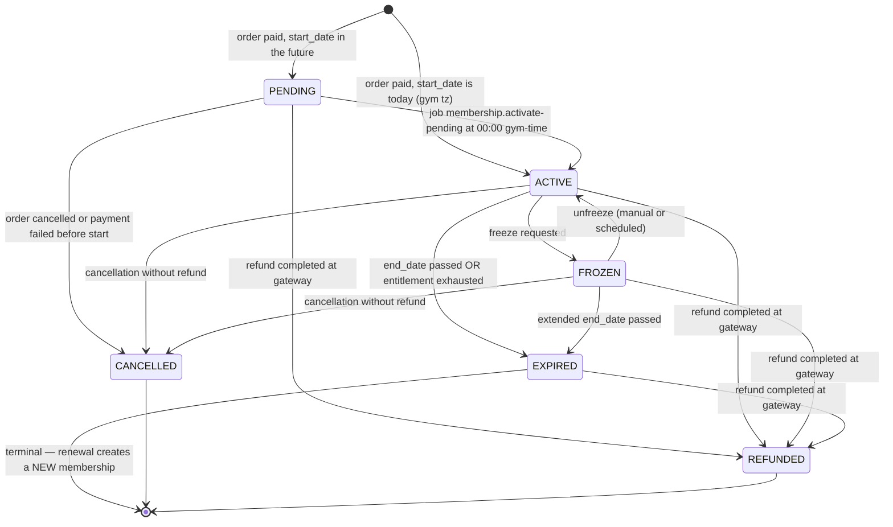
```mermaid
stateDiagram-v2
  [*] --> PENDING : order paid, start_date in the future
  [*] --> ACTIVE : order paid, start_date is today (gym tz)

  PENDING --> ACTIVE : job membership.activate-pending at 00:00 gym-time
  PENDING --> CANCELLED : order cancelled or payment failed before start
  PENDING --> REFUNDED : refund completed at gateway

  ACTIVE --> FROZEN : freeze requested
  FROZEN --> ACTIVE : unfreeze (manual or scheduled)
  ACTIVE --> EXPIRED : end_date passed OR entitlement exhausted
  FROZEN --> EXPIRED : extended end_date passed
  ACTIVE --> CANCELLED : cancellation without refund
  FROZEN --> CANCELLED : cancellation without refund
  ACTIVE --> REFUNDED : refund completed at gateway
  FROZEN --> REFUNDED : refund completed at gateway
  EXPIRED --> REFUNDED : refund completed at gateway

  EXPIRED --> [*] : terminal — renewal creates a NEW membership
  CANCELLED --> [*]
  REFUNDED --> [*]
```

| From | To | Trigger | Guards |
| :--- | :--- | :--- | :--- |
| — | `PENDING` | Order paid, future start | Payment `CAPTURED` (`BR-PAY-02`); start date within the configured horizon (`FR-CART-02`) |
| — | `ACTIVE` | Order paid, start today | Payment `CAPTURED`, or staff-recorded offline payment (`BR-MEM-02`) |
| `PENDING` | `ACTIVE` | `membership.activate-pending`, hourly per gym timezone | Not cancelled; not refunded; tenant not `CLOSED` |
| `PENDING` | `CANCELLED` | Order cancelled or payment failed | Reason required |
| `ACTIVE` | `FROZEN` | Freeze request | `plan.freeze_allowed`; `freeze_days_used + requested ≤ plan.freeze_max_days` (`BR-MEM-05`); start not retroactive and ≤30 days ahead (`BR-MEM-07`) |
| `FROZEN` | `ACTIVE` | Unfreeze | `end_date` recalculated to **actual** frozen days, not requested (`FR-MEMB-05`) |
| `ACTIVE`/`FROZEN` | `EXPIRED` | `membership.expire`, hourly per gym timezone | Earlier of `end_date` passed or `sessions_used = sessions_total` (`BR-PLN-06`) |
| `ACTIVE`/`FROZEN`/`PENDING` | `CANCELLED` | Member or gym cancellation | Reason required; no cash movement |
| any | `REFUNDED` | Refund completed | Gateway refund executed (`FR-RFND-05`); QR revoked in the same transaction (`FR-RFND-06`) |
| `EXPIRED` | — | Terminal | A membership is **never** reactivated; renewal creates a new row (`C4.1`) |

**Invariants** (asserted by a database `CHECK` where expressible and by a property test otherwise):

1. `status = 'ACTIVE'` ⟹ `start_date ≤ today(gym_timezone) ≤ end_date`.
2. `end_date IS NOT NULL` always.
3. Every transition writes exactly one `membership_events` row with actor, timestamp, reason and, where financial, the order or refund reference (`FR-MEMB-02`).
4. `sessions_used ≤ sessions_total` for `SESSION` plans.
5. `freeze_days_used ≤ plan.freeze_max_days`.
6. The member's view and the gym's view read the same column — there is no gym-side status concept (`FR-MEMB-12`).

### 7.2 Order (`C4.2`)

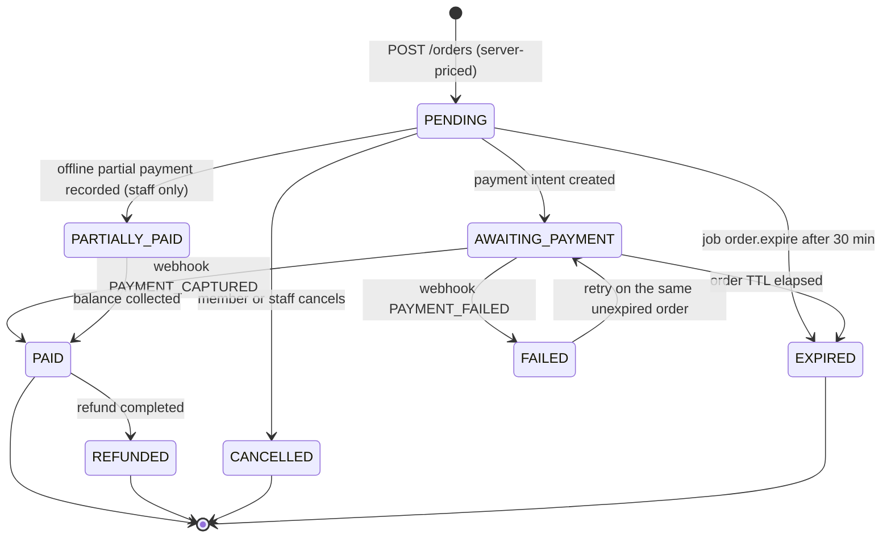
```mermaid
stateDiagram-v2
  [*] --> PENDING : POST /orders (server-priced)
  PENDING --> AWAITING_PAYMENT : payment intent created
  PENDING --> PARTIALLY_PAID : offline partial payment recorded (staff only)
  PENDING --> CANCELLED : member or staff cancels
  PENDING --> EXPIRED : job order.expire after 30 min

  AWAITING_PAYMENT --> PAID : webhook PAYMENT_CAPTURED
  AWAITING_PAYMENT --> FAILED : webhook PAYMENT_FAILED
  AWAITING_PAYMENT --> EXPIRED : order TTL elapsed
  FAILED --> AWAITING_PAYMENT : retry on the same unexpired order

  PARTIALLY_PAID --> PAID : balance collected
  PAID --> REFUNDED : refund completed

  PAID --> [*]
  REFUNDED --> [*]
  CANCELLED --> [*]
  EXPIRED --> [*]
```

| Guard | Rule |
| :--- | :--- |
| `PENDING → AWAITING_PAYMENT` | Coupon re-validated (`BR-CPN-03`), price re-validated (`BR-PLN-03`), eligibility re-checked (`FR-CART-07`) |
| `PENDING → PARTIALLY_PAID` | Channel is `DASHBOARD` only; online marketplace purchases must be paid in full (`BR-PAY-09`, `AC-CART-02.4`) |
| `AWAITING_PAYMENT → PAID` | Webhook signature valid, `provider_event_id` unseen, **gateway amount equals order `total_minor`** — a mismatch blocks activation and escalates, creating no membership |
| `* → EXPIRED` | Releases the coupon reservation (`FR-CART-05`) |
| `PAID → REFUNDED` | Idempotent on the order (`BR-REF-09`) |

**Invariants.** `gross − discount = net`; `net + tax = total`; `commission_base = net` and never
includes tax (`BR-FIN-04`); all eight A6.3 figures are persisted, never recomputed at display time
(`BR-FIN-02`). An order has at most one non-void invoice.

### 7.3 Payment (`C4.3`)

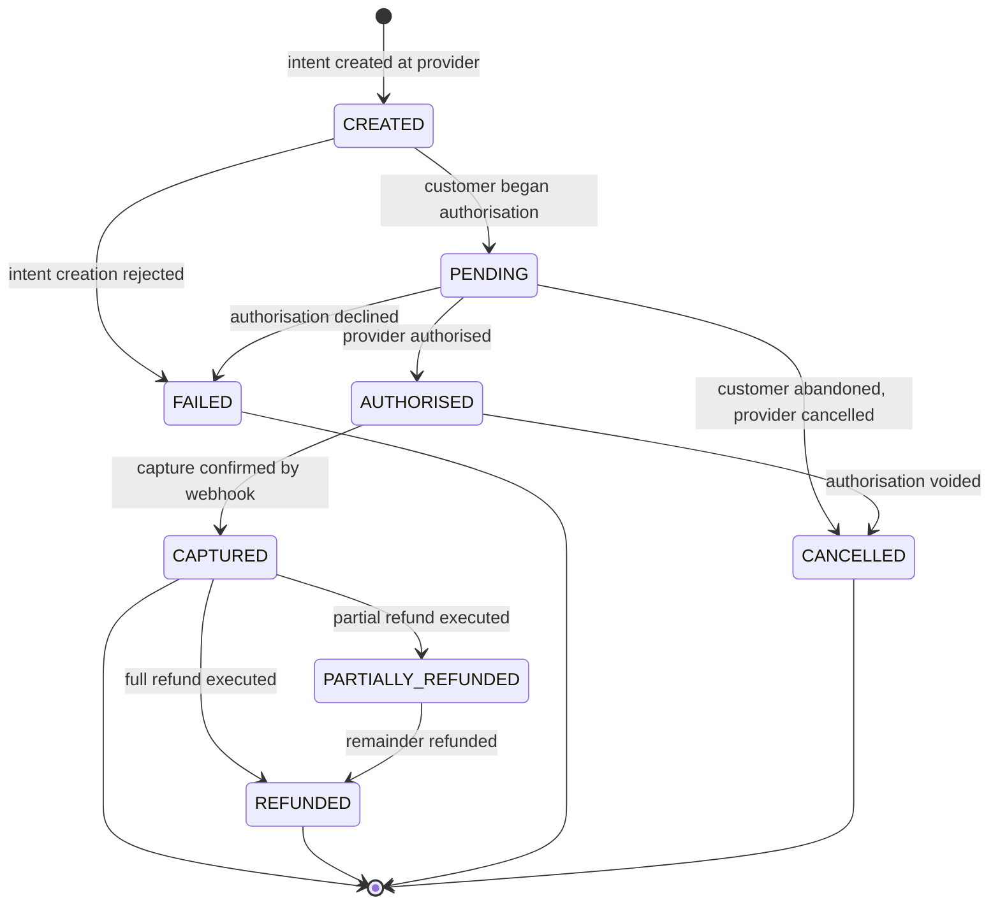
```mermaid
stateDiagram-v2
  [*] --> CREATED : intent created at provider
  CREATED --> PENDING : customer began authorisation
  CREATED --> FAILED : intent creation rejected
  PENDING --> AUTHORISED : provider authorised
  PENDING --> FAILED : authorisation declined
  PENDING --> CANCELLED : customer abandoned, provider cancelled
  AUTHORISED --> CAPTURED : capture confirmed by webhook
  AUTHORISED --> CANCELLED : authorisation voided
  CAPTURED --> REFUNDED : full refund executed
  CAPTURED --> PARTIALLY_REFUNDED : partial refund executed
  PARTIALLY_REFUNDED --> REFUNDED : remainder refunded

  CAPTURED --> [*]
  REFUNDED --> [*]
  FAILED --> [*]
  CANCELLED --> [*]
```

| Guard | Rule |
| :--- | :--- |
| Every transition | Driven by a signature-verified, deduplicated webhook or by the reconciliation poller — never by a client redirect (`BR-PAY-02`, `FR-PAY-04`) |
| `PENDING`/`AUTHORISED` beyond threshold | `payment.reconcile` polls every 15 min; a terminal provider state is applied idempotently; still-indeterminate escalates to Finance and never auto-activates (`BR-PAY-06`) |
| Second `CAPTURED` on one order | `payment.duplicate-detect` refunds it within one hour with notification (`BR-PAY-07`, `AC-PAY-01.2`) |

**Invariants.** No card, CVV or bank credential is ever persisted or logged — only provider tokens
(`BR-PAY-08`, `NFR-SEC-03`). `(provider, provider_intent_id)` is unique. `provider_event_id` is
unique across `payment_events`.

### 7.4 Tenant / application (`C4.4`)

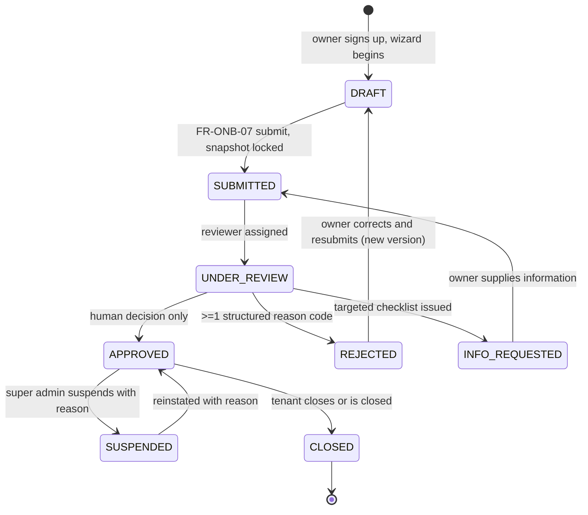
```mermaid
stateDiagram-v2
  [*] --> DRAFT : owner signs up, wizard begins
  DRAFT --> SUBMITTED : FR-ONB-07 submit, snapshot locked
  SUBMITTED --> UNDER_REVIEW : reviewer assigned
  UNDER_REVIEW --> APPROVED : human decision only
  UNDER_REVIEW --> REJECTED : >=1 structured reason code
  UNDER_REVIEW --> INFO_REQUESTED : targeted checklist issued
  INFO_REQUESTED --> SUBMITTED : owner supplies information
  REJECTED --> DRAFT : owner corrects and resubmits (new version)
  APPROVED --> SUSPENDED : super admin suspends with reason
  SUSPENDED --> APPROVED : reinstated with reason
  APPROVED --> CLOSED : tenant closes or is closed
  CLOSED --> [*]
```

| Guard | Rule |
| :--- | :--- |
| `→ APPROVED` | Requires verified owner email **and** phone, complete country KYC set, ≥1 published plan, ≥3 photographs, resolvable geo-location, stated operating hours (`BR-GYM-02`). A failed pre-check requires an explicit override with a reason (`AC-ONB-02.3`, `AC-ONB-02.4`). |
| `→ APPROVED` | **No automated path exists** (`BR-GYM-03`). The transition is reachable only from an authenticated `VERIFICATION_OFFICER` or `SUPER_ADMIN` command. |
| `→ REJECTED` | At least one code from the 16-value rejection taxonomy (`C4.8`) plus optional free text; both are shown to the owner (`BR-GYM-04`). |
| `REJECTED → DRAFT` | Unlimited resubmissions; each is a new reviewable version with the prior retained and a field-level diff available (`BR-GYM-05`, `AC-ONB-01.3`). |
| `APPROVED → SUSPENDED` | Removes the gym from marketplace search immediately; existing active memberships continue to permit check-in until natural expiry (`BR-TEN-05`). |

**Invariants.** Listing visibility is a pure function of `(tenant.status = APPROVED ∧ gym.status = APPROVED ∧ ≥1 published public plan)` and becomes true within 60 seconds of approval (`FR-ONB-13`,
`BAC-02`). Material field changes return **those fields** to review while the listing stays live,
except a bank-account change, which suspends payouts until re-verified (`BR-GYM-06`).

### 7.5 Refund (`C4.5`)

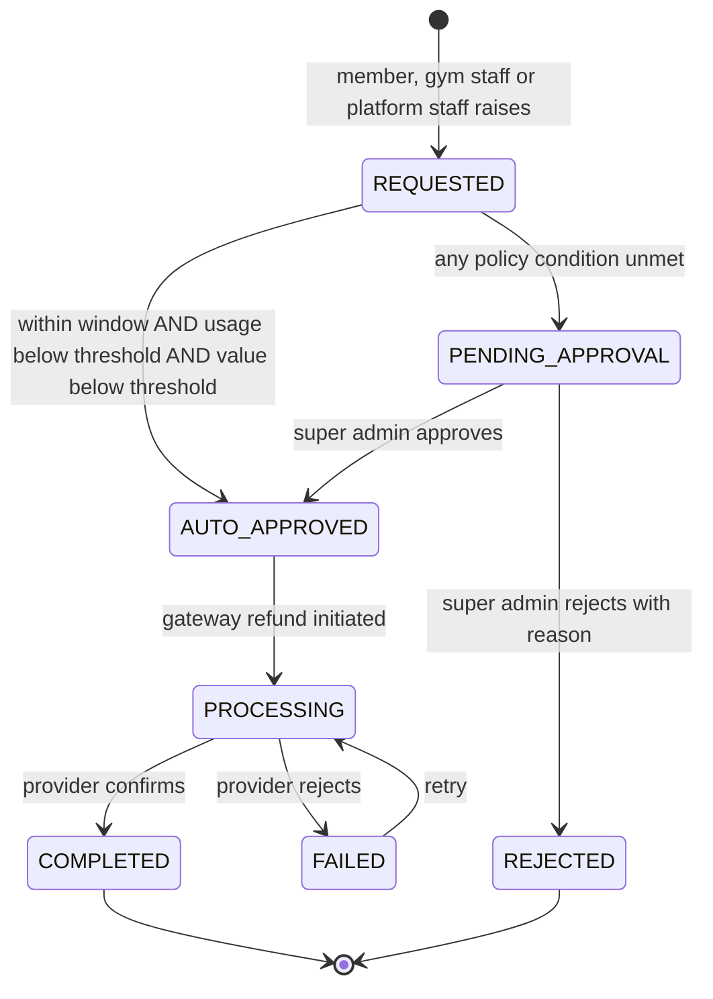
```mermaid
stateDiagram-v2
  [*] --> REQUESTED : member, gym staff or platform staff raises
  REQUESTED --> AUTO_APPROVED : within window AND usage below threshold AND value below threshold
  REQUESTED --> PENDING_APPROVAL : any policy condition unmet
  PENDING_APPROVAL --> AUTO_APPROVED : super admin approves
  PENDING_APPROVAL --> REJECTED : super admin rejects with reason
  AUTO_APPROVED --> PROCESSING : gateway refund initiated
  PROCESSING --> COMPLETED : provider confirms
  PROCESSING --> FAILED : provider rejects
  FAILED --> PROCESSING : retry
  COMPLETED --> [*]
  REJECTED --> [*]
```

| Guard | Rule |
| :--- | :--- |
| Policy source | The policy stored on the **order snapshot**, never the tenant's current policy (`BR-REF-02`) |
| Auto-approval | Within the stated no-questions window **and** below the configurable value threshold (`BR-REF-03`); recorded check-ins above the usage threshold force `PENDING_APPROVAL` (`BR-REF-06`) |
| Instrument | Original payment instrument only (`BR-REF-04`) |
| `COMPLETED` side effects, one transaction | Credit note issued in its own number sequence (`FR-INV-09`); `REFUND` + `COMMISSION_REVERSAL` ledger entries written (`BR-REF-05`); membership → `REFUNDED`; QR revoked (`FR-RFND-06`) |
| Idempotency | A refunded order can never be refunded again; the operation is idempotent on the order (`BR-REF-09`) |
| Gateway fee | Reversed only to the extent the gateway reverses it; any non-reversed fee is shown explicitly on the statement (`BR-REF-05`) |

### 7.6 Review (`C4.6`)

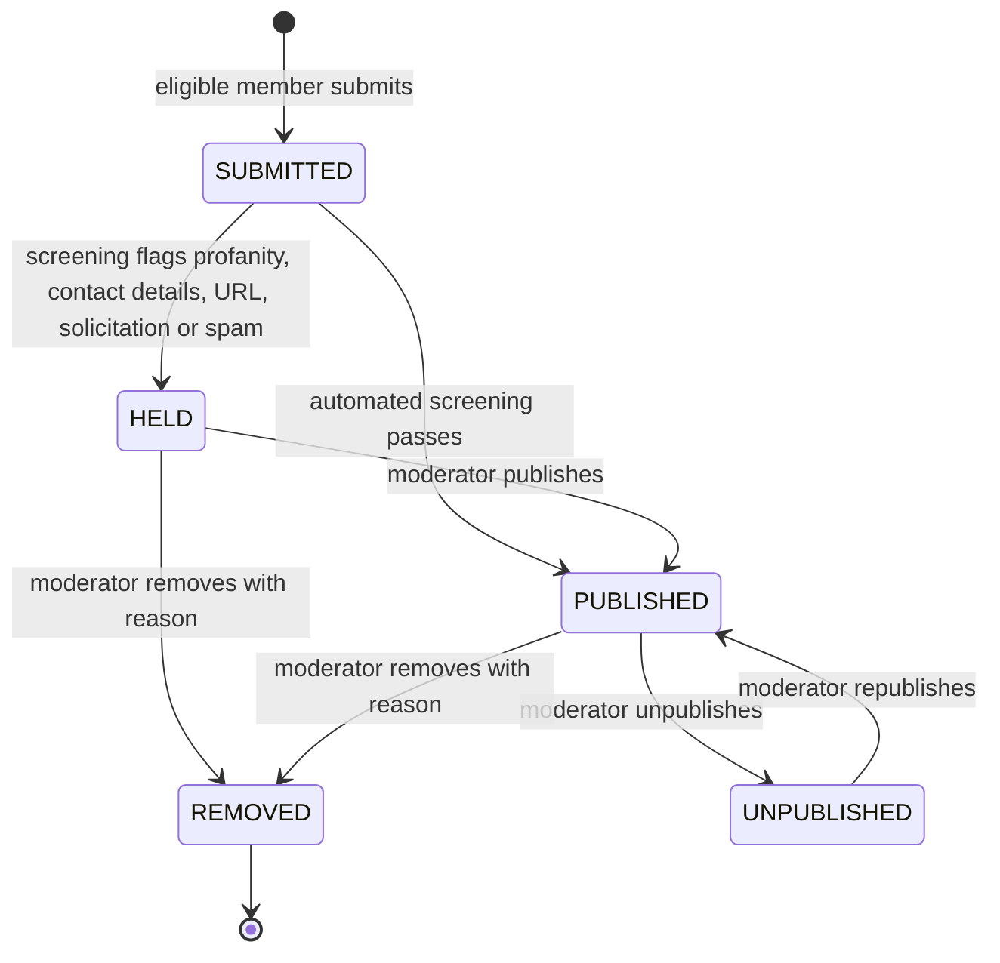
```mermaid
stateDiagram-v2
  [*] --> SUBMITTED : eligible member submits
  SUBMITTED --> PUBLISHED : automated screening passes
  SUBMITTED --> HELD : screening flags profanity, contact details, URL, solicitation or spam
  HELD --> PUBLISHED : moderator publishes
  HELD --> REMOVED : moderator removes with reason
  PUBLISHED --> UNPUBLISHED : moderator unpublishes
  UNPUBLISHED --> PUBLISHED : moderator republishes
  PUBLISHED --> REMOVED : moderator removes with reason
  REMOVED --> [*]
```

| Guard | Rule |
| :--- | :--- |
| `[*] → SUBMITTED` | ≥1 recorded check-in at that gym, computed server-side; the compose UI is unreachable otherwise and a direct API call returns 403 (`BR-REV-01`, `FR-REV-01`) |
| Uniqueness | One review per member per gym **per membership term** (`BR-REV-02`) |
| Editing | Member may edit for 7 days; edit history retained (`BR-REV-02`) |
| Gym powers | Respond once (`BR-REV-05`); report with a reason (`FR-REV-06`); **no edit or delete path exists anywhere in the interface or API** (`AC-REV-01.2`) |
| Reported reviews | Stay published under moderation unless they contain personal data or threats, which hides them pending review (`BR-REV-06`) |
| Anomalies | Velocity, account-age and text-clustering anomalies hold the review and exclude it from the aggregate until cleared (`FR-REV-09`, `AC-REV-02.2`) |

**Invariants.** Every published review carries the "Verified member" marker; there is no unverified
review type (`BR-REV-03`). The displayed figure is the plain mean with the count and is suppressed
below three reviews (`BR-REV-07`, default `OQ-10` = 3). Any status change recomputes the gym
aggregate within one minute (`AC-REV-02.3`).

### 7.7 Settlement batch (`C4.7`)

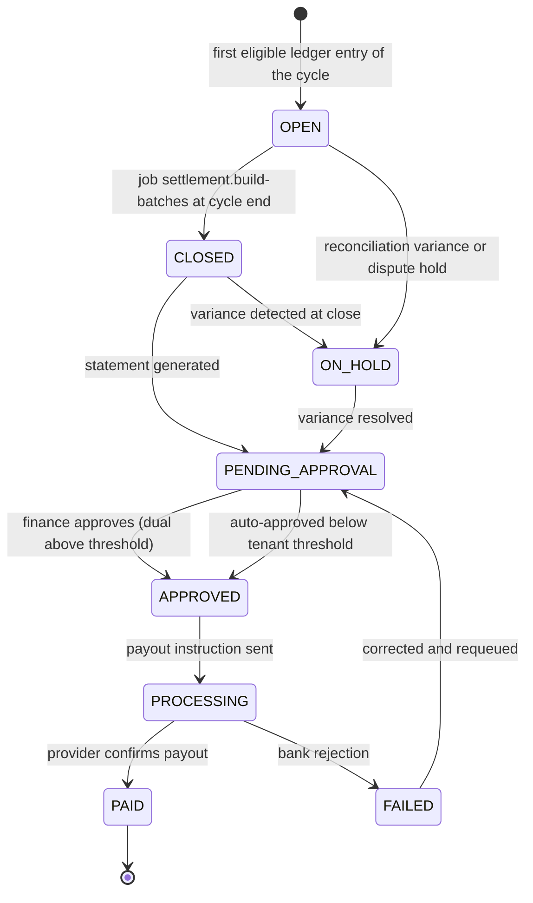
```mermaid
stateDiagram-v2
  [*] --> OPEN : first eligible ledger entry of the cycle
  OPEN --> CLOSED : job settlement.build-batches at cycle end
  OPEN --> ON_HOLD : reconciliation variance or dispute hold
  CLOSED --> PENDING_APPROVAL : statement generated
  CLOSED --> ON_HOLD : variance detected at close
  ON_HOLD --> PENDING_APPROVAL : variance resolved
  PENDING_APPROVAL --> APPROVED : finance approves (dual above threshold)
  PENDING_APPROVAL --> APPROVED : auto-approved below tenant threshold
  APPROVED --> PROCESSING : payout instruction sent
  PROCESSING --> PAID : provider confirms payout
  PROCESSING --> FAILED : bank rejection
  FAILED --> PENDING_APPROVAL : corrected and requeued
  PAID --> [*]
```

| Guard | Rule |
| :--- | :--- |
| Line eligibility | Gateway fee reported (`BR-FIN-06`); entry not already batched; entry `occurred_at` within the cycle |
| Hold triggers | Daily reconciliation variance blocks auto-payout for the affected tenant until resolved (`BR-FIN-07`); an open dispute holds the disputed amount (`BR-REF-08`) |
| Approval | Finance approval required unless auto-payout is enabled and the batch is below the tenant's threshold (`FR-SETL-06`); dual approval above a configurable threshold (`BR-FIN-08`) |
| New tenants | First 14 days of trading are held as fraud protection, then released on the normal cycle (`A6.4`) |
| Below minimum | Batch rolls forward with the reason shown to the tenant (`FR-SETL-05`) |
| Payout failure | Returns to `PENDING_APPROVAL` with the failure reason; both tenant and Finance are notified (`FR-SETL-08`) |

**Invariants.** Opening balance + gross − commission − fees − refunds − reserve held + reserve
released = `net_payable_minor`, exactly, in minor units (`BR-FIN-03`, `AC-SETL-01.1`). A negative
balance carries forward and is recovered from subsequent batches (`FR-SETL-10`). The commission rate
on every line is the rate effective at the moment of sale, not the current rate (`BR-FIN-05`,
`AC-ADMN-01.4`).

---

## 8. Sequence Diagrams

Ten flows. Participants use the module names from §1.3 so that every arrow is checkable against the
allowed-dependency matrix in §4.5.

### 8.1 Owner onboarding to approval (`E2E-01`, `BAC-01`, `BAC-02`)

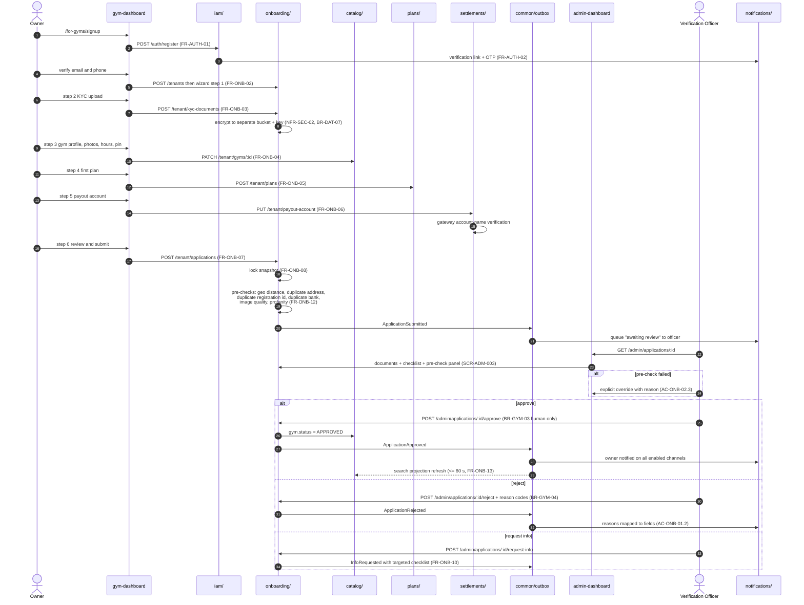
```mermaid
sequenceDiagram
  autonumber
  actor Owner
  participant Dash as gym-dashboard
  participant IAM as iam/
  participant ONB as onboarding/
  participant CAT as catalog/
  participant PLN as plans/
  participant SET as settlements/
  participant OUT as common/outbox
  participant ADM as admin-dashboard
  actor Officer as Verification Officer
  participant NOTF as notifications/

  Owner->>Dash: /for-gyms/signup
  Dash->>IAM: POST /auth/register (FR-AUTH-01)
  IAM->>NOTF: verification link + OTP (FR-AUTH-02)
  Owner->>Dash: verify email and phone
  Dash->>ONB: POST /tenants then wizard step 1 (FR-ONB-02)
  Owner->>Dash: step 2 KYC upload
  Dash->>ONB: POST /tenant/kyc-documents (FR-ONB-03)
  ONB->>ONB: encrypt to separate bucket + key (NFR-SEC-02, BR-DAT-07)
  Owner->>Dash: step 3 gym profile, photos, hours, pin
  Dash->>CAT: PATCH /tenant/gyms/:id (FR-ONB-04)
  Owner->>Dash: step 4 first plan
  Dash->>PLN: POST /tenant/plans (FR-ONB-05)
  Owner->>Dash: step 5 payout account
  Dash->>SET: PUT /tenant/payout-account (FR-ONB-06)
  SET->>SET: gateway account-name verification
  Owner->>Dash: step 6 review and submit
  Dash->>ONB: POST /tenant/applications (FR-ONB-07)
  ONB->>ONB: lock snapshot (FR-ONB-08)
  ONB->>ONB: pre-checks: geo distance, duplicate address,<br/>duplicate registration id, duplicate bank,<br/>image quality, profanity (FR-ONB-12)
  ONB->>OUT: ApplicationSubmitted
  OUT->>NOTF: queue "awaiting review" to officer

  Officer->>ADM: GET /admin/applications/:id
  ADM->>ONB: documents + checklist + pre-check panel (SCR-ADM-003)
  alt pre-check failed
    Officer->>ADM: explicit override with reason (AC-ONB-02.3)
  end
  alt approve
    Officer->>ONB: POST /admin/applications/:id/approve (BR-GYM-03 human only)
    ONB->>CAT: gym.status = APPROVED
    ONB->>OUT: ApplicationApproved
    OUT->>NOTF: owner notified on all enabled channels
    OUT-->>CAT: search projection refresh (<= 60 s, FR-ONB-13)
  else reject
    Officer->>ONB: POST /admin/applications/:id/reject + reason codes (BR-GYM-04)
    ONB->>OUT: ApplicationRejected
    OUT->>NOTF: reasons mapped to fields (AC-ONB-01.2)
  else request info
    Officer->>ONB: POST /admin/applications/:id/request-info
    ONB->>OUT: InfoRequested with targeted checklist (FR-ONB-10)
  end
```

### 8.2 Marketplace search (`SCR-WEB-002`, `NFR-PERF-01`)

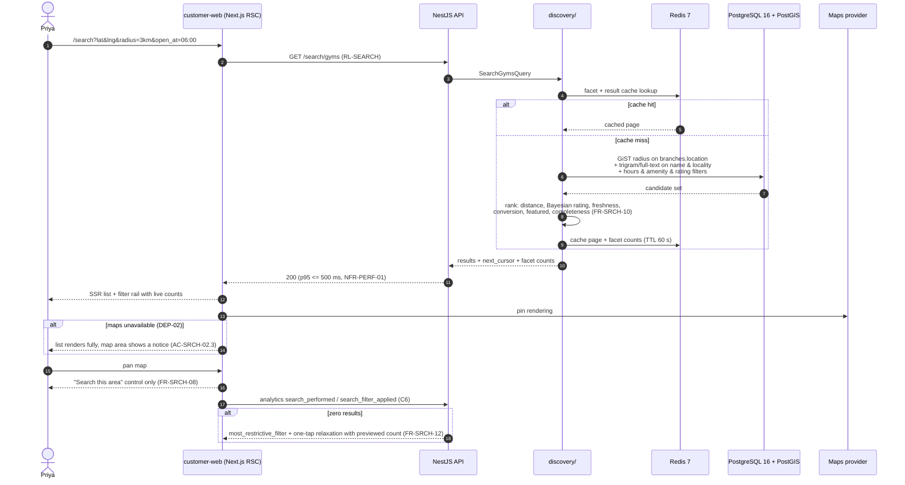
```mermaid
sequenceDiagram
  autonumber
  actor Priya
  participant Web as customer-web (Next.js RSC)
  participant API as NestJS API
  participant DISC as discovery/
  participant Redis as Redis 7
  participant PG as PostgreSQL 16 + PostGIS
  participant Maps as Maps provider

  Priya->>Web: /search?lat&lng&radius=3km&open_at=06:00
  Web->>API: GET /search/gyms (RL-SEARCH)
  API->>DISC: SearchGymsQuery
  DISC->>Redis: facet + result cache lookup
  alt cache hit
    Redis-->>DISC: cached page
  else cache miss
    DISC->>PG: GiST radius on branches.location<br/>+ trigram/full-text on name & locality<br/>+ hours & amenity & rating filters
    PG-->>DISC: candidate set
    DISC->>DISC: rank: distance, Bayesian rating, freshness,<br/>conversion, featured, completeness (FR-SRCH-10)
    DISC->>Redis: cache page + facet counts (TTL 60 s)
  end
  DISC-->>API: results + next_cursor + facet counts
  API-->>Web: 200 (p95 <= 500 ms, NFR-PERF-01)
  Web-->>Priya: SSR list + filter rail with live counts
  Web->>Maps: pin rendering
  alt maps unavailable (DEP-02)
    Web-->>Priya: list renders fully, map area shows a notice (AC-SRCH-02.3)
  end
  Priya->>Web: pan map
  Web-->>Priya: "Search this area" control only (FR-SRCH-08)
  Web->>API: analytics search_performed / search_filter_applied (C6)
  alt zero results
    API-->>Web: most_restrictive_filter + one-tap relaxation with previewed count (FR-SRCH-12)
  end
```

### 8.3 Checkout to membership activation, including browser-closed-before-redirect (`E2E-02`, `AC-PAY-02.1`)

```mermaid
sequenceDiagram
  autonumber
  actor Priya
  participant Web as customer-web
  participant ORD as ordering/
  participant PLN as plans/
  participant PAY as payments/
  participant GW as Payment gateway
  participant OUT as common/outbox
  participant MEM as memberships/
  participant BIL as billing/
  participant LED as ledger/
  participant NOTF as notifications/

  Priya->>Web: select plan, start date, coupon
  Web->>ORD: POST /orders (Idempotency-Key) — no amounts sent (BR-PAY-04)
  ORD->>PLN: authoritative price + terms
  ORD->>ORD: eligibility: age, gender, concurrency, availability (FR-CART-07)
  ORD->>ORD: price server-side; snapshot refund policy + tax (BR-REF-02, BR-PAY-11)
  ORD-->>Web: 201 order PENDING, expires in 30 min, full breakdown
  Priya->>Web: proceed to payment
  Web->>ORD: POST /orders/:ref/validate
  alt price changed since page load
    ORD-->>Web: 422 PLAN_PRICE_CHANGED with previous and current (AC-PLAN-02.2)
    Web-->>Priya: blocking modal, explicit re-confirmation required
  end
  Web->>PAY: POST /orders/:ref/payment-intent (Idempotency-Key)
  PAY->>GW: create intent via PaymentProvider port (FR-PAY-01)
  GW-->>PAY: intent id
  PAY-->>Web: client secret / redirect
  Priya->>GW: authorise payment

  Note over Priya,Web: Priya's browser closes here.<br/>No redirect ever reaches the client.

  GW--)PAY: POST /webhooks/payments/:provider (PAYMENT_CAPTURED)
  PAY->>PAY: verify signature; dedupe on provider_event_id (BR-PAY-05)
  PAY->>PAY: assert gateway amount == order.total_minor
  PAY->>ORD: order -> PAID
  PAY->>OUT: PaymentCaptured (same transaction)
  OUT->>MEM: activate membership, idempotent (BR-PAY-02)
  OUT->>BIL: issue invoice, gapless number (FR-INV-01, FR-INV-02)
  OUT->>LED: SALE, TAX, COMMISSION, GATEWAY_FEE, payable entries (BR-FIN-01)
  OUT->>NOTF: membership activated + invoice email

  Priya->>Web: reopens the site later
  Web->>MEM: GET /me/memberships
  MEM-->>Web: ACTIVE, QR available (AC-PAY-02.1)
  Note over Web: If the webhook has not yet landed, the order shows<br/>"confirming payment" with polling — never "failed"<br/>before the reconciliation threshold (AC-PAY-02.2)
```

### 8.4 QR check-in — allow (`E2E-03`, `NFR-PERF-03`)

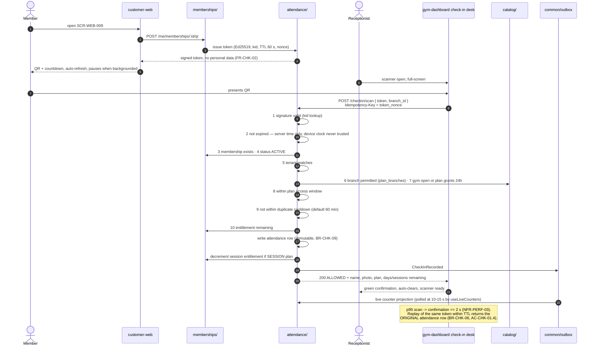
```mermaid
sequenceDiagram
  autonumber
  actor Member
  participant Web as customer-web
  participant MEM as memberships/
  participant ATT as attendance/
  actor Sameer as Receptionist
  participant Desk as gym-dashboard check-in desk
  participant CAT as catalog/
  participant OUT as common/outbox

  Member->>Web: open SCR-WEB-009
  Web->>MEM: POST /me/memberships/:id/qr
  MEM->>ATT: issue token (Ed25519, kid, TTL 60 s, nonce)
  ATT-->>Web: signed token, no personal data (FR-CHK-02)
  Web-->>Member: QR + countdown, auto-refresh, pauses when backgrounded

  Sameer->>Desk: scanner open, full-screen
  Member->>Desk: presents QR
  Desk->>ATT: POST /checkin/scan { token, branch_id }<br/>Idempotency-Key = token_nonce
  ATT->>ATT: 1 signature valid (kid lookup)
  ATT->>ATT: 2 not expired — server time only, device clock never trusted
  ATT->>MEM: 3 membership exists · 4 status ACTIVE
  ATT->>ATT: 5 tenant matches
  ATT->>CAT: 6 branch permitted (plan_branches) · 7 gym open or plan grants 24h
  ATT->>ATT: 8 within plan access window
  ATT->>ATT: 9 not within duplicate cooldown (default 60 min)
  ATT->>MEM: 10 entitlement remaining
  ATT->>ATT: write attendance row (immutable, BR-CHK-09)
  ATT->>MEM: decrement session entitlement if SESSION plan
  ATT->>OUT: CheckInRecorded
  ATT-->>Desk: 200 ALLOWED + name, photo, plan, days/sessions remaining
  Desk-->>Sameer: green confirmation, auto-clears, scanner ready
  OUT->>ATT: live counter projection (polled at 10-15 s by useLiveCounters)
  Note over Desk: p95 scan -> confirmation <= 2 s (NFR-PERF-03).<br/>Replay of the same token within TTL returns the<br/>ORIGINAL attendance row (BR-CHK-06, AC-CHK-01.4).
```

### 8.5 QR check-in — deny with staff override (`E2E-04`, `BR-CHK-10`)

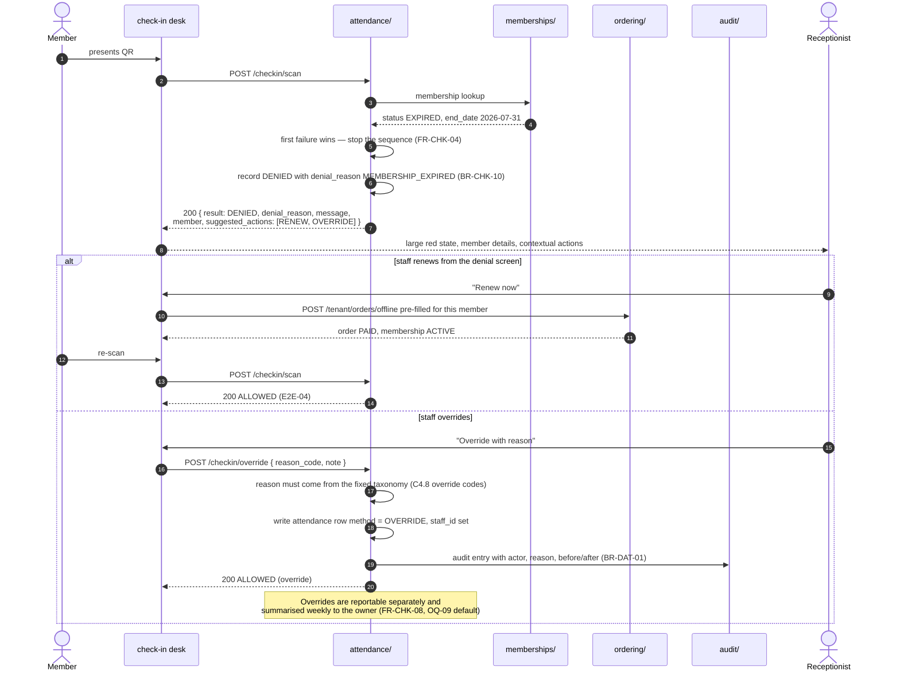
```mermaid
sequenceDiagram
  autonumber
  actor Member
  participant Desk as check-in desk
  participant ATT as attendance/
  participant MEM as memberships/
  participant ORD as ordering/
  participant AUD as audit/
  actor Sameer as Receptionist

  Member->>Desk: presents QR
  Desk->>ATT: POST /checkin/scan
  ATT->>MEM: membership lookup
  MEM-->>ATT: status EXPIRED, end_date 2026-07-31
  ATT->>ATT: first failure wins — stop the sequence (FR-CHK-04)
  ATT->>ATT: record DENIED with denial_reason MEMBERSHIP_EXPIRED (BR-CHK-10)
  ATT-->>Desk: 200 { result: DENIED, denial_reason, message,<br/>member, suggested_actions: [RENEW, OVERRIDE] }
  Desk-->>Sameer: large red state, member details, contextual actions

  alt staff renews from the denial screen
    Sameer->>Desk: "Renew now"
    Desk->>ORD: POST /tenant/orders/offline pre-filled for this member
    ORD-->>Desk: order PAID, membership ACTIVE
    Member->>Desk: re-scan
    Desk->>ATT: POST /checkin/scan
    ATT-->>Desk: 200 ALLOWED (E2E-04)
  else staff overrides
    Sameer->>Desk: "Override with reason"
    Desk->>ATT: POST /checkin/override { reason_code, note }
    ATT->>ATT: reason must come from the fixed taxonomy (C4.8 override codes)
    ATT->>ATT: write attendance row method = OVERRIDE, staff_id set
    ATT->>AUD: audit entry with actor, reason, before/after (BR-DAT-01)
    ATT-->>Desk: 200 ALLOWED (override)
    Note over ATT: Overrides are reportable separately and<br/>summarised weekly to the owner (FR-CHK-08, OQ-09 default)
  end
```

### 8.6 Refund within policy (`E2E-07`)

```mermaid
sequenceDiagram
  autonumber
  actor Member
  participant Web as customer-web
  participant RFD as refunds/
  participant ORD as ordering/
  participant ATT as attendance/
  participant PAY as payments/
  participant GW as Payment gateway
  participant BIL as billing/
  participant LED as ledger/
  participant MEM as memberships/
  participant SET as settlements/
  participant NOTF as notifications/

  Member->>Web: request refund on membership
  Web->>RFD: POST /me/memberships/:id/refund-request (Idempotency-Key)
  RFD->>ORD: read refund_policy_snapshot from the order (BR-REF-02)
  RFD->>ATT: count recorded check-ins
  RFD->>RFD: evaluate window, usage threshold, value threshold (BR-REF-03, BR-REF-06)
  alt within policy, no check-ins, below value threshold
    RFD->>RFD: AUTO_APPROVED
  else outside policy
    RFD->>RFD: PENDING_APPROVAL -> super admin queue (SCR-ADM-008)
  end
  RFD->>RFD: compute amount: full or pro-rata unused days/sessions<br/>less cancellation fee; computation shown to all parties (FR-RFND-04)
  RFD->>PAY: execute refund to the ORIGINAL instrument (BR-REF-04)
  PAY->>GW: refund via PaymentProvider port
  GW--)PAY: REFUND_SUCCEEDED webhook
  PAY->>RFD: refund COMPLETED
  RFD->>BIL: issue credit note in its own sequence, referencing the invoice (FR-INV-09)
  RFD->>LED: REFUND entry + proportional COMMISSION_REVERSAL (BR-REF-05)
  RFD->>MEM: membership -> REFUNDED, QR revoked immediately (FR-RFND-06)
  RFD->>SET: negative line in the recognising batch (FR-SETL-03)
  RFD->>NOTF: refund completed, credit note attached
  Note over SET: If the original sale was already paid out, the amount is<br/>recovered from the reserve and the next cycle (A6.4).<br/>A refunded order can never be refunded again (BR-REF-09).
```

### 8.7 Chargeback intake to resolution (`US-RFND-02`, `BR-REF-08`)

```mermaid
sequenceDiagram
  autonumber
  participant GW as Payment gateway
  participant PAY as payments/
  participant RFD as refunds/
  participant LED as ledger/
  participant SET as settlements/
  participant ORD as ordering/
  participant BIL as billing/
  participant ATT as attendance/
  participant NOTF as notifications/
  actor Vikram as Finance
  actor Owner as Gym Owner

  GW--)PAY: CHARGEBACK_OPENED webhook
  PAY->>PAY: verify signature, dedupe on provider_event_id
  PAY->>RFD: open dispute case { amount, reason_code, evidence_due_at }
  RFD->>LED: CHARGEBACK entry (DEBIT) + hold against tenant balance (BR-REF-08)
  RFD->>SET: block the affected amount from the next batch
  RFD->>RFD: assemble evidence pack automatically (FR-RFND-09)
  RFD->>ORD: order + terms accepted
  RFD->>BIL: invoice PDF
  RFD->>PAY: payment record and provider references
  RFD->>ATT: attendance records proving service delivery
  RFD->>NOTF: notify Finance and the tenant with the deadline
  NOTF-->>Vikram: dispute opened, deadline countdown
  NOTF-->>Owner: dispute opened, amount held

  Vikram->>RFD: GET /admin/disputes/:id — pack pre-assembled (AC-RFND-02.2)
  Vikram->>RFD: POST /admin/disputes/:id/evidence
  RFD->>GW: submit evidence via PaymentProvider port
  alt resolved in tenant favour
    GW--)PAY: CHARGEBACK_WON
    PAY->>RFD: outcome WON
    RFD->>LED: CHARGEBACK_REVERSAL (CREDIT)
    RFD->>SET: release hold, amount returns to the next settlement (AC-RFND-02.3)
  else resolved against tenant
    GW--)PAY: CHARGEBACK_LOST
    PAY->>RFD: outcome LOST
    RFD->>LED: hold converts to a permanent DEBIT
    RFD->>SET: negative line; recovery from reserve then next cycle (FR-SETL-10)
  end
  RFD->>NOTF: outcome to Finance and tenant
```

### 8.8 Settlement batch build to payout (`E2E-12`, `BAC-07`, `KPI-26`)

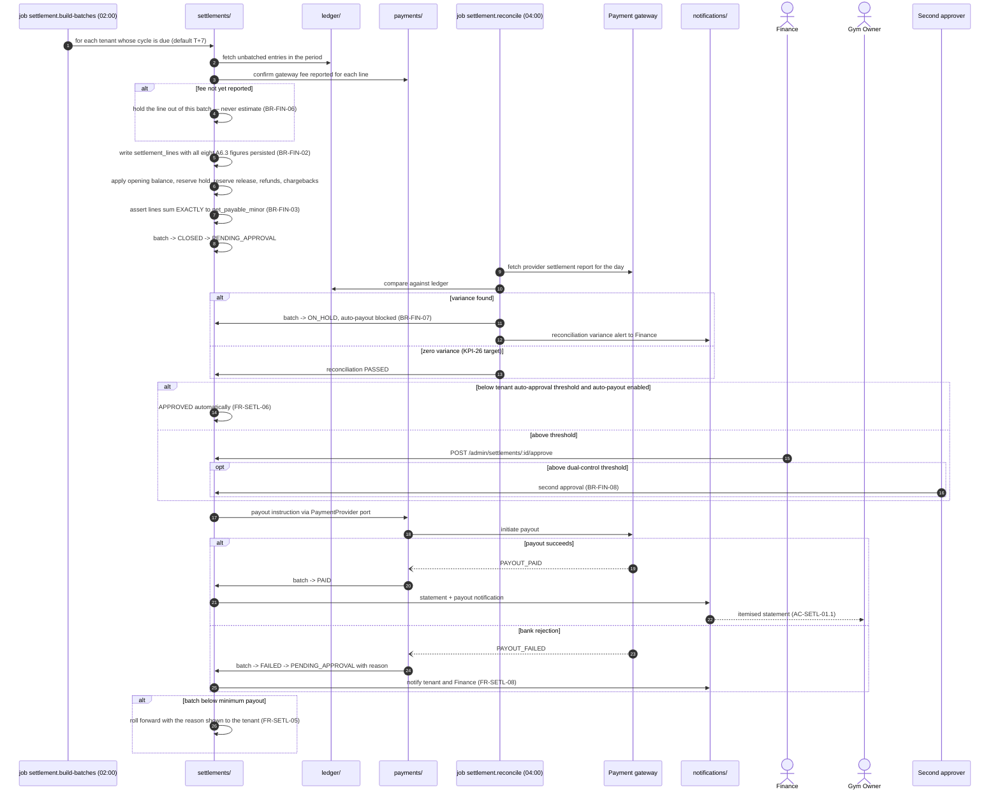
```mermaid
sequenceDiagram
  autonumber
  participant Job as job settlement.build-batches (02:00)
  participant SET as settlements/
  participant LED as ledger/
  participant PAY as payments/
  participant Recon as job settlement.reconcile (04:00)
  participant GW as Payment gateway
  participant NOTF as notifications/
  actor Vikram as Finance
  actor Owner as Gym Owner

  Job->>SET: for each tenant whose cycle is due (default T+7)
  SET->>LED: fetch unbatched entries in the period
  SET->>PAY: confirm gateway fee reported for each line
  alt fee not yet reported
    SET->>SET: hold the line out of this batch — never estimate (BR-FIN-06)
  end
  SET->>SET: write settlement_lines with all eight A6.3 figures persisted (BR-FIN-02)
  SET->>SET: apply opening balance, reserve hold, reserve release, refunds, chargebacks
  SET->>SET: assert lines sum EXACTLY to net_payable_minor (BR-FIN-03)
  SET->>SET: batch -> CLOSED -> PENDING_APPROVAL

  Recon->>GW: fetch provider settlement report for the day
  Recon->>LED: compare against ledger
  alt variance found
    Recon->>SET: batch -> ON_HOLD, auto-payout blocked (BR-FIN-07)
    Recon->>NOTF: reconciliation variance alert to Finance
  else zero variance (KPI-26 target)
    Recon->>SET: reconciliation PASSED
  end

  alt below tenant auto-approval threshold and auto-payout enabled
    SET->>SET: APPROVED automatically (FR-SETL-06)
  else above threshold
    Vikram->>SET: POST /admin/settlements/:id/approve
    opt above dual-control threshold
      participant Vikram2 as Second approver
      Vikram2->>SET: second approval (BR-FIN-08)
    end
  end
  SET->>PAY: payout instruction via PaymentProvider port
  PAY->>GW: initiate payout
  alt payout succeeds
    GW--)PAY: PAYOUT_PAID
    PAY->>SET: batch -> PAID
    SET->>NOTF: statement + payout notification
    NOTF-->>Owner: itemised statement (AC-SETL-01.1)
  else bank rejection
    GW--)PAY: PAYOUT_FAILED
    PAY->>SET: batch -> FAILED -> PENDING_APPROVAL with reason
    SET->>NOTF: notify tenant and Finance (FR-SETL-08)
  end
  alt batch below minimum payout
    SET->>SET: roll forward with the reason shown to the tenant (FR-SETL-05)
  end
```

### 8.9 Review submission through moderation to rating recompute (`E2E-09`)

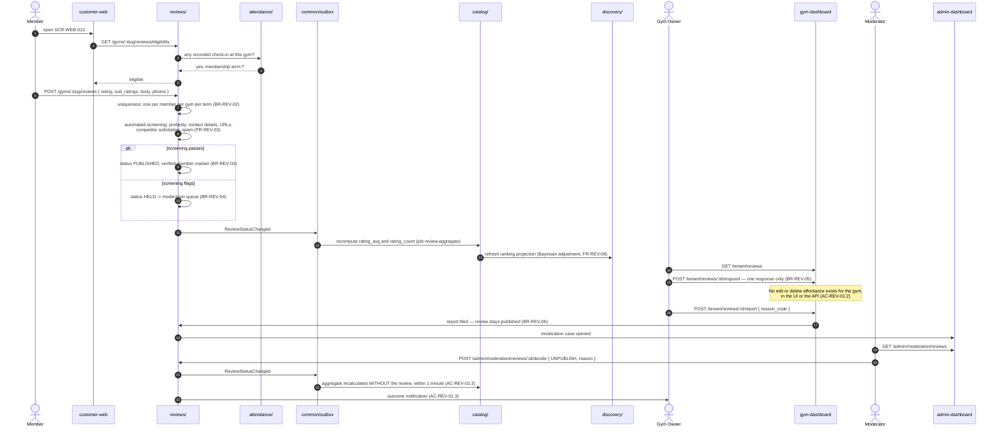
```mermaid
sequenceDiagram
  autonumber
  actor Member
  participant Web as customer-web
  participant REV as reviews/
  participant ATT as attendance/
  participant OUT as common/outbox
  participant CAT as catalog/
  participant DISC as discovery/
  actor Owner as Gym Owner
  participant Dash as gym-dashboard
  actor Mod as Moderator
  participant Adm as admin-dashboard

  Member->>Web: open SCR-WEB-013
  Web->>REV: GET /gyms/:slug/reviews/eligibility
  REV->>ATT: any recorded check-in at this gym?
  ATT-->>REV: yes, membership term T
  REV-->>Web: eligible
  Member->>REV: POST /gyms/:slug/reviews { rating, sub_ratings, body, photos }
  REV->>REV: uniqueness: one per member per gym per term (BR-REV-02)
  REV->>REV: automated screening: profanity, contact details, URLs,<br/>competitor solicitation, spam (FR-REV-03)
  alt screening passes
    REV->>REV: status PUBLISHED, verified-member marker (BR-REV-03)
  else screening flags
    REV->>REV: status HELD -> moderation queue (BR-REV-04)
  end
  REV->>OUT: ReviewStatusChanged
  OUT->>CAT: recompute rating_avg and rating_count (job review.aggregate)
  CAT->>DISC: refresh ranking projection (Bayesian adjustment, FR-REV-08)

  Owner->>Dash: GET /tenant/reviews
  Owner->>Dash: POST /tenant/reviews/:id/respond — one response only (BR-REV-05)
  Note over Dash: No edit or delete affordance exists for the gym,<br/>in the UI or the API (AC-REV-01.2)
  Owner->>Dash: POST /tenant/reviews/:id/report { reason_code }
  Dash->>REV: report filed — review stays published (BR-REV-06)
  REV->>Adm: moderation case opened

  Mod->>Adm: GET /admin/moderation/reviews
  Mod->>REV: POST /admin/moderation/reviews/:id/decide { UNPUBLISH, reason }
  REV->>OUT: ReviewStatusChanged
  OUT->>CAT: aggregate recalculated WITHOUT the review, within 1 minute (AC-REV-02.3)
  REV->>Owner: outcome notification (AC-REV-01.3)
```

### 8.10 Tenant switch with audit (`AC-AUTH-02.2`, `BR-TEN-02`)

```mermaid
sequenceDiagram
  autonumber
  actor Rohan as Owner of tenants A and B
  participant Dash as gym-dashboard
  participant IAM as iam/
  participant TEN as tenancy/
  participant AUD as audit/
  participant API as any tenant-scoped endpoint
  participant PG as PostgreSQL (RLS)

  Rohan->>Dash: sign in
  Dash->>IAM: POST /auth/login
  IAM-->>Dash: access token + tenant memberships [A, B], no active tenant
  Dash-->>Rohan: tenant chooser (AC-AUTH-02.1)
  Rohan->>Dash: select tenant A
  Dash->>IAM: POST /auth/tenant-context { tenant_id: A }
  IAM->>IAM: assert the principal holds a role in A (FR-RBAC-03)
  IAM->>AUD: audit TenantContextSwitched { actor, from: null, to: A, ip, reason: login }
  IAM-->>Dash: new access token carrying tenant claim A

  Rohan->>Dash: work in tenant A
  Dash->>API: GET /tenant/members (Bearer token, tenant A)
  API->>TEN: resolve tenant from the PRINCIPAL, never from a header (C1.4 step 1)
  TEN->>PG: BEGIN; SET LOCAL app.tenant_id = A
  PG->>PG: RLS policy applies to every table in the transaction
  PG-->>API: tenant A rows only
  API-->>Dash: 200

  Rohan->>Dash: switch to tenant B
  Dash->>IAM: POST /auth/tenant-context { tenant_id: B }
  IAM->>AUD: audit TenantContextSwitched { from: A, to: B, ip, user_agent, correlation_id }
  IAM-->>Dash: new token carrying tenant claim B; token for A is revoked
  Dash->>Dash: invalidate every TanStack Query cache key namespaced by tenant
  Dash-->>Rohan: all in-flight views reload scoped to B (AC-AUTH-02.2)

  Note over API,PG: No request ever carries two tenants (BR-TEN-02).<br/>An attempt to read a tenant-A resource with a tenant-B<br/>token returns 404, not 403 — existence is not disclosed<br/>across tenants (E2E-11, BAC-10).
```

---
## 9. Sprint Planning

Sprints are **two weeks**, per `§C9.1`. The focus and exit condition of each sprint are taken
verbatim from the PRD; the epics, demo script and risks are this plan's expansion of them. Team shape
is `§C9.3`: 1 PM, 1 Tech Lead, 3 backend, 1 frontend (web), 2 frontend (dashboards), 1 designer,
2 QA from sprint 2, 1 part-time DevOps, 1 part-time DM.

### Sprint 0 — Foundations

| Field | Value |
| :--- | :--- |
| **Goal** | Repository, CI/CD, environments, IaC, design tokens and component library skeleton, auth scaffolding, tenancy with RLS and its isolation test suite. |
| **Epics** | EP-01 (all), EP-02 (F-02.1, F-02.5 scaffold) |
| **Exit condition** | *"A trivial tenant-scoped endpoint exists and the isolation suite proves it."* |
| **Demo script** | (1) `git init`, trunk protected, a PR runs the full pipeline. (2) `docker compose up` gives Postgres+PostGIS, Redis, MinIO, Mailpit. (3) `GET /v1/tenant/ping` returns tenant A's row for tenant A's token. (4) The same call with tenant B's token returns **404**. (5) The isolation suite runs in CI and fails deliberately when the RLS policy is dropped from a scratch branch. (6) Terraform plans cleanly for `development`. |
| **Risks** | `BLK-01` — the workspace is not yet a Git repository; the branch strategy in §15 cannot be applied until `git init` runs. `OQ-01` (launch country) is **blocking** and due this sprint: it determines tax profile, KYC checklist, gateway and SMS provider, and therefore A-19. `OQ-16` (data residency), `OQ-18` (capacity targets) and `OQ-20` (deployment model) are also due. If `OQ-01` is unanswered, the documented default is applied and recorded in `DECISION_LOG.md` as an amendment to `STACK_ADDITIONS.md`. |

### Sprints 1–2 — IAM, onboarding, KYC, approval queue, gym and branch management

| Field | Value |
| :--- | :--- |
| **Goal** | IAM, tenant onboarding, KYC upload, admin approval queue, gym and branch management. |
| **Epics** | EP-02, EP-03, EP-04 |
| **Exit condition** | **`E2E-01` passes.** |
| **Demo script** | An owner signs up by phone OTP, verifies email, completes all six wizard steps, submits; a verification officer opens the split-view review screen, sees the pre-check panel with a deliberate geo mismatch flagged, overrides with a reason, approves; the listing is visible in the search projection within 60 seconds; the owner receives the approval on email and SMS. Then: reject a second application with two structured reason codes and show the owner the field-level corrections. |
| **Risks** | KYC document handling is the first place `NFR-SEC-02` and `BR-DAT-07` bite — separate bucket, separate key, access logging. Getting this wrong late is expensive. Reviewer throughput assumptions (`Anita`, 30–60 applications/day) are unvalidated until UAT-04. `DEP-08` (KYC vendor) is optional; manual review only in Phase 1. |

### Sprints 3–4 — Plans, catalogue, media, search, detail, comparison, favourites

| Field | Value |
| :--- | :--- |
| **Goal** | Plans, catalogue, media pipeline, marketplace search with PostGIS, gym detail, comparison, favourites. |
| **Epics** | EP-05, EP-06 |
| **Exit condition** | **Search meets `NFR-PERF-01` on seeded data** (p95 ≤ 500 ms, p99 ≤ 1000 ms). |
| **Demo script** | Seed 2,000 gyms across 5 cities; run the k6 search profile at 2,000 requests/minute and show the p95 on the dashboard; apply a six-filter combination and show live facet counts; hover a card and watch the pin highlight; pan the map and show that results do **not** auto-update until "Search this area"; force a zero-result state and show the named most-restrictive filter with a previewed relaxation count; disable the maps provider and show the list rendering fully. |
| **Risks** | This is where the search-cluster temptation appears. `§C1.1` is explicit: Postgres full-text + trigram + PostGIS, **OpenSearch only past ~50k listings**. Adding a cluster here is a rejected substitution. Ranking (`FR-SRCH-10`) must be configurable without deployment or every ranking change becomes a release. `OQ-12` (featured listings) and `OQ-14` (trial/day-pass plans) are due sprint 3. |

### Sprints 5–6 — Orders, checkout, payments, webhooks, invoicing, activation

| Field | Value |
| :--- | :--- |
| **Goal** | Orders, checkout, payment provider abstraction and reference adapter, webhooks, invoicing and tax, membership activation. |
| **Epics** | EP-07, EP-08, EP-09 |
| **Exit condition** | **`E2E-02` passes.** |
| **Demo script** | A visitor searches, compares, registers at the auth gate and returns to the exact plan; checkout shows a full breakdown with a coupon applied; the price is changed in another tab and the blocking re-confirmation modal appears; payment completes in the gateway sandbox; **the browser is closed before the redirect** and the membership is nonetheless `ACTIVE` when the site is reopened; the invoice PDF is generated twice and the two files are byte-identical. |
| **Risks** | The highest-consequence sprint pair in the plan. `BR-PAY-02` (webhook-driven activation) must not be shortcut by a client-side success signal under schedule pressure. Idempotency (`BR-PAY-03`) must be in place before the first payment path ships, not retrofitted. Invoice numbering (`FR-INV-02`) under concurrency is a classic gap-producing defect — `AC-INV-01.1` and `AC-INV-01.2` need dedicated concurrency tests. `OQ-02` (commission rate) and `OQ-03` (tier prices) are due. |

### Sprint 7 — Membership lifecycle

| Field | Value |
| :--- | :--- |
| **Goal** | Membership lifecycle, freeze, renewal, expiry jobs, reminders. |
| **Epics** | EP-10 |
| **Exit condition** | **`E2E-05` passes.** |
| **Demo script** | Freeze a membership for 14 days and show the end date extending by exactly 14; attempt check-in and show the frozen denial with the return date; unfreeze on day 6 and show the end date recalculated to +6, not +14; exhaust the freeze allowance and show the cap message with days used; run the expiry job against a gym in a different timezone and show that expiry occurs at midnight **gym-time**, not server-time; show the T−15/−7/−3/−1 reminder ladder firing on the seeded cohort. |
| **Risks** | Timezone handling is the defect magnet (`BR-MEM-03`). Every validity computation takes an explicit timezone argument; there is no implicit server timezone (`§C1.5`). Freeze-then-expire interaction (`B5.12` edge case) needs a property test. `OQ-06` (freeze at launch) and `OQ-07` (auto-renewal at launch) are due. |

### Sprint 8 — QR check-in and attendance

| Field | Value |
| :--- | :--- |
| **Goal** | QR tokens, check-in desk, attendance, denial handling, overrides. |
| **Epics** | EP-11 |
| **Exit condition** | **`E2E-03` and `E2E-04` pass; `NFR-PERF-03` met** (p95 scan → confirmation ≤ 2 s). |
| **Demo script** | Run a simulated peak hour on a tablet: 20 scans including an expired membership, a wrong-branch attempt and a frozen membership; renew from the denial screen and re-scan successfully; present a screenshot of a 90-second-old QR and watch it fail as expired; scan the same live token twice and show one attendance row; pull the network cable mid-scan and show that the operation completed exactly once or not at all; run the k6 check-in profile at 500 scans/minute and show p95. |
| **Risks** | `NFR-PERF-03` is client-observed, so the budget covers camera decode, network and server. Ed25519 verification (A-11) was chosen precisely for this. Device clock skew must be ignored — server time only. Polling for the live counters (A-08) starts here: the "last updated" indicator is **mandatory**; a stale figure presented as live is a defect. `OQ-08` (cooldown) and `OQ-09` (override scope) are due. |

### Sprint 9 — CRM, staff, offline sales, leads

| Field | Value |
| :--- | :--- |
| **Goal** | Member CRM, staff and roles, offline sales, balance collection, leads. |
| **Epics** | EP-12, EP-13 |
| **Exit condition** | **`E2E-10` passes.** |
| **Demo script** | Invite a receptionist scoped to branch 1; sign in as them and show branch-1-only visibility; attempt to open the plan editor by direct URL and show a **server-side** 403, not a hidden menu; record an offline sale with half payment, show `BALANCE_DUE` on the member record, collect the balance, and show a single consolidated invoice carrying both payments; import 400 members from CSV with a dry run, per-row errors, and an idempotent re-run producing no duplicates. |
| **Risks** | `FR-RBAC-02` is the rule most likely to be violated by a UI-first implementation. Every branch-scoped query must filter on `staff_branches`, not on a client-sent branch id. CSV import at 400+ rows must stream (A-20 papaparse stream mode), not buffer. `OQ-15` (trainer module scope) is due. |

### Sprint 10 — Reviews, moderation, coupons

| Field | Value |
| :--- | :--- |
| **Goal** | Reviews, moderation, aggregation, anomaly detection; coupons. |
| **Epics** | EP-14, remainder of EP-07 coupon features |
| **Exit condition** | **`E2E-09` passes.** |
| **Demo script** | Attempt a review by direct API call from an account with no check-in and show the 403; check in, write the review, watch it publish; the gym responds once and finds no edit or delete affordance anywhere; the gym reports it and the review stays published; a moderator unpublishes it and the rating recalculates within a minute; inject a burst of 5-star reviews from same-period accounts and show them held and excluded from the aggregate. |
| **Risks** | `RSK-02` (fake reviews) is a 16-score business risk whose entire defence lives in this sprint. The anomaly detector must not be so aggressive that genuine post-campaign review bursts are suppressed — tune against the seeded distribution and record thresholds in `FEATURE_FLAGS.md`. `OQ-10` (minimum reviews for a numeric rating) and `OQ-11` (coupon funding sources) are due. |

### Sprint 11 — Ledger, settlements, statements, payouts, reconciliation

| Field | Value |
| :--- | :--- |
| **Goal** | Ledger, settlements, statements, payouts, reserve, reconciliation. |
| **Epics** | EP-15 |
| **Exit condition** | **`E2E-12` passes with zero variance.** |
| **Demo script** | Run a settlement cycle over the seeded period containing online sales, offline sales, a gym-funded coupon, a platform-funded coupon, one refund and one reserve hold; open the statement and walk the arithmetic line by line to the payout figure; show the opening-balance line recovering a prior negative balance; run the daily reconciliation against the gateway sandbox report and show zero variance; deliberately corrupt one fee figure and show the variance alert blocking auto-payout for that tenant only. |
| **Risks** | Sequencing is deliberate: this sprint follows a full sprint of real transaction data from sprints 5–6 so that reconciliation is tested against realistic ledger shapes rather than synthetic ones (`§C9.1`). `BR-FIN-03` (exact sum) and `BR-FIN-06` (never estimate a fee) are the two rules most likely to be softened under delivery pressure; both are launch-blocking through `BAC-07`. `OQ-04` (cycle and reserve) is due. |

### Sprint 12 — Refunds, disputes, evidence packs

| Field | Value |
| :--- | :--- |
| **Goal** | Refunds, disputes, evidence packs. |
| **Epics** | EP-16 |
| **Exit condition** | **`E2E-07` and `E2E-08` pass.** |
| **Demo script** | Request a refund inside the window with no check-ins and watch it auto-approve and execute; request one after 8 of 30 days used and show the pro-rata computation before confirmation and the routing to platform review; complete it and show the credit note, the commission reversal, the revoked QR and the reduced next payout. Then submit a duplicate payment, show one membership created, the duplicate auto-refunded within the hour, and both lines netting to zero on the statement. Finally, fire a chargeback webhook and show the case, the balance hold and the pre-assembled evidence pack. |
| **Risks** | `BR-REF-05` proportional commission reversal must use the same rounding as the original commission or statements stop tying out. Refund of an already-paid-out sale must draw on the reserve (`A6.4`) — test with an empty reserve to prove the negative-balance path. `OQ-05` (platform minimum refund policy) is due. |

### Sprint 13 — Reports, analytics, exports

| Field | Value |
| :--- | :--- |
| **Goal** | Reports and analytics on both tenant and platform sides; exports. |
| **Epics** | EP-18 |
| **Exit condition** | **Report catalogue complete** — 16 tenant reports and 10 platform reports. |
| **Demo script** | Open revenue-by-plan, click a net figure and drill through to the constituent orders; export the CSV and show human-readable headers with money as a plain number beside a separate currency column; request a 12-month export, watch it go asynchronous with a notification and a time-limited link; show a financial report reading the ledger live while an operational report shows a ≤15-minute freshness stamp. |
| **Risks** | `FR-RPT-05` drill-down is what makes reports trustworthy and is also what makes them slow. Read replicas (`NFR-SCAL-04`) must be in place before this sprint or reporting queries will contend with checkout. Exports are a data-egress surface: every export is audited and rate-limited (`RL-EXPORT`). |

### Sprint 14 — Notifications, templates, preferences, support

| Field | Value |
| :--- | :--- |
| **Goal** | Notifications end to end, templates, preferences, support and help centre. |
| **Epics** | EP-17, EP-20 |
| **Exit condition** | **Notification catalogue delivered** — all 24 baseline events across four channels. |
| **Demo script** | Disable marketing email and run a campaign, showing suppression **at send time** not at list build; disable every optional channel and show the T−3 renewal reminder still arriving because it is transactional; unsubscribe from an email link without logging in; show quiet hours deferring a non-transactional message in the recipient's timezone; show the per-channel cost report. Open a support ticket from an order and show the auto-attached references. |
| **Risks** | **A-19 is the only open Tier-2 slot.** Email, SMS and push vendors cannot be selected before `OQ-01` resolves. The ports are designed in sprint 0 and exercised with Mailpit locally; if a vendor is still unchosen at sprint 14, the launch slips or a default-region provider is selected and recorded as an amendment. `RSK-12` (notification cost) is managed by channel preference, email-first defaults, batching and per-tenant caps. `OQ-13`, `OQ-17` and `OQ-19` are due. |

### Sprint 15 — Admin configuration, flags, taxonomy, audit

| Field | Value |
| :--- | :--- |
| **Goal** | Admin configuration, feature flags, taxonomy, audit explorer. |
| **Epics** | EP-19 |
| **Exit condition** | **Admin console complete** — `SCR-ADM-001` … `SCR-ADM-015`. |
| **Demo script** | Set a tenant-level commission override with a reason and an end date; show the effective rate with its source string; show that no other tenant on the tier changed; let the end date pass and show automatic reversion with notification; open a historical statement and show it still carries the rate that applied at the time. Then reconstruct a support impersonation from the audit explorer: the reason, the duration and every action taken, all marked as impersonated. Attempt to modify an audit record through any interface and show that no such capability exists. |
| **Risks** | Configuration without deployment (`FR-ADMN-08`, `FR-NOTF-03`) means configuration becomes a production-change surface. Every change is reason-required, previewed against affected entities and audited (`SCR-ADM-011` guard). Commission precedence (global < tier < tenant) must be resolved by one function used by both display and settlement, or the displayed rate and the charged rate will diverge. |

### Sprint 16 — Hardening

| Field | Value |
| :--- | :--- |
| **Goal** | Performance, accessibility, security testing, penetration-test remediation. |
| **Epics** | Cross-cutting; no new features |
| **Exit condition** | **All NFR targets met** — `NFR-PERF-01` … `NFR-PERF-10`, `NFR-USE-01` … `NFR-USE-09`, `NFR-SEC-01` … `NFR-SEC-13`. |
| **Demo script** | k6 soak at the `NFR-SCAL-01` year-1 profile for four hours with no memory growth and no p95 regression; axe-core clean on the customer site and the check-in desk; a keyboard-only pass through checkout and through a peak-hour check-in sequence; a screen-reader pass on `SCR-WEB-003` and `SCR-DASH-009`; the independent penetration-test report with every critical and high finding closed; `size-limit` proving ≤200 KB gzipped initial JS. |
| **Risks** | Accessibility found in sprint 16 is expensive; it must be enforced continuously from sprint 0 by the axe-core CI job, with sprint 16 reserved for manual passes only. Penetration-test remediation has no schedule buffer after it — a critical finding here directly threatens `M6`. |

### Sprint 17 — UAT and defect resolution

| Field | Value |
| :--- | :--- |
| **Goal** | UAT and defect resolution. |
| **Epics** | Defect burn-down only |
| **Exit condition** | **UAT exit criteria met** — `UAT-01` … `UAT-06` completed, zero S1/S2 open, all S3 triaged with an agreed disposition, sign-off recorded per the approval matrix. |
| **Demo script** | The six scripted persona sessions run on staging with the client's own people: owner signup-to-first-sale (90 min), receptionist peak hour with 20 check-ins including 3 denials (60 min), member full lifecycle (90 min), verification officer with 10 applications (60 min), finance full settlement cycle with refund and dispute (120 min), super admin suspension/override/moderation/audit (60 min). |
| **Risks** | From the start of UAT only S1 and S2 fixes are accepted (`§C10` Freeze). Scope creep here is `RSK-15`. `ASM-05` — client-supplied brand assets, legal copy, terms, privacy and refund policy — must have landed by now or UAT-03 cannot complete. |

### Sprint 18 — Launch

| Field | Value |
| :--- | :--- |
| **Goal** | Production cutover, pilot cohort, monitoring, hypercare. |
| **Epics** | Operational readiness |
| **Exit condition** | **`BAC-01` … `BAC-15` satisfied.** |
| **Demo script** | Production deploy with a backward-compatible migration and zero downtime; progressive traffic shift 10% → 50% → 100% with automatic rollback armed; smoke suite green; the first pilot-cohort gym completes a real sale and a real check-in; one full settlement cycle completes with zero reconciliation variance; the on-call, finance and product dashboards are live with alerts routed. |
| **Risks** | `RSK-10` (supply–demand imbalance) governs the launch shape: city-by-city, and consumer marketing does not open in a city below the `§C9.4` gates — ≥25 verified activated gyms, ≥5 localities, ≥90% complete profiles, verification SLA met for two consecutive weeks, one full settlement cycle at zero variance. A technically successful launch can still fail commercially here. |

### Sprint capacity and load

| Sprint | Epics in scope | Points planned | Cumulative | Notes |
| :-: | :--- | :-: | :-: | :--- |
| 0 | EP-01, EP-02 (partial) | 95 | 95 | Highest single-sprint load; Tech Lead + 3 backend, no feature UI |
| 1–2 | EP-02, EP-03, EP-04 | 150 | 245 | QA joins at sprint 2 |
| 3–4 | EP-05, EP-06 | 123 | 368 | Frontend-heavy |
| 5–6 | EP-07, EP-08, EP-09 | 178 | 546 | Two backend engineers paired on money code (`RSK-14`) |
| 7 | EP-10 | 55 | 601 | |
| 8 | EP-11 | 55 | 656 | |
| 9 | EP-12, EP-13 | 68 | 724 | |
| 10 | EP-14 + coupons | 68 | 792 | |
| 11 | EP-15 | 89 | 881 | Pair coverage mandatory |
| 12 | EP-16 | 55 | 936 | |
| 13 | EP-18 | 55 | 991 | |
| 14 | EP-17, EP-20 | 89 | 1,080 | A-19 dependency |
| 15 | EP-19 | 50 | 1,130 | |
| 16–18 | Hardening, UAT, launch | 0 new | 1,130 | Defect and NFR work only |

---

## 10. Milestones

Nine milestones, `M0` … `M8`, per `§C9.2`. A milestone is **not** met until every evidence artefact
exists and is linked from `PHASES.md`.

### M0 — Baseline frozen (Sprint 0)

| Field | Value |
| :--- | :--- |
| **Deliverable** | This document approved; PRD v2.0 baseline frozen. |
| **Entry criteria** | `MASTER_PRD.md` transcription complete and attested; `STACK_ADDITIONS.md` approved; `PHASES.md` Phase-0 deliverables listed. |
| **Exit criteria** | Every row of the PRD approval matrix signed; `PROJECT_CONSTITUTION.md` and this plan approved; `OQ-01`, `OQ-16`, `OQ-18`, `OQ-20` answered or defaulted with a recorded decision. |
| **Evidence** | Signed approval matrix · `DECISION_LOG.md` entries for every applied `OQ-` default · `PHASES.md` Phase-0 gate ticked · zero code in the repository. |

### M1 — Design system and screens approved (Sprint 2)

| Field | Value |
| :--- | :--- |
| **Deliverable** | Design system and high-fidelity screens for all three surfaces approved. |
| **Entry criteria** | `M0` met; `packages/ui` skeleton with design tokens exists; `/docs/ui/` Phase-6 deliverables drafted. |
| **Exit criteria** | All 55 `SCR-` screens specified with loading, empty, error and permission-denied states; component inventory mapped to shadcn/ui primitives in `packages/ui`; `NFR-USE-01` targets stated per surface; contrast and touch-target rules encoded in tokens. |
| **Evidence** | Approved Figma or equivalent for 55 screens · `packages/ui` Storybook-equivalent catalogue · axe-core baseline run on the primitive set · design-token file reviewed as the single styling source. |

### M2 — Gym onboarding and approval demonstrable end to end (Sprint 4)

| Field | Value |
| :--- | :--- |
| **Deliverable** | Onboarding, KYC and approval working through to marketplace visibility. |
| **Entry criteria** | `M1` met; sprints 1–2 exit condition (`E2E-01`) achieved; catalogue and plans exist for search to index. |
| **Exit criteria** | `E2E-01` green in CI; `BAC-01` and `BAC-02` demonstrated on `development`; `NFR-PERF-01` met on seeded data; the isolation suite covers every endpoint shipped so far. |
| **Evidence** | `E2E-01` Playwright run recording · approval-to-visibility timing under 60 s captured in traces · isolation-suite coverage report at 100% of tenant-scoped endpoints · k6 search report. |

### M3 — First real online membership purchase in staging (Sprint 6)

| Field | Value |
| :--- | :--- |
| **Deliverable** | A membership purchased end to end in staging against the gateway sandbox. |
| **Entry criteria** | `M2` met; `PaymentProvider` port and Stripe Connect reference adapter implemented; tax profile configured for the `OQ-01` country. |
| **Exit criteria** | `E2E-02` green; `BAC-03` and `BAC-04` demonstrated; browser-closed-before-redirect case proven; invoice regeneration byte-identical; `NFR-PERF-05` met. |
| **Evidence** | `E2E-02` run · two invoice PDFs with matching checksums · webhook replay test showing one activation from two identical events · payment-log excerpt with redacted payloads · idempotency 409 demonstration. |

### M4 — First QR check-in in staging (Sprint 8)

| Field | Value |
| :--- | :--- |
| **Deliverable** | Member QR scanned at a staging gym desk with attendance recorded on both sides. |
| **Entry criteria** | `M3` met; membership lifecycle complete (sprint 7); Ed25519 signing key with rotation and `kid` in place. |
| **Exit criteria** | `E2E-03` and `E2E-04` green; `BAC-05` demonstrated; `NFR-PERF-03` p95 ≤ 2 s client-observed; `NFR-PERF-08` 500 check-ins/minute sustained; live counters show a "last updated" indicator. |
| **Evidence** | `E2E-03`/`E2E-04` runs · k6 check-in report · RUM trace of scan-to-confirmation p95 · screenshot of the staleness indicator on `SCR-DASH-001` and `SCR-DASH-009` · token-replay test output. |

### M5 — Feature-complete build in staging (Sprint 15)

| Field | Value |
| :--- | :--- |
| **Deliverable** | Every `M`-priority functional requirement delivered and deployed to staging. |
| **Entry criteria** | `M4` met; sprints 9–15 exit conditions all achieved (`E2E-05`, `E2E-07` … `E2E-10`, `E2E-12`, report catalogue, notification catalogue, admin console). |
| **Exit criteria** | All 261 `FR-` items implemented or formally deferred with a `KNOWN_LIMITATIONS.md` entry; all 12 `E2E-` journeys green; all 24 `C5` background jobs running with locks, metrics and failure alerts; OpenAPI spec published with zero drift. |
| **Evidence** | Requirement traceability report from `MASTER_PRD_CHECKLIST.md` at 100% · CI run with all 12 E2E journeys green · job-inventory dashboard · published OpenAPI with the drift gate green. |

### M6 — Performance, accessibility and security sign-off (Sprint 16)

| Field | Value |
| :--- | :--- |
| **Deliverable** | Independent verification that the non-functional budget is met. |
| **Entry criteria** | `M5` met; penetration test booked and scoped; production-shaped anonymised data loaded in staging. |
| **Exit criteria** | `NFR-PERF-01..10` measured and met; `BAC-11` satisfied; WCAG 2.1 AA verified on the customer site and check-in desk; zero critical or high penetration-test findings open; `NFR-SEC-08` zero critical dependency vulnerabilities; `NFR-AVL-05` monthly restore verification executed successfully at least once. |
| **Evidence** | k6 load and soak reports against every `NFR-PERF-` target · axe-core reports plus a signed manual keyboard and screen-reader pass · penetration-test report with a closed-findings register · restore-drill log with RTO and RPO actuals against `NFR-AVL-04`. |

### M7 — UAT sign-off (Sprint 17)

| Field | Value |
| :--- | :--- |
| **Deliverable** | Client acceptance against the six persona scripts. |
| **Entry criteria** | `M6` met; staging carrying anonymised production-shaped data; client personnel scheduled for all six roles; brand assets and legal copy delivered (`ASM-05`). |
| **Exit criteria** | `UAT-01` … `UAT-06` completed; zero S1 and zero S2 defects open; every S3 triaged with an agreed disposition; sign-off recorded per the approval matrix; `BAC-15` satisfied. |
| **Evidence** | Six completed UAT scripts with observer notes · defect register with severity, disposition and owner · signed sponsor acceptance · change-freeze declaration under `§C10`. |

### M8 — Production launch with pilot cohort (Sprint 18)

| Field | Value |
| :--- | :--- |
| **Deliverable** | Live platform serving a pilot cohort in one city. |
| **Entry criteria** | `M7` met; production infrastructure provisioned by Terraform only; live gateway credentials in the managed secret store; on-call rota published; runbooks complete for all 23 modules. |
| **Exit criteria** | `BAC-01` … `BAC-15` all demonstrably true in production; the `§C9.4` city gates met before consumer marketing opens; one full settlement cycle completed at zero variance; monitoring, alerting and hypercare rota active; rollback rehearsed in production within the release window. |
| **Evidence** | Production smoke-suite run · progressive-traffic-shift log with the rollback trigger armed and unfired · first settlement statement reconciled to zero variance · city-gate checklist signed by Commercial · hypercare log for the first 14 days · `CHANGELOG.md` release entry. |

---

## 11. Technical Risks

Scored **Probability (1–5) × Impact (1–5)**, the same scale as the PRD register so the two are
comparable. Owners are roles from `§C9.3`.

| ID | Risk | Description | P | I | Score | Early-warning signal | Mitigation | Owner | Maps to |
| :--- | :--- | :--- | :-: | :-: | :-: | :--- | :--- | :--- | :--- |
| **TR-01** | **Prisma pooling defeats RLS** | PostgreSQL RLS needs `SET LOCAL app.tenant_id` inside the **same transaction** as the query. Prisma's connection pool can hand a naive `prisma.user.findMany()` a different pooled connection than the one the variable was set on. RLS then sees no tenant and returns nothing — or, if a policy were written permissively, the **wrong rows**. This is the single most dangerous technical risk in the system because it breaks `BR-TEN-01` silently. | 3 | 5 | **15** | Any repository importing `PrismaClient` directly; an isolation test that passes only because the query returned zero rows; a `current_setting('app.tenant_id')` lookup raising "unrecognized configuration parameter" in logs | **Mandatory** Prisma client extension wrapping every tenant-scoped operation in an interactive transaction that first executes `SET LOCAL app.tenant_id`; no repository may call the raw client; `dependency-cruiser` forbids the import outside `common/prisma`; the CI isolation suite (`BAC-10`, `E2E-11`) asserts both the negative case *and* that the positive case returns the expected non-empty result, so a false pass is impossible; a Testcontainers integration test asserts the session variable is set inside the same transaction. Note: TypeORM has the identical exposure — this is a property of pooling plus RLS, not of Prisma. | Technical Lead | `RSK-08`, `NFR-SEC-09`, A-01 |
| **TR-02** | **Polling load at scale** | A-08 replaces a push transport with TanStack Query polling at 10–15 s for `SCR-DASH-001` and `SCR-DASH-009`. At 2,000 tenants with 5,000 branches (`NFR-SCAL-01`), a desk open all day per branch is roughly 5,000 clients × 4–6 requests/minute = 20,000–30,000 requests/minute of pure polling, potentially dwarfing real traffic and contending with checkout for connections. | 4 | 3 | **12** | Poll traffic exceeding **5%** of total API requests (the recorded revisit trigger); `/tenant/attendance/live` p95 rising above 300 ms; Postgres connection saturation during gym peak hours; any tenant exceeding 200 check-ins/hour at one branch | Single dedicated endpoint (`/tenant/attendance/live`) reading a Redis-backed projection, never the attendance table; ETag/`304` responses so unchanged data costs almost nothing; `RL-SCAN`-class limiting per branch; polling paused when the tab is hidden; jittered intervals to prevent thundering herds; all live figures behind the **one** `useLiveCounters()` hook so the Phase-2 Socket.IO swap touches that hook only; the debt is registered in `TECH_DEBT.md` with the three revisit triggers. `NFR-PERF-03` is unaffected — check-in confirmation is request/response, not push. | Technical Lead | A-08, `NFR-SCAL-03`, `RSK-14` |
| **TR-03** | **Invoice number gaps under concurrency** | `FR-INV-02` requires a gapless sequence per tenant per financial year. Concurrent captures for one tenant can allocate the same number, skip a number on rollback, or serialise so badly that `NFR-PERF-07` fails. A silently skipped number is explicitly a defect (`AC-INV-01.2`). | 3 | 4 | **12** | Any gap detected by the nightly sequence-integrity check; invoice-issue latency p95 climbing; unique-violation retries on `invoices.invoice_number` | Per-tenant-per-year advisory lock held for the duration of the numbering transaction only; number allocated inside the same transaction as the invoice row; on failure after allocation, a documented **void record** occupies the number rather than leaving a hole; nightly job asserts contiguity per tenant per FY and alerts on any gap; concurrency test in the sprint-5 exit gate issues 50 simultaneous invoices for one tenant. | Backend Lead (billing) | `FR-INV-02`, `AC-INV-01.1`, `AC-INV-01.2` |
| **TR-04** | **Webhook ordering and loss** | Activation depends exclusively on webhooks (`BR-PAY-02`). Providers deliver out of order, deliver twice, or fail to deliver. A refund webhook arriving before its capture webhook, or a capture never arriving, leaves money and membership state inconsistent. | 4 | 5 | **20** | `payment_events` rows with an unexpected predecessor state; growth in payments stuck `PENDING`/`AUTHORISED` past the poller threshold; provider dashboard showing delivery failures | Idempotent, order-independent handlers keyed on `provider_event_id` with a uniqueness constraint; state machine rejects illegal transitions rather than forcing them; `payment.reconcile` polls every 15 minutes and applies terminal provider states idempotently; still-indeterminate cases escalate to Finance and **never** auto-activate (`BR-PAY-06`); webhook endpoint returns 2xx only after the event is durably stored, so the provider retries anything not persisted. | Backend Lead (payments) | `RSK-04`, `BR-PAY-05`, `BR-PAY-06` |
| **TR-05** | **Money rounding divergence** | Commission, tax, proration and refund reversal are computed in several places. If any of them rounds differently, statements stop summing exactly to the payout and `BR-FIN-03` fails — which is a launch blocker via `BAC-07`. | 3 | 5 | **15** | Reconciliation variance of 1–2 minor units; settlement line sums off by small amounts; property-test failures on allocation | One `round_half_even` implementation in `packages/utils/money`, used everywhere; a lint rule forbidding `Math.round`, `toFixed` and floating-point arithmetic on money; `Money` value type with arithmetic only through its methods; property-based tests asserting that allocation of a total across N lines re-sums to the total exactly; all eight A6.3 figures persisted at sale time and never recomputed at display (`BR-FIN-02`). | Backend Lead (settlements) | `BR-FIN-02`, `BR-FIN-03`, `KPI-26` |
| **TR-06** | **PostGIS search misses `NFR-PERF-01` at scale** | Radius search combined with six filters, full-text, trigram and a configurable ranking formula can degrade past p95 500 ms well before the ~50k listings at which OpenSearch is sanctioned. The tempting fix — adding a search cluster early — is a **rejected substitution**. | 3 | 4 | **12** | Search p95 above 400 ms on seeded data; sequential scans in `EXPLAIN` on the branches GiST index; cache hit ratio below 60% | GiST index on `branches.location`; composite indexes per `§C2.4`; a denormalised `search_documents` read model refreshed by `search.reindex`; Redis-cached result pages and facet counts with 60 s TTL; read replicas for marketplace traffic (`NFR-SCAL-04`); ranking weights configurable without deployment so tuning is not a release; k6 gate at 2,000 searches/minute in the sprint-4 exit condition. OpenSearch is introduced **only** past ~50k listings, as a documented `TECH_DEBT.md` trigger. | Backend Lead (discovery) | `NFR-PERF-01`, `NFR-PERF-09`, `§C1.1` |
| **TR-07** | **Timezone errors in validity computation** | `BR-MEM-03` computes membership validity in the **gym's** timezone. Expiry jobs, freeze extension, operating-hour checks, reminder scheduling and reporting all interpret dates. A single implicit server-timezone assumption produces memberships that expire a day early or late for some tenants. | 4 | 4 | **16** | Expiry-job output differing from a manual count for a non-UTC tenant; support tickets about a membership ending on the wrong day; DST-boundary test failures | All storage in UTC (`NFR-DQ-03`); every validity function takes an explicit IANA timezone argument — there is no default; a lint rule bans `new Date()` without an explicit zone in domain code; the deterministic seed includes tenants in at least three timezones including one with DST; property tests across DST boundaries; expiry and activation jobs run hourly and filter by gym-local midnight rather than firing once globally. | Backend Lead (memberships) | `BR-MEM-03`, `FR-MEMB-09`, `NFR-DQ-03` |
| **TR-08** | **Outbox dispatcher backlog or duplicate dispatch** | Every cross-module effect flows through the outbox. If the dispatcher stalls, notifications, activations and projections all stop; if it dispatches twice without idempotent handlers, members get duplicate notifications and projections double-count. | 3 | 4 | **12** | Outbox rows with `published_at IS NULL` older than 60 s; dispatcher lag metric rising; duplicate `notification_log` rows for one aggregate | Outbox row written in the same transaction as the state change; dispatcher claims rows with `FOR UPDATE SKIP LOCKED`; every handler idempotent on `(event_id, handler_name)`; lag metric with an alert at 60 s and a page at 300 s; dead-letter queue with Bull Board visibility (A-30); the dispatcher is a worker-tier process so it cannot starve request handling (`NFR-SCAL-05`). | Backend Lead (platform) | `§C1.5` Events, `NFR-MNT-06` |
| **TR-09** | **QR token forgery or replay** | The check-in token is the credential that opens a door. A leaked signing key, a missing `kid`, or an accepted replay turns credential sharing from a detection problem into a free-for-all. | 2 | 5 | **10** | Verification failures spiking after a deploy; attendance rows with duplicate `token_nonce`; scans succeeding with tokens older than 60 s | EdDSA Ed25519 detached signatures with a rotating key and `kid` in the payload (A-11); key material in the managed secret store, never in an environment file (`NFR-SEC-07`); 60 s TTL validated against **server** time only; `token_nonce` unique within TTL giving `BR-CHK-06` idempotency; no personal data in the payload (`FR-CHK-02`); key rotation rehearsed with both keys valid during the overlap window; implausible-travel detection as a second line (`FR-CHK-12`). | Technical Lead | `RSK-03`, `BR-CHK-02`, `BR-CHK-06` |
| **TR-10** | **Read-replica staleness misread as truth** | `NFR-SCAL-04` routes read-heavy marketplace and reporting traffic to replicas. Replication lag makes a just-published plan invisible, a just-completed payment look unpaid, or a financial report understate revenue — the last of which violates `FR-RPT-02`. | 3 | 3 | **9** | Replication lag above 2 s; "I published it and it isn't there" reports; a financial total differing between two consecutive loads | Explicit read-preference per query: **primary** for anything the same user just wrote, for all financial reads and for the ledger; replica for marketplace search and operational reports; a `read-your-writes` marker on the session for a short window after a write; a lag metric with an alert at 2 s and automatic fallback to primary above 5 s; `FR-RPT-02` encoded as a test — financial reports are asserted to read the primary. | DevOps + Backend Lead (reporting) | `NFR-SCAL-04`, `FR-RPT-02` |
| **TR-11** | **Migration that is not backward-compatible** | `NFR-AVL-06` requires zero-downtime deploys with backward-compatible migrations within a release window. A single dropped or renamed column deployed alongside its code change breaks every instance still running the previous version during a rolling deploy. | 3 | 4 | **12** | Any migration containing `DROP COLUMN`, `RENAME`, or a `NOT NULL` addition without a default in the same PR as the code that uses it; deploy errors during the rollout window | Expand–migrate–contract discipline enforced by review and by a CI check that flags destructive DDL and requires an explicit `# expand-contract: phase=N` annotation; contract migrations ship at least one release after the expand; migrations run **before** the new image receives traffic and must be safe for the previous image; every migration has a tested down path or a documented forward fix; the CI job runs the migration against a restored production-shaped snapshot. | DevOps | `NFR-AVL-06`, `§C7` |
| **TR-12** | **Cross-tenant leakage through reporting and exports** | `reporting/` legitimately reads almost everything, and `admin/` legitimately crosses tenants. These are exactly the code paths where `BR-TEN-01` is most likely to be violated — and `E2E-11` explicitly names reports and exports as attack surface. | 3 | 5 | **15** | Any report query without a tenant predicate in review; an export file containing more rows than the tenant owns; isolation-suite gaps on report and export endpoints | Reporting has no write path and reads only through tenant-scoped query interfaces; platform-scope reads require the named, audited elevation (`§C1.4`), never an ambient capability; the isolation suite explicitly covers `GET /tenant/reports/:reportKey` and `POST /tenant/exports` for every report key; export row counts are asserted against a tenant-scoped count in tests; every export is audited with actor, tenant and row count. | Technical Lead | `RSK-08`, `E2E-11`, `BAC-10` |
| **TR-13** | **Notification vendor undecided at integration time (A-19)** | Email, SMS and push vendors are deferred pending `OQ-01`. Sprint 14 delivers the notification catalogue end to end. If `OQ-01` is unresolved, sprint 14 has ports but no adapters, and `KPI-25`, `BR-MEM-11` and OTP delivery (`FR-AUTH-05`) all depend on real delivery. | 4 | 3 | **12** | `OQ-01` still open at the sprint-0 gate; no vendor contract signed by sprint 12 | Ports defined in sprint 0 and exercised against Mailpit locally and a stub in CI; the adapter interface is deliberately small (send, status callback, cost record) so a vendor takes days, not weeks; a decision deadline of **sprint 12** is placed in the risk register, after which the PRD default applies and a default-region provider is selected and recorded as an amendment to `STACK_ADDITIONS.md`; OTP has an email fallback from day one (`AC-AUTH-01.5`, `DEP-03`). | Product Manager | A-19, `OQ-01`, `DEP-03`, `DEP-04` |
| **TR-14** | **Attendance and audit table growth** | 50,000 check-ins/day at year-1 capacity is ~18M attendance rows per year, plus an audit row for every mutation on eight entity families. Unpartitioned, these tables degrade every query that touches them, including the check-in cooldown lookup on the `NFR-PERF-03` path. | 3 | 3 | **9** | Attendance table size growth outpacing the model; cooldown-lookup latency rising; autovacuum falling behind | Monthly range partitioning on `attendance.checked_in_at` and `audit_log.occurred_at` from the first migration, not retrofitted (`NFR-SCAL-06`); `audit.partition-maintenance` job creates and archives partitions monthly; indexes `(tenant_id, branch_id, checked_in_at)` and `(membership_id, checked_in_at desc)` sized for the cooldown query; retention sweep per `NFR-PRV-04` (audit 7 years, operational active + 12 months). | DevOps + Backend Lead (attendance) | `NFR-SCAL-06`, `NFR-PRV-04` |
| **TR-15** | **Deterministic PDF is not deterministic** | `FR-INV-07` requires byte-identical regeneration. Headless Chromium embeds timestamps, font subsets vary by version, and any locale or timezone difference in the rendering container changes bytes. | 3 | 3 | **9** | A checksum mismatch between two regenerations in CI; a font-substitution warning in render logs | Pinned Chromium version in the image digest, not a tag; fonts bundled in the image rather than resolved at runtime; PDF metadata timestamps set from the invoice `issued_at`, never `now()`; deterministic document id; fixed locale and `TZ=UTC` in the render container; a CI test that renders the same invoice twice and compares checksums, run on every PR touching `billing/` or the image. | Backend Lead (billing) | `FR-INV-07`, `NFR-PERF-07` |
| **TR-16** | **Third-party dependency failure cascades** | `DEP-01` … `DEP-08` are all external. `NFR-AVL-03` requires that loss of maps, search indexing, notifications or analytics must not prevent check-in, purchase or payment. Without circuit breakers, a slow maps provider can consume the connection pool and take down check-in. | 3 | 4 | **12** | Rising p99 on any endpoint that calls a third party; thread/connection pool saturation; timeout counts climbing on one adapter | Circuit breaker on every third-party call with a defined fallback (`NFR-AVL-07`): maps → list-only view with cached geocodes; SMS → email OTP; email → queue and retry with the in-app centre carrying the message; storage → placeholder images and queued uploads; error tracking → local logging retained; bulkhead isolation so one adapter cannot exhaust shared pools; aggressive timeouts (2 s connect, 5 s total) on non-critical calls; a chaos test in the nightly suite disabling each dependency in turn and asserting check-in and payment still work. | DevOps | `NFR-AVL-03`, `NFR-AVL-07`, `DEP-01`…`DEP-08` |
| **TR-17** | **Coverage gates gamed rather than met** | `NFR-MNT-01` requires ≥80% overall and ≥95% on payment, settlement, membership state and tenancy code. Percentage gates are satisfiable with assertion-free tests, which is worse than no gate because it produces false confidence in exactly the modules that matter most. | 3 | 4 | **12** | Coverage rising while mutation score falls; PRs adding tests with no assertions; a bug in money code that had "covered" lines | Per-path coverage thresholds enforced separately for the four critical module groups, not just a global number; mutation testing on `payments/`, `settlements/`, `ledger/`, `refunds/`, `memberships/` and `tenancy/` with a minimum score gate; `BAC-06` requires every A8 rule to have a passing test and every `M`-priority rule to have a **negative-case** test; CODEOWNERS requires two reviewers on money and tenancy paths. | QA Lead | `NFR-MNT-01`, `BAC-06`, `RSK-14` |
| **TR-18** | **Bundle budget breached by the shared UI library** | `NFR-PERF-10` caps initial JS at 200 KB gzipped for the customer site. `packages/ui` is shared with two dashboards that have no such budget; a heavy primitive added for the admin console can silently land in the customer bundle. | 3 | 3 | **9** | `size-limit` trending upward across PRs; a new dependency appearing in the customer-web dependency graph; LCP regression in RUM against `NFR-PERF-02` | `size-limit` (A-29) as a **blocking** CI gate with a per-entry budget, not a warning; `packages/ui` exports are individually importable with no barrel re-export that defeats tree-shaking; a dependency-graph check that fails when `customer-web` imports a primitive marked `dashboard-only`; route-level code splitting; RUM LCP tracked against `NFR-PERF-02` with a weekly review. | Frontend Lead (web) | `NFR-PERF-10`, `NFR-PERF-02` |

**Risk posture summary.** Two risks score ≥15 on impact 5 (`TR-04` 20, `TR-01`/`TR-05`/`TR-12` 15).
All four are money or tenancy risks, which is why `CODEOWNERS` requires two reviewers on those paths
and why pair coverage on payments and tenancy is a standing mitigation for `RSK-14`.

---

## 12. Business Risks

The PRD's fifteen-entry register from `A10`, restated with the **concrete engineering
countermeasure** each one buys. The business mitigation is the PRD's; the engineering countermeasure
is this plan's commitment.

| ID | Risk | P | I | Score | Business mitigation (PRD) | Engineering countermeasure (this plan) | Owner |
| :--- | :--- | :-: | :-: | :-: | :--- | :--- | :--- |
| **RSK-01** | Fake or non-existent gyms listed | 4 | 5 | **20** | Mandatory human KYC review; address-to-geo tolerance; duplicate address detection; bank verification; spot audits; "report this gym" | `→ APPROVED` is unreachable from any automated code path — the transition guard in `onboarding/domain/state-machines/` requires an authenticated `VERIFICATION_OFFICER` or `SUPER_ADMIN` command (`BR-GYM-03`); `FR-ONB-12` pre-checks run at submission and their results are persisted on the application so approval-with-failed-precheck forces a recorded override (`AC-ONB-02.3`); a partial unique index enforces one `APPROVED` gym per normalised physical address (`BR-GYM-09`); `FR-DETL-06` report flow writes to `admin/` moderation queues; marketplace visibility is a pure function of approval state, so a suspension removes a listing within one projection refresh | Operations · Backend Lead (onboarding) |
| **RSK-02** | Fake or incentivised reviews | 4 | 4 | **16** | Check-in-gated reviews; one per term; rating-velocity anomaly detection; moderation queue | Eligibility is computed server-side from `attendance/` and the compose UI is unreachable without it; a direct API call returns **403** and there is a test asserting exactly that (`AC-REV-02.1`); uniqueness is a database constraint on `(user_id, gym_id, membership_id)`, not application logic; `review.anomaly-scan` runs hourly on velocity, reviewer account age and text clustering, holding suspect reviews and **excluding them from the aggregate** until cleared; the gym has no edit or delete capability in the API surface at all — this is verified by a contract test that asserts the absence of the routes | Operations · Backend Lead (reviews) |
| **RSK-03** | Membership credential sharing | 4 | 3 | **12** | 60-second rotating tokens; implausible-travel detection; photo on staff check-in screen; suspension pending review | Ed25519-signed tokens with 60 s TTL validated against server time only, so a screenshot is worthless within a minute (`AC-CHK-01.3`); `attendance.sharing-scan` runs hourly comparing check-ins at branches separated by more than a configurable distance within a configurable interval (`FR-CHK-12`); the success screen renders the member photo so the desk can see a mismatch (`FR-CHK-05`); a flagged membership is **suspended pending review, not cancelled** (`BR-MEM-13`), which is implemented as a distinct `MEMBERSHIP_UNDER_REVIEW` denial reason rather than a state change | Product · Backend Lead (attendance) |
| **RSK-04** | Payment failure or double charge | 3 | 5 | **15** | Idempotency everywhere; webhook-driven activation; automated duplicate detection and refund; daily reconciliation | `Idempotency-Key` is **required** on every money-affecting endpoint, with the key, request fingerprint and response stored 24 hours and a 409 on fingerprint mismatch; activation is triggered only by a signature-verified, deduplicated webhook (`BR-PAY-02`) — there is no client-side activation path to disable under pressure; `payment.duplicate-detect` runs every 15 minutes and auto-refunds the second capture with notification inside one hour; `payment.reconcile` polls indeterminate intents; `settlement.reconcile` compares the gateway report to the ledger daily and blocks auto-payout on any variance; see also **TR-04** | Engineering · Backend Lead (payments) |
| **RSK-05** | Refund and chargeback abuse | 3 | 4 | **12** | Policy stored per order; usage-aware refund rules; rolling reserve; auto-assembled evidence pack | The refund policy is a **snapshot on the order** (`refund_policy_snapshot jsonb`), so a tenant cannot retroactively tighten or a member retroactively benefit (`BR-REF-02`); eligibility evaluates window **and** recorded check-in count **and** value against configurable thresholds, routing anything outside policy to Super Admin (`BR-REF-03`, `BR-REF-06`); a rolling reserve (default 5%, released at 30 days) is a first-class ledger construct with `RESERVE_HOLD`/`RESERVE_RELEASE` entry types; `FR-RFND-09` assembles order, invoice, payment record, attendance records, accepted terms and communication log automatically the moment a dispute opens | Finance · Backend Lead (refunds) |
| **RSK-06** | Gym closes with prepaid members | 3 | 5 | **15** | Reserve and hold period; pro-rata refund; closure detection through check-in drop-off alerts | 14-day hold on new-tenant funds implemented as a batch-eligibility guard, not a manual process (`A6.4`); `BR-REF-07` pro-rata refunds are computed by the same proration function as ordinary refunds and recovered from balance then reserve, with the negative-balance path tested against an empty reserve; a check-in drop-off detector compares each branch's trailing 7-day visit count against its own 8-week baseline and raises an operational alert, reusing the `crm.risk-flags` machinery at branch granularity; affected members are notified within 24 hours by a `notifications/` transactional template (`BR-MEM-14`) | Finance · Backend Lead (settlements) |
| **RSK-07** | Gym disintermediates the marketplace | 4 | 4 | **16** | 30-day attribution window with server-side event log; commercial terms; renewal rate step-down; marketplace-only coupons | `attributed_at` is written **server-side** at the first authenticated view from a discovery surface and is immutable; it is not a cookie and not a client parameter, so it cannot be stripped by asking the customer to "come and pay at the counter"; the attribution event log is visible to both parties, which makes disputes evidential rather than rhetorical; `origin` is persisted on both order and membership; the reduced renewal rate is a separate configured field (`renewal_commission_rate_bps`) applied from the second renewal onward; coupons carry a scope so marketplace-only promotions are enforceable at redemption | Commercial · Backend Lead (ordering) |
| **RSK-08** | Cross-tenant data leakage | 2 | 5 | **10** | Row-level security in the database, not only in application code; tenant-scoped repository layer; automated isolation suite in CI; penetration test before launch | The full five-layer chain of `§C1.4` is implemented as EP-01 in **sprint 0**, before any feature: middleware resolution that never reads a client header, `SET LOCAL` inside every transaction via the mandatory Prisma extension, RLS policies on every tenant-owned table with no `BYPASSRLS` on the application role, a base repository that refuses a context-free query, and an isolation suite that fails the build when a new tenant-scoped endpoint lacks coverage; cross-tenant reads return **404, not 403**, so existence is not disclosed; `admin/` and `reporting/` cross-tenant reads require a named, audited elevation. See **TR-01** and **TR-12** | Engineering · Technical Lead |
| **RSK-09** | Poor gym-side adoption after signup | 4 | 4 | **16** | Guided onboarding with activation checklist; weekly KPI-02/05 monitoring; data import assistance; check-in as the habit hook | The activation checklist is a persistent dashboard element driven by a server-computed state (approved + ≥1 published plan + ≥1 staff + ≥1 member + ≥1 check-in), not a dismissible banner (`FR-ONB-14`, `FR-NAV-04`); the tenant-activation funnel is instrumented end to end as named analytics events (`owner_signup_started` → `first_checkin_recorded`) so `KPI-02` and `KPI-05` are measurable from day one rather than reconstructed; CSV import with dry run and idempotent re-run removes the largest single onboarding obstacle for a 400-member gym (`FR-ONB-15`); the dashboard home answers "what do I do today" in one screen (`SCR-DASH-001`) | Product · Frontend Lead (dashboards) |
| **RSK-10** | Supply–demand imbalance at launch | 4 | 4 | **16** | City-by-city launch; no consumer marketing below minimum verified gym density | The `§C9.4` gates are encoded as a **platform report** (`City performance`) with supply density, locality distribution, profile-completeness percentage, verification-SLA attainment and settlement-cycle variance as explicit columns, so the gate is read from data rather than asserted; city-level feature flags (`FR-ADMN-08` tenant/percentage targeting extended to city) gate consumer-facing surfaces per city; the zero-result state captures the searcher's location as an expansion demand signal (`B5.6` edge case) | Commercial · Product |
| **RSK-11** | Price or stale listing mismatch damaging trust | 3 | 4 | **12** | Server-side re-validation; listing freshness score; automatic delisting beyond a staleness threshold | `BR-PLN-03` re-validation is a mandatory step in the checkout state machine — `PENDING → AWAITING_PAYMENT` is guarded by it, so it cannot be skipped by a code path that forgets to call it; a mismatch returns `422 PLAN_PRICE_CHANGED` with previous and current values and **never silently charges either figure** (`AC-PLAN-02.2`); `gym.freshness-score` runs nightly over last profile update, last plan update, photo age and check-in recency, demoting stale listings in ranking and prompting the owner (`FR-GYM-12`) | Product · Backend Lead (plans) |
| **RSK-12** | Notification cost escalating beyond unit economics | 3 | 3 | **9** | Channel preference by cost; email-first for non-urgent; batching; per-tenant caps | Channel selection is a policy object per template, not a hard-coded channel list, so an email-first default can be changed without deployment (`FR-NOTF-03`); per-recipient per-category rate limiting prevents storms (`FR-NOTF-06`); quiet hours defer non-transactional sends (`FR-NOTF-05`); every send records a cost attribution so the per-channel cost report is real rather than estimated (`FR-NOTF-08`); per-tenant caps are enforced in the dispatcher, and the owner digest batches operational events rather than sending each one | Finance · Backend Lead (notifications) |
| **RSK-13** | Regulatory change in payments or data protection | 2 | 4 | **8** | Provider abstraction; configurable data residency; legal review before each market entry | The `PaymentProvider` port is the only route to a gateway and no domain code names a provider, so a second adapter is an implementation task rather than a refactor (`FR-PAY-01`); country behaviour is configuration — tax profile, KYC checklist, currency and timezone are all per-tenant data (`OBJ-09`); data residency is a Terraform variable per deployment region (`NFR-PRV-05`); retention periods are policy data driven by `data.retention-sweep`, so a statutory change is a configuration change; sub-processors are enumerated in a reviewed list (`NFR-PRV-06`) | Legal · Technical Lead |
| **RSK-14** | Key-person dependency in the delivery team | 3 | 3 | **9** | Documentation-first culture; this document as the baseline; pair coverage on payments and tenancy | `CODEOWNERS` requires **two** reviewers on `payments/`, `settlements/`, `ledger/`, `refunds/`, `billing/` and `tenancy/`, which makes pair coverage structural rather than cultural; every module ships a `RUNBOOK.md` covering its top three failure modes (`NFR-MNT-09`) as a required file checked in CI; every module ships a `README.md` stating its bounded context, owned tables and published events; ADRs in `/docs/adr/` record why, not just what; the deterministic seed lets any engineer reproduce any scenario without tribal knowledge | Delivery · Technical Lead |
| **RSK-15** | Scope creep between sign-off and delivery | 4 | 3 | **12** | Change request process; this document as the contractual baseline | Every commit, branch and PR carries a PRD identifier in its name (§15), so work with no requirement behind it is visible at review time rather than at demo time; the `MASTER_PRD_CHECKLIST.md` traceability report is generated in CI and any implemented behaviour without a mapped `FR-` fails review; from the start of UAT only S1 and S2 fixes are accepted (`§C10` Freeze), enforced by a release-branch policy that rejects PRs without an S1/S2 defect id after the freeze date; the 10% contingency is tracked and its exhaustion is reported, not silently absorbed | Delivery · Product Manager |

---

## 13. Estimated Complexity

Ratings use a five-level scale. **Story points** are the same Fibonacci scale as §2 (1 point ≈ half an
engineer-day). **Engineer-days** are derived as `points × 0.5`, rounded, and represent *implementation
plus test plus review*, excluding design and UAT.

| Rating | Meaning |
| :--- | :--- |
| **Trivial** | Well-understood CRUD with no cross-module effects |
| **Moderate** | Multiple entities, some business rules, one integration |
| **High** | State machine or money, several collaborators, non-trivial concurrency |
| **Very High** | Money **and** concurrency **and** an external system, with a launch-blocking acceptance criterion |
| **Extreme** | All of the above plus a legal or isolation obligation that must hold under every code path |

### 13.1 Per-module complexity

| Module | Rating | Reasoning | Points | Eng-days | Top three riskiest parts |
| :--- | :--- | :--- | :-: | :-: | :--- |
| `common/` | **High** | Nine cross-cutting mechanisms that every other module depends on. Getting `Money`, idempotency and the outbox wrong is not a local defect — it is a systemic one. Low domain complexity, very high blast radius. | 55 | 28 | (1) `Money` semantics and the lint rule that keeps floats out; (2) idempotency fingerprinting that neither over-matches nor under-matches; (3) outbox dispatcher concurrency with `SKIP LOCKED` |
| `tenancy/` | **Extreme** | `BR-TEN-01` is a legal obligation and the single most likely thing to be broken by an ordinary coding mistake. Five enforcement layers, one of which (the Prisma extension) is a known pooling hazard. Small code volume, maximum consequence. | 34 | 17 | (1) `SET LOCAL` inside the same transaction under Prisma pooling (**TR-01**); (2) platform-scope elevation that stays a named call rather than becoming ambient; (3) proving the positive *and* negative case so a false pass is impossible |
| `iam/` | **High** | Twelve roles, three surfaces, multi-tenant identity, rotating refresh tokens with reuse detection, impersonation with financial-mutation refusal, MFA. Security-critical but well-trodden. | 55 | 28 | (1) refresh-token family revocation on reuse detection; (2) permission evaluation as `(role, scope, resource, action)` and never role alone; (3) impersonation token type that cannot be widened by a later feature |
| `onboarding/` | **High** | Six-step resumable wizard, versioned snapshots, six pre-checks, a seven-state machine, and the human-only approval guard that `RSK-01` depends on. Document handling adds encryption and access-logging obligations. | 55 | 28 | (1) snapshot locking that still permits non-material editing (`FR-ONB-08`); (2) pre-check accuracy — a false duplicate-address positive blocks a legitimate gym; (3) KYC storage with a separate key and per-access logging |
| `catalog/` | **Moderate** | Rich CRUD with media processing, hours modelling with exceptions, and the material-change routing rule. Hours-with-exceptions is deceptively fiddly because check-in reads it on the `NFR-PERF-03` path. | 55 | 28 | (1) multi-window hours plus dated exceptions evaluated cheaply at check-in; (2) EXIF stripping and rendition pipeline as a privacy requirement, not an optimisation; (3) material vs non-material change classification (`BR-GYM-06` / `BR-GYM-07`) |
| `plans/` | **Moderate** | The price authority. Attribute-heavy but structurally simple; the complexity is that everything downstream trusts it. | 34 | 17 | (1) promotional pricing with automatic reversion and no overlaps; (2) purchased-terms snapshot so a price change never touches an existing membership; (3) `STAFF_ONLY` visibility never leaking to a public surface |
| `discovery/` | **High** | PostGIS radius plus full-text plus trigram plus six filters plus a configurable ranking formula, all inside a 500 ms p95 budget without a search cluster. Read-model design carries the sprint. | 89 | 45 | (1) meeting `NFR-PERF-01` at 2,000 searches/minute (**TR-06**); (2) ranking configurable without deployment; (3) facet counts that stay consistent with the result set |
| `ordering/` | **Very High** | Server-side pricing, coupon validation twice, eligibility across four rules, order expiry with coupon release, offline partial payment, idempotency, and attribution. Money enters the system here. | 89 | 45 | (1) `BR-PLN-03` re-validation as a state-machine guard rather than a call someone can forget; (2) coupon `funding_source` affecting the commission base correctly (`AC-CPN-01.4`); (3) `attributed_at` written server-side and never client-influenced (`RSK-07`) |
| `payments/` | **Extreme** | Provider abstraction, webhook ordering and loss, replay protection, duplicate detection and auto-refund, indeterminate-state reconciliation, split settlement, and the rule that a client redirect never activates anything. External system, money, concurrency, launch-blocking criteria. | 89 | 45 | (1) out-of-order and duplicated webhooks (**TR-04**); (2) amount-mismatch handling that creates no membership; (3) duplicate capture detected and refunded inside one hour |
| `billing/` | **High** | Gapless numbering under concurrency, immutability, deterministic PDF, tax profiles with inclusive/exclusive treatment and rounding, credit-note sequencing, subscription billing with staged degradation. | 55 | 28 | (1) gapless sequence with documented void records (**TR-03**); (2) byte-identical PDF regeneration (**TR-15**); (3) tax snapshot immutability across later profile changes |
| `memberships/` | **High** | A six-state machine with timezone-sensitive transitions, freeze arithmetic, entitlement decrement racing with check-in, and expiry as a scheduled job across many timezones. | 55 | 28 | (1) gym-timezone validity everywhere (**TR-07**); (2) freeze/unfreeze end-date recalculation to *actual* frozen days; (3) session decrement racing with concurrent scans |
| `attendance/` | **Very High** | A 10-step validation on a 2-second p95 client-observed budget, token signing and rotation, idempotency on nonce, override auditing, monthly partitioning, and the polling projection that A-08 depends on. | 55 | 28 | (1) hitting `NFR-PERF-03` including camera decode and network; (2) token replay and forgery (**TR-09**); (3) live-counter projection cost at 5,000 branches (**TR-02**) |
| `crm/` | **Moderate** | Filtering, segmentation, member 360 aggregation, at-risk baselines, bulk actions honouring preferences, CSV import and export. Volume of surface, moderate depth. | 34 | 17 | (1) at-risk baseline that is per-member, not global, and clears on check-in; (2) bulk send honouring preferences with an accurate suppression report; (3) idempotent CSV re-import producing no duplicates |
| `staff/` | **Moderate** | Invitations, branch scoping, seat limits, activity attribution, last-owner protection. Straightforward once RBAC exists, but every query needs branch filtering. | 34 | 17 | (1) branch scoping applied server-side to every list and mutation; (2) removal that revokes immediately yet preserves historical attribution; (3) seat-limit enforcement with a clean upgrade path |
| `reviews/` | **High** | Eligibility from attendance, screening, moderation workflow, Bayesian ranking versus displayed mean, anomaly detection, and an aggregate that must recompute within a minute. `RSK-02` lives here. | 55 | 28 | (1) anomaly detection tuned to catch fraud without suppressing genuine bursts; (2) aggregate recomputation under moderation churn; (3) proving the absence of any gym edit/delete path |
| `ledger/` | **Extreme** | Append-only truth for every balance, with no `UPDATE`/`DELETE` grant, twelve entry types, and the arithmetic that `BAC-07` and `KPI-26` depend on. Small surface, zero tolerance. | 55 | 28 | (1) rounding consistency across commission, tax, proration and reversal (**TR-05**); (2) the grant configuration actually being absent in every environment; (3) wallet credit as ledger entries rather than a mutable balance |
| `settlements/` | **Extreme** | Batch assembly, eight persisted figures per line, reserve, opening balance, negative-balance recovery, dual approval, payout execution and failure, and daily reconciliation at zero variance. | 89 | 45 | (1) lines summing **exactly** to the payout (`BR-FIN-03`); (2) never estimating an unreported gateway fee (`BR-FIN-06`); (3) historical rate preservation when a commission override changes |
| `refunds/` | **Very High** | Policy from snapshot, proration, routing, gateway execution, credit note, commission reversal, membership state change, QR revocation, dispute intake, evidence assembly and balance holds. | 55 | 28 | (1) proportional commission reversal matching the original rounding; (2) refund of an already-paid-out sale drawing on reserve then next cycle; (3) chargeback hold release on a favourable outcome |
| `notifications/` | **Moderate** | Four channel adapters, three categories, versioned templates, preferences, quiet hours, rate limiting and a delivery log. Blocked on A-19 vendor selection. | 55 | 28 | (1) suppression at send time, not list-build time (`AC-USER-01.1`); (2) transactional messages surviving a "disable everything" preference; (3) vendor adapters arriving late (**TR-13**) |
| `reporting/` | **High** | Twenty-six reports, drill-down on every total, async export above a threshold, freshness guarantees, and read-replica routing that must not compromise financial accuracy. | 55 | 28 | (1) drill-down performance on 12-month ranges; (2) financial reports reading the primary while operational reports use replicas (**TR-10**); (3) export as a cross-tenant leakage surface (**TR-12**) |
| `support/` | **Moderate** | Tickets, threading, SLA timers, agent console, help centre, contextual attachment. Conventional, with `KPI-25` attached. | 34 | 17 | (1) SLA timers that survive restarts and timezone differences; (2) contextual references that stay valid when the referenced entity changes; (3) agent context assembly without cross-tenant exposure |
| `admin/` | **High** | Configuration for eight subsystems without deployment, three-level commission precedence, flags with three targeting modes, taxonomy, moderation queues and the audit explorer. Broad reach, reason-required writes. | 55 | 28 | (1) one commission resolver used by both display and settlement; (2) configuration change previews that accurately count affected entities; (3) flag evaluation that is cheap on the request path |
| `audit/` | **High** | Append-only writer on a role that cannot mutate, before/after capture for eight entity families, polymorphic references, monthly partitioning and a queryable explorer. `AC-ADMN-02.3` says no modification capability may exist. | 34 | 17 | (1) capturing before-state without a second read on hot paths; (2) redaction so audit never becomes a personal-data leak (`BR-DAT-06`); (3) partition maintenance over a 7-year retention |

### 13.2 Front-end complexity (not double-counted in §13.1)

| Surface | Rating | Reasoning | Points | Eng-days | Top three riskiest parts |
| :--- | :--- | :--- | :-: | :-: | :--- |
| `apps/customer-web` | **High** | 18 screens, SSR for SEO, a 200 KB budget, WCAG 2.1 AA, synchronised list/map, checkout with blocking re-confirmation states, and a QR screen with a live countdown. | 89 | 45 | (1) bundle budget with a shared UI library (**TR-18**); (2) map/list synchronisation performance at 200+ pins; (3) checkout state restoration across the auth gate (`FR-NAV-02`) |
| `apps/gym-dashboard` | **High** | 22 screens, a six-step resumable wizard, the check-in desk with camera and keyboard ergonomics, dense tables with virtualised scrolling, and permission-filtered navigation. | 89 | 45 | (1) check-in desk one-handed tablet ergonomics at `NFR-USE-09`; (2) tenant-switch cache invalidation with no leakage between tenants; (3) live counters with an honest staleness indicator |
| `apps/admin-dashboard` | **Moderate** | 15 screens, mostly queues and configuration forms, but with a split-view document reviewer and an audit diff viewer. | 55 | 28 | (1) inline document viewer with zoom and rotate that does not download; (2) field-level diff across application versions; (3) configuration forms with accurate impact previews |
| `packages/ui` | **Moderate** | Token system plus primitives plus patterns consumed by three surfaces with different budgets and accessibility targets. | 34 | 17 | (1) tree-shakeable exports; (2) tokens as the genuine single styling source rather than a suggestion; (3) accessibility built into primitives so surfaces cannot regress it |

### 13.3 Roll-up

| Category | Points | Engineer-days |
| :--- | :-: | :-: |
| Backend — 23 modules (§13.1) | 1,180 | 590 |
| Frontend — 3 surfaces + UI library (§13.2) | 267 | 134 |
| **Sub-total, build** | **1,447** | **724** |
| Hardening (sprint 16): performance, accessibility, security remediation | 110 | 55 |
| UAT support and defect resolution (sprint 17) | 90 | 45 |
| Launch, cutover and hypercare (sprint 18) | 60 | 30 |
| **Total** | **1,707** | **854 engineer-days** |

**Reconciliation with §2.** The §2 epic roll-up of 1,130 points is the *feature* view; §13's 1,447
build points include the per-module test, runbook, migration and isolation-coverage work that epics
imply but do not itemise. The difference (317 points) is the engineering tax the constitution
imposes, and it is deliberately visible rather than hidden inside feature estimates.

**Capacity check.** The `§C9.3` team provides roughly 6 full-time build engineers (3 backend, 3
frontend) plus a Technical Lead at ~50% build capacity, over 19 sprints of 10 working days: about
`6.5 × 10 × 19 = 1,235` engineer-days of nominal capacity. Applying a 70% focus factor (ceremony,
review, support, interruption) gives **~865 effective engineer-days** against an estimate of **854**.

**Confidence range.**

| Scenario | Engineer-days | Probability | Drivers |
| :--- | :-: | :-: | :--- |
| Optimistic (P10) | 690 | 10% | `OQ-01` answered at sprint 0; no penetration-test criticals; gateway sandbox behaves; no vendor delay on A-19 |
| **Expected (P50)** | **854** | **50%** | The plan as written |
| Pessimistic (P90) | 1,110 | 90% | `OQ-01` late; a second payment adapter required; penetration-test criticals in payments; polling load forces early Socket.IO work; search misses `NFR-PERF-01` and needs a read-model rebuild |

The P90 case exceeds capacity by roughly 245 engineer-days — about four sprints. The stated mitigation
is scope, not heroics: `EP-20` (`S` priority), `FR-REFR-06` wallet (`C`), `FR-MEMB-11` transfer (`C`),
`FR-CRM-09` merge (`C`), `FR-STAF-08` roster (`C`), `FR-GYM-09` capacity (`C`) and `FR-PLAN-09`
add-ons (`C`) are the pre-agreed descope order, recovering approximately 180 points (90 engineer-days)
before any `M`-priority item is touched. Anything beyond that is a `§C10` re-baselining conversation,
not a delivery decision.

---
## 14. Development Roadmap

Sprint 0 begins once `PHASES.md` Phase 8 is unlocked — that is, once Phases 0–7 and G are `DONE` and
the project owner records explicit approval. The roadmap below is anchored on that unlock, expressed
as **week 1**. Sprints are two weeks; 19 sprints run to launch at the end of week 38, followed by
three months of post-launch work through week 51.

### 14.1 Gantt

```mermaid
gantt
  title Gym Marketplace — Sprint 0 to launch, plus three months post-launch
  dateFormat YYYY-MM-DD
  axisFormat %b %d

  section Foundations
  S0 Foundations, tenancy, RLS, CI/CD, IaC        :s0, 2026-09-07, 14d
  M0 Baseline frozen                              :milestone, m0, 2026-09-07, 0d

  section Supply side
  S1-S2 IAM, onboarding, KYC, approvals, catalog  :s12, after s0, 28d
  M1 Design system and 55 screens approved        :milestone, m1, 2026-10-05, 0d
  S3-S4 Plans, media, search, detail, compare     :s34, after s12, 28d
  M2 Onboarding to listing demonstrable           :milestone, m2, 2026-11-30, 0d

  section Transaction core
  S5-S6 Orders, payments, invoicing, activation   :s56, after s34, 28d
  M3 First online purchase in staging             :milestone, m3, 2026-12-28, 0d
  S7 Membership lifecycle                         :s7, after s56, 14d
  S8 QR check-in and attendance                   :s8, after s7, 14d
  M4 First QR check-in in staging                 :milestone, m4, 2027-01-25, 0d

  section Operations and money
  S9 CRM, staff, offline sales, leads             :s9, after s8, 14d
  S10 Reviews, moderation, coupons                :s10, after s9, 14d
  S11 Ledger, settlements, payouts, reconcile     :s11, after s10, 14d
  S12 Refunds, disputes, evidence                 :s12b, after s11, 14d

  section Completion
  S13 Reports, analytics, exports                 :s13, after s12b, 14d
  S14 Notifications, templates, support           :s14, after s13, 14d
  S15 Admin config, flags, taxonomy, audit        :s15, after s14, 14d
  M5 Feature complete in staging                  :milestone, m5, 2027-05-03, 0d

  section Hardening and launch
  S16 Performance, a11y, security, pen-test fix   :s16, after s15, 14d
  M6 Performance, a11y and security sign-off      :milestone, m6, 2027-05-17, 0d
  S17 UAT and defect resolution                   :s17, after s16, 14d
  M7 UAT sign-off                                 :milestone, m7, 2027-05-31, 0d
  S18 Production cutover, pilot cohort, hypercare :s18, after s17, 14d
  M8 Production launch                            :milestone, m8, 2027-06-14, 0d

  section Post-launch month 1
  Hypercare, S1-S2 burn-down, city gate 1         :p1, after s18, 28d
  First production settlement cycles              :p1b, after s18, 28d

  section Post-launch month 2
  KPI baselines set, ranking tuning               :p2, 2027-07-12, 28d
  Second city gate, supply expansion              :p2b, 2027-07-12, 28d

  section Post-launch month 3
  Phase-2 readiness: Socket.IO decision           :p3, 2027-08-09, 28d
  OpenSearch trigger review, tech-debt payoff     :p3b, 2027-08-09, 28d
```

### 14.2 Pre-Sprint-0 gate

| Item | Owner | Blocking? |
| :--- | :--- | :-: |
| `PHASES.md` Phases 0–7 and G all `DONE` | Delivery | **Yes** |
| Phase 8 Unlock Record signed by the project owner | Project owner | **Yes** |
| `BLK-01` closed — `git init`, trunk protected, `CODEOWNERS` in place | DevOps | **Yes** |
| `OQ-01` launch country answered or defaulted, recorded in `DECISION_LOG.md` | Client sponsor | **Yes** — determines tax profile, KYC checklist, gateway and A-19 vendors |
| `OQ-16` data residency, `OQ-18` capacity targets, `OQ-20` deployment model | Client sponsor | **Yes** — drive Terraform |
| A-19 vendor shortlist prepared for a sprint-12 decision deadline | Product Manager | No, but tracked as **TR-13** |

### 14.3 Post-launch, month by month

| Month | Theme | Work | Exit signal |
| :--- | :--- | :--- | :--- |
| **+1** (weeks 39–42) | Hypercare and financial proof | 24/7 on-call for the pilot city; S1/S2 burn-down within the hotfix SLA; the first three production settlement cycles run and reconcile; the `§C9.4` city gate re-checked weekly; ranking weights tuned against real click-through; the `data.retention-sweep` and `audit.partition-maintenance` jobs verified in production; the first production restore drill executed (`NFR-AVL-05`). | Zero S1 open; three consecutive settlement cycles at zero variance (`KPI-26`); restore drill within `NFR-AVL-04` RTO 4 h / RPO 15 min. |
| **+2** (weeks 43–46) | Baselines and second city | `KPI-01` … `KPI-26` baselines established over the first 30 days as the PRD requires; conversion funnel drop-off analysed with the `§C6` derived funnels; verification SLA measured against real officer throughput; second-city supply build to the `§C9.4` gates; notification cost report reviewed against `RSK-12` assumptions; support article set expanded to the ten most common real issues rather than the ten anticipated ones (`OBJ-10`). | Baselines published; second city passes all five gates; support first response median ≤ 4 h (`KPI-25`). |
| **+3** (weeks 47–51) | Phase-2 readiness and debt payoff | Formal review of the three A-08 revisit triggers — any tenant above 200 check-ins/hour at one branch, poll traffic above 5% of total API requests, or gym-owner complaints about desk-counter lag — and a go/no-go on Socket.IO behind `release.attendance.realtime_transport`; review of the OpenSearch trigger (~50k listings) against actual catalogue size; `TECH_DEBT.md` payoff of items whose trigger has fired; capacity re-forecast against `NFR-SCAL-02` (10× headroom); Phase-2 scoping for the `A11` themes whose prerequisites are met. | A-08 decision recorded in `DECISION_LOG.md`; `TECH_DEBT.md` reviewed with every item either paid, re-triggered or explicitly re-accepted; Phase-2 backlog seeded. |

### 14.4 Critical path

The longest dependency chain, and therefore the schedule's true constraint:

`EP-01 tenancy` → `EP-02 identity` → `EP-03 onboarding` → `EP-04 catalogue` → `EP-05 plans` →
`EP-07 orders` → `EP-08 payments` → `EP-10 memberships` → `EP-11 check-in` → `EP-15 settlements` →
`EP-16 refunds` → hardening → UAT → launch.

Two observations follow. First, **`EP-06 discovery` is not on the critical path** — it can slip a
sprint without moving launch, which is why it sits in sprints 3–4 alongside plans rather than blocking
the transaction core. Second, **`EP-15 settlements` cannot be pulled earlier**: `§C9.1` deliberately
places it after a full sprint of real transaction data so reconciliation is tested against realistic
ledger shapes. Attempting to parallelise it into sprint 7 would produce a settlement engine validated
only against synthetic data, which is precisely the failure mode `BAC-07` exists to prevent.

---

## 15. Git Branch Strategy

**Trunk-based with short-lived branches**, per `§C1.1` and `§C7`. `BLK-01` must be closed before any
of this applies — the workspace is not yet a Git repository.

### 15.1 Branches that exist

| Branch | Lifetime | Protection | Purpose |
| :--- | :--- | :--- | :--- |
| `main` | Permanent | Protected: no direct pushes, linear history, 1 approving review (2 on money and tenancy paths), all required checks green, signed commits, up-to-date with base | The trunk. Always deployable. Every commit on `main` is a release candidate. |
| `feat/*`, `fix/*`, `chore/*`, `docs/*`, `test/*`, `refactor/*`, `perf/*`, `build/*`, `ci/*` | **≤ 3 days**, hard limit 5 | None; deleted on merge | Short-lived work branches |
| `release/vX.Y` | From `M7` (UAT) to launch, then per release train | Protected: only S1/S2 defect fixes after the `§C10` freeze | Stabilisation for a dated release; exists only when a freeze is in force |
| `hotfix/*` | Hours | Protected merge path: must merge to both `release/*` and `main` | Production-severity fixes |

There is **no** `develop` branch, no long-lived feature branch and no per-environment branch.
Environments are promoted by artefact, not by branch (§16.5). A branch older than five days is
reported by a nightly job to the Technical Lead as a work-in-progress risk.

### 15.2 Branch grammar

```
<type>/<PRD-ID>-<kebab-slug>
```

| Element | Rule |
| :--- | :--- |
| `<type>` | One of `feat` `fix` `chore` `docs` `test` `refactor` `perf` `build` `ci` |
| `<PRD-ID>` | A real identifier from the PRD, lower-cased: `fr-chk-04`, `br-fin-03`, `nfr-perf-01`, `e2e-11`, `bac-10`, `rsk-08`, `oq-01`, `scr-dash-009`, `api-memb`, `us-cart-01`, `ac-inv-01-2`. For work with no requirement behind it, only `chore/` and `ci/` may use the literal `no-prd` and both require Technical Lead approval on the PR. |
| `<kebab-slug>` | 2–6 words, lower-case, hyphen-separated |

Examples: `feat/fr-chk-04-checkin-validation-sequence` ·
`fix/br-fin-03-statement-sum-off-by-one-minor-unit` · `test/bac-10-isolation-suite-export-endpoints` ·
`perf/nfr-perf-01-search-facet-cache` · `docs/adr-0007-polling-over-websockets`.

A pre-push Husky hook rejects a branch name that does not match the grammar, and a CI job re-checks
it so the hook cannot be bypassed with `--no-verify`.

### 15.3 Commit grammar

Conventional Commits (A-24 commitlint), extended with a mandatory PRD trailer.

```
<type>(<scope>): <imperative subject, <= 72 chars>

<body: what changed and why, wrapped at 100>

Refs: FR-CHK-04, BR-CHK-06
Tests: unit, integration, isolation
Risk: none | TR-04 | RSK-08
BREAKING CHANGE: <only when the API contract changes>
```

| Field | Rule | Enforced by |
| :--- | :--- | :--- |
| `<type>` | Same nine values as the branch grammar | commitlint |
| `<scope>` | One of the 23 backend module names, or `web`, `dash`, `admin`, `ui`, `types`, `utils`, `config`, `infra`, `ci`, `docs` | commitlint custom rule against an enum |
| `Refs:` | **At least one** PRD identifier. Every id is validated against a generated list extracted from `MASTER_PRD.md`, so a typo or an invented identifier fails the commit | commitlint plugin + CI re-check |
| `Tests:` | Required on `feat` and `fix`; lists the layers touched | CI check |
| `Risk:` | Required on any commit touching `payments/`, `settlements/`, `ledger/`, `refunds/`, `billing/`, `tenancy/` | CI check via CODEOWNERS path match |
| `BREAKING CHANGE:` | Required when the OpenAPI diff shows a breaking change; triggers the `NFR-MNT-02` new-version path | OpenAPI diff gate |

Illustrative commit — `illustrative — not committed code`:

```text
feat(attendance): enforce the ten-step check-in validation sequence

Implements the ordered validation from FR-CHK-04, returning the first failure with its
denial reason from the C4.8 taxonomy. Signature and TTL are checked against server time
only; the scanning device clock is never trusted. Token replay within TTL returns the
original attendance row rather than creating a second one.

Refs: FR-CHK-04, FR-CHK-06, BR-CHK-01, BR-CHK-03, BR-CHK-05, BR-CHK-06, BR-CHK-10
Tests: unit, integration, isolation, e2e(E2E-03, E2E-04)
Risk: TR-09
```

### 15.4 Pull request rules

| Rule | Detail | Failure mode if absent |
| :--- | :--- | :--- |
| **Size** | ≤ 400 changed lines excluding generated files, lockfiles and snapshots. Larger PRs need Technical Lead approval recorded in the PR. | Review quality collapses above ~400 lines; money defects hide in large diffs |
| **Lifetime** | Opened and merged within 3 days. Draft PRs from day one are encouraged. | Long-lived branches defeat trunk-based development |
| **Reviewers** | 1 approving review; **2** for any path in `payments/`, `settlements/`, `ledger/`, `refunds/`, `billing/`, `tenancy/`, `prisma/migrations/`, `infra/terraform/` (enforced by `CODEOWNERS`) | `RSK-14` key-person dependency |
| **Template completion** | The PR template requires: PRD identifiers satisfied · permission declared for every new endpoint · isolation coverage for every new tenant-scoped endpoint · migration expand/contract phase · rollback plan · screenshots for UI changes · a11y note for UI changes | `FR-RBAC-01`, `BAC-10`, `NFR-AVL-06` |
| **Green checks** | Every required job in §16.3 must pass. No admin override; the only bypass is the documented break-glass procedure in §18.8, which pages the Technical Lead. | A single bypass normalises bypassing |
| **Merge method** | **Squash** to `main`, with the PR title as the squashed subject and the PRD trailer preserved in the body. Linear history. | Bisect and revert stay simple |
| **Self-merge** | Forbidden on protected paths; permitted elsewhere only after an approving review from someone else | — |
| **Stale approvals** | Dismissed on new commits | Approval must describe the merged code |

### 15.5 Release and hotfix flow

**Normal release (trunk deploys).** Before `M7`, `main` deploys continuously to `development`, and
to `staging` on every green `main` build. Production releases are cut from a `main` commit and tagged
`vX.Y.Z` following SemVer, with `CHANGELOG.md` maintained in Keep-a-Changelog format.

**Freeze release (from `M7`).** `§C10` puts a freeze in force from the start of UAT: only S1 and S2
defect fixes are accepted. A `release/v1.0` branch is cut from `main`. Fixes land on `main` first,
then are cherry-picked to `release/v1.0` — never the reverse, so the trunk can never fall behind the
release. A CI policy rejects any PR targeting `release/*` whose title does not carry an S1 or S2
defect identifier.

**Hotfix.** A production S1 (money wrong, tenant data crossed, check-in or payment down, or a
security defect) follows: branch `hotfix/<defect-id>-<slug>` from the **deployed tag**, not from
`main`; minimal diff; two reviewers regardless of path; the full pipeline runs but the E2E suite is
reduced to the affected journeys plus `E2E-11` (isolation), which is never skipped; deploy with the
progressive shift compressed to 10% → 100% over 10 minutes with rollback armed; merge to
`release/*` **and** `main` in the same hour; a post-incident review within 48 hours appended to
`DECISION_LOG.md`.

### 15.6 Mermaid gitGraph

```mermaid
gitGraph
  commit id: "chore/no-prd: repo init"
  commit id: "feat/br-ten-01: rls + prisma ext"
  branch feat/fr-chk-04-validation
  commit id: "validation sequence"
  commit id: "denial reasons C4.8"
  checkout main
  merge feat/fr-chk-04-validation tag: "v0.8.0"
  branch feat/fr-setl-02-batch-lines
  commit id: "eight persisted figures"
  checkout main
  branch fix/br-fin-03-sum-exact
  commit id: "round_half_even alignment"
  checkout main
  merge fix/br-fin-03-sum-exact
  checkout feat/fr-setl-02-batch-lines
  commit id: "rebase on trunk"
  checkout main
  merge feat/fr-setl-02-batch-lines tag: "v0.9.0"
  commit id: "feat/fr-adm-09: audit explorer"
  branch release/v1.0
  commit id: "freeze: S1/S2 only"
  checkout main
  commit id: "feat/fr-refr-06: wallet (post-launch)"
  checkout release/v1.0
  commit id: "fix S1-0142 duplicate capture"
  commit tag: "v1.0.0"
  checkout main
  merge release/v1.0
  branch hotfix/S1-0157-payout-rounding
  commit id: "minor-unit rounding on payout"
  checkout release/v1.0
  merge hotfix/S1-0157-payout-rounding tag: "v1.0.1"
  checkout main
  merge hotfix/S1-0157-payout-rounding
```

---

## 16. CI/CD Strategy

The `§C7` pipeline — *commit → lint and type-check → unit tests → build → integration tests →
tenant-isolation suite → dependency and secret scan → container build → deploy to development →
end-to-end suite → deploy to staging → manual approval → production deploy with migration → smoke
tests → progressive traffic shift → automatic rollback* — expanded into concrete GitHub Actions
(A-26) jobs.

### 16.1 Workflows

| Workflow | Trigger | Purpose |
| :--- | :--- | :--- |
| `pr.yml` | `pull_request` to `main` or `release/*` | The merge gate. Everything in §16.3 up to and including the isolation suite and scans. |
| `main.yml` | `push` to `main` | Re-runs the gate on the merged result, builds and signs the container images, deploys to `development`, runs the full E2E suite, then deploys to `staging`. |
| `release.yml` | Tag `v*.*.*` or manual dispatch | Production deploy: migration, progressive traffic shift, smoke tests, rollback arming. Requires a GitHub Environment approval. |
| `nightly.yml` | Cron 02:00 UTC | Full E2E on staging, k6 load and soak, mutation testing on money and tenancy modules, chaos test disabling each `DEP-*` in turn, dependency and container scans against the deployed image, stale-branch report. |
| `scheduled-restore-drill.yml` | Cron monthly | `NFR-AVL-05` — restore the latest production backup into an isolated environment, run the smoke suite against it, record RTO and RPO actuals, fail loudly if the restore does not complete inside `NFR-AVL-04`. |
| `dependency-review.yml` | `pull_request` | Dependabot (A-25) surface: fails on a new dependency not present in `STACK_ADDITIONS.md` Part 1 or Part 2, and on any critical advisory. |

### 16.2 Turborepo affected-graph optimisation

Every job runs against the **affected** workspace set computed by Turborepo (A-05), with three
exceptions that always run in full regardless of the diff:

1. The **tenant-isolation suite** — because an apparently unrelated change can widen a policy.
2. The **OpenAPI drift gate** — because generated output depends on the whole application graph.
3. The **`dependency-cruiser` architecture test** — because a cycle is a property of the graph, not of a file.

### 16.3 `pr.yml` jobs and gates

| # | Job | What it does | Gate — the build fails when | PRD anchor |
| :-: | :--- | :--- | :--- | :--- |
| 1 | `setup` | pnpm install with a frozen lockfile; restore Turborepo cache | The lockfile is out of date, or a dependency has no approved `A-NN` row | `STACK_ADDITIONS.md` standing rule |
| 2 | `commit-grammar` | Validates branch name, commit types, scopes and the `Refs:` trailer against identifiers extracted from `MASTER_PRD.md` | Any commit lacks a valid PRD identifier, or references one that does not exist | §15.2, §15.3 |
| 3 | `lint` | ESLint + typescript-eslint (A-21), Prettier check (A-22) | Any error; warnings are errors in CI | `NFR-MNT-*` |
| 4 | `typecheck` | `tsc --noEmit` across every workspace, `strict: true` | Any type error, or any occurrence of `any` outside an explicitly annotated and reviewed escape hatch | Constitution: strict TypeScript, zero `any` |
| 5 | `architecture` | `dependency-cruiser` (A-23): layer rules, no deep imports past `index.ts`, no `PrismaClient` outside `common/prisma`, no cycles, no `reporting/` write imports, no `status` assignment outside a state machine | Any rule violation | `§C1.3`, A-01 condition, §4.4 |
| 6 | `module-structure` | Asserts every backend module has `<module>.module.ts`, `index.ts`, `<module>.tokens.ts`, `RUNBOOK.md`, `README.md` | Any mandated file missing | `NFR-MNT-09`, §1.4 |
| 7 | `unit` | Jest across all workspaces with coverage | Coverage < 80% overall, **or** < 95% on `payments/`, `settlements/`, `ledger/`, `refunds/`, `billing/`, `memberships/`, `tenancy/` | `NFR-MNT-01`, `§C7` |
| 8 | `permission-declared` | Reflects over every controller route and asserts a `@RequiresPermission` decorator | Any endpoint without a declared permission | `FR-RBAC-01` |
| 9 | `ratelimit-declared` | Asserts every route resolves to a rate-limit class | Any endpoint with no class | `NFR-SEC-06`, §6.2 |
| 10 | `openapi-drift` | Generates the spec with `@nestjs/swagger` (A-16) and diffs it against the committed artefact; classifies changes as additive or breaking | Any drift; a breaking change without a `BREAKING CHANGE:` trailer and a version bump | `NFR-MNT-03`, `NFR-MNT-02` |
| 11 | `migration-safety` | Scans `prisma/migrations` for destructive DDL and requires an `expand-contract` phase annotation; runs the migration forward and backward against a restored production-shaped snapshot | Destructive DDL in the same PR as the code that depends on it; a migration that fails against the snapshot | `NFR-AVL-06`, **TR-11** |
| 12 | `integration` | Jest + Testcontainers: Postgres 16 + PostGIS, Redis 7, MinIO. Every repository path, and RLS behaviour explicitly | Any failure; any repository test that passes without an active tenant context | `§C8.1` Integration |
| 13 | `isolation` | **The `BAC-10` / `E2E-11` suite.** For every tenant-scoped endpoint: authenticate as tenant A, attempt read and write of a known tenant-B resource, assert refusal; then assert the *positive* case returns the expected non-empty result, so a false pass from an empty result set is impossible | Any endpoint uncovered; any cross-tenant access succeeding; any positive case returning empty | `NFR-SEC-09`, `BAC-10`, **TR-01** |
| 14 | `contract` | Supertest against the generated OpenAPI for every endpoint, including error shapes and status codes | Any response deviating from the contract | `§C8.1` Contract |
| 15 | `scan-deps` | Trivy on the dependency graph; Dependabot advisories (A-25) | Any critical vulnerability | `NFR-SEC-08` |
| 16 | `scan-secrets` | Gitleaks over the full history of the PR range (A-25) | Any secret detected | `NFR-SEC-07` |
| 17 | `scan-sast` | ESLint security rules plus a SAST pass over the diff | Any high-severity finding | `NFR-SEC-04` |
| 18 | `a11y` | axe-core against the built customer-web and dashboard route set (A-06) | Any WCAG 2.1 AA violation on `web` or the check-in desk; any Level A violation elsewhere | `NFR-USE-01` |
| 19 | `bundle-budget` | `size-limit` per entrypoint (A-29) | Customer-web initial JS > 200 KB gzipped | `NFR-PERF-10`, **TR-18** |
| 20 | `build-images` | Multi-stage Docker build for `server`, `customer-web` and the two SPAs; SBOM generated; images signed; Trivy scan of the image layers | Build failure, unsigned image, or a critical vulnerability in a layer | `§C7`, `NFR-SEC-08` |

Jobs 3–6 run in parallel; 7–11 in parallel after them; 12–14 in parallel (each with its own
Testcontainers stack); 15–19 in parallel; 20 last. Target wall-clock for `pr.yml`: **under 15
minutes**, which is the number that keeps trunk-based development honest.

### 16.4 Non-negotiable merge gates

Restated from `§C7` because these four are the ones most likely to be argued about under schedule
pressure:

1. Passing tests, with **≥80% coverage overall and ≥95%** on payment, settlement, membership and tenancy modules.
2. **Zero critical vulnerabilities.**
3. **A declared permission on every new endpoint.**
4. **Isolation coverage for every new tenant-scoped endpoint.**

None of the four is waivable by a reviewer. Changing any of them requires an amendment to
`PROJECT_CONSTITUTION.md`, not a discussion in a pull request.

### 16.5 Environment promotion

Environments come from `§C7`. Promotion is by **artefact digest**, never by rebuilding — the image
tested in `development` is bit-for-bit the image that reaches production.

| Environment | Data | Payments | Deployed from | Approval | Access |
| :--- | :--- | :--- | :--- | :--- | :--- |
| **Local** | Seeded synthetic (`§C8.2`) | Provider sandbox | Developer machine, Docker Compose (A-28) | — | Developers |
| **CI** | Ephemeral per run (Testcontainers) | Stubbed | Every PR | — | Automated |
| **Development** | Synthetic, reset weekly | Sandbox | Automatic on every green `main` | None | Team |
| **Staging** | Anonymised production-shaped | Sandbox | Automatic after the E2E suite passes on `development` | None | Team + client |
| **Production** | Live | Live | Tag `v*.*.*` via `release.yml` | **Manual** — GitHub Environment approval by the Technical Lead **and** the Delivery Manager | Restricted, audited |

```mermaid
graph LR
  PR["pull request"] -->|20 gates| MAIN["merge to main"]
  MAIN -->|build once, sign, SBOM| IMG["image digest"]
  IMG --> DEV["development<br/>auto"]
  DEV -->|full E2E suite| STG["staging<br/>auto"]
  STG -->|manual approval x2| PROD["production<br/>tagged release"]
  PROD -->|smoke + progressive shift| LIVE["100% traffic"]
  LIVE -.->|error rate or latency regression| RB["automatic rollback"]
```

### 16.6 Migration ordering

The order below is fixed and is the reason zero-downtime deployment works at all (`NFR-AVL-06`).

```mermaid
sequenceDiagram
  autonumber
  participant CI as release.yml
  participant DB as PostgreSQL
  participant OldPods as Running pods (N-1)
  participant NewPods as New pods (N)
  participant LB as Load balancer

  CI->>DB: 1. Backup verification — confirm a restorable point exists (NFR-AVL-05)
  CI->>DB: 2. Run EXPAND migrations only (additive: new nullable columns, new tables, new indexes CONCURRENTLY)
  Note over DB,OldPods: The N-1 image still runs correctly against the expanded schema.<br/>This is the property that makes the deploy reversible.
  CI->>NewPods: 3. Start N pods; readiness probe includes a DB connectivity and RLS self-check
  CI->>LB: 4. Shift 10% of traffic to N
  CI->>CI: 5. Observe 10 minutes: error rate, p95, payment success rate, check-in success rate
  alt healthy
    CI->>LB: 6. Shift 50%, observe 10 minutes
    CI->>LB: 7. Shift 100%
    CI->>OldPods: 8. Drain and terminate N-1
    CI->>DB: 9. CONTRACT migrations — only in a LATER release, never in this one
  else regression detected
    CI->>LB: Shift 100% back to N-1
    CI->>NewPods: Terminate N
    Note over DB: No contract migration has run, so N-1 is fully functional.<br/>No data loss, no schema rollback required.
  end
```

**Rules.**

- Expand and contract are **always in different releases**. A column is never dropped in the same release that stops writing to it.
- Index creation uses `CONCURRENTLY` and never blocks writes.
- Backfills run as background jobs with a distributed lock, never inside the migration transaction.
- A migration that cannot be made backward-compatible requires a scheduled maintenance window announced in-product 72 hours ahead and never during peak gym hours in any served timezone (`NFR-AVL-08`).
- RLS policy changes are treated as expand-only: a new policy is added and the old one dropped one release later.

### 16.7 Rollback triggers

Rollback is **automatic** on any of the following during a traffic-shift window; no human decision is required.

| Trigger | Threshold | Window | Rationale |
| :--- | :--- | :--- | :--- |
| HTTP 5xx rate | > 1% of requests, or > 2× the pre-deploy baseline | 5 min | Generic health |
| API p95 latency | > 1.5× the pre-deploy baseline on any of `/search/gyms`, `/checkin/scan`, `/orders`, `/orders/:ref/payment-intent` | 5 min | `NFR-PERF-01`, `-03`, `-05` |
| Payment success rate | Below 92% (`KPI-19`) or any drop of more than 3 percentage points | 10 min | Money |
| Check-in success rate | Drop of more than 2 percentage points on `ALLOWED` outcomes | 10 min | `NFR-AVL-02` — check-in degrades last |
| Isolation canary | **Any** failure of the synthetic cross-tenant probe running against production | Immediate | `BR-TEN-01` — zero tolerance |
| Webhook processing lag | Unprocessed provider events older than 120 s | 5 min | `BR-PAY-02` depends on webhooks |
| Outbox lag | Unpublished rows older than 300 s | 5 min | **TR-08** |
| Error-tracking spike | New unique Sentry issue at > 50 events/min | 5 min | A-15 |
| Smoke suite | Any failure | Immediate | Basic correctness |

A rollback pages the on-call engineer, freezes further deploys until acknowledged, and opens an
incident record. A rollback is never treated as a failure of the engineer who deployed; it is treated
as the mechanism working.

---

## 17. Testing Strategy

### 17.1 The eight layers from `§C8.1`, with the approved tooling

| Layer | Scope | Tooling (approved) | Target | Where it runs |
| :--- | :--- | :--- | :--- | :--- |
| **Unit** | Pure logic: pricing, commission, proration, state machines, validity computation, token signing | **Jest** (A-06) | ≥80% overall, ≥95% on money and tenancy | `pr.yml` job 7 |
| **Integration** | Module + database, **including RLS behaviour** | **Jest + Supertest + Testcontainers** (A-06) — Postgres 16 + PostGIS, Redis 7, MinIO | All repository and service paths | `pr.yml` job 12 |
| **Contract** | API request/response against the OpenAPI specification | **Supertest** against the `@nestjs/swagger`-generated spec (A-06, A-16) | Every endpoint | `pr.yml` job 14 |
| **End-to-end** | Critical journeys through the real UI | **Playwright** (A-06) | The 12 journeys of `§C8.3` | `main.yml` on `development`; `nightly.yml` on `staging` |
| **Isolation** | Cross-tenant access attempts on every endpoint | **Jest + Supertest + Testcontainers** | 100% of tenant-scoped endpoints | `pr.yml` job 13 — always full, never affected-graph-filtered |
| **Performance** | Load and soak against `NFR-PERF-` targets | **k6** (A-06) | Before each major release, plus nightly | `nightly.yml`; gate at `M6` |
| **Security** | SAST, dependency scan, DAST, annual penetration test | **Trivy + Gitleaks + ESLint security** (A-25), DAST on staging, external pen test | Continuous plus annual | `pr.yml` jobs 15–17; `nightly.yml` DAST |
| **Accessibility** | Automated checks plus manual keyboard and screen-reader passes | **axe-core** (A-06) plus scripted manual passes | Customer site and check-in desk at WCAG 2.1 AA | `pr.yml` job 18; manual in sprint 16 |

Two additional layers this plan adds because the risk register demands them:

| Layer | Scope | Tooling | Target | Where |
| :--- | :--- | :--- | :--- | :--- |
| **Mutation** | Money and tenancy modules only | Stryker-class mutation runner over `payments/`, `settlements/`, `ledger/`, `refunds/`, `billing/`, `memberships/`, `tenancy/` | Minimum mutation score gate | `nightly.yml` — mitigates **TR-17** |
| **Chaos** | Third-party dependency failure | Adapter-level fault injection disabling each `DEP-01` … `DEP-08` in turn | Check-in and payment must still work (`NFR-AVL-03`) | `nightly.yml` — mitigates **TR-16** |

### 17.2 The deterministic seed (`§C8.2`)

One seed, used by every layer. `§C8.3` requires that every journey runs against it **without
additional setup** — a journey that needs bespoke fixtures is a defect in the seed, not in the
journey.

| Seed content | Quantity | Why exactly this |
| :--- | :--- | :--- |
| Tenants | 3 — one single-branch, one multi-branch, one suspended | The suspended tenant proves `BR-TEN-05` (removed from search, existing memberships still check in). The multi-branch tenant proves `BR-CHK-03` branch restriction. |
| Timezones | The three tenants sit in **three different IANA zones**, one with DST | `BR-MEM-03` and **TR-07**. A single-timezone seed cannot catch the defect class. |
| Plans | 12 across both plan types | `DURATION` and `SESSION` both need entitlement, expiry and refund coverage; access-window and branch-restricted variants included |
| Members | 200 in mixed states: active, expiring in 3 days, frozen, expired, refunded | Drives the renewal ladder, the expiring-this-week list, the at-risk segment and refund paths without ad-hoc creation |
| Attendance | 5,000 records spanning peak and off-peak patterns | Enough for the weekday-by-hour heatmap (`FR-CHK-13`), the at-risk baseline (`FR-CRM-06`) and cooldown testing |
| Orders | One in every status of `C4.2` | State-machine coverage by construction |
| Payments | One **duplicate payment** | `BR-PAY-07` and `E2E-08` |
| Refunds | One **partial refund** | Proration and partial credit-note paths |
| Disputes | One **chargeback** | `BR-REF-08`, balance hold and evidence pack |
| Reviews | At every moderation state | `C4.6` coverage and aggregate recomputation |
| Coupons | One gym-funded, one platform-funded, one exhausted, one expired | `BR-CPN-05` commission-base divergence is the highest-value coupon test |

The seed is deterministic: fixed UUID namespace, fixed clock offset from a declared epoch, no
randomness without a fixed key. Two runs produce identical rows, which is what makes snapshot
assertions and byte-identical PDF comparison possible.

### 17.3 The twelve end-to-end journeys (`§C8.3`)

| # | Journey | Modules covered | Runs on |
| :--- | :--- | :--- | :--- |
| **E2E-01** | Owner signs up → KYC → gym → plan → payout → submit → admin approves → listing live | ONB, GYM, PLAN, ADMN | Every `main` build |
| **E2E-02** | Visitor searches → filters → compares → views detail → registers → buys → membership active → invoice issued | SRCH, DETL, CART, PAY, INV, MEMB | Every `main` build |
| **E2E-03** | Member generates QR → staff scans → attendance recorded → appears in both views | CHK, MEMB | Every `main` build |
| **E2E-04** | Expired membership scanned → denial with reason → staff renews from the denial screen → immediate re-scan succeeds | CHK, MEMB, CART | Every `main` build |
| **E2E-05** | Member freezes → check-in denied → unfreezes early → end date recalculated → check-in succeeds | MEMB, CHK | Every `main` build |
| **E2E-06** | Coupon applied → price re-validated → payment → commission on the correct base → settlement ties out | CPN, CART, PAY, SETL | Every `main` build |
| **E2E-07** | Refund within window → auto-approved → gateway refund → credit note → membership refunded → QR revoked → tenant balance reduced | RFND, INV, MEMB, SETL | Every `main` build |
| **E2E-08** | Duplicate payment → single membership → duplicate auto-refunded → both visible in settlement, netting to zero | PAY, SETL | Every `main` build |
| **E2E-09** | Member with a check-in writes a review → published → gym responds → gym cannot delete → gym reports → moderator unpublishes → rating recalculates | REV, ADMN | Every `main` build |
| **E2E-10** | Receptionist records an offline sale with partial payment → balance due → balance collected → single consolidated invoice | CART, INV, STAF | Every `main` build |
| **E2E-11** | Tenant A user attempts to read tenant B members, orders, reports and exports by direct API call → all refused | Tenancy | **Every PR** (as part of the isolation suite) and every `main` build |
| **E2E-12** | Settlement cycle with mixed online sales, offline sales, a coupon, a refund and a reserve → statement reconciles to zero variance | SETL, ledger | Every `main` build |

`E2E-11` is the only journey that also runs on every pull request, because a tenancy regression must
never reach `main` even briefly.

### 17.4 Isolation-suite design

This is the suite `BAC-10` and `NFR-SEC-09` name, and the primary control against `RSK-08` and
**TR-01**. Its design matters more than its existence.

**Generation, not authorship.** The suite is generated from the route table, not hand-written. A
reflection pass enumerates every controller route, reads its `@TenantScoped()` and
`@RequiresPermission()` metadata, and produces a spec per route. A route that is tenant-scoped and
has no generated spec **fails the build** — coverage cannot silently lapse when someone adds an
endpoint.

**Per-route assertions.** For each tenant-scoped route, with tenant A's token and a known tenant-B
resource identifier:

| # | Assertion | Why |
| :--- | :--- | :--- |
| 1 | Read of B's resource returns **404**, not 403 and not 200 | Existence must not be disclosed across tenants |
| 2 | Write to B's resource returns 404 and leaves B's row **byte-identical** (verified by a checksum before and after) | A 404 response with a completed side effect is the worst possible outcome |
| 3 | List endpoints return **only** A's rows, asserted by count against a direct tenant-scoped query | Filtering, not just per-row checks |
| 4 | The **positive** case returns the expected **non-empty** result | Without this, a broken tenant variable that returns nothing everywhere would make the whole suite pass |
| 5 | Search, report and export endpoints are included by name | `E2E-11` explicitly names reports and exports |
| 6 | The database session variable is asserted to be set inside the same transaction | Directly targets **TR-01** |
| 7 | A run with the RLS policy deliberately dropped on a scratch database must **fail** | Proves the suite is actually exercising RLS rather than application-level filtering |

**Platform-scope routes** (`/admin/*`) get an inverted suite: they must succeed across tenants **and**
must write an `audit_log` row with actor and reason for every cross-tenant read.

**Production canary.** A synthetic cross-tenant probe runs continuously against production as part
of the rollback triggers (§16.7). Any failure rolls back immediately.

### 17.5 Coverage gates

| Scope | Line | Branch | Additional gate |
| :--- | :-: | :-: | :--- |
| Overall | ≥ 80% | ≥ 75% | — |
| `payments/` | ≥ 95% | ≥ 90% | Mutation score gate; two reviewers |
| `settlements/` | ≥ 95% | ≥ 90% | Mutation score gate; two reviewers |
| `ledger/` | ≥ 95% | ≥ 90% | Mutation score gate; property tests on allocation and rounding |
| `refunds/` | ≥ 95% | ≥ 90% | Mutation score gate; two reviewers |
| `billing/` | ≥ 95% | ≥ 90% | Determinism test on PDF regeneration |
| `memberships/` | ≥ 95% | ≥ 90% | Full `C4.1` transition-table coverage including illegal transitions |
| `tenancy/` | ≥ 95% | ≥ 95% | Isolation suite plus the dropped-policy negative control |
| `packages/utils/money` | 100% | 100% | Property-based tests; no exemptions |
| Domain layers (`*/domain/**`) | ≥ 95% | ≥ 90% | Pure code with no I/O; there is no excuse below this |

**`BAC-06` on top of the percentages.** Every rule in `A8` has at least one passing automated test,
and every `M`-priority rule has a test that also proves the **negative** case. A traceability report
generated in CI maps each of the 95 `BR-` identifiers to its test ids and fails the build on any
unmapped `M`-priority rule. This is why coverage percentage alone is not the gate — see **TR-17**.

### 17.6 Test data, environments and hygiene

| Concern | Rule |
| :--- | :--- |
| Personal data in tests | Never real. The seed uses generated identities; `BR-DAT-06` applies to test output and CI logs as much as to production |
| Staging data | Anonymised production-shaped (`§C7`), refreshed on a schedule, with the anonymisation job itself tested |
| Flakiness | A test that fails intermittently is quarantined within 24 hours with an owner and a defect id; a quarantined test that is not fixed within one sprint is deleted and its coverage gap recorded — a permanently-skipped test is worse than no test |
| Time | Tests never call the system clock directly; a fixed clock is injected. This is what makes the timezone matrix in the seed testable |
| Payment sandbox | `FR-PAY-12` deterministic outcomes for success, failure, timeout and duplicate; every payment test names the outcome it is exercising |
| Parallelism | Integration and isolation tests run against per-worker Testcontainers instances; no shared database between workers, so no ordering dependencies can develop |

### 17.7 UAT (`§C8.4`)

Scripted by **persona**, not by module, because that is where hand-off defects surface.

| Script | Persona | Duration | Exit |
| :--- | :--- | :-: | :--- |
| `UAT-01` | Gym owner: signup to first sale | 90 min | Completed unaided |
| `UAT-02` | Receptionist: simulated peak hour — 20 check-ins including 3 denials, 2 walk-in sales, 1 balance collection | 60 min | Completed within the hour |
| `UAT-03` | Member: discover, buy, check in, freeze, renew, review, refund | 90 min | Completed |
| `UAT-04` | Verification officer: 10 applications including 3 rejections and 2 information requests | 60 min | Completed |
| `UAT-05` | Finance: a full settlement cycle with refund and dispute | 120 min | Reconciled to zero variance |
| `UAT-06` | Super admin: tenant suspension, commission override, moderation, audit reconstruction | 60 min | Completed |

**Exit criteria:** every script completed; zero S1 and zero S2 defects open; all S3 defects triaged
with an agreed disposition; sign-off recorded per the approval matrix (`§C8.4`, `BAC-15`).

### 17.8 Defect severity and response (`§C8.5`)

| Severity | Definition | Response | Pipeline consequence |
| :--- | :--- | :--- | :--- |
| **S1** | Money is wrong, data crosses tenants, check-in or payment is down, or a security defect | Immediate | Blocks release; hotfix path (§15.5); deploys frozen until resolved |
| **S2** | A core journey is blocked with no workaround | Same day | Blocks release |
| **S3** | Functionality impaired with a workaround | Next release | Tracked, does not block |
| **S4** | Cosmetic or minor | Backlog | Tracked |

---
## 18. Deployment Strategy

### 18.1 Environments

Five environments from `§C7`, provisioned exclusively by Terraform (A-27, `NFR-MNT-08`). There is no
manual production change; a console-made change is an incident, not a shortcut.

| Environment | Compute | Data | Payments | Secrets | Backups | Access |
| :--- | :--- | :--- | :--- | :--- | :--- | :--- |
| **Local** | Docker Compose (A-28): Postgres 16 + PostGIS, Redis 7, MinIO, Mailpit | Deterministic seed (`§C8.2`) | Provider sandbox | `.env.local`, git-ignored, Gitleaks-scanned | None | Developers |
| **CI** | Ephemeral Testcontainers per job | Ephemeral per run | Stubbed | GitHub OIDC to short-lived cloud credentials — no long-lived keys | None | Automated only |
| **Development** | 1 API replica, 1 worker replica, managed Postgres (small), managed Redis | Synthetic, reset weekly | Sandbox | Managed secret store, dev scope | Daily, 7-day retention | Team |
| **Staging** | 2 API replicas, 2 worker replicas, managed Postgres with 1 read replica, managed Redis | Anonymised production-shaped | Sandbox | Managed secret store, staging scope | Daily, 14-day retention | Team + client |
| **Production** | ≥3 API replicas across ≥2 availability zones, ≥2 worker replicas, managed Postgres with automated failover and ≥1 read replica, managed Redis with failover | Live | Live | Managed secret store, production scope, break-glass audited | Continuous WAL + daily full, 35-day retention, cross-region copy | Restricted, audited, MFA |

### 18.2 Containerisation

Four images, all multi-stage, all built once per release and promoted by digest.

| Image | Base | Contents | Notes |
| :--- | :--- | :--- | :--- |
| `server` | Node 20 slim | The NestJS build; **two entrypoints** — `main.ts` for HTTP, `worker.ts` for BullMQ | One image, two deployments. The worker tier is separately scaled so background work cannot starve request handling (`NFR-SCAL-05`) |
| `pdf-renderer` | Node 20 + pinned headless Chromium **by digest** | Deterministic invoice rendering | Separated so the Chromium attack surface and its ~300 MB are not in the API image; fonts baked in, `TZ=UTC`, fixed locale (`FR-INV-07`, **TR-15**) |
| `customer-web` | Node 20 slim | Next.js 14 standalone output, server-rendered | Needs a Node runtime for SSR (`FR-SRCH-13`, `FR-DETL-10`) |
| `spa-static` | nginx-unprivileged | Built assets for `gym-dashboard` and `admin-dashboard` | Pure static; served behind the CDN with security headers (`NFR-SEC-12`) |

Every image: runs as a non-root user, has a read-only root filesystem, drops all Linux capabilities,
carries an SBOM, is signed, and is scanned by Trivy at build and again nightly against the deployed
digest.

### 18.3 Orchestration and topology

```mermaid
graph TB
  CDN["CDN + WAF<br/>TLS 1.2+, HSTS, CSP"] --> LB["Load balancer"]
  CDN --> S3["Object storage<br/>media bucket + separate encrypted KYC bucket"]
  LB --> API["API deployment<br/>server image, main.ts<br/>3+ replicas, 2+ AZs, stateless"]
  LB --> WEB["customer-web deployment<br/>SSR, 2+ replicas"]
  CDN --> SPA["spa-static<br/>dash + admin"]
  API --> PGP["Managed PostgreSQL 16 + PostGIS<br/>primary, automated failover"]
  API --> PGR["Read replica<br/>marketplace + operational reports"]
  API --> REDIS["Managed Redis 7<br/>cache, rate limits, BullMQ"]
  WRK["Worker deployment<br/>server image, worker.ts<br/>2+ replicas"] --> PGP
  WRK --> REDIS
  WRK --> PDF["pdf-renderer<br/>internal service"]
  WRK --> EXT["External adapters<br/>gateway, maps, SMS, email, push"]
  API --> EXT
  API --> OTEL["OpenTelemetry collector"]
  WRK --> OTEL
  OTEL --> OBS["Metrics · traces · logs · Sentry"]
```

**Statelessness is a hard constraint** (`NFR-SCAL-03`): no session affinity, no in-memory session
state, no local file writes outside `/tmp`. This is precisely why A-08 deferred Socket.IO — a
WebSocket layer would have required either sticky sessions or a Redis adapter, and neither was
justified by two live figures that polling satisfies.

### 18.4 Zero-downtime deploys and progressive traffic shift

| Stage | Action | Health criteria to advance |
| :--- | :--- | :--- |
| 0 | Confirm a restorable backup point exists | Backup age < 24 h and the last restore drill passed |
| 1 | Run **expand** migrations only (§16.6) | Migration completes; no lock waits over 5 s |
| 2 | Start N pods; readiness probe checks DB connectivity, Redis, and an **RLS self-check** that asserts a cross-tenant read is refused | All new pods ready within 120 s |
| 3 | Shift **10%** of traffic | 10 minutes with no rollback trigger fired (§16.7) |
| 4 | Shift **50%** | 10 minutes clean |
| 5 | Shift **100%** | Smoke suite green against production |
| 6 | Drain and terminate N−1 with a 60 s connection-drain window | No in-flight request terminated |
| 7 | Contract migrations — **next release only** | — |

Liveness and readiness are distinct: readiness gates traffic and includes dependency checks;
liveness only restarts a genuinely wedged process. A dependency outage must **not** cause a restart
storm — that is what circuit breakers are for (`NFR-AVL-07`).

### 18.5 Secrets

| Rule | Implementation |
| :--- | :--- |
| Never in source control, environment files in repositories, or logs (`NFR-SEC-07`) | Gitleaks on every PR over the full diff range; Pino redaction list; a CI check that fails on any `.env` file committed outside `.env.example` |
| Managed secret store | Terraform-provisioned; applications read at startup and on rotation signal, never from disk |
| Rotation | Database credentials 90 days; gateway API keys per provider policy; the Ed25519 QR signing key every 30 days with both keys valid during a 90-minute overlap so in-flight tokens verify |
| Separation | KYC documents are encrypted with a **separate key** from general object storage (`NFR-SEC-02`); the key is accessible only to the roles that `BR-DAT-07` permits, and every access is logged |
| Break-glass | A named, time-boxed elevation that pages the Technical Lead on use, writes an audit record, and expires automatically |
| CI credentials | GitHub OIDC federation to short-lived cloud credentials; no long-lived cloud keys exist in the repository or in Actions secrets |

### 18.6 Backups, restore drills and retention

| Item | Policy | PRD anchor |
| :--- | :--- | :--- |
| Database backups | Continuous WAL archiving plus a daily full backup; 35-day retention; encrypted at rest with AES-256; copied cross-region | `NFR-AVL-04`, `NFR-SEC-01` |
| Recovery objectives | **RPO ≤ 15 minutes, RTO ≤ 4 hours** | `NFR-AVL-04` |
| Restore verification | **Monthly**, automated, into an isolated environment, with the smoke suite run against the restored data and RTO/RPO actuals recorded. *"A restore that has never been tested is not a backup."* A drill that fails, or that exceeds the RTO, is an S1. | `NFR-AVL-05` |
| Object storage | Versioning enabled; lifecycle rules aligned to `NFR-PRV-04`; KYC bucket has a separate lifecycle tied to statutory retention after tenant closure | `NFR-PRV-04`, `BR-DAT-07` |
| Audit log | 7-year retention, append-only, stored where application credentials cannot alter it | `NFR-PRV-04`, `NFR-SEC-13` |
| Financial records | Statutory retention regardless of deletion requests; a tenant soft delete never removes them | `BR-TEN-04`, `CON-04` |
| Retention execution | `data.retention-sweep` weekly, with a dry-run mode and a report of what it would delete before it deletes anything | `NFR-PRV-04` |

### 18.7 Disaster-recovery runbook outline

Lives at `infra/runbooks/DR.md`; the outline is fixed here so it is not invented during an incident.

| § | Content |
| :--- | :--- |
| **1. Declaration** | Who may declare a disaster (Technical Lead or DevOps on-call), the three qualifying conditions (primary database unrecoverable, region unavailable, data corruption confirmed across replicas), and the communication tree including the client sponsor |
| **2. Assessment** | Determine the last known-good restore point; confirm the corruption or outage boundary; decide restore-in-place versus restore-to-new-region |
| **3. Contain** | Freeze deploys; disable the payment webhook consumer so no new financial state is written into an inconsistent store; put the customer site into a read-only informational mode; **do not** disable check-in unless the database itself is unavailable, per `NFR-AVL-02` |
| **4. Restore** | `terraform apply` the target region from IaC; restore Postgres to the chosen point; replay WAL to the boundary; restore object storage from the versioned cross-region copy; rehydrate Redis (cache is disposable; **BullMQ jobs are not** — document the re-enqueue procedure from the outbox) |
| **5. Reconcile** | Re-run `payment.reconcile` and `settlement.reconcile` against the gateway for the outage window; identify every payment captured at the gateway but absent from the ledger and replay it idempotently; **never** auto-activate an indeterminate payment (`BR-PAY-06`) |
| **6. Verify** | Smoke suite; isolation canary; a settlement dry run for one tenant; invoice sequence contiguity check per tenant per financial year |
| **7. Resume** | Re-enable webhooks; progressive traffic restoration on the same 10/50/100 ladder; unfreeze deploys only after 24 hours of clean signals |
| **8. Communicate** | In-product notice; direct notice to affected tenants including any settlement delay; a written incident report to the client sponsor within 5 working days |
| **9. Learn** | Post-incident review within 48 hours; every action item lands in `TECH_DEBT.md` or the backlog with an owner; `DECISION_LOG.md` records any architectural change the incident forces |

Two dependencies of this runbook are tested on a schedule rather than assumed: the monthly restore
drill (§18.6) and a **quarterly** region-failover exercise in staging.

### 18.8 Maintenance windows and break-glass

Scheduled maintenance is announced in-product **72 hours ahead** and is never scheduled during peak
gym hours in any served timezone (`NFR-AVL-08`) — which, for a platform whose users train at 06:00
and 19:00 local, means the window is narrower than it looks and must be computed per served
timezone, not per server region.

Break-glass deployment (bypassing a red gate) exists for exactly one case: a production S1 whose fix
is blocked by an unrelated infrastructure failure in CI. It requires the Technical Lead and the
Delivery Manager, pages both, writes an audit record, and mandates a post-incident review. Use of
break-glass is reported in `PHASES.md`'s progress log.

---

## 19. Monitoring Strategy

### 19.1 Golden signals per surface

| Surface | Latency | Traffic | Errors | Saturation | Budget source |
| :--- | :--- | :--- | :--- | :--- | :--- |
| **Marketplace search** | p95 `/search/gyms` ≤ 500 ms, p99 ≤ 1000 ms | searches/min, target sustained 2,000 | 5xx rate, zero-result rate | Postgres connections, Redis hit ratio, replica lag | `NFR-PERF-01`, `NFR-PERF-09`, `KPI-23` |
| **Gym detail (customer web)** | LCP ≤ 2.5 s on 4G (RUM field data) | page views/min | client error rate, hydration errors | CDN hit ratio, SSR render time | `NFR-PERF-02` |
| **Check-in** | p95 scan → confirmation ≤ 2 s **client-observed** | scans/min, target 500/min platform-wide | denial rate by reason, override rate, 5xx | scanner-device error rate, token verification time | `NFR-PERF-03`, `NFR-PERF-08`, `KPI-24` |
| **Checkout and payments** | p95 payment-intent creation ≤ 1.5 s excluding gateway | checkouts started/min, intents/min | payment success rate ≥ 92%, failure reasons, webhook failure count | gateway latency, webhook queue depth | `NFR-PERF-05`, `KPI-19` |
| **Dashboard list views** | p95 ≤ 800 ms for ≤50 rows | requests/min per screen | 5xx, permission-denied rate | Postgres connections, query plan regressions | `NFR-PERF-04` |
| **Live counters (polling)** | p95 `/tenant/attendance/live` ≤ 300 ms | polls/min, and **poll share of total API requests** | 304 ratio, staleness age | Redis projection freshness | A-08, **TR-02** |
| **Reports and exports** | ≤ 5 s synchronous for ≤12 months; async beyond | reports/min, exports/hour | timeout rate, async failure rate | export queue depth, worker saturation | `NFR-PERF-06` |
| **Invoice PDF** | ≤ 3 s | PDFs/min | render failure rate, determinism check failures | renderer pool saturation | `NFR-PERF-07`, `FR-INV-07` |
| **Background jobs** | Per-job duration versus its expected envelope | jobs/min per queue | failure rate per job, retry rate, dead-letter count | queue depth, lock contention, worker CPU | `§C5`, `NFR-MNT-06` |
| **Settlement and reconciliation** | Batch build duration | batches/day, payouts/day | **reconciliation variance count (target 0)**, payout failure rate | held-line count, negative-balance tenant count | `KPI-26`, `BR-FIN-07` |

### 19.2 Metric catalogue

Naming: `gym.<domain>.<metric>` with units suffixed. Every metric carries `env`, `service`,
`version` and, where lawful, `tenant_id` — **never** a personal identifier (`BR-DAT-06`).

| Metric | Type | Key labels | Purpose |
| :--- | :--- | :--- | :--- |
| `gym.http.request.duration_ms` | Histogram | `route`, `method`, `status_class` | All latency SLOs |
| `gym.http.request.count` | Counter | `route`, `method`, `status` | Traffic and error rate |
| `gym.tenancy.context_missing.count` | Counter | `route` | **Must be zero.** A repository asked for a query with no tenant context (**TR-01**) |
| `gym.tenancy.cross_tenant_denied.count` | Counter | `route` | Expected in tests, alarming in production |
| `gym.isolation.canary.result` | Gauge | — | Synthetic cross-tenant probe; any failure rolls back (§16.7) |
| `gym.db.pool.in_use` / `.waiting` | Gauge | `pool` | Saturation; the earliest signal of **TR-02** polling load |
| `gym.db.replica.lag_ms` | Gauge | `replica` | **TR-10** read-your-writes risk |
| `gym.search.duration_ms` | Histogram | `filter_count`, `cache_hit` | `NFR-PERF-01` |
| `gym.search.zero_results.count` | Counter | `most_restrictive_filter` | Product signal and `FR-SRCH-12` effectiveness |
| `gym.checkin.duration_ms` | Histogram | `method`, `result` | `NFR-PERF-03` server component |
| `gym.checkin.result.count` | Counter | `result`, `denial_reason`, `branch_id` | `BR-CHK-10` analysability; override abuse detection |
| `gym.checkin.token.verify_failures` | Counter | `reason` | **TR-09** forgery signal |
| `gym.live.poll.share_pct` | Gauge | — | **TR-02** revisit trigger at 5% |
| `gym.live.projection.staleness_ms` | Gauge | `tenant_id` | The number behind the mandatory "last updated" indicator |
| `gym.payment.intent.duration_ms` | Histogram | `provider` | `NFR-PERF-05` |
| `gym.payment.outcome.count` | Counter | `provider`, `status`, `failure_code` | `KPI-19` payment success rate |
| `gym.payment.duplicate_detected.count` | Counter | `tenant_id` | `BR-PAY-07` |
| `gym.payment.indeterminate.age_s` | Gauge | `payment_id` | `BR-PAY-06` escalation threshold |
| `gym.webhook.received.count` / `.rejected.count` | Counter | `provider`, `event_type`, `reason` | Signature failures and replay attempts |
| `gym.webhook.processing.lag_s` | Gauge | `provider` | Rollback trigger at 120 s |
| `gym.outbox.unpublished.age_s` | Gauge | — | **TR-08**; rollback trigger at 300 s |
| `gym.job.duration_ms` | Histogram | `job_key` | Per-job envelope from `§C5` |
| `gym.job.outcome.count` | Counter | `job_key`, `outcome` | Failure alerting |
| `gym.queue.depth` | Gauge | `queue` | Saturation; surfaced in `FR-ADMN-13` and Bull Board |
| `gym.invoice.sequence_gap.count` | Gauge | `tenant_id`, `financial_year` | **Must be zero** (**TR-03**, `AC-INV-01.2`) |
| `gym.invoice.pdf.determinism_failures` | Counter | — | **TR-15** |
| `gym.settlement.variance.count` | Gauge | `tenant_id` | **Must be zero** (`KPI-26`, `BR-FIN-07`) |
| `gym.settlement.batch.status.count` | Gauge | `status` | `ON_HOLD` and `FAILED` growth |
| `gym.ledger.balance_check.mismatch` | Gauge | `tenant_id` | Derived balance versus statement sum (`BR-FIN-03`) |
| `gym.refund.auto_approved_pct` | Gauge | — | Policy tuning and `RSK-05` |
| `gym.dispute.open.count` / `.deadline_hours_remaining` | Gauge | `tenant_id` | `BR-REF-08` deadline management |
| `gym.notification.sent.count` / `.failed.count` / `.cost_minor` | Counter | `channel`, `category`, `provider` | `FR-NOTF-08`, `RSK-12` |
| `gym.review.moderation_queue.depth` | Gauge | — | `FR-ADMN-12` |
| `gym.review.anomaly_flagged.count` | Counter | `signal` | `RSK-02` |
| `gym.application.queue.depth` / `.age_hours` | Gauge | — | Verification SLA (`FR-ADMN-11`) |
| `gym.export.rows` | Histogram | `entity`, `tenant_id` | Data-egress monitoring (**TR-12**) |
| `gym.thirdparty.call.duration_ms` / `.circuit_state` | Histogram / Gauge | `dependency` | `NFR-AVL-07`, **TR-16** |
| `gym.bundle.size_bytes` | Gauge | `entrypoint` | `NFR-PERF-10` trend between releases |

### 19.3 Log schema

Structured JSON via Pino + `nestjs-pino` (A-14), correlation propagated by `AsyncLocalStorage`
across HTTP, queue and job boundaries (`NFR-MNT-04`).

| Field | Always present | Notes |
| :--- | :-: | :--- |
| `timestamp` | ● | ISO-8601 UTC |
| `level` | ● | `trace` `debug` `info` `warn` `error` `fatal` |
| `correlation_id` | ● | Generated at ingress; propagated into every job the request spawns; returned in every error body |
| `service` | ● | `api` · `worker` · `pdf-renderer` · `web` |
| `version` | ● | Image digest short form |
| `env` | ● | `development` · `staging` · `production` |
| `route` / `job_key` | ● | Whichever applies |
| `tenant_id` | Where applicable | Never for public marketplace reads |
| `actor_id`, `actor_type` | Where authenticated | `actor_type` includes `IMPERSONATED` |
| `impersonated_by` | When impersonating | Mirrors the audit field (`BR-DAT-02`) |
| `duration_ms` | On completion | |
| `status` | HTTP responses | |
| `error.code`, `error.message`, `error.stack` | On error | `code` from the shared taxonomy |
| `msg` | ● | Human-readable, no interpolated personal data |

**Prohibited in logs, unconditionally** (`BR-DAT-06`, `NFR-PRV-07`, `BR-PAY-08`): names, phone
numbers, email addresses, dates of birth, addresses, health or fitness notes, KYC document contents
or storage keys, full card or bank identifiers, QR token payloads, session or refresh tokens, and
password material. The Pino redaction list is a reviewed artefact, and a CI test asserts that a
request carrying representative personal data produces log output containing none of it.

### 19.4 Trace spans

OpenTelemetry (`NFR-MNT-05`). Span names are stable and low-cardinality; identifiers go in
attributes, never in the name.

| Span | Parent | Key attributes |
| :--- | :--- | :--- |
| `http.server.request` | root | `http.route`, `http.status_code`, `tenant.id` |
| `tenancy.resolve` | request | `tenancy.source` = `principal` \| `resource`, `tenant.id` |
| `db.transaction` | request or job | `db.tenant_context_set` (boolean — **the TR-01 tripwire**), `db.statement_count` |
| `db.query` | `db.transaction` | `db.operation`, `db.table`, `db.rows` |
| `usecase.execute` | request | `usecase.name`, `module` |
| `policy.evaluate` | usecase | `policy.name` (the `BR-` it enforces), `policy.result` |
| `statemachine.transition` | usecase | `machine`, `from`, `to`, `guard.failed` |
| `payment.provider.call` | usecase | `provider`, `operation`, `provider.latency_ms` |
| `webhook.process` | root | `provider`, `event_type`, `deduplicated` (boolean) |
| `outbox.dispatch` | root | `event_type`, `handler`, `attempt` |
| `job.execute` | root | `job_key`, `lock.acquired`, `outcome` |
| `checkin.validate` | usecase | `step_reached` (1–10), `result`, `denial_reason` |
| `settlement.build` | job | `tenant.id`, `line_count`, `held_line_count` |
| `pdf.render` | usecase | `document_type`, `deterministic_checksum` |
| `thirdparty.call` | any | `dependency`, `circuit.state`, `fallback.used` |

Sampling: 100% of errors, 100% of `payment.*`, `settlement.*`, `webhook.*` and `checkin.validate`
spans, and a 10% head sample of everything else — money and door-opening paths are never sampled out.

### 19.5 Alert catalogue

| Alert | Condition | Severity | Route | Anchor |
| :--- | :--- | :--- | :--- | :--- |
| Isolation canary failed | Any failure of the production cross-tenant probe | **P1 page** | On-call + Technical Lead immediately; automatic rollback | `BR-TEN-01`, `BAC-10` |
| Tenant context missing | `gym.tenancy.context_missing.count` > 0 | **P1 page** | On-call + Technical Lead | **TR-01** |
| API availability | Error rate > 1% for 5 min, or availability tracking below 99.9% monthly | **P1 page** | On-call | `NFR-AVL-01`, `KPI-22` |
| Check-in down or degraded | `ALLOWED` rate drops > 2 pp, or `/checkin/scan` p95 > 2 s for 5 min | **P1 page** | On-call | `NFR-PERF-03`, `NFR-AVL-02` |
| Payment success rate | Below 92% for 10 min, or a drop > 3 pp | **P1 page** | On-call + Finance | `KPI-19` |
| Webhook processing lag | Unprocessed events older than 120 s | **P1 page** | On-call | `BR-PAY-02` |
| Reconciliation variance | `gym.settlement.variance.count` > 0 | **P1 ticket + page Finance** | Finance + on-call; auto-payout blocked for the tenant | `KPI-26`, `BR-FIN-07` |
| Invoice sequence gap | `gym.invoice.sequence_gap.count` > 0 | **P1 ticket** | Backend Lead (billing) + Finance | `AC-INV-01.2`, **TR-03** |
| Ledger balance mismatch | Derived balance ≠ statement sum for any tenant | **P1 ticket** | Finance + Backend Lead (settlements) | `BR-FIN-03` |
| Outbox lag | Unpublished rows older than 300 s | **P2 page** | On-call | **TR-08** |
| Search latency | p95 > 500 ms for 10 min | **P2 ticket** | Backend Lead (discovery) | `NFR-PERF-01`, `KPI-23` |
| Poll share | `gym.live.poll.share_pct` > 5% for 1 h | **P3 ticket** | Technical Lead — triggers the A-08 Phase-2 review | **TR-02** |
| Replica lag | > 2 s for 5 min | **P2 ticket** | DevOps | **TR-10** |
| Queue depth | Any queue above its declared envelope for 15 min | **P2 ticket** | On-call | `NFR-MNT-06`, `FR-ADMN-13` |
| Job failure | Any `§C5` job failing twice consecutively, or exceeding its expected duration | **P2 ticket** | Owning backend lead | `§C5` |
| Circuit breaker open | Any `DEP-*` breaker open for 5 min | **P2 ticket** | On-call | `NFR-AVL-07` |
| Payout failure | Any batch entering `FAILED` | **P2 ticket** | Finance + tenant notification | `FR-SETL-08` |
| Dispute deadline | Any open dispute with < 48 h remaining | **P2 ticket** | Finance | `BR-REF-08` |
| Verification SLA | Application queue age above the SLA | **P3 ticket** | Operations | `FR-ADMN-11` |
| Moderation queue | Depth above threshold | **P3 ticket** | Moderator | `FR-ADMN-12` |
| Notification cost | Channel spend above the monthly budget run rate | **P3 ticket** | Finance | `RSK-12`, `FR-NOTF-08` |
| Restore drill | Monthly drill failed or exceeded RTO | **P1 ticket** | DevOps + Technical Lead | `NFR-AVL-05` |
| Critical vulnerability | New critical CVE in a deployed image | **P2 ticket** | DevOps; blocks the next release | `NFR-SEC-08` |
| Bundle budget | `customer-web` initial JS > 200 KB gzipped on `main` | **P3 ticket** | Frontend Lead (web) | `NFR-PERF-10` |

**Routing discipline.** P1 pages a human within 5 minutes, 24/7 during hypercare and business hours
plus on-call thereafter. P2 creates a ticket and notifies the owning channel within 15 minutes. P3 is
a ticket reviewed at the next working-day triage. Every alert names its runbook section; an alert
with no runbook entry is a defect in the alert, not in the runbook.

### 19.6 Dashboards per persona

| Dashboard | Audience | Panels |
| :--- | :--- | :--- |
| **On-call** | Engineering on-call | Availability against the 99.9% budget with error budget burn rate · error rate by route · p95/p99 for search, check-in, checkout, dashboard lists · webhook lag and failure count · outbox lag · queue depths and dead-letter counts · circuit-breaker states · database connections, replica lag, CPU and IOPS · Redis memory and hit ratio · active deploy state with the traffic-shift stage · isolation canary status · the ten newest Sentry issues |
| **Finance** | Finance analyst (Vikram) | GMV today, MTD, trailing 30 days · take rate against the 8–12% target · payment success rate against `KPI-19` · **reconciliation variance count with a target line at zero** · settlement batches by status · payouts pending approval, including those above the dual-control threshold · refund rate against `KPI-20` ≤3% · dispute rate against `KPI-21` ≤0.5% · open disputes with deadline countdowns · reserve held and scheduled releases · tenants with a negative balance · notification cost by channel |
| **Product** | Product manager | Marketplace funnel `search_performed` → `search_result_clicked` → `gym_detail_viewed` → `checkout_started` → `payment_succeeded` with drop-off at each step · `KPI-09` search-to-detail ≥45% · `KPI-10` detail-to-checkout ≥8% · `KPI-11` checkout completion ≥65% · zero-result rate with the most-restrictive-filter breakdown · tenant activation funnel `owner_signup_started` → `first_checkin_recorded` · `KPI-02` activation ≤7 days ≥70% · `KPI-03` time to first listing ≤48 h · `KPI-06` digital check-in adoption ≥80% · `KPI-12` renewal rate ≥55% · `KPI-13` review submission ≥20% · city leaderboard against the `§C9.4` gates |
| **Tenant-facing (in product)** | Gym owner | The `SCR-DASH-001` regions, not an observability dashboard, but fed by the same projections: today's check-ins, active members, revenue today, currently-in-gym count **with its last-updated indicator**, expiring in 7 days, outstanding balances, at-risk members |

### 19.7 SLOs derived from `KPI-22` … `KPI-26`

| SLO | Target | Measurement window | Error budget | Consequence of exhaustion |
| :--- | :--- | :--- | :--- | :--- |
| **SLO-01 API availability** (`KPI-22`) | ≥ 99.9% monthly on the core API | Calendar month | 43 min 12 s per month | Feature deploys pause; the next sprint's first three days are reliability work only |
| **SLO-02 Search latency** (`KPI-23`) | p95 ≤ 500 ms on `/search/gyms` over 99% of 5-minute windows | Rolling 30 days | 1% of windows | Discovery performance work is pulled into the current sprint |
| **SLO-03 Check-in latency** (`KPI-24`) | p95 ≤ 2 s scan-to-confirmation, client-observed, over 99% of 5-minute windows | Rolling 30 days | 1% of windows | Check-in path work takes priority over all feature work — this is the daily habit the product depends on |
| **SLO-04 Support first response** (`KPI-25`) | Median ≤ 4 h | Rolling 30 days | Median breach on any 7-day sub-window | Support staffing or self-service articles reviewed (`OBJ-10`, `FR-SUP-06`) |
| **SLO-05 Settlement accuracy** (`KPI-26`) | **100%** of settlements matching the computed ledger with no manual adjustment | Every cycle | **Zero.** There is no error budget | Any variance blocks auto-payout for the affected tenant, raises a P1 ticket, and is treated as an S1 defect until explained |

`SLO-05` deliberately has no error budget. Every other SLO trades reliability against velocity;
settlement accuracy does not, because `BAC-07` makes zero variance a launch condition and
`BR-FIN-01` makes the ledger the only source of truth for money.

---

## 20. Coding Standards

### 20.1 Authority

> **`/docs/PROJECT_CONSTITUTION.md` is authoritative on coding standards.** This section is a
> summary for orientation. Where this section and the constitution differ, **the constitution wins**,
> and the discrepancy is a defect in this document to be corrected by amendment. The constitution is
> immutable except by recorded amendment; this plan is a Phase-0 artefact that the constitution
> outranks.

The constitution covers, at minimum: coding standards, architecture rules, folder structure, SOLID,
DDD, Clean Architecture, naming conventions, Git strategy, security rules and documentation rules,
plus the *Amendment Procedure* and the *Ten Questions Before Code* rule. This section restates the
twenty rules an engineer must hold in their head, and names the tool that enforces each — because a
rule without an enforcer is a preference.

### 20.2 The top twenty rules

| # | Rule | Why it exists here | Enforced by |
| :-: | :--- | :--- | :--- |
| 1 | **Never call the raw Prisma client.** All tenant-scoped access goes through the tenant-context client extension, which wraps every operation in an interactive transaction that first executes `SET LOCAL app.tenant_id`. | Prisma pooling can hand a query a different connection than the one the tenant variable was set on, silently breaking `BR-TEN-01`. This is A-01's approval condition and **TR-01**. | `dependency-cruiser` rule forbidding `PrismaClient` imports outside `common/prisma`; the CI isolation suite; the `db.tenant_context_set` trace attribute |
| 2 | **Money is never a `number`.** Use the `Money` value type — integer minor units plus an ISO-4217 code — and perform arithmetic only through its methods, with `round_half_even` from `packages/utils/money`. | `BR-PAY-01`, `NFR-DQ-02`, and **TR-05**: divergent rounding stops settlement statements summing to the payout | ESLint rule banning `number` on amount-named fields and banning `Math.round`, `toFixed` and float arithmetic on money; property tests |
| 3 | **Zero `any`, `strict: true`, no `@ts-ignore`.** An unavoidable escape hatch is `@ts-expect-error` with a comment naming the reason and a linked issue. | The constitution's strict-TypeScript rule. `any` in money or tenancy code is how silent defects enter | `tsc --noEmit` with `strict`; ESLint `no-explicit-any` as an error; a CI grep for `@ts-ignore` |
| 4 | **No business logic in controllers.** A controller validates, resolves a use case, and maps the result. Nothing else. | Clean Architecture; it is also what makes the same behaviour reachable from a job and a controller without duplication | `dependency-cruiser` forbidding domain imports in `api/`; a review checklist item; controller line-count lint |
| 5 | **One use case, one public `execute()`.** No God services. A class that grows a second unrelated public method is split. | SOLID single responsibility; `RSK-14` — small units are reviewable by a second person | ESLint max-public-methods on `application/use-cases/**`; review |
| 6 | **The domain layer imports no framework and performs no I/O.** No NestJS decorators, no Prisma, no HTTP, no clock, no randomness. | Makes `domain/` 100% unit-testable and makes the ≥95% gate achievable honestly | `dependency-cruiser` rule on `*/domain/**`; the domain coverage gate |
| 7 | **Cross-module communication is a port call downward or a domain event sideways/upward.** Never an import of another module's repository or entity. | `§C1.3` explicitly; it is what keeps the graph acyclic (§4.4) and every module extractable | `dependency-cruiser` layer rules and `no-deep-import` past `index.ts` |
| 8 | **Every endpoint declares a permission.** `@RequiresPermission('resource:action')` on every route, evaluated as `(role, scope, resource, action)` — never role alone. | `FR-RBAC-01`, `FR-RBAC-03`. Client-side hiding is presentation only and never a security control (`FR-RBAC-02`) | `pr.yml` job `permission-declared`; contract tests asserting 403 for the wrong role |
| 9 | **Every tenant-scoped endpoint has an isolation test.** Generated from the route table; a route without one fails the build. | `BAC-10`, `NFR-SEC-09`, `E2E-11`. Coverage that can lapse silently is not coverage | `pr.yml` job `isolation`, which never runs affected-graph-filtered |
| 10 | **Idempotency on every money- or membership-affecting mutation.** Key, request fingerprint and response stored 24 h; the same key with a different fingerprint returns 409. | `BR-PAY-03`, `§C1.5`. `RSK-04` is a 15-score risk that this single rule mostly retires | The `@Idempotent()` decorator plus a CI check that every mutating route on a money or membership path carries it |
| 11 | **Never trust a client for a price, an amount, a tenant or a timestamp.** Prices come from `plans/`, tenants from the principal or the resource, time from the server. | `BR-PAY-04`, `§C1.4` step 1, `AC-CHK-01.3` (device clocks are never trusted) | Zod schemas that simply do not accept the fields; review; contract tests submitting them and asserting they are ignored |
| 12 | **All timestamps are UTC; every validity computation takes an explicit timezone argument.** There is no implicit server timezone. | `BR-MEM-03`, `NFR-DQ-03`, **TR-07**. The gym's timezone is authoritative, not the member's and not the server's | ESLint rule banning bare `new Date()` in `domain/` and `application/`; the three-timezone seed; DST property tests |
| 13 | **Status changes go through a state machine.** No direct assignment to a `status` field outside `domain/state-machines/`. Illegal transitions throw, they do not coerce. | `FR-MEMB-01` says the machine, not ad-hoc updates. All seven `C4` machines follow the same shape | `dependency-cruiser`/ESLint rule forbidding `status` assignment outside state-machine files; transition-table tests including illegal transitions |
| 14 | **Financial state is append-only.** Never `UPDATE` or `DELETE` a ledger, audit, attendance or invoice row. Corrections are compensating entries, credit notes or reversal records. | `BR-FIN-01`, `BR-DAT-01`, `BR-CHK-09`, `FR-INV-03`, `NFR-SEC-13` | Database grants — the application role has no `UPDATE`/`DELETE` on those tables, so the rule is enforced below the application; integration tests assert the grant is absent |
| 15 | **Validate every input against a shared Zod schema from `packages/types`.** One definition serves the NestJS pipe and the React Hook Form resolver. | `NFR-SEC-05`, A-02. `class-validator` is permitted only with a written reason why the schema cannot be shared (§4.6) | The global validation pipe; a CI check that every request DTO resolves to a `packages/types` schema |
| 16 | **Never log personal data.** No names, contacts, dates of birth, addresses, health notes, KYC contents, tokens or instrument identifiers — in logs, traces, analytics events or error reports. | `BR-DAT-06`, `NFR-PRV-07`, `BR-PAY-08`, `§C6` ("personal data is never a property") | Pino redaction list; a CI test asserting representative personal data produces clean log output; Sentry scrubbing config |
| 17 | **Every user-visible error states what happened, why, and what to do next.** A stable machine-readable `code`, a human `message`, field-level `details`, and a `correlation_id` — never an error code alone. | `NFR-USE-05`, `§C1.5` error model | The `ProblemDetails` mapper is the only response path for errors; contract tests assert the shape on every endpoint |
| 18 | **Every destructive action is confirmed and states its specific consequence** — "this will archive a plan held by 34 active members", not "are you sure?". | `NFR-USE-06`. Specificity is the difference between a confirmation and a speed bump | The shared `ConfirmDestructive` pattern in `packages/ui` requires a consequence string; review |
| 19 | **Externalise every user-facing string from the first commit, and meet the accessibility target for the surface.** WCAG 2.1 AA on the customer site and the check-in desk; keyboard operability everywhere; 44×44 px touch targets. | `NFR-USE-08`, `NFR-USE-01`, `NFR-USE-02`, `NFR-USE-03`. Retrofitting either is disproportionately expensive | i18n lint rule against literal JSX text; axe-core in CI; token-encoded contrast and target sizes |
| 20 | **Every change carries its PRD identifier, and every module carries its runbook.** Branch, commit and PR reference a real `FR-`/`BR-`/`NFR-`/`E2E-`/`BAC-` id; every module ships `README.md` and `RUNBOOK.md` covering its top three failure modes. | `RSK-15` scope creep and `RSK-14` key-person dependency; `NFR-MNT-09` | commitlint validating ids against a list extracted from `MASTER_PRD.md`; the `module-structure` CI job; the PR template |

### 20.3 Tooling map

| Concern | Tool | Approval | Runs |
| :--- | :--- | :--- | :--- |
| Linting | ESLint + `@typescript-eslint` | A-21 | Pre-commit (lint-staged) and CI |
| Formatting | Prettier | A-22 | Pre-commit and CI |
| Architecture fitness | `dependency-cruiser` | A-23 | CI, always full-graph |
| Commit and branch grammar | Husky + lint-staged + commitlint | A-24 | Pre-commit, commit-msg, pre-push, and re-checked in CI |
| Type safety | TypeScript `strict` | Locked stack | CI |
| Unit and integration tests | Jest, Supertest, Testcontainers | A-06 | CI |
| End-to-end | Playwright | A-06 | `main.yml`, `nightly.yml` |
| Load | k6 | A-06 | `nightly.yml`, `M6` gate |
| Accessibility | axe-core | A-06 | CI plus manual passes in sprint 16 |
| Dependency and secret scanning | Dependabot, Trivy, Gitleaks | A-25 | CI and nightly |
| API contract | `@nestjs/swagger` + drift gate | A-16 | CI |
| Bundle budget | `size-limit` | A-29 | CI |
| Migrations | Prisma Migrate | A-07 | CI and deploy |
| Observability | OpenTelemetry, Pino + `nestjs-pino`, Sentry | Locked stack, A-14, A-15 | Runtime |
| Queue visibility | Bull Board, admin-only behind RBAC | A-30 | Runtime, `FR-ADMN-13` |

### 20.4 The standing rule on dependencies

> Any technology not listed in `STACK_ADDITIONS.md` Part 1 (locked) or Part 2 (approved) is
> **unapproved** and may not appear in code, in a `package.json`, or in an infrastructure definition.
> Adding one requires a new `A-NN` row there and the owner's approval **first**. A dependency present
> in the repository without a corresponding approved row is a **review blocker**.

This is checked mechanically: the `setup` job in `pr.yml` diffs the installed dependency set against
the approved register and fails on any package with no approved row.

---

## Appendix A — Traceability roll-up

| PRD family | Count in PRD | Where this plan addresses it |
| :--- | :-: | :--- |
| `OBJ-` | 10 | §2 epic business goals; §12 countermeasures |
| `KPI-` | 26 | §19.6 dashboards; §19.7 SLOs (`KPI-22`…`KPI-26`) |
| `BR-` | 95 ids / 13 families | §5 cardinality notes; §7 guards and invariants; §17.5 `BAC-06` traceability report |
| `FR-` | 261 | §3 — every identifier assigned exactly once |
| `NFR-` | 68 | §16 gates; §17 layers; §18 deployment; §19 monitoring |
| `US-` / `AC-` | 38 / 129 | §8 sequence diagrams; §9 demo scripts |
| `SCR-` | 55 | §1.2 folder tree; §13.2 front-end complexity |
| `API-` | 14 groups | §6 — 14 groups, 152 endpoint rows |
| `RSK-` | 15 | §12 — each with an engineering countermeasure |
| `OQ-` | 20 | §9 sprint risks — each mapped to the sprint it is due in |
| `ASM-` / `CON-` / `DEP-` | 7 / 5 / 8 | §11 **TR-16**; §12; §18 |
| `BAC-` | 15 | §10 milestone exit criteria and evidence |
| `E2E-` | 12 | §17.3 |
| `UAT-` | 6 | §17.7 |
| Modules | 24 | §1.5 mapped onto the 23 `§C1.3` folders |
| Background jobs | 24 | §7 guards; §19.2 metrics; §19.5 alerts |
| State machines | 7 | §7 |
| Reason-code taxonomies | 5 | §7.1, §7.4, §7.5, §7.6, §8.5 |

## Appendix B — Open items this plan depends on

| Item | Impact if unresolved | Needed by |
| :--- | :--- | :--- |
| `BLK-01` — the workspace is not a Git repository | §15 branch strategy and §16 CI/CD cannot be applied at all | Before Sprint 0 |
| `OQ-01` — launch country and city | Blocks the tax profile, KYC checklist, payment gateway and the A-19 notification vendors; **TR-13** | Sprint 0; hard decision deadline sprint 12 |
| `OQ-16`, `OQ-18`, `OQ-20` | Drive Terraform sizing, residency and deployment model | Sprint 0 |
| A-19 — email, SMS and push vendors | Sprint 14 delivers ports without adapters; OTP falls back to email only | Sprint 12 |
| `PROJECT_CONSTITUTION.md` | §20 defers to it; it does not yet exist in the workspace | Phase-0 gate |
| `MASTER_PRD_CHECKLIST.md` | §17.5's `BAC-06` traceability report is generated from it | Phase-1 gate |

---

**End of Phase-0 Engineering Plan.** Twenty sections, all mandated content present. No application
code was written; every fenced block is a tree, a diagram, or an illustration labelled *illustrative
— not committed code*. The next Phase-0 deliverable is `/docs/PROJECT_CONSTITUTION.md`, which this
document defers to on every question of how the platform is built.

