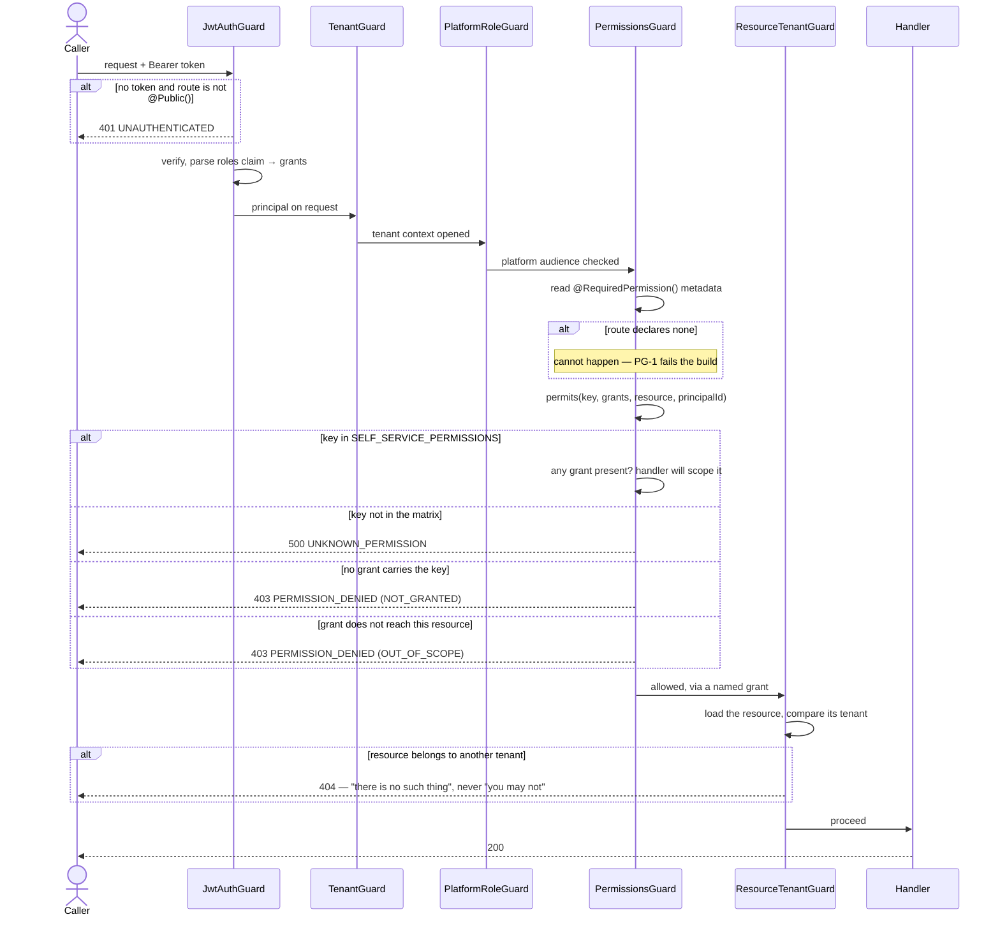

# RBAC — who may do what, and where the answer comes from

> `M-023` · `FR-RBAC-01` … `FR-RBAC-07` · `§B3.1`, `§B3.2` · `PROJECT_CONSTITUTION.md` §12.2, §21.3
>
> Written to §21.3's five mandatory sections in order (`FD1`), with the `DG3` sequence diagram in
> *Flow*. `ADR-0041` settled that the five are mandatory and ordered but **not exclusive**, so the
> prose around them conforms.

---

## 1. Business Rules

**RBAC enforces no `BR-` rule of its own, and that is worth stating rather than leaving as a gap in
the traceability report.** `MASTER_PRD.md` §A8's business rules are about gyms, money, memberships
and reviews. Authorisation is the mechanism by which many of them are *reachable only by the right
person* — it is a control, not a rule. `FD2` requires every `BR-` to appear in exactly one feature
document's Business Rules section; claiming one here that belongs to `tenant-isolation.md` or
`membership-lifecycle.md` would break that rule rather than satisfy it.

What this feature does enforce is `§B3.3`'s seven functional requirements, and each has an
enforcement point:

| Requirement | What it says | Enforced at | Test |
| :--- | :--- | :--- | :--- |
| **`FR-RBAC-01`** | Every endpoint declares its permission; one that declares none fails CI | `@RequiredPermission()` on every handler; gate **`PG-1`** in `api-gates.mjs` fails the build on a route without one | `api-gates.spec.mjs` · `permissions-guard-registered.spec.ts` |
| **`FR-RBAC-02`** | Checks are server-side; hiding UI is presentation only | `PermissionsGuard`, bound as an `APP_GUARD` in `app.module.ts` | `permissions-guard-registered.spec.ts` asserts the binding **textually**, because a guard's own unit tests cannot notice that nothing calls it |
| **`FR-RBAC-03`** | Tenant-scoped roles evaluate against the **resource's** tenant, never the session's | `scopeReaches()` in `iam/domain/effective-permissions.ts`; `ResourceTenantGuard` loads the resource first | `effective-permissions.spec.ts` |
| **`FR-RBAC-04`** | A role change takes effect within 60s without re-authentication | `PermissionCache` — the token's claim is stale by definition, so grants are re-read | `role-change-propagation.int-spec.ts` (owed) |
| **`FR-RBAC-05`** | Effective permissions are inspectable by Super Admin | `inspectPermission()` and `annotatedEffectivePermissions()`; `GET /admin/users/:id/permissions` (owed) | `permission-inspector.spec.ts` |
| **`FR-RBAC-06`** | Staff invitations are role- and branch-scoped at invitation | `staff/` — `M-077` | — |
| **`FR-RBAC-07`** | The last remaining `GYM_OWNER` cannot be removed or demoted | `last-owner.policy.ts` | `last-owner.policy.spec.ts` |

**The invariant underneath all of them.** `FR-RBAC-02` says authorisation is
`(role, scope, resource, action)` and **never role alone**. The failure that phrasing exists to
prevent is subtle, because a naive implementation gets the role half right and silently drops the
scope half:

> A `GYM_OWNER` at gym A holds `catalog.plan.write`. So does a `GYM_OWNER` at gym B. Asking
> *"does this principal hold `catalog.plan.write`?"* answers **yes** for both, on either gym.

That check passes every unit test written against one tenant and is a total tenancy failure the
moment there are two. It is `BR-TEN-01` that breaks, and RLS in the database is the **backstop**
rather than the control: the API must refuse first, and refuse with the right status.

### Two rules that are not `BR-` and behave like invariants

- **Deny by default, and say which kind of no it is.** A permission absent from the matrix is
  refused as `UNKNOWN_PERMISSION` — a *configuration gap*, not a user error. The two are different
  incidents: one is an operator who should not be there, the other is an endpoint somebody forgot
  to declare. They are logged differently and they page differently, so `permits()` returns a
  reason rather than a boolean.
- **A permission is never widened by editing code.** `Security.md` `RB1` calls the grant table
  *"data, not control flow"*, and `RB2`'s drift job parses `§B3.2` out of `MASTER_PRD.md` at test
  time and fails the build on any difference. This is why `PermissionsGuard` resolves from the
  **compiled** matrix and not from the `role_permissions` table: a database-reading guard turns a
  privilege change into an `UPDATE` with no code review, no drift check and no diff.

---

## 2. Database

| Table | Role here | Notes that matter |
| :--- | :--- | :--- |
| `roles` | The twelve `§B3.1` roles | `key` is `platform_role_enum`, so a thirteenth **cannot be inserted**. That is the constraint the Phase-2 custom-role idea will have to move (`ADR-0047` §1) |
| `permissions` | The key catalogue | Grown from the matrix by the seed, not hand-written. `Schema.md` §4.7's *"~180"* is a **volume projection**, not a register |
| `role_permissions` | The `(role, permission)` grid | Written by the seed from `CAPABILITY_MATRIX`; **read by nothing on the request path** — see the `RB1` note above |
| `user_roles` | Who holds what, where | Has a `tenant_id` and **no RLS policy**, which is the trap: a `NULL` `tenant_id` is a *platform* grant (`ERD.md` §3.1), so a `SUPER_ADMIN` is not one of a gym's owners. Revocation is a timestamp, never a delete (`AC-STAF-01.4`) |

**Retention and soft delete.** `SoftDeleteStrategy.md` forbids deleting a row from `roles`,
`permissions` or `role_permissions`: *"a permission that disappears while a grant references it is
a broken authorisation model."* `user_roles` carries `deleted_at` so the *"this person held
`FINANCE` in March"* fact survives for a settlement dispute.

**Not yet conformant:** `SeedStrategy.md` §2.5 prescribes `is_active boolean NOT NULL DEFAULT true`
on all three RBAC tables and none has it. Cheapest now — 12, 64 and 191 rows, no dependants — and
it is the only mechanism by which a Phase-2 custom role could ever be retired.

---

## 3. API

Every route below declares its permission as a constant from its own module's `permissions.ts`,
never a string literal (`AZ3`). Modules read keys out of the matrix through `permissionOf()`, which
throws unless the named `§B3.2` row actually declares that string — so a key cannot be **invented**
(`BLK-10`) and cannot be **attributed to the wrong row**, which is `ADR-0043`'s capability shopping
and resolves cleanly while granting the wrong people.

| Endpoint | Permission | Notes |
| :--- | :--- | :--- |
| `GET /v1/admin/users/:id/permissions` | `admin.user.read_permissions` | `FR-RBAC-05`. `SUPER_ADMIN` only — an `extraReadKeys` entry on *Manage platform users* (`ADR-0043`). **Owed**: the route needs a cross-tenant grants reader, which needs `runElevated()` |
| every other authenticated route | its own | `PG-1` fails the build on a handler with no `@RequiredPermission()` |

**Error codes**, from `packages/types/src/errors/registry.ts`:

| Code | HTTP | When |
| :--- | :-: | :--- |
| `PERMISSION_DENIED` | 403 | The principal holds the permission in no scope reaching this resource, or holds it not at all |
| `UNKNOWN_PERMISSION` | 500 | The route declared a key the matrix does not contain. **Not the caller's fault** — it pages an engineer rather than telling an operator they are not allowed |
| `UNAUTHENTICATED` | 401 | No principal. `@Public()` is the only way past a token |

**Idempotency and rate limiting** are not this feature's concern; authorisation runs before both.

### The two admit lists, and why they are not a loophole

Six declared keys are deliberately **not** `§B3.2` rows. A row for *"read your own sessions"* would
be twelve `●` cells, and `RB2`'s drift check against the PRD would fail — correctly.

| List | Keys | What scopes them |
| :--- | :--- | :--- |
| `SELF_SERVICE_PERMISSIONS` | `iam.session.list` · `.revoke` · `iam.mfa.enrol` · `.verify` · `.disable` | The **handler**. `AZ4` makes a `/me` route act on the caller's own rows, and `revokeOne(id, principal.sub)` returns 404 for somebody else's session — indistinguishable from one that does not exist |
| `SCOPED_NON_MATRIX_PERMISSIONS` | `tenancy.ping.read` | **`scopeReaches()` still runs.** This returns tenant data, so admitting it the self-service way would let any authenticated principal ping any tenant — `BR-TEN-01` |

Both are **enumerated strings, never prefixes**. `startsWith('iam.session.')` is a rule an attacker
satisfies by naming a route well: every future handler under that prefix would be admitted for every
authenticated caller, with no diff anyone would question.

---

## 4. Flow

The guard pipeline order is fixed by `Security.md` §916 and is *"not a matter of taste — each stage
assumes the previous one ran"*.

**Why `ResourceTenantGuard` answers 404 and not 403.** A 403 confirms the resource exists. For a
resource in another tenant that is itself a leak — an attacker enumerating ids learns which ones are
real. `PermissionsGuard`'s 403 is for a resource the principal can legitimately *see* and may not
*act on*; the two answers are different questions and are given by different guards.

### Failure paths, enumerated

| Path | Outcome | Why it is that outcome |
| :--- | :--- | :--- |
| No token, route not `@Public()` | `401` | Before any permission is considered |
| Malformed `roles` claim entry | Contributes **nothing**, no throw | Throwing would 500 and tell an attacker the string reached the parser; contributing nothing produces a clean 403 with no signal in it |
| `GYM_OWNER@platform` in a token | Grant **dropped** | `§B3.1` does not scope that role to the platform, so the claim is forged or stale — it would otherwise read every tenant on the estate |
| Branch-scoped role, tenant-level resource | `OUT_OF_SCOPE` | A resource with no branch is not a branch's business. `null` is the case a `===` comparison would accidentally allow |
| Impersonation session | Grants are the **intersection** of subject and agent | `AC-5`. Applied in `effectiveGrants()`, the one place it exists |

---

## 5. Future Improvements

Each names its trigger, per `FD4`.

| Improvement | Trigger |
| :--- | :--- |
| **`RB2` — an over-grant check.** `PG-7` catches a key that exists in no `permissions.ts`; it cannot catch a key that is *present but over-granted*, which is what all four escalations in the refused `BLK-19` draft were. Until it exists, the one-holder gate in `rbac-matrix.spec.ts` stands in | Any second attribution to a multi-holder capability, or the first privilege incident traced to a matrix cell |
| **Per-tenant configurable permissions** — a gym owner ticking what their own staff may do | Phase 2, decided by the owner on 2026-08-10 (`ADR-0047` §1). Phase 1 leaves room for it as a **subtract-only overlay beside** the compiled baseline, never replacing it |
| **Custom roles** — an admin creating a thirteenth role | Same decision. Needs `platform_role_enum` opened and `staff.role`'s CHECK with it; deliberately not pre-built |
| **A `NON_DELEGABLE` list** — keys that must never appear on any tick list in any phase | Before the Phase-2 overlay ships. `FEATURE_FLAGS.md` §6.3 and `CLAUDE.md` §9.7: money, tenancy and review-integrity rules are never disableable, and a per-tenant permission toggle is a flag over the authorisation path by another name |
| **`is_active` on the three RBAC tables** | Owed now, per `SeedStrategy.md` §2.5. Cheapest at today's row counts |
| **Async `PermissionsGuard.canActivate`** | `FR-RBAC-04` already needs it — `PermissionCache.read()` is a Promise. Free while the guard has few call sites |

### Known limitations and debt carried by this feature

| Id | What |
| :--- | :--- |
| **`TD-045`** | **Half paid.** `PermissionsGuard` is bound; `MfaGuard`, `ResourceTenantGuard` and `ImpersonationRestrictionGuard` are still registered nowhere. `MfaGuard` is blocked on the seed — all eleven seeded principals have `password_hash` NULL and enrolment re-authenticates against it — not on keys |
| **`TD-034`** | `/v1/admin/*` was gated on platform-role membership rather than the matrix. Rows 44 and 45 (`ADR-0047`) give the two routes real capabilities; the debt closes when they declare them |
| **`BLK-10`** (partly open) | Six reviewer-side `onboarding.*` strings in `API_Catalog.md` 1061–1066 are in no matrix row, and `POST /tenants` declares `tenancy.tenant.create`, also in no row |
| **`KL-102`** | `amr` and `auth_time` are not minted per session, so MFA freshness cannot be asserted mid-session |
