# Implementation Roadmap — Index and Operating Rules

**Gym Marketplace & Multi-Tenant Gym Management SaaS**

> **This directory is the build order.** Every design document in `/docs` is complete. Nothing here
> re-specifies a requirement, a schema, an endpoint or a screen. It states **the sequence in which
> the already-specified thing is built**, in units small enough that one engineer finishes one in a
> day and the repository is green at the end of it.
>
> **Launch market: India** (`LAUNCH_MARKET_INDIA.md`, 2026-08-06). INR / paise as `bigint`,
> `Asia/Kolkata` +05:30 with no DST, GST 18% as **CGST 9% + SGST 9%**, financial year **1 April –
> 31 March**, India-only data residency, **Razorpay Route** behind the `PaymentProvider` port.
>
> **No application code exists.** Every file path and every fenced block in this directory is
> illustrative. Nothing in `/docs/roadmap/` is committed code.

| Field | Value |
| :--- | :--- |
| Document | `/docs/roadmap/README.md` |
| Phase | 4 — Roadmap (the index; four detail files elaborate it) |
| Milestones | **120** — `M-001` … `M-120` |
| Sprints spanned | **19** — Sprint 0 … Sprint 18, 2026-09-07 → 2027-05-28 |
| Sizes used | **2 h · 3 h · 4 h · 6 h** — one engineer, focused hours. Nothing above 6 h exists |
| Total roadmap effort | **577 focused hours** = **72.1 engineer-days of demand**, consuming **103.0 person-days of calendar** at the 70% focus factor (§9) |
| Programme estimate it sits inside | **854 ed P50**, range **690 / 854 / 1,110** (`ENGINEERING_PLAN.md` §13.3) — the roadmap covers **8.4%** of it and says so plainly in §9 |
| Detail files | `M-001-to-M-030.md` · `M-031-to-M-060.md` · `M-061-to-M-090.md` · `M-091-to-M-120.md` |
| Governing authority | `PROJECT_CONSTITUTION.md` §23.1 (16 Ready) and §23.2 (38 Done) — **never restated as a variant here** |
| Status | Phase 0 planning artefact. No milestone started. `M-001` is Ready, conditional on `BLK-01` |

**Precedence.** `PROJECT_CONSTITUTION.md` → `MASTER_PRD.md` → `engineering/` design detail →
`backlog/` → **`roadmap/`** → code. Where a document above this one speaks, it wins. A conflict
**halts work** and is resolved in `DECISION_LOG.md`, never in a roadmap file and never in code.

---

## Table of contents

| § | Section |
| :-: | :--- |
| 1 | [Purpose — sprints plan capacity, milestones order work](#1-purpose--sprints-plan-capacity-milestones-order-work) |
| 2 | [The milestone contract](#2-the-milestone-contract) |
| 3 | [Sizing — what 2 h, 3 h, 4 h and 6 h mean](#3-sizing--what-2-h-3-h-4-h-and-6-h-mean) |
| 4 | [The GREEN rule](#4-the-green-rule) |
| 5 | [The milestone index — all 120](#5-the-milestone-index--all-120) |
| 6 | [The dependency graph and the critical path](#6-the-dependency-graph-and-the-critical-path) |
| 7 | [Build order rationale](#7-build-order-rationale) |
| 8 | [Role loading](#8-role-loading) |
| 9 | [Effort roll-up, reconciled](#9-effort-roll-up-reconciled) |
| 10 | [The descope order](#10-the-descope-order) |
| 11 | [Using this during delivery](#11-using-this-during-delivery) |
| 12 | [Open blockers that gate specific milestones](#12-open-blockers-that-gate-specific-milestones) |

---

## 1. Purpose — sprints plan capacity, milestones order work

### 1.1 The one-sentence distinction

**`SprintPlanning.md` decides *how much* the team can take on and *when* the calendar allows it.
This roadmap decides *in what order the work is actually built* and *what "finished" looks like for
each unit of it*.** A sprint is a **container**; a milestone is a **unit of work**. A container has
a capacity in engineer-days and a date range. A unit of work has a dependency, an acceptance
criterion, a test and a rollback plan.

### 1.2 What each document owns

| Question | Answered by |
| :--- | :--- |
| *How many engineer-days does the team have in Sprint 6? Is it over-committed?* | `SprintPlanning.md` §2.1 and the Sprint 6 capacity verdict — 45.5 ed dev pool; **OVER**, 114% backend, three named mitigations |
| *Which epic lands in Sprint 6, and when is the sprint finished?* | `SprintPlanning.md` Sprint 6 Scope (EP-08b, EP-09, EP-10 activation) and Exit checklist E6.1 … E6.12 — `C9.1`: *`E2E-02` passes* |
| ***Which thing do I build first on Monday morning, and what does it depend on?*** | **This roadmap** — `M-062` webhook receiver, which depends on `M-060` and `M-014` |
| ***Is the repository green when I merge it? How do I undo it at 02:00 on a Saturday?*** | **This roadmap** — §4, plus the milestone's own Testing and Rollback-plan fields |

### 1.3 The mapping is many-to-one and never the reverse

One sprint contains many milestones. **No milestone spans two sprints.** If a milestone cannot be
completed inside the sprint that owns it, it was mis-sized (§3.5) or mis-sequenced (§11.4), and the
answer is to split it — not to let it straddle a sprint boundary where it would leave the repository
half-wired across a demo.

| Property | Sprint | Milestone |
| :--- | :--- | :--- |
| Duration | 10 working days, fixed | 2–6 focused hours, one engineer |
| Owner | Delivery Manager | The engineer who picked it up |
| Unit of estimate | Engineer-day (ed) | Focused hour |
| Success test | The exit checklist, `C9.1`-derived | The numbered acceptance criteria in the milestone |
| Failure mode | Over-commitment, absorbed as carry-over | Half-wired code, absorbed as a red build |
| Revertible? | No — a sprint is a period of time | **Yes, individually and independently** |
| Changes when | Re-baselined under `§C10` | Refined at the Wednesday refinement of the preceding sprint |

### 1.4 Why the roadmap exists at all when the sprint plan already has a task table

`SprintPlanning.md` Part A gives each sprint a task table — task 6.1, task 6.2, and so on — sized in
engineer-days. Those tables are **capacity instruments**: they exist so the Delivery Manager can
compute a ratio and issue a verdict. They are deliberately coarse; task 6.1 is *"webhook receiver:
signature verification, `provider_event_id` uniqueness, replay protection, 2xx only after durable
storage"* at 3.0 ed. That is three days of work in one row, which violates
`PROJECT_CONSTITUTION.md` §23.1 item 15 (branch life ≤ 2 days) the moment anyone tries to build it
as written. `SprintPlanning.md` §25 says so explicitly: *"any task in Part A estimated above 3.0 ed
is split at refinement. The estimates in Part A are task estimates, not branch estimates."*

**This roadmap is that split, performed in advance rather than in the room.** It converts capacity
rows into buildable, revertible, individually-testable units with declared dependencies.

### 1.5 What this roadmap does not do

It does not **re-estimate the sprint** — `SprintPlanning.md` §2 owns capacity, and §9 below
reconciles against it rather than adjusting it. It does not **define Ready or Done** —
`PROJECT_CONSTITUTION.md` §23.1 and §23.2 are the sole authority, immutable in ordinary work
(§24.1). It does not **re-specify an endpoint, a table or a screen** — `/docs/apis/`,
`/docs/database/` and `/docs/ui/` are frozen contracts and a milestone *cites* them. It does not
**move a `C9.1` exit condition** — the PRD places it; a milestone decomposes it. And it does not
**introduce technology**: `STACK_ADDITIONS.md` A-01 … A-30 is closed, and a milestone needing
anything outside it is not Ready (`§23.1` item 12).

---

## 2. The milestone contract

Every milestone file obeys this shape exactly. A milestone missing a field is not a milestone; it is
a note, and it does not enter a sprint.

`illustrative — not committed code`

```markdown
### M-NNN — Title

| Field | Value |
| :--- | :--- |
| Sprint | 6 |
| Epic | EP-08 |
| Size | 6h |
| Role | BE |

**Goal** — one sentence stating what is true after this milestone that was not true before.
**Depends on** — M-060, M-014.
**Unblocks** — M-063, M-064, M-104.
**Files** — exact paths from FolderStructure.md, created or modified.
**Acceptance criteria** — numbered, individually testable, each citing a PRD identifier.
**Testing** — the specific tests written in THIS milestone, named, with their layer.
**Rollback plan** — expand/contract phase for a migration; the flag key for a feature.
**Notes** — the trap, if there is one.
```

### 2.1 Field rules

| Field | Rule |
| :--- | :--- |
| **Sprint** | Exactly one, 0–18. It matches the sprint that owns the epic in `SprintPlanning.md` Scope. A milestone never spans two |
| **Epic** | Exactly one `EP-NN`. Module ownership is sole, never shared (`backlog/README.md` §2.1) |
| **Size** | One of `2h`, `3h`, `4h`, `6h`. No other value is legal (§3) |
| **Role** | One of `BE`, `FE-web`, `FE-dash`, `FE-admin`, `DevOps`, `QA`, `Full-stack`. One role, one engineer |
| **Goal** | One sentence, present tense, stating a *difference*. "Wire up payments" is not a goal. "The `→ ACTIVE` membership command is reachable only from the webhook handler" is |
| **Depends on** | Milestone ids only. `none` is legal for `M-001` and for no other milestone |
| **Unblocks** | Milestone ids only. The inverse of every `Depends on` edge must appear here — the graph is checked both ways |
| **Files** | Absolute-from-repo-root paths taken from `FolderStructure.md`. A path not sanctioned by that document is a review rejection (`FolderStructure.md` §19) |
| **Acceptance criteria** | Numbered `1.`, `2.`, `3.` Each is independently testable and cites at least one of `FR-`, `BR-`, `NFR-`, `AC-`, `SCR-`, `BAC-`, `E2E-`, `KPI-`, `TR-`, `RSK-` |
| **Testing** | Named test files with their layer from `TestingStrategy.md` §1.2: Unit · Integration · Contract · Isolation · E2E · Performance · Security · Accessibility · Mutation · Chaos |
| **Rollback plan** | For a migration, the expand / migrate / contract phase and the rollback class `FREE` / `BOUNDED(vX.Y.Z)` / `FORWARD_ONLY` (`MigrationStrategy.md` §3). For a feature, the `FEATURE_FLAGS.md` key |
| **Notes** | The trap. Omit the field entirely if there is no trap; never write "none" |

### 2.2 The two structural rules that are enforced inside the milestone, not after it

These are the rules that make CI fail. They are restated here because they change how a milestone is
*scoped*, not merely how it is reviewed.

| Rule | Statement | Enforced by |
| :--- | :--- | :--- |
| **R-ISO** | **A milestone that adds an endpoint adds its isolation-suite coverage in the same milestone.** Not the next one, not "in the QA milestone at the end of the sprint" | `TestingStrategy.md` §5.6 gate `IS3`; `pr.yml` job 14; `§23.2` item 16 |
| **R-RLS** | **A milestone that adds a tenant-owned table adds its RLS policy and its grants in the same migration.** A table that exists for even one commit without a policy is a `BR-TEN-01` breach in the migration history | `MigrationStrategy.md` `MG10`; `Schema.md` §2.9 checks `CI-01` / `CI-02`; `pg_policies` check `IS6` |

**The consequence for sizing.** A 4-hour endpoint milestone is 4 hours *including* its isolation
spec, its contract spec, its permission-denied test and its validation-failure test
(`TestingStrategy.md` §1.5 clause D1). A milestone that budgets 4 hours for the handler and defers
the specs is a 4-hour milestone that takes 7 hours and merges red. Every size in §5 already
contains the tests named in that milestone's Testing field.

### 2.3 The identifier discipline

No milestone may exist that does not cite at least one PRD identifier (`backlog/README.md` §12).
Families in use across the 120: `OBJ-` `KPI-` `FR-` `BR-` `NFR-` `AC-` `US-` `SCR-` `API-` `BAC-`
`E2E-` `UAT-` `TR-` `RSK-` `KL-` `OQ-` `BLK-` `A-` `ADR-` `D-` `FF-CI-` `IS` `MG`/`MX` `DEP-`.

---

## 3. Sizing — what 2 h, 3 h, 4 h and 6 h mean

### 3.1 The unit

A size is **focused engineer-hours**: hands on the problem, by one person, on one discipline. It is
not elapsed time and it is not a working day. `SprintPlanning.md` §1 applies a **70% focus factor**
to convert to calendar capacity — ceremony, review, interruption, support, context switching. One
engineer-day therefore delivers **5.6 focused hours**. Two conversions are used throughout §9 and
they measure different things: `focused_hours ÷ 8.0` gives **engineer-days of demand**, directly
comparable to the 854 ed P50; `focused_hours ÷ 5.6` gives **person-days of calendar** consumed.

### 3.2 The four sizes, defined by what they contain

| Size | Contains | Typical shape | Count in this roadmap |
| :-: | :--- | :--- | :-: |
| **2 h** | One narrow change with one test. No migration, no new endpoint, no new module | A port interface with a local stub (`M-021`); a CI policy gate (`M-118`) | **2** (1.7%) |
| **3 h** | One cohesive change with its unit tests and one integration assertion. At most one new table **or** one new endpoint, not both | A base class with its refusal test (`M-009`); a lint-and-utility kernel (`M-005`) | **9** (7.5%) |
| **4 h** | One endpoint or one migration, complete: handler + DTO + permission + isolation spec + contract spec + negative test. Or one job processor with its lock, idempotency and alert tests | Most of the domain surface — `M-054` orders and the `C4.2` machine; `M-095` `commission_tax_minor` | **54** (45.0%) |
| **6 h** | The ceiling. One load-bearing mechanism whose parts cannot be merged separately without leaving a half-wired invariant | `M-008` the Prisma tenant extension; `M-066` gapless invoice numbering; `M-093` the append-only ledger | **55** (45.8%) |

### 3.3 The rule: anything above 6 h is split, without exception

There is no 8 h size and there is no "large". If refinement produces a unit that cannot be done in
six focused hours, it is split at refinement — before the sprint starts — into units that can. The
split is by **capability**, never by layer: "the repository" and "the use case" are not two
milestones, because neither is independently green. `M-077` (the Ed25519 token) and `M-078` (the
ten-step validation) are two milestones because each is separately demonstrable and separately
revertible; `M-078`'s handler plus `M-078`'s tests are one milestone because the handler without its
tests fails `§23.2` items 16 and 17 and cannot merge.

### 3.4 Why a milestone longer than a day cannot leave the repository green at its boundary

This is the load-bearing reason for the 6 h ceiling, and it is a chain rather than an assertion.

1. **`§23.1` item 15 caps a branch at two days** (`§20.1 G2`). A unit larger than that cannot be one
   branch, so it must become several — and each merge is a point at which `main` is either green or
   it is not, because `pr.yml` runs all fifteen gates on every one.
2. **A unit needing three merges to cohere is green at merge 3 and *incoherent* at merges 1 and 2.**
   The build passes while the capability half-exists: the table is there and the policy is not; the
   endpoint answers and the isolation spec does not exist; the ledger accepts writes and the grant
   forbidding `UPDATE` has not been applied.
3. **Incoherent-but-green is the most expensive state in the programme**, because it is
   indistinguishable from finished by every automated signal. `SprintPlanning.md` §21 names exactly
   this for Sprint 0: *"a partial sprint 0 — shipping the endpoint without the isolation suite —
   creates a false green from which `BR-TEN-01` is retrofitted."* Therefore the unit must fit inside
   one merge, and one merge inside one engineer-day of focused time — **5.6 hours** after the focus
   factor. Six is the rounded ceiling, and it is a ceiling rather than a target.

### 3.5 The distribution is itself a signal, and it is watched

**45.8% of this roadmap sits at the 6 h ceiling.** That is high and it is not hidden. Half of it is
legitimate — the 120 are the programme's **structural spine** (§9.3) and load-bearing units are large
by nature. The other half is the standing risk that 6 h is simply the comfortable place to put
uncertainty. **Mitigation:** at each refinement the Delivery Manager re-reads every 6 h milestone due
next sprint and asks whether it splits; two overruns in one sprint trigger a re-sizing pass over the
remaining 6 h set. And the hard rule that catches the rest — a milestone reaching **8 focused hours
in flight** is stopped, not finished (§11.4).

---

## 4. The GREEN rule

### 4.1 The rule

> **Every milestone ends with the full pipeline green and the repository coherent. No milestone
> leaves a half-wired feature.**

"Green" is not "the tests I wrote pass". It is `§23.2` item 36 in full: **lint, typecheck,
architecture, unit, integration, contract, isolation, coverage, OpenAPI drift, permission
declaration, secret scan, dependency scan, bundle size, a11y, migration, commit lint** — the fifteen
`pr.yml` gates, all of them, on the merge commit.

### 4.2 Coherent, defined

Green is necessary and not sufficient. A milestone is **coherent** when every one of these is true
of `main` after the merge:

| # | Coherence condition | Source |
| :-: | :--- | :--- |
| 1 | Every table added has its RLS policy and its grants, applied from the same migration | `MG10`; `Schema.md` `CI-01`/`CI-02` |
| 2 | Every endpoint added declares a permission and has an isolation spec | `FR-RBAC-01`; `IS3`; `§23.2` items 9, 16 |
| 3 | Every `M`-priority rule touched has a `NEGATIVE:`-labelled test | `BAC-06`; `§23.2` item 17 |
| 4 | Every state machine transition added has a legal test and an illegal-refusal test | `TestingStrategy.md` §1.5 clause D3 |
| 5 | No code path is reachable that the milestone did not intend to expose — a partially-built capability is behind its flag, off | `NFR-MNT-07`; `FEATURE_FLAGS.md` §4 |
| 6 | The generated OpenAPI document matches the routes; no drift | `NFR-MNT-03`; A-16 |
| 7 | The module `README.md`, `/docs/features/`, `CHANGELOG.md` and `PHASES.md` are updated in the same change | `§23.2` items 22, 23, 26, 28 |
| 8 | Migration is forward-only, backward-compatible, and applied against the deterministic seed | `§23.2` item 33; `MG2` |

### 4.3 How a multi-milestone feature stays green: the flag stays off

Most capabilities take three to eight milestones. The mechanism that keeps every intermediate merge
coherent is a single one, and it is not negotiable:

> **The feature flag is created in the *first* milestone of the chain, defaults `OFF`, and is turned
> on in the *last* milestone of the chain — never before.**

| Step | What happens | Rule |
| :--- | :--- | :--- |
| First milestone of a chain | Registers the flag in `FEATURE_FLAGS.md` §7 with owner role, retirement date, related PRD id, `Default: OFF`, and a description stating what **off** does to the user | `FF-CI-03`; gate `G1` items 1–8 |
| Every milestone in the chain | Ships behind the flag. **Both branches carry a passing test** — the on-path and the off-path | `FF-CI-05` |
| Every milestone in the chain | Off is the **more restrictive** state. A flag whose off-position weakens a rule is refused | `FF-CI-06`, protected-rule list |
| Last milestone of the chain | Flips the default, in its own commit, with the demo attached | `§23.2` item 32 |
| Within 30 days of 100% | The flag is removed | `FF-CI-10` |

**Worked example — the check-in chain, `M-076` … `M-082`, flag `rel.attendance.sharing-detection`
plus the desk behind `ops.discovery.*`-class kill switches.** `M-076` creates the partitioned
`attendance` table with its policy; nothing is reachable. `M-077` signs tokens nobody validates.
`M-078` validates tokens the desk cannot yet produce. `M-082` ships the desk and flips the last
default. At every one of those seven merges the pipeline is green, the table is policy-covered, and
a receptionist sees nothing new — which is the correct user-visible outcome of an unfinished
capability.

### 4.4 Four things that are not green, whatever CI says

| Anti-pattern | Why it fails |
| :--- | :--- |
| "The endpoint is in, the isolation spec lands next milestone" | `IS3` fails the build for a tenant-scoped route with no spec. There is no next milestone |
| "The table is in, the policy is in the follow-up migration" | The migration history then contains a window with an unprotected tenant table. `MG10` forbids it; a PITR restore into that window is a live breach |
| "It is behind a flag so the tests can come later" | `FF-CI-05` requires both branches tested. A flag is not a test-exemption mechanism |
| "Coverage dipped but the feature works" | The 95% zone — money and tenancy — is a hard floor, not a trend (`NFR-MNT-01`) |

### 4.5 What to do when a milestone cannot be made green

Stop and revert. Do not merge behind a `.skip`, a `describe.only`, an inline `dependency-cruiser`
suppression or a coverage exclusion — `§23.2` item 21 and `FolderStructure.md` §3.4 forbid all four,
and the architecture gate accepts **no** inline suppression. Three lawful responses, in order:
(1) **split the milestone** so the green part merges and the red part becomes a new one (§11.5);
(2) **revert the branch** and re-refine — the roadmap is a plan, not a commitment to a decomposition
that turned out wrong; (3) **raise it** — `DECISION_LOG.md` if a decision changed, `TECH_DEBT.md` if
a shortcut was taken with a named repayment trigger, `KNOWN_LIMITATIONS.md` if a requirement is now
unmet.

---

## 5. The milestone index — all 120

This is the **master list**. The four detail files elaborate every row into the full contract of §2:
Goal, Depends on, Unblocks, Files, Acceptance criteria, Testing, Rollback plan, Notes. Where this
index and a detail file disagree, **this index wins on id, sprint, epic, size, role and depends-on**;
the detail file wins on everything else.

Reading the columns: **Dep.** lists direct predecessors only — the transitive closure is not
repeated. **Role** is the single discipline that owns the milestone. Sizes are focused hours (§3.1).

### 5.1 Sprint 0 — Foundations, tenancy and the isolation suite · EP-01 · `M-001` … `M-026`

*Exit: `C9.1` — "a trivial tenant-scoped endpoint exists and the isolation suite proves it".*

| Id | Title | Sp | Epic | Size | Role | Dep. |
| :--- | :--- | :-: | :-: | :-: | :-: | :--- |
| **M-001** | Monorepo skeleton — pnpm workspaces, Turborepo pipeline, `packages/config` | 0 | EP-01 | 4h | DevOps | none |
| **M-002** | Repository governance — trunk protection, `CODEOWNERS`, Husky, commitlint | 0 | EP-01 | 3h | DevOps | M-001 |
| **M-003** | Local stack — Compose: Postgres 16 + PostGIS, Redis 7, MinIO, Mailpit | 0 | EP-01 | 3h | DevOps | M-001 |
| **M-004** | `Money` value type and the `no-float-money` lint rule | 0 | EP-01 | 4h | BE | M-001 |
| **M-005** | Time-discipline kernel — `gym-timezone.ts`, UTC storage, bare-`new Date()` ban | 0 | EP-01 | 3h | BE | M-001 |
| **M-006** | Prisma bootstrap, `tenants`, the RLS policy template and the grant classes | 0 | EP-01 | 4h | BE | M-003 |
| **M-007** | Tenant context — middleware, ALS carrier, branded `TenantId` | 0 | EP-01 | 4h | BE | M-006 |
| **M-008** | **The Prisma tenant-context client extension** (A-01, ADR-0005) | 0 | EP-01 | 6h | BE | M-007 |
| **M-009** | `TenantScopedRepository` and the context-free query refusal | 0 | EP-01 | 3h | BE | M-008 |
| **M-010** | Isolation-suite harness, generated route inventory, the `IS3` build gate | 0 | EP-01 | 6h | BE | M-009 |
| **M-011** | `GET /v1/tenant/ping`, its isolation spec, the dropped-policy negative control | 0 | EP-01 | 3h | BE | M-010 |
| **M-012** | Platform elevation on a distinct DB role — named, audited, never ambient | 0 | EP-01 | 3h | BE | M-008 |
| **M-013** | Observability kernel — error taxonomy, correlation id, Pino redaction, OTel spans | 0 | EP-01 | 6h | BE | M-007 |
| **M-014** | Idempotency middleware and key store — 24 h TTL, 409 on fingerprint mismatch | 0 | EP-01 | 4h | BE | M-009 |
| **M-015** | Transactional outbox writer and the `SKIP LOCKED` dispatcher | 0 | EP-01 | 4h | BE | M-009 |
| **M-016** | Append-only audit writer and the `@Audited()` interceptor | 0 | EP-01 | 4h | BE | M-015 |
| **M-017** | BullMQ harness — queues, distributed locks, gym-timezone scheduling | 0 | EP-01 | 4h | BE | M-015 |
| **M-018** | Feature-flag service and the ten `FF-CI-*` gates | 0 | EP-01 | 4h | BE | M-013 |
| **M-019** | Redis token-bucket rate limiting and the `RL-` class registry | 0 | EP-01 | 3h | BE | M-013 |
| **M-020** | OpenAPI generation, the drift gate, the permission-declaration check | 0 | EP-01 | 4h | BE | M-011 |
| **M-021** | Notification channel ports (email, SMS, in-app, web push) + Mailpit adapter | 0 | EP-17 | 2h | BE | M-015 |
| **M-022** | Design tokens and the `packages/ui` primitive kernel | 0 | EP-01 | 6h | FE-dash | M-001 |
| **M-023** | Three app shells and the TanStack Query provider | 0 | EP-01 | 6h | FE-web | M-022 |
| **M-024** | `pr.yml` — the fifteen pull-request gates | 0 | EP-01 | 4h | DevOps | M-020 |
| **M-025** | Terraform `development` in the **Mumbai** region | 0 | EP-01 | 4h | DevOps | M-003 |
| **M-026** | Deterministic seed v1 — 3 tenants, 12 plans, 200 members, 5,000 attendance rows | 0 | EP-01 | 4h | BE | M-011 |

### 5.2 Sprint 1 — Identity, sessions and RBAC · EP-02 · `M-027` … `M-034`

| Id | Title | Sp | Epic | Size | Role | Dep. |
| :--- | :--- | :-: | :-: | :-: | :-: | :--- |
| **M-027** | Phone-OTP and email/password identity — Argon2id, verification, breach check | 1 | EP-02 | 6h | BE | M-020, M-026 |
| **M-028** | Access + rotating refresh tokens, reuse detection, **family revocation** | 1 | EP-02 | 4h | BE | M-027 |
| **M-029** | TOTP MFA, lockout, self-service unlock, reset invalidating all sessions | 1 | EP-02 | 4h | BE | M-028 |
| **M-030** | **The twelve-role permission matrix as data** and the `PermissionsGuard` | 1 | EP-02 | 6h | BE | M-020 |
| **M-031** | Multi-tenant identity, audited tenant switching, impersonation restriction | 1 | EP-02 | 4h | BE | M-030 |
| **M-032** | Staff invitations, last-owner protection, effective-permission inspector | 1 | EP-02 | 4h | BE | M-030 |
| **M-033** | Profile, preference matrix, activity log, self-export, deletion request | 1 | EP-02 | 4h | BE | M-029 |
| **M-034** | Auth screens (`SCR-WEB-016`) and post-auth return to the point of interruption | 1 | EP-02 | 6h | FE-web | M-028, M-023 |

### 5.3 Sprint 2 — Onboarding, KYC, approval, catalogue · EP-03 / EP-04 · `M-035` … `M-042`

*Exit: `C9.1` — `E2E-01` passes. Milestone M1.*

| Id | Title | Sp | Epic | Size | Role | Dep. |
| :--- | :--- | :-: | :-: | :-: | :-: | :--- |
| **M-035** | `applications`, the seven-state `C4.4` machine, RLS and grants | 2 | EP-03 | 4h | BE | M-011, M-016 |
| **M-036** | Onboarding wizard steps 1–6, resumable state, submission snapshot lock | 2 | EP-03 | 6h | BE | M-035, M-032 |
| **M-037** | **India KYC checklist as configuration** — 10 docs, PAN, GSTIN, segregated storage | 2 | EP-03 | 6h | BE | M-035 |
| **M-038** | The six automated pre-checks, persisted, + duplicate-address partial unique index | 2 | EP-03 | 6h | BE | M-036 |
| **M-039** | **Human-only approval guard**, rejection codes, 60-second listing projection | 2 | EP-03 | 4h | BE | M-038, M-015 |
| **M-040** | `gyms`, `branches`, hours with dated exceptions, amenity taxonomy, slug | 2 | EP-04 | 6h | BE | M-011 |
| **M-041** | Media pipeline — Sharp renditions, **EXIF stripping**, CDN keys | 2 | EP-04 | 4h | BE | M-040 |
| **M-042** | Reviewer console (`SCR-ADM-002`, `SCR-ADM-003`) — split viewer, no download | 2 | EP-03 | 6h | FE-dash | M-039, M-022 |

### 5.4 Sprint 3 — Plans, pricing authority, discovery read model · EP-05 / EP-06a · `M-043` … `M-049`

| Id | Title | Sp | Epic | Size | Role | Dep. |
| :--- | :--- | :-: | :-: | :-: | :-: | :--- |
| **M-043** | `plans` — `DURATION` / `SESSION`, INR-paise columns, access windows, RLS | 3 | EP-05 | 4h | BE | M-040, M-004 |
| **M-044** | **`resolvePrice()` — the single pricing authority** and its `dependency-cruiser` rule | 3 | EP-05 | 6h | BE | M-043 |
| **M-045** | Promotional pricing with automatic reversion; `STAFF_ONLY` absence contract test | 3 | EP-05 | 4h | BE | M-044 |
| **M-046** | `search_documents` read model, GiST on `branches.location`, `search.reindex` | 3 | EP-06 | 6h | BE | M-040, M-017 |
| **M-047** | FTS + trigram search, ten filters, five sorts, facet counts, the visibility gate | 3 | EP-06 | 6h | BE | M-046, M-045 |
| **M-048** | Zero-result recovery and the Redis result-page and facet cache | 3 | EP-06 | 3h | BE | M-047 |
| **M-049** | Indian digit grouping (**₹2,50,000**) and the search screen (`SCR-WEB-002`) | 3 | EP-06 | 6h | FE-web | M-047, M-004 |

### 5.5 Sprint 4 — Detail, comparison, favourites, the performance gate · EP-06b · `M-050` … `M-053`

*Exit: `C9.1` — search meets `NFR-PERF-01` on seeded data. Milestone M2. Diwali sprint, −10%.*

| Id | Title | Sp | Epic | Size | Role | Dep. |
| :--- | :--- | :-: | :-: | :-: | :-: | :--- |
| **M-050** | Configurable ranking formula and labelled featured placement slots | 4 | EP-06 | 4h | BE | M-047, M-018 |
| **M-051** | Gym detail composition (12 regions), four-gym comparison, favourites | 4 | EP-06 | 6h | BE | M-047 |
| **M-052** | Gym detail screen (`SCR-WEB-003`), ISR city pages, `LocalBusiness` data | 4 | EP-06 | 6h | FE-web | M-051, M-049 |
| **M-053** | **The `NFR-PERF-01` k6 gate** — 2,000 req/min on a 2,000-gym / 5-city seed | 4 | EP-06 | 4h | QA | M-050, M-026 |

### 5.6 Sprint 5 — Orders, checkout, coupons, the payment port · EP-07 / EP-08a · `M-054` … `M-061`

*Money enters the system. Pair coverage mandatory (`RSK-14`); two `CODEOWNERS` approvals.*

| Id | Title | Sp | Epic | Size | Role | Dep. |
| :--- | :--- | :-: | :-: | :-: | :-: | :--- |
| **M-054** | `orders` / `order_items`, the `C4.2` state machine, RLS and grants | 5 | EP-07 | 4h | BE | M-014, M-043 |
| **M-055** | **Server-side amount computation** — no client-supplied amount in the schema | 5 | EP-07 | 4h | BE | M-054, M-044 |
| **M-056** | **`BR-PLN-03` re-validation as a state-machine guard** → `422 PLAN_PRICE_CHANGED` | 5 | EP-07 | 4h | BE | M-055 |
| **M-057** | Eligibility validation; 30-minute `PENDING` expiry releasing the coupon hold | 5 | EP-07 | 4h | BE | M-054 |
| **M-058** | `coupons` with `funding_source`, double validation, no stacking, non-negative | 5 | EP-07 | 6h | BE | M-055 |
| **M-059** | The `PaymentProvider` port and its contract-test suite | 5 | EP-08 | 4h | BE | M-054 |
| **M-060** | **The Razorpay Route adapter** — order create, UPI-first, connected accounts | 5 | EP-08 | 6h | BE | M-059 |
| **M-061** | Checkout screen (`SCR-WEB-005`) and the blocking price re-confirmation modal | 5 | EP-07 | 6h | FE-web | M-056, M-049 |

### 5.7 Sprint 6 — Webhooks, activation, invoicing, GST · EP-08b / EP-09 · `M-062` … `M-069`

*Exit: `C9.1` — `E2E-02` passes. Milestone M3.*

| Id | Title | Sp | Epic | Size | Role | Dep. |
| :--- | :--- | :-: | :-: | :-: | :-: | :--- |
| **M-062** | Webhook receiver — signature, `provider_event_id` uniqueness, replay protection | 6 | EP-08 | 6h | BE | M-060, M-014 |
| **M-063** | **Webhook-exclusive activation** — the `→ ACTIVE` command has no other caller | 6 | EP-08 | 4h | BE | M-062 |
| **M-064** | Order-independent idempotent handlers and the `payment.reconcile` poller | 6 | EP-08 | 6h | BE | M-062, M-017 |
| **M-065** | `payment.duplicate-detect` with automatic refund inside one hour | 6 | EP-08 | 4h | BE | M-064 |
| **M-066** | **Gapless per-tenant per-FY invoice numbering** with documented void records | 6 | EP-09 | 6h | BE | M-054, M-006 |
| **M-067** | **India GST tax profile** — CGST 9% + SGST 9%, IGST 18%, SAC 9997xx, PoS | 6 | EP-09 | 6h | BE | M-066 |
| **M-068** | Deterministic Chromium invoice PDF and the byte-identical checksum test | 6 | EP-09 | 6h | BE | M-067 |
| **M-069** | Order confirmation (`SCR-WEB-007`) and invoices (`SCR-DASH-013`) | 6 | EP-09 | 4h | FE-dash | M-063, M-068 |

### 5.8 Sprint 7 — Membership lifecycle · EP-10 · `M-070` … `M-075`

*Exit: `C9.1` — `E2E-05` passes. Christmas sprint, −10%.*

| Id | Title | Sp | Epic | Size | Role | Dep. |
| :--- | :--- | :-: | :-: | :-: | :-: | :--- |
| **M-070** | The full `C4.1` membership state machine and the transition journal | 7 | EP-10 | 6h | BE | M-063 |
| **M-071** | Freeze — request, plan-gated approval, extension arithmetic, allowance | 7 | EP-10 | 6h | BE | M-070 |
| **M-072** | Early unfreeze recalculating the extension to **actual** frozen days | 7 | EP-10 | 3h | BE | M-071 |
| **M-073** | Renewal with a gapless term start; pro-rata upgrade, next-term downgrade | 7 | EP-10 | 6h | BE | M-070, M-044 |
| **M-074** | **`membership.expire` in the gym's timezone** and the T−15/−7/−3/−1 ladder | 7 | EP-10 | 6h | BE | M-070, M-005 |
| **M-075** | Membership detail (`SCR-WEB-009`) with freeze and renew controls | 7 | EP-10 | 4h | FE-web | M-071, M-073 |

### 5.9 Sprint 8 — QR check-in and attendance · EP-11 · `M-076` … `M-082`

*Exit: `C9.1` — `E2E-03` and `E2E-04` pass; `NFR-PERF-03` met. Milestone M4. New Year sprint, −10%.*

| Id | Title | Sp | Epic | Size | Role | Dep. |
| :--- | :--- | :-: | :-: | :-: | :-: | :--- |
| **M-076** | `attendance` — **monthly range partitioning from the first migration**, RLS, grants | 8 | EP-11 | 4h | BE | M-011 |
| **M-077** | **Ed25519 rotating-key check-in token** — `kid`, 60 s TTL, no personal data | 8 | EP-11 | 6h | BE | M-076 |
| **M-078** | The ten-step ordered validation returning the first `C4.8` denial reason | 8 | EP-11 | 6h | BE | M-077, M-070 |
| **M-079** | Nonce idempotency, staff override, manual check-in, 60-minute cooldown | 8 | EP-11 | 6h | BE | M-078 |
| **M-080** | `attendance.sharing-scan` — implausible-travel detection (`RSK-03`) | 8 | EP-11 | 4h | BE | M-076, M-017 |
| **M-081** | Redis live-counter projection + `useLiveCounters()` with the staleness indicator | 8 | EP-11 | 4h | Full-stack | M-079 |
| **M-082** | Check-in desk (`SCR-DASH-009`) with the `@zxing/browser` scanner | 8 | EP-11 | 6h | FE-dash | M-079, M-022 |

### 5.10 Sprint 9 — CRM, staff, branch scoping, offline sales · EP-12 / EP-13 · `M-083` … `M-088`

*Exit: `C9.1` — `E2E-10` passes.*

| Id | Title | Sp | Epic | Size | Role | Dep. |
| :--- | :--- | :-: | :-: | :-: | :-: | :--- |
| **M-083** | **Branch scoping of every list and mutation**, filtered on `staff_branches` | 9 | EP-13 | 6h | BE | M-032, M-040 |
| **M-084** | `staff`, `staff_invitations`, revocation preserving historical attribution | 9 | EP-13 | 4h | BE | M-083 |
| **M-085** | Member list — nine filters, saved segments, walk-in creation, member code | 9 | EP-12 | 4h | BE | M-083 |
| **M-086** | Member 360, internal notes, at-risk flag from a per-member baseline | 9 | EP-12 | 6h | BE | M-085, M-076 |
| **M-087** | **Streamed CSV bulk import** — mapping, dry run, per-row errors, idempotent | 9 | EP-03 | 6h | BE | M-085 |
| **M-088** | Offline-sale balance collection into **one consolidated invoice** | 9 | EP-07 | 4h | BE | M-066, M-057 |

### 5.11 Sprint 10 — Reviews, moderation, aggregation, coupons · EP-14 · `M-089` … `M-092`

*Exit: `C9.1` — `E2E-09` passes. Republic Day sprint, −5%.*

| Id | Title | Sp | Epic | Size | Role | Dep. |
| :--- | :--- | :-: | :-: | :-: | :-: | :--- |
| **M-089** | **`reviews` gated on a recorded check-in** + the `(user, gym, membership)` constraint | 10 | EP-14 | 4h | BE | M-076, M-051 |
| **M-090** | Screening that **queues rather than rejects**; one gym response, no mutation route | 10 | EP-14 | 6h | BE | M-089 |
| **M-091** | `review.anomaly-scan` holding suspects out of the aggregate; ≤60 s recompute | 10 | EP-14 | 6h | BE | M-090, M-017 |
| **M-092** | Coupon completion — scoping, bulk single-use codes, pause/resume | 10 | EP-07 | 4h | BE | M-058 |

### 5.12 Sprint 11 — Ledger, settlements, statements, payouts · EP-15 · `M-093` … `M-100`

*Exit: `C9.1` — `E2E-12` passes at zero variance. Pair coverage mandatory on every milestone.*

| Id | Title | Sp | Epic | Size | Role | Dep. |
| :--- | :--- | :-: | :-: | :-: | :-: | :--- |
| **M-093** | **`ledger_entries` — append-only, twelve entry types, no UPDATE/DELETE grant** | 11 | EP-15 | 6h | BE | M-004, M-066 |
| **M-094** | Commission per `A6.3` with `round_half_even`, 10%/5%, the **0 bps floor** | 11 | EP-15 | 6h | BE | M-093 |
| **M-095** | **`commission_tax_minor`** and the `COMMISSION_TAX` entry at GST 18% | 11 | EP-15 | 4h | BE | M-094, M-067 |
| **M-096** | Settlement batch assembly, the `C4.7` six statuses, the **T+7** cycle | 11 | EP-15 | 6h | BE | M-094 |
| **M-097** | Reserve withholding and scheduled release; minimum-payout roll-forward | 11 | EP-15 | 4h | BE | M-096 |
| **M-098** | **`BR-FIN-03` as a persisted assertion** — lines sum exactly to the payout | 11 | EP-15 | 4h | BE | M-096 |
| **M-099** | `settlement.reconcile` daily with the **per-tenant** variance blocker | 11 | EP-15 | 6h | BE | M-096, M-060 |
| **M-100** | Statement (`SCR-DASH-014`) and Finance reconciliation (`SCR-ADM-007`/`-010`) | 11 | EP-15 | 6h | FE-dash | M-098 |

### 5.13 Sprint 12 — Refunds, disputes, evidence packs · EP-16 · `M-101` … `M-104`

*Exit: `C9.1` — `E2E-07` and `E2E-08` pass.*

| Id | Title | Sp | Epic | Size | Role | Dep. |
| :--- | :--- | :-: | :-: | :-: | :-: | :--- |
| **M-101** | Three-origin refund request, order-snapshot policy, auto-approve/route rules | 12 | EP-16 | 6h | BE | M-093, M-070 |
| **M-102** | Original-instrument execution, credit note, **proportional commission reversal** | 12 | EP-16 | 6h | BE | M-101, M-095 |
| **M-103** | Refund against balance then reserve; the **empty-reserve** negative-balance path | 12 | EP-16 | 4h | BE | M-102, M-097 |
| **M-104** | Chargeback intake, balance hold, **automatic evidence-pack assembly** | 12 | EP-16 | 4h | BE | M-062, M-101 |

### 5.14 Sprints 13–15 — Reporting, Notifications, Admin · EP-18 / EP-17 / EP-19 · `M-105` … `M-113`

*Exits: S13 report catalogue complete · S14 notification catalogue delivered (Holi + Good Friday,
−10%; contains the 1 April 2027 FY rollover) · S15 admin console complete, `SCR-ADM-001` …
`SCR-ADM-015` (**Milestone M5**, Ambedkar Jayanti, −5%).*

| Id | Title | Sp | Epic | Size | Role | Dep. |
| :--- | :--- | :-: | :-: | :-: | :-: | :--- |
| **M-105** | Report harness — range, branch filter, CSV, freshness contract, **drill-down** | 13 | EP-18 | 6h | BE | M-093, M-086 |
| **M-106** | The 16-tenant + 10-platform catalogue, including **City performance** (`C9.4`) | 13 | EP-18 | 6h | BE | M-105 |
| **M-107** | Async export, `RL-EXPORT`-limited and audited; the **export leakage suite** | 13 | EP-18 | 4h | QA | M-106, M-010 |
| **M-108** | Concrete channel adapters + the 24-event `B5.19` catalogue through the outbox | 14 | EP-17 | 6h | BE | M-021, M-015 |
| **M-109** | **The DLT approval-state machine** on India SMS templates | 14 | EP-17 | 4h | BE | M-108 |
| **M-110** | **Suppression at send time**, quiet hours in the recipient timezone, per-category caps | 14 | EP-17 | 4h | BE | M-108, M-033 |
| **M-111** | **One commission resolver** — global < tier < tenant — display *and* settlement | 15 | EP-19 | 4h | BE | M-094 |
| **M-112** | Tax profile (FY start as a field), KYC checklist, taxonomy, tiers — as configuration | 15 | EP-19 | 6h | BE | M-067, M-037 |
| **M-113** | The audit explorer with before/after diff and **no modification capability** | 15 | EP-19 | 4h | BE | M-016 |

### 5.15 Sprints 16–18 — Hardening, UAT and Launch · `M-114` … `M-120`

*Exits: S16 `C9.1` all NFR targets met (**M6**, no new features, entry gate M5 = all of `M-001` …
`M-113`) · S17 UAT exit criteria met (**M7**, change freeze in force) · S18 `BAC-01` … `BAC-15`
satisfied (**M8**, declared 2027-06-14).*

| Id | Title | Sp | Epic | Size | Role | Dep. |
| :--- | :--- | :-: | :-: | :-: | :-: | :--- |
| **M-114** | Penetration-test remediation — **every critical and high finding closed** | 16 | — | 6h | BE | M-113 (gate: M5) |
| **M-115** | Circuit breakers and fallbacks on all eight `DEP-` dependencies; chaos suite | 16 | — | 6h | BE | M-113 (gate: M5) |
| **M-116** | Full isolation re-run, mutation gate on the six money/tenancy modules, a11y passes | 16 | — | 6h | QA | M-114, M-115 |
| **M-117** | UAT environment — anonymised production-shaped data, sandbox payments, role accounts | 17 | — | 4h | DevOps | M-116 |
| **M-118** | **The release-branch freeze gate** — no PR merges without an S1/S2 defect id | 17 | — | 2h | DevOps | M-117 |
| **M-119** | Production Terraform apply — **Mumbai primary + a second Indian region** | 18 | — | 4h | DevOps | M-118 |
| **M-120** | Progressive traffic shift with armed rollback; the `BAC-01…15` evidence pack | 18 | — | 6h | DevOps | M-119 |

### 5.16 Index integrity — the four checks run at every refinement

**IX-1 Acyclicity** — the graph over the 120 `Depends on` edges is a DAG. **IX-2 Ascending
buildability** — every `Depends on` id is numerically *lower* than the milestone naming it.
**IX-3 Edge symmetry** — every `Depends on` edge appears as an `Unblocks` edge on the predecessor,
and the reverse. **IX-4 Sprint monotonicity** — a milestone's sprint is ≥ the sprint of every
predecessor.

All four hold for the 120 rows above as written. `IX-2` is the strongest: **the roadmap is buildable
strictly in ascending id order by a single engineer**, which is what makes the critical path in §6
computable and the descope order in §10 safe to apply from the bottom.

---

## 6. The dependency graph and the critical path

### 6.1 Why the graph is drawn at group level

There are 120 milestones and 168 declared edges. A node-per-milestone diagram is unreadable and
therefore unused, which is worse than no diagram. The graph below is drawn over **nineteen milestone
groups `G-A` … `G-S`**, one per sprint, each node carrying its id range; the milestone-level edges
live in the four detail files, where they are read one at a time by the engineer who needs them.

### 6.2 The graph

```mermaid
flowchart LR
  classDef crit fill:#7f1d1d,stroke:#dc2626,stroke-width:3px,color:#fff
  classDef off  fill:#1e3a5f,stroke:#3b82f6,color:#fff
  classDef gate fill:#78350f,stroke:#f59e0b,color:#fff

  A["G-A · M-001–026<br/>Foundation · RLS · CI"]:::crit
  B["G-B · M-027–034<br/>IAM + RBAC"]:::crit
  C["G-C · M-035–042<br/>Onboarding + Catalogue"]:::crit
  D["G-D · M-043–045<br/>Pricing authority"]:::crit
  E["G-E · M-046–053<br/>Discovery · NFR-PERF-01"]:::off
  F["G-F · M-054–061<br/>Orders + Port + Razorpay"]:::crit
  G["G-G · M-062–069<br/>Webhooks + GST invoice"]:::crit
  H["G-H · M-070–075<br/>Membership lifecycle"]:::crit
  I["G-I · M-076–082<br/>QR check-in"]:::crit
  J["G-J · M-083–088<br/>CRM + Staff + Offline"]:::off
  K["G-K · M-089–092<br/>Reviews + Coupons"]:::off
  L["G-L · M-093–100<br/>Ledger + Settlement"]:::crit
  M["G-M · M-101–104<br/>Refunds + Disputes"]:::crit
  N["G-N · M-105–107<br/>Reports + Exports"]:::off
  O["G-O · M-108–110<br/>Notifications"]:::off
  P["G-P · M-111–113<br/>Admin + Audit · M5"]:::gate
  Q["G-Q · M-114–116<br/>Hardening · M6"]:::crit
  R["G-R · M-117–118<br/>UAT · M7"]:::crit
  S["G-S · M-119–120<br/>Launch · M8 · BAC-01..15"]:::crit

  A --> B --> C --> D --> F --> G --> H --> I
  A --> E
  C --> E
  D --> E
  E --> F
  A --> O
  B --> J
  I --> J
  I --> K
  E --> K
  G -.->|"a full sprint of real<br/>transaction data · C9.1"| L
  J --> L
  K --> L
  L --> M
  M --> N
  I --> N
  N --> O
  M --> P
  O --> P
  E --> P
  L --> P
  P -->|"M5 feature complete —<br/>gate over ALL of M-001…M-113"| Q --> R --> S
```



**Reading the graph.** Red groups are on the critical path. Blue groups carry float and may slip one
sprint without moving M8, provided they land before `G-P`. The amber group is a **milestone gate**:
`G-P` is not the longest chain, but M5 is declared there, and `G-Q` cannot harden a build that is
still changing. The dotted `G-G → G-L` edge is not a code dependency at all — it is the `C9.1`
sequencing decision analysed in §7.4.

### 6.3 The milestone-level critical path

Computed over the declared edges of §5, longest-by-hours, ending at `M-120`:

```text
illustrative — not committed code

M-001 → M-003 → M-006 → M-007 → M-008 → M-009 → M-010 → M-011 → M-040 → M-043
  → M-054 → M-059 → M-060 → M-062 → M-063 → M-070 → M-101 → M-102
  ⟶ [M5 gate: all of M-001…M-113] ⟶
M-114 → M-116 → M-117 → M-118 → M-119 → M-120
```

| Property | Value |
| :--- | :--- |
| Milestones on the path | **24 of 120** |
| Serial focused hours | **113 h** — 85 h to `M-102`, then 28 h through the launch tail |
| Serial hours as a share of the roadmap | 113 / 577 = **19.6%** |
| Consequence | **80% of the spine is parallelisable.** The calendar is 19 sprints because of sprint gates, capacity and the `C9.1` sequencing — not because of chain length |

### 6.4 The four milestones where a one-day slip costs more than one day

| # | Milestone | Why, and what recovery exists |
| :-: | :--- | :--- |
| **1** | **`M-008`** Prisma tenant-context extension | `M-009` … `M-012` are one coherent design that does not decompose across more people (`SprintPlanning.md` §21), and all 112 later milestones inherit it. A *partial* `M-008` — merged without `M-010`'s harness — is the false green `TR-01` and ADR-0006 exist to prevent. **Recovery: none.** Pair the Tech Lead onto it |
| **2** | **`M-062`** webhook receiver | Carries invariant 5 through `M-063` and gates `G-H`, `G-I`, `G-L`, `G-M`. Slipping it either slips `G-L` or forces settlement onto synthetic ledger shapes — the `BAC-07` failure mode. Partial: `M-070` runs on a stubbed activation for ~3 days |
| **3** | **`M-093`** append-only ledger | `BAC-07` is launch-blocking and `KPI-26` requires 100% reconciliation. It cannot be pulled earlier (§7.4) and is immediately followed by `G-M`, which reverses its entries. `TR-05` is likeliest under exactly that compression. Very little recovery |
| **4** | **`M-114`** pen-test remediation | The least recovery time after it of any milestone. A critical finding in `payments/` or `tenancy/` consumes the §23.3 launch-window buffer directly. Book the test for day 1 of Sprint 16 |

---

## 7. Build order rationale

Six ordering decisions in this roadmap are not conveniences. Each is defended below, with what would
break if the order were reversed.

### 7.1 Tenancy first — `M-006` … `M-012` before any feature milestone

`BR-TEN-01` must be **structurally true in the database** before a single feature touches tenant
data. That is invariant 1, `SprintPlanning.md` §0.1 puts it at Sprint 0, and `FolderStructure.md`
§1.1 encodes it as structure: `PrismaClient` is constructible in exactly one directory.

**Why it cannot come second.** Retrofitting RLS is not a migration; it is an audit of every query
already written. Worse, the intermediate state is invisible — an application without RLS returns
correct results for correct inputs, and the bug appears only with the wrong tenant's id, which no
happy-path test supplies. `M-010`'s harness and `M-011`'s dropped-policy negative control exist so
the suite is proven to *test something* on day one, before there is anything to test: a suite written
after the features is a suite tuned to pass against them. **Structurally:** `M-011` precedes
`M-020`, `M-026`, `M-035` and `M-040`, and no milestone that reads or writes a tenant-owned row
precedes it.

### 7.2 Money second — `M-004` in Sprint 0, four sprints before the first payment

`M-004` ships the `Money` value type and the `no-float-money` rule at position four of 120 — before
there is any money to represent. Invariant 2 is *"money is an append-only ledger of integer minor
units"*, and `SprintPlanning.md` §0.1 splits it: the `Money` type at Sprint 0, the ledger at
Sprint 11. **The type comes first because it is a *prohibition*:** once `no-float-money` is in the
pipeline a float amount cannot enter the codebase, ever, including in the four sprints before
`payments/` exists. The ledger is a *structure*, and `C9.1` deliberately places it after real
transaction data (§7.4). Shipping the prohibition early costs 4 hours; adding it after 300 files
exist costs a codebase-wide sweep and finds the ones that were already wrong. The same logic puts
`M-014` (idempotency) at Sprint 0, four sprints before `M-055` needs it — `SprintPlanning.md` task
0.10 makes it a hard ordering constraint, *"must exist before the first payment path"*, and `RSK-04`
is the reason: a double charge is not recoverable by an apology.

### 7.3 Search before checkout — `G-E` before `G-F`

1. **The checkout entry point is the detail page.** `E2E-02` is *search → filter → compare → detail →
   auth gate → return to the exact plan → buy*. `M-061`'s price re-confirmation modal is only
   demonstrable if there is a page that loaded the old price. `M-052` therefore precedes it.
2. **The pricing authority is shared.** `M-044`'s `resolvePrice()` is built for search facets and
   plan display, then *reused unchanged* by `M-055`. Building checkout first would create a second
   price computation — exactly what the `pricing-authority-single-home` rule forbids.
3. **`NFR-PERF-01` is measured on a Postgres-only architecture.** `M-053` proves 2,000 req/min at
   p95 ≤ 500 ms with no search cluster (ADR-0007). Discovering it fails *after* checkout exists means
   the remedy — materialised read-model columns, composite indexes, cache TTL, replica routing —
   collides with money work. Sprint 4 names the reflex to add OpenSearch a **rejected
   substitution**; the gate is early so the sanctioned responses have room.

### 7.4 Settlements after six sprints of real transaction data — `G-L` at Sprint 11

**This is a PRD decision, not a scheduling convenience.** `MASTER_PRD.md` §C9.1 places settlement at
Sprint 11, a full sprint of real transaction data after invoicing lands at Sprint 6, and
`SprintPlanning.md` Sprint 11 Dependencies restates it: *"`C9.1` sequences settlement here
deliberately so reconciliation is tested against realistic ledger shapes, not synthetic ones."*

What "realistic" means concretely, and why each one needs to exist before `M-096` assembles a batch:

| Shape | Produced by | Milestone that produces it |
| :--- | :--- | :--- |
| Online sale, gateway-fee reported | Sprint 6 | `M-062`, `M-064` |
| Offline sale with `BALANCE_DUE` then a consolidated invoice | Sprint 9 | `M-088` |
| Platform-funded coupon — commission on the pre-discount base | Sprint 5 / 10 | `M-058`, `M-092` |
| Gym-funded coupon — commission on the post-discount base | Sprint 5 / 10 | `M-058`, `M-092` |
| A duplicate capture auto-refunded inside the hour | Sprint 6 | `M-065` |
| A renewal, so the 5%-from-the-second-renewal rate is exercised | Sprint 7 | `M-073` |
| A negative opening balance carried forward | Sprint 11 | `M-097` |

`E2E-12` requires **all** of these in one cycle, tying to zero variance. Pulling `G-L` earlier would
mean reconciling a batch containing only the first shape, which passes, and then discovering at
Sprint 11 that the other six do not tie — `BAC-07` failing at the point where there is no recovery
window. `M-093` is therefore a successor of `M-066`, and `M-099` a successor of `M-060`, by design.

### 7.5 Attendance before reviews, and hardening after M5

Invariant 4 is *earned reviews only*, so `G-I` precedes `G-K`: `M-089`'s eligibility is
**server-computed from `attendance/`**, never a client claim, and uniqueness is a database constraint
on `(user_id, gym_id, membership_id)`. That gate cannot be built before the table it reads exists,
and building reviews on a stub eligibility check is unacceptable because the stub is the version that
ships if Sprint 10 runs out of capacity. `RSK-02` scores 16 and its entire defence is `M-089` …
`M-091`.

`G-Q` then depends on the **whole** of `M-001` … `M-113`, not on `M-113` alone — the amber gate in
§6.2. `SprintPlanning.md` Sprint 16 states the reason in five words: *"hardening a moving target is
not hardening."* A pen-test finding closed against a build that then changes is a finding that was
not closed, which is why Sprint 15 is deliberately planned at 97% — the only CLEAR sprint in the plan
— so that M5 is declared on a build that is actually finished.

---

## 8. Role loading

### 8.1 The team this is loaded against

`MASTER_PRD.md` §C9.3, converted to focused hours per sprint at the 70% focus factor
(`SprintPlanning.md` §2.1). A sprint is 10 working days; one engineer therefore contributes
**56 focused hours** per sprint.

| Role | Count | Pool, effective ed/sprint | Pool, **focused hours/sprint** | Available from |
| :--- | :-: | :-: | :-: | :--- |
| Backend (3 BE + Tech Lead at ~50% build) | 3.5 | 24.5 | **137.2 h** | Sprint 0 |
| FE-web (customer site) | 1 | 7.0 | **39.2 h** | Sprint 0 |
| FE-dash (two dashboard engineers) | 2 | 14.0 | **78.4 h** | Sprint 0 |
| QA | 2 | 14.0 | **78.4 h** | **Sprint 2** |
| DevOps (0.5 FTE) | 0.5 | 3.5 | **19.6 h** | Sprint 0 |
| Product designer | 1 | 7.0 → 3.5 | — | Sprint 0 (part from S13) |
| Product Manager · Delivery Manager | 2 | — | — | Not build pools |

Holiday deductions are applied per `SprintPlanning.md` §2.2: **−10%** at S4 (Diwali), S7
(Christmas), S8 (New Year) and S14 (Holi + Good Friday); **−5%** at S10 (Republic Day) and S15
(Ambedkar Jayanti).

### 8.2 Milestones per role per sprint

Cells are **count / focused hours**. A dash is zero.

| Role | S0 | S1 | S2 | S3 | S4 | S5 | S6 | S7 | S8 | S9 | S10 | S11 | S12 | S13 | S14 | S15 | S16 | S17 | S18 | **Total** |
| :--- | :-: | :-: | :-: | :-: | :-: | :-: | :-: | :-: | :-: | :-: | :-: | :-: | :-: | :-: | :-: | :-: | :-: | :-: | :-: | :-: |
| **BE** | 19/75 | 7/32 | 7/36 | 6/29 | 2/10 | 7/32 | 7/38 | 5/27 | 5/26 | 6/30 | 4/20 | 7/36 | 4/20 | 2/12 | 3/14 | 3/14 | 2/12 | — | — | **96 / 463 h** |
| **FE-web** | 1/6 | 1/6 | — | 1/6 | 1/6 | 1/6 | — | 1/4 | — | — | — | — | — | — | — | — | — | — | — | **6 / 34 h** |
| **FE-dash** | 1/6 | — | 1/6 | — | — | — | 1/4 | — | 1/6 | — | — | 1/6 | — | — | — | — | — | — | — | **5 / 28 h** |
| **QA** | — | — | — | — | 1/4 | — | — | — | — | — | — | — | — | 1/4 | — | — | 1/6 | — | — | **3 / 14 h** |
| **DevOps** | 5/18 | — | — | — | — | — | — | — | — | — | — | — | — | — | — | — | — | 2/6 | 2/10 | **9 / 34 h** |
| **Full-stack** | — | — | — | — | — | — | — | — | 1/4 | — | — | — | — | — | — | — | — | — | — | **1 / 4 h** |
| **Sprint total** | 26/105 | 8/38 | 8/42 | 7/35 | 4/20 | 8/38 | 8/42 | 6/31 | 7/36 | 6/30 | 4/20 | 8/42 | 4/20 | 3/16 | 3/14 | 3/14 | 3/18 | 2/6 | 2/10 | **120 / 577 h** |

### 8.3 Occupancy against the pool, and the sprints that are flagged

Occupancy is **roadmap hours ÷ the holiday-adjusted pool**, for the roadmap spine *alone*. It is not
the sprint's total demand — `SprintPlanning.md` Part A owns that figure and is authoritative.

| Role | Highest-occupancy sprints | Verdict |
| :--- | :--- | :--- |
| **Backend** | S0 **55%** · S6 28% · S2 and S11 26% | **No sprint over-committed by the roadmap alone.** S0 is by far the heaviest and is exactly where `SprintPlanning.md` already records backend at **155%** including the non-spine remainder |
| **DevOps** | S0 **92%** ⚠ · S18 51% · S17 31% | ⚠ **FLAGGED.** Sprint 0's five DevOps milestones consume 18 of the 19.6 focused hours a 0.5-FTE DevOps engineer has. Every remaining DevOps task in Sprint 0 — secret store, CI hardening, DR-region selection — is unfunded |
| **FE-web** | S7 17% · S0/S1/S3/S4/S5 15% | Comfortable. The web engineer's real load is the non-spine screen work |
| **FE-dash** | S0/S2/S8/S11 **8%** | Comfortable. Two engineers against five spine milestones across nineteen sprints |
| **QA** | S16 8% · S4 6% · S13 5% | Comfortable in the roadmap; `SprintPlanning.md` §22 records QA at **143%** in S16 and **157%** in S17 for the full programme |
| **Design · PM · DM** | — | Zero milestones **by design.** They are not build pools (`C9.3`); their work is upstream of a milestone being Ready |

### 8.4 The three findings

| # | Finding | Evidence | Consequence |
| :-: | :--- | :--- | :--- |
| **1** | **Sprint 0 DevOps is over-committed at 92% by the roadmap alone.** | 5 milestones, 18 h, against a 19.6 h pool — before the non-spine remainder | Adopt `SprintPlanning.md`'s named mitigation: **DevOps to 1.0 FTE for Sprint 0**, a `§C10` **Minor** change, giving 39.2 h. The roadmap concurs with the sprint plan rather than proposing a second answer. The same request already exists for **S16 and S18** |
| **2** | **The roadmap is 80% backend against a programme backend share of ~60%.** | 96 of 120 milestones and 463 of 577 hours are `BE`; `SprintPlanning.md` §22 puts backend at 480.5 ed of 802 ed dev demand | **This is a true signal, not a modelling artefact.** The load-bearing rules — RLS, the money ledger, the state machines, the webhook contract, the gapless allocator — live in the backend. It is why backend is the binding constraint in twelve of nineteen sprints, and why `SprintPlanning.md` §22 concludes a **fourth backend engineer would relieve more schedule risk than any other single addition** |
| **3** | **Zero QA milestones exist in Sprints 0 and 1 — deliberately, and it is a risk, not a saving.** | `C9.3` places QA from Sprint 2 | The isolation suite (`M-010`, `M-011`) is written by the people it polices. Mitigation is unchanged from `SprintPlanning.md`: the Tech Lead reviews every isolation spec personally, and Sprint 2's first QA task is a **full audit of the Sprint 0–1 test quality**, budgeted at 3.0 ed outside this roadmap |

---

## 9. Effort roll-up, reconciled

### 9.1 The arithmetic

| Aggregation | Value |
| :--- | :--- |
| Milestones | **120** |
| Size distribution | 2 h × **2** · 3 h × **9** · 4 h × **54** · 6 h × **55** |
| Check | (2×2) + (9×3) + (54×4) + (55×6) = 4 + 27 + 216 + 330 = **577 focused hours** |
| Mean milestone | **4.81 h** |
| Engineer-days of demand (÷ 8 h) | **72.1 ed** |
| Person-days of calendar (÷ 5.6 h, the 70% focus factor) | **103.0 person-days** |
| Story-point equivalent (1 pt ≈ 0.5 ed ≈ 4 focused hours, `ENGINEERING_PLAN.md` §13) | **≈ 144 points** |

### 9.2 Reconciliation against the 854 P50 — the number differs, and here is why

| Basis | Programme | This roadmap | Roadmap share |
| :--- | :-: | :-: | :-: |
| Engineer-days of dev demand (`ENGINEERING_PLAN.md` §13.3 P50) | **854 ed** | 72.1 ed | **8.4%** |
| Against the P10 optimistic case | 690 ed | 72.1 ed | 10.4% |
| Against the P90 pessimistic case | 1,110 ed | 72.1 ed | 6.5% |
| Story points (`ENGINEERING_PLAN.md` §13, `backlog/README.md` §3.1) | 1,707 pts | ≈ 144 pts | **8.4%** |
| All-role engineer-days incl. QA, DevOps, design (`SprintPlanning.md` §23.1) | 1,230 ed | 72.1 ed | 5.9% |

**Three independent routes — hours ÷ 8, points at 4 h each, and calendar person-days ÷ 1,220 — all
land on 8.4%. The figure is not a rounding accident.**

**The roadmap is 8.4% of the programme, and that is stated rather than adjusted.** It would be
trivial to inflate the sizes until the totals matched; that would make the roadmap arithmetically
tidy and operationally useless, because the sizes would no longer be the sizes an engineer plans a
day around. `SprintPlanning.md` §3.1 takes the same position on a one-point discrepancy: *"an
unexplained one-point drift is how a hundred-point drift starts."*

### 9.3 What the 120 cover, and what they do not

The 120 are the programme's **structural spine**: every milestone that carries a load-bearing
invariant, a `C4` state machine, one of the nine `A6.3` money figures, a schema change with its RLS
policy, a frozen API contract, a `C9.1` exit condition or a `BAC-` acceptance criterion.

| In the spine | Not in the spine |
| :--- | :--- |
| The five invariants and every mechanism that makes one structurally true | Screen-by-screen build-out of all 55 `SCR-` identifiers |
| All 23 backend modules' first table, first migration, first RLS policy and first endpoint | The 233rd endpoint of the 233 in `API_Catalog.md` |
| Every `C4` state machine and every `C5` job class | The 26-report catalogue's per-report queries beyond `M-106`'s harness |
| Every money figure, every ledger entry type, every settlement line | Empty states, error states, copy polish, responsive breakpoints |
| The `NFR-PERF-01`, `NFR-PERF-03` and `NFR-SCAL-01` gates | Defect-fix capacity in S17 and hypercare in S18 |
| The launch cutover and the `BAC-` evidence pack | The `S`/`C` MoSCoW tail — descope items `D-01` … `D-12` (§10) |

**Full decomposition at this granularity would be roughly 1,420 milestones** (6,832 focused hours ÷
4.81 h). That is the size of the object this index would become if every sprint task table were
decomposed the same way. It is not written now, and §11.6 gives the rule by which it grows: **a
missing milestone is added, never absorbed into an existing one.**

**Three ways this number could be wrong, named.** (a) The 6 h ceiling is optimistic for the eleven
hardest milestones — `M-008`, `M-010`, `M-062`, `M-066`, `M-068`, `M-077`, `M-078`, `M-093`, `M-094`,
`M-099`, `M-102`; if all eleven are truly 10 h the roadmap grows 44 h (+7.6%), and the §3.5 re-sizing
pass is what reveals it. (b) The spine is under-selected — a mechanism believed to be elaboration
turns out to be load-bearing; §11.6 handles it, and it is a correctness risk, not only a schedule
one. (c) `SprintPlanning.md`'s own base is optimistic: the P90 case adds ~256 ed, which contingency
(86.4 ed) cannot cover and the descope order only partly can. That case is a `§C10` **re-baselining**.

---

## 10. The descope order

### 10.1 The rule

**All `M`-priority work is launch-blocking. `S` and `C` are the cut list.** `MASTER_PRD.md` sets the
MoSCoW priority; `SprintPlanning.md` §24 fixes the order in which items are taken; this section maps
that order onto milestone ids so that taking an item is a mechanical act rather than a negotiation.

Three standing constraints:

1. Items are taken **strictly in order**, `D-01` first.
2. Taking an item requires the Delivery Manager to record it in `PHASES.md` **and**
   `KNOWN_LIMITATIONS.md`. Taking anything below `D-12` requires a `§C10` **Major** change.
3. The order was agreed **before the first line of code** precisely so that a capacity failure in
   Sprint 14 is a decision already taken rather than an argument under pressure.

### 10.2 The pre-agreed order, mapped to this roadmap

| # | Item | `FR-` / epic | MoSCoW | ed | Sprint | In this roadmap? | Status |
| :-: | :--- | :--- | :-: | :-: | :-: | :--- | :--- |
| **D-01** | Help-centre articles beyond the ten commonest; satisfaction rating | `FR-SUP-06` (part), `FR-SUP-07` | **S** | 1.5 | 14 | **No** — deliberately outside the spine | Available |
| **D-02** | **Referrals and wallet in full** | `FR-REFR-01…07`, `BR-RFL-01`, `BR-WAL-01`, `SCR-WEB-015` | **S / C** | 5.0 | 14 | **No** — the reason `G-O` is three milestones, not five | **TAKEN at S14** |
| **D-03** | Shift / duty roster with staff attendance | `FR-STAF-08` | **C** | 1.5 | 9 | **No** — excluded from `M-084` | **TAKEN at S9** |
| **D-04** | Duplicate member merge with field-level resolution | `FR-CRM-09` | **C** | 2.0 | 9 | **No** — excluded from `M-085` | **TAKEN at S9** |
| **D-05** | Membership transfer between members | `FR-MEMB-11`, `BR-MEM-08` | **C** | 2.0 | 7 | **No** — excluded from `M-070`; flag `rel.memberships.transfer` never registered | **TAKEN at S7** |
| **D-06** | Capacity declaration and crowd indicator | `FR-GYM-09` | **C** | 1.5 | 2 | **No** — excluded from `M-040`; flag `rel.catalog.branch-capacity-indicator` | Available |
| **D-07** | Plan add-ons with independent pricing | `FR-PLAN-09` | **C** | 2.0 | 3 | **Partly** — `M-043`'s `order_items` shape must still support add-ons | Available ⚠ |
| **D-08** | Saved searches with new-match alerts | `FR-SRCH-14`, `FR-FAV-05` | **S** | 2.5 | 4 | **No** — `M-051` ships favourites only | Available |
| **D-09** | Attendance peak heatmap and daily digest | `FR-CHK-13`, `FR-CHK-14` | **S** | 2.5 | 8 → 13 | **No** — excluded from `M-081` | Deferred to S13 |
| **D-10** | Scheduled email delivery of reports | `FR-RPT-04` | **S** | 1.5 | 13 | **No** — `M-106` renders and exports on demand | **TAKEN at S13** |
| **D-11** | Bulk auto-generated single-use coupon codes; coupon performance report | `FR-CPN-05`, `FR-CPN-08` | **S** | 3.0 | 10 | **Yes, partly — `M-092`** | Available |
| **D-12** | Tier-gated tenant invoice branding | `FR-INV-11` | **S** | 1.5 | 6 | **No** — excluded from `M-068`; flag `rel.billing.invoice-branding-growth-tier` | Available |

**Total pre-agreed pool ≈ 90 ed; ~26.5 ed remains untaken.**

### 10.3 The two milestones inside the roadmap that carry cuttable content

The spine was selected to be the non-negotiable set, so its descope surface is thin by construction:
**118 of 120 milestones are wholly `M`-priority and launch-blocking.** Exactly two carry a partial
cut, and each cuts cleanly along a named seam:

| Milestone | Cuttable half | Kept half | Recovers |
| :--- | :--- | :--- | :-: |
| **`M-092`** Coupon completion | `FR-CPN-05` bulk auto-generated single-use codes and `FR-CPN-08` the coupon performance report — **`D-11`, MoSCoW `S`**. Flag `rel.ordering.coupon-bulk-codes` is simply never enabled | Platform/tenant scoping and pause/resume — `FR-CPN-02`, `FR-CPN-07`, both `M` and both required by `E2E-06` | ~2.0 h |
| **`M-050`** Ranking and featured placement | `FR-SRCH-11` featured placement slots, which exist only on the `OQ-12` default *"yes, as a manually-sold placement with an automated slot"*. Flag `rel.discovery.featured-listings` stays off | `FR-SRCH-10` the configurable ranking formula — `M`, and the thing `E4.5` tests | ~1.5 h |

**Cut from the bottom, never from the middle.** Because the index satisfies **IX-2**, the safe
direction of a cut is upward from the highest id meeting the criterion; cutting a low-numbered
milestone orphans everything above it. `M-092` and `M-050` are safe because nothing depends on them.
`M-058` is not, despite also being coupon work, because `M-092` depends on it.

### 10.4 What may never be descoped, mapped to milestone ids

`SprintPlanning.md` §24.1, expressed as a set of milestone ids. Each is a load-bearing invariant, a
`BAC-` criterion, or a rule whose absence makes the platform unsafe to operate. **No amount of
schedule pressure justifies taking any of these.**

| Never descope | Milestones | Because |
| :--- | :--- | :--- |
| RLS, the tenant extension, the isolation suite | `M-006`–`M-012`, `M-116` | Invariant 1; `BR-TEN-01`, `BAC-10`, `E2E-11`, `NFR-SEC-09` |
| Append-only ledger, integer minor units, the nine persisted `A6.3` figures | `M-004`, `M-093`, `M-094`, `M-095`, `M-098` | Invariant 2; `BR-PAY-01`, `BR-FIN-01`, `BR-FIN-02` |
| Server-side price re-validation as a state-machine guard | `M-044`, `M-055`, `M-056` | Invariant 3; `BR-PLN-03`, `AC-PLAN-02.2` |
| Human-only gym approval; check-in-gated reviews | `M-039`, `M-089` | Invariant 4; `BR-GYM-03`, `BR-REV-01`, `BAC-09`, `RSK-01`, `RSK-02` |
| Webhook-driven activation | `M-062`, `M-063` | Invariant 5; `BR-PAY-02`, ADR-0013 |
| Idempotency on every money-affecting endpoint | `M-014`, `M-057`, `M-079` | `BR-PAY-03`, `RSK-04` |
| Gapless per-tenant per-FY invoice numbering | `M-066` | `FR-INV-02`, `AC-INV-01.1/.2/.3` — a statutory obligation in India |
| GST correctness: CGST/SGST split, `commission_tax_minor` | `M-067`, `M-095` | Indian tax law, not a feature |
| Reconciliation at zero variance | `M-098`, `M-099` | `BAC-07`, `KPI-26` |
| Refund execution to the original instrument | `M-102` | `BR-REF-04` |
| Any negative-case test for an `M`-priority rule | Every milestone | `BAC-06`, `§23.2` item 17 |
| Accessibility gates | `M-022`, `M-116` | `NFR-USE-01` … `NFR-USE-09`, `BAC-11` |
| Audit immutability | `M-016`, `M-113` | `BR-DAT-01`, `AC-ADMN-02.3`, `BAC-13` |

---

## 11. Using this during delivery

### 11.1 Picking up a milestone

1. Open the sprint's block in `SprintPlanning.md`. Confirm the milestone belongs to a **committed**
   epic in that sprint's Scope table. If it does not, stop — you are working outside the commitment.
2. Confirm **every** id in `Depends on` is merged to `main`. Not "in review", not "nearly". Merged.
3. Run the **Definition of Ready** check (§11.2). Sixteen boxes, no exceptions.
4. Branch. The branch name carries the milestone id and the PRD identifier.
5. Build it. The branch lives **≤ 2 days** (`§23.1` item 15) — a 6 h milestone should not need one.
6. Merge only on a green pipeline and a coherent repository (§4.2). Squash-merge with a Conventional
   Commit citing the PRD identifier; delete the branch (`§23.2` item 37).
7. Tick `PHASES.md` **in the same change** (Cross-Phase Rule 4).

### 11.2 The Definition of Ready check, at the milestone

`PROJECT_CONSTITUTION.md` §23.1 is the authority and all sixteen boxes apply unchanged. Five of them
bite hardest at milestone granularity and are the ones to read aloud before branching:

| `§23.1` | Criterion | What it means for a milestone |
| :-: | :--- | :--- |
| **1** | Cites PRD identifiers that actually exist | The Acceptance criteria field is not prose; every numbered line carries an id |
| **3** | Negative cases enumerated, not implied | For every `M`-priority rule the milestone touches (`BAC-06`) |
| **10** | No blocking `OQ-` unanswered, or its default explicitly adopted | §12.4 lists which milestones this gates, and it is not a formality |
| **15** | Small enough for a branch living ≤ 2 days | Satisfied by construction at ≤ 6 h — *unless the milestone has grown* (§11.4) |
| **16** | The rollback approach is known | Which flag gates it, or which expand/contract phase it is, or why neither is needed |

**A milestone that fails any box is not Ready and cannot be committed to a sprint.** There is no
partial state.

### 11.3 The rhythm

At **standup** the question is *"which milestone id, and is anything in its `Depends on` still
open?"* At **Wednesday refinement** it is *"are next sprint's milestones Ready, and does any 6 h
milestone want splitting?"* At the **Friday review** the `SprintPlanning.md` §27 agenda runs, and its
item 4 — the five invariant questions — is answered from milestone ids, not opinions. At the
**contingency review** the Delivery Manager records whether any milestone was split, added or cut.

### 11.4 When a milestone turns out to be bigger than sized

This happens and it is not a failure. What is a failure is discovering it at 18:00 on the second day.

| At | Do this |
| :-- | :--- |
| **≤ 6 h, as sized** | Finish it. Merge green. |
| **6–8 h, still coherent** | Finish it, merge green, and **record the actual** against the estimate in the sprint block. Two of these in one sprint triggers the §3.5 re-sizing pass over the remaining 6 h milestones |
| **> 8 h in flight** | **Stop.** Do not push through. Split it *now*, in place: identify the largest coherent subset that is green on its own, merge that as the original id, and raise the remainder as a **new milestone with a new id** (§11.6). Tell the Delivery Manager the same day — a silent overrun is how a sprint verdict becomes wrong |
| **Cannot be made green at all** | Revert (§4.5). Re-refine at the next refinement. A reverted milestone is cheaper than a merged half-feature by an order of magnitude |

**Never:** extend the size in the index to match the actual and call it estimated correctly. The
index is a forecast; overwriting it destroys the only calibration signal the team has.

### 11.5 Splitting a milestone in flight — the seam rules

**Split along** capability (the token issuer `M-077` and the validator `M-078`); surface (the API,
then the screen behind a flag); state (one legal transition per milestone, each with its
illegal-refusal test); or migration phase (expand, then migrate, then contract, as separate
milestones and separate releases). **Never split along** layer ("the repository" then "the use case"
— neither half is green); test ("the code" then "the tests" — `§23.2` items 13–21 make that a
non-merge); the tenant boundary (the query then the policy — `MG10` forbids the intermediate state);
or time ("half today, half tomorrow, one PR" — a two-day branch pretending to be one milestone).

### 11.6 Discovering a missing milestone: add one, never inflate one

> **The rule: if work is discovered that no milestone covers, it becomes a new milestone with a new
> id. It is never absorbed into an adjacent milestone's scope.**

Why this matters more than it looks:

| If you absorb it | If you add a milestone |
| :--- | :--- |
| The absorbing milestone silently exceeds 6 h and breaks §3.3 | Sizes stay honest and the estimate stays calibrated |
| The sprint's capacity verdict becomes wrong without anyone deciding to make it wrong | The Delivery Manager sees the delta and issues a new verdict |
| The dependency graph loses an edge — the new work's real predecessors are hidden inside another node | `IX-1` … `IX-4` still hold, and the critical path recomputes |
| Nothing is revertible: the discovered work and the planned work share one commit | The new work is independently revertible, like everything else |
| Traceability breaks: the new `FR-` is cited by a milestone that was Ready before it existed | The new milestone cites its own identifiers and is refined against `§23.1` |

**How to add one.** New ids are allocated at the **end of the sequence** — `M-121`, `M-122`, … —
never inserted between existing ids, because insertion would break **IX-2** (ascending buildability)
for every id above the insertion point. The sprint, epic, size, role and dependencies are declared
in the normal way; the sprint field is what places it in the calendar, not the numeric id. The
Delivery Manager records the addition in the sprint block and, if it is > 2 person-days of new
scope, raises it as a `§C10` **Major** change rather than absorbing it.

---

## 12. Open blockers that gate specific milestones

`LAUNCH_MARKET_INDIA.md` is the specification for every item in this section;
`SprintPlanning.md` §26 is the calendar. This section is only the **gating map**: which milestone
cannot start, or cannot be trusted, until which item is resolved.

### 12.1 `BLK-01` — the repository

`BLK-01` is **deferred** at the project owner's instruction. The branch strategy, the CI gates and
the commit grammar are written but unenforceable until a repository exists
(`LAUNCH_MARKET_INDIA.md` §12). It becomes **blocking at Phase 8, which is Sprint 0**. `M-002`
closes it.

> **If `BLK-01` is not closed, `M-001` does not start and neither does Sprint 0.** This is a gate,
> not a risk, and no mitigation in this document applies to it. Escalate to the project owner at the
> pre-Sprint-0 gate.

### 12.2 `BLK-03` — the six India conflicts, and the two that change settlement schema

| # | Conflict | Severity | Resolve by | Owner | Milestones gated | If unresolved |
| :-: | :--- | :--- | :--- | :--- | :--- | :--- |
| **1** | Stripe Connect is not a viable India split-settlement adapter | **High** | **Sprint 5 planning** | Client Sponsor | **`M-060`**, and through it `M-062`, `M-099` | Sprint 5 cannot ship a working payment path. **Hard stop.** `M-060` *is* the resolution: the Razorpay Route adapter behind the existing port. Stripe Connect is retained only as the port's contract-test reference (ADR-0018) |
| **2** | **GST on platform commission is unmodelled by `A6.3`; a ninth persisted figure `commission_tax_minor` is required** | **High** | **Decide by Sprint 5, implement Sprint 11** | Client Sponsor + tax advisor | **`M-095`** directly. **`M-054` carries the consequence early**: the order-time commission snapshot must already carry the field | ⛔ **Changes settlement schema.** Sprint 11 backfills historical orders — expensive — and the statement shape changes *after* Finance has seen it. This is why the decision deadline is Sprint 5 and the implementation is Sprint 11 |
| **3** | **GST TCS / income-tax TDS for e-commerce operators entirely unmodelled** | **High** | **Sprint 5 for the answer; Sprint 11 for any implementation** | **Qualified Indian tax advisor** (`BLK-04`) | **`M-093`** (entry types), **`M-096`** (settlement lines), **`M-106`** (a filing report) | ⛔ **Changes settlement schema.** If it applies and arrives late it adds ledger entry types, settlement lines and a filing report — a `§C10` **Major** change, not an absorption. This is a liability question, not an engineering judgement |
| **4** | Financial year is April–March, not calendar | Medium | **Sprint 6** | Engineering | **`M-066`** (the numbering boundary), **`M-112`** (FY start as configuration) | Cheap now, painful in April. `M-112` makes the FY start month a tax-profile field rather than a constant |
| **5** | DLT pre-approval breaks `FR-NOTF-03` "editable without deployment" for SMS | Medium | **Sprint 14** | Engineering | **`M-109`** | The approval-state machine is the honest degradation and is recorded in `KNOWN_LIMITATIONS.md` as a requirement partially unmet **by law, not by design** |
| **6** | Data residency is mandatory, not configurable | Medium | **Sprint 0** | DevOps | **`M-025`**, **`M-119`** | Terraform is already pinned to Mumbai. Configurability is retained in the architecture for later markets, but for India it is a compliance requirement under RBI payment-data localisation, not a preference (`OQ-16`) |

**Conflicts 2 and 3 are the two that change settlement schema and therefore gate Sprint 11.** Neither
may be answered inside `G-L`. Both must be **decided before `M-093` is refined**, because `M-093`
fixes the ledger entry-type enumeration and `M-095` adds the ninth persisted figure — and a ledger
whose entry types change after real entries exist is not append-only in any useful sense.

### 12.3 `BLK-04` — the seven items requiring a qualified Indian tax advisor

Not engineering judgements. Each is held as **configuration**, so resolution is a data task rather
than a code change — but "held as configuration" is only true if the milestone that builds it does so
deliberately, which is why each row names one.

| # | Item | Held as configuration in | Consumed by |
| :-: | :--- | :--- | :--- |
| **1** | **TCS applicability and rate** | `config/tax/tcs` via `M-112` | `M-093` entry types, `M-096` settlement lines |
| **2** | **TDS applicability and rate** | `config/tax/tds` via `M-112` | `M-096`, `M-106` |
| **3** | The correct **SAC code** and confirmation of 18% | The tax profile in `M-067`, editable by `M-112` | `M-068` invoice PDF, `M-095` |
| **4** | **Multi-state GST registration** | Place-of-supply resolution in `M-067` | `M-066`, `M-100` |
| **5** | Current **RBI e-mandate thresholds and pre-debit timing** | `config/payments/emandate` set in Sprint 6 | `M-064`, `M-074` reminder ladder |
| **6** | **Aadhaar handling** confirmation — **no Aadhaar by default** pending legal review | The India KYC checklist in `M-037`, editable by `M-112` | `M-036`, `M-038`; redaction deny-list in `M-013` |
| **7** | **DPDP significant-data-fiduciary status** at the `NFR-SCAL-01` 500,000-user volume | Not a milestone — a compliance determination | `M-033` (export, deletion), `M-119` (residency) |

**The Delivery Manager tracks all seven on the risk board from Sprint 0 and escalates any still open
at Sprint 9.** A wrong value in any of the seven is a data change; a *missing mechanism* is not, and
that is the whole reason each row names its milestone.

### 12.4 The sixteen `OQ-` items on documented defaults

`BLK-02` is partially resolved: `OQ-01` (launch country), `OQ-02` (commission rates), `OQ-16` (data
residency) and `OQ-20` (deployment model) are answered by `LAUNCH_MARKET_INDIA.md`. The rest run on
the defaults recorded in `KNOWN_LIMITATIONS.md` `KL-081` … `KL-097`, and `§23.1` item 10 requires
every one of them to be **configuration** so that a late answer is a data change.

| `OQ-` | Question | **Default applied** | Due | Gates |
| :--- | :--- | :--- | :-: | :--- |
| `OQ-03` | Subscription tier prices | The §A6.2 reference tiers, priced at client instruction | 5 | `M-112` |
| `OQ-04` | Settlement cycle and reserve | **T+7 with a 5% reserve released at 30 days** | 11 | **`M-096`, `M-097`** |
| `OQ-05` | Platform minimum refund policy | Tenant-defined with a platform-mandated **7-day no-visit cooling-off** | 12 | **`M-101`** |
| `OQ-06` | Freeze available at launch | **Yes, plan-configurable, default off** | 7 | **`M-071`, `M-072`** |
| `OQ-07` | Auto-renewal available at launch | **Yes, opt-in, off by default** | 7 | `M-073`, `M-064` |
| `OQ-08` | Check-in cooldown duration | **60 minutes** | 8 | **`M-079`** |
| `OQ-09` | Override scope | **All denials overridable with a reason**; weekly owner report | 8 | **`M-079`** |
| `OQ-10` | Minimum reviews before a numeric rating | **3** | 10 | `M-051`, **`M-091`** |
| `OQ-11` | Both coupon funding sources needed | **Yes, both** | 10 | `M-058`, `M-092`, `M-094` |
| `OQ-12` | Featured listings at launch | **Yes, manually sold with an automated slot** | 3 | **`M-050`** (§10.3) |
| `OQ-13` | SMS mandatory or email-only | **SMS for OTP and expiry, email for everything else** | 14 | `M-108`, `M-109` |
| `OQ-14` | Trial / day-pass plans at launch | **Yes, as a session-type plan with a session count of 1** | 3 | **`M-043`** |
| `OQ-15` | Trainer module scope | **No; assignment only, sessions deferred** | 9 | `M-084` |
| `OQ-17` | Brand assets, domain and legal-copy owner | **Client-supplied by Sprint 14** | 14 | `M-117` — `UAT-03` cannot pass on placeholder legal copy |
| `OQ-19` | Support hours and staffing model | **Business hours, email and in-app, 4-hour first response** | 14 | `M-110` |
| `OQ-18` | Year-1 gym and member targets | **`KPI-01` / `KPI-08`: 500 verified gyms, 25,000 memberships** | 0 | `M-026`, `M-053` — **recorded as answered at Sprint 0** |

> **A bookkeeping discrepancy, declared rather than smoothed.** `SprintPlanning.md` §26.6 states that
> **sixteen** open questions remain, yet its own sprint-due table enumerates **fifteen** and lists
> `OQ-18` separately as *answered at Sprint 0* — which Sprint 0 exit item **E0.12** confirms. Counting
> `OQ-01`, `OQ-02`, `OQ-16`, `OQ-18` and `OQ-20` as answered leaves **fifteen** genuinely open. The
> table above carries all sixteen rows so that neither reading loses an item. **Materiality: none** —
> every default is configuration either way. Raise as a `§C10` **Clarification** and correct
> `SprintPlanning.md` §26.6, not this file.

### 12.5 The one dependency with an external regulator in it

**TRAI DLT registration.** The sender header and **every individual SMS template** must be registered
and approved before a single message can send. Approval is granted by an external body on its own
timetable and no engineering capacity shortens it. `M-109` builds the state machine in Sprint 14; the
data it needs is requested in **Sprint 8**, six sprints earlier: the Product Manager registers the
sender header, the PM and Designer freeze the final copy of every template — OTP, the T−15/−7/−3/−1
ladder, payment and refund confirmation, check-in denial follow-up, closure notice — and all of them
are **submitted for approval at Sprint 8**. The A-19 vendor (MSG91 / Gupshup / Kaleyra / Airtel IQ)
must be contracted by **Sprint 12** (`TR-13`), because the vendor performs the registration on the
brand's behalf. QA proves at Sprint 14 that no send occurs on an unapproved template — exit item
**E14.7**, and an acceptance criterion of `M-109`.

**The classification trap.** `BR-MEM-11` renewal reminders are **transactional** messages tied to an
existing customer relationship, so they may reach DND-registered numbers — but only while the wording
stays transactional. A copy edit that makes a reminder read promotionally breaks the routing
classification and the message stops being deliverable. That is a **content** risk owned by the
Product Manager, and it is why template copy is frozen at Sprint 8 rather than at Sprint 14.

### 12.6 The gating summary — what cannot start until what

| Milestone | Cannot start until |
| :--- | :--- |
| `M-001` | **`BLK-01` closed** — the repository exists |
| `M-025`, `M-119` | `BLK-03` #6 confirmed — Mumbai primary, second Indian region for DR |
| `M-037` | `BLK-04` #6 answered, or the **no-Aadhaar-by-default** posture explicitly adopted |
| `M-043` · `M-050` · `M-101` | `OQ-14` · `OQ-12` · `OQ-05` answered, or each default adopted and recorded |
| `M-060` | **`BLK-03` #1 resolved** — hard stop for Sprint 5 |
| `M-093`, `M-095`, `M-096` | **`BLK-03` #2 and #3 decided** — both change settlement schema |
| `M-109` | DLT templates submitted at Sprint 8; A-19 vendor contracted by Sprint 12 |
| `M-114` | The independent penetration test **booked by Sprint 12** to start day 1 of Sprint 16 |
| `M-117` | `ASM-05` client brand assets, terms, privacy and refund policy — required by end of Sprint 14 |
| `M-120` | Pilot cohort recruited from Sprint 12; the five `C9.4` gates read from the **City performance** report, not asserted |

---

## Closing

This index is complete: **120 milestones, `M-001` through `M-120`**, spanning Sprints 0–18, sized in
2 h / 3 h / 4 h / 6 h units totalling **577 focused hours**, acyclic, buildable strictly in ascending
id order, and reconciled at **8.4%** of the 854 engineer-day P50 with the difference stated rather
than adjusted. The four detail files elaborate every row into the eight-field contract of §2.

*End of docs/roadmap/README.md.*

