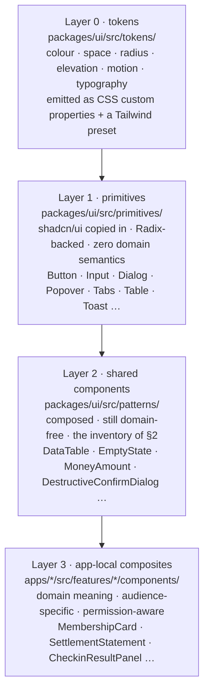
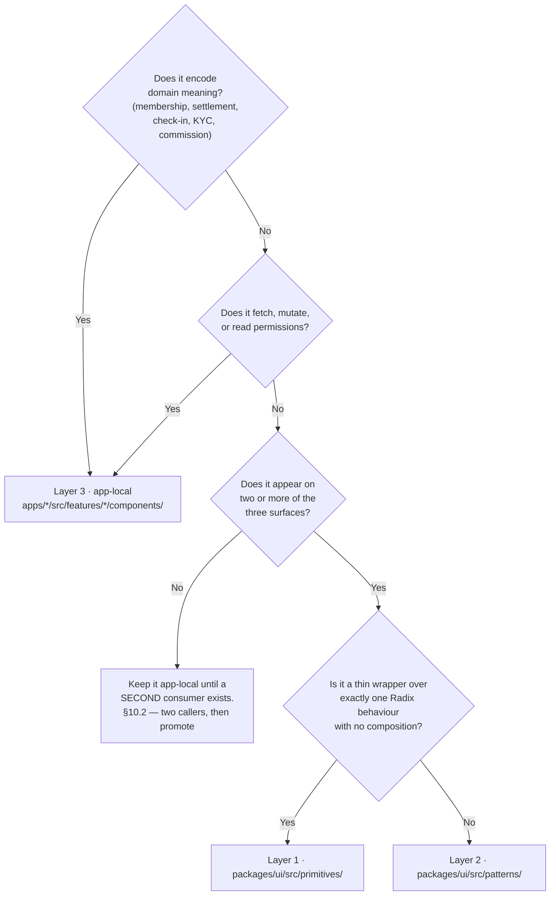
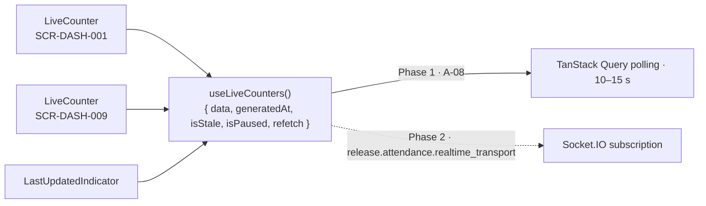
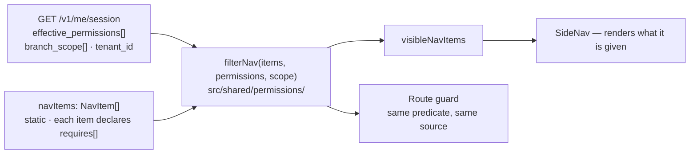

# Shared Component Inventory — `packages/ui`

> **Amended 2026-08-08 by `ADR-0037`.** The LAYOUTS, column orders, region lists and wireframes in
> this section are **advisory** — the owner lifted visual prescription so a design is not bound to
> the arrangement recorded here. They remain the reasoned default, and the reasoning is worth reading
> before departing from it: `SCR-ADM-002` leads with the SLA because that is the column which decides
> which row gets opened, not because of where it sits.
>
> What is **not** advisory, in this section or any other: the contrast floors, colour never carrying
> meaning alone, full keyboard operability, the four mandatory states, and the rule that no screen
> shows a fabricated figure as though it were read from the database. Those are `MASTER_PRD.md` §B9
> requirements and the `AX` rules, not style. `ADR-0037` lists them and says why each one breaks
> something real if removed.

**Package:** `packages/ui` (`@gymmap/ui`) · TypeScript · React 18 · TailwindCSS (`A-03`) ·
shadcn/ui primitives **copied in** (`A-04`)
**Consumers:** `apps/customer-web` (Next.js 14 App Router) · `apps/gym-dashboard` (React 18 + Vite) ·
`apps/admin-dashboard` (React 18 + Vite)
**Covers:** all 55 `SCR-` screens — `SCR-WEB-001…018` (`B6`), `SCR-DASH-001…022` (`B7`),
`SCR-ADM-001…015` (`B8`)
**Phase:** 6 — UI Documentation · `/docs/ui/Components.md`
**Status:** Specification. **Zero component code exists and none is written here.** Every fenced
block in this document is labelled `illustrative — not committed code` and describes intent, not a
file.

---

## 0. Document control

| Field | Value |
| :--- | :--- |
| Owns | The layering model, the shared component inventory, each component's props contract, its shadcn/ui primitive, its states, its accessibility contract, its screen coverage; the four-state component contract; `DestructiveConfirmDialog`; `LiveCounter`; `PermissionGate`; `MoneyAmount`/`PriceDisplay`; the form architecture; the per-component testing contract; the contribution and deprecation rules |
| Does not own | Token **values**, the type scale, the spacing scale, the icon set → `/docs/ui/DesignSystem.md` · per-screen layout and copy → `/docs/ui/CustomerApp.md`, `/docs/ui/GymDashboard.md`, `/docs/ui/AdminDashboard.md` · route tables and deep-link rules → `/docs/ui/Navigation.md` · WCAG conformance evidence → `/docs/ui/Accessibility.md` · breakpoint rules → `/docs/ui/ResponsiveBehavior.md` |
| Binding inputs | `PROJECT_CONSTITUTION.md` §16 (Frontend Rules), §7.4 (frontend feature tree), §8.1 (naming) · `MASTER_PRD.md` `B2`, `B3.2`, `B4`, `B6`, `B7`, `B8`, `B9.6` · `docs/apis/README.md` (contract law) and the nine domain files · `docs/engineering/FolderStructure.md` §10 (`packages/ui`), §11 (`packages/types`), §12 (`packages/utils`) · `LAUNCH_MARKET_INDIA.md` |
| Precedence | `PROJECT_CONSTITUTION.md` > `MASTER_PRD.md` > `docs/apis/` > `docs/engineering/FolderStructure.md` > this document. Where this document appears to contradict any of them, **they win and this document is the defect** |
| Launch market | **India.** `INR` / paise, `₹` **before** the number, **lakh-crore grouping** (`₹2,50,000`, never `₹250,000`), `Asia/Kolkata` (+05:30, no DST), dates `DD MMM YYYY`, phone `+91` and 10 digits starting 6–9, PIN 6 digits, single launch locale `en-IN` with **every string externalised** (`NFR-USE-08`) |

### 0.1 The nine laws every component in this inventory obeys

| # | Law | Source |
| :-: | :--- | :--- |
| **C1** | shadcn/ui primitives are **copied into `packages/ui`**, never a runtime dependency. The platform owns the accessibility behaviour and the upgrade cadence | `A-04`, UI1 |
| **C2** | Design tokens are the **single source of styling truth**. No hex literal, no arbitrary Tailwind value (`p-[13px]`, `text-[#0F766E]`) anywhere — in the package or in `apps/**`. Lint failure, not a review comment | `C1.1`, UI2, UI3 |
| **C3** | `packages/ui` contains **no API calls, no TanStack Query hooks, no business logic, and no domain types beyond primitives**. It renders what it is given | UI5, FolderStructure §10 |
| **C4** | **No user-facing string literal.** Every visible string is a **required prop with no default**, resolved by the consuming app from the i18n catalogue. `packages/ui` does not depend on the i18n runtime and does not ship an English fallback | `NFR-USE-08`, I18N1, I18N5 |
| **C5** | Every component that displays server data handles **loading, empty, error and permission-denied** — §3 | `B6` preamble, §16.9 |
| **C6** | Minimum interactive target **44 × 44 px**; text contrast ≥ **4.5:1**; interactive contrast ≥ **3:1**; visible focus ring from the token set on every focusable element | `NFR-USE-03`, `NFR-USE-04`, AX3, AX4 |
| **C7** | Every component is **fully keyboard operable**, and every overlay traps focus, closes on `Escape` and returns focus to its trigger | `NFR-USE-02`, AX2 |
| **C8** | **Colour is never the sole carrier of meaning.** A denial is red **and** carries an icon **and** carries text | `NFR-USE-04`, AX9 |
| **C9** | Every component carries an **axe-core assertion** in its test file. A new violation fails CI | `A-06`, AX7, §9 |

### 0.2 Naming reconciliations recorded here

No code exists, so these are documentation alignments, not renames of anything built.

| Name used elsewhere | Canonical name in this inventory | Where |
| :--- | :--- | :--- |
| `VisibleIf` (`GymDashboard.md` §26) | **`PermissionGate`** — same component, same `src/shared/permissions/` home, same "presentation only" header comment | §2.7, §6 |
| `MoneyDisplay` (`FolderStructure.md` §10) | Retained as the **pre-formatted-string primitive**. `MoneyAmount` is the minor-unit-in wrapper that calls the injected formatter and renders it | §2.3, §7 |
| `Money` · `Rate` (`GymDashboard.md` §26) | **`MoneyAmount`** · **`RateDisplay`** | §2.3, §7 |
| `ConfirmDestructive` (`FolderStructure.md` §10) | **`DestructiveConfirmDialog`** | §2.5, §4 |
| `ErrorState` · `PermissionDeniedState` (`GymDashboard.md` §26) | Retained verbatim; they are siblings of `EmptyState` under one `StateBoundary` contract | §3 |
| `QrPanel` (`FolderStructure.md` §10) | **`QRDisplay`** | §2.7 |

---

## 1. The layering model

Three layers, one direction of dependency, one rule about which layer a new component joins.

`illustrative — not committed code`



| Layer | Home | May import | May **not** import |
| :-: | :--- | :--- | :--- |
| 0 | `packages/ui/src/tokens/` | nothing | anything |
| 1 | `packages/ui/src/primitives/` | Layer 0, `@radix-ui/*`, `clsx`, `tailwind-merge` | Layer 2, Layer 3, `@gymmap/types`, `@gymmap/utils`, i18n, TanStack Query |
| 2 | `packages/ui/src/patterns/` | Layers 0–1 | Layer 3, `@gymmap/utils`, i18n runtime, TanStack Query, any API client |
| 3 | `apps/*/src/features/*/components/` | Layers 0–2, `@gymmap/types`, `@gymmap/utils`, i18n, the feature's own `api/` hooks | another feature's internals (`F2`) |

### 1.1 shadcn/ui is copied in, and what that costs

`A-04` and UI1: the Radix-based shadcn/ui source is **vendored** into
`packages/ui/src/primitives/`. It is not in `dependencies`. The consequences, stated so nobody is
surprised in month nine:

| Consequence | Statement |
| :--- | :--- |
| Ownership | An accessibility defect in `Dialog` is **our** defect and **our** fix. There is no upstream to wait for and no upgrade that silently changes focus behaviour on 55 screens |
| Upgrade cadence | Upstream changes are pulled deliberately, as a reviewed diff against the vendored file, with the primitive's test suite as the gate. `packages/ui/PRIMITIVES.md` records the upstream commit each file was taken from |
| Radix is still a dependency | The *behaviour* packages (`@radix-ui/react-dialog`, `-popover`, `-tabs`, `-select`, `-checkbox`, `-radio-group`, `-switch`, `-tooltip`, `-dropdown-menu`, `-slider`, `-toast`, `-avatar`) are real runtime dependencies. shadcn/ui is the *styling and composition layer* over them, and that is the part that is copied |
| No second primitive set | MUI, Chakra, Ant Design, Headless UI and Mantine are **not** dependencies of this project. A PR adding one is closed |

### 1.2 The rule for which layer a new component belongs to

`illustrative — not committed code`



| # | Rule | Why |
| :-: | :--- | :--- |
| **L-1** | A component that **encodes domain meaning** lives in the owning feature of the owning app, **even if two apps would like it** | UI4, verbatim: *"because the two surfaces show it to different audiences with different permissions"*. A `ReviewItem` shown to Priya (`SCR-WEB-003`), to Rohan (`SCR-DASH-019`) and to a `MODERATOR` (`SCR-ADM-012`) is three components with three action sets and three permission postures. Merging them produces a props object with `isModerator` in it, which is a permission decision inside `packages/ui` — forbidden by C3 |
| **L-2** | A component that **fetches, mutates, or evaluates permission** is Layer 3, always | UI5, C3. A component that fetches cannot be reused across three surfaces with three auth models |
| **L-3** | A **domain-free** component used on two or more surfaces is Layer 2 | UI4 first sentence |
| **L-4** | A domain-free component used on **one** surface stays app-local in `apps/*/src/shared/components/` until a second consumer exists. Promotion is §10.2 | Speculative sharing produces a package of one-caller components with props nobody needs |
| **L-5** | A thin wrapper over exactly one Radix behaviour, with no composition of other patterns, is Layer 1 | Keeps `primitives/` diffable against upstream |
| **L-6** | **No app ever reaches past `packages/ui` to style a primitive directly.** `import { Dialog } from '@radix-ui/react-dialog'` inside `apps/**` is a build failure, not a review comment | §1.3 |

### 1.3 The no-reach-past rule, enforced

An application imports from **one** entry point: `@gymmap/ui`. It never imports
`@gymmap/ui/src/primitives/Dialog`, never `@radix-ui/*`, and never restyles a primitive with
class overrides that fight the token layer.

| Enforcement | Mechanism |
| :--- | :--- |
| Deep imports | `package.json` `"exports"` publishes **only** `.` (and `./tailwind-preset`). `./src/*` is not exported, so a deep import fails to resolve |
| Radix in an app | `eslint no-restricted-imports` with `@radix-ui/*` in the pattern list, scoped to `apps/**`. Radix appears in exactly one `package.json`: `packages/ui` |
| Token bypass | `eslint` rule `no-arbitrary-tailwind` rejects `[...]` values and hex literals in `apps/**` and in `packages/ui/src/patterns/**` |
| Style escape hatch | A pattern accepts `className` and merges it with `tailwind-merge`, but the accepted classes are **layout and spacing only** (`m-*`, `w-*`, `grid-*`, `col-*`). A `className` carrying `bg-*`, `text-[…]`, `rounded-*` or `shadow-*` is a review rejection — the variant belongs in the component, expressed as a token-backed prop |
| Variants | Every visual variation is a **typed prop** (`tone`, `size`, `emphasis`, `density`) resolved through `cva` against tokens. An app never invents a variant with classes |

> **Why this is hard-enforced rather than encouraged.** `C1.1`'s rationale for one component library
> is that it *"prevents three divergent interpretations of the same design"*. A single
> `<Dialog className="rounded-2xl shadow-xl">` in `admin-dashboard` is that divergence starting.
> Three months later the check-in desk has its own dialog radius and `NFR-USE-04`'s contrast
> guarantee — which is a property of the **token palette**, not of a per-component choice — is no
> longer provable.

### 1.4 The package's public surface

`illustrative — not committed code`

```text
packages/ui/
├── src/
│   ├── tokens/        colour.ts · space.ts · radius.ts · elevation.ts · motion.ts ·
│   │                  typography.ts · tokens.css (generated)
│   ├── primitives/    §2 "Primitive" column — the vendored shadcn/ui + Radix layer
│   ├── patterns/      §2 inventory — composed, domain-free
│   ├── a11y/          FocusRing · SkipLink · LiveRegionAnnouncer · VisuallyHidden ·
│   │                  useRovingFocus · useEscapeToClose
│   ├── format/        FormatProvider — the injection seam of §7.2. Types only; no implementation
│   ├── state/         StateBoundary · the four-state contract of §3
│   └── index.ts       the only export
├── tailwind-preset.ts
├── PRIMITIVES.md      upstream commit per vendored file
├── README.md          purpose · public surface · what may not be added
└── package.json · tsconfig.json
```

---

## 2. The component inventory

### 2.0 How to read an entry

Each entry gives: **purpose** · a **props table** with TypeScript types · the **shadcn/ui primitive
underneath** (or *none — composed*) · **states** · the **accessibility contract** (role, keyboard,
ARIA) · the **screens** that use it, by `SCR-` identifier · and an illustrative snippet where the
exact shape is load-bearing.

Conventions that hold for every entry and are therefore not repeated:

| Convention | Statement |
| :--- | :--- |
| Strings | Every visible string is a **required prop with no default** (C4). Props ending `Label`, `Text`, `Title`, `Message` or `Hint` are already-resolved strings — the app called `t()`, not the component |
| `className` | Accepted on every pattern; layout and spacing utilities only (§1.3) |
| `data-testid` | Accepted on every pattern; used by Playwright for the `C8.3` journeys |
| Refs | Every interactive pattern forwards its ref to its focusable element |
| `id` | Every pattern that renders a label/description pair generates ids with `useId()` and wires `aria-labelledby` / `aria-describedby` |
| Density | Dashboard and admin patterns accept `density?: 'comfortable' \| 'compact'`; `compact` never reduces the hit target below **44 × 44 px** (C6) — it reduces padding around a target that stays 44 px |
| Screen counts | 55 total: `SCR-WEB-001…018` (18), `SCR-DASH-001…022` (22), `SCR-ADM-001…015` (15) |

### 2.1 Layout

#### `AppShell` — the persistent frame around every authenticated surface

The chrome that does not re-render on navigation: skip link, header, side navigation slot, main
landmark, toast viewport, live-region announcer.

| Prop | Type | Req | Notes |
| :--- | :--- | :-: | :--- |
| `nav` | `ReactNode` | ✅ | Slot. The app passes a configured `<SideNav>`; the shell never builds one |
| `header` | `ReactNode` | ✅ | Slot for the app's account menu, tenant/branch switcher, impersonation banner |
| `children` | `ReactNode` | ✅ | Rendered inside `<main id="main">` |
| `banner` | `ReactNode` | — | Above the header. Used for the impersonation banner (`SCR-ADM-005`) and the subscription-arrears strip (`SCR-DASH-001`) |
| `skipToContentLabel` | `string` | ✅ | Resolved string for the skip link |
| `mainLandmarkLabel` | `string` | ✅ | `aria-label` on `<main>` |
| `navCollapsed` | `boolean` | — | Controlled. Defaults to collapsed below `md` |
| `onNavCollapsedChange` | `(v: boolean) => void` | — | |
| `fullBleed` | `boolean` | — | Removes the content gutter. `SCR-DASH-009` full-screen mode |

**Primitive** none — composed over `a11y/SkipLink`, `a11y/LiveRegionAnnouncer` and the `Toast`
viewport.
**States** the shell itself never loads; it renders while its children resolve. Nav collapsed /
expanded / off-canvas (`< md`). Full-bleed.
**A11y** landmark set is `banner` → `navigation` → `main` → `contentinfo`, one of each, in that DOM
order. Skip link is the **first focusable node** and becomes visible on focus. The live-region
announcer mounts once, at the shell, so no screen mounts a second one (AX8). `Escape` closes the
off-canvas nav and returns focus to the toggle.
**Screens** all 22 `dash` and all 15 `admin` screens. On `web`, only the `/account/*` cluster
(`SCR-WEB-008`…`SCR-WEB-015`, `SCR-WEB-017`) — the public marketplace pages use the SEO shell in
`apps/customer-web/app/layout.tsx`, which is routing, not a component (`F1`).

```tsx
// illustrative — not committed code
<AppShell
  skipToContentLabel={t('common.a11y.skip_to_content')}
  mainLandmarkLabel={t('dash.a11y.main')}
  banner={impersonation ? <ImpersonationBanner {...impersonation} /> : undefined}
  header={<DashHeader />}
  nav={<SideNav items={visibleNavItems} currentPath={pathname} {...navStrings} />}
>
  <Outlet />
</AppShell>
```

#### `PageHeader` — the title block every screen opens with

| Prop | Type | Req | Notes |
| :--- | :--- | :-: | :--- |
| `title` | `string` | ✅ | Rendered as the page's single `<h1>` |
| `description` | `string` | — | One sentence under the title |
| `breadcrumb` | `ReactNode` | — | A configured `<Breadcrumb>` |
| `actions` | `ReactNode` | — | Right-aligned action cluster; wraps below the title under `sm` |
| `meta` | `ReactNode` | — | Status pills, counts, `<LastUpdatedIndicator>` |
| `backHref` / `onBack` | `string` \| `() => void` | — | Renders a back affordance on detail screens |
| `sticky` | `boolean` | — | Sticks under the header on long tables (`SCR-DASH-007`, `SCR-ADM-015`) |

**Primitive** none — composed.
**States** with/without breadcrumb; actions collapse into a `DropdownMenu` under `sm` when more
than two are supplied.
**A11y** exactly one `<h1>` per screen, and it is this one. `actions` is a `role="group"` with an
`aria-label`. When `sticky`, the sticky region is not a focus trap and `scroll-margin-top` is set so
in-page anchors are not hidden behind it.
**Screens** all 55, without exception. A screen without a `PageHeader` fails review.

#### `Section` — a titled content region with its own state boundary

| Prop | Type | Req | Notes |
| :--- | :--- | :-: | :--- |
| `title` | `string` | — | Rendered as `<h2>` |
| `description` | `string` | — | |
| `actions` | `ReactNode` | — | Section-scoped actions |
| `state` | `SurfaceState` | — | §3. Lets one region degrade while its siblings render — `SCR-WEB-001`'s *"dynamic strips degrade to hidden"* |
| `collapsible` / `defaultOpen` | `boolean` | — | Radix Collapsible underneath when set |
| `as` | `'section' \| 'div'` | — | `'section'` (default) emits a landmark; use `'div'` for the fourth-plus region on a page to avoid landmark noise |
| `padding` | `'none' \| 'sm' \| 'md'` | — | Token-backed |

**Primitive** `Collapsible` (Radix) when `collapsible`; otherwise none.
**States** the full four of §3, scoped to the region.
**A11y** `<section aria-labelledby>` bound to the `<h2>`. A collapsible section's trigger is a
`<button aria-expanded aria-controls>`; the chevron is `aria-hidden`.
**Screens** every screen with more than one region — `SCR-WEB-003` (12 regions), `SCR-DASH-001`
(5 regions), `SCR-DASH-008` (7 regions), `SCR-ADM-004` (8 detail tabs' contents).

#### `SplitView` — two panes, independently scrolled, resizable

Built for `SCR-ADM-003`: documents left, structured checklist right, both scrolling independently
so Anita never loses her place in the checklist while zooming a PAN card.

| Prop | Type | Req | Notes |
| :--- | :--- | :-: | :--- |
| `primary` | `ReactNode` | ✅ | Left pane |
| `secondary` | `ReactNode` | ✅ | Right pane |
| `initialRatio` | `number` | — | `0.5` default; clamped to `0.25…0.75` |
| `minPrimaryPx` / `minSecondaryPx` | `number` | — | Below the sum, the component stacks |
| `stackBelow` | `'sm' \| 'md' \| 'lg'` | — | Default `lg`. Below it the panes stack vertically — **never** a horizontal scroll (`NFR-USE-07`) |
| `separatorLabel` | `string` | ✅ | `aria-label` for the resizer |
| `primaryLabel` / `secondaryLabel` | `string` | ✅ | `aria-label` per pane region |
| `onRatioChange` | `(r: number) => void` | — | The app persists it per user; the component does not |

**Primitive** none — composed. The separator is a hand-built `role="separator"` widget, not Radix.
**States** side-by-side · stacked · dragging · keyboard-resizing.
**A11y** the resizer is `role="separator" aria-orientation="vertical" tabindex="0"` with
`aria-valuenow/min/max` as an integer percentage. `ArrowLeft`/`ArrowRight` move it 2% per press,
`Shift` + arrow 10%, `Home`/`End` jump to the clamps, `Enter` toggles 50%. Each pane is a
`role="region"` with its own label. Stacked mode drops the separator from the tab order entirely
rather than leaving a control that does nothing.
**Screens** `SCR-ADM-003` (documents ∥ checklist), `SCR-ADM-015` (result table ∥ diff),
`SCR-DASH-006` (plan form ∥ live marketplace preview), `SCR-DASH-009` (viewfinder ∥ result panel),
`SCR-ADM-012` (review ∥ context), `SCR-ADM-013` (ticket ∥ customer context).

### 2.2 Navigation

#### `SideNav` — the primary navigation rail, rendered from an already-filtered item list

`SideNav` **receives** its items. It does not filter them. `FR-NAV-03`'s filtering happens in the
app's `src/shared/permissions/` before the list is passed in — see §6.

| Prop | Type | Req | Notes |
| :--- | :--- | :-: | :--- |
| `items` | `NavItem[]` | ✅ | `{ id, labelText, href, icon?, badgeCount?, children?, disabledReasonText? }` |
| `currentPath` | `string` | ✅ | The router's current path. The component derives active state; it never reads a router |
| `collapsed` | `boolean` | — | Icon-only rail |
| `landmarkLabel` | `string` | ✅ | `aria-label` on `<nav>` |
| `groups` | `NavGroup[]` | — | `{ id, labelText, itemIds }` for section headings |
| `renderLink` | `(p: LinkProps) => ReactNode` | ✅ | **The router adapter.** `next/link` in `customer-web`, `react-router` `<Link>` in the two SPAs. `packages/ui` depends on neither |
| `footer` | `ReactNode` | — | Version stamp, support link |

**Primitive** `NavigationMenu` semantics without the Radix menu widget — a nav rail is a list of
links, and `role="menu"` on a set of links is the single most common ARIA misuse in dashboards.
**States** expanded · collapsed · off-canvas (`< md`) · item active · item with badge count · group
collapsed · **empty** (a role whose effective permissions yield zero items renders the
`PermissionDeniedState` copy at the shell level, never a bare rail).
**A11y** `<nav aria-label>` containing a `<ul>`; the active item carries `aria-current="page"`.
Tab moves through links in DOM order — **no roving tabindex**, because these are links, not a menu.
A parent with `children` is a `<button aria-expanded aria-controls>` followed by a nested `<ul>`.
Badge counts are announced through a `VisuallyHidden` suffix (`"Refunds, 3 pending"`), never by the
colour of a dot alone (C8). Collapsed mode keeps the accessible name via `aria-label` and shows a
`Tooltip` on hover **and** on focus.
**Screens** all 22 `dash` and all 15 `admin` screens via `AppShell`.

#### `Tabs` — in-page section switching with URL-synced state

| Prop | Type | Req | Notes |
| :--- | :--- | :-: | :--- |
| `items` | `TabItem[]` | ✅ | `{ id, labelText, badgeCount?, disabled? }` |
| `value` / `onValueChange` | `string` / `(v: string) => void` | ✅ | Controlled. The app syncs to the URL (`NX7`) |
| `orientation` | `'horizontal' \| 'vertical'` | — | Vertical for `SCR-ADM-004`'s eight detail tabs on wide viewports |
| `variant` | `'underline' \| 'pill' \| 'enclosed'` | — | Token-backed |
| `overflow` | `'scroll' \| 'menu'` | — | `scroll` gives a horizontally scrollable **tablist** — the page still never scrolls horizontally (`NFR-USE-07`); `menu` collapses the overflow into a `DropdownMenu` |
| `children` | `ReactNode` | ✅ | Panels |

**Primitive** `Tabs` (Radix).
**States** selected · unselected · disabled-with-reason (renders a `Tooltip` giving the reason —
never a dead control) · overflowing.
**A11y** Radix roving tabindex: `ArrowLeft`/`ArrowRight` (or `Up`/`Down` when vertical), `Home`,
`End`. Panels are `role="tabpanel"` with `tabindex="0"` when they contain no focusable child.
Selection is **manual activation** (`activationMode="manual"`) everywhere: arrow keys move focus,
`Enter`/`Space` activates. Automatic activation would fire a query per arrow press on
`SCR-ADM-004`.
**Screens** `SCR-WEB-003` (plans / reviews / location), `SCR-WEB-014`, `SCR-DASH-008` (7 regions),
`SCR-DASH-014`, `SCR-DASH-020`, `SCR-DASH-022`, `SCR-ADM-004` (8 tabs), `SCR-ADM-006`,
`SCR-ADM-010`, `SCR-ADM-011`, `SCR-ADM-012` (3 queues), `SCR-ADM-013`.

#### `Breadcrumb` — ancestry for deep detail screens

| Prop | Type | Req | Notes |
| :--- | :--- | :-: | :--- |
| `items` | `Crumb[]` | ✅ | `{ labelText, href? }`; the last has no `href` |
| `landmarkLabel` | `string` | ✅ | `aria-label` on `<nav>` |
| `renderLink` | `(p: LinkProps) => ReactNode` | ✅ | Router adapter, as `SideNav` |
| `maxVisible` | `number` | — | Default 4; the middle collapses into an ellipsis `DropdownMenu` |

**Primitive** none — composed; the collapse menu is `DropdownMenu` (Radix).
**States** full · collapsed · single-crumb (renders nothing rather than a lone item).
**A11y** `<nav aria-label><ol>`; the current page is `aria-current="page"` and is **not** a link.
Separators are CSS `::before` content and are `aria-hidden` — a screen reader hears
`"Tenants, link. Iron Temple Fitness LLP, current page."`, not five slashes.
**Screens** `SCR-DASH-006`, `SCR-DASH-008`, `SCR-DASH-018` (staff detail), `SCR-ADM-003`,
`SCR-ADM-004`, `SCR-ADM-005`, `SCR-ADM-008`, `SCR-ADM-009`, `SCR-ADM-011`, `SCR-ADM-013`.

#### `Pagination` — cursor pagination first, offset only where the contract says so

The API is **cursor-paginated by default** (`README.md` §7, ADR-0023); five enumerated endpoints are
offset-paginated, of which the audit explorer (`SCR-ADM-015`) is exception 2. One component, two
modes, and the mode is a **prop the API shape dictates** — not a choice.

| Prop | Type | Req | Notes |
| :--- | :--- | :-: | :--- |
| `mode` | `'cursor' \| 'offset'` | ✅ | |
| `hasNext` | `boolean` | ✅ (cursor) | Derived by the app from `next_cursor !== null`. **Never** from a short page — `README.md` §7.1 is explicit |
| `hasPrevious` | `boolean` | — (cursor) | The app keeps a cursor stack |
| `page` / `pageCount` / `total` | `number` | ✅ (offset) | From `page_info` |
| `maxPage` | `number` | — (offset) | `100` on the audit explorer; beyond it the server returns `400 LIMIT_EXCEEDS_MAXIMUM` |
| `limit` / `limitOptions` | `number` / `number[]` | — | The **applied** limit echoed by the server, not the requested one |
| `isFetching` | `boolean` | ✅ | Disables the controls and shows the pending affordance |
| `labels` | `PaginationStrings` | ✅ | `{ next, previous, page, of, rowsPerPage, showingRange }` — all resolved |
| `onNext` / `onPrevious` / `onPageChange` / `onLimitChange` | callbacks | — | |

**Primitive** `Button`, `Select` (both vendored).
**States** first page · middle · last (`hasNext === false` disables *Next* **and** labels it) ·
fetching · offset cap reached (renders the narrow-your-filter guidance from `README.md` §16.1
rather than a dead *Next*).
**A11y** `<nav aria-label>` wrapping the controls; a `VisuallyHidden` `aria-live="polite"` region
announces `"Showing 51 to 100 of 118"` after each change. Disabled controls are
`disabled` + `aria-disabled`, never `pointer-events:none` on an enabled button.
**Screens** cursor mode: `SCR-WEB-002`, `SCR-WEB-010`, `SCR-WEB-011`, `SCR-DASH-007`,
`SCR-DASH-010`, `SCR-DASH-011`, `SCR-DASH-013`, `SCR-DASH-015`, `SCR-DASH-019`, `SCR-ADM-002`,
`SCR-ADM-004`, `SCR-ADM-005`, `SCR-ADM-006`, `SCR-ADM-008`, `SCR-ADM-012`. Offset mode:
`SCR-ADM-015` and the four other `README.md` §7.5 exceptions.

### 2.3 Data display

#### `DataTable` — the table every list screen is built from

Virtualised, keyboard-navigable, sticky-first-column, card-fallback at `xs`, and **stateful by
contract** (§3). `FP5`: dashboard list views render ≤ 50 rows with virtualised scrolling.

| Prop | Type | Req | Notes |
| :--- | :--- | :-: | :--- |
| `columns` | `Column<T>[]` | ✅ | `{ id, headerText, cell: (row) => ReactNode, width?, align?, sortable?, sticky?, hideBelow?, numeric? }` |
| `rows` | `T[]` | ✅ | Already-paginated rows. The table never fetches |
| `getRowId` | `(row: T) => string` | ✅ | Stable key; no index keys |
| `state` | `SurfaceState` | ✅ | §3 — drives loading / empty / error / permission-denied without the caller branching |
| `emptyState` | `EmptyStateProps` | ✅ | **Required.** There is no default "No results" (§3.4) |
| `sort` / `onSortChange` | `{ id, dir }` / `(s) => void` | — | Server-side sort against the endpoint's allowlist; an unknown field is `400 INVALID_SORT_FIELD` |
| `selection` | `{ mode: 'none' \| 'single' \| 'multi', selectedIds, onChange, selectAllLabel }` | — | Bulk actions on `SCR-DASH-007` |
| `onRowActivate` | `(row: T) => void` | — | Row click **and** `Enter` on the focused row |
| `rowActions` | `(row: T) => ReactNode` | — | Rendered into a per-row `DropdownMenu` |
| `virtualised` | `boolean` | — | Default `true` above 30 rows |
| `density` | `'comfortable' \| 'compact'` | — | `SCR-DASH-007`: *"Compact rows"* |
| `cardBelow` | `'sm' \| 'md'` | — | Below it each row renders through `renderCard` — the `NFR-USE-07` answer for a 12-column table at 320 px |
| `renderCard` | `(row: T) => ReactNode` | ✅ if `cardBelow` | |
| `captionText` | `string` | ✅ | `<caption>`, visually hidden by default. A table with no accessible name is an axe violation |
| `stickyHeader` | `boolean` | — | Default `true` |

**Primitive** `Table` (vendored shadcn/ui), `Checkbox`, `DropdownMenu`, `Skeleton`.
**States** loading (skeleton **rows matching the real column widths and row height** — never a
spinner over a blank grid) · empty · error (retry, previous rows retained where the caller passes
them) · permission-denied · fetching-next (a footer row, not a full reset) · row-level pending ·
no-columns-visible at the current breakpoint (falls back to cards).
**A11y** a real `<table>` with `<caption>`, `<thead>`, `<th scope="col">` and, where a column is the
row's identity, `<th scope="row">`. Sortable headers are `<button>` inside the `<th>` with
`aria-sort="ascending" | "descending" | "none"`. Selection uses real checkboxes with an accessible
name per row (`"Select Priya Sharma"`), and the header checkbox exposes `aria-checked="mixed"`.
Keyboard: `Tab` reaches the table, then arrow keys move a **roving cell focus** (`ArrowUp/Down/Left/Right`,
`Home`/`End` to row ends, `Ctrl+Home`/`Ctrl+End` to corners), `Enter` activates the row,
`Space` toggles selection. Virtualisation sets `aria-rowcount` on the table and `aria-rowindex` on
each rendered row, so a screen reader is told *"row 51 of 118"* rather than *"row 1 of 50"*.
**Screens** `SCR-WEB-010`, `SCR-WEB-011`, `SCR-DASH-004`, `SCR-DASH-005`, `SCR-DASH-007`,
`SCR-DASH-010`, `SCR-DASH-011`, `SCR-DASH-013`, `SCR-DASH-014`, `SCR-DASH-015`, `SCR-DASH-016`,
`SCR-DASH-017`, `SCR-DASH-018`, `SCR-DASH-019`, `SCR-DASH-021`, `SCR-ADM-002`, `SCR-ADM-004`,
`SCR-ADM-005`, `SCR-ADM-006`, `SCR-ADM-007`, `SCR-ADM-008`, `SCR-ADM-009`, `SCR-ADM-010`,
`SCR-ADM-011`, `SCR-ADM-012`, `SCR-ADM-013`, `SCR-ADM-015`. Twenty-seven of 55.

```tsx
// illustrative — not committed code
<DataTable
  captionText={t('dash.members.table.caption')}
  state={toSurfaceState(query)}                 // §3.3 — one adapter, every screen
  rows={query.data?.data ?? []}
  getRowId={(m) => m.id}
  density="compact"
  cardBelow="md"
  renderCard={(m) => <MemberRowCard member={m} />}
  emptyState={{
    titleText: t('dash.members.empty.title'),
    bodyText: t('dash.members.empty.body'),
    primaryAction: { labelText: t('dash.members.empty.cta'), onClick: openWalkInForm },
  }}
  columns={[
    { id: 'name',    headerText: t('dash.members.col.name'),   sticky: true, sortable: true,
      cell: (m) => <MemberIdentityCell member={m} /> },
    { id: 'phone',   headerText: t('dash.members.col.phone'),  hideBelow: 'lg',
      cell: (m) => <PhoneNumber value={m.phone} /> },
    { id: 'status',  headerText: t('dash.members.col.status'),
      cell: (m) => <StatusPill domain="membership" value={m.status} labelText={t(`enum.membership.${m.status}`)} /> },
    { id: 'expiry',  headerText: t('dash.members.col.expiry'), sortable: true, numeric: true,
      cell: (m) => <DateTime value={m.end_date} kind="business-date" timeZone={gymTz} precision="date" /> },
  ]}
/>
```

#### `EmptyState` — the component that makes a bare "No results" impossible

`§16.9`: an empty state *"explains **why** it is empty and offers the next action. Never a bare
'No results'."* The props enforce it.

| Prop | Type | Req | Notes |
| :--- | :--- | :-: | :--- |
| `titleText` | `string` | ✅ | |
| `bodyText` | `string` | ✅ | **Required.** This is the "why". A component that renders a title alone cannot exist |
| `primaryAction` | `{ labelText, onClick? , href? }` | ✅ | **Required.** This is the "next action" |
| `secondaryAction` | `{ labelText, onClick?, href? }` | — | |
| `illustration` | `'search' \| 'inbox' \| 'money' \| 'members' \| 'calendar' \| 'shield'` | — | Token-driven, `aria-hidden` |
| `tone` | `'neutral' \| 'informative'` | — | |
| `size` | `'inline' \| 'section' \| 'page'` | — | `inline` for a table body, `page` for a route |

**Primitive** none — composed.
**States** one, by design.
**A11y** `role="status"` when it replaces content that was loading, so the transition from skeleton
to empty is announced. The illustration is decorative. The primary action is a real button or link
with a 44 px target.
**Screens** every list, every table, every search surface — `SCR-WEB-002` (names the most
restrictive filter and previews the relaxed count, per `FR-SRCH-12`/`AC-SRCH-01.2`), `SCR-WEB-008`
(discovery CTA with nearby gyms), `SCR-WEB-010`, `SCR-WEB-012`, `SCR-DASH-005`, `SCR-DASH-007`,
`SCR-DASH-015`, `SCR-DASH-016`, `SCR-DASH-017`, `SCR-DASH-019`, `SCR-ADM-002`, `SCR-ADM-008`,
`SCR-ADM-009`, `SCR-ADM-012`, `SCR-ADM-015`.

#### `Stat` — one figure, its label, and its provenance

| Prop | Type | Req | Notes |
| :--- | :--- | :-: | :--- |
| `labelText` | `string` | ✅ | |
| `value` | `ReactNode` | ✅ | Usually a `<MoneyAmount>` or a formatted integer. **Never** a pre-formatted money string (§7) |
| `helpText` | `string` | — | The definition of the metric. `SCR-ADM-001`'s "payment success rate" needs one |
| `delta` | `{ value: ReactNode, direction: 'up' \| 'down' \| 'flat', labelText: string, sentiment: 'positive' \| 'negative' \| 'neutral' }` | — | `sentiment` is separate from `direction` because *refunds up* is down-good and *revenue down* is down-bad. The component never infers it |
| `footer` | `ReactNode` | — | Where `<LastUpdatedIndicator>` goes for a polled figure (§5) |
| `state` | `SurfaceState` | — | §3 |
| `size` | `'sm' \| 'md' \| 'lg'` | — | |

**Primitive** none — composed.
**States** loading (a skeleton **the width of the eventual digits**, so the strip does not reflow) ·
value · value-with-delta · error (the tile renders the label and an inline retry; the strip does not
collapse) · permission-denied (the tile is not rendered at all — `FR-NAV-03` reasoning applies to
tiles as well as menu items) · **stale** (the `footer` indicator carries it; the number is never
dimmed into unreadability, because `NFR-USE-04` still applies to a stale figure).
**A11y** the label and the value are associated (`<dt>`/`<dd>` inside a `<dl>` when in a strip).
`delta.direction` is conveyed by an `aria-hidden` arrow **plus** `delta.labelText`
(`"up 12% versus previous 30 days"`) — never the arrow alone (C8). Figures use tabular numerals so a
strip of four tiles does not jitter between polls.
**Screens** `SCR-DASH-001` (today strip, region 2), `SCR-DASH-014`, `SCR-DASH-019`
(response-rate), `SCR-DASH-020`, `SCR-ADM-001` (GMV, active tenants, success rate, queue depth),
`SCR-ADM-007`, `SCR-ADM-010`, `SCR-ADM-014`, `SCR-WEB-010` (streak, monthly summary).

#### `Badge` — a small, non-semantic label

For counts and taxonomy labels. **Not** for entity state — that is `StatusPill`, and the split is
deliberate so a lifecycle state cannot be styled ad hoc.

| Prop | Type | Req | Notes |
| :--- | :--- | :-: | :--- |
| `labelText` | `string` | ✅ | |
| `tone` | `'neutral' \| 'accent' \| 'success' \| 'warning' \| 'danger' \| 'info'` | — | Token-backed pairs, contrast pre-verified |
| `variant` | `'solid' \| 'soft' \| 'outline'` | — | |
| `icon` | `IconName` | — | `aria-hidden` |
| `srPrefixText` | `string` | — | Prepended in a `VisuallyHidden` span, e.g. `"Promoted listing:"` |

**Primitive** `Badge` (vendored shadcn/ui).
**States** static.
**A11y** not focusable, not interactive. If a badge needs a click it is a `Button` or a filter chip,
not a badge. Colour never carries the meaning alone (C8).
**Screens** `SCR-WEB-002` (verified, promoted — `FR-SRCH-11` requires the promoted label to come
from the `is_featured` flag and never be inferred from position), `SCR-WEB-003` (amenity chips),
`SCR-DASH-005`, `SCR-DASH-016`, `SCR-DASH-018`, `SCR-ADM-002` (SLA age), `SCR-ADM-004` (risk flags),
`SCR-ADM-012`.

#### `StatusPill` — the one renderer for every lifecycle state in the system

Every `SCREAMING_SNAKE_CASE` enum from `packages/types/src/enums/` renders through this component,
and the domain → tone mapping is defined **once**, here, not per screen.

| Prop | Type | Req | Notes |
| :--- | :--- | :-: | :--- |
| `domain` | `StatusDomain` | ✅ | `'membership' \| 'order' \| 'payment' \| 'tenant' \| 'gym' \| 'plan' \| 'review' \| 'refund' \| 'settlement' \| 'dispute' \| 'application' \| 'attendance' \| 'ticket' \| 'coupon' \| 'lead'` |
| `value` | `string` | ✅ | The verbatim wire value (`'FROZEN'`, `'PENDING_APPROVAL'`) |
| `labelText` | `string` | ✅ | The resolved translation. The component maps `domain`+`value` → **tone and icon**, never → text |
| `size` | `'sm' \| 'md'` | — | |
| `withIcon` | `boolean` | — | Default `true` |
| `tooltipText` | `string` | — | What the state means, for states a user meets rarely (`UNDER_REVIEW`, `PENDING_DLT_APPROVAL`) |

**Primitive** `Badge` (vendored) + `Tooltip` (Radix) when `tooltipText`.
**States** the mapping is exhaustive per domain; an **unmapped value renders in the neutral tone
with the raw value visible and logs a warning in development**. It does not throw, because
`README.md` §2.3 registers several enums as **open** and CO-2 obliges a client to tolerate an
unknown member. A component that crashed on an added enum value would make an additive server
change a client outage.
**A11y** icon is `aria-hidden`; the text is the accessible name. Every tone pair meets 4.5:1
against its background (`NFR-USE-04`). `FROZEN` is not distinguished from `ACTIVE` by hue alone —
the icon differs too.
**Screens** effectively all 55. Named where it is load-bearing: `SCR-WEB-009` (the six
`MembershipStatus` values of `BR-MEM-01`), `SCR-WEB-011`, `SCR-DASH-005`, `SCR-DASH-007`,
`SCR-DASH-011`, `SCR-DASH-014`, `SCR-DASH-015`, `SCR-ADM-002`, `SCR-ADM-004`, `SCR-ADM-007`,
`SCR-ADM-009`.

#### `Avatar` — a person or a gym, with an honest fallback

| Prop | Type | Req | Notes |
| :--- | :--- | :-: | :--- |
| `src` | `string \| null` | ✅ | Explicit `null` for "no photo", never `undefined`-by-omission |
| `altText` | `string` | ✅ | `""` is permitted **only** when the name is adjacent in the DOM, and the prop type documents it |
| `fallbackText` | `string` | ✅ | Initials, computed by the caller |
| `size` | `'xs' \| 'sm' \| 'md' \| 'lg' \| 'xl'` | — | `xl` is the check-in desk (`SCR-DASH-009`), where Sameer identifies a face at arm's length (`NFR-USE-09`) |
| `shape` | `'circle' \| 'square'` | — | `square` for gyms |
| `status` | `'none' \| 'online' \| 'flagged'` | — | Renders a dot **with** a `VisuallyHidden` label |

**Primitive** `Avatar` (Radix).
**States** image loading (a token-coloured block at the final size — no layout shift, `FP4`) ·
loaded · error/absent → initials · initials absent → a neutral glyph.
**A11y** the image carries `alt`; the fallback is text, not a background image, so it is
selectable and readable by a screen reader. Never `role="img"` on a `<div>` with a CSS background.
**Screens** `SCR-WEB-003` (review authors), `SCR-DASH-007`, `SCR-DASH-008`, `SCR-DASH-009`
(large, decisive), `SCR-DASH-018`, `SCR-DASH-019`, `SCR-ADM-005`, `SCR-ADM-012`, `SCR-ADM-013`,
`SCR-ADM-015` (actor).

#### `RatingStars` — a rating that refuses to lie below the display floor

`BR-REV-07` / `AC-DETL-02.1`: below three reviews there is **no numeric rating**. The API says so
explicitly — `rating.average` is `null` and `rating.displayable` states which case it is
(`Search.md` §3.6). The component takes both and cannot be made to render a fabricated star count.

| Prop | Type | Req | Notes |
| :--- | :--- | :-: | :--- |
| `average` | `number \| null` | ✅ | `null` below the floor |
| `count` | `number` | ✅ | Always shown — *"the count is honest information"* |
| `displayable` | `boolean` | ✅ | When `false` the stars are not rendered at all; `belowFloorText` is |
| `belowFloorText` | `string` | ✅ | e.g. *"2 reviews — not enough for a rating yet"* |
| `mode` | `'display' \| 'input'` | — | `input` for `SCR-WEB-013` |
| `value` / `onChange` | `number` / `(n: 1\|2\|3\|4\|5) => void` | — | `input` mode only |
| `size` | `'sm' \| 'md' \| 'lg'` | — | `input` stars are ≥ 44 px targets (C6) |
| `labels` | `{ ariaLabel, ratingOfMax, reviewCount, star1..star5 }` | ✅ | Resolved strings |
| `precision` | `'half' \| 'whole'` | — | Display only; input is always whole |

**Primitive** none — composed. Input mode is a `RadioGroup` (Radix) styled as stars, **not** five
buttons, so arrow keys work and only one value can be selected.
**States** display-with-rating · display-below-floor · input-empty · input-hover ·
input-selected · input-invalid (bound to `FormField`) · read-only (an already-submitted review
outside the 7-day edit window, `SCR-WEB-013`).
**A11y** display mode is a single element with `role="img"` and an `aria-label` reading
`"4.3 out of 5, 128 reviews"`; the individual stars are `aria-hidden`. Input mode is a
`radiogroup` with five radios, arrow-key navigable, each with a full label
(`"3 stars — it was fine"`). Half-star precision is visual only; the label carries the exact value.
**Screens** `SCR-WEB-001`, `SCR-WEB-002`, `SCR-WEB-003`, `SCR-WEB-004`, `SCR-WEB-012`,
`SCR-WEB-013` (input), `SCR-DASH-019`, `SCR-ADM-012`.

#### `PriceDisplay` — a price with its context, for a marketplace surface

Deep treatment in §7. Summary here.

| Prop | Type | Req | Notes |
| :--- | :--- | :-: | :--- |
| `amountMinor` | `string` | ✅ | Integer paise as a **string** (`README.md` §11.1 M1) |
| `currency` | `CurrencyCode` | ✅ | Adjacent, always (M2) |
| `period` | `'once' \| 'per-month' \| 'per-session' \| 'per-visit'` | — | Renders the suffix from `labels`, never concatenated in the caller |
| `strikeThroughMinor` | `string \| null` | — | The pre-promotion price. Rendered with `<s>` **and** a `VisuallyHidden` "was" |
| `monthlyEquivalentMinor` | `string \| null` | — | **Server-computed** (`FR-SRCH-06`, `FR-DETL-03`). The component never divides (BL2) |
| `size` | `'sm' \| 'md' \| 'lg' \| 'hero'` | — | |
| `labels` | `PriceStrings` | ✅ | `{ perMonth, perSession, wasPrice, monthlyEquivalent, fromPrefix }` |
| `fromPrefix` | `boolean` | — | *"from ₹1,899"* on a card showing the cheapest of several plans |

**Primitive** none — composed over `MoneyAmount`.
**States** single price · promotional (strike-through + current) · from-price · with
monthly-equivalent · loading (skeleton at the digit width).
**A11y** the whole price is one accessible string; the strike-through price is preceded by a
`VisuallyHidden` "was" so it is not read as the price. Tabular numerals.
**Screens** `SCR-WEB-001`, `SCR-WEB-002`, `SCR-WEB-003`, `SCR-WEB-004`, `SCR-WEB-012`,
`SCR-DASH-005`, `SCR-DASH-006` (marketplace preview), `SCR-WEB-018`, `SCR-ADM-011`
(subscription tiers).

#### `MoneyAmount` — minor units in, grouped INR out

Deep treatment in §7. Summary here.

| Prop | Type | Req | Notes |
| :--- | :--- | :-: | :--- |
| `amountMinor` | `string` | ✅ | Integer minor units as a string. **Never** a number, never a formatted string |
| `currency` | `CurrencyCode` | ✅ | |
| `sign` | `'auto' \| 'always' \| 'accounting'` | — | `accounting` renders a credit in parentheses for `SettlementLineTable` |
| `emphasis` | `'normal' \| 'strong' \| 'muted'` | — | |
| `size` | `'sm' \| 'md' \| 'lg' \| 'hero'` | — | |
| `srPrefixText` | `string` | — | e.g. *"Total payable"* |
| `showCurrencyCode` | `boolean` | — | Renders `INR` after the amount on statements and exports |

**Primitive** none. Formatting is delegated to the **injected formatter** of §7.2 — the component
performs no arithmetic and no grouping logic of its own (BL2, `FolderStructure.md` §10).
**States** value · zero (rendered as `₹0`, never blank, never a dash — a zero commission on a
`DIRECT` order is information) · null-not-yet-known (`gateway_fee_minor` is nullable until the
provider reports it, `BR-FIN-06`: renders `notYetAvailableText`, **never** an estimate).
**A11y** wrapped in `<data value="{amountMinor}">` so the machine value is in the DOM; tabular
numerals; `₹` is inside the same text node so it is not read as a separate token.
**Screens** every screen showing money: `SCR-WEB-005`, `SCR-WEB-006`, `SCR-WEB-007`,
`SCR-WEB-011`, `SCR-DASH-011`, `SCR-DASH-012`, `SCR-DASH-013`, `SCR-DASH-014`, `SCR-DASH-015`,
`SCR-ADM-001`, `SCR-ADM-006`, `SCR-ADM-007`, `SCR-ADM-008`, `SCR-ADM-009`, `SCR-ADM-010`,
`SCR-ADM-011`, `SCR-ADM-014`.

#### `RateDisplay` — basis points in, a percentage out

`README.md` §11.1 M5: rates in responses are **integer basis points**, named `<subject>_bps`.
18% is `1800`. The component takes `bps` and never a decimal.

| Prop | Type | Req | Notes |
| :--- | :--- | :-: | :--- |
| `bps` | `number` | ✅ | Integer. `1800` → `18%`; `950` → `9.5%` |
| `precision` | `0 \| 1 \| 2` | — | Default: the minimum that is exact |
| `srPrefixText` | `string` | — | *"Commission rate"* |

**Primitive** none. **States** value · zero (`0%` — the 0 bps floor of `KL-006` is a real value).
**A11y** tabular numerals; `%` inside the text node.
**Screens** `SCR-DASH-014`, `SCR-ADM-004`, `SCR-ADM-007`, `SCR-ADM-011` (commission resolver),
`SCR-WEB-005` (tax components, CGST 9% + SGST 9%).

#### `DateTime` — the component that always states which clock it used

`+05:30` is a half-hour offset and India observes no DST. `BR-MEM-03` computes validity in the
**gym's** timezone, and `README.md` §12.3 documents the trap: rendering a UTC instant in the
browser's timezone gets a different answer 23% of the day. So this component **requires** the caller
to state which kind of value it received.

| Prop | Type | Req | Notes |
| :--- | :--- | :-: | :--- |
| `value` | `string` | ✅ | ISO instant (`2026-08-06T13:07:22Z`) or business date (`2026-11-30`) |
| `kind` | `'instant' \| 'business-date'` | ✅ | **Required, no default.** A business date has no time and must never be shifted by an offset |
| `timeZone` | `IanaTimeZone` | ✅ when `kind='instant'` | The **gym's** zone for operational figures, `Asia/Kolkata` for platform figures. Never `undefined` = "browser default" |
| `precision` | `'date' \| 'datetime' \| 'time' \| 'relative'` | ✅ | |
| `format` | `'short' \| 'long' \| 'numeric'` | — | `long` = `06 Aug 2026`, `short` = `6 Aug`, `numeric` = `06/08/2026`. **`DD MMM YYYY` is the default day order** for India |
| `showTimeZoneLabel` | `boolean` | — | Renders `IST` after the time. Default `true` on any financial or attendance timestamp |
| `relativeFrom` | `string` | — | Anchor for `relative`; supplied so tests are deterministic |
| `labels` | `DateStrings` | ✅ | Month names, relative phrases, `IST` — all resolved through i18n |

**Primitive** none — composed. Formatting is delegated to the injected formatter (§7.2), which
wraps `packages/utils/time`.
**States** value · relative-then-absolute (relative under 7 days, absolute beyond) · absent
(renders `absentText`, never an empty cell) · invalid (renders the raw value and logs — a date the
UI cannot parse is a contract defect worth seeing, not hiding).
**A11y** always wrapped in `<time dateTime="{value}">` carrying the machine-readable value.
Relative output carries the absolute value in a `title` **and** in a `Tooltip` on focus, because a
`title` alone is not keyboard-reachable. `SCR-ADM-015` renders both `occurred_at` and
`occurred_at_local`, and the component labels which is which.
**Screens** all 55. Load-bearing on `SCR-WEB-009` (end date, days remaining), `SCR-DASH-010`,
`SCR-DASH-014` (settlement period), `SCR-ADM-009` (dispute deadline countdown), `SCR-ADM-015`.

#### `Skeleton` — a placeholder shaped like the thing that is coming

| Prop | Type | Req | Notes |
| :--- | :--- | :-: | :--- |
| `variant` | `'text' \| 'heading' \| 'block' \| 'circle' \| 'card' \| 'row' \| 'stat'` | ✅ | |
| `lines` | `number` | — | `text` only |
| `width` / `height` | `token` | — | Token-scale only; no arbitrary values (C2) |
| `ariaLabelText` | `string` | ✅ on the **outermost** skeleton of a region | e.g. *"Loading members"* |

**Primitive** `Skeleton` (vendored shadcn/ui).
**States** one, animated; the animation respects `prefers-reduced-motion` and degrades to a static
tone.
**A11y** the region wrapping a skeleton set is `aria-busy="true"` and carries **one**
`aria-label`; the individual skeleton nodes are `aria-hidden`, so a screen reader hears *"Loading
members"* once, not forty times. When data lands, `aria-busy` flips to `false` and a
`aria-live="polite"` status announces the result count.
**Screens** all 55 — §3 makes the loading state mandatory. Named where the PRD is specific:
`SCR-WEB-001` (*"skeleton cards; the search bar is interactive immediately"*), `SCR-WEB-002`
(*"6 skeleton cards; map shows a loading overlay, not a blank tile"*), `SCR-WEB-003`.

### 2.4 Input

Every control in this group is **uncontrolled-by-RHF**: it is registered through `FormField`, which
owns the React Hook Form wiring (§8). A control is never used bare with local `useState` in a form.

#### `FormField` — the wrapper that makes the error contract unavoidable

The single wrapper over React Hook Form's `Controller`. It owns the label, the description, the
error, the required marker, and every `aria-*` association. **A control rendered outside a
`FormField` inside a `<Form>` fails the lint rule `ui/form-control-needs-field`.**

| Prop | Type | Req | Notes |
| :--- | :--- | :-: | :--- |
| `name` | `FieldPath<TValues>` | ✅ | Type-safe against the Zod-inferred form type |
| `control` | `Control<TValues>` | ✅ | From `useForm` |
| `labelText` | `string` | ✅ | Never a placeholder-as-label |
| `descriptionText` | `string` | — | Rendered **above** the control, not below, so it is read before the field is entered |
| `requiredIndicator` | `'asterisk' \| 'optional-suffix' \| 'none'` | — | Per-form, set once at the `<Form>` level |
| `errorMessageMap` | `(e: FieldError) => string` | — | Maps a Zod `code`/`message` key to a resolved string; §8.4 |
| `children` | `(f: ControlRenderProps) => ReactNode` | ✅ | Render prop supplying `id`, `aria-describedby`, `aria-invalid`, `value`, `onChange`, `onBlur`, `ref` |
| `hint` | `ReactNode` | — | Static helper, e.g. the `+91` format example |
| `charCount` | `{ max: number, labelText: string }` | — | `SCR-WEB-013`'s counter |

**Primitive** `Label` (Radix) + the vendored `Form` composition.
**States** pristine · focused · filled · **invalid** · disabled · read-only · **server-rejected**
(§8.4) · pending (during an async uniqueness check).
**A11y** `<label for>` bound to the control's generated id. `aria-describedby` lists the
description id, the hint id and — when present — the **error id**, in that order.
`aria-invalid="true"` on error. The error node is `role="alert"` on the **first** error of a submit
and `aria-live="polite"` thereafter, so a screen reader is not interrupted on every keystroke.
The required marker is `aria-hidden` and the requirement is carried by `aria-required`.
**Screens** every form: `SCR-WEB-005`, `SCR-WEB-013`, `SCR-WEB-014`, `SCR-WEB-016`,
`SCR-WEB-017`, `SCR-DASH-002`, `SCR-DASH-003`, `SCR-DASH-004`, `SCR-DASH-006`, `SCR-DASH-012`,
`SCR-DASH-016`, `SCR-DASH-018`, `SCR-DASH-022`, `SCR-ADM-003`, `SCR-ADM-011`, `SCR-ADM-013`.

#### `TextInput` · `TextArea` — text entry

| Prop | Type | Notes |
| :--- | :--- | :--- |
| `inputMode` | `'text' \| 'numeric' \| 'decimal' \| 'email' \| 'tel' \| 'search' \| 'url'` | Drives the mobile keyboard |
| `leadingAddon` / `trailingAddon` | `ReactNode` | `₹` is **never** an addon on a money input — there are no money inputs (§7.4) |
| `clearable` | `boolean` | Renders a 44 px clear button with an accessible name |
| `autoComplete` | `string` | **Required in review** on name, phone, email and address fields — `WCAG 1.3.5` |
| `maxLength` / `showCount` | `number` / `boolean` | Counter is `aria-live="polite"`, throttled to announce at 90% and 100% only |
| `autoGrow` | `boolean` | `TextArea` only |

**Primitive** `Input`, `Textarea` (vendored). **States** the eight of `FormField`.
**A11y** a real `<input>`/`<textarea>`; placeholder is never the label; the clear button is a
sibling `<button>`, not an overlay div. **Screens** all form screens above.

#### `PhoneInput` — `+91`, ten digits, first digit 6–9

India: the country code is fixed for Phase 1 but **rendered as a fixed, disabled prefix rather than
baked into the value**, so the second market is a configuration change, not a rewrite.

| Prop | Type | Req | Notes |
| :--- | :--- | :-: | :--- |
| `value` | `string` | ✅ | **E.164 on the wire**: `+919820134567`. The component splits it for display and rejoins on change |
| `defaultCallingCode` | `'+91'` | — | Phase 1 constant, injected not hard-coded |
| `allowedCallingCodes` | `string[]` | — | Single-entry in Phase 1; the selector is hidden when length is 1 |
| `nationalPlaceholder` | `string` | ✅ | `98201 34567` |
| `formatAsYouType` | `boolean` | — | Groups `5 + 5` for readability; the emitted value is unformatted |
| `labels` | `{ callingCode, nationalNumber, invalidStart, invalidLength }` | ✅ | |

**Primitive** `Input` (vendored) + `Select` (Radix) for the code when more than one is allowed.
**States** pristine · valid · **invalid start digit** (0–5 typed first: an inline message naming the
rule, not a generic "invalid") · invalid length · verified (a check adornment when the number has
passed OTP verification, `SCR-WEB-014`) · unverified-with-action.
**Validation** the Zod schema lives in `packages/types/src/schemas/` and is the **same schema the
server runs** (FM2): `/^\+91[6-9]\d{9}$/` for the launch market. The component never re-implements
it.
**A11y** `inputMode="tel"`, `autoComplete="tel-national"`, `type="tel"`. The fixed `+91` is inside
the label's accessible name (`"Phone number, country code plus 91"`) so it is not silently missing
for a screen-reader user. Paste of `+91 98201 34567`, `09820134567` or `9820134567` all normalise —
Sameer pastes from WhatsApp.
**Screens** `SCR-WEB-014`, `SCR-WEB-016`, `SCR-WEB-017`, `SCR-DASH-002`, `SCR-DASH-003`,
`SCR-DASH-009` (manual lookup — *"member lookup by phone number is one field"*, `B2.3`),
`SCR-DASH-012`, `SCR-DASH-018`, `SCR-ADM-005`.

#### `PinCodeInput` — six digits, resolved to a locality

| Prop | Type | Req | Notes |
| :--- | :--- | :-: | :--- |
| `value` | `string` | ✅ | Exactly six digits |
| `resolution` | `{ status: 'idle' \| 'pending' \| 'resolved' \| 'unknown', cityName?, stateName? }` | — | **Supplied by the caller** from `GET /v1/geo/pincode/:pin`. The component never fetches (C3) |
| `labels` | `{ pattern, resolving, resolvedTemplate, unknown }` | ✅ | `resolvedTemplate` = *"{city}, {state}"* |

**Primitive** `Input` (vendored). **States** idle · pending (spinner beside, not over) · resolved
(the locality renders as a read-only confirmation under the field) · **unknown** (`PINCODE_UNRESOLVABLE`
from `Search.md` §3.8 — the message says the PIN is well-formed but not recognised and offers manual
city selection, satisfying `NFR-USE-05`).
**A11y** `inputMode="numeric"`, `autoComplete="postal-code"`, `maxLength=6`, pattern-validated on
blur not on keystroke. The resolved locality is announced through `aria-live="polite"`.
**Screens** `SCR-WEB-002` (location fallback), `SCR-WEB-005`, `SCR-WEB-014`, `SCR-DASH-003`,
`SCR-DASH-004`, `SCR-DASH-002` (business address).

#### `Select` · `MultiSelect` · `Combobox` — the three pickers, and when each is correct

| Component | Use when | Primitive |
| :--- | :--- | :--- |
| `Select` | ≤ 12 known options, single choice, no search | `Select` (Radix) |
| `MultiSelect` | A known set, many choices, chips show the selection | `Popover` + `Command` (Radix + vendored `cmdk`) |
| `Combobox` | The set is large, remote, or free-typed against a server-filtered list | `Popover` + `Command` |

| Prop (shared) | Type | Notes |
| :--- | :--- | :--- |
| `options` | `Option[]` | `{ value, labelText, descriptionText?, disabled?, disabledReasonText?, count? }` |
| `value` | `string \| string[]` | |
| `onSearchChange` | `(q: string) => void` | `Combobox`: the app debounces and queries; the component never fetches |
| `isLoadingOptions` | `boolean` | Renders skeleton rows in the listbox, not a spinner over it |
| `emptyOptionsState` | `EmptyStateProps` | **Required** — an empty listbox says why (§3.4) |
| `maxSelected` | `number` | `MultiSelect`. `SCR-WEB-002`'s amenity filter caps at **12** (`TOO_MANY_AMENITY_FILTERS`, `Search.md` §3.8), and the component surfaces the cap **before** the request fails |
| `showCounts` | `boolean` | Facet counts beside each option — `SCR-WEB-002`: *"Each filter shows a live result count"* |
| `creatable` | `false` | **Fixed false.** `NFR-DQ-06`: reference data is platform-managed and free-text alternatives are not offered where filtering depends on the value |

**States** closed · open · searching · loading options · empty · option disabled-with-reason ·
at-max-selected · error loading options (inline retry inside the popover).
**A11y** `Select` is Radix's `combobox`/`listbox` pair with typeahead, `Home`/`End`, and
`Escape`-to-close returning focus to the trigger. `Combobox` is `role="combobox"` +
`aria-expanded` + `aria-controls` + `aria-activedescendant`, with the input keeping DOM focus.
`MultiSelect` chips are removable with `Backspace` from the input and each carries a 44 px remove
button named `"Remove Parking"`. Selection changes announce the new count through a polite live
region.
**Screens** `Select`: `SCR-WEB-005`, `SCR-DASH-006`, `SCR-DASH-012`, `SCR-DASH-022`, `SCR-ADM-011`.
`MultiSelect`: `SCR-WEB-002` (amenities), `SCR-DASH-003` (amenities picker), `SCR-DASH-006`
(branches), `SCR-DASH-018` (branch assignment), `SCR-ADM-015` (action filter).
`Combobox`: `SCR-DASH-009` (member lookup), `SCR-DASH-012` (member selection), `SCR-DASH-008`
(trainer assignment), `SCR-ADM-005` (user search), `SCR-ADM-013`.

#### `DatePicker` · `DateRangePicker` · `TimePicker`

| Prop | Type | Notes |
| :--- | :--- | :--- |
| `value` | `string \| null` | **Business date** `YYYY-MM-DD`, never a `Date` object — a `Date` in a `+05:30` browser is a UTC instant waiting to shift a membership start by a day |
| `timeZone` | `IanaTimeZone` | Required. Determines what "today" means. `Asia/Kolkata` for the launch market, the **gym's** zone for operational pickers (`BR-MEM-03`) |
| `min` / `max` | `string` | `SCR-WEB-005`'s start date is bounded server-side; the picker mirrors the bound and the server re-checks (FM3) |
| `disabledDates` | `(d: string) => boolean` | Declared closures on `SCR-DASH-003`'s exceptions editor |
| `presets` | `Preset[]` | `DateRangePicker`: Today, Last 7 days, This month, **This financial year (1 Apr – 31 Mar)** — India's FY, per `LAUNCH_MARKET_INDIA.md` §5 |
| `maxRangeDays` | `number` | `366` on `SCR-ADM-015`; the component blocks the selection with a reason rather than letting the request 400 |
| `granularity` | `'minute' \| '5-minute' \| '15-minute'` | `TimePicker` |
| `hourCycle` | `'h12' \| 'h23'` | `h23` default for operational surfaces; opening hours read `06:00–22:00` |

**Primitive** `Calendar` (vendored, `react-day-picker`) inside `Popover` (Radix); `TimePicker` is a
masked `Input` plus a `Listbox` of increments.
**States** closed · open · a date selected · a range half-selected (the second click is required;
`Escape` cancels back to the prior value, never to empty) · out-of-range (the reason renders in the
popover footer) · disabled date focused (announced as *"unavailable, gym closed"*).
**A11y** the calendar is a `role="grid"` with `aria-multiselectable` for ranges; arrow keys move by
day, `PageUp`/`PageDown` by month, `Shift+PageUp/PageDown` by year, `Home`/`End` to week bounds.
The trigger's accessible name includes the current value. **A typed text entry path exists on every
date field** — a calendar-only date input fails `NFR-USE-02` for a keyboard user entering a birth
date.
**Screens** `SCR-WEB-005` (start date), `SCR-WEB-010`, `SCR-DASH-003` (hours + exceptions),
`SCR-DASH-006` (promotion window), `SCR-DASH-010`, `SCR-DASH-011`, `SCR-DASH-013`, `SCR-DASH-016`,
`SCR-DASH-020`, `SCR-ADM-006`, `SCR-ADM-010`, `SCR-ADM-014`, `SCR-ADM-015`.

#### `Slider` · `Toggle` · `RadioGroup` · `Checkbox`

| Component | Distinctive props | Primitive | Notes |
| :--- | :--- | :--- | :--- |
| `Slider` | `min`, `max`, `step`, `value: number \| [number, number]`, `formatValueText`, `marks[]`, `showLiveCount?: number` | `Slider` (Radix) | `SCR-WEB-002`'s distance slider and price range. `showLiveCount` renders the facet count for the current position. Thumbs are ≥ 44 px targets; `formatValueText` produces the `aria-valuetext` (*"within 3 kilometres"*), because `aria-valuenow="3000"` is meaningless spoken |
| `Toggle` | `checked`, `onCheckedChange`, `labelText`, `descriptionText`, `pendingLabelText` | `Switch` (Radix) | Used **only** for a setting that applies immediately. A toggle inside a form that needs Save is a `Checkbox`. Optimistic flip is **forbidden** on anything money- or membership-affecting (DQ6): the switch shows a pending state until the server agrees |
| `RadioGroup` | `options[]`, `value`, `orientation`, `variant: 'list' \| 'card'` | `RadioGroup` (Radix) | `card` variant for plan and payment-method choice. Arrow keys move **and select**; `Tab` enters and leaves the group as one stop |
| `Checkbox` | `checked: boolean \| 'indeterminate'`, `labelText`, `descriptionText` | `Checkbox` (Radix) | `indeterminate` for the header checkbox of `DataTable`. The label is clickable and part of the 44 px target |

**Screens** `Slider`: `SCR-WEB-002`. `Toggle`: `SCR-WEB-014` (notification matrix), `SCR-DASH-005`
(publish/unpublish), `SCR-DASH-016` (pause/resume), `SCR-DASH-022`, `SCR-ADM-011` (feature flags).
`RadioGroup`: `SCR-WEB-005`, `SCR-WEB-006`, `SCR-WEB-013`, `SCR-DASH-012` (payment method),
`SCR-ADM-003` (pass/fail/needs-info per checklist item), `SCR-ADM-012`. `Checkbox`: `SCR-WEB-002`
(compare), `SCR-WEB-005` (terms acceptance), `SCR-DASH-007`, `SCR-ADM-002`.

#### `FileUpload` — every upload is a `202`, and the UI says so

`README.md` §9.2: **every upload is `202 Accepted`, because virus scanning precedes retrievability.**
A component that shows "Uploaded ✓" the moment the request returns is lying. The state machine is
therefore four-stage, not two.

| Prop | Type | Req | Notes |
| :--- | :--- | :-: | :--- |
| `accept` | `string[]` | ✅ | MIME allowlist; a rejected type names the accepted ones (`NFR-USE-05`) |
| `maxSizeBytes` | `number` | ✅ | Checked client-side **and** by the server (`413`, `README.md` §9.2). The client check is usability; the server is the control (FM3) |
| `files` | `UploadItem[]` | ✅ | `{ id, name, sizeBytes, status: 'QUEUED' \| 'UPLOADING' \| 'SCANNING' \| 'READY' \| 'REJECTED', progress?, rejectionText? }` |
| `onSelect` / `onRemove` / `onRetry` | callbacks | ✅ | The mutation lives in the feature's `api/*.mutations.ts` (DQ2); the component raises events |
| `multiple` / `maxFiles` | `boolean` / `number` | — | |
| `labels` | `UploadStrings` | ✅ | Including a distinct string per status — `SCANNING` is *"Checking the file"*, not *"Uploading"* |

**Primitive** `Input type=file` (vendored, visually hidden) + a drop zone.
**States** idle · drag-over · queued · uploading (determinate `ProgressBar`) · **scanning** ·
ready · rejected-type · rejected-size · rejected-by-scan · network-failed-with-retry.
**A11y** the drop zone is a `<button>` that opens the native picker — drag-and-drop is an
**enhancement**, never the only path (`WCAG 2.1.1`). Each file row is a list item with its status as
text. Progress is announced at 0/50/100% only, through a polite live region, so a 40 MB KYC scan
does not produce 400 announcements.
**Screens** `SCR-DASH-002` (KYC documents), `SCR-DASH-003` (photos), `SCR-WEB-013` (review photos),
`SCR-WEB-017` (ticket attachments), `SCR-ADM-009` (dispute evidence), `SCR-ADM-013`.

#### `ImageUploader` — ordering, cropping and a cover choice

Extends `FileUpload` for the photo manager: drag-ordering, cover selection, alt text.

| Prop | Type | Req | Notes |
| :--- | :--- | :-: | :--- |
| `images` | `ImageItem[]` | ✅ | `{ id, url, altText, isCover, status }` |
| `onReorder` | `(orderedIds: string[]) => void` | ✅ | |
| `onSetCover` | `(id: string) => void` | ✅ | |
| `onAltTextChange` | `(id, text) => void` | ✅ | **Alt text is required before publish** — an unlabelled gym photo fails `NFR-USE-01` on the customer site |
| `aspectHint` | `'4:3' \| '16:9' \| 'free'` | — | `4:3` matches `SCR-WEB-002`'s result card cover |
| `qualityFlags` | `Record<string, string[]>` | — | Server-side image-quality warnings from the `SCR-ADM-003` pre-check, rendered per image |

**Primitive** as `FileUpload`, plus a `dnd` list.
**States** all `FileUpload` states, plus reordering · cover-set · missing-alt-text (a blocking
warning at publish, not at upload) · quality-flagged.
**A11y** reordering has a **keyboard path**: each item exposes *Move up* / *Move down* buttons in
addition to pointer drag, and each move is announced (*"Photo 3 of 7 moved to position 2"*).
Cover selection is a `RadioGroup` across the set, not seven independent toggles.
**Screens** `SCR-DASH-003`, `SCR-DASH-004`, `SCR-DASH-002`.

#### `RichTextEditor` — constrained, sanitised, and small

| Prop | Type | Req | Notes |
| :--- | :--- | :-: | :--- |
| `value` / `onChange` | `string` | ✅ | Sanitised HTML subset |
| `allowed` | `('bold' \| 'italic' \| 'bulletList' \| 'orderedList' \| 'link')[]` | ✅ | **Explicit allowlist.** No headings, no colours, no font sizes — a gym description that can set its own type scale breaks `C1.1` |
| `maxLength` | `number` | ✅ | Counted on the text content, not the markup |
| `labels` | `EditorStrings` | ✅ | Toolbar button names |

**Primitive** none from shadcn/ui — a wrapped editor core, **dynamically imported** at the point of
use (`FP3`) so it never enters the customer bundle budget (`FP1`, 200 KB gzipped).
**States** empty · editing · at-limit · sanitisation-applied (a quiet notice when pasted markup was
stripped, so the user is not confused by silent loss) · read-only.
**A11y** the toolbar is a `role="toolbar"` with **roving tabindex** — one tab stop for the whole
toolbar. Every formatting action has a keyboard shortcut announced in its accessible name. The
editable region is `role="textbox" aria-multiline="true"` with a bound label.
**Screens** `SCR-DASH-003` (description editor), `SCR-DASH-021` (template overrides),
`SCR-ADM-011` (notification templates), `SCR-ADM-013` (canned responses). **Not** on `SCR-WEB-013`
— a member's review is plain text with a character counter.

### 2.5 Feedback

Every component in this group carries the `NFR-USE-05` shape: **what happened, why, and what to do
next.** The props enforce it — `titleText` alone will not compile a useful component because
`bodyText` and an action are required where the message reports a failure.

#### `Toast` — transient confirmation, never the home of an error a user must act on

| Prop | Type | Req | Notes |
| :--- | :--- | :-: | :--- |
| `tone` | `'success' \| 'info' \| 'warning'` | ✅ | **There is no `'error'` tone.** A failure the user must act on belongs in an `Alert` or on the field (FM5). A toast that disappears is not a place to put "your payment failed" |
| `titleText` | `string` | ✅ | |
| `bodyText` | `string` | — | |
| `action` | `{ labelText, onClick }` | — | Undo, View, Retry |
| `durationMs` | `number` | — | Default 6000; **`Infinity` when `action` is set**, so a user cannot lose the undo by reading slowly |
| `correlationId` | `string` | — | Rendered as copyable text on a `warning` — `EV6` |

**Primitive** `Toast` (Radix). Viewport mounted once in `AppShell`.
**States** entering · visible · paused-on-hover-or-focus · exiting · stacked (max 3 visible, the
rest queue).
**A11y** `role="status"` + `aria-live="polite"` for success/info, `role="alert"` +
`aria-live="assertive"` for warning. The viewport is reachable with `F6`. Hover **and keyboard
focus** pause the dismissal timer (`WCAG 2.2.1`). The close button is 44 px and named.
**Screens** all authenticated surfaces. Load-bearing on `SCR-DASH-012` (sale recorded),
`SCR-DASH-019` (response published), `SCR-ADM-003` (application decided), `SCR-ADM-011`
(configuration saved).

#### `Alert` — a persistent, in-page message with a next action

| Prop | Type | Req | Notes |
| :--- | :--- | :-: | :--- |
| `tone` | `'info' \| 'success' \| 'warning' \| 'danger'` | ✅ | |
| `titleText` | `string` | ✅ | **What happened** |
| `bodyText` | `string` | ✅ | **Why** — required, always |
| `primaryAction` | `{ labelText, onClick \| href }` | ✅ when `tone` is `warning` or `danger` | **What to do next** — required on a failure |
| `secondaryAction` | `{ labelText, onClick \| href }` | — | |
| `correlationId` | `string` | — | Shown with a copy button on a `500`/`503`; `EV6` requires the id to reach the user because `KPI-25` depends on support acting on it |
| `dismissible` | `boolean` | — | Never on a blocking condition |

**Primitive** `Alert` (vendored shadcn/ui).
**States** static; the danger tone additionally exposes an `aria-live` announcement when it appears
after an interaction.
**A11y** `role="alert"` when it appears in response to an action, `role="status"` when it is present
on load. The icon is `aria-hidden` and the tone is duplicated in the title's wording (C8).
**Screens** `SCR-WEB-005` (coupon invalid, plan archived), `SCR-WEB-006` (payment failure with
reason), `SCR-WEB-007` (webhook pending), `SCR-WEB-009` (frozen / expired notices),
`SCR-WEB-013` (ineligible, held for moderation), `SCR-DASH-001` (region 1 alerts: KYC status,
arrears, payout failures), `SCR-DASH-002` (`INFO_REQUESTED`, `REJECTED`), `SCR-DASH-009`
(offline), `SCR-DASH-018` (seat limit), `SCR-ADM-003` (failed pre-check), `SCR-ADM-010`
(variance blocks payout).

#### `InlineError` — one field, one problem

| Prop | Type | Req | Notes |
| :--- | :--- | :-: | :--- |
| `messageText` | `string` | ✅ | Already resolved; a code alone is forbidden (`NFR-USE-05`) |
| `fieldId` | `string` | ✅ | Wired into the control's `aria-describedby` by `FormField` |
| `severity` | `'error' \| 'warning'` | — | `warning` for a value that is legal but suspicious |

**Primitive** none. **States** one. **A11y** rendered inside the field's described-by chain; on the
first submit failure the message region is `role="alert"` and focus moves to the **first** invalid
control (§8.3). **Screens** every form screen.

#### `ConfirmDialog` — the non-destructive confirmation

For reversible actions that still deserve a pause: publishing a plan, sending a bulk message,
reassigning an application.

| Prop | Type | Req | Notes |
| :--- | :--- | :-: | :--- |
| `titleText` / `bodyText` | `string` | ✅ | |
| `confirmLabelText` / `cancelLabelText` | `string` | ✅ | The confirm label **names the action** (*"Publish plan"*), never *"OK"* |
| `isPending` | `boolean` | ✅ | Disables confirm while the mutation is in flight (FM6) |
| `tone` | `'neutral' \| 'primary'` | — | |

**Primitive** `AlertDialog` (Radix). **States** closed · open · pending · error-inside-the-dialog
(the dialog stays open and shows the failure; it never closes onto a toast the user may miss).
**A11y** `role="alertdialog"`, focus on the **cancel** button by default, `Escape` cancels, focus
returns to the trigger. **Screens** `SCR-DASH-005`, `SCR-DASH-006`, `SCR-DASH-021`, `SCR-ADM-002`,
`SCR-ADM-003`, `SCR-ADM-013`.

#### `DestructiveConfirmDialog` — §4

Separate section. It is the only component in this inventory with a documented refusal to render.

#### `ProgressBar` — determinate and indeterminate

| Prop | Type | Req | Notes |
| :--- | :--- | :-: | :--- |
| `value` | `number \| null` | ✅ | `null` = indeterminate |
| `max` | `number` | — | Default 100 |
| `labelText` | `string` | ✅ | |
| `valueText` | `string` | — | `aria-valuetext`, e.g. *"Step 3 of 6 — Gym"* |
| `tone` | `'primary' \| 'success' \| 'warning'` | — | |

**Primitive** `Progress` (Radix). **States** determinate · indeterminate · complete · stalled
(after 30 s with no movement, the caller supplies a stalled label — silence is worse than bad news).
**A11y** `role="progressbar"` with `aria-valuenow/min/max` and `aria-valuetext` where a raw number
is not meaningful. Announcements are throttled. Motion respects `prefers-reduced-motion`.
**Screens** `SCR-DASH-002` (six-step wizard), `SCR-DASH-002`/`SCR-DASH-003` (uploads),
`SCR-DASH-020` (export generation), `SCR-ADM-007` (payout execution), `SCR-ADM-014`.

#### `LoadingOverlay` — the honest blocker

| Prop | Type | Req | Notes |
| :--- | :--- | :-: | :--- |
| `isActive` | `boolean` | ✅ | |
| `messageText` | `string` | ✅ | |
| `elapsedSeconds` | `number` | — | `SCR-WEB-006` requires *"Processing (non-dismissible, with elapsed indicator)"* |
| `longWaitMessageText` | `string` | — | Swapped in after a threshold: *"We're confirming your payment — do not close this window and do not pay again"* (`AC-PAY-02.2`) |
| `dismissible` | `boolean` | — | **`false` is the default.** A payment-processing overlay is never dismissible |
| `scope` | `'region' \| 'screen'` | — | `region` for a map tile (`SCR-WEB-002`: *"map shows a loading overlay, not a blank tile"*) |

**Primitive** none — composed over `Dialog` (Radix) when `scope='screen'`.
**States** inactive · active · long-wait · non-dismissible.
**A11y** when screen-scoped it is a modal with focus trapped and `aria-modal`; the message is
`aria-live="assertive"`. When region-scoped it sets `aria-busy` on the region and does **not** trap
focus — a loading map must not imprison a keyboard user.
**Screens** `SCR-WEB-002` (map), `SCR-WEB-006` (payment), `SCR-WEB-007` (confirmation polling),
`SCR-DASH-009` (scan submission), `SCR-ADM-007` (payout run).

### 2.6 Overlay

All five wrap Radix and inherit its focus management. The rules that hold for the whole group:
focus is trapped while open, `Escape` closes, focus returns to the trigger, the trigger carries
`aria-expanded`/`aria-haspopup`, background scroll is locked only for modals, and the overlay is
rendered in a portal at the `AppShell` root so `z-index` comes from the token scale and never from
a per-screen guess.

| Component | Primitive | Distinctive props | Modal | Screens |
| :--- | :--- | :--- | :-: | :--- |
| `Dialog` | `Dialog` (Radix) | `titleText` ✅, `descriptionText` ✅, `size: 'sm'\|'md'\|'lg'\|'full'`, `dismissible`, `initialFocusRef`, `footer` | ✅ | `SCR-WEB-005` (price-changed re-confirmation — blocking), `SCR-WEB-003` (gallery lightbox), `SCR-DASH-006`, `SCR-DASH-008`, `SCR-DASH-015`, `SCR-ADM-003`, `SCR-ADM-004`, `SCR-ADM-008` |
| `Sheet` | `Dialog` (Radix, side-anchored) | `side: 'left'\|'right'\|'bottom'`, `sizePct`, plus `Dialog`'s | ✅ | `SCR-WEB-002` (mobile filters in a bottom sheet), `SCR-DASH-011` (order detail drawer), `SCR-DASH-007`, `SCR-ADM-006`, `SCR-ADM-015` (diff drawer) |
| `Popover` | `Popover` (Radix) | `align`, `side`, `collisionPadding`, `triggerLabelText` | — | `SCR-WEB-002` (sort, filter groups), `SCR-DASH-014` (figure provenance), `SCR-ADM-011` (effective-rate resolver) |
| `Tooltip` | `Tooltip` (Radix) | `contentText` ✅, `delayMs` | — | Everywhere a truncated cell, an icon-only button or a collapsed nav item needs a name. **Never the only place information lives** — a tooltip is unavailable on touch, so anything essential is also on the page |
| `DropdownMenu` | `DropdownMenu` (Radix) | `items: MenuItem[]` with `{ labelText, icon?, onSelect, destructive?, disabled?, disabledReasonText? }`, `triggerLabelText` ✅ | — | Row actions in every `DataTable`; the `PageHeader` overflow under `sm`; `SCR-DASH-008`, `SCR-ADM-004` action menus |

Two group-level rules worth stating explicitly:

| # | Rule |
| :-: | :--- |
| **O-1** | A `DropdownMenu` item marked `destructive` **does not perform the action**. It opens a `DestructiveConfirmDialog` (§4). There is no path in this component set from a menu click to an irreversible mutation |
| **O-2** | `Tooltip` content is duplicated as an `aria-describedby` target, and any icon-only trigger also carries an `aria-label`. A tooltip is not an accessible name |

### 2.7 Domain-shaped components — and the UI4 split

UI4 is unambiguous: *"A component that encodes domain meaning lives in the owning feature of the
owning app, even if two apps would like it — because the two surfaces show it to different
audiences with different permissions."* The nine components below all carry domain meaning, so
most of them are **Layer 3**. What `packages/ui` provides for each is a **domain-free shell**: the
layout, the a11y wiring and the token treatment, with flat presentational props and slots for the
audience-specific actions.

| Component | Home | Why | `packages/ui` shell it composes |
| :--- | :--- | :--- | :--- |
| `GymResultCard` | `customer-web/features/discovery/` | Renders `Search.md` §3.6's card and owns the `is_favourited` hydration and the `is_featured` promoted label (`FR-SRCH-11`) | `MediaCard` + `RatingStars` + `PriceDisplay` + `Badge` + `StatusPill` |
| `PlanCard` | `customer-web/features/gym-detail/` **and** `gym-dashboard/features/plans/` | Two audiences: a buyer sees *Buy now*; an owner sees the marketplace **preview** of their own draft. Merging them puts an `isOwner` branch in `packages/ui` | `MediaCard` + `PriceDisplay` + `Badge` + `DescriptionList` |
| `QRDisplay` | **`packages/ui`** | It renders a string as a QR matrix. No domain meaning, no TTL knowledge, no fetch | — (it *is* the shell; `FolderStructure.md` §10's `QrPanel`) |
| `CheckinResultPanel` | `gym-dashboard/features/checkin-desk/` | The fifteen `§C4.8` denial reasons, `suggested_actions[]` and override authority are domain | `ResultBanner` + `Avatar` + `Stat` + `a11y/LiveRegionAnnouncer` |
| `ReviewItem` | three feature folders | Three audiences with three action sets and three permission postures (`B3.2`: respond ● OWNER/MANAGER; moderate ● MODERATOR only) | `ReviewBody` (author line, tenure band, stars, text, media, response block) |
| `SettlementLineTable` | `gym-dashboard/features/settlements/` **and** `admin-dashboard/features/finance/` | Renders the eight `A6.3` figures and reads the server's `sum_invariant` **as data**. Commission is *"never on a member surface"* — an audience rule | `DataTable` + `MoneyAmount` + `RateDisplay` |
| `AuditDiffView` | `admin-dashboard/features/audit/` **and** `gym-dashboard/features/audit/` | Tenant-scoped and platform-scoped audit are different endpoints with different redaction | `DiffList` (before/after pairs, `changed[]` emphasis) |
| `PermissionGate` | each app's `src/shared/permissions/` | It reads the session's effective permissions. §6 | — (`packages/ui` exposes **no** permission logic) |
| `LiveCounter` | **`packages/ui`** (presentational) + `useLiveCounters()` in each app's `src/shared/live/` | The display of a polled figure is domain-free; the polling is not. §5 | `Stat` + `LastUpdatedIndicator` |

#### The four shells `packages/ui` adds for this group

| Shell | Purpose | Distinctive props | A11y |
| :--- | :--- | :--- | :--- |
| `MediaCard` | Image-led card with a 4:3 or 16:9 media slot, explicit dimensions (`FP4`), header, body and action slots | `media`, `mediaAspect`, `headerText` ✅, `href?`, `onActivate?`, `overlaySlots`, `footer` | The whole card is **not** a link. One primary link on the title (the "card link" pattern with a `::after` hit area) so the card exposes one accessible name, and the favourite/compare controls stay independently focusable |
| `ResultBanner` | Full-width success/denial banner sized for a tablet at arm's length (`NFR-USE-09`) | `outcome: 'success' \| 'denied' \| 'offline'`, `headlineText` ✅, `reasonText`, `iconName`, `actions`, `announce: boolean` | Owns nothing; the **consumer** owns the live region so a denial is announced exactly once (AX8). Success and denial differ by icon, headline wording **and** colour — never colour alone (C8) |
| `DiffList` | Before/after pairs with a `changed` emphasis set | `before: Record<string, unknown>` ✅, `after` ✅, `changedKeys: string[]` ✅, `renderValue`, `labelFor`, `unchangedBehaviour: 'show' \| 'collapse'` | A `<dl>` per side inside a two-column grid that stacks under `md`; each changed key is announced with its old and new value, not with a colour |
| `DescriptionList` | Label/value pairs with a responsive two-column → stacked layout | `items: { labelText, value: ReactNode, hint? }[]`, `columns: 1 \| 2 \| 3` | Real `<dl>`/`<dt>`/`<dd>`. Used by every detail screen |

#### `QRDisplay` — a matrix, a countdown, and no knowledge of what it means

| Prop | Type | Req | Notes |
| :--- | :--- | :-: | :--- |
| `payload` | `string` | ✅ | The opaque token string. The component does not decode it, does not know it expires in 60 s, and does not refresh it |
| `sizePx` | `number` | — | Default 256; ≥ 320 on `SCR-WEB-009` so it scans off a dim screen |
| `expiresInSeconds` | `number \| null` | — | **Supplied by the caller.** Renders the visible countdown `SCR-WEB-009` requires |
| `isRefreshing` | `boolean` | — | The caller's 60-second refresh is in flight |
| `isPaused` | `boolean` | — | The caller pauses when the document is hidden (LC4-equivalent behaviour, `SCR-WEB-009`) |
| `brightnessHintText` | `string` | — | *"Turn your screen brightness up"* |
| `labels` | `{ qrAltText, expiresIn, refreshing, paused, refreshNow }` | ✅ | |
| `onRefreshRequest` | `() => void` | — | Renders a manual refresh button — the fallback when the automatic refresh has failed |

**Primitive** none — a QR renderer, **dynamically imported** (`FP3`).
**States** rendering · valid-with-countdown · expiring (under 10 s) · refreshing · paused ·
failed-to-generate (renders the member code as a large fallback for manual entry — the desk can
still let the member in).
**A11y** the matrix is `role="img"` with an `aria-label` that does **not** contain the token. The
countdown is `aria-live="off"` and only announces at the transition to *expiring*, because a
per-second announcement makes the screen unusable. The member code fallback is selectable text.
**Screens** `SCR-WEB-009` (primary), `SCR-WEB-008` (QR shortcut), `SCR-WEB-007` (post-purchase CTA).

#### `LiveCounter` — §5 · `PermissionGate` — §6

Both get their own sections because their contracts extend beyond props.

---

## 3. The four mandatory states as a component contract

> `B6` preamble: *"States are specified for every screen because the empty, loading, error and
> permission-denied cases are where implementations diverge from intent."*

A screen-level requirement that is only ever stated in prose gets skipped on screen 41. So it is
expressed here as a **type** that a data-displaying component accepts, and a **boundary** that
renders it.

### 3.1 `SurfaceState` — the discriminated union

`illustrative — not committed code`

```ts
export type SurfaceState<T = unknown> =
  | { kind: 'loading'; skeleton?: 'auto' | 'rows' | 'cards' | 'stat' }
  | { kind: 'ready'; data: T; isFetching: boolean; isStale?: boolean }
  | { kind: 'empty'; reason: EmptyReason }        // 'no-records' | 'filtered-out' | 'not-started'
  | { kind: 'error'; error: ApiProblem; canRetry: boolean; lastGoodData?: T }
  | { kind: 'permission-denied'; missingPermission: string; contactHintKey: string };
```

| Member | Contract |
| :--- | :--- |
| `loading` | A **skeleton matching the eventual layout** — same box count, same heights, same gaps. Never a spinner over a blank page. Never a layout shift when data lands (`FP4`). Affordances not dependent on the data stay interactive: `SCR-WEB-001`'s *"the search bar is interactive immediately and never blocked by content loading"* |
| `ready` | `isFetching` drives a subtle in-place pending affordance, **not** a return to the skeleton. A background refetch that blanks a table is a defect |
| `empty` | `reason` distinguishes *nothing exists yet* from *your filters excluded everything*, because the two need different copy and different actions. `SCR-WEB-002` names the most restrictive filter and previews the relaxed count (`FR-SRCH-12`, `AC-SRCH-01.2`) |
| `error` | `lastGoodData` is retained and rendered behind the error affordance where the caller supplies it — `SCR-WEB-002`: *"last successful results retained where possible"*. Non-critical regions **degrade**, they do not raise a dialog — `SCR-WEB-001`: *"dynamic strips degrade to hidden with no error dialog"* |
| `permission-denied` | Explains that the action needs a permission the user lacks and what to do — never a blank page, never a silent redirect (`FR-NAV-06`). `missingPermission` is the server's permission string, rendered only in the support-facing detail disclosure, never as the whole message |

### 3.2 `StateBoundary` — the renderer

| Prop | Type | Req | Notes |
| :--- | :--- | :-: | :--- |
| `state` | `SurfaceState<T>` | ✅ | |
| `children` | `(data: T, meta) => ReactNode` | ✅ | Only called for `ready` — so a component body can never dereference undefined data |
| `loadingFallback` | `ReactNode` | ✅ | The layout-matched skeleton. **No default** — a generic spinner is not offered by the API |
| `emptyState` | `EmptyStateProps \| (r: EmptyReason) => EmptyStateProps` | ✅ | |
| `errorState` | `(e: ApiProblem, retry) => ReactNode` | — | Defaults to `ErrorState`, which renders `error.message` (already `NFR-USE-05`-shaped by `EV3`/`EV7`), the retry, and the `correlation_id` on a `500`/`503` |
| `permissionDeniedState` | `ReactNode` | — | Defaults to `PermissionDeniedState` |
| `regionLabelText` | `string` | ✅ | Names the region for `aria-busy` and for the announcement when the state changes |

**A11y** the boundary owns one `aria-busy` and one polite live region per region, so a screen with
six boundaries makes six scoped announcements rather than one global one.

### 3.3 The one adapter from TanStack Query

Every screen uses the same function, so no screen invents its own mapping:

`illustrative — not committed code`

```ts
export function toSurfaceState<T>(
  q: UseQueryResult<T>,
  opts: { isEmpty: (d: T) => boolean; emptyReason?: (d: T) => EmptyReason },
): SurfaceState<T> {
  if (q.isPending)                       return { kind: 'loading' };
  if (q.isError && isForbidden(q.error))  return { kind: 'permission-denied',
                                                   missingPermission: q.error.details?.[0]?.field ?? '',
                                                   contactHintKey: 'common.perm.contact_owner' };
  if (q.isError)                          return { kind: 'error', error: toProblem(q.error),
                                                   canRetry: isRetryable(q.error), lastGoodData: q.data };
  if (opts.isEmpty(q.data!))              return { kind: 'empty', reason: opts.emptyReason?.(q.data!) ?? 'no-records' };
  return { kind: 'ready', data: q.data!, isFetching: q.isFetching };
}
```

`isForbidden` keys on **`403`**, never on `404` — `README.md` §5.4: another tenant's resource is
always a `404`, and rendering "you lack permission" for a resource that is simply not in this tenant
would leak its existence.

### 3.4 The four things this contract makes impossible

| Impossible | Because |
| :--- | :--- |
| A bare "No results" | `EmptyState` requires `bodyText` **and** `primaryAction` |
| A spinner over a blank page | `StateBoundary.loadingFallback` is required and `DataTable`/`Stat` ship layout-matched skeletons |
| An error toast that vanishes | `Toast` has no `error` tone; failures land in `Alert`, `InlineError` or the boundary |
| A silent redirect on `403` | `permission-denied` is a rendered state with copy and a next step, not a navigation |

---

## 4. `DestructiveConfirmDialog`

> `NFR-USE-06`: *"Every destructive action requires confirmation and states its consequence
> specifically (**'this will archive a plan held by 34 active members'**)."*
> FM7: *"Destructive confirmations state the specific consequence with a **server-computed
> figure**."*

The requirement names a number. A component that accepts *"Are you sure? This cannot be undone."*
satisfies the sentence and defeats the requirement. So this component **refuses to render a generic
consequence**.

### 4.1 The API

`illustrative — not committed code`

```ts
export interface Consequence {
  /** Resolved, specific, and containing at least one server-computed figure. */
  readonly text: string;
  /** The figures interpolated into `text`, kept separately so the refusal check can verify them. */
  readonly figures: ReadonlyArray<{ readonly key: string; readonly value: number | string }>;
  /** Where the figures came from. A client-side count is not a consequence. */
  readonly source: 'server';
  readonly severity: 'reversible' | 'irreversible';
}

export interface DestructiveConfirmDialogProps {
  open: boolean;
  onOpenChange: (open: boolean) => void;
  titleText: string;                       // "Archive this plan?"
  consequence: Consequence;                // required — no default, no optional
  additionalEffects?: readonly string[];   // bullet list of secondary effects
  confirmLabelText: string;                // names the act: "Archive plan"
  cancelLabelText: string;
  /** Typed confirmation for the highest tier. The user types this exact string. */
  requireTypedConfirmation?: { valueText: string; promptText: string; mismatchText: string };
  /** RS-rules: an admin destructive act requires a reason written to audit_log.reason. */
  requireReason?: { labelText: string; options?: ReasonOption[]; minLength?: number; helpText: string };
  isPending: boolean;
  errorText?: string;                      // rendered IN the dialog; the dialog does not close on failure
  onConfirm: (input: { reason?: string; reasonCode?: string }) => void;
}
```

### 4.2 The refusal, stated as code

`illustrative — not committed code`

```tsx
const GENERIC = [
  /^are you sure/i, /cannot be undone\.?$/i, /^this action is permanent/i,
  /^confirm\b/i, /^delete\b.{0,20}\?$/i,
];

function assertSpecific(c: Consequence) {
  if (c.source !== 'server')            throw new Error('DestructiveConfirmDialog: consequence.source must be "server".');
  if (c.figures.length === 0)           throw new Error('DestructiveConfirmDialog: consequence.figures is empty. NFR-USE-06 requires a specific figure.');
  if (GENERIC.some((r) => r.test(c.text.trim())))
                                        throw new Error(`DestructiveConfirmDialog: generic consequence rejected — "${c.text}".`);
  for (const f of c.figures)
    if (!c.text.includes(String(f.value)))
                                        throw new Error(`DestructiveConfirmDialog: figure "${f.key}" is not present in the consequence text.`);
}
```

| Rule | Statement |
| :--- | :--- |
| **D-1** | The check **throws in development and in test**, and in production renders an `Alert` in place of the dialog saying the action cannot be confirmed and to contact support. It never silently falls back to a generic dialog, and it never lets the mutation through |
| **D-2** | A Storybook story and a unit test per destructive action assert the real consequence string. The `axe` + refusal tests are the merge gate |
| **D-3** | The figures are **server-computed** (BL3). The plan editor does not count memberships in the browser; it reads `active_membership_count` from `GET /v1/tenant/plans/:id`. A client-side count is stale by definition and wrong under RLS filtering |
| **D-4** | The confirm button **names the act** — *"Archive plan"*, *"Suspend tenant"* — never *"OK"*, *"Yes"* or *"Continue"* |
| **D-5** | Confirm is **disabled while `isPending`** and the mutation carries an idempotency key (FM6) |
| **D-6** | A failure keeps the dialog **open** with `errorText` inside it. It never closes onto a toast |

### 4.3 The three real examples

**1 · Archiving a plan held by 34 active members** — `SCR-DASH-005`, `SCR-DASH-006` guard:
*"archive confirmation showing affected membership count"*.

```tsx
// illustrative — not committed code
<DestructiveConfirmDialog
  titleText={t('dash.plans.archive.title')}
  confirmLabelText={t('dash.plans.archive.confirm')}      // "Archive plan"
  cancelLabelText={t('common.cancel')}
  consequence={{
    source: 'server',
    severity: 'reversible',
    figures: [{ key: 'active_memberships', value: plan.active_membership_count }],   // 34
    text: t('dash.plans.archive.consequence', { count: plan.active_membership_count }),
    // "This will archive a plan held by 34 active members."
  }}
  additionalEffects={[
    t('dash.plans.archive.effect.existing_unaffected'),   // "Those 34 memberships continue unchanged until they expire."
    t('dash.plans.archive.effect.delisted'),              // "The plan is removed from the marketplace immediately."
    t('dash.plans.archive.effect.no_renewals'),           // "No new purchases or renewals can be made on it."
  ]}
  isPending={archive.isPending}
  onConfirm={() => archive.mutate({ planId: plan.id })}
/>
```

**2 · Suspending a tenant** — `SCR-ADM-004` action, `BR-TEN-05`, and an administrative act that
`FR-ADMN-02` requires a reason for.

| Element | Value |
| :--- | :--- |
| Title | *"Suspend Iron Temple Fitness LLP?"* |
| Consequence (server figures) | *"This will suspend 2 branches, deny check-in to 412 active members immediately, and hold ₹1,84,720 of unsettled balance."* — three figures: `branch_count`, `active_member_count`, `unsettled_balance_minor` rendered through `MoneyAmount` inside the interpolation |
| Additional effects | Marketplace listings are hidden · pending payouts are held, not cancelled · the owner is notified with this reason · every check-in returns `TENANT_SUSPENDED` (`§C4.8` #15) |
| `requireReason` | ✅ Structured `reasonCode` from the platform taxonomy **plus** free text ≥ 20 characters. Persisted to `audit_log.reason` **and** to the entity (`Admin.md` RS5) |
| `requireTypedConfirmation` | ✅ The tenant's legal name. A suspension reached by muscle memory is the failure mode this prevents |
| `severity` | `irreversible` in effect — reinstatement is a separate act with its own audit row, not an undo |

**3 · Removing the last owner** — `SCR-DASH-018` guard, `FR-RBAC-07`: *"The last remaining
`GYM_OWNER` of a tenant cannot be removed or demoted."*

This one is **not a confirmation**. The server refuses it, so the client must not present a dialog
that implies the act is available:

| Situation | What renders |
| :--- | :--- |
| More than one owner | `DestructiveConfirmDialog` — *"This will remove Rohan Deshpande's access to 2 branches, 412 member records and all financial screens. 1 other owner will remain."* Figures: `branch_count`, `member_count`, `remaining_owner_count` |
| **Exactly one owner** | **No dialog.** The *Remove* action is rendered `disabled` with `disabledReasonText`, and an `Alert` beside the staff list states the rule and the way out: *"Rohan Deshpande is the only owner. A tenant must always have one owner. Invite another owner first, then remove this one."* — what happened, why, what to do next (`NFR-USE-05`) |
| The user tries the API anyway | `422` from the server with the same message key. The client renders it in the same `Alert`. Client-side disabling is presentation; the server is the control (FM3, `FR-RBAC-02`) |

### 4.4 A11y

`role="alertdialog"` with `aria-labelledby` on the title and `aria-describedby` on the **consequence
text** — the consequence is what a screen-reader user hears immediately, before the buttons. Initial
focus is the **cancel** button, or the typed-confirmation input when one is required; never the
destructive button. `Escape` cancels. The destructive button uses the danger tone **and** the word
"Archive"/"Suspend"/"Remove" (C8), and meets 4.5:1 against its own background. `isPending` sets
`aria-busy` on the dialog and the confirm button's accessible name gains the pending suffix.

---

## 5. `LiveCounter` and the single `useLiveCounters()` hook

`A-08` deferred Socket.IO to Phase 2 behind `release.attendance.realtime_transport`, to keep the app
tier stateless (`NFR-SCAL-03`). Phase 1 is **TanStack Query polling at 10–15 seconds**, through
**one** hook.

### 5.1 The rules, restated as component obligations

| # | Rule (§16.3) | What it means for this component |
| :-: | :--- | :--- |
| LC1 | **One** hook. No second polling hook, no component-level `setInterval`, no per-widget `refetchInterval` | `LiveCounter` has **no** timer, no effect and no query. It is a pure render of `{ value, generatedAt, isStale }` |
| LC2 | It serves `SCR-DASH-001`'s currently-in-gym count and today strip, and `SCR-DASH-009`'s recent-check-ins strip. Any future live figure is added to the hook, not beside it | A new live figure is a field on the hook's return type, and a new `<LiveCounter>` instance |
| LC3 | Poll interval **10–15 s**, configuration-driven, set in the hook | Not a prop. A component cannot ask for a faster poll |
| LC4 | Polling pauses when the document is hidden and resumes on visibility | The hook owns it. The component renders a *paused* affordance when told |
| LC5 | **A "last updated" indicator is mandatory on every surface showing a polled figure.** *"A stale figure presented as live is a defect"* | `generatedAt` is a **required** prop. `LiveCounter` cannot be rendered without it |
| LC6 | The hook is the **only** thing the Phase-2 transport swap touches | §5.4 |
| LC7 | Check-in confirmation is **not** a live figure — it is `POST /checkin/scan` at `NFR-PERF-03` p95 ≤ 2 s | Routing a scan result through `LiveCounter` is a review rejection |
| LC8 | The hook records the revisit metrics: poll traffic as a share of API requests, per-branch check-in rate | Emitted by the hook, not by the component |

### 5.2 `LiveCounter`

| Prop | Type | Req | Notes |
| :--- | :--- | :-: | :--- |
| `labelText` | `string` | ✅ | |
| `value` | `ReactNode` | ✅ | Often a `<MoneyAmount>` or a formatted integer |
| `generatedAt` | `string` | ✅ | **Required.** The server's `as_of`, not the client's clock — a browser with a wrong clock would otherwise report a false freshness |
| `isStale` | `boolean` | ✅ | The hook sets it when a poll fails or the last success is older than the stale threshold |
| `isPaused` | `boolean` | — | Document hidden (LC4) |
| `onRefreshRequest` | `() => void` | — | Manual refresh; the hook's `refetch` |
| `labels` | `{ updatedAgo, updatedJustNow, staleWarning, pausedNotice, refreshNow }` | ✅ | |
| `state` | `SurfaceState` | — | §3 — first load is a skeleton, not a zero |

**Primitive** none — `Stat` + `LastUpdatedIndicator`.
**States** first-load skeleton · fresh · **stale** (the indicator changes wording and tone; the
figure remains legible at 4.5:1 and is **not** greyed into unreadability) · paused · poll-failed
(the last known value with an explicit *"could not refresh"* and a retry) · permission-denied (the
tile is not rendered).
**A11y** the container is **`aria-live="off"`**. A counter that announces every 12 seconds makes the
dashboard unusable with a screen reader. Freshness is available on demand: the indicator is
focusable, and its accessible name reads *"Updated 14 seconds ago"* or *"Not updated since 06:12 —
the last refresh failed"*. A **transition into `isStale`** announces once, politely, because that is
the state change a user must know about.
**Screens** `SCR-DASH-001` (currently-in-gym, check-ins today, active members, new members today,
revenue today), `SCR-DASH-009` (recent check-ins strip). Nothing else in Phase 1.

`LastUpdatedIndicator` is a separate export because non-counter surfaces need it too — a chart, a
strip, a table header:

| Prop | Type | Req |
| :--- | :--- | :-: |
| `generatedAt` | `string` | ✅ |
| `isStale` | `boolean` | ✅ |
| `isPaused` / `onRefreshRequest` | `boolean` / `() => void` | — |
| `labels` | `FreshnessStrings` | ✅ |
| `variant` | `'inline' \| 'chip'` | — |

### 5.3 The hook's shape, and the review gate

`illustrative — not committed code`

```ts
// apps/gym-dashboard/src/shared/live/useLiveCounters.ts — the ONLY polling hook on the surface
export function useLiveCounters(branchId: BranchId | 'ALL') {
  const q = useQuery({
    queryKey: liveKeys.counters(branchId),
    queryFn: () => api.getLiveCounters({ branchId }),
    refetchInterval: () => (document.hidden ? false : config.livePollMs),   // LC3, LC4
    refetchIntervalInBackground: false,
    staleTime: config.livePollMs,
  });
  return {
    data: q.data?.counters,
    generatedAt: q.data?.as_of,                    // SERVER time — LC5
    isStale: q.isError || isOlderThan(q.data?.as_of, config.staleAfterMs),
    isPaused: document.hidden,
    refetch: q.refetch,
  };
}
```

| Gate | Enforcement |
| :--- | :--- |
| Second polling hook | `eslint` rule: `refetchInterval` may appear in **exactly one file per app**, `src/shared/live/useLiveCounters.ts`, enforced by a path allowlist |
| `setInterval` in a component | `no-restricted-syntax` in `apps/*/src/features/**` |
| A polled figure without the indicator | A component test per live surface asserts a `LastUpdatedIndicator` is in the tree. **A surface consuming the hook without rendering the indicator fails review** |

### 5.4 The Phase-2 swap touches one file

`illustrative — not committed code`



Components consume `{ data, generatedAt, isStale }` and know nothing about polling, sockets or the
flag (LC6). When the transport flips: the hook's body changes, `generatedAt` becomes the event's
server timestamp instead of the response's, `isStale` becomes a function of connection state instead
of poll age — and **not one component file changes**, because the indicator was mandatory from day
one. Had Phase 1 shipped bare numbers, the swap would have been 55 screens of retrofitting a
freshness affordance nobody had designed.

---

## 6. `PermissionGate` — usability, never security

> `FR-RBAC-02`: *"Permission checks are enforced server-side. **Client-side hiding of UI is
> presentation only and never a security control.**"*
> `FR-NAV-03`: *"Dashboard navigation is filtered by effective permission; **a user never sees a
> menu item they cannot use.**"*

These two requirements pull in opposite directions if you read them carelessly, and the resolution
is the whole point of this component: **hide for kindness, refuse on the server.**

### 6.1 Home and shape

`PermissionGate` lives in **each app's** `src/shared/permissions/`, **not** in `packages/ui`.
`packages/ui` exposes no permission logic (C3, UI5) — a package that reads a session cannot be a
presentation package. The file header carries the rule verbatim:

`illustrative — not committed code`

```tsx
/**
 * PRESENTATION ONLY — NEVER A SECURITY CONTROL (FR-RBAC-02).
 * Hiding a control here does not prevent the action. The server refuses it. Always.
 */
export function PermissionGate({ require, mode = 'hide', fallback, disabledReasonText, children }: Props) { … }
```

| Prop | Type | Req | Notes |
| :--- | :--- | :-: | :--- |
| `require` | `string \| string[]` | ✅ | Permission strings from `README.md` §4.2, e.g. `'plans.plan.publish'`, `'settlements.batch.approve'` |
| `match` | `'all' \| 'any'` | — | Default `all` |
| `resource` | `{ tenantId?, branchId? }` | — | **Scope matters.** `FR-RBAC-03`: a tenant-scoped role is evaluated against the tenant **on the resource**, never the session's alone. A manager assigned to Bandra West sees no *Edit* on a Powai branch |
| `mode` | `'hide' \| 'disable' \| 'explain'` | — | §6.3 |
| `disabledReasonText` | `string` | ✅ when `mode='disable'` | Rendered in a `Tooltip` **and** as `aria-describedby` |
| `fallback` | `ReactNode` | — | `mode='explain'` renders this; usually `PermissionDeniedState` |

The effective permission set comes from the session endpoint and is **server-resolved** — the client
never evaluates a role matrix, and never evaluates feature-flag targeting either (BL7, `C1.5`).
`FR-RBAC-04` requires a role change to take effect within 60 seconds without re-authentication, so
the permission query's `staleTime` is capped below that and a `403` response invalidates it
immediately.

### 6.2 How `FR-NAV-03` nav filtering actually works

`illustrative — not committed code`



| # | Rule |
| :-: | :--- |
| **N-1** | Each nav item declares `requires: string[]` beside its route in **one** table per app. The nav and the route guard read the **same** table, so a hidden menu item and a blocked deep link cannot disagree |
| **N-2** | `SideNav` receives `visibleNavItems`. It contains no permission logic and no session import (§2.2) |
| **N-3** | A **group** whose every child is filtered out disappears with its heading. An empty section heading is worse than a hidden one |
| **N-4** | A user whose effective permissions yield zero items does not see an empty rail — the shell renders `PermissionDeniedState` with the support path. This is the receptionist-hitting-admin case |
| **N-5** | A **deep link** to a route the user may not use resolves to `PermissionDeniedState`, not a redirect and not a blank page (`FR-NAV-06`). The URL is preserved so support can reproduce it |
| **N-6** | `SCR-DASH-001` is not gated away for a receptionist — it renders a **reduced version scoped to their branch and role** (`B7`). Gating a home screen produces a user with nowhere to land |

### 6.3 The three modes, and when each is correct

| Mode | Use when | Example |
| :--- | :--- | :--- |
| `hide` | The user has no path to the capability at all. Showing it teaches nothing and clutters the surface | A `TRAINER` never sees *Settlements* in the nav (`B3.2`: view settlement statements — `—` for TRAINER) |
| `disable` | The capability exists on this screen for others, and its absence would be confusing. The reason is always stated | A `GYM_MANAGER` on `SCR-DASH-005` sees *Publish* disabled: *"Only an owner can publish a plan to the marketplace"* (`B3.2`: publish ● OWNER only) |
| `explain` | The user navigated **to** the capability — a deep link, a bookmark, a shared URL | `SCR-DASH-006` opened by a `RECEPTIONIST`: the `403` from `README.md` §9.2's canonical example renders as `PermissionDeniedState` |

### 6.4 What this component is not

| Statement | Consequence |
| :--- | :--- |
| **It is not a security boundary.** | The data behind a hidden control was already fetched or was never fetched — either way the decision was the server's. A `PermissionGate` around a `<Button>` prevents no request |
| **It does not filter data.** | Row-level visibility is RLS and the endpoint's scope. A client that filters rows it received is a client that received rows it should not have — the defect is server-side and hiding it makes it invisible |
| **It does not replace the `403` handler.** | Every mutation still handles `403 PERMISSION_DENIED` by rendering the server's message (`EV3`). A UI that only hides has no answer when a role changes mid-session (`FR-RBAC-04`) |
| **It is auditable, not silent.** | `FR-RBAC-05` requires effective permissions to be inspectable by Super Admin. The client's set is the server's set, unmodified, so what support sees is what the user saw |

---

## 7. `MoneyAmount` and `PriceDisplay`

### 7.1 The rule

> `README.md` §11.1 **M1** — every monetary value on the wire is `<subject>_minor`, a **string** of
> integer minor units. **M2** — with an adjacent `currency`. **M6** — Indian digit grouping
> (`₹2,50,000`, lakh/crore, **not** `₹250,000`) is a **presentation** concern handled by **one**
> formatter in `packages/utils`. The wire never carries a formatted amount, a symbol, or a
> locale-grouped string.
> `LAUNCH_MARKET_INDIA.md` §2 — *"This belongs in `packages/utils` as a single formatter and must
> never be hand-rolled per surface."*

| # | Component rule |
| :-: | :--- |
| **M-C1** | `MoneyAmount` takes `amountMinor: string` + `currency`. **No component in this system ever receives a pre-formatted money string as its money input.** A prop typed `price: string` holding `"₹4,720"` is a review rejection: it is unparseable, unsortable, untestable and locale-frozen |
| **M-C2** | Formatting happens in **exactly one implementation**: `formatMoney(amountMinor, currency, locale)` in `packages/utils/src/money/format-currency.ts`, over `format-indian-grouping.ts`. The PDF renderer, the notification templates and all three apps call the same function |
| **M-C3** | **No arithmetic in any component** (BL2, §10.3). `PriceBreakdown` renders eight server-supplied figures and does not add them up to check. `monthly_equivalent` is server-computed (`FR-SRCH-06`); the component never divides by 3 |
| **M-C4** | `₹` precedes the number with **no space**. Grouping is lakh–crore: `₹1,899` · `₹4,720` · `₹2,50,000` · `₹1,84,72,000`. Paise render as two decimals only when non-zero on a financial document; operational surfaces render whole rupees |
| **M-C5** | **Tabular numerals** (`font-variant-numeric: tabular-nums`) on every money and rate figure, so a column of amounts aligns on the decimal and a polled figure does not jitter between refreshes |
| **M-C6** | Money is wrapped in `<data value="{amountMinor}">`, so the integer is in the DOM for tests, for copy-paste tooling and for anyone auditing what was displayed |

### 7.2 How `packages/ui` formats without depending on `packages/utils`

`FolderStructure.md` §10 forbids the edge `@gymmap/ui → @gymmap/utils`: *"the one exception is
display formatting, which is passed **in**, never computed inside the component."* The dependency
graph and the "minor units in" rule are reconciled by **injection**, not by a pre-formatted string
prop:

`illustrative — not committed code`

```tsx
// packages/ui/src/format/FormatProvider.tsx — TYPES ONLY, no implementation
export interface Formatters {
  money: (amountMinor: string, currency: CurrencyCode, opts?: MoneyOpts) => string;
  rate:  (bps: number, opts?: RateOpts) => string;
  date:  (value: string, opts: DateOpts) => string;
  number:(value: number, opts?: NumberOpts) => string;
}
export const FormatContext = createContext<Formatters | null>(null);
export const useFormatters = () => {
  const f = useContext(FormatContext);
  if (!f) throw new Error('packages/ui: no FormatProvider. Mount it at the app root.');
  return f;
};

// apps/gym-dashboard/src/main.tsx — the app wires the ONE implementation
<FormatProvider value={{ money: formatMoney, rate: formatRate, date: formatDate, number: formatNumber }}>
```

| Property | Result |
| :--- | :--- |
| Dependency graph | `packages/ui` has no import of `@gymmap/utils`. The forbidden edge stays absent |
| Formatting logic | Zero lines of it inside any component. The component calls an injected function |
| Component API | Minor units in — M-C1 holds |
| Divergence | Impossible: all three apps inject the same `packages/utils` function, and the PDF path calls it directly |
| Testing | A test renders with a stub formatter and asserts the **arguments passed**, so a component test does not re-test the grouping algorithm — that is `packages/utils`' 100%-covered property test |

### 7.3 The three renderings, worked

Using `Payments.md` §11.3's order: plan ₹5,000 · discount ₹1,000 · net ₹4,000 · CGST ₹360 +
SGST ₹360 · **total ₹4,720**; and a settlement lakh figure.

| Input | Component | Output |
| :--- | :--- | :--- |
| `amountMinor: "472000"`, `currency: "INR"` | `<MoneyAmount>` | `₹4,720` |
| `amountMinor: "250000000"`, `currency: "INR"` | `<MoneyAmount>` | `₹25,00,000` — lakh grouping, **never** `₹2,500,000` |
| `amountMinor: "189900"`, `period: 'per-month'`, `strikeThroughMinor: "249900"` | `<PriceDisplay>` | ~~₹2,499~~ **₹1,899**/month |
| `amountMinor: "0"` | `<MoneyAmount>` | `₹0` — never blank, never `—`. A zero commission on a `DIRECT` order is a fact |
| `amountMinor: null` (gateway fee not yet reported, `BR-FIN-06`) | `<MoneyAmount>` | `notYetAvailableText` — *"Not yet reported by the payment provider"*. **Never an estimate** |
| `bps: 1800` | `<RateDisplay>` | `18%` |

### 7.4 There is no money **input**

`README.md` §11.1 **M3**: *"No request schema anywhere in the API contains a monetary field. Not
'the server ignores it' — the field does not exist."* Consequently this inventory contains **no
`MoneyInput` component**, and a PR adding one is closed with a link to M3 and CA1.

The one apparent exception is not one. `POST /v1/tenant/orders/offline` accepts
`amount_received_minor` — *a record of cash handed over, not a price* (M4, `SCR-DASH-012`). It is
entered through an app-local `CashReceivedField` in `gym-dashboard/features/sales/`, which:

- is named for what it records, not for a price;
- emits integer minor units as a string, never a float;
- shows the **server-computed total** beside it as read-only `<MoneyAmount>`;
- renders the resulting `BALANCE_DUE` from the server's response, and never computes the shortfall
  itself (`FR-CART-09`, `BR-PAY-09`).

### 7.5 What fails lint or review

| Pattern | Verdict |
| :--- | :--- |
| `<MoneyAmount value="₹4,720" />` | Rejected — M-C1. The prop is `amountMinor` and it is typed as a minor-unit string |
| `{(total / 100).toFixed(2)}` anywhere in `apps/**` | `no-float-money` lint failure (constitution §10, extended to the frontends) |
| `new Intl.NumberFormat('en-IN', { style: 'currency' })` in a component | Rejected — a second formatter. Grouping differences between two implementations are exactly the trust defect `LAUNCH_MARKET_INDIA.md` §2 names |
| `Number(amount_minor)` | Rejected — the value is a string because `bigint` exceeds JSON's safe range (M1) |
| A money figure without `currency` beside it | Rejected — M2 |

---

## 8. Form architecture

### 8.1 The stack, and why each piece is fixed

| Piece | Choice | Source |
| :--- | :--- | :--- |
| Form state | **React Hook Form** — no hand-rolled state, no uncontrolled-input soup | `A-09`, FM1 |
| Validation | **Zod** with `@hookform/resolvers/zod` | `A-02`, FM1 |
| Schema location | `packages/types/src/schemas/` **when the server validates the same shape**; the feature's `schemas/` when it is client-only (a UI-only confirm-password pairing, a step's partial view of a larger shape) | FM2, `§9.7 Z6`, FolderStructure §11 |
| Submission | `useMutation` in the feature's `api/*.mutations.ts`, carrying the `Idempotency-Key` for the classes of §14.2.1 and owning the cache invalidation | DQ2, FM6 |
| Field wiring | `FormField` (§2.4) — the only wrapper | §2.4 |

**The client schema is the server schema.** `packages/types` is imported by the NestJS
`ZodValidationPipe` and by the browser. Client and server cannot drift, which is the whole reason
`A-02` chose Zod over `class-validator` (`DP8`).

`illustrative — not committed code`

```ts
// packages/types/src/schemas/checkout.schema.ts — ONE schema, both sides
export const createOrderSchema = z.object({
  plan_id:     brandedUuid<PlanId>(),
  branch_id:   brandedUuid<BranchId>(),
  start_date:  isoBusinessDate(),
  coupon_code: z.string().trim().min(3).max(24).optional(),
}).strict();                    // .strict() is what makes a stray total_minor a 400 (M3)
export type CreateOrderInput = z.infer<typeof createOrderSchema>;
```

Four fields. No price, no total, no discount, no tax, no currency (`SCR-WEB-005` note, CA2).

### 8.2 The form shell

`illustrative — not committed code`

```tsx
const form = useForm<CreateOrderInput>({
  resolver: zodResolver(createOrderSchema),
  mode: 'onTouched',            // validate on blur, re-validate on change once touched
  defaultValues,
});
const create = useCreateOrder();               // api/checkout.mutations.ts — owns Idempotency-Key

<Form form={form} onSubmit={form.handleSubmit((v) => create.mutate(v, { onError: applyServerErrors(form) }))}>
  <FormField control={form.control} name="start_date" labelText={t('web.checkout.start_date.label')}>
    {(f) => <DatePicker {...f} timeZone={gym.timezone} min={bounds.min} max={bounds.max} />}
  </FormField>
  <FormErrorSummary form={form} titleText={t('common.form.summary.title')} />
  <Button type="submit" disabled={create.isPending} pendingLabelText={t('common.submitting')}>
    {t('web.checkout.proceed')}
  </Button>
</Form>
```

| Rule | Statement |
| :--- | :--- |
| **F-1** | `mode: 'onTouched'`. Validating on every keystroke of an untouched field shouts at a user who has not finished typing their phone number |
| **F-2** | The submit button is **disabled while the mutation is in flight** and the mutation carries an idempotency key, so a double-click cannot create two orders (FM6, `B5.9` edge case) |
| **F-3** | Multi-step forms persist per step **server-side** where the PRD requires resumability. `SCR-DASH-002`'s six-step wizard is resumable with per-step validation and progress that *"persists indefinitely"* (`FR-ONB-01`). **Local storage is not persistence** (FM4) |
| **F-4** | Client validation is **usability**; server validation is the security control. Both, always (FM3, `NFR-SEC-05`) |
| **F-5** | Optimistic updates are forbidden on anything money-affecting or membership-state-affecting (DQ6). A member never sees *"frozen"* before the server agrees |

### 8.3 The error-display contract — `NFR-USE-05`

> *"Every error message states what happened, why, and what to do next, in the user's language,
> never an error code alone."*

| Level | Where it renders | Rule |
| :--- | :--- | :--- |
| **Field** | `InlineError` inside the field's `aria-describedby` | One problem per field, phrased as an instruction: *"Use the format YYYY-MM-DD, for example 2026-09-01"*, not *"invalid date"* |
| **Summary** | `FormErrorSummary` at the top of the form on submit failure | Lists every invalid field as an in-page link to it. Receives focus on failure and is `role="alert"`. This is the `WCAG 3.3.1` pattern and the only reliable way a screen-reader user learns that a 30-field wizard step failed |
| **Form** | `Alert` above the actions | A `422` business-rule refusal that is not attributable to one field: coupon exhausted, freeze allowance spent, non-stackable concurrent membership |
| **System** | `Alert` with the **`correlation_id`** and a copy button | `500`/`503`. `EV6`: the id reaches the user because `KPI-25` depends on support acting on it. `EV7`: the message says what to do, never *"unexpected error"*, never blames the user |
| **Never** | `Toast` | A toast has no `error` tone (§2.5) |

Messages are **server-resolved** from an i18n message key in the caller's language (`EV3`). The
client does **not** own a code→copy table for the 173 registry codes; it renders `error.message` and
supplies its own copy only for transport-level failures the server never saw (offline, aborted).

### 8.4 Mapping a server `400` back onto the fields

`README.md` §9.1: `details` is an array, one entry per field, with `field`, `rule` and `message`.
FM5: *"Server field errors from the `details` array map onto form fields by name, so a `400` lands
on the offending input rather than in a toast."*

`illustrative — not committed code`

```ts
export const applyServerErrors = <T extends FieldValues>(form: UseFormReturn<T>) => (err: unknown) => {
  const problem = toProblem(err);                       // { code, message, details?, correlation_id }
  const details = problem.details ?? [];

  const unmapped = details.filter((d) => !form.getValues(toFieldPath(d.field) as Path<T>) && !hasField(form, d.field));
  details.forEach((d) => {
    const path = toFieldPath(d.field) as Path<T>;       // start_date → startDate ; plan_price_minor → (unmapped)
    if (hasField(form, path)) form.setError(path, { type: 'server', message: d.message });
  });

  if (details.length === 0 || unmapped.length > 0)      // nothing mapped, or something did not belong to a field
    form.setError('root.serverError', { type: problem.code, message: problem.message });

  focusFirstError(form);                                // WCAG 3.3.1 — focus lands on the first offending input
};
```

| # | Rule |
| :-: | :--- |
| **S-1** | `field` is snake_case on the wire and the form paths are camelCase. `toFieldPath` is **one** shared function, tested against every schema's key set, so the mapping cannot drift per form |
| **S-2** | A `details` entry whose `field` has no form control — `rule: "unknown_field"` on `total_minor`, the `BR-PAY-04` case made observable — is **not** silently dropped. It goes to `root.serverError`, is rendered in the form-level `Alert`, and is logged as a client defect, because a well-behaved client cannot produce it |
| **S-3** | Server errors are cleared on the next change to that field, so a corrected value does not keep showing the old refusal |
| **S-4** | `409 IDEMPOTENCY_KEY_MISMATCH` and `409 IDEMPOTENT_REQUEST_IN_PROGRESS` are **not** field errors. The first is a client defect surfaced to developers; the second renders a form-level *"this is already being processed"* with no retry button |
| **S-5** | `422` business refusals with **concrete comparanda** — `PLAN_PRICE_CHANGED` carries `previous` and `current` — render in a **blocking `Dialog`** showing old and new and requiring re-confirmation (`SCR-WEB-005`), not as a field error. A price change is not a typo |
| **S-6** | Every submit path handles `403` by rendering the server's message; hiding the button was never the control (§6.4) |

### 8.5 The India-specific validators, shared

| Field | Rule | Schema home | Screens |
| :--- | :--- | :--- | :--- |
| Phone | `/^\+91[6-9]\d{9}$/` — E.164, 10 national digits, first 6–9 | `packages/types` | `SCR-WEB-014`, `SCR-WEB-016`, `SCR-DASH-002/003/009/012/018`, `SCR-ADM-005` |
| PIN code | `/^[1-9]\d{5}$/` — six digits, not leading zero | `packages/types` | `SCR-WEB-005/014`, `SCR-DASH-002/003/004` |
| PAN | `/^[A-Z]{5}\d{4}[A-Z]$/` — the 4th character encodes entity type | `packages/types` | `SCR-DASH-002`, `SCR-ADM-003` |
| GSTIN | 15 characters embedding a state code and the PAN; checksum validated | `packages/types` | `SCR-DASH-002`, `SCR-ADM-003` |
| IFSC | `/^[A-Z]{4}0[A-Z0-9]{6}$/` | `packages/types` | `SCR-DASH-002` payout step |
| Business date | `YYYY-MM-DD`, interpreted in the **gym's** timezone | `packages/types` | every date field |

All six are the **server's** schemas, imported. The browser never owns a validation rule the API
does not also enforce.

---

## 9. Testing contract per component

Tools are fixed by `A-06`: **Jest** + Testing Library for units, **Playwright** for the twelve
`C8.3` journeys, **axe-core** for accessibility. Test files sit **beside** the subject
(`Button.test.tsx` next to `Button.tsx`, §8.1) — never in a `__tests__/` folder at the package root.

### 9.1 What every component must cover

| # | Coverage | Applies to |
| :-: | :--- | :--- |
| **T-1** | **Renders from props alone.** No provider beyond `FormatProvider` and the token stylesheet. A component that needs a router, a query client or a session to render is in the wrong layer (§1.2) | all |
| **T-2** | **Every enumerated prop value renders.** Each `tone`, `size`, `variant`, `density` and `mode` has an assertion, so an unused variant cannot rot | all |
| **T-3** | **Keyboard path**, asserted with `userEvent` and real key names: `Tab` order, `Enter`/`Space` activation, arrow navigation, `Escape` close, focus return to trigger | every interactive component |
| **T-4** | **The four states** — loading, empty, error, permission-denied — each rendered and asserted | every component taking `SurfaceState` |
| **T-5** | **Accessible name and role** asserted with `getByRole(role, { name })`, never `getByTestId`. A test that cannot find the control by its role is a test proving the control is unnameable | all |
| **T-6** | **No string literal in the rendered output that was not passed in.** A snapshot containing English text the test did not supply is a C4 violation and fails | all |
| **T-7** | **Live-region behaviour**: what is announced, when, and — as importantly — what is **not**. `LiveCounter` has a test asserting it does **not** announce on a routine poll | announcing components |
| **T-8** | **44 × 44 px minimum** on every interactive target, asserted from the computed box in a jsdom-with-layout or Playwright check | interactive |
| **T-9** | **`prefers-reduced-motion`** honoured — animation reduced to a static state | animated |
| **T-10** | **Refusal tests** where a component documents one: `DestructiveConfirmDialog` throws on a generic consequence, on a missing figure, and on `source !== 'server'` (§4.2) | documented refusals |

### 9.2 The axe assertion every component carries

`illustrative — not committed code`

```tsx
import { axe } from 'jest-axe';

describe.each(A11Y_CASES)('DataTable · a11y · %s', (name, ui) => {
  it('has no axe violations', async () => {
    const { container } = render(ui);
    expect(await axe(container, {
      rules: { 'color-contrast': { enabled: true } },     // NFR-USE-04 — never disabled to make a test pass
    })).toHaveNoViolations();
  });
});
```

| Rule | Statement |
| :--- | :--- |
| **A-1** | `A11Y_CASES` enumerates **every state** of the component, not the happy path — loading, empty, error, permission-denied, open, disabled, invalid. An axe pass on the default render proves very little |
| **A-2** | `color-contrast` is **never disabled**. If a token pair fails, the token is wrong, not the test (`NFR-USE-04`, AX4) |
| **A-3** | Automated axe is a floor, not the ceiling. `customer-web` and `SCR-DASH-009` are **WCAG 2.1 AA merge gates** (`NFR-USE-01`, AX1) and carry manual keyboard and screen-reader passes per release (AX7) |
| **A-4** | A **new** violation fails the build. There is no baseline file of accepted violations — an accepted violation is a shipped violation |
| **A-5** | Playwright runs `@axe-core/playwright` over all 55 `SCR-` screens in their four states, so a composition that is accessible per component but broken assembled is still caught |

### 9.3 What is **not** tested at the component layer

| Not here | Where |
| :--- | :--- |
| Lakh–crore grouping correctness | `packages/utils` — property-based, 100% covered. Components assert the formatter was **called with the right arguments** (§7.2) |
| Business rules — eligibility, freeze allowance, refund amount, denial reason | Server unit and integration tests. `packages/ui` has no business logic to test (C3) |
| Permission outcomes | Server isolation tests, 100% of tenant-scoped endpoints. `PermissionGate` tests assert **rendering**, and one test asserts the file header rule is documented |
| Query behaviour, retries, invalidation | The feature's `api/` hook tests |

---

## 10. Contribution rules

### 10.1 The decision, in one table

| Situation | Layer | Reason |
| :--- | :--- | :--- |
| Domain meaning, any kind | Layer 3, app-local | UI4, L-1 |
| Fetches, mutates, or reads permission | Layer 3 | UI5, L-2 |
| Domain-free, used on ≥ 2 surfaces | Layer 2, `packages/ui/src/patterns/` | UI4, L-3 |
| Domain-free, used on 1 surface | `apps/<app>/src/shared/components/` until a second caller exists | L-4 |
| A thin wrapper over one Radix behaviour | Layer 1, `packages/ui/src/primitives/` | L-5 |
| A variant of an existing component | **Not a new component.** Add a typed, token-backed prop | §1.3 |

### 10.2 Promotion, app-local → `packages/ui`

| Step | Requirement |
| :--- | :--- |
| 1 | **Two real callers exist** on two different surfaces. Not one caller and an intention |
| 2 | Every domain type is removed from the props. If `MembershipStatus` cannot be replaced by a `domain`+`value` string pair, it is not promotable |
| 3 | Every string becomes a required prop with no default (C4) |
| 4 | Every colour, space, radius and shadow resolves to a token (C2) |
| 5 | The §9 test set is complete, including the axe cases for **every** state |
| 6 | The four states are handled or the component documents that it displays no server data (§3) |
| 7 | A Storybook entry exists per state — Storybook is the visual contract and the axe harness input |
| 8 | `packages/ui/README.md`'s public-surface list is updated, and `PRIMITIVES.md` if a vendored file was touched |
| 9 | Both call sites migrate **in the same PR**. A promotion that leaves a copy behind has created a fork |

### 10.3 What may never be added to `packages/ui`

| Forbidden | Rule |
| :--- | :--- |
| An API call, a `fetch`, a TanStack Query hook | UI5, C3 |
| A domain type — `Membership`, `SettlementBatch`, `CheckInDenialReason` | UI5 |
| A permission check | §6.1 |
| Money arithmetic or a second money formatter | §7.5, BL2, `FolderStructure.md` §12 |
| A hard-coded user-facing string, including an English default | C4, I18N1 |
| A hex literal or an arbitrary Tailwind value | C2, UI3 |
| A second primitive library | §1.1 |
| A component with a `isOwner`, `isAdmin` or `surface` prop | That prop is the seam where the component should have been two components (L-1) |

### 10.4 Deprecation path

No component is deleted from under a caller. Four stages, each visible in CI:

| Stage | Duration | What happens |
| :--- | :--- | :--- |
| **1 · Marked** | — | `@deprecated` JSDoc naming the replacement and the reason; a dev-only console warning fired **once per component per session**; the entry moves to a *Deprecated* section of `packages/ui/README.md` with the removal release |
| **2 · Lint-blocked for new callers** | ≥ 1 release | `no-restricted-imports` rejects the symbol in files that did not already import it. Existing callers keep building. The count of remaining callers is printed by CI on every run, so the number is visible rather than remembered |
| **3 · Migrated** | ≥ 1 release | A codemod where the replacement is mechanical; a tracked task per screen where it is not. `TECH_DEBT.md` carries the item with its payoff condition |
| **4 · Removed** | after zero callers for one full release | The file, its tests, its stories and its README entry go together. `CHANGELOG.md` records it as a breaking change to `@gymmap/ui` |

| # | Rule |
| :-: | :--- |
| **DP-1** | A deprecation must name its **replacement**. "Do not use this" without a destination is not a deprecation, it is an opinion |
| **DP-2** | A **behavioural** change to a shipped component — focus order, keyboard binding, announcement timing — follows this same path. Fifty-five screens depend on `Dialog` returning focus to its trigger; changing that silently is a regression across the whole product |
| **DP-3** | Removing a **prop** is a deprecation. Adding a required prop is a breaking change and needs a major bump of `@gymmap/ui` |
| **DP-4** | A vendored shadcn/ui upgrade that changes rendered DOM is reviewed as a behavioural change under DP-2, with the primitive's full test suite and the axe cases as the gate (§1.1) |

---

## 11. Open items this document depends on

| # | Item | Blocks | Owner |
| :-: | :--- | :--- | :--- |
| 1 | `/docs/ui/DesignSystem.md` publishes the token **values**, the type scale, the spacing scale and the icon set. This document names tokens by role and never by value | The `tone`/`size` prop tables resolving to real colours | Design |
| 2 | `GymDashboard.md` §26 names the permission wrapper `VisibleIf`; the canonical name here is `PermissionGate` (§0.2). One line of that document is aligned when it is next revised — no code exists either way | Naming consistency across the three surface documents | UI docs |
| 3 | `commission_tax_minor` (`Cₜ`) is `PENDING CLIENT DECISION` (`Payments.md` §2.2). `SettlementLineTable` renders it as a present-and-null field and reads `sum_invariant` **as data**, so adoption changes no component | `SCR-DASH-014`, `SCR-ADM-007` | Owner + Finance |
| 4 | The QR renderer, the map library, the chart library and the scanner (`@zxing/browser`, `A-10`) are dynamically imported (`FP3`) and each needs a bundle-budget line under `size-limit` (`A-29`, `FP1`) | `NFR-PERF-10` compliance | Frontend |
| 5 | The i18n key namespace per surface is fixed by I18N2 (`web.*`, `dash.*`, `admin.*`, `common.*`, `enum.*`); the catalogue file layout is owned by `src/shared/i18n/` in each app | The CI check for a key referenced but missing (I18N5) | Frontend |

---

*End of Components.md.*
