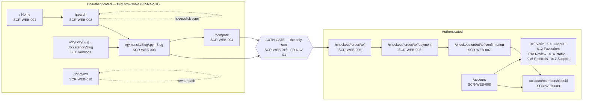
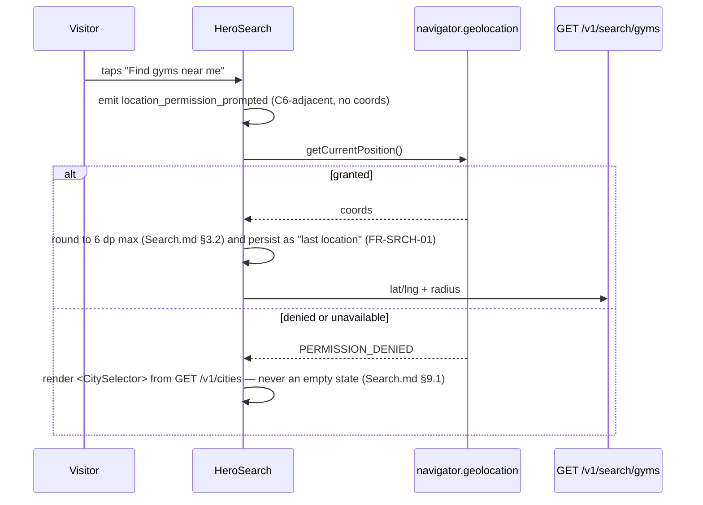
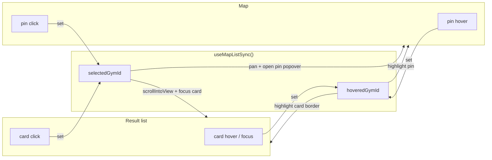
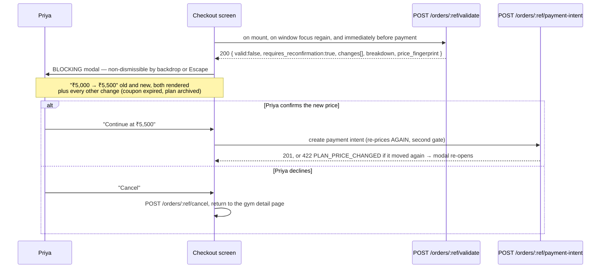
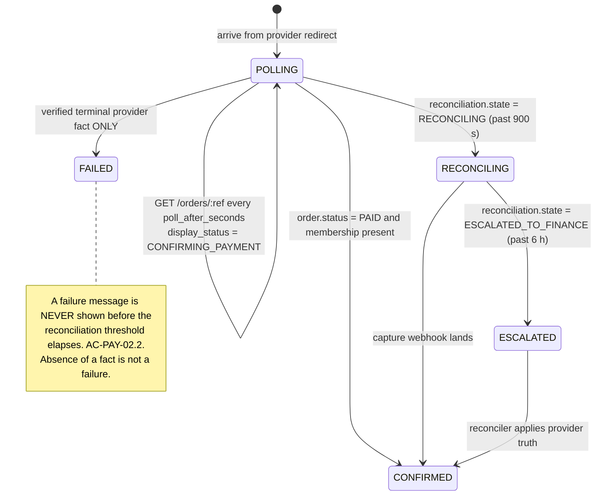

# `UI-WEB` — Customer Marketplace Website: the complete screen specification

**Surface:** `web` · **App:** `apps/customer-web` · **Stack:** Next.js 14 App Router · React 18 ·
TypeScript · TailwindCSS · shadcn/ui copied into `packages/ui` · TanStack Query · React Hook Form +
Zod · **Launch market:** India (`LAUNCH_MARKET_INDIA.md`) · **Accessibility floor:** WCAG 2.1
**Level AA** (`NFR-USE-01`) · **Status:** specification frozen, **no component code exists**.

> **Every fenced block in this document is labelled `illustrative — not committed code`.** JSX
> sketches, Tailwind class strings, Zod schemas and query-key factories here are the *specification*
> expressed in the notation the implementation will use. They are not the implementation, and a
> reviewer must not copy them verbatim expecting them to compile.

---

## 0. Document control

| Aspect | Value |
| :--- | :--- |
| **Owns** | The eighteen `SCR-WEB-001` … `SCR-WEB-018` screens of `MASTER_PRD.md` §B6, in per-screen detail: purpose, route, rendering strategy, layout, components, hooks, four states, actions, analytics, accessibility, responsive behaviour |
| **Governing law** | `PROJECT_CONSTITUTION.md` **§16 Frontend Rules** (NX1–NX9, DQ1–DQ7, LC1–LC8, FM1–FM8, UI1–UI7, BL1–BL7, AX1–AX9, I18N1–I18N6, FP1–FP6). Nothing here may contradict it |
| **Product source** | `MASTER_PRD.md` §B2 (personas), §B3.2 (permission matrix), §B4.1 (information architecture), §B4.4 (navigation rules), §B5.6–§B5.13 + §B5.16–§B5.23 (module FRs, US, AC), §B6 (screen table), §B9.6 (usability NFRs), §C6 (analytics taxonomy) |
| **Contract source** | `docs/apis/README.md` (contract law: error envelope §9.1, status codes §9.2, idempotency §6, pagination §7, money §11, time §12) and the nine domain files. **Screens consume these exact response shapes** |
| **Placement source** | `docs/engineering/FolderStructure.md` §4 and §4.1 — `app/` is routing only (**F1**); all real code is in `src/features/**` |
| **Sibling documents** | `docs/ui/DesignSystem.md` (tokens, typography, spacing, icons — `UI7`), `docs/ui/GymDashboard.md`, `docs/ui/AdminConsole.md` |
| **Not owned here** | Token values, the component primitive inventory, the colour ramp and the contrast proofs — all `DesignSystem.md`. The API contracts themselves — `docs/apis/`. The check-in **desk** (`SCR-DASH-009`) — `GymDashboard.md` |

### 0.1 Precedence

`PROJECT_CONSTITUTION.md` → `MASTER_PRD.md` → `docs/apis/**` → `docs/ui/DesignSystem.md` → this
document. Where this document is more specific and does not contradict a higher one, the more
specific text governs. A genuine contradiction is recorded in §33, not silently resolved.

### 0.2 The five sentences this document exists to enforce

1. **Every screen has four states.** `B6`'s preamble: *"the empty, loading, error and
   permission-denied cases are where implementations diverge from intent."*
2. **The client never computes money, eligibility, dates-with-meaning or entitlement.** `BL2`,
   `BL3`, `BL4`. It renders server figures and formats them for India.
3. **The auth gate is at select-plan → checkout and nowhere earlier** (`FR-NAV-01`), and after auth
   the user lands back on the exact point of interruption (`FR-NAV-02`).
4. **A polled figure always shows when it was last updated.** `LC5`: *"a stale figure presented as
   live is a defect."*
5. **Client-side hiding is presentation, never a control** (`FR-RBAC-02`). Every guarded action is
   refused again by the server.

---

## 1. The surface in one picture



**Reading the picture.** Everything left of the gate is server-rendered, indexable and usable with
no account. The gate is crossed exactly once, at `POST /v1/orders` — which is the first endpoint on
the customer surface requiring `access` auth *and* a verified mobile (`FR-AUTH-02`). Favouriting
(`FR-FAV-03`) and reviewing (`FR-REV-01`) also require an account, but they raise the *same* gate
component with a different return destination; they do not introduce a second one.

---

## 2. Rendering strategy — which route renders where, and why

`NX1`: server components are the default; `'use client'` is opt-in at the smallest leaf. `NX2` names
the SEO-critical set. This table is the complete `B4.1` route list resolved against those rules.

| Route (`B4.1`) | Screen | Strategy | Revalidate | Why this and not another |
| :--- | :--- | :--- | :--- | :--- |
| `/` | `SCR-WEB-001` | **SSR** with a static shell; `PopularNearYou` is a client island | `revalidate: 300` on the static half | Hero, categories, trust strip and footer are identical for everyone and must be in the first HTML for LCP (`NFR-PERF-02`). "Popular near you" depends on IP or stored location, so it hydrates |
| `/search` | `SCR-WEB-002` | **Client-fetched inside an RSC shell** | `no-store` | Results are a function of ten filters, a sort, a cursor and a live location. Server-rendering a personalised, high-cardinality result set would be uncacheable and would still need a client refetch on the first filter tap. `X-Robots-Tag: noindex,follow` — the indexable equivalents are the city and category landings |
| `/city/:citySlug` | landing (`FR-SRCH-13`) | **SSG + ISR** | `revalidate: 3600` | Finite, low-cardinality, high-value for organic search. `GET /v1/cities` supplies the build-time param list |
| `/c/:categorySlug` | landing (`FR-SRCH-13`) | **SSG + ISR** | `revalidate: 3600` | Same reasoning; `GET /v1/categories` supplies the params |
| `/gyms/:citySlug/:gymSlug` | `SCR-WEB-003` | **SSR** (`CDN-300` at the edge) | `s-maxage=300, stale-while-revalidate=60` | `NX2` and `FR-DETL-10` require the JSON-LD in the first response. `BR-PLN-03` forbids serving a stale price as a purchasable one, so a long static TTL is not available — the contract's own `Cache-Control` from `Marketplace.md` §5.2 is mirrored exactly |
| `/gyms/:citySlug/:gymSlug/reviews` | `SCR-WEB-003` overflow (`FR-DETL-05`) | **SSR** first page, client for pages 2+ | as above | Page 1 is indexable content; deeper pages are `rel=next` and cursor-paged client-side |
| `/gyms/:citySlug/:gymSlug/plans` | `SCR-WEB-003` overflow (`FR-DETL-02`) | **SSR** | as above | Plans carry `Offer` structured data; they belong in HTML |
| `/compare` | `SCR-WEB-004` | **Client**, RSC shell only | `no-store` | The comparison set is user state (`FR-DETL-09`), never indexable. `noindex,follow` |
| `/checkout/:orderRef` | `SCR-WEB-005` | **Client** under an auth boundary | `private, no-store` | Every figure is `NO-STORE!` per `Membership.md` §7.1. `noindex,nofollow` |
| `/checkout/:orderRef/payment` | `SCR-WEB-006` | **Client** | `private, no-store` | Holds the provider element and the poll loop |
| `/checkout/:orderRef/confirmation` | `SCR-WEB-007` | **Client** | `private, no-store` | Polls `GET /v1/orders/:orderRef` for server-confirmed state (`BR-PAY-02`) |
| `/account`, `/account/**` | `SCR-WEB-008` … `017` | **Client** under a shared authenticated RSC layout | `private, no-store` | Personal data; `noindex,nofollow` on the whole subtree |
| `/auth/{login,register,verify,forgot,reset}` | `SCR-WEB-016` | **Client** | `no-store` | Form state and OTP timers. `noindex,nofollow` |
| `/for-gyms` | `SCR-WEB-018` | **SSG** | `revalidate: 86400` | Pure marketing; no personalisation. Highest-value organic page for `OBJ-01` supply acquisition |
| `/for-gyms/signup` | owner registration | **Client** | `no-store` | Form |
| `/legal/{terms,privacy,refunds}` | legal | **SSG** | `revalidate: 86400` | Static content; must be crawlable and linkable from checkout |

**One rule the table encodes.** A route is SSR or SSG **if and only if** its content is the same for
every anonymous visitor and is worth indexing. Everything else is a client render inside a server
shell, so that `app/` stays routing-only (`F1`) and the shell still contributes the `<head>`, the
skip link and the layout skeleton to the first paint.

---

## 3. The four mandatory states — one contract, eighteen applications

`PROJECT_CONSTITUTION.md` §16.9 makes this a merge gate. Each screen section below fills in this
table; this section fixes the vocabulary so eighteen sections do not invent eighteen dialects.

| State | Trigger | Non-negotiable requirement | Shared component |
| :--- | :--- | :--- | :--- |
| **Loading** | `query.isPending` on first mount, or a suspended RSC boundary | A **skeleton matching the eventual layout**, same box count, same heights, same gaps. Never a centred spinner over blank space. Never a layout shift when data lands (`FP4`: explicit image dimensions). Affordances that do not depend on the data stay interactive — `SCR-WEB-001`: *"the search bar is interactive immediately"* | `<Skeleton variant=… />` from `packages/ui` |
| **Empty** | `200` with an empty collection | Says **why** it is empty and offers the next action. A bare "No results" is a defect. Where the API supplies guidance (`zero_result_guidance`, `alternatives`), the client renders the server's guidance rather than inventing its own | `<EmptyState icon title body action />` |
| **Error** | Any non-2xx, or a network failure | `NFR-USE-05`: **what happened, why, what to do next** — never a code alone. The `correlation_id` is shown for `500`/`503` only (`EV6`). Retry affordance. Last successful data retained where possible. Non-critical regions degrade to hidden rather than blocking the page | `<ErrorState code message onRetry correlationId? />` |
| **Permission-denied** | `401`, `403`, or a `404` that is `README.md` §5.4's not-yours-so-not-disclosed | Explains that this needs an account or a capability the user lacks, and what to do. **Never a blank page and never a silent redirect.** `401` → sign-in with `returnTo` preserved (`FR-NAV-02`). `403` → explanatory panel. `404` → not-found with a route back into discovery | `<AuthRequired returnTo />` / `<PermissionDenied capability />` |

### 3.1 Mapping HTTP status to state, once, for every screen

`README.md` §9.2 fixes seventeen status codes. The client maps them to states in **one** place —
`src/shared/api/problem-details.ts` — so no screen re-decides.

| Status | Client state | Copy obligation | Retry offered |
| :-: | :--- | :--- | :-: |
| `200` + empty collection | Empty | Screen-specific "why", from §3 | n/a |
| `200` + `valid:false` / `eligible:false` / denial | **Domain state, not an error** (`README.md` §9.4) | Render the server's `message`/`reason` verbatim through i18n | n/a |
| `304` | Cached render | Silent | n/a |
| `400 VALIDATION_FAILED` | Inline field errors | `details[]` mapped onto RHF fields by `field` name (`FM5`) — never a toast | Yes, after correction |
| `401 UNAUTHENTICATED` / `ACCESS_TOKEN_EXPIRED` | Permission-denied → auth | Silent refresh first; only if refresh fails, `<AuthRequired>` with `returnTo` | Automatic once |
| `403 PERMISSION_DENIED` | Permission-denied | Names the capability in user language and who has it | **No** |
| `403 PHONE_NOT_VERIFIED` | Permission-denied (recoverable) | Deep-links to phone verification and returns (`FR-AUTH-02`) | Yes, after verification |
| `404 RESOURCE_NOT_FOUND` | Not-found | Never discloses whether the resource exists elsewhere (`README.md` §5.4) | No |
| `409 IDEMPOTENT_REQUEST_IN_PROGRESS` | Loading (continued) | "Still processing — one moment", honours `Retry-After` | Automatic |
| `409` (other) | Error, specific | State the conflict concretely | Per code |
| `410 ORDER_EXPIRED` | Domain state | "This order expired. Start again — we will re-check prices." Offers a fresh order | Yes, new resource |
| `413` / `415` | Inline field error on the file input | States the limit and the accepted types | Yes |
| `422` | Domain state, inline or blocking per screen | The server's message is authoritative; the client adds the action | Per code |
| `429 RATE_LIMIT_EXCEEDED` | Error with countdown | Reads `Retry-After`; renders a live countdown, disables the trigger | Automatic at zero |
| `500 INTERNAL_ERROR` | Error | Never "unexpected error" (`EV7`). Shows the `correlation_id` and a support path (`EV6`) | Yes, backoff |
| `503 DEPENDENCY_UNAVAILABLE` | Error, degraded region | Degrade the region; keep the page. `AC-SRCH-02.3` is the canonical case | Yes, backoff |

### 3.2 The one thing the client must never do with an error

Convert a `200`-with-a-negative-result into an error UI. `README.md` §9.4: *"a denial is a `200`."*
`POST /v1/orders/:orderRef/validate` returning `valid:false`, `GET /v1/gyms/:slug/reviews/eligibility`
returning `eligible:false`, and a zero-result search are **all successful evaluations**. Rendering
them through `<ErrorState>` would tell Priya something broke when nothing did.

---

## 4. Cross-cutting laws every screen inherits

### 4.1 Data access

| Law | Statement | Source |
| :--- | :--- | :--- |
| **DQ1** | Every client read is a TanStack Query hook in the feature's `api/*.queries.ts`. A bare `fetch` in a component is a review rejection | `§16.2` |
| **DQ2** | Every client write is a `useMutation` in `api/*.mutations.ts`, which attaches the `Idempotency-Key` where `README.md` §6.1 requires it and performs invalidation | `§16.2` |
| **DQ3** | Keys come from a per-feature factory. `checkoutKeys.order(orderRef)`, `gymKeys.detail(citySlug, gymSlug)`, `membershipKeys.detail(id)` — never an inline array | `§16.2` |
| **DQ6** | Optimistic updates are permitted **only** on favourite-toggle and notification-read. They are **forbidden** on anything money- or membership-state-affecting | `§16.2` |
| **NX3** | A server component never imports a query hook. It fetches through the typed server client and passes plain data, hydrated across an explicit `dehydrate`/`HydrationBoundary` | `§16.1` |
| **F8** | Only `api/` may import `src/shared/api`. A component that fetches is a rejection | `FolderStructure.md` §4.1 |

**Query-class defaults**, set once in `src/shared/query/client.ts` (`DQ5`):

| Class | `staleTime` | `gcTime` | Refetch on focus | Retry | Members |
| :--- | ---: | ---: | :-: | :-: | :--- |
| `reference` | 24 h | 48 h | No | 2 | `/v1/cities`, `/v1/categories`, `/v1/amenities`, `/v1/help/articles` |
| `catalogue` | 5 min | 30 min | No | 2 | `/v1/gyms/:slug`, `/v1/gyms/:slug/plans`, `/v1/gyms/:slug/similar`, `/v1/gyms/:slug/reviews` |
| `search` | 60 s | 5 min | No | 1 | `/v1/search/gyms`, `/v1/search/suggest` |
| `member` | 30 s | 10 min | **Yes** | 2 | `/v1/me/**`, `/v1/support/**` |
| `financial` | 0 | 2 min | **Yes** | 2 | `/v1/orders/**`, `/v1/payments/**`, `/v1/me/invoices` |
| `token` | 0 | 0 | n/a | 0 | `POST /v1/me/memberships/:id/qr` — never cached, never retried silently |

### 4.2 Forms

`FM1`–`FM8`. Every form on this surface is React Hook Form + `zodResolver`, with the schema
re-exported from `@gymmap/types` so client and server cannot drift (`FM2`, `A-02`). The complete
form inventory on `web`:

| Form | Screen | Schema | Idempotency |
| :--- | :--- | :--- | :-: |
| Search bar + filter rail | `SCR-WEB-002` | `searchQuerySchema` (mirrors `Search.md` §3.2) | n/a |
| Coupon field | `SCR-WEB-005` | `applyCouponSchema` | ✅ OPT |
| Checkout submit | `SCR-WEB-005` | `createOrderSchema` — **no monetary field exists in it** (`FM8`) | ✅ REQUIRED |
| Review compose | `SCR-WEB-013` | `createReviewSchema` (20–2,000 chars) | ✅ REQUIRED |
| Profile edit | `SCR-WEB-014` | `patchMeSchema` | OPT |
| Preferences matrix | `SCR-WEB-014` | `putPreferencesSchema` | OPT |
| Auth: request OTP / verify / register / login / forgot / reset | `SCR-WEB-016` | six schemas from `Authentication.md` §8 | OPT |
| Support ticket + message | `SCR-WEB-017` | `createTicketSchema` (subject 8–160, body 20–8,000) | OPT, always sent |
| Report a gym | `SCR-WEB-003` | `reportGymSchema` | OPT |
| Launch-notification email capture | `SCR-WEB-001` empty state | `notifyMeSchema` | OPT |

### 4.3 Money, dates, phone and PIN — India, formatted client-side only

`BL2` forbids arithmetic in a component; `I18N4` forbids concatenation. Everything below is a
*formatting* operation on a server-supplied value, performed by one function in
`@gymmap/utils` and re-exported through `src/shared/money/`.

| Value | Wire form | Rendered | Rule |
| :--- | :--- | :--- | :--- |
| Any amount | `"250000"` string of paise + adjacent `"currency": "INR"` (`README.md` §11 M1/M2) | **₹2,50,000** | Symbol **before** the number, no space. **Lakh-crore grouping** — 2,50,000 not 250,000 (`LAUNCH_MARKET_INDIA.md` §2). `Intl.NumberFormat('en-IN', { style:'currency', currency:'INR', maximumFractionDigits: 0 })` behind `formatMoney(minor, currency)`. Paise shown only when non-zero |
| Monthly equivalent | `monthly_equivalent_minor` + `monthly_equivalent_basis` | "₹1,899/month" or "≈ ₹1,899/month" | `NORMALISED` basis renders the **≈**; `EXACT` does not; `NOT_APPLICABLE` renders the session terms instead (`Marketplace.md` §4.3) |
| Tax | `tax_components[]` | Two lines: "CGST 9% ₹360" and "SGST 9% ₹360" | `LAUNCH_MARKET_INDIA.md` §4 — never one combined 18% line. An unknown `component` renders with its own label (open enum, `V6`) |
| Instant | ISO-8601 UTC `Z` | `06 Aug 2026, 3:42 pm` | Converted to `Asia/Kolkata` (**+05:30**, no DST) for display, never for logic |
| Business date | `YYYY-MM-DD` + a stated timezone | `01 Sep 2026` | **DD MMM YYYY**. Never reinterpreted through the browser's zone — `2026-09-01` in gym time is not `2026-08-31T18:30Z` rendered locally |
| Days remaining | `days_remaining` integer | "86 days left" | **Server-computed** in the gym's timezone (`BL4`, `BR-MEM-03`). The client never subtracts two dates |
| Phone | `+919876543210` | `+91 98765 43210` | Input mask accepts 10 digits starting **6–9**; a bare 10-digit value is normalised to `+91…` before submit, never guessed by the server (`Authentication.md` §8.1) |
| PIN code | `"400053"` | `400053` | 6 digits, `^[1-9][0-9]{5}$` — first digit never zero |
| Distance | `distance_m` integer metres | `1.8 km` / `840 m` | Below 1,000 m in metres rounded to 10; above in km to one decimal. **Absent** when `location.precision` is `CITY` — the UI omits the row rather than printing a meaningless figure (`Search.md` §3.6) |

### 4.4 Internationalisation

`I18N1`: no user-facing string literal in any component. Keys are namespaced `web.<feature>.<key>`
(`I18N2`). The launch catalogue is `en-IN` only (`ASM-07`), and `I18N5` fails CI on a hard-coded
string in `apps/**` or a key referenced but absent from the catalogue.

| Namespace | Owns |
| :--- | :--- |
| `web.common.*` | Buttons, states, the four state components, pagination, the money and date formatters' unit labels |
| `web.home.*` · `web.search.*` · `web.gym.*` · `web.compare.*` | `SCR-WEB-001` … `004` |
| `web.checkout.*` · `web.payment.*` · `web.confirmation.*` | `SCR-WEB-005` … `007` |
| `web.account.*` · `web.membership.*` · `web.visits.*` · `web.orders.*` · `web.favourites.*` | `SCR-WEB-008` … `012` |
| `web.review.*` · `web.profile.*` · `web.referrals.*` · `web.auth.*` · `web.support.*` · `web.forgyms.*` | `SCR-WEB-013` … `018` |
| `errors.*` | Mirrors the `README.md` §9.5 registry code names one-to-one, so `EV3`'s server message and the client fallback cannot diverge |

### 4.5 Analytics

`C6`. Events carry `event_name`, `timestamp`, `anonymous_id`, `user_id` if known, `session_id`,
`surface: "web"`, `properties`. **Personal data is never a property** (`BR-DAT-06`), and latitude and
longitude are precision-reduced before emission (`Search.md` §11.4). Emission is fire-and-forget and
**never blocks a render or a navigation**. All emitters live in `src/shared/analytics/`; a component
calls a typed emitter, never a vendor SDK.

### 4.6 Performance budget

| Budget | Value | Enforcement |
| :--- | ---: | :--- |
| Initial JS, customer site | **≤ 200 KB gzipped** | `size-limit` in CI fails the build (`FP1`, `NFR-PERF-10`, `A-29`) |
| LCP on gym detail, 4G | **≤ 2.5 s** | RUM field data (`FP2`, `NFR-PERF-02`) |
| Dynamically imported at point of use | map library, `@zxing/browser`, charting, the QR renderer | `FP3` |
| Images | CDN renditions (`thumb_320`, `card_640`, `hero_1600`), modern formats, explicit `width`/`height` | `FP4` |

---

## 5. The auth gate and state restoration — `FR-NAV-01`, `FR-NAV-02`, `NX5`, `NX6`

### 5.1 Where the gate is, and where it is not

| Action | Gate? | Endpoint that decides | Note |
| :--- | :-: | :--- | :--- |
| Browse home, search, detail, compare, city and category landings, reviews, plans, `/for-gyms`, legal | **No** | All `@Public()` | `FR-NAV-01`. `B3.2`: *Browse marketplace* and *View plan prices* are ● for `VISITOR` |
| **"Buy now" on a plan → checkout** | **YES — the gate** | `POST /v1/orders` requires `access` + `ordering.order.create` + a **verified mobile** (`FR-AUTH-02`) | `B3.2`: *Purchase membership* is — for `VISITOR`, ● for `USER`/`MEMBER` |
| Favourite a gym | Yes, same component, different return | `POST /v1/me/favourites/:gymId` | `FR-FAV-03`, `AC-FAV-01.1`. `B3.2`: *Save favourites* is — for `VISITOR` |
| Compare gyms | **No** | `POST /v1/compare` is public | `B3.2`: *Compare gyms* is ● for `VISITOR`. The set persists locally and merges on login (`FR-DETL-09`) |
| Write a review | Yes, plus server eligibility | `GET /v1/gyms/:slug/reviews/eligibility` | `B3.2`: *Submit review* is ▪ for `MEMBER` only |
| Anything under `/account` | Yes, at the layout boundary | Various `/v1/me/**` | A deep link resolves after auth (`FR-NAV-06`) |

### 5.2 What is preserved, and where it lives

`NX6`: *"that state lives in the URL and in server-persisted state, never only in memory."*

| State | Storage | Restored by |
| :--- | :--- | :--- |
| Search location, query, all ten filters, sort, cursor page | **URL query string** (`NX7`, `AC-SRCH-01.3`) | The router. Rebuilt from `applied_filters` echo, not from what the client thinks it sent (`Search.md` §3.5) |
| Comparison set (≤ 4 gym ids) | URL on `/compare`; `localStorage` mirror keyed `gymmap.compare.v1` for cross-page persistence; merged into the account on login | `FR-DETL-09`, `AC-DETL-01.3` |
| Selected plan at the gate | `returnTo` URL carries `?plan=<plan_id>&branch=<branch_id>&start=<YYYY-MM-DD>` | `FR-CART-08` |
| Pending favourite at the gate | `returnTo` plus `?pendingFavourite=<gym_id>`; replayed as a mutation once the session exists | `AC-FAV-01.1` |
| Checkout order | **Server** — the `orderRef` is in the path | `GET /v1/orders/:orderRef` |
| Draft review text | Session storage keyed by gym slug, cleared on successful submit | Protects an 800-word draft from a token refresh |

`returnTo` is validated against a same-origin allowlist of known route patterns before navigation.
An unrecognised or absolute-external `returnTo` falls back to `/account`. An open redirect on the
auth path is a security defect, not a UX inconvenience.

```tsx
// illustrative — not committed code
// src/features/auth/components/AuthGate.tsx
export function AuthGate({ children, intent, returnTo }: AuthGateProps) {
  const { status } = useSession();                       // shared/auth, httpOnly refresh (ADR-0011)
  if (status === 'authenticated') return <>{children}</>;
  if (status === 'loading')       return <Skeleton variant="gate" />;
  return (
    <AuthRequired
      titleKey={`web.auth.gate.${intent}.title`}          // I18N1 — key, never a literal
      bodyKey={`web.auth.gate.${intent}.body`}
      returnTo={safeReturnTo(returnTo)}                   // same-origin allowlist
    />
  );
}
```

### 5.3 The gate's own four states

| State | Behaviour |
| :--- | :--- |
| Loading | Session probe in flight → a skeleton the exact height of the panel it replaces. No flash of the signed-out panel for an authenticated user |
| Empty | n/a — a gate is never empty |
| Error | Session probe failed (`503`) → treat as unauthenticated **and say so**: "We couldn't check whether you're signed in. Sign in to continue." Never assume authenticated |
| Permission-denied | Authenticated but `403 PHONE_NOT_VERIFIED` → an inline verification step, not a redirect out of checkout (`FR-AUTH-02`) |

---

## 6. `SCR-WEB-001` — Home

| Aspect | Specification |
| :--- | :--- |
| **Purpose** | `B6`: establish location, communicate the value proposition, and route to search **within one interaction** |
| **Route** | `/` (`B4.1`) |
| **Rendering** | **SSR** shell with `revalidate: 300`; three client islands: `<HeroSearch>`, `<PopularNearYou>`, `<TrustStrip>`. The hero markup, the category tiles, "How it works", the "List your gym" band and the footer are server-rendered and in the first byte, because they are the LCP candidates and are identical for every visitor |
| **Feature folder** | `src/features/discovery/` (search bar, suggest) + `src/features/gym-detail/` (`GymResultCard`) |
| **Persona** | Priya (`B2.2`) — *"price is never hidden behind a call-to-action"* |

### 6.1 Layout regions (`B6` enumerates eight)

```text
320 px                        768 px                              1280 px
┌──────────────┐   ┌────────────────────────┐   ┌────────────────────────────────────────┐
│ ▤ logo    ≡  │   │ ▤ logo   nav      Sign │   │ ▤ logo    nav links          Sign in   │
├──────────────┤   ├────────────────────────┤   ├────────────────────────────────────────┤
│  HEADLINE    │   │       HEADLINE         │   │  HEADLINE                  ┌─────────┐ │
│  sub         │   │       sub-headline     │   │  sub-headline              │  hero   │ │
│ ┌──────────┐ │   │ ┌────────────────────┐ │   │ ┌────────────────────────┐ │  image  │ │
│ │ location │ │   │ │ location │  query  │ │   │ │ location │ query │ GO  │ │ (LCP)   │ │
│ ├──────────┤ │   │ ├────────────────────┤ │   │ └────────────────────────┘ └─────────┘ │
│ │  query   │ │   │ │  Find gyms near me │ │   │  [Find gyms near me]  ← contextual geo │
│ ├──────────┤ │   │ └────────────────────┘ │   ├────────────────────────────────────────┤
│ │ Find gyms│ │   ├────────────────────────┤   │ POPULAR NEAR YOU                       │
│ │ near me  │ │   │ POPULAR NEAR YOU       │   │ ┌────┐┌────┐┌────┐┌────┐               │
│ └──────────┘ │   │ ┌──────┐┌──────┐  →    │   │ │card││card││card││card│  (8, 4-up)    │
├──────────────┤   │ │ card ││ card │       │   │ └────┘└────┘└────┘└────┘               │
│ POPULAR      │   │ └──────┘└──────┘       │   │ ┌────┐┌────┐┌────┐┌────┐               │
│ ┌──────────┐ │   ├────────────────────────┤   │ └────┘└────┘└────┘└────┘               │
│ │  card    │ │   │ CATEGORY TILES  3-up   │   ├────────────────────────────────────────┤
│ └──────────┘ │   ├────────────────────────┤   │ CATEGORY TILES  6-up                   │
│ (h-scroll)   │   │ HOW IT WORKS  3 steps  │   ├────────────────────────────────────────┤
├──────────────┤   ├────────────────────────┤   │ HOW IT WORKS 3 · TRUST STRIP           │
│ CATEGORIES   │   │ TRUST · FEATURED       │   ├────────────────────────────────────────┤
│  2-up grid   │   ├────────────────────────┤   │ FEATURED (labelled "Promoted")         │
├──────────────┤   │ LIST YOUR GYM band     │   ├────────────────────────────────────────┤
│ …            │   │ FOOTER                 │   │ LIST YOUR GYM band · FOOTER            │
└──────────────┘   └────────────────────────┘   └────────────────────────────────────────┘
```

| # | Region | Component | Data |
| :-: | :--- | :--- | :--- |
| 1 | Hero with search | `<HeroSearch>` (client) — `<LocationField>` + `<QueryField>` + `<PrimaryCta>` | `GET /v1/search/suggest` on keystroke ≥ 2 chars, 150 ms debounce |
| 2 | Popular near you — 8 cards | `<PopularNearYou>` → 8 × `<GymResultCard>` | `GET /v1/search/gyms?radius_m=5000&limit=8&sort=relevance` |
| 3 | Category tiles ×6 | `<CategoryTileGrid>` — 24-hour, women-only, budget, premium, CrossFit, yoga | `GET /v1/categories` (reference class, 24 h stale) |
| 4 | How it works — 3 steps | `<HowItWorks>` (server, static) | none |
| 5 | Trust strip | `<TrustStrip>` — verified gyms, members, cities | Platform counters endpoint; **degrades to hidden** on failure |
| 6 | Featured gyms | `<FeaturedRail>` → `<GymResultCard is_featured>` | Same search call; cards carry `is_featured: true` and **must render the "Promoted" label** (`FR-SRCH-11`) |
| 7 | "List your gym" band | `<ForGymsBand>` (server, static) → `/for-gyms` | none |
| 8 | Footer | `<SiteFooter>` (server) — legal links, city directory for internal linking | `GET /v1/cities` at build |

### 6.2 Hooks

```ts
// illustrative — not committed code
// src/features/discovery/api/discovery.queries.ts
export const discoveryKeys = {
  all:      ['discovery'] as const,
  suggest:  (q: string, near?: LatLng) => [...discoveryKeys.all, 'suggest', q, near] as const,
  popular:  (near: LatLng)             => [...discoveryKeys.all, 'popular', near] as const,
  search:   (params: SearchParams)     => [...discoveryKeys.all, 'search', params] as const,
};
export function useSuggest(q: string, near?: LatLng) { /* GET /v1/search/suggest · enabled: q.length >= 2 */ }
export function usePopularNearYou(near: LatLng)      { /* GET /v1/search/gyms · radius 5 km · limit 8 */ }
```

### 6.3 The four states

| State | Specification |
| :--- | :--- |
| **Loading** | Eight `<GymResultCard.Skeleton>` at the exact card dimensions (4:3 media box, two text bars, a chip row) so nothing shifts. Category tiles render immediately from the reference cache. **The search bar is interactive from the first paint and is never blocked by content loading** (`B6` Notes). Trust counters render as three dash placeholders, not zeros |
| **Empty** — no gyms in the area | `<EmptyState>` "We're not in \<city\> yet" + an email capture for launch notification + a link to the **nearest served city**, taken from `CITY_NOT_SERVED`'s payload (`Search.md` §9.2). Never a bare empty rail |
| **Error** | `B6`: *"Static content renders; dynamic strips degrade to hidden with no error dialog."* A failed `search/gyms` hides regions 2 and 6 entirely; a failed counters call hides region 5. **No toast, no modal, no error boundary trip.** The page remains a usable entry to search |
| **Permission-denied** | Not reachable — every endpoint on this screen is `@Public()`. Specified explicitly so no implementer invents one |

### 6.4 Location: contextual, never on load

`B6` Notes is binding: **location permission is requested contextually on the CTA, never on page
load.** The sequence:



On load the screen uses, in order: the persisted last location (`FR-SRCH-01`), then coarse IP
resolution server-side, then nothing — and "nothing" renders the city selector, not a prompt.

### 6.5 Actions, analytics, accessibility, responsive

| Action | Result | Event (`C6`) |
| :--- | :--- | :--- |
| Submit search | Navigate to `/search?…` with the full URL state | `search_performed` — query, precision-reduced lat/lng, radius, filters, sort, result_count |
| Select a suggestion of type `GYM` | Navigate **straight to detail**, skipping search | `gym_detail_viewed` with `source: "direct"` |
| Select a category tile | Navigate to `/c/:categorySlug` | `search_performed` with `category_slug` |
| Open a card | Navigate to detail | `search_result_clicked` — gym_id, position, is_featured |
| Tap "Find gyms near me" | Contextual geolocation prompt (§6.4) | — |
| Tap "List your gym" | `/for-gyms` | `owner_signup_started` with `source: "home_band"` |

**Accessibility (AA).** One `<h1>`; regions are `<section>` with `aria-labelledby`. The suggest
listbox is a WAI-ARIA combobox: `role="combobox"`, `aria-expanded`, `aria-controls`,
`aria-activedescendant`; ↑/↓ move, Enter selects, Escape closes and returns focus to the input.
Results-count changes announce through a polite live region. The hero image carries an empty `alt`
because it is decorative; every gym cover carries the API's `alt` text. Skip link to `#main` is the
first focusable element (`layout.tsx`). All targets ≥ 44×44 px (`NFR-USE-03`). Contrast ≥ 4.5:1 text
and ≥ 3:1 interactive, guaranteed by the token palette rather than per-component choices (`AX4`).

**Responsive (`NFR-USE-07`, 320 → 2560 px, no horizontal scroll).**

| Width | Behaviour |
| :--- | :--- |
| **320** | Single column. Search fields stack vertically; CTA full-width, 48 px tall. Popular rail is a horizontally scrolling flex row **inside its own container** with `overflow-x:auto` and scroll-snap — the page body never scrolls sideways. Categories 2-up |
| **768** | Location and query share a row; CTA below. Popular 2-up grid with a "See all" link. Categories 3-up. Trust strip inline |
| **1280** | Hero is two columns with the image right. Search is one row of three. Popular 4-up × 2 rows = the 8 cards `B6` specifies. Categories 6-up. Content max-width 1280 px, centred, with the gutter growing to 2560 px |

---

## 7. `SCR-WEB-002` — Search Results

**The hardest screen on this surface.** Three synchronised regions, ten filters each showing a live
count before it is tapped, a URL that is the single source of truth, and a map that may be absent
without the page degrading.

| Aspect | Specification |
| :--- | :--- |
| **Purpose** | `B6`: narrow many gyms to a shortlist |
| **Route** | `/search` (`B4.1`), with every parameter of `Search.md` §3.2 in the query string |
| **Rendering** | RSC shell (header, filter-rail scaffolding, skeletons) + **client-fetched results**. `noindex,follow` — the indexable equivalents are `/city/:citySlug` and `/c/:categorySlug` (`FR-SRCH-13`), which render the same `<GymResultCard>` from the same shared schema |
| **Feature folder** | `src/features/discovery/` |
| **Primary endpoint** | `GET /v1/search/gyms` (`Search.md` §3) — public, `RL-SEARCH`, `public, max-age=60, stale-while-revalidate=120` |
| **Supporting** | `GET /v1/search/suggest`, `GET /v1/amenities`, `GET /v1/cities`, `GET /v1/me/favourites` (hydrates `is_favourited`, which the search response deliberately returns as `null` — `Search.md` §3.6) |

### 7.1 Layout

```text
1280 px and above
┌──────────────────────────────────────────────────────────────────────────────────────────┐
│ header: [◂ logo] [ location │ query ]  [Sign in]                                          │
├────────────────────┬────────────────────────────────────┬────────────────────────────────┤
│ FILTER RAIL sticky │ RESULT LIST                        │ MAP  sticky, 40% width         │
│ (280 px)           │ ┌────────────────────────────────┐ │ ┌────────────────────────────┐ │
│                    │ │ 47 gyms near Indiranagar       │ │ │      ○ 14                  │ │
│ Distance   ◉──── 3km│ │ Sort: [Relevance ▾]  updated 4s│ │ │   ₹1,899  ●hovered         │ │
│ Price   ₹0 ─── ₹5k │ ├────────────────────────────────┤ │ │        ₹2,450              │ │
│ Amenities  (search)│ │ ┌────┐ Iron Works Gym    ♥ ☐   │ │ │  ○ 6      ₹1,650           │ │
│  ☐ Parking     23  │ │ │4:3 │ ✔ Verified · 1.8 km     │ │ │                            │ │
│  ☐ Showers     31  │ │ │img │ ★4.3 (128) · Open · 22:00│ │ │  [Search this area]        │ │
│  ☐ AC          18  │ │ └────┘ from ₹1,899/month       │ │ │                            │ │
│  ☐ Pool         4  │ │        [Parking][Shower][AC]   │ │ └────────────────────────────┘ │
│ Rating   ★4+   12  │ ├────────────────────────────────┤ │                                │
│ ☐ Open now     29  │ │ … 19 more cards, infinite      │ │                                │
│ ☐ 24-hour       8  │ │   scroll + "Load more"         │ │                                │
│ Gender policy      │ └────────────────────────────────┘ │                                │
│ Plan durations     │                                    │                                │
│ ☐ Trial         7  ├────────────────────────────────────┴────────────────────────────────┤
│ ☐ Parking      23  │ SELECTION BAR (≥2 checked): "3 gyms selected"      [Compare] [Clear] │
│ [Clear all]        └─────────────────────────────────────────────────────────────────────┘
└────────────────────┘

768 px                                     320 px
┌───────────────────────────────────┐      ┌──────────────────────┐
│ [ location │ query ]              │      │ [ location │ query ] │
│ [Filters (3)]  [Sort ▾]  [Map ▦]  │      │ [Filters(3)][Sort][▦]│
├───────────────────────────────────┤      ├──────────────────────┤
│ ┌───────────────┐┌───────────────┐│      │ ┌──────────────────┐ │
│ │  card         ││  card         ││      │ │  card, full width│ │
│ └───────────────┘└───────────────┘│      │ └──────────────────┘ │
│  2-up grid, map behind the toggle │      │  1-up, filters and   │
│  as a full-screen sheet           │      │  map are sheets      │
└───────────────────────────────────┘      └──────────────────────┘
```

### 7.2 Components

| Component | Responsibility | Notes |
| :--- | :--- | :--- |
| `<SearchHeader>` | Location field + query field + suggest | Shares `<LocationField>` with `SCR-WEB-001` |
| `<FilterRail>` | The ten `FR-SRCH-03` filters, each with a facet count | Sticky, own scroll container, `<form>` with `role="search"` |
| `<FilterGroup>` ×10 | Distance slider, price range, amenity searchable multi-select, rating threshold, open-now, 24-hour, gender policy (multi, OR), plan durations (multi, OR), trial available, parking | Each option renders `label + count` from `facets` |
| `<AppliedFilterChips>` | Removable chips above the list mirroring the rail | Keyboard-removable; announces removal |
| `<SortControl>` | Relevance · distance · price low-high · rating · newest (`FR-SRCH-04`, allowlist `Search.md` §4.7) | A value outside the allowlist is impossible — it is a `<select>` of five |
| `<ResultList>` | Virtualised list, infinite scroll + explicit **"Load more"** fallback (`FR-SRCH-07`) | Cursor-paged; `next_cursor: null` is the only end signal |
| `<GymResultCard>` | The `Search.md` §3.6 `GymResultCard` — shared with `/similar`, `/cities/:slug`, `/categories/:slug`, `/me/favourites` | One schema, four endpoints; a change is reviewed as a change to four |
| `<ResultMap>` | Clustered pins, price labels at close zoom, hover/click sync, "Search this area" | **Dynamically imported** (`FP3`); never in the initial bundle |
| `<ComparisonSelectionBar>` | Appears at ≥ 2 checked; shows count and "Compare" | Max 4 (`FR-DETL-08`); the fifth prompts a removal (`AC-DETL-01.3`) |
| `<ZeroResultGuidance>` | Renders `zero_result_guidance` verbatim | §7.6 |
| `<MapUnavailableNotice>` | Replaces the map region when the provider is down | §7.7 |
| `<LastUpdatedIndicator>` | "updated 4s ago" beside the result count | The search list is **not** a polled figure, but `as_of` from the response is shown so a `stale-while-revalidate` render is never presented as fresh |

### 7.3 The URL is the state — `AC-SRCH-01.3`, `NX7`

Every filter, the location, the sort and the page live in the query string. Nothing that affects the
result set lives only in React state.

| URL parameter | Maps to | Notes |
| :--- | :--- | :--- |
| `lat`, `lng` | `Search.md` §3.2 `lat`/`lng` | **Max 6 dp** — more is a `400 COORDINATE_PRECISION_EXCEEDED`. The client truncates before it navigates |
| `city`, `pincode` | `city_slug`, `pincode` | Alternatives to `lat`/`lng`, not additive |
| `radius` | `radius_m` | 500…50,000 |
| `q` | `q` | ≤ 64 chars, trimmed |
| `amenity` (repeated) | `amenity_id` | ≤ 12, **AND** semantics |
| `priceMin`, `priceMax` | `price_min_minor`, `price_max_minor` | Paise. The slider renders rupees; the URL carries paise |
| `rating` | `rating_min` | Excludes gyms below the `BR-REV-07` floor — the rail says so in the option's helper text |
| `openNow`, `openAt`, `openOn` | same | Evaluated in `Asia/Kolkata` |
| `h24`, `trial`, `parking` | `twenty_four_hour`, `trial_available`, `parking` | Booleans, present-means-true |
| `gender` (repeated) | `gender_policy` | **OR** semantics — Priya wants women-only *or* scheduled (`B2.2`) |
| `duration` (repeated) | `plan_duration` | OR semantics |
| `sort` | `sort` | Five-value allowlist |
| `cursor` | `cursor` | Opaque; the client never parses it (`README.md` §7.2) |

**The echo rule.** After each response the client rewrites the URL from `applied_filters` — the
server's *resolved* view — not from what it believed it sent (`Search.md` §3.5). A `pincode` search
echoes with derived coordinates; an omitted `radius` echoes as `5000`. This is what stops a
server-side default change from silently desyncing the two. Navigation uses `router.replace` for
filter changes (so Back exits the search, not the last checkbox) and `router.push` for a new query
or a new location (so Back returns to the previous search).

### 7.4 Live filter counts — the requirement most often dropped

`B6`: *"Each filter shows a live result count."* `Search.md` §3.7 delivers it as `facets`, computed
**with the faceted dimension's own filter removed**, so an unselected amenity shows what would match
if only that constraint changed. Computing facets with all filters applied would show zero next to
every unselected option — technically true, completely useless.

| Rule | Client obligation |
| :--- | :--- |
| FC-1 | Every filter option renders its count from `facets`. An option whose count is absent renders **no number**, never `0` |
| FC-2 | A count of `0` renders and the option is **visually de-emphasised but still operable** — a user may want to see the zero-result guidance for it |
| FC-3 | Facets are cached separately by the server on a coarser key with a 300 s TTL (`Scalability.md` §6.4). The client therefore renders counts with `aria-describedby` pointing at "counts refresh every few minutes", so an approximate figure is never presented as exact |
| FC-4 | While a new search is in flight, counts show their **previous** values dimmed with `aria-busy="true"` — never a spinner per row, never a jump to zero |
| FC-5 | Applying a filter emits `search_filter_applied` with `filter_name`, `filter_value`, `result_count_before`, `result_count_after` (`C6`). `result_count_before` is the current `total_estimated`; `result_count_after` comes from the response, not from the facet |

### 7.5 Bidirectional list ↔ map sync — `FR-SRCH-05`, `AC-SRCH-02.1`



| Rule | Statement |
| :--- | :--- |
| SY-1 | One hook, `useMapListSync()`, owns `hoveredGymId` and `selectedGymId`. No component reaches into another's state |
| SY-2 | Hover is **not** persisted to the URL; selection **is** (`?focus=<gym_id>`), so a shared link can point at a specific pin |
| SY-3 | Card **focus** (keyboard) drives the same highlight as pointer hover. `AC-SRCH-02.1` says "hover"; a keyboard user gets the identical behaviour or the requirement is met for mice only (`AX2`) |
| SY-4 | Pin click scrolls the card into view with `behavior: 'smooth'`, respecting `prefers-reduced-motion`, and moves DOM focus to the card so a screen-reader user knows the list moved |
| SY-5 | Hover highlight is a **border and elevation change plus a pin size change** — never colour alone (`AX9`) |
| SY-6 | Sync state survives a filter change if the gym is still in the result set; otherwise it clears silently |

**"Search this area"** (`FR-SRCH-08`, `AC-SRCH-02.2`): panning beyond the current result bounds
reveals the control; **results only update when the user invokes it.** The control is behind the
`search_map_bounds` flag (`Search.md` finding S-F04) — when the flag is off the control is absent,
not disabled. Invoking it emits `map_area_searched` with `bounds_area` and `result_count`.

### 7.6 Zero results — `FR-SRCH-12`, `AC-SRCH-01.2`

A zero-result search is a **`200` carrying a repair kit**, never an error and never a bare empty
state. The client renders `zero_result_guidance` (`Search.md` §5) and computes nothing:

```text
┌──────────────────────────────────────────────────────────────────────────┐
│  No gyms match all of your filters.                                      │
│                                                                          │
│  The most restrictive filter is  ▸ Open at 06:00                         │
│  Removing it would show 23 gyms.                                         │
│                                                                          │
│  [ Show gyms open at any time            → 23 ]   ← one tap, count shown │
│  [ Search within 5 km instead of 3 km    → 11 ]                          │
│  [ Increase budget to ₹2,500/month       →  8 ]                          │
│                                                                          │
│  Nearby: Mysuru — 143 km, 12 gyms                                        │
└──────────────────────────────────────────────────────────────────────────┘
```

| Rule | Statement |
| :--- | :--- |
| ZR-1 | The heading names the **specific** most restrictive filter with its human label from `most_restrictive_filter.label` and its `results_if_removed` |
| ZR-2 | Each relaxation is **one tap** and shows its previewed `result_count` on the button itself, before it is tapped |
| ZR-3 | Relaxation is **applied by the client as a URL change**, so it is undoable with Back. The server *offers*, it never silently widens (`Search.md` §5.2). A user who set 3 km meant 3 km |
| ZR-4 | Relaxations arrive ordered by recovered results descending, capped at three. The client renders them in the given order and **adds none of its own** |
| ZR-5 | `nearby_cities` render below the relaxations as links, each with distance and gym count |
| ZR-6 | Emits `search_zero_results` with `filters` and `most_restrictive_filter` (`C6`) |
| ZR-7 | The three "all gyms in radius are suspended" and "outside any served city" cases arrive as the same shape — `CITY_NOT_SERVED` (422) carries the nearest served city, and the client renders it as an empty state with that city as the single relaxation |

### 7.7 The four states

| State | Specification |
| :--- | :--- |
| **Loading** | `B6` is literal: **6 skeleton cards**, and the **map shows a loading overlay, not a blank tile**. The filter rail renders with its labels and its **previous** counts if any, dimmed; on a cold load counts are absent, not zero. The result-count line reads "Searching…" with `aria-busy`. No layout shift when the six become twenty |
| **Empty** | §7.6 in full |
| **Error** | `B6`: *"Retry affordance; last successful results retained where possible."* A failed refetch keeps the previous `data` on screen with a non-blocking banner: "We couldn't refresh these results — showing what we found at 3:42 pm. [Try again]". A cold-start failure shows `<ErrorState>` with the filter rail still operable so the user can change the query rather than only retry. `429` shows the `Retry-After` countdown and disables the search button until it elapses |
| **Permission-denied** | Not reachable — `GET /v1/search/gyms` is `@Public()`. The **favourite toggle** on a card is the one gated affordance: unauthenticated, it opens the auth gate with `returnTo` = the current search URL and `pendingFavourite` (`AC-FAV-01.1`), so the filters survive the round trip. It is never hidden — hiding it would lose the acquisition moment |

**Two additional domain states.**

| State | Trigger | Render |
| :--- | :--- | :--- |
| **No location** | `422 LOCATION_REQUIRED` | `<CitySelector>` built from the served-city list in the error payload. **Never an empty state** — `Search.md` §9.1 makes this a contract obligation |
| **Map provider down** | `map.available: false`, or the dynamic import fails, or the tile requests error | `AC-SRCH-02.3`: **the list renders fully** and the map region becomes `<MapUnavailableNotice>` — "Map is unavailable right now. All \<n\> results are listed here." The list must **not** narrow to fill the space, because a reflow on every provider hiccup is worse than a stable notice. On ≤ 768 px the map toggle is removed from the control bar rather than opening an empty sheet |

### 7.8 Actions and analytics

| Action | Event (`C6`) | Properties |
| :--- | :--- | :--- |
| Run a search | `search_performed` | query, precision-reduced lat/lng, radius, filters, sort, result_count |
| Apply/remove a filter | `search_filter_applied` | filter_name, filter_value, result_count_before, result_count_after |
| Zero results rendered | `search_zero_results` | filters, most_restrictive_filter |
| Open a card | `search_result_clicked` | gym_id, position (1-based within the full result set), is_featured |
| "Search this area" | `map_area_searched` | bounds_area, result_count |
| Favourite toggle | `favourite_added` / `favourite_removed` | gym_id |
| Compare checkbox at count ≥ 2 | `comparison_added` | gym_ids, count |
| Open comparison | `comparison_viewed` | gym_ids, count |

**Location privacy.** Coordinates are precision-reduced before any event is emitted
(`Search.md` §11.4, `PR-5`). A raw GPS fix never enters the analytics pipeline, and `BR-DAT-06`
forbids personal data as a property.

### 7.9 Accessibility (AA)

| Concern | Specification |
| :--- | :--- |
| Landmarks | `<form role="search">` for the rail; `<main>` for the list; the map is `<section aria-label="Map of results">` |
| Result count | A polite live region announces "47 gyms found" after each search settles; **debounced to one announcement per settled search**, never per keystroke |
| Filter counts | Each option's accessible name is "Parking, 23 results" — the count is part of the name, not decoration |
| Cards | Each card is a single tab stop; the gym name is the `<a>`; favourite and compare are separate buttons within it with distinct accessible names ("Save Iron Works Gym", "Compare Iron Works Gym"). No nested interactive elements inside the link |
| Map | Fully keyboard operable is **not required** of the map itself, because it is a redundant view — `AC-SRCH-02.3` establishes the list as the complete rendering. The map region carries `aria-hidden="false"` with a documented text alternative naming the count; every pin's information exists in the list |
| Sheets | The filter and map sheets on ≤ 768 px are Radix dialogs from `packages/ui`: focus trapped, Escape closes, focus returns to the trigger, `aria-modal` |
| Promoted | `is_featured` renders a visible "Promoted" badge **and** the text is in the card's accessible name (`FR-SRCH-11`) — never inferred from position |
| Rating | A card with `rating.displayable: false` renders "12 reviews · no rating yet" and **no stars** (`BR-REV-07`); star glyphs carry `aria-hidden` with the numeric value in text |
| Motion | Smooth scroll and pin animation respect `prefers-reduced-motion: reduce` |

### 7.10 Responsive

| Width | Layout | Specifics |
| :--- | :--- | :--- |
| **320** | One column. Control bar: `[Filters (n)] [Sort] [Map]` — three 44 px targets. Filters and map are full-screen bottom sheets | Cards full width; the amenity chip row scrolls inside itself. The selection bar docks above the safe-area inset |
| **768** | Two-up card grid; filters remain a sheet; the map toggle becomes a **half-height** sheet that keeps the list visible above it, so sync still reads as one thing | Sort moves inline beside the result count |
| **1280** | The `B6` desktop layout: sticky left rail 280 px, centre list fluid, **sticky right map at 40% width** | Rail and map each own their scroll container; the page itself scrolls only the list |
| **1920+** | Content is capped at 1600 px with the map allowed to grow to 44%; gutters absorb the rest to 2560 px | No region ever exceeds a 1,000 px line length |

---

## 8. `SCR-WEB-003` — Gym Detail

| Aspect | Specification |
| :--- | :--- |
| **Purpose** | `B6`: give a prospective member enough to decide **without visiting** |
| **Route** | `/gyms/:citySlug/:gymSlug` (`B4.1`, `FR-NAV-05`). Sub-routes `/reviews` (`FR-DETL-06` stream) and `/plans` (`FR-DETL-02` expanded catalogue) |
| **Rendering** | **SSR**, mirroring the contract's own cache header: `public, max-age=60, s-maxage=300, stale-while-revalidate=60` (`Marketplace.md` §5.2). JSON-LD is emitted **by the API** in `seo.structured_data` and passed through verbatim (`SD-F`) — the web app does not assemble it |
| **Feature folder** | `src/features/gym-detail/`, with `server/load-gym.ts` as the RSC loader (`F7`) |
| **Endpoints** | `GET /v1/gyms/:slug` · `GET /v1/gyms/:slug/plans` · `GET /v1/gyms/:slug/reviews` · `GET /v1/gyms/:slug/similar` · `GET /v1/gyms/:slug/reviews/eligibility` (client, authenticated only) · `POST /v1/gyms/:slug/report` · `POST /v1/me/favourites/:gymId` |

### 8.1 Layout — the twelve regions of `B6`

```text
1280 px
┌───────────────────────────────────────────────────────────────────────────────┐
│ breadcrumb: Home › Mumbai › Andheri West › Iron Works Fitness Studio          │
├──────────────────────────────────────────────┬────────────────────────────────┤
│ (1) GALLERY  hero 1600 + 4 thumbs, lightbox  │ (3) STICKY PLAN PANEL          │
│                                              │  ┌──────────────────────────┐  │
├──────────────────────────────────────────────┤  │ from ₹1,899/month        │  │
│ (2) HEADER  Iron Works Fitness Studio        │  │ 3 Month Unlimited        │  │
│     ✔ Verified · ★4.6 (47) · Andheri West    │  │ ₹5,000 · joining ₹0      │  │
│     ● Open until 11:00   [Share] [♥ Save]    │  │ [ Buy now ]              │  │
├──────────────────────────────────────────────┤  │ [ View all 5 plans ]     │  │
│ (4) AMENITIES grid                           │  └──────────────────────────┘  │
├──────────────────────────────────────────────┤   sticky from scroll y > 480   │
│ (5) TIMINGS  today highlighted, exceptions   │                                │
├──────────────────────────────────────────────┤                                │
│ (6) GENDER POLICY   (7) ABOUT                │                                │
├──────────────────────────────────────────────┤                                │
│ (8) PLANS  cards, monthly equivalent each    │                                │
├──────────────────────────────────────────────┤                                │
│ (9) LOCATION map + directions + landmark     │                                │
│      + parking note                          │                                │
├──────────────────────────────────────────────┤                                │
│ (10) REVIEWS  distribution 5▇▇▇▇ 4▇▇ 3▇ …    │                                │
│      sort/filter · review items · gym replies│                                │
├──────────────────────────────────────────────┤                                │
│ (11) SIMILAR GYMS NEARBY  4 × GymSummary     │                                │
├──────────────────────────────────────────────┴────────────────────────────────┤
│ (12) Report this gym                                                          │
└───────────────────────────────────────────────────────────────────────────────┘
≤ 768 px: single column; the plan panel becomes a docked bottom bar showing the
cheapest plan and [Buy now]; gallery becomes a swipeable carousel with a counter.
```

| # | Region | Component | Contract source |
| :-: | :--- | :--- | :--- |
| 1 | Gallery + lightbox | `<GymGallery>` | `gallery.cover` + `gallery.items[]` with `renditions` and `alt` |
| 2 | Header | `<GymHeader>` | `name`, `is_verified`, `rating`, `address.locality`, `operating_hours.today` |
| 3 | Sticky plan panel | `<StickyPlanPanel>` | Cheapest `PlanCard` by `monthly_equivalent_minor` |
| 4 | Amenities grid | `<AmenityGrid>` | `AmenityRef[]` grouped by `display_group` |
| 5 | Timings table | `<OperatingHoursTable>` | `operating_hours.weekly[]` + `exceptions[]`, today highlighted, `timezone: "Asia/Kolkata"` stated |
| 6 | Gender policy | `<GenderPolicyNote>` | `gender_policy` — `MIXED` / `WOMEN_ONLY` / `MEN_ONLY` / `SCHEDULED` |
| 7 | About | `<GymDescription>` | `description`, plain text, no HTML |
| 8 | Plans | `<PlanCardList>` → `<PlanCard>` | `GET /v1/gyms/:slug/plans` |
| 9 | Location | `<GymLocationMap>` + `<DirectionsLink>` | `address.location`, `address.landmark`, `address.directions_url` |
| 10 | Reviews | `<RatingSummary>` + `<ReviewList>` → `<ReviewItem>` | `GET /v1/gyms/:slug/reviews` |
| 11 | Similar | `<SimilarGyms>` → `<GymResultCard>` | `GET /v1/gyms/:slug/similar` |
| 12 | Report | `<ReportGymDialog>` | `POST /v1/gyms/:slug/report`, structured reasons (`FR-DETL-06`) |

### 8.2 The rating rule — `BR-REV-07`, `AC-DETL-02.1`

**No numeric rating is displayed below three published reviews.** The API does the deciding: it
**omits** `rating_avg` and `distribution` and sets `display_state` (`Marketplace.md` §4.2). The
client renders the consequence and never fills a gap.

| `display_state` | Header renders | Reviews section renders | Structured data |
| :--- | :--- | :--- | :--- |
| `RATED` | `★ 4.6 (47)` with the distribution bars | Full summary + list | `aggregateRating` present (`SD-A`) |
| `INSUFFICIENT_REVIEWS` | **No stars, no number.** "2 reviews" + `explanation_key` → *"We show a rating once a gym has at least 3 reviews."* | The 1–2 reviews are listed in full; **no distribution bars**, because a distribution over two reviews reconstructs the mean and would defeat the rule arithmetically (`BR-REV-07-N1`) | `aggregateRating` **absent** |
| `NO_REVIEWS` | "No reviews yet" + "Be the first to review after your first visit" | `<EmptyState>` with the eligibility explanation | `aggregateRating` **absent** |

`minimum_reviews_for_rating` is echoed by the API and rendered from the response. **A client that
hard-codes `3` breaks when the platform tunes the threshold** — the explanation string interpolates
the echoed integer.

### 8.3 `listing_state` — `FR-DETL-11`, the `200` that is not a listing

A suspended gym that was previously live returns **`200` with an informational payload, not a
`404`**. Someone holds a link, and possibly a membership.

| `listing_state` | Client renders | Regions suppressed |
| :--- | :--- | :--- |
| `LIVE` | The full page above | — |
| `TEMPORARILY_CLOSED` | `<ListingNotice>` from `listing_notice` with `effective_from` and `expected_reopen_on` formatted DD MMM YYYY in `Asia/Kolkata`, plus `alternatives` as `<GymResultCard>`s | Gallery, plans, rating, sticky panel, purchase — **the payload does not contain them** (`LS1`) |
| `SUSPENDED` | Identical copy to `UNAVAILABLE`: *"This gym isn't taking new memberships right now."* **The client never asks why and the payload never says** (`LS2`) | as above |
| `CLOSED` | Permanent-closure notice + alternatives | as above |
| `UNAVAILABLE` | Same copy as `SUSPENDED` | as above |
| **unknown value** | **Treated as `UNAVAILABLE`** and the notice is rendered — never the listing (`Marketplace.md` §5.8) | as above |

Two client obligations on this path: (a) `robots` comes from `seo.robots` — `noindex,follow` — and
is applied to the `<meta name="robots">` tag, complementing the `X-Robots-Tag` header (`LS3`);
(b) when the caller is authenticated, the notice links to `/account/memberships`, because suspension
removes the *listing*, not the *membership*, and check-in continues (`LS5`). That link is added
**client-side**; the API response stays principal-independent.

### 8.4 Plan cards — `FR-DETL-02`, `FR-DETL-03`

| Element | Source | Rule |
| :--- | :--- | :--- |
| Name, duration or session count | `name`, `duration_value`+`duration_unit`, `session_count`+`session_validity_days` | A `SESSION` plan shows sessions and validity, never a fabricated month figure |
| Price | `effective_price_minor` prominent; `price_minor` struck through **only when `promotion` is present** | Never invent a "was" price |
| Promotion | `promotion.ends_at`, `promotion.saving_minor` | "Save ₹1,000 — ends 31 Aug 2026" |
| Monthly equivalent | `monthly_equivalent_minor` + `monthly_equivalent_basis` | `EXACT` → "₹1,667/month"; `NORMALISED` → "≈ ₹1,667/month"; `NOT_APPLICABLE` → the row is **absent** |
| Joining fee | `joining_fee_minor` | Always rendered, including `"0"` → "No joining fee" (`FR-DETL-02` requires it present). Priya's stated fear is a hidden joining fee (`B2.2`) |
| Inclusions | `inclusions[]` | Ordered as given |
| Access window | `access_window` | Rendered **only** when `is_unrestricted: false`, as "Access 06:00–10:00, Mon–Fri" plus `note_key` |
| Eligibility | `min_age`, `gender_eligibility` | Stated neutrally: "For members aged 16 and over" |
| Freeze / transfer | `freeze_allowed`, `freeze_max_days`, `transfer_allowed` | Shown as plan terms, not as actions |
| Buy | `purchase_action` | The CTA. `price_fingerprint` and `priced_at` are **carried, never displayed, never parsed** — a client that parses the fingerprint has coupled itself to a format that will change |

### 8.5 Review items — `FR-DETL-05`, `AC-DETL-02.2`, `AC-DETL-02.3`

Each `<ReviewItem>` shows display name, **tenure band** ("Member for 4 months" — `Marketplace.md`
§7.3), a **"Verified member" marker on every review without exception** (`BR-REV-03`: there is no
unverified review type), rating and sub-ratings, text, photos, date, and the gym's response
**visually attached and labelled as the gym's response**. Sorting is recency or rating; filtering is
by rating. Page 1 is server-rendered; deeper pages are cursor-paged client-side and emit
`reviews_expanded` with `gym_id` and `review_count`.

### 8.6 The four states

| State | Specification |
| :--- | :--- |
| **Loading** | Because the page is SSR, "loading" is the streamed shell: a 16:12 gallery box at the exact aspect ratio (`FP4`, no CLS), a two-line header skeleton, a plan-panel skeleton with three rows, and the amenity grid as six chips. Client sub-regions — reviews page 2+, similar gyms, favourite state — have their own skeletons and never delay the LCP element |
| **Empty** | Per region, never page-level. No reviews → §8.2 `NO_REVIEWS`. No similar gyms → the section is **omitted entirely**, not rendered empty. No photos → a branded placeholder with the gym name as `alt`, never a broken image. No amenities → the section is omitted |
| **Error** | A `500`/`503` on the primary fetch renders the route-level `error.tsx` with the correlation id and a retry (`EV6`). A failure on a **secondary** region (similar gyms, reviews page 2, favourite state) degrades that region to a compact retry line and leaves the page fully usable — the buy path must never be blocked by a reviews outage |
| **Permission-denied** | The page itself is public. Three gated affordances: **Favourite** → auth gate with `returnTo` (`FR-FAV-03`); **Report** → `FR-DETL-06` requires an authenticated user, so the dialog opens the gate first; **Write a review** → the CTA appears only when `GET /v1/gyms/:slug/reviews/eligibility` returns `eligible: true`, and the query runs **only for authenticated users**. An unauthenticated visitor sees a neutral "Members can review after their first visit", never a button that will 403 |

Plus the two domain states of §8.2 (`INSUFFICIENT_REVIEWS`, `NO_REVIEWS`) and the five of §8.3.

### 8.7 Actions and analytics

| Action | Endpoint | Event (`C6`) |
| :--- | :--- | :--- |
| Page view | — | `gym_detail_viewed` — gym_id, `source` ∈ search / category / direct / favourite / share. **The client supplies `source`; the API cannot know it** (`Marketplace.md` §5.8) |
| Open the gallery | — | `gym_gallery_opened` — gym_id, photo_index |
| Scroll a plan card into view / open `/plans` | — | `plan_viewed` — gym_id, plan_id, price_minor |
| Buy now | `POST /v1/orders` behind the gate | `checkout_started` — gym_id, plan_id, order_ref, origin |
| Favourite | `POST` / `DELETE /v1/me/favourites/:gymId` | `favourite_added` / `favourite_removed` |
| Add to compare | local + `POST /v1/compare` on open | `comparison_added` |
| Expand reviews | `GET /v1/gyms/:slug/reviews` | `reviews_expanded` |
| Share | Web Share API with the `canonical_url`, clipboard fallback | — |
| Get directions | `address.directions_url` in a new tab, `rel="noopener"` | — |
| Report | `POST /v1/gyms/:slug/report` | — |

### 8.8 Accessibility and responsive

**Accessibility (AA).** One `<h1>` = the gym name. Gallery lightbox is a Radix dialog: focus
trapped, Escape closes, ←/→ navigate, the counter ("3 of 11") is announced, and every image uses the
API's `alt`. The timings table is a real `<table>` with `<caption>` naming the timezone and
`scope="row"` on weekdays; today's row is marked with `aria-current="date"` **and** a text "Today"
label, not colour alone (`AX9`). Star ratings are `aria-hidden` glyphs beside a text value. The
sticky plan panel is `position: sticky`, never `fixed`, so zooming to 400% does not trap content;
below 768 px the docked bar reserves its own space so it never covers the last section. Distribution
bars carry `role="img"` with an `aria-label` reading "5 stars, 31 of 47 reviews".

**Responsive.**

| Width | Behaviour |
| :--- | :--- |
| **320** | Single column. Gallery is a swipe carousel with an "n of m" counter and a lightbox on tap. Plan panel becomes a bottom bar: cheapest monthly equivalent + `[Buy now]`, 56 px tall, above the safe-area inset. Timings table becomes a definition list — a 7×2 table at 320 px would force horizontal scroll, which `NFR-USE-07` forbids |
| **768** | Two-column amenity grid; gallery is hero + 2 thumbs; the plan panel is inline above "Plans" rather than sticky |
| **1280** | The full two-column layout with the sticky right panel from scroll y > 480 px |

---

## 9. `SCR-WEB-004` — Comparison

| Aspect | Specification |
| :--- | :--- |
| **Purpose** | `B6`: resolve a shortlist into a choice |
| **Route** | `/compare` — gym ids in the query string, `?gyms=<id>,<id>,<id>` |
| **Rendering** | **Client** inside an RSC shell. `noindex,follow`. `POST /v1/compare` is a `POST` for a pure read because the id set can exceed a sane URL length; the client still keeps the ids in its own URL for shareability (`Marketplace.md` §9.1) |
| **Feature folder** | `src/features/discovery/` |
| **Endpoint** | `POST /v1/compare` with up to **four** gym ids (`FR-DETL-08`) |

### 9.1 Layout

```text
1280 px — fixed attribute column, one column per gym
┌────────────────┬──────────────┬──────────────┬──────────────┬──────────────┐
│                │ Iron Works ✕ │ Pulse Fit  ✕ │ Cult Andheri✕│  [+ Add gym] │
│                │ ┌──────────┐ │ ┌──────────┐ │ ┌──────────┐ │              │
│                │ │  4:3     │ │ │  4:3     │ │ │  4:3     │ │  returns to  │
│                │ └──────────┘ │ └──────────┘ │ └──────────┘ │  /search with│
├────────────────┼──────────────┼──────────────┼──────────────┤  the set kept│
│ Distance       │ 1.8 km    ◂  │ 3.2 km       │ 2.1 km       │              │
│ Rating         │ ★4.6 (47) ◂  │ no rating    │ ★4.1 (210)   │              │
│ Verified       │ ✔            │ ✔            │ ✔            │  (identical  │
│ 1 month        │ ₹2,200       │ ₹1,999    ◂  │ ₹2,500       │   values are │
│ 3 months       │ ₹5,000    ◂  │ ₹5,400       │ ₹6,750       │   de-emphas- │
│ 6 months       │ ₹9,000       │ —            │ ₹12,000      │   ised)      │
│ 12 months      │ ₹16,000   ◂  │ ₹18,500      │ ₹21,000      │              │
│ Joining fee    │ ₹0        ◂  │ ₹500         │ ₹0        ◂  │              │
│ Parking        │ ✔            │ ✕            │ ✔            │              │
│ Showers        │ ✔            │ ✔            │ ✔            │              │
│ …amenity matrix, every amenity in the union, absence explicit (AC-DETL-01.2)│
│ Timings        │ 05:30–23:00  │ 06:00–22:00  │ 24 hours  ◂  │              │
│ Gender policy  │ Mixed        │ Women only   │ Mixed        │              │
│ Trial          │ ✔ 1 session  │ ✕            │ ✔ 1 day      │              │
│ Review highlight│ "clean…"    │ —            │ "crowded…"   │              │
├────────────────┼──────────────┼──────────────┼──────────────┤              │
│                │ [ Buy ]      │ [ Buy ]      │ [ Buy ]      │              │
└────────────────┴──────────────┴──────────────┴──────────────┴──────────────┘
◂ marks the best value in a differing row. Identical rows render de-emphasised.
```

### 9.2 Rules

| Rule | Statement |
| :--- | :--- |
| CM-1 | **Absence is explicit, never blank** (`AC-DETL-01.2`). The amenity matrix is built over the **union** of all four gyms' amenities and renders `✕ Not available`, with the accessible name saying so in words |
| CM-2 | **Differing values are emphasised; identical values are de-emphasised** (`B6`). Emphasis is weight + a "best" marker with a text label, never colour alone (`AX9`). "Best" is only marked where a direction exists — lower price, shorter distance, higher rating; it is never marked on gender policy or timings |
| CM-3 | A **fifth** gym prompts a removal and the set **never silently drops an entry** (`AC-DETL-01.3`) |
| CM-4 | The set **survives reload and login** (`FR-DETL-09`, `B6` Persistence): URL → `localStorage` mirror → merged server-side on authentication |
| CM-5 | A gym with no displayable rating renders "no rating yet (2 reviews)" in that row — the comparison never fabricates a number to make a column comparable (`BR-REV-07`) |
| CM-6 | A price cell with no plan at that duration renders `—` with the accessible text "no plan at this duration", which is different from ₹0 |

### 9.3 The four states

| State | Specification |
| :--- | :--- |
| **Loading** | The attribute column renders immediately from a static row list; each gym column is a skeleton of the same row heights, so the grid does not reflow when data lands |
| **Empty** | Zero or one gym selected → `<EmptyState>` "Add at least two gyms to compare" with a prominent link back to `/search` **carrying the current filters** if the user arrived from a search |
| **Error** | `POST /v1/compare` fails → `<ErrorState>` with retry; the **attribute column and the gym names stay rendered** from the URL so the user can remove one and retry with three. A single gym that `404`s is dropped from the response with a per-column notice — "This gym is no longer listed" — rather than failing the whole comparison |
| **Permission-denied** | Not reachable — `POST /v1/compare` is public and `B3.2` grants *Compare gyms* ● to `VISITOR`. The per-column **Buy** button raises the ordinary auth gate |

### 9.4 Actions, analytics, accessibility, responsive

Actions: remove a gym (updates the URL), add another (returns to `/search` **with the comparison
retained**), buy from any column, favourite from any column. Events: `comparison_viewed` with
`gym_ids` and `count` on mount; `checkout_started` from a column CTA.

**Accessibility.** A real `<table>` with `<th scope="col">` per gym and `<th scope="row">` per
attribute, so a screen reader announces "Iron Works Gym, Joining fee, ₹0" on every cell. The
attribute column is `position: sticky; left: 0` with a visible edge shadow. Remove buttons carry
"Remove Iron Works Gym from comparison" and, on activation, move focus to the next column header and
announce the removal politely.

**Responsive.** At **320** and **768** the attribute column is pinned and the gym columns scroll
horizontally **inside the table's own `overflow-x: auto` container** — the page body never scrolls
sideways (`NFR-USE-07`). Column width is 60vw at 320 px so the next column peeks, signalling
scrollability without a hint. At **1280** all four columns fit with the attribute column at 200 px.

---

## 10. `SCR-WEB-005` — Checkout

| Aspect | Specification |
| :--- | :--- |
| **Purpose** | `B6`: collect the minimum required to sell, and **disclose everything required to be fair** |
| **Route** | `/checkout/:orderRef` (`B4.1`) |
| **Rendering** | **Client** under the auth boundary. `private, no-store`, `noindex,nofollow`. Every figure on this screen is `NO-STORE!` per `Membership.md` §7.1 |
| **Feature folder** | `src/features/checkout/` |
| **Endpoints** | `POST /v1/orders` (creating) · `GET /v1/orders/:orderRef` (reading) · `POST /v1/orders/:orderRef/validate` · `POST /v1/orders/:orderRef/coupon` · `DELETE /v1/orders/:orderRef/coupon` · `POST /v1/orders/:orderRef/cancel` · `POST /v1/orders/:orderRef/payment-intent` |

### 10.1 What the client submits — and what it must never submit

`FM8`, `BR-PAY-04`, `B6` Notes, `README.md` §11.2. The create-order body is **exactly**:

```ts
// illustrative — not committed code
// src/features/checkout/schemas/checkout.schema.ts — re-exported from @gymmap/types (A-02, FM2)
export const CreateOrderBody = z.object({
  plan_id:                z.string().uuid(),
  branch_id:              z.string().uuid(),
  start_date:             z.string().regex(/^\d{4}-\d{2}-\d{2}$/),  // gym timezone
  coupon_code:            z.string().min(3).max(32).regex(/^[A-Z0-9_-]+$/i).optional(),
  add_on_ids:             z.array(z.string().uuid()).max(10).default([]),
  refund_policy_accepted: z.literal(true),
  auto_renew:             z.boolean().default(false),
  attribution_token:      z.string().max(256).optional(),
}).strict();
// Header: Idempotency-Key: <uuid v4, one per checkout attempt, reused through payment initiation>
// There is NO price field, no total, no discount, no tax and no tenant_id — sending one is
// 400 VALIDATION_FAILED with rule "unknown_field". Not ignored: rejected, by name.
```

**`PriceBreakdown.tsx` performs no arithmetic — not even a subtotal** (`BL2`, constitution §10.3).
It renders seven server-supplied figures in the `FR-CART-03` order and adds nothing up to "check".

### 10.2 Layout — the seven regions of `B6`

```text
1280 px                                            ≤ 768 px: single column,
┌──────────────────────────────┬─────────────────┐ the summary card docks to
│ (1) ORDER SUMMARY            │ PRICE BREAKDOWN │ the bottom as a collapsed
│   Iron Works Gym             │ (3)             │ "₹4,720 total ▴" bar that
│   Bandra West                │ Plan     ₹5,000 │ expands to the full
│   3 Month Unlimited          │ Joining fee  ₹0 │ breakdown on tap.
│   Start date [01 Sep 2026 ▾] │ Add-ons      ₹0 │
│   Add-ons  ☐ Locker ₹500     │ Discount −₹1,000│
│                              │ ───────────────  │
│ (2) COUPON                   │ Net      ₹4,000 │
│   [ MONSOON20    ] [Apply]   │ CGST 9%    ₹360 │
│   ✔ ₹1,000 off applied [×]   │ SGST 9%    ₹360 │
│                              │ ═══════════════  │
│ (4) MEMBER DETAILS           │ Total    ₹4,720 │
│   Priya Sharma               │                 │
│   +91 98220 14477  ✔verified │ expires in 24:18│
│   priya@example.in           │                 │
│   [Edit]                     │ [Proceed to pay]│
│                              │ [Cancel order]  │
│ (5) REFUND POLICY — FULL TEXT│                 │
│   ┌──────────────────────────┴───┐             │
│   │ Full refund within 7 days if │             │
│   │ no visits are recorded.      │             │
│   │ After a visit, a pro-rata …  │  ← not a link, not a modal, not a
│   └──────────────────────────────┘     "read more". The whole text.
│ (6) ☐ I accept the terms and the refund policy above                │
│ (7) [ Proceed to payment ]                                          │
└─────────────────────────────────────────────────────────────────────┘
```

### 10.3 The refund policy is inline and complete

`B6` region 5: *"the gym's stated policy, **in full, not a link**."* The client renders
`refund_policy.text` from the order response verbatim, plus the structured fields beside it:

| Field | Rendered as |
| :--- | :--- |
| `window_days` | "7-day refund window" |
| `proration` | "Pro-rata on unused days" (open enum — an unknown value renders its own label) |
| `cancellation_fee_minor` + `currency` | "Cancellation fee ₹500", or omitted when `"0"` |
| `text` | The full paragraph, in a bordered region, never truncated, never behind a disclosure |

This text is a **snapshot** written to `orders.refund_policy_snapshot` and governs this membership
forever, even if the tenant edits theirs tomorrow (`BR-REF-01`, `BR-REF-02`). The acceptance
checkbox maps to `refund_policy_accepted: true`, which is `z.literal(true)` — there is no legitimate
order without it, so it is a schema failure rather than a business-rule failure.

### 10.4 Price changed since page load — the blocking modal, `AC-PLAN-02.2`

`BR-PLN-03`: a mismatch *"aborts checkout with an explicit message rather than **silently charging
either figure**."* Two gates exist — `POST /v1/orders` at creation and
`POST /v1/orders/:orderRef/payment-intent` at initiation — and one non-mutating evaluator,
`POST /v1/orders/:orderRef/validate`, which returns **`200` with `valid: false`**.



| Rule | Statement |
| :--- | :--- |
| PC-1 | The modal is **blocking**: no backdrop dismiss, no Escape, no route change while it is open. There is no path from here to payment that skips the acknowledgement |
| PC-2 | It shows **old and new** for every entry in `changes[]`, using `previous` and `current` from the response, formatted through the money formatter — "₹5,000 → ₹5,500" |
| PC-3 | It renders **all** changes, not only the price: `COUPON_EXPIRED`, `COUPON_EXHAUSTED`, `COUPON_PER_USER_LIMIT_REACHED`, `COUPON_NOT_APPLICABLE_TO_PLAN`, `PLAN_ARCHIVED`, `PLAN_NOT_AVAILABLE_AT_BRANCH`, `MEMBERSHIP_NOT_STACKABLE`, `TENANT_SUSPENDED`, `START_DATE_OUT_OF_HORIZON`. `changes[].reason` is an **open** enum in this position — an unknown reason renders its supplied `message` |
| PC-4 | The confirm button reads **"Continue at ₹5,500"** with the new figure in the label, so the acknowledgement is unambiguous. It never reads "OK" |
| PC-5 | `validate` **does not update the order** — the new figures are a quote. The client must not write them anywhere it would later treat as authoritative |
| PC-6 | Emits `checkout_validated` with `changed: true` and `change_type` (`C6`), which is where the `BR-PLN-03` breach rate is monitored |
| PC-7 | When `validate` returns `valid: true` the client shows **nothing** — no toast, no "prices confirmed" banner. Silence is the success state |

`validate` runs on mount, on `visibilitychange` back to visible, and immediately before navigating
to payment. Its rate limit is **5/min per order** (`Membership.md` §7.5), which is the bucket that
stops a checkout tab from re-validating in a loop; the client's own guard is a 20-second floor
between calls.

### 10.5 The coupon field

| Outcome | HTTP | Render |
| :--- | :-: | :--- |
| Applied | `200` | Inline success beside the field with the discount amount and a `[×]` remove; the breakdown re-renders from the response |
| `COUPON_NOT_FOUND` | `404` | Inline: "We could not find the code MONSOON20. Check it and try again, or continue without it." **The field keeps the text** so a typo is one character away from fixed |
| `COUPON_EXPIRED` / `COUPON_EXHAUSTED` / `COUPON_PER_USER_LIMIT_REACHED` / `COUPON_FIRST_PURCHASE_ONLY` / `COUPON_NOT_APPLICABLE_TO_PLAN` | `422` | Inline, the server's specific reason — never a generic "invalid coupon" (`NFR-USE-05`) |
| `429` | `429` | The apply button disables with a `Retry-After` countdown |

The coupon is a **hold, not a redemption** — `coupon_redemptions` is written at capture, so an
abandoned checkout must not consume a limited coupon. The client therefore does not warn about
"using up" a coupon by exploring.

### 10.6 The four states

| State | Specification |
| :--- | :--- |
| **Loading** | Skeleton in the final layout: a summary card with four text rows, a breakdown with seven right-aligned bars of decreasing width, a policy block at ~6 lines, and a disabled CTA. **The CTA is disabled and labelled "Loading…", never enabled-then-disabled** — a purchasable-looking button before prices load is the defect this prevents |
| **Empty** | Not reachable — an order always has exactly one plan (`FR-CART-01`, single-plan checkout, no basket). Specified so nobody builds an empty-cart screen |
| **Error** | `500`/`503` → `<ErrorState>` with the correlation id and retry; the order is not lost, the `orderRef` is in the URL. Network loss mid-form → a persistent offline banner and a **disabled** submit, because submitting into a void and showing success is worse than saying "you're offline" |
| **Permission-denied** | `401` → auth gate with `returnTo` = this URL (`FR-NAV-02`); the order survives, it is server state. `403 PHONE_NOT_VERIFIED` → an **inline** verification step inside checkout, not a redirect out of it (`FR-AUTH-02`). `403 TENANT_SUSPENDED` → "This gym is not currently accepting new memberships", with the note that existing memberships are unaffected. `404` on the order ref → "We couldn't find this order" with a route back to the gym |

**The five domain states `B6` and §16.9 require:**

| State | Trigger | Render |
| :--- | :--- | :--- |
| Coupon invalid | `404`/`422` on the coupon call | Inline reason (§10.5) |
| **Price changed** | `422 PLAN_PRICE_CHANGED` or `validate → valid:false` | The blocking modal (§10.4) |
| Plan archived | `422 PLAN_ARCHIVED` | **Blocking** message with the gym's current plans as alternatives, fetched from `GET /v1/gyms/:slug/plans`. No path forward with the archived plan |
| Order expired | `410 ORDER_EXPIRED` (30 minutes, `FR-CART-05`) | "This order expired. Start again — we will re-check prices." One button that creates a fresh order for the same plan with a **new idempotency key** |
| Concurrent membership | `422 MEMBERSHIP_NOT_STACKABLE` | Blocking, naming the conflicting membership and its end date, offering **renew** instead: "You already have a 3 Month Unlimited at Iron Works Gym running to 30 November 2026. Renew it instead — the new term will start the day after." (`FR-CART-07`, `BR-MEM-04`) |

An **expiry countdown** is visible from mount: "This order expires in 24:18", driven by
`expires_at`, turning to a warning style under five minutes and announced once politely at 5:00 and
1:00 remaining. At zero the screen switches to the expired state rather than waiting for a `410`.

### 10.7 Eligibility is server-checked before payment is offered

`FR-CART-07`, `BL3`. Age, gender eligibility, concurrent-membership conflict and plan availability
are all evaluated server-side at `POST /v1/orders` and re-evaluated at `validate` and at
`payment-intent`. The client renders `422 AGE_REQUIREMENT_NOT_MET` and
`422 GENDER_POLICY_EXCLUDES_PURCHASER` **as the server phrases them — neutrally, naming the policy,
never the buyer's attribute.**

### 10.8 Actions, analytics, accessibility, responsive

| Action | Endpoint | Event |
| :--- | :--- | :--- |
| Arrive from a plan CTA | `POST /v1/orders` | `checkout_started` — gym_id, plan_id, order_ref, origin |
| Auth gate raised / cleared | — | `auth_gate_shown` / `auth_completed` — method, elapsed_ms |
| Apply / remove coupon | `POST` / `DELETE …/coupon` | `coupon_applied` / `coupon_rejected` — code, discount_minor, rejection_reason |
| Change start date | recreates the order | `checkout_validated` |
| Validate | `POST …/validate` | `checkout_validated` — order_ref, changed, change_type |
| Proceed to payment | `POST …/payment-intent` | `payment_initiated` — order_ref, amount_minor, method |
| Cancel | `POST …/cancel` | `checkout_abandoned` — order_ref, last_step, elapsed_ms |
| Leave without paying | — | `checkout_abandoned` on `visibilitychange` to hidden past a threshold |

**Accessibility (AA).** The price breakdown is a `<dl>`, so each label and figure are programmatically
paired; the total is `<strong>` with an `aria-live="polite"` wrapper that announces once when the
figure changes after a coupon. The refund-policy region is `<section aria-labelledby>` and is in the
tab order as a scrollable region with `tabindex="0"` so a keyboard user can read it. The acceptance
checkbox's label **references the policy region by id** — a checkbox labelled only "I accept" is not
an informed acceptance. The start-date picker is a native-first control with a text input fallback in
`DD MMM YYYY`, bounded server-side by `checkout_start_horizon_days`; out-of-range dates are disabled
in the picker and re-refused by the server with `START_DATE_OUT_OF_HORIZON`. The blocking modal is
`role="alertdialog"`, focus lands on its heading, and Escape is deliberately **not** wired.
`FM6`: submit is disabled while the mutation is in flight and carries the idempotency key, so a
double-click cannot create two orders.

**Responsive.** **320**: one column; the breakdown collapses to a sticky bottom bar showing the total
with a chevron that expands the seven lines; the CTA is full-width above the safe-area inset.
**768**: two columns with the breakdown as a right card, non-sticky. **1280**: the layout above with
the breakdown sticky at `top: 96px`.

---

## 11. `SCR-WEB-006` — Payment

| Aspect | Specification |
| :--- | :--- |
| **Purpose** | `B6`: hand off to the gateway and **return safely** |
| **Route** | `/checkout/:orderRef/payment` |
| **Rendering** | **Client**. `private, no-store`, `noindex,nofollow` |
| **Endpoints** | `POST /v1/orders/:orderRef/payment-intent` (already called on arrival) · `GET /v1/payments/:id` (poll) · `POST /v1/payments/:id/retry` |
| **Provider** | Razorpay Route in Phase 1 (`LAUNCH_MARKET_INDIA.md` §7). The client renders `handoff.available_methods` **dynamically** — the platform hardcodes no instrument list (`FR-PAY-02`) |

### 11.1 Content

Amount payable, order reference, the provider element or redirect, a security assurance line, and
the **"do not close this window"** guidance — rendered from `guidance.message_key`, not from a
literal, so the same sentence appears identically on three surfaces.

```text
┌──────────────────────────────────────────────────────────────┐
│  Paying ₹4,720                       Order ORD-2026-000148   │
│  Iron Works Gym — Bandra West · 3 Month Unlimited            │
├──────────────────────────────────────────────────────────────┤
│  ┌────────────────────────────────────────────────────────┐  │
│  │   provider hosted element (UPI · card · netbanking ·   │  │
│  │   wallet — rendered from handoff.available_methods)    │  │
│  └────────────────────────────────────────────────────────┘  │
├──────────────────────────────────────────────────────────────┤
│  🔒 Payments are handled by our payment partner. We never    │
│     see or store your card or UPI credentials.               │
│                                                              │
│  Do not close this window while your payment is being        │
│  confirmed. If your browser closes, your membership will     │
│  still be activated once we receive confirmation from your   │
│  bank — reopen your account to check.                        │
└──────────────────────────────────────────────────────────────┘
```

### 11.2 The processing state is non-dismissible with an elapsed indicator

| Rule | Statement |
| :--- | :--- |
| PR-1 | Once the provider element is invoked, an **overlay that cannot be dismissed** covers the page: no backdrop click, no Escape, no browser-Back within the app (a `beforeunload` prompt warns on a real navigation) |
| PR-2 | It shows an **elapsed indicator** — "Confirming your payment · 0:38" — counting from intent creation, not a spinner alone. A spinner with no elapsed time is indistinguishable from a hang |
| PR-3 | The client polls `GET /v1/payments/:id` at `payment.poll_after_seconds` from the response — **10 s while indeterminate, `null` once terminal** (`Payments.md` §3.3). The cadence is **server-named** so a future change needs no client release. This is the one place on `web` that polls a financial resource, and it uses TanStack Query's `refetchInterval` driven by that field, never a `setInterval` |
| PR-4 | The **last-updated indicator is mandatory** (`LC5`): "checked 4 seconds ago". A stale figure presented as live is a defect, and a payment status is the most consequential figure on the surface |
| PR-5 | Polling pauses on `visibilitychange` to hidden and resumes immediately on return, refetching once on resume before restarting the interval |

### 11.3 The four payment display states — `AC-PAY-02.2`, `BR-PAY-06`

The client renders `display_status`, **never** `status`, and never derives its own label from
elapsed time. `Payments.md` §3.3 already made that decision.

| `display_status` | Underlying `status` | Screen | Copy |
| :--- | :--- | :--- | :--- |
| `CONFIRMING_PAYMENT` | `CREATED`, `PENDING`, `AUTHORISED` | Processing overlay + elapsed + poll | "We're confirming your payment." **Never "failed."** `AUTHORISED` is *not* an activation trigger and the screen must not celebrate it |
| `CONFIRMING_PAYMENT` + `reconciliation.state = "RECONCILING"` | past 900 s | Same overlay, expanded copy | "This is taking longer than usual. We're checking with your bank. **Do not pay again** — if money left your account, your membership will activate automatically." |
| `CONFIRMING_PAYMENT` + `reconciliation.state = "ESCALATED_TO_FINANCE"` | past 21,600 s | Same overlay + support reference | "Our team is on this. Reference \<support ref\>. You will hear from us today. **Do not pay again.**" (`BR-PAY-06`: escalated, **never auto-activated**) |
| `FAILED` / `CANCELLED` | verified terminal provider fact | Failure panel | The provider's reason **translated into customer language** plus `[Try again]` (`AC-PAY-02.3`). A retry calls `POST /v1/payments/:id/retry` against the **same order** with a fresh intent while the order is unexpired (`FR-PAY-06`) |
| `CAPTURED` | `CAPTURED` | Redirect to confirmation | The only state that activates a membership |

**The instruction not to retry is a rendered contract field, not copy invented here.**
`guidance.no_second_attempt: true` is a constant on the intent response precisely so three surfaces
render one rule consistently (`Payments.md` §4.3).

### 11.4 The four states

| State | Specification |
| :--- | :--- |
| **Loading** | Intent creation in flight → the amount, the order reference and the gym line render **immediately** from the order already in cache; only the provider element area is a skeleton. The user should never wonder what they are paying for while the gateway boots |
| **Empty** | Not reachable — a payment screen without an order is a `404` on the route |
| **Error** | Intent creation refused: `422 PLAN_PRICE_CHANGED` → **back to checkout with the blocking modal** (the second gate, §10.4); `410 ORDER_EXPIRED` → the expired state with a fresh-order offer; `503 DEPENDENCY_UNAVAILABLE` (provider circuit open) → "Payments are temporarily unavailable. Your order is saved until \<time\> — try again in a few minutes", with the order timer still visible. Provider element fails to load → a `REDIRECT`-mode fallback link if the adapter offers one, otherwise a retry |
| **Permission-denied** | `401` mid-flow → **the overlay stays**, a silent refresh runs, and only a failed refresh raises the gate with `returnTo` = this URL. Interrupting a payment with a login screen is how duplicate payments happen |

### 11.5 Timeout — the exact behaviour `B6` requires

> *"timeout → 'we're confirming your payment' with automatic polling and an explicit message that no
> second attempt should be made."*

Timeout is **not** a client-side stopwatch reaching a number. It is the server's
`reconciliation.state` transitioning. The client keeps polling, changes the copy per §11.3, and
**never renders a failure before the server reports a verified terminal fact**. If the tab is closed
the flow is unaffected: activation is webhook-driven (`BR-PAY-02`, `FR-PAY-03`), and the guidance
text says so.

### 11.6 Analytics, accessibility, responsive

Events: `payment_initiated` (order_ref, amount_minor, method), `payment_succeeded` /
`payment_failed` (order_ref, failure_code, attempt_number), `checkout_abandoned` with
`last_step: "payment"`.

**Accessibility (AA).** The overlay is `role="alertdialog"` `aria-modal="true"` with
`aria-busy="true"`; focus moves to its heading and is trapped. The elapsed counter is **not** a live
region — announcing every second is hostile — but each *state change* (confirming → reconciling →
escalated → failed) is announced once politely. The failure reason is text, never colour or icon
alone (`AX9`). Retry is a 44×44 target. The provider's iframe is labelled and its focus behaviour is
documented as a third-party boundary the platform tests but does not control.

**Responsive.** **320**: full-bleed, the provider element sized to the viewport, guidance text above
the fold. **768/1280**: a centred 480 px card with the guidance beneath; the overlay is always
full-viewport at every width.

---

## 12. `SCR-WEB-007` — Order Confirmation

| Aspect | Specification |
| :--- | :--- |
| **Purpose** | Confirm what the **server** says happened |
| **Route** | `/checkout/:orderRef/confirmation` |
| **Rendering** | **Client**. Polls `GET /v1/orders/:orderRef` (`Membership.md` §7.2) |
| **The rule** | `B6` Notes: *"The confirmation screen **never asserts activation on the client redirect alone**; it reflects server state."* `BR-PAY-02`, ADR-0013. There is **no** client-side activation call anywhere in `apps/customer-web` — `FolderStructure.md` §1 row 5 makes its absence a structure test |

### 12.1 Content

Success confirmation · membership summary (gym, branch, plan, start, end) · **QR access CTA** to
`SCR-WEB-009` · invoice download · **add to calendar** for the start date (an `.ics` generated
client-side from the server's dates, in `Asia/Kolkata`) · next steps — what to bring, timings,
location · a review-later note explaining that reviews unlock after the first visit (`BR-REV-01`).

### 12.2 The pending state — the one that must not lie



| Rule | Statement |
| :--- | :--- |
| CF-1 | The heading is **"Payment received — confirming your membership"** until the server returns a membership. It is not "You're in!" on arrival |
| CF-2 | The QR CTA is **absent** — not disabled, absent — until the membership exists and is `ACTIVE` or `PENDING`. A QR shortcut that leads to a 404 is worse than no shortcut |
| CF-3 | The invoice link appears only when `order.invoice` is present; an invoice is generated on successful payment (`FR-INV-01`) and may lag the redirect by seconds |
| CF-4 | The **last-updated indicator is mandatory** while polling: "checked 6 seconds ago" (`LC5`) |
| CF-5 | A **future start date** confirms correctly: "Your membership starts on **01 Sep 2026**" and the QR CTA explains it becomes available then (`AC-CART-01.1`, `AC-CART-01.3`) |
| CF-6 | Emits `payment_succeeded` and, when the membership appears, `membership_activated` — membership_id, plan_id, origin |

### 12.3 The four states

| State | Specification |
| :--- | :--- |
| **Loading** | First fetch → a success-shaped skeleton with the order reference already rendered from the URL, so the user has something to quote to support even in the first 300 ms |
| **Empty** | Not reachable |
| **Error** | `404` on the ref → "We couldn't find this order" + a link to `/account/orders`, where a paid order will appear regardless. `503` → keep polling with a degraded banner; **do not** convert a dependency failure into a payment failure |
| **Permission-denied** | `401` → silent refresh, then the gate with `returnTo`. `404` for someone else's order ref is indistinguishable from an unknown one (`README.md` §5.4) and renders the same not-found |

Accessibility: the heading changes from "confirming" to "confirmed" through a polite live region so a
screen-reader user learns of the transition without re-reading the page. Responsive: one column at
every width, max 640 px, the CTA stack full-width at 320 px.

---

## 13. `SCR-WEB-008` — Account Home

| Aspect | Specification |
| :--- | :--- |
| **Purpose** | Answer "what do I have, and what do I need to do" in one screen |
| **Route** | `/account` |
| **Rendering** | **Client** under `app/account/layout.tsx`, a server component that renders the account shell (nav, heading) and the auth boundary. `private, no-store`, `noindex,nofollow` |
| **Feature folder** | `src/features/account/` |
| **Endpoints** | `GET /v1/me` · `GET /v1/me/memberships` · `GET /v1/me/attendance?limit=5` · `GET /v1/me/orders?limit=3` · `GET /v1/me/favourites?limit=4` · `GET /v1/me/referrals` · `GET /v1/me/notifications?unread=true` |

### 13.1 Regions and components

| Region | Component | Rule |
| :--- | :--- | :--- |
| Active membership cards with **days remaining** and a QR shortcut | `<MembershipCard>` | `days_remaining` is **server-computed in the gym's timezone** (`BL4`, `BR-MEM-03`) — the client never subtracts dates |
| Next expiry callout | `<ExpiryCallout>` | Shown when any membership expires within the reminder horizon; links straight to renew (`FR-MEMB-06`) |
| Recent visits (5) | `<RecentVisits>` | From `GET /v1/me/attendance`, rendering `local_time` beside the date (`Membership.md` §8.8) |
| Recent orders (3) | `<RecentOrders>` | Status pill + amount |
| Favourites preview (4) | `<FavouritesPreview>` → `<GymResultCard>` | |
| Referral prompt | `<ReferralPrompt>` | Code + share; links to `SCR-WEB-015` |

`<MembershipCard>` lives in `src/features/membership/components/` and **not** in `packages/ui`,
because it encodes domain meaning (`UI4`) and the dashboard shows the same entity to a different
audience with different permissions.

### 13.2 The four states

| State | Specification |
| :--- | :--- |
| **Loading** | Per-region skeletons: one membership-card skeleton at full card height, three visit rows, three order rows, four card thumbs. The account navigation and the user's name render immediately from the session, so the shell never flickers |
| **Empty** | `B6`: no memberships → **discovery CTA with nearby gyms**. `<EmptyState>` "You don't have a membership yet" + `GET /v1/search/gyms` at the stored location for four cards. Empty visits → "No visits yet" with the QR shortcut. Empty favourites → "Save gyms while you browse". Empty orders → the region is omitted |
| **Error** | Region-level degradation, never page-level: a failed visits call collapses that region to a one-line retry and leaves memberships intact. Only a failed `GET /v1/me` — the identity itself — escalates to a page-level error |
| **Permission-denied** | `401` → the account layout's auth boundary raises the gate with `returnTo`. `B3.2` grants *View own memberships* ○ to `USER` and ● to `MEMBER`: a `USER` with no membership sees the empty state, which is the same screen — there is no separate denial |

Analytics: `dashboard_screen_viewed` is a tenant-surface event and is **not** emitted here.
Interactions emit their own events (`renewal_started`, `favourite_removed`, `referral_shared`).
Accessibility: a single `<h1>` "Your account"; each region is a `<section aria-labelledby>`; the
membership card's status pill carries text, not colour alone. Responsive: **320** one column,
membership cards full width; **768** two columns with memberships spanning both; **1280** a
three-column grid with the memberships column at 2fr.

---

## 14. `SCR-WEB-009` — Membership Detail & QR

**The screen a member holds up at a gym door.** Everything about it is optimised for one moment: a
phone at arm's length, in a doorway, possibly in bright light, with someone waiting behind.

| Aspect | Specification |
| :--- | :--- |
| **Purpose** | `B6`: **get the member through the door** |
| **Route** | `/account/memberships/:id` |
| **Rendering** | **Client**. `NO-STORE` on every call. `noindex,nofollow` |
| **Feature folder** | `src/features/membership/` |
| **Endpoints** | `GET /v1/me/memberships/:id` · `POST /v1/me/memberships/:id/qr` · `POST …/freeze` · `POST …/unfreeze` · `POST …/renew` · `PATCH …/auto-renew` · `GET …/refund-preview` · `POST …/refund-request` · `GET /v1/me/invoices/:id/pdf` |

### 14.1 Layout

```text
320 px — the width that matters most
┌────────────────────────────────┐
│ ‹ Back        Iron Works Gym   │
│               ● ACTIVE         │
├────────────────────────────────┤
│                                │
│   ██████████████████████████   │
│   ██  ▄▄▄▄  ██  ▄▄  ████  ██   │   ≥ 280 × 280 CSS px at 320 vw
│   ██  █▀▀█  ████▀▀████▄▄  ██   │   on pure white, quiet zone ≥ 4 modules,
│   ██  ▀▀▀▀  ██  ▀▀  ██  ▀▀██   │   error correction M, no logo overlay
│   ██████████████████████████   │
│                                │
│      Refreshes in  0:43        │   ← visible countdown, FR-CHK-01
│      ▓▓▓▓▓▓▓▓▓▓▓░░░░░░         │
│                                │
│   ☀ Turn your screen brightness│   ← brightness hint
│     up so the scanner can read │
│     this.                      │
├────────────────────────────────┤
│ 3 Month Unlimited              │
│ 01 Sep 2026 → 30 Nov 2026      │
│ 86 days left                   │
│ Entitled: Bandra West, Powai   │
├────────────────────────────────┤
│ Visits 24 · this month 9 · 🔥3 │
│ [Freeze] [Renew] [Invoice]     │
│ [Directions] [Call gym]        │
│ Auto-renew  ( ●──)  off        │
│ Cancel / request a refund      │
└────────────────────────────────┘
```

### 14.2 The QR — `FR-CHK-01`, `FR-CHK-02`, `BR-CHK-02`

| Rule | Statement |
| :--- | :--- |
| QR-1 | **Large.** ≥ 280 CSS px square at 320 px viewport, ≥ 320 px above 768 px. Rendered on pure `#FFFFFF` with a quiet zone of at least four modules, regardless of theme — a dark-mode QR that will not scan is a defect |
| QR-2 | **60-second TTL**, from `expires_at` − `issued_at` on the mint response. The client displays a **visible countdown** and a depleting progress bar, and **auto-refreshes** by calling `POST /v1/me/memberships/:id/qr` again at T−3 s so the code is never briefly absent |
| QR-3 | The countdown is driven by the **server's** `expires_at`, not by a local 60-second timer, so a slow network cannot show 40 s remaining on a token with 5 s left |
| QR-4 | **Pauses when backgrounded** (`B6` Behaviour, `LC4`): on `visibilitychange` to hidden the refresh timer stops; on return it mints immediately, then resumes |
| QR-5 | **Brightness hint** is text, always visible under the code. The platform does not attempt to change screen brightness — no reliable web API exists and a silent brightness change would be hostile |
| QR-6 | The token is **opaque**. The client renders it verbatim into the QR and never parses, logs, caches or persists it. It is `NO-STORE!`, `staleTime: 0`, `gcTime: 0` (query class `token`, §4.1) |
| QR-7 | Rate limit is 60/min per user, which comfortably accommodates the 60-second refresh across several open tabs. A `429` shows "Too many refreshes — try again in \<n\> seconds" and keeps the **last code visible until its own expiry**, because a visible expiring code beats no code at the door |
| QR-8 | Emits `qr_generated` with `membership_id` on each mint (`C6`) |
| QR-9 | The screen requests a wake lock where available so the display does not sleep in a queue, and releases it on unmount |

### 14.3 Status determines what replaces the QR — `C4.1`

The client switches on `status` and on the server-supplied `actions[]` array. It never decides
availability itself (`BL3`).

| `status` | QR region renders | Actions present | Source |
| :--- | :--- | :--- | :--- |
| `ACTIVE` | The QR, countdown, brightness hint | `GENERATE_QR`, `FREEZE`, `RENEW`, `TOGGLE_AUTO_RENEW`, `REQUEST_REFUND`, `DOWNLOAD_INVOICE` | `Membership.md` §8.2 |
| `PENDING` | **"Starts on 01 Sep 2026"** with a calendar affordance and the note that the QR appears that morning. **No QR is minted** — `POST …/qr` would return `422 MEMBERSHIP_NOT_ACTIVE` | `TOGGLE_AUTO_RENEW`, `REQUEST_REFUND`, `DOWNLOAD_INVOICE` | `AC-CART-01.2` |
| `FROZEN` | **Frozen notice**: "Frozen 10 Sep – 24 Sep 2026 · resumes 25 Sep 2026", the extended `end_date` versus `original_end_date` | `UNFREEZE`, `DOWNLOAD_INVOICE` — **`GENERATE_QR` is absent** | `BR-MEM-06`; `freeze.active_freeze` |
| `EXPIRED` | **Renew CTA** with `renewal.suggested_start_date` and `renewal.current_plan_price_minor` | `RENEW`, `DOWNLOAD_INVOICE` | `FR-MEMB-06` |
| `CANCELLED` | Historical view; no QR, no renew | `DOWNLOAD_INVOICE` | `C4.1` |
| `REFUNDED` | **Historical view only** — QR access revokes immediately on full refund | `DOWNLOAD_INVOICE`, credit note | `FR-RFND-06`; `B6` States |

**A `FROZEN` membership never shows a scannable code**, so the denial is rare at the desk
(`BR-MEM-06`). This is the client honouring a rule whose enforcement is server-side: the mint call
returns `422 MEMBERSHIP_NOT_ACTIVE` with the resume date either way.

### 14.4 Freeze — the destructive-confirmation pattern

`NFR-USE-06`: every destructive action confirms and **states its consequence specifically**. Freeze
is not destructive but it is consequential, and it uses the same pattern:

> **Freeze this membership?**
> Frozen from **10 Sep 2026** to **24 Sep 2026** — **15 days**.
> Your end date moves from **30 Nov 2026** to **15 Dec 2026**.
> You will have **15 of 30 freeze days** left this term.
> You cannot check in while frozen.
> `[Cancel]` `[Freeze for 15 days]`

Every figure is server-supplied: `freeze.max_days`, `freeze.days_used`, `freeze.days_remaining`,
`freeze.min_start_date`, `freeze.max_start_date`. The date picker is bounded by the server's
`min_start_date`/`max_start_date` (`BR-MEM-07`), **so an invalid date cannot be offered**, and
`days_count` is **never sent** — the server computes it, because a client-supplied duration that
disagrees with the range is a second source of truth and `BR-MEM-05`'s *"exactly the frozen
duration"* makes that intolerable. The mutation carries a **required** idempotency key: a double tap
without one extends `end_date` twice. `DQ6` forbids an optimistic update here — a member must never
see "membership frozen" before the server agrees.

Cancel / request refund uses `GET …/refund-preview` first and shows the **server-computed** refundable
amount, the applicable policy from the order snapshot (`FR-RFND-02`), and the consequence: "Your
access ends immediately and your QR stops working."

### 14.5 The four states

| State | Specification |
| :--- | :--- |
| **Loading** | A QR-sized placeholder block (not a spinner) so the layout is final before the code lands, plus skeleton rows for plan, dates and actions. The gym name and status pill render first from the list cache if the user arrived from `/account` |
| **Empty** | Not reachable — a membership id either resolves or `404`s |
| **Error** | Mint failure with the membership `ACTIVE`: keep the **previous** code visible until its own `expires_at`, show an inline "couldn't refresh — retrying" line, and retry with backoff. Only when the previous code expires does the region become an error with a manual `[Show my code]` button. A `GET` failure on the membership itself renders `<ErrorState>` with retry and the correlation id |
| **Permission-denied** | `403 PERMISSION_DENIED` on the mint: `memberships.checkin_token.issue` is held by **`MEMBER` and no other role in `B3.2`, ever**. `403 MEMBERSHIP_UNDER_SHARING_REVIEW` → an explanatory panel naming the review and the support path, never a silent failure. `404` for another user's membership id is indistinguishable from unknown |

### 14.6 Accessibility and responsive

**Accessibility (AA).** The QR image carries `role="img"` and an `aria-label` of "Your check-in code,
refreshes automatically" — the token is **not** in the accessible name. The countdown is **not** a
per-second live region; a single polite announcement fires at each refresh: "New check-in code
ready." Status is a pill with text **and** an icon, never colour alone (`AX9`). Every action is a
44×44 target with generous spacing, because this screen is used one-handed. The frozen and pending
notices are `role="status"`. Contrast on the QR is intrinsic black-on-white, exceeding 4.5:1 by
construction.

**Responsive.** **320** the layout above, QR 280 px, actions in a two-column grid. **768** the QR
moves left with details right, QR 320 px. **1280** a centred 720 px card — this screen never widens
into a dashboard, because a scannable code has an optimal size and exceeding it helps nobody.

---

## 15. `SCR-WEB-010` — Visit History

| Aspect | Specification |
| :--- | :--- |
| **Purpose** | Show attendance, streak and frequency (`FR-CHK-11`) |
| **Route** | `/account/attendance` (`B4.1`); the App Router directory is `app/account/visits/` |
| **Rendering** | **Client**. `NO-STORE` |
| **Endpoint** | `GET /v1/me/attendance` — filters `membership_id`, `gym_id`, `from`/`to` (default last 90 days), `result` (defaults to `ALLOWED`), cursor-paged |

Content: a chronological visit list with **date, time, branch and duration where available**; the
`summary` block (total visits, visits this month, current streak, longest streak, first visit); and a
simple frequency chart by week.

| Rule | Statement |
| :--- | :--- |
| VH-1 | Each row renders `local_time` — the **gym's** timezone projection carried beside the canonical UTC `checked_in_at` (`Membership.md` §8.8). A visit history that shows 02:14 for a 07:44 workout is the most reported timezone bug in this class of product |
| VH-2 | `duration_minutes` renders only when `checked_out_at` exists; check-out is optional (`FR-CHK-09`). Absence renders "—", never "0 min" |
| VH-3 | The streak definition is **contract**: consecutive calendar days in the gym's timezone with at least one `ALLOWED` visit. The client renders the server's number and **never recomputes it** |
| VH-4 | Denied attempts are available via `result=DENIED` behind a "Show denied entries" toggle, and are **not** shown by default (`Membership.md` §8.8). `BR-CHK-10` records them; this screen is a member's history of visits, not of refusals |
| VH-5 | The chart is dynamically imported (`FP3`) and has a table equivalent for screen readers |

**Four states.** *Loading* — eight row skeletons plus a summary strip of four dashed tiles.
*Empty* — `B6`: **"No visits yet" with the QR shortcut**, linking to the member's active membership;
if there is no active membership, to discovery instead. *Error* — retry with the last successful page
retained; a range beyond 366 days is a `400` naming the cap and the client clamps the picker to
prevent it. *Permission-denied* — `401` → gate; a `membership_id` that is not the caller's returns
`404` and renders not-found.

Accessibility: a `<table>` with a `<caption>` naming the range and timezone; the streak tile has a
text label, not a flame glyph alone. Responsive: **320** rows become stacked cards (a 4-column table
at 320 px would scroll horizontally); **768/1280** a real table with the chart beside the summary.

---

## 16. `SCR-WEB-011` — Orders & Invoices

| Aspect | Specification |
| :--- | :--- |
| **Purpose** | Every purchase, its status, and the documents that prove it |
| **Route** | `/account/orders` |
| **Rendering** | **Client**, `financial` query class — `staleTime: 0`, refetch on focus |
| **Endpoints** | `GET /v1/me/orders` · `GET /v1/orders/:orderRef` · `GET /v1/me/invoices` · `GET /v1/me/invoices/:id/pdf` |

Content: order list with **date, gym, plan, amount, status**; invoice and **credit-note** downloads;
refund status where applicable (`FR-RFND-11`).

| Rule | Statement |
| :--- | :--- |
| OI-1 | Status pills mirror the `C4.2` order states exactly: `PENDING`, `AWAITING_PAYMENT`, `PAID`, `BALANCE_DUE`, `CANCELLED`, `EXPIRED`, `REFUNDED`, `PARTIALLY_REFUNDED`. An unknown value renders its own label rather than an empty pill |
| OI-2 | An **expired or pending** order offers "Start again" rather than "Pay now", because the order is `410` and a new one must be created with re-validated prices |
| OI-3 | Invoice numbers render verbatim — `IW/2026-27/000148` — including the **1 April–31 March** financial year (`LAUNCH_MARKET_INDIA.md` §5). The client never reformats them |
| OI-4 | PDF download opens the server's URL; the client never generates a document. `FR-INV-07` requires byte-identical regeneration, which only the server can guarantee |
| OI-5 | A credit note is a separate numbered document referencing the original (`FR-INV-09`) and renders as its own row beneath the order |
| OI-6 | Amounts render through the one formatter: ₹ before, lakh-crore grouping |

**Four states.** *Loading* — six row skeletons with right-aligned amount bars. *Empty* — "No orders
yet" with a discovery CTA. *Error* — retry; a failed invoice download shows an inline error naming
the invoice, not a page-level failure. *Permission-denied* — `401` → gate; `B3.2` grants *Download
own invoice* ● to `USER` and `MEMBER`, so a denial here means the session is wrong, and the copy says
"Sign in with the account that made this purchase."

Responsive: **320** stacked cards; **768** a two-column list; **1280** a table with sticky headers.
Accessibility: each download is a link with an accessible name including the invoice number and
"PDF", so a screen-reader user knows what will open before activating it.

---

## 17. `SCR-WEB-012` — Favourites

| Aspect | Specification |
| :--- | :--- |
| **Purpose** | The weekend shortlist (`US-FAV-01`) |
| **Route** | `/account/favourites` |
| **Endpoints** | `GET /v1/me/favourites` · `DELETE /v1/me/favourites/:gymId` |

Content: saved gym cards with the **current lowest price and any change since saving**
(`AC-FAV-01.2`), and **unavailable gyms shown as unavailable rather than removed** (`AC-FAV-01.3`).

| Rule | Statement |
| :--- | :--- |
| FV-1 | A price change renders **old and new** with a direction indicator that carries text: "₹2,200 → ₹1,899 · ₹301 cheaper since you saved it". Never an arrow glyph alone (`AX9`) |
| FV-2 | An unavailable gym renders the card **dimmed with an explicit "Not taking new memberships" badge** and its buy action removed. It is **never silently dropped** — a disappearing shortlist entry is indistinguishable from a bug |
| FV-3 | Unfavouriting is the one place `DQ6` permits an optimistic update: the outcome is deterministic, the rollback is safe, and the mutation is idempotent (`DELETE` → `204`). A failure restores the card and shows an inline retry |
| FV-4 | Removal is not destructive in the `NFR-USE-06` sense — no confirmation dialog — but it offers an **Undo** in a toast for 8 seconds |

**Four states.** *Loading* — four card skeletons. *Empty* — "Nothing saved yet. Tap the heart on any
gym to keep it here", with a discovery CTA. *Error* — retry, previous list retained.
*Permission-denied* — `B3.2` gives *Save favourites* — for `VISITOR`: an unauthenticated visit to
this route raises the gate with `returnTo`, and any favourite queued before login is replayed
(`AC-FAV-01.1`).

Responsive: 1-up at 320, 2-up at 768, 4-up at 1280. Accessibility: each card is one tab stop with a
separate "Remove Iron Works Gym from favourites" button; removal announces politely.

---

## 18. `SCR-WEB-013` — Write / Edit Review

| Aspect | Specification |
| :--- | :--- |
| **Purpose** | Capture a review from someone who has actually attended |
| **Route** | `/account/reviews/:gymSlug` (the App Router path); the review list is `/account/reviews` (`B4.1`) |
| **Rendering** | **Client**. `private, no-store`, `noindex,nofollow` |
| **Feature folder** | `src/features/reviews/` |
| **Access** | `B6`: **reachable only when eligibility is satisfied server-side.** `FR-REV-01`: *"eligibility is computed server-side; the compose UI is unreachable otherwise"* |
| **Endpoints** | `GET /v1/gyms/:slug/reviews/eligibility` · `POST /v1/gyms/:slug/reviews` · `PATCH /v1/reviews/:id` · `DELETE /v1/reviews/:id` · `GET /v1/me/reviews` |

### 18.1 The eligibility gate is a route guard, not a hidden button

```tsx
// illustrative — not committed code
// app/account/reviews/[gymSlug]/page.tsx renders this feature entry point
export function WriteReviewScreen({ gymSlug }: { gymSlug: string }) {
  const eligibility = useReviewEligibility(gymSlug);          // GET …/reviews/eligibility
  if (eligibility.isPending) return <Skeleton variant="reviewCompose" />;
  if (eligibility.isError)   return <ErrorState {...eligibility.error} onRetry={eligibility.refetch} />;

  const { eligible, reason, message, existing_review } = eligibility.data;
  if (!eligible) return <ReviewIneligible reason={reason} message={message} existing={existing_review} />;
  return <ReviewComposeForm gymSlug={gymSlug} existing={existing_review} />;
}
// The compose form is never rendered on a guess. And the server re-checks on POST anyway
// (AC-REV-02.1: a direct API call from an ineligible user is 403) — the UI is a convenience,
// the API is the boundary (FR-RBAC-02).
```

| `reason` | Screen |
| :--- | :--- |
| `null` (eligible) | The compose form |
| `NO_MEMBERSHIP` | **Hidden entirely** — the route renders a not-found rather than advertising that reviewing exists for gyms the user has no relationship with |
| `NO_CHECKIN_RECORDED` | `B6`'s *ineligible* state: "You can review \<gym\> after your first visit." Explains the check-in requirement plainly and links to the membership's QR |
| `ALREADY_REVIEWED_THIS_TERM` | The existing review, **editable within 7 days** of `created_at`, with the remaining window stated: "You can edit this until 13 Aug 2026" |
| `EDIT_WINDOW_CLOSED` | **Read-only** view of the review, with delete still available (`FR-REV-11` has no time limit) |
| `REVIEW_UNDER_MODERATION` | Clear status: "We're checking this one before it goes live. Usually under a day." No edit |
| **unknown value** | **Treated as not eligible**, rendering the supplied `message` — the safe default (`Reviews.md` §3) |

### 18.2 The compose form

| Field | Control | Validation (`FM2` — the same Zod schema the server uses) |
| :--- | :--- | :--- |
| Overall rating | 5 radio inputs styled as stars, keyboard-operable as a radio group | Required, 1–5 |
| Sub-ratings | Five optional 1–5 groups: equipment, cleanliness, staff, crowd, value (`FR-REV-02`) | Optional, 1–5 each |
| Text | Textarea with a **character counter** | **20–2,000 characters** after trim and Unicode normalisation, so 2,000 spaces is not a review. The counter shows "17 / 20 minimum" below the floor and "1,840 / 2,000" above it |
| Photos | Up to **6** pre-uploaded media ids | `MEDIA_NOT_OWNED` is a `403` on a media id the caller did not upload |
| Guidelines summary | Static disclosure above the submit | Names what gets held: contact details, URLs, competitor solicitation |

### 18.3 A held review is a success, not a failure

`POST` returns **`201` with `status: "HELD"`** when automated screening flags it (`FR-REV-03`). The
client renders a **success** state with the server's message — *"Thanks — we're checking this one
before it goes live. Usually under a day."* — and the `editable_until` date. It **never** renders
`HELD` as an error, and it never enumerates which pattern tripped: `signals` is a coarse category
and is not shown to the author.

| Outcome | HTTP | Render |
| :--- | :-: | :--- |
| `PUBLISHED` | `201` | "Your review is live" + a link to it on the gym page |
| `HELD` | `201` | The success-with-moderation message above |
| `REVIEW_NOT_ELIGIBLE` | **403** | The ineligible state — an authorisation failure, not a validation one |
| `REVIEW_ALREADY_EXISTS` | 409 | Loads the existing review into the editor if the window is open, else read-only |
| `VALIDATION_FAILED` | 400 | `details[]` mapped onto the fields by name (`FM5`) — the character floor lands on the textarea, never in a toast |
| `EDIT_WINDOW_CLOSED` | 422 | States the expiry date and switches to read-only |
| `REVIEW_UNDER_MODERATION` | 409 | "This review is being checked and can't be edited right now" |

Delete is destructive and confirms with its consequence (`NFR-USE-06`): *"This removes your review
from Iron Works Gym's page and updates their rating. You will not be able to review this membership
term again."* — because the unique index still occupies the term, so delete-and-re-review is not a
way to refresh a rating (`Reviews.md` §6).

### 18.4 The four states

| State | Specification |
| :--- | :--- |
| **Loading** | Eligibility probe → a compose-shaped skeleton (rating row, five sub-rows, a textarea box, a submit bar), so an eligible member sees no layout change when it resolves |
| **Empty** | `/account/reviews` with no reviews → "You haven't written a review yet" plus the list of gyms where the member **is** eligible, computed from `GET /v1/me/reviews` and the member's memberships |
| **Error** | Eligibility probe fails → `<ErrorState>` with retry; the compose form is **not** shown speculatively. Submit fails on `500`/`503` → the draft is preserved in session storage and the error names the correlation id |
| **Permission-denied** | `B3.2`: *Submit review* is ▪ for `MEMBER` and — for everyone else. A `USER` with no membership reaches `NO_MEMBERSHIP` and gets not-found. A `403` on submit renders the ineligible explanation, never a raw denial |

`GET /v1/me/reviews` returns the member's `HELD` and `REMOVED` reviews, which nobody else sees — a
member must be able to see that their review is under moderation rather than watch it vanish.

Analytics: `review_prompted` (when the account surfaces the prompt), `review_submitted` — gym_id,
rating. Accessibility: the star control is a `radiogroup` with a visible legend, ←/→ to change,
never a hover-only widget; the character counter is `aria-live="polite"` and announces only at the
threshold crossings, not per keystroke. Responsive: one column at every width, max 640 px; the submit
bar docks at 320 px.

---

## 19. `SCR-WEB-014` — Profile & Preferences

| Aspect | Specification |
| :--- | :--- |
| **Route** | `/account/profile` |
| **Rendering** | **Client**, tabbed within one route (tab state in the URL hash so a deep link lands on the right panel) |
| **Endpoints** | `GET /v1/me` · `PATCH /v1/me` · `GET /v1/me/preferences` · `PUT /v1/me/preferences` · `GET /v1/me/activity` · `GET /v1/auth/sessions` · `DELETE /v1/auth/sessions/:id` · `POST /v1/me/phone/change` (+ verify) · `POST /v1/me/email/change` (+ verify) · `POST /v1/auth/mfa/enrol` · `POST /v1/me/export` · `POST /v1/me/delete-request` |

### 19.1 Panels

| Panel | Content | Rules |
| :--- | :--- | :--- |
| **Personal details** | Name, DOB, gender **with "prefer not to say"**, city, profile photo (`FR-USER-01`) | Gender is never required to purchase unless a plan's `gender_eligibility` demands it, and the refusal names the policy, not the person |
| **Contact & verification** | Mobile with a verification state pill, email with a verification state pill | Changing either **requires verification of the new value before it becomes effective** (`FR-USER-08`) — the UI shows "pending verification of +91 98••• 43210" alongside the still-effective old value |
| **Fitness context** | Goals, experience, preferred times, health notes (`FR-USER-02`) | Health information is **optional, clearly labelled as sensitive, and never used in marketing segmentation** (`FR-USER-03`) — the label says so on the field |
| **Notification preferences** | A **channel × category matrix**: EMAIL / SMS / PUSH / IN_APP / WHATSAPP × OPERATIONAL / MARKETING | `TRANSACTIONAL` and `SECURITY` rows render **present but locked**, with the reason inline: *"Renewal reminders and payment confirmations cannot be switched off because they affect memberships you have paid for."* A locked control with a stated reason beats a hidden one |
| **Quiet hours** | Enabled + start/end `HH:MM` in the member's timezone | Never applies to transactional or security messages (`FR-NOTF-05`), and the UI says so |
| **Password & MFA** | Change password; optional TOTP (`FR-AUTH-07`) | Password rules from `FR-AUTH-04` are shown **before** typing, not as errors after |
| **Active sessions** | Device, location, last used, current-session marker; revoke individually or all (`FR-AUTH-09`) | Revoking the current session signs the user out and says so before it happens |
| **Account activity** | Logins, devices, **impersonations**, data exports (`FR-USER-05`) | An impersonation entry is labelled plainly — a member is entitled to know a support agent acted as them (`FR-AUTH-12`) |
| **Data export** | Request an archive (`FR-USER-06`) | `202 Accepted` — the UI says "We're preparing your archive and will email you", never "downloaded" |
| **Delete account** | Request with a **7-day grace period** (`FR-USER-07`) | The most destructive action on the surface — §19.2 |

### 19.2 Delete account — `NFR-USE-06` at its strictest

A two-step confirmation naming **specific, server-supplied** consequences:

> **Delete your account?**
> You have **1 active membership** at **Iron Works Gym**, valid until **30 Nov 2026**. Deleting your
> account does **not** cancel it or refund it — contact the gym first if that is what you want.
> Your **2 published reviews** will be removed and those gyms' ratings will change.
> We keep your **invoices and payment records for 8 years** because tax law requires it.
> You have **7 days** to change your mind. After **13 Aug 2026** this cannot be undone.
> Type **DELETE** to confirm. `[Cancel]` `[Delete my account]`

Every figure comes from the server's delete-request preview. The client counts nothing.

### 19.3 The four states

| State | Specification |
| :--- | :--- |
| **Loading** | Per-panel skeletons; the panel navigation and the user's name render immediately from the session |
| **Empty** | Sessions list can never be empty (the current one is always there). Activity log empty → "No activity recorded yet" |
| **Error** | Per-panel. A failed preferences save keeps the user's edits in the form and shows an inline error — **never discards input on failure**. `PUT /me/preferences` is a whole-set replace, so a partial failure is impossible by design |
| **Permission-denied** | `401` → gate. `422 TRANSACTIONAL_OPT_OUT_NOT_PERMITTED` renders inline on the locked row, **enumerating which categories can be disabled** rather than repeating the refusal |

Accessibility: the preference matrix is a real `<table>` with `<th>` for channels and categories, so
each checkbox's accessible name resolves to "Marketing, SMS"; locked rows use `aria-disabled` with
the reason via `aria-describedby`, not `disabled` alone (a disabled control with no explanation is
the pattern this replaces). Responsive: **320** the matrix becomes per-category stacks of channel
toggles — a 5×4 grid at 320 px cannot meet the 44 px target without horizontal scroll; **768/1280**
the full matrix.

---

## 20. `SCR-WEB-015` — Referrals

| Aspect | Specification |
| :--- | :--- |
| **Route** | `/account/referrals` |
| **Endpoint** | `GET /v1/me/referrals` (module `crm`, permission `crm.referral.read`) |
| **Descope note** | The referral programme is the largest single descope candidate in `EP-20` (`Notifications.md` §19.2, `D-02`). If descoped, the route is **absent**, not a stub returning `501` |

Content: the referral code and shareable link (`FR-REFR-01`), share affordances (WhatsApp, SMS, copy
— WhatsApp first, because it is the dominant Indian sharing rail), the invited list with status, and
**rewards earned and pending with the qualification explanation**.

| Rule | Statement |
| :--- | :--- |
| RF-1 | The qualification rule is stated on the screen, not buried: *"Your reward is credited after your friend's first membership passes its refund window."* (`BR-RFL-01`, `FR-REFR-04`) |
| RF-2 | Each invited row shows a status — `INVITED`, `REGISTERED`, `PURCHASED`, `QUALIFIED`, `EXPIRED` — with the **next milestone** named, so "pending" is never unexplained |
| RF-3 | Amounts are server-computed and rendered through the money formatter |
| RF-4 | Invitee identities are shown as the server returns them (masked or first-name only). The client never displays a full phone number of a third party |
| RF-5 | **No wallet transfer and no wallet withdrawal affordance exists on this screen or anywhere on `web`.** Their absence is an RBI licensing condition (`BR-WAL-01-N1`, `AC-EP20-33`), not a product gap, and is asserted against the OpenAPI document |

**Four states.** *Loading* — the code block renders as a skeleton of the exact width so the copy
button does not jump; three invited-row skeletons. *Empty* — "You haven't invited anyone yet" with
the share affordances **prominent**, because an empty referral screen's job is the first share.
*Error* — retry; the code itself is cached long and usually survives a failure of the list. *
Permission-denied* — `401` → gate; a `403 FEATURE_NOT_ENABLED` when the flag is off renders "Referrals
aren't available on your account yet", never a broken page.

Analytics: `referral_shared` (channel), `referral_converted` (channel). Accessibility: the code is in
a read-only input with a copy button whose success is announced politely ("Referral code copied").
Responsive: one column throughout, max 640 px.

---

## 21. `SCR-WEB-016` — Auth Screens

| Aspect | Specification |
| :--- | :--- |
| **Purpose** | Five screens, one job: get the user authenticated **and back to exactly where they were** |
| **Routes** | `/auth/login` · `/auth/register` · `/auth/verify` · `/auth/forgot` · `/auth/reset` (`B4.1`) |
| **Rendering** | **Client**. `no-store`, `noindex,nofollow` |
| **Endpoints** | `POST /v1/auth/otp/request` · `POST /v1/auth/otp/verify` · `POST /v1/auth/register` · `POST /v1/auth/login` · `POST /v1/auth/refresh` · `POST /v1/auth/password/forgot` · `POST /v1/auth/password/reset` |
| **Behaviour** | `B6`: **every auth screen preserves and restores the pre-auth destination and state** (`FR-NAV-02`, `NX6`) |

### 21.1 The five screens

| Screen | Fields | Contract notes |
| :--- | :--- | :--- |
| **Login** | Phone (OTP) **or** email + password, as two tabs with phone first | Phone-first because `FR-AUTH-01` makes mobile-OTP the primary Indian rail |
| **Register** | Name, phone, optional email, password if the email path (`FR-AUTH-04`: ≥ 10 chars, breached-password checked) | A verified mobile is mandatory before **any** purchase (`FR-AUTH-02`) — the register screen says so up front rather than surprising the user at checkout |
| **Verify OTP** | Six single-character inputs, auto-advance, paste-aware | 6 digits, **5-minute validity**, max **5 attempts**, max **3 resends per 30 minutes** per number (`FR-AUTH-05`). All four numbers come from the `202` response — `code_length`, `expires_at`, `attempts_allowed`, `resends_remaining` — and are **never hard-coded** |
| **Forgot password** | Email or phone | Response is deliberately uniform whether or not the account exists |
| **Reset password** | New password ×2 | `FR-AUTH-10`: reset **invalidates all existing sessions**, and the screen says so before submission |

### 21.2 Phone input — India

`+91` is a fixed prefix, not an editable field. The input accepts **10 digits starting 6–9** (the
TRAI mobile series), strips spaces, hyphens and a leading `0`, and normalises to E.164 before
submit. **A bare 10-digit value is normalised by the client, never guessed by the server** — the
server rejects it (`Authentication.md` §8.1). `inputmode="numeric"`, `autocomplete="tel-national"`.

### 21.3 OTP screen behaviour

| Rule | Statement |
| :--- | :--- |
| OT-1 | The masked destination is rendered from `phone_masked` / `email_masked` — the client never masks a number itself |
| OT-2 | Resend is disabled until `resend_available_at`, with a live countdown, and shows `resends_remaining` |
| OT-3 | The **email fallback** (`AC-AUTH-01.5`) arrives as a `202` with `fallback: "EMAIL"` and its own `message`. The screen renders it as an ordinary success with changed copy — it is **not** an error, because the caller asked for a code and got a code |
| OT-4 | `captcha_token` becomes required once the per-IP counter passes 10/hour. The challenge appears **before** the block does, and the copy explains why |
| OT-5 | Lockout (`FR-AUTH-08`: 10 failures in 15 minutes) renders the self-service unlock path via a verified channel, with the remaining time. Never a bare "locked" |
| OT-6 | `autocomplete="one-time-code"` on the first input so the OS can fill it |
| OT-7 | Emits `auth_completed` with `method` and `elapsed_ms` (`C6`) |

### 21.4 The four states

| State | Specification |
| :--- | :--- |
| **Loading** | Buttons enter a busy state with the label preserved ("Sending code…"), never replaced by a bare spinner. The form stays visible and its values intact |
| **Empty** | n/a for a form. The **`returnTo` context strip** at the top of the screen — "Sign in to continue buying **3 Month Unlimited** at **Iron Works Gym**" — is rendered whenever an intent exists, so the user knows why they were interrupted |
| **Error** | `401` on OTP verify → inline on the code field with attempts remaining. `429` → the `Retry-After` countdown on the submit control. `503` on the SMS rail → the email fallback if available, otherwise "We can't send codes right now — try email sign-in" with the alternative one tap away. **Never a raw code** (`NFR-USE-05`) |
| **Permission-denied** | Not applicable pre-authentication. After a successful auth, if the original destination now returns `403`, the user lands on it and sees that screen's permission-denied state — **never a silent redirect to `/account`** |

Accessibility: each auth screen is a single `<form>` with an `<h1>`; errors are `role="alert"` and
associated with the field via `aria-describedby`; the six OTP inputs are one labelled group with
`aria-label="Digit 1 of 6"` per box and a single error message for the group. Responsive: one column,
max 400 px, at every width; 320 px is the design target since OTP entry happens on phones.

---

## 22. `SCR-WEB-017` — Support

| Aspect | Specification |
| :--- | :--- |
| **Purpose** | `US-SUP-01`: *"raise a problem from the thing that is broken, not from a blank form"* |
| **Route** | `/account/support` |
| **Rendering** | Help-centre article routes are **SSG + ISR** (`GET /v1/help/articles` is `@Public()` with `CDN-3600`); the ticket list and composer are **client** under the account boundary |
| **Endpoints** | `GET /v1/help/articles` · `GET /v1/help/articles/:slug` · `GET /v1/support/tickets` · `POST /v1/support/tickets` · `GET /v1/support/tickets/:id` · `POST /v1/support/tickets/:id/messages` · `POST /v1/support/tickets/:id/rating` |

### 22.1 Regions

| Region | Content | Rules |
| :--- | :--- | :--- |
| Help-centre search | Search across the articles mapped to the ten most common issues (`FR-SUP-06`, `OBJ-10`) | Public and indexable; the strongest deflection lever for `KPI-25` |
| Article view | Rendered article with "Did this help?" | Cached at the CDN for an hour; `304` on revisit |
| Ticket list | Category, subject, status, last update, SLA state | Status lifecycle `OPEN`, `IN_PROGRESS`, `WAITING_ON_CUSTOMER`, `RESOLVED`, `CLOSED` (`FR-SUP-04`) |
| New ticket | Category, subject (8–160), body (20–8,000), **contextual attachment**, 1–4 files | §22.2 |
| Ticket thread | Messages with author role, timestamps, attachments; reply box; rating on resolution | `FR-SUP-07` |

### 22.2 Contextual attachment — `FR-SUP-02`

Entering support **from** an order, membership, payment or check-in pre-fills
`context: { kind, id }`, and the server expands it into the full reference set and **derives the
`tenant_id` from it** — the client never sends a tenant id (`Notifications.md` §14.3).

| Field the client must **not** send | Why |
| :--- | :--- |
| `tenant_id` | Derived from the context. `.strict()` makes it `400 VALIDATION_FAILED`, rule `unknown_field` |
| `priority` | Derived from `category`. A client-settable priority is a queue everyone marks urgent |
| `status`, `requester_id`, `assigned_agent_id`, `queue`, `sla_due_at` | Server-owned |

`contact_preference` offers **`EMAIL` or `IN_APP` only — never SMS**, because every India SMS
template needs DLT pre-approval (`AC-SUP-06.2`). The enum has no `SMS` member, so the refusal is a
schema fact rather than a runtime branch, and the UI simply has two options.

The composer shows deflection articles **before** the submit button and records
`deflection.articles_shown`, `article_opened` and `proceeded_anyway`. It is **evidence, never a
gate** — the submit button is always available (`DF2`).

### 22.3 The four states

| State | Specification |
| :--- | :--- |
| **Loading** | Articles render from the CDN-cached SSG page with no skeleton at all. The ticket list shows four row skeletons |
| **Empty** | No tickets → "No support requests. Most questions are answered here" with the top articles listed, not a bare empty box. No search results → "Nothing matched *\<query\>*. Raise a ticket and we'll answer it" with the query pre-filled into the subject |
| **Error** | Attachment upload: `413` names the size limit and the offending file; `415` names the accepted types; both land **on the file row**, not in a toast. A `202` on a multipart create renders "Received — we're scanning your attachments" and the ticket becomes retrievable after the scan (`UP3`) — the UI must not treat the brief unavailability as a failure |
| **Permission-denied** | `401` → gate. `403` on another user's ticket id is impossible — it returns `404`, and the client renders not-found |

`422 TICKET_STATE_TRANSITION_INVALID` on a rating attempt (rating an unresolved ticket) renders
inline: the rating control only appears when `status ∈ {RESOLVED, CLOSED}` anyway, so this is the
belt to the UI's braces.

Accessibility: the thread is an ordered list with each message a `<article>` carrying an author role
label; new agent messages announce politely. The file input states accepted types and the maximum
size **before** selection. Responsive: **320** single column, list → thread as a full-page
navigation; **1280** a two-pane list/thread layout with independent scroll containers.

---

## 23. `SCR-WEB-018` — For Gyms (acquisition landing)

| Aspect | Specification |
| :--- | :--- |
| **Purpose** | Convert Rohan (`B2.1`, the independent gym owner) from visitor to applicant. This page carries `OBJ-01` supply acquisition |
| **Route** | `/for-gyms`, with `/for-gyms/signup` as the form |
| **Rendering** | **SSG**, `revalidate: 86400`. The highest-value organic page on the surface after gym detail. Fully indexable, no personalisation, no auth |
| **Feature folder** | `src/features/auth/` for the signup form; the landing itself is composed of `packages/ui` primitives and static content |

Content (`B6`): value proposition for owners · feature summary · **pricing tiers** · testimonials ·
FAQ · signup CTA.

| Rule | Statement |
| :--- | :--- |
| FG-1 | Pricing tiers render from server-supplied configuration, not from hard-coded numbers, and every amount goes through the money formatter — ₹ before, lakh-crore grouping |
| FG-2 | The commission model is stated plainly (10% standard, 5% renewal — `OQ-02`), because Rohan's stated fear is an opaque cut |
| FG-3 | The FAQ is real `<details>`/`<summary>` markup so it is crawlable and keyboard-operable without JavaScript |
| FG-4 | The signup CTA appears at the top, after pricing and at the foot — three instances, one component, one event with a `position` property |
| FG-5 | Testimonials name a real gym and city or they do not appear. A fabricated testimonial on an acquisition page is a trust defect, not a copy choice |

**Four states.** *Loading* — none in practice; the page is static HTML. The pricing block, if it
becomes dynamic, has a skeleton at the exact tier-card height. *Empty* — not applicable; every region
is static content. *Error* — a failure of any dynamic block hides it; the page never shows an error
dialog, matching `SCR-WEB-001`'s degradation rule. *Permission-denied* — not reachable; the page is
public. An **already-authenticated gym owner** landing here sees a "Go to your dashboard" band
instead of the signup CTA — a small client-side personalisation that must not be baked into the
cached HTML, so it hydrates.

Analytics: `owner_signup_started` with `source` and `position`; `owner_signup_completed` on the
form's success. Accessibility: one `<h1>`; the pricing tiers are a `<table>` at ≥ 768 px and stacked
cards at 320 px, never a horizontally scrolling grid. Responsive: 1 / 2 / 3-up tier cards at
320 / 768 / 1280.

---

## 24. SEO — routes, structured data, canonicals and the LCP budget

### 24.1 Which routes are indexable, and how they render

| Route | Strategy | `robots` | Sitemap | Canonical |
| :--- | :--- | :--- | :-: | :--- |
| `/` | SSR + `revalidate: 300` | `index,follow` | ✅ | `https://www.<domain>/` |
| `/city/:citySlug` | **SSG + ISR 3600** | `index,follow` | ✅ from `GET /v1/cities` | self |
| `/c/:categorySlug` | **SSG + ISR 3600** | `index,follow` | ✅ from `GET /v1/categories` | self |
| `/gyms/:citySlug/:gymSlug` | **SSR**, `s-maxage=300, swr=60` | `index,follow` | ✅ | **`seo.canonical_url` from the API**, never client-assembled (`FR-NAV-05`) |
| `/gyms/:citySlug/:gymSlug/reviews` | SSR page 1 | `index,follow` | ✅ | self, with `rel=prev/next` for deeper pages |
| `/gyms/:citySlug/:gymSlug/plans` | SSR | `index,follow` | ✅ | self |
| `/search` | client in an RSC shell | **`noindex,follow`** | ✕ | none — the indexable equivalents are the city and category landings (`FR-SRCH-13`) |
| `/compare` | client | **`noindex,follow`** | ✕ | — |
| `/checkout/**`, `/account/**`, `/auth/**` | client | **`noindex,nofollow`** | ✕ | — |
| `/for-gyms`, `/for-gyms/signup` | SSG | `index,follow` | ✅ | self |
| `/legal/**` | SSG | `index,follow` | ✅ | self |
| Any gym with `listing_state ≠ LIVE` | SSR informational | **`noindex,follow`** from `seo.robots` **and** the `X-Robots-Tag` header | removed on next generation | self |

`app/sitemap.ts` and `app/robots.ts` are **generated, not static files** (`FolderStructure.md` §4),
built from `GET /v1/cities`, `GET /v1/categories` and the gym slug feed.

### 24.2 Structured data — emitted by the API, passed through by the app

`SD-F`: the JSON-LD block is produced by the API in `seo.structured_data` so `FR-DETL-10` is testable
in the contract suite rather than in a browser. The web app injects it into a
`<script type="application/ld+json">` in the server-rendered head and **does not assemble, augment or
recompute it**.

| Type | Where | Rules |
| :--- | :--- | :--- |
| `HealthAndBeautyBusiness` with `additionalType: ExerciseGym` | Gym detail | `SD-E`. `LocalBusiness` alone loses the vertical; `SportsActivityLocation` is not a `LocalBusiness` subtype crawlers reward. Carries name, image, address (`PostalAddress` with `addressCountry: IN`), `geo`, `telephone`, `openingHoursSpecification` from `operating_hours.weekly` in `Asia/Kolkata`, and `url` = the canonical |
| `AggregateRating` | Gym detail, **nested in the business** | `SD-A`: **present only when `rating.display_state = 'RATED'`.** Below the threshold the key is **absent from the JSON-LD object**, exactly as `rating_avg` is absent from the body. One condition, evaluated once, used twice. `SD-B`: `reviewCount` is the same integer as `rating.review_count`, never padded |
| `Offer` / `makesOffer` | Gym detail and `/plans` | `SD-C`: **only `PUBLISHED` + `PUBLIC` plans** (`BR-PLN-05`). Prices as **major-unit decimal strings** because schema.org requires it — converted by the one formatter, never re-derived. This is the **only** place in the platform where a major-unit amount is emitted. `priceCurrency: "INR"`. `SD-D`: `priceValidUntil` is the promotion end date when one is running, otherwise 90 days out |
| `BreadcrumbList` | Gym detail, city, category | Home › City › Locality › Gym, matching the visible breadcrumb |
| `ItemList` | City and category landings | Ordered gym list with positions |
| `FAQPage` | `/for-gyms` | Mirrors the visible `<details>` content exactly — hidden-only FAQ markup is a penalty risk |
| `Organization` + `WebSite` with `SearchAction` | Root layout | Emitted once, not per page |

**The rule that ties §8.2 to this section.** A gym with two reviews shows no stars on the page and
has no `aggregateRating` in its JSON-LD. If the client added one "because the count is there", a
crawler would render stars in a search result for a gym the platform has decided is not yet rateable
— `BR-REV-07` broken twelve lines after it was enforced.

### 24.3 Canonicals, alternates and link previews

| Concern | Rule |
| :--- | :--- |
| Canonical | Always the API's `seo.canonical_url` on gym routes; self-referential elsewhere. A slug is unique **per city**, not globally (`Marketplace.md` §5.5), so the city segment is part of identity and never dropped |
| Query strings | `/search` is `noindex`, so filter permutations create no duplicate-content exposure. City and category landings **never** accept filter query strings into their canonical |
| Trailing slash | Off, enforced by one Next.js config value |
| `hreflang` | A single `en-IN` locale at launch (`ASM-07`); the helper exists in `src/shared/seo/` and emits `x-default` + `en-IN` so adding a locale is a data change, not a refactor |
| Open Graph / Twitter | `opengraph-image.tsx` per gym, search and category route (`FolderStructure.md` §4). The gym card uses the cover rendition, the name, the locality and — **only when `RATED`** — the rating |
| Share affordance | `FR-DETL-07` produces the canonical URL, so a shared link and an indexed link are the same URL |

### 24.4 The LCP budget — `NFR-PERF-02`, 2.5 s on 4G

| Route | LCP element | How the budget is met |
| :--- | :--- | :--- |
| `/gyms/:citySlug/:gymSlug` | The gallery cover image | Server-rendered `` with `priority`, explicit `width`/`height`, `fetchpriority="high"`, the `hero_1600` rendition with a `srcset` down to `card_640`, `preload` in the head. No client fetch stands between HTML and pixel |
| `/` | The hero heading, or the hero image at ≥ 1280 px | Heading is in the first byte; the image is preloaded and served from the CDN |
| `/city/:citySlug`, `/c/:categorySlug` | The first result card's cover | SSG means the HTML is at the edge; images use `card_640` with `loading="eager"` on the first row only |
| `/search` | The first card after hydration | Not an SEO route, but the same image discipline applies; the map is dynamically imported **after** first paint so it never competes for bandwidth with the LCP image |

| Budget | Value | Gate |
| :--- | ---: | :--- |
| Initial JS, gzipped | ≤ **200 KB** | `size-limit` in CI (`FP1`, `NFR-PERF-10`) |
| LCP, 4G, p75 field data | ≤ **2.5 s** | RUM, tracked continuously (`FP2`) |
| CLS | ≤ 0.1 | Explicit dimensions on every image and every skeleton matching its final box |
| Deferred bundles | map, `@zxing/browser`, charts, QR renderer | Dynamic import at point of use (`FP3`) |
| Fonts | Self-hosted, `font-display: swap`, subset to Latin | No third-party font request on the critical path |

---

## 25. Accessibility conformance — `NFR-USE-01` … `NFR-USE-04`, `AX1`–`AX9`

**The whole customer website is WCAG 2.1 Level AA. This is a merge gate, not an aspiration**
(`AX1`). axe-core runs in CI on every screen and a new violation fails the build (`AX7`),
supplemented by manual keyboard and screen-reader passes per release.

| WCAG criterion | How this surface satisfies it | Screens where it is most at risk |
| :--- | :--- | :--- |
| 1.1.1 Non-text content | Every gym image uses the API's `alt`; decorative images use `alt=""`; the QR carries a descriptive `role="img"` label that does **not** contain the token | 003, 009 |
| 1.3.1 Info and relationships | Price breakdown is a `<dl>`; comparison and preferences are real `<table>`s with row and column headers; timings is a `<table>` with a `<caption>` naming the timezone | 004, 005, 014 |
| 1.4.3 Contrast (minimum) 4.5:1 | Guaranteed by the token palette, not per-component choices (`AX4`, `NFR-USE-04`); proofs live in `DesignSystem.md` | all |
| 1.4.11 Non-text contrast 3:1 | Every control border, focus ring, map pin and chart series meets 3:1 | 002, 010 |
| 1.4.4 Resize text 200% / 1.4.10 Reflow | 320 px at 400% zoom reflows to one column with **no horizontal scrolling** (`NFR-USE-07`). Sticky panels are `sticky`, never `fixed`, so they never trap content | 003, 005 |
| 2.1.1 Keyboard / 2.1.2 No trap | Every action reachable and escapable; all sheets and modals are Radix primitives from `packages/ui` with documented focus behaviour (`UI1`) | 002, 006 |
| 2.4.1 Bypass blocks | Skip link is the first focusable element in `app/layout.tsx` | all |
| 2.4.3 Focus order / 2.4.7 Focus visible | DOM order matches visual order; the focus ring is a token, never removed | all |
| 2.5.5 Target size | **44×44 px minimum** on every interactive element (`NFR-USE-03`), including card favourite and compare controls and filter checkboxes | 002, 009 |
| 3.3.1 / 3.3.3 Error identification and suggestion | Every message states **what happened, why, and what to do next** (`NFR-USE-05`); server `details[]` map onto fields by name (`FM5`) | 005, 013, 016 |
| 4.1.3 Status messages | Result counts, coupon results, payment state changes and QR refreshes announce through polite live regions — **debounced, never per keystroke or per second** | 002, 005, 006, 009 |
| — Colour independence | Every status, denial, "best value" marker and price-change direction carries text or an icon, never colour alone (`AX9`) | 004, 009, 011, 012 |
| — Motion | Smooth scroll, pin animation and skeleton shimmer respect `prefers-reduced-motion: reduce` | 002 |

**The two screens with the highest accessibility risk**, flagged for the manual pass every release:
`SCR-WEB-002` (three synchronised regions, ten filters, a map that is a redundant view) and
`SCR-WEB-009` (a QR held at arm's length with a countdown that must not spam a screen reader).

---

## 26. Responsive rules — 320 px to 2560 px, no horizontal scrolling

`NFR-USE-07`, `AX5`. Breakpoint tokens come from `DesignSystem.md`; no component declares its own
(`UI3`).

| Screen | 320 px | 768 px | 1280 px |
| :--- | :--- | :--- | :--- |
| 001 Home | 1 column · stacked search · popular rail h-scrolls **inside its own container** · categories 2-up | search 2-field row · popular 2-up · categories 3-up | 2-column hero · popular 4-up × 2 · categories 6-up |
| 002 Search | list only; filters and map are full-screen sheets | 2-up cards; map is a half-height sheet | rail 280 px · list fluid · **sticky map 40%** |
| 003 Gym detail | carousel gallery · docked buy bar · timings as a definition list | 2-col amenities · inline plan panel | 2-column with sticky right panel |
| 004 Comparison | pinned attribute column · gym columns at 60vw scroll **inside the table** | same, 2 columns visible | all 4 columns fit |
| 005 Checkout | 1 column · breakdown collapses to a total bar | 2 columns, breakdown non-sticky | 2 columns, breakdown sticky |
| 006 Payment | full-bleed provider element | centred 480 px card | centred 480 px card; overlay always full-viewport |
| 007 Confirmation | 1 column, stacked CTAs | max 640 px | max 640 px |
| 008 Account | 1 column | 2 columns | 3-column grid, memberships 2fr |
| 009 Membership + QR | QR 280 px, actions 2-up | QR 320 px left, details right | centred 720 px card — **never widens further** |
| 010 Visits | rows become stacked cards | table + chart stacked | table with chart beside the summary |
| 011 Orders | stacked cards | 2-column list | table, sticky header |
| 012 Favourites | 1-up | 2-up | 4-up |
| 013 Review | 1 column, docked submit | max 640 px | max 640 px |
| 014 Profile | matrix becomes per-category toggle stacks | full matrix | full matrix, 2-column panels |
| 015 Referrals | 1 column | max 640 px | max 640 px |
| 016 Auth | max 400 px — **the design target** | max 400 px centred | max 400 px centred |
| 017 Support | list → thread as full-page navigation | list above thread | 2-pane, independent scroll |
| 018 For gyms | tier cards 1-up | 2-up | 3-up |
| **All** | Any wide content — tables, code, diagrams — scrolls in its **own** `overflow-x: auto` container. The page body never scrolls sideways at any width up to 2560 px, where content caps and gutters absorb the remainder | | |

---

## 27. Four-state coverage matrix — the Phase-6 acceptance gate

`/docs/PHASES.md` requires every `SCR-` screen to specify all four. This is the customer surface's
share, with the section that specifies each.

| Screen | Loading | Empty | Error | Permission-denied | Extra domain states |
| :--- | :-: | :-: | :-: | :-: | :--- |
| 001 Home | §6.3 | §6.3 | §6.3 | §6.3 (not reachable, stated) | — |
| 002 Search | §7.7 | §7.6 | §7.7 | §7.7 | no location · **map provider down** (`AC-SRCH-02.3`) |
| 003 Gym detail | §8.6 | §8.6 | §8.6 | §8.6 | `< 3` reviews (`BR-REV-07`) · five `listing_state`s (`FR-DETL-11`) |
| 004 Comparison | §9.3 | §9.3 | §9.3 | §9.3 | fifth gym prompt (`AC-DETL-01.3`) |
| 005 Checkout | §10.6 | §10.6 | §10.6 | §10.6 | coupon invalid · **price changed** · plan archived · order expired · not stackable |
| 006 Payment | §11.4 | §11.4 | §11.4 | §11.4 | processing · reconciling · escalated · failed (`AC-PAY-02.2`) |
| 007 Confirmation | §12.3 | §12.3 | §12.3 | §12.3 | **pending webhook** — never a failure before the threshold |
| 008 Account | §13.2 | §13.2 | §13.2 | §13.2 | — |
| 009 Membership + QR | §14.5 | §14.5 | §14.5 | §14.5 | `PENDING` · `FROZEN` · `EXPIRED` · `CANCELLED` · `REFUNDED` |
| 010 Visits | §15 | §15 | §15 | §15 | denied-entries toggle |
| 011 Orders | §16 | §16 | §16 | §16 | expired order · credit note |
| 012 Favourites | §17 | §17 | §17 | §17 | price changed · gym unavailable |
| 013 Review | §18.4 | §18.4 | §18.4 | §18.4 | six eligibility reasons · **held for moderation** |
| 014 Profile | §19.3 | §19.3 | §19.3 | §19.3 | locked transactional rows |
| 015 Referrals | §20 | §20 | §20 | §20 | flag off |
| 016 Auth | §21.4 | §21.4 | §21.4 | §21.4 | OTP lockout · email fallback · captcha |
| 017 Support | §22.3 | §22.3 | §22.3 | §22.3 | `202` attachment scanning |
| 018 For gyms | §23 | §23 | §23 | §23 | authenticated owner band |

---

## 28. Analytics coverage — every `C6` customer event has an owner

| `C6` event | Emitted by | Section |
| :--- | :--- | :--- |
| `search_performed` | 001 hero submit, 002 any search | §6.5, §7.8 |
| `search_filter_applied` | 002 filter rail | §7.8 |
| `search_zero_results` | 002 zero-result render | §7.6 ZR-6 |
| `search_result_clicked` | 002 card open | §7.8 |
| `map_area_searched` | 002 "Search this area" | §7.8 |
| `gym_detail_viewed` | 003 mount, with client-supplied `source` | §8.7 |
| `gym_gallery_opened` | 003 lightbox | §8.7 |
| `plan_viewed` | 003 plan card in view / `/plans` | §8.7 |
| `comparison_added` / `comparison_viewed` | 002 checkbox / 004 mount | §7.8, §9.4 |
| `favourite_added` / `favourite_removed` | 002, 003, 004, 012 | §7.8, §8.7 |
| `reviews_expanded` | 003 review pagination | §8.5 |
| `checkout_started` | 003 buy / 005 order creation | §8.7, §10.8 |
| `auth_gate_shown` / `auth_completed` | the gate component / 016 | §5, §21.3 |
| `coupon_applied` / `coupon_rejected` | 005 coupon field | §10.8 |
| `checkout_validated` | 005 validate call | §10.4 PC-6 |
| `payment_initiated` | 005 → 006 handoff | §10.8 |
| `payment_succeeded` / `payment_failed` | 006, 007 | §11.6 |
| `checkout_abandoned` | 005 cancel, 005/006 visibility loss | §10.8 |
| `membership_activated` | 007 when the membership appears | §12.2 CF-6 |
| `qr_generated` | 009 each mint | §14.2 QR-8 |
| `membership_frozen` / `unfrozen` | 009 freeze/unfreeze success | §14.4 |
| `renewal_started` / `renewal_completed` | 008 callout, 009 renew | §13.1, §14.3 |
| `review_prompted` / `review_submitted` | 008 prompt, 013 submit | §18.4 |
| `referral_shared` / `referral_converted` | 015 | §20 |
| `owner_signup_started` / `completed` | 001 band, 018 | §6.5, §23 |
| `checkin_recorded` | **not emitted here** — it belongs to the gym-side scanner | `GymDashboard.md` |
| `renewal_reminder_sent` | **not emitted here** — server-side job | `C5` |

Three standing obligations: coordinates are precision-reduced before emission (`Search.md` §11.4);
**personal data is never a property** (`BR-DAT-06`); emission never blocks a render or a navigation.

---

## 29. Traceability

| Requirement | Where satisfied |
| :--- | :--- |
| `FR-NAV-01` browsable unauthenticated, gate at select-plan → checkout | §5.1, §2 |
| `FR-NAV-02` return to the exact point of interruption | §5.2, §10.6, §21.4 |
| `FR-NAV-05` canonical, human-readable, stable gym URL | §24.1, §24.3 |
| `FR-NAV-06` deep links resolve after authentication | §5.2, §13.2 |
| `FR-SRCH-01`…`FR-SRCH-15` | §6.4, §7 in full |
| `AC-SRCH-01.1/.2/.3`, `AC-SRCH-02.1/.2/.3` | §7.3, §7.5, §7.6, §7.7 |
| `FR-DETL-01`…`FR-DETL-11`, `AC-DETL-01.*`, `AC-DETL-02.*` | §8, §9 |
| `BR-REV-07` no rating below three reviews | §8.2, §24.2 `SD-A` |
| `FR-CART-01`…`FR-CART-08`, `AC-CART-01.*` | §10, §12.2 CF-5 |
| `BR-PAY-04` / `BR-PLN-03` / `AC-PLAN-02.2` | §10.1, §10.4 |
| `BR-PAY-02` / `AC-PAY-02.2` / `AC-PAY-02.3` | §11.3, §12.2 |
| `FR-CHK-01`, `FR-CHK-02`, `BR-CHK-02`, `BR-MEM-06` | §14.2, §14.3 |
| `FR-MEMB-03`…`FR-MEMB-09`, `BR-MEM-05`, `BR-MEM-07` | §14.3, §14.4 |
| `FR-REV-01`…`FR-REV-04`, `FR-REV-11`, `AC-REV-02.1` | §18 |
| `FR-FAV-01`…`FR-FAV-03`, `AC-FAV-01.*` | §5.2, §17 |
| `FR-USER-01`…`FR-USER-08`, `FR-NOTF-02`, `FR-NOTF-05` | §19 |
| `FR-AUTH-01`…`FR-AUTH-10` | §21 |
| `FR-SUP-01`…`FR-SUP-07` | §22 |
| `FR-INV-01`…`FR-INV-09` (member-facing share) | §16 |
| `FR-RBAC-02` client hiding is never a control | §3.1, §5.1, §18.1 |
| `NFR-USE-01`…`NFR-USE-08` | §25, §26, §3, §4.4 |
| `NFR-PERF-02`, `NFR-PERF-10` | §4.6, §24.4 |
| `C6` analytics taxonomy | §28 |

---

## 30. Open items handed forward

| # | Item | Owner |
| :-: | :--- | :--- |
| **UI-W1** | The platform trust-counter endpoint backing `SCR-WEB-001` region 5 is not named in any frozen contract. Either it exists in `Admin.md` or the region is server-rendered from a build-time constant — decide before Sprint 6 | API + product |
| **UI-W2** | `GET /v1/me/referrals` and `GET /v1/me/wallet` are open item `O-SUP-3` in `Notifications.md` §19.2 and have no owning domain file. `SCR-WEB-015` is specified against the shape stated there; if the endpoints move, this section is re-checked | API |
| **UI-W3** | `search_map_bounds` (`FR-SRCH-08`, finding S-F04) is flag-gated. §7.5 specifies the control's absence when the flag is off; the flag's default for launch is not yet set | Product |
| **UI-W4** | `SCR-WEB-013`'s review-media upload endpoint is referenced by `media_ids` but the upload route itself is not in `Reviews.md`. The composer's file control is specified; its endpoint is not | API |
| **UI-W5** | The `.ics` "add to calendar" on `SCR-WEB-007` is generated client-side from server dates. If a future requirement needs a server-generated invite, this becomes a contract addition | Engineering |
| **UI-W6** | Web push (`FR-NOTF-01`) has no customer-surface UI specified here because no permission-prompt requirement exists in `B6`. When it lands it must follow the `SCR-WEB-001` rule: **contextual, never on page load** | Product |

---

*End of CustomerApp.md.*
