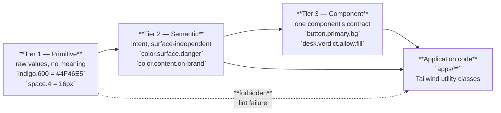
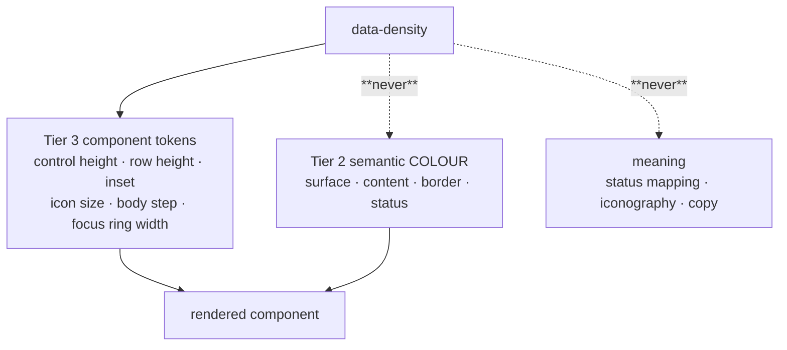
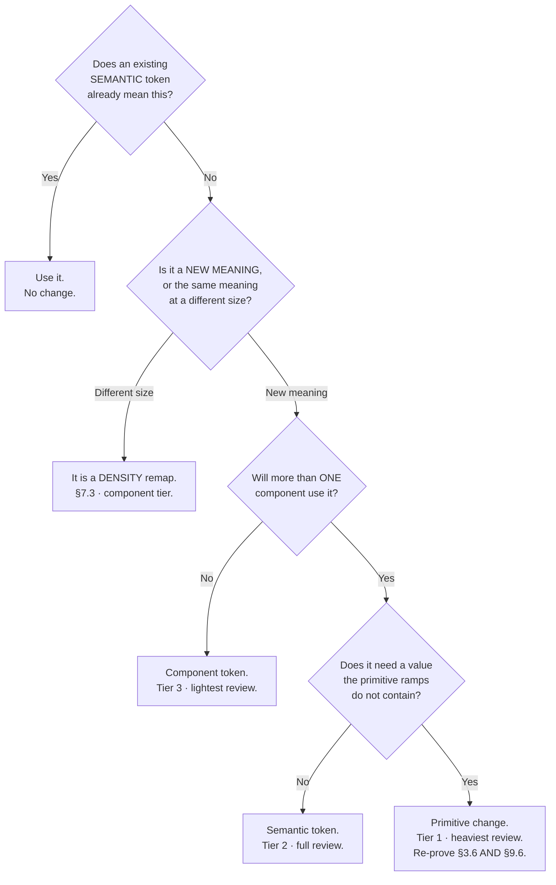

# Design System — the single source of styling truth

**Surface scope:** `customer-web` (Next.js 14 App Router) · `gym-dashboard` (React 18 + Vite) ·
`admin-dashboard` (React 18 + Vite) · the check-in desk (`SCR-DASH-009`, a mode of `gym-dashboard`)

---

## 0. Document control

| Aspect | Value |
| :--- | :--- |
| **Status** | Normative. Written before any component exists, so that no component has to be re-styled later. |
| **Authority** | `PROJECT_CONSTITUTION.md` §16.5 `UI2` — *"Design tokens are the single source of styling truth"*; `UI7` — *"Icons, typography scale and spacing scale are token-driven and enumerated in `/docs/ui/DesignSystem.md`"*. `MASTER_PRD.md` `C1.1` — *"design tokens as the single source of styling truth. Prevents three divergent interpretations of the same design."* |
| **Precedence** | `PROJECT_CONSTITUTION.md` → `MASTER_PRD.md` → `docs/apis/**` → **this file** → `docs/ui/CustomerApp.md`, `docs/ui/GymDashboard.md`, `docs/ui/AdminDashboard.md`. Where this file appears to contradict anything above it, the higher document wins and this file is a defect. |
| **Owns** | Token architecture · the colour palette and every shipped contrast proof · typography · spacing, sizing, radii, elevation, z-index, motion · density modes · money rendering rules · dark mode · iconography and imagery rules · the token change process. |
| **Does not own** | The component inventory and its shadcn/ui mapping → `docs/ui/Components.md`. Screen specifications → `CustomerApp.md`, `GymDashboard.md`, `AdminDashboard.md`. Route tables and navigation → `docs/ui/Navigation.md`. WCAG audit method and evidence → `docs/ui/Accessibility.md`. API response shapes → `docs/apis/**`. File placement → `docs/engineering/FolderStructure.md`. |
| **Launch market** | India. `LAUNCH_MARKET_INDIA.md` §2 (INR, paise, lakh–crore grouping), §3 (`Asia/Kolkata`, UTC +05:30, no DST). Single launch locale (English) with **every** string externalised from the first commit (`NFR-USE-08`, `I18N1`). |
| **Accessibility floor** | `NFR-USE-01`: WCAG 2.1 **AA** on `customer-web` **and** the check-in desk; **A** minimum elsewhere with AA as the target. Every contrast figure in this document is measured, not asserted. |

### 0.1 How to read the code blocks

Every fenced block in this document is labelled `illustrative — not committed code`. No file in this
document is a file that exists. Hex values, token names, scale steps and measured ratios **are**
normative; the TypeScript and Tailwind arrangements around them illustrate how the values are
consumed and may be arranged differently at implementation time provided the values survive intact.

### 0.2 Vocabulary — one deliberate spelling split

| Where | Spelling | Why |
| :--- | :--- | :--- |
| Prose in this and all `docs/ui/**` files | **colour** | House style; `FolderStructure.md` §10 names the file `packages/ui/src/tokens/colour.ts`. |
| CSS custom properties, Tailwind theme keys, TypeScript token *keys* | **`color`** | They feed the CSS `color` property and Tailwind's `colors` key. A `--gm-colour-*` variable next to a `color:` declaration is a reading hazard, and Tailwind's own key is `colors`. |

This split is a decision, not an inconsistency. A reviewer who finds `--gm-colour-surface-default`
in a diff should reject it.

---

## 1. Principles — one token set, three densities

`C1.1`'s rationale is the whole point: a shared library *"prevents three divergent interpretations of
the same design"*. Divergence does not begin with three different blues. It begins with three
different answers to *what is this surface for*. So the principles are stated per surface first, and
the tokens are derived from them.

### 1.1 What each surface optimises for

| Surface | It exists to | Its user | Its failure mode | Design consequence |
| :--- | :--- | :--- | :--- | :--- |
| **`customer-web`** | **Persuade.** Priya (`B2.2`) does not know what a gym costs and will not make a phone call to find out. | An anonymous stranger on a phone, on 4G, who will leave. | A page that looks like software. Price hidden behind a CTA. A photograph that loads late and shifts the layout. | Generous space, large imagery, editorial type sizes, `16 px` body minimum, colour used for warmth and for exactly one primary action per view. LCP ≤ 2.5 s (`NFR-PERF-02`) makes restraint a performance requirement, not a taste. |
| **`gym-dashboard`** | **Inform.** Rohan (`B2.1`) opens it to answer *"what do I do today"* (`SCR-DASH-001` purpose) and closes it again. | A busy owner and his staff, on a laptop, several times a day, for years. | Chartjunk. Decoration that costs a row. A number that is stale and does not say so. | Compact density, `14 px` body, tabular numerals everywhere a figure sits in a column, colour reserved for status and for danger, and a mandatory `LastUpdatedIndicator` beside every polled figure (`LC5`). |
| **The check-in desk** (`SCR-DASH-009`) | **Perform under pressure.** Sameer (`B2.3`) must clear a queue at **≤ 2 s p95 scan-to-confirmation** (`NFR-PERF-03`) without being blamed for a mistake. | One person, one hand, a tablet in portrait, at arm's length, in a brightly lit room (`NFR-USE-09`). | A verdict that is misread. A false success shown while offline. A colour-only allow/deny. | Oversized density, `96 px` verdict type, inverted-polarity allow/deny fills (§4), icon **and** word **and** colour on every verdict, and a live region so a denial is announced and not only coloured red (`AX8`). |
| **`admin-dashboard`** | **Adjudicate.** Anita (`B2.4`) reviews 30–60 applications a day; Vikram (`B2.5`) needs a figure he can trace to its source events. | A trained internal operator who will use keyboard shortcuts. | Ambiguity about which figure is authoritative. A destructive platform action that looks like a save. | Compact density, dense split views, keyboard-first affordances (`AX2`), and destructive confirmations that state a server-computed consequence (`NFR-USE-06`, `FM7`). |

### 1.2 The nine laws this system is built to keep

| # | Law | Source | How the token system carries it |
| :-: | :--- | :--- | :--- |
| 1 | Four states minimum on every screen: **loading, empty, error, permission-denied** | `B6` preamble, §16.9 | Each state has named surface/content/border tokens and a pattern component (`EmptyState`, `ErrorState`, `PermissionDeniedState`, `Skeleton`) so a team cannot invent a fifth look. |
| 2 | Text ≥ **4.5:1**, interactive ≥ **3:1** | `NFR-USE-04`, `AX4` | Guaranteed **by the palette**, not by per-component choices. §3.6 lists every shipped pairing with its measured ratio, and names the four pairings that fail and are therefore forbidden. |
| 3 | Minimum touch target **44 × 44 px** | `NFR-USE-03`, `AX3` | `--gm-size-target-min: 44px` is a token, and compact density expands the *hit* area without expanding the *painted* control (§7.4). |
| 4 | Full keyboard operability on dashboard and admin | `NFR-USE-02`, `AX2` | One focus-ring token set, never `outline: none` without a replacement, and a focus ring measured at ≥ 3:1 against every surface it can land on (§3.7). |
| 5 | Colour is **never** the sole carrier of meaning | `AX9` | Every semantic colour token ships with a required companion: an icon token and a text key. §4 proves the check-in case numerically under simulated deuteranopia. |
| 6 | Responsive **320 → 2560 px**, no horizontal scrolling | `NFR-USE-07`, `AX5` | Breakpoint tokens, a max content-measure token, and the rule that wide content scrolls **inside its own container** (§6.7). |
| 7 | Every string externalised | `NFR-USE-08`, `I18N1` | The type stack is chosen so that a Devanagari string dropped into a Latin layout does not clip, and no token encodes a language assumption (§5.6). |
| 8 | Money is rendered from server-computed minor units, never recomputed | `BR-PAY-01`, `BL2`, `MN` rules in §8 | Money is a **rendering** concern in this document and a **formatting** concern in `packages/utils`. `packages/ui` receives a finished string (`FolderStructure.md` §10). |
| 9 | A stale figure presented as live is a **defect** | `A-08`, `LC5` | The staleness indicator has its own token set (`--gm-color-content-stale`, `--gm-color-surface-stale`) so that "fresh", "ageing" and "failed poll" are visually distinct states rather than three shades of grey chosen by three teams. |

### 1.3 Three densities, one palette — the rule that keeps them one system

> **Density changes size. It never changes colour, and it never changes meaning.**

A `DANGER` badge on the customer site, in the member table and on the check-in desk is the same
hue, the same semantic token and the same icon. It is 20 px tall, 18 px tall and 44 px tall
respectively. That is the entire permitted difference. A density mode that reaches for a different
red has stopped being a density mode and is a second design system.

---

## 2. Token architecture — three tiers

### 2.1 The tiers

`illustrative — not committed code`



| Tier | Lives in | Names look like | May reference | May be used by a component |
| :--- | :--- | :--- | :--- | :--- |
| **1 — Primitive** | `packages/ui/src/tokens/primitive/` | `--gm-indigo-600`, `--gm-space-4`, `--gm-font-size-16` | nothing | **Never.** `UI3` fails the lint. |
| **2 — Semantic** | `packages/ui/src/tokens/semantic/` | `--gm-color-surface-danger`, `--gm-color-content-muted`, `--gm-space-inline-md`, `--gm-radius-control` | Tier 1 only | **Yes** — this is the default tier for application code. |
| **3 — Component** | `packages/ui/src/tokens/component/` | `--gm-button-primary-bg`, `--gm-table-row-height`, `--gm-desk-verdict-fill` | Tier 2 only (Tier 1 only where §2.6's escape hatch applies) | **Yes**, by the one component that owns it. |

### 2.2 Why three tiers and not two

Two tiers is the common shortcut and it breaks at exactly the point this product reaches: the third
surface. With semantic tokens alone, "the dashboard table row is denser than the customer card"
becomes a per-component Tailwind override, and after four sprints there are eleven row heights.
Component tokens make density a **remapping** (§7) instead of an override, and make the check-in
desk's oversized mode a data attribute rather than a fork.

The reverse failure — a primitive used directly — is worse and quieter. `text-indigo-600` in a
feature file compiles, renders correctly, and silently opts that one element out of dark mode, out
of the contrast proof in §3.6, and out of any future palette change. That is why `UI3` makes it a
**lint failure**, not a review comment.

### 2.3 Where the tokens live

`illustrative — not committed code`

```text
packages/ui/
├── src/
│   ├── tokens/
│   │   ├── primitive/
│   │   │   ├── palette.ts          the ramps of §3.2 — 6 families × 12 steps + white/black
│   │   │   ├── scale.ts            the 4 px space scale, the type ramp, radii, blur
│   │   │   └── index.ts
│   │   ├── semantic/
│   │   │   ├── colour.light.ts     §3.4 roles → primitive refs
│   │   │   ├── colour.dark.ts      §9 pairs → primitive refs   (SAME keys, different refs)
│   │   │   ├── space.ts · radius.ts · elevation.ts · motion.ts · typography.ts · zindex.ts
│   │   │   └── index.ts
│   │   ├── component/
│   │   │   ├── button.ts · input.ts · table.ts · badge.ts · card.ts · dialog.ts
│   │   │   ├── desk.ts             §4 — the check-in verdict contract
│   │   │   └── index.ts
│   │   ├── density/
│   │   │   ├── comfortable.ts · compact.ts · oversized.ts    §7 — component-tier remaps only
│   │   │   └── index.ts
│   │   ├── contrast.proof.ts       the §3.6 table AS DATA — the a11y test reads this file
│   │   └── tokens.css              GENERATED — every tier as CSS custom properties
│   └── …
├── tailwind-preset.ts              consumes tokens.css; the only theme any app gets
└── …
```

Two things in that tree are load-bearing beyond convention:

1. **`colour.light.ts` and `colour.dark.ts` export the same key set.** A key present in one and
   absent from the other fails a type check, so "we forgot the dark value" cannot ship (§9.2).
2. **`contrast.proof.ts` is data, not documentation.** §3.6's table is generated from it, and the
   accessibility suite asserts every row. A palette edit that drops a pairing below its floor fails
   CI before it reaches a screen — which is what `AX4`'s *"enforced by the token palette, not by
   per-component choices"* has to mean in practice.

### 2.4 How Tailwind consumes them (`A-03`)

The chain is one-directional and has exactly one hop the apps can see.

`illustrative — not committed code`

```ts
// packages/ui/tailwind-preset.ts
import type { Config } from 'tailwindcss';

// Every value below is `var(--gm-…)`. No hex, no px literal, ever, in this file.
export const preset = {
  darkMode: ['class', '[data-theme="dark"]'],
  theme: {
    // `extend` is NOT used for these five keys — they are REPLACED, so Tailwind's
    // default palette and default spacing scale are unreachable from apps/**.
    colors: {
      transparent: 'transparent',
      current: 'currentColor',
      surface:  { DEFAULT: 'var(--gm-color-surface-default)', subtle: 'var(--gm-color-surface-subtle)', /* … §3.4 */ },
      content:  { DEFAULT: 'var(--gm-color-content-primary)', muted: 'var(--gm-color-content-muted)',  /* … §3.4 */ },
      border:   { DEFAULT: 'var(--gm-color-border-default)',  input: 'var(--gm-color-border-input)',   /* … §3.4 */ },
      brand:    { /* … */ }, success: { /* … */ }, warning: { /* … */ }, danger: { /* … */ }, info: { /* … */ },
    },
    spacing:     { /* semantic space tokens only — §6.1 */ },
    borderRadius:{ /* §6.3 */ },
    boxShadow:   { /* §6.4 */ },
    zIndex:      { /* §6.5 — the eleven named layers, no numeric utilities */ },
    fontSize:    { /* §5.3 — each step ships its line-height and tracking as a tuple */ },
  },
} satisfies Partial<Config>;
```

`illustrative — not committed code`

```ts
// packages/config/tailwind/preset.ts   — re-export so apps import ONE thing
export { preset as default } from '@gymmap/ui/tailwind-preset';
```

`illustrative — not committed code`

```ts
// apps/customer-web/tailwind.config.ts   — and the two Vite apps, identically
import preset from '@gymmap/config/tailwind/preset';
export default {
  presets: [preset],
  content: ['./src/**/*.{ts,tsx}', '../../packages/ui/src/**/*.{ts,tsx}'],
  // theme: {}   ← an app that adds a theme key fails review. `UI2`: tokens are defined ONCE.
};
```

> **Amended 2026-08-08 by `ADR-0037`.** `TK3` below is now advisory. `TK1`, `TK2`, `TK4`, `TK5` and
> `TK6` stand: they are what makes one design work in both themes and at every density, and removing
> them breaks the theme switch rather than freeing a designer. The contrast floors of §3.6, the
> colour-plus-icon rule of §4 and the motion law of §6 are **not** amended — see the ADR for why each
> of those is a requirement rather than a preference.

| Rule | Statement | Enforced by |
| :--- | :--- | :--- |
| **TK1** | `theme.colors`, `theme.spacing`, `theme.borderRadius`, `theme.boxShadow` and `theme.zIndex` are **replaced**, not extended. Tailwind's stock `slate-500` and `p-7` do not resolve in `apps/**`. | The preset itself; a missing class is a build-visible failure. |
| **TK2** | An app declares **no** `theme` of its own. `presets: [preset]` and `content` are the whole config. | Review + a structure test on the three `tailwind.config.ts` files. |
| **TK3** | ~~Arbitrary values are forbidden in `apps/**`: `text-[#1a2b3c]`, `p-[13px]`, `z-[999]`, `w-[327px]`.~~ **ADVISORY from 2026-08-08 — `ADR-0037`.** The owner lifted this so a design is not constrained by the token set. The trade-off is real and is now stated rather than enforced: an arbitrary COLOUR does not theme, so a screen using `text-[#1a2b3c]` looks correct in whichever mode it was designed in and wrong in the other. Prefer a token for anything colour-bearing; use whatever value a layout needs. | None. The `UI3` rule was never written. `ci:tailwind-tokens` remains ON and is unaffected — it catches a class that emits NO CSS (`p-4`, `stack-3xs`), which is a silent defect rather than a style choice, and bracketed values always passed it. |
| **TK4** | The one legitimate arbitrary value — a genuinely one-off layout dimension such as a map pane width — is not arbitrary. It becomes a component token in `packages/ui/src/tokens/component/`, reviewed under §12. | Review. |
| **TK5** | `packages/ui` may use Tier 1 through Tier 3. `apps/**` may use Tier 2 and Tier 3 only. | Lint: primitive class names (`gm-indigo-*`, `gm-space-*`) are not emitted by the preset at all, so a primitive in an app simply does not exist as a class. |
| **TK6** | Dark mode is a `data-theme` attribute on `<html>`, not a class soup. `darkMode: ['class', '[data-theme="dark"]']` lets `dark:` utilities work while the attribute stays the single switch (§9.3). | The preset. |

### 2.5 The naming grammar

`illustrative — not committed code`

```text
  --gm- <tier-hint?> <category> - <role> [- <variant>] [- <state>]
        │             │           │        │             │
        │             │           │        │             └─ default hover active disabled focus visited
        │             │           │        └─ subtle · solid · muted · inverse · on-<role>
        │             │           └─ surface content border brand success warning danger info
        │             └─ color space size radius shadow z font motion
        └─ (component tier only) button- input- table- badge- desk- …

  --gm-color-surface-danger              semantic · category=color · role=surface · variant=danger
  --gm-color-content-on-danger           semantic · the guaranteed-legible foreground for that fill
  --gm-color-border-input-hover          semantic · with state
  --gm-button-primary-bg-active          component · button owns it
  --gm-desk-verdict-allow-fill           component · the check-in desk owns it
  --gm-space-stack-lg                    semantic space · vertical rhythm between blocks
  --gm-motion-duration-fast              semantic motion
```

| Rule | Statement |
| :--- | :--- |
| **NG1** | Every token starts `--gm-`. An unprefixed custom property in `packages/ui` or `apps/**` is a defect — the prefix is what makes a global stylesheet collision impossible and a grep exhaustive. |
| **NG2** | State is always a **suffix**, never a separate token family. `--gm-color-brand-solid-hover`, never `--gm-color-brand-hover-solid`. Sorting a token file alphabetically must group a role with its states. |
| **NG3** | A foreground guaranteed legible on a named fill is `content-on-<role>`. There is exactly one per fill, and §3.6 proves it. |
| **NG4** | No token name contains a **value**: no `--gm-color-blue-button`, no `--gm-space-16`. Semantic tokens name intent; primitive tokens name the ramp step, which is a position, not a value. |
| **NG5** | No token name contains a **screen or feature**: no `--gm-color-checkout-bg`. The exception is the check-in desk, which is a genuine third density with a legal accessibility obligation of its own (`NFR-USE-01`, `NFR-USE-09`), and therefore owns a component-tier namespace `--gm-desk-*`. |
| **NG6** | British/American spelling follows §0.2 without exception. |

### 2.6 The one escape hatch, and its price

A component token may reference a **primitive** directly in exactly one circumstance: the value is
not a colour, a size, a radius or a shadow — it is a physical constant of a rendering context. Two
exist in Phase 1, both in the check-in desk:

| Token | Value | Why it bypasses the semantic tier |
| :--- | :--- | :--- |
| `--gm-desk-camera-aspect` | `4 / 3` | It is the camera's aspect, not a design choice. Re-expressing it as a semantic token would imply it could be changed for taste. |
| `--gm-desk-verdict-min-height` | `52svh` | Tied to a tablet's portrait viewport and the arm's-length requirement (`NFR-USE-09`), not to the space scale. Rounding it to the nearest space step is what would be wrong. |

Both are enumerated here so the escape hatch is a **closed list of two**, not a principle. A third
requires §12's process.

---

## 3. Colour

### 3.1 The one structural decision: the brand is not green

`SCR-DASH-009` puts a green **ALLOWED** and a red **DENIED** in front of a receptionist a few hundred
times a day, and `NFR-USE-01` makes that screen a WCAG 2.1 AA surface. If the brand colour were also
green, then every primary button, every active nav item and every focus ring in the product would sit
in the same perceptual neighbourhood as *"this member may enter"*. Under deuteranopia — the most
common form of colour vision deficiency, roughly 1 in 16 men — that neighbourhood already contains
red (§4.2 proves it at 1.05:1).

So the brand is **indigo**. It is far from green and far from red in every dichromat projection, it
does not compete with `warning` amber, and its only near-neighbour is `info` sky — a role that only
ever appears as a low-emphasis banner with an icon, never as a call to action.

| Family | Role | Why this family |
| :--- | :--- | :--- |
| **Neutral** (cool slate) | surfaces, text, borders, disabled | Slightly cool so that gym photography — which is overwhelmingly warm, artificially lit interiors — reads as the warm thing on the page. |
| **Indigo** | `brand` | Distinct from every status hue under deuteranopia, protanopia and tritanopia. Reads as trustworthy rather than clinical. |
| **Emerald** | `success` | Reserved. `success` means *it worked* — payment captured, member checked in, plan published. |
| **Amber** | `warning` | Expiring memberships, arrears, SLA approaching breach, DLT template pending approval. |
| **Red** | `danger` | Denial, failure, destructive action, dispute deadline breached. |
| **Sky** | `info` | Neutral disclosure: "we're confirming your payment", "this figure updates every 10 seconds". Never a CTA. |

### 3.2 Tier 1 — the primitive ramps

Twelve steps per family. Steps are positions, not values (`NG4`). Nothing in `apps/**` may name one.

`illustrative — not committed code`

```ts
// packages/ui/src/tokens/primitive/palette.ts
export const palette = {
  white: '#FFFFFF',
  black: '#000000',
  neutral: { 50:'#F8FAFC', 100:'#F1F5F9', 200:'#E2E8F0', 300:'#CBD5E1', 400:'#94A3B8', 500:'#64748B',
             600:'#475569', 700:'#334155', 800:'#1E293B', 900:'#0F172A', 950:'#020617' },
  indigo:  { 50:'#EEF2FF', 100:'#E0E7FF', 200:'#C7D2FE', 300:'#A5B4FC', 400:'#818CF8', 500:'#6366F1',
             600:'#4F46E5', 700:'#4338CA', 800:'#3730A3', 900:'#312E81', 950:'#1E1B4B' },
  emerald: { 50:'#ECFDF5', 100:'#D1FAE5', 200:'#A7F3D0', 300:'#6EE7B7', 400:'#34D399', 500:'#10B981',
             600:'#059669', 700:'#047857', 800:'#065F46', 900:'#064E3B', 950:'#022C22' },
  amber:   { 50:'#FFFBEB', 100:'#FEF3C7', 200:'#FDE68A', 300:'#FCD34D', 400:'#FBBF24', 500:'#F59E0B',
             600:'#D97706', 700:'#B45309', 800:'#92400E', 900:'#78350F', 950:'#451A03' },
  red:     { 50:'#FEF2F2', 100:'#FEE2E2', 200:'#FECACA', 300:'#FCA5A5', 400:'#F87171', 500:'#EF4444',
             600:'#DC2626', 700:'#B91C1C', 800:'#991B1B', 900:'#7F1D1D', 950:'#450A0A' },
  sky:     { 50:'#F0F9FF', 100:'#E0F2FE', 200:'#BAE6FD', 300:'#7DD3FC', 400:'#38BDF8', 500:'#0EA5E9',
             600:'#0284C7', 700:'#0369A1', 800:'#075985', 900:'#0C4A6E', 950:'#082F49' },
} as const;
```

**Step semantics, so a future family is built the same way:**

| Steps | Intended use | Contrast property that must hold |
| :--- | :--- | :--- |
| `50`–`100` | Subtle status fills, hover washes, zebra striping | A `800`-step foreground on a `50`-step fill of the same family is ≥ 4.5:1 |
| `200`–`300` | Borders inside a status region, dark-mode text | A `300`-step on the dark canvas `neutral-900` is ≥ 4.5:1 |
| `400`–`500` | Illustration, chart series on dark, never body text on white | A `400`-step on `neutral-900` is ≥ 3:1 |
| `600`–`700` | Solid interactive fills with white text; text on white | White on a `700`-step is ≥ 4.5:1 |
| `800`–`950` | Text on subtle fills, dark canvases, the desk deny fill | A `950`-step on white is ≥ 12:1 |

### 3.3 Tier 2 — the semantic roles

Eight role groups. Every one exists on both themes with identical keys (§9.2).

| Group | Purpose | Members |
| :--- | :--- | :--- |
| **`surface`** | What a thing sits on | `default` · `subtle` · `sunken` · `raised` · `overlay` · `inverse` · `disabled` · `scrim` · `brand-subtle` · `success-subtle` · `warning-subtle` · `danger-subtle` · `info-subtle` · `stale` |
| **`content`** | Foreground: text and icons | `primary` · `secondary` · `tertiary` · `muted` · `disabled` · `inverse` · `link` · `link-hover` · `link-visited` · `stale` · `on-brand` · `on-success` · `on-warning` · `on-danger` · `on-info` · `brand` · `success` · `warning` · `danger` · `info` |
| **`border`** | Separation and control edges | `subtle` · `default` · `strong` · `input` · `input-hover` · `focus` · `brand` · `success` · `warning` · `danger` · `info` |
| **`brand`** | The one persuasive colour | `solid` · `solid-hover` · `solid-active` · `solid-disabled` · `subtle` · `subtle-hover` |
| **`success`** | It worked | `solid` · `solid-hover` · `solid-active` · `subtle` · `subtle-hover` |
| **`warning`** | It needs attention soon | `solid` · `solid-hover` · `solid-active` · `subtle` · `subtle-hover` |
| **`danger`** | It failed, or it destroys | `solid` · `solid-hover` · `solid-active` · `solid-disabled` · `subtle` · `subtle-hover` |
| **`info`** | Neutral disclosure | `solid` · `subtle` |

Three role names earn their place by pointing at a specific requirement rather than a preference:

| Token | Requirement it serves |
| :--- | :--- |
| `surface-stale` / `content-stale` | `LC5` — a polled figure whose last poll **failed** must look different from one that is merely a few seconds old. Two tokens, not one grey. |
| `surface-scrim` | `SCR-WEB-006`'s non-dismissible processing state and `SCR-DASH-009`'s verdict overlay both need a scrim whose opacity is a token, so "how dark is the modal backdrop" is answered once. |
| `content-on-<role>` | `NG3`. Every solid fill ships its guaranteed-legible foreground, so `text-white` is never a guess. |

### 3.4 The light-theme mapping

`illustrative — not committed code`

```ts
// packages/ui/src/tokens/semantic/colour.light.ts
import { palette as p } from '../primitive/palette';
export const light = {
  'color-surface-default':  p.white,        'color-surface-subtle':   p.neutral[50],
  'color-surface-sunken':   p.neutral[100], 'color-surface-raised':   p.white,
  'color-surface-overlay':  p.white,        'color-surface-inverse':  p.neutral[900],
  'color-surface-disabled': p.neutral[100], 'color-surface-scrim':    'rgb(2 6 23 / 0.60)',
  'color-surface-stale':    p.amber[50],
  'color-surface-brand-subtle':   p.indigo[50],  'color-surface-success-subtle': p.emerald[50],
  'color-surface-warning-subtle': p.amber[50],   'color-surface-danger-subtle':  p.red[50],
  'color-surface-info-subtle':    p.sky[50],
  // …content, border and solid groups follow the same shape; §3.5 is the authoritative value table
} as const;
```

The authoritative values, with the measured ratio of the pairing each one actually ships in:

| Semantic token | Light value | Ships against | Measured | Floor | Verdict |
| :--- | :--- | :--- | ---: | :-: | :-: |
| `color-surface-default` | `#FFFFFF` | — | — | — | — |
| `color-surface-subtle` | `#F8FAFC` | — | — | — | — |
| `color-surface-sunken` | `#F1F5F9` | — | — | — | — |
| `color-surface-inverse` | `#0F172A` | `content-inverse` `#F8FAFC` | **17.06:1** | 4.5 | ✅ |
| `color-content-primary` | `#0F172A` | `surface-default` | **17.85:1** | 4.5 | ✅ |
| `color-content-primary` | `#0F172A` | `surface-sunken` | **16.30:1** | 4.5 | ✅ |
| `color-content-secondary` | `#334155` | `surface-default` | **10.35:1** | 4.5 | ✅ |
| `color-content-secondary` | `#334155` | `surface-subtle` | **9.90:1** | 4.5 | ✅ |
| `color-content-tertiary` | `#475569` | `surface-default` | **7.58:1** | 4.5 | ✅ |
| `color-content-tertiary` | `#475569` | `surface-sunken` | **6.92:1** | 4.5 | ✅ |
| `color-content-muted` | `#64748B` | `surface-default` | **4.76:1** | 4.5 | ✅ |
| `color-content-muted` | `#64748B` | `surface-subtle` | **4.55:1** | 4.5 | ✅ narrow |
| `color-content-muted` | `#64748B` | `surface-sunken` | **4.34:1** | 4.5 | ❌ **forbidden — §3.8** |
| `color-content-disabled` | `#94A3B8` | `surface-default` | **2.56:1** | — | ⚠️ exempt — §3.8 |
| `color-content-link` | `#4338CA` | `surface-default` | **7.90:1** | 4.5 | ✅ |
| `color-content-brand` | `#4338CA` | `surface-brand-subtle` `#EEF2FF` | **7.07:1** | 4.5 | ✅ |
| `color-content-success` | `#065F46` | `surface-success-subtle` `#ECFDF5` | **7.29:1** | 4.5 | ✅ |
| `color-content-warning` | `#78350F` | `surface-warning-subtle` `#FFFBEB` | **8.75:1** | 4.5 | ✅ |
| `color-content-danger` | `#991B1B` | `surface-danger-subtle` `#FEF2F2` | **7.60:1** | 4.5 | ✅ |
| `color-content-info` | `#075985` | `surface-info-subtle` `#F0F9FF` | **7.09:1** | 4.5 | ✅ |
| `color-content-on-brand` | `#FFFFFF` | `brand-solid` `#4F46E5` | **6.29:1** | 4.5 | ✅ |
| `color-content-on-success` | `#FFFFFF` | `success-solid` `#047857` | **5.48:1** | 4.5 | ✅ |
| `color-content-on-warning` | `#FFFFFF` | `warning-solid` `#B45309` | **5.02:1** | 4.5 | ✅ |
| `color-content-on-danger` | `#FFFFFF` | `danger-solid` `#B91C1C` | **6.47:1** | 4.5 | ✅ |
| `color-content-on-info` | `#FFFFFF` | `info-solid` `#0369A1` | **5.93:1** | 4.5 | ✅ |
| `color-border-subtle` | `#CBD5E1` | `surface-default` | **1.48:1** | — | ⚠️ decorative only — §3.8 |
| `color-border-default` | `#94A3B8` | `surface-default` | **2.56:1** | — | ⚠️ decorative only — §3.8 |
| `color-border-input` | `#64748B` | `surface-default` | **4.76:1** | 3.0 | ✅ |
| `color-border-focus` | `#4F46E5` | `surface-default` | **6.29:1** | 3.0 | ✅ |
| `color-border-focus` | `#4F46E5` | `surface-sunken` | **5.74:1** | 3.0 | ✅ |

**`content-muted` on `surface-sunken` at 4.34:1 is the single most likely accident in this palette.**
`surface-sunken` is the dashboard table's zebra stripe and the sunken panel behind a form section —
precisely where a designer reaches for muted secondary text. It fails. §3.8 forbids it by name and
`contrast.proof.ts` asserts it.

### 3.5 State variants

Every interactive role carries five states. The rule is mechanical so that no component invents one:

| State | Fill derivation | Foreground | Border | Additional |
| :--- | :--- | :--- | :--- | :--- |
| `default` | the `-solid` step (`600` for brand, `700` for status) | `content-on-<role>` | none, or `border-<role>` on outline variants | — |
| `hover` | one ramp step **darker** (`700` / `800`) | unchanged | unchanged | `transition: background-color var(--gm-motion-duration-fast)` |
| `active` | two ramp steps darker (`800` / `900`) | unchanged | unchanged | no transition on press-down — it must feel instant |
| `disabled` | `surface-disabled` `#F1F5F9` | `content-disabled` `#94A3B8` | `border-subtle` | `cursor: not-allowed`, `aria-disabled="true"`; **never** `pointer-events: none` on a control that must still be focusable to explain itself |
| `focus-visible` | unchanged | unchanged | unchanged | the focus ring of §3.7, **outside** the control box so it never reduces the painted contrast |

| Role | `solid` | `solid-hover` | `solid-active` | Measured `on-` foreground |
| :--- | :--- | :--- | :--- | ---: |
| brand | `#4F46E5` | `#4338CA` | `#3730A3` | 6.29 → **7.90** → **9.93:1** (white) |
| success | `#047857` | `#065F46` | `#064E3B` | **5.48:1** at default and rising |
| warning | `#B45309` | `#92400E` | `#78350F` | **5.02:1** at default and rising |
| danger | `#B91C1C` | `#991B1B` | `#7F1D1D` | **6.47:1** at default and rising |
| info | `#0369A1` | `#075985` | `#0C4A6E` | **5.93:1** at default and rising |

The derivation direction is chosen so that **hover and active can never reduce contrast**. A palette
whose hover state lightens the fill has to prove three ratios per role instead of one; this one
proves the worst case at `default` and every other state is strictly better.

> **`success-600` `#059669` is deliberately absent from the interactive set.** White on it measures
> **3.77:1** — below the 4.5:1 text floor. It exists in the ramp for chart fills and dark-mode text
> only. This is exactly the trap the semantic tier prevents: `bg-emerald-600 text-white` looks
> correct and is not.

### 3.6 The shipped-pairing contrast register

This is the `AX4` evidence. Every pairing that appears in `apps/**` is here, with a **measured**
ratio. Anything not in this table is not a shipped pairing, and adding one requires §12.

Method: WCAG 2.1 relative-luminance formula, sRGB, computed from the hex values in §3.2 — not
sampled from a screenshot, not eyeballed against a swatch. The generator lives at
`packages/ui/src/tokens/contrast.proof.ts` and the accessibility suite asserts every row.

#### 3.6.1 Light theme — text pairings (floor 4.5:1)

| # | Foreground | Background | Where it ships | Ratio |
| :-: | :--- | :--- | :--- | ---: |
| L01 | `content-primary` `#0F172A` | `surface-default` `#FFFFFF` | All body copy, table cells, headings | **17.85:1** |
| L02 | `content-primary` `#0F172A` | `surface-subtle` `#F8FAFC` | Page canvas on both dashboards | **17.06:1** |
| L03 | `content-primary` `#0F172A` | `surface-sunken` `#F1F5F9` | Table zebra rows, sunken form sections | **16.30:1** |
| L04 | `content-secondary` `#334155` | `surface-default` | Sub-headings, `SCR-DASH-007` secondary columns | **10.35:1** |
| L05 | `content-secondary` `#334155` | `surface-subtle` | Dashboard sub-headings | **9.90:1** |
| L06 | `content-tertiary` `#475569` | `surface-default` | Labels, `SCR-WEB-003` amenity captions | **7.58:1** |
| L07 | `content-tertiary` `#475569` | `surface-sunken` | The **replacement** for the forbidden L09 pairing | **6.92:1** |
| L08 | `content-muted` `#64748B` | `surface-default` | Timestamps, "Member for 4 months" tenure band | **4.76:1** |
| L09 | `content-muted` `#64748B` | `surface-subtle` | Metadata on the dashboard canvas | **4.55:1** |
| L10 | `content-link` `#4338CA` | `surface-default` | Every inline link, `SCR-WEB-011` invoice links | **7.90:1** |
| L11 | `content-on-brand` `#FFFFFF` | `brand-solid` `#4F46E5` | "Buy now", "Proceed to payment", "Approve" | **6.29:1** |
| L12 | `content-on-brand` `#FFFFFF` | `brand-solid-hover` `#4338CA` | The same, hovered | **7.90:1** |
| L13 | `content-on-brand` `#FFFFFF` | `brand-solid-active` `#3730A3` | The same, pressed | **9.93:1** |
| L14 | `content-brand` `#3730A3` | `surface-brand-subtle` `#EEF2FF` | Promoted-listing chip (`SCR-WEB-001` region 6) | **8.88:1** |
| L15 | `content-on-success` `#FFFFFF` | `success-solid` `#047857` | `ALLOWED` pill, "Payment captured" toast | **5.48:1** |
| L16 | `content-success` `#065F46` | `surface-success-subtle` `#ECFDF5` | `ACTIVE` membership pill, `APPROVED` tenant pill | **7.29:1** |
| L17 | `content-on-danger` `#FFFFFF` | `danger-solid` `#B91C1C` | "Archive plan", "Suspend tenant" | **6.47:1** |
| L18 | `content-danger` `#991B1B` | `surface-danger-subtle` `#FEF2F2` | `EXPIRED`, `REJECTED`, `FAILED` pills; field errors | **7.60:1** |
| L19 | `content-on-warning` `#FFFFFF` | `warning-solid` `#B45309` | SLA-breach badge on `SCR-ADM-002` | **5.02:1** |
| L20 | `content-warning` `#78350F` | `surface-warning-subtle` `#FFFBEB` | "Expiring in 7 days", subscription arrears | **8.75:1** |
| L21 | `content-warning` `#92400E` | `amber-100` `#FEF3C7` | Emphasised warning banner fill | **6.37:1** |
| L22 | `content-on-info` `#FFFFFF` | `info-solid` `#0369A1` | "Confirming payment" chip (`SCR-WEB-007`) | **5.93:1** |
| L23 | `content-info` `#075985` | `surface-info-subtle` `#F0F9FF` | Polling disclosure, `INFO_REQUESTED` state | **7.09:1** |
| L24 | `content-inverse` `#F8FAFC` | `surface-inverse` `#0F172A` | Tooltips, the desk idle panel | **17.06:1** |

#### 3.6.2 Light theme — non-text pairings (floor 3:1)

| # | Element | Colour | Against | Ratio | Note |
| :-: | :--- | :--- | :--- | ---: | :--- |
| N01 | Text input border | `border-input` `#64748B` | `surface-default` | **4.76:1** | The border **is** the control boundary, so it carries the 3:1 obligation |
| N02 | Focus ring | `border-focus` `#4F46E5` | `surface-default` | **6.29:1** | §3.7 |
| N03 | Focus ring | `border-focus` `#4F46E5` | `surface-sunken` `#F1F5F9` | **5.74:1** | Ring on a zebra row still passes |
| N04 | Checkbox/radio unchecked edge | `border-input` `#64748B` | `surface-default` | **4.76:1** | — |
| N05 | Switch track, off | `#64748B` | `surface-default` | **4.76:1** | The off state must be identifiable, not just the on state |
| N06 | Icon-only button glyph | `content-tertiary` `#475569` | `surface-default` | **7.58:1** | Glyphs are non-text for WCAG but are held to the text floor here |
| N07 | Divider between table rows | `border-subtle` `#CBD5E1` | `surface-default` | **1.48:1** | **Decorative only** — see §3.8 |
| N08 | Card outline | `border-default` `#94A3B8` | `surface-default` | **2.56:1** | **Decorative only** — a card is not a control |
| N09 | Chart series 1 | `#1D4ED8` | `surface-default` | **6.70:1** | §3.9 |
| N10 | Chart series 2 | `#B45309` | `surface-default` | **5.02:1** | §3.9 |

### 3.7 The focus ring — one definition, no exceptions

`illustrative — not committed code`

```css
/* packages/ui/src/a11y/focus.css */
:where(a, button, input, select, textarea, summary, [tabindex]):focus-visible {
  outline: var(--gm-focus-ring-width) solid var(--gm-color-border-focus); /* 2px, #4F46E5 */
  outline-offset: var(--gm-focus-ring-offset);                            /* 2px */
  border-radius: inherit;
}
/* On an inverse or status-solid surface the ring inverts so it never sits indigo-on-indigo. */
[data-on-solid='true']:focus-visible { outline-color: var(--gm-color-content-inverse); }
```

| Rule | Statement |
| :--- | :--- |
| **FR1** | `outline: none` without an equally visible replacement is a lint failure. There is no design in this product that is worth an invisible focus state. |
| **FR2** | The ring is drawn **outside** the control (`outline-offset: 2px`), so it never overlaps the control's own border and never reduces the painted contrast measured in §3.6. |
| **FR3** | Ring width is `2px` at comfortable and compact density, `3px` at oversized (§7) — a receptionist at arm's length must see where the keyboard is. |
| **FR4** | `:focus-visible`, not `:focus`. A mouse click on a button must not paint a ring; a `Tab` onto it must. |
| **FR5** | On any `*-solid` fill the ring inverts to `content-inverse` `#F8FAFC`, measured at **17.06:1** against `#0F172A` and ≥ 4.5:1 against every solid in §3.5. |
| **FR6** | Focus order follows DOM order. A `tabindex` greater than `0` anywhere in `apps/**` is a review rejection. |

### 3.8 The forbidden pairings, named

Four pairings are recorded here **because they are plausible**, not because anyone proposed them.
`contrast.proof.ts` asserts each as a negative case, so a future palette tweak that accidentally
makes one legal still does not make it permitted without §12.

| # | Pairing | Ratio | Why it is tempting | The required alternative |
| :-: | :--- | ---: | :--- | :--- |
| **F1** | `content-muted` `#64748B` on `surface-sunken` `#F1F5F9` | **4.34:1** | Muted metadata inside a zebra-striped table row is the most natural thing in the world to write | `content-tertiary` `#475569` → **6.92:1** (L07) |
| **F2** | `content-disabled` `#94A3B8` on `surface-default` | **2.56:1** | It is the disabled colour; it looks disabled | Permitted **only** on `aria-disabled` controls, which WCAG 1.4.3 exempts. Never on informational text, never on a placeholder that carries the only label, never on a value the user must read |
| **F3** | `border-subtle` `#CBD5E1` / `border-default` `#94A3B8` as the **only** indicator of a control | **1.48:1** / **2.56:1** | Minimal, quiet, modern | A control's boundary uses `border-input` `#64748B` → **4.76:1** (N01). `border-subtle` may separate rows and outline non-interactive cards, nothing more |
| **F4** | `success-solid-600` `#059669` with white text | **3.77:1** | It is the brighter, friendlier green | `success-solid` `#047857` → **5.48:1** (L15). `#059669` is a chart and dark-mode value only |

### 3.9 Chart tokens

`AdminDashboard.md` `AN5` and every `SCR-DASH-020` / `SCR-ADM-014` report consume these. The
charting library is not yet chosen (`Scalability.md` names only *"chart library, dynamically
imported"*), so these are library-agnostic values.

| Token | Light | vs `surface-default` | Dark | vs dark `surface-default` |
| :--- | :--- | ---: | :--- | ---: |
| `chart-series-1` | `#1D4ED8` | **6.70:1** | `#93C5FD` | **9.90:1** |
| `chart-series-2` | `#B45309` | **5.02:1** | `#FCD34D` | **12.38:1** |
| `chart-series-3` | `#0F766E` | **5.47:1** | `#5EEAD4` | **12.07:1** |
| `chart-series-4` | `#A21CAF` | **6.32:1** | `#F0ABFC` | **10.15:1** |
| `chart-series-5` | `#4D7C0F` | **4.99:1** | `#BEF264` | **13.67:1** |
| `chart-series-6` | `#BE123C` | **6.29:1** | `#FDA4AF` | **9.44:1** |
| `chart-grid` | `border-subtle` | 1.48:1 | dark `border-subtle` | 1.72:1 |
| `chart-axis-label` | `content-tertiary` | 7.58:1 | dark `content-tertiary` | 12.02:1 |
| `chart-comparison` | `content-muted`, dashed `4 2` | 4.76:1 | dark `content-muted` | 6.96:1 |

| Rule | Statement |
| :--- | :--- |
| **CH1** | Series are assigned **in order**. Series 1 and 2 (blue, amber) remain separable under all three dichromacies; from series 3 onward, direct labels or distinct markers are **mandatory**, not optional (`AX9`, `AN5`). |
| **CH2** | Under deuteranopia, `series-2` `#B45309` → `#7A7A00` and `series-5` `#4D7C0F` → `#717115`. **They are not separable.** A chart that needs five series needs direct labels; a chart that needs seven needs a table. |
| **CH3** | Revenue-versus-prior-period on `SCR-DASH-001` region 4 uses `series-1` solid for the current period and `chart-comparison` dashed for the prior. The distinction is dash pattern first, colour second. |
| **CH4** | Positive and negative variance on `SCR-ADM-010` reconciliation uses `success`/`danger` **plus a sign and an arrow glyph**. Never colour alone — a variance is a financial claim. |
| **CH5** | An abbreviated money value on an axis (`₹2.5L`) carries the full figure in the tooltip (§8.6, `MN8`). |

### 3.10 Domain status → colour, fixed once

The seven closed state machines of `docs/apis/README.md` §9 get their colour here and nowhere else,
so `ACTIVE` is not emerald in one screen and indigo in another.

| Domain enum | Value | Semantic role | Icon (`lucide`) | Notes |
| :--- | :--- | :--- | :--- | :--- |
| `membership.status` | `PENDING` | `info-subtle` | `clock` | `SCR-WEB-009` shows "starts on ⟨date⟩" |
| | `ACTIVE` | `success-subtle` | `check-circle` | — |
| | `FROZEN` | `info-subtle` | `pause-circle` | Deliberately **not** warning — a freeze is a member's own choice |
| | `EXPIRED` | `danger-subtle` | `x-circle` | — |
| | `CANCELLED` | `neutral` | `slash` | Neutral, not danger — it is a terminal fact, not a failure |
| | `REFUNDED` | `neutral` | `rotate-ccw` | — |
| `order.status` / `payment.status` | `PENDING` | `info-subtle` | `loader` | With the polling disclosure of `SCR-WEB-007` |
| | `PAID` / `CAPTURED` | `success-subtle` | `check-circle` | — |
| | `FAILED` | `danger-subtle` | `alert-octagon` | Carries the customer-language reason (`NFR-USE-05`) |
| `tenant.status` / `application.status` | `DRAFT` | `neutral` | `file` | — |
| | `SUBMITTED` / `UNDER_REVIEW` | `info-subtle` | `search` | — |
| | `INFO_REQUESTED` | `warning-subtle` | `help-circle` | `SCR-DASH-002` targeted checklist |
| | `APPROVED` | `success-subtle` | `badge-check` | — |
| | `REJECTED` | `danger-subtle` | `x-octagon` | Reasons mapped to fields |
| | `SUSPENDED` | `danger-solid` | `ban` | Solid, not subtle — a suspended tenant must be unmissable on `SCR-ADM-004` |
| `settlement_batch.status` | `PENDING` → `PAID` | `info` → `success` | `clock` → `banknote` | `FAILED` is `danger-solid` — a failed payout is an alert on `SCR-DASH-001` region 1 |
| `review.status` | `PUBLISHED` / `HELD` / `REMOVED` | `success-subtle` / `warning-subtle` / `neutral` | `eye` / `eye-off` / `trash` | — |
| `attendance.result` | `ALLOWED` / `DENIED` | **§4** — the desk overrides these with its own component tokens | `check` / `x` | The log (`SCR-DASH-010`) uses the subtle pills; the **desk** uses §4 |

---

## 4. The check-in desk palette — a special case, argued from evidence

`SCR-DASH-009` is the only screen in this product where a colour decision has an operational cost
measured in seconds and a fairness cost measured in a member being wrongly turned away. It is a
WCAG 2.1 **AA** surface (`NFR-USE-01`), must be readable *"one-handed on a tablet at arm's length"*
(`NFR-USE-09`), and must clear a queue at **p95 ≤ 2 s** (`NFR-PERF-03`).

### 4.1 The requirement, stated precisely

> The **ALLOWED** green and the **DENIED** red must be distinguishable at arm's length, in a
> brightly lit gym, by someone with deuteranopia — and colour alone must never carry the meaning.

Three constraints, and the third is the one that makes the first two tractable: because colour is
never the sole carrier (`AX9`), the palette does not have to survive dichromacy *alone*. It has to
survive it **alongside** an icon and a word. But a design that leans on that is lazy, so this
palette is built to survive dichromacy on its own and then carries the icon and the word anyway.

### 4.2 Why the obvious palette fails — measured

The obvious choice is `success-solid` `#047857` for allow and `danger-solid` `#B91C1C` for deny.
Both are correct semantic tokens. Both meet `NFR-USE-04` against white text. Both are wrong here.

Simulated with the Viénot–Brettel–Mollon (1999) dichromat projection:

| Fill pair | True colours | Deuteranopia projection | Contrast **between the two fills**, as seen |
| :--- | :--- | :--- | ---: |
| Naive: `success-solid` vs `danger-solid` | `#047857` / `#B91C1C` | `#666659` / `#6C6C03` | **1.05:1** |
| Naive, protanopia | `#047857` / `#B91C1C` | `#727257` / `#48481F` | **1.92:1** |

**1.05:1.** Two mid-tone olives. At arm's length, in a bright room, on a tablet with a fingerprinted
screen, the receptionist is reading the *word*, and the colour is contributing nothing — or worse,
contributing false confidence to the colour-sighted colleague standing beside him.

### 4.3 The fix: invert the polarity, do not re-pick the hue

The failure is not that green and red are the wrong hues. It is that they were chosen at the **same
lightness**. Dichromacy collapses hue; it does not collapse lightness. So the desk's two verdicts
differ in lightness by almost the full range of the display:

| Verdict | Fill | Content | Polarity |
| :--- | :--- | :--- | :--- |
| **ALLOWED** | `--gm-desk-verdict-allow-fill` = `#ECFDF5` (emerald-50) | `--gm-desk-verdict-allow-content` = `#065F46` | **Dark ink on a near-white panel** |
| **DENIED** | `--gm-desk-verdict-deny-fill` = `#7F1D1D` (red-900) | `--gm-desk-verdict-deny-content` = `#FFFFFF` | **White ink on a near-black panel** |

| Measurement | Result | Floor | Verdict |
| :--- | ---: | :-: | :-: |
| Allow content on allow fill — true colour | **7.29:1** | 4.5 | ✅ |
| Deny content on deny fill — true colour | **10.02:1** | 4.5 | ✅ |
| Deny secondary `#FEE2E2` on deny fill | **8.20:1** | 4.5 | ✅ |
| **Allow fill vs deny fill — true colour** | **9.51:1** | — | the two panels are unmistakable |
| **Allow fill vs deny fill — deuteranopia** | **8.52:1** | — | ✅ the fix works |
| **Allow fill vs deny fill — protanopia** | **12.21:1** | — | ✅ |
| **Allow fill vs deny fill — tritanopia** | **6.30:1** | — | ✅ |
| Allow content on allow fill — deuteranopia | **7.54:1** | 4.5 | ✅ |
| Deny content on deny fill — deuteranopia | **9.06:1** | 4.5 | ✅ |

**1.05:1 → 8.52:1.** The same two hue families; a different lightness decision. And because the
difference is lightness, it also survives a monochrome display, a sun-bleached screen, a low
brightness setting and peripheral vision — none of which a hue-based fix would have survived.

### 4.4 The three redundant carriers

Colour is the third of three signals, never the first.

`illustrative — not committed code`

```text
  ALLOWED                                     DENIED
┌────────────────────────────────┐  ┌────────────────────────────────┐
│  #ECFDF5  near-white panel     │  │  #7F1D1D  near-black-red panel │
│                                │  │                                │
│         ●━━━━━━━━●             │  │        ◆━━━━━━━━◆              │
│        ┃    ✓     ┃  CIRCLE    │  │       ┃    ✕     ┃  OCTAGON    │
│         ●━━━━━━━━●   128 px    │  │        ◆━━━━━━━━◆   128 px     │
│                                │  │                                │
│  A L L O W E D                 │  │  D E N I E D                   │
│  96 px / 800 / #065F46         │  │  96 px / 800 / #FFFFFF         │
│                                │  │                                │
│  Priya Sharma      IW-00412    │  │  Priya Sharma      IW-00412    │
│  3 Month Unlimited             │  │  Membership expired on         │
│  118 days remaining            │  │  31 Jul 2026                   │
│                                │  │  [ Renew now ]  [ Override ]   │
└────────────────────────────────┘  └────────────────────────────────┘
   shape: ROUND      polarity: LIGHT     shape: ANGULAR   polarity: DARK
```

| Carrier | ALLOWED | DENIED | Why it is redundant *by design* |
| :--- | :--- | :--- | :--- |
| **Word** | `ALLOWED` at 96 px / weight 800 | `DENIED` at 96 px / weight 800 | Legible at arm's length; the string is a translation key (`dash.checkin.verdict.allowed`), never a literal (`I18N1`, `I18N2`) |
| **Shape** | Filled **circle** with a check | Filled **octagon** with a cross | Shape survives total colour blindness, a monochrome screen and peripheral vision. Circle/octagon is a larger silhouette difference than circle/triangle |
| **Polarity** | Light panel, dark ink | Dark panel, light ink | The 8.52:1 deuteranopia separation of §4.3 |
| **Sound** (optional, configurable) | One short rising tone | Two short falling tones | Off by default; `SCR-DASH-022` check-in configuration. Never the *only* carrier — a gym is loud |
| **Announcement** | `role="status"`, polite | `role="alert"`, assertive | `AX8`: *"a denial is announced and not only coloured red"*. The announced string is the full `message` from `POST /v1/checkin/scan`, e.g. *"Membership expired on 31 Jul 2026"* |

### 4.5 The desk's other states

A verdict palette with two states is incomplete. `SCR-DASH-009` has five, and the offline one is a
safety requirement: *"no false success is ever shown"*.

| State | Fill | Content | Measured | Shape / glyph | Rule |
| :--- | :--- | :--- | ---: | :--- | :--- |
| **Idle / ready** | `--gm-desk-idle-fill` `#1E293B` | `#FFFFFF` | **14.63:1** | Camera viewfinder, `scan-line` | The default. Must never resemble either verdict |
| **Scanning** | `#1E293B` | `#94A3B8` | **5.71:1** | Animated scan sweep, 1200 ms loop | Suppressed under `prefers-reduced-motion` (§6.6) |
| **ALLOWED** | `#ECFDF5` | `#065F46` | **7.29:1** | Circle + check | Auto-clears after the configured interval (`SCR-DASH-022`) |
| **DENIED** | `#7F1D1D` | `#FFFFFF` | **10.02:1** | Octagon + cross | **Never** auto-clears. It clears on an explicit action, because the reason must be read |
| **OFFLINE** | `--gm-desk-offline-fill` `#FCD34D` | `#0F172A` | **12.38:1** | `wifi-off`, diagonal hazard stripes | Amber, high-luminance, **visually unlike both verdicts**. It says *"we do not know"*, which is neither allow nor deny |

> **Amber for offline is not a warning-role reuse; it is the third pole.** Allow is bright and cool,
> deny is dark and warm, offline is bright and warm. Three states, three positions in
> lightness × warmth, none confusable with another in any dichromat projection. Under deuteranopia
> the offline fill projects to `#E0E049` — still bright, still unlike `#F8F8F5` (allow) and utterly
> unlike `#4B4B16` (deny).

### 4.6 Desk rules that are not negotiable

| # | Rule | Source |
| :-: | :--- | :--- |
| **DK1** | The verdict panel occupies ≥ `52svh` in portrait and is the only thing that changes when a scan resolves. Nothing else on the screen animates or moves | `NFR-USE-09`, `NFR-PERF-03` |
| **DK2** | `DENIED` never auto-dismisses. `ALLOWED` auto-dismisses on a tenant-configured interval | `SCR-DASH-009` |
| **DK3** | The denial panel always names the **specific** reason from the fifteen `§C4.8` values, rendered as the server's `message` string — never the raw enum, never a code alone | `NFR-USE-05`, `BR-CHK-10` |
| **DK4** | The member block renders on a denial too. Sameer needs to know who is standing in front of him. It is absent only for `TOKEN_INVALID`, where no membership resolved | `Membership.md` §9.1 |
| **DK5** | Offline is a **distinct fifth state**, never a denial. Rendering `DENIED` because the network failed would be a false negative with the same visual weight as a real one | `SCR-DASH-009` offline behaviour |
| **DK6** | Every primary desk action is keyboard-reachable and has a visible 3 px focus ring | `AX2`, `AX6`, `FR3` |
| **DK7** | The desk's colours are **identical in dark mode**. §9.5 states why | `NFR-USE-01` |
| **DK8** | No desk colour is a `success-*` or `danger-*` semantic token. They are component tokens in `--gm-desk-*`, because the desk's contrast obligation is stricter than the rest of the product's and must not drift when the status palette is tuned | §2.1 Tier 3 |

---

## 5. Typography

### 5.1 The stacks

`illustrative — not committed code`

```ts
// packages/ui/src/tokens/primitive/scale.ts
export const fontFamily = {
  sans: [
    'Inter var', 'Inter',                      // self-hosted, subset, woff2, font-display: swap
    'system-ui', '-apple-system', 'Segoe UI', 'Roboto',
    'Noto Sans Devanagari', 'Nirmala UI',      // ← present from commit one. See §5.6
    'Noto Sans', 'Arial', 'sans-serif',
  ],
  mono: [
    'JetBrains Mono', 'ui-monospace', 'SFMono-Regular', 'Cascadia Mono', 'Consolas', 'monospace',
  ],
} as const;
```

| Rule | Statement |
| :--- | :--- |
| **TY1** | One sans family across all three surfaces. A separate display face would be a second system to keep contrast-proven and a second web-font payload against `NFR-PERF-10`'s 200 KB budget. |
| **TY2** | `Inter` is **self-hosted** and **subset** — Latin + Latin-Extended + the currency block containing `₹` U+20B9. No third-party font CDN: it is a render-blocking dependency on a host outside the India region (`OQ-16`) and a privacy leak. |
| **TY3** | `font-display: swap`, with the fallback metrics matched via `size-adjust` / `ascent-override` so the swap does not shift the layout. `NFR-PERF-02`'s LCP budget and CLS both depend on this. |
| **TY4** | Mono is used for exactly four things: member codes (`IW-00412`), order and invoice references, API/provider references on `SCR-ADM-006`, and audit-log diffs on `SCR-ADM-015`. Never for money — money uses tabular sans (§8.5). |
| **TY5** | No italics for emphasis in UI chrome. Devanagari has no italic form and synthetic obliquing of Devanagari is illegible. Emphasis is weight, colour or a badge. |

### 5.2 Weights

| Token | Value | Used for | Prohibited for |
| :--- | :-: | :--- | :--- |
| `font-weight-regular` | **400** | Body, table cells, descriptions | — |
| `font-weight-medium` | **500** | Labels, table headers, nav items, chips | — |
| `font-weight-semibold` | **600** | Headings, card titles, money in a KPI tile, buttons | — |
| `font-weight-bold` | **700** | Page titles, the settlement statement's net-payable line | Body copy |
| `font-weight-heavy` | **800** | **The desk verdict only** (§4) | Everything else |

Weights 100, 200, 300 and 900 are **not shipped**. A 300-weight at 12 px on a bright gym tablet
loses effective contrast that the measured ratio does not capture, and shipping unused weights costs
bundle bytes against `FP1`.

### 5.3 The scale

Root is 16 px and never overridden — a user who has set a larger browser default gets it. All sizes
are `rem`; the px column is the computed value at the default root.

| Token | px @ root 16 | rem | Line-height | Tracking | Primary use |
| :--- | :-: | :-: | :-: | :-: | :--- |
| `text-2xs` | 11 | 0.6875 | 16 (1.45) | +0.01em | Legal microcopy, `SCR-WEB-005` refund-policy footnotes. **Never** a data value |
| `text-xs` | 12 | 0.75 | 16 (1.33) | +0.005em | Table meta, badge text, `LastUpdatedIndicator` |
| `text-sm` | 13 | 0.8125 | 18 (1.38) | 0 | Compact table cells, form help text |
| `text-base` | 14 | 0.875 | 20 (1.43) | 0 | **Dashboard and admin body** |
| `text-md` | 16 | 1.0 | 24 (1.50) | 0 | **Customer-web body**; every form input on every surface |
| `text-lg` | 18 | 1.125 | 28 (1.56) | −0.005em | Customer-web lead paragraphs, card titles |
| `text-xl` | 20 | 1.25 | 28 (1.40) | −0.01em | Section headings, KPI values on `SCR-DASH-001` |
| `text-2xl` | 24 | 1.5 | 32 (1.33) | −0.01em | Page titles on both dashboards |
| `text-3xl` | 30 | 1.875 | 38 (1.27) | −0.015em | Customer-web section headings |
| `text-4xl` | 36 | 2.25 | 44 (1.22) | −0.02em | `SCR-WEB-001` hero at ≤ 768 px |
| `text-5xl` | 48 | 3.0 | 56 (1.17) | −0.02em | `SCR-WEB-001` hero at ≥ 1280 px |
| `text-desk-lg` | 40 | 2.5 | 48 (1.20) | −0.01em | Desk member name |
| `text-desk-verdict` | 96 | 6.0 | 100 (1.04) | −0.02em | `ALLOWED` / `DENIED` only |

| Rule | Statement |
| :--- | :--- |
| **TS1** | Each step ships **as a tuple** — size, line-height and tracking together. `fontSize: { base: ['0.875rem', { lineHeight: '1.25rem', letterSpacing: '0' }] }`. A component cannot take the size without the leading. |
| **TS2** | Form inputs are `text-md` (16 px) on **every** surface including compact density. Below 16 px, iOS Safari zooms the viewport on focus, which produces the horizontal scroll `NFR-USE-07` forbids. This is a bug fix expressed as a token. |
| **TS3** | `text-2xs` never carries a value a user must act on. It exists for legally required disclosure text that must be present and complete but is not the reading path. |
| **TS4** | The scale is not linear and is not modular. It is the set of sizes this product actually needs, and adding a step requires §12. Six teams inventing 15 px is the failure this prevents. |
| **TS5** | Headings are semantic (`h1`…`h6`) and sized by token, independently. A visually smaller heading never means a demoted heading level. |

### 5.4 Measure and reading length

| Token | Value | Applies to |
| :--- | :-: | :--- |
| `--gm-measure-prose` | `68ch` | `SCR-WEB-003` About, `SCR-WEB-018` copy, help-centre articles, `legal/*` |
| `--gm-measure-form` | `44ch` | Single-column form fields — an input wider than its longest plausible value is a usability defect (a 6-digit PIN code field is not 600 px wide) |
| `--gm-measure-ui` | `52ch` | Empty-state copy, error-state copy, dialog body |

At the 2560 px end of `NFR-USE-07`, content stops at `--gm-container-max` (§6.7) and the page
centres. A 2560 px line of body copy is not responsive design; it is an unread line.

### 5.5 Vertical rhythm

| Pairing | Space token | px |
| :--- | :--- | :-: |
| Heading → its first paragraph | `space-stack-xs` | 8 |
| Paragraph → paragraph | `space-stack-sm` | 12 |
| Section → section within a card | `space-stack-md` | 16 |
| Card → card | `space-stack-lg` | 24 |
| Page region → page region | `space-stack-xl` | 32 |
| Page region → page region, customer-web | `space-stack-2xl` | 48 |

### 5.6 Latin now, Devanagari later — what must not break

`ASM-07` assumes a single launch language and `A4.2` defers multi-language UI. `NFR-USE-08` does
**not** defer externalisation. So the type system is built for Devanagari now, and the strings arrive
later. The cost of doing it now is a font-stack entry and five layout rules. The cost of retrofitting
it is every fixed-height container in fifty-five screens.

| # | Rule | Why Devanagari breaks the naive version |
| :-: | :--- | :--- |
| **DV1** | `Noto Sans Devanagari` and `Nirmala UI` are in the stack **from the first commit**, before any Hindi string exists. | A missing fallback renders tofu (`□□□`), and the first place Devanagari appears is not a Hindi UI — it is a **gym name** or a **member name** typed in Devanagari into a Latin UI. That happens on day one in India. |
| **DV2** | **No fixed-height single-line container.** Buttons, chips, table cells and nav items size from `padding` + `line-height`, never `height: 32px`. | Devanagari's *shirorekha* (the head line) plus vowel signs above and matras below occupy noticeably more vertical space than Latin at the same font size. A 32 px pill clips the top of a conjunct. |
| **DV3** | **Minimum line-height 1.45** for any step at or below `text-base`; 1.5 for `text-md` body. | The scale in §5.3 already satisfies this. It is recorded as a floor so a future "tighten the tables" ticket cannot violate it. |
| **DV4** | **No `text-transform: uppercase`** on any string that can contain user content or a translated label. | Devanagari has no letter case; `uppercase` is a no-op there and a false visual hierarchy that disappears on translation. Where small-caps styling is wanted, use `font-weight-medium` + `letter-spacing` on Latin-only chrome, and never on a gym name. |
| **DV5** | **No positive `letter-spacing`** below `text-lg` on content strings. | Tracking breaks the connecting *shirorekha* and makes conjuncts read as separate glyphs. The +0.01em on `text-2xs`/`text-xs` in §5.3 applies to Latin chrome labels only and is dropped by the i18n layer when the active locale is `hi`. |
| **DV6** | Text truncation uses CSS `text-overflow: ellipsis` on a full string, **never** a JavaScript character slice. | Slicing a Devanagari string mid-cluster produces a broken grapheme. The same rule protects emoji and combining marks in a gym name today. |
| **DV7** | Every layout that holds a translated label is tested at **+40% string length**. | Hindi expansion over English is commonly in that band. `SCR-DASH-009`'s denial reasons and `SCR-WEB-005`'s price-breakdown labels are the tightest cases. |
| **DV8** | `lang` is set on `<html>` and on any element whose content is in a different language from the page. | Screen-reader pronunciation, and the browser's font fallback selection, both depend on it. A Devanagari gym name inside an English page needs `lang="hi"` on that element. |

> **Not deferred and not optional:** `I18N1` — no user-facing string literal appears in a component.
> Every string in this document's examples (`ALLOWED`, `Renew now`, `Expiring in 7 days`) is a key
> such as `dash.checkin.verdict.allowed`, resolved at render. `I18N5` fails CI on a hard-coded
> literal in `apps/**`.

---

## 6. Space, size, radius, elevation, layers, motion

### 6.1 The spacing scale — 4 px base

| Primitive | px | Semantic aliases that reference it |
| :--- | :-: | :--- |
| `space-0` | 0 | — |
| `space-px` | 1 | hairline dividers only |
| `space-0-5` | 2 | `space-inline-2xs` — icon-to-glyph nudge |
| `space-1` | 4 | `space-inline-xs`, `space-stack-2xs` |
| `space-1-5` | 6 | badge inset |
| `space-2` | 8 | `space-inline-sm`, `space-stack-xs` |
| `space-2-5` | 10 | compact control inset |
| `space-3` | 12 | `space-inline-md`, `space-stack-sm`, `space-inset-sm` |
| `space-4` | 16 | `space-inline-lg`, `space-stack-md`, `space-inset-md` — **the default gutter** |
| `space-5` | 20 | comfortable control inset |
| `space-6` | 24 | `space-stack-lg`, `space-inset-lg` — card padding, comfortable |
| `space-8` | 32 | `space-stack-xl`, `space-inset-xl` — desk panel inset |
| `space-10` | 40 | region separation, dashboard |
| `space-12` | 48 | `space-stack-2xl` — region separation, customer-web |
| `space-16` | 64 | hero vertical padding, ≤ 768 px |
| `space-20` | 80 | hero vertical padding, ≥ 1280 px |
| `space-24` | 96 | landing-page section rhythm |

| Rule | Statement |
| :--- | :--- |
| **SP1** | Three semantic families, because "padding" and "gap" are different decisions: `inset-*` (padding inside a container), `stack-*` (vertical gap between siblings), `inline-*` (horizontal gap between siblings). A component that uses `space-4` directly is using a primitive and fails `UI3`. |
| **SP2** | Gaps use `gap`, not margins. Margin collapsing across a `Skeleton` → real-content swap is a layout-shift source, and `NFR-PERF-02`'s LCP budget has no room for CLS. |
| **SP3** | Nothing between 0 and 4 px except the 1 px hairline and the 2 px nudge. Sub-4 px spacing is invisible at 1× and inconsistent at 2×. |
| **SP4** | Density remaps the **semantic** aliases, not the primitives (§7.2). `space-inset-md` is 16 px comfortable, 12 px compact and 24 px oversized. |

### 6.2 Sizing

| Token | Value | Note |
| :--- | :-: | :--- |
| `size-target-min` | **44 px** | `NFR-USE-03`. The floor for any pointer target on any surface, enforced as hit area even where the paint is smaller (§7.4) |
| `size-control-sm` | 32 px | Painted height only; inline table actions |
| `size-control-md` | 36 px | Compact density default |
| `size-control-lg` | 44 px | Comfortable density default — paint **and** hit area |
| `size-control-xl` | 56 px | Customer-web primary CTA, mobile bottom bar |
| `size-control-desk` | 64 px | Oversized density |
| `size-icon-xs` / `sm` / `md` / `lg` / `xl` | 12 / 16 / 20 / 24 / 32 px | `md` is comfortable default, `sm` compact, `xl` oversized |
| `size-icon-desk-verdict` | 128 px | §4.4 |
| `size-avatar-xs` … `xl` | 24 / 32 / 40 / 56 / 96 px | `xl` is the desk's member photo |
| `size-qr-min` | 240 px | `SCR-WEB-009`. Below this, scanning from a phone screen held at a reader becomes unreliable |
| `size-qr-desk` | 320 px | — |

### 6.3 Radii

| Token | px | Applies to |
| :--- | :-: | :--- |
| `radius-none` | 0 | Full-bleed regions, table cells |
| `radius-xs` | 2 | Checkbox |
| `radius-sm` | 4 | Chips, badges, inline code |
| `radius-control` | 6 | Buttons, inputs, selects — **the most used token in the system** |
| `radius-md` | 8 | Small cards, popovers, toasts |
| `radius-card` | 12 | Gym cards, plan cards, dashboard panels |
| `radius-lg` | 16 | Dialogs, sheets, the QR panel |
| `radius-desk` | 20 | The desk verdict panel |
| `radius-full` | 9999 | Avatars, status dots, pill toggles, the favourite heart |

**Nesting rule.** An inner radius is the outer radius minus the padding between them, floored at
`radius-xs`. A `radius-card` (12) panel with `space-inset-sm` (12) padding contains
`radius-control` (6) controls, not 12 — concentric radii read as machined; equal radii read as a
mistake.

### 6.4 Elevation

Light theme uses shadow. Dark theme uses **surface lightness**, because a black shadow on a dark
canvas is invisible (§9.4).

| Token | Light value | Dark value | Applies to | Z-layer |
| :--- | :--- | :--- | :--- | :--- |
| `shadow-none` | `none` | `none` | Flat regions | `base` |
| `shadow-xs` | `0 1px 2px 0 rgb(2 6 23 / 0.05)` | `none` + `surface-raised` | Resting card | `base` |
| `shadow-sm` | `0 1px 3px 0 rgb(2 6 23 / 0.10), 0 1px 2px -1px rgb(2 6 23 / 0.10)` | `none` + `surface-raised` | Hovered card, sticky header at scroll > 0 | `sticky` |
| `shadow-md` | `0 4px 6px -1px rgb(2 6 23 / 0.10), 0 2px 4px -2px rgb(2 6 23 / 0.10)` | `none` + `surface-overlay` + `border-subtle` | Dropdown, popover, combobox | `popover` |
| `shadow-lg` | `0 10px 15px -3px rgb(2 6 23 / 0.10), 0 4px 6px -4px rgb(2 6 23 / 0.10)` | `none` + `surface-overlay` + `border-default` | Dialog, sheet | `dialog` |
| `shadow-xl` | `0 20px 25px -5px rgb(2 6 23 / 0.12), 0 8px 10px -6px rgb(2 6 23 / 0.10)` | `none` + `surface-overlay` + `border-default` | Toast | `toast` |
| `shadow-focus` | see §3.7 — an `outline`, not a shadow | same | Focus | — |

Shadow colour is `neutral-950` at low alpha, never pure black: a pure-black shadow over the cool
neutral surfaces reads muddy. **Shadow is never used to convey status.** A card with an error does
not get a red glow; it gets `border-danger` and an inline message (`NFR-USE-05`).

### 6.5 Z-index — eleven named layers, no numeric utilities

| Token | Value | What lives here | Why it is where it is |
| :--- | :-: | :--- | :--- |
| `z-base` | 0 | Normal flow | — |
| `z-raised` | 10 | Hovered card, drag ghost | — |
| `z-sticky-cell` | 20 | `SCR-WEB-004`'s pinned attribute column, `SCR-DASH-007`'s sticky table header | Must clear scrolling cells, must sit under section chrome |
| `z-sticky-section` | 100 | `SCR-WEB-002` filter rail, `SCR-WEB-003` plan panel, comparison selection bar | Above table chrome, below app chrome |
| `z-app-chrome` | 200 | Header, sidebar, mobile bottom bar | — |
| `z-desk-verdict` | 300 | `SCR-DASH-009`'s verdict panel | **Above app chrome** — the verdict must never be partly behind a nav bar. **Below dialog** — the override-reason dialog opens on top of it |
| `z-scrim` | 400 | Modal and sheet backdrops, `SCR-WEB-006`'s non-dismissible processing scrim | — |
| `z-sheet` | 410 | Bottom sheets, side drawers (`SCR-WEB-002` mobile filters) | — |
| `z-dialog` | 500 | Dialogs, destructive confirmations (`NFR-USE-06`) | — |
| `z-popover` | 600 | Dropdowns, selects, comboboxes, date pickers | **Above dialog** — a `Select` inside a dialog is the single most common z-index bug in shadcn-derived stacks |
| `z-toast` | 700 | Toasts | Above dialogs: a "payout failed" toast must not be hidden behind a modal |
| `z-tooltip` | 800 | Tooltips | — |
| `z-skip-link` | 900 | The focused skip link | Must be visible over everything, always (`AX2`) |

`TK1` removes Tailwind's numeric `z-*` utilities entirely, so `z-[9999]` is not merely discouraged —
it does not compile.

### 6.6 Motion

| Token | Value | Use |
| :--- | :-: | :--- |
| `motion-duration-instant` | 0 ms | Press-down state change |
| `motion-duration-fast` | 120 ms | Hover, focus, colour transitions, checkbox |
| `motion-duration-base` | 180 ms | Dropdown open, tooltip, toast enter |
| `motion-duration-slow` | 260 ms | Dialog and sheet enter, accordion |
| `motion-duration-deliberate` | 400 ms | `SCR-DASH-009` verdict panel, `SCR-WEB-007` confirmation reveal |
| `motion-ease-standard` | `cubic-bezier(0.2, 0, 0, 1)` | Default for anything that moves both ways |
| `motion-ease-enter` | `cubic-bezier(0, 0, 0, 1)` | Entering — decelerate into place |
| `motion-ease-exit` | `cubic-bezier(0.3, 0, 1, 1)` | Leaving — accelerate away |
| `motion-ease-linear` | `linear` | Progress bars, the QR countdown ring, skeleton shimmer |

| Rule | Statement |
| :--- | :--- |
| **MO1** | Motion communicates **origin and direction**, never delight. A sheet slides from the edge it belongs to; a dropdown scales from its trigger; a toast enters from the corner it lives in. |
| **MO2** | Exit is always faster than enter — `fast` out where `base` came in. A user dismissing something has already decided. |
| **MO3** | Nothing on a data path animates. A number that changes because a poll landed **cross-fades over `fast`**; it never counts up. A counting animation makes a stale figure look live, which `LC5` calls a defect. |
| **MO4** | Layout-affecting properties (`width`, `height`, `top`, `margin`) are never animated. `transform` and `opacity` only. |
| **MO5** | The check-in desk verdict does not slide, bounce or scale. It **cross-fades over `deliberate`** into a full panel. Movement at the moment of the verdict costs recognition time against `NFR-PERF-03`. |
| **MO6** | Skeletons shimmer at `linear`, 1400 ms, and stop the instant real content is available. A shimmer that outlives its data is a lie about progress. |

#### Reduced motion — the rule, stated once

`illustrative — not committed code`

```css
/* packages/ui/src/tokens/tokens.css */
@media (prefers-reduced-motion: reduce) {
  :root {
    --gm-motion-duration-fast: 1ms;  --gm-motion-duration-base: 1ms;
    --gm-motion-duration-slow: 1ms;  --gm-motion-duration-deliberate: 1ms;
  }
  *, *::before, *::after {
    animation-duration: 1ms !important; animation-iteration-count: 1 !important;
    transition-duration: 1ms !important; scroll-behavior: auto !important;
  }
}
```

| Rule | Statement |
| :--- | :--- |
| **RM1** | Reduced motion is honoured by **collapsing the duration tokens**, not by writing a `motion-reduce:` variant per component. One place, no omissions. `1ms` rather than `0` so that `transitionend` handlers still fire. |
| **RM2** | Reduced motion removes **movement**, not **feedback**. A hover state still changes colour; a dialog still appears; a toast still shows. Only the travel and the shimmer go. |
| **RM3** | The desk's scanning sweep (§4.5) and the skeleton shimmer become static under reduced motion. The scanning state remains distinguishable by its label and its viewfinder frame. |
| **RM4** | `SCR-WEB-009`'s QR countdown is a **numeric countdown plus a ring**. Under reduced motion the ring stops animating and the number continues — the information survives the animation being removed. This is the test for every animated affordance: remove the animation, and ask whether the information is still there. |

### 6.7 Breakpoints and the 320 → 2560 obligation

| Token | Min width | Represents | Primary layout consequence |
| :--- | :-: | :--- | :--- |
| `screen-base` | 320 px | Smallest supported device (`NFR-USE-07`) | Single column everywhere; filters and maps become sheets |
| `screen-sm` | 640 px | Large phone / small tablet portrait | 2-up card grids |
| `screen-md` | 768 px | Tablet portrait — **the check-in desk's design target** | Dashboard sidebar becomes a rail; desk goes full-screen |
| `screen-lg` | 1024 px | Tablet landscape / small laptop | Dashboard sidebar expands; tables show secondary columns |
| `screen-xl` | 1280 px | Laptop — **the dashboard's design target** | `SCR-WEB-002`'s three-pane search; `SCR-WEB-003`'s sticky plan panel |
| `screen-2xl` | 1536 px | Desktop | Content reaches `container-max` |
| `screen-3xl` | 1920 px | Large desktop | Admin split views gain a third column |
| `--gm-container-max` | 1440 px | — | Content stops here and centres. Beyond it the page gains margin, not measure |

| Rule | Statement |
| :--- | :--- |
| **BP1** | Mobile-first. A token-driven layout declares the 320 px case and adds breakpoints upward. |
| **BP2** | **No horizontal page scroll at any width** (`NFR-USE-07`). Wide content — comparison tables, settlement statements, attendance logs, audit diffs — scrolls **inside its own `overflow-x: auto` container** with the identifying column pinned at `z-sticky-cell`. |
| **BP3** | Above `container-max` the layout does not stretch. A 2560 px settlement table with 12 columns spread edge to edge is unreadable; the same table centred at 1440 px is not. |
| **BP4** | Breakpoints are the only permitted media-query widths in `apps/**`. `@media (min-width: 900px)` is an arbitrary value under `TK3`. |
| **BP5** | `@media (pointer: coarse)` is a **capability** query, not a breakpoint, and is permitted anywhere — it drives the compact-density touch promotion of §7.4. |

---

## 7. Density modes

### 7.1 The three modes and where each applies

| Mode | Attribute | Surface | Rationale |
| :--- | :--- | :--- | :--- |
| **comfortable** | `data-density="comfortable"` | All of `customer-web`; the two dashboards below `screen-md`; any surface where `pointer: coarse` (§7.4) | Priya is a stranger on a phone. Space is persuasion, and 44 px targets are the floor, not the design |
| **compact** | `data-density="compact"` | `gym-dashboard` and `admin-dashboard` at `screen-md` and above, **except** the check-in desk | `SCR-DASH-007` specifies *"compact rows; 50 per page with virtualised scrolling"*; `SCR-ADM-003`'s split review needs documents and a checklist on one screen |
| **oversized** | `data-density="oversized"` | `SCR-DASH-009` only | `NFR-USE-09` — one hand, a tablet, arm's length, a queue |

The attribute is set on the nearest region root, not only on `<html>`, so the check-in desk can be
oversized while the app shell around it stays compact.

`illustrative — not committed code`

```tsx
// apps/gym-dashboard/src/features/checkin/CheckInDeskRoute.tsx
<section data-density="oversized" className="min-h-svh bg-surface">
  {/* every token below resolves through the oversized remap — no per-element size overrides */}
</section>
```

### 7.2 What density remaps — and what it must never touch

`illustrative — not committed code`



| Category | Remapped by density? | Reason |
| :--- | :-: | :--- |
| Control height, row height, inset padding, gaps | ✅ | This is what density *is* |
| Body type step, icon size | ✅ | Reading distance changes |
| Focus ring width | ✅ | 2 px at 40 cm, 3 px at 70 cm |
| Border radius | ⚠️ oversized only | The desk uses `radius-desk`; comfortable and compact share radii |
| **Colour** | ❌ never | §1.3. A denser table does not get a paler grey |
| **Contrast ratios** | ❌ never | §3.6 holds at every density; there is one register, not three |
| **Iconography and status mapping** | ❌ never | §3.10 is universal |
| **Minimum touch target** | ❌ never | 44 px is a floor at every density (§7.4) |
| **Form input font size** | ❌ never | 16 px everywhere (`TS2`) |

### 7.3 The remap table

| Component token | comfortable | compact | oversized |
| :--- | :-: | :-: | :-: |
| `--gm-control-height` | 44 px | 36 px | 64 px |
| `--gm-control-inset-x` | `space-4` 16 | `space-3` 12 | `space-6` 24 |
| `--gm-control-font` | `text-md` 16 | `text-base` 14 | `text-xl` 20 |
| `--gm-input-height` | 44 px | 40 px | 64 px |
| `--gm-input-font` | `text-md` 16 | `text-md` 16 | `text-xl` 20 |
| `--gm-table-row-height` | 56 px | 40 px | 72 px |
| `--gm-table-cell-inset-x` | `space-4` 16 | `space-3` 12 | `space-5` 20 |
| `--gm-table-header-height` | 48 px | 36 px | 64 px |
| `--gm-card-inset` | `space-6` 24 | `space-4` 16 | `space-8` 32 |
| `--gm-card-gap` | `space-6` 24 | `space-4` 16 | `space-6` 24 |
| `--gm-icon-size` | 20 px | 16 px | 32 px |
| `--gm-body-font` | `text-md` 16 | `text-base` 14 | `text-xl` 20 |
| `--gm-focus-ring-width` | 2 px | 2 px | 3 px |
| `--gm-badge-height` | 24 px | 20 px | 40 px |
| `--gm-avatar-default` | 40 px | 32 px | 96 px |
| `--gm-section-gap` | `space-8` 32 | `space-6` 24 | `space-8` 32 |

**Row-height arithmetic that matters.** At 40 px compact rows, `SCR-DASH-007`'s 50-row page occupies
2000 px plus a 36 px header — roughly two viewport heights at 1080 px, which is what makes
virtualised scrolling (`FP5`) worth its complexity. At the comfortable 56 px it would be 2800 px, and
the owner scrolls 40% further to find the same expiring member.

### 7.4 The 44 px floor, kept at compact density

`NFR-USE-03` says 44 × 44 on **all touch surfaces**. Compact density paints a 36 px control. Both
statements are true, and this is how:

`illustrative — not committed code`

```css
/* packages/ui/src/primitives/hit-area.css
   The painted control stays 36px. The POINTER target is 44px. */
.gm-hit-target { position: relative; }
.gm-hit-target::after {
  content: ''; position: absolute; inset: calc((44px - 100%) / -2) 0;  /* vertical expansion */
  min-height: var(--gm-size-target-min); min-width: var(--gm-size-target-min);
}
```

| Rule | Statement |
| :--- | :--- |
| **HT1** | Every interactive element carries the expanded hit area. The paint may shrink with density; the target may not. |
| **HT2** | `@media (pointer: coarse)` **promotes compact to comfortable** wholesale. A gym owner on an iPad gets 44 px painted controls even though the viewport says `screen-lg`. Viewport width is not an input device. |
| **HT3** | Adjacent hit areas never overlap. Where 44 px targets would collide — inline row actions in a compact table — the row gains a single overflow menu instead of three cramped icons. A 44 px target that steals its neighbour's tap is worse than a 32 px one. |
| **HT4** | The oversized mode has no expanded hit area, because the paint is already 64 px. |
| **HT5** | Density is never user-selectable in Phase 1. A per-user density preference is a fourth state to test on fifty-five screens; it is a Phase 2 candidate, recorded here so nobody adds it casually. |

### 7.5 Density in one picture

`illustrative — not committed code`

```text
COMFORTABLE (customer-web)      COMPACT (dashboard)          OVERSIZED (check-in desk)
┌──────────────────────────┐    ┌────────────────────────┐   ┌──────────────────────────────┐
│                          │    │ Name      Plan   Exp ▾ │36 │                              │
│   ┌──────────────────┐   │    ├────────────────────────┤   │        ●━━━━━━━━●            │
│   │   cover 4:3      │   │    │ P Sharma  3M Unl 30Nov │40 │       ┃    ✓     ┃           │
│   └──────────────────┘   │    │ R Verma   1M Bas 12Aug │40 │        ●━━━━━━━━●            │
│                          │24  │ A Khan    12M Pr 04Mar │40 │                              │
│   Iron Works Gym         │    │ S Patel   3M Unl 30Nov │40 │   A L L O W E D              │
│   ★ 4.6 (128) · 1.2 km   │    │ …                      │   │   96 px                      │
│                          │    │ 50 rows · virtualised  │   │                              │
│   ₹2,499 / month         │    └────────────────────────┘   │   Priya Sharma   IW-00412    │
│                          │     row 40 · body 14 · icon 16  │   118 days remaining         │
│   [    Buy now    ]  44  │                                  │  [ Print pass ]  64 px      │
└──────────────────────────┘                                  └──────────────────────────────┘
 inset 24 · body 16 · icon 20                                   inset 32 · body 20 · icon 32
```

---

## 8. Money as a design concern

### 8.1 The division of labour — three owners, one string

Money in this product crosses four boundaries and must look identical at all of them. The design
system owns **rendering**. It does not own formatting, and it certainly does not own arithmetic.

| Concern | Owner | Rule |
| :--- | :--- | :--- |
| **Arithmetic** — sums, commission, tax, proration, allocation | `apps/server` (`ledger/`, `settlements/`, `billing/`) | `BL2`: money arithmetic in a component is forbidden. `PriceBreakdown.tsx` renders eight server-supplied figures and **does not add them up to check** |
| **Formatting** — minor units → `"₹2,50,000.00"` | `packages/utils/src/money/format-indian-grouping.ts` and `format-currency.ts` | One formatter, consumed by all three surfaces **and** the server-side PDF renderer. `FolderStructure.md` §17 rule 14: hand-rolled grouping in a surface is a review rejection, and rule 12: no file outside `packages/utils/src/money/` calls `toLocaleString` with a currency option |
| **Rendering** — size, weight, alignment, numerals, colour, truncation | **This document** | `MoneyDisplay.tsx` in `packages/ui` receives a **pre-formatted string** and styles it (`FolderStructure.md` §10) |

`illustrative — not committed code`

```tsx
// packages/ui/src/patterns/MoneyDisplay.tsx  — presentation only, no formatting, no arithmetic
type Props = {
  value: string;                         // ALREADY formatted: "₹2,50,000.00"
  emphasis?: 'default' | 'strong' | 'hero';
  align?: 'start' | 'end';               // 'end' in any column (MN5)
  tone?: 'default' | 'credit' | 'debit' | 'muted';
  srPrefix?: string;                     // i18n key resolved by the caller, e.g. "Total payable"
};
// Forbidden inside this file: Number(), toLocaleString(), Intl.NumberFormat, +, -, *, /
```

### 8.2 The grouping rule, and why it is a trust issue

`LAUNCH_MARKET_INDIA.md` §2: *"A gym owner reading `₹250,000` where they expect `₹2,50,000` will
distrust the figure."* Indian grouping is **last three digits, then pairs**.

| Paise (stored, `bigint`) | Western grouping — **wrong** | Indian grouping — **shipped** | Spoken |
| ---: | ---: | ---: | :--- |
| `99` | ₹0.99 | **₹0.99** | ninety-nine paise |
| `49900` | ₹499.00 | **₹499** | four hundred ninety-nine rupees |
| `249900` | ₹2,499.00 | **₹2,499** | two thousand four hundred ninety-nine |
| `1234567` | ₹12,345.67 | **₹12,345.67** | twelve thousand three hundred forty-five, sixty-seven paise |
| `10000000` | ₹100,000.00 | **₹1,00,000** | one lakh |
| `25000000` | ₹250,000.00 | **₹2,50,000** | two lakh fifty thousand |
| `123456789` | ₹1,234,567.89 | **₹12,34,567.89** | twelve lakh thirty-four thousand five hundred sixty-seven |
| `100000000000` | ₹1,000,000,000.00 | **₹1,00,00,00,000** | one hundred crore |
| `−367111` | −₹3,671.11 | **−₹3,671.11** | refund of three thousand six hundred seventy-one, eleven paise |

### 8.3 Symbol, sign and paise

| Rule | Statement |
| :--- | :--- |
| **MN1** | The symbol is `₹` (U+20B9), **prefixed**, with **no space**: `₹2,499`. Not `Rs.`, not `INR 2,499`, not `2,499 ₹`. |
| **MN2** | A negative amount is `−₹3,671.11` — the minus sign (U+2212, not a hyphen) **before** the symbol. Parenthesised negatives are an accounting convention that a gym owner will misread. |
| **MN3** | **Paise are suppressed only when they are exactly zero and only on the customer site.** `₹2,499` on a plan card; `₹2,499.00` in every table, statement, invoice and export. A finance surface that hides `.00` is a surface where `.37` can be missed. |
| **MN4** | The currency code appears **once per surface**, not per figure — in a table header, a statement header or a settlement summary. `₹2,499 INR` on a card is noise; a settlement statement headed `All amounts in INR` is a contract. |
| **MN5** | Any money in a column is **right-aligned** and uses **tabular numerals** (§8.5). Any money in prose or on a card is left-aligned in the reading direction. |
| **MN6** | The `Money` value on the wire is `{ amount_minor: string, currency: "INR" }` — a **string**, because `bigint` does not survive JSON. The client passes it to the formatter and never to `Number()`. Paise counts fit in a `double` today and will not when a tenant crosses ~₹90,00,00,00,00,000; the rule is not about today. |
| **MN7** | Zero renders as `₹0` (customer) / `₹0.00` (finance), never as `—`. A dash means *no data*; zero means *nothing is owed*. `SCR-DASH-014`'s settlement lines depend on that distinction. |
| **MN8** | Abbreviated money — `₹2.5L`, `₹1.2Cr` — is permitted **only** on chart axes and dashboard KPI tiles, always with the exact figure in the tooltip or `title`, and **never** on an invoice, a statement, a checkout breakdown, a refund computation or an export. Lakh is `L`, crore is `Cr`, both are translation keys. |
| **MN9** | Money is never truncated with an ellipsis. If it does not fit, the container is wrong. `₹12,34,5…` is a defect that looks like a design. |

### 8.4 The same amount, five contexts

`illustrative — not committed code`

```text
① PLAN CARD  (customer-web, comfortable)      ② TABLE CELL  (dashboard, compact)
┌──────────────────────────────────┐          │ Order      │ Gross    │ Net      │
│  3 Month Unlimited               │          ├────────────┼──────────┼──────────┤
│                                  │          │ OD-10482   │ ₹2,499.00│ ₹2,124.15│
│  ₹6,999                          │  ← 30/700│ OD-10483   │₹12,999.00│₹11,049.15│
│  ₹2,333 / month  ·  save ₹498    │  ← 14/400│ OD-10484   │   ₹499.00│   ₹424.15│
│  + ₹500 joining fee              │          └────────────┴──────────┴──────────┘
│                                  │           right-aligned · tabular · 14/400 · .00 always
│  [       Buy now       ]         │
└──────────────────────────────────┘

③ CHECKOUT BREAKDOWN (SCR-WEB-005)            ④ SETTLEMENT STATEMENT (SCR-DASH-014)
  Plan price              ₹6,999.00             All amounts in INR
  Joining fee               ₹500.00             ─────────────────────────────────────
  Coupon NEWYEAR25       −₹1,749.75             Opening balance            0.00
  ─────────────────────────────────             Gross sales           1,24,990.00
  Net                     ₹5,749.25             Commission (10%)        −12,499.00
  CGST 9%                   ₹517.43             Commission GST 18%       −2,249.82
  SGST 9%                   ₹517.43             Gateway fees             −2,624.79
  ─────────────────────────────────             Refunds                  −3,671.11
  Total payable           ₹6,784.11             Reserve held             −6,249.50
  ← labels left, figures right, tabular         ─────────────────────────────────────
  ← EVERY figure server-supplied (BL2)          Net payable              97,695.78  ← 700
                                                 ← symbol in the header, not per line

⑤ KPI TILE (SCR-DASH-001, polled)
┌─────────────────────────────┐
│ REVENUE TODAY               │  ← text-xs / 500 / content-tertiary
│ ₹48,250                     │  ← text-xl / 600 / tabular
│ ▲ 12% vs yesterday          │  ← text-xs, arrow + sign + colour (never colour alone)
│ ⟳ updated 6 s ago           │  ← LastUpdatedIndicator — MANDATORY (LC5)
└─────────────────────────────┘
```

| Context | Type step | Weight | Paise | Alignment | Numerals |
| :--- | :--- | :-: | :--- | :--- | :--- |
| Plan card headline price | `text-3xl` | 700 | suppressed if `.00` | start | tabular |
| Plan card monthly equivalent | `text-base` | 400 | suppressed if `.00` | start | tabular |
| Table cell | `text-base` | 400 | **always** | end | tabular |
| Table cell, total row | `text-base` | 600 | **always** | end | tabular |
| Checkout breakdown line | `text-md` | 400 | **always** | end | tabular |
| Checkout total | `text-lg` | 700 | **always** | end | tabular |
| Statement line | `text-base` | 400 | **always** | end | tabular |
| Statement net payable | `text-lg` | 700 | **always** | end | tabular |
| KPI tile | `text-xl` | 600 | suppressed if `.00` | start | tabular |
| Chart axis | `text-xs` | 400 | abbreviated (`MN8`) | end | tabular |

### 8.5 Tabular numerals — non-negotiable in a column

`illustrative — not committed code`

```css
.gm-numeric { font-variant-numeric: tabular-nums; font-feature-settings: 'tnum' 1, 'lnum' 1; }
```

| Rule | Statement |
| :--- | :--- |
| **TN1** | `font-variant-numeric: tabular-nums` applies to **every** figure that sits in a column and will be scanned: money, counts, percentages, dates in a table, member codes, days remaining, session counts, SLA countdowns. |
| **TN2** | Proportional numerals are used only in running prose and in headings, where a column does not exist. |
| **TN3** | Tabular numerals plus right alignment is what makes `₹12,999.00` and `₹499.00` share a decimal point down a column. Without it the decimal points wander and a scanning eye has to re-anchor on every row — the exact cost Vikram (`B2.5`) cannot afford across a settlement statement. |
| **TN4** | The same rule applies to the **negative** column: the minus sign occupies a tabular slot, so `−₹12,499.00` and `₹97,695.78` still align on the decimal. |
| **TN5** | `Inter` ships `tnum`; the Devanagari fallbacks do not have Latin numeral variants of concern because Indian UIs use Western Arabic digits. If a future locale requires Devanagari digits (`१२,३४,५६७`), that is a formatter change in `packages/utils`, not a rendering change here. |

### 8.6 Money and the polled figures

Every money figure served by `useLiveCounters()` — `SCR-DASH-001`'s revenue-today tile and today
strip — renders inside a container that also renders `LastUpdatedIndicator` (`LC5`). Three visual
states, three token sets:

| Freshness | Money tone | Indicator | Copy |
| :--- | :--- | :--- | :--- |
| Fresh (< 1 poll interval) | `content-primary` | `content-muted`, `refresh-cw` glyph | "updated 6 s ago" |
| Ageing (1–3 intervals) | `content-primary` | `content-warning` on `surface-warning-subtle` | "updated 42 s ago" |
| Poll failed | `content-stale` (= `content-tertiary`) on `surface-stale` (= `amber-50`) | `content-warning`, `alert-triangle` | "couldn't refresh — showing the figure from 3 min ago. Retry" (`NFR-USE-05`: what happened, why, what next) |

The failed state deliberately **keeps showing the number**. Blanking it would lose information the
owner still wants; presenting it unmarked would be the `LC5` defect. Marking it is the only honest
option.

---

## 9. Dark mode

### 9.1 Scope, stated honestly

The PRD does not require dark mode on any surface. What it requires is that tokens are the single
source of styling truth (`C1.1`, `UI2`). Those two facts together produce the position taken here:

| Decision | Statement |
| :--- | :--- |
| **The dark palette ships with the tokens, from the first commit.** | Every semantic key has a dark value and every dark pairing is in the contrast register (§9.6). This is a few hours of work now and a full re-audit later. |
| **Surface enablement is a product decision, not a design-system decision.** | Whether `customer-web` exposes a theme toggle in Phase 1 belongs in `FEATURE_FLAGS.md`, not here. The design system's obligation is that turning it on is a flag, not a redesign. |
| **The check-in desk is the strongest candidate for first enablement.** | A gym floor at 22:00 with a tablet at full brightness is the real ergonomic case, and `NFR-USE-09` is about that room. |

### 9.2 The mechanism — same keys, different references

`illustrative — not committed code`

```ts
// packages/ui/src/tokens/semantic/index.ts
import { light } from './colour.light';
import { dark }  from './colour.dark';

export type ColourTokenKey = keyof typeof light;
// The line that makes "we forgot a dark value" a compile error rather than a bug report:
const _exhaustive: Record<ColourTokenKey, string> = dark;
```

`illustrative — not committed code`

`illustrative — not committed code`

```css
/* packages/ui/src/tokens/tokens.css — generated */
:root, :root[data-theme='light']        { --gm-color-surface-default: #FFFFFF; /* … */ }
:root[data-theme='dark']                { --gm-color-surface-default: #0F172A; /* … */ }
@media (prefers-color-scheme: dark) {
  :root:not([data-theme='light'])       { --gm-color-surface-default: #0F172A; /* … */ }
}
```

| Rule | Statement |
| :--- | :--- |
| **DM1** | One switch: `data-theme` on `<html>`. `prefers-color-scheme` is the **default**, an explicit `data-theme` is the **override**, and the override wins in both directions (a user who chose light keeps light on a dark-mode OS). |
| **DM2** | The theme is applied **before first paint** by a tiny inline script in the document head, so there is no flash of the wrong theme. On `customer-web` that script must not depend on any React bundle. |
| **DM3** | No component contains a `dark:` variant for a colour. Colour switches at the token layer. `dark:` remains legal only for the two non-colour cases in §9.4 (shadow suppression, image treatment). |
| **DM4** | The preference is persisted per user server-side alongside their other preferences (`SCR-WEB-014`), not only in `localStorage`, so it survives a device change. |

### 9.3 The token pairs

| Semantic token | Light | Dark | Note |
| :--- | :--- | :--- | :--- |
| `color-surface-default` | `#FFFFFF` | `#0F172A` | The dark canvas is `neutral-900`, not `#000000`. Pure black maximises halation around light text on OLED and makes elevation impossible to express |
| `color-surface-subtle` | `#F8FAFC` | `#0B1120` | In dark, "subtle" is **darker** than default — the direction inverts |
| `color-surface-sunken` | `#F1F5F9` | `#020617` | Zebra rows recede in both themes |
| `color-surface-raised` | `#FFFFFF` | `#1E293B` | In dark, elevation is **lightness**, not shadow |
| `color-surface-overlay` | `#FFFFFF` | `#1E293B` + `border-default` | Popovers and dialogs gain a border in dark because their shadow is gone |
| `color-surface-inverse` | `#0F172A` | `#F1F5F9` | Tooltips flip |
| `color-surface-scrim` | `rgb(2 6 23 / 0.60)` | `rgb(2 6 23 / 0.75)` | A darker scrim in dark mode, because the gap between scrim and canvas is smaller |
| `color-content-primary` | `#0F172A` | `#F8FAFC` | Not `#FFFFFF` — pure white on `#0F172A` is 18.4:1 and visibly harsh at body size |
| `color-content-secondary` | `#334155` | `#E2E8F0` | — |
| `color-content-tertiary` | `#475569` | `#CBD5E1` | — |
| `color-content-muted` | `#64748B` | `#94A3B8` | — |
| `color-content-disabled` | `#94A3B8` | `#475569` | — |
| `color-content-link` | `#4338CA` | `#A5B4FC` | Links lighten by four ramp steps, not two — indigo darkens fast |
| `color-border-subtle` | `#CBD5E1` | `#1E293B` | — |
| `color-border-default` | `#94A3B8` | `#334155` | — |
| `color-border-input` | `#64748B` | `#64748B` | **Unchanged.** It is the one border that must clear 3:1 on both canvases, and `#64748B` does: 4.76:1 light, 3.75:1 dark |
| `color-border-focus` | `#4F46E5` | `#818CF8` | — |
| `brand-solid` | `#4F46E5` | `#818CF8` | Dark-mode solids **lighten** and take **dark** foregrounds |
| `content-on-brand` | `#FFFFFF` | `#020617` | The inversion that keeps the button legible: 6.29:1 light, **6.76:1** dark |
| `success-solid` | `#047857` | `#34D399` | — |
| `warning-solid` | `#B45309` | `#FBBF24` | — |
| `danger-solid` | `#B91C1C` | `#F87171` | — |
| `info-solid` | `#0369A1` | `#38BDF8` | — |
| `content-success` / `warning` / `danger` / `info` | `#065F46` / `#78350F` / `#991B1B` / `#075985` | `#6EE7B7` / `#FCD34D` / `#FCA5A5` / `#7DD3FC` | Status **text** lightens to the `300` step |
| `surface-*-subtle` (status fills) | `50` step | the `900`/`950` step of the same family at 100% | A translucent status fill over a dark canvas produces a muddy, unpredictable ratio; an opaque one is measurable |

### 9.4 What changes, and what must not

| Changes in dark mode | Does not change in dark mode |
| :--- | :--- |
| Every surface, content and border value | **The check-in allow/deny polarity and meaning** (§9.5) |
| Solid-fill lightness and its paired foreground | The **hue family** of every semantic role — brand stays indigo, danger stays red |
| Elevation technique: shadow → surface lightness + border | The **status → colour mapping** of §3.10 |
| Chart series (the `300`-step set of §3.9) | The **money sign convention** and tabular alignment of §8 |
| Scrim opacity | Spacing, radii, type scale, motion, density — **all theme-independent** |
| Skeleton shimmer base | The **contrast floors**: 4.5:1 text, 3:1 interactive, in both themes |

Two treatments are the legitimate use of a `dark:` variant, because they are not colour tokens:

| Treatment | Rule |
| :--- | :--- |
| **Shadows** | Suppressed in dark (`shadow-*` → `none`), replaced by `surface-raised` + `border-subtle`. A `rgb(2 6 23 / 0.1)` shadow on a `#0F172A` canvas is invisible, so the elevation cue must change technique, not intensity |
| **Photography** | Gym photos, member photos and KYC document scans are **never** dimmed, tinted or filtered in dark mode. A gym owner comparing his own cover photo across themes must see the same photo. Only the *chrome around* the image changes. The one exception is a `1px` `border-subtle` added to a photo in dark mode so a white-heavy image does not appear to float |

### 9.5 The desk keeps its meaning

`DK7`. The check-in verdict tokens have **identical values in both themes**:

| Token | Light | Dark | Ratio |
| :--- | :--- | :--- | ---: |
| `desk-verdict-allow-fill` | `#ECFDF5` | `#ECFDF5` | — |
| `desk-verdict-allow-content` | `#065F46` | `#065F46` | **7.29:1** |
| `desk-verdict-deny-fill` | `#7F1D1D` | `#7F1D1D` | — |
| `desk-verdict-deny-content` | `#FFFFFF` | `#FFFFFF` | **10.02:1** |
| `desk-offline-fill` | `#FCD34D` | `#FCD34D` | **12.38:1** |

**Why this is the right exception.** §4.3's entire argument is that allow is the *bright* state and
deny is the *dark* state. Inverting the panels for dark mode would reverse that polarity, and a
receptionist who has learned "bright means in" over three months would be re-taught the opposite by
a theme toggle. The desk's dark mode changes the **chrome** around the verdict — the idle panel, the
recent-check-ins strip, the manual-search field — and leaves the verdict itself alone. Only
`desk-idle-fill` shifts, from `#1E293B` to `#020617`, and it is neither verdict in either theme.

### 9.6 Dark contrast register

| # | Foreground | Background | Ratio | Floor |
| :-: | :--- | :--- | ---: | :-: |
| D01 | `content-primary` `#F8FAFC` | `surface-default` `#0F172A` | **17.06:1** | 4.5 |
| D02 | `content-primary` `#F8FAFC` | `surface-raised` `#1E293B` | **13.98:1** | 4.5 |
| D03 | `content-secondary` `#E2E8F0` | `surface-default` | **14.48:1** | 4.5 |
| D04 | `content-tertiary` `#CBD5E1` | `surface-default` | **12.02:1** | 4.5 |
| D05 | `content-tertiary` `#CBD5E1` | `surface-raised` | **9.85:1** | 4.5 |
| D06 | `content-muted` `#94A3B8` | `surface-default` | **6.96:1** | 4.5 |
| D07 | `content-muted` `#94A3B8` | `surface-raised` | **5.71:1** | 4.5 |
| D08 | `content-link` `#A5B4FC` | `surface-default` | **8.96:1** | 4.5 |
| D09 | `content-on-brand` `#020617` | `brand-solid` `#818CF8` | **6.76:1** | 4.5 |
| D10 | `content-success` `#6EE7B7` | `surface-default` | **11.71:1** | 4.5 |
| D11 | `content-danger` `#FCA5A5` | `surface-default` | **9.41:1** | 4.5 |
| D12 | `content-warning` `#FCD34D` | `surface-default` | **12.38:1** | 4.5 |
| D13 | `content-info` `#7DD3FC` | `surface-default` | **10.71:1** | 4.5 |
| D14 | `border-input` `#64748B` | `surface-default` | **3.75:1** | 3.0 |
| D15 | `border-focus` `#818CF8` | `surface-default` | **5.98:1** | 3.0 |
| D16 | `border-default` `#475569` | `surface-default` | **2.36:1** | — decorative only |
| D17 | `border-subtle` `#334155` | `surface-default` | **1.72:1** | — decorative only |
| D18 | `danger-solid` `#F87171` | `surface-default` | **6.45:1** | 3.0 |
| D19 | `success-solid` `#34D399` | `surface-default` | **9.29:1** | 3.0 |

Dark mode inherits the same forbidden-pairing discipline: `border-default` `#475569` at **2.36:1**
and `border-subtle` `#334155` at **1.72:1** are decorative and may never be the sole indicator of a
control (`F3`).

---

## 10. Iconography and imagery

### 10.1 The icon set

| Aspect | Decision |
| :--- | :--- |
| **Library** | **Lucide** (`lucide-react`). It is what shadcn/ui ships with (`A-04`), so adopting it adds no new stack decision — `setup/INSTALLATION_REPORT.md` §9.4 records it as already present. |
| **Import style** | Named per-icon imports only (`import { CheckCircle } from 'lucide-react'`). A barrel import of the full set defeats tree-shaking and costs the `NFR-PERF-10` 200 KB budget (`FP1`, `TR-18`). |
| **Grid and stroke** | 24 × 24 grid, `stroke-width: 2` at 20/24 px, `1.75` at 16 px, `2.5` at 32 px and above. Optical weight stays constant as size changes. |
| **Colour** | `currentColor`, always. An icon has no colour of its own; it inherits the `content-*` token of its text. This is what makes an icon inside a `danger` badge automatically correct. |
| **Sizing** | `--gm-icon-size`, remapped by density (§7.3). Never a hard `w-4 h-4`. |
| **Custom icons** | Only where Lucide has no equivalent. In Phase 1 that is three: the UPI mark, the QR-frame glyph on `SCR-DASH-009`, and the octagon-cross used for the desk denial (§4.4) which needs a heavier silhouette than `x-octagon`. They live in `packages/ui/src/icons/` as `currentColor` SVG components on the same 24 grid. |
| **Emoji** | Never in product UI. Rendering varies by platform, they are unreadable to screen readers as icons, and 🏋️ in a nav item is not a design system. |

| Rule | Statement |
| :--- | :--- |
| **IC1** | A decorative icon beside a text label is `aria-hidden="true"` with no accessible name. Two announcements of the same thing is worse than one. |
| **IC2** | An icon-only control **must** have an accessible name (`aria-label` from a translation key) and a tooltip. `SCR-DASH-007`'s row actions and `SCR-WEB-002`'s favourite toggle are the common cases. |
| **IC3** | An icon **never** carries meaning alone in a status context. §3.10 pairs every status with an icon **and** a text label; the icon is the redundancy, not the message (`AX9`). |
| **IC4** | One concept, one icon, across all three surfaces. `check-circle` means "succeeded" on the customer confirmation, in the dashboard toast and in the admin approval queue. A second glyph for the same concept is a review rejection. |
| **IC5** | Icons are not clickable targets on their own — the 44 px hit area belongs to the control that contains them (`HT1`). |

**The fixed concept → glyph map** (extends §3.10; any addition requires §12):

| Concept | Glyph | Concept | Glyph |
| :--- | :--- | :--- | :--- |
| Search | `search` | Verified gym | `badge-check` |
| Filter | `sliders-horizontal` | Favourite | `heart` (filled when set) |
| Compare | `columns-3` | Location / branch | `map-pin` |
| Directions | `navigation` | Open now | `clock` |
| Check-in / attendance | `scan-line` | QR | `qr-code` |
| Member (one) | `user` | Members (many) | `users` |
| Trainer | `dumbbell` | Lead / enquiry | `user-plus` |
| Plan | `tag` | Coupon | `ticket-percent` |
| Order | `receipt` | Invoice | `file-text` |
| Payment | `credit-card` | Settlement / payout | `banknote` |
| Refund | `rotate-ccw` | Dispute | `gavel` |
| Reports | `bar-chart-3` | Export | `download` |
| Staff | `user-cog` | Permissions | `shield-check` |
| Reviews | `star` | Moderation | `flag` |
| Notifications | `bell` | Support ticket | `life-buoy` |
| Audit log | `history` | Impersonation active | `venetian-mask` |
| Freshness / polling | `refresh-cw` | Stale poll | `alert-triangle` |
| Destructive | `trash-2` | Suspend | `ban` |
| Offline | `wifi-off` | Permission denied | `lock` |

### 10.2 Aspect ratios

Every image slot has one ratio, declared as a token, applied with `aspect-ratio` **and** explicit
`width`/`height` attributes so the box is reserved before the bytes arrive (`FP4`, and CLS is part
of `NFR-PERF-02`'s LCP story).

| Slot | Ratio | Token | Where |
| :--- | :-: | :--- | :--- |
| Gym cover / result card | **4 : 3** | `--gm-aspect-cover` | `SCR-WEB-002` result card (PRD-specified), `SCR-WEB-012` favourites, `SCR-DASH-003` photo manager |
| Gym detail hero | **16 : 9** | `--gm-aspect-hero` | `SCR-WEB-003` region 1, first gallery slot |
| Gallery thumbnail | **1 : 1** | `--gm-aspect-square` | `SCR-WEB-003` gallery strip, `SCR-DASH-003` reorder grid |
| Lightbox | **native** | — | Contained within the viewport; never cropped, never upscaled beyond the `1920w` rendition |
| Avatar / member photo | **1 : 1**, `radius-full` | `--gm-aspect-square` | Everywhere a person appears; `size-avatar-*` (§6.2) |
| Marketing band | **21 : 9** | `--gm-aspect-band` | `SCR-WEB-018` "For Gyms" hero |
| Map pane | fluid | — | Fills its column; never a fixed ratio, because `SCR-WEB-002`'s map is 40% of a sticky column |
| Chart | **2 : 1** desktop, **4 : 3** ≤ 768 px | `--gm-aspect-chart` | `SCR-DASH-001` region 4, `SCR-DASH-020`, `SCR-ADM-014` |
| KYC document viewer | **native**, zoom + rotate | — | `SCR-ADM-003` split view; a cropped KYC scan is an unreviewable one |
| QR code | **1 : 1** | `--gm-aspect-square` | `SCR-WEB-009`, minimum 240 px (§6.2) |

**Cropping rule.** Cover and hero slots crop with `object-fit: cover` and `object-position: center`.
The gym owner chooses the cover image on `SCR-DASH-003` and sees the **exact card crop** in the
"View as customer" preview — the crop is never a surprise discovered on the marketplace.

### 10.3 Renditions

The server produces a **fixed set** and there is no arbitrary-transform endpoint, because one is a
denial-of-service amplifier (`Gym.md` §UP8).

| Rendition | Width | Formats | Consumed by |
| :--- | :-: | :--- | :--- |
| `thumb` | 320w | WebP, JPEG | Gallery strip, compare row, dashboard photo manager |
| `card` | 640w | WebP, JPEG | Result cards, favourites, similar-gyms rail |
| `detail` | 1280w | WebP, JPEG | Gym detail hero at ≥ `screen-lg` |
| `hero` | 1920w | WebP, JPEG | Lightbox, `SCR-WEB-018` band |

| Rule | Statement |
| :--- | :--- |
| **IM1** | `` names the renditions and `sizes` names the layout width at each breakpoint. A `1920w` hero downloaded onto a 320 px phone is an `NFR-PERF-02` failure that no amount of caching fixes. |
| **IM2** | WebP first with a JPEG fallback in a `<picture>` element. The rendition set is the contract; a surface that requests a width outside it is requesting something that does not exist. |
| **IM3** | `loading="lazy"` on everything below the fold; `fetchpriority="high"` on the single LCP image (the gym detail hero, the home hero). Exactly one image per route may carry it. |
| **IM4** | Rendition URLs are **signed and short-lived** (`Gym.md` §UP6-adjacent). A gallery left open past the TTL must re-request the signed URL, not render a broken-image glyph. The image component treats a `403` as a refresh trigger, and only a second failure as an error state. |
| **IM5** | An image whose `moderation_status` is `PENDING` or `REJECTED` never renders on `customer-web`. On `SCR-DASH-003` it renders to the owner with a `warning`-toned overlay stating the state and the expected time — the owner must see what they uploaded. |
| **IM6** | `processing.state` from the upload response (`SCANNING` → renditions → moderation) drives a determinate progress affordance in the photo manager, polled at the `poll_after_seconds` the server returns. Not a spinner. |

> **Recorded discrepancy.** `docs/apis/Gym.md` (frozen contract) specifies four renditions —
> `thumb 320w`, `card 640w`, `detail 1280w`, `hero 1920w`, in **WebP and JPEG**. `docs/backlog/Epic_04.md`
> §F-04.2 specifies `thumb 320w`, `card 640w`, `hero 1280w`, `lightbox 2048w`, in **AVIF, WebP and
> JPEG**. This document follows the **API contract**, per the precedence in §0. The backlog entry
> needs reconciling before Epic 04 is scheduled; it is named here rather than silently resolved.

### 10.4 EXIF stripping — a privacy requirement, not an optimisation

`FR-GYM-02`, `NFR-SEC-10`, `Gym.md` §UP4: *"A gym photograph carrying GPS coordinates and a device
serial is a privacy incident, and the coordinates in a staff member's phone photo are frequently
their home, not the gym."*

| # | Rule | Consequence for the UI |
| :-: | :--- | :--- |
| **EX1** | **Every** uploaded image — gym photos, review photos (`FR-REV-02`), member photos, KYC scans — has EXIF and all metadata stripped **server-side** before any rendition is stored. | The client never needs to strip anything. |
| **EX2** | A client-side strip is **not** a control and must not be implemented as one. Any client can be bypassed; the original bytes reach the server regardless. | No "removing location data…" step in the upload UI that implies the client did it. |
| **EX3** | The stripped result is verified **byte-wise on the stored object** (`AC-GYM-03.1`, `D-04.2` — the test reads the object, it does not trust the library's return value). | The upload UI's success state means *stored and stripped*, because the `202 → APPROVED` transition is what the UI waits for. |
| **EX4** | The upload UI **states the behaviour in plain language**, because it is a promise the platform is making: *"Location and camera data are removed from every photo you upload."* A translation key, shown at the upload control, not buried in a policy link. | One line of copy, one key. |
| **EX5** | No surface reads EXIF for any purpose — not for orientation, not for capture date, not for geo-verification. Orientation is normalised during rendition generation; the `BR-GYM-08` geo-match uses the **submitted address**, not a photo's coordinates. | The image component has no EXIF code path at all. |
| **EX6** | Screenshots, exports and PDF invoices that embed an image embed a **rendition**, never an original. | `FR-INV-07`'s deterministic PDF path consumes the same rendition set. |

### 10.5 Image placeholders and the empty case

| Situation | Treatment |
| :--- | :--- |
| Loading | A `surface-sunken` block at the exact aspect ratio with the skeleton shimmer. Never a spinner over an unsized box — that is the layout shift `FP4` forbids |
| Gym has no approved photo | A branded placeholder: `surface-brand-subtle` field, the gym's first initial in `content-brand` at `text-4xl`, and the `image-off` glyph. **Never a stock gym photograph** — a photo of a gym that is not this gym is a misrepresentation, and `SCR-WEB-003` exists to let Priya decide from real photos |
| Member has no photo | Initials on `surface-sunken` in `content-tertiary`, `radius-full`. The desk shows the same at 96 px |
| Image failed twice after a signed-URL refresh (`IM4`) | The placeholder plus a `content-muted` caption naming what happened and offering retry (`NFR-USE-05`) |
| Gym suspended (`FR-DETL-11`) | Gallery renders, dimmed to 60% opacity with a `surface-scrim` overlay and the informational message. The photos are not deleted; the listing is unavailable |

---

## 11. Do and do not

Every row is a real decision from this product, not a generic maxim.

### 11.1 Tokens and styling

| # | ❌ Do not | ✅ Do | Because |
| :-: | :--- | :--- | :--- |
| 1 | `<span className="text-[#4F46E5]">` on the "Buy now" price | `className="text-brand"` | `UI3` lint failure. The hex opts out of dark mode and out of §3.6's proof |
| 2 | `className="p-[13px]"` on the plan card | Use `space-inset-md`; if 13 px is genuinely right, the scale is wrong and §12 applies | `TK3`. Thirteen is a number someone typed, not a decision |
| 3 | `bg-emerald-600 text-white` on the "Publish plan" success toast | `bg-success text-on-success` (`#047857`) | `#059669` + white is **3.77:1** — it fails and it looks fine (`F4`) |
| 4 | `text-slate-500` for the "Member for 4 months" tenure band inside a zebra row | `text-content-tertiary` | `#64748B` on `#F1F5F9` is **4.34:1** — the `F1` forbidden pairing |
| 5 | `z-[9999]` on the mobile filter sheet | `z-sheet` | The numeric utilities do not exist (`TK1`). Two components at 9999 is a coin toss |
| 6 | An app-level `tailwind.config.ts` with `theme.extend.colors.gymGreen` | Add a semantic token in `packages/ui` under §12 | `TK2`, `UI2`. A fourth palette in an app is how three divergent interpretations begin |
| 7 | `outline: none` on the check-in manual-search field to make it look cleaner | Keep `:focus-visible` with the 3 px oversized ring | `FR1`, `AX2`, `AX6`. Sameer navigates that field by keyboard during a queue |
| 8 | A `dark:bg-slate-800` variant on the settlement panel | Let `surface-raised` resolve per theme | `DM3`. One `dark:` per component is fifty-five places to forget |

### 11.2 Colour and meaning

| # | ❌ Do not | ✅ Do | Because |
| :-: | :--- | :--- | :--- |
| 9 | Colour the `ALLOWED` and `DENIED` verdicts green and red at the same lightness | Invert the polarity: light panel / dark panel (§4.3) | **1.05:1 → 8.52:1** under deuteranopia |
| 10 | Show reconciliation variance as a red or green number | Number **plus** sign **plus** arrow glyph **plus** colour | `CH4`, `AX9`. A variance is a financial claim on `SCR-ADM-010` |
| 11 | Use `warning` amber for a `FROZEN` membership | `info` — a freeze is the member's own choice, not a problem | §3.10. Colour is a claim about how the user should feel |
| 12 | Render a suspended tenant with a subtle danger pill like an expired membership | `danger-solid` | `SCR-ADM-004`. A suspended tenant is an operational emergency, not a status |
| 13 | Add a red glow to a card containing a validation error | `border-danger` + an inline message naming what, why and what next | §6.4. Shadow never conveys status; `NFR-USE-05` requires the sentence |
| 14 | Give the receptionist's reduced dashboard a different accent colour to signal "limited" | Same palette; the navigation simply does not contain what they cannot use | `FR-NAV-03`, `BL6`. Colour-coding permission teaches users to read colour as authority |

### 11.3 Money and numbers

| # | ❌ Do not | ✅ Do | Because |
| :-: | :--- | :--- | :--- |
| 15 | `₹{(amountMinor / 100).toLocaleString('en-IN')}` in a component | `<MoneyDisplay value={formatted} />` with the string from `packages/utils` | `BL2`, `FolderStructure.md` §17 rules 12–14. Division is arithmetic and `toLocaleString` is a second formatter |
| 16 | `₹250,000` anywhere | `₹2,50,000` | `LAUNCH_MARKET_INDIA.md` §2. The owner distrusts the figure, and then the platform |
| 17 | Hide `.00` on the settlement statement to reduce visual noise | Always show paise on every finance surface | `MN3`. A surface that hides `.00` is one where `.37` is missed |
| 18 | Animate the revenue-today tile counting up when a poll lands | Cross-fade over `motion-duration-fast` | `MO3`. A counting animation makes a stale figure look live — the `LC5` defect |
| 19 | Show `—` for a settlement line that is genuinely zero | `₹0.00` | `MN7`. A dash means no data; zero means nothing is owed |
| 20 | Use proportional numerals in the member-list expiry column | `tabular-nums` | `TN1`. The scanning eye re-anchors on every row otherwise |
| 21 | Abbreviate to `₹1.2Cr` on a settlement statement to fit the column | Widen the container, or scroll it (`BP2`) | `MN8`. Abbreviation is for axes and tiles, never for a figure someone will reconcile |

### 11.4 States, accessibility and imagery

| # | ❌ Do not | ✅ Do | Because |
| :-: | :--- | :--- | :--- |
| 22 | Show a centred spinner while `SCR-WEB-002` loads | Six skeleton cards at the exact card dimensions, map with a loading overlay | §16.9, `SCR-WEB-002`. A spinner over a blank page tells the user nothing and shifts the layout when it resolves |
| 23 | Render "No results" when every filter excludes everything | Name the most restrictive filter and preview the count from relaxing it | `FR-SRCH-12`, `AC-SRCH-01.2` |
| 24 | Redirect silently when a receptionist deep-links to `/settlements` | The permission-denied state naming the permission and who can grant it | `FR-NAV-06`, §16.9 |
| 25 | "Are you sure you want to archive this plan?" | "Archive **3 Month Unlimited**? This plan is held by **34 active members**. Their memberships are unaffected; the plan disappears from the marketplace and no new member can buy it." | `NFR-USE-06`, `FM7`, `SCR-DASH-006`. The figure is server-computed |
| 26 | "Error 4012" | "Your bank declined the payment because the account did not have enough balance. Nothing was charged. Try a different card or pay by UPI — your order is held until 20:02 IST." | `NFR-USE-05`, and this is the actual string in `Payments.md` |
| 27 | Use a stock photograph when a gym has no approved image | The branded initial placeholder | §10.5. A photo of a different gym is a misrepresentation |
| 28 | Read EXIF client-side to orient an uploaded photo | Nothing — orientation is normalised server-side during rendition generation | `EX5` |
| 29 | Show a broken-image glyph when a signed rendition URL has expired | Re-request the signed URL; only a second failure is an error state | `IM4` |
| 30 | Fix a 320 px comparison table by letting the page scroll sideways | Scroll inside the table's own container with the attribute column pinned | `NFR-USE-07`, `BP2` |
| 31 | Paint a 32 px icon button in a compact table row | 32 px paint with a 44 px hit area, or a single overflow menu if targets would collide | `HT1`, `HT3`, `NFR-USE-03` |
| 32 | Ship `<Button>Save</Button>` | `<Button>{t('dash.gym.profile.save')}</Button>` | `I18N1`, `I18N5` — CI fails on the literal |

---

## 12. Adding or changing a token

A design system dies by accretion. Every token added is a decision three surfaces must honour
forever, and every token *value* changed moves every screen at once. So the process is deliberately
heavier than editing a stylesheet — and deliberately lighter than a full ADR, so that nobody routes
around it.

### 12.1 The four questions, asked in order

`illustrative — not committed code`



If the answer to Q1 is "almost" — a second grey that is nearly `content-muted`, a radius that is
nearly `radius-card` — the answer is Q1 = Yes. "Almost" is how eleven row heights happen.

### 12.2 Change classes and what each requires

| Class | Example | Artefacts required | Approvers | CI gates |
| :--- | :--- | :--- | :--- | :--- |
| **A — Component token, additive** | `--gm-lead-board-column-width` for `SCR-DASH-017` | The token, its density remaps if any, one consuming component | Design system owner + the owning feature's reviewer | Lint, unit, visual regression on the one component |
| **B — Semantic token, additive** | `color-content-stale` when the freshness states were specified | The token in **both** `colour.light.ts` and `colour.dark.ts`; every shipped pairing added to `contrast.proof.ts`; the §3.6 and §9.6 rows; a §11 entry if it has a plausible misuse | Design system owner + accessibility reviewer + one reviewer from each surface that will consume it | Lint, `contrast.proof` assertions, axe-core, visual regression |
| **C — Semantic token, value change** | Darkening `brand-solid` for a contrast fix | Everything in B, **plus** the measured before/after for every pairing the token participates in, plus a screenshot diff of the affected screens | B's approvers **plus** the product owner, because the brand changes | All of B, plus full visual-regression review |
| **D — Primitive ramp change** | Adding a `teal` family, retuning `neutral` | Everything in C for **every** semantic token that references the ramp; the full §3.6 **and** §9.6 registers regenerated; dichromat simulation for any status-adjacent hue (§4.2's method) | C's approvers **plus** a second accessibility reviewer | All of C, across all three surfaces |
| **E — Rename or removal** | `color-surface-muted` → `color-surface-subtle` | A deprecation alias, a codemod, an entry in `docs/CHANGELOG.md` and `TECH_DEBT.md` if the alias outlives one release | D's approvers | All of D, plus a grep gate proving zero remaining references before the alias is removed |
| **F — Escape-hatch addition** (§2.6) | A third `--gm-desk-*` primitive reference | A written justification of why the value is a physical constant rather than a design choice, added to §2.6's closed list | Design system owner + architecture reviewer | Lint |

### 12.3 The rules the process exists to enforce

| # | Rule |
| :-: | :--- |
| **CP1** | **No token is added in the same pull request as the feature that needs it.** The token lands first, reviewed on its own merits, so the question "is this a new meaning?" is asked without a deadline attached to the answer. |
| **CP2** | **A colour token cannot be merged without its contrast rows.** `contrast.proof.ts` is the gate: a semantic colour key with no shipped pairing recorded is either unused (delete it) or unproven (prove it). |
| **CP3** | **A semantic token cannot be merged with a light value only.** The type-level exhaustiveness check of §9.2 makes this a build failure rather than a review catch. |
| **CP4** | **No silent renames.** A rename ships an alias that resolves to the new token and emits a lint warning at every call site, for exactly one release. Then the alias is deleted and the grep gate proves it. |
| **CP5** | **Deleting a token requires proving nothing uses it** — a repository-wide grep across `apps/**` and `packages/**`, attached to the PR. `--gm-` prefixing (`NG1`) is what makes that grep trustworthy. |
| **CP6** | **The desk tokens (§4) have a separate approval path.** Any change to `--gm-desk-verdict-*` requires the dichromat simulation re-run and an explicit sign-off recording the measured allow-vs-deny separation. `DK8` exists so this cannot be reached accidentally by tuning the status palette. |
| **CP7** | **Density remaps are component-tier only.** A PR that adds a colour to `density/compact.ts` is rejected on sight (§1.3, §7.2). |
| **CP8** | Commits touching `packages/ui/src/tokens/**` follow the repository's Conventional Commit convention with the PRD identifier in the scope, per `PROJECT_CONSTITUTION.md` §8.13 — e.g. `feat(ui/NFR-USE-04): darken warning-solid to clear 4.5:1 on white`. The identifier is what makes a token's existence traceable to a requirement two years later. |
| **CP9** | `packages/ui/src/tokens/**` is a `CODEOWNERS`-protected path. `FolderStructure.md` §14 already lists two such paths for the same reason: *"one rounding change moves every settlement statement"*. One colour change moves every screen. |

### 12.4 A worked example — the token that does not exist yet

> **Request.** *"The leads board on `SCR-DASH-017` needs a colour for the `TRIAL` column header so
> it reads differently from `NEW` and `CONTACTED`."*

| Step | Answer |
| :-: | :--- |
| **Q1 — Does a semantic token already mean this?** | Yes, nearly: `info` means neutral disclosure and `warning` means needs-attention-soon. But a trial is neither. |
| **Q2 — New meaning or different size?** | New meaning. |
| **Q3 — More than one component?** | Currently one. But `SCR-DASH-001`'s action lists and `SCR-DASH-008`'s membership history will both want "a trial is in progress". |
| **Q4 — Does it need a value the ramps lack?** | **No.** And this is where the request resolves: a trial is a *pipeline stage*, not a *status*. Pipeline stages are ordered, and ordered things are encoded by **position and label**, not by hue. |
| **Outcome** | **No token is added.** The board's five columns are distinguished by their headers, their counts and their order. Adding a sixth hue would put a pipeline stage in the same visual vocabulary as `EXPIRED` and `SUSPENDED`, and §3.10's mapping would stop being reliable. |
| **What ships instead** | Column headers at `text-xs` / weight 500 / `content-tertiary`, with a count badge in `surface-sunken`. If a stage needs emphasis later, it earns it through a count, not a colour. |

That is the process working. Roughly half the requests a token system receives are answered "no",
and a system that cannot say no is a palette with extra steps.

### 12.5 Review checklist for any token PR

- [ ] The change class (§12.2 A–F) is stated in the PR description.
- [ ] Q1–Q4 (§12.1) are answered in the PR description, not implied.
- [ ] The token name obeys the grammar (`NG1`–`NG6`) and the spelling split (§0.2).
- [ ] Light **and** dark values exist; the exhaustiveness check compiles.
- [ ] Every shipped pairing is in `contrast.proof.ts` with a measured ratio ≥ its floor.
- [ ] If the token is status-adjacent, the dichromat simulation is attached (§4.2's method).
- [ ] Density remaps, if any, are component-tier and touch no colour.
- [ ] `apps/**` contains no arbitrary value introduced by this change (`TK3`).
- [ ] A `docs/ui/DesignSystem.md` section was updated in the same PR — the document and the tokens move together, or the document becomes fiction.
- [ ] axe-core passes on every screen that consumes the token; no new violation (`AX7`).
- [ ] `size-limit` budgets still pass (`FP1`).

---

## 13. Open items

Named rather than left implicit, because "TBD" in a design system is where divergence starts.

| # | Item | Blocking? | Owner | Note |
| :-: | :--- | :--- | :--- | :--- |
| 1 | **Charting library** unchosen. `Scalability.md` names only *"chart library, dynamically imported"*. | No — §3.9's chart tokens are library-agnostic | Engineering | The tokens bind to whatever is chosen; the choice must support direct series labels for `CH1`. |
| 2 | **Motion library**: `A-31` (Motion) is *proposed*, not approved (`INSTALLATION_REPORT.md` §9.4). | No | Owner | §6.6's tokens are CSS-first precisely so nothing here depends on the outcome. |
| 3 | **Toast library**: `A-32` (Sonner) proposed, not approved. | No | Owner | `shadow-xl`, `z-toast` and `radius-md` are defined regardless. |
| 4 | **Rendition-set discrepancy** between `apis/Gym.md` and `backlog/Epic_04.md` (§10.3). | Before Epic 04 | Engineering | This document follows the API contract per §0 precedence. |
| 5 | **Dark-mode enablement per surface** is a product decision (§9.1). | No | Owner | Belongs in `FEATURE_FLAGS.md`. |
| 6 | **Devanagari string catalogue** does not exist; `DV7`'s +40% expansion test needs pseudo-localised strings until it does. | No | Engineering | Pseudo-localisation (`[Ĥéĺĺö Wörĺð ~~~~]`) satisfies the layout test today. |
| 7 | **User-selectable density** is deliberately excluded from Phase 1 (`HT5`). | No | Owner | Recorded so it is added intentionally or not at all. |

---

## 14. Change log for this document

| Date | Change |
| :--- | :--- |
| 2026-08-06 | Created. Three-tier token architecture; full palette with 24 light and 19 dark measured pairings plus 10 non-text pairings; four named forbidden pairings; the check-in desk polarity decision proven at 1.05:1 → 8.52:1 under simulated deuteranopia; type scale with the Devanagari rule set; space, radius, elevation, eleven z-layers, motion with the reduced-motion collapse; three density modes with the 44 px floor preserved at compact; INR lakh–crore rendering across five contexts; dark-mode token pairs with the desk exception; Lucide icon map, aspect ratios, rendition set and the EXIF rules; 32 do/do-not rows; the six-class token change process. Seven open items recorded. |

---

*End of DesignSystem.md.*
