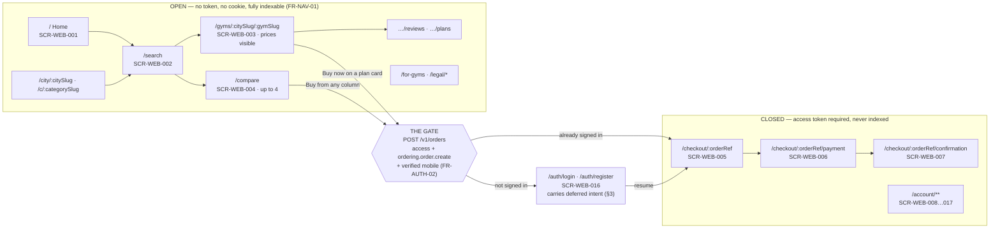
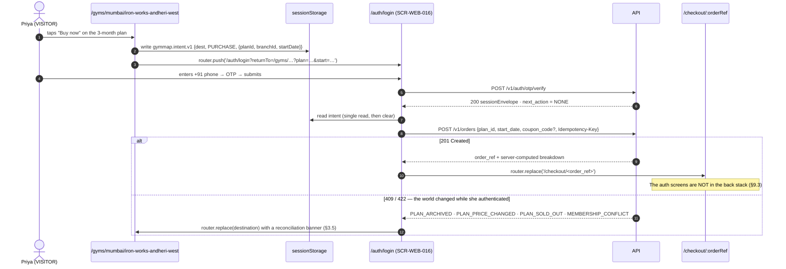
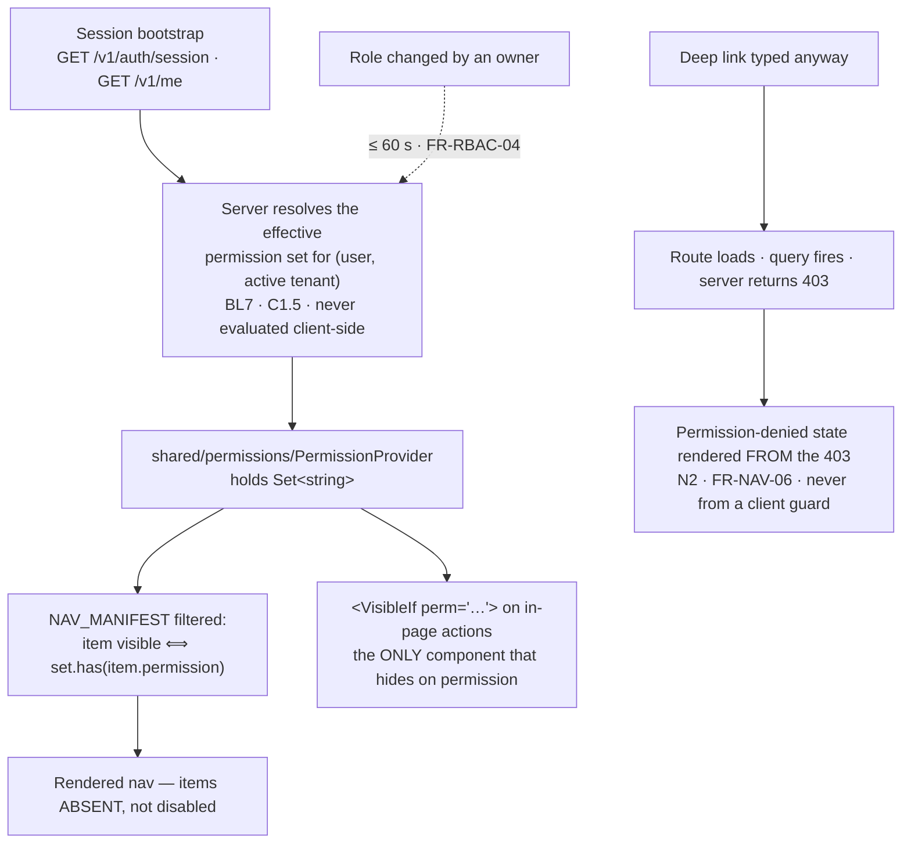
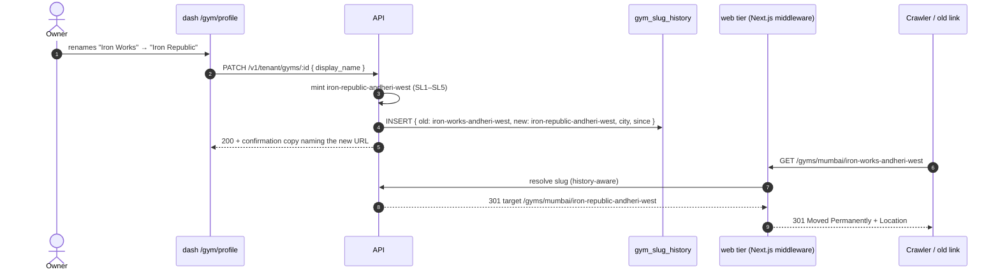
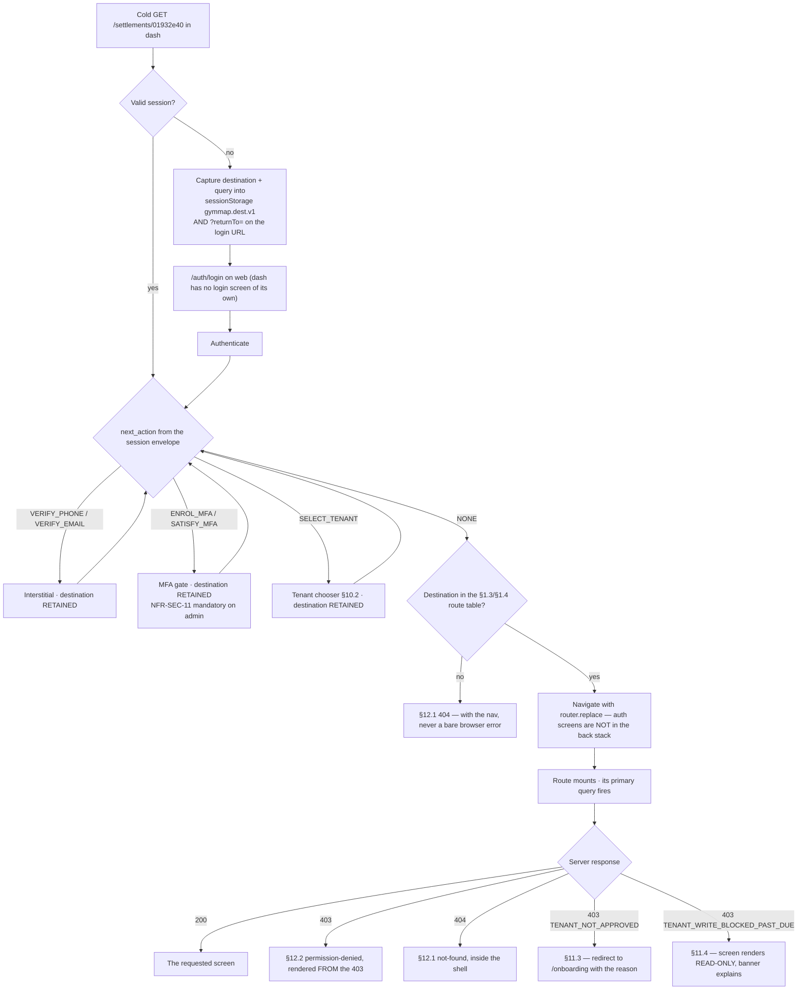
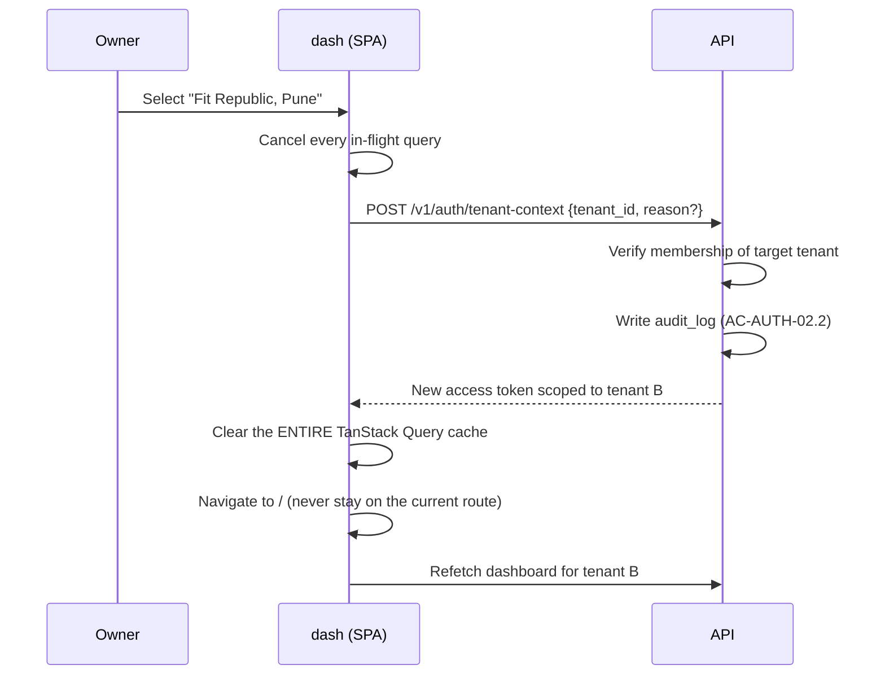
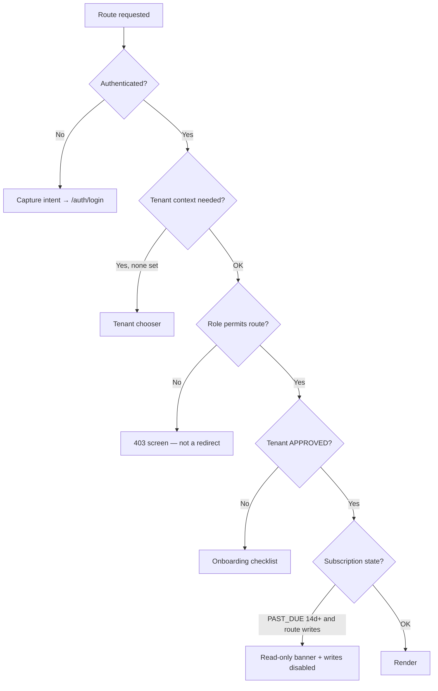

# Navigation — information architecture, route tables and navigation law across three surfaces


> **Amended 2026-08-08 by `ADR-0037`.** Every LAYOUT, column order, region list and wireframe in this
> document is **advisory** — the owner lifted visual prescription so a design is not bound to the
> arrangement recorded here. They remain the reasoned default and the reasoning is worth reading
> before departing from it.
>
> What is **not** advisory: the contrast floors, colour never carrying meaning alone, full keyboard
> operability, the four mandatory states, money rendered from server-computed minor units, and the
> rule that no screen shows a fabricated figure as though it were read from the database. Those are
> `MASTER_PRD.md` §B9 requirements and the `AX` rules, not style. `ADR-0037` lists them and says why
> each one breaks something real if removed.

**Surfaces:** `web` (`apps/customer-web`, Next.js 14 App Router, SSR for SEO) · `dash`
(`apps/gym-dashboard`, React 18 + Vite SPA) · `admin` (`apps/admin-dashboard`, React 18 + Vite SPA)
· **Launch market:** India (`LAUNCH_MARKET_INDIA.md`) · **Status:** specification frozen, **no
routing code exists**.

> **Every fenced block in this document is labelled `illustrative — not committed code`.** Route
> tables, guard sketches, TypeScript route manifests and URL grammars here are the *specification*
> expressed in the notation the implementation will use. A reviewer must not copy them verbatim
> expecting them to compile.

---

## 0. Document control

| Aspect | Value |
| :--- | :--- |
| **Owns** | The three route maps of `MASTER_PRD.md` §B4.1–§B4.3 in full; the six `FR-NAV-01` … `FR-NAV-06` navigation rules of §B4.4; URL-state encoding; breadcrumbs and the browser-back contract; tenant switching (`AC-AUTH-02.2`); route guards; and the three "not found / not allowed / no longer listed" screens |
| **Governing law** | `PROJECT_CONSTITUTION.md` §16 Frontend Rules — `NX1`–`NX9` (rendering and the gate), `DQ1`–`DQ7` (TanStack Query is the only data path), `LC1`–`LC8` (`useLiveCounters()` and the mandatory freshness indicator), `BL6` (permission hiding is presentation), `BL7` (flags resolve server-side), `AX1`–`AX9`, `I18N1`–`I18N6`, `FP3` (route-level code splitting). Nothing here may contradict it |
| **Product source** | `MASTER_PRD.md` §B3.1–§B3.2 (roles, permission matrix), §B4 (information architecture and navigation rules), §B6/§B7/§B8 (the 18 + 22 + 15 = 55 screens), §B9.6 (`NFR-USE-01` … `NFR-USE-09`) |
| **Contract source** | `docs/apis/README.md` §4 (authorisation), §5.4 (`404` versus `403`), §9 (error registry) · `Authentication.md` §5.2 (session envelope), §8.16–§8.17 (tenant contexts) · `Marketplace.md` §5.5 (slug uniqueness), §5.6 (`listing_state`) · `Search.md` §3.2 (the filter set the URL must carry) |
| **Placement source** | `docs/engineering/FolderStructure.md` §18 **F1** — *"a route file composes a feature and does nothing else"*; §17.2 frontend naming (`page.tsx` on `web`, `<subject>.route.tsx` on the SPAs) |
| **Sibling documents** | `DesignSystem.md` (tokens) · `Components.md` (primitive inventory) · `CustomerApp.md`, `GymDashboard.md`, `AdminDashboard.md` (per-screen specifications) · `Accessibility.md` (WCAG evidence) · `ResponsiveBehavior.md` (breakpoints) |
| **Not owned here** | Per-screen layout, copy and the four states of any individual screen — the three surface documents. Token values — `DesignSystem.md`. Endpoint shapes — `docs/apis/**`. Permission *enforcement* — `apps/server`; this document specifies only what a user is *shown* |

### 0.1 Precedence

`PROJECT_CONSTITUTION.md` → `MASTER_PRD.md` → `docs/apis/**` → `DesignSystem.md` → **this
document** → `CustomerApp.md`, `GymDashboard.md`, `AdminDashboard.md`. Where a surface document
states a route, a permission string or a guard behaviour that differs from this file, **this file
governs** and the surface document is a defect. Where this file appears to contradict anything above
it, the higher document wins and this file is the defect. Genuine contradictions are recorded in
§13.3, never silently resolved.

### 0.2 The eight sentences this document exists to enforce

1. **The customer site is fully browsable unauthenticated. The gate is at select-plan → checkout and
   nowhere earlier** (`FR-NAV-01`, `NX5`).
2. **After authentication the user lands back on the exact point of interruption with prior state
   intact** — selected plan, filters, comparison set (`FR-NAV-02`, `NX6`).
3. **A staff user never sees a menu item they cannot use** (`FR-NAV-03`) — and that filtering is
   ergonomics, never a security control (`FR-RBAC-02`, `BL6`).
4. **The onboarding checklist is persistent until `APPROVED` with ≥ 1 published plan** (`FR-NAV-04`),
   and it is a shell element, not a home-screen widget.
5. **Every gym detail page has one canonical, human-readable, stable URL** (`FR-NAV-05`) of the form
   `/gyms/{citySlug}/{gymSlug}`.
6. **A deep link into `dash` or `admin` resolves to the requested screen after authentication**
   (`FR-NAV-06`) — never to the dashboard home with the destination discarded.
7. **A URL is a shareable state.** Search location, all filters, sort and page live in the query
   string and are restored on load (`AC-SRCH-01.3`, `NX7`).
8. **Three different failures get three different screens.** A route that does not exist is a `404`;
   an action the user may not take is a `403` explanation; a gym that *was* live is an informational
   page and explicitly **not** a `404` (`FR-DETL-11`).

### 0.3 Reading the tables

| Column | Meaning |
| :--- | :--- |
| **Route** | The path exactly as `B4.1`/`B4.2`/`B4.3` specifies it. A `:param` is a path parameter |
| **Screen** | The `SCR-` identifier from `B6`, `B7` or `B8`. `—` means the route is a layout, a redirect or a landing page with no `SCR-` of its own |
| **Auth** | `none` = reachable by `VISITOR`; `access` = a valid access token; `access+mfa` = plus a satisfied MFA challenge (`FR-AUTH-07`, `NFR-SEC-11`); `access+tenant` = plus a resolved tenant context (`FR-AUTH-11`) |
| **Permission** | The three-segment permission string declared by the endpoint the screen's primary query calls (`README.md` §4, gate **PG-3**). `—` means no permission is required. **The nav uses the endpoint's vocabulary; it does not invent its own** |
| **Render** | `SSG`, `SSG+ISR`, `SSR`, `RSC shell + client`, or `SPA` (a lazily-imported Vite route). `FP3` requires route-level code splitting on all three surfaces |
| **Index** | The robots posture. `index,follow` · `noindex,follow` · `noindex,nofollow` |

---

## 1. The three route maps

### 1.1 Route-map invariants that hold on all three surfaces

| # | Invariant |
| :-: | :--- |
| **RM1** | **The route table is the complete list.** A path not in one of the three tables below does not exist and resolves to the `404` of §12.1. There is no catch-all that renders "something reasonable" |
| **RM2** | **A route file composes a feature and does nothing else** (`FolderStructure.md` **F1**). No fetch, no Zod schema, no business decision, no layout arithmetic in `page.tsx` or `*.route.tsx` |
| **RM3** | **Every route is lazily imported** (`FP3`). On `web` this is the App Router's segment boundary; on the SPAs it is `lazy()` in `src/routes/router.tsx` |
| **RM4** | **Every route declares its four states** (`§16.9`): loading, empty, error, permission-denied. On `web` this is `loading.tsx` + `error.tsx` + `not-found.tsx` per segment; on the SPAs it is the route component's own state machine driven by the query status |
| **RM5** | **Path parameters are opaque to the client.** `:orderRef`, `:id`, `:reportKey` and `cursor` are server-minted strings. The client never parses, increments or constructs one (`README.md` §7.2) |
| **RM6** | **No route encodes a tenant.** There is no `/t/:tenantId/...` anywhere. Tenant context comes from the access token and only from the access token (`README.md` §1.5 row 3, TD1). A route that carried a tenant id would be an authorisation boundary in a shareable string |
| **RM7** | **Trailing slashes are normalised away** by a 308 at the edge; `/search/` and `/search` are one URL, and only the slashless form is canonical |
| **RM8** | **Path segments are lower-case kebab.** `/for-gyms`, `/finance/reconcile`, `/moderation/reviews`. A camelCase or upper-case segment is a defect; an inbound one 308-redirects to the lower-case form |

### 1.2 Route map — customer website (`web`), `B4.1`

`apps/customer-web/app/**`. Thirty routes across four groups: **public marketplace** (indexable),
**checkout** (authenticated, never indexed), **account** (authenticated, never indexed) and
**auth / legal / acquisition**.

| Route | Screen | Auth | Permission | Render | Index |
| :--- | :--- | :--- | :--- | :--- | :--- |
| `/` | `SCR-WEB-001` | none | — | SSR static shell + client island for *Popular near you* | `index,follow` |
| `/search` | `SCR-WEB-002` | none | — | RSC shell + client | `noindex,follow` |
| `/city/:citySlug` | — (`FR-SRCH-13` landing) | none | — | SSG + ISR `revalidate: 3600` | `index,follow` |
| `/c/:categorySlug` | — (`FR-SRCH-13` landing) | none | — | SSG + ISR `revalidate: 3600` | `index,follow` |
| `/gyms/:citySlug/:gymSlug` | `SCR-WEB-003` | none | — | SSR, edge `s-maxage=300, swr=60` | `index,follow` (`noindex,follow` when `listing_state ≠ LIVE`) |
| `/gyms/:citySlug/:gymSlug/reviews` | `SCR-WEB-003` overflow | none | — | SSR page 1, client for pages 2+ | `index,follow` |
| `/gyms/:citySlug/:gymSlug/plans` | `SCR-WEB-003` overflow | none | — | SSR | `index,follow` |
| `/compare` | `SCR-WEB-004` | none | — | RSC shell + client | `noindex,follow` |
| `/checkout/:orderRef` | `SCR-WEB-005` | `access` | `ordering.order.read` | Client under an auth boundary | `noindex,nofollow` |
| `/checkout/:orderRef/payment` | `SCR-WEB-006` | `access` | `payments.payment.create` | Client | `noindex,nofollow` |
| `/checkout/:orderRef/confirmation` | `SCR-WEB-007` | `access` | `ordering.order.read` | Client, polls server state (`BR-PAY-02`) | `noindex,nofollow` |
| `/account` | `SCR-WEB-008` | `access` | `iam.profile.read` | Client under an authenticated RSC layout | `noindex,nofollow` |
| `/account/memberships` | `SCR-WEB-008` list | `access` | `memberships.membership.list_own` | Client | `noindex,nofollow` |
| `/account/memberships/:id` | `SCR-WEB-009` | `access` | `memberships.membership.read_own` | Client | `noindex,nofollow` |
| `/account/attendance` | `SCR-WEB-010` | `access` | `attendance.visit.list_own` | Client | `noindex,nofollow` |
| `/account/orders` | `SCR-WEB-011` | `access` | `ordering.order.list_own` | Client | `noindex,nofollow` |
| `/account/favourites` | `SCR-WEB-012` | `access` | `discovery.favourite.list` | Client | `noindex,nofollow` |
| `/account/reviews` | `SCR-WEB-013` list | `access` | `reviews.review.list_own` | Client | `noindex,nofollow` |
| `/account/reviews/:gymSlug/new` | `SCR-WEB-013` compose | `access` | `reviews.review.create` **plus** server eligibility | Client | `noindex,nofollow` |
| `/account/referrals` | `SCR-WEB-015` | `access` | `referrals.referral.read_own` | Client | `noindex,nofollow` |
| `/account/wallet` | — (Phase 2) | `access` | `referrals.wallet.read_own` | **Not routed in Phase 1** — see `RM9` below | — |
| `/account/profile` | `SCR-WEB-014` | `access` | `iam.profile.read` | Client | `noindex,nofollow` |
| `/account/support` | `SCR-WEB-017` | `access` | `support.ticket.list_own` | Client | `noindex,nofollow` |
| `/auth/login` | `SCR-WEB-016` | none | — | Client | `noindex,nofollow` |
| `/auth/register` | `SCR-WEB-016` | none | — | Client | `noindex,nofollow` |
| `/auth/verify` | `SCR-WEB-016` | partial (`next_action = VERIFY_PHONE`) | — | Client | `noindex,nofollow` |
| `/auth/forgot` | `SCR-WEB-016` | none | — | Client | `noindex,nofollow` |
| `/auth/reset` | `SCR-WEB-016` | none (token in query) | — | Client | `noindex,nofollow` |
| `/legal/terms`, `/legal/privacy`, `/legal/refunds` | — | none | — | SSG `revalidate: 86400` | `index,follow` |
| `/for-gyms` | `SCR-WEB-018` | none | — | SSG `revalidate: 86400` | `index,follow` |
| `/for-gyms/signup` | `SCR-WEB-018` flow | none | — | Client | `noindex,follow` |

| # | Rule |
| :-: | :--- |
| **RM9** | **`/account/wallet` is `B4.1`-declared and Phase-2 scoped.** In Phase 1 the path is **not registered**; it resolves to the §12.1 `404`, and no nav item points at it. Registering a route that renders "coming soon" trains users to distrust the nav. `A4.2` defers the wallet; `FR-REFR-*` Phase-2 work adds the route in the same commit as the screen |
| **RM10** | **`/auth/reset` is `B4.1`-implied.** `B4.1` lists four auth paths; `SCR-WEB-016` enumerates five screens including *Reset password*. The route is added here and recorded in §13.3 finding **N-F01** |
| **RM11** | **`/account/reviews/:gymSlug/new` is `SCR-WEB-013`'s compose route.** `B4.1` lists only `/account/reviews`; a compose surface needs an addressable route so that a "write a review" notification deep-links correctly (`FR-NAV-06`). Recorded as finding **N-F02** |
| **RM12** | The whole `/account/**` subtree, all three `/checkout/**` routes and all five `/auth/**` routes carry `Cache-Control: private, no-store` and `X-Robots-Tag: noindex, nofollow` from the layout, not from each page. A page that has to remember to opt out of indexing eventually forgets |

### 1.3 Route map — gym owner dashboard (`dash`), `B4.2`

`apps/gym-dashboard/src/routes/router.tsx`. Every route is `lazy()`. Every route requires
`access+tenant`; the tenant comes from the token (`RM6`). Permission strings are the ones the
endpoints declare — `GymDashboard.md` §1.3 carries the same vocabulary and must not diverge.

| Route | Screen | Auth | Permission | Render | Notes |
| :--- | :--- | :--- | :--- | :--- | :--- |
| `/` | `SCR-DASH-001` | `access+tenant` | — (always visible) | SPA | Content is role-reduced, not hidden: receptionists and trainers get a branch-scoped variant (`B7` Permission row) |
| `/onboarding` | `SCR-DASH-002` | `access+tenant` | `onboarding.application.read` | SPA | The only route reachable while the tenant is `DRAFT` (§11.3) |
| `/gym/profile` | `SCR-DASH-003` | `access+tenant` | `catalog.gym.read` | SPA | Write actions additionally need `catalog.gym.update` |
| `/gym/branches` | `SCR-DASH-004` | `access+tenant` | `catalog.branch.list` | SPA | |
| `/gym/branches/:id` | `SCR-DASH-004` detail | `access+tenant` | `catalog.branch.read` | SPA | `B4.2` says *"Branch list and detail"*; the detail needs a route (finding **N-F03**) |
| `/gym/kyc` | `SCR-DASH-002` panel | `access+tenant` | `onboarding.kyc_document.list` | SPA | |
| `/gym/payout` | `SCR-DASH-022` section | `access+tenant` | `settlements.payout_account.read` | SPA | Changing the account is a step-up action and suspends payouts (`BR-GYM-06`) |
| `/plans` | `SCR-DASH-005` | `access+tenant` | `plans.plan.list` | SPA | |
| `/plans/:id` | `SCR-DASH-006` | `access+tenant` | `plans.plan.read` | SPA | Editing needs `plans.plan.update`; publishing needs `plans.plan.publish` (`GYM_OWNER` only, `B3.2`) |
| `/plans/new` | `SCR-DASH-006` | `access+tenant` | `plans.plan.create` | SPA | Distinct route so "Create plan" is deep-linkable from the onboarding checklist |
| `/members` | `SCR-DASH-007` | `access+tenant` | `crm.member.list` | SPA | |
| `/members/new` | `SCR-DASH-007` walk-in | `access+tenant` | `crm.member.create` | SPA | |
| `/members/:id` | `SCR-DASH-008` | `access+tenant` | `crm.member.read` | SPA | Trainer sees assigned members only — a refusal, not a filtered list (`RB3`) |
| `/checkin` | `SCR-DASH-009` | `access+tenant` | `attendance.checkin.record` | SPA | WCAG **AA** (`NFR-USE-01`). Supports a persistent full-screen mode that hides the shell |
| `/attendance` | `SCR-DASH-010` | `access+tenant` | `attendance.log.view` | SPA | |
| `/sales` | `SCR-DASH-011` | `access+tenant` | `ordering.order.list` | SPA | |
| `/sales/offline` | `SCR-DASH-012` | `access+tenant` | `ordering.order.create_offline` | SPA | |
| `/invoices` | `SCR-DASH-013` | `access+tenant` | `billing.invoice.list` | SPA | |
| `/settlements` | `SCR-DASH-014` | `access+tenant` | `settlements.batch.list` | SPA | `GYM_OWNER` only (`B3.2` *View settlement statements*) |
| `/settlements/:batchId` | `SCR-DASH-014` detail | `access+tenant` | `settlements.batch.read` | SPA | Line-by-line statement; deep-linked from the payout notification |
| `/refunds` | `SCR-DASH-015` | `access+tenant` | `refunds.refund.list` | SPA | |
| `/coupons` | `SCR-DASH-016` | `access+tenant` | `ordering.coupon.list` | SPA | Create/edit is `GYM_OWNER`; `GYM_MANAGER` is read-only (`B3.2`) |
| `/leads` | `SCR-DASH-017` | `access+tenant` | `crm.lead.list` | SPA | |
| `/staff` | `SCR-DASH-018` | `access+tenant` | `staff.staff.list` | SPA | |
| `/staff/:id` | `SCR-DASH-018` detail | `access+tenant` | `staff.staff.read` | SPA | Last-owner protection is a server invariant (`FR-RBAC-07`, `RB4`) |
| `/trainers/sessions` | — (Phase 2 stub) | `access+tenant` | `training.session.list` | SPA | `B4.2` marks it *"Phase 2 surface, stubbed"*. **Routed but flag-gated** — see `RM13` |
| `/reviews` | `SCR-DASH-019` | `access+tenant` | `reviews.review.list` | SPA | |
| `/reports` | `SCR-DASH-020` | `access+tenant` | `reporting.report.read` | SPA | Catalogue |
| `/reports/:reportKey` | `SCR-DASH-020` detail | `access+tenant` | `reporting.report.read` | SPA | `:reportKey` is a server-published enum; an unknown key is a `404`, not an empty report |
| `/notifications` | `SCR-DASH-021` | `access+tenant` | — (own centre, always) | SPA | Template editing needs `notifications.template.update` and a tier that permits it |
| `/settings` | `SCR-DASH-022` | `access+tenant` | `tenancy.settings.read` | SPA | |
| `/settings/subscription` | `SCR-DASH-022` section | `access+tenant` | `billing.subscription.read` | SPA | **Never write-blocked** — see §11.4; it is the screen that clears the block |
| `/support` | — (`SCR-ADM-013` counterpart) | `access+tenant` | `support.ticket.list_own` | SPA | The tenant's own tickets, not the platform console |

| # | Rule |
| :-: | :--- |
| **RM13** | **`/trainers/sessions` differs from `/account/wallet` deliberately.** `B4.2` calls it a *stubbed Phase-2 surface*, so the route exists and renders an explicit "not available in this plan / coming in Phase 2" state behind `release.training.sessions`. `BL7`: the flag is resolved **server-side** and delivered with the session. `B4.1` calls the wallet *"(Phase 2)"* with no stub language, so it is unrouted (`RM9`). Two different words in the PRD, two different behaviours |
| **RM14** | The dashboard has **no `/logout` route**. Sign-out is a mutation (`POST /v1/auth/logout`) followed by a client navigation to `/auth/login` on `web`. A GET route that destroys a session is a CSRF affordance |
| **RM15** | `/checkin` is the only `dash` route allowed to suppress the navigation shell, and only in the persistent full-screen mode of `SCR-DASH-009`. Exiting requires `Esc` plus a confirmation, because an accidental exit mid-queue is disruptive |

### 1.4 Route map — super-admin console (`admin`), `B4.3`

`apps/admin-dashboard/src/routes/router.tsx`. **Every route requires `access+mfa`** — `NFR-SEC-11`
and `FR-AUTH-07` make MFA mandatory for all platform staff roles, so it is a property of the surface,
not of a screen. No route on this surface carries a tenant context; cross-tenant reads go through the
named, audited `runElevated()` path server-side (`README.md` §4, row 4).

| Route | Screen | Auth | Permission | Render | Notes |
| :--- | :--- | :--- | :--- | :--- | :--- |
| `/` | `SCR-ADM-001` | `access+mfa` | — (any platform role) | SPA | Tiles are individually permission-filtered; a `MODERATOR` sees moderation depth and system health, not GMV |
| `/approvals` | `SCR-ADM-002` | `access+mfa` | `onboarding.application.list_all` | SPA | |
| `/approvals/:id` | `SCR-ADM-003` | `access+mfa` | `onboarding.application.review` | SPA | Split document/checklist view |
| `/tenants` | `SCR-ADM-004` list | `access+mfa` | `admin.tenant.list` | SPA | |
| `/tenants/:id` | `SCR-ADM-004` detail | `access+mfa` | `admin.tenant.read` | SPA | Tabs are query state, not routes — §8.5 |
| `/users` | `SCR-ADM-005` | `access+mfa` | `admin.user.list` | SPA | |
| `/users/:id` | `SCR-ADM-005` detail | `access+mfa` | `admin.user.read` | SPA | Impersonation starts here; `SUPPORT_AGENT` and `SUPER_ADMIN` only (`B3.2`) |
| `/finance/orders` | `SCR-ADM-006` | `access+mfa` | `admin.order.list` | SPA | |
| `/finance/payments` | `SCR-ADM-006` | `access+mfa` | `admin.payment.list` | SPA | |
| `/finance/settlements` | `SCR-ADM-007` | `access+mfa` | `settlements.batch.list_all` | SPA | Approval above the dual-control threshold needs a second `FINANCE` principal |
| `/finance/refunds` | `SCR-ADM-008` | `access+mfa` | `refunds.refund.list_all` | SPA | |
| `/finance/disputes` | `SCR-ADM-009` | `access+mfa` | `refunds.dispute.list` | SPA | |
| `/finance/reconcile` | `SCR-ADM-010` | `access+mfa` | `settlements.reconciliation.read` | SPA | |
| `/config/commission` | `SCR-ADM-011` | `access+mfa` | `admin.config_commission.read` | SPA | Write is `SUPER_ADMIN`; `FINANCE` is `○` read-only (`B3.2`) |
| `/config/subscription` | `SCR-ADM-011` | `access+mfa` | `admin.config_subscription.read` | SPA | |
| `/config/tax` | `SCR-ADM-011` | `access+mfa` | `admin.config_tax.read` | SPA | India GST profile (`LAUNCH_MARKET_INDIA.md` §4) |
| `/config/kyc` | `SCR-ADM-011` | `access+mfa` | `admin.config_kyc.read` | SPA | India checklist (`LAUNCH_MARKET_INDIA.md` §6) |
| `/config/taxonomy` | `SCR-ADM-011` | `access+mfa` | `admin.config_taxonomy.read` | SPA | The one config family a `MODERATOR` can reach (`B3.2` *Manage taxonomy*) |
| `/config/flags` | `SCR-ADM-011` | `access+mfa` | `admin.feature_flag.read` | SPA | `SUPER_ADMIN` only for writes (`B3.2` *Toggle feature flags*) |
| `/config/notifications` | `SCR-ADM-011` | `access+mfa` | `notifications.template.list` | SPA | |
| `/moderation/reviews` | `SCR-ADM-012` | `access+mfa` | `reviews.moderation.list` | SPA | |
| `/moderation/content` | `SCR-ADM-012` | `access+mfa` | `admin.moderation_content.list` | SPA | |
| `/moderation/reports` | `SCR-ADM-012` | `access+mfa` | `admin.moderation_report.list` | SPA | |
| `/support/tickets` | `SCR-ADM-013` | `access+mfa` | `support.ticket.list` | SPA | |
| `/support/tickets/:id` | `SCR-ADM-013` detail | `access+mfa` | `support.ticket.read` | SPA | Deep-linked from the SLA breach alert |
| `/analytics` | `SCR-ADM-014` | `access+mfa` | `reporting.platform_report.read` | SPA | |
| `/audit` | `SCR-ADM-015` | `access+mfa` | `audit.audit_log.search` | SPA | Every platform role has at least `○` here (`B3.2` *View audit log*) |
| `/admin/users` | `SCR-ADM-005` variant | `access+mfa` | `admin.staff.list` | SPA | Platform staff and roles — `SUPER_ADMIN` only |

| # | Rule |
| :-: | :--- |
| **RM16** | **`/admin/users` and `/users` are two screens, not one with a filter.** `B4.3` lists both. `/users` is platform-wide *customer* administration; `/admin/users` is *platform staff* administration and `SUPER_ADMIN`-only (`B3.2` *Manage platform users*). Collapsing them would put a staff-role editor behind a `SUPPORT_AGENT`'s permission |
| **RM17** | **Detail routes for approvals, tenants, users, tickets and settlements are real routes, not modals.** An admin who cannot paste a link to an application into a Slack thread will screenshot it instead, and a screenshot of KYC documents is a privacy incident |
| **RM18** | The console has **no public route at all**. `/` behind an unauthenticated request 302s to the sign-in screen with the destination captured (§7). There is no marketing page, no password-reset self-service (staff reset is an operator action), and no registration route |

### 1.5 Where a route lives, and the one shape it takes

`FolderStructure.md` §18 **F1**: *"customer-web: `app/<path>/page.tsx` · SPA:
`src/routes/<subject>.route.tsx`"*, and a route file *"composes a feature and does nothing else"*.

```text
illustrative — not committed code

apps/customer-web/app/
  layout.tsx                                  root shell, <head>, skip link, i18n provider
  page.tsx                                    SCR-WEB-001
  search/page.tsx  loading.tsx  error.tsx     SCR-WEB-002
  gyms/[citySlug]/[gymSlug]/
    page.tsx  loading.tsx  not-found.tsx      SCR-WEB-003  (+ opengraph-image.tsx)
    reviews/page.tsx · plans/page.tsx
  compare/page.tsx
  city/[citySlug]/page.tsx · c/[categorySlug]/page.tsx
  checkout/[orderRef]/{page,payment/page,confirmation/page}.tsx
  (authed)/account/layout.tsx                 the auth boundary — ONE place, not per page
  (authed)/account/**/page.tsx
  auth/{login,register,verify,forgot,reset}/page.tsx
  for-gyms/page.tsx · for-gyms/signup/page.tsx
  legal/{terms,privacy,refunds}/page.tsx

apps/gym-dashboard/src/routes/
  router.tsx                                  the ONLY route table; every entry lazy()
  dashboard-home.route.tsx · onboarding.route.tsx · checkin-desk.route.tsx · …

apps/admin-dashboard/src/routes/
  router.tsx
  approval-queue.route.tsx · application-review.route.tsx · …
```

| # | Rule |
| :-: | :--- |
| **RM19** | **One route table per SPA.** A second `routes.ts`, a per-feature router, or a route registered by a side effect at import time is forbidden — the same reasoning `FolderStructure.md` §19 row 2 applies to the server's routing |
| **RM20** | **The authentication boundary is a layout, not a per-page check.** On `web` it is `app/(authed)/account/layout.tsx` and the `checkout/[orderRef]/layout.tsx`; on the SPAs it is a single `<RequireSession>` wrapper in `router.tsx`. Twenty-two pages that each remember to check is twenty-two chances to forget |
| **RM21** | **A route never guards on permission by itself.** It renders the permission-denied state from a **server `403`** (`GymDashboard.md` **N2**). The client-side filter of §4 decides what to *show in the menu*; the server decides what is *allowed* |
| **RM22** | Route-level `Suspense` boundaries wrap the feature, and the fallback is the skeleton that matches the eventual layout — never a spinner over a blank page (`§16.9` Loading row) |

---

## 2. `FR-NAV-01` — the customer site is browsable unauthenticated, and the gate sits at checkout

> **`FR-NAV-01`** *"The customer website is fully browsable without authentication; the auth gate
> appears at 'select plan → checkout' and nowhere earlier."*
> **`NX5`** *"…so everything above it stays server-renderable and indexable."*

This is not a courtesy. `A3.3`'s discovery funnel and `OBJ-02` depend on organic search reaching a
gym detail page with prices visible; a gate above the price destroys the indexable surface, and
`B3.2` grants `VISITOR` a full `●` on both *Browse marketplace* and *View plan prices*.

### 2.1 Where the boundary sits



### 2.2 Exactly what a visitor with no account can reach

Enumerated, because "fully browsable" is the kind of phrase an implementation quietly narrows.

| Capability | Reachable by `VISITOR`? | Authority |
| :--- | :-: | :--- |
| Home, including *Popular near you* and the trust strip | **Yes** | `SCR-WEB-001`; `B3.2` *Browse marketplace* `●` |
| Search with every one of the fourteen filters, every sort, and the map | **Yes** | `Search.md` §3 — `@Public()`, the only permission-free endpoint class |
| Live filter result counts (facets) | **Yes** | `Search.md` §3.7 |
| Search-as-you-type suggestions | **Yes** | `Search.md` §6 |
| City and category landing pages | **Yes** | `FR-SRCH-13` |
| Gym detail: gallery, amenities, timings, gender policy, description, map, directions | **Yes** | `FR-DETL-01` |
| **Plan prices, monthly equivalents, joining fees, inclusions, access windows** | **Yes** | `B3.2` *View plan prices* `●`; `FR-DETL-02`, `FR-DETL-03` |
| Rating summary and the 1–5 distribution | **Yes** | `FR-DETL-04` |
| Full paginated, sortable, filterable review list with gym responses | **Yes** | `FR-DETL-05` |
| Similar gyms nearby | **Yes** | `FR-DETL-01` |
| Share a gym with correct link-preview metadata | **Yes** | `FR-DETL-07` |
| **Comparison of up to four gyms**, including adding, removing and buying from a column | **Yes** to compare; the buy raises the gate | `B3.2` *Compare gyms* `●`; `FR-DETL-08` |
| `/for-gyms`, pricing tiers, FAQ | **Yes** | `SCR-WEB-018` |
| Legal pages | **Yes** | `B4.1` |
| **Favourite a gym** | **No** — gate, with the favourite replayed after login | `B3.2` *Save favourites* `—` for `VISITOR`; `FR-FAV-03`, `AC-FAV-01.1` |
| **Report this gym** | **No** — gate | `FR-DETL-06` *"available to any authenticated user"* |
| **Buy a plan** | **No** — **this is the gate** | `B3.2` *Purchase membership* `—` for `VISITOR` |
| **Write a review** | **No** — gate **plus** server-side eligibility | `B3.2` *Submit review* `▪` for `MEMBER`; `FR-REV-01` |
| Anything under `/account/**` | **No** — gate at the layout boundary | `RM20` |

### 2.3 The four gates, and the fact that only one of them is *the* gate

| # | Trigger | Gate component | Where it appears | Return behaviour |
| :-: | :--- | :--- | :--- | :--- |
| 1 | **Buy now** on a plan card (`SCR-WEB-003`, `SCR-WEB-004`, `/plans` overflow) | `AuthGate` with `intent="purchase"` | An interstitial at `/auth/login?returnTo=…`, **not** a modal | Returns to the plan, then continues straight into `POST /v1/orders` (§3.4) |
| 2 | **Favourite** toggle (`SCR-WEB-002`, `003`, `004`) | Same component, `intent="favourite"` | Inline sheet on mobile, popover on desktop | Replays the favourite mutation, then restores scroll to the same card |
| 3 | **Report this gym** | Same component, `intent="report"` | Sheet | Reopens the report dialog with the reason preselected |
| 4 | **Write a review** | Same component, `intent="review"` | Interstitial | After auth, the server eligibility check runs; ineligible renders the `SCR-WEB-013` explanation, not a second gate |

Only gate 1 is *the* `FR-NAV-01` gate — it is the point at which the platform must know who is
buying, and `FR-AUTH-02` additionally requires a **verified mobile** before any purchase. Gates 2–4
are consequences of `B3.2` denying those capabilities to `VISITOR`, and they are deliberately
lighter: a sheet, not a page.

### 2.4 What the gate must never do

| # | Prohibition | Why |
| :-: | :--- | :--- |
| **G1** | **Never gate a price.** No "sign in to see prices", no blurred figures, no "from ₹X" placeholder that resolves after login | `B3.2` grants `VISITOR` `●` on *View plan prices*; `A3.4` guiding principle of honest pricing; `BR-PLN-03` |
| **G2** | **Never gate on scroll depth, page count or a timer.** There is no soft wall | `FR-NAV-01` says *"and nowhere earlier"* |
| **G3** | **Never gate the map, the reviews, or the comparison** | `FR-DETL-05`, `FR-DETL-08`, `B3.2` |
| **G4** | **Never show a modal that cannot be dismissed** on a public page. Every gate is dismissible and returns the visitor to exactly where they were | `NFR-USE-05` |
| **G5** | **Never redirect an anonymous visitor to `/auth/login` from a public route.** The gate is raised by an *action*, never by a *route* | `NX5` |
| **G6** | **Never let a client-side session probe blank the page.** If `GET /me` is in flight, public content renders; if it fails, the visitor is treated as anonymous **and told** — *"We couldn't check whether you're signed in."* Never assume authenticated | `§16.9` Error row, `NFR-USE-05` |
| **G7** | **Never require an account to reach a shared link.** A WhatsApp-forwarded `/gyms/mumbai/iron-works-andheri-west` opens for a stranger with no interstitial | `FR-DETL-07`, `FR-NAV-05` |

---

## 3. `FR-NAV-02` — returning to the exact point of interruption

> **`FR-NAV-02`** *"After authentication the user returns to the exact point of interruption with
> prior state intact (selected plan, filters, comparison set)."*
> **`NX6`** *"That state lives in the URL and in server-persisted state, never only in memory."*
> **`AC-AUTH-01.2`** *"…I return to whatever I was doing before registration was required."*
> **`AC-FAV-01.1`** *"…the gym is in my favourites and I am returned to where I was."*

The mechanism is named **deferred intent**. It has exactly three parts: a **destination**, an
optional **replayable action**, and the **ambient state** that made the destination meaningful.
`Marketplace.md` §1969 confirms the shape: *"No endpoint implements this; the mechanism is
`FR-NAV-02` deferred intent."* It is a client mechanism with a server-validated destination.

### 3.1 What is captured

| Part | Content | Example |
| :--- | :--- | :--- |
| **Destination** | The full same-origin path **plus query string** of the page the user was on when the gate rose | `/gyms/mumbai/iron-works-andheri-west?tab=plans` |
| **Intent** | A closed enum naming what they were trying to do: `PURCHASE`, `FAVOURITE`, `REPORT`, `REVIEW`, `ACCOUNT` | `PURCHASE` |
| **Intent payload** | The minimum the action needs to be replayed — **never a price, never a total** | `{ planId, branchId, startDate }` |
| **Ambient state** | Whatever the destination itself needs to look the same: filters, sort, cursor, scroll anchor, comparison set | already in the destination's query string (`NX7`) |

### 3.2 Where each piece is stored, and for how long

| State | Storage | Key | TTL | Survives | Restored by |
| :--- | :--- | :--- | :--- | :--- | :--- |
| Search location, `q`, all fourteen filters, sort, cursor | **URL query string** | — | Life of the URL | Reload, share, back, login | The router, rewritten from the server's `applied_filters` echo (§8.3) |
| Comparison set (≤ 4 gym ids) | URL on `/compare`; `localStorage` mirror for cross-page persistence | `gymmap.compare.v1` | **30 days**, sliding on each write | Reload, login, tab close (`FR-DETL-09`, `AC-DETL-01.3`) | Rehydrated on app mount; merged, not replaced, when a session appears |
| Deferred intent (destination + intent + payload) | **`sessionStorage`**, one slot, plus a `returnTo` on the auth URL as the durable half | `gymmap.intent.v1` | **30 minutes**, and cleared on consumption | The auth round-trip, an OTP screen, a page reload during auth | `useDeferredIntent()` on the first authenticated render |
| Selected plan at the gate | Encoded in `returnTo`: `?plan=<planId>&branch=<branchId>&start=<YYYY-MM-DD>` | — | Life of the auth URL | An email-link login on another tab | The destination page reads its own query |
| Pending favourite | `returnTo` + `?pendingFavourite=<gymId>` | — | Life of the auth URL | Same | Replayed as a mutation once a session exists (`AC-FAV-01.1`) |
| Checkout order | **Server.** The `orderRef` is a path segment | — | The order's own expiry (`SCR-WEB-005` *order expired* state) | Everything | `GET /v1/orders/:orderRef` |
| Onboarding wizard progress (`dash`) | **Server, in rows** (`FR-ONB-01`, `FM4`) | — | Indefinite | Six weeks of abandonment (`B5.3` edge case) | `GET /v1/tenant/applications/current` |
| Draft review text | `sessionStorage`, keyed by gym slug | `gymmap.review-draft.<gymSlug>` | Tab lifetime, cleared on submit | A token refresh mid-typing | The compose screen on mount |
| Scroll anchor on `/search` | URL fragment `#g-<gymId>` written on card click | — | Life of the URL | Back from detail | Scroll-into-view on restore, with `scroll-margin-top` clearing the sticky header |

| # | Rule |
| :-: | :--- |
| **DI1** | **`localStorage` and `sessionStorage` are caches of URL-expressible state, never the source of truth.** Anything that cannot be reconstructed from the URL or the server is allowed to be lost, and the UI must not depend on it |
| **DI2** | **The intent slot holds one intent.** A second gate overwrites the first. Queuing intents produces a login that fires three mutations, which is indistinguishable from a bug |
| **DI3** | **No money, no total, no tax, no coupon-derived amount is ever stored in an intent.** `FM8`, `BR-PAY-04`: checkout submits a plan id, a start date, an optional coupon code and an idempotency key |
| **DI4** | **Storage keys are versioned** (`.v1`). A shape change bumps the suffix and the old key is ignored, never migrated in place by guesswork |
| **DI5** | **Every stored value is namespaced `gymmap.`** so a `localStorage` audit can enumerate exactly what the platform put on a stranger's device, which the privacy policy has to be able to state (`NFR-PRV-01`, `NFR-PRV-06`) |

### 3.3 The `returnTo` contract

```ts
// illustrative — not committed code
// apps/customer-web/src/shared/navigation/safe-return-to.ts

const ROUTE_ALLOWLIST: RegExp[] = [
  /^\/$/,
  /^\/search(\?.*)?$/,
  /^\/compare(\?.*)?$/,
  /^\/city\/[a-z0-9-]{2,80}$/,
  /^\/c\/[a-z0-9-]{2,80}$/,
  /^\/gyms\/[a-z0-9-]{2,80}\/[a-z0-9-]{3,120}(\/(reviews|plans))?(\?.*)?$/,
  /^\/account(\/[a-z0-9-/:]+)?$/,
  /^\/checkout\/[A-Za-z0-9_-]{8,64}(\/(payment|confirmation))?$/,
];

export function safeReturnTo(raw: string | null): string {
  if (!raw) return '/account';
  if (!raw.startsWith('/') || raw.startsWith('//')) return '/account';  // absolute + protocol-relative
  if (raw.length > 2048) return '/account';
  return ROUTE_ALLOWLIST.some((p) => p.test(raw)) ? raw : '/account';
}
```

| # | Rule |
| :-: | :--- |
| **RT1** | **`returnTo` is validated against a same-origin route-pattern allowlist before any navigation.** An open redirect on an auth path is a security defect, not a UX inconvenience |
| **RT2** | A rejected `returnTo` falls back to `/account` on `web`, `/` on `dash`, `/` on `admin` — and the rejection is logged as a signal, because a stream of them is either a bug or an attack |
| **RT3** | `returnTo` is **never** rendered into the page as text or into a link's visible label. It is a navigation input only |
| **RT4** | The auth screens do **not** trust `returnTo` to describe the intent. The intent enum is read from `sessionStorage`; `returnTo` only says *where*. Two sources, so a tampered URL cannot make the app fire a mutation it was never asked to fire |
| **RT5** | On `dash` and `admin` the same function exists with those surfaces' own route patterns. Three surfaces, three allowlists, one shape |

### 3.4 The replay sequence



| # | Rule |
| :-: | :--- |
| **RP1** | The intent is read **once** and cleared in the same tick. A replay that survives a failure would re-fire on the next page load |
| **RP2** | The replay uses `router.replace`, so `Back` from checkout returns to the **gym page**, not to the login screen (`§9.3`) |
| **RP3** | If `next_action ≠ NONE` — `VERIFY_PHONE` for `FR-AUTH-02`, `ENROL_MFA`, `SELECT_TENANT` — the intent is **retained**, the interstitial is shown, and the replay happens after the interstitial clears. `Authentication.md` `SE3` makes `next_action` an open enum; an unknown value falls back to `NONE` and the replay proceeds |
| **RP4** | The replay carries a fresh **`Idempotency-Key`** derived from `(intent id, plan id, start date)`, so a double-submit across two tabs yields one order (`BR-PAY-03`, `FM6`) |
| **RP5** | Between the OTP submit and the replay result, the screen shows a determinate "Setting up your order" state — never a bare spinner, and never the login form again |
| **RP6** | Registration and login share the mechanism exactly. `AC-AUTH-01.2` requires the return after **registration**, which is the harder case because the account did not exist when the intent was captured |

### 3.5 What happens when the world changed while they were authenticating

An OTP round trip is 20–60 seconds. In that window a plan can be archived, repriced, filled, or made
ineligible. `BR-PLN-03` is unambiguous: *"a mismatch aborts checkout with an explicit message rather
than silently charging either figure."* This table is the complete reconciliation set.

| Server response to the replayed `POST /v1/orders` | What actually happened | Where the user lands | What they are told (`NFR-USE-05`: what, why, what next) |
| :--- | :--- | :--- | :--- |
| `201 Created` | Nothing changed | `/checkout/:orderRef` | Nothing — proceed silently |
| `409 PLAN_PRICE_CHANGED` | The gym repriced between capture and replay | **The gym page**, plan panel scrolled into view, plan highlighted | *"The price of the 3-month plan changed while you were signing in — it is now ₹4,500 instead of ₹4,200. Nothing has been charged. Review the plan and continue if you'd like."* Old and new both shown, per `SCR-WEB-005`'s blocking-modal rule |
| `422 PLAN_ARCHIVED` | The plan was archived (`BR-PLN-04`) | The gym page, plans section | *"That plan is no longer offered by Iron Works. Nothing has been charged. Here are their current plans."* The alternatives are the gym's own live plans, listed, not a link |
| `422 PLAN_SOLD_OUT` / capacity exhausted | The plan hit its cap | The gym page, plans section | *"That plan is fully booked. Nothing has been charged. These plans at Iron Works are still available."* |
| `422 PLAN_NOT_ELIGIBLE` (age / gender per `BR-PLN-01`) | The account that just authenticated does not satisfy the plan's eligibility | The gym page, plans section | *"This plan is for members aged 18 and over. Nothing has been charged. Other plans at this gym are open to you."* — states the rule, never "you are not eligible" alone |
| `422 MEMBERSHIP_CONFLICT` (`BR-MEM-04`) | The authenticated identity already holds a non-stackable membership at this gym | `/account/memberships/:id` for the **existing** membership | *"You already have an active membership at Iron Works that runs until 14 Mar 2027. You can renew it or change your plan from here."* Renewal is offered, not a dead end |
| `403 PHONE_NOT_VERIFIED` | `FR-AUTH-02` — a verified mobile is mandatory before purchase | **Inline** verification step inside the gate, not a redirect out of the flow | *"We need to verify your mobile number before you can buy. We've sent a 6-digit code to +91 ••••• 43210."* Intent retained (`RP3`) |
| `403 TENANT_SUSPENDED` / gym delisted mid-flow | `BR-TEN-05`, or the gym moved to a non-`LIVE` `listing_state` | The gym URL, which now renders the §12.3 informational page | *"This gym isn't taking new memberships right now. Nothing has been charged."* plus nearby alternatives — and **no reason is given** (`Marketplace.md` LS2) |
| `409 ORDER_ALREADY_EXISTS` (idempotency replay) | The same intent replayed twice across tabs | `/checkout/:orderRef` of the **original** order | Nothing — this is the idempotency contract working (`BR-PAY-03`) |
| `503` / network failure | The API is unavailable | The gym page | *"We couldn't start your order. Nothing has been charged. Try again."* with a retry that re-uses the same idempotency key |

| # | Rule |
| :-: | :--- |
| **RC1** | **Every reconciliation message contains the sentence "Nothing has been charged."** The user has just handed over a phone number and an OTP; the single question in their head is whether money moved |
| **RC2** | **The user is never dumped on the home page.** Every outcome lands on the gym, the existing membership, or the checkout — a destination that carries the thing they were trying to buy |
| **RC3** | **The gate is not re-raised.** They are authenticated now. Re-showing a login screen after a failed replay is the most common implementation of this requirement and it is wrong |
| **RC4** | **The intent is cleared even on failure** (`RP1`), so a reload does not re-fire the order attempt |
| **RC5** | **The comparison set and search filters are untouched by any of this.** They live in the URL and in `localStorage` and are still there when the user backs out to `/search` |
| **RC6** | Price-change reconciliation reuses the **same component** as `SCR-WEB-005`'s in-checkout price-change modal. One implementation, two entry points — because two implementations of a `BR-PLN-03` disclosure will eventually disagree |

---

## 4. `FR-NAV-03` — navigation filtered by effective permission

> **`FR-NAV-03`** *"Dashboard navigation is filtered by effective permission; a user never sees a
> menu item they cannot use."*
> **`FR-RBAC-02`** *"Permission checks are enforced server-side. **Client-side hiding of UI is
> presentation only and never a security control.**"*
> **`BL6`**, **`RB5`**, **`GymDashboard.md` N1–N2** say the same thing three more times.

### 4.0 The roles this section covers

`B3.1` defines twelve roles. Three are consumer-side (`VISITOR`, `USER`, `MEMBER`) and have no staff
navigation at all — their surface is `web` and their "nav" is the account menu of `SCR-WEB-008`. The
remaining **nine** are the staff roles, and every one of them gets an explicit tree below:

| Scope | Roles | Surface |
| :--- | :--- | :--- |
| **Tenant** (4) | `GYM_OWNER`, `GYM_MANAGER`, `RECEPTIONIST`, `TRAINER` | `dash` |
| **Platform** (5) | `SUPER_ADMIN`, `VERIFICATION_OFFICER`, `SUPPORT_AGENT`, `FINANCE`, `MODERATOR` | `admin` |

Roles are **additive within a scope** (`B3.1`) and evaluation is always `(role, scope, resource,
action)` — never role alone. A user holding `MEMBER` at platform scope and `GYM_OWNER` at tenant
scope sees the customer account menu on `web` and the full owner tree on `dash`; neither leaks into
the other.

### 4.1 The mechanism



| # | Rule |
| :-: | :--- |
| **NP1** | **The permission set is resolved server-side and delivered on session bootstrap.** The client never evaluates a role name, a targeting rule or a feature-flag predicate (`BL7`, `C1.5`) |
| **NP2** | The set is a flat `Set<string>` of three-segment permission strings — the **same** strings the endpoints declare (gate **PG-3**). The nav does not invent a parallel vocabulary, so a permission rename breaks the build in one place |
| **NP3** | **`roles` from the session envelope is not a permission list.** `Authentication.md` `SE2`: `["MEMBER@self","OWNER@t:9f2a…"]` is scope codes. A client that renders navigation from role strings has re-implemented authorisation in the browser |
| **NP4** | **`FR-RBAC-04`: role changes take effect within 60 seconds without re-authentication.** The set is refetched on window focus and on a 60-second interval; the nav re-renders when it changes. A demoted manager does not sign out — the menu item disappears under them, and the screen they are on renders its permission-denied state on the next query |
| **NP5** | **Items are absent, not greyed.** A disabled menu item advertises a capability and invites a support ticket. `FR-NAV-03` says *"never sees"* |
| **NP6** | **A group header with zero visible children is itself absent.** An empty "Money" heading is worse than no heading |
| **NP7** | **Badge counts come from `useLiveCounters()`** (`LC1`) and inherit its freshness contract: a nav badge is a polled figure and the nav footer carries the one shared "Updated 12 s ago" indicator (`LC5`). There is no second poll for badges |
| **NP8** | The manifest is **one file per surface** — `src/shared/navigation/nav-manifest.ts` — and it is data, not JSX. A nav item declared inline in a layout is unreviewable against `B3.2` |

```ts
// illustrative — not committed code
// apps/gym-dashboard/src/shared/navigation/nav-manifest.ts
export type NavItem = {
  id: string;                 // stable; used by analytics and by the E2E selectors
  labelKey: string;           // I18N1 — a key, never a literal
  to: string;                 // must exist in the §1.3 route table
  screen: string;             // SCR- id, for traceability
  permission?: string;        // undefined ⇒ always visible
  badge?: 'refundsPending' | 'reviewsUnanswered' | 'leadsNew';   // served by useLiveCounters()
};
export type NavGroup = { id: string; labelKey: string; items: NavItem[] };
```

### 4.2 The tenant nav trees — all four `dash` roles

The vocabulary matches `GymDashboard.md` §1.3 exactly. `●` full · `▪` own/assigned only · `○` read
only · `—` none, as in `B3.2`.

#### 4.2.1 `GYM_OWNER` — full authority over the tenant

```text
illustrative — not committed code

  Home                    /                      SCR-DASH-001   (always)
  Setup ▸ checklist       /onboarding            SCR-DASH-002   onboarding.application.read   ← §5
GYM
  Profile                 /gym/profile           SCR-DASH-003   catalog.gym.read
  Branches                /gym/branches          SCR-DASH-004   catalog.branch.list
  KYC                     /gym/kyc               SCR-DASH-002   onboarding.kyc_document.list
  Payout account          /gym/payout            SCR-DASH-022   settlements.payout_account.read
SELL
  Plans                   /plans                 SCR-DASH-005   plans.plan.list
  Coupons                 /coupons               SCR-DASH-016   ordering.coupon.list
  Leads            ● 7    /leads                 SCR-DASH-017   crm.lead.list
PEOPLE
  Members                 /members               SCR-DASH-007   crm.member.list
  Staff                   /staff                 SCR-DASH-018   staff.staff.list
DESK
  Check-in                /checkin               SCR-DASH-009   attendance.checkin.record
  Attendance              /attendance            SCR-DASH-010   attendance.log.view
  Record sale             /sales/offline         SCR-DASH-012   ordering.order.create_offline
MONEY
  Sales & orders          /sales                 SCR-DASH-011   ordering.order.list
  Invoices                /invoices              SCR-DASH-013   billing.invoice.list
  Settlements             /settlements           SCR-DASH-014   settlements.batch.list
  Refunds          ● 2    /refunds               SCR-DASH-015   refunds.refund.list
INSIGHT
  Reviews          ● 4    /reviews               SCR-DASH-019   reviews.review.list
  Reports                 /reports               SCR-DASH-020   reporting.report.read
SYSTEM
  Notifications           /notifications         SCR-DASH-021   (always — own centre)
  Settings                /settings              SCR-DASH-022   tenancy.settings.read
  Support                 /support                              support.ticket.list_own
```

Everything. `B3.2` gives `GYM_OWNER` `●` on every tenant-scoped capability including *Publish plan*,
*Add/remove branch*, *Change payout bank account*, *Export tenant data* and *View settlement
statements* — and `▪` on *View audit log*, which is why an **Activity** panel appears inside
`/settings` rather than as its own nav item.

#### 4.2.2 `GYM_MANAGER` — operational authority over assigned branches

```text
illustrative — not committed code

  Home                    /                      (reduced to assigned branches)
GYM
  Profile                 /gym/profile           catalog.gym.read      ← ▪ edit on assigned branches
  Branches                /gym/branches          catalog.branch.list   ← read; no create, no deactivate
SELL
  Plans                   /plans                 plans.plan.list       ← READ-ONLY (B3.2 gives ○)
  Coupons                 /coupons               ordering.coupon.list  ← READ-ONLY (○)
  Leads            ● 7    /leads                 crm.lead.list
PEOPLE
  Members                 /members               crm.member.list
  Staff                   /staff                 staff.staff.list      ← ▪ invite/manage within branches
DESK
  Check-in                /checkin               attendance.checkin.record
  Attendance              /attendance            attendance.log.view
  Record sale             /sales/offline         ordering.order.create_offline
MONEY
  Sales & orders          /sales                 ordering.order.list
  Invoices                /invoices              billing.invoice.list
  Refunds          ● 2    /refunds               refunds.refund.list   ← raise, not approve
INSIGHT
  Reviews          ● 4    /reviews               reviews.review.list   ← respond ● (B3.2)
  Reports                 /reports               reporting.report.read ← ▪ own branches
SYSTEM
  Notifications           /notifications
```

**Absent, and why:** `/gym/kyc` (`Review KYC documents` is platform-only) · `/gym/payout` (*Change
payout bank account* `—`) · `/settlements` (*View settlement statements* `—`) · `/plans/new`,
`/plans/:id` edit affordances and the **Publish** action (*Publish plan to marketplace* `—`, *Create
/ edit plan* `○`) · **Add branch** and **Deactivate branch** (*Add / remove branch* `—`) ·
`/settings` (`tenancy.settings.read` not held) · **Export tenant data** (`—`).

#### 4.2.3 `RECEPTIONIST` — front desk

```text
illustrative — not committed code

  Home                    /                      (reduced: today's check-ins, expiring, at-risk — one branch)
DESK
  Check-in                /checkin               attendance.checkin.record   ← the default landing route
  Attendance              /attendance            attendance.log.view         ← ▪ own branch
  Record sale             /sales/offline         ordering.order.create_offline
PEOPLE
  Members                 /members               crm.member.list             ← ▪ edit own-created records
  Leads            ● 7    /leads                 crm.lead.list
SYSTEM
  Notifications           /notifications
```

Six items. **Absent:** the entire GYM group, the entire MONEY group, the entire SELL group except
Leads, the entire INSIGHT group, Staff, Settings. `B3.2` gives `RECEPTIONIST` `—` on *Create / edit
plan*, *View settlement statements*, *Invite / manage staff*, *Create coupon* and *Respond to
review*, and `▪` on *View branch attendance*, *Edit member record* and *View tenant reports*.

> **Sameer's screen is not a cut-down owner dashboard.** `B2.3` puts him at a counter with a queue.
> `RECEPTIONIST` **lands on `/checkin`, not `/`** — the only role with a non-`/` default route,
> because the first thing he does every shift is scan someone in. `Home` remains in the nav and
> remains reachable.

#### 4.2.4 `TRAINER` — assigned members and sessions

```text
illustrative — not committed code

  Home                    /                      (reduced: my members, my sessions, today's check-ins)
DESK
  Check-in                /checkin               attendance.checkin.record   ← scan only, NO manual override
  Attendance              /attendance            attendance.log.view         ← ▪ assigned members
PEOPLE
  My members              /members               crm.member.list             ← ▪ assigned only
SELL
  (nothing)
SYSTEM
  Notifications           /notifications
  Sessions (Phase 2)      /trainers/sessions     training.session.list       ← behind release.training.sessions
```

**Absent:** Record sale (*Record offline payment* `—`), Leads, Staff, all of MONEY, all of INSIGHT,
Settings, and the **Manual check-in override** action inside `/checkin` — `B3.2` gives `TRAINER` `●`
on *Scan / record check-in* but `—` on *Manual check-in override*, so the desk renders for a trainer
without the override control at all.

### 4.3 The platform nav trees — all five `admin` roles

Same manifest mechanism, different surface. `AdminDashboard.md` §4.1 carries the full permission
strings; the trees below are the per-role resolutions of that manifest against `B3.2`.

#### 4.3.1 `SUPER_ADMIN` — full platform authority

Every group and every item of `AdminDashboard.md` §4.1: **Platform** · **Onboarding** (Approvals,
Tenants, Users) · **Finance** (Orders, Payments, Settlements, Refunds, Disputes, Reconciliation) ·
**Configuration** (all seven families) · **Moderation** (all three queues) · **Operations**
(Support, Analytics, Audit log, Platform staff). `B3.2` gives `SUPER_ADMIN` `●` on all forty-one
capability rows, including the four nobody else holds: *Suspend tenant*, *Manage platform users*,
*Toggle feature flags* and *Manage taxonomy* (shared with `MODERATOR`).

#### 4.3.2 `VERIFICATION_OFFICER` — onboarding review only

```text
illustrative — not committed code

PLATFORM
  Dashboard               /                      SCR-ADM-001  (approval-scoped tiles only:
                                                  queue depth, SLA state, my assignments)
ONBOARDING
  Approval queue   ● 12   /approvals             SCR-ADM-002  onboarding.application.list_all
  Applications            /approvals/:id         SCR-ADM-003  onboarding.application.review
OPERATIONS
  Audit log               /audit                 SCR-ADM-015  audit.audit_log.search   ← ○ read only
```

Three items. `B3.2` gives `VERIFICATION_OFFICER` `●` on exactly two capabilities — *Review KYC
documents* and *Approve / reject gym* — plus `○` on *Edit gym profile* and *View audit log*.
**Absent:** all of Finance, all of Configuration (including `/config/kyc`, which defines the
checklist she works from but which she cannot edit), all of Moderation, Tenants, Users, Support,
Analytics, Platform staff. Anita opens the console and sees a queue. That is the whole product for
her (`B2.4`).

#### 4.3.3 `SUPPORT_AGENT` — read-mostly, impersonation with audit

```text
illustrative — not committed code

PLATFORM
  Dashboard               /                      SCR-ADM-001  (ticket + SLA tiles only)
ONBOARDING
  Tenants                 /tenants               SCR-ADM-004  admin.tenant.list      ← ○
  Users                   /users                 SCR-ADM-005  admin.user.list        ← ● search, impersonate
FINANCE
  Orders                  /finance/orders        SCR-ADM-006  admin.order.list       ← ○
  Settlements             /finance/settlements   SCR-ADM-007  settlements.batch.list_all ← ○
  Refunds                 /finance/refunds       SCR-ADM-008  refunds.refund.list_all ← ● raise on behalf
OPERATIONS
  Support          ● 31   /support/tickets       SCR-ADM-013  support.ticket.list
  Audit log               /audit                 SCR-ADM-015  audit.audit_log.search ← ○
```

`B3.2` gives `SUPPORT_AGENT` `●` on *Request refund* and *Impersonate user*, and `○` on *View branch
attendance*, *Edit member record*, *Create / edit plan*, *Edit gym profile*, *View tenant reports*,
*View settlement statements* and *View audit log*. **Absent:** Approvals, all Configuration,
Moderation, Payments, Disputes, Reconciliation, Analytics, Platform staff.

> **Two `SUPPORT_AGENT`-specific navigation rules.** (1) While impersonating, the `admin` nav is
> **replaced** by the impersonated user's `web` account nav plus a persistent, non-dismissible
> banner and a countdown to the 30-minute cap (`FR-AUTH-12`, `AC-AUTH-03.1`). (2) Financial
> mutations are refused under an impersonation token (`AC-AUTH-03.2`), so the impersonated nav hides
> *Buy*, *Request refund* and *Change payout* — and the server refuses them anyway.

#### 4.3.4 `FINANCE` — financial operations

```text
illustrative — not committed code

PLATFORM
  Dashboard               /                      SCR-ADM-001  (GMV, payment success rate,
                                                  reconciliation status, open refunds/disputes)
ONBOARDING
  Tenants                 /tenants               SCR-ADM-004  admin.tenant.list  ← ○ financial tabs
FINANCE
  Orders                  /finance/orders        SCR-ADM-006  admin.order.list
  Payments                /finance/payments      SCR-ADM-006  admin.payment.list
  Settlements             /finance/settlements   SCR-ADM-007  settlements.batch.list_all  ← ● approve payout run
  Refunds          ● 23   /finance/refunds       SCR-ADM-008  refunds.refund.list_all     ← ○ on out-of-policy
  Disputes         ● 4    /finance/disputes      SCR-ADM-009  refunds.dispute.list        ← ● handle chargeback
  Reconciliation   ▲ 3    /finance/reconcile     SCR-ADM-010  settlements.reconciliation.read
CONFIGURATION
  Commission              /config/commission     SCR-ADM-011  admin.config_commission.read ← ○ READ ONLY
OPERATIONS
  Analytics               /analytics             SCR-ADM-014  reporting.platform_report.read
  Audit log               /audit                 SCR-ADM-015  audit.audit_log.search       ← ○
```

`B3.2` gives `FINANCE` `●` on *Request refund*, *View settlement statements*, *Export tenant data*,
*Approve payout run* and *Handle chargeback*; `○` on *Create / edit plan*, *View tenant reports*,
*Configure commission rate*, *Approve out-of-policy refund* and *View audit log*. **The commission
item renders read-only for Vikram (`B2.5`) and the Save button does not exist** — not disabled,
absent — while the server refuses the write regardless. **Absent:** Approvals, Users, Moderation,
Support, Platform staff, and every Configuration family except Commission.

#### 4.3.5 `MODERATOR` — content and review moderation

```text
illustrative — not committed code

PLATFORM
  Dashboard               /                      SCR-ADM-001  (moderation queue depth only)
CONFIGURATION
  Taxonomy                /config/taxonomy       SCR-ADM-011  admin.config_taxonomy.read  ← ● manage
MODERATION
  Reviews          ● 11   /moderation/reviews    SCR-ADM-012  reviews.moderation.list
  Gym content      ● 2    /moderation/content    SCR-ADM-012  admin.moderation_content.list
  User reports            /moderation/reports    SCR-ADM-012  admin.moderation_report.list
OPERATIONS
  Audit log               /audit                 SCR-ADM-015  audit.audit_log.search      ← ○
```

Six items. `B3.2` gives `MODERATOR` `●` on *Moderate / unpublish review* and *Manage taxonomy*, and
`○` on *Respond to review* and *View audit log*. **Absent:** everything financial, everything
tenant-administrative, Approvals, Users, Support, Analytics, and six of the seven Configuration
families. This is `AdminDashboard.md` **N1**'s worked example, restated: *"a `MODERATOR` sees
Platform, Configuration → Taxonomy, Moderation, Audit log and nothing else — not greyed items,
**absent** items."*

### 4.4 It is UX, not security — stated for the third time

`FR-RBAC-02` is the rule that most often decays during implementation, so it is restated here with
the enforcement chain drawn explicitly.

```text
illustrative — not committed code

  Sameer (RECEPTIONIST) has no plans.plan.update

  PRESENTATION LAYER — what §4.2.3 does
  ┌───────────────────────────────────────────────────────────────┐
  │ NAV_MANIFEST filter drops "Plans"                             │  ← UX. Ergonomics. Nothing more.
  │ <VisibleIf perm="plans.plan.update"> hides the Edit button    │  ← UX.
  └───────────────────────────────────────────────────────────────┘
                        │  he types /plans/01932c70-… into the address bar anyway
                        ▼
  SECURITY LAYER — what actually refuses
  ┌───────────────────────────────────────────────────────────────┐
  │ 1. PermissionsGuard: (role, scope, resource, action)  → 403   │  FR-RBAC-01, README §4.3
  │ 2. FR-RBAC-03: evaluated against the RESOURCE's tenant → 404  │  README §4.4 RB1–RB2
  │ 3. Branch scope: BRANCH_NOT_ASSIGNED_TO_STAFF        → 403    │  RB3 — refuses, never filters
  │ 4. RLS policy excludes the row                       → empty  │  NFR-SEC-09, BAC-10
  └───────────────────────────────────────────────────────────────┘
                        │
                        ▼
  The route renders its permission-denied state FROM the 403 body,
  not from a client-side guard that decided on its own.        N2, FR-NAV-06
```

| # | Rule |
| :-: | :--- |
| **SEC1** | **Deleting the nav filter must change nothing about what a user can do.** If it does, authorisation has leaked into the client and the isolation suite (`BAC-10`, `E2E-11`) should already have failed |
| **SEC2** | **A route is never guarded by hiding alone** (`N2`). The permission-denied state is rendered from a server response, which is why a deep link resolves to an explanation instead of a blank page |
| **SEC3** | **Branch scoping refuses; it does not filter** (`RB3`, `FR-STAF-03`). A receptionist assigned to Bandra West who requests Andheri East attendance gets `403 BRANCH_NOT_ASSIGNED_TO_STAFF` rendered as a named state — never an empty table, because an empty table is indistinguishable from "no visits today" and hides the misconfiguration |
| **SEC4** | **`packages/ui` exposes no permission logic at all** (`UI5`). `src/shared/permissions/visible-if.tsx` is the single component that hides on permission, and its file header carries the sentence *"presentation only — never a security control (`FR-RBAC-02`)"* |
| **SEC5** | **A `404` is sometimes the correct refusal.** `README.md` §5.4 and `RB2`: a resource in another tenant is `404`, not `403`, because a `403` confirms the resource exists. The nav can therefore never distinguish "you may not" from "it isn't there" — and must not try |
| **SEC6** | **`FR-RBAC-05`**: a `SUPER_ADMIN` can inspect any user's effective permissions from `/users/:id`. That panel reads the same server-resolved set the nav consumes, so support answers "why can't Sameer see Plans?" with the actual set rather than a guess |

---

## 5. `FR-NAV-04` — the persistent onboarding checklist

> **`FR-NAV-04`** *"The dashboard shows a persistent onboarding checklist until the tenant reaches
> `APPROVED` with ≥ 1 published plan."*
> **`GymDashboard.md` N5** *"It is a shell element, not a home-screen widget, so it survives
> navigation."*

### 5.1 The predicate, exactly

```text
illustrative — not committed code

showOnboardingChecklist =
      tenant.application_status !== 'APPROVED'
   OR publishedPublicPlanCount < 1
```

Both conditions come from the server on session bootstrap. Two consequences that implementations get
wrong:

| Case | Checklist shown? | Why |
| :--- | :-: | :--- |
| `APPROVED`, zero published plans | **Yes** | `FR-NAV-04` requires *both*. `BR-GYM-02` makes ≥ 1 published plan an approval condition, but a plan can be unpublished afterwards, and a listing with nothing to buy is not live in any useful sense |
| `APPROVED`, one plan in `DRAFT`, none `PUBLISHED` | **Yes** | The count is of `PUBLISHED` **and** `PUBLIC` plans. A staff-only plan does not satisfy it (`BR-PLN-05`) |
| `APPROVED`, one published plan, no staff, no members, no check-ins | **No** — `FR-NAV-04` is satisfied | But `FR-ONB-14`'s *activation* checklist continues — see §5.4 |
| `INFO_REQUESTED` after a previously-live approval | **Yes** | Any non-`APPROVED` status re-shows it, with the targeted checklist of `FR-ONB-10` |
| `SUSPENDED` | **No** — replaced by the suspension banner of §11.2 | A checklist implies the owner can fix it by ticking items; suspension is not fixable that way (`BR-TEN-05`) |

### 5.2 Where it lives and what it contains

```text
illustrative — not committed code

┌─ dash shell ────────────────────────────────────────────────────────────────┐
│ ┌───────────────┐ ┌────────────────────────────────────────────────────────┐│
│ │  Iron Works ▾ │ │  Set up your gym — 4 of 7 done                    ▲/▼  ││ ← persistent strip,
│ │  (§10)        │ │  ▓▓▓▓▓▓▓▓▓▓▓▓░░░░░░░░  57%                             ││   sticky under the
│ ├───────────────┤ ├────────────────────────────────────────────────────────┤│   top bar on EVERY
│ │ Home          │ │  ✓ Business details          Edit                      ││   route except
│ │ Setup      ●3 │ │  ✓ KYC documents             Under review              ││   /checkin
│ │ GYM ▸         │ │  ✓ Gym profile & photos      Edit                      ││
│ │ SELL ▸        │ │  ✗ Publish a plan            Create a plan   →/plans/new││
│ │ …             │ │  ✗ Payout account            Add account     →/gym/payout│
│ └───────────────┘ │  ✗ Refund policy             Set policy      →/settings ││
│                   │  ✗ Submit for review         Review & submit →/onboarding│
│                   └────────────────────────────────────────────────────────┘│
└─────────────────────────────────────────────────────────────────────────────┘
```

| Item | Satisfied when | Deep link | Source |
| :--- | :--- | :--- | :--- |
| Business details | Legal entity, trading name, entity type, registration id, registered address, business contact all present | `/onboarding?step=business` | `FR-ONB-02` |
| KYC documents | Every document in the **India** checklist uploaded and readable | `/onboarding?step=kyc` → `/gym/kyc` after approval | `FR-ONB-03`, `LAUNCH_MARKET_INDIA.md` §6 |
| Gym profile & photos | Name, description, category, amenities, **≥ 3 photos**, hours per weekday, gender policy, address, resolvable map pin | `/onboarding?step=gym` → `/gym/profile` | `FR-ONB-04`, `BR-GYM-02` |
| Publish a plan | ≥ 1 plan in `PUBLISHED` + `PUBLIC` | `/plans/new`, or `/plans/:id` when a draft exists | `FR-ONB-05`, `BR-GYM-02` |
| Payout account | Bank account added **and** name-verified through the gateway | `/gym/payout` | `FR-ONB-06` |
| Refund policy | A stated policy exists (window, proration, cancellation fee) | `/settings#refund-policy` | `FR-ONB-06`, `BR-REF-01` |
| Submit for review | Application submitted | `/onboarding?step=review` | `FR-ONB-07` |

| # | Rule |
| :-: | :--- |
| **OC1** | **Every outstanding item is a direct link to the thing that fixes it** (`AC-ONB-01.1`: *"a direct link to each outstanding item"*). A checklist that says "add photos" without a link is a to-do list, not navigation |
| **OC2** | **It is a shell element.** It renders in the `dash` layout above the route outlet, so it survives navigation to `/members`, `/reports` and everywhere else (`N5`) |
| **OC3** | **It is collapsible, never dismissible.** Collapsed state persists per user per device in `localStorage` (`gymmap.dash.checklist.collapsed.v1`); the collapsed strip still shows "4 of 7 done" and the progress bar. There is no "don't show again" |
| **OC4** | **`SCR-DASH-001` empty state:** for a brand-new tenant with nothing done, the checklist *"occupies the full screen until submission"* (`B7`). The strip form appears once at least one item is complete |
| **OC5** | **On `/checkin` in full-screen mode the strip is hidden** (`RM15`). A queue at the counter is not the moment to nag about a payout account. It reappears on exit |
| **OC6** | **Only roles that can act on items see them.** A `RECEPTIONIST` holds no `onboarding.application.read`, so the entire strip is absent for them (`FR-NAV-03`). It is the owner's checklist |
| **OC7** | Counts and states come from **one** query (`GET /v1/tenant/applications/current`), cached by TanStack Query and invalidated by every mutation that could satisfy an item — publishing a plan invalidates the checklist in the same `onSuccess` that invalidates the plan list (`DQ2`) |
| **OC8** | The strip is **not** a polled figure and carries **no** "last updated" indicator. It changes only in response to the owner's own mutations, so `LC5` does not apply — and adding it to `useLiveCounters()` would be `LC1` abuse |

### 5.3 What the strip renders per application state

| State | Strip content | Primary action |
| :--- | :--- | :--- |
| `DRAFT` | The seven-item checklist with progress | *Continue setup* → the first incomplete step |
| `SUBMITTED` | *"Submitted 2 Aug 2026. We review most applications within 2 business days."* | *View application* → `/onboarding` |
| `UNDER_REVIEW` | *"A reviewer is looking at your application."* Same SLA sentence | *View application* |
| `INFO_REQUESTED` | **The targeted checklist only** — the specific items the reviewer asked for, each linked to its field (`FR-ONB-10`, `AC-ONB-01.2`) | *Provide the information* → `/onboarding` scrolled to the first requested item |
| `REJECTED` | Each structured reason code, resolved to a human sentence, naming the field or document and the corrective action (`FR-ONB-11`, `BR-GYM-04`) | *Fix and resubmit* → `/onboarding` |
| `APPROVED`, 0 published plans | A one-item strip: *"You're approved. Publish a plan to go live."* | *Create a plan* → `/plans/new` |
| `APPROVED`, ≥ 1 published plan | **Strip retired.** `FR-NAV-04` is satisfied | — |

### 5.4 The second checklist — `FR-ONB-14` activation

`FR-ONB-14` is a different, softer requirement: *"An activation checklist persists on the dashboard
home until the tenant has: approved status, ≥ 1 published plan, ≥ 1 staff member, ≥ 1 member, and
≥ 1 check-in."* Two checklists, two lifetimes, and they must not be merged:

| | `FR-NAV-04` onboarding strip | `FR-ONB-14` activation checklist |
| :--- | :--- | :--- |
| **Priority** | `M` | `S` |
| **Placement** | The **shell** — visible on every route | `SCR-DASH-001` home only |
| **Ends when** | `APPROVED` **and** ≥ 1 published plan | Also ≥ 1 staff, ≥ 1 member, ≥ 1 check-in |
| **Tone** | "You are not live yet" | "You are live — here is how to get value" |
| **Dismissible** | No, collapsible only | Yes, permanently, per tenant |
| **Overlap** | Never shown while the activation card is showing | Appears in the same frame the onboarding strip retires (`GymDashboard.md` `APPROVED` state: *"share your listing, invite staff, add your first member, run your first check-in"*) |

---

## 6. `FR-NAV-05` — canonical, human-readable, stable gym URLs

> **`FR-NAV-05`** *"Every gym detail page has a canonical, human-readable, stable URL suitable for
> sharing and search indexing."*
> **`NX8`** *"…matching `B4.1`'s `/gyms/:citySlug/:gymSlug`."*
> **`Marketplace.md` SEO1** *"the canonical URL is stable forever. A slug is never re-pointed."*

### 6.1 The pattern

```text
https://www.<domain>/gyms/{citySlug}/{gymSlug}
                     └────┘ └───────┘ └───────┘
                       │        │         └─ the gym, kebab-cased, usually name + locality
                       │        └─ the city, from the platform city taxonomy (NFR-DQ-06)
                       └─ fixed segment

  https://www.<domain>/gyms/mumbai/iron-works-andheri-west
  https://www.<domain>/gyms/bengaluru/pulse-fitness-koramangala
  https://www.<domain>/gyms/bengaluru/iron-works-indiranagar
```

**Why the city is in the path and not a query parameter.** `Marketplace.md` §5.5: the slug is unique
**per city**, enforced by `uq_gyms__city_slug`, because *"two 'Iron Temple' gyms in different cities
are both legitimate"*. A city-less path therefore has a real ambiguity case which the API answers
with `409 SLUG_AMBIGUOUS`. Putting the city in the path removes the ambiguity structurally, and it
also gives the crawler and the human the single most useful disambiguator a gym has. `/gyms/:slug`
is a legacy API shape; **the canonical public URL always carries the city**.

### 6.2 Slug rules

| # | Rule |
| :-: | :--- |
| **SL1** | **Charset** `^[a-z0-9]+(?:-[a-z0-9]+)*$` — lower-case ASCII alphanumerics and single internal hyphens. No leading, trailing or doubled hyphens (`Marketplace.md` §5.1, the `slug` domain) |
| **SL2** | **Length** 3–120 characters for a gym slug, 2–80 for a city slug. Longer names are truncated at a word boundary, never mid-word |
| **SL3** | **Generation** is server-side at gym creation: transliterate to ASCII, lower-case, strip punctuation, collapse whitespace to single hyphens, drop stop-words only when the result would exceed `SL2`. *"Iron Works Gym & Fitness — Andheri (West)"* → `iron-works-gym-fitness-andheri-west` |
| **SL4** | **Devanagari and other non-Latin names transliterate**, they do not percent-encode. A URL a Mumbai gym owner cannot type into WhatsApp is not human-readable, and a percent-encoded path is not shareable text (`LAUNCH_MARKET_INDIA.md`: single launch locale English, but Indian gym names are frequently non-Latin) |
| **SL5** | **Locality suffixing is automatic on collision.** Two *Iron Works* in Mumbai: the first is `iron-works`, the second is minted `iron-works-andheri-west`. If the locality also collides, a numeric suffix `-2` is appended. **A collision is never resolved by silently re-pointing an existing slug** |
| **SL6** | **The slug is never derived from, and never contains, a database id, a tenant id or a branch id.** `RM6` |
| **SL7** | **One branch, one URL.** `Search.md` §2.2 — *"one row per branch, one card per branch"* — so a two-branch gym has two detail URLs, each with its own locality-suffixed slug. The comparison, the search card and the review set are all per-branch |
| **SL8** | **City slugs come from the platform city taxonomy**, which is `SUPER_ADMIN`/`MODERATOR`-managed reference data with stable identifiers (`NFR-DQ-06`, `/config/taxonomy`). A gym cannot invent `bombay` |

### 6.3 What happens when a gym renames

`Marketplace.md` **SEO1** is the governing sentence: *"A slug is never re-pointed; `GYM_SLUG_TAKEN`
exists on the write side to keep it that way, and a rename mints a **new** slug with a 301 from the
old one served by the web tier, never by this API."*



| # | Rule |
| :-: | :--- |
| **RN1** | **The old slug is never freed and never reassigned.** `gym_slug_history` rows are permanent. Reassigning `iron-works-andheri-west` to a different business two years later would point a stranger's bookmark at somebody else's gym |
| **RN2** | **301, not 302.** The rename is permanent, and a 302 tells the crawler to keep the old URL indexed, which defeats `FR-NAV-05`'s *"suitable for search indexing"* |
| **RN3** | **The redirect is served by the web tier, not by the API** (`SEO1`). The API resolves; Next.js middleware issues the HTTP redirect, so an API consumer receives data and a browser receives a redirect |
| **RN4** | **Redirect chains are collapsed.** Three renames produce three history rows all pointing at the **current** slug, never A→B→C. A crawler follows one hop |
| **RN5** | **The canonical tag always names the current URL.** The 301 target's `<link rel="canonical">` is the new URL; the old URL never renders a page of its own |
| **RN6** | **The owner is shown the consequence before saving** (`NFR-USE-06`): *"Renaming changes your public web address from `/gyms/mumbai/iron-works-andheri-west` to `/gyms/mumbai/iron-republic-andheri-west`. The old address will keep working and will redirect. Anyone who shared the old link is fine."* |
| **RN7** | **A city rename** (a taxonomy operation, not a tenant one) redirects every gym under it in one operation, and the sitemap is regenerated. `SL8` is what makes this a single change rather than a per-gym migration |
| **RN8** | **The sitemap is purged and regenerated on the rename** and on every `gym.approved`, `gym.suspended`, `gym.closed` event (`Marketplace.md` §cache-purge table) |

### 6.4 Handling `409 SLUG_AMBIGUOUS` and the "wrong city" case

Because the canonical URL always carries the city, these arise only from hand-typed paths, truncated
links and legacy API calls — but they must resolve, not 500.

| Situation | Web-tier behaviour |
| :--- | :--- |
| `citySlug` matches the gym | Render `SCR-WEB-003` |
| `citySlug` supplied and does **not** match the gym's city | `404` per `Marketplace.md` §5.5 — rendered as the §12.1 not-found screen with a search prefilled by the gym slug's words |
| A slug that exists in two cities reached without a city (legacy `/gyms/:slug`) | The API returns `409 SLUG_AMBIGUOUS` with `details[]` of `{ city_slug, city_name, canonical_url }`. The web tier renders a **disambiguation page** listing the candidates by city — never an automatic pick. *"There are two gyms called Iron Temple. Which one did you mean?"* |
| A slug in `gym_slug_history` | `301` to the current canonical URL (§6.3) |
| A slug that never existed | §12.1 `404` |

**Why not "pick the nearest".** `Marketplace.md` §5.5 answers it: *"Picking silently means a visitor
in Pune who follows a shared link to a Mumbai gym reads the wrong gym's hours and drives to the wrong
address."*

### 6.5 The rest of the canonical contract

| # | Rule |
| :-: | :--- |
| **CN1** | `<link rel="canonical">` on every gym page names the absolute `https://www.<domain>/gyms/{citySlug}/{gymSlug}` — the same string as `seo.canonical_url` in the API body. **The web app does not construct it**; it renders the server's value, so there is one source (`SD-F` reasoning applied to canonicals) |
| **CN2** | Marketing and tracking parameters (`utm_*`, `gclid`, `fbclid`, `ref`) are **never canonical** and never alter rendering. They are stripped from the canonical tag and from the `returnTo` allowlist match |
| **CN3** | `/gyms/:citySlug/:gymSlug/reviews` and `/plans` are **self-canonical** page-1 URLs with `rel="prev"`/`rel="next"` on deeper pages; they are not canonicalised onto the parent, because they carry distinct indexable content (`FR-DETL-05`, `FR-DETL-02`) |
| **CN4** | `/search` is `noindex,follow`. The indexable equivalents are `/city/:citySlug` and `/c/:categorySlug` (`FR-SRCH-13`), which is why those are SSG+ISR and search is not |
| **CN5** | Open Graph and Twitter card metadata are generated per gym from the same server payload, so a shared link previews with the gym's cover photo, name, locality and lowest price (`FR-DETL-07`) |
| **CN6** | A non-`LIVE` `listing_state` sets `noindex,follow` **and** the `X-Robots-Tag` header, so a crawler that never parses the body still de-indexes (`Marketplace.md` LS3). The canonical URL itself does not change — the gym may come back |
| **CN7** | The sitemap contains only `listing_state = LIVE` gyms plus every city and category landing. It is generated server-side and never assembled in the browser |

---

## 7. `FR-NAV-06` — deep links into `dash` and `admin` resolve after authentication

> **`FR-NAV-06`** *"Deep links to any dashboard or admin screen resolve correctly after
> authentication."*
> **`AdminDashboard.md` N6** *"`/finance/settlements/01932e40` opened cold → MFA gate → the
> settlement, not the dashboard."*

Deep links are not a convenience feature on these surfaces. Every notification, every alert, every
SLA breach email and every Slack paste is a deep link, and a product that discards the destination
at the login screen makes all of them useless.

### 7.1 The cold-start sequence



### 7.2 The resolution matrix

Fourteen outcomes, enumerated, because "resolve correctly" has fourteen meanings.

| # | Cold deep link | Session state | Outcome |
| :-: | :--- | :--- | :--- |
| 1 | `dash /members/019…` | Valid, correct tenant, permitted | The member 360. No flash of the dashboard home |
| 2 | `dash /members/019…` | No session | Login → returns to `/members/019…` |
| 3 | `dash /members/019…` | Valid, but the member belongs to another tenant | `404` (`RB2`) rendered inside the shell — never "you do not have permission", which would confirm the record exists |
| 4 | `dash /plans/019…` | Valid, `RECEPTIONIST` | `403 PERMISSION_DENIED` → §12.2, naming the permission and who can grant it |
| 5 | `dash /settlements` | Valid, `GYM_MANAGER` | §12.2. The nav item was never there (§4.2.2); the URL still resolves to an explanation |
| 6 | `dash /attendance?branch=andheri` | Valid `RECEPTIONIST` assigned to Bandra | `403 BRANCH_NOT_ASSIGNED_TO_STAFF` → a named state, **not** an empty table (`SEC3`) |
| 7 | `dash /plans` | Valid, tenant `DRAFT` | `403 TENANT_NOT_APPROVED` → `/onboarding` with *"Finish setting up your gym to start selling"* and the outstanding item highlighted (§11.3) |
| 8 | `dash /plans/019…/edit` action | Valid, tenant 20 days `PAST_DUE` | The screen **renders read-only**; the save action is refused with `TENANT_WRITE_BLOCKED_PAST_DUE` and the banner states the amount owed and links to `/settings/subscription` (§11.4) |
| 9 | `dash /checkin` | Valid, tenant 20 days `PAST_DUE` | **Fully operational.** `BR-TEN-06`: *"Check-in for existing members is never blocked by subscription arrears"* |
| 10 | `dash /members` | Valid session, **three** tenants, none selected | Tenant chooser first (`AC-AUTH-02.1`), then `/members` in the chosen tenant (§10.2) |
| 11 | `dash /members` | Valid session for tenant A; the link came from tenant B's notification and carries `?t=<tenantB>` | Explicit switch prompt: *"This link is for Pulse Fitness. Switch from Iron Works?"* — never a silent switch (§10.4) |
| 12 | `admin /approvals/019…` | No session | Login → **MFA** → the application. MFA is a property of the surface (`NFR-SEC-11`), so it never appears as a surprise second gate |
| 13 | `admin /finance/reconcile` | Valid, `MODERATOR` | §12.2. `B3.2` gives `MODERATOR` nothing financial |
| 14 | `admin /users/019…` | Valid, `SUPPORT_AGENT`, currently impersonating | Impersonation is **ended first** with an explicit confirmation, then the link resolves. An admin screen must never render inside an impersonated session (`FR-AUTH-12`) |

| # | Rule |
| :-: | :--- |
| **DL1** | **The destination is captured before the redirect, not after.** A login screen that reads `document.referrer` is guessing |
| **DL2** | **`router.replace`, not `push`, on the final hop.** `Back` from the destination must not return to the login screen (§9.3) |
| **DL3** | **The destination survives every interstitial** — phone verification, MFA enrolment, MFA challenge, tenant selection — because each one is a step in the same flow, not a new one (`RP3`) |
| **DL4** | **A destination not in the route table is a `404`, not a redirect to home.** Silently redirecting hides a broken notification template that will keep sending broken links |
| **DL5** | **Deep-link destinations are validated by the same `safeReturnTo()` allowlist** as the customer surface, with the `dash` and `admin` route patterns (`RT5`) |
| **DL6** | **Every notification, email and alert links to a specific screen with its parameters**, never to the surface root. `FR-NOTF-*` templates carry the deep link; a template that links to `/` is a defect |
| **DL7** | **`admin` deep links are never emailed with the resource in a query string that could be logged by an intermediary.** The path carries an opaque id; nothing sensitive rides in the query |

---

## 8. URL state management

### 8.1 Which screens encode state in the URL, and which deliberately do not

| Surface | Screen | URL-encoded state | Not in the URL |
| :--- | :--- | :--- | :--- |
| `web` | `SCR-WEB-002` Search | **Everything** — location, `q`, all fourteen filters, sort, cursor (§8.2) | Map hover, the open/closed state of the filter sheet |
| `web` | `SCR-WEB-003` Gym detail | `?tab=plans\|reviews` when the mobile layout tabs; `#reviews` anchor | Gallery lightbox index (a modal, §9.4) |
| `web` | `SCR-WEB-004` Compare | `?g=<id>&g=<id>&g=<id>` — up to 4, order significant | Which row is expanded |
| `web` | Checkout | `:orderRef` in the path only | Coupon input text, start-date picker open state |
| `web` | `/account/orders`, `/account/attendance` | `?from=&to=&status=&cursor=` | — |
| `dash` | `SCR-DASH-007` Members | `?q=&status=&plan=&branch=&trainer=&expiring=&segment=&sort=&cursor=` | Column widths, row hover |
| `dash` | `SCR-DASH-010` Attendance | `?from=&to=&branch=&method=&result=&view=table\|heatmap` | — |
| `dash` | `SCR-DASH-011` Sales | `?from=&to=&status=&origin=&method=&cursor=` | The detail drawer's scroll position |
| `dash` | `SCR-DASH-020` Reports | `/reports/:reportKey?from=&to=&branch=&groupBy=` | Chart tooltip state |
| `dash` | `SCR-DASH-009` Check-in desk | **Nothing.** `/checkin` is stateless by design | Scan results, manual-search text — deliberately not restorable |
| `admin` | `SCR-ADM-002` Approvals | `?sla=&assignee=&city=&type=&sort=&cursor=` | — |
| `admin` | `SCR-ADM-004` Tenant detail | `?tab=profile\|gyms\|plans\|members\|financials\|staff\|activity\|config` | Which accordion is open |
| `admin` | `SCR-ADM-015` Audit | `?actor=&entityType=&entityId=&action=&from=&to=&impersonated=&cursor=` | The before/after diff expansion |

| # | Rule |
| :-: | :--- |
| **US1** | **If it changes what data is displayed, it belongs in the URL.** If it changes only how the current data looks, it does not |
| **US2** | **A shared dashboard URL reproduces the sender's view** for a recipient with the same permissions in the same tenant. "Look at this filtered member list" is a real workflow |
| **US3** | **`/checkin` is the deliberate exception.** Restoring a previous scan result would be a false success at a counter (`SCR-DASH-009`: *"no false success is ever shown"*) |
| **US4** | **Query keys never contain money, PII or a tenant id.** A filter on a phone number filters by a server-side token, not by the number |
| **US5** | Parameter names are **camelCase in the browser** and mapped to the API's `snake_case` in the query hook — one mapping, in `api/*.queries.ts`, never in the component |

### 8.2 `SCR-WEB-002` — the important one (`AC-SRCH-01.3`)

> **`AC-SRCH-01.3`** *"Given I apply filters, when I share or reload the URL, then the same filters
> and location are restored."*
> **`B6` `SCR-WEB-002` URL-state row** *"Location, query, all filters, sort and page are encoded in
> the URL and restored on load."*

Every parameter of `Search.md` §3.2, with its browser spelling. Nothing that affects the result set
lives only in React state.

| Browser parameter | API parameter | Type / bounds | Semantics | Source |
| :--- | :--- | :--- | :--- | :--- |
| `lat`, `lng` | `lat`, `lng` | decimal, **max 6 dp** | Truncated client-side before navigation; more precision is `400 COORDINATE_PRECISION_EXCEEDED` and is also a location-privacy obligation (`Search.md` §11.4) | `FR-SRCH-01` |
| `city` | `city_slug` | slug, must be `is_served` | **Alternative** to `lat`/`lng`, not additive | `FR-SRCH-01` |
| `pincode` | `pincode` | `^[1-9][0-9]{5}$` | Indian PIN, first digit never zero. Resolved to a centroid server-side; the response says `location_precision: "PINCODE"` | `FR-SRCH-01`, India |
| `radius` | `radius_m` | 500…50,000 | Metres. Default `5000` | `FR-SRCH-03` |
| `q` | `q` | ≤ 64 chars | Trimmed, control characters stripped | `FR-SRCH-02` |
| `amenity` (repeatable) | `amenity_id` | ≤ 12 | **AND** semantics — all must be present | `FR-SRCH-03` |
| `priceMin`, `priceMax` | `price_min_minor`, `price_max_minor` | integer ≥ 0, `min ≤ max` | **Paise.** The slider renders rupees with lakh–crore grouping; the URL carries minor units. Never a float | `FR-SRCH-03`, `BR-PAY-01` |
| `rating` | `rating_min` | 1.0…5.0, 1 dp | Excludes gyms below the `BR-REV-07` three-review floor; the rail says so in helper text | `FR-SRCH-03` |
| `openNow` | `open_now` | boolean | Evaluated in **`Asia/Kolkata`** | `FR-SRCH-03` |
| `openAt` | `open_at` | `HH:MM` 24-hour | Current weekday unless `openOn` given | `AC-SRCH-01.1` |
| `openOn` | `open_on` | `MON`…`SUN` | Only meaningful with `openAt` | `FR-SRCH-03` |
| `h24` | `twenty_four_hour` | boolean | | `FR-SRCH-03` |
| `gender` (repeatable) | `gender_policy` | `MIXED`/`WOMEN_ONLY`/`MEN_ONLY`/`SCHEDULED` | **OR** semantics — Priya wants women-only *or* scheduled (`B2.2`) | `FR-SRCH-03` |
| `duration` (repeatable) | `plan_duration` | `DAY`…`YEAR` | OR semantics | `FR-SRCH-03` |
| `trial` | `trial_available` | boolean | | `FR-SRCH-03` |
| `parking` | `parking` | boolean | | `FR-SRCH-03` |
| `category` | `category_slug` | slug | Backs `/c/:categorySlug` landings | `FR-SRCH-13` |
| `sort` | `sort` | 5-value allowlist | `relevance` (default), `distance`, `price_asc`, `rating`, `newest` | `FR-SRCH-04` |
| `cursor` | `cursor` | opaque | **Never parsed by the client** (`RM5`) | `FR-SRCH-07` |
| `bounds` | `sw_lat`/`sw_lng`/`ne_lat`/`ne_lng` | 4 decimals | **Flag-gated** `search_map_bounds`; mutually exclusive with `radius`. Written only when the user invokes *Search this area* (`AC-SRCH-02.2`) | `FR-SRCH-08` |

**Absent-means-false.** Boolean parameters are written only when true, so a default search URL is
`/search?lat=19.1197&lng=72.8464&radius=5000` and not a wall of `=false`.

### 8.3 The echo rule

After every response the client rewrites the URL from the server's `applied_filters` echo — its
**resolved** view — not from what the client believed it sent (`Search.md` §3.5). A `pincode` search
echoes with derived coordinates; an omitted `radius` echoes as `5000`. This is what stops a
server-side default change from silently desyncing the two, and it is why `Search.md` calls the echo
*"load-bearing"*.

`Search.md` §3.2 also fixes the failure mode this prevents: validation is `.strict()`, so a typo'd
`amenties=` is a `400 VALIDATION_FAILED` naming the parameter, **not** a silent unfiltered result.
The client surfaces that as an inline banner — *"We didn't recognise one of the filters in this link.
Showing your search without it."* — and rewrites the URL to the valid subset.

### 8.4 `push` versus `replace` — the rule that makes Back usable

| Interaction | Method | Consequence for `Back` |
| :--- | :--- | :--- |
| Toggling a filter checkbox, dragging the price slider, changing sort | **`replace`** | `Back` leaves the search entirely, rather than stepping back through eleven checkbox states |
| Submitting a new text query, changing the location or city | **`push`** | `Back` returns to the previous search |
| Paginating / loading more (`cursor`) | **`replace`** | Infinite scroll does not build a hundred history entries |
| *Search this area* on the map | **`push`** | It is a new search |
| Opening a gym from a result card | **`push`** | `Back` returns to the results, at the same scroll position (§9.2) |
| Opening a modal or sheet | **`push`** on `web` mobile, **no history entry** on desktop and on `dash`/`admin` — §9.4 | |
| A filter change on a `dash` list | **`replace`** | Same reasoning as search |
| Switching a `SCR-ADM-004` tab | **`replace`** | The tenant detail is one destination with eight views |

Slider and text inputs are **debounced at 300 ms before the URL is written**, so dragging a price
slider produces one URL write, not forty.

---

## 9. Breadcrumbs, back behaviour and the overlay contract

### 9.1 Breadcrumbs

| Surface | Breadcrumbs? | Why |
| :--- | :--- | :--- |
| `web` | **No** | The hierarchy is shallow and the entry point is usually a search result or a shared link, not a parent page. A breadcrumb claiming *Home › Bengaluru › Indiranagar › Iron Works* implies a path the visitor did not take |
| `dash` | **Only below depth 2** | `/members/:id` shows *Members › Priya Sharma*. `/members` shows nothing — the sidebar already says where you are |
| `admin` | **Always below depth 1** | Anita moves between an application, its tenant, that tenant's other gyms and back. The trail is the only thing that makes that traversal reversible |

The last crumb is the current page and is **not a link**. Every prior crumb is.

### 9.2 Browser back — the contract that is usually broken

> **`NAV-B1`.** Browser back must undo the user's last *perceived* navigation, not the last route
> change. Those differ whenever a modal, sheet or filter writes to history.

| Interaction | History entry? | Back does |
| :--- | :--- | :--- |
| Route change | ✔ push | Previous route |
| Filter change on `SCR-WEB-002` | ✔ **replace**, debounced 300 ms | Skips over intermediate filter states to the previous *route* |
| Opening a filter bottom sheet (mobile) | ✔ push | **Closes the sheet**, stays on results |
| Opening the map full-screen (mobile) | ✔ push | Returns to the list |
| Opening a `Dialog` | ✔ push | Closes the dialog |
| Opening a `DropdownMenu`, `Popover`, `Tooltip` | ✗ | Nothing — these are not navigations |
| Opening the `SCR-DASH-011` detail drawer | ✔ push | Closes the drawer, list scroll position intact |
| Step change in `SCR-DASH-002` wizard | ✔ push | Previous step, **entered data retained** |
| Toast appearing | ✗ | Nothing |

**Filter changes `replace` rather than `push`** for a specific reason: a user who adjusts six filters
and presses back expects to leave the results page, not to reverse six times. But the *final* filter
state must still be shareable, which is why it is written to the URL at all.

**Mobile overlays `push`** because on a phone a full-screen sheet *is* a page, and the hardware back
button is the primary dismissal gesture. A sheet that ignores back is the single most common
complaint about web apps on Android.

### 9.3 Scroll restoration

| Case | Behaviour |
| :--- | :--- |
| Back to `SCR-WEB-002` from a gym detail | **Restore exact scroll position and the loaded page count.** A visitor twelve results deep who taps back to position one has lost their place and will not scroll again |
| Back to any `dash` list | Restore scroll and the active filter set |
| Forward navigation | Always scroll to top |
| Route change within a wizard | Scroll to top of the step |
| Closing an overlay | **Do not scroll.** The page did not change |

Infinite scroll on `SCR-WEB-002` restores by re-requesting the pages already loaded, capped at three;
beyond that it restores to the last cursor boundary rather than re-fetching indefinitely.

### 9.4 Focus on navigation

Route change moves focus to the `<h1>` of the new view with `tabIndex={-1}`, announced by screen
readers. Overlay open traps focus; overlay close **returns focus to the trigger**. `Accessibility.md`
§3 owns the detail; it is restated here because it is a navigation obligation, not a component one.

---

## 10. Tenant switching

`FR-AUTH-11` allows one identity to hold roles across multiple tenants. `AC-AUTH-02.1`: the choice is
made before reaching the dashboard and remembered for the session.

### 10.1 The switcher

Top of the `dash` sidebar, always visible, showing the active tenant's trading name and city. A
single-tenant user still sees it — as a static label, not a control — so the interface does not
change shape when they acquire a second gym.

### 10.2 What a switch does



| Rule | Detail |
| :--- | :--- |
| **TS1** | **The whole query cache is cleared, not invalidated.** Invalidation leaves stale tenant-A data readable during the refetch window. `AC-AUTH-02.3` says no tenant-B data is returned under any circumstance — and the inverse must hold too |
| **TS2** | **Navigate to `/`, never stay put.** `/members/:id` under tenant A is a 404 under tenant B, and worse, a member id that *coincidentally* exists in both would silently show a different person |
| **TS3** | In-flight requests are **cancelled**, not awaited. A response arriving after the switch carries the wrong tenant's data |
| **TS4** | The switch is **audited** (`AC-AUTH-02.2`) |
| **TS5** | Unsaved form state blocks the switch with a confirm — the wizard, the plan editor and the offline-sale form all qualify |
| **TS6** | The choice persists for the session, restored on reload |

### 10.3 Platform staff are not tenant-switching

A `SUPPORT_AGENT` viewing a tenant is using **platform elevation**, a different mechanism with a
different audit trail (`Admin.md` §6). The `admin` surface has no tenant switcher; it has a tenant
*detail* screen. Conflating the two would let a support agent acquire tenant-scoped write access by
navigation, which is precisely what the elevation function exists to prevent.

---

## 11. Route guards

Evaluated in this order. The first that fails wins, and each renders a **different** screen.



| Guard | Trigger | Screen | Notes |
| :--- | :--- | :--- | :--- |
| **G1 Unauthenticated** | No valid session | Redirect to `/auth/login` | Intent captured per §3. **On `web` this fires only at checkout** (`FR-NAV-01`) |
| **G2 No tenant context** | Multi-tenant identity, none chosen | Tenant chooser | `AC-AUTH-02.1` |
| **G3 Insufficient permission** | Role lacks the route's permission | **403 screen, not a redirect** | §12.2 |
| **G4 Tenant not approved** | `status ≠ APPROVED` | Onboarding checklist, full screen | `FR-NAV-04`. Check-in and member management remain reachable if the tenant was previously approved and is now `SUSPENDED` — `BR-TEN-05` keeps existing memberships working |
| **G5 Subscription past due** | `BR-TEN-06`, 14 days | Route renders **read-only** with a persistent banner | **Never blocks check-in, reads or data export.** §11.1 |
| **G6 MFA not enrolled** | Any `admin` route | MFA enrolment | `NFR-SEC-11`. No bypass, no "remind me later" |

### 11.1 `G5` is the guard most likely to be implemented wrongly

`BR-TEN-06` is precise and narrow:

> *"…loses marketplace visibility after 7 days, and loses dashboard **write** access after 14 days.
> **Check-in for existing members is never blocked by subscription arrears.**"*

| Still works at 14 days past due | Blocked |
| :--- | :--- |
| Check-in desk, in full | Creating or editing plans |
| Viewing members, attendance, reports | Recording an offline sale |
| **Data export** (`BR-DAT-05`, `A3.4` principle 1) | Inviting staff |
| Settlement statements | Editing the gym profile |
| Paying the subscription | Creating coupons |

Withholding a tenant's own data over a billing dispute would contradict `A3.4` principle 1 outright,
and blocking check-in would punish **members** for their gym's arrears. The banner states what is
blocked, why, and the single action that clears it — `NFR-USE-05` applied to a system state rather
than an error.

### 11.2 Guards are UX, and the server is the boundary

Every guard has a server-side counterpart. `AC-STAF-01.2` is explicit: a `RECEPTIONIST` who types the
plan-editor URL is refused **server-side with a permission error**, not merely shown a 403 screen.

> **`NAV-G1`.** If a guard is removed from the client, the only consequence must be an uglier error.
> If removing it grants access, the guard was doing security work it was never entitled to do
> (`FR-RBAC-02`).

---

## 12. `404`, `403`, and the gym page that is none of them

Three distinct screens. Collapsing them is a real failure, and one of the three is required by the
PRD to deliberately break REST convention.

### 12.1 `404 Not Found`

The resource does not exist and never did. Customer site: a friendly page with a search bar and
nearby gyms — a dead end on a marketplace is a lost visitor. Dashboard and admin: terse, with a link
to the parent list.

### 12.2 `403 Forbidden`

**A screen, not a redirect.** Redirecting to `/` on a permission failure tells the user nothing and
loses the URL they were trying to reach — which they may have been sent by a colleague.

The screen states: what was requested, that their role lacks access, **which role would have it**,
and who to ask. It does **not** state whether the resource exists — `Reviews.md` and `Membership.md`
apply the same rule, because a 403 that confirms existence is an enumeration oracle.

### 12.3 The informational page — `FR-DETL-11`

> *"A suspended, closed or unapproved gym's URL returns a clear informational page, **not a 404**,
> when it was previously live."*

| Situation | Response |
| :--- | :--- |
| Slug never existed | `404` |
| Gym was live, now `SUSPENDED` | **`200` + informational page** |
| Gym was live, now `CLOSED` | **`200` + informational page** |
| Gym exists, never approved | `404` — it was never public, so its existence is not disclosed |

The page states plainly that the gym is not currently available, does **not** speculate why —
*"suspended"* implies wrongdoing the platform may not be able to substantiate — and offers similar
gyms nearby.

**Why `200` and not `410 Gone`.** Two reasons, and they point the same way. A shared link or a
bookmark should show an explanation rather than a browser error. And a suspension is frequently
**temporary** — `BR-TEN-05` contemplates reinstatement — so `410`, which asserts permanence, would be
a false statement to a crawler that may de-index the URL for good.

`Marketplace.md` §5.5 carries the API side of this and justifies the same deviation. Both documents
state it explicitly because a reviewer encountering a `200` for an unavailable resource will
reasonably assume it is a bug.

### 12.4 The three states are visually distinct

Support cannot triage from a screenshot if all three look alike. Each carries a distinct illustration
and a copyable error reference containing the `correlation_id` — which is what turns *"it said
something went wrong"* into a log query.

---

## 13. Traceability

| Requirement | Section |
| :--- | :--- |
| `FR-NAV-01` auth gate at checkout only | §2 |
| `FR-NAV-02` return to point of interruption | §3 |
| `FR-NAV-03` permission-filtered navigation | §4, §11.2 |
| `FR-NAV-04` persistent onboarding checklist | §5, §11 `G4` |
| `FR-NAV-05` canonical stable gym URLs | §6, §12.3 |
| `FR-NAV-06` deep links resolve after auth | §7 |
| `FR-DETL-11` informational page, not `404` | §12.3 |
| `FR-RBAC-02` client hiding is not security | §4, §11.2 |
| `AC-SRCH-01.3` URL round-trip | §8 |
| `AC-AUTH-02.1` `.2` `.3` tenant switching | §10 |
| `AC-STAF-01.2` server-side refusal | §11.2 |
| `BR-TEN-05` suspended tenant | §11 `G4`, §12.3 |
| `BR-TEN-06` past-due write blocking | §11 `G5`, §11.1 |
| `BR-DAT-05` export always available | §11.1 |
| `NFR-SEC-11` MFA for platform staff | §11 `G6` |
| `NFR-USE-05` error message contract | §11.1, §12 |
| `B4.1` `B4.2` `B4.3` route maps | §1 |

## 14. Open items

| # | Item | Owner |
| :-: | :--- | :--- |
| **OI-N1** | Intent-capture TTL (§3) is set at 30 minutes to match order expiry. Unverified against real auth-completion times; if members routinely take longer, they lose their cart | Product |
| **OI-N2** | §9.3 caps infinite-scroll restoration at three pages. The cutoff is a guess and needs real session data | Engineering |
| **OI-N3** | `FR-NAV-05` slug stability on gym rename is specified as *slug frozen at approval, renames do not change it*. This risks a stale slug reading oddly after a rebrand. A redirect table is the alternative and is not designed | Product |
| **OI-N4** | The `G5` read-only banner copy is not written. It is contractual language about money and should be reviewed rather than drafted by engineering | Product · Legal |

---

*End of Navigation.md.*
