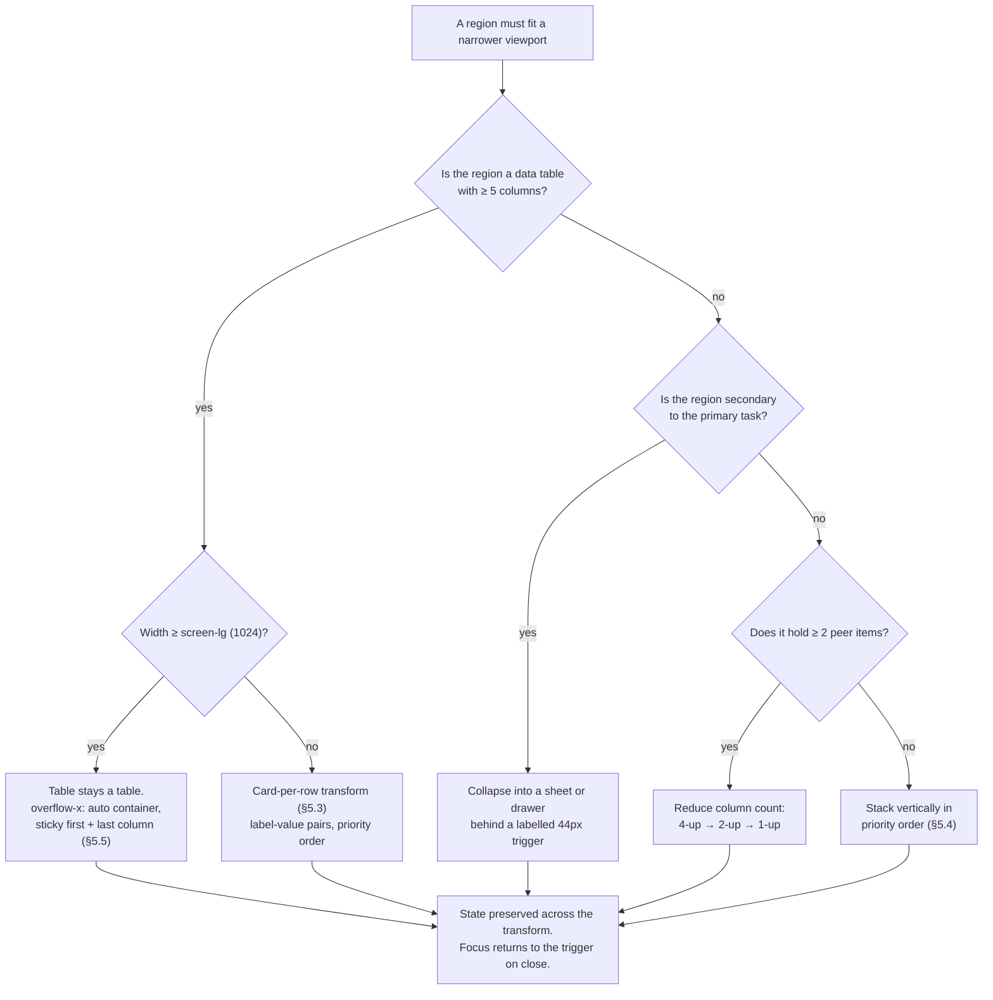

# Responsive & Adaptive Behaviour

**Gym Marketplace & Multi-Tenant Gym Management SaaS — UI Specification**
Companion to `/docs/ui/DesignSystem.md`, `/docs/ui/CustomerApp.md`, `/docs/ui/GymDashboard.md`,
`/docs/ui/AdminDashboard.md` and `/docs/ui/Components.md`.

| | |
| :--- | :--- |
| **Status** | Specification — written before any component code exists |
| **Owns** | The 320 → 2560 px obligation (`NFR-USE-07`) across all three surfaces; breakpoint semantics; table reflow; image renditions and `sizes`; touch-versus-pointer parity; orientation, keyboard and safe-area behaviour; the responsive test matrix |
| **Does not own** | Token *values* (`DesignSystem.md` §6.7 is the source), per-screen content and states (`CustomerApp.md`, `GymDashboard.md`, `AdminDashboard.md`), component APIs (`Components.md`) |
| **Launch market** | India (`LAUNCH_MARKET_INDIA.md`). INR with lakh-crore grouping, `Asia/Kolkata` (UTC+05:30, no DST), `DD MMM YYYY`, `+91` 10-digit mobiles beginning 6–9, 6-digit PIN codes |
| **Locked stack** | `apps/customer-web` Next.js 14 App Router + React 18 + TS, SSR for SEO · `apps/gym-dashboard` and `apps/admin-dashboard` React 18 + Vite SPAs · TailwindCSS (`A-03`) + shadcn/ui copied into `packages/ui` (`A-04`) · TanStack Query for all server state · React Hook Form + Zod (`A-09`, `A-02`) · **no Socket.IO** (`A-08` defers it; Phase 1 polls at 10–15 s through one `useLiveCounters()` hook) |

**Precedence.** Where this document and another disagree: the frozen API contracts in `/docs/apis/`
win on data shape; `PROJECT_CONSTITUTION.md` §16 wins on frontend law; `MASTER_PRD.md` wins on
requirement and screen inventory; `DesignSystem.md` wins on token values. This document wins on
**layout behaviour at a width**. Every conflict discovered while writing it is recorded in §13 rather
than silently resolved.

Every fenced block in this document is labelled **illustrative — not committed code**. No application
code exists yet and none is written here.

---

## Table of contents

| § | Section |
| :-: | :--- |
| 1 | [The requirement, and the breakpoint set](#1-the-requirement-and-the-breakpoint-set) |
| 2 | [The device reality for this product in India](#2-the-device-reality-for-this-product-in-india) |
| 3 | [Per-surface strategy](#3-per-surface-strategy) |
| 4 | [The three hardest responsive screens](#4-the-three-hardest-responsive-screens) |
| 5 | [Data tables — the general strategy](#5-data-tables--the-general-strategy) |
| 6 | [Images, renditions and layout stability](#6-images-renditions-and-layout-stability) |
| 7 | [Typography and spacing across breakpoints](#7-typography-and-spacing-across-breakpoints) |
| 8 | [Touch versus pointer](#8-touch-versus-pointer) |
| 9 | [Orientation, on-screen keyboards and safe areas](#9-orientation-on-screen-keyboards-and-safe-areas) |
| 10 | [Performance under constraint](#10-performance-under-constraint) |
| 11 | [Per-screen responsive matrix — all 55 screens](#11-per-screen-responsive-matrix--all-55-screens) |
| 12 | [Testing](#12-testing) |
| 13 | [Discrepancy register and traceability](#13-discrepancy-register-and-traceability) |

---

## 1. The requirement, and the breakpoint set

### 1.1 What `NFR-USE-07` actually says, and what it does not

> **`NFR-USE-07`** — *"Responsive from 320 px to 2560 px with no horizontal scrolling."*
> **`AX5`** (`PROJECT_CONSTITUTION.md` §16.7) restates it as a merge gate.
> **`BP2`** (`DesignSystem.md` §6.7) names the escape: wide content scrolls **inside its own
> container**, never at the page.

Four sentences that are frequently misread, so they are stated exhaustively:

| # | The requirement says | The requirement does **not** say |
| :-: | :--- | :--- |
| 1 | The **document body** never produces a horizontal scrollbar at any viewport width from 320 px to 2560 px | That no element anywhere may scroll sideways. A fifteen-column payments log at 1280 px must scroll inside its own bounds, and `AdminDashboard.md` `D1` already licenses it |
| 2 | No content is **clipped, overlapped or unreachable** at any width in the range | That every screen must be *pleasant* at 320 px. `SCR-ADM-015`'s audit diff at 320 px is survivable, not comfortable — and §3.3 says so out loud |
| 3 | It holds at **400% browser zoom**, because WCAG 2.1 SC 1.4.10 Reflow makes a 1280 px viewport at 400% equivalent to a 320 px viewport (`CustomerApp.md` §25) | That we must support a 320 px *device*. We support a 320 px *viewport*, whichever way it is produced |
| 4 | It holds in **both orientations** (§9.1) | That a landscape phone gets the tablet layout. Orientation is not a width proxy; see `RB7` |

**The precise mechanical definition used by the CI check of §12.4:**
`document.scrollingElement.scrollWidth <= document.scrollingElement.clientWidth + 1` at every tested
viewport, on every route, in both themes, with the longest string in the catalogue substituted into
every visible key. The 1-pixel tolerance absorbs sub-pixel rounding at fractional device pixel
ratios; anything above it is a defect, not a rounding artefact.

### 1.2 The breakpoint set

Token values are **owned by `DesignSystem.md` §6.7** and reproduced here with the layout consequence
that this document is responsible for. `UI3` forbids a hard-coded breakpoint anywhere in `apps/**`;
`BP4` forbids an arbitrary media-query width. There are seven breakpoints and one container cap, and
adding an eighth requires an amendment to `DesignSystem.md`, not a local override.

| Token | Min width | Represents | Rationale for **this** boundary | Primary layout consequence |
| :--- | :-: | :--- | :--- | :--- |
| `screen-base` | **320 px** | The floor named by `NFR-USE-07` | The narrowest viewport the requirement admits, and the effective width of a 1280 px desktop at 400% zoom (WCAG 1.4.10). Below it we do not render; there is nothing to render for | Single column on every surface. Filter rails, maps and context panels become sheets. Tables become stacked records |
| `screen-sm` | **640 px** | Large phone landscape, small tablet portrait | The width at which a 4:3 gym cover at ~300 px and a text column of ~45 characters can sit two-up without either becoming a thumbnail. Below it, a 2-up grid produces cards nobody can read | 2-up card grids (`SCR-WEB-012` favourites, `SCR-WEB-002` results at the low end of tablet) |
| `screen-md` | **768 px** | **Tablet portrait — the check-in desk's design target** | iPad portrait is 768 px CSS. `ASM-01` puts a tablet at the front counter and `NFR-USE-09` makes portrait one-handed operation testable. This boundary is a *device*, not a taste | Desk goes full-screen and switches to the §4.2 portrait layout. Dashboard sidebar becomes a drawer. `SCR-ADM-003` splits into two tabs |
| `screen-lg` | **1024 px** | Tablet landscape, small laptop | The first width at which a persistent navigation rail plus a real data table with five to seven columns both fit without either being a compromise. `AdminDashboard.md` `D5` uses it as the table-to-cards threshold | Dashboard nav becomes a 56 px icon rail. Data tables render as tables. Secondary table columns appear |
| `screen-xl` | **1280 px** | Laptop — **both dashboards' design target** | The three-pane search of `SCR-WEB-002` needs 280 (rail) + ~560 (list) + 40% (map) and does not fit below it. `AdminDashboard.md` §2.4 designs the console for ≥ 1280 px | `SCR-WEB-002` three-pane. `SCR-WEB-003` sticky plan panel. Admin pinned nav 232 px. Split views split |
| `screen-2xl` | **1536 px** | Desktop | Content has already reached `container-max` (1440 px); this boundary is where the *chrome* gains room — a persistent context panel instead of a drawer | Admin context panel becomes persistent. Dashboard home reaches three columns |
| `screen-3xl` | **1920 px** | Large desktop, and the common Indian office 1080p monitor | The first width where a third column in an admin split view is genuinely useful rather than decorative | `SCR-ADM-003` gains its third column (documents · checklist · pre-check) |
| `--gm-container-max` | **1440 px** | Not a breakpoint — a cap | A ~1440 px content column keeps prose under ~90 characters and a twelve-column financial table under a scan-width the eye can track. Beyond it the page gains **margin, not measure** (`BP3`) | Content centres; gutters absorb everything up to 2560 px |

### 1.3 Why there is no breakpoint between 1440 and 1920, and none above 1920

Because nothing changes. Between `container-max` and `screen-3xl` the content column is already
capped and the only variable is gutter width, which is a `flex`/`grid` consequence, not a breakpoint.
Above 1920 px the same is true to 2560 px and beyond. **A breakpoint that changes nothing is a
breakpoint that will eventually be given something to change**, and that is how a design system
acquires a 2200 px special case.

### 1.4 The rules

| Rule | Statement |
| :--- | :--- |
| **RB1** | **Mobile-first authoring, regardless of surface.** Even the admin console — a desktop product — declares its 320 px case first and adds `lg:` and `xl:` upward. A `max-width` query in `apps/**` fails review. This is not ideology: `min-width`-only authoring makes the cascade additive and makes "what does this look like at 320" answerable by deleting classes rather than by reasoning about overrides |
| **RB2** | **No page-level horizontal scroll at any width, on any surface, in any state** — including with an error banner, with the longest translated string, and at 400% zoom |
| **RB3** | Wide content scrolls **inside its own `overflow-x: auto` container** with `max-width: 100%`, an accessible name, `tabindex="0"` so it is keyboard-scrollable, and a sticky identifying column (§5.5) |
| **RB4** | Breakpoint tokens are the **only** permitted media-query widths in `apps/**` (`BP4`, `UI3`). `@media (min-width: 900px)` is an arbitrary value and fails lint |
| **RB5** | `@media (pointer: coarse)` and `@media (hover: none)` are **capability** queries, not breakpoints (`BP5`). They are permitted anywhere and they drive §8. Viewport width is never used as a proxy for input device |
| **RB6** | Layout responds to **container** width where a component appears in more than one column arrangement — `@container` queries on `<GymResultCard>`, `<PlanCard>`, `<KpiTile>` and `<StatementLine>`. A card that reads its own box does not need to know which of four grids it is in |
| **RB7** | Orientation is **never** inferred from width and width is never inferred from orientation. A 1024×768 tablet in landscape and a 1024 px laptop window are the same width and different products; `pointer: coarse` is what distinguishes them (§8.2) |
| **RB8** | Above `--gm-container-max` the layout **does not stretch** (`BP3`). The exception is `SCR-WEB-002`, which is granted a wider cap by a named token, not by an inline value — see §13 D-2 |
| **RB9** | Sticky regions use `position: sticky`, never `position: fixed`, except for the three enumerated docked bars of §9.4. A `fixed` panel at 400% zoom occupies the viewport and traps the content behind it (WCAG 1.4.10) |
| **RB10** | Every responsive transformation must preserve the **four mandatory states** — loading, empty, error, permission-denied. A skeleton that matches the desktop layout and not the mobile one is a layout-shift defect, not a cosmetic one (`PROJECT_CONSTITUTION.md` §16.9) |
| **RB11** | Nothing in this document permits a layout that hides a **permitted action**. Client-side hiding is presentation only and never a security control (`FR-RBAC-02`); equally, responsive collapse must never make a permitted action unreachable — it moves into an overflow menu with an accessible name, it does not disappear (`NFR-USE-02`) |

### 1.5 The decision a component author actually makes

*illustrative — not committed code*



---

## 2. The device reality for this product in India

Responsive design that is not grounded in who is holding what device is decoration. This section
states the three device realities this product actually has, and derives the design consequence of
each rather than asserting a preference.

### 2.1 The three realities

| Surface | Who | On what | Where | Source |
| :--- | :--- | :--- | :--- | :--- |
| `customer-web` | **Priya** (`B2.2`) — prospective member, comparison-shopping | Android smartphone, mid-range, 360–412 px CSS width, 4G | On a bus, at work, in bed. Rarely at a desk | `B2.2`; `ASM-02` (*"target members have a smartphone with a browser"*); `NFR-PERF-02` measures LCP **on 4G** because that is the connection |
| `gym-dashboard` | **Rohan** (`B2.1`) — owner/manager | Laptop or desktop at the gym office; tablet when walking the floor | Sitting, two hands, a pointer | `B2.1`; `NFR-PERF-04` (list views ≤ 50 rows) presumes a table, and a table presumes width |
| `gym-dashboard` → `SCR-DASH-009` | **Sameer** (`B2.3`) — receptionist | **Tablet in portrait, on a stand or in one hand, at the front counter** | Standing, a queue in front of him, the other hand holding a member's phone | `ASM-01` (*"gym staff have a smartphone or tablet with a camera and network access at the front desk"*); `NFR-USE-09` (*"operable one-handed on a tablet at arm's length"*); `SCR-DASH-009` Ergonomics row |
| `admin-dashboard` | **Anita** (`B2.4`), **Vikram** (`B2.5`) | Desktop, ≥ 1280 px, MFA-gated (`NFR-SEC-11`) | A platform office, at a desk | `B2.4`, `B2.5`; `SCR-ADM-003`'s split view and `SCR-ADM-010`'s reconciliation table exist because two panes of information must be compared |

### 2.2 The customer site is overwhelmingly mobile — and the consequences

`A2.2` describes the consumer problem as discovery: *finding* a gym, comparing prices, deciding
without visiting. That happens on a phone. Seven consequences follow, and each one is a constraint
elsewhere in this document:

| # | Consequence | Where it binds |
| :-: | :--- | :--- |
| 1 | **The 320 px case is the design, not the degradation.** `SCR-WEB-002`'s mobile layout is specified in `B6` as a first-class layout with its own filter and map affordances — not as "the desktop one, narrower" | §4.1 |
| 2 | **The 200 KB gzipped initial-JS budget (`NFR-PERF-10`) is a mobile budget.** On a mid-range Android on 4G, 200 KB of JS is roughly 600–900 ms of parse and execute before anything is interactive. It is not a download budget; it is a main-thread budget | §10 |
| 3 | **LCP ≤ 2.5 s on 4G (`NFR-PERF-02`) is measured by field data (RUM), not by a lab score.** Field data on this product will be dominated by Indian mobile networks, so the image strategy of §6 is a launch requirement, not an optimisation | §6.5, §10.2 |
| 4 | **The map is optional on mobile and the list is not.** `AC-SRCH-02.3` already establishes the list as the complete rendering and the map as a redundant view. On a phone that principle becomes load-bearing: the map library is dynamically imported and is never on the critical path | §4.1.4, §10.3 |
| 5 | **Data cost is a real constraint.** A 1920w hero delivered to a 360 px phone is not merely slow; it spends a stranger's money. The rendition contract of §6.2 exists partly for this reason | §6 |
| 6 | **The auth gate is at checkout and nowhere earlier (`FR-NAV-01`, `NX5`)**, so the entire discovery funnel is server-rendered, indexable and cheap. Responsive work on `/`, `/search`, `/gyms/**`, `/city/**` and `/c/**` is work on server-rendered HTML with a thin client boundary | §3.1, §10.4 |
| 7 | **One-handed reach matters on the customer site too.** The primary action on `SCR-WEB-003` (Buy) and `SCR-WEB-005` (Proceed to payment) is docked at the bottom on mobile, above the safe-area inset — not because it is fashionable but because the thumb is there | §9.4 |

### 2.3 The gym dashboard is desktop and tablet — and the consequences

| # | Consequence | Where it binds |
| :-: | :--- | :--- |
| 1 | **A table is allowed to be a table.** `SCR-DASH-007` explicitly specifies *"compact rows; 50 per page with virtualised scrolling"*. Turning that into cards on a laptop would be a regression against a written requirement | §5.2 |
| 2 | **The tablet floor is `screen-md` (768 px), not 320 px.** The dashboard must *survive* 320 px (`NFR-USE-07`), but it is *designed* from 768 px up | §3.2 |
| 3 | **`pointer: coarse` promotes compact density to comfortable wholesale (`HT2`).** An owner on an iPad at 1024 px gets 44 px painted controls even though the viewport says `screen-lg` | §8.2 |
| 4 | **Every dashboard action must remain keyboard-operable at every width (`NFR-USE-02`).** A responsive collapse that puts an action behind a hover-only affordance is an accessibility defect | §8.4, `RB11` |
| 5 | **Live figures carry a "last updated" indicator at every width (`LC5`).** Narrow layouts must not drop the indicator to save space. *A stale figure presented as live is a defect* | §5.7 |

### 2.4 The check-in desk is a tablet in portrait at the front counter

This is the single most device-specific screen in the product, and the PRD says so directly:

> `SCR-DASH-009` **Ergonomics** — *"Full-screen mode; works on tablet in portrait; all primary
> actions reachable by keyboard."*
> `NFR-USE-09` — *"The check-in desk is operable one-handed on a tablet at arm's length."*
> `NFR-USE-01` — the desk is one of the **two** surfaces held to **WCAG 2.1 Level AA**.
> `NFR-PERF-03` — scan to confirmation p95 ≤ 2 s.

| # | Consequence | Where it binds |
| :-: | :--- | :--- |
| 1 | **Portrait is the primary orientation**, which is unusual for a dense operational screen and drives the vertical stack of §4.2 | §4.2.2 |
| 2 | **"Arm's length" is a type-size and target-size requirement, not a layout one.** It is why `data-density="oversized"` exists (`DesignSystem.md` §7.1) with 64 px controls, 20 px body text and a 3 px focus ring — the only surface in the product that uses it | §7.4 |
| 3 | **"One-handed" is testable as a geometry rule:** no primary action above 60% of screen height in portrait (`GymDashboard.md` §11.2). The viewfinder — which Sameer only *looks at* — takes the top; everything he *touches* is in the lower third | §4.2.3 |
| 4 | **The camera stream stays open across the orientation and layout transitions of §9.1.** Re-acquiring the camera costs 300–900 ms and would blow `NFR-PERF-03` on its own | §9.1 |
| 5 | **The desk is AA, so colour is never the sole carrier of the success/denial outcome (`AX9`)** and outcomes are announced through a live region (`AX8`) at every width | §4.2.6 |
| 6 | **Landscape must work too**, because `ASM-01` says "smartphone **or** tablet" and some counters mount a tablet horizontally. Landscape is the two-pane layout of §4.2.1, not a stretched portrait | §4.2.1 |

### 2.5 The admin console is desktop, and honest about it

`AdminDashboard.md` §2.4 states the position and this document adopts it verbatim:

> *"The console is designed for ≥ 1280 px and usable to 320 px. It is not a mobile product —
> `NFR-USE-07` requires it to survive 320 px, not to be pleasant there."*

Two screens are the exception, because triage does not always happen at a desk: **`SCR-ADM-002`
Approval Queue** and **`SCR-ADM-003` Application Review** are specified to be genuinely workable at
`screen-md` (768 px). Anita reviews a KYC document on a tablet between meetings; she does not
reconcile a settlement run on one.

---

## 3. Per-surface strategy

One token set, one component library, three different postures. The posture is a **declared
intent**, not a mood: it determines which width a designer opens first, which width CI screenshots,
and what "acceptable" means at the far end of the range.

| Surface | Posture | Design target | Floor | Below the floor |
| :--- | :--- | :-: | :-: | :--- |
| `apps/customer-web` | **Mobile-first** | **360–412 px** | 320 px | n/a — 320 px *is* the floor and it is fully designed |
| `apps/gym-dashboard` | **Desktop-first with a tablet floor** | **1280 px** (`screen-xl`) | **768 px** (`screen-md`) designed; 320 px survivable | 320–767 px: single column, bottom nav, tables become stacked records (§5.3) |
| `apps/gym-dashboard` → `SCR-DASH-009` | **Tablet-portrait-first** | **768 × 1024** | 768 px designed; 360 px survivable on a phone (`ASM-01` says "smartphone **or** tablet") | Phone: same vertical stack, viewfinder shrinks to 45vh, recent-check-ins strip drops to one row |
| `apps/admin-dashboard` | **Desktop-only, stated** | **1280 px** (`screen-xl`), comfortable to 1920 px | **1024 px** (`screen-lg`) for full function | < 1024 px: functional but explicitly degraded — §3.3 enumerates exactly what changes |

### 3.1 `customer-web` — mobile-first, and what that costs the desktop

Mobile-first here is literal: the 320 px rules are authored first and every wider rule is an
additive `sm:`/`md:`/`lg:`/`xl:` override (`RB1`).

| Concern | Mobile-first consequence |
| :--- | :--- |
| **Rendering** | Server components are the default (`NX1`). The SEO routes — `/` (`SCR-WEB-001`), `/gyms/:citySlug/:gymSlug` (`SCR-WEB-003`), `/city/:citySlug`, `/c/:categorySlug` — are server-rendered (`NX2`), so the narrow layout arrives as HTML and does not wait for JS. This is why the mobile layout is also the *fast* layout |
| **Navigation** | A single header with location + query at every width. No hamburger below `screen-md` hiding the search — the search **is** the product (`SCR-WEB-001`: *"the search bar is interactive immediately and never blocked by content loading"*) |
| **Secondary regions** | Filters, map, sort, and the comparison tray are **sheets** below `screen-md`. Each sheet is a Radix dialog from `packages/ui` (`UI1`): focus-trapped, Escape-closable, focus returned to the trigger |
| **Primary action** | Docked at the bottom above the safe-area inset on `SCR-WEB-003`, `SCR-WEB-005`, `SCR-WEB-013` (§9.4) |
| **The desktop cost** | Almost none, because the desktop layouts are additive column arrangements over the same DOM order. The one place mobile-first genuinely constrains the desktop is `SCR-WEB-002`, where the map must be **after** the list in DOM order for a sensible mobile reading order, and is pulled right with `grid` at `screen-xl` — an ordering the CSS handles and the DOM does not fight |
| **Upper bound** | Content caps at `--gm-container-max` (1440 px) on every route except `SCR-WEB-002` (§13 D-2). At 2560 px the gutters take the difference |

### 3.2 `gym-dashboard` — desktop-first with a tablet floor

| Width band | Shell | Content |
| :--- | :--- | :--- |
| **≥ 1280 px** (`screen-xl`) | Persistent sidebar, permission-filtered per `FR-NAV-03` | Three-column home; tables at full width; detail drawers as drawers |
| **1024–1279** (`screen-lg`) | Persistent sidebar, narrower | Two-column home; tables render as tables with the secondary column set |
| **768–1023** (`screen-md`) — **the tablet floor** | Sidebar becomes a **drawer** behind a 44 px menu button | Two-column home; tables scroll inside their container with the identifying column pinned (§5.5); `SCR-DASH-009` goes full-screen portrait |
| **480–767** (`screen-sm`) | Bottom nav bar, five items | Single column, denser cards; filters collapse into a sheet |
| **320–479** (`screen-base`) | Bottom nav bar, five items | Single column; **tables become stacked cards, never horizontally scrolled rows** |

**The five bottom-nav items are role-derived, not fixed.** `FR-NAV-03` filters navigation by
effective permission — *"a user never sees a menu item they cannot use"* — so the five differ by
role and the mobile shell must not hard-code them:

| Role (`B3.1`) | The five, in order | Why |
| :--- | :--- | :--- |
| `OWNER` | Home · Members · Check-in · Sales · More | Rohan's daily loop (`B2.1`) |
| `MANAGER` | Home · Members · Check-in · Leads · More | No settlements — `settlements.batch.list` is the owner's (`Admin.md` §19.3) |
| `RECEPTIONIST` | **Check-in** · Members · Leads · Sales · More | Sameer opens the app to check people in (`B2.3`); check-in is first and is the default route |
| `TRAINER` | Home · Members · Attendance · More | A four-item bar. Four real items beat five with a filler |

`RB11` applies: "More" is a sheet listing every remaining **permitted** route with its label and
icon. It is never a dumping ground for items the user cannot use — those are absent from the client
entirely (`FR-NAV-03`), and the server still refuses them (`FR-RBAC-02`, `BL6`).

### 3.3 `admin-dashboard` — desktop-only, with a stated minimum and a stated degradation

**The stated minimum width for full function is 1024 px (`screen-lg`).** Below it the console remains
usable and compliant with `NFR-USE-07`, and this is exactly what changes:

| Width band | Shell | What degrades |
| :--- | :--- | :--- |
| **≥ 1600 px** | Pinned nav 232 px · content capped at 1440 px · **persistent 320 px context panel** | Nothing |
| **1280–1599** (design target) | Pinned nav 232 px · fluid content | Context panel becomes a **right drawer** |
| **1024–1279** | Nav collapses to a **56 px icon rail**, labels on hover **and on focus** (`NFR-USE-02` — hover alone is not an affordance) | Tables shed their tertiary column set (§5.4) and scroll inside their container |
| **768–1023** | Top bar with a menu button; nav is an overlay sheet | Tables become **stacked record lists** (`D5`). `SCR-ADM-003` becomes two tabs (Documents / Checklist). **`SCR-ADM-002` and `SCR-ADM-003` remain genuinely workable here — this is the triage-away-from-a-desk band** |
| **320–767** | Same top bar and overlay sheet | Everything is single-column stacked records. Bulk actions, the column picker, and side-by-side diff are **unavailable and say so** — see the notice below |

**What "unavailable and says so" means, precisely.** It is never a blank region and never a silent
omission. Three admin capabilities do not exist below `screen-md` because they cannot be operated
honestly at that width, and each renders a named notice in place of the control:

| Capability | Screens | The notice (i18n key) |
| :--- | :--- | :--- |
| Multi-select bulk actions | `SCR-ADM-002`, `SCR-ADM-004`, `SCR-ADM-005`, `SCR-ADM-012` | `admin.responsive.bulk_unavailable_narrow` — *"Bulk actions need a wider screen. Open this queue on a desktop to act on more than one record at a time. You can still act on records one at a time here."* |
| Side-by-side before/after diff | `SCR-ADM-015`, `SCR-ADM-003` history | `admin.responsive.diff_stacked_narrow` — *"Showing before and after stacked instead of side by side. Open on a desktop to compare them in parallel."* |
| Column picker (`D4`) | Every table screen | `admin.responsive.columns_fixed_narrow` — *"Column choice applies to the table view. This narrow view shows every field of each record."* |

Each message states **what happened, why, and what to do next** — `NFR-USE-05`, and the third one
also tells the truth that the stacked record view shows *more* fields, not fewer.

**A degradation is not a permission denial.** The permission-denied state (`PROJECT_CONSTITUTION.md`
§16.9) explains that the user lacks a permission; these notices explain that the *viewport* lacks
width. They use different components — `<PermissionDeniedState>` versus `<ViewportNotice>` — and
must never be confused, because telling a `SUPER_ADMIN` they lack a permission is a support ticket.

### 3.4 One component library, three postures — how that stays true

| Rule | Statement |
| :--- | :--- |
| **PS1** | `packages/ui` primitives and patterns carry **no surface-specific responsive logic**. `<DataTable>` accepts a `reflow` prop (`"scroll" \| "cards" \| "auto"`) and a column-priority array; it does not know whether it is on `dash` or `admin` (`UI5`) |
| **PS2** | Posture is expressed by the **app shell**, which is app-owned: `apps/customer-web/src/app/layout.tsx`, `apps/gym-dashboard/src/app/AppShell.tsx`, `apps/admin-dashboard/src/app/AppShell.tsx` |
| **PS3** | A screen never re-declares the posture. If `SCR-DASH-020` wants a different table reflow threshold than the rest of the dashboard, that is a `DataTable` prop with a written reason in the screen spec, not a media query in a feature folder |
| **PS4** | The density attribute (`data-density`) is set by the shell and overridden on exactly one region in the product: `SCR-DASH-009`'s `oversized` root (`DesignSystem.md` §7.1) |
| **PS5** | Three postures, one **breakpoint set**. There is no `admin-only` breakpoint and no `desk-only` breakpoint. `AdminDashboard.md`'s 1600 px shell band is `screen-2xl` (1536) plus content-cap behaviour, and §13 D-1 records the naming drift |

---

## 4. The three hardest responsive screens

Three screens carry essentially all of the responsive risk in this product, for three different
reasons: `SCR-WEB-002` has **three synchronised regions that cannot all be visible on a phone**;
`SCR-DASH-009` has a **physical ergonomic requirement** written into an NFR; `SCR-DASH-014` and
`SCR-ADM-010` are **wide financial tables where a hidden column is a money defect**. Each is
specified at every breakpoint.

### 4.1 `SCR-WEB-002` — Search Results

| | |
| :--- | :--- |
| **PRD** | `B6` `SCR-WEB-002`. Desktop: *"Left: filter rail (sticky). Centre: result list. Right: map (sticky, 40% width)."* Mobile: *"Full-width list; filters in a bottom sheet; map behind a toggle that becomes full-screen."* |
| **Contract** | `GET /v1/search/gyms` (`Search.md` §3). Response carries `results[]` (`GymResultCard`), `total_estimated`, `next_cursor`, `as_of`, `location`, `applied_filters`, `facets`, `map { bounds, clusters[], available }`, `ranking_version` |
| **Route** | `/search`, `noindex,follow`. The indexable equivalents are `/city/:citySlug` and `/c/:categorySlug` (`FR-SRCH-13`) rendering the same card |
| **URL state** | Location, query, all filters, sort and page are encoded in the URL and restored on load (`SCR-WEB-002` URL-state row, `AC-SRCH-01.3`, `NX7`). **The URL is the state container across every breakpoint transition** — this is what makes the transitions of §4.1.3 lossless |

#### 4.1.1 `screen-xl` (1280 px) and above — the three-pane layout

*illustrative — not committed code*

```text
1280 px  ·  rail 280 fixed · list fluid · map 40% sticky
┌───────────────────────────────────────────────────────────────────────────────────────────┐
│  [logo]   [ ⌖ Indiranagar, Bengaluru │ 🔍 query                    ]        [ Sign in ]   │
├──────────────────┬────────────────────────────────────────┬───────────────────────────────┤
│ FILTER RAIL      │ RESULT LIST                            │ MAP                           │
│ sticky, 280px    │ fluid, own scroll container            │ sticky, 40% of the content col │
│ own scroll       │                                        │ height = 100svh − header       │
│                  │  About 47 gyms near Indiranagar        │ ┌───────────────────────────┐ │
│ Distance ◉─── 3km│  Sort [ Relevance ▾ ]   as of 14:42    │ │        ○14                │ │
│ Price ₹0 ── ₹5k  │ ┌────────────────────────────────────┐ │ │  ₹1,899 ◉  ← hover-synced │ │
│ Amenities 🔍     │ │ ┌────┐ Iron Works Gym      ♡  ☐    │ │ │      ₹2,450               │ │
│  ☐ Parking   23  │ │ │4:3 │ ✔ Verified · 1.8 km         │ │ │  ○6      ₹1,650           │ │
│  ☐ Showers   31  │ │ │img │ ★4.3 (128) · Open till 22:00│ │ │                           │ │
│  ☐ AC        18  │ │ └────┘ from ₹1,899/month           │ │ │   [ Search this area ]    │ │
│ Rating ★4+   12  │ │        [Parking][Showers][AC]      │ │ └───────────────────────────┘ │
│ ☐ Open now   29  │ ├────────────────────────────────────┤ │                               │
│ ☐ 24-hour     8  │ │ … infinite scroll on next_cursor   │ │                               │
│ Gender policy    │ └────────────────────────────────────┘ │                               │
│ [ Clear all ]    ├────────────────────────────────────────┴───────────────────────────────┤
└──────────────────┤ SELECTION BAR (≥2 checked) · "3 gyms selected"     [Compare] [Clear]   │
                   └────────────────────────────────────────────────────────────────────────┘
```

| Aspect | Specification at ≥ 1280 px |
| :--- | :--- |
| Grid | `grid-template-columns: 280px minmax(0,1fr) 40%`. `minmax(0,1fr)` on the centre column is what stops a long gym name from forcing page-level overflow — a `1fr` track has a `min-width:auto` floor and will happily push the grid wider than the viewport. This is the single most common cause of an `NFR-USE-07` violation in a three-column layout |
| Scroll ownership | Rail and map each own an `overflow-y: auto` container; the **page** scrolls the list only. Three scrollbars are worse than one, so rail and map scrollbars are overlay-styled and appear on interaction |
| Map | `position: sticky; top: header-height`. Never `fixed` (`RB9`) |
| Sync | Bidirectional hover/click between list and map (`B6` Map row). Hovering a card raises its pin; hovering a pin raises the card and scrolls it into view if off-screen. **This behaviour is pointer-only and §8.3 specifies its touch replacement** |
| Above 1440 | Content caps at the wide container token (§13 D-2); the map is permitted to grow to 44% because a wider map at a wider viewport is more useful, while a wider *list* is just a longer line |

#### 4.1.2 `screen-md` (768–1279) — two-up cards, half-height map sheet

*illustrative — not committed code*

```text
768 px
┌───────────────────────────────────────────────────┐
│ [ ⌖ Indiranagar │ 🔍 query                     ]  │
│ [ Filters (3) ] [ Sort ▾ ]  About 47   [ Map ▦ ]  │  ← control bar, 4 × 44px targets
├───────────────────────────────────────────────────┤
│ ┌───────────────────────┐ ┌───────────────────────┐│
│ │ card                  │ │ card                  ││  2-up grid
│ └───────────────────────┘ └───────────────────────┘│
│ ┌───────────────────────┐ ┌───────────────────────┐│
│ │ card                  │ │ card                  ││
│ └───────────────────────┘ └───────────────────────┘│
├═══════════════════════════════════════════════════┤  ← map sheet, HALF height
│ ▁▁▁ drag handle                          [ ✕ ]    │
│         MAP · 50svh · list still visible above    │
│   ○14      ₹1,899◉      ₹2,450     [Search area]  │
└───────────────────────────────────────────────────┘
```

The map at `screen-md` is a **half-height sheet, not full-screen**, and the reason is the whole point
of the screen: at 768 px the list is still visible above the sheet, so the sync between the two
"reads as one thing". Tapping a pin scrolls the visible list behind the sheet and marks the card.
This band keeps map-list sync alive; the 320 px band cannot, and §4.1.4 says what replaces it.

#### 4.1.3 `screen-base` (320–767) — list only, two sheets

*illustrative — not committed code*

```text
320 px
┌──────────────────────┐   Filters sheet (full-screen)   Map sheet (full-screen)
│ [ ⌖ Indiranagar    ] │   ┌──────────────────────┐      ┌──────────────────────┐
│ [ 🔍 query         ] │   │ Filters      [ ✕ ]   │      │ Map          [ ✕ ]   │
│ [Filters(3)][⇅][▦]  │   ├──────────────────────┤      │ [ List ▤ ] ← returns │
├──────────────────────┤   │ Distance ◉──── 3 km  │      ├──────────────────────┤
│ About 47 · as of ⏱   │   │ Price ₹0 ──── ₹5,000 │      │                      │
│ ┌──────────────────┐ │   │ Amenities 🔍         │      │    ○14               │
│ │ ┌──────────────┐ │ │   │  ☐ Parking      23   │      │  ₹1,899   ₹2,450     │
│ │ │  cover 4:3   │ │ │   │  ☐ Showers      31   │      │      ○6              │
│ │ └──────────────┘ │ │   │  ☐ AC           18   │      │   ₹1,650             │
│ │ Iron Works Gym   │ │   │ Rating ★4+      12   │      │                      │
│ │ ✔ 1.8km ★4.3(128)│ │   │ ☐ Open now      29   │      │ [ Search this area ] │
│ │ Open till 22:00  │ │   │ ☐ 24-hour        8   │      ├──────────────────────┤
│ │ from ₹1,899/mo   │ │   │ Gender policy        │      │ ▁▁▁ peek card ▁▁▁    │
│ │ [Parking][AC][…] │ │   ├──────────────────────┤      │ ┌──────────────────┐ │
│ │            ♡  ☐  │ │   │ [Clear] [Show 47 →]  │      │ │Iron Works ★4.3   │ │
│ └──────────────────┘ │   └──────────────────────┘      │ │₹1,899/mo    [→]  │ │
│ … infinite scroll    │    ↑ sticky footer, always      │ └──────────────────┘ │
├──────────────────────┤      shows the live count       └──────────────────────┘
│ 3 selected [Compare] │      (facets, Search.md §3.7)     ↑ §4.1.4 peek card
└──────────────────────┘                                     replaces hover sync
   ↑ selection bar sits above env(safe-area-inset-bottom)
```

| Element | Specification at 320–767 px |
| :--- | :--- |
| Control bar | Sticky under the header. Three or four 44 × 44 px targets: `Filters (n)`, `Sort`, `Map`, and — at ≥ 480 px — the result count inline. The filter count `(n)` is the number of **applied** filters read from `applied_filters` (`Search.md` §3.5), not from local state, so a server-resolved default cannot desync the badge |
| Cards | Full width, `4:3` cover in an aspect-ratio box (§6.4). The amenity chip row scrolls **inside itself** (`RB3`), never the page |
| Filters sheet | Full-screen Radix dialog. **Sticky footer with `[Clear all]` and `[Show <n> results]`** where `<n>` is the live facet count for the pending selection (`Search.md` §3.7, `SCR-WEB-002`: *"Each filter shows a live result count"*). The count updates as filters are toggled, debounced at 300 ms, announced politely once per settled value — not per keystroke |
| Map sheet | Full-screen. Carries its own `[ List ▤ ]` return control **in addition to** `[ ✕ ]`, because "back to the list" and "close this" are the same act here and users reach for either |
| Selection bar | Docked above `env(safe-area-inset-bottom)` (§9.5). Appears at ≥ 2 compare checkboxes |
| Sort | A sheet of radio options below 480 px; a `<select>`-backed popover at 480–767 px |

#### 4.1.4 The transition, and what happens to map-list sync when both cannot be visible

**This is the hard part of the screen and the PRD does not resolve it, so it is resolved here.**

At ≥ 768 px, list and map are simultaneously visible and bidirectional sync is meaningful. Below
768 px they are mutually exclusive views of the same result set, so *sync* — in the sense of "hover
here, highlight there" — has no referent. Four rules replace it:

| # | Rule | Rationale |
| :-: | :--- | :--- |
| **MS1** | **One result set, two renderings, one query.** The map sheet does **not** issue its own request. Both views read the same TanStack Query cache entry keyed by the URL state (`DQ1`, `DQ3`). Opening the map is a *view toggle*, never a refetch, so the map can never show a different 47 gyms than the list showed a second ago | Two fetches would let the two views disagree, and the user would be right to distrust both |
| **MS2** | **The map sheet carries a peek card.** Tapping a pin slides a single compact `GymResultCard` up from the bottom of the map sheet — cover thumb, name, rating, distance, lowest monthly-equivalent price, and a `[→]` that opens `SCR-WEB-003`. Swiping the peek card horizontally moves to the next/previous pin **in list order**, so the list's ranking is still perceptible inside the map | This is the touch replacement for hover sync (§8.3). Hover has no touch equivalent; *selection* does |
| **MS3** | **Closing the map returns to the list scrolled to the last-peeked card, which is briefly marked.** The mark is a 1.5 s outline in `border-focus`, not a colour fill, and it is skipped under `prefers-reduced-motion` (the outline still appears; only the fade is removed, per `RM2`) | The user's mental thread — "the one near the park" — survives the view switch. Without this, the map is a dead end and users stop opening it |
| **MS4** | **"Search this area" rewrites the URL, which is the single source of truth (`NX7`).** Panning the map and tapping `[Search this area]` replaces `lat`/`lng`/`radius_m` in the URL; closing the sheet lands on a list that already reflects the new area, with a chip reading *"Showing results in the area you selected · Undo"*. The undo restores the previous URL entry | Silently changing what the list means while the list is hidden is the defect this rule prevents |

**Transition mechanics, stated exactly:**

| From → to | What is preserved | What is discarded |
| :--- | :--- | :--- |
| Any width → any width (resize or rotate) | Everything: filters, sort, query, location, radius, page cursor, compare set, scroll anchor. All of it is in the URL (`NX7`) or in the query cache | Nothing |
| List → map sheet (mobile) | Result set, scroll position in the list, compare set | Nothing. The list is not unmounted; the sheet renders above it |
| Map sheet → list (mobile) | Last-peeked pin becomes the list scroll anchor (`MS3`); any `[Search this area]` change is already in the URL | The peek card |
| Mobile → desktop **while the map sheet is open** | The sheet unmounts and the map reappears in the right pane **centred on the same bounds**, with the peeked gym's card highlighted in the list. The user experiences continuity, not a reset | Sheet chrome only |
| Desktop → mobile **while a card is hovered** | Nothing to preserve — hover is transient by definition (§8.1) | The hover state |

`illustrative — not committed code`

```tsx
// apps/customer-web/src/features/discovery/SearchResultsLayout.tsx
// ONE query. Two renderings. The breakpoint decides where the map is mounted, never what it shows.
const { data, dataUpdatedAt } = useSearchResults();      // TanStack Query, keyed on URL state (DQ1/DQ3)
const isWide = useBreakpointUp('xl');                    // reads the token set — never a raw px value (RB4)

return (
  <div className="grid gap-6 xl:grid-cols-[280px_minmax(0,1fr)_40%]">
    <FilterRegion as={isWide ? 'rail' : 'sheet'} facets={data?.facets} />
    <ResultList results={data?.results} asOf={data?.as_of} />
    <MapRegion
      as={isWide ? 'pane' : 'sheet'}
      bounds={data?.map.bounds}
      clusters={data?.map.clusters}
      available={data?.map.available}
      syncMode={isWide ? 'hover' : 'peek'}   {/* §8.3 — hover has no touch equivalent */}
    />
  </div>
);
```

#### 4.1.5 The four mandatory states, per breakpoint

| State | 320–767 | 768–1279 | ≥ 1280 |
| :--- | :--- | :--- | :--- |
| **Loading** | 6 skeleton cards, full width, each matching the final card box exactly so CLS stays 0. The control bar is interactive immediately | 6 skeletons in a 2-up grid | 6 skeletons in the list column; **the map shows a loading overlay, not a blank tile** (`B6`); the rail renders its filter labels with skeleton counts |
| **Empty** | Names the most restrictive filter and offers one-tap relaxation with the resulting count previewed, plus radius expansion and nearby cities (`FR-SRCH-12`, `AC-SRCH-01.2`, `Search.md` §5). At this width the relaxation buttons stack full-width; the map toggle is **removed from the control bar** rather than opening an empty map | Same content, 2-up relaxation buttons | Same content in the list column; the map shows the searched bounds with no pins and the same relaxation offer |
| **Error** | Retry affordance; last successful results retained where possible (`B6`). A failed poll never blanks a rendered list | Same | Same. If only the map fails (`map.available: false`), `AC-SRCH-02.3` applies: the list renders fully and the map region becomes a notice. **The list must not widen to fill the space** — a reflow on every provider hiccup is worse than a stable notice |
| **Permission-denied** | Not reachable: search is public for `VISITOR` (`B3.2` *Browse marketplace* ●). The nearest case is `Save favourites` (— for `VISITOR`), where the heart opens the auth sheet and returns to this exact URL afterwards (`FR-NAV-02`, `NX6`) | Same | Same, as a dialog rather than a sheet |

---

### 4.2 `SCR-DASH-009` — Check-in Desk on a tablet in portrait

| | |
| :--- | :--- |
| **PRD** | `B6`/`B7` `SCR-DASH-009`. *"Large camera viewfinder centre; manual search field always focused-on-keypress; result panel right; recent check-ins strip below."* **Ergonomics:** *"Full-screen mode; works on tablet in portrait; all primary actions reachable by keyboard."* |
| **NFRs that bind the layout** | `NFR-USE-09` one-handed at arm's length · `NFR-USE-01` **WCAG 2.1 AA** (one of only two AA surfaces) · `NFR-USE-02` full keyboard operability · `NFR-USE-03` 44 × 44 px floor · `NFR-PERF-03` scan → confirmation p95 ≤ 2 s |
| **Assumption it rests on** | `ASM-01` — *"gym staff have a smartphone or tablet with a camera and network access at the front desk"* |
| **Density** | `data-density="oversized"` — the **only** region in the product that uses it (`DesignSystem.md` §7.1). 64 px controls, 20 px body, 72 px table rows, 3 px focus ring, 32 px icons |
| **Live data** | The recent-check-ins strip is a polled figure through `useLiveCounters()` (`LC2`) and therefore carries a mandatory "last updated" indicator at **every** width (`LC5`). The scan confirmation itself is **not** a live figure — it is a request/response through `POST /checkin/scan` (`LC7`) |

#### 4.2.1 Landscape (`screen-lg` and above, and 1024 × 768 tablets) — two panes

*illustrative — not committed code*

```text
≥ 1024 px landscape
┌──────────────────────────────────────────────────────────────────────────────────────┐
│ Check-in · Bandra West         ● Online    14:11:47 IST         [ ⛶ Full screen ]    │
├───────────────────────────────────────┬──────────────────────────────────────────────┤
│  MANUAL SEARCH (always listening)     │  RESULT PANEL                                │
│  ┌─────────────────────────────────┐  │  ┌────────────────────────────────────────┐  │
│  │ Phone, name or member code…     │  │  │           ✓  CHECKED IN                │  │
│  └─────────────────────────────────┘  │  │  ┌────────┐  Priya Sharma              │  │
│                                       │  │  │ photo  │  ITF-00412                 │  │
│  ┌─────────────────────────────────┐  │  │  └────────┘  3 Month Unlimited         │  │
│  │       CAMERA VIEWFINDER         │  │  │              118 days remaining        │  │
│  │       ┌───────────────┐         │  │  │              All branches              │  │
│  │       │  ▢ scan box   │         │  │  │  Checked in 14:11:44 IST               │  │
│  │       └───────────────┘         │  │  │  Clears in 4 s      [ Keep on screen ] │  │
│  │  Hold the QR inside the box     │  │  └────────────────────────────────────────┘  │
│  └─────────────────────────────────┘  │                                              │
├───────────────────────────────────────┴──────────────────────────────────────────────┤
│ RECENT CHECK-INS                                            Updated 6 seconds ago ●  │
│ 14:11 Priya Sharma ✓ scan │ 14:09 Kiran Rao ✓ scan │ 14:07 D. Bose ✗ frozen          │
└──────────────────────────────────────────────────────────────────────────────────────┘
```

#### 4.2.2 `screen-md` portrait (768 × 1024) — the stated ergonomic target

*illustrative — not committed code*

```text
768 × 1024 portrait · the NFR-USE-09 layout
┌────────────────────────────────────────┐  0
│ Bandra West   ● Online   14:11:47 IST  │      chrome — 6% — read only
├────────────────────────────────────────┤  6%
│                                        │
│         CAMERA VIEWFINDER              │
│         ┌────────────────┐             │      VIEWFINDER — 6% → 52%
│         │  ▢  scan box   │             │      ~470 px tall on a 1024 px viewport.
│         │                │             │      Looked at, never touched.
│         └────────────────┘             │
│    Hold the QR inside the box          │
│                                        │
├────────────────────────────────────────┤  52%
│  RESULT — overlays the viewfinder      │      RESULT — 52% → 60% collapsed,
│  on an outcome, then clears            │      overlays UPWARD into the viewfinder
│  ┌──────────────────────────────────┐  │      region on an outcome so the camera
│  │ ✓ CHECKED IN                     │  │      box never moves (§4.2.4).
│  │ Priya Sharma · ITF-00412         │  │
│  │ 3 Month Unlimited · 118 days     │  │
│  └──────────────────────────────────┘  │
├════════════════════════════════════════┤  60%  ◀── THE REACH LINE
│                                        │
│  🔍 ┌──────────────────────────────┐   │      MANUAL SEARCH — 64px tall (oversized)
│     │ Phone, name or member code…  │   │
│     └──────────────────────────────┘   │      EVERY control Sameer touches
│                                        │      lives below this line.
│  ┌──────────────┐  ┌────────────────┐  │
│  │  Dismiss     │  │  Override…     │  │      64 px buttons, 24 px gap
│  └──────────────┘  └────────────────┘  │
│                                        │
├────────────────────────────────────────┤  92%
│ Recent  ·  Updated 6 s ago ●           │      LIVE STRIP — one row in portrait
│ 14:11 Priya ✓ · 14:09 Kiran ✓ · 14:07… │
└────────────────────────────────────────┘  100%
                                        ↑ padding-bottom: env(safe-area-inset-bottom)
```

| Region | Portrait size and position | Why exactly this |
| :--- | :--- | :--- |
| **Chrome bar** | 6% of viewport height, ~60 px. Branch name, connection state, clock in IST, full-screen toggle | The clock is `Asia/Kolkata` and labelled `IST` (`LAUNCH_MARKET_INDIA.md` §3). A check-in time that is ambiguous about timezone is a dispute waiting to happen |
| **Viewfinder** | **46% of viewport height** (6% → 52%), full content width minus a 24 px gutter. On 768 × 1024 that is ~470 × 720 px, with the scan box a centred square of ~55% of the viewfinder's shorter side | Big enough to frame a phone screen held at arm's length; the scan box is square because a QR is square and a rectangular target invites misalignment |
| **Result panel** | Occupies 52% → 60% at rest; **on an outcome it expands upward** to cover 20% → 60%, overlaying the lower part of the viewfinder | See `DK3` below — the camera box must not move |
| **Manual search** | **60% → 72%**, a 64 px `oversized` input with a 32 px leading icon | The reach line. `SCR-DASH-009` says the field is *"always focused-on-keypress"*, so its position matters less for typing than for **tapping to dismiss the on-screen keyboard** and for confirming where the text is going |
| **Action row** | 72% → 92%. Two to three 64 px buttons: `Dismiss`, and contextually `Override…`, `Renew now`, `Unfreeze` | Denial actions (`B6` Denial state) are the ones under time pressure with a queue waiting; they are the closest to the thumb |
| **Recent check-ins** | Bottom 8%, one horizontally scrolling row (`RB3`), with the `LastUpdatedIndicator` inline | Ambient information. It is glanced at, not operated |

#### 4.2.3 The one-handed reachability requirement, made testable

> `NFR-USE-09`: *"The check-in desk is operable one-handed on a tablet at arm's length."*

| Rule | Statement | How it is verified |
| :--- | :--- | :--- |
| **DK1** | **No primary action sits above 60% of viewport height in portrait.** Primary actions are: manual search focus/tap, Dismiss, Override, Renew now, Unfreeze, Keep on screen, branch switch | Playwright asserts `boundingBox().y >= viewport.height * 0.6` for every element carrying `data-desk-primary` at 768 × 1024 and 810 × 1080. A CI failure names the offending control |
| **DK2** | **Minimum target 64 × 64 px on the desk** — above the 44 px floor of `NFR-USE-03`, because `oversized` density paints 64 px and there is no expanded hit area at this density (`HT4`) | axe-core target-size rule plus the same bounding-box assertion |
| **DK3** | **The camera box never moves.** The result panel overlays the viewfinder upward; it never pushes it | Visual regression: the viewfinder's bounding box is byte-identical across `ready`, `scanning`, `success` and `denied` states |
| **DK4** | **Adjacent 64 px targets keep a ≥ 24 px gap.** `Dismiss` next to `Override` with an 8 px gap is a mis-tap that either denies entry to a member or overrides a denial that was correct | Bounding-box adjacency check in the same test |
| **DK5** | **Every primary action is keyboard-reachable and has a single-key accelerator** (`NFR-USE-02`, `SCR-DASH-009`: *"all primary actions reachable by keyboard"*). Accelerators fire only when focus is **not** in a text input, because the search field is always listening | Keyboard-only E2E walk of the success and denial paths |
| **DK6** | The reach rule applies to **portrait only**. In landscape both thumbs reach the lower corners and the two-pane layout of §4.2.1 is the better use of the width | The assertion is orientation-gated |

#### 4.2.4 Where the manual search goes, and why it moves

The PRD places manual search *"centre-left"* and the result panel *"right"* — a landscape
description. Portrait cannot preserve both, so the portrait layout makes an explicit trade:

| Landscape | Portrait | Reason |
| :--- | :--- | :--- |
| Search above the viewfinder, left column | **Search below the result, in the lower third** | Reach (`DK1`). Above the viewfinder in portrait puts it at ~10% screen height — the least reachable place on a tablet held one-handed |
| Result panel in the right column, always present | **Result overlays the viewfinder region on an outcome, and clears** | There is no horizontal room for a persistent second column at 768 px. Overlaying preserves `DK3` |
| Recent check-ins as two rows below | **One horizontally scrolling row** | Vertical space is the scarce axis in portrait |

**The search field's behaviour does not change with layout.** It is focused on any keypress from
anywhere on the screen unless focus is already in a text input; it accepts phone, name or member
code; and it never steals focus from a dialog. What changes is only where it is painted.

#### 4.2.5 Every width, enumerated

| Width × height | Layout | Viewfinder | Search | Result | Recent strip |
| :--- | :--- | :--- | :--- | :--- | :--- |
| **≥ 1280 × any** | Two panes + strip (§4.2.1) | Left column, ~520 px | Above viewfinder, left column | Right column, persistent | Full-width strip, two rows |
| **1024–1279 landscape** | Two panes + strip | Left column, ~440 px | Above viewfinder | Right column, persistent | Full-width strip, one row |
| **768–1023 portrait** | **Vertical stack (§4.2.2) — the design target** | 46% of height | Lower third | Overlays upward | One scrolling row |
| **768–1023 landscape** (e.g. a 1024 × 768 tablet rotated) | Two panes + strip, viewfinder ~380 px | Left | Above viewfinder | Right | One row |
| **480–767 portrait** (a phone at the counter — `ASM-01`'s "smartphone") | Same vertical stack | **45vh** | Lower third | Overlays upward | One row, two entries visible |
| **320–479** | Same vertical stack, chrome bar drops the clock to save a line | **40vh**, minimum 240 px | Lower third | Overlays upward, full width | One row, one entry visible |
| **No camera available** | Manual mode at **full width** — the viewfinder is replaced, not left empty. **This is not an error state** | — | Top of the content area, since there is no viewfinder competing for the upper region; the action row stays in the lower third | Inline below search | Unchanged |

#### 4.2.6 The four mandatory states on the desk

| State | Behaviour, at every width |
| :--- | :--- |
| **Loading** | The **camera initialises first**; the result panel reads *"Ready — present a QR code or start typing"*. Manual search is usable before the camera is ready. **No spinner ever covers the viewfinder** — a covered viewfinder reads as a broken camera |
| **Empty** | Not a data-empty screen. The resting state *is* the empty state, and it is instructional rather than blank |
| **Error — offline** | *"No connection. Check-ins cannot be recorded right now."* plus what to do next (`NFR-USE-05`). **No false success is ever shown** (`SCR-DASH-009` Offline behaviour). The viewfinder stops scanning and says so, because a scanning animation with no network is a lie |
| **Error — scan failed** | The specific reason in Sameer's language, the member's details where known, and contextual actions. Announced through a live region (`AX8`) so a denial is never colour-only (`AX9`) |
| **Permission-denied** | A staff member without `attendance.checkin.create` never sees the desk in navigation (`FR-NAV-03`); a deep link to `/checkin` renders `<PermissionDeniedState>` naming the permission and who can grant it (`FR-NAV-06`), **not** a redirect to home. The server refuses independently (`FR-RBAC-02`) |

---

### 4.3 `SCR-DASH-014` Settlements and `SCR-ADM-010` Reconciliation — wide financial tables

Two screens, two audiences, and — deliberately — **two different responsive patterns**, because the
tables are not the same kind of table.

| | `SCR-DASH-014` Settlements | `SCR-ADM-010` Reconciliation |
| :--- | :--- | :--- |
| **Audience** | Rohan the gym owner (`B2.1`) — *"is my money right, and when does it arrive?"* | Vikram the finance analyst (`B2.5`) — *"which of 1,247 transactions did not match, and who is blocked?"* |
| **PRD** | *"Batch list with period, gross, commission, fees, reserve, net payable, status, payout date; statement download. Detail: line-by-line transactions with all eight figures; opening balance; reserve lines; refund lines"* | *"Daily comparison of gateway settlement report to internal ledger; variance list with drill-down; resolution notes; historical variance trend (target zero per `KPI-26`)"* |
| **Contract** | `GET /v1/tenant/settlements` and `GET /v1/tenant/settlements/:id` (`Admin.md` §19.3, §19.4) | `GET /v1/admin/reconciliation` (`Admin.md` §13.1), `POST /v1/admin/reconciliation/:varianceId/resolve` (§13.4) |
| **Row count** | Tens of batches; hundreds of statement lines | `transactions_compared` in the thousands; **`variances[]` in the ones or tens** — `KPI-26` targets zero |
| **Governing rule** | `BR-FIN-03` — *"line items must sum exactly to the payout amount"*, re-verified on every read; a statement that does not sum is refused with `500 SETTLEMENT_SUM_MISMATCH` rather than rendered | `BR-FIN-07` — a variance **blocks auto-payout for the affected tenant until resolved**; `KPI-26` has **no tolerance band** |
| **Responsive pattern** | **Pinned first column + internally scrolling region down to `screen-md`; card-per-row below it** | **Card-per-row at every width — it is authored as cards, not as a table** |

#### 4.3.1 The rule that decides which pattern a financial surface gets

| Rule | Statement |
| :--- | :--- |
| **FT1** | A financial table is a **table** when the reader's task is **comparison across rows** — scanning a column of amounts for the odd one out. Tabular alignment is the information; destroying it destroys the task |
| **FT2** | A financial surface is **cards** when the reader's task is **acting on one record at a time**, each record carrying a decision, a reason and an audit obligation. `SCR-ADM-010`'s variances are exactly this: three of them on a bad day, each needing a classification and a resolution note |
| **FT3** | **No money figure is ever hidden by a responsive transformation.** Column priority (§5.4) may reorder and may move a figure into a disclosure, but a settlement statement always shows all eight figures somewhere on the page at every width, because `BR-FIN-03` promises the tenant that the arithmetic sums and a hidden term makes that unverifiable |
| **FT4** | Money is formatted **client-side from minor-unit integers** through the one shared formatter, with INR lakh-crore grouping. `"1284460"` renders `₹12,84,460` — never `₹1,284,460`. This never varies by breakpoint. `MoneyDisplay` receives a pre-formatted string (`FolderStructure.md` §10) and the grouping comes from `@gymmap/utils` so the PDF renderer and the screen cannot disagree |
| **FT5** | Numeric columns are right-aligned and set in `font-variant-numeric: tabular-nums` at every width and in every card transform. A column of rupee amounts must be comparable by eye; a stacked card's amounts must still align to a common right edge |
| **FT6** | `sum_verified` and the `sum_invariant` string are rendered, not hidden as debug data — at every width. The tenant can check the arithmetic, which is the entire point of `AC-SETL-01.1` |

#### 4.3.2 `SCR-DASH-014` — pinned first column with an internally scrolling region

The **batch list** carries eight display columns. At `screen-xl` they fit inside `container-max`; at
`screen-md` they do not, and that is where the pinned-column pattern earns its cost.

*illustrative — not committed code*

```text
≥ 1280 px · the whole table fits inside 1440 px, no internal scroll
┌──────────────────────────────────────────────────────────────────────────────────────────────┐
│ Settlements · Iron Temple Fitness LLP                    [ Cycle ▾ ] [ FY 2026-27 ▾ ] [ ⬇ ]  │
├────────────────┬───────────┬────────────┬─────────┬─────────┬─────────────┬────────┬─────────┤
│ PERIOD ▲       │     GROSS │ COMMISSION │    FEES │ RESERVE │ NET PAYABLE │ STATUS │ PAID ON │
│ (pinned-left)  │           │            │         │         │             │        │ (pin-R) │
├────────────────┼───────────┼────────────┼─────────┼─────────┼─────────────┼────────┼─────────┤
│ 27 Jul–02 Aug  │ ₹15,120.00│  −₹960.00  │ −₹285.40│ −₹756.00│  ₹12,844.60 │ ● PAID │ 05 Aug  │
│ 20–26 Jul      │ ₹14,300.00│  −₹910.00  │ −₹268.00│ −₹715.00│  ₹11,412.00 │ ● PAID │ 29 Jul  │
│ 13–19 Jul      │    ₹480.00│   −₹30.40  │  −₹9.10 │  −₹24.00│     ₹384.00 │ ⊙ ROLL │    —    │
│                │           │            │         │         │ ↳ "₹384.00 rolled into next week, below the ₹500.00 minimum" │
└────────────────┴───────────┴────────────┴─────────┴─────────┴─────────────┴────────┴─────────┘

768–1023 px · SAME table, internally scrolled, first column pinned
┌───────────────────────────────────────────────────┐
│ Settlements                        [Filters] [⬇]  │
├────────────────┬──────────────────────────────────┤
│ PERIOD ▲       │ GROSS │ COMMISSION │ FEES │ …  ▸ │  ← the region scrolls, not the page
│ ▓ pinned-left  │       │            │      │      │     shadow on the pinned edge when scrollX > 0
├────────────────┼───────┼────────────┼──────┼──────┤
│ 27 Jul–02 Aug  │₹15,120│  −₹960.00  │−₹285 │      │
│ 20–26 Jul      │₹14,300│  −₹910.00  │−₹268 │      │
│ 13–19 Jul      │  ₹480 │   −₹30.40  │ −₹9  │      │
└────────────────┴───────┴────────────┴──────┴──────┘
  ◀ ────────── scroll hint: "Scroll to see 4 more columns" ────────── ▶
```

| Aspect | Specification |
| :--- | :--- |
| **Pinned-left column** | `PERIOD`. It is the identifying column — the thing the owner says out loud ("the last-week payout"). `position: sticky; left: 0; z-index: var(--gm-z-sticky-cell)` with an opaque background token and a `box-shadow` that appears only when `scrollLeft > 0` |
| **Pinned-right column** | `PAID ON` at ≥ 1024 px; the row-action affordance at all widths where the table renders as a table (`D3`) |
| **Scroll container** | `overflow-x: auto; max-width: 100%`, `tabindex="0"`, `role="region"`, `aria-label` from `dash.settlements.table.scroll_region_label`. Keyboard-scrollable is not optional — `NFR-USE-02` |
| **Scroll hint** | A visible, translated affordance naming **how many columns are off-screen**, not a decorative fade. `dash.table.scroll_hint` — *"Scroll to see 4 more columns"* |
| **Below `screen-md`** | Card-per-row (§4.3.3) |
| **Above `container-max`** | The table centres at 1440 px; the extra width becomes margin (`BP3`). A settlement table stretched to 2560 px puts `PERIOD` and `NET PAYABLE` a screen apart, and the eye cannot carry a row across that distance |

**The statement detail (`GET /v1/tenant/settlements/:id`) is the harder table** — eight persisted
figures per line plus `applied_commission_rate_bps`, `commission_source`, member identification and
line type. Eleven columns. It never fits below `screen-xl`, so:

| Width | Statement-detail rendering |
| :--- | :--- |
| **≥ 1280** | Full table. Pinned-left `LINE / MEMBER`; pinned-right `NET`. The summary block (opening balance → net payable, with `sum_invariant` and `sum_verified`) sits **above** the lines as a fixed-position-free sticky header card |
| **1024–1279** | Same table, internally scrolling, four columns off-screen with the hint. `G · D · N · T · B · C · F · P` remain in that order — the order of the arithmetic, never re-sorted by width |
| **768–1023** | Table with `commission_base_minor` and `applied_commission_rate_bps` moved into a per-row disclosure row (`▸ Show commission basis`), reducing to seven columns. `FT3` is satisfied: the figures are on the page, one tap away, and the disclosure is expanded by default when `commission_source` is `TENANT_OVERRIDE` — because an unusual rate is exactly what the owner needs to see |
| **< 768** | Card-per-row (§4.3.3), one card per statement line |

#### 4.3.3 The card-per-row transform, specified

*illustrative — not committed code*

```text
< 768 px · one card per statement line · every figure present · right-aligned amounts
┌──────────────────────────────────────────────┐
│ SALE · Priya Sharma · ITF-00412        [ ▸ ] │  ← identifying line = card header
│ ORD-2026-PN-004182 · 29 Jul 2026             │
├──────────────────────────────────────────────┤
│ Gross (G)                          ₹5,000.00 │
│ Discount (D)                      −₹1,000.00 │
│ Net (N = G − D)                    ₹4,000.00 │
│ Tax (T)                              ₹720.00 │
│ Commission base (B)                ₹4,000.00 │
│ Commission (C) · 8.00% · tier       −₹320.00 │
│ Gateway fee (F)                      −₹94.40 │
├──────────────────────────────────────────────┤
│ Payable (P = (N + T) − C − F)      ₹4,305.60 │  ← emphasised, same token as the NET column
└──────────────────────────────────────────────┘
```

| Rule | Statement |
| :--- | :--- |
| **CR1** | The card **header** is the pinned column's content — the identifying value. What was sticky-left becomes the card title. This is the same information architecture expressed differently, which is why the transform is legible rather than disorienting |
| **CR2** | Every remaining column becomes a **label-value row** in **column-priority order** (§5.4), not in table order, because vertical reading is sequential and the priority order is the reading order that matters |
| **CR3** | Values are right-aligned on a common edge with `tabular-nums`, so the eye can still run down a column of amounts within a card and across stacked cards (`FT5`) |
| **CR4** | Row actions become a card footer or an overflow menu with a visible label. **Never** an icon-only row that relies on a tooltip — tooltips do not exist on touch (§8.1) |
| **CR5** | The `<table>` semantics are **not** faked with ARIA. The card list is a `<ul>` of `<li>`s with a `<dl>` inside each. A screen-reader user on a phone gets a list of records, which is what it is; pretending it is still a table produces the worst reading experience of the three options |
| **CR6** | The transform is driven by a **container query** on the table's wrapper (`RB6`), not the viewport, so the same `<DataTable>` inside a 400 px drawer at 1920 px also becomes cards. The drawer is the common case on `SCR-DASH-011`'s detail drawer |
| **CR7** | Sorting and filtering survive the transform. The sort control moves from column headers into a labelled `Sort by` select above the card list, listing the same sortable fields the server allows — for settlements, the `Admin.md` §19.3 allowlist `period_start` and `net_payable_minor` and nothing else, because a client-side sort of a paged list sorts one page and lies about the rest |

#### 4.3.4 `SCR-ADM-010` — card-per-variance at every width

`FT2` decides it: the reconciliation screen's unit of work is **one variance, classified and
resolved with a note**, not a column of numbers to scan. `AdminDashboard.md`'s matrix already renders
it as cards at every width, and this document confirms and specifies that.

*illustrative — not committed code*

```text
≥ 1440 px · two-column card grid, summary band above
┌────────────────────────────────────────────────────────────────────────────────────────┐
│ Reconciliation · 04 Aug 2026 · RAZORPAY · Asia/Kolkata          [ Date ▾ ] [ Export ⬇ ] │
├────────────────────────────────────────────────────────────────────────────────────────┤
│ SUMMARY                                                                                │
│ Compared 1,189   Matched 1,186   Variances 3   Unresolved 3   Tenants blocked 2        │
│ Provider ₹1,77,03,400.00   Ledger ₹1,77,03,871.00   Variance −₹4,710.00                │
│ ⚠ KPI-26  99.75% — BREACHED.  KPI-26 has no tolerance band. 99.75% is a breach.        │
├──────────────────────────────────────────┬─────────────────────────────────────────────┤
│ ┌──────────────────────────────────────┐ │ ┌─────────────────────────────────────────┐ │
│ │ ⚠ AMOUNT_MISMATCH        UNRESOLVED  │ │ │ ⚠ IN_PROVIDER_NOT_IN_LEDGER  UNRESOLVED │ │
│ │ Iron Temple Fitness LLP · Pune       │ │ │ Shakti Strength Studio · Jaipur         │ │
│ │ ─────────────────────────────────────│ │ │ ────────────────────────────────────────│ │
│ │ Provider  pay_QjR7mK4wYt8Ln2         │ │ │ Provider  pay_QkA2nD9xVr3Hs6            │ │
│ │ Ledger    ORD-2026-PN-004077         │ │ │ Ledger    — not found                   │ │
│ │ Provider amount           ₹11,800.00 │ │ │ Provider amount            ₹2,950.00    │ │
│ │ Ledger amount             ₹11,810.00 │ │ │ Ledger amount              —            │ │
│ │ Variance                     −₹10.00 │ │ │ Variance                  ₹2,950.00     │ │
│ │ Detected 04 Aug 2026 · 38 h old      │ │ │ Detected 04 Aug 2026 · 38 h old         │ │
│ │ 🔒 Auto-payout blocked · ₹41,287.00  │ │ │ 🔒 Auto-payout blocked · ₹18,774.00     │ │
│ │    held across 1 batch               │ │ │    held across 1 batch                  │ │
│ │ [ Open ledger ] [ Resolve… ]         │ │ │ [ Open ledger ] [ Resolve… ]            │ │
│ └──────────────────────────────────────┘ │ └─────────────────────────────────────────┘ │
└──────────────────────────────────────────┴─────────────────────────────────────────────┘

< 1440 px  →  single column, identical card. < 768 px  →  identical card, full width,
              summary band stacks its figures as label-value rows.
```

| Aspect | Specification |
| :--- | :--- |
| **Why cards win here** | `KPI-26` targets **zero** variances. A table optimised for scanning a thousand rows is the wrong shape for a list whose success condition is being empty and whose failure condition is three rows that each need a decision |
| **The empty state is the goal state** | Zero variances renders a genuine success state — *"1,247 transactions compared. Everything matched. No tenant is blocked."* — not a grey "No results". It is the only screen in the product whose empty state is good news, and it must read that way at every width |
| **The blocked-payout consequence is on the card, always** | `effect.auto_payout_blocked`, `effect.blocked_payout_minor` and `effect.batches_on_hold.length`. A variance is not an accounting curiosity; it is a gym owner not being paid. That sentence never falls off the card at any width |
| **Resolution** | `[ Resolve… ]` opens a dialog (≥ 768 px) or a full-screen sheet (< 768 px) requiring a classification and a note. `WRITE_OFF` is `SUPER_ADMIN`-only (`Admin.md` §13.4) and is absent from the classification list for `FINANCE` — absent, with the reason stated, never present-and-disabled |
| **Destructive-action consequence (`NFR-USE-06`)** | The resolve confirmation states the specific effect: *"Resolving this variance releases ₹41,287.00 held across 1 batch for Iron Temple Fitness LLP and records your name against the decision permanently."* Server-computed figures, at every width |
| **Historical variance trend** | A sparkline at ≥ 1024 px; below that, a labelled figure — *"14 of the last 30 days had a variance"* — because a 320 px sparkline is a smudge. The chart library is dynamically imported (`FP3`) and never on the initial chunk |
| **Loading** | Skeleton summary band with the same box as the real one, plus two skeleton cards. Never a spinner over a blank page |
| **Error** | Retry, with the last successful reconciliation date named: *"Could not load 04 Aug. Showing 03 Aug, last loaded at 09:12 IST."* |
| **Permission-denied** | `settlements.reconciliation.read` is `FINANCE` and `SUPER_ADMIN` only. Absent from navigation otherwise (`FR-NAV-03`); a deep link renders `<PermissionDeniedState>` (`FR-NAV-06`) |

#### 4.3.5 Summary — which pattern is used where

| Surface | Screens | Pattern | Threshold |
| :--- | :--- | :--- | :-: |
| `dash` | `SCR-DASH-005` plans, `SCR-DASH-007` members, `SCR-DASH-010` attendance, `SCR-DASH-011` sales, `SCR-DASH-013` invoices, `SCR-DASH-014` settlements, `SCR-DASH-015` refunds, `SCR-DASH-016` coupons, `SCR-DASH-018` staff | Table with pinned first column + internal scroll; **card-per-row below** | `screen-md` (768) |
| `dash` | `SCR-DASH-014` statement **detail** | As above, plus a per-row disclosure at 768–1023 | 768 / 1280 |
| `admin` | `SCR-ADM-002`, `004`, `005`, `006`, `007`, `008`, `009`, `012`, `013`, `015` | Table with pinned first + last column + internal scroll; **stacked record list below** (`D5`) | `screen-lg` (1024) |
| `admin` | **`SCR-ADM-010` reconciliation** | **Cards at every width.** No table exists to transform | — |
| `web` | `SCR-WEB-004` comparison | **Pinned attribute column, always** — the table never becomes cards, because side-by-side *is* the screen. Gym columns are 60vw at 320 px and scroll inside the table | — |
| `web` | `SCR-WEB-010` visits, `SCR-WEB-011` orders | Card-per-row below `screen-md`; table above | `screen-md` (768) |

---

## 5. Data tables — the general strategy

There are **twenty-three** table-bearing screens across the three surfaces. One `<DataTable>` in
`packages/ui/src/patterns/` serves all of them, configured by props, because twenty-three
hand-tuned reflows is twenty-three divergent interpretations of `NFR-USE-07`.

### 5.1 The `<DataTable>` contract

`illustrative — not committed code`

```tsx
// packages/ui/src/patterns/DataTable.tsx — presentation only (UI5): no fetch, no format, no domain
export interface DataTableColumn<Row> {
  id: string;
  header: string;                 // an i18n KEY resolved by the caller — never a literal (I18N1)
  priority: 1 | 2 | 3 | 4;        // §5.4 — 1 is the identifying column
  align?: 'start' | 'end';        // 'end' + tabular-nums for every numeric column (FT5)
  minWidth: number;               // px, from the space scale — used to compute the reflow threshold
  cell: (row: Row) => ReactNode;  // receives PRE-FORMATTED strings (FolderStructure.md §10)
  pin?: 'left' | 'right';         // at most one of each (§5.5)
  sortable?: boolean;             // true only where the SERVER's sort allowlist admits the field
}

export interface DataTableProps<Row> {
  columns: DataTableColumn<Row>[];
  rows: Row[];
  reflow: 'scroll' | 'cards' | 'auto';   // 'auto' = cards when the container cannot hold priority ≤ 2
  cardTitle: (row: Row) => ReactNode;    // CR1 — the pinned column becomes the card header
  rowActions?: (row: Row) => ReactNode;  // CR4 — labelled, never icon-only
  virtualised?: boolean;                 // SCR-DASH-007: "50 per page with virtualised scrolling"
  emptyState: ReactNode; errorState: ReactNode; loadingRowCount?: number;
}
```

### 5.2 When it stays a table

| Condition | Rule |
| :--- | :--- |
| Container width ≥ the sum of priority-1 and priority-2 `minWidth` values, plus gutters | Render as a table |
| The reader's task is cross-row comparison (`FT1`) | Prefer table wherever the width allows |
| `SCR-DASH-007` member list | Table from `screen-md` up. The PRD names *"compact rows; 50 per page with virtualised scrolling"* — a written requirement that a card transform would contradict |
| Admin tables | Table from `screen-lg` (1024) up (`D5`) |
| Dashboard tables | Table from `screen-md` (768) up |

### 5.3 When it transforms to cards

| Condition | Rule |
| :--- | :--- |
| Container cannot hold priority 1 + 2 | Transform (`CR1`–`CR7`) |
| Dashboard below `screen-md`; admin below `screen-lg` | Transform |
| The table is inside a drawer or panel narrower than the threshold, at **any** viewport width | Transform — this is why the trigger is a container query (`RB6`, `CR6`) |
| The row is a unit of decision rather than a unit of comparison (`FT2`) | Authored as cards from the start; there is no table to transform (`SCR-ADM-010`, `SCR-DASH-017` leads board) |

**Never transform a table into a table with fewer rows.** Pagination is not a responsive strategy.
The same 50 rows are present at 320 px as at 2560 px; only their shape changes.

### 5.4 Column priority ordering

Every column declares a priority. Priority determines **three** things: which columns survive a
narrowing table, the vertical order inside a card, and which columns the admin column picker (`D4`)
pre-selects.

| Priority | Meaning | Behaviour |
| :--- | :--- | :--- |
| **1** | The **identifying** column — the thing a person says out loud. Member name, order reference, period, tenant, variance type | Pinned-left. Never hidden. Becomes the card header (`CR1`). Exactly one per table |
| **2** | **Decision-critical** — the fields without which the row cannot be acted on. Status, amount, expiry, SLA age | Always visible in the table; always in the first block of a card. Never behind a disclosure |
| **3** | **Contextual** — branch, plan name, staff, method, origin | First to move behind the horizontal scroll; present in the card body |
| **4** | **Forensic** — provider references, ranking version, internal ids, raw timestamps | Off by default in the admin column picker; in the card's `▸ Details` disclosure |

Worked examples:

| Screen | P1 | P2 | P3 | P4 |
| :--- | :--- | :--- | :--- | :--- |
| `SCR-DASH-007` Members | Name + member code | Status · Current plan · Expiry | Last visit · Branch · Trainer | Phone (masked until revealed) · Joined-on |
| `SCR-DASH-014` Settlements | Period | Net payable · Status | Gross · Commission · Fees · Reserve | Batch id · Paid-on reference |
| `SCR-DASH-011` Sales | Order reference | Net · Status · Date | Member · Plan · Origin · Payment method | Gross · Discount · Gateway reference |
| `SCR-ADM-002` Approvals | Tenant name | SLA state · Age · Submission type | City · Assignee · Pre-check status | Application id · Submitted-at |
| `SCR-ADM-006` Payments | Order reference | Gateway state · Amount · Failure reason | Tenant · Date · Method | Provider reference · Redacted payload link |
| `SCR-ADM-015` Audit | Timestamp + actor | Action · Entity type | Entity id · Impersonation flag | Correlation id · Before/after diff |

### 5.5 The pinned-column rule

| Rule | Statement |
| :--- | :--- |
| **PC1** | Exactly **one** pinned-left column: the priority-1 identifying column. Two pinned-left columns at 768 px leave nothing to scroll |
| **PC2** | At most one pinned-right column: row actions on `admin` (`D3`), or the decisive amount on financial tables where the PRD's reading order puts it last |
| **PC3** | A pinned column is `position: sticky` with an **opaque background token** — never `transparent`, or the scrolled content shows through and the table becomes unreadable at exactly the moment it is being used |
| **PC4** | The pinned edge grows a shadow only when `scrollLeft > 0`, so a table that is not scrolled does not look like one that is |
| **PC5** | Pinned columns never exceed **40%** of the container width. Beyond that the scrollable region is too narrow to be useful, and the transform threshold has been set wrong |
| **PC6** | Pinning is **dropped entirely** in the card transform. A card has a header; it does not need a sticky one |
| **PC7** | The scroll container is focusable and keyboard-scrollable, named, and announces its scrollability. `NFR-USE-02` is not satisfied by a region only a mouse can pan |

### 5.6 Internal horizontal scroll — permitted, page-level scroll — never

| Rule | Statement |
| :--- | :--- |
| **HS1** | Internal horizontal scroll is permitted **only** inside: data tables, the comparison table (`SCR-WEB-004`), horizontal card rails (`SCR-WEB-001` "Popular near you", `SCR-WEB-003` similar gyms), amenity chip rows, the recent-check-ins strip, and code/diff blocks in the audit explorer. That is the complete list |
| **HS2** | Every such region has `max-width: 100%`, an accessible name, and a visible affordance stating what is off-screen |
| **HS3** | A horizontal rail on a touch surface uses CSS scroll-snap and shows a **partial next item** at the right edge, because a rail that ends flush at the viewport edge reads as finished |
| **HS4** | On a pointer surface a rail also gets `[‹] [›]` buttons, 44 × 44 px, keyboard-focusable, disabled at the ends with `aria-disabled` — because a trackpad-less mouse user cannot scroll horizontally at all (§8.4) |
| **HS5** | **The `<body>` and every layout ancestor of a scroll region carry `min-width: 0`.** A `grid`/`flex` child defaults to `min-width: auto`, which refuses to shrink below its content and pushes the page wider. This single omission is the most common `NFR-USE-07` failure and §12.4 tests for it directly |

### 5.7 Polled figures inside tables

`SCR-DASH-001`'s today strip and currently-in-gym count and `SCR-DASH-009`'s recent-check-ins strip
are polled at 10–15 s through the one `useLiveCounters()` hook (`LC1`–`LC3`). Wherever a polled
figure appears in a table, a card or a tile:

| Rule | Statement |
| :--- | :--- |
| **PF1** | The `<LastUpdatedIndicator>` renders at **every** breakpoint. Narrow layouts may shorten the label to a relative time plus a dot, never remove it (`LC5`) |
| **PF2** | In the card transform the indicator moves to the **section header** above the card list, not into each card — one indicator for one poll, because the figures share a single fetch |
| **PF3** | A failed poll renders an explicit stale state, not a silently frozen number. *"Last updated 2 minutes ago — reconnecting."* |
| **PF4** | Polling pauses when the document is hidden and resumes on visibility (`LC4`), which includes a tablet whose screen has slept at the front counter overnight |

---

## 6. Images, renditions and layout stability

### 6.1 What images this product actually has

| Image | Screens | Aspect | LCP candidate |
| :--- | :--- | :-: | :-: |
| Gym cover | `SCR-WEB-001`, `002`, `003`, `004`, `012`; `SCR-DASH-003` | **4:3** | Yes on `003` |
| Gym gallery / lightbox | `SCR-WEB-003` | 4:3 source, contained in the lightbox | No |
| Member photo | `SCR-DASH-008`, `SCR-DASH-009` result panel | **1:1** | No |
| Review photo | `SCR-WEB-003`, `SCR-WEB-013`, `SCR-ADM-012` | 4:3 thumb, contained in the lightbox | No |
| KYC document | `SCR-ADM-003` viewer only | Native, zoom + rotate | No |
| Marketing imagery | `SCR-WEB-001` hero, `SCR-WEB-018` | 16:9 / 3:2 | Yes on `001` at ≥ 1280 px |

### 6.2 The rendition set — the contract, not a preference

`Gym.md` §UP8 is the frozen source and it specifies a **fixed server-side set with no
arbitrary-transform endpoint**, because an arbitrary-transform endpoint is a denial-of-service
amplifier:

| Rendition | Width | Formats | Consumed by |
| :--- | :-: | :--- | :--- |
| `thumb` | **320w** | WebP, JPEG | Gallery strip, `SCR-WEB-004` compare row, `SCR-DASH-003` photo manager, member photo |
| `card` | **640w** | WebP, JPEG | Result cards, favourites, similar-gyms rail |
| `detail` | **1280w** | WebP, JPEG | `SCR-WEB-003` hero at ≥ `screen-lg` |
| `hero` | **1920w** | WebP, JPEG | Lightbox, `SCR-WEB-018` band |

Three sibling documents name three different rendition sets. §13 D-3 records the conflict; this
document follows the **frozen API contract** above, per the precedence stated at the top.

### 6.3 `srcset` and `sizes` — the part that is actually responsive

`sizes` describes **the layout**, not the image. Getting it wrong is invisible on a desktop test and
expensive on a 4G phone, which is precisely the connection `NFR-PERF-02` measures.

`illustrative — not committed code`

```tsx
// SCR-WEB-002 result card cover — 4:3, full width at 320, half at 768, ~440px in the 1280 list column
<picture>
  <source type="image/webp" srcSet={`${r.thumb} 320w, ${r.card} 640w, ${r.detail} 1280w`}
          sizes="(min-width: 1280px) 440px, (min-width: 768px) 50vw, 100vw" />
  
</picture>

// SCR-WEB-003 gallery cover — THE LCP element. One image per route may carry fetchpriority (IM3).
<picture>
  <source type="image/webp" srcSet={`${r.card} 640w, ${r.detail} 1280w, ${r.hero} 1920w`}
          sizes="(min-width: 1280px) 840px, 100vw" />
  
</picture>
```

| Rule | Statement |
| :--- | :--- |
| **IMG1** | `sizes` is written from the **layout grid at each breakpoint**, using the same breakpoint values as the CSS. A `sizes` string and a grid definition that disagree are a silent 2× overfetch |
| **IMG2** | WebP first with a JPEG fallback in `<picture>` (`IM2`). The rendition set is the contract; a surface requesting a width outside it is requesting something that does not exist |
| **IMG3** | `width` and `height` attributes are **always** present, matching the rendition's intrinsic ratio, even when CSS overrides the rendered size. This is what reserves the box before bytes arrive |
| **IMG4** | Rendition URLs are signed and short-lived (`IM4`). A gallery left open past the TTL re-requests the signed URL; the image component treats the first `403` as a refresh trigger and only a second failure as an error state — at every breakpoint, including inside a mobile lightbox that has been backgrounded |
| **IMG5** | An image whose `moderation_status` is `PENDING` or `REJECTED` never renders on `customer-web` (`IM5`). On `SCR-DASH-003` the owner sees it with a `warning`-toned overlay stating the state, because the owner must see what they uploaded |

### 6.4 Aspect-ratio boxes — the CLS rule

| Rule | Statement |
| :--- | :--- |
| **AR1** | Every image slot is an **aspect-ratio box** (`aspect-[4/3]`, `aspect-square`) with `object-fit: cover`. The box exists before the bytes do, so nothing below it moves |
| **AR2** | **The skeleton occupies the same box as the image it replaces.** A 4:3 skeleton followed by a 4:3 image produces zero layout shift; a 120 px grey rectangle followed by a 4:3 image produces a jump on every card on the page |
| **AR3** | Target **CLS ≤ 0.1** on every route. The three historical causes are all forbidden here: images without dimensions (`IMG3`), late-injected banners (§9.4 reserves their space), and web fonts that reflow (§7.5) |
| **AR4** | Cropping is `object-position: center`. The owner chooses the cover on `SCR-DASH-003` and sees the **exact card crop** in the "View as customer" preview — the crop is never a surprise discovered on the marketplace |
| **AR5** | A missing or failed image renders a **token-styled placeholder in the same box** carrying the gym's initial — never a broken-image glyph, never a collapsed box |

### 6.5 The LCP consideration for `SCR-WEB-003` — `NFR-PERF-02`, 2.5 s on 4G

> `NFR-PERF-02`: *"Gym detail page — Largest Contentful Paint ≤ 2.5 s on a 4G connection, measured by field data (RUM)."*

`SCR-WEB-003` is the highest-value page on the platform: it is the page Google indexes
(`FR-NAV-05`, `FR-DETL-10` structured data), the page a WhatsApp share resolves to, and the page
where Priya decides. Its LCP element is the gallery cover image at every width.

| Lever | Specification |
| :--- | :--- |
| **Server-rendered** | The page is SSR (`NX2`). The `` is in the first HTML response. **No client fetch stands between HTML and pixel** — this is the single largest lever and it is a rendering decision, not an image one |
| **`fetchpriority="high"`** | On exactly one image per route (`IM3`). On `/gyms/**` that is the cover; on `/` it is the hero at ≥ 1280 px and nothing at all below it, because the mobile home LCP is the **heading**, which is text and already in the first byte |
| **`<link rel="preload" as="image" imagesrcset imagesizes>`** | Emitted in the document head with the **same** `srcset`/`sizes` as the ``, so the preload and the element resolve to the same URL. A mismatched preload downloads the image twice |
| **Which rendition a phone gets** | At 360 px CSS with DPR 2 the effective need is 720 px, so `card` (640w) or `detail` (1280w) depending on the DPR breakpoint the browser picks. **`hero` (1920w) never reaches a phone** — that is the failure `IM1` names |
| **`loading="eager"`, `decoding="sync"`** | On the LCP image only. Everything else is `lazy`/`async` |
| **No layout dependency on JS** | The gallery is a server-rendered `` first; the lightbox and carousel behaviour hydrate afterwards and change nothing about the first paint |
| **Fonts** | Self-hosted, subset, `font-display: swap`, preloaded. A web font blocking text render moves LCP to the image and then past 2.5 s (§7.5) |
| **The map is not on this path** | The location map is dynamically imported below the fold and never competes for bandwidth with the LCP image (`FP3`) |
| **Measurement** | Field RUM at p75, segmented by connection type and by viewport band, because a 2.4 s desktop median hiding a 4.1 s mobile p75 is the exact failure this NFR was written to prevent |

### 6.6 Lazy loading below the fold

| Rule | Statement |
| :--- | :--- |
| **LZ1** | `loading="lazy"` on every image below the fold. "The fold" is defined per breakpoint, not globally: on `SCR-WEB-002` the first **two** cards are above the fold at 320 px and the first **six** at 1280 px, so the eager-loading count is breakpoint-derived |
| **LZ2** | The **first row only** on `/city/:citySlug` and `/c/:categorySlug` is `loading="eager"`; everything after is lazy |
| **LZ3** | Lazy images still declare their box (`AR1`), so lazy loading never causes shift — the two are complementary, not alternatives |
| **LZ4** | Below-the-fold **components** are lazy too: the map, the charting library, `@zxing/browser`, the QR renderer and the review lightbox are dynamic imports at point of use (`FP3`). This is where the 200 KB budget of §10 is actually won |
| **LZ5** | Lazy loading is never applied to an image inside a currently open lightbox or gallery viewport, and never to the member photo on `SCR-DASH-009`'s result panel — a lazily loaded face at a check-in desk is a two-second stare at a placeholder while a queue waits |

---

## 7. Typography and spacing across breakpoints

### 7.1 The decision: stepped, not fluid — with two narrow exceptions

| Option | Verdict | Reasoning |
| :--- | :--- | :--- |
| **Fluid everywhere** (`clamp()` on every step) | **Rejected** | A fluid scale produces an unbounded set of rendered sizes, which makes visual regression testing meaningless (every screenshot differs by a fraction of a pixel at every width), makes `DesignSystem.md`'s contrast and rhythm proofs unverifiable, and breaks `UI3`'s promise that a size is a token with a value |
| **Stepped at breakpoints** (`text-2xl md:text-3xl xl:text-4xl`) | **Adopted as the default** | Seven breakpoints × a fixed scale is a finite, testable, reviewable set. A designer can name every size that will ever render |
| **Fluid for two display roles** | **Adopted as a bounded exception** | Marketing display type spans 28 → 48 px across the range and stepping it produces a visible jolt at exactly the width a hero is most looked at |

| Rule | Statement |
| :--- | :--- |
| **TY1** | The type scale is **stepped** at breakpoints for all body, label, table, form and UI text on all three surfaces |
| **TY2** | `clamp()` is permitted on exactly **two** tokens: `--gm-display-hero` (`SCR-WEB-001` headline, `SCR-WEB-018` band) and `--gm-display-section`. Both are defined in `packages/ui/src/tokens/typography.ts` with explicit min, preferred and max, and both are marketing-only. **No dashboard or admin text is fluid** |
| **TY3** | Form input font size is **16 px at every breakpoint and every density** (`TS2`). Below 16 px, iOS Safari zooms the viewport on focus, which produces horizontal page scroll — an `NFR-USE-07` violation caused by a font size |
| **TY4** | Line length is capped at ~75 characters for prose (`max-w-prose`), independent of container width. This, not the container cap, is what makes 2560 px readable |
| **TY5** | Density, not breakpoint, drives control and row sizing (`DesignSystem.md` §7.3). Breakpoints choose the **layout**; density chooses the **size**. Conflating them is how a tablet ends up with 36 px targets |

### 7.2 The stepped scale, by band

| Role | 320–639 | 640–1023 | 1024–1279 | ≥ 1280 | Notes |
| :--- | :-: | :-: | :-: | :-: | :--- |
| Display hero (`web` only) | 28 | 32 | 40 | 48 | Fluid via `clamp(1.75rem, 1rem + 3vw, 3rem)` (`TY2`) |
| Page title `h1` | 24 | 28 | 30 | 32 | Stepped |
| Section `h2` | 20 | 22 | 24 | 24 | Stepped |
| Card title `h3` | 16 | 18 | 18 | 18 | Stepped |
| Body | 16 | 16 | 16 | 16 | **Never** below 16 on `web`; `compact` density paints 14 on dashboards at ≥ `screen-md` (`DesignSystem.md` §7.3) |
| Table cell | 16 | 16 | 14 (compact) | 14 (compact) | Promoted back to 16 by `pointer: coarse` (`HT2`) |
| Caption / meta | 13 | 13 | 13 | 13 | Never scales down — 12 px at 4.5:1 is already the accessibility edge |
| Desk body (`oversized`) | 20 | 20 | 20 | 20 | Density-driven, breakpoint-independent (`TY5`) |

### 7.3 Spacing

| Rule | Statement |
| :--- | :--- |
| **SP1** | Page gutters step: **16 px** at `screen-base`, **24 px** at `screen-sm`, **32 px** at `screen-lg`, **40 px** at `screen-xl` and above. Four values, all on the space scale, none arbitrary |
| **SP2** | Section vertical rhythm steps with `--gm-section-gap`, which is density-remapped, not breakpoint-remapped |
| **SP3** | Grid gaps step with the card grid: `space-4` (16) at 1-up, `space-6` (24) at 2-up and beyond |
| **SP4** | **Vertical spacing does not grow with viewport width.** A 2560 px viewport is not a taller viewport, and inflating vertical rhythm at wide widths pushes content below the fold for no reason |
| **SP5** | Touch spacing is a **density** concern (24 px minimum between adjacent 44 px targets, 24 px between 64 px desk targets per `DK4`), not a breakpoint concern |

### 7.4 The desk exception

`SCR-DASH-009` uses `data-density="oversized"` and therefore renders 20 px body, 64 px controls,
72 px rows, 32 px icons and a 3 px focus ring **at every breakpoint**. A 1920 px landscape desk and a
768 px portrait desk have identical type sizes and identical target sizes; only the arrangement
differs. This is correct: the reading distance is arm's length in both cases, and reading distance —
not viewport width — is what type size answers to.

### 7.5 Fonts, and why they are a responsive concern

| Rule | Statement |
| :--- | :--- |
| **FN1** | Self-hosted, subset, `font-display: swap`, preloaded on `customer-web`. A third-party font request on the critical path is an LCP regression on 4G (§6.5) |
| **FN2** | The stack is **Devanagari-capable** (`FolderStructure.md` §10). `ASM-07` makes launch single-language English, but `NFR-USE-08` externalises every string from the first commit and a Hindi or Marathi string rendering in a fallback font with different metrics would reflow every layout it touches |
| **FN3** | Fallback metrics are matched (`size-adjust`, `ascent-override`) so the swap does not shift layout. An unmatched fallback is a CLS defect that only appears on slow connections — that is, on the connection `NFR-PERF-02` measures |
| **FN4** | Every layout is tested with the **longest string in the catalogue** substituted into every visible key (§12.3). A German-length or Devanagari-length label is the realistic worst case for a 320 px control bar, and finding it in CI is cheaper than finding it after translation |

---

## 8. Touch versus pointer

### 8.1 The principle

| Rule | Statement |
| :--- | :--- |
| **TP1** | **Hover is an enhancement and never the only route to information or action.** Every hover affordance has a click/tap equivalent, a focus equivalent, or is purely decorative |
| **TP2** | Capability is detected with `@media (hover: hover) and (pointer: fine)` and `@media (pointer: coarse)` — **never** with viewport width (`RB5`, `RB7`). A 1024 px iPad and a 1024 px laptop window are the same width and different input devices |
| **TP3** | A device may have **both**. A Windows laptop with a touchscreen matches `hover: hover` and receives touch events. Design for the union, not the intersection: hover states are present *and* everything works by tap |
| **TP4** | **Tooltips carry no information that exists nowhere else.** A tooltip is a convenience for a pointer user. On touch there is no hover, and a long-press tooltip is a discoverability fiction |
| **TP5** | `pointer: coarse` promotes `compact` density to `comfortable` wholesale (`HT2`), so an owner on an iPad gets 44 px painted controls at `screen-lg` |

### 8.2 The hover inventory — every hover state in the product, and its touch equivalent

| # | Hover affordance | Screen | Touch equivalent |
| :-: | :--- | :--- | :--- |
| 1 | **Map ↔ list bidirectional highlight** | `SCR-WEB-002` | **Does not exist on touch.** Replaced by tap-to-peek (§8.3) |
| 2 | Card elevation / cover zoom | `SCR-WEB-002`, `012` | None needed — decorative. Replaced by an active-press state |
| 3 | Favourite heart revealed on hover | `SCR-WEB-002`, `003` | **Always visible** on `pointer: coarse`, 44 × 44 px. A hidden-until-hover control does not exist on a phone |
| 4 | Compare checkbox revealed on hover | `SCR-WEB-002` | Always visible on coarse pointers |
| 5 | Table row hover tint | all table screens | Replaced by an active-press tint; the row remains tappable in full |
| 6 | Row action icons revealed on hover | `SCR-DASH-005/007/011/016/018`, admin tables | Collapse to a single labelled overflow button, always visible (`HT3`, `CR4`) |
| 7 | Icon-rail nav labels on hover | `admin` 1024–1279 | Labels also appear **on focus** (`NFR-USE-02`); on coarse pointers the rail expands to labelled items and the icon-only mode is not used |
| 8 | Chart datapoint tooltip | `SCR-DASH-001/020`, `SCR-ADM-001/010/014` | Tap-to-pin a tooltip that stays until dismissed, plus an accessible data table behind a `Show data` disclosure — which is also the screen-reader route |
| 9 | Truncated-text tooltip | tables everywhere | Tap expands the cell in place, or the card transform shows it in full (`CR2`). Truncation must never be the only rendering of a legally or financially significant string |
| 10 | Gallery thumbnail preview | `SCR-WEB-003` | Tap opens the lightbox directly |
| 11 | `SCR-DASH-017` lead-card drag handle | Kanban board | Drag is pointer-only; touch uses an explicit `Move to…` action with a stage list. A drag-only interaction fails `NFR-USE-02` regardless of pointer type |
| 12 | Copy-on-hover for references | `SCR-ADM-006/010/015` | A persistent 44 px copy button with an accessible name |

### 8.3 The `SCR-WEB-002` map-list sync, resolved

**Hover sync does not exist on touch, and no gesture reproduces it.** Hover is a continuous,
zero-cost, reversible pointer state; a tap is a discrete, committed act. Simulating hover with
touch-and-hold produces an interaction nobody discovers and everybody triggers accidentally while
scrolling.

| Where | Sync mechanism |
| :--- | :--- |
| **≥ 1280 px, `hover: hover`** | Full bidirectional hover sync. Hovering a card raises its pin and its price label; hovering a pin raises the card and scrolls it into view. Both directions also respond to **keyboard focus**, so a keyboard user gets the same coupling a mouse user gets |
| **≥ 1280 px, `pointer: coarse`** (a large touchscreen) | Hover sync is disabled. **Tap-to-select** replaces it: tapping a card selects its pin, tapping a pin selects its card. Selection is sticky and reversible, unlike hover |
| **768–1279 px** (half-height map sheet) | Tap-to-select, both directions. The list is visible above the sheet so the coupling is still perceptible |
| **< 768 px** (full-screen map sheet) | **Tap-to-peek** (`MS2`): tapping a pin raises a peek card at the bottom of the map; swiping it moves through pins in list order; closing the sheet returns to the list anchored on the last-peeked gym (`MS3`) |

| Rule | Statement |
| :--- | :--- |
| **MS5** | Selection is **one gym at a time** and is not URL state — it is transient view state, unlike filters, which are (`NX7`) |
| **MS6** | The selected pin's visual treatment satisfies **3:1 non-text contrast** against both the map tiles and the unselected pins (`NFR-USE-04`), and carries a shape change as well as a colour change (`AX9`) |
| **MS7** | Pins are ≥ 44 × 44 px tappable regardless of painted size (`NFR-USE-03`), and overlapping pins at close zoom resolve to a cluster rather than a stack of un-hittable targets |
| **MS8** | The map is **not required** to be fully keyboard operable, because `AC-SRCH-02.3` establishes the list as the complete rendering. It carries a documented text alternative naming the result count, and every pin's information exists in the list |

### 8.4 Pointer-only and touch-only affordances that must not become the only route

| Affordance | Rule |
| :--- | :--- |
| **Horizontal scroll by trackpad/wheel** | A mouse without horizontal wheel cannot scroll a rail. `HS4` requires `[‹] [›]` buttons on pointer surfaces |
| **Swipe gestures** | Permitted as an accelerator, never as the only route. The peek-card swipe of `MS2` also has `[‹] [›]`; a swipe-to-delete anywhere in the product also has a visible action |
| **Long press** | Not used anywhere in Phase 1. It is undiscoverable and conflicts with platform text selection |
| **Right-click / context menu** | Not used. Every action has a visible control |
| **Drag and drop** | `SCR-DASH-003` photo ordering and `SCR-DASH-017` lead stages. Both have keyboard alternatives (`Move up`/`Move down`, `Move to…`) and both announce the result through a live region (`NFR-USE-02`) |
| **Hover-to-reveal** | Never the only route to an action (`TP1`, items 3, 4, 6 and 7 above) |

---

## 9. Orientation, on-screen keyboards and safe areas

### 9.1 Orientation changes

| Rule | Statement |
| :--- | :--- |
| **OR1** | **Orientation is never locked** on any surface. Locking it fails WCAG 2.1 SC 1.3.4 Orientation, and `NFR-USE-01` makes AA a merge gate on `customer-web` and the desk |
| **OR2** | A rotation is a **resize**, handled by the same breakpoint rules. There is no separate "landscape layout" — a 1024 × 768 tablet in landscape gets the `screen-lg` layout, which is the correct answer |
| **OR3** | **All state survives a rotation.** On `customer-web` this is free because state is in the URL (`NX7`). On the SPAs it is a consequence of TanStack Query holding server state (`DQ4`) and React Hook Form holding form state; nothing is stored in a layout-scoped ref |
| **OR4** | **Open overlays survive a rotation.** A filter sheet open in portrait is an open filter sheet in landscape with its pending selections intact, not a closed sheet and a lost selection |
| **OR5** | **`SCR-DASH-009` keeps its camera stream across rotation.** The `MediaStream` is owned by a hook above the layout boundary; the viewfinder element re-parents without the track being stopped. Re-acquisition costs 300–900 ms and would put `NFR-PERF-03` at risk on a rotation mid-queue |
| **OR6** | Landscape **phones** (e.g. 740 × 360) are the tightest vertical case in the product. Sticky headers collapse to a single 48 px row, docked bars remain, and any dialog taller than the viewport scrolls **inside itself** while its action row stays pinned to the dialog's bottom edge |
| **OR7** | Scroll position is preserved by anchoring to the nearest identifiable element — the card at the top of the viewport, the table row containing focus — not by restoring a pixel offset, which is meaningless after a reflow |

### 9.2 The on-screen keyboard

The on-screen keyboard removes 35–50% of the viewport height on a phone. Three failures follow if it
is ignored: the focused field is hidden behind the keyboard; a docked action bar floats in the middle
of the screen; and `100vh` layouts overflow.

| Rule | Statement |
| :--- | :--- |
| **KB1** | **Use `svh`/`dvh`, never `vh`, for any full-height layout.** `100vh` on mobile Safari and Chrome refers to the *largest* viewport, so a `100vh` container with the keyboard open is taller than the visible area and produces scroll in both axes. Full-height surfaces — `SCR-DASH-009`, sheets, the payment overlay — use `100svh` with `100dvh` where the layout should track the keyboard |
| **KB2** | **Docked action bars are hidden while a soft keyboard is open** on the same form, and the submit control appears at the end of the form flow instead. A "Proceed to payment" button floating above the keyboard obscures the field being typed into |
| **KB3** | The focused input is **scrolled into view with padding above and below** on focus, using `scrollIntoView({ block: 'center' })`, so the field and its inline error are both visible |
| **KB4** | **Correct `inputmode` and `autocomplete` on every field**, because the right keyboard is a responsive concern — it changes how much viewport is left. The India-specific set is enumerated in §9.3 |
| **KB5** | **Validation errors appear inline, adjacent to the field**, never only in a toast that the keyboard covers. Server field errors from `details[]` map onto fields by name (`FM5`) |
| **KB6** | `SCR-DASH-009`'s manual search is the one place where the keyboard opening must **not** reflow the layout: the viewfinder stays put (`DK3`) and the result panel and recent strip are what compress |
| **KB7** | The `visualViewport` API drives the keyboard-aware repositioning of docked elements. There is one hook, `useVisualViewportInset()`, in `packages/ui/src/a11y/`, and no component listens to `resize` for this purpose independently |

### 9.3 India-specific input behaviour

| Field | `inputmode` | `autocomplete` | Validation | Responsive note |
| :--- | :--- | :--- | :--- | :--- |
| Mobile number | `tel` | `tel-national` | `+91`, 10 digits, **first digit 6–9** | The `+91` prefix is a non-editable adornment inside the field, not a separate country-code select — one control, one 44 px target, and no room wasted at 320 px |
| OTP | `numeric` | `one-time-code` | 6 digits | Six separate boxes at ≥ 480 px; a **single** field at 320 px, because six 44 px boxes plus gaps exceed 320 px minus gutters. Paste fills all positions in both renderings |
| PIN code | `numeric` | `postal-code` | Exactly 6 digits | Triggers a city/state lookup; the result renders below the field, never in a tooltip |
| Amount (`SCR-DASH-012` offline sale) | `decimal` | — | Minor-unit integer server-side; the field accepts rupees and paise | Displays with lakh-crore grouping on blur: `₹2,50,000` (`FT4`). **Never** `₹250,000` |
| Date (start date, date ranges) | — | — | `DD MMM YYYY` display; ISO on the wire | Native date input below `screen-md`, custom `<Calendar>` popover above. The native picker is better than any custom calendar on a phone |
| Email | `email` | `email` | Standard | — |
| Search / member code | `search` | `off` | — | `enterkeyhint="search"` so the keyboard's action key reads *Search* |

### 9.4 Docked bars — the complete list

`RB9` forbids `position: fixed` except for these three, each of which reserves its own space so
nothing is obscured and nothing shifts (`AR3`):

| Bar | Screens | Behaviour |
| :--- | :--- | :--- |
| **Primary-action bar** | `SCR-WEB-003` (Buy), `SCR-WEB-005` (Proceed to payment), `SCR-WEB-013` (Submit review), `SCR-DASH-006`/`012`/`022` (Save) below `screen-md` | Docked bottom above the safe-area inset. Hidden while a soft keyboard is open on the same form (`KB2`). The page reserves `padding-bottom` equal to the bar's height |
| **Selection bar** | `SCR-WEB-002` (compare), dashboard bulk-select tables at ≥ `screen-md` | Appears on selection, animates in unless `prefers-reduced-motion`, states the count and the actions |
| **Mobile navigation bar** | `gym-dashboard` below `screen-md` | Five permission-filtered items (§3.2). Not present on `customer-web` or `admin-dashboard` |

**A toast is not a docked bar.** Toasts sit above the docked bar's reserved space and never cover a
primary action.

### 9.5 Safe-area insets

| Rule | Statement |
| :--- | :--- |
| **SA1** | `viewport-fit=cover` in the meta viewport on all three surfaces, with `env(safe-area-inset-*)` applied at the shell level |
| **SA2** | Every **bottom-docked** element adds `padding-bottom: env(safe-area-inset-bottom)`. Home-indicator devices otherwise put the gesture bar over the primary CTA |
| **SA3** | Every **full-bleed top** element (the `SCR-WEB-003` gallery, the `SCR-DASH-009` chrome bar in full-screen mode) adds `padding-top: env(safe-area-inset-top)` |
| **SA4** | Landscape on notched devices requires `padding-left`/`padding-right: env(safe-area-inset-left/right)` on full-bleed regions — the notch is on the side in landscape, and the desk in landscape (§4.2.1) is exactly where this bites |
| **SA5** | Safe-area padding is **additive to** the design gutter, never a replacement for it. `max(env(safe-area-inset-left), var(--gm-gutter))` |
| **SA6** | `SCR-DASH-009` in full-screen mode still honours insets. Full-screen means no browser chrome; it does not mean drawing under the hardware |
| **SA7** | The theme colour and background extend into the inset region so the strip is never an unstyled white band in dark theme |

---

## 10. Performance under constraint

Responsive design that ignores the device's *capability* is only half the job. A layout that reflows
beautifully on a phone that cannot afford to download it has solved nothing.

### 10.1 The budget

`NFR-PERF-10`: **initial JS ≤ 200 KB gzipped for the customer site**, enforced as a build budget in
CI (A-29, `size-limit`).

| Surface | Budget | Enforced | Rationale |
| :--- | ---: | :--- | :--- |
| `customer-web` initial JS | **200 KB gz** | CI, blocking | `NFR-PERF-10`. This is the acquisition surface and it loads on a mid-range Android on 4G |
| `customer-web` per-route chunk | 100 KB gz | CI, warning | A route heavier than half the shell is doing too much |
| `customer-web` CSS | 40 KB gz | CI, warning | Tailwind purged; growth means unused tokens shipped |
| `gym-dashboard` initial | 400 KB gz | CI, warning | Authenticated, repeat-visit, warm cache. Speed still matters at the desk |
| `admin-dashboard` initial | 600 KB gz | Advisory | Internal, desktop, ~40 people |

The customer budget is **blocking** and the others are not, deliberately. A regression on the
dashboard costs Rohan two seconds; a regression on the customer site costs `KPI-09`.

### 10.2 What 200 KB actually buys

| Item | Approx. gz |
| :--- | ---: |
| React 18 + React DOM | 45 KB |
| Next.js App Router runtime | 32 KB |
| TanStack Query | 13 KB |
| Zod (tree-shaken to the schemas the route needs) | 12 KB |
| Radix primitives actually used on the route | 18 KB |
| Tailwind CSS (purged) | 9 KB |
| Application shell, layout, nav | 24 KB |
| **Subtotal** | **153 KB** |
| **Remaining for route code** | **47 KB** |

Forty-seven kilobytes is not much, and it is the number that forces every decision below.

### 10.3 The consequences, stated as rules

| # | Rule | Why |
| :-: | :--- | :--- |
| **PB1** | **The map library is lazy-loaded and never in the initial bundle.** `SCR-WEB-002` renders its list first; the map hydrates after. This is also what makes `AC-SRCH-02.3` (maps down, list renders fully) a natural consequence rather than special handling | Map SDKs are 40–120 KB gz alone |
| **PB2** | **The QR renderer loads only on `SCR-WEB-009`.** No other route imports it | ~8 KB for one screen |
| **PB3** | **The rich-text editor never reaches `customer-web`.** It exists for `SCR-DASH-003`'s gym description only | 60 KB+ |
| **PB4** | **Charts are dashboard-only.** `SCR-WEB-010`'s frequency chart is inline SVG hand-rolled against a fixed shape, not a charting library | A charting library for one sparkline is indefensible |
| **PB5** | **Date handling uses `Intl`, not a date library.** `Asia/Kolkata` formatting and DD MMM YYYY need no dependency | Saves 20 KB+ |
| **PB6** | **Money formatting is ~30 lines in `packages/utils`**, not a currency library. Lakh-crore grouping is `Intl.NumberFormat('en-IN')` plus a paise divisor | `DesignSystem.md` §8 |
| **PB7** | **Icons are individually imported SVGs**, never a font or a barrel export | A barrel import defeats tree-shaking silently |
| **PB8** | **Any dependency above 15 KB gz needs an `A-NN` row** in `STACK_ADDITIONS.md` and a written justification | The governance rule applied to weight, not just to choice |

### 10.4 Server rendering carries the first paint

`SCR-WEB-001`, `-002`, `-003` and the city and category landings are **server-rendered**. The visitor
sees real content before any JavaScript executes, which is what makes `NFR-PERF-02`'s **2.5 s LCP on
4G** achievable on a device that would take three seconds just to parse a client-rendered bundle.

| Route | Strategy | LCP element |
| :--- | :--- | :--- |
| `/` | SSG + ISR (60 s) | Hero heading |
| `/search` | SSR | First result card's cover image |
| `/gyms/:city/:slug` | SSR + ISR (300 s) | Gallery lead image |
| `/city/:slug`, `/c/:slug` | SSG + ISR (3600 s) | Heading |
| `/checkout/*`, `/account/*` | Client | Not applicable — authenticated, not indexed |

### 10.5 The network India actually has

Design against a **mid-range Android on congested 4G**, not a flagship on office Wi-Fi. Practical
implications:

- **Optimistic UI on anything below 300 ms** is worse than a spinner — the flicker reads as a bug.
- **Every mutation is idempotent** (`BR-PAY-03`), so a user who taps twice on a stalled connection
  cannot double-charge. This is a payments rule that happens to also be a mobile-network rule.
- **Skeletons match final layout dimensions**, or the content arriving causes a layout shift on the
  slowest devices — precisely where the shift is most disorienting.
- **Retry is automatic and silent** for reads via TanStack Query; **never automatic** for writes.

---

## 11. The per-screen responsive matrix

All 55 screens. **✔** supported and designed · **◑** functional but degraded, with the degradation
named · **✘** not supported, with a stated minimum.

### 11.1 `web` — 18 screens, mobile-first

| Screen | 320–479 | 480–767 | 768–1023 | 1024+ | Notes |
| :--- | :-: | :-: | :-: | :-: | :--- |
| `SCR-WEB-001` Home | ✔ | ✔ | ✔ | ✔ | Category tiles 2-up → 3-up → 6-up |
| `SCR-WEB-002` Search | ✔ | ✔ | ✔ | ✔ | §4.1. Map behind a toggle below 1024 |
| `SCR-WEB-003` Gym Detail | ✔ | ✔ | ✔ | ✔ | Sticky plan panel appears at 1024; below, plans are a section and a sticky CTA bar |
| `SCR-WEB-004` Comparison | ◑ | ◑ | ✔ | ✔ | Below 768: attribute column pinned, gym columns scroll horizontally **inside the table**. Max 2 gyms visible at 320 |
| `SCR-WEB-005` Checkout | ✔ | ✔ | ✔ | ✔ | Single column throughout — a two-column checkout on a phone is how people mis-tap |
| `SCR-WEB-006` Payment | ✔ | ✔ | ✔ | ✔ | Gateway element owns its own responsiveness |
| `SCR-WEB-007` Confirmation | ✔ | ✔ | ✔ | ✔ | |
| `SCR-WEB-008` Account Home | ✔ | ✔ | ✔ | ✔ | Membership cards 1-up → 2-up |
| `SCR-WEB-009` Membership + QR | ✔ | ✔ | ✔ | ✔ | **QR is largest at 320.** §11.4 |
| `SCR-WEB-010` Visit History | ✔ | ✔ | ✔ | ✔ | Chart collapses to a sparkline below 480 |
| `SCR-WEB-011` Orders | ◑ | ✔ | ✔ | ✔ | Card-per-row below 480 |
| `SCR-WEB-012` Favourites | ✔ | ✔ | ✔ | ✔ | |
| `SCR-WEB-013` Review | ✔ | ✔ | ✔ | ✔ | Sub-rating sliders stack below 480 |
| `SCR-WEB-014` Profile | ◑ | ✔ | ✔ | ✔ | The channel × category preference matrix becomes a stacked accordion below 480 |
| `SCR-WEB-015` Referrals | ✔ | ✔ | ✔ | ✔ | |
| `SCR-WEB-016` Auth | ✔ | ✔ | ✔ | ✔ | OTP boxes sized so six fit at 320 with 44 px targets |
| `SCR-WEB-017` Support | ✔ | ✔ | ✔ | ✔ | |
| `SCR-WEB-018` For Gyms | ✔ | ✔ | ✔ | ✔ | Pricing table → stacked cards below 768 |

### 11.2 `dash` — 22 screens, tablet floor

Minimum supported width **768 px**. Below that, a full-screen notice naming the minimum — except for
three screens that must work on a phone because an owner will reach for one.

| Screen | Phone <768 | Tablet 768–1023 | Desktop 1024+ |
| :--- | :-: | :-: | :-: |
| `SCR-DASH-001` Home | ◑ **works** — alerts and action lists stack; trend chart hidden | ✔ | ✔ |
| `SCR-DASH-009` Check-in Desk | ◑ **works** — §4.2, portrait tablet is the design target | ✔ | ✔ |
| `SCR-DASH-008` Member 360 | ◑ **works** — Rohan looks a member up mid-conversation | ✔ | ✔ |
| `SCR-DASH-002` Onboarding Wizard | ✘ | ✔ | ✔ |
| `SCR-DASH-003` Gym Profile | ✘ | ◑ photo drag-order needs a pointer | ✔ |
| `SCR-DASH-004` Branches | ✘ | ✔ | ✔ |
| `SCR-DASH-005` Plan Catalogue | ✘ | ✔ | ✔ |
| `SCR-DASH-006` Plan Editor | ✘ | ◑ live preview moves below the form | ✔ |
| `SCR-DASH-007` Member List | ✘ | ✔ | ✔ |
| `SCR-DASH-010` Attendance Log | ✘ | ◑ heatmap scrolls internally | ✔ |
| `SCR-DASH-011` Sales & Orders | ✘ | ◑ drawer becomes full-screen | ✔ |
| `SCR-DASH-012` Offline Sale | ✘ | ✔ | ✔ |
| `SCR-DASH-013` Invoices | ✘ | ✔ | ✔ |
| `SCR-DASH-014` Settlements | ✘ | ◑ §4.3 | ✔ |
| `SCR-DASH-015` Refunds | ✘ | ✔ | ✔ |
| `SCR-DASH-016` Coupons | ✘ | ✔ | ✔ |
| `SCR-DASH-017` Leads | ✘ | ◑ board → table | ✔ |
| `SCR-DASH-018` Staff | ✘ | ✔ | ✔ |
| `SCR-DASH-019` Reviews | ✘ | ✔ | ✔ |
| `SCR-DASH-020` Reports | ✘ | ◑ charts scroll internally | ✔ |
| `SCR-DASH-021` Notifications | ✘ | ✔ | ✔ |
| `SCR-DASH-022` Settings | ✘ | ✔ | ✔ |

> **Why three screens break the 768 floor.** `SCR-DASH-001` answers *"what do I do today"* and an
> owner checks it from bed. `SCR-DASH-009` is the counter and the counter may be a phone if the
> tablet is charging (`ASM-01` assumes a smartphone **or** tablet). `SCR-DASH-008` gets opened
> mid-conversation with a member standing there. Everything else is deskwork.

### 11.3 `admin` — 15 screens, desktop only

Minimum **1024 px**. Below that, a notice. This is a deliberate scope decision, not an oversight:
`SCR-ADM-003` is a split view of a document viewer and a structured checklist, and Anita reviews
30–60 applications a day at a desk. Compressing that onto a phone would produce something nobody
would use and would consume design effort that `SCR-WEB-002` needs more.

`SCR-ADM-001` (Platform Dashboard) and `SCR-ADM-002` (Approval Queue) are **◑ at 768–1023** for an
on-call check, in read-only form. No decisions are taken on a tablet.

### 11.4 `SCR-WEB-009` is the one screen that is *best* at 320 px

The QR must be scannable across a counter by a camera at an angle in variable light. So:

- The QR occupies **75% of viewport width up to a 420 px cap** — it does not keep growing on a
  tablet, because past a point the scanner's focus distance, not the code size, is the limit.
- Everything else on the screen is subordinate. The countdown sits directly beneath; membership
  detail is below the fold.
- The **brightness hint** appears when the device reports low brightness — the most common real cause
  of a failed scan, and invisible to a developer testing indoors at full brightness.
- Auto-refresh **pauses when backgrounded** and resumes with a fresh token on focus, so returning to
  the screen never shows a dead code.

---

## 12. Testing

### 12.1 The viewport matrix

| Class | Viewport | Represents |
| :--- | :--- | :--- |
| Small phone | 320 × 568 | The floor. Older Android in India |
| Common phone | 393 × 852 | The modal customer device |
| Large phone | 430 × 932 | |
| Tablet portrait | 810 × 1080 | **The check-in desk** |
| Tablet landscape | 1080 × 810 | |
| Laptop | 1366 × 768 | The modal dashboard device |
| Desktop | 1920 × 1080 | |
| Wide | 2560 × 1440 | The upper bound of `NFR-USE-07` |

### 12.2 The horizontal-overflow gate

`NFR-USE-07` says no horizontal scrolling from 320 to 2560. Enforced, not hoped for:

```js
// illustrative — not committed code
// Playwright, runs per screen per viewport class
const overflow = await page.evaluate(() =>
  document.documentElement.scrollWidth - document.documentElement.clientWidth
);
expect(overflow, 'page-level horizontal overflow').toBeLessThanOrEqual(0);
```

**Page-level overflow fails the build.** Deliberate internal scroll — the comparison table, the
settlement table, the heatmap — is inside a container with `overflow-x: auto` and is asserted
separately as *present and reachable by keyboard*, which is the accessible-scroll requirement rather
than an exemption from it.

### 12.3 What is tested where

| Check | Tool | When | Gate |
| :--- | :--- | :--- | :--- |
| Horizontal overflow | Playwright, 8 viewports | Every PR | **Blocking** |
| Layout-shift (CLS) on the four SSR routes | Lighthouse CI | Every PR | Blocking above 0.1 |
| LCP on `SCR-WEB-003`, 4G throttled | Lighthouse CI | Every PR | Blocking above 2.5 s |
| Bundle budgets §10.1 | `size-limit` | Every PR | Blocking on `customer-web` |
| Touch-target size ≥ 44 px | axe-core + custom rule | Every PR | Blocking |
| Visual regression, 3 viewports | Playwright screenshots | Nightly | Review |
| Real-device pass | Manual | Pre-release | Sign-off |
| One-handed check-in-desk pass | Manual, physical tablet | Pre-release | Sign-off (`NFR-USE-09`) |

### 12.4 What automation cannot catch

Stated plainly, because a green CI badge invites the belief that it can.

- Whether the check-in desk is genuinely operable **one-handed at arm's length** (`NFR-USE-09`).
  Requires a person, a tablet and a counter.
- Whether the QR scans reliably **in a bright gym**.
- Whether a filter rail at 320 px is *usable* rather than merely non-overflowing.
- Whether Rohan can answer *"what do I do today"* in one screen on his phone.

Each has a named manual script in the pre-release checklist. `TestingStrategy.md` §12 owns the UAT
scripts; these are the responsive-specific additions to them.

---

## 13. Traceability

| Requirement | Section |
| :--- | :--- |
| `NFR-USE-07` 320–2560, no horizontal scroll | §1, §12.2 |
| `NFR-USE-03` 44 px touch targets | §8, §12.3 |
| `NFR-USE-09` check-in desk one-handed | §4.2, §11.2, §12.4 |
| `NFR-PERF-02` LCP ≤ 2.5 s on 4G | §6, §10.4, §12.3 |
| `NFR-PERF-10` 200 KB initial JS | §10.1, §10.2, §10.3 |
| `AC-SRCH-02.3` maps down, list renders | §10.3 `PB1` |
| `ASM-01` smartphone or tablet at the desk | §2, §11.2 |
| `SCR-WEB-002` search responsive | §4.1, §11.1 |
| `SCR-WEB-009` QR | §11.4 |
| `SCR-DASH-009` check-in desk | §4.2, §11.2 |
| `SCR-DASH-014` / `SCR-ADM-010` wide tables | §4.3, §5 |
| All 55 screens | §11 |

## 14. Open items

| # | Item | Owner |
| :-: | :--- | :--- |
| **OI-RB1** | The `dash` 768 px floor excludes 19 of 22 screens from phones. Reasonable for deskwork, but unvalidated against how owners actually behave — worth revisiting after the pilot cohort | Product |
| **OI-RB2** | §10.2's budget breakdown is estimated from typical gzipped sizes, not measured. The first real build either confirms the 47 KB route headroom or forces a decision | Engineering |
| **OI-RB3** | `SCR-WEB-004` Comparison at 320 px shows two gyms at a time against a feature that allows four. Usable, but whether it is *useful* needs a real user | Design |
| **OI-RB4** | The brightness-hint trigger (§11.4) depends on a Screen Brightness API with uneven support. A fallback — always showing the hint on first open — is the likely answer and is not specified | Engineering |

---

*End of ResponsiveBehavior.md.*
